# 八、投影

投影可以将图片和文本块变成醒目的插图，看起来好像悬浮在页面表面。CSS3 建议包括一个新的投影功能，这将在本章中首先介绍。Internet Explorer 7 和 8 不支持 CSS3 因此，本章的其余部分给出了 CSS2 变通办法的说明，这将使 IE 7 和 IE 8 用户看到阴影。图像和文本框的投影可以通过以下三种方法实现:

> *   Use the new CSS3 projection (this doesn't work in IE 7 or IE 8).
> *   Use graphics packages to apply shadows directly to images or text. This chapter describes how to use the free open source program Gimp (known as GIMP in the version before 2.6) to generate projections quickly and easily.
> *   Use CSS2 and a background map of `.png` shadow, which stretches or shrinks to match the size of the picture (this is Big John's method; There will be more introduction later in this chapter). Shadows can be viewed in all browsers including IE 8\. This method will create double-sided or four-sided shadows by using one or more shadow background images. This chapter gives instructions on creating shadow images in the free GIMP graphics program.

### CSS3 阴影不需要阴影图像

CSS3 *框阴影*模块是一个创建投影的新功能。它可以应用于任何框，如图像或段落。这个模块提供了一个更简单的方法来创建阴影*，因为不需要阴影图像*。除了 IE 7 和 IE 8 之外，所有浏览器都支持该功能。

 **提示**关于 CSS3 盒子阴影的更多信息见`[`www.css3.info/preview/box-shadow/`](http://www.css3.info/preview/box-shadow/)`

在新的框阴影模块中指定的属性由三个维度组成(四个维度用于四边阴影)。属性*展开*和*颜色*有额外的可选尺寸。属性和维度如下:

1.  **阴影的水平偏移量。**正偏移将阴影放在方框的右边；负偏移将阴影放在框的左侧。
2.  **阴影的垂直偏移量。**正偏移量将阴影放在方框下方。负偏移会将阴影放在方框上方。
3.  **阴影的模糊半径。**数值越高，阴影会越模糊。如果设置为零，阴影将被尖角化。
4.  当使用 CSS3 的圆角功能时，阴影将跟随圆角。
5.  可选属性可用，例如，*展开*(阴影的大小)和*插入*(创建内部阴影)。详情请见网站`[`www.css3.info/preview/box-shadow/`](http://www.css3.info/preview/box-shadow/)`。

 **注意**一定要把图像的尺寸放在样式表中。例如，一个 296 像素宽、196 像素高的图像需要一个 CSS 语句，如下所示:

`#shadow { box-shadow: 6px 6px 6px #888; **width: 296px; height:196px;** }`

彩色段落的 CSS3 阴影显示在图 8-1 中。

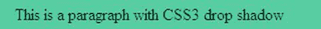

***图 8-1。**CSS3 阴影添加到彩色段落*

清单 8-1a 创建一个简单的彩色段落，两边有阴影。

***清单 8-1a。【css3-para-shadow.html】创建一个两边都有阴影的彩色段落***

`<!doctype html>
<html lang=en>
<head>
<title>This is a colored paragraph with CSS3 drop shadow</title>
<meta charset=utf-8>
<link rel="stylesheet" type="text/css" href="css3-para-shadow.css">
</head>
<body>

This is a paragraph with CSS3 drop shadow

</body>
</html>`

清单 8-1b 中的 CSS 代码创建了一个模糊半径为 4 像素的阴影，位于段落右侧 6 像素，下方 6 像素。

***清单 8-1b。**清单 8-1a 的 CSS 样式表(css3-para-shadow.css)*

`#para-shadow p { box-shadow: 6px 6px 8px #888; padding: 5px 5px 5px 15px; width:300px; 
background-color:#66FF99; color:black; font-weight:bold;
}`

图 8-2 显示了一张图片的 CSS3 阴影。本章中使用的科利河照片是由科林·海恩斯许可的。

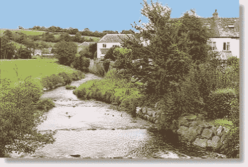

***图 8-2。**这个例子的 CSS3 给出了一个模糊半径为 5 像素的投影，位于图像右侧 6 像素，下方 6 像素。*

Internet Explorer 9、Mozilla Firefox、Safari 和 Opera 都支持这种 CSS3 框影。在清单 8-2a 中，CSS3 的目标是 **`
`** 为图片添加阴影。

***清单 8-2a。【css3-image2.html*****创建一个模糊半径为 5 像素的阴影**

**`<!doctype html>
<html lang=en>
<head>
<title>An image with a CSS3 drop shadow</title>
<meta charset=utf-8>
<link rel="stylesheet" type="text/css" href="css3-image1.css">
</head>
<body>
**
**

**
**
  
</body>
</html>`

清单 8-2b 针对包含阴影`id`的`
`。

***清单 8-2b。**清单 8-2a 的 CSS 样式表(css3-image1.css)*

`body { color: #fff;
}
#shadow { box-shadow: 6px 6px 6px #888; width: 296px; height:196px;
}`

CSS3 投影也可以产生白色边框，如图图 8-3 所示。

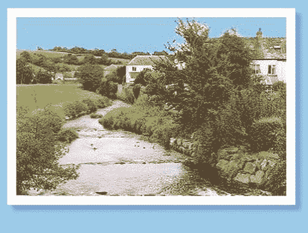

***图 8-3。**CSS3 代码给出了一个带有白色边框和阴影的图像，模糊半径为 6 个像素，位于图像右侧 6 个像素，下方 6 个像素。*

添加了背景色，以便您可以清楚地看到白色框架的顶部。阴影颜色可能需要调整以匹配背景颜色。在清单 8-3a 中，粗体显示的`
`是 CSS 样式表产生阴影的目标。

***清单 8-3a。【css3-image-whitebdr.html】在图像周围创建阴影和白色边框***

`<!doctype html>
<html lang=en>
<head>
<title>Image with CSS3 drop shadow and white border</title>
<meta charset=utf-8>
<link rel="stylesheet" type="text/css" href="css3-image-whitebdr.css">
</head>
<body>
**
**

**
**
</body>
</html>`

在清单 8-3b 中，白色边框是由粗体显示的标记创建的；这条线的其余部分产生了阴影。

***清单 8-3b。**清单 8-3a 的 CSS 样式表(css3-image-whitebdr.css)*

`body { background-color:#99CCFF;
}
#shadow-bdr { **background-color:#fff; padding:10px;** box-shadow: 6px 6px 6px #78b; 
              width: 296px;
}`

#### CSS3 四边形阴影

CSS3 box-shadow 模块可以通过零偏移和一个额外的属性来提供四边投影。典型的例子如图 8-4 所示。相关代码如清单 8-4a 和清单 8-4b 所示。

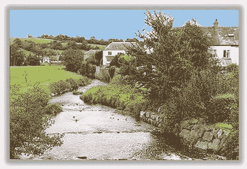

***图 8-4。**一个 CSS3 的四边落影*

***清单 8-4a。**在图像的四周放置阴影 **(** css3-image-4sides)*

`<!doctype html>
<html lang=en>
<head>
<title>Image with a 4 sided CSS3 drop shadow</title>
<meta charset=utf-8>
<link rel="stylesheet" type="text/css" href="css3-image-4side.css">
</head>
<body>

  
</body>
</html>`

在清单 8-4b 中，将粗体显示的样式(注意两个零)与前一个双边示例的样式进行比较。

***清单 8-4b。**清单 8-4a 的 CSS 样式表( css3-image-4sides.css)*

`body { color: #fff;
}
#shadow { margin:20px auto 0 auto;
}
#shadow { box-shadow: **0 0 6px 6px** #888; width: 298px; height:196px;
}`

#### CSS3 为文字投下阴影

这适用于除 IE 6、IE 7、IE 8、IE 9 和 IE 10 测试版之外的所有当前浏览器。在 Internet Explorer 中，影子代码将被忽略，文本将显示为图 8-5 。不要在同样苍白的背景上使用苍白的颜色，因为如果没有阴影，Internet Explorer 将无法清楚地显示文本。

***图 8-5。**在 IE 6、7、8、9 和 10(测试版)中查看文本时不显示阴影*

在 IE 6、IE 7、IE 8、IE 9 以外的浏览器中的效果如图 8-5b 所示。

***图 8-6。**CSS3 在 Mozilla、Opera、Safari 和 Chrome 中出现时会产生阴影*

清单 5a 和 5b 显示了图 8-5 和图 8-6 的 HTML 和 CSS 代码。在 CSS 清单 8-5b 中，在清单 8-5a 中以粗体显示的`
`是 CSS 样式表产生阴影的目标。

***清单 8-5a。【css3-text-shadow.html】对文本应用阴影**(**)***

`<!doctype html>
<html lang=en>
<head>
<title>This gives text with a CSS3 drop shadow</title>
<meta charset=utf-8>
<link rel="stylesheet" type="text/css" href="css3-text-shadow.css">
</head>
<body>
**
**
<h1>This is a CSS3 drop shadow on text</h1>
**
**
</body>
</html>`

在清单 8-5b 中，阴影是由粗体显示的标记创建的。

***清单 8-5b。**清单 8-5a 的 CSS 样式表(css3-text-shadow . CSS)*

`body {background-color:#99CCFF;
}
#banner h1 { color: #fff; padding: 50px 0 0 20px; margin: 0; font-size: 2.6em; 
**text-shadow: 0.1em 0.1em 0.2em black;**
}`

这转化为:阴影向右偏移 0.1 em，阴影在图像下方偏移 0.1 em，模糊半径 0.2 em，阴影颜色为黑色。

### 为 IE 7 和 IE 8 创建投影

因为 IE 7 和 IE 8 不支持 CSS3 投影，所以必须使用一种临时技术。有两种可能性:

1.  使用图形包为图像或文本添加投影。
2.  在背景中使用阴影背景图像。

#### 使用图形包

直到最近，在图形包中创建投影还是一个名副其实的障碍。下面描述了一些以前的包的典型过程。

1.  将图像加载到程序中。
2.  在四周添加 30 像素宽的边框。
3.  选择图层新建光栅图层。
4.  回到第一层。
5.  用魔棒点击新边框，用白色填充。
6.  单击选择并反转选择。
7.  选择效果 3D 效果投影。
8.  在下一个对话框中设置尺寸和不透明度。
9.  将图像移动到阴影上，直到您对外观满意为止。
10.  选择选择选择无。
11.  选择图层合并图层(展平)。
12.  裁剪顶部和左侧的白色边框。
13.  保存图像。

唷！结果是一个很好的投影，可以在 IE 7、IE 8 和所有更新的浏览器中看到，如图 8-7 所示。

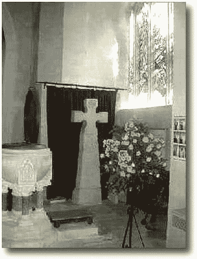

***图 8-7。**典型图形包产生的阴影*

大多数软件包都涉及到了对*层*和*选择*功能的处理。幸运的是，现在大多数程序都在简化程序并提供更好的指导。

我使用 GIMP 快速轻松地创建投影。这个免费的软件包充满了先进的功能，易于下载和安装。撰写本文时的最新版本是 GIMP 2.6 *。*你也可以下载一本精美的图文并茂的手册。该网站位于`[`www.gimp.org/downloads`](http://www.gimp.org/downloads)`

将使用 GIMP 的以下步骤与前面描述的过程进行比较:

1.  将图像加载到 GIMP 中。
2.  选择滤镜光影。
3.  单击投影。

就这样！没有摆弄层，没有选择。图 8-8 显示了用 GIMP 2.6 和更早版本添加投影的结果。

***图 8-8。**使用 GIMP 创建的阴影*

如果您使用不同的图形程序，请浏览帮助文件以获得关于投影的说明。我的另一个图形包附带的 500 页的手册中有一句关于阴影的无用的句子。如果你的程序有类似的手册，你可以通过访问与你的图形程序相关的论坛找到有用的建议。

图 8-9 显示了使用 GIMP 在文本上创建投影的结果。

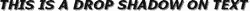

***图 8-9。** GIMP 可以在文本上创建阴影。*

尝试以下练习:

1.  打开 GIMP，点击文件新建。
2.  单击风景图标；将宽度设置为 500 像素，高度设置为 35 像素。
3.  点击工具箱中的**图标。**
4.  在工具箱中，单击“字体”旁边的图标。从下拉列表中，选择无粗斜体。
5.  选择字体的大小和颜色；让我们试试 24pt 黑色。编辑窗口中将出现一个文本框。
6.  输入文本，然后单击菜单上的过滤器。
7.  选择光线和阴影，然后选择投影。
8.  在下一个对话框中，尝试以下设置:
    *   偏移 x: 2
    *   偏移 y: 2
    *   模糊半径:2
    *   将颜色保留为默认黑色；将不透明度设置为 70%。
9.  点击确定。
10.  要保存文件，在“文件”菜单项中选择“另存为”，并将其保存为`.jpg`或`.png`图像。

#### 使用背景图片和 CSS2 创建阴影

背景阴影图像可以自动扩展和收缩，以适应各种图像尺寸。我非常感谢大约翰发表了这个 CSS2 技术的阴影。实现例 8-10 至 8-15 遵循他的技术。一定要在 [*http://* `www.positioniseverything.net`](http://www.positioniseverything.net) 访问大约翰的优秀网站(注意`.net`域名)。

这个网站对这种方法的工作原理有非常有用的解释。该网站也是 CSS 实用信息的宝库。

通过用包含阴影图像的`
`包围诸如段落或图像的块，该方法可以在两侧或四侧提供阴影。我们将从两边的阴影开始。

#### 使用 CSS2 背景阴影图像的双面阴影

图 8-10 显示了图像两侧的阴影。有两个，相关的代码示例显示在清单 8-10a 和清单 8-10b 中。

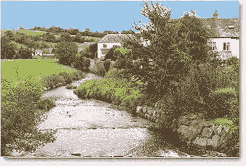

***图 8-10。**一个两边都有阴影的简单图像*

清单 8-10a 中的三个`
`持有三个阴影图像的一部分。这些由两个角阴影图像和主阴影图像组成。第四个`
`持图。这些`
`以粗体显示。

***清单 8-10a。**围绕一个两边都有阴影的图像。**(【two-shadowfig10.html】??)***

`<!doctype html>
<html lang=en>
<head>
<title>2 sided drop shadow Fig 8-10</title>
<meta charset=utf-8>
        *meta details go here*` `<link  rel="stylesheet" type="text/css" href="two-shadowfig10.css">
</head>
<body>
**
** **
** **
** **
** **** **        
**

</body>
</html>`

CSS 清单 8-10b 中的图 8-10 使用了三张背景图片，`top-rightcorner.png`、`bottom-leftcorner.png`和`main-shadow.png`。图 8-10 、 8-11 和 8-12 都使用相同的阴影图像。这些可以从这本书的网页上下载。使用 CSS 中的`position:relative;`将图片定位在背景阴影中。

***清单 8-10b。**清单 8-10a 的 CSS 样式表为**(**two-shadow fig 10 . CSS)*

`.top-right-corner { background:url(top-rightcorner.png) right top no-repeat; width: 305px;
}
.bottom-left-corner { background:url(bottom-leftcorner.png) left bottom no-repeat; 
padding-top:8px; padding-left:8px;
}
.shadowbox { background:url(main-shadow.png) bottom right;
}
.innerbox { position: relative; left:-8px; top:-3px;
}`

您可能需要稍微调整`.innerbox`位置，以确保不会出现白边；例如，起初我有这样的设置:`.innerbox { position:relative; left:-8px; top:-8px; }`，但是在图片的底部出现了一个像素的白边。通过改成`top:-7px`；，白边被移除。

在有白框的图像周围放置一个阴影，如图 8-11 所示。

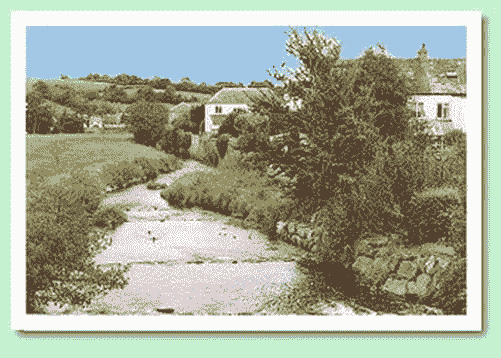

***图 8-11。**一个两边都有阴影和白色边框的图像*

这个例子有一个彩色的背景，这样可以清楚地看到白色边框的顶部和左侧。相关代码见下一个清单 8-11a 至 8-11d 。

##### 方法一:添加白色边框

图像必须首先给一个白色的边界。在本例中，使用图形程序添加了一个 10 像素的白色边框。然后图像以新名称`colrivblu-whitebdr.jpg`保存。这些边框将图像的尺寸增加了 20 个像素；新的尺寸是 318 像素× 216 像素，这些数字被仔细地记录下来，为下一步做好准备——清单 8-11a 。

***清单 8-11a。**添加阴影和白色边框**(【twoshad-whitebdr1.html】)***

`<!doctype html>
<html lang=en>
<head>
<title>Figure8-11\. Two sided drop shadow. Pic has whiteborder</title>
<meta charset=utf-8>
        *meta details go here*
<link  rel="stylesheet" type="text/css" href="twoshad-whitebdr1.css">
</head>
<body>
        

        

        

        

<!--set the new image dimensions for the new image-->
**

` `
Two sided shadow with white border

</body>
</html>`

***清单 8-11b。**清单 8-11a 的 CSS 样式表( twoshad-whitebdr1.css)*

`body { background-color:#CCFFCC; font:black arial medium;
}
.top-right-corner { background:url('img/top-rightcorner.png') no-repeat right top; 
                    width: 326px;
}
.bottom-left-corner { background:url('img/bottom-leftcorner.png') no-repeat left bottom; 
                        padding-top:8px; padding-left:8px;
}
.shadowbox { background:url('img/main-shadow.png') right bottom;
}
.innerbox { position: relative; left:-8px; top:-4px;
}`

##### 方法 2:使用 CSS 添加白色框架

带有现成边框的图像提供了一个解决方案，但是 CSS 可以用来添加白色边框。CSS 方法更可取，因为它加载速度更快，并且避免了使用画图程序添加边框的麻烦。然而，可能需要对样式表进行一些修改才能使其正确。

清单 8-11c 给出了与图 8-11 相同的外观。名为`.frame`的类被添加到图像中，以便添加白色边框；这以粗体显示。

***清单 8-11c。【使用类提供白色边框(twoshad-whitebdr2.html ??)】***

`<!doctype html>
<html lang=en>
<head>
<title>Two sided drop shadow and CSS white border</title>
<meta charset=utf-8>
<link  rel="stylesheet" type="text/css" href="twoshad-whitebdr2.css">
</head>
<body>

Two sided shadow with white border

</body>
</html>`

HTML 中使用了类`.frame`来定位图像，以便添加白色边框。这个新行`img.frame { border:10px white solid; }`被添加到 CSS 清单 8-11d (以粗体显示)。

***清单 8-11d。**定义类的 CSS 样式表。`innerbox`**(**two shad-white BDR 2 . CSS)*

`body { background-color:#CCFFCC; font:black arial medium;
}
.top-right-corner { background:url('img/top-rightcorner.png') no-repeat right top; 
width: 326px;
}
.bottom-left-corner { background:url('img/bottom-leftcorner.png') no-repeat left bottom; 
                        padding-top:8px; padding-left:8px;
}
.shadowbox { background:url('img/main-shadow.png') right bottom;
}
.innerbox { width:298px; **height:216px;** position: relative; left:-8px; top:-8px;
}
**img.frame { border:10px white solid;**
}`

#### CSS2 文本的双面阴影

图 8-12 显示了给文本块添加阴影的效果。

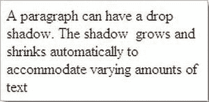

***图 8-12。**一个段落的双面投影可以使用与图像相同的技术来实现。*

清单 8-12a 中的 HTML 与之前的项目几乎相同，除了使用了一段文本而不是一张图片。

***清单 8-12a。【two-shadowtext.html】在文本块周围放置双面投影***

`<!doctype html>
<html lang=en>
<head>
<title>Paragraph with 2 sided drop shadow</title>
<meta charset=utf-8>
<link rel="stylesheet" type="text/css" href="two-shadowtext.css">
</head>
<body>

A paragraph can have a drop shadow. The shadow grows and shrinks 
automatically to accommodate varying amounts of text
` `

</body>
</html>`

图 8-12 在文本和段落内容框之间有 5 个像素的填充。这在下一个清单中以粗体显示。200 像素宽的内容加上左右填充给出了 220 像素的总宽度，这被添加到了`top-right-corner`的样式中(在清单 8-12b 中以粗体显示)。文本块被赋予一条细的银色边框，这样顶部和左侧的边缘清晰可见。

***清单 8-12b。**清单 8-12a 的 CSS 样式表(two-shadow text . CSS)*

`body { background-color:#FFF; font:black arial medium;
}
.top-right-corner { background:url('img/top-rightcorner.png') no-repeat right top; 
                    **width:220px;**` `}
.bottom-left-corner { background:url('img/bottom-leftcorner.png') no-repeat left bottom; 
                      padding-top:8px; padding-left:8px;
}
.shadowbox { background:url('img/main-shadow.png') right bottom;
}
.innerbox { position: relative; left:-8px; top:-8px;
}
.innerbox p { margin:0; padding:5px; width:200px; border:1px silver solid;
}`

#### CSS2 四边阴影

使用 CSS 背景图片可以在图片的四周放置阴影。较宽的背景阴影可能看起来不太真实，因为拐角处的阴影半径对于尖角图片的阴影来说可能显得太大。

图 8-13 和图 8-14 显示了两种不同阴影宽度的效果。

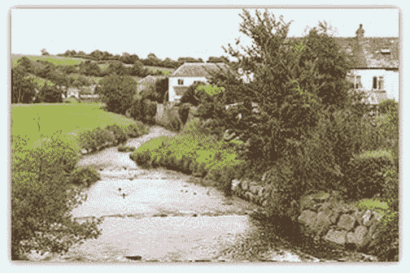

***图 8-13。**窄窄的四面垂影*

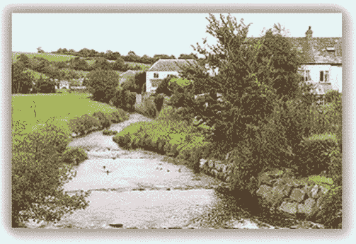

***图 8-14。**四面广坠影*

图 8-13 、 8-14 和 8-15 仅使用一个矩形阴影图像。

 **提示**可以从书的网页上下载有限数量的投影图像，或者你可以使用图形处理软件包创建自己的图像。投影图像必须是透明的`.png`文件。

清单 8-13a 有四个`
`并再次使用 CSS 背景图片属性。`
` s 的定位及其关闭的`
` s 极其重要。这个 10 像素阴影的例子最适合 XHTML 列表。阴影在所有现代浏览器中都可以工作，但在 IE 6 或 IE 7 中不能正确显示。

 **注意**在清单中，`corner a`是右上角，`corner b`是左下角。

***清单 8-13a。用四个 10 像素宽的阴影包围一幅图像****(【fourside-drop10px.html】)***

`<!DOCTYPE html PUBLIC "-//W3C//DTD XHTML 1.0 Transitional//EN" "http://www.w3.org/TR/xhtml1/DTD/xhtml1-transitional.dtd">
<html >
<head>
<meta content="text/html; charset=utf-8" http-equiv="Content-Type" />

<title>A 10 pixel wide drop shadow on 4 sides</title>
        *meta content goes here…*
<link  rel="stylesheet" type="text/css" href="fourside-drop10px.css">
</head>
<body>
        **
**
**                

**
**                

**
        **
**
        **
**
        **
**

        **
**
        **
**
        **
**
        **
**
</body>
</html>`

清单 8-13b 使用单一矩形阴影图像、`shadow10p.png`和 CSS 定位。

***清单 8-13b。**清单 8-13a 的 CSS 样式表( fourside-drop10px.css)*

`.shadow-one { position:absolute; padding-top:20px; padding-left:20px;
}` `.corner-a { position:absolute; right:0; top:0; width:20px; height:20px; 
            background:url('img/shadow10p.png') right top no-repeat;
}
.corner-b { position:absolute; left:0; bottom:0; width:20px; height:20px; 
            background:url('img/shadow10p.png') left bottom no-repeat;
}
.shadow-two { position:relative; background :url('img/shadow10p.png') 
              right bottom no-repeat;
}
.shadow-three { position:relative; left:-20px; top:-20px; 
                background:url('img/shadow10p.png') left top no-repeat;
}
.shadow-four { position:relative; left:10px; top:10px;
}`

 **注意**在图 8-13 中，`.png`图像上阴影区域的宽度为 10 像素。CSS 清单中的 20 像素尺寸是`.png`阴影宽度的两倍。阴影四与`.png`阴影区域的宽度相同(10 像素)。

在图 8-14 的中显示了一个更宽的阴影。清单 8-14a 有四个`
`并再次使用 CSS 背景图片属性。`
` s 的定位及其关闭的`
` s 极其重要。阴影最好使用 XHTML 而不是 HTML5。该阴影可以在所有现代浏览器中查看，包括 IE 8，但它不能在 IE 6 或 IE 7 中正确显示。

***清单 8-14a。【fourside-drop30px.html】在四边放置一个 30 像素宽的阴影***

`<!DOCTYPE html PUBLIC "-//W3C//DTD XHTML 1.0 Transitional//EN" "http://www.w3.org/TR/xhtml1/DTD/xhtml1-transitional.dtd">
<html >
<head>
<meta content="text/html; charset=utf-8" http-equiv="Content-Type" />
<title>Wider drop shadow on 4 sides</title>
<link rel="stylesheet" type="text/css" href="fourside-drop30px.css" />
</head>
<body>
**        
**
**                

**
**                

**
**        
**
**        
**
**        
**

        **
**
        **
**
        **
**
        **
**
</body>
</html>`

CSS 清单 8-14b 使用单一矩形阴影图像、`shadow30p.png`和 CSS 定位。

***清单 8-14b。**清单 8-14a 的 CSS 样式表*

`.shadow-one { position:absolute; padding-top:60px; padding-left:60px;
}
.corner-a { position:absolute; right:0; top:0; width:60px; height:60px; 
            background:url('img/shadow30px.png') right top no-repeat;
}
.corner-b { position:absolute; left:0; bottom:0; width:60px; height:60px; 
            background:url('img/shadow30px.png') left bottom no-repeat;
}
.shadow-two { position:relative; background :url('img/shadow30px.png') 
              right bottom no-repeat;
}
.shadow-three { position:relative; left:-60px; top:-60px; 
                background:url('img/shadow30px.png') left top no-repeat;
}
.shadow-four { position:relative; left:30px; top:30px;
}`

 **注意**在图 8-14 中，`.png`图像上阴影区域的宽度为 30 像素。60 像素的尺寸是`.png`阴影宽度的两倍。阴影四与`.png`阴影区域的宽度相同(30 像素)。

#### 段落周围的四边阴影

通过使用投影，可以使段落看起来好像漂浮在页面表面上。图 8-15 显示了一个没有边框但被阴影包围的段落。

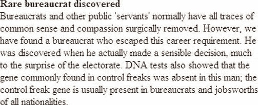

***图 8-15。**在一段文字周围放置四边阴影时，使用一个段落，并给段落一个宽度，这样阴影就有东西可以附着。*

该过程与之前的项目完全相同，但使用了一个段落而不是一张图片(见清单 8-15a 和 8-15b )。

***清单 8-15a。**将阴影应用到文本块的四边**(**shadow-paragraph.html)*

`<!doctype html>
<html lang=en>
<head>
<title>Paragraph with shadow round all four sides</title>
<meta charset=utf-8>

<link rel="stylesheet" type="text/css" href="shadow-paragraph.css">

</head>
<body>

**        
**
**               

**
**               

**
**        
**
**        
**
**        
**

<b>Rare bureaucrat discovered</b> Bureaucrats and other public &#39;servants&#39; 
        *…some text has been ommitted from this markup to save space…*
present in bureaucrats and jobsworths of all nationalities.
<!-- close paragraph-->
        **
**
        **
**
        **
**
        **
**

</body>
</html>`

***清单 8-15b。**清单 8-15a 的 CSS 样式表( shadow-paragraph.css)*

`/*SET 4 SIDED SHADOW*/
.shadow-one { position:absolute; padding-top:60px; padding-left:60px;
}
.corner-a { position:absolute; right:0; top:16px; width:60px; height:60px; 
background:url('img/shadow30px.png') right top no-repeat;
}
.corner-b { position:absolute; left:0; bottom:16px; width:60px; height:60px; 
background:url('img/shadow30px.png') left bottom no-repeat;
}
.shadow-two { position:relative; 
background :url('img/shadow30px.png') right bottom no-repeat;}
.shadow-three { position:relative; left:-60px; top:-60px; 
background:url( 'img/shadow30px.png' ) left top no-repeat; }
.shadow-four {position:relative; left:30px; top:30px; }
#wrapper { width:420px;
}
p {width:400px; padding:10px;
}`

#### 排除清单 8-13 至清单 8-15 中的阴影

如果你对刚才讨论的阴影有任何问题，这部分的信息应该可以帮助你。对于初学者，总是从拐角 *a* 和拐角 *b* 的高度设置为零开始，如下所示:

`.corner-a {position:absolute; right:0; **top:0;** width:60px; height:60px; 
background:url('img/shadow30px.png') right top no-repeat;
}
.corner-b {position:absolute; left:0; **bottom:0;** width:60px; height:60px; 
background:url('img/shadow30px.png') left bottom no-repeat;
}`

> 角 *a* 是一个盒子的右上角；角 *b* 是一个盒子的左下角。零位设置导致拐角 *a* 和 *b* 出现问题，如图图 8-16 所示。

`.corner-a { position:absolute; right:0; top:16px; width:60px; height:60px; 
background:url('img/shadow30px.png') right top no-repeat;
}
.corner-b { position:absolute; left:0; bottom:16px; width:60px; height:60px; 
background:url('img/shadow30px.png') left bottom no-repeat;
}`

图 8-16 显示了故障角 *a* 和 *b* 。

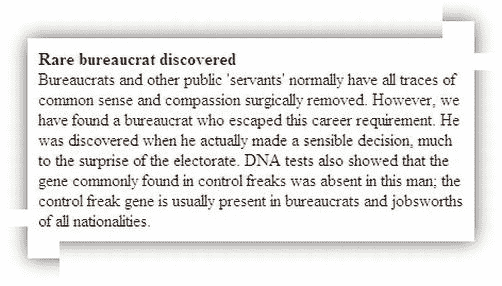

***图 8-16。** A 角和 b 角的问题*

##### 纠正故障

通过反复试验，改变角点 *a* 和 *b* 的顶部和底部像素。在本例中，解决方案是将零点改为 16 像素。

`.corner-a { position:absolute; right:0; **top:16px;** width:60px; height:60px; 
background:url('img/shadow30px.png') right top no-repeat;
}
.corner-b { position:absolute; left:0; **bottom:16px;** width:60px; height:60px; 
background:url('img/shadow30px.png') left bottom no-repeat;
}`

### *。* png 阴影图像

哪里可以获得`.png`阴影图像？少量可以从大约翰的网站上下载(`[www.positioniseverything.net](http://www.positioniseverything.net)` ) *。*我在这本书的网页下载包里放了一些阴影。你可以使用免费的 GIMP 图形程序设计自己的`.png`阴影图像。这些指令相当复杂，但是您不需要在使用其他一些包时所必需的插件。关于 GIMP 的信息可以在 http://www.gimp.org/获得，你也可以从 GIMP 网站下载程序和帮助文件。

#### 创建*。*GIMP 中的 png 阴影图片

这个部分的目的是在一个空的矩形周围产生一个四边的阴影。

1.  打开 Gimp，点击文件新建。
2.  在下一个对话框中，单击高级选项。
3.  单击左侧图标(位于高度选项下方)选择纵向。指定所需阴影的大小(例如 640 像素宽× 400 像素高)。在色彩空间字段中，选择灰度(它具有英国英语拼写)。
4.  Select Fill With  Transparency, then click OK. The empty image is created; it is covered with a checkerboard pattern that denotes transparency. Figure 8-17 shows the GIMP’s Toolbox window. 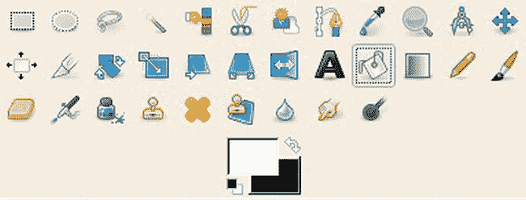

    ***图 8-17** 。GIMP 的工具箱窗口。白色样本与黑色样本重叠。*

5.  现在选择白色，单击弯曲的双箭头，以确保白色方块与黑色方块重叠。顶部颜色代表填充颜色，而黑色(位于所选的下部颜色上)是背景颜色。在工具箱窗口中，单击桶填充图标。单击白色方块，然后返回到棋盘图像，并左键单击它使其变成白色。
6.  点击图层新建图层。确保选中透明度单选按钮，接受所有默认设置，然后单击确定。
7.  在菜单中，单击窗口可停靠对话框图层对话框。这将在屏幕上出现一个对话框，显示层。
8.  确保棋盘格图案的图层总是被选中(当它被选中时会有一个浅色背景；未选择的层将是白色的)。

现在我们将决定阴影图像的宽度，假设它是 20 像素。

1.  点击选择全部。现在你会看到虚线轮廓像一排行进的蚂蚁一样移动。
2.  点击选择缩小。一个对话框将允许您选择图像的缩小量；假设是 30 像素。
3.  确保勾选了标记为“从图像边框收缩”的框。单击确定。
4.  现在你会看到内部和外部图像有虚线边框。只有内在的形象才会有行进的蚂蚁。点击滤镜光影投影。
5.  在对话框中，将偏移设置为零，模糊半径为 20 像素，不透明度为 70。
6.  Make sure the box labeled Allow Resizing is unchecked. Click OK. You will see a third layer, called Drop Shadow, has appeared; just ignore it. The docked Layers window is illustrated in Figure 8-18. 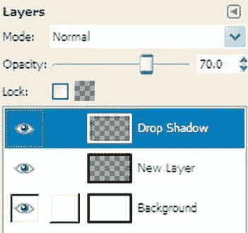

    ***图 8-18。**GIMP 图层对话框*

7.  **不要保存它，**但是在图层对话框中点击与背景图层相关的眼球。现在你可以在编辑面板中看到投影，棋盘再次显露出来。
8.  点击文件另存为，选择保存位置。*在对话框的顶部*，给文件命名，并确保通过在文件名中添加`.png`来包含文件类型(例如:`mydropshadow.png`)。
9.  点击*保存*按钮。将弹出一个标有导出文件的对话框。确保选中标记为“合并可见层”的单选按钮。然后单击导出按钮。接受下一个对话框中的默认设置，然后单击保存按钮。

这样创建的阴影图像可用于之前的背景阴影图像示例中，并且可对其进行切片，以给出本节稍后所需的图像 8-21a 、 8-21b 和 8-21c 。尝试各种尺寸，但始终包括偏移的两个零。最终你可以创建一个阴影尺寸库；请记住，当阴影收缩或膨胀以填充`
`时，较大的阴影尺寸可用于较小的图像。但是，如果您对其周围的图像使用过小的阴影，它将隐藏在图像后面。我们刚刚创建的阴影如图 8-19 所示。

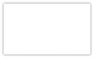

***图 8-19。**使用 GIMP 创建的阴影*

#### 在网页的主面板周围添加阴影

本例中的技术最适用于固定宽度的布局，但是使用`.png`阴影图像来缩放以匹配框元素，半流动页面也是可能的。图 8-20 显示了一个固定宽度页面的四边都有阴影的整页。

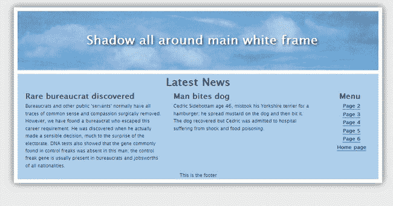

***图 8-20。**阴影环绕整个页面的白色边框。这适用于所有浏览器。*

 **注意**通过使用新的 CSS3 模块，在标题面板的白色字体上添加了阴影。清单 8-20 、 8-22 和 8-23 中的 CSS3 文本阴影在 Internet Explorer 6、7、8 和 9 中不工作。IE 6 中的`.png`阴影是不透明的。

清单 8-20a 适用于 960 像素的固定宽度和 1024 像素水平分辨率的屏幕。使用的阴影宽度和深度为 1024 像素。

***清单 8-20a。【shadow-fullpage.html】在网页边框周围创建阴影***

`<!DOCTYPE html>
<html lang=en>
<head>
<title>Complete page with shadow around wrapper</title>
<meta charset=utf-8>
<link rel="stylesheet" type="text/css" href="shadow-fullpage.css" />
        <!--Add conditional Javascript for IE 7 and 8-->
        <!--[if lte IE 8]>
        <![endif]-->
</head>
<body>
**        
**
                **

**
                **

**` `        **
**
        **
**
        **
**

<header><h1>Shadow all around main white frame</h1></header><!-- close banner-->

<!--this panel will contain two columns-->
<h2>Latest News
</h2>
<article>
        <h3>Rare bureaucrat discovered</h3>
        
Bureaucrats and other public &#39;servants&#39; normally have all traces of common
                *Some of the text has been omitted here to save space*
        and jobsworths of all nationalities.

</article><!--close left col-->
<article>
        <h3>Man bites dog</h3>
        
Cedric Sidebottam age 46, mistook his Yorkshire terrier for a hamburger; he
        spread mustard on the dog and then bit it.&nbsp; The dog recovered but Cedric
        was admitted to hospital suffering from shock&nbsp;and food poisoning.

        
&nbsp;

</article><!-- close right col-->
<nav>
        <h2>Menu</h2>
        <ul>
        <li><a href="#">Page 2</a></li>
        <li><a href="#">Page 3</a></li>
        <li><a href="#">Page 4</a></li>
        <li><a href="#">Page 5</a></li>
        <li><a href="#">Page 6</a></li>
        <li><a href="#">Home page</a></li>
        </ul>
</nav><!-- close menupanel-->

<!-- close mainContent-->
<footer>This is the footer
</footer>
        **
**<!-- close wrapper -->
<!--close the four shadow divs-->
**        
**
**        
**
**        
**
**        
**
</body>
</html>`

***清单 8-20b。**清单 8-20a 的 CSS 样式表( shadow-fullpage.css)*

`body { text-align: center; background: #e6e6e6;
}
/*add display attributes for the semantic tags*/
header, footer, section, article, nav { display:block;
}
#wrapper { margin: -20px auto 0 auto; width: 940px; border:10px white solid; padding:0;
}` `header { width: 940px; height: 154px; margin: 0; border-bottom:10px white solid; 
background: url(img/bluepan.jpg);
}
article { margin-left:10px; width:40%; display:inline; float:left; text-align:left;
}
#mainContent {margin:0; width: 940px; float: left; background-color:#aac9f6;
}
nav { width: 120px; margin-right:10px; padding: 0 5px 5px 0; float: right;
}
footer { margin:0; text-align:center; clear: both; background-color:#aac9f6;
}
br.clear { clear:both;
}
body { font: 76%/1.6 "Lucida Grande", Geneva, Verdana, sans-serif;
}
a { font-weight: bold; color: navy; text-decoration: none; border-bottom: 1px solid navy;
}
a:hover {color:#906; border-bottom: 1px solid #906;
}
header h1 { color: #fff; padding: 50px 0 0 20px; margin: 0; font-size: 2.6em; 
                text-shadow: 0.1em 0.1em 0.2em black;
}
h2, h3, h4 { margin-top: 0; color: black; font-weight: bold;
}
h2 { font-size: 2.2em; margin-bottom:0;
}
h3, nav h2 { font-size: 1.6em; margin-bottom:0;
}
h4 { font-size: 1.2em; margin-bottom:0;
}
p { margin-top:0; margin-bottom:6px;
}
#mainContent p, #mainContent h2, #mainContent h3, #mainContent h4, #mainContent ul, 
{ margin-left: 10px; margin-right: 10px; background-color:#aac9f6;
}
nav ul, nav ul li { list-style: none; margin: 0 0 2px 10px; padding: 0;
}
/*SET 4 SIDED SHADOW STYLES*/
.shadow-one {position:absolute; padding-top:60px; padding-left:60px;
}
.corner-a {position:absolute; right:0; top:-20px; width:60px; height:60px; 
background:url('img/shadow30px.png') right top no-repeat;
}
.corner-b {position:absolute; left:0; bottom:0; width:60px; height:60px; 
background:url('img/shadow30px.png') left bottom no-repeat;
}
.shadow-two { position:relative; 
background:url('img/shadow30px.png') right bottom no-repeat;
}
.shadow-three { position:relative; left:-60px; top:-60px; 
background:url('img/shadow30px.png') left top no-repeat;
}
.shadow-four { position:relative; left:30px; top:30px;
}`

 **谨慎**这种方法虽然有效，但是有一个很大的弊端。此页面的垂直长度受到您选择的阴影图像尺寸的限制。图 8-7 中使用的 1024 像素阴影将页面的垂直高度限制为 980 像素，内容面板的垂直高度限制为 780 像素。在主页上不会有问题，主页不应该超过浏览器窗口的高度；但这可能会严重妨碍后续页面。

#### 克服身高限制

有以下三种解决方案可供选择:

> *   Use a larger shadow image. This will mean finding or creating a larger shadow image; However, even if the vertical height is extended, it will still be limited.
> *   Use slice shadow images.
> *   Use shadows on both sides; No top or bottom shadows.

##### 使用切片阴影图像

这个例子改编自安迪·巴德( [` `www.andybudd.com``](http://www.andybudd.com) )为《博客设计解决方案》(编辑之友，2006)一书创建的模板。这个例子是一个 800 × 600 的屏幕，虽然对于今天的屏幕来说太小了，但它可以用来演示这项技术。使用更大的阴影文件，它可以适应大屏幕和高分辨率。

图 8-22a 到 8-22c 显示了使用绘画程序分割成三个项目的阴影图像。

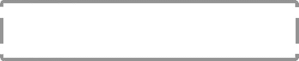

***图 8-21a、8-21b、8-21c。【标签为 top-shadow.png、middle-shadow.png 和 bottom-shadow.png 的 ***

在此示例中，切片的高度如下:顶部切片为 20 像素，中间切片为 64 像素，底部切片为 20 像素。图 8-22 中的截图展示了一个可扩展阴影的工作示例。

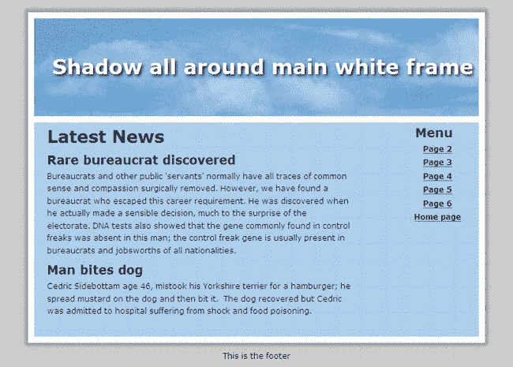

***图 8-22。**垂直延伸到任何高度的阴影*

顶部和底部的阴影是固定的。在清单 8-22a 中，CSS 样式表让包装器应用侧面阴影。

***清单 8-22a。**在网页边框周围放置可延伸的阴影**(【shadow-fullpage-extendable.html】??)***

`<!doctype html>
<html lang=en>
<head>
<title>Complete page with extendable shadow around wrapper</title>
<meta charset=utf-8>
<link rel="stylesheet" type="text/css" href="shadow-fullpage-extendable.css">
        <!--Add conditional Javascript for IE7 and 8-->
        <!--[if lte IE 8]>
        <![endif]-->
</head>
<body>
**
<!--place top shadow on page-->
<!-- close top -->**
**
<!--surrounds all elements below the top shadow-->**
<header><h1>Shadow all around main white frame</h1></header><!-- close banner-->` `
<!--this panel will contain two columns-->
<!--
-->

<h2>Latest News</h2>
<h3>Rare bureaucrat discovered</h3>

Bureaucrats and other public &#39;servants&#39; normally have all traces of common
                *some text omitted here to save space*
usually present in bureaucrats and jobsworths of all nationalities.

<h3>Man bites dog</h3>

Cedric Sidebottam age 46, mistook his Yorkshire terrier for a hamburger; he 
spread mustard on the dog and then bit it.&nbsp; The dog recovered but Cedric 
was admitted to hospital suffering from shock&nbsp;and food poisoning.

&nbsp;

<!-- close leftcol-->
<nav> 
   <ul><h3>Menu</h3>
        <li><a href="#">Page 2</a></li>
        <li><a href="#">Page 3</a></li>
        <li><a href="#">Page 4</a></li>
        <li><a href="#">Page 5</a></li>
        <li><a href="#">Page 6</a></li>
        <li><a href="#">Home page</a></li>
   </ul><!-- close links-->
</nav><!-- close menupanel-->

<!-- close mainContent -->
 
**
<!-- close wrapper -->**
**

<!-- open and close bottom shadow-->**
<footer>This is the footer</footer><!--open and close footer -->
</body>`

侧面阴影切片垂直重复以匹配包装的长度；这在清单 8-22b 中通过将包装器作为目标来实现。

***清单 8-22b。**清单 8-22a 的 CSS 样式表(shadow-full page-extended . CSS)*

`/*This css template is derived from a template created by Andy Budd (www.andybudd.com) 
for the book "Blog Design Solutions", and is released under a Creative Commons 
Attribution-NonCommercial-ShareAlike 2.5 License*/
body { margin: 0; padding: 0; text-align: center; background: #e6e6e6; 
font: 76%/1.6 "Lucida Grande", Geneva, Verdana, sans-serif;
}
/*add display attributes for the semantic tags*/
header, footer, section, article, nav { display:block;
}
#wrapper, #top, #bottom { margin: 0 auto; padding: 0 10px; width: 720px;
}
**/*apply shadows*/**
**#wrapper { background: url(img/middle.png) repeat-y;**
**}**
**#top { height: 20px; margin-top: 20px; background: url(img/top.png) no-repeat;**
**}**
**#bottom { height: 20px; background: url(img/bottom.png) no-repeat;**
}` `header { width: 700px; height: 154px; margin: 0; margin-left:10px; 
border-bottom:10px white solid; background: url(img/bluepan.jpg);
}
#leftcol { margin: 0 10px; display:inline; /* fix IE double margin float bug */
float: left; width: 500px; text-align:left;
}
#mainContent {margin:0 0 0 10px; border:0 10px 0 10px white solid; width: 700px; 
float: left; background-color:#aac9f6;
}
nav { width: 140px; margin-right:10px; padding: 0 5px 5px 0; float: right;
}
footer { margin:0; text-align:center; clear: both;
}
br.clear { clear:both;
}
a { font-weight: bold; color: navy; text-decoration: none; border-bottom: 1px solid navy;
}
a:hover {color:#906; border-bottom: 1px solid #906;
}
header h1 { color: #fff; padding: 50px 0 0 20px; margin: 0; font-size: 2.6em; 
        text-shadow: 0.1em 0.1em 0.2em black;
}
h2, h3, h4 { margin-top: 0; color: navy; font-weight: bold;
}
h2 { font-size: 2.2em; margin-bottom:0;
}
h3, nav h2 { font-size: 1.6em; margin-bottom:0;
}
p { margin-top:0; margin-bottom:6px;
}
#mainContent p, #mainContent h2, #mainContent h3, #mainContent h4, #mainContent ul, 
#mainContent ol { margin-left: 10px; margin-right: 10px
}
nav ul li { list-style: none; margin:0; padding: 0;
}
</html>`

#### 仅在包装纸的侧面使用阴影

对于这种技术，包装器必须接触浏览器窗口的顶部。如果可能的话，尽量让包装的底部接触到浏览器窗口的底部。

图 8-23 显示了带有侧阴影的页面。

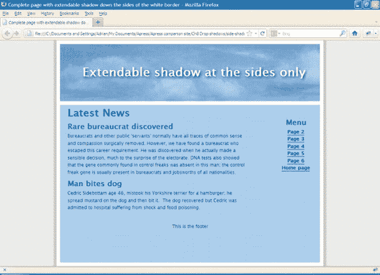

***图 8-23。**仅添加到网页侧面的阴影*

在清单 8-23a 中，顶部和底部阴影位置被省略，包装器通过 CSS 表单中的顶部边距移动到页面顶部。在清单 8-23b 中，CSS 让包装器将侧面阴影放置为垂直重复的图块。

***清单 8-23a。【side-shadow-fullpage-extendable.html 仅在网页侧面添加阴影***

`<!doctype html>
<html lang=en>
<head>
<title>Complete page with extendable shadow down the sides of the white border</title>
<meta charset=utf-8>
<link rel="stylesheet" type="text/css" href="side-shadow-fullpage-extendable.css">
        <!--Add conditional Javascript-->
        <!--[if lte IE 8]>
        <![endif]-->
</head>
<body>
**
**` `<header><h1>Extendable shadow at the sides only</h1></header><!-- close banner-->

<h2>Latest News</h2>
<h3>Rare bureaucrat discovered</h3>

Bureaucrats and other public &#39;servants&#39;
        *some text has been omitted to save space*
 usually present in bureaucrats and jobsworths of all nationalities.

<h3>Man bites dog</h3>

Cedric Sidebottam age 46, mistook his Yorkshire terrier for a hamburger; he
spread mustard on the dog and then bit it.&nbsp; The dog recovered but Cedric
was admitted to hospital suffering from shock&nbsp;and food poisoning.

&nbsp;

<!-- close leftcol-->
<nav> 
   <ul><h3>Menu</h3>
        <li><a href="#">Page 2</a></li>
        <li><a href="#">Page 3</a></li>
        <li><a href="#">Page 4</a></li>
        <li><a href="#">Page 5</a></li>
        <li><a href="#">Page 6</a></li>
        <li><a href="#">Home page</a></li>
   </ul><!-- close links-->
</nav><!-- close menupanel-->
<footer>This is the footer</footer><!-- close footer -->

<!-- close mainContent -->
 
**
<!-- close wrapper -->**

</body>
</html>`

***清单 8-23b。**清单 8-23a 的 CSS 样式表(side-shadow-full page-extended . CSS)*

`/*This css template is adapted from a template created by Andy Budd (www.andybudd.com) 
for the book"Blog Design Solutions", and is released under a Creative Commons Licence*/
body { margin: 0; padding: 0; text-align: center; background: #e6e6e6; 
font: 76%/1.6 "Lucida Grande", Geneva, Verdana, sans-serif;
}
/*add display attributes for the semantic tags*/
header, footer, section, article, nav { display:block;
}
#wrapper{ margin: 0 auto -20px auto; padding: 0 10px; width: 720px; clear:both;
}
**/*apply drop shadows to sides*/**
**#wrapper { background: url(img/middle.png) repeat-y;**
}
header { width: 700px; height: 154px; margin: 0; margin-left:10px; 
background: url(img/bluepan.jpg); border-top:10px white solid;
}
#leftcol { margin: 0 10px; display:inline; /* fix IE double margin float bug */
                float: left; width: 500px; text-align:left;
}` `#mainContent {margin:0; width: 700px; float: left; background-color:#aac9f6; 
border:10px white solid; min-height:425px;
}
nav { width: 140px; margin-right:10px; padding: 0 5px 5px 0; float: right;
}
footer { margin:0; text-align:center; clear: both; background-color:#aac9f6;
}
br.clear { clear:both;
}
a { font-weight: bold; color: navy; text-decoration: none; border-bottom: 1px solid navy;
}
a:hover {color:#906; border-bottom: 1px solid #906;
}
header h1 { color: #fff; padding: 50px 0 0 20px; margin: 0; font-size: 2.6em; 
                text-shadow: 0.1em 0.1em 0.2em black;
}
h2, h3, h4 { margin-top: 0; color: navy; font-weight: bold;
}
h2 { font-size: 2.2em; margin-bottom:0;
}
h3, nav h2 { font-size: 1.6em; margin-bottom:0;
}
p { margin-top:0; margin-bottom:6px;
}
#mainContent p, #mainContent h2, #mainContent h3, #mainContent h4, #mainContent ul, 
#mainContent ol {margin-left: 10px; margin-right: 10px
}
nav ul li { list-style: none; margin:0; padding: 0;
}`

### 使用形状拼贴软件

这个软件可以产生很好的边框和阴影，如图图 8-24 所示。

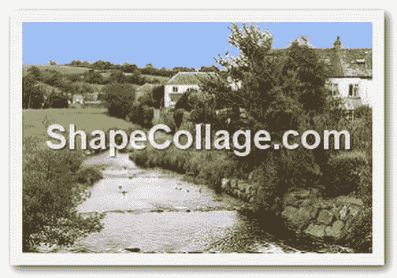

***图 8-24。**在形状拼贴中创建的阴影和白色边框*

可以从 [*http://* `www.shapecollage.com`](http://www.shapecollage.com) 下载形状拼贴的免费试用版。它可以产生有或没有白框的阴影，如左图 8-25 所示。

如果在探索之后，你认为它可能有用，你可以花大约 29 美元(26 英镑)购买它，然后你将能够制作没有水印的图像，以及解锁几个额外的功能。顾名思义，该程序还可以创建拼贴画。

我发现形状拼贴一开始很难使用。以下是测试免费试用版的基本指南。

1.  在打开形状拼贴之前，请记下以下信息:
    *   需要投影的图像的大小。
    *   图像在硬盘上的位置。
    *   您打算放置已完成图像的网页的背景颜色。
2.  打开形状拼贴，然后关闭 nag 屏幕。
3.  在下一个面板上，在“形状选择矩形”下，将拼贴大小设置为比图像宽度宽大约 50 %,并将高度设置为比图像高度大大约 50%。
4.  在所示的示例中，图像宽 296 像素，高 196 像素。我把拼贴尺寸设为 450 × 300。
5.  在“照片大小”下，单击“手动”，并将实际图像大小设置为 296 像素。
6.  在“照片”下，将数量更改为 1。
7.  单击外观选项卡。
8.  在背景字段中，单击白色字段。您将看到一个颜色选择器。选择网页的背景颜色。
9.  用同样的方法选择边框颜色。将默认边框宽度保留为 3.3%。如果不希望图片周围有边框，请将其更改为零。
10.  单击高级选项卡并选择旋转为无和 0，0。
11.  对于阴影偏移，选择 1。
12.  点击文件添加文件。
13.  导航到文件的位置并选择它，然后点按“好”。
14.  你将回到主屏幕。在中央面板的底部，单击“创建”按钮。
15.  在下一个屏幕上，您可以选择一个文件夹并命名文件。你可以选择三种文件格式`.jpg`、`.png`或`.psd` (Photoshop 文件)。
16.  单击保存。
17.  会出现一个小弹出窗口，询问您想要什么质量。默认就可以了，所以单击 Save。

### 总结

在这一章中，你学习了几种创建阴影的方法，使你的图片和文本块看起来像浮在页面上。本章首先描述了新的 CSS3 盒阴影模块，你学习了如何应用 CSS3 阴影到图像和文本。然后，因为 IE 7 和 IE 8 不支持 CSS3 框阴影，有人建议可以使用图形包来应用投影。特别是，GIMP 2.6 被推荐为一个免费的综合程序，具有极其简单的投影功能。然后演示了一种替代方法；它使用了阴影背景图像，可以在所有现代浏览器和 IE 8 中看到。

在下一章，你将学习几种创建拼贴画的方法，以及如何构建一个带标题的图片库。**