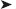
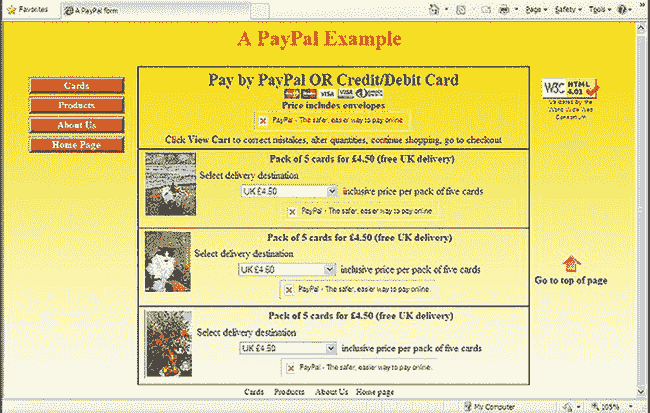
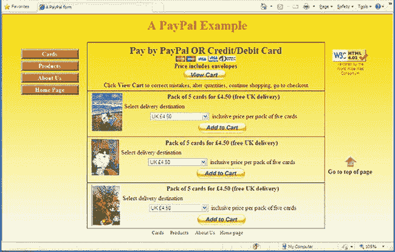
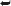
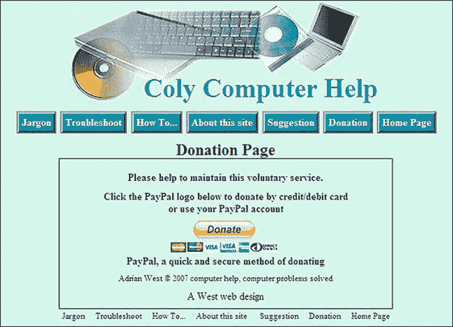
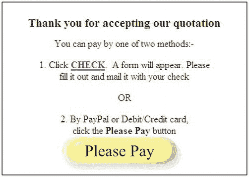

# 十、添加 PayPal

支付商品和服务的 PayPal 系统非常受欢迎，非常安全，受到大多数用户的信任。自从 PayPal 增加了使用信用卡/借记卡的功能，这项服务蓬勃发展，现在它是最被接受的支付和接收付款、订阅或捐款的方法之一。

PayPal 支付系统可以很容易地集成到网页中，这样人们就可以支付商业网站上提供的商品和服务。起初，你可能会对建立一个 PayPal 账户感到紧张，因为你在和钱打交道，尤其是你可能在和你客户的钱打交道。然而，贝宝已经使这一过程，你可以很容易地回溯，甚至取消，并重新开始。你在 PayPal 表格中输入的几乎所有内容都可以在以后更改。

### PayPal 是如何运作的？

PayPal 是银行吗？PayPal 虽然不是传统银行，但却是互联网银行。其实就是一家只做线上操作的银行；它没有分支。由于没有分支机构或分支人员，PayPal 可以为网站所有者和网站用户提供非常经济的现金处理服务。PayPal 甚至处理货币兑换，这在处理国际商务时非常有用。此外，通过 PayPal，商家可以接受多种形式的支付，包括所有主要的信用卡。

PayPal 对每笔交易收取少量费用。这只适用于网站所有者，不适用于客户。在撰写本文时，典型的收费是 0.32 美元(在英国是 0.20 美元)，外加 3%的交易成本。例如，如果你卖 16 美元(10 英镑)的东西，总费用可能是 0.80 美元(0.50 英镑)。这些费用现在可能已经过时了，但它们确实表明 PayPal 的费用非常实惠。此外，费用因国家、账户类型和交易而异；在美国，这一比例从总额的 1.9%到 2.9%不等，外加 0.30 美元。

货币兑换是要收费的。从小额的月销售额的 3.4%到超过 93，000 美元(55，000 英镑)的月销售额的 1.4%不等。

PayPal 从您的 PayPal 账户向您的个人银行账户转账时扣除非常少的费用。

好吧，PayPal 实际上是免费的，那么它是如何生存的呢？2.2 亿 PayPal 账户拥有者在 PayPal 账户中有存款。这些钱大部分是由付费客户存到那里的。这笔钱为贝宝赚取利息。此外，广告商向 PayPal 付费，让它偶尔向你发送广告。

要从您的 PayPal 帐户向您的个人银行帐户转账，您必须访问您的 PayPal 帐户，并告知 PayPal 要转账的金额(参见本章末尾的“管理 PayPal 帐户”一节)。

 **小心**贝宝非常安全，但要提防声称来自贝宝的电子邮件。当 PayPal 给你发邮件时，它会注明*你的全名*，并且*永远不会*询问你的 PayPal 个人信息。伪造的 PayPal 电子邮件发送给“亲爱的会员”或“亲爱的 PayPal 会员”,它们是针对您的帐户信息的网络钓鱼。将伪造的电子邮件转发给`spoof@paypal.com`以帮助追踪这些罪犯。

### 设置 PayPal 账户

一旦你知道要寻找什么，一点常识将指导你安全地通过注册和配置步骤。此外，PayPal 在`[`www.paypal.com/help`](https://www.paypal.com/help)`有一个帮助中心网站。在`[`www.paypal.com/webapps/mpp/merchant`](https://www.paypal.com/webapps/mpp/merchant)`中简要描述了设置商业账户和下载支付按钮的步骤。在那里，您可以找到五种可供下载的支付按钮。对英国读者来说，最好的起点可能是`[`www.paypal-business.co.uk/pdf/website-payments-standard.pdf`](https://www.paypal-business.co.uk/pdf/website-payments-standard.pdf)`的一份 PDF 文档。

该过程假设您的客户需要一个商业帐户。仔细记下您输入的所有详细信息，包括商家帐户 ID。仔细地把细节归档，这样你就能很快很容易地找到它们。第一步是为网站所有者建立一个 PayPal 账户。本节将指导您完成这一过程。

1.  美国读者应该去`[`www.paypal.com/webapps/mpp/merchant`](https://www.paypal.com/webapps/mpp/merchant)`。
2.  英国读者应该访问`[www.paypal.co.uk/uk](http://www.paypal.co.uk/uk)`并点击注册按钮*。*在主页上为您的企业选择 PayPal，然后点击开始按钮*。*
3.  美国读者应该点击“开始”按钮。在下一个屏幕上，您可以升级；选择升级或单击“不，谢谢”按钮。
4.  在下一个屏幕上，美国读者会看到对接下来三个步骤的解释。单击创建新帐户按钮。
5.  在下一个屏幕上，美国和英国的读者都可以注册一个商业帐户。单击“开始”按钮。
6.  在注册屏幕中单击相应的开始按钮后，您将进入另一个注册屏幕，再次显示三个步骤。在这里，您可以从下拉菜单中选择国家和语言，然后单击“创建新帐户”按钮。使用下拉列表选择业务类型。在接下来的三个步骤中，您将添加客户的初步信息以设置帐户，并确认客户的电子邮件地址。PayPal 将向您的客户发送一封包含简单说明的电子邮件。
7.  On the next screen you will find a drop-down menu where you must choose a Payment Solution. No advice is provided by PayPal, but the choices are explained at the HomeBusinessWiz.com web site at `[`www.homebusinesswiz.com/2010/04/paypal-business-accounts-standard-or-pro.html`](http://www.homebusinesswiz.com/2010/04/paypal-business-accounts-standard-or-pro.html)`

    网站建议您选择网站支付标准*。*使用这种支付解决方案，客户可以通过 PayPal 或借记卡/信用卡支付。当顾客付款时，他们来到 PayPal 托管的支付页面。标准付费方案是免费的，但专业方案有月租费。选择付款方式后，点击继续。

8.  填写下一张表格，然后单击继续。提供所需信息的下一项以完成注册。您将收到一封给出最终指示的电子邮件。然后你将有一个贝宝帐户。
9.  要链接到您的银行帐户，请访问您的 PayPal 帐户并设置您的个人银行信息。作为一种帐户验证方法，PayPal 会将少量资金存入您的银行帐户，然后要求您验证这笔钱是否已存入。

现在帐户设置好了，下一步就是登录帐户，调整客户的 PayPal 档案，以反映客户的偏好。

#### 使用个人资料调整您客户的账户详情

档案是你微调客户的个人和付款细节。PayPal 帐户设置了默认的个人资料。您可能需要对此进行调整。例如，您可能希望添加增值税/销售税详细信息。要修改您的个人资料，请访问 PayPal 主页并登录您的帐户或您客户的帐户。

1.  在蓝色标签行的正下方，找到 Profile 并单击它。
2.  对于美国帐户，单击个人资料，然后找到销售税，并单击屏幕最右侧的更新链接。销售税选项允许您按州创建销售税，也可以按国家创建国际交易的销售税。单击添加新销售税，选择地区，然后输入销售税的百分比。使用美国的国际销售税选项，输入邮政编码并选择州。如果邮费也要缴纳销售税，请勾选标记为“将费率应用于邮费金额”的框。
3.  在英国，查找 VAT，然后单击屏幕最右侧的更新链接。在下一个屏幕中，输入增值税的百分比。如果邮资也要缴纳增值税，请勾选标记为“将费率应用于邮资金额”的框。
4.  单击黄色的继续按钮并注销。

现在您已经有了一个帐户并设置了客户端的个人资料偏好设置，您可以选择并下载安全支付按钮。

#### 下载加密的支付宝按钮

曾经，流氓买家可以侵入贝宝支付按钮代码，输入降价信息。PayPal 提供了一种加密方法，但是非常复杂，无法编辑。现在 PayPal 有一个按钮加密程序，非常简单，账户持有人可以轻松编辑。按钮的代码现在安全地存放在 PayPal 网站上，而不是网页上。黑客们再也买不起这些价格了。如果你的网站有旧的、易受攻击的按钮，它们将需要被重新创建。

PayPal 提供两种下载托管安全按钮的方法:

> *   The new button is used to create a new website page.
> *   Add a new button to a web page where one or more buttons have been saved and hosted.

##### 第一步:访问 PayPal 按钮工厂

要访问 PayPal 按钮工厂，请按照以下步骤操作:

1.  访问`[`www.paypal.co.uk`](http://www.paypal.co.uk)`(在英国)或`[www.paypal.com](http://www.paypal.com)`(在美国)。
2.  登录您的 PayPal 帐户。
3.  单击英国帐户中的个人资料。对于美国帐户，请转到商家服务选项卡和我的已保存按钮。
4.  寻找 PayPal 按钮管理我的支付按钮。单击最右侧的相关更新链接。
5.  在下一个屏幕上，单击右侧相关项目框中的新建按钮。
6.  在下一个屏幕上，从下拉菜单中选择一个按钮类型。当您选择一个按钮时，图像将出现在标题为“您的客户视图”的框中。按钮列表包括“立即购买”、“购物车”、“礼券”、“捐赠”、“订阅”、“自动结算”和“分期付款”。如果您单击“我应该选择哪个按钮”项，您将会看到每个按钮的插图以及对其用途的解释。请务必选择标题“商家帐户 ID”*下的“使用我的安全商家帐户 ID”。*这会屏蔽您客户的电子邮件地址，防止垃圾邮件发送者找到它。
7.  在标有“自定义按钮”的框中，您可以修改按钮，甚至添加您自己的图像。
8.  填写剩余的详细信息。当你感到满意时，点击创建按钮，然后你就可以将代码复制并粘贴到你的网页中。

如果您对按钮感到满意，您可以通过单击页面底部的 Create Button 为它生成 HTML 代码。

##### 第二步:跟踪库存、利润和损失(可选)

你会在屏幕底部找到这个可选项目。它为按钮提供跟踪和库存选项。要使用此功能，请勾选标记为跟踪库存、利润和损失的框。

> *   You can now choose whether to track the inventory level by project or by option. In both cases, you must enter the previously entered project ID.
> *   For Inventory Quantity, enter the item quantity that you currently stock. If you select the inventory level option under "Reminder Quantity", PayPal will send an e-mail to inform you that the product is out of stock.

您将被要求指定是否允许客户购买缺货的商品。如果您选择“是”，客户可以照常购买缺货商品。如果您选择“否”,他们将无法购买该商品。您可以选择将客户重定向到一个网页，通知他们该商品缺货；当用户单击“继续购物”时会出现这种情况。

在这个屏幕上，PayPal 还提供了一个报告系统来跟踪利润和损失。

##### 第三步:定制按钮的高级功能

在此步骤中，您可以执行以下操作:

> *   Allow your customers to add messages to the order.
> *   Let you get the customer's postal address.
> *   Set up a webpage for your customer to return after completing or canceling the checkout procedure.
> *   Experienced designers can add other advanced variables to buttons. Advanced variables provide many useful functions for more complicated ordering process, including sending information back to your website (if you want a special after-sales page).

##### 复制并保存按钮

完成前面的步骤后，您可以单击页面底部的“创建”按钮。

代码出现在下一个窗口中。单击选择代码按钮。然后使用 Ctrl+C 将代码复制到内存中。或者，如果您希望进行一些更改，请单击“返回编辑此按钮”链接。

 **注意**将每个按钮的代码粘贴到记事本等文本编辑器中。用容易识别的名称保存。这是一个安全预防措施，以防你弄乱了网页，不得不重新开始。你不会想要从头再下载所有按钮的麻烦。

##### 在页面中嵌入 PayPal 按钮

 **提示**我建议你先练习使用默认按钮。熟悉 PayPal 界面后，尝试更复杂的按钮。请记住，您可以通过创建按钮、嵌入按钮、然后删除按钮来练习。

嵌入 PayPal 按钮只需从 PayPal 网站下载生成的代码，并将其粘贴到您的页面上。

1.  设计您的 PayPal 订单页面并保存。这将是一个基于您网站上其他页面样式的页面。留下空白区域，当你下载了 PayPal 按钮后，你将最终粘贴它们。
2.  在“代码”视图中将页面加载到 web 设计程序中。然后将按钮代码复制并粘贴到页面代码中。
3.  如果您有添加到购物车按钮，您还需要下载查看购物车按钮。选择它的代码并将其复制到网页 HTML。您可以在页面上添加第一个按钮后执行此操作，它将适用于该页面上所有后续添加的按钮。在一个页面上，您只需要一个查看购物车按钮。“查看购物车”按钮在您所在国家的界面上可能不太明显；它可能无法从主菜单中获得。在这种情况下，要创建一个查看购物车按钮，您需要在单击购物车按钮的 Create Button 之后转到代码页。您可以选择创建一个查看购物车按钮(代码窗口下面的第二个项目)。

 **注**图 10-1 中的截图是离线创建的；因此，PayPal 按钮尚不可见。

***图 10-1** 。未连接到互联网的页面*

PayPal 按钮在图 10-1 中不可见，因为它们是由 PayPal 动态加载的。在一个离线运行的所见即所得程序中，你的页面会出现如图 10-1 所示。当你上网时，按钮出现，如图图 10-2 所示。

***图 10-2** 。连接到互联网时的页面。这些按钮是由贝宝动态插入的。*

我非常感谢艺术家安·罗·琼斯允许我使用图 10-1 和图 10-2 中的图片。这个网页可以在我为她设计制作的网站上看到

(`[`www.annroejones-artist.co.uk`](http://www.annroejones-artist.co.uk)`)。

 **注意**出于安全原因，本例中的 PayPal 代码块被故意改动。下载的 PayPal 代码以粗体显示。

清单 10-1a 创建如图图 10-1 和图 10-2 所示的页面。该清单显示了粘贴到页面中的四个 PayPal 按钮。它们用粗体表示。第一个按钮是“查看购物车”按钮，接下来的三个是“添加到购物车”按钮。

***清单 10-1a。**用加密的贝宝按钮创建网页**(【pay-cards.html】??)***

`<!doctype html>
<html lang=en>
<head>
<title>A PayPal payment page</title>
<meta charset=utf-8>` `<link rel="stylesheet" type="text/css" href="pay-cards-html5.css">
        <!--conditional Javascript added for IE 7 and 8 users-->
        <!--[if lte IE 8]>
        
        <![endif]-->
        </head>
<body>

  <h1>A PayPal Example</h1>
<nav><!--side menu column starts-->
   <ul>
        <li><a href="#" title="Greetings Cards">Cards</a></li>
        <li><a href="#" title="Products">Products</a></li>
        <li><a href="#" title="About Us">About Us</a></li>
        <li><a href="#" title="Return to Home Page">Home Page</a></li>
   </ul>
</nav><!--end of side menu column-->

<!--Start of far right column-->

  Validated by the World Wide Web 
Consortium

 
<b>Go to top of page</b>

<!--end of right column-->

<!--CREATE FIRST BOX-->
<h2 class="cntr">Pay by PayPal OR Credit/Debit Card</h2>
 
<h2>Price includes envelopes</h2>
<!--Embed the view cart button code-->
**<form target="paypal" action="https://www.paypal.com/cgi-bin/webscr" method="post">**
        **<input type="hidden" name="cmd0" value="_s-xclick" />**
        **<input type="hidden" name="encrypted0" value="-----BEGIN PKCS7-----**
        **The downloaded *View Cart* button has an enormous amount of code, a large chunk**
        **has been left out here to save space.**
**PZVCt3PZQ5JXw1vUx5L0CiOTFThe5bZV9/drVWjIpZDFBsq5fVzaZURC3m6xpgA==-----END PKCS7-----">**
**<input type="image" src="https://www.paypal.com/en_GB/i/btn/btn_viewcart_LG.gif" name="submit0" alt="PayPal - The safer, easier way to pay online.">**
****
         Click <b>View Cart</b> to correct mistakes, alter quantities, continue 
        shopping, go to checkout
**</form>**

<!--CREATE SECOND BOX-->
<b>Pack of 5 cards for &pound;4.50 
(free UK delivery)</b>
**<form target="paypal" action="https://www.paypal.com/cgi-bin/webscr" method="post">**
**<input type="hidden" name="cmd" value="_s-xclick">**
**<input type="hidden" name="hosted_button_id" value="10350939">**` `**
<input type="hidden" name="on0" value="Delivery Destination">
**
**
Select delivery destination
**
**
<select name="os0">**
**        <option value="UK">UK &pound;4.50</option>**
        **<option value="Europe">Europe &pound;6.20</option>**
**        <option value="Outside Europe">Outside Europe &pound;7.20</option>**
**</select>&nbsp; inclusive price per pack of five cards
**
**<input type="hidden" name="currency_code" value="GBP">**
**<input type="image" src="https://www.paypal.com/en_GB/i/btn/btn_cart_LG.gif" ** **name="submit" alt="PayPal - The safer, easier way to pay online.">**
****
**</form>**

<!--THIRD BOX-->
<b>Pack of 5 cards for &pound;4.50 (free UK delivery)</b>
**<form target="paypal" action="https://www.paypal.com/cgi-bin/webscr" method="post">**
**<input type="hidden" name="cmd" value="_s-xclick">**
**<input type="hidden" name="hosted_button_id" value="10350961">**
**
<input type="hidden" name="on0" value="Delivery Destination">
**
**
Select delivery destination

**
**<select name="os0">**
**        <option value="UK">UK &pound;4.50</option>**
**        <option value="Europe">Europe &pound;6.20</option>**
**        <option value="Outside Europe">Outside Europe &pound;7.20</option>**
**</select>&nbsp; inclusive price per pack of five cards
**
**<input type="hidden" name="currency_code" value="GBP">**
**<input type="image" src="https://www.paypal.com/en_GB/i/btn/btn_cart_LG.gif"** 
**name="submit" alt="PayPal - The safer, easier way to pay online.">**
****
**</form>**

<!--FOURTH BOX-->

<b>Pack of 5 cards for &pound;4.50 (free UK delivery)</b> 
**<form target="paypal" action="https://www.paypal.com/cgi-bin/webscr" method="post">**
**<input type="hidden" name="cmd" value="_s-xclick">**
**<input type="hidden" name="hosted_button_id" value="10351323">**
**
<input type="hidden" name="on0" value="Delivery Destination">
**
**
Select delivery destination
**
**
<select name="os0">**
**        <option value="UK">UK &pound;4.50</option>**
**        <option value="Europe">Europe &pound;6.20</option>**
**        <option value="Outside Europe">Outside Europe &pound;7.20</option>**
**</select>&nbsp; inclusive price per pack of five cards
**
**<input type="hidden" name="currency_code" value="GBP" />**` `**<input type="image" src="https://www.paypal.com/en_GB/i/btn/btn_cart_LG.gif"** 
**name="submit" alt="PayPal - The safer, easier way to pay online.">**
****
**</form>**

<footer>
Footer goes here
</footer>
</body>
</html>`

 **注意**每个按钮的 PayPal 代码通常包含属性`border="0"` *。*这个边框最好用 CSS 标记去掉；因此，请从列表中删除边框属性，以便您的页面可以验证。

这个清单 10-1b 是清单 10-1a 的 CSS 样式表。它为图像和 PayPal 按钮创建框，而不使用废弃的表格。

***清单 10-1b。**清单 10-1a 的 CSS 样式表( pay-cards.css)*

`/*add display attributes for the semantic tags*/
header, footer, section, article, nav { display:block;
}
body {font-family:"times new roman"; font-size:medium; color:black; 
background:white url('img/yellowgradient2.gif') repeat-x;
}
#container {min-width:960px;  max-width:1100px; padding:0; margin:auto;
}
header {width:100%; margin:auto; height:60px; text-align:center;
}
nav { float:left; margin:0; width :125px; display:block; padding:0; border:0 zoom:1;
}
#rightcol {float:right; width:120px; text-align: left; display:inline; margin:0; border:0
}
/* set general side button styles */
nav ul { margin-left:30px; padding-left:0;width:120px; list-style-type:none;
}
nav ul li { margin-bottom: 4px; text-align: center;
}
/* set general anchor styles */
nav li a { display: block; color: white; background:#D20B0D; font-weight: bold;
text-align:center;
}
/* specify state styles. */
/* mouseout (default) */
nav li a { background: #D20B0D;  border: 4px outset #FFAAAA; text-decoration: none;
}
/* mouseover */
nav li a:hover { background: maroon; border: 4px outset maroon; }` `/* onmousedown */
nav li a:active { background:#AECBFF; border: 4px inset #AECBFF
}
p.redarrow {text-align:center; padding-top: 250px;
}
.box { margin:0 150px 0 190px; padding:5px; text-align:center; border:1px solid black; 
border-bottom:0;
}
.box-bottom { margin:0 150px 0 190px; padding:5px; text-align:center; border:1px solid black;
}
img { border:0;
}
footer {clear:both; text-align:center;
}
h1 {font-size:xx-large; color:red; margin-top:10px; margin-bottom:5px; text-align:center;
}
h2 {font-size:x-large; font-weight bold; margin-top:5px; margin-bottom:5px; 
font-weight:bold;
}
span.tiny {text-align: center; font-family: Arial; font-size: xx-small; color: #000;
}
p {margin-top:5px; margin-bottom:5px;
}
p.cntr {text-align:center;
}
p.lft {text-align:left;
}`

### 添加捐赠按钮

捐赠按钮允许用户向您的组织捐赠。在这种情况下，用户指定他们希望捐赠的金额。按钮代码从 PayPal 网站下载；和“立即购买”按钮一样，它是加密的，完全安全。使用标题下给出的说明访问 PayPal 按钮工厂。遵循这些步骤，但是选择捐赠按钮*。*填写表格，并确保勾选 PayPal 保存按钮旁边的方框(这将保护按钮免受欺诈性更改)。点击*创建按钮。*

PayPal 捐款按钮代码将会出现；将它复制并粘贴到您的文本编辑器中，并用一个容易记住的名称保存它。然后将代码粘贴到您希望按钮出现的网页中。

 **提示**使用相同的过程，可以下载订阅按钮并设置各种选项，如金额和续订日期。

安全捐赠按钮如图 10-3 所示。

***图 10-3** 。我的免费电脑帮助网站上的捐赠页面。贝宝捐款按钮是加密的，以防止黑客篡改。*

对于图 10-3 ，PayPal 代码被下载并插入到 HTML 代码中。当在线查看该页面时，它会动态加载一个黄色按钮以及借记卡/信用卡标志。

下载的按钮代码如下所示(为安全起见，该值已改为`1234567ABC`):

`<form action="https://www.paypal.com/cgi-bin/webscr" method="post">
<input type="hidden" name="cmd" value="_s-xclick">
<input type="hidden" name="hosted_button_id" value="1234567ABC ">
<input type="image" src="https://www.paypal.com/en_US/GB/i/btn/btn_donateCC_LG.gif" 
border="0" name="submit" alt="PayPal - The safer, easier way to pay online.">

</form>`

##### 请付款按钮

当客户需要在处理订单之前获得商品报价时，可以使用捐赠按钮。如果报价可以接受，客户可以通过捐赠按钮付款。捐赠按钮可以使用您自己的图像和文本进行定制。

图 10-4 所示的请付款按钮是使用图形程序定制的；代码是从贝宝下载的。

***图 10-4。**支付与报价相符的金额*

设计一个自定义按钮，如下所示:

1.  在图形程序中设计一个`.gif`格式的请付款按钮，并把它放在网站根文件夹的 images 文件夹中。记下按钮图像的 URL。
2.  登录客户的帐户，对于英国，点击个人资料中的我的销售偏好。美国帐户进入我的销售工具，然后贝宝按钮更新。或者更简单地，尝试商家服务标签。
3.  单击创建新按钮，并从下拉列表中选择捐赠按钮。
4.  填写字段。
5.  在标题“自定义按钮”下，单击“使用您自己的按钮图像”。
6.  输入您设计的按钮的 URL。
7.  单击创建按钮，然后将代码复制并粘贴到您的网页中。

当客户同意供应商的报价时，客户在点击“请付款”按钮后输入金额。在清单 10-4 中，定制下载支付按钮的代码以粗体显示(出于安全考虑，PayPal 参考号已改为`12345ABC`)。

(此列表没有可下载的文件)

***清单 10-4。**在网页上添加一个定制的贝宝按钮*

`<!doctype html>
<html lang=en>
<head>
<title>Please Pay</title>
<meta charset=utf-8>

</head>
<body>

<h1>Thank you for accepting our quotation</h1>
You can pay by one of two methods:-

1\. Click <b><a href="#check">CHECK</a></b>.&nbsp; A form will appear. Please
 fill it out and mail it with your check

OR

2\. By PayPal or Debit/Credit card,  click the <b>Please Pay</b> button
**<form action="https://www.paypal.com/cgi-bin/webscr" method="post">**
**<input type="hidden" name="cmd" value="_s-xclick">**
**<input type="hidden" name="hosted_button_id" value="12345ABC">**
**<input type="image" src="please-pay.gif" border="0" name="submit" alt="PayPal — The safer, easier way to pay online.">**
****
**</form>**

</body>
</html>`

##### 测试您的 PayPal 按钮

一旦下载的代码被添加到您的网站，一些支付过程可以进行测试。然而，由于 PayPal 不允许会员向自己付款，因此无法使用单一账户测试完整的支付流程。

 **注**会员可以同时拥有一个个人账户和一个企业/卓越理财账户。出于测试目的，会员可能希望开立一个单独的个人 PayPal 账户。

进入您的网站，找到您想要测试的 PayPal 支付按钮页面。

1.  点击按钮。
2.  如果按钮功能正常，您将进入 PayPal 支付页面。您的电脑将启用 cookies，因此您可以看到自己的 PayPal 用户名。但是，当你的买家点击“立即购买”时，如果他们有 PayPal 帐户，他们会看到自己的 PayPal 用户名。
3.  如果客户不是 PayPal 会员，他们可以点击“点击此处”按钮，按钮上会显示“如果您没有 PayPal 帐户，请点击此处”。

##### 顾客可以使用贝宝或借记卡/信用卡

如果客户没有 PayPal 帐户，他们可以使用替代支付链接输入他们的姓名和送货地址。然后会提示他们输入详细信息，如支付金额、借记卡/信用卡类型和号码、电子邮件地址和电话号码。他们可以选择通过创建一个 PayPal 帐户来保存信息，以简化未来的交易。

客户受到 PayPal 防欺诈功能的全面保护。Premier 和 business 帐户持有者可以打开或关闭该功能，方法是登录 PayPal，转到个人资料，单击销售首选项列下的网站支付首选项，并勾选 PayPal 帐户选项下的是/否框。

##### 管理 PayPal 账户

要访问帐户以便所有者可以管理它，请前往`[`www.paypal.co.uk`](http://www.paypal.co.uk)`(在英国)或`[www.paypal.com](http://www.paypal.com)`(在美国)*。*然后遵循以下步骤:

1.  使用左侧的按钮登录。
2.  将显示您的电子邮件地址。输入您的密码，然后单击登录按钮。
3.  点按“历史记录”以查看您的帐户中发生了什么。
4.  完成后，单击注销。
5.  要从您的 PayPal 帐户向您的个人银行帐户转账，您必须访问您的 PayPal 帐户，然后指示 PayPal 要转账的金额。
6.  进入您的 PayPal 帐户，然后点击取款。
7.  点击提取资金到您的银行账户。
8.  输入要转账的金额。
9.  在金额字段下方，确保显示您的个人银行账户。
10.  单击继续。
11.  在下一页上，确认详细信息是正确的，然后单击提交按钮。
12.  这项交易大约需要三天时间才能完成。
13.  Request Money 允许您从 190 个接受 PayPal 的国家和地区中拥有电子邮件地址的任何人那里接收或请求资金。若要为拍卖的物品请求付款，请向客户请求付款，或通过输入收件人的电子邮件地址和您请求的金额来发送个人付款请求。

 **提示** PayPal 提供了一个完整的 API 来进一步控制你的购物车和其他按钮。在`[`cms.paypal.com/us/cgi-bin/?cmd=_render-content&content_ID=developer/`](https://cms.paypal.com/us/cgi-bin/?cmd=_render-content&content_ID=developer/)`尝试使用有用的网站支付标准概述页面。它介绍了许多高级功能，开发者可以使用这些功能来使用 PayPal，包括对所有 PayPal 变量的引用。PayPal 还有一个运费计算器，可能会对你有用。

### 总结

本章向您展示了将 PayPal 添加到网站的一步一步的过程并不神秘，而是相对简单和符合逻辑的。您已经学会了如何为各种 PayPal 按钮嵌入下载的代码，并且对安全性感到放心。您还学习了网站所有者如何转账和查看 PayPal 帐户的余额。

在下一章中，您将了解更多关于安全性的知识，以及它如何影响电子邮件地址和反馈表单。将提供安全的解决方案，虽然使用了一点 JavaScript，并描述了 PHP 表单过滤器，但不需要任何脚本语言的知识。