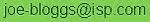
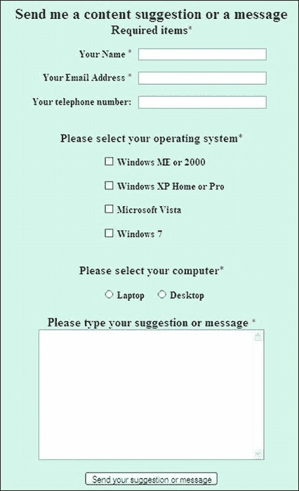
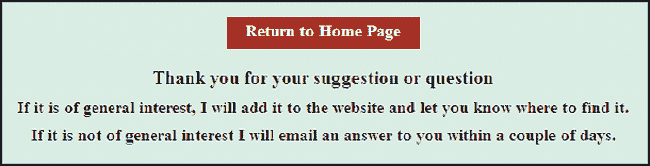
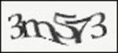

# 十一、安全反馈方法

电子邮件和反馈表格是最受欢迎的联系方式，让用户可以轻松地与网站所有者沟通。不幸的是，这两种联系方式都可能被滥用。黑客可以劫持一个表单，并用它向网站所有者发送恶意软件。电子邮件地址被收集并出售给垃圾邮件发送者。这两种行为都会给网站所有者带来困扰和垃圾邮件的涌入；它们也不能提高网页设计师的声誉。本章讨论了防止这些风险的一些选项。

### 加密电子邮件地址，防止垃圾邮件

Escrambler 是一款免费的反垃圾邮件设备。它最初是作为一个普通的、可点击的链接产生的，后来由于 InnerPeace.org 添加了一个电子邮件地址的图像而得到了增强。他们在`[`innerpeace.org/escrambler.shtml`](http://innerpeace.org/escrambler.shtml)`的网页会很快为你生成代码。或者您可以修改下面的 JavaScript 代码片段。

将下面的 JavaScript 片段插入到您希望电子邮件地址出现的部分。JavaScript 还在页面上放置了电子邮件地址的图片，以便用户可以点击它或记下它以供将来使用。但是，如果用户禁用了 JavaScript，电子邮件地址图像就没有帮助了；因此，图片(没有链接)也应该以通常的方式显示在页面的某个地方。

JavaScript 会伪装电子邮件地址，这样垃圾邮件蜘蛛就看不到了。JavaScript 将传统的电子邮件地址分解成小块，然后重新组合。垃圾蜘蛛阅读 JavaScript 和图片有很大困难；即使他们能读懂 JavaScript，电子邮件地址也是支离破碎的，以至于他们无法理解。对于你自己的电子邮件加扰器，只需更改粗体项目。

以下示例隐藏了地址`fredbloggs@aol.com`

`

`

 **注意**变量`f`后面是两个单引号，不是双引号。第`g=' 完整的电子邮件地址以可点击的图像形式出现在屏幕上，但垃圾邮件蜘蛛看不见。*   If there are no pictures available, a link with the words "email me" will appear on the webpage.

点击图片或文字“给我发邮件”,用户的默认电子邮件程序将打开，其中已经填写了电子邮件地址。用户可能需要被告知电子邮件可能会进入他们的发件箱，因此需要通过单击发送/接收按钮来发送。

#### 创建电子邮件地址的图像

大多数画图程序可以创建包含邮件地址的`.png`或`.gif`图像。使背景透明，以便页面的背景颜色显示出来。但是，使用画图程序创建文本可能不会产生令人满意的结果。这也很耗时，有时甚至令人沮丧，尤其是当你需要匹配页面的彩色背景时。下面是一种方法，它总是能给出一个好的结果，并且没有用画图程序添加文本复杂:

> 1.  In your WYSIWYG fckeditor, copy a webpage with appropriate background color.
> 2.  In the blank space of the page, type the email address with the preferred font size and color.
> 3.  Use Alt+ Print Screen (or use the screenshot tool in Windows 7) to take a screenshot of the page.
> 4.  Open your drawing program and paste the screenshots into it.
> 5.  Crop the picture and save the result as `.jpg` or *.* `png` file (see Figure 11-1 ).

***图 11-1** 。使用此方法的彩色背景示例图像*

### 一个小问题解决了

你的客户可能决定不把她的电子邮件地址放在网站上。相反，她可能更喜欢使用反馈表。但是，没有什么可以阻止某人忽略表格，通过猜测她的电子邮件地址直接与她联系。这种情况很少发生，而且发件人不是垃圾邮件发送者，所以告诉你的客户不要惊慌。十年来，我个人只收到过几封这样的邮件。这是个小问题，可以忽略。

那他怎么知道你客户的邮箱地址？他知道是因为他找到了她的网站。他为什么试图联系她？他想要建立从她的网站到他的网站的对等链接。她的安全反馈表(在下一节中描述)防止发送者提供他的 URL 细节。他必须使用普通的电子邮件，所以他做出了明智的猜测。他尝试`info@clientswebsite.co.uk`或`sales@clientswebsite.co.uk`，等等。如果你的客户有一个“包罗万象”的电子邮件地址，这个人也可以输入类似于`postmaster@clientswebsite.co.uk`的东西，它可能会到达你的客户。他的电子邮件将能够包含他的真实网址。他不会包括一个可疑的网址，因为可以通过他的电子邮件追踪到他。

通过建立一个互惠链接，他希望通过尽可能多的外部链接来提高他在搜索引擎中的排名。你的客户应该看看这个人的网站；她通常会发现他的内容与她的网站毫无关系，所以她应该*而不是*同意互惠链接。此外，她很可能会发现他的链接页面上有 40 到 100 个链接。如果她同意互惠链接，搜索引擎会认为她在使用链接农场，因此他们可能会惩罚她的网站。

如果您的客户正在接收这种类型的电子邮件，最简单的解决方案是在处理程序中使用不同的电子邮件地址，例如她的家庭宽带地址，`clientsemailaddress@herisp.co.uk`。没有人能够猜出她的家庭电子邮件地址，但缺点是她的商业回复无法与她的私人邮件区分开来。

### 安全反馈表格

在设计反馈表时，我们需要考虑以下三点:

> 1.  Because layout tables are deprecated, CSS must be used to align input fields neatly.
> 2.  And blind and severely visually impaired users can use their screen readers to read and reply to forms. Accessibility rules must be observed; These are all included in Chapter 14 of . A filter must be built into the form handler to prevent the form from being maliciously hijacked.

#### 虚假回复

关于第三点，当我第一次开始设计网站时，我在我的许多客户的网站上添加了反馈表格，所有这些网站都被那些使用表格向网站所有者发送虚假回复的人所困扰。这些回复包含了官样文章和不可靠的网址。劫机者利用机器人每周发送一到两次虚假回复。网站所有者自然感到失望和困惑，因为他们认为他们收到了订单。幸运的是，他们没有点击这些虚假回复的链接，但他们立即联系我寻求解决方案。

虚假回复看起来像什么？下面的方框显示了一个典型的虚假回复。为了安全起见，我修改了网址和电子邮件地址。这些回复包含官样文章以及指向可疑网站的链接。不熟悉黑客怪异行为的网站所有者可能会试图点击一个链接，这可能会导致各种各样的混乱。

内容类型:文本/html；charset = " iso-8859-1 "
From:<ins>ezrxsk@xyzvjox.com</ins>
X-anti virus:AVG E-mail 8 . 0 . 100【270 . 4 . 1/1510】
From:Damon Rosario
super obligation hoyboyish forered minaway wips taenioid chancellor ism unsocket
3sy 6 rl<a href = \ " http://qmuxlytwkukt . com/\ ">qmucuk

以下是从安全表单收到的真实电子邮件:

此信息发自:
http://www.theowners-website.co.uk/form.html
-
发件人姓名:安德鲁·伊斯曼
发件人电子邮件:aeastman@myisp.co.uk
电话:01390 5233726
W98，me，2000？:没有
XP？:没有
Vista？:没有
窗口 7？:是
笔记本电脑？:是
桌面？；不
-消息-
我怎样才能说服我的电脑做出一杯像样的咖啡？
-

### 防黑客反馈表示例

虚假反馈可以通过 PHP、ASP.NET 或其他服务器端处理程序来阻止。在这一章中，我选择使用 PHP 处理程序，因为这种语言更容易理解和实现。如果在任何文本字段中输入 URL，该处理程序会弹出一条错误消息。这完全阻止了任何情况下的虚假回复。黑客不会劫持表格来发送伟哥广告；他们希望网站所有者点击 URL 链接，打开发送者的可疑网站。这些网站可能是色情网站，或者更有可能包含恶意软件，例如可以控制网站所有者计算机的特洛伊木马。图 11-2 显示了本项目中使用的表格。

***图 11-2。**一个使用 CSS 布局的表单*

您可以从位于`[`www.apress.com`](http://www.apress.com)`的配套网站下载示例表单、处理程序和相关文件。在清单 11-2a 、 11-2b 和 11-2c 中粗体显示的项目处插入您自己的详细信息。

 **注意** HTML5 对表单有了新的标签和属性。这些将在本章后面提到。同时，这个例子使用 HTML4 标签，因为表单的 HTML5 建议仍在开发中。此外，浏览器支持目前是不完整的，不幸的是，新的控制不阻止网址的输入。

 **提示**如果没有其他页面需要表单样式说明，可以使用内部 CSS 样式表。或者，您可以使用单独的外部样式表来指定表单元素的布局。这个链接语句必须是`<head>`部分中一系列链接语句的最后一个。这将是对外部样式表的链接的补充，用于设计页面的其余部分(如导航按钮)。如果你不想在表单上有导航按钮，你至少应该在表单上放一个返回按钮(见第二十章)。

通过反复试验确定样式表中的宽度和填充。由于一些网页设计程序不是真正的所见即所得，所以总是在各种浏览器中测试布局。接下来的几组代码描述了典型表单的元素。

*典型文本字段*的代码片段采用以下形式:

`

        <**label** **for**="username"><b>Your Name:</b></label>
        <input **id**="username" name="username" size="30">

`

对于表单上的每个文本字段，`<label>…</label>`和`<input>…</input>`，标签必须与两个属性`for`和`id`一起使用，如代码片段所示。这对于使用屏幕阅读器的人来说非常重要。

对于文本字段和文本区域，`<label>`标签必须位于`<input>`标签之前，这样标签就位于字段的左侧。

对于复选框和单选按钮，必须使用相反的顺序；`<input>`标签必须在`<label>`标签之前，这样标签就位于字段的右边。

下面是 *复选框*的 CSS 代码片段(通过使用 CSS，复选框被很好地排列起来，每个复选框都有相同的类/标识符):

`/*The CSS for positioning the checkboxes on the page*/
.chk1 {text-align:left; padding-left:30%;
}`

复选框的 HTML 的*代码片段如下:*

`

  <input id="chkbox1" name="w98me2000" value="Yes" type="checkbox">
  <label for="chkbox1"><b>Windows ME or 2000</b></label>

 

  <input id="chkbox2" name="xp" value="Yes" type="checkbox">
  <label for="chkbox2"><b>Windows XP Home or Pro</b></label>

  `

……等等。

两个单选按钮通过 CSS 样式定位在页面上，CSS 样式的目标是名为`rad`的`id`。

`/*Position the radio buttons on the page*/
#rad {text-align:left; padding-left :30%;
}`

以下是单选按钮的 HTML 的*代码片段:*

`          

          <input id="radio1" name="laptop" value="Yes" type="radio">
          <label for="radio1"><b>Laptop</b></label>&nbsp;&nbsp;&nbsp;&nbsp;
          <input id="radio2" name="desktop" value="Yes" type="radio">
          <label for="radio2"><b>Desktop </b></label>

`

清单 11-2a 中没有使用语义标签为了避免为 IE 7 和 IE 8 用户添加 JavaScript，该表单可以在所有浏览器中工作，包括 IE 7 和 IE 8。

***清单 11-2a。【feedback-form.html】创建如图所示的安全表单**图 11-2*

`<!doctype html>
<html lang=en>
<head>
<title>Send a suggestion to my computer help and advice service</title>
<meta charset=utf-8>
<!--<meta details go here>-->
<link rel="stylesheet" type="text/css" href="feedback.css" media="screen">
</head>
<body>

  

<h2>Send me a content suggestion or a message</h2>
<h3>Required items *</h3>
<!--start of form-->

<form action="form-handler.php" method="post">

        <label class="label" for="username"><strong>Your Name</strong>
        *
        <input id="username" name="**username**" size="30"></label>

  

        <label class="label" for="useremail"><strong>Your Email Address</strong>
        *
        <input id="useremail" name="**useremail**" size="30"></label>

  

        <label class="label" for="phone"><strong>Your Telephone Number </strong>
        <input id="phone" name="**phone**" size="30"></label>

  

  <h3>Please select your operating system *</h3>

` `

        <input id="chkbox1" name="**w98me2000**" value="**Yes**" type="checkbox">
        <label for="chkbox1"><strong>Windows ME or 2000</strong></label>

 

        <input id="chkbox2" name="**xp**" value="**Yes**" type="checkbox">
        <label for="chkbox2"><strong>Windows XP Home or Pro</strong></label>

 

        <input id="chkbox3" name="**vista**" value="**Yes**" type="checkbox">
        <label for="chkbox3"><strong>Microsoft Vista</strong></label>

 

        <input id="chkbox4" name="**windows7**" value="**Yes**" type="checkbox">
        <label for="chkbox4"><strong>Windows 7</strong></label>

 

<h3>Please select your computer*</h3>

        <input id="laptop" name="**computer**" value="**Laptop**" type="radio">
        <label for="laptop"><strong>Laptop</strong></label>&nbsp;&nbsp;&nbsp;&nbsp;
        <input id="desktop" name="**computer**" value="**Desktop**" type="radio">
        <label for="desktop"><strong>Desktop</strong></label>

 
        <label for="suggest"><strong>
          Please type your suggestion or message</strong>*</label>
            
        <textarea id="suggest" name="**suggestion**" rows="12" cols="40"></textarea>  

        <input id="sb" value="Send your suggestion or message" title="Send suggestion 
        or message" type="submit">

</form>

<!--end of form-->

</body>
</html>`

 **注意**当点击提交按钮时，清单 11-2a 中粗体显示的项目将被发送到表单处理程序(清单 11-2c )进行处理。

清单 11-2a 中的表单链接到下面的样式表。这将创建各种表单域的布局。

***清单 11-2b。**为清单 11-2a 创建 CSS 样式表 (feedback.css)*

`/*FEEDBACK.CSS*/
/*reset browsers for cross-client consistency*/
html,body,h1,h2,h3,h4,h4,h5,h6,p {margin:0; padding:0
}
img {border-style: none; float: none; margin-left: 0; margin-right: 0;
}
body {text-align:center; background-color:#D7FFEB; color:black; 
font-family: "times new roman"; max-width:1024px; min-width:800px;font-size: medium; 
color: #000; margin: auto; width:95%;
}
/*The h1 heading is not used on the form shown; its inclusion is for a probable h1 
heading on your own form*/
h1 {padding: 110px 0 0 12%; font-family :"times new roman"; font-size: 250%; 
color: #000; font-weight:bold;}
h2 { margin-top:15px; }
span.red { font-size:medium; color:red; font-weight:bold;
}
/*center the back button on the thankyou page*/
#back-button { margin:auto; text-align:center; width:200px; height:25px; padding:5px; 
background-color:brown; color:white; font-size:110%; font-weight:bold;
}
#back-button a { text-decoration:none; color:white;
}
#back-button a:hover { color:red;
}
/*set heading details*/
h1,h2 , h3, h4, h5 { margin-top:0; margin-bottom:10px;
}
h2 { font-size:130%; font-weight:bold;
}
h3 { font-size:110%; font-weight:bold; text-align:center;
}
/*PARAGRAPHS*/
p {margin-bottom:10px; margin-top:0;
}
/*FORM. Position the form elements on the page*/
#form {width :500px; margin:auto; text-align:center;
}
.label { float:left; width: 400px; text-align:right; clear:left;
}
.chk1 { text-align:left; padding-left :30%;
}
#rad { text-align:left; padding-left :30%;
}
#sug { text-align:center; margin:auto;
}
#submit { text-align:center;
}`

如前所述，当单击表单上的 Submit 按钮时，用户的详细信息被发送到表单处理程序。表单处理程序将在清单 11-2c 中描述。

### 表单处理程序及其反黑客过滤器

您可以从相应的网站下载表单、样式表和表单处理程序，网址为 [` `www.apress.com``](http://www.apress.com) 。这个处理程序是一段 PHP 代码，但是你不需要学习 PHP 来使用它。该处理程序包含逻辑操作符，可以过滤出错误和 URL。URL 过滤器将激怒并阻止人类劫机者，并将导致机器人设备神经崩溃。

 **注意**要开始测试，设置你自己的电子邮件地址，这样你就是收件人，然后测试表格。当您对该表格向您发送测试电子邮件感到满意，并且生成的电子邮件令人满意时，请注释掉您自己的电子邮件地址，并删除客户电子邮件地址中的注释斜线，以便客户(网站所有者)代替您接收电子邮件。当然，如果网站是你自己的，这就不适用了。

注意在清单 11-2c 中，单行注释前面有一个双斜杠`//`，多行注释使用`/*……*/`，就像 CSS 注释一样。同样，一个 PHP 文档以`<?php`开始，以`?>`结束，这些标签不能包含空格。

出于好奇，本节末尾解释了更奇怪的代码。

 **注意**处理程序必须保存为 PHP 文档，上传处理程序后，在 FTP 客户端的服务器窗格中右键单击它，在那里就可以将 CHMOD 设置为 644。这将阻止未经授权的人访问它。如果他们尝试使用处理程序的文件名打开它，他们将看不到处理程序；他们将立即被定向到表单。确保您的服务器启用了 PHP，如果没有启用，请联系主机并指示他们启用服务器。

在处理程序清单 11-2c 中用您自己的详细信息替换 ***粗体斜体*** 中显示的项目，因为发送消息的人将输入他自己的详细信息(姓名、电子邮件地址和电话号码)；它们不会以粗体斜体显示。

***清单 11-2c。【form-handler.php 创建 PHP 表单处理程序***

`<?php
/* FORM-HANDLER.PHP Feedback Form PHP Script Ver 5.0 */
// set the email address for the recipient, this setting sends it to your client for example
//$mailto = "***webmasters-mailaddress@your-isp.com***" ;
$mailto = "***yourclient@clients-isp.com***" ;
//choose the subject so that you can recognize emails sent from this form
$subject = "***Help query***" ;
/*The next block of code tells the handler where to find the various documents 
associated with it. In this case the documents and the form are all in the same root 
folder.*/
// list the pages to be displayed,` `$formurl = "http://www.***clients-website.com***/feedback-form.html" ;
$errorurl = "http://www.***clients-website.com***/error.html" ;
$thankyouurl = "http://www.***clients-website.com*** /thankyou.html" ;
$emailerrurl = "http://www. ***clients-website.com*** /emailerr.html" ;
$errorphoneurl = "http://www. ***clients-website.com*** /phonerror.html" ;
$errorsuggesturl = "http://www. ***clients-website.com*** /suggesterror.html" ;
$errorboxurl = "http://www. ***clients-website.com*** /error.html" ;
$uself = 0;
// ------- Set the information received from the form as $ values ---------------
$headersep = (!isset( $uself ) || ($uself == 0)) ? "\r\n" : "\n" ;
/*The following code receives the items from the HTML form and converts them to formats 
 that can be used by the handler, for example, *username* is converted to *$username*.*/
$username = $_POST['username'] ;
$useremail = $_POST['useremail'] ;
$phone = $_POST['phone'];
$***w98me2000*** = $_POST['***w98me2000***'];
$***xp*** = $_POST['***xp***'];
$***vista*** = $_POST['***vista***'];
$w7=$_POST['***windows7***'];
$computer=$_POST['***computer***'];
$suggestion = $_POST['***suggestion***'] ;
$http_referrer = getenv( "HTTP_REFERER" );
if (!isset($_POST['useremail'])) {
        header( "Location: $formurl" );
        exit ;}
//Check that all three essential fields are filled in
if (empty($username) || empty($useremail) || empty($***suggestion***)) {
header( "Location: $errorurl" );
        exit ; }
//Check that at least one box has been ticked
if ((!$***w98me2000*** and !$***xp*** and !$***vista*** and !$***w7***)) {
        header( "Location: $errorboxurl" );
        exit ; }
//check that no urls have been inserted in the username text area
if (strpos ($username, '://')||strpos($username, 'www') !==false){
        header( "Location: $errorsuggesturl" );
        exit ; }
//Check that no urls haves been entered in the phone field
if (strpos ($phone, '://')||strpos($phone, 'www') !==false){
        header( "Location: $errorphoneurl" );
        exit ; }
//check that no urls have been inserted in the suggestion text area
if (strpos ($***suggestion***, '://')||strpos($suggestion, 'www') !==false){
        header( "Location: $errorsuggesturl" );
        exit ; }
        if ( ereg( "[\r\n]", $username ) || ereg( "[\r\n]", $useremail )) {
        header( "Location: $errorurl" );
        exit ; }
#remove any spaces from beginning and end of email address
$useremail = trim($useremail);
#Check for permitted email address patterns` `$_name = "/^[-!#$%&\'*+\\.\/0-9=?A-Z^_`{|}~]+";
$_host = "([-0-9A-Z]+\.)+";
$_tlds = "([0-9A-Z]){2,4}$/i";
if(!preg_match($_name."@".$_host.$_tlds,$useremail)) {
        header( "Location: $emailerrurl" );
        exit ; }
if (get_magic_quotes_gpc()) {
        $message = stripslashes( $message ); }
if(!$***w98me2000***) {$***w98me2000*** = "No";}
if(!$***xp***) {$***xp*** = "No";}
if(!$***vista***) {$***vista*** = "No";}
if(!$***w7***) {$***w7*** = "No";}
if($***computer*** !=null) {$***computer*** = $***computer***;}
//-- SET UP THE EMAIL’S CONTENT, FORMAT IT, SEND IT. THEN SHOW A THANK YOU PAGE --
$messageproper =
        "This message was sent from:\n" .
        "$http_referrer\n" .
        "------------------------------------------------------------\n" .
        "Name of sender: $username\n" .
        "Email of sender: $useremail\n" .
        "Telephone No: $phone\n" .
        "***W98,ME,2000***?: $***w98me2000***\n" .
        "***XP***?: $***xp***\n" .
        "***Vista***?: $***vista***\n" .
        "***Windows7***?: $***w7***\n" .
        "***Computer***?:$***laptop***\n" .
        "***Computer***?;$***desktop***\n" .
        "------------------------- MESSAGE -------------------------\n\n" .
        $***suggestion*** .
        "\n\n------------------------------------------------------------\n" ;
mail($mailto, $subject, $messageproper, "From: \"$username\" <$useremail>" . $headersep .
"Reply-To: \"$username\" <$useremail>" .
$headersep . "X-Mailer: feedback4.php 5.0" ); header( "Location: $thankyouurl" ); exit ;
?>`

### 好奇者:一些 PHP 代码的解释

(如果太忙或者不感兴趣，可以跳过这一节。)

`**!isset function**`检查以确保发送者电子邮件的值已经在`$_POST`数组中设置。感叹号`(!)`表示`NOT`。

`if (!isset($_POST['useremail'])) {
        header( "Location: $formurl" );
        exit ;
}`

`**if(!preg.match**`完成测试，查看电子邮件地址的格式是否正确。 **reg** 部分代表*正则表达式*(这是美国的翻译，其中 regular = standard，不是英国的意思，其中 regular 的意思是“以相等的间隔”)。如果电子邮件地址不符合公认的标准，则会显示一条错误消息。

`**magic_quotes**`是一个 PHP 过滤器，如果打开，它将插入一个转义斜杠来保留用户输入的消息中的任何单引号或双引号。

`if (get_magic_quotes_gpc()) { $message = stripslashes( $message );
}`

当检查基本字段是否已填写时，双垂直线(`||)`表示`OR`)。

下一段代码是这样翻译的:如果`username`字段为空，或者`useremail`字段为空，或者`suggestion`字段为空，那么显示一个名为`errorurl`的错误消息，说明一个关键字段没有填写。

`if (empty($username) || empty($useremail) || empty($suggestion)) { header( "Location:
$errorurl" ); exit;
}`

在 HTML 表单中，复选框和单选按钮的默认值设置为“是”。

如果一个框或单选按钮没有被点击，那么该值可以被处理器改变为`"No"`，如下所示:

`if(!$xp) {$xp = "No";}`

这意味着如果`$xp`未被选择，则将值`"No"`分配给`$xp`。

测试以确保至少勾选了一个复选框(注意本语句中`and`的使用)。

`        if ((!$w98me2000 and !$xp and !$vista and !$w7)) {
        header( "Location: $errorboxurl" );
        exit ;
}`

如果消息发送成功，需要通知用户。他还需要知道他在填写表格时是否犯了错误。以下部分给出了建议的反馈页面，这些页面将通知用户，如果用户提供了错误或不可接受的数据，还会提供帮助。

### 感谢页面和错误信息

“谢谢”页面向用户确认电子邮件已成功发送。为了保持一致性,“谢谢”页面应该看起来像网站上的所有其他页面。尝试将你的导航菜单包含在“谢谢”页面中(或者至少包含一个返回按钮)。失去访客将是一件憾事。在每个错误页面上添加一个返回按钮也会很有帮助。“谢谢”页面如图 11-3 所示，代码为清单 11-3 。这个页面有一个返回按钮，上面写着“返回主页”，但是你可以用主导航菜单替换这个按钮。按钮的样式包含在样式表`feedback.css`中。

***图 11-3** 。一个“谢谢”页面*

***清单 11-3。**创建感谢页面(thankyou.html)*

`<!doctype html>
<html lang=en>
<head>
<title>Thank you for your message</title>
<meta charset=utf-8>
<!--<meta details go here>-->
<link rel="stylesheet" type="text/css" href="feedback.css" media="screen">
</head>
<body>
 

<a title="Return to the Home page" href="index.php">Return to Home
Page</a>

 
<h2>
Thank you for your suggestion or question</h2>
<h3> If it is of general interest, I will add it to the website and let you know where
to find it.</h3>
<h3>If it is not of general interest I will email an answer to
you within a couple of days.</h3>

</body>
</html>`

如果电子邮件未成功发送，将会出现一条解释性错误消息。

为什么要使用错误页面而不是将一段文本回显到屏幕上？我的客户更喜欢页面提供的独特信息和帮助，而不是常见的红色小错误信息，这些信息可能会被忽略或者过于简短。

清单 11-4 中的样式表用于所有五个错误消息(清单 11-5 到清单 11-9 )。

***清单 11-4。** (error.css)*

`body { text-align:center; font-size: large; font-weight:bold;
}
span.red {color:red; font-size:xlarge; font-weight:bold;
}`

清单 11-5 提供了缺失要素错误信息的代码。

***清单 11-5** 。(error.html)*

`<!doctype html>
<html lang=en>
<head>
<title>Error message. Missing essentials</title>
<meta charset=utf-8>
        *meta details go here*
<link rel="stylesheet" type="text/css" href="error.css">
</head>
<body>` `
One or more of the essential items in the form has not been filled in.

Essential items have a red asterisk like this *

Please click the Back button on your internet browser and then supply the 
missing information.

</body>
</html>`

清单 11-6 显示了电子邮件错误信息的代码。

***清单 11-6。【emailerr.html】***

`<!doctype html>
<html lang=en>
<head>
<title>Email error message</title>
<meta charset=utf-8>
<meta details go here>
<link rel="stylesheet" type="text/css" href="error.css">
</head>
<body>

Your email address has an incorrect format.
 
Please click the Back button on your internet browser  and then correct your 
email address.

</body>
</html>`

清单 11-7 提供了电话错误信息的代码。

***清单 11-7。【phonerror.html】***

`<!doctype html>
<html lang=en>
<head>
<title>Phone error message</title>
<meta charset=utf-8>
        *meta details go here*
<link rel="stylesheet" type="text/css" href="error.css">
</head>
<body>

&nbsp;

&nbsp;

The telephone number must be numbers and spaces only, with no letters or punctuation>

Please click the Back button on your internet browser  and then correct your 
telephone number.

</body>
</html>`

清单 11-8 提供了勾选框错误信息的代码。

***清单 11-8。【boxerror.html】***

`<!doctype html>
<html lang=en>
<head>
<title>Box error</title>
<meta charset=utf-8>` `        *meta details go here*
<link rel="stylesheet" type="text/css" href="error.css">
</head>
<body>

&nbsp;

Please tick one of the boxes to say which Operating System your 
have on your computer.

Essential items have a red asterisk like this*

Please click the Back button on your Internet browser and then supply the 
missing information.

</body>
</html>`

清单 11-9 提供了禁止输入 URL 的消息代码。

***清单 11-9。【suggesterror.html】***

`<!doctype html>
<html lang=en>
<head>
<title>Error message. Do not enter URLs</title>
<meta charset=utf-8>
        *meta details go here*
<link rel="stylesheet" type="text/css" href="error.css">
</head>
<body>
Sorry, but website addresses are not allowed  This is to prevent low-life 
scumbags from inserting links which lead to dodgy websites.

Please click the Back button on your internet browser and then remove any 
website addresses from the form.

</body>
</html>`

新的 HTML5 表单控件在第一章的中进行了解释。我们现在需要考虑这些控件是否会最终取代本章提供的 PHP 表单处理程序中的输入过滤器。

### 新的 HTML5 表单控件

HTML5 对表单的推荐几乎是完整的，但是不同的浏览器有不同的解释。HTML5 表单并不简单，因为其他因素会影响它们。

> 一个防黑客的表单需要一个 PHP、ASP.NET 或 Perl 服务器端代码的处理程序。处理程序必须匹配新的 HTML5 表单标签。除非非常小心地将新的 HTML5 元素与屏幕阅读器的需求相集成，否则可访问性将会受到损害。在一段时间内，IE 条件句和替代样式表将不得不被使用，以便使用最常用浏览器的冲浪者可以看到和使用你的表单。*   At the time of writing, IE 9 did not support HTML5 forms. IE 10 will probably support them.

 **注**只有 Opera 9.5 +支持编写时的所有新表单元素。其他新浏览器支持一些表单功能。要查看当前哪些浏览器支持 HTML5 表单控件，请访问`[`wufoo.com/html5/`](http://wufoo.com/html5/)`

即使 HTML5 控件内置在 HTML5 表单中，机器人和人类仍然可以输入危险的 URL。因此，对于某些字段，您仍然需要防黑客表单处理程序的保护。

当使用前面描述的 PHP 反馈处理程序时，您可以针对机器人添加进一步的保护；例如，您可以在页面上放置一些文本的图像，以便文本必须正确输入，或者您可以提出一个问题，在表单处理程序发送电子邮件之前必须回答该问题。另一种解决方案是使用验证码，如下所述。

### 使用验证码

验证码是使反馈表单更加安全的一种方式。我们都很熟悉 CAPTCHA 图像的波动脚本，如图 11-4 所示。

***图 11-4。**验证码图片*

它被设计来阻止机器人使用表单。不幸的是，这并不能阻止一个不道德的人给你的客户发送一条包含令人不快的或危险的链接或可疑网址的反馈信息。PHP 处理程序是做到这一点的唯一方法。也许最安全的解决方案是将 CAPTCHA 与安全反馈表单及其 PHP 处理程序结合使用。

使用 CAPTCHA 时，每次访问表单时，都会出现不同的图像。这可以由提供验证码服务的组织来执行，或者可以在表单上编程和调用随机生成器。一些验证码方法结合了字符的口语版本，以便盲人或弱视者可以使用这种形式。

验证码被下载并嵌入到包含表单的页面中。验证码可以是一项免费服务，可以在商业网站上使用。访问`[`captchas.net`](http://captchas.net)`(注意 URL 中验证码后面的字母“s ”)了解更多信息并下载代码。

下载最简单的代码版本是 PHP。它可以直接嵌入到 HTML5 页面中。必须下载三个文件并安装到您的服务器上。这个解决方案需要 JavaScript 和 PHP 的知识。要想知道你是否足够熟练使用`captchas.net`方法，请看一下`[`captchas.net/sample/php/`](http://captchas.net/sample/php/)`的示例代码

 **提示**其他几家验证码供应商存在；有些需要付费，有些比其他的更容易嵌入和理解。尝试探索`[`hellocaptcha.com`](http://hellocaptcha.com)`和`[`www.google.com/recaptcha`](http://www.google.com/recaptcha)`。

### 总结

在本章中，您学习了如何使用一点 JavaScript 来阻止垃圾邮件蜘蛛收集您客户的电子邮件地址。通过使用这个脚本，您的客户端将不会被垃圾邮件淹没。您还了解了使用防黑客反馈表的原因。本章和配套的网站为您提供了一个表单模板及其防黑客处理程序。虽然处理程序是用 PHP 编写的，但是实现它并不需要 PHP 知识。只需下载模板并输入您自己的信息，本章中的列表以粗体显示项目。

提供了一些关于验证码的信息，虽然我更愿意使用反馈表单处理程序，因为它比验证码更安全，可以防止人类流氓访问。没有任何安全措施是 100%安全的，CAPTCHA 已经被使用光学字符识别(OCR)的犯罪分子绕过。如需了解更多信息，请参见维基百科上关于验证码的文章。

在下一章中，我们将研究显示器色彩再现、屏幕尺寸和显示分辨率的巨大差异所带来的问题。将提供几种解决方案，并解释它们的优缺点。