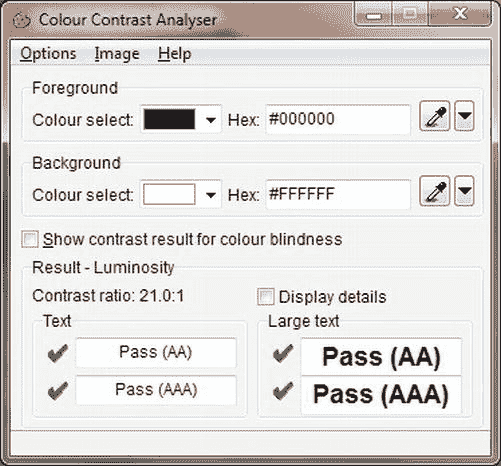
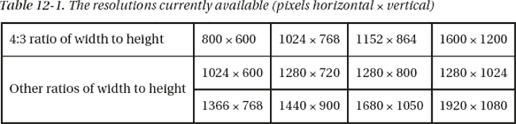
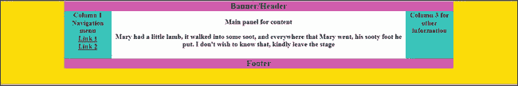
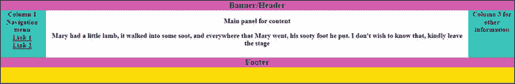
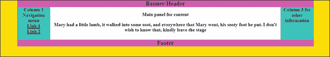

# 十二、监控混乱

你的网站颜色在所有显示器上都一样吗？您应该为哪种类型和尺寸的显示器进行设计？一个网站有可能在各种屏幕尺寸和分辨率下看起来都很吸引人吗？本章描述了这些问题并探讨了可能的解决方案。将介绍和讨论以下主题:

> *   And display color problem.
> *   Display size and resolution
> *   And fix width layout of that display.
> *   And liquid layout.
> *   And semi-liquid display layout-the best solution.
> *   Other matters needing attention related to monitor

### 显示器和色彩再现问题

阴极射线管(CRT)显示器通常具有强烈的鲜艳色彩，每个制造商都将它们设定为相当一致的标准。自从引入 TFT 显示器(薄的平板显示器；TFT 代表薄膜晶体管)。与电脑捆绑在一起的绝大多数 TFT 显示器都是低保真度的扭曲向列型(TN)屏幕；其中一些不能再现广泛和忠实的颜色范围。

此外，它们通常在工厂设置为最大亮度，因此颜色是褪色的淡粉色，有时带有明显的蓝色。虽然 TFT 屏幕有调节按钮，但是用户很少会注意到这些；即使他们发现了，他们通常也不敢使用。

当在 TFT 屏幕上观看时，在 CRT 显示器上设计的丰富的网页颜色可能看起来非常苍白和模糊。我的一个网站的背景是柠檬黄渐变；一些 TFT 屏幕将这种颜色呈现为浑浊的灰绿色。我试验了各种柠檬黄，最终最差的屏幕显示出一种柠檬黄；没有我希望的那么明亮，但是还可以接受。

由于大多数用户使用的是低保真度的扭曲向列型(TN)屏幕，所以最好的策略是在类似的屏幕上设计网站。设计网站时，您甚至可以将一个低保真度屏幕与昂贵的高质量 TFT 屏幕并联，以确保您的网页在劣质屏幕上看起来合理。将屏幕设置得比你个人喜欢的稍微亮一点。然后设计在屏幕上看起来合理的颜色。使用您的图形软件包来制作比 CRT 显示器稍暗的图像。

如果你被要求改变一个旧的网站，使它在 TFT 屏幕上看起来合理，你可能必须用你的图形程序把图片变暗。然后使用 CSS 将文本和菜单按钮变暗。如果在 CSS 中使用十六进制代码来描述颜色，可以通过减少数字和字母来使颜色变暗；例如

> *   Medium blue is `#0000FF`; When FF drops to 80, it becomes `#000080`, which is navy blue.
> *   The hexadecimal digits are (from the darkest to the brightest) 0,1,2,3,4,5,6,7,8,9, a, b, c, d, e, f.
> *   To lighten the color, add hexadecimal characters. For example, royal blue is `#0000FF`; The light version of blue may be `#7070FF`.
> *   In order to avoid spending too much time trying again and again when determining the right color, please start from `[`www.paciellogroup.com/resources/contrast-analyser.html`](http://www.paciellogroup.com/resources/contrast-analyser.html)`
> 
> 下载压缩文件`CCA-2.2.zip`

向下滚动 Paciello Group 网站的主页，直到您看到下载和语言版本列表。单击相应的语言版本下载 zip 文件。将其解压缩到一个新文件夹中，然后创建一个文件`CCA-2.2.exe`的桌面快捷方式。

图 12-1 显示了颜色对比分析仪(CCA-2.2)的界面。

***图 12-1。**色彩对比分析仪。2.2 接口*

颜色对比分析仪可以以两种方式使用；如果您单击菜单上的选项，您可以通过滑块来调整颜色，或者您可以看到当您更改十六进制数字时颜色会发生什么变化。

> 1.  Double-click the shortcut (the spelling of "color" in CCA interface is English and Australian *color* ).
> 2.  Enter the hexadecimal number of the color in the hexadecimal field selected in the foreground color. You will see the color in the corresponding color selection field.
> 3.  Change the hexadecimal code one bit at a time until the desired color is reached. Write down the hexadecimal color code and use it to modify your CSS style sheet.

 **提示**最初，一个名称只能指定 17 种颜色，如红色或蓝色。现在，你可以命名 147 种颜色，例如`color: mediumpurple;`。欲了解更多信息，请访问`[www.w3schools.com/cssref/css_colornames.asp](http://www.w3schools.com/cssref/css_colornames.asp)`和`[`somacon.com/p142.php`](http://somacon.com/p142.php)`。

还会遇到另一个问题:与 Internet Explorer 相比，Mozilla Firefox 在由 CSS 动态伪类方法设计的菜单按钮上显示更淡的边框颜色。在大多数情况下，这是可以接受的，但如果不接受，你可以尝试使用边框颜色，以提供一个在 IE 和 Mozilla Firefox 中都看起来合理的折衷方案。作为一种选择，IE 的 CSS 样式表可以是一个条件样式表；主样式表将为其他浏览器提供边框颜色。

### 显示器尺寸和屏幕分辨率

无论你为哪种分辨率设计(见表 12-1 )，都会有弊端。你不可能知道用户显示器的尺寸或者分辨率是如何设置的。视力衰退的老年人可能会将 19 英寸的屏幕设置为 800 × 600，更喜欢大而模糊的图标和字体，而不是清晰而小的图标和字体。

 **提示**关于各种屏幕和色彩分辨率统计的有趣页面，请访问`[`www.w3schools.com/browsers/browsers_display.asp`](http://www.w3schools.com/browsers/browsers_display.asp)`。

非正常比例可能会稍微扭曲网站的外观；项目被垂直拉伸。一些宽屏幕比例会导致水平失真；例如，足球变得像橄榄球一样呈椭圆形。

一些用户将收藏夹面板永久固定在浏览器窗口上，使得浏览器窗口的可用宽度减小，导致用户水平滚动。

大多数网站都有长页面和短页面。在短页面上，不显示垂直滚动条。在长页面上，会出现垂直滚动条，页面可以稍微向侧面移动，这样当用户从短页面移动到长页面时，项目看起来会跳跃。CSS 绝对定位可以部分克服这一点。

由于以下原因，实际屏幕区域小于规定的像素数:

> *   People lose vertical screen space by adding extra and unnecessary toolbars, such as those provided by Google or Yahoo.
> *   Windows vertical scroll bars occupy part of the width, so at least 24 pixels are allowed when setting the page width. For example, for the most common 1024 horizontal display resolution, a fixed width of about 980 pixels is used. For a display with a horizontal resolution of 1280 pixels, use 1200 pixels.
> *   Ie browser and Mozilla Firefox render pages in slightly different ways; However, most problems can be solved by resetting at the beginning of the stylesheet.

网页设计师必须接受他们不能赢的事实。无论他们设计的尺寸和分辨率如何，不同屏幕尺寸的结果总是一种妥协。本章的其余部分将帮助你为你的网站或你的客户的网站找到最佳的折衷方案。

下一节讨论三种类型的布局:固定、流动和半流动。它描述了它们的问题、局限性和可能的解决方案。

 **注意**除了 CSS 文件中粗体显示的`<title>`标签和属性的内容外，接下来三个例子的标记是相同的。CSS 表中包含了高度以生成简短的屏幕截图，但是通常不应该指定高度，因为根据内容的数量，每个页面需要不同的高度。出于指导目的，位置`ids`用于指示列位置。

### 显示器和固定宽度布局的问题

我有时被要求接管一个旧的、固定宽度的网站，它是为分辨率为 800 像素× 600 像素的屏幕设计的。这位所有者感到不安的是，在现代屏幕上(1024 × 768 分辨率以上)，网站页面看起来太小。随着更高分辨率和大屏幕的出现，页面开始变得像邮票。

我可能会将网站重新设计为 1024 × 800 的固定宽度，并接受这一事实，即它会导致用户在 800 × 600 的屏幕上水平滚动。固定宽度的网站是最容易设计和控制的，因为大多数网站都是固定宽度的，所以用户目前接受了它们在大屏幕上的局限性。在未来的某一天，1024 像素的固定宽度将需要增加，以匹配不断增加的屏幕尺寸和分辨率。

图 12-2 显示了一个 19 英寸屏幕上的固定宽度布局。

***图 12-2。**19 英寸屏幕上一个简单的三列 980 像素固定宽度布局示例。这个页面几乎填满了一个水平分辨率设置为 1024 像素的屏幕。*

图 12-2 中的网页有一个固定的 980 像素的宽度，并以其自然分辨率显示在 19 英寸的屏幕上。固定宽度(980 像素)是目前最流行的。它被像`www.bbc.co.uk`这样的网站所使用。如果通过使用光标向左拖动右侧边缘来缩小水平尺寸，则边缘会在内容上滑动，就像在内容上拉上窗帘一样。这是一种很好的做法，因为内容布局不会因为缩小宽度而受到干扰。在较小或较低分辨率的屏幕上，或者当用户缩小屏幕时，页面上的元素可能会相互滑动。这可以通过使用 CSS 定位或者将容器设置为固定宽度来防止，如清单 12-2b 中的所示。

从本书的页面 [` `www.apress.com``](http://www.apress.com) 下载本章的代码文件。在 19 英寸的屏幕上，在浏览器中查看这三个文件，屏幕分辨率设置为其原始分辨率，然后尝试缩小浏览器窗口的宽度，以测试当水平宽度减小时布局不会折叠。

清单 12-2a 的产生如图图 12-2 所示的屏幕显示。

 **注意**在接下来的三个例子中没有使用语义标签，这是为了使标记简单，便于教学。

***清单 12-2a。【fixed-3col.html 创建固定宽度页面***

`<!doctype html>
<html lang=en>
<head>
<title>Fixed width layout with three columns</title>
<meta charset=utf-8>
        *meta details go here*
<link rel = "stylesheet" type = "text/css" href = "fixed.css">
</head>
<body>

Banner/Header

        <ul>Column 1 Navigation menu
                <li>Link 1</li>
                <li>Link 2</li>
        </ul>

Column 3 for other information>

<strong>Main panel for content</strong>

Mary had a little lamb, it walked into 
some soot, and everywhere that Mary went, his sooty foot he put. I don't wish to 
know that, kindly leave the stage
` `

Footer

</body>
</html>`

通过简单地插入`width:980px;`，宽度在 CSS ( `fixed.css`)中是固定的。这在清单 12-2b 中以粗体显示。

***清单 12-2b。**清单 12-2a 的 CSS 样式表 (fixed.css)*

`Width:100%; body { text-align: center;background-color:yellow; font-family:"times new roman";
font-size:large; font-weight:bold;
}
#container {**width:980px;** padding: 0; text-align: center; margin:auto; 
background-color:white;
}
/* set widths and float on nav col and col 3*/
ul { float: left; padding:0; margin:0; width: 100px; height:120px;
}
li { padding-left:0; margin-left:0; list-style-type:none; text-decoration:underline;
}
#col-3 { float: right; width: 100px; height:120px;
}
/* set main-panel margins 5px greater than ul column and col-3 widths*/
#main-panel { margin-left: 105px; margin-right:105px;
}
#hdr { font-size:x-large; font-weight:bold;
}
/* force footer to stay at the bottom */
#ftr { clear: both; font-size:x-large; font-weight:bold;
}
/* show boundaries by using colors - for clarity only */
#hdr, #ftr { background: fuchsia;
}
ul, #col-3 { background: aqua;
}
#main-panel { background: white;
}`

我们接下来检查液体布局，这是为了应对屏幕宽度的变化而开发的。在一段时间内，这是一个合理的解决方案，但随着屏幕变得更宽，屏幕分辨率增加，很明显，液体布局有自己的问题。这些将在下面解释。

### 显示器和液体布局的问题

在较小的屏幕上，动态网站可能会因为*浮动下降*而崩溃。这意味着页面上的一个元素，比如一个图像，会被放到其他元素的下面。参见第十九章浮动下降故障排除。

流动网站还有另一个问题:文本可以在高分辨率的宽屏上延伸，使得阅读困难；读者的头像雨刷一样来回摆动。为了解决这个问题，您应该总是在列中显示文本。在高分辨率的宽屏上，液态布局会导致在线图片之间出现难看的大间隙。这可以通过将图片一张一张地放在页面上，图片的旁边放上文字来部分解决。

如果你有流动页面的问题，并且你有一个期限要满足，不要在上面花太多时间，而是改变成固定宽度(比如说 980 像素)。然后回到发射日期之后的问题。

如果 CSS 背景图案是重复的图案，它可以是液体。这可以通过重复背景给人以连续性的印象，使其跨越整个屏幕的宽度和高度。

在图 12-3 中显示了一个充满 19 英寸屏幕宽度的液体布局页面。

***图 12-3。**简单流畅的三栏布局。本示例填充任意屏幕宽度的 100%。请注意中心文本的跨度。在高分辨率的屏幕上，这种效果会更糟。*

在 1024 水平分辨率的屏幕上设计的液体布局在更小分辨率的屏幕上看起来会很凌乱。清单 12-3a 及其 CSS 清单 12-3b 通过将容器的宽度设置为 100%来提供一个液体布局。这以粗体显示。

***清单 12-3a。【liquid-3col.html】创建一个充满任意屏幕宽度的液体页面***

`<!doctype html>
<html lang=en>
<head>
<title>Liquid 3 column layout.</title>
<meta charset=utf-8>
        *meta details go here*
<link rel = "stylesheet" type = "text/css" href = "liquid.css">
</head>
<body>

Banner/Header

<ul>Column 1 Navigation menu
                <li>Link 1</li>
                <li>Link 2</li>
</ul>

Column 3 for other information

<strong>Main panel for content</strong>

Mary had a little lamb, it walked 
into some soot, and everywhere that Mary went, his sooty foot he put. 
I don't wish to know that, kindly leave the stage

Footer

</body>
 </html>`

在清单 12-3b(CSS 样式)中，液体布局使用 100%的宽度，但是液体布局可以有更小的百分比。液体布局的关键是用百分比而不是像素来定义宽度。

***清单 12-3b。**清单 12-3a 的 CSS 样式表 (liquid.css)*

`/* flood the background with yellow */
body { text-align: center; background-color:yellow; font-family:"times new roman"; 
font-size:large; font-weight:bold;
}
#container {**width:100%;** padding: 0; text-align: center; margin:auto; background-color:white;
}
ul { float: left; padding:0; margin:0; width: 100px; height:120px;
}
li { padding-left:0; margin-left:0; list-style-type:none; text-decoration:underline;
}
#col-3 { float: right; width: 100px; height:120px;
}
/* set panel margins 5px greater than ul and col-3 widths*/
#main-panel { margin-left: 105px; margin-right:105px; font-weight:bold;
}
#hdr { font-size:x-large;font-weight:bold;
}
/* force footer to stay at the bottom */
#ftr { clear: both; font-size:x-large; font-weight:bold;
}
/* show boundaries and set colors - for clarity only */
#hdr, #ftr { background: fuchsia;
}
ul, #col-3 { background: aqua;
}
#main-panel { background: white;
}`

我们已经看到固定布局和流动布局都有它们的问题。在下一个例子中，我们将使用半液体布局来检查一个可接受的解决方案。

### 监视器和半液体布局

半液体布局是液体布局的变体，它使用两个特殊属性，即`min-width`和`max-width`。使用半流体布局的页面如图图 12-4 所示。

***图 12-4** 。限制最大和最小宽度的半液体布局。这是最好的妥协。*

图 12-4 显示在一个 19 英寸的屏幕上，设置为其原始分辨率。该页面被设计为水平宽度永远不超过 1200 像素；因此，白色面板中的内容不会过度拉伸。在分辨率低于 960 像素的屏幕上观看时，观众必须滚动屏幕才能看到右侧的一些列。把非必要的信息放在右边一栏是个好主意，比如演职员表和广告。这使得主要内容完全符合设计者的意图，无论使用什么分辨率或大小来查看它。清单 12-4a 及其相关的 CSS 清单 12-4b 提供了如图图 12-4 所示的半液态布局。

***清单 12-4a。【liquid-3col-max-min.html 创建半流动页面***

`<!doctype html>
<html lang=en>
<head>
<title>Liquid layout with restricted max and min width</title>
<meta charset=utf-8>
        *meta details go here*
<head>
<link rel = "stylesheet" type = "text/css" href = "liquid-maxmin.css">
</head>
<body>

Header/Banner 

<ul>Column 1 Navigation menu
<li>Link 1</li>
<li>Link 2</li>
</ul>

Column 3 for other information

<strong>Main panel for content</strong>

Mary had a little lamb, it walked into 
some soot, and everywhere that Mary went, his sooty foot he put. I don't 
wish to know that, kindly leave the stage

Footer

</body>
</html>`

CSS 清单 12-4b 为屏幕宽度变化的问题提供了一个简洁的解决方案。属性`max-width`和`min-width`限制显示，使其不会变得太宽，也不会缩小到布局分崩离析的程度。宽度是一个百分比，就像液体布局一样，限制由粗体显示的代码设置。

***清单 12-4b。**清单 12-4a 的 CSS 样式表 (liquid-maxmin.css)*

`/* flood the screen with yellow*/
body { text-align: center; background-color:yellow; font-family:"times new roman"; 
font-size:large; font-weight:bold;
}
#container { width:95%; margin:auto; background-color:white; text-align: center; 
**max-width:1200px; min-width:960px;**
}
#hdr { font-size:x-large;font-weight:bold;
}` `/* set widths and float on nav col and col 3*/
ul { float: left; padding:0; margin:0; width: 100px; height:120px;
}
li { padding-left:0; margin-left:0; list-style-type:none; text-decoration:underline;
}
#col-3 { float: right; width: 100px; height:120px;
}
/* set panel margins 5px greater than col-1 & col-3 widths */
#main-panel { margin-left: 105px; margin-right:105px; background-color:white;
}
/* force footer to stay at the bottom */
#ftr { clear: both;
}
/* color the elements - for clarity only */
#hdr, #ftr { background: fuchsia;
}
ul, #col-3 { background: aqua;
}
#main-panel { background: white;
}`

通过结合两种技术——全宽体背景色和半液体布局——一种可接受的解决方案可以应用于屏幕宽度和分辨率变化的问题。

### 可接受的妥协

使用半流体网站容器或包装。给正文一个背景色或渐变，以填充任何屏幕尺寸和分辨率。在 CSS 中定义该颜色，如下所示:

`/* Flood the whole screen with yellow*/
**body { background-color:yellow; }**
**#container { width:95%; min-width:960px; max-width:1200px; margin:auto; }**`

这给了页面的*印象*，它充满了屏幕(主体的背景)，同时将内容**(**`#container`**)**很好地布置在屏幕的中央。让标题/横幅填满屏幕的宽度可以强化这种印象，但这并不总是有吸引力的。具有最小宽度的半液体容器防止布局在较小的分辨率下破碎。最大宽度限制确保内容不会蔓延到大屏幕上，在元素之间显示巨大的间隙。

其他考虑因素可以决定网站的布局。你需要向你的客户咨询他正在使用的设备以及他对该设备的未来意图。手持设备的出现也使选择合适布局的问题变得复杂。

### 其他与显示器相关的注意事项

当设计一个供办公室或工厂内部使用的网站时，您需要实地考察以确定屏幕尺寸和分辨率。如果员工不得不连续水平滚动来访问页面上的项目，他们会不高兴。如果公司投资购买屏幕更大的新设备，你将需要改变集装箱的宽度来匹配。为了便于阅读，你可能需要将文本分成两栏。

 **注意**对于宽布局，尤其是流动布局，使用两栏文本是非常重要的。参见第十三章设计两栏或多栏文本的方法。

其他类型的用户和设备将越来越需要特殊考虑。具有不同操作系统和浏览器的新手持设备的出现使网站设计者面临的任务变得复杂并增加了难度。

### 网站能在手持设备上运行吗？

*手持*是一个描述手机和平板电脑的术语。手持设备的设计本身就是一本很大的手册，因此，在本书中只会简单提及。许多为台式电脑设计的网站已经在更大的手机和平板电脑上运行得相当好了(只要它们有效，并且不包含框架或表格布局)。

Maximiliano Firtman(O ' Reilly Media，2010 年)写的《移动网络编程》》是一本关于这个主题的书。

#### 问题

可以浏览网站的手持设备的出现是网页设计者最近的噩梦。屏幕分辨率可以从 176 × 220 像素到 1280 × 800 像素不等。手机一般都有比宽度高的人像式屏幕，屏幕从 2.8 英寸到 4 英寸不等。平板电脑屏幕从 3.2 英寸到 10 英寸不等。三星 Galaxy Tab 10.1 的显示屏为 10.1 英寸，分辨率为 1280 × 800。苹果 iPad 的显示屏为 9.7 英寸，像素为 1024 × 768。一些手机和大多数平板电脑能够将屏幕视图从纵向翻转到横向。更高的分辨率在手持触摸屏设备上是可能的，因为它们不需要为键盘提供空间。原来手持设备不是手机就是平板；现在，这种区别变得模糊了，因为平板电脑整合了手机和相机。

在 2011 年的消费电子展上，展出了不少于 80 款平板电脑。至于操作系统，目前这场战斗是在几个平台/浏览器之间进行的，而且这种情况似乎会加剧。其中包括 iOS4 OS6 4，Android，Opera，Windows 7，Windows 8，WebOS，Blackberry OS，Simbian 和 QNX 中微子。

起初，手持设备的浏览器是桌面浏览器的改编。它们现在更有可能是专门为手持设备设计的。浏览器必须比桌面浏览器更紧凑，因为手持设备的内存更少，也没有硬盘来交换内存。

手持设备的浏览器更紧凑；这意味着他们已经放弃了大部分补偿标记错误的代码。因为它们的容忍度较低，所以页面的验证变得绝对必要。

网页设计师有时会制作不同的样式表来匹配微型屏幕、各种移动浏览器、低分辨率和各种操作系统。手持设备用户熟悉使用缩放工具来浏览网页。如果你为手持设备创建特殊的样式表，尽量减少水平滚动的需求。当提供这些替代样式表时，将它们的链接放在任何其他链接之前，如下所示:

`<link rel=”stylesheet” type=”text/css;” href=”md-sheet.css” media=”handheld” />
<link rel=”stylesheet” type=”text/css;” href=”stylesheet.css” media=”screen” />`

为网站创建替代样式需要大量的反复试验，然后在移动设备上进行一系列测试。有 80 种不同的手持设备和众多的平台和浏览器，这项任务确实令人生畏。没有一个网页设计师能够保证样式表适合所有的设备。

因此，设计师的首要任务是决定哪些网站最有可能在手持设备上被浏览。然后，她应该集中精力让它们便于手持。

网页设计师面临着艰难的选择。他们可以决定

> 1.  Ignore handheld devices.
> 2.  Designed for desktops, laptops, netbooks, tablets and mobile phones with screens larger than, say, 6 inches.
> 3.  Designed for desktops, laptops, netbooks, tablets and mobile phones with screens larger than, say, 6 inches, and two or three smaller and most popular handheld devices.
> 4.  Try to accommodate everything.

选择一和选择二是可以管理的。第三种解决方案要求您使用一些测试方法。第四个解决方案的学习曲线有珠穆朗玛峰那么长。大公司有时间和人力为手持设备和平板电脑创建完全独立的网站。有关如何为解决方案二和三设置和创建替代样式表的一般指导，请访问`[`www.opera.com/developer/tools`](http://www.opera.com/developer/tools)`。

Opera 网站包含有用的工具，包括平板电脑和手机模拟器。

#### 为手持设备制作另一个样式表

一个解决方案是为手持设备设计一个特殊的样式表，使显示可以接受。但是，您可能会发现，您还需要修改 HTML 标记。通过仔细规划，这可以保持在最低限度。下面是一些关于修改标记的提示，这样您就可以在支持桌面和手持设备的 HTML 页面中使用两个样式表。

> *   Reduce the size and number of images.
> *   Simplify the homepage and make it a container for links to other pages. Links should be a simple, vertical and unordered list.
> *   Text should be in one column, and the maximum width should be limited as much as possible to avoid horizontal scrolling. Keep banners and signs to a minimum or hide them.
> *   The number of words should be compressed to an absolute minimum. Be sure to check a large number of websites on handheld devices, so that you can see the advantages and disadvantages of website adaptation.

#### 测试网站的手持兼容性

个人网页设计者或小团队在提供测试手持设备方面会有问题。这是因为设备种类繁多，而且有多种操作系统和浏览器。以下是一个可能性列表:

> *   Let children, grandchildren or friends check your website with handheld devices and let them express their opinions on any problems.
> *   Download some handheld simulators of test websites. Buy some handheld computers or pay for some of the most popular models every month.
> *   Enter "Remote Device Access" in the search engine to check the results of possible remote test facilities.
> *   W3C has a mobile tag verifier at `[`validator.w3.org/mobile`](http://validator.w3.org/mobile)`. Upload your file or URL to see if the tag is suitable for handheld devices.

##### 模拟器

我在网上找到了几个可下载的模拟器，但是它们很难安装和掌握。我需要一个官样文章的博士学位来遵循说明；然而，我确实在 Opera Mini 模拟器上取得了一些成功。安装后，它有一个启动器，可以让你选择各种屏幕尺寸、分辨率和方向(横向或纵向)。

可以从`[`www.opera.com/developer/tools/`](http://www.opera.com/developer/tools/)`下载 Opera 模拟器。

模拟器操作起来很棘手，但是 Opera 开发者网站上的帮助文件解释了非直观的控件。有关帮助文件，请访问`[`dev.opera.com/articles/view/opera-mobile-emulator/`](http://dev.opera.com/articles/view/opera-mobile-emulator/)`。

### 总结

本章讨论了台式机和笔记本电脑显示器的颜色、尺寸和分辨率差异很大的问题。涵盖了折衷解决方案；这些可以下载并在各种屏幕上试用。幸运的是，显示器的物理尺寸有其自身的限制；很少有用户有空间容纳 23 英寸以上的屏幕。您还了解了`max-width`和`min-width`属性如何为屏幕尺寸变化问题提供最佳解决方案。

手持设备现在可以接收和查看网站。我们简要介绍了这些设备带来的问题。手持设备的大小差异很大，并且有许多不同的操作系统。每个月都会有新的浏览器推出，而且它们的浏览器也经常升级。为手持设备设计网站的手册将很快过时。

下一章与本章密切相关，讨论网站在屏幕上的外观。您将了解是什么让一个页面对用户有吸引力，以及如何让用户有足够的兴趣去浏览这个网站，而不是去逛另一个网站。你还会发现这个网站的实用性是如何帮助实现这个目标的。