# 十三、外观和实用性

访问者只会浏览一个有吸引力和有用的网站。一些网站所有者要求一个让他们满意的网站，而不考虑什么会让他们网站的访问者满意。这样的网站让所有者很高兴，但它可能对访问者或所有者的业务没有任何帮助。网站所有者应该问问自己，网站将为访问者做些什么。他们应该问几个人，如果他们访问这个网站，他们希望找到什么。

当与潜在客户交谈时，向他们解释网站设计过程不是从文字和图片开始的，而是从计划开始的。首先，确定网站的总体目标。是为了分享信息吗？还是有望产生销量？从一个目标开始会使设计网站更容易，并帮助每个人关注网站的目的。集中精力让网站的信息快速、清晰、直接地出现。

考虑导航和你的次要内容如何与你的目标互动。规划页面或部分。每一页应该只涵盖一个主题。列出主题，并使用该列表规划导航菜单。在开始组成页面之前，规划导航菜单和结构*；这样可以节省以后很多小时繁琐的修改。*

### 外观

关于网站外观的这一节首先简要讨论了文本的使用和滥用；文本内容的显示方式可以增强或破坏网页。接下来，你会了解到主页的重要性；它的出现是如何吸引用户进一步探索还是将他们从你的网站上赶走。接下来讨论颜色的效果，最后提供一些有用的提示来帮助你创建更有吸引力的页面。

#### 文字的使用和滥用

本节中的指导方针只是简单的常识，但是一定要把它们作为一个清单来改进你的工作，以防感情压倒理智。当我开始设计网站时，一些客户向我展示了大量的文字，保证会把用户从他们的网站上赶走。然后我就有了压缩文本的乏味任务，这偶尔会惹恼客户，这是可以理解的。我证明了压缩文本并保留客户希望传达的每一点信息是可能的。

我还向他们提出了一条小小的建议:在一本书、一本杂志或一本小册子中，冗长的文字可能是可以接受的，但是大量的文字，尤其是在主页上的文字，将会彻底毁掉一个网站。

测试表明，当出现大量文本时，网站访问者会抱怨并转向另一个网站。这是因为与打印的页面相比，在屏幕上阅读文本非常累人。访问者访问网站不是为了阅读；他们在网上寻找特定的信息，并且希望快速找到。

压缩文本主要适用于主页面，但是如果你在描述一个产品或服务，或者提供信息，不要为了简洁而忽略重要的细节；删除对信息没有任何帮助的词。

#### 所有重要的主页必须像捕蝇草一样

所有的网站都从主页开始。主页的设计尤其重要，因为它是访问者的第一印象，它传达了网站的基调。使其成为一个有吸引力的杂志封面(参见图 13-1 )。用它来激发访问者的兴趣。这很容易做到，只需透露足够多的信息；这引起了好奇心。

***图 13-1** 。捕蝇草。[`aboutfacts.net`](http://aboutfacts.net)供图*

主页应该像一个捕蝇草，一个吸引人的登陆点，把访问者吸引到更深的地方，让他们不去别的网站。每一页必须清楚地集中在一个主题，只有一个主题。这尤其适用于主页。重点是对网站内容的简要描述。这一点必须通过导航菜单上的按钮或链接的措辞来强调。

是什么破坏了主页上的焦点？没有什么比一个贴满 RSS 订阅源、表扬、徽章、无关网站链接、闪烁广告、字幕和视频的主页更糟糕的了。徽章、奖状和认证证书都有一定的作用，但这些最好放在“关于我们”页面上。W3C 验证标识可以放在侧边栏或页脚，因为客户经常渴望表明他们雇佣了一个有能力的设计师。一码长的主页和巨大的文本块是焦点杀手。一个没有清晰焦点的页面会把访问者拒之门外。

图 13-2 和 13-3 显示了一个聚焦的和一个非聚焦的主页。

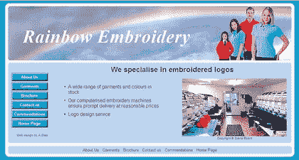

***图 13-2** 。一个干净整洁的主页*

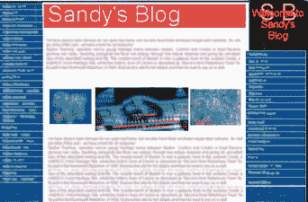

***图 13-3。**呸！*

主页必须非常简短和整洁。主页上的信息太多是不好的。这使得后续页面变得多余。如果主页已经说明了一切，为什么访问者还要费心去点击菜单项呢？

主页必须清楚地表明网站的内容。

如果你是天堂退休中心，不要只显示“天堂”的标题，并附上大楼或一些快乐居民的照片。*简短地*大声说出提供的内容；类似于以下内容:

**受保护的退休住所**

**为老年人出租的住所**

**在关爱的环境中拥有陪伴和支持的独立性**

一言以蔽之:不要再添加任何文本。让菜单按钮诱惑用户去发现故事的其余部分。

图片比文字更能解释事物。但是大图片(或者图片太多)会让主页加载很慢。然后访问者会离开去寻找一个加载速度更快的网站。

空白对于聚焦是必不可少的。在每一页上使用大量的空白来把注意力集中在重要的部分。空白表示没有文字或图片的空间。如果你有一个浅青绿色的背景，那么空白将是浅青绿色的，但它仍然被归类为空白。空白将注意力集中在要点上。糟糕的设计师很想填满页面的每一个可用区域。拥挤的页面令人厌烦。

保持主页简短。使主页的高度不大于屏幕窗口高度。不要让访问者向下滚动主页。如果他们不得不向下滚动，你在主页上放了太多东西。向下滚动可能意味着菜单不再吸引他们。当然，后续页面可以更长。一个简短的主页可以确保访问者查看菜单按钮以获得更多信息。

**精心选择颜色**。为了清晰易读，最好的文本颜色是白底黑字。鲜明的背景色，如鲜红色，如果覆盖了页面的大部分区域，会让人感到不舒服。如果你的网站是卖东西的，使用明亮但不花哨的颜色，并且有节制地使用它们(只是为了产品或菜单按钮)。花哨的颜色搭配表明网站没有品位，缺乏专业水准。如果你不是在卖东西，而是在提供信息，那就用淡色的背景来营造平静；访问者会在平静的网站上逗留更长时间。深色的背景颜色是不祥的，令人不快的(尤其是黑色，它真的只适合殡仪馆)。避免整页背景图形(水印或纹理)；它们会导致页面过于繁琐，使文本难以阅读。确保文本和背景颜色有足够的对比度，使弱视的人能容易地阅读你的网站(关于颜色对比的细节，见第十四章)。

如果客户有一个带有配色方案的房子风格，或者一本小册子，或者一个彩色标志，这些都可以作为一个配色方案的良好开端。向客户展示调色板也可以帮助他们选择主题。

最初，一个名称只能指定 17 种颜色，如红色或蓝色。现在，147 种颜色可以这样命名:`color: mediumpurple;`。有关这方面的更多信息，请参见`[www.w3schools.com/css/css_colornames.asp](http://www.w3schools.com/css/css_colornames.asp)`和`[`somacon.com/p142.php`](http://somacon.com/p142.php)`。

提示需要对颜色有想法吗？试试下面的网站:`[`colorschemedesigner.com`](http://colorschemedesigner.com)`或`[`colorschemer.com`](http://colorschemer.com)`或`[`www.elizabethcastro.com/html/colors/backflapcolors.html`](http://www.elizabethcastro.com/html/colors/backflapcolors.html)`或`[www.december.com/html/spec/color.html](http://www.december.com/html/spec/color.html)`。

你网站上的每张图片都应该有一个 ?? 和 ??，这样即使你的访问者关闭了图片，他们也能发现图片的内容。更重要的是，这使得弱视和失明的人能够听到图片的语音描述。如果一个页面有没有`alt`的图片，它将不会被验证。Logos 应该有空的`alts`和`titles`像这样:`alt= " "`和`title= " "`，不会妨碍残疾人，但是会验证。除非有`title`标签，否则 Mozilla 不会显示工具提示。

**每个超链接**都必须有一个`title`像这样:`<a href="Page-two.html" title="Page Two">Page Two</a></li>`。

**避免滚动文本(字幕)、自动启动视频和任何移动**的东西。这些花招是把人们从你的网站上赶走的最好方法。噱头可能非常令人恼火，也可能成为人们关注的焦点——以至于忽略了页面的其他部分。唯一的例外是展示事物如何工作的动态图片(不在主页上)。是否运行应该在用户的控制之下；它不应该自动启动。如果是动画`.gif`，那肯定是循环次数有限；假设在五到十个周期之间。如果视频、音频和幻灯片不在主页上，并且用户可以选择是否要观看/收听，则它们是可以接受的(媒体文件不得自动启动)。

**Autostart** 表示加载页面时声音或视频自动开始。这是个坏主意，因为它肯定会激怒人。突然爆发的声音会让用户大吃一惊，尤其是盲人用户。用户要么会立即离开你的网站，要么会疯狂地寻找关闭 AV 剪辑的方法。他们可能永远不会再回到你的网站。确保 AV 只能在用户请求时开始。如果自动开始载入一个短而安静的琶音，它对于音频可能是可以接受的。也许一段安静、舒缓的背景音乐是可以忍受的，如果它是短暂的，并且不会无休止地重复。

框架:这是一种允许内容在固定的横幅和菜单后面上下滚动的设计方法。框架不再被接受；搜索引擎拒绝穿透框架来定位后续页面。框架不能在移动设备上工作，并且它们使得盲人和弱视者几乎不可能阅读屏幕。

#### 主页以外的页面

印刷品、音频和电影以线性方式交流。观众从开头开始，一直看到结尾。*一个网站很不一样*；它是非线性的。用户通过在网站上跳来跳去来探索。网站更像是一本电话簿；为了找到 Fred Blogg 的电话号码，你拿起目录(相当于主页)，跳到 Bs(对于 Blogg)，跳过所有其他页面。然后跳过 B 条目，直到到达 Blo。找到正确的电话号码后，你可能不会浏览其他页面。这个目录已经达到了它的目的。如果一个网站的访问者可以直接跳转到他所寻找的信息，那么这个网站就达到了它的目的。

假设约翰·史密斯和他的妻子决定在 7 月 25 日和 8 月 25 日之间带着孩子去英国德文郡的农场度假。约翰在搜索引擎中输入“农场假日德文郡”。他在结果页面上选择了第一个农场假日。在网站上，他看到一个标有“空缺”的菜单按钮。他点击它，并被带到一个页面，显示他想要的日期没有空缺。使用下一个搜索结果，主页是一个可怕的业余混乱，所以他跳到列表中的下一个网站。这个网站没有给出如何找到空缺日期的提示，所以他跳到下一个搜索结果。下一个网站没有可用日期的菜单按钮；相反，主页告诉他打电话约会。他受不了打电话的麻烦，所以他去了下一个网站。这个有一个指向可用日期的菜单按钮，他点击它，看到有一个合适的日期。很好！他现在会点击价格菜单按钮，发现它太贵了。所以他继续寻找，直到找到最合适的。

我们来分析一下这个。

> 他访问了六个网站的主页。*   He immediately gave up two places.*   He explored another page besides the home pages of three websites. Then, he browsed two other pages besides the home page of the last website.

网站所有者很难相信用户不会阅读他们精心制作的每一页。

但是，如果 John 以合适的价格找到了合适的空房，他将浏览该网站上的其他页面，以了解住宿情况、位置、当地景点、所有者(在“关于我们”页面中)，最后，他将使用订单来预订假期。

访问者认为他们电脑屏幕上的内容只针对他们。你的语气和文笔要随意，非常简洁。这给人一种亲切感，就好像你在一对一地交谈。冗长的正式散文可以展示你是多么的能言善辩和博学多才，但是它会激怒你忙碌的访客；他们会去别的地方。

始终使用标题和副标题。使用`h1`、`h2`、`h3`、`h4`、`h5`和`h6`标题。访问者很少阅读文本；他们从一个标题跳到另一个标题，寻找他们感兴趣的特定主题。盲人和弱视者可以通过屏幕阅读器点击 H 键从一个标题跳到另一个标题。标题曾经被忽视，因为它们的上下都有大的行距。标题的间距和字体大小现在可以使用 CSS 轻松调整(见第十四章)。

不要在页面上展开文字。当眼睛已经到达一长串文字的末尾时，访问者将头转回到该行的开头，通常会迷失(并且他最终会放弃挣扎)。请改用两列。在分辨率为 1024 × 768 的情况下，可接受的最大列宽为 5.25 英寸(133 毫米)。儿童网站应该有更小的列宽。

**小字体不人性化**。正文中的文本对于 Times New Roman 来说不应小于 100 %,对于 Arial 或 Verdana 来说不应小于 80%。没有人会费事去拿一个放大镜来查看一个 8 磅的网站。

尽量不要在一页上使用两种以上的字体。Arial 和 Verdana 是首选的无衬线字体，因为它们是为网站上的易读性而设计的。Times New Roman 是最好的衬线字体，因为它经过专门设计和测试，具有良好的可读性，尤其是对于印刷品。

**文本应该被分割成小块** **，在适当的地方使用项目符号或标题**。卖点最好用项目符号来突出。如果可能的话，让文字穿插图片。一旦访问者找到了一个提供他们所寻找的内容的网站，他们就会渴望探索更多的页面。最后，当他们被吸引时，他们会想更多地了解提供产品的人。“关于我们”页面通常是最后一个被访问的，但它可以成交。

**不使用两端对齐的段落**。对齐文本是一个杀手，必须不惜一切代价避免。大脑必须努力克服单词之间的巨大差异。此外，与参差不齐、右对齐的文本的生动性相比，对齐的文本看起来很无聊。比较杂志上的两种风格，看看参差不齐的风格看起来有多有趣。对齐文本对阅读障碍者和任何使用屏幕放大软件的人来说都是一个问题，因为单词之间的不同间隙也被放大了。对齐的文本中有分散注意力的空白河流贯穿其中。

小斜体字体在网站上从来都不好看。计算机屏幕上出现的小斜体是一系列被印刷设计师称为“锯齿”的字体该文本具有粗糙的锯齿外观；因此，除了较大的字体外，应避免使用斜体。

#### 帮助您的客户选择设计

如果你的客户没有网站设计的经验，他们会想知道如何进行。总是尽可能地提供帮助，因为他们需要学习基础知识；这需要极大的耐心。他们从你身上学到的越多，他们就越不可能要求愚蠢的事情。强烈抵制展示自己专长的诱惑；这对发现你的客户想要什么没有任何帮助。

新客户有时会向你展示一个可怕网站的打印页面，并说，“这就是我希望我的网站看起来的样子。”最好的方法是一开始就同意，然后说“让我们看看如何做得更好。我们需要我们双方的一些投入来稍微整理一下。”我委婉地指出，为什么客户样本中的一些可怕的部分会有损于拟议中的网站。

如前所述，客户现有的任何营销材料或标识都是一个很好的起点。客户可能已经到了要改变房子风格的地步；这不仅有助于你和你的客户一起创造一个全新的外观和感觉，而且它提供了一个为你或你的团队创造更多工作的机会。

当与不知道自己想要什么或对网站设计一无所知的潜在客户交谈时，我会让他们坐在我旁边，坐在电脑屏幕前，做以下每一件事:

> *   I showed them a page template to help them choose the color and page layout (see Figure 13-4 ).
> *   I asked them to list the topics they wanted to include. Then I explained that a theme is equivalent to a page, and a theme is a button or link on the navigation menu. I explained the approximate cost per page, so that they can be completely sure of their commitment if they agree to continue.
> *   Let me explain how much it costs for hosting and domain name registration.
> *   I explain how much it costs to process and insert a page for each picture.
> *   I asked them how they planned to provide me with pictures.
> *   I asked them what kind of continuous maintenance they might need, and gave them the estimated cost of updating the website.
> *   I make sure that the potential customers understand the size and time limit of the hosted video (see Chapter 6 of for details). I suggest that they carefully consider all the issues we discussed before committing to this project.

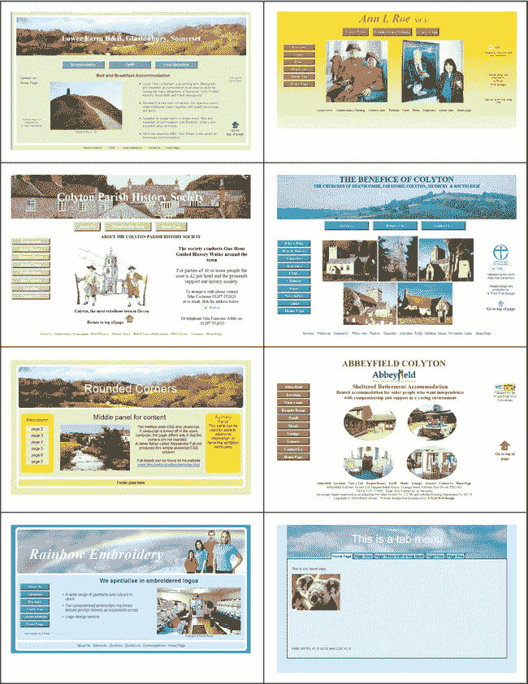

***图 13-4。**帮助客户选择颜色和设计的典型样本页*

所有这一切的要点是，潜在客户应该感到放心，离开时会觉得他们对流程有所了解，不再是傻瓜。如果你让一个潜在的客户感到愚蠢或无知，你就应该失去他或她。

使该项目成为一个完全合作的项目。使用我自己的网站主机，我创建了一个名为“hidden”的文件夹，然后我让客户端知道这个文件夹的 URL。我将客户的草稿一页一页上传到那个文件夹，这样他或她就可以看到最新的页面，并查看之前页面的任何进展。然后，客户可以对整个过程的每一步做出贡献和评论。

与您的客户一起安排 **网站的注册和托管。我让我的同事坐在我旁边，用他们的名字注册网站。然后我给客户所有的 FTP 细节，以防他们将来某个时候想换另一个网站管理员。我解释说，网站将以客户的名义注册和托管，他或她将拥有网站的版权。一些卑鄙的网站设计者会将客户锁定在一个无止境的合同中，这样客户就永远不能将网站转让给其他人。困住客户后，这些令人讨厌的网站设计者将收取高额的年度维护费。**

#### 一种显示/隐藏文本的技术，提供了一个紧凑的页面

在本章的“文字的使用和滥用”部分，我解释了过多的文字会让人们远离网站。通过只显示标题，新闻页面可以变得更加紧凑和易于使用。用户可以扩展标题来阅读他们选择的新闻条目(参见图 13-5 和图 13-6 )。为此，您需要下载 JavaScript 文件`jquery.js`并将其放在您网站的根文件夹中。`jQuery`是一个跨浏览器库，旨在简化客户端脚本。

下面的隐藏/显示技术由 Karl Swedberg 完善并发表。如需下载，请前往`[`jquery.com`](http://jquery.com)`。更多信息，参见`[`www.learningjquery.com/2006/09/basic-show-and-hide`](http://www.learningjquery.com/2006/09/basic-show-and-hide)`和`[`www.learningjquery.com/2007/02/more-showing-more-hiding`](http://www.learningjquery.com/2007/02/more-showing-more-hiding)`

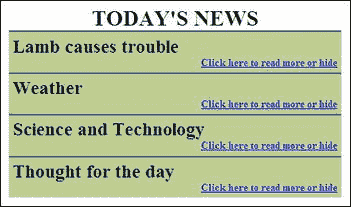

***图 13-5。**我采用了卡尔·斯威得伯格技术的最简单版本，并添加了一些用户友好的修饰。*

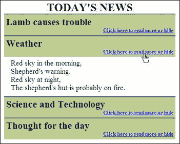

***图 13-6。**点击时新闻项展开。*

在图 13-5 和图 13-6 中创建带有显示/隐藏功能的标题页面的代码如清单 13-5 所示。

***清单 13-5。【show-hide.html 用 jquery 创建显示/隐藏页面***

`<!doctype html>
<html lang=en>
<head>
<title> Show/hide text from learningjquery.com</title>
<meta charset=utf-8>
        *meta details go here*

</head>
<body>

<h1>TODAY&#39;S NEWS</h1>
        

                <h2>Lamb causes trouble</h2>
                <h3>Click here to read more or hide</h3>
        
Mary had a little lamb<br**>**that walked into some soot<br**>**And everywhere 
        that Mary went<br**>**His sooty foot he put
        

        <h2>Weather</h2>
                <h3>Click here to read more   or hide</h3>
        
Red sky in the morning,<br**>**Shepherd&#39;s warning.<br**>**
                Red sky at night,<br**>**The shepherd&#39;s hut is probably on fire.
        

                <h2>Science and Technology</h2>
                <h3>Click here to read more or hide</h3>
        
Scintillate, Scintillate globule ethereal<br**>**How I contemplate your 
        structure and material. (with apologies to twinkle twinkle little star)
        

                <h2>Thought for the day</h2>
                <h3>Click here to read more or hide</h3>
        
&quot;Give me golf clubs, fresh air and a beautiful woman partner, 
        and you can keep your clubs and the fresh air.&quot; Jack Benny
        

        

        

</body>
</html>`

为了方便起见，清单 13-5 中使用了内部样式。图中显示了第二块 JavaScript 代码，但它通常会被提取到一个外部文件中，并命名为`show-hide.js`。然后，标记会像这样调用 JavaScript 文件:

`script src="show-hide.js" type="text/JavaScript">
</script>`

第一段 JavaScript 调用文件`jquery.js`；这是驱动这项技术的引擎。

``

下一个 JavaScript 块的第一行是`$(document).ready(function() {`

它说，“当页面加载后，执行下一行 JavaScript 代码。”

在 HTML 标记中，所有的新闻条目都包含在一个带有类`demo-show`的`
`中。

`

        *News snippets go here*

`

每个新闻条目都写在一个标记组中，如下所示(以粗体显示):

`<h2>Lamb causes trouble</h2>
<h3>Click here to read more or hide</h3>
**
Mary had a little lamb that walked into some soot And everywhere** 
**that Mary went His sooty foot he put**
**
**`

JavaScript 的第二行与用户交互。线`$('div.demo-show:eq(0)> div').hide()`；以 demo-show 类中的每个`
`为目标，隐藏`
`的内容。

接下来的两行针对演示组中的`<h3>`标记:

`$('div.demo-show:eq(0)> h3').click(function() {
$(this).next().slideToggle('fast');
);`

它们触发一个快速的切换动作，使`<h3>`标签的内容变成链接。这些链接显示或隐藏包含扩展新闻条目的 div。

CSS 样式使这些链接变成蓝色并带有下划线，以表明它们是活动链接。

最后，一个光标被添加到 CSS 中与`<h3>`目标相关的链接上。链接和光标样式以粗体显示。

`.demo-show h3 {  font-size:small; margin: 0; **color:blue;** 
**text-decoration:underline; cursor:pointer;** background: #bfcd93; 
text-align:right; padding:0 5px 5px 0;
}`

 **注意**光标名称`pointer`是用词不当；你会以为它是一个箭头，但它实际上是一只手。

新的 HTML5 `
`和`
`标签提供了一个显示/隐藏功能，但是在编写的时候只使用了 Chrome。因此，在没有合理范围的浏览器支持的情况下，我无法正确测试提议的标记。使用该功能时，可以点击`
`元素来扩展或缩小细节。

##### 在 HTML5 中显示/隐藏

新的 HTML5 显示/隐藏特性的标记如下所示:

`

Was the Mona Lisa a paint by numbers kit?

No, Leonardo used a graphics program on the world’s first computer, Colossus 

`

### 有用性

一个有用的网站会成为一个受欢迎的网站。例如，如果一个竞猜蜂鸣器制造商的网站包含有用的内容，如竞猜问题和各种可选竞猜游戏的说明，那么他可能会比其他竞猜蜂鸣器制造商更受欢迎。如果一个网站有一个可识别的品牌，一个容易理解的导航系统，和一个搜索网站的简单方法，那么这个网站就是有用的。

#### 用图标提升网站的形象

单词 *favicon* 代表收藏夹图标。这种图标可以增加网站的重要性，因为所有的大品牌都有一个 favicon。它们也有助于网站识别和品牌推广。更重要的是，它是有用的，它帮助用户快速识别收藏夹列表(书签列表)和浏览器标签中的特定站点。图 13-7 显示了我的计算机帮助网站上的图标。

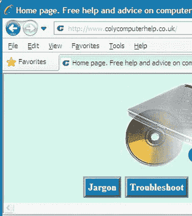

***图 13-7。**地址栏和选项卡中的“C”是[`www.colycomputerhelp.co.uk`](http://www.colycomputerhelp.co.uk)的图标*

在收藏夹或历史列表中突出的收藏夹是那些有一个图标的收藏夹，如图图 13-8 所示。

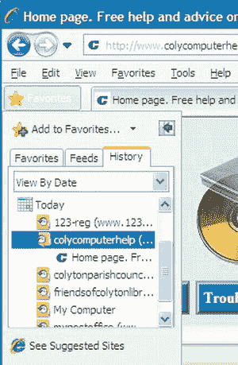

***图 13-8。**在收藏夹列表中,“C”图标非常突出。*

##### 创建网站图标

一个 favicon 必须是一个 16 像素的正方形，这意味着，因为它很小，你可以忽略细节。在图 13-9 中，放大显示了 Coly 计算机帮助图标；它证明了图标不能显示清晰的细节。然而，只要你简化内容，这并不重要。

***图 13-9。**科里电脑帮助图标*

**发挥你的聪明才智，选择一个有意义的图标。**对于我的网站( [` `www.colycomputerhelp.co.uk``](http://www.colycomputerhelp.co.uk) )，我选择了 URL 的第一个字母；即蓝色的独特大写字体“C”。如果可以，用一种颜色；这将使它在收藏夹列表和浏览器标签中脱颖而出。将图像缩小到 16 × 16 像素，保存为`.gif`或`.png`文件。重要的是保存为 16 色图像；否则会变得很模糊。现在它必须转换成一个`.ico`文件，并改名为`favicon.ico`。

 **提示**许多画图程序无法以`.ico`格式保存图像。Adobe Photoshop 需要一个插件，Paint Shop Pro 7 到 9 不会以`.ico`格式保存。免费程序 GIMP 和 IrfanView 保存`.ico`文件。IcoFX 是一个免费的图标制作程序。可从`[`www.icofx.ro`](http://www.icofx.ro)`下载。尽管使用起来相当棘手，但一旦掌握，它就是一个有用的工具。如你所料，它获取`.png`和`.gif`图像文件，并将生成的图标保存为*。ico* 文件。

**在主机**上传 favicon 图标到你的根目录，必须命名为`favicon.ico`。您不必向 HTML 代码添加任何内容。但是，如果您希望安全起见，或者 favicon 没有显示在特定的浏览器上，您可以在页面的`<head>`部分添加一个链接，如下所示:

`<link rel="shortcut icon" href="favicon.ico">`

除了 Chrome 之外的所有浏览器都会在地址栏的左边显示 favicon。除了 Chrome 之外的所有浏览器标签和收藏夹列表(书签)都会显示它。

 **注意**如果你有几个网站，每个网站都有一个图标，*它们都必须被命名为* `favicon.ico`。显然，为了避免混淆，你必须非常小心地把它们分开存放在与每个网站相关的文件夹中。

有一个潜在的问题。上传 favicon 后，您可能会发现它不会出现在地址栏中，尽管它可能会出现在浏览器选项卡上。这意味着你的网页的非 favicon 版本的拷贝存储在你的浏览器的缓存中，显示的是旧版本。你需要清空浏览器的缓存。或者，在其他人的计算机或您的其他计算机上查看该网站。如果您可以在另一台计算机或不同的浏览器中看到 favicon，那么您知道它已成功加载，即使您在常规浏览器中看不到它，而旧页面仍在您的缓存中。

#### 对访问者和所有者的有用性

如果一个网站包含了访问者需要知道的一切，那么它就是最有用的。如果信息不容易获取、不清楚或丢失，那么它就没什么用处。如果它经常更新，并且包含会让访问者一次又一次返回的条目，那么它就很有用。页面打印机按钮也使网页更有用，它将节省墨水和纸张(页面打印机按钮见第十七章)。

在商业网站的主页和所有其他页面上，**让访问者很容易联系到网站的所有者。**信息可以包含在每一页的页脚中。这样，无论保存或打印哪个页面，访问者都会保留那些重要的信息。然而，这可能会产生一个维护问题——如果您更改了其中一个项目，每个页面都必须更改。或者，如果您喜欢将信息放在一个页面上，请使用“联系我们”页面或“关于我们”页面。这些网页应该包括一个加密的电子邮件地址或一个反馈表的链接，以便访问者可以很容易地向所有者发送电子邮件；所有者的电话号码；和主人的邮政地址。联系方式——邮政地址和电话号码——对于树立信心和满足法律要求至关重要。明智的访问者不会从没有邮政地址或电话号码的网站上订购。还包括商业注册号和与适当的贸易协会的链接，以便客户可以检查企业的信誉。

**如果网站所有者希望人们在网上订购商品**，给用户所有必要的信息，让他们立即放心订购。**你必须展示价格**:如果游客不得不停下来打电话询问价格，销售很可能会失败。不要隐瞒销售税和送货费用等信息。如果在订单过程的最后突然增加额外的成本，潜在的订单可能会被放弃。提前警告客户额外的费用。

#### 不要让用户困惑

导航系统(菜单)必须非常清晰。导航越清晰，网站越有用。要决定在菜单上放什么，问这样一个问题，“访问者可能想从这个网站学到什么？”更好的办法是，问问其他人他们希望在网站上找到什么信息。例如，一个住宿加早餐网站的菜单按钮可能包括任何空房？价格，位置，住宿，预订表格，关于我们，联系我们。

让访问者轻松完成两件事:

> *   Get the information they are looking for quickly and easily.
> *   Can easily and logically move from one page to another.

如果用户不能方便快捷地找到信息，那么信息就是无用的。

最好的导航菜单按钮是带有对比文本的彩色非图形按钮。不要在菜单按钮上使用无字图片，因为导航需要解释；也就是说，你必须告诉人们点击图片获取更多信息。访问者期望一个简单明了的、水平的或垂直的菜单，不需要任何解释。如果你有大量的菜单项，那么在页面上同时使用水平和垂直菜单。使水平按钮比垂直按钮大。确保网站访问者不会感到困惑或被困。与非专业冲浪运动员一起测试网站。如果你的“试验品”说，“我下一步做什么？”

**避免 JavaScript 下拉菜单。**这些隐藏了访问者正在搜索的信息(最不友好)。尽量不要使用太多的子菜单。搜索引擎无法穿透 JavaScript 菜单，这意味着你的主页将是唯一被搜索引擎索引的页面。这确保了你的网站会有一个很低的排名，除非你的网站是关于一个独特的主题。此外，在移动和平板浏览器上使用 JavaScript 菜单可能会很困难，如果不是不可能的话。

不要让随意散落在页面上的零碎东西让访问者 **感到困惑。每页只写一个要点或主题。设计好每一页的布局，让用户能够关注你的要点。一个繁忙的页面不能引导用户到关键的功能。在相关组中显示事物。**

**练习一致性。**在每页的相同位置使用相同的导航按钮。在每一页上使用相同的背景颜色和字体。这很容易通过从你的主页制作一个模板来实现。样式表还应该确保一致性。

确保访问者知道他们在 **的哪一页，以及每一页将为他们做什么。如果游客不能马上解决，他们会去别的地方。在页面顶部放一个简短的说明性标题，这样人们不用向下滚动就能看到页面的内容。人们*会*向下滚动，但前提是他们有理由确信页面的其余部分有他们感兴趣的内容。**

避免带下划线的单词或短语。访问者会认为这些项目是超链接。下划线可以隐藏下划线。给文字加下划线的设计师是在暴露他们的年龄；下划线可以追溯到古代机械打字机的时代。下划线是完全没有必要的，因为你可以使用粗体或更大的字体或颜色来强调一个单词或短语。

#### 向网站添加搜索字段

搜索域可以增加网站的有用性，也可以吸引人们离开你的网站，这取决于它是如何实现的。如果你选择只在自己的网站上提供搜索功能，这没有问题。搜索集中在你的网站上，但是偶尔一两个其他的网站也会出现在搜索结果上。如果你选择搜索整个互联网的代码，那么用户将会被诱惑去探索一些搜索结果并放弃你的网站；这不是个好主意。接下来，我将描述由三大主流搜索引擎提供的网站搜索框代码:Bing、Yahoo！，还有谷歌。

##### 必应搜索框

添加阿炳搜索框，只搜索*你的*网站，如图图 13-10 所示。

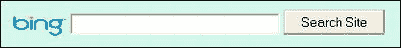

***图 13-10。**添加阿炳搜索字段*

主要的搜索引擎提供代码片段。Bing 是最容易安装的。清单 13-10 显示了如何在网页中包含阿炳搜索框。

***清单 13-10。【bing-search.html】网页中包含阿炳搜索框***

`<!doctype html>
<html lang=en>
<head>
<title>Bing search box</title>
        ****
</head>
<body>

 
**
**
<form method="get" action="http://www.bing.com/search">
        <input type="hidden" name="cp"**value="1252"**>
        <input type="hidden" name="FORM" value="FREESS">
        <a href="http://www.bing.com/">
        </a>
        <input type="text" name="q" size="30">
        <input type="submit" value="Search Site">
        <input type="hidden" name="q1" value="**site:www.yourweb site.com"**>
</form>
**
**

</body>
</html>`

以下注释涉及清单 13-10 中的粗体项目:

> *   Change the number **1252** to match the code page number of `charset` of your website. For example, if your website has `<charset:windows-1252>` in the title section, this number will be `1252`. If your website has `<charset:utf-8>` in the title section, this number will be `utf-8`.
> 
> `[www.your-web-site.com](http://www.your-web-site.com)`

##### 雅虎！搜索框

虽然雅虎！与必应合并后，一些大型机构使用雅虎！作为他们网站的默认搜索引擎。因为许多用户都熟悉 Yahoo！接口，它包含在本节中。为了雅虎！搜索框代码，去雅虎！在`[`search.yahoo.com/info/ysearchbox_instructions.html`](http://search.yahoo.com/info/ysearchbox_instructions.html)`或使用清单 13-11 。

图 13-11 显示了四个可用 Yahoo！搜索框。

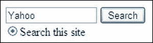

***图 13-11。**雅虎！搜索框*

有四种格式可用，但说明相当混乱。我已经简化了雅虎！代码，如清单 13-11 所示。

***清单 13-11。**包括雅虎网页上的搜索框(yahoo-search.html)*

`

        <form method=get action="http://search.yahoo.com/search">
        
        <input type="text" name="p" value="Yahoo" size=15>
        <input type="hidden" name="fr" value="yscpb">
        <input type="submit" value="Search"> 
        <input type="radio" name="vs" value="http://www.***your-web-site.com***" 
        checked="checked">Search this site
        </form>

`

插入您自己的网站 URL 来代替`[www.**your-web-site.com**](http://www.your-web-site.com)`。

##### 谷歌搜索框

图 13-12 显示了适用于网站的各种可下载的谷歌搜索框的一个版本。

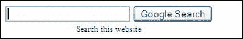

***图 13-12。**添加一个谷歌搜索栏*

谷歌要求你注册一个账户，然后它会给你一个令人困惑的表格让你填写。为了避免这些麻烦，戴维·泰勒简化并改进了谷歌代码。请访问他的网站`[www.askdavetaylor.com/how_can_i_add_a_google_search_box_to_my_website.html](http://www.askdavetaylor.com/how_can_i_add_a_google_search_box_to_my_website.html)`。

清单 13-12 改编自戴维·泰勒的代码。内部样式表仅用于说明目的。不需要谷歌帐户。它展示了如何在网页中安装一个 Google 搜索框。

***清单 13-12。【在网页中插入谷歌搜索框(google-search-1.html)***

`<!doctype html>
<html lang=en>
<head>
<title>Google search field by Ask Dave Taylor</title>
<meta charset=utf-8>
        
</head>
<body>

        <form method="get" action="http://www.google.com/search" >
        <input type="text" name="q" size="25" maxlength="255" value="">
        <input type="submit" value="Google Search"> 
        <input class="hidden" type="checkbox" name="sitesearch"
          value="**my-web-site.com**" checked="checked">Search this web site
        </form>

</body>
</html>`

对于您自己的网站，更改清单 13-12 中粗体显示的 URL。

图 13-13 显示了我的网站上的标题。它包含了使用我的简化版戴维·泰勒代码的谷歌搜索框(见清单 13-13 )。

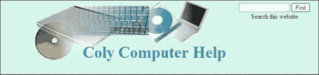

***图 13-13。我已经简化了网站的谷歌搜索；这不需要谷歌帐户。***

在清单 13-13a 中，我在页面标题中嵌入了谷歌搜索框，并进一步简化了戴维·泰勒的代码。如前所述，不需要谷歌账户。

***清单 13-13a。【google-search-2.html 在网页中嵌入谷歌搜索框***

`<!doctype html>
<html lang=en>
<head>
<title>A page with a search field using Google</title>
<meta charset=utf-8>
<link rel="stylesheet" type="text/css" href="search.css">
</head>
<body >

<h1 >Coly Computer Help</h1>

        <form method="get" action="http://www.google.com/search">
        <input type="text"   name="q" size="15" maxlength="255" value="">
        <input type="submit" value="Find">
        <input type="hidden" name="sitesearch" value="`http://www.your-web-site.co.uk`"> 
        Search this web site
</form>

</body>
</html>`

对于您自己的网站，请更改以粗体显示的 URL。

清单 13-13b 是清单 13-13a 中 HTML 的 CSS 样式表。

***清单 13-13b。**清单 13-13a 的 CSS 样式表 (search.css)*

`/*reset browsers for cross-client consistency*/
html,body,h1,h2,h3,h4,h4,h5,h6,p {margin:0; padding:0
}
img { border-style: none; float: none; margin-left: 0px; margin-right: 0px;
}
body { text-align:center; background-color:#D7FFEB; color:black; 
font-family: "times new roman"; max-width:1024px; min-width:800px; font-size: medium; 
color: #000000; margin: auto; width:95%;
}` `/* set header height and background image */
#hdr{ margin-top:0; margin-bottom:0; background-position:45% top; background-image:url('img/compbkgcrop.jpg'); background-repeat:no-repeat; height:160px; padding-bottom:0;
}
h1 { padding: 110px  0 0 12%; margin-bottom:0; font-family :"times new roman"; font-size: 250%; color: #0080a0;; font-weight:bold;
}
#hdr { position:relative;
}
.search { position:absolute; top:10px; right:40px; height: 56px;
}`

### 总结

本章描述了使网站吸引访问者的特性。它还展示了吸引访问者探索主页之外的方式。一个关于有用性的部分强调，即使是一个有吸引力的网站，如果没有用，也会被放弃或者不再访问。提供了创建有用特征的提示。经常查阅这一章，并在尝试书中的其他项目时应用它的建议。

在下一章中，你将学习使网站对残疾用户，尤其是盲人和弱视者无障碍的基本要求。包括美国和英国在内的许多国家已经就网站的可访问性提出了建议或通过了法律，您将会了解其中的要点。除了法律方面，这一章还解释了无障碍环境也为身体健全的用户提供了好处。