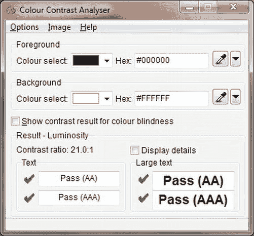
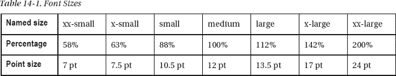
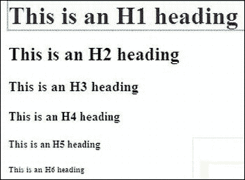
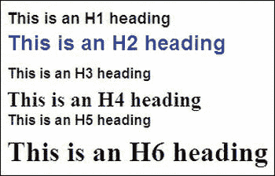
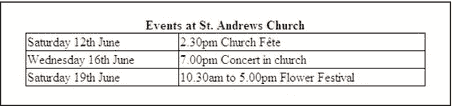
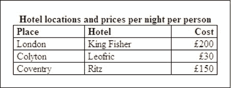
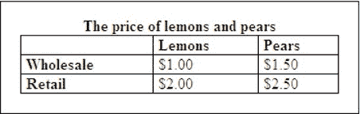
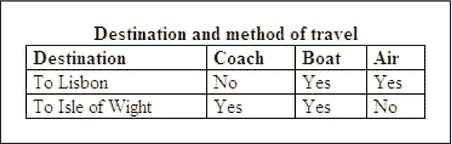
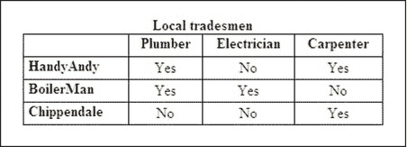
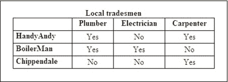

# 十四、可访问性

在美国和英国，三分之一的成年人超过 50 岁，其中一些人会有视力问题。阻止这些人访问你的网站是愚蠢的。许多电子商务网站在向盲人和弱视者开放网站后，销售额显著增加。本章主要讲述帮助弱视者和盲人浏览网站的方法。有严重视觉障碍的人和盲人可以使用屏幕阅读器(语音浏览器),将网站的文本内容转换成语音。屏幕阅读器还可以向用户解释网页的布局，以及描述标记中每个元素的性质。在本章的后面，你会学到更多关于屏幕阅读器和如何设计这些设备能理解的网站。我们将首先简要提及关于无障碍的现行法律和准则。

### 法律和准则

澳大利亚和联合王国制定了关于视觉障碍者无障碍访问网站的法律；其他国家如瑞典、爱尔兰和日本也制定了指导方针。

在美国，一些州已经发布了指导方针，在撰写本文时，美国司法部民权司正在考虑针对网站可访问性的联邦法规。同时，W3CAG2 和 WAI 是实现可访问性建议的主要力量。WCAG2 是 Web 内容可访问性指南(`[`www.w3.org/TR/WCAG/`](http://www.w3.org/TR/WCAG/)`)的首字母缩写。WAI 是网络无障碍倡议组织(`[`www.w3.org/WAI`](http://www.w3.org/WAI)` /)。

英国法律规定，残疾人应该可以或合理地可以使用网站。这项法律被称为《残疾歧视法》,代表《残疾歧视法》。澳大利亚已将《残疾歧视法》作为本国法律的基础

没有必要惊慌失措，开始重新设计你所有的网站以符合法律，但要努力修改那些最有可能被弱视者或盲人浏览的网站，尤其是那些使用屏幕阅读器的网站。这将表明你已经尽力让这些网站*合理地*可访问。当设计一个新的网站时，你应该记住从这一章中学到的东西。

包括英国和澳大利亚在内的大多数国家已经采用 WCAG2 指南作为其法律或指南的基础。

WCAG2 指南有三个标准。

> **答:**最低限度(但绝对必要)符合 WCAG2 指南
> 
> **AA:** 符合 WCAG2 指南
> 
> **AAA:** 完全符合 WCAG2 指南

网站必须至少符合 **A** 和 **AA** 。如果可能，尽量符合 **AAA** 。

可在`[`www.w3.org/WAI/intro/components.php`](http://www.w3.org/WAI/intro/components.php)`找到 W3 和 WAI 在无障碍规范方面的状态。可从`[`www.w3.org/TR/WAI-WEBCONTENT/checkpoint-list.html`](http://www.w3.org/TR/WAI-WEBCONTENT/checkpoint-list.html)`获得检查点列表。

 **注**W3 围准则和英国准则相似。以下网站在可访问性方面给出了很好的建议:`[`www.w3.org/WAI/PF/aria/`](http://www.w3.org/WAI/PF/aria/)`；`[`www.w3.org/WAI/intro/aria.php`](http://www.w3.org/WAI/intro/aria.php)`；`[`www.webcredible.co.uk/user-friendly-resources/web-accessibility/uk-website-legal-requirements.shtml`](http://www.webcredible.co.uk/user-friendly-resources/web-accessibility/uk-website-legal-requirements.shtml)`；还有`[`dev.opera.com/articles/view/introduction-to-wai-aria/`](http://dev.opera.com/articles/view/introduction-to-wai-aria/)`。

我们现在将讨论网页设计者可以为部分视力或色盲的用户提供的帮助。这些用户还没有达到需要屏幕阅读器的阶段。网站设计者可以通过应用一些基本的规则来使网站对弱视人群更加易读，这些将在下一节描述。

### 帮助弱视者和色盲者

这一节涉及的因素，帮助部分视力和色盲，但健全人也将受益于这一节的建议。它涵盖了颜色对比、文本样式/大小、导航的便利性和测试。

**颜色对比**文本和背景颜色的比例必须符合一定的标准。

> *   The color of hyperlinks should always be a high contrast color different from that of ordinary text.
> *   The contrast between text and background should be at least 4.5:1 at AA level and at least 5:1 at AAA level. See `[`www.w3.org/TR/WCAG/`](http://www.w3.org/TR/WCAG/)` for specific suggestions.
> *   The contrast of large text (super normal or bold) should be at least 3:1.

 **注意**确保你的 CSS 样式代码包含背景色和前景(文本)色。比如`{ …color:black; background-color:white; }`。不要在 CSS 和 HTML 之间拆分文本和背景颜色。一定要在一个地方定义它们。

 **提示**Juicy Studio 网站 [` `www.juicystudio.com/services/luminositycontrastratio.php``](http://www.juicystudio.com/services/luminositycontrastratio.php) 有一个优秀的在线对比度测试仪，只需输入你的背景和前景(文本)颜色的十六进制代码。或者在
`[`www.snook.ca/technical/colour_contrast/colour.html`](http://www.snook.ca/technical/colour_contrast/colour.html)`试试 Snook.ca 的色彩对比检查。

我最喜欢的分析仪 CCA-2.2(见图 14-1 )可以下载到你的硬盘上。

从`[`www.paciellogroup.com/resources/contrast-analyser.html`](http://www.paciellogroup.com/resources/contrast-analyser.html)`下载压缩文件`CCA-2.2.zip`

你可能已经下载了 CCA-2.2 当跟随第十二章。操作说明如下:向下滚动 Paciello Group 网站的主页，直到看到下载和语言版本列表。单击相应的语言版本下载 zip 文件。将其解压缩到一个新文件夹，然后创建一个桌面快捷方式来访问文件`CCA-2.2.exe`。

图 14-1 显示了颜色对比分析仪(CCA-2.2)的界面。

***图 14-1。**CCA-2.2 色彩对比分析仪*

要使用颜色对比度分析器，请按照下列步骤操作:

> 1.  Double-click the desktop shortcut (note that the spelling of the color in CCA interface is English and Australian *color* ).
> 2.  Use the drop-down arrow or enter a hexadecimal number to select the foreground color (text color).
> 3.  Select the background color as well.
> 4.  In the bottom panel, you will see the contrast and be told whether the contrast meets AA or AAA standards.
> 5.  Change the hexadecimal code one bit at a time until the desired color contrast is achieved. Write down the hexadecimal color code and use it to modify your CSS style sheet. Try this color blindness experiment: choose the most common form of color blindness with green foreground and red background. Now, the bottom panel of the box marked "Show color blindness comparison results" will be expanded to show the influence of these colors on three different forms of color blindness.
> 6.  If you click the option on the menu, you can adjust the color through the slider.

为了客观地看待问题，让我们看一个颜色对比变化的例子。一个客户要求我使用红色菜单按钮和白色标签。红底白字的对比度是 4:1。几乎相同的红色`#D20B0D`给出了 5.4:1 的好得多的对比度。使用这种新的红色，我可以取悦客户，也可以让弱视的人看到菜单按钮上的文字。色彩对比不是全部；我们还必须考虑文本的大小。

允许弱视用户通过使用他们自己的 CSS 样式表来改变文本大小。即使没有特殊的样式表，用户也可以改变文本大小；例如，在 IE 的“工具”下，选择“互联网选项”，然后选择“辅助功能”来选择字体大小。设计网站时，不要使用固定的尺寸，如`pt`或`px`；始终根据表 14-1 指定命名为的*字体大小或百分比。例如，下面的代码选择指定的字体大小`medium`:*

`body { background-color:#d7ffeb; font-family: Arial; **font-size: medium**; color: #000; }`

 **注意**不要使用颜色选择进行导航。一个不好的导航的例子是“点击绿色按钮进入下一页”。单击红色按钮返回上一页。”这样的说明对于严重视觉障碍的人和红/绿色盲的用户是没有用的。

避免使用大写字母或斜体的整句整段。小写字母的形状对每个人来说都更容易阅读，包括弱视的人。

也要避免使用对齐的文字，因为它很难阅读，即使对身体健全的用户来说也是如此。这是因为单词之间的间隙变化很大。对于那些使用屏幕阅读器和放大镜的人来说，大的间隙尤其会引起问题。用户读到一行的一半时可能会被愚弄，以为他们已经到达了行尾，导致他们向下移动到下一行的开始。

### 一般建议

以下提示将极大地帮助视力障碍者:

> 您可以创建使用不同样式表的替代页面，以提供高对比度。一个很好的例子，见`[`www.juicystudio.com/services/luminositycontrastratio.php`](http://www.juicystudio.com/services/luminositycontrastratio.php)`。
> 
> 多汁工作室菜单上的第二个按钮加载高对比度页面。如果您有几个页面,这不是一个合适的解决方案,因为每个页面的两个版本都必须更新。此外,搜索引擎不喜欢重复的网页组织页面，以便在样式表关闭时可以按逻辑顺序阅读。
> 
> *   Avoid using JavaScript for navigation and operation except for buttons such as printing this page, marking this page and returning to the previous page. These are acceptable only because they duplicate the functions available in all browsers.*   When providing information in PDF format, provide the same information in an accessible alternative format, such as HTML or text, or provide links to tools provided on Adobe websites. Adobe is improving the PDF format so that screen readers can read PDF files quickly.*   Ensure that links and page elements can be navigated by keyboard; Create a logical tab order for them.*   Do not appear pop-up windows or other windows without warning the user in advance.*   Give each page a unique `<title>` so that users can know their location in the site.*   Do not use tables for page layout. Use CSS to locate items on the page. Table-based layout is not suitable for disabled users. Most automatic compliance scanners reject them because they cannot distinguish between data tables and layout tables.*   Avoid using ASCII characters, such as the "less than" () symbol to point to something. The screen reader will read its meaning, whether it is "less than" or "greater than". Please use a mesh arrow or some text.*   Add a repeating menu and return to the top link on a long page at regular intervals. Don't use too many radio buttons and check boxes, because they will make the form more difficult to fill out.*   To help people with shaking hands, make sure there is enough space between fields, check boxes, menu buttons and radio buttons.*   Graphical menu buttons can be accessed as long as the title/alternate text describes the purpose of each button.*   Screen reader users cannot access JavaScript drop-down menus. Or the drop-down menu in PHP ASP is accessible.*   Make sure that the `<html>` tag contains a language description so that the screen reader can correctly interpret the page. For example, `<html lang=en>` is English.*   All images conveying useful information must contain tooltips for using `alt` and `title`. Pure decorative images can not convey useful information; Therefore, the correct alt/title of these images should be empty alt (`alt=" "`), and any empty title should be (`title=" "`). The screen reader will not read an empty `alt` or `title` string.*   Ensure that the video has subtitles so that the deaf can understand and appreciate it.*   Tab should provide a logical order for disabled users who can't use the mouse. The default jump order is reasonable, so don't change it.*   Use short and simple language. Text described by images is useless because screen readers can't read it. If you use an image containing text, be sure to include a `"alt"` tooltip that provides text for screen readers.*   This prompt is the most important: absolutely make sure that the audio and video clips are neither automatically started nor `onmouseover`. This sudden noise will surprise blind or amblyopic users. Always use `onmousedown` to start audio or video clips, and give explanations and warnings.*   在每一页(而不是主页)的开头添加一个“跳转到主要内容”链接，这样屏幕阅读器用户就可以直接跳转到内容，而不必重复地浏览导航菜单。一些设计者通过在每一页的开始放置一个普通的链接，或者一个图片，或者一个 1 像素的 GIF 图片(因此是不可见的)，标题文本为“跳到主要内容”确保措辞不是“跳到内容”使链接跳转到页面内容开始处的锚点(书签)。`<a href="#maincontent">
>          border="0"
>     alt="Skip to main content"></a>
>     *navigation menu which is to be skipped goes here*
>     <!--Start of main content-->
>     
>     *main content goes here*`
>     
>     这种方法的一个小缺点是,先前不可见的链接的突然出现会使视力正常的用户感到困惑。您可能会发现使用可见链接更好；选择权在你

 **提示**从皇家国家盲人学院的网站上可以搜集到有价值的信息。( [` `www.rnib.org.uk/webaccesscentre``](http://www.rnib.org.uk/webaccesscentre) 和`[www.rnib.org.uk/seeitright](http://www.rnib.org.uk/seeitright)`)。RNIB 使用免费的 WAVE 程序来监控可访问性。RNIB 用 WC3 和 WDG 验证器检查 HTML 和 CSS 的有效性。它使用各种图形浏览器和 Lynx 浏览网站，并使用 Freedom Scientific 的 JAWS(语音作业访问)收听网站如何说话。

### 测试网站的一般可访问性

设计者可以让一个弱视或失明的人充当试验品来测试网站的可访问性。然而，这可能是不可能的或不实际的，所以这里有一些你可以自己进行的测试。使用以下清单来查看您的网站是否可访问:

> *   At `[`validator.w3.org`](http://validator.w3.org)`
> *   Use W3C online validator to verify the code on the web page and rest the cursor on each image and each link to ensure that tooltips, substitutions and titles are displayed.
> *   Turn down the volume to see if there is any audio content with literal equivalence.
> *   Enlarge the font with the browser to see if the page is still alive.
> *   Resize the browser window to see if the content of the page is satisfactory with a small width.
> *   Ensure that users do not need to scroll horizontally to an unreasonable degree at low resolution.
> *   Check whether labels and title marks on menu links clearly indicate their destination.
> *   Ensure that people with disabilities can use the keyboard to browse links and form fields. Use the tab key to check this. Use clear, short and simple text, and divide it into small pieces with informative titles.
> *   Use prefaced content so that each paragraph begins with a conclusion. Use ordered or unordered lists where appropriate.
> *   Remove all flashing items, including the ticker.
> *   Make sure that absolute audio and video are not set to auto-start or `onmouseover`.

### 针对盲人和严重视力障碍者的屏幕阅读器

盲人和视力严重受损的人可以在屏幕阅读器的帮助下使用计算机，有时被称为“语音浏览器”，或者用技术人员喜欢的生硬的行话来说，“辅助技术”屏幕阅读器实际上并不阅读屏幕，而是阅读源代码。有关屏幕阅读器和表格的有趣音频演示，请访问`[`www.xstandard.com/en/articles/wysiwyg-editors-and-bad-markup/`](http://www.xstandard.com/en/articles/wysiwyg-editors-and-bad-markup/)`

 **提示**在`[www.nvda-project.org](http://www.nvda-project.org)`可以获得一个带有演示视频的免费开源屏幕阅读器。初步报告表明，NVDA 的 HTML5 支持比一些商业程序更先进。NVDA 是为 Mozilla Firefox 设计的。它有一个用户指南；更多提示请见
`[`www.marcozehe.de/articles/how-to-use-nvda-and-firefox-to-test-your-web-pages-for-accessibility/`](http://www.marcozehe.de/articles/how-to-use-nvda-and-firefox-to-test-your-web-pages-for-accessibility/)`。

屏幕阅读器和搜索引擎依赖标题标签`<h1>`到`<h6>`。当使用屏幕阅读器时，用户点击 H 键从一个标题跳到另一个标题。标题由屏幕阅读器读出，这样用户可以决定标题部分是否是他正在寻找的。如果你的页面没有`<h1>`到到`<h6>`的标题，屏幕阅读器会说，“这个页面上没有标题”，用户会很困惑。

在 20 世纪 90 年代早期，标题经常被错误地认为是一种让文本变得更粗、更大或更小的方式。这并不奇怪，因为 W3Schools.com 有这样一个相当模糊的指令:“`<h1>`定义最大的航向，`<h6>`定义最小的航向。”

正确的定义是:“`<h1>`最重要，`<h6>`最不重要。”

你可能在过去避免使用`<h1>`到`<h6>`，因为文本上下有很大的空隙。现在使用 CSS 可以很容易地解决这个问题。对于屏幕阅读器来说，重要的标题应该放在页面的顶部，最不重要的放在底部。代码中较早出现的标题更重要(搜索引擎和屏幕阅读器会认为它们更重要)。

> *   The title should simply and accurately describe the theme of the paragraph it introduces.
> *   Use CSS to make the title into any size and format you want (see Figure 14-3 ).
> *   From `h1`, never skip a title; For example, don't jump from `h2` to `h5`.

图 14-2 显示了默认的标题尺寸和行距。

***图 14-2。**未格式化的标题(注意文本行之间的双倍行距)*

图 14-2 显示了默认的标题样式。图 14-3 显示了使用清单 14-3 中包含的 CSS 格式的标题。你可能永远不会在真实的页面中改变字体大小，这只是一个演示，证明标题可以被格式化。但是，您可以有效地更改标题的行距。

***图 14-3。**使用 CSS 改变每个标题和行间距的外观和大小。幸运的是，屏幕阅读器仍然可以识别标题，如 H1、H2 等等。*

清单 14-3 显示了应用于每个标题的格式。可以更改标题大小和行距，以便为视力正常的人改善页面的外观。屏幕阅读器仍然接受标题的层次结构，并按照重要性的顺序读出它们。换句话说，视障用户理解页面的结构，因为他们首先听到主标题(H1)，然后是 H2、H3 等等。用户通过按 H 键从一个标题移动到另一个标题。

***清单 14-3。【hformatted.html 格式化 HTML 标题***

`<!doctype html>
<html lang=en>
<head>
<title>Formatted headings</title>
<meta charset=utf-8>
        
</head>
<body>
<h1>This is an H1 heading</h1>
<h2>This is an H2 heading</h2>
<h3>This is an H3 heading</h3>
<h4>This is an H4 heading</h4>
<h5>This is an H5 heading</h5>
<h6>This is an H6 heading</h6>
</body>
</html>`

### 数据表和屏幕阅读器

数据表给视障人士带来了一个大问题。如果一个表格的构造不适合屏幕阅读器的工作方式，那么一个有许多列的表格是无法理解的。首先朗读第一行标题，然后朗读第二行单元格，但不引用标题，然后朗读第三行单元格，依此类推。除非视障用户能够记住所有的标题，否则这些行将是难以理解的。

本节给出了一些表格的例子，从简单的两列表格(不需要记忆标题)到四列表格(通常需要记忆标题)。本节描述了几种使表格与屏幕阅读器一起工作的方法。使用这些技术，列标题被链接到单元格内容，并在用户移动每一行时朗读出来。通过向标记中添加额外的列，这些方法可以扩展到四列以上。

 **注意**表格仅用于呈现数据。可访问页面不得包含布局表格。

#### 有两列的数据表

图 14-4 显示了一个简单的两列数据表，其内容易于屏幕阅读器阅读，不需要特殊标签。但是，一定要用`<caption>`和`<table…summary="…">`。这使得屏幕阅读器能够通知用户他们已经到达一个表。

***图 14-4。**两栏数据表*

普通的两列表格不需要标题。屏幕阅读器将一个单元格一个单元格地阅读每一行，不需要记忆列标题。图 14-4 是使用清单 14-4 创建的，它有一个内部样式表，仅用于指导目的。

***清单 14-4。【创建两列表格(simple-2col.html ??)】***

`<!doctype html>
<html lang=en>
<head>
<title>Two column table with no need for headers</title>
<meta charset=utf-8>

</head>
<body>
<table>
<caption>Events at St. Andrews Church</caption>
        <tr>
                <td>Saturday 12th June</td>
                <td>2.30pm Church F&ecirc;te</td>
        </tr>
        <tr>
                <td>Wednesday 16th June</td>
                <td>7.00pm Concert in church</td>
        </tr>
        <tr>
                <td>Saturday 19th June</td>
                <td>10.30am to 5.00pm Flower Festival</td>
        </tr>
</table>
</body>
</html>`

对于包含三列或更多列的表格，盲人用户和有严重视力问题的人必须记住标题才能理解数据。下一个例子是我们克服这个问题的第一个方法。通过将列标题顶行中的`<td>`替换为`<th>`可以避免这一困难。标签`<th>`描述了一个包含标题信息的单元格。

 **注意**为了听到屏幕阅读器朗读的表格单元格，有视觉障碍的人可以使用 Ctrl+Alt 键和右箭头键来移动这些行。

#### 有三列或更多列的数据表

图 14-5 显示了一个更复杂的三栏表格。使用屏幕阅读器的人首先会听到最上面一行的标题，通过使用将单元格链接到标题的方法，就不需要记住标题。用户可以将光标放在位置标题下的第一个单元格中。然后，用户可以使用 Ctrl+Alt 和右箭头键沿着行移动。用户会听到下面的话:“伦敦广场，费希尔国王酒店，200 美元。”

然后，仅点击向下箭头将把用户带到下一行的开始，用户将再次使用 Ctrl+Alt 和向右箭头听到这个:“Place Colyton，Hotel Leofric，Cost 30”。

***图 14-5。**三栏数据表*

 **注意**在撰写本文时，HTML5 页面中的表格无法被大多数旧屏幕阅读器正确读取。这尤其适用于 JAWS(语音作业访问)。在屏幕阅读器赶上 HTML5 之前，您将需要使用 XHTML 1.0 页面来使盲人能够阅读您的数据表。网站中任何不包含数据表的页面都可以使用 HTML5，但是要避免使用语义标签，直到屏幕阅读器能够支持它们。在`[`validator.w3.org`](http://validator.w3.org)`中验证 XHTML 1.0 页面。查看第十八章关于验证 XHTML 1.0 页面的提示。

只要你使用 XHTML 文档类型，所有的表格和图 14-5 到 14-9 都可以被当前和旧版本的屏幕阅读器读取。当屏幕阅读器赶上 HTML5 时，您可以切换到 HTML5 DOCTYPE，但这会给使用旧版本 JAWS 的用户带来问题。清单 14-15 创建了一个适合屏幕阅读器的三个标题的表格。

***清单 14-5。【three-col-hotels.html】创建具有三列的可访问表***

`<!DOCTYPE html PUBLIC "-//W3C//DTD XHTML 1.0 Transitional//EN" "http://www.w3.org/TR/xhtml1/DTD/xhtml1-transitional.dtd">
<html >
<head>
<meta content="text/html; charset=utf-8" http-equiv="Content-Type" />
<title>Three column table with th headers</title>
        ` `</head>
<body>
<table summary="Simple table with headers">
<caption>Hotel locations and prices per night per person</caption>
        <tr>
                **<th>**Place**</th>**
                **<th>**Hotel**</th>**
                <**th** class="right">Cost</**th**>
        </tr>
        <tr>
                <td>London</td>
                <td>King Fisher</td>
                <td class="right">&pound;200</td>
        </tr>
        <tr>
                <td>Colyton</td>
                <td>Leofric</td>
                <td class="right">&pound;30</td>
        </tr>
        <tr>
                <td>Coventry</td>
                <td>Ritz</td>
                <td class="right">&pound;150</td>
        </tr>
</table>
</body>
</html>`

我们的第二种方法允许使用标签`<thead>`和`<tbody>`创建一个稍微复杂一点的表格。同样，必须使用 XHTML 1.0，直到旧的屏幕阅读器被能够读取 HTML5 页面中的表格的新版本所取代。

#### 数据表使用<头>和<体>

为了将数据链接到屏幕阅读器的标题，需要使用标签，如`<thead>`、`<tbody>`、`<th>`、`<tr>`和`<td>`。标签`<thead>`是表格的标题区域；`<tbody>`是表格中包含数据的区域(见图 14-6 )。

***图 14-6。**更高级的数据表*

在清单 14-6 中，`<thead>`和`<tbody>`项以粗体显示。

***清单 14-6。**创建更复杂的可访问表格(three-col-fruit.html)*

`<!DOCTYPE html PUBLIC "-//W3C//DTD XHTML 1.0 Transitional//EN" "http://www.w3.org/TR/xhtml1/DTD/xhtml1-transitional.dtd">
<html xml:lang="en">
<head>
<meta content="text/html; charset=utf-8" http-equiv="Content-Type" />
<title>Three column table with thead and tbody</title>

</head>
<body>
<table summary="The price of lemons and pears">
                <caption>The price of lemons and pears</caption>
                **<thead>**
                        <tr>
                                <td></td>
                                **<th>**Lemons**</th>**
                                **<th>**Pears**</th>**
                        </tr>
                **</thead>**
                **<tbody>**
                        <tr>
                                **<th>**Wholesale**</th>**
                                **<td**>$1.00**</td>**
                                **<td>**$1.50**</td>**
                        </tr>
                        <tr>
                                **<th>**Retail**</th>**
                                **<td>**$2.00**</td>**
                                **<td>**$2.50**</td>**
                        </tr>
                **</tbody>**
        </table> 
</body>
</html>`

接下来，我们将看看第三种方式来创建表格，在屏幕阅读器上给出可理解的语音。单元格将使用标识(`id`)链接到标题。

#### 使用 id 将列和行链接到标题

正常情况下，屏幕阅读器读取单元格，就好像它们是`
`标签一样；例如，如果图 14-7 中的表格被编码成一个简单的表格，没有 id 或者标题标签，下面两行将被屏幕阅读器读出为:“To Lisbon No Yes Yes。去怀特岛是是不是。”

不是很有帮助。我相信你会同意的。

相反，图 14-7 中的表格使用 id 和标题信息将单元格链接到屏幕阅读器的标题。

***图 14-7。**将列和行链接到具有< id >和<th>的标题*

在下一个方法中，下面的代码片段显示了如何通过向每个`<th>`元素添加一个`<id>`属性，将每个数据单元格链接到其列标题和行中的第一项。首先，每个标题被赋予一个`id`，将它链接到它的`<th>`。例如:

`<tr>
<th id="th1">Destination</th>
<th id="th2">Coach</th>
<th id="th3">Boat</th>
<th id="th4">Air</th>
</tr>`

然后将标题`id`链接到每个单元中的数据；例如:

`<tr>
<td headers="th1">To Lisbon</td>
<td headers="th2">No</td>
<td headers="th3">Yes</td>
<td headers="th4">Yes</td>
</tr>`

每个单元格都链接到它的标题，以便屏幕阅读器能够陈述这种关系。当用户沿着标题下面的行移动时，它会读取单元格的标题和内容，如下所示:“目的地是里斯本，蔻驰，不，乘船，乘飞机。”清单 14-7 包括如下片段:

*清单 14-7**。使用`id`和`headers`(four-col-travel.html)***创建可访问的表

`<!DOCTYPE html PUBLIC "-//W3C//DTD XHTML 1.0 Transitional//EN" "http://www.w3.org/TR/xhtml1/DTD/xhtml1-transitional.dtd">
<html >
<head>
        <meta content="text/html; charset=utf-8" http-equiv="Content-Type" />
        <title>Four column table with id and th</title>
                
        </head>
        <body>
        <table summary="Destination and method of travel">
        <caption>Destination and method of travel</caption>
        <tr>
                <th id="th1">Destination</th>
                <th id="th2">Coach</th>
                <th id="th3">Boat</th>
                <th id="th4">Air</th>
        </tr>
        <tr>
                <td headers="th1">To Lisbon</td>
                <td headers="th2">No</td>
                <td headers="th3">Yes</td>
                <td headers="th4">Yes</td>
        </tr>
        <tr>
                <td headers="th1">To Isle of Wight</td>
                <td headers="th2">Yes</td>
                <td headers="th3">Yes</td>
                <td headers="th4">No</td>
        </tr>
        </table>
        </body>
        </html>`

下面的示例使用了第四种方法，该方法使用了`scope`属性而不是`id`属性来将单元格数据与其标题以及行中的第一项相关联。

#### 使用范围链接单元格和标题

对于如图 14-8 中所示的表格，id/headers 对可以替换为`scope`属性。可惜用了这么一个不伦不类的词；类似于`cell-linker`的东西会比`scope`更好地解释它的目的。

***图 14-8。**链接单元格和标题与范围*

***清单 14-8。【使用 Scope 创建可访问的表(four-col-scope.html)***

`<!DOCTYPE html PUBLIC "-//W3C//DTD XHTML 1.0 Transitional//EN" "http://www.w3.org/TR/xhtml1/DTD/xhtml1-transitional.dtd">
<html >
<head>
<meta content="text/html; charset=utf-8" http-equiv="Content-Type" />
<title> Four column table using scope</title>
                
        </head>
        <body>
        <table summary="Linking cells to headers using scope">
        <caption>Local tradesmen</caption>
        <tr>
                <th></th><!--empty cell-->
                <th scope="col">Plumber</th>
                <th scope="col">Electrician</th>
                <th scope="col">Carpenter</th>
        </tr>
        <tr>
                <th scope="row" class="left">HandyAndy</th>
                <td>Yes</td>
                <td>No</td>
                <td>Yes</td>
        </tr>
        <tr>
                <th scope="row" class="left">BoilerMan</th>
                <td>Yes</td>
                <td>Yes</td>
                <td>No</td>` `        </tr>
        <tr>
                <th scope="row" class="left">Chippendale</th>
                <td>No</td>
                <td>No</td>
                <td>Yes</td>
        </tr>
        </table>
        </body>
        </html>`

我们现在来看第五个例子，展示图 14-7 中所示的相同表格，并使用我们之前学过的方法。

#### 使用< th >和 id 链接单元格和标题的进一步练习

在清单 14-7 的中，我们学习了如何使用`<th>`和`id`以及`headers`将单元格链接到表格标题。我们现在将在本地零售商表上使用此方法，作为使用范围的替代方法。该表的外观将与图 14-8 中的相同，为了方便起见，它再次显示为图 14-9 中的，以便您在研究清单时可以参考。

***图 14-9。**该表与图 14-8 相同，但通过使用< th >、id 和 headers 代替 scope 实现。*

清单 14-9 通过使用`id`代替`scope`创建了一个四列表格，其外观与图 14-8 相同。屏幕阅读器的用户将听到与其标题相关的每个数据单元格。相关的标签和属性以粗体显示。

***清单 14-9。【four-col-trade-id.html】创建可访问表图 14-9 不使用范围***

`<!DOCTYPE html PUBLIC "-//W3C//DTD XHTML 1.0 Transitional//EN" "http://www.w3.org/TR/xhtml1/DTD/xhtml1-transitional.dtd">
<html >
<head>
<meta content="text/html; charset=utf-8" http-equiv="Content-Type" />
<title>Four column table but using id instead of scope</title>
        
        </head>
        <body>
        <table summary="Table 14-6\. As table 5 but not using scope">
        <caption>Local Tradesmen</caption>
        <tr> <th></th><!--empty cell-->
                **<th id**="plumber">Plumber</th>
                **<th id**="electrician">Electrician</th>
                **<th id**="carpenter">Carpenter</th>
        </tr>
        <tr>
                **<th id**="ha">HandyAndy</th>
                **<td headers**="ha plumber">Yes</td>
                **<td headers**="ha electrician">No</td>
                **<td headers**="ha carpenter">Yes</td>
        </tr>
        <tr>
                **<th id**="el">BoilerMan</th>
                **<td headers**="el plumber">Yes</td>
                **<td headers**="el electrician">Yes</td>
                **<td headers**="el carpenter">No</td>
        </tr>
        <tr>
                **<th id**="ca">Chippendale</th>
                **<td headers**="ca plumber">No</td>
                **<td headers**="ca electrician">No</td>
                **<td headers**="ca carpenter">Yes</td>
        </tr>
        </table>
        </body>
        </html>`

 **提示**使用`scope`、`colgroup`、`colspan`和`rowgroup`的复杂表格的说明可以在罗杰·哈德森的网站上找到:http:// `www.usability.com.au/resources` 。

我们已经看到，有几种不同的方法可以帮助屏幕阅读器以有意义的方式朗读表格单元格数据；而且都管用。那么应该用哪种方法呢？

从使数据表尽可能简单开始。复杂的表格通常可以拆分成两个或多个简单的表格。简化表格后，尝试我们首先讨论的最简单的方法。如果像 JAWS 这样的屏幕阅读器能够理解它，那很好。如果没有，请尝试稍微复杂一点的方法。

下一节讨论我们如何制作适合屏幕阅读器的反馈表单。

### 屏幕阅读器和反馈表格

盲人和视力严重受损的人可以使用屏幕阅读器填写表格。要做到这一点，表单必须遵循以下准则:

> *   Tables do not use table layout. Use CSS and make the order of form fields as logical as possible.
> *   Leave enough space between the form elements to help those who have difficulty placing the cursor due to shaking hands.
> *   No explanation is given at the end of the form. Users with screen readers and screen enlargement functions will not realize this information until they reach the end of the form.

表单布局的完整列表在这里没有显示，因为这个主题在第十一章中已经详细讨论过了。相反，下面的列表描述了单个表单元素最容易访问的格式。

> *   **Location indicates the best accessibility.** Prompt is the text explaining the purpose of the field; For example, your name, email, etc.
> *   **The prompt text** in the input field and text area should be in the field on the left side of *or the* field above *. For this reason, `<label>` statement must appear before `<input>` statement.*
> *   **对于屏幕阅读器，代码必须包括`for`和`id`。**`<input>`元素的`id`必须与`<label>`元素相关联，并且对于该页面必须是唯一的。标签是`for`一个可识别的输入字段。在本例中，标签为*表示*和`<input>`，标识为`id="username"`。`<label **for**="username">Your Name:</label>
>     <input **id**="username" name="username" size="30">`
>     
>     表单元素会出现在屏幕上,并带有盲人用户希望找到它的提示,如下所示:
>     
>     
>     
>     **你的名字: .验证需要`'alt'`属性 Mozilla Firefox 只响应`'title'`，因此两者都被使用**
>     
>     
> *   **Because not all check boxes or radio buttons need to be selected** , you cannot apply "required" or "optional" to individual check boxes or buttons. Apply the required or optional instructions to the *heading* of each group of boxes or buttons.
> *   **The prompt of check box and radio button must be on the right side of field** , and it must be unique and clear. Compared with the previous example, the order of label and input statements must be reversed (input appears before label). This places the prompt to the right of the element. For able-bodied and disabled users, tables should always use **`for`** and **`id`** . This is essential for screen readers.

复选框的列表如下所示:

`        <input type="checkbox" **id**="chkbox1" name="coffee" value="Yes">
        <label **for**="chkbox1"><strong>Coffee</strong></label>`

单选按钮的代码如下所示:

`        <label **for**="laptop">
        <input type="radio" name="computer" value="Laptop" **id**="laptop">Laptop
        </label>&nbsp;&nbsp;&nbsp;
        <label **for**="desktop">
        <input type="radio" name="computer" value="Desktop" **id**="desktop">Desktop
        </label>`

 **注意**使用单选按钮时(确保只能选择一个选项)，一组单选按钮中的每个单选按钮必须具有相同的名称但不同的值。在前面的示例中，相同的名称是“计算机”，不同的值是“笔记本电脑”和“台式机”

***文本区的代码片段***

> 标签`<textarea…>`用来代替`<input…>.`。`label`语句必须在`textarea`语句之前，如下所示:

`        <label for="suggest"><b>Please type your content suggestion or message</b></label>
        <textarea **id**="suggest" name="suggestion" rows="12" cols="40">
        </textarea>  `

> *   **Check your form in the browser to test whether the prompt text is correctly associated with the form item.** When you click the prompt text, a blinking cursor will appear in the field (the form field has become the focus). Checked the check box or selected the radio button.
> *   **In the long table, the grouping information is placed in the related chunks. This is helpful to both visually impaired Internet users and users with normal vision. You can also use HTML tags `<fieldset>` and `<legend>`, but not all browsers can display field sets correctly. The following is a code fragment of a field set:**

`<fieldset>
<legend>Personal details</legend>
--- Form items (eg title, name, age) ---
</fieldset>
<fieldset>
<legend>Contact information</legend>
--- Form items (eg address1, address2, town, postcode, phone) ---
</fieldset>`

> *   **Mark all date fields** , especially where the separate input fields are placed in one line. The screen reader will only associate the date text label with the first text input field. It is recommended to use one field marked DD/MM/YYYY, or use three fields marked with labels, one for the three fields day, month and year.
> *   **The placeholder text in the field is no longer necessary** and may be a trouble for modern screen readers.
> *   **Don't select** by using the drop-down field that depends on JavaScript, because screen reader users can't access them; Although recent improvements enable the latest screen readers to handle a certain amount of JavaScript.
> *   **In chapter 11 of , a complete working example of the accessible form with anti-spam filter** is provided.

### html 5、XHTML5 和 CSS3 的屏幕阅读器

屏幕阅读器的创造者需要时间来调整他们的程序以适应新的建议。直到这种情况发生，直到他们的行为为人所知，网页设计师应该使用 HTML4 或 XHTML 1.0 的数据表。

导航菜单的新标签将会引起一些困惑，直到屏幕阅读器的标准被决定；因此，继续使用本章前面描述的“跳到 HTML5 中的主要内容”。

HTML5 页面中最有问题的元素是多个标题`(h1`到`h6)`和`<hgroup>`。在这些问题解决之前，继续使用 HTML4 或 XHTML。

“跳转到 HTML5 中的主要内容”怎么样？在 HTML5 中，你可以专门标记页面上所有的“次要”内容——比如导航、品牌、版权声明——所以你不能专门标记页面上最重要的部分——内容，这有点奇怪。但是，具体标记它的目的是什么呢？如果你需要设计风格，使用`
`。

 **提示**很多支持 HTML5 的浏览器都没有实现辅助功能支持。要跟踪这个问题的进展，请参见 [` `www.webaim.org/techniques/tables/data``](http://www.webaim.org/techniques/tables/data) 和 [` `www.accessibleculture.org/articles/2011/10/jaws-ie-and-headings-in-html5/``](http://www.accessibleculture.org/articles/2011/10/jaws-ie-and-headings-in-html5/) 。

### 测试您的网站的屏幕阅读器可访问性

以下是测试网站时建议遵循的步骤。

> *   When you record any problems you find, please ask a person with amblyopia to look at the scene.
> *   Let a user with severe visual impairment listen to the website with a screen reader, and write down any problems you find. If possible, listen to your website with a screen reader on your own computer. The most popular screen reader is JAWS for Windows (also the most expensive). You can download the limited time trial version of JAWS from `[`www.freedomscientific.com`](http://www.freedomscientific.com)`, or search for the limited time version of MS Windows-Eye. For free screen readers, please visit `[`www.nvda-project.org`](http://www.nvda-project.org)`
> *   Submit the revised website or page to a free automatic compliance scanner (ACS), such as `[`wave.webaim.org`](http://wave.webaim.org)` WAVE. WAVE will provide a report detailing what your website does not meet the requirements. WAVE's report is quite easy to understand. WAVE focuses on how the screen reader responds to your page. It uses colored icons, which give useful explanations when the cursor hovers over the icons. Unfortunately, WAVE currently does not support color contrast.

AbilityNet ACS ( `[www.abilitynet.org.uk/](http://www.abilitynet.org.uk/)`)报告色彩对比度。它使用 Compliance Sheriff 扫描仪，只有初始扫描是免费的。合规警长报告一开始可能会令人困惑。它包含许多描述 WCAG 建议的方框，但很少提示如何纠正不合规之处。Compliance Sheriff 不区分布局表和数据表。它错误地建议布局表格应该有标题、摘要，甚至范围。

要知道 AbilityNet 虽然是一个优秀的慈善机构，但是资金有限。它只允许对你的网站进行一次免费扫描。通过每页 170 美元(120 英镑)的首次免费扫描。请记住，自动化的可访问性测试工具不能检查内容是否以对视觉障碍者有帮助的方式编写。他们的职责是检查标记是否适合屏幕阅读器进行智能解释。使用前置内容很重要，这样每段都以结论开头。这仅仅意味着不要强迫用户去阅读一个很长的段落来了解它的内容。使用记者的“标题”技巧，在第一行或标题中讲述段落的内容。

 **提示**下面的屏幕阅读器和其他资源也可以下载:browse aloud[``www.browsealoud.com``](http://www.browsealoud.com)Thunder`[`www.screenreader.net`](http://www.screenreader.net)`和 WebbIE(免费) [` `www.webbie.org.uk``](http://www.webbie.org.uk) 如果你用火狐，看看`[`www.firevox.clcworld.net/about.html`](http://www.firevox.clcworld.net/about.html)` Fire Vox 是 Mozilla Firefox 的屏幕阅读器。

皇家国家盲人学院为设计无障碍网站提供了一个非常有用的清单。参见`[`www.rnib.org.uk/professionals/Documents/WAC_See_it_Right_standard.doc`](http://www.rnib.org.uk/professionals/Documents/WAC_See_it_Right_standard.doc)`

 **提示**参见`[`www.hassellinclusion.com/2011/01/web-accessibility-myths-2011-part2/`](http://www.hassellinclusion.com/2011/01/web-accessibility-myths-2011-part2/)`关于网站可访问性的启发性和争议性的想法。

### 总结

在本章中，您了解了残障人士，尤其是视力残障人士遇到的 web 辅助功能问题。简要参考英国法律和美国关于该主题的指导，给出了有用的网站地址以供进一步参考。这一章提到了色彩对比和字体大小对弱视者的重要性。

一份详细的清单为您提供了一种评估网站可访问性的方法。关于屏幕阅读器的部分描述了它们如何工作以及与数据表相关的问题，尤其是 HTML5。本章描述了可用于屏幕阅读器的表单元素。在设计网站时，试着记住这些提示，尤其是对盲人或弱视者有用的网站。

下一章将介绍过时的元素。您将学习如何使用 CSS 来替换它们。HTML5 引入了新的标签，增加了不推荐使用的元素的数量。工作示例将演示如何替换不推荐使用的元素。