# 十五、废弃那些不推荐使用的项目

术语“不推荐使用的项目”意味着万维网联盟(W3C)已经淘汰了这些项目，您不应该使用它们。包含不赞成使用的标记和属性的页面将无法通过验证，也不适合手持设备、屏幕阅读器或搜索引擎。

我有时会从另一个网站管理员那里接管网站的维护和重新设计。网站通常是旧的，充满了过时的内容。我的第一个任务是用现代的对等物替换所有被否决的项目。你可能会被要求做类似的工作。本章将帮助您更新网站，并向您展示如何避免在未来的网站中包含不推荐使用的项目。

本章包括以下几节:

> *   List of disapproved items and their modern alternatives
> *   Advantages of deleting deprecated items
> *   Avoid the table layout of columns.
> *   Avoid table layout of extensible content panel.
> *   Use CSS instead of tables for multiple boxes with borders.
> *   CSS3 module for multiple columns

### 不推荐使用的项目

在 HTML4 的早期，一些标签和属性已经被废弃了。还有一些在 HTML5 中被否决了；它们都一起列在表 15-1 和 15-2 中。当增强或更新一个网站上的页面时，你应该抓住机会用 CSS 或新的标签替换所有不推荐使用的项目。如前所述，如果有人将旧网站转让给你，过时的项目将需要替换。

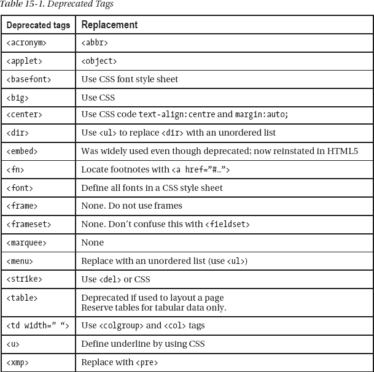

表 15-2 中列出的属性必须全部被 CSS 样式替换。

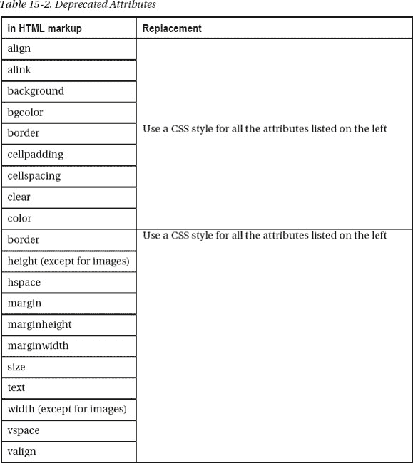

#### 替换不推荐使用的项目

当不推荐使用的项目被 CSS 替换时，HTML 标记的数量将会减少。然而，CSS 表将包含更多的标记。这带来了净节省，因为 CSS 表是一个单一的页面，但许多链接到样式表的 HTML 页面将具有较少的标记。

我通常在像图 15-1 这样的长页面上放置一个向上箭头。单击箭头会使光标跳到页面顶部。

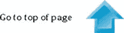

***图 15-1。**一个向上箭头及其文本*

用于向上箭头的旧 HTML 标记将包含此处以粗体显示的不推荐使用的项目:

`   
<b><**font size="3" face="Times New Roman"**>Go to top of page****</b>
   <a href="#top">
        </a>
   
`

移除不推荐使用的项目并使用 CSS 样式表后，标记变为:

`   
<b>Go to top of page</b>
   <a href="#top">
        </a>
   
`

当与图像一起使用时，宽度和高度标签在 HTML 标记中是可接受的。字体系列细节和类`up-arrow`将在 CSS 样式表中定义如下:

`.up-arrow { font-family: "times new roman"; font-size:100%; font-weight:bold; 
text-align:center; border:0; vertical-align:middle;
}`

我使用一个`class`而不是一个`id`,因为在很长的页面上我需要不止一个向上箭头。

标记从 241 个字符减少到 172 个字符，标记现在将生效。在网站中，这种节省将在包含向上箭头的每个页面中实现。

**当侧栏**中有多个上箭头时，创建一个名为`class="up-arrow-more"`的额外的上箭头类。

在 CSS 样式表中，附加的类如下所示:

`.up-arrow-more { font-family:"times new roman"; font-size:100%; font-weight:bold; 
 text-align:center; border:0; vertical-align:middle; **margin-top:400px;**
}`

页面上的附加箭头被赋予类别`up-arrow-more`。`margin-top:400px`强制向上箭头垂直分开 400 像素的距离。这避免了在每个向上箭头之间插入大量换行符` `或`
`标签的需要。

##### 锚

在早期，页面顶部的着陆点由 HTML 4 标记设置为

``

属性`name`现在应该被替换为`id`。代码变成了``。这是现在所有 HTML 版本的通用做法。

同样的建议也适用于其他页面上的锚；例如，要从一个页面链接到另一个页面上的特定位置，链接可能是

`<a href="page3.html#colyton">Click for more information about Colyton</a>`

当点击时，链接会把用户带到`page3.html`上的一个地方，标签为

``

**验证:**包含不赞成使用的项目的页面将不会被验证。手持设备和搜索引擎可能会受到无法验证的页面的阻碍，因为它们包含不推荐使用的项目。

HTML4 中不赞成使用 **<嵌入>** 标签，它将无法验证。然而，它被广泛使用(尤其是在视频中)，以至于它在 HTML5 中得到了复兴。它的回归受到热烈欢迎。

#### 粗体和斜体文本

关于弃用，经常会出现以下问题:现在是否应该用`<strong></strong>`代替`<b></b>`，用`<em></em>`代替`<i></i>`？

标签`<b></b>`没有被弃用，标签`<strong></strong>`给出了类似的结果，但是用户的浏览器设置可以覆盖它。CSS 的对等词是`b { font-weight:bold; }`。

标签`<i></i>`没有被否决，标签`<em> </em>`给出了类似的结果，但是用户的浏览器设置可以覆盖它。等价的 CSS 代码是`i {font-style:italic;}`。

当我忙的时候，我会交替使用这两个词，因为我发现这两个词之间的区别太微妙了，根本不用担心。

一般来说，使用`<i>`将一个单词或短语变为斜体，但不改变其强调或语气；例如:“不要错过今晚电视 123 频道的堕落肥皂剧

 *用`<em>`来强调一个单词或短语；例如:“你是说实际上*喜欢*那个节目？”

### 数据表好，布局表差

表格应该只用于显示数据。早期的网站使用表格来进行页面布局，现在许多网站仍在使用表格。几年前，万维网联盟(W3C)就不赞成页面布局使用表格。移动设备肯定不喜欢表格布局。表格布局导致页面臃肿。表格布局的 HTML 可能比 CSS 布局大三到四倍。

一旦掌握，CSS 布局比表格布局有更大的力量和灵活性。对于使用屏幕阅读器、语音输出浏览器、盲文浏览器和文本浏览器的人来说，表格布局可能是个大问题(见第十四章)。由数据行和列组成的可接受的表格，如表 15-3 。

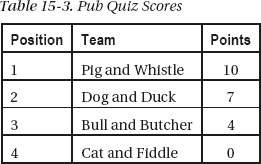

 **注**特殊规则适用于帮助残疾人的数据表。这些在第十四章中有描述。

### 多列无表格

基于 CSS2 的多列设计非常容易，不需要使用表格。(本章这一节可以看作是对第十二章多栏节的补充。)CSS3 可以创建文本列(参见本章后面的“新的 CSS3 列模块”)，但是目前很少有浏览器支持这一功能。

#### 一个基本的三栏页面，各栏颜色相同

在这些例子中没有使用语义标签，因此 IE 7 和 IE 8 可以显示结果，而不必求助于添加 JavaScript 的复杂性。如果您希望使用语义标签，请务必添加 JavaScript 片段，并更改 CSS 中的显示指令，如第一章所述。

图 15-2 显示了 CSS 创建的三列。

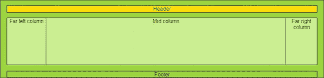

***图 15-2** 。一个有五个部分的三栏页面*

这是通过创建五个部分来实现的:页眉和页脚各一个，每列一个。纯粹主义者会对我使用的表示标记感到震惊。设计师不鼓励使用像`leftcol`和`rightcol`这样的标识符；标识符应该指示内容而不是位置。在这个和随后的例子中，为了清楚起见，使用了表示性的词语`leftcol`、`rightcol`和`midcol`。在真实的网页中，它们可以被类似于`menu-col`、`advert-col`和`main-content`的东西所取代。

清单 15-2a 使用 CSS 表示产生三列，而不是使用一个废弃的表格布局。

***清单 15-2a。【在不使用表格的情况下创建三列(three-col-no-tables.html)***

`<!doctype html>
<html lang=en>
<head>
<title>Three columns without tables</title>
<meta charset=utf-8>
        *meta details go here*
<link href="three-col-no-tables.css" rel="stylesheet" type="text/css" />
</head>
<body>

        
Header

        <!--start of main panel that contains the menus and four columns of content-->
        

                
Far left column<!--the far left column starts-->
                
<!--end of far left column>
                
Far right column<!--start of the far right column-->
                

                
Mid column<!--Start of the middle column-->
                
<!-- midcol closed-->
        
<!-- main panel closed--> 
        
<!-- start of footer-->
                Footer
        
<!--footer closed-->

<!--container closed -->
</body>
</html>`

CSS 布局在清单 15-2b 中提供。

***清单 15-2b。**图 15-2 (三列无表. css)* 布局的 CSS 样式表

`body {background:white; font-family:arial; font-size:medium; color:black; 
margin:auto; padding:7px;
}
#container { width:960px; border:1px black solid; margin:auto; text-align:center; 
margin-top:0; background:#a5f400;
}
#hdr {width:920px; height:20px; margin:15px auto 15px auto; background:yellow; 
color:black; border:1px black solid;
}
/*THE MAIN PANEL CONTAINS THE THREE COLUMNS*/
#mainpanel {margin:auto; background:#d2ff81; text-align:center; width:920px; 
height:140px; border:1px black solid;
}
#leftcol {float:left; width :115px; height: 140px; border-right:1px black solid;
}
#rightcol { float:right; width:92px; border-left:1px black solid; height:140px;
}
*SET MARGINS FOR MID COLUMN. THIS SITS BETWEEN THE FAR LEFT AND FAR RIGHT COLUMNS*/
#midcol { margin-left:120px; margin-right:105px; text-align:center; border:1px black solid;
}
#ftr {width:920px; margin:auto; text-align:center; clear:both; background: #a5f400; 
border: 1px black solid;
}`

#### 一个基本的四列页面，各列颜色相同

图 15-3 显示了 CSS 标记产生的四列显示。

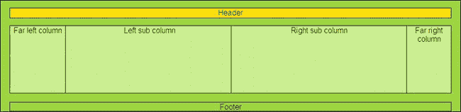

***图 15-3。**不使用表格的四列*

创建四列只需使用`
`将中间的一列拆分成两个子列。清单 15-3a 和 15-3b 的将它们标识为`subleft`和`subright`。

***清单 15-3。【four-col-no-tables.html】创建不带表格的四列布局***

`<!doctype html>
<html lang=en>
<head>` `<title>Four columns with no tables</title>
<meta charset=utf-8>
<meta details go here>
<link href="four-col-no-tables.css" rel="stylesheet" type="text/css">
</head>
<body>

        
Header

        

                
Far left column

                
Far right column

                

                        
Left sub column

                        
Right sub column

                

        
 
                
Footer

</body>
</html>`

图 15-3 的 CSS 布局由清单 15-3b 提供。

***清单 15-3b。**提供四列的 CSS 布局(四列无表. css)*

`body {background:white; font-family:arial; font-size:medium; color:black; margin:auto; 
padding:7px;
}
#container { width:960px; border:1px black solid; margin:auto; text-align:center; 
margin-top:0; background:#a5f400;
}
#hdr {width:920px; height:20px; margin:15px auto 15px auto; background:yellow; 
color:black; border:1px black solid;
}
#mainpanel {margin:auto; background:#d2ff81; text-align:center; width:920px; 
height:140px; border:1px black solid;
}
#leftcol {float:left; width :115px; height: 140px; border-right:1px black solid;
}
#rightcol { float:right; width:92px; border-left:1px black solid; height:140px;
}
#midcol { margin-left:120px; margin-right:105px; text-align:center;
}
**#subleft** { float:left; width: 49%; height: 140px; border-right:1px black solid;
}
**#subright** { float: right; width:49%; height: 140px; border:0;
}
#ftr {width:920px; margin:auto; text-align:center; clear:both; background: #a5f400; 
border: 1px black solid;
}`

### 背景颜色不同的四列

图 15-4 显示了四根不同颜色的柱子。

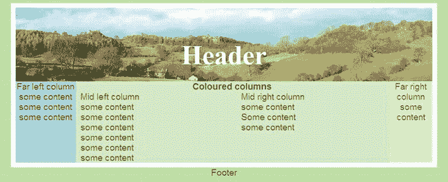

***图 15-4。**四列三色*

如果你需要不同颜色的柱子，设计会变得更加棘手，如图 15-4 。就我个人而言，我更喜欢相同的颜色，它看起来很有品位，将注意力集中在主题上，给设计师带来的问题更少。但是，如果您需要不同颜色的列，下面将介绍最简单的方法。(本章末尾提供了其他方法的来源。)

清单 15-4a 提供了四列页面上的内容。

***清单 15-4a。【colour-columns1.html】用三种颜色创建四列内容***

`<!doctype html>
<html lang=en>
<head>
<title>Colour columns</title>
<meta charset=utf-8>
        *meta details go here*
<link rel="stylesheet" type="text/css" href="style-colourcols1.css">
</head>
<body>

        
<h1>Header</h1>
        

        

                
Far left column

some content

some content

                
some content

&nbsp;

&nbsp;

&nbsp;

&nbsp;

        

        

                
Far right column

some content

&nbsp;

&nbsp;

                
&nbsp;

&nbsp;

        
` `        

        <h2><b>Coloured columns</b></h2>
        

                
Mid left column

                
some content

some content

some content

some content

                
some content

some content 

        

        

                
Mid right column

                
some content

Some content

some content

        

        

                ** **

Footer

</body>
</html>`

清单 15-4b 中的是显示彩色列的样式表，如图 15-4 中的所示。

***清单 15-4b。**彩色列的 CSS 样式表(style-colourcols1.css)*

`/*SETTINGS FOR MAXIMUM CONFORMITY BETWEEN BROWSERS*/
html, body, h1, h2, h3, h4, h5, h6, p, ol, ul, li, form, fieldset, blockquote { 
padding: 0; margin: 0; font-size: 100%; font-weight: normal;
}
img { border:0;
}
body { background:#BBD999; font-family:arial; font-size:120%; color:#4B6113; 
margin:auto; padding:7px;
}
#container { width:900px; border: 10px white solid; margin:auto; text-align:center; 
margin-top:0; background-color:#CEE1BA; color:#4B6113;
}
#hdr { padding-top:18px; height:141px; width:100%; margin:auto; 
background-image:url('img/banner.jpg'); background-repeat:no-repeat; 
background-position:65;
}
#hdr h1 { font-family: "times new roman"; text-align:center; color: white; 
font-weight:bold; font-size: 300%; margin-top:50px;
}
#leftcol { float:left; width :130px; display:inline; background-color:#ACC;
}
#rightcol { float:right; width:92px; text-align:center; 
background:url(img/yellow-square.gif) repeat-y right top;
}
/*SET MARGINS ON MID COLUMN*/
#midcol { margin-left:140px; margin-right:105px; text-align:center;
}
/*SET COLUMN WIDTHS FOR CONTENT. THESE SIT WITHIN THE MIDCOL*/
#mid-left-col {width:47%; float:left; text-align:left;
}
#mid-right-col {width:47%; float:right; text-align:left;` `}
/*ENSURE DIVS AUTOMATICALLY STRETCH VERTICALLY TO ACCOMMODATE VARIOUS AMOUNTS OF CONTENT*/
br.clear { clear:both;
}
/*SET FOOTER TO CLEAR PRECEDING COLUMNS*/
#ftr {text-align:center; clear:both;
}`

### 没有桌子的可延伸的彩色中央嵌板

对于下一个例子，我要感谢 Diana Board 女士允许我使用我为她的网站设计的主页。

以下所有示例都不使用表格。图 15-5 显示了一个四列页面。带有白色边框的浅绿色内容面板需要调整，使其向下扩展以匹配内容的数量。

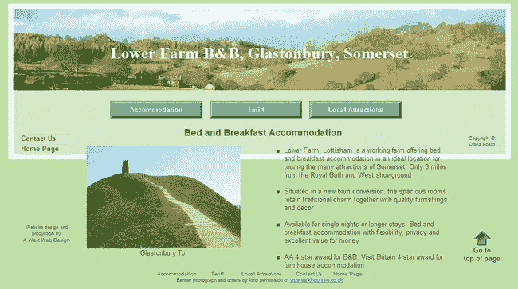

***图 15-5。**未被削弱的页面*

图 15-6 显示了向下扩展的内容面板，没有采用表格布局。

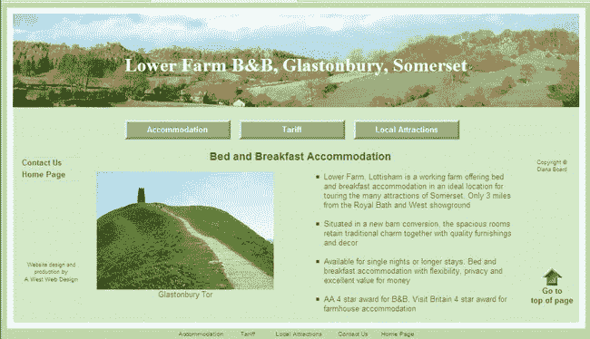

***图 15-6。**被调整的页面*

本主页图 15-6 中使用的两张照片是步行英国(`[www.walkingbritain.co.uk](http://www.walkingbritain.co.uk)`)的善意许可。

清单 15-6 中粗体的项目是下拉框架的调整。在清单 15-6 中，许多内容被省略了，因为它们与要表达的观点无关。你可以从合作网站 http://www.apress.com[下载完整的清单。](http://www.apress.com)

***清单 15-6。**为图 15-6【tweaked.html】*所示的页面创建结构

`<!doctype html>
<html lang=en>
<head>
<title>Tweaked page</title>
<meta charset=utf-8>
        *meta details go here*
<link rel="stylesheet" type="text/css" href="style-fixed-sans.css" />
</head>
<body>

<h1>Lower Farm B&amp;B, Glastonbury, Somerset</h1>

<!--start of main panel and horizonal buttons--> 
<ul id="hmenew">
        *The horizontal menu buttons go here*
</ul> 

<!--side menu column starts-->
<ul id="menu">
        *The two vertical menu buttons go here*` `</ul>
        *Web design details and copyright notices go here*

<h2>Bed and Breakfast Accommodation</h2>
&nbsp;

 
Glastonbury Tor 

<ul>
         <li>Lower Farm, Lottisham is a working farm offering bed and breakfast 
         accommodation in an ideal location for touring the many attractions of 
         Somerset. Only 3 miles from the Royal Bath and West showground
&nbsp;
</li>
         <li>Situated in a new barn conversion, the spacious rooms retain traditional 
        charm together with quality furnishings and decor
&nbsp;
</li>
         <li>Available for single nights or longer stays. Bed and
        breakfast accommodation with flexibility, privacy and excellent value for 
        money
&nbsp;
</li>
         <li>AA 4 star award for B&amp;B. Visit Britain 4 star award for farmhouse 
        accommodation</li>
</ul>

** ** 

*Footer links and photograph permissions go here*

</body>
</html>`

向下拉动面板和边框的方法是放置在 CSS 样式表中的一个附加项。添加的代码如下:

`/*ENSURE DIVS AUTOMATICALLY STRETCH VERTICALLY TO ACCOMMODATE VARIOUS AMOUNTS OF CONTENT*/
br.clear { clear:both;
}`

现在我们来看看包含图像和文本的盒子。这些传统上以表格的形式呈现。但是因为表格已经过时，下一节将向您展示如何通过使用 CSS 样式表来取消表格。

### CSS 框和边框

在过去，网页设计师会用一个表格来构建图 15-7 。既然表格已经过时，那么必须使用 CSS 来构造这些框。图 15-7 展示了一组完全通过 CSS 构建的盒子。

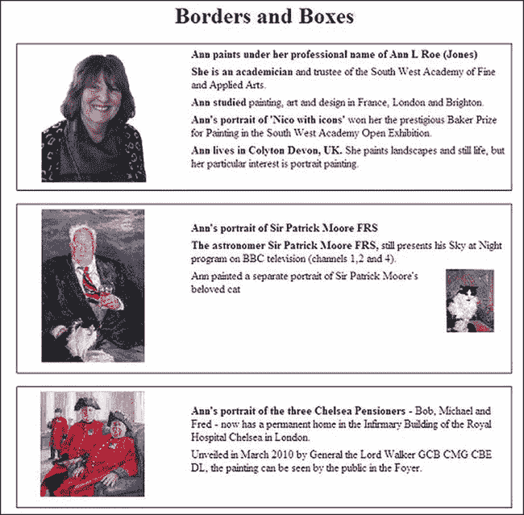

***图 15-7。**无表格的方框和边框*

肖像画家安·罗·琼斯好心地允许我使用我为她设计的网站上的物品。这些用于图 15-7 中的。您可以在`[www.annroejones-artist.co.uk](http://www.annroejones-artist.co.uk)`查看她的网站。

为了清楚起见，这里使用了内部样式。这些盒子在它们自己的`
`中定义，每个盒子都有一个类`mainpanel`。面板由代码` `分开。

***清单 15-7。【borders-boxes.html】为一组盒子创建结构和 CSS 表示***

`<!doctype html>
<html lang=en>
<head>
<title>Borders and boxes</title>` `<meta charset=utf-8>
                *meta details go here*
        
</head>
<body id="wrapper">

<h1> Borders and Boxes</h1>

**
**
        

        

        

        

        
 <b>Ann paints under her professional name of Ann L Roe (Jones)</b>

        
<b>She is an academician</b> and trustee of the South West Academy of Fine 
        and Applied Arts.

        
<b>Ann studied</b> painting, art and design in France, London and Brighton.

        
<b>Ann's portrait of 'Nico with icons'</b> won her the prestigious Baker Prize 
        for Painting in the South West Academy Open Exhibition.

<b>Ann lives in Colyton Devon, UK. </b>
        She paints landscapes and still life, but her particular interest is portrait 
        painting.

        

** **
**
** 
**
**
        

        
&nbsp;

        

        
 
        
<b>Ann's portrait of Sir Patrick Moore FRS</b>

<b>The astronomer 
        Sir Patrick Moore FRS, </b>
        still presents his Sky at Night program on BBC television (channels 1,2 and 4).
`         `
Ann painted a separate portrait of Sir Patrick Moore's 
        beloved cat (see inset on the right)

        

** **
**
** 
**
**
        

        
&nbsp;

        

        
 
<b>Ann's portrait of the three Chelsea Pensioners</b>
        - Bob, Michael and Fred - The painting now has a permanent home in the Infirmary 
        Building of the Royal Hospital Chelsea in London.
Unveiled in March 2010 by 
        General the Lord Walker GCB CMG CBE DL, the painting can be seen by the public in 
        the Foyer. 
        

** **
**
** 
</body>
</html>
The next section discusses the new CSS3 module for creating multiple columns.`

### 用于列的新 CSS3 模块

现在布局表格已经过时了，设计者必须放弃传统的显示文本列的方式，而使用多单元格的表格来显示不可见的边框。在本章的前面，我描述了如何使用 CSS 来实现包含文本的多列。

CSS3 有新的多栏布局模块，这可能是所有推荐模块中最令人兴奋的节省时间的模块。当它被完全采用时，我们可能会看到那些文本在屏幕上传播的可怕网站的终结。它肯定会成为列的表格布局的死穴。

可以定义列的宽度和数量。您所期望的新样式关键字是，`column-width`和`column-count`。可以使用称为`forcolumn-gap`的宽度在列之间创建一个空间。可以使用`column-rule`创建列之间的垂直线。内容会像在出版软件中一样从一列流到另一列。

在撰写本文时，只有 Mozilla Firefox、Chrome 和 Safari 支持新的多栏模块。然而，Firefox、Chrome 和 Safari 通过自己独特的方式来处理这个问题:Firefox 用`-moz-`，Safari 和 Chrome 用`-webkit-`。可悲的是，IE 7、IE 8 和 IE 9(以及撰写本文时的 Opera)忽略了 CSS3 列样式。所以，CSS3 多列可能在 IE 7、IE 8、IE 9 灭绝之前的几年内都不会被网页设计师使用。

 **注意** CSS3 不依赖于 HTML 版本。CSS3 增强功能可以在 HTML4、XHTML 和 HTML5 中工作，但前提是浏览器支持它们。Firefox、Safari 和 Chrome 支持多列。微软在 2010 年 9 月声明，IE 9 将不支持 CSS3 多列。

图 15-8 和 15-9 显示了 CSS3 多列在不同浏览器中的显示方式。

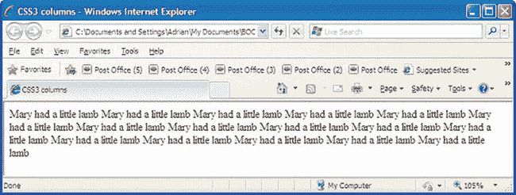

***图 15-8。**CSS3 多栏标记无法在 Internet Explorer 6、7、8、9 和 Opera 中显示*

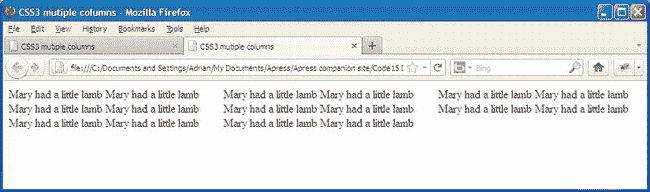

***图 15-9。【CSS3 多栏如何在 Mozilla Firefox、Safari 和 Chrome 中显示***

在清单 15-8 中，粗体代码建立了支持浏览器显示这两个图中的列的方式。

***清单 15-8。【css3-columns.html】使用 CSS3 可以在栏中显示的内容模板***

`<!doctype html>
<html lang=en>
<head>
<title>CSS3 mutiple columns</title>
<meta charset=utf-8>
        *meta details go here*

</head>
<body>

` `Mary had a little lamb Mary had a little lamb Mary had a little lamb Mary had a little lamb
Mary had a little lamb Mary had a little lamb Mary had a little lamb Mary had a little lamb
Mary had a little lamb Mary had a little lamb Mary had a little lamb Mary had a little lamb
Mary had a little lamb Mary had a little lamb Mary had a little lamb Mary had a little lamb

</body>
</html>`

CSS3 可以提供竖线，也就是将一个项目与另一个项目分开的线。图 15-10 显示 CSS3 可以提供段落之间的划分规则。

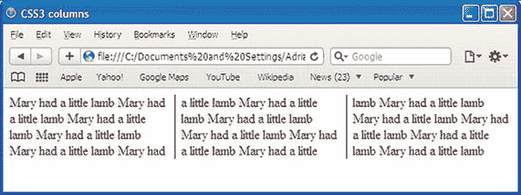

***图 15-10。【CSS3 多栏如何显示 Mozilla Firefox、Safari 和 Chrome 中的规则***

在撰写本文时，垂直规则要求 Mozilla Firefox 的 hack `-moz-`和 Safari 的`-webkit-`。在下面的代码片段中，规则的新 CSS3 列模块关键字以粗体显示。

`#content { -moz-column-count: 3; -moz-column-gap: 1em; **-moz-column-rule: 1px solid black;**
-webkit-column-count: 3; -webkit-column-gap: 1em; **-webkit-column-rule: 1px solid black;**
}`

***清单 15-10。【css3-3col-rules.html 在 CSS3 列之间引入垂直规则***

`<!doctype html>
<html lang=en>
<head>
<title>CSS3 mutiple columns</title>
<meta charset=utf-8>
<meta details go here>

</head>
<body>

Mary had a little lamb Mary had a little lamb Mary had a little lamb Mary had a little lamb
Mary had a little lamb Mary had a little lamb Mary had a little lamb Mary had a little lamb` `Mary had a little lamb Mary had a little lamb Mary had a little lamb Mary had a little lamb
Mary had a little lamb Mary had a little lamb Mary had a little lamb Mary had a little lamb

</body>
</html>`

当浏览器窗口水平收缩时，三列的宽度会相应减少。它们还向下延伸以容纳所有内容。如果内容容器具有固定的宽度，则当浏览器窗口收缩时，列保持相同的宽度。

有一天，我们将能够省略黑客攻击，只使用以下 CSS3:

`#content { column-count: 3; column-gap: 1em; column-rule: 1px solid black;
}`

当浏览器最终实现下一批特性时，多列模块将非常灵活；例如，下一段 CSS 标记将固定列的宽度，并将调整列的数量以适应内容空间。列宽标记将列宽设置为至少 15 em 宽。确切的列数将取决于可用的内容宽度。

`#content { column-width: 15em;
}`

在下一段 CSS3 标记中，列数将是固定的，但是每列的宽度将会改变以适应内容区域的宽度。

`#content { column-count: 3;
}`

可以使列的长度相等，如下所示:

`#content { column-fill: balance;
}`

可以制作一个跨越各列的标题，如下所示:

`h2 { column-span: all;
}`

列规则(列之间的垂直线)可以省略，也可以有各种宽度和颜色，如下所示:

`#content {column-rule: thin solid blue;
}`

许多其他多栏功能正在模块的管道中，但尚未完成；在撰写本文时，它们也不能在浏览器中使用。它们包括以下内容:

`column-space-distribution,    break-before:column;    break-inside:avoid-column;
and break-after:avoid-column;`

 **提示**参见 A List Apart 网站`[www.alistapart.com/articles/css3multicolumn/](http://www.alistapart.com/articles/css3multicolumn/)`了解新的 CSS3 多栏模块的全面处理。参见
`[`developer.mozilla.org/en/docs/CSS3_Columns`](http://developer.mozilla.org/en/docs/CSS3_Columns)`和`[www.w3.org/TR/css3-multicol/](http://www.w3.org/TR/css3-multicol/)`。

### 总结

本章提供了一个不推荐使用的标签和属性的列表，这些是您在设计或重新设计网站时应该避免的。向上箭头装置用于展示转储废弃项目的优势。因为表格已经过时，所以描述了几种用 CSS 样式替换它们的解决方案。本章给出了使用 CSS 布局时可能出现的问题的解决方案。描述了一种构造一系列没有表格的有边框的盒子的方法。传统上，带有不可见边框的表格用于显示文本列；本章给出了使用 CSS2 替换表格的说明，然后演示了新的 CSS3 多栏解决方案。

在下一章中，你将学习搜索引擎是如何工作的，并且你将被介绍优化你的网站的方法，这样它们将在搜索引擎的结果中出现在更高的位置。*