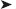

# 十六、搜索引擎优化

当你在 Bing，Yahoo！，还是谷歌？你可以增加出现在最初几页的机会，但是如果不为一个有利的位置付费，就不能保证早出现。

本章向您展示如何提高您的评分，以及应该避免什么。您将获得信息，帮助您了解搜索引擎如何选择与用户的搜索词(关键字)相对应的网页。

让你的网站出现在搜索引擎的页面上是免费广告的一种形式。然而，其他方式的广告你的网站不应该被忽视。这一章包括了一些建议，告诉你如何通过其他方式来宣告你的网站的存在，从而补充搜索引擎的工作。

### 概述

搜索引擎优化(SEO)可能会令人沮丧。你的一个网站可能不会出现在搜索列表中，即使它已经过很好的优化。在搜索引擎的首页查看某些网站的源标记；你可能会发现有些并没有很好的优化。为什么你优化得很好的站点没有被列出来，而非优化的站点却被列出来了？只有搜索引擎知道为什么。

搜索结果似乎不一致。我的一个网站在谷歌的第二页底部，在必应的第二页第一。两周后，我的网站从谷歌上消失了，但仍在必应上的同一个位置。一个月后，它重新出现在谷歌第三页的底部。为什么呢？我想不出合理的解释。

SEO 与其说是一个科学的过程，不如说是一门神秘的艺术。这不应该阻止网站设计者尽最大努力优化网站。我的网站在雅虎的第一页排得很靠前！，但只在谷歌的第七页。这是因为雅虎！专注于关键词和网站优化，而谷歌更依赖于网站外部链接的数量(网站的受欢迎程度似乎比它对搜索者是否有用对谷歌更重要)。

同样令人沮丧的是，SEs 需要三到五个月的时间来索引一个优化良好的新网站。令人惊讶？不会，因为 SEs 使用的机器人要爬遍 2.4 亿个现有网站才能更新。除此之外，他们每年还会抓取近 5000 万个新的。每年约有 4000 万人变得不活跃，可能会从阿瑟指数中删除。

时间是一个重要的方面。虽然 SEs 可能会在三到五个月内索引一个新的域名，但这并不意味着它会在搜索结果中有一个好的排名。有时候，在你的网站靠近搜索结果的第一页之前，还需要五到六个月的时间。一些富裕的公司会购买一个完善的，高排名的域名，而不是从头开始一个新的域名。不太富裕的人应该立即上传一些基本内容，而不是等到网站完成后再上传。这让 SEs 对其进行索引并开始“试用期”,而网站的其余部分正在开发中，

一个优化良好的网站相当于在你的街道上有一个名牌，在你的房子上有一个门牌。在极少数情况下，邮递员无法投递你的邮件，但如果没有门牌号和街道名称，他投递邮件的能力就会大大降低。如果没有优化，SEs 索引你的网站并为搜索者列出的机会就会大大减少。

网络爬虫是 SEs 用来搜索每个网站，寻找关键词和关键短语的机器人。然后可以对网站进行索引，以便用户可以搜索拥有这些关键字的网站。大多数网站主机都有流量监控系统(有时称为 web stats)。您可以使用它来查看网站被 SEs 抓取的时间和频率。

 **提示**要获得一流的资源，试试彼得·肯特的*傻瓜搜索引擎优化*(威利，2010)。彼得描述的技术可读性很强，一步一步的指导非常清晰，易于实践。它包含额外的点击付费等项目，以及大量非常有用的资源。要获得有用的互联网资源，请访问 Phil Craven 的网站，`[`www.webworkshop.net`](http://www.webworkshop.net)`还可以在`[`www.seomoz.org/term-extractor`](http://www.seomoz.org/term-extractor)`尝试 SEOmoz 的术语提取器。这个工具从任何特定的网页中提取关键字，并模仿搜索引擎蜘蛛。

### 当心虚假的承诺

警告你的客户，在网站上线后，他们会在短时间内被不道德的人发来的邮件纠缠。即使客户的电子邮件地址被加密或使用了安全的联系方式，骗子也可以通过尝试`info@yourwebaddress.co.uk`等地址做出合理的猜测。然后，他们试图说服你的客户为网站的优化付费。给你的客户一份下面的警告:

**诈骗警告:**在推出一个网站后，垃圾邮件发送者会联系网站所有者，提出改善他们的搜索引擎优化。如果一个拥有者被这个欺骗了，她将会付很多钱，而垃圾邮件发送者将会什么都不做。*事实上，垃圾邮件发送者也无能为力*。一些可怕的人甚至声称为谷歌、雅虎工作。、或必应，或者他们声称在那些组织内部有联系人。一个特别讨厌的样本用电话联系受害者。他说，他为谷歌工作，如果受害者拒绝使用他的“服务”，他将从谷歌的索引中删除该网站。

真正的 SE 优化器确实存在，但他们不会使用垃圾邮件，也不会使用通用的电子邮件地址，如`@hotmail`或`@gmail`。他们有一个完善的服务，可以检查其真实性。但是为什么要花钱买一份你可以在本章的帮助下自己完成的工作呢？

### 页面排名和受欢迎程度

搜索引擎对他们的搜索标准和网页排名方法非常保密。SEs 可能偶尔会修改他们的规则，但一般原则将保持不变。

#### 页面排名

我发现网页排名对网站在搜索结果列表中的位置没有很大的影响。我有网页排名很差的网站在搜索结果中排名靠前，反之亦然。因此，我忽略页面排名，专注于网页在结果列表中的位置。然而，尽管最近网页排名的重要性有所下降，你可能会从网页排名的监控中获得一些好处。如果你想知道更多关于网页排名的信息，请看 Phil Craven 在`[`www.webworkshop.net/pagerank.html`](http://www.webworkshop.net/pagerank.html)`的详细解释

当与搜索引擎相关时，可以从两个方面来考虑*流行度*这个词。它可以指网站本身的受欢迎程度，也可以指网站主题(即其关键词)的受欢迎程度。

#### 知名度和外部链接

谷歌和必应非常重视网站的受欢迎程度，他们将其等同于网站的有用性。他们认为人们不会链接到一个无用的网站。受欢迎程度与一个网站的点击率无关。必应，尤其是谷歌，主要通过检测指向你网站的外部链接的数量来决定受欢迎程度。雅虎！另一方面，会检测网站中关键字的数量和内部链接页面的数量，给出与搜索栏中键入的关键字更相关的结果。

我有经常出现在雅虎首页的网页！因为网页优化得很好。然而，使用相同的搜索词，谷歌和必应对它们的评价并不高，只是因为指向它们的外部链接较少。流行网站上指向你的网站的链接表明你的网站一定也很受欢迎，所以你的网站的排名会上升。这些外部链接有很强的作用，但不幸的是它们不在你的直接控制之下。雅虎！依靠组织良好的内部联系。这些将首先被讨论，因为它们直接在你的控制之下。幸运的是，关键词内容和组织良好的内部链接也得到必应和谷歌的认可。

#### 主题的受欢迎程度(及其关键词)

如果一个主题很受欢迎，你将与数百万其他网页竞争搜索结果列表中的位置。如果你是唯一一家为大象生产抗血栓袜子的公司，你会在第一页的搜索结果中排名第一。因此，如果网站所有者能够专注于他的推广的一些独特方面，这将有助于搜索引擎排名。例如，数以百万计的古董商在 SE 结果中竞争一个位置。如果经销商专注于一种特殊类型的古董，这将大大缩小搜索范围，提高网站的排名。

网站设计者需要知道搜索引擎寻找什么，以确保网站的关键字和链接得到优化。接下来的部分将列出搜索引擎寻找的内容。然后讨论实现每个主题的最佳方式。

#### 搜索引擎寻找什么

搜索引擎查找以下内容:

> *   And phrases (especially in the `<title>` and `<body>` parts of a page
> *   Well-designed internal links to all pages on the website
> *   External links to other websites of your website

### 关键词和短语

搜索相关网站的用户使用关键字和关键短语。例如，如果用户对计算机有问题，他可能会输入关键词“计算机问题”。SEs 按照以下顺序对关键词的重要性进行评级:

> 1.  `<title>`
> 2.  Keywords/phrases in `<body></body>`
> 3.  Keywords/phrases in `<head></head>` (not so important to Google)
> 4.  Keywords/phrases that appear earlier in the tag
> 5.  Keywords/phrases `h1, h2, h3` in the title, etc. )
> 6.  Bold keywords/phrases

#### 第一个标签的内容

`<title></title>`是一个非常重要的标签，必须紧跟在`<head>`标签之后，以获得最大效果。

将你的公司或网站名称放在标题或 meta 标签中是没有多大效果的，除非该公司相当出名。如果你是 Tesco 或 Walmart，那么你必须将公司名称放在`<title>`和`"description"` meta 标签中，因为用户搜索的是知名的名称。不要在标题或 meta 标签中插入“欢迎使用”这样的字眼，浪费宝贵的关键词空间；没人搜索 欢迎或者 欢迎来到。

#### Meta 标签关键词争议

一些 SEO 专家指出，SEs 索引标题和元描述，但他们忽略了关键字元标签。这种观点对谷歌来说可能仍然是正确的，因为谷歌在其搜索引擎提示中省略了对关键字 meta 标签的任何引用。然而，必应和雅虎！两人都说关键词元标签对他们很重要。我们该如何理解这些相互矛盾的信息呢？

Google 开始忽略 keywords meta 标签，因为设计者滥用它，用许多关键字填充它。其他搜索引擎优化大师说，系统工程师只阅读有限数量的元标签词。我们不知道答案，因为 se 对他们的方法极其保密。

我把关键字放在关键字元标签中，因为必应和雅虎！假设他们注意到了这些问题，那么至少有一点点可能性，谷歌可能会在未来的某个时候再次关注这些问题。

同时，确保你的`<title>`标签发挥最大作用，因为它至关重要。给出一个好的相关的`"description"`元标签，包含关键短语或关键词，因为这总是显示在结果列表上。尽管围绕着`"keywords"` meta 标签存在争议，你仍然应该在你的关键词中使用它。

 **提示**正文标题，如`<h1> </h1>`、`<h2> </h2>`等，是放置关键字和关键短语的理想位置。搜索引擎对标题的内容给予很高的评价。

下一节将帮助你选择合适的关键词和关键短语。

 **提示**将你的*主*关键词或关键短语放在任何关键词列表的第一位。以下有用的网站会帮你选择关键词:Google 关键词工具箱`[`googlekeywordtool.com`](http://googlekeywordtool.com)`；点击第一项，Google 关键词工具)和 Google Adwords 关键词工具(`[`adwords.google.com/select/`](https://adwords.google.com/select/)`  `KeywordToolExternal`)。谷歌网站管理员工具是一个必须看到的学习更多关于搜索引擎优化。

### 选择关键词和短语

想象你是在你的网站上搜索信息的人。您会在搜索栏中键入什么？询问其他人他们会输入什么。选择关键词和短语并不那么容易，但它会让你开始思考。

假设在一次西藏之行中，史密斯先生相当愚蠢地开着车窗四处转悠，结果他患上了疼痛的肩周炎。幸运的是，一位西藏僧侣用腐臭的牦牛脂肪快速按摩治好了史密斯先生的冻疮。史密斯先生建立了一个网站来销售这种疗法。他的企业注册为史密斯健康产品有限公司。

他可能会选择“腐臭的牦牛脂肪”作为关键词。这是行不通的，因为那时他是西藏以外唯一知道酸败的牦牛脂肪可以治疗肩周炎的人。没有人会想到输入这个关键词(尽管一些有笔记本电脑的藏人可能会)。

在未来的某一天，史密斯先生将能够使用关键短语“腐臭的牦牛脂肪”以及他目前的短语。但在此之前，腐臭牦牛脂肪疗法必须广为人知，并出现在无数的杂志和电视节目中。同时，他应该使用关注问题而不是产品的短语。

那么他应该选择什么呢？史密斯的保健品怎么样？这将是完全无用的；除了他的家人，几乎没有人知道他的新企业。知道他公司名称和网址的明智的人会把网址输入正确的地方；也就是浏览器的地址栏。如果乔·布洛格斯有肩周炎，他怎么会知道一家叫史密斯的公司有治疗方法呢？

乔·布洛格斯很明智，可能会在*痛肩*、*痛肩*、*肩周炎*、*痛肩*或*僵肩*上搜索。

史密斯先生将这四个关键词输入搜索引擎，他会找到以下内容:

> *   Shoulder pain: 1.1 million search results
> *   Shoulder: 288,000 search results
> *   Stiff shoulder: 137,000 search results
> *   Shoulder pain: 51,000 search results

这表明*疼痛的肩膀*被网站使用的次数是短语*冻结的肩膀的四倍。*这些数字并不表示包含这些短语的网站的数量；它告诉你有多少网页包含该关键字。大量的这些搜索结果会突出这样一个事实，即关键短语出现在每个网站的许多页面上。许多结果将是重复的或三次的。有些结果可能不太相关；这对于目前的谷歌来说尤其如此，因为谷歌过于强调可能相关也可能不相关的外部链接。

利用谷歌关键词工具和微软 Excel，史密斯先生制作了表 16-1 。

在这个表格中，史密斯先生会在标签之间使用一些最流行的关键词，尤其是在标题和整个页面中。他也会遵守接下来两节的规则。

#### 对过度重复的限制

不要在标题标签或元标签中重复一个短语(或复数短语);例如，不要做以下事情:

`<title>shoulder pain, shoulder pain, shoulder pain, shoulder pain</title>
<meta name="description" content="shoulder pain, shoulder pain, shoulder pain, 
shoulder pain, shoulder pain">
        <meta name="keywords" content="shoulder pain, shoulder pain, shoulder pain, 
        shoulder pain, shoulder pain">`

你可以把同一个单词放在 title 标签的不同短语中两次。

`<title> shoulder pain treatment, pain shoulder, frozen joint, cure joint injuries</title>`

在描述元标签中，同一个单词在不同的短语中最多可以出现四次。

`<meta name="description" content="shoulder pain cure, pain shoulder, frozen shoulder 
treatment, shoulder injuries">`

在 keywords meta 标签中，您可以将同一个单词放在不同的短语中四次。

`<meta name="keywords" content="shoulder pain treatment, pain shoulder treatment, 
frozen shoulder cure, cure shoulder injuries">`

关键短语的数量受限于对重复的限制。不幸的是，如果史密斯先生查阅词典，他会发现没有其他流行的肩的同义词；因此，Smith 先生只能在标题中重复单词 should 两次，在每个 meta 标签中重复四次。如果他在销售或出租自行车，那么可以在关键字 meta 标签中使用多个同义词，而不会出现不必要的重复，例如 bicycle、bike、pushbike 和 cycle。

#### 对字符或字数的限制

限制字符或单词的数量是因为网页设计者滥用 meta 标签和`<body>`部分，用大量的关键字填充它们。限制如下:

> `<title> </title>`标签之间的
> 
> `<meta name="description"`
> 
> `:`
> 
> `<meta name="keywords"`
> 
> *   : 12 words at most.

你可以在页面的`<body>`部分放很多关键词，并且可以经常重复。但是不要过度。大多数专家说，正文关键词不应该超过页面总字数的 10%到 15%。

有些设计师认为头节的关键词就足够了。这不是真的。标题中的关键词/短语是最重要的，但是正文部分中的*关键词比元标签中的*关键词评价更高。为了获得最佳效果，关键字应该出现在标题标签、元标签和正文中。

**关键字/短语必须出现在** `<body>…</body>` **标签之间。正文部分的关键词/短语非常重要。它们与`<head></head>`标签之间的关键字/短语协同工作。关键字/短语也必须出现在网站每一页的`<body>`标签之间。**

以下是应该考虑并添加到您的列表中的关键字变体。

> *   *singular and plural* : lists and pages should include two forms of an important keyword.
> *   *hyphen* : If the hyphen may be inserted by the searcher, add the keyword with hyphen.
> *   *Misspelled* : If a keyword is misspelled frequently, add misspelled keywords.
> *   *Picture and link* : Add keywords to the title of the link. Add keywords to the "alt" and "titles" of the picture. For example, a shoulder map on Mr. Smith's website may have the following HTML code:

``

### 精心设计的内部链接

史密斯先生会明智地将最重要的关键字或短语插入到他的网页的文件名中。Smith 先生从一个四页的网站开始，他用以下名称保存它们:

> 1.  `index.html` (This is his homepage, so the page name cannot be a keyword)
> 2.  `shoulder-pain.html` (This is his explanation for shoulder pain)
> 3.  `shoulder-pain-cure.html` (This is his treatment of rancid yak fat)
> 4.  `shoulder-pain-form.html` (This is his order)

他可以使用句号而不是连字符(最多使用三个连字符或句号)。

接下来，Smith 先生的导航菜单将包括关键词*肩痛*，以链接到页面名称中包含该关键词的页面:

`<ul class="menu">
    <li><a href="shoulder-pain.html" title="Shoulder pain description"></li>
    <li><a href="shoulder-pain-cure.html" title="Shoulder pain treatment"></li>
    <li><a href="shoulder-pain-order.html" title="Shoulder pain order form"></li>
    <li><a href="index.html" title="Return to home page"></li>
</ul>`

菜单看起来如下所示:

> *   Shoulder pain description
> *   Shoulder pain cure
> *   Shoulder pain order form
> *   Shoulder pain home page

创建一个网站地图，因为这是一个强大的内部链接来源。网站地图只是一个链接到你最重要的页面或者所有页面的页面。你可以在本章后面的“站点地图帮助 SEs 索引网站”一节中找到创建站点地图的说明。

 **提示**确保所有的页面都有一个返回主页的链接。

### 您网站的外部链接

网站上与你的产品相关的外部链接比没有相关内容的网站上的链接更有价值。最巧妙的方法是首先在你的网站上添加一个广告和一个到其他网站的链接。联系其他网站所有者，并对她的网站给予好评。然后问店主她是否会把你的链接加到她的网站上。

询问合作的网站所有者是否会在链接旁边添加一个小广告，就像这样:

`
<a href="http://www.best-buzzers.com">In my opinion the best quiz buzzers are found 
at http://www.best-buzzers.com</a>
`

外部链接必须包含关键字；因此，您必须指定链接包含的内容。在前面的例子中，关键字是问答游戏蜂鸣器。在电子邮件中发送您喜欢的链接和文本，以便合作的所有者可以剪切和粘贴它。

询问合作网站的所有者，她是否会将链接添加到多个页面。试着让她把你的链接放在包含很少其他链接的相关页面上；这增加了你的链接的价值。

如果网站内容相关性很好，考虑在她的网站上购买一个小广告，最好带有相关的文本链接。链接交易可能会成为一个非常无聊的过程，如果你在与你的关键词相关的网站上购买链接，通常会更容易管理。

注册搜索目录。SEs 从 DMOZ 开放目录项目中获取链接。将您的网站地址提交给`[`www.dmoz.org/help/submit.html`](http://www.dmoz.org/help/submit.html)`

在 DMOZ 上市，选择正确的类别非常重要；确保您在适当的级别提交。DMOZ 由志愿者提供服务，可能需要很长时间才能获得批准。

联系您的供应商。请他们在自己的网站上投放广告；或许类似于以下内容:

`
<a href="http://www.best-buzzers.com">Quiz buzzers made by BestBuzzers use our

ElectraCo super solenoids></a>
`

许多公司都有客户名单。如果你是该公司的客户之一，要求把你的网址放在他们的客户名单上。另一个想法是寻找特定行业的网站和目录，以及特定行业或地区的搜索引擎。

### 你永远不应该做的事情

下面列出的“你绝对不应该做的事情”摘自三大搜索引擎的建议页面。

> 不要把其他网站的链接放在你的主页上；这将有损于你自己的排名。*   Do not use frames; They confuse and stop web crawlers.?? 不使用 JavaScript 菜单和 JavaScript 链接；它们阻止网络爬虫访问你链接的内部页面。*   Do not use stealth writing and other tricks; Like white characters on a white background. Web crawler detects them, and even detects and punishes closely related colors, such as very light gray text on white background.*   Keywords/key phrases do not use pictures; These are invisible to se.*   Do not use *cookie cutter* ; That is, add the same or nearly the same pages to increase the number of linked pages. SEs will not accept these and may punish the website.

> *谷歌说:“不要在不同的网址下创建一个页面的多个副本。许多网站提供纯文本或打印机友好版本的页面，这些页面包含与相应的富图形页面相同的内容。为了确保您的首选页面包含在我们的搜索结果中，您需要使用一个`robots.txt`文件来阻止来自我们蜘蛛的重复页面。有关使用`robots.txt`文件的信息，请访问我们关于阻止 Googlebot 的信息。*

`[`support.google.com/webmasters/bin/answer.py?hl=en&answer=35291`](http://support.google.com/webmasters/bin/answer.py?hl=en&answer=35291)`

 **注**本书第十五章中描述的页面打印机并没有颠覆搜索引擎。使用 CSS 页面打印机可以避免这个问题，因为没有重复的页面。

> *   do not use link farms, that is, automated systems that create dreams of links on their web sites pointing to your pages. ses reject to acknowledge these links.
>     
>     Yahoo! Statement: *"Using' Linked Farm' violates Yahoo! The website guide won't improve your webpage ranking. "*
>     
>     
>     
>     Google declares: *"Don't participate in the link plan to improve your website ranking or page ranking. In particular, avoid linking to spammers or "bad neighbors" on the network, because these links may have a negative impact on your ranking. "*

然而，一些搜索引擎优化大师说，某些类型的链接农业可以很好地工作，如果混合一个坚实的运动，但你需要知道你在做什么，以避免扰乱搜索引擎。

在下一节中，我们将检查一个没有搜索引擎优化的网页。我们可以从一个不良实践的例子中学到很多，因为它强调了网站设计者应该避免的常见错误。

### 一个不包含搜索引擎优化的网站

图 16-1 展示了一个完全没有经过搜索引擎优化的网页。我感谢蒂娜·法林顿允许我使用我为她设计的网站上的泰迪熊照片

***图 16-1。**似乎包含关键词“泰迪熊”的网页*

这个网站的关键词是*泰迪熊*或*泰迪熊*。乍一看，你可能认为这个关键短语在这个页面上出现了五次。但是，关键短语都是图像，因此这些短语无法被网络爬虫检测到。设计师应该为彩色面板使用背景图像，然后在面板上覆盖真实文本，以便 SE 可以阅读文本。

清单 16-1 展示了一个没有搜索引擎优化的网页的标记。SEO 错误以粗体显示。

***清单 16-1。【welcome.html 展示未进行搜索引擎优化的网页***

`<!doctype html>
<html lang=en>
<head>
<title>**Welcome to our web site**</title>
<meta charset=utf-8>
<meta name="description" **content=""**>
<meta name="keywords" **content=" "**>
        ****
        ****
        <link rel="stylesheet" type="text/css" href="menu_styles.css"/>
        
</head>
<body>
        

        

        <**img src="img/banner**.jpg" width="786px" height="224px">` `        

        

                ****
                

        
&nbsp;

        

        
                
                
                

        

</body>
</html>`

隐藏下一节，看能不能看懂清单中的 SEO 错误。如果你理解了所有五个不良实践的例子，那么恭喜你，你已经清楚地吸取了上一节的教训。

#### 清单 16-1 中的 SEO 错误

下一节解释在清单 16-1 中所犯的搜索引擎优化错误。

> “欢迎来到我们的网站”这个标题不仅愚蠢，而且毫无用处。它不包含关键短语。为了用户的利益，以及为了搜索引擎的优化，标题必须恰当地描述页面的内容。*   The key phrase *Teddy bear* does not appear anywhere in the mark, and the word *Teddy bear* or *Bear* does not appear either.*   元内容不包含关键短语。meta `"description"`标签应该已经描述了页面和被推广的产品。有一大块下拉菜单的 JavaScript 代码。搜索引擎不读取 JavaScript。下拉菜单上的每个按钮显示九个附加页面。这意味着除了主页之外，还有 20 多页是搜索引擎无法读取和索引的。这些页面可能充满了 se 永远不会看到的关键词和关键短语。JavaScript 下拉导航菜单如图 16-2 所示。它显示了 JavaScript 下拉菜单，可以阻止搜索引擎搜索主页。
>     
>     ***图 16-2。** JavaScript 下拉菜单*
>     
>     *   The title is called `banner.jpg`, and `alts` or `titles` are not used. Missed three opportunities to insert keywords. It can be read as:

``

在三个面板的每一个中可以看到相同的故障；例如， *`black-panel.jpg`* 可能是:

``

**结论:**在搜索框中输入*泰迪熊、泰迪熊、*或*熊*，永远也找不到这个网站。

 **注意**如果网页设计者将网页提交给 W3C 验证，许多错误就会被强调出来，并得到纠正。如果你想让搜索引擎找到并索引页面，就要经常验证它们。

向搜索引擎提交新的网站是很常见的。下一篇技巧文章中列出了这样做的 URL。只提交一次，否则 SEs 会认为你是垃圾邮件。一些 SEO 专家不愿意提交，但是他们等待 se 找到网站。很难确定哪种方法是最好的。

 **提示**通过以下地址向三大搜索引擎提交网站 URL:

冰:`[`ssl.bing.com/webmaster/SubmitSitePage.aspx`](https://ssl.bing.com/webmaster/SubmitSitePage.aspx)`

雅虎:`[`www.search.yahoo.com/info/submit.html`](http://www.search.yahoo.com/info/submit.html)`

谷歌:`[`www.google.co.uk/addurl/`](http://www.google.co.uk/addurl/)`和`[`www.google.com/submit_content.html`](http://www.google.com/submit_content.html)`

我不建议使用批量提交组织。以我的经验来看，其中一些会将网站的电子邮件地址卖给垃圾邮件发送者；不要冒险，你自己去做。

### 站点地图帮助 SEs 索引一个网站

站点地图可以是一个简单的网页，上面有一个指向网站上每个页面的链接列表。一个小型网站的简单站点地图上的链接可能看起来像图 16-3 。

***图 16-3。**一个简单但有效的网站地图*

正如你在图 16-3 中看到的，一个站点地图可以是一页文本。文本由指向网站页面的实时链接组成。包含网站的文件夹的 URL 必须位于列表的第一位。图 16-3 由清单 16-3 产生。该列表不可下载。

***清单 16-3。**创建一个简单的网站地图*

`<!doctype html>
<html lang=en>
<head>
<title>Sitemap for Rapid Embroidery logos</title>
<meta charset=utf-8>
        *meta details go here*
        
</head>
<body>

   <h1>Sitemap</h1>
  <ul>
<li><a href="http://www.rapidembroidery.co.uk/">The Rapid Logo Embroidery Company 
root folder</a></li>
<li><a href="http://www.rapidembroidery.co.uk/logo-embroidery-contact.html">Contact 
Rapid Logo Embroidery</a></li>
<li><a href="http://www.rapidembroidery.co.uk/index.html">Rapid Logo Embroidery - 
Home Page</a></li>
<li><a href="http://www.rapidembroidery.co.uk/logo-embroidery-about.html">About Rapid 
Logo Embroidery</a></li>` `<li><a href="http://www.rapidembroidery.co.uk/logo-embroidery-garments.html">The 
range of garments supplied with embroidered logos</a></li>
<li><a href="http://www.rapidembroidery.co.uk/logo-embroidery-commend.html">
Commendations for Rapid Logo Embroidery Company</a></li>
<li><a href="http://www.rapidembroidery.co.uk/sitemap.html">Sitemap</a></li>
</ul>

</body>
</html>`

在所有页面上放置一个指向网站地图的链接是很重要的。使链接不显眼，因为大多数用户不会对点击特定的链接感兴趣。网站地图链接最好位于网页的页脚。当访问者看到站点地图链接时，他们可能会错误地理解它。如果你的网站涉及一个城镇，一个建筑工地，或者一个野营地，访问者可能会认为这是一个地理地图。为了避免这种错误，可以把可见链接叫做类似于*网站目录*的东西，但是为了 SEs 的缘故，要确保实际的页面叫做`sitemap.html`。主页上的链接列表如下所示:

`<footer>
<a href="http://www.rapidembroidery.co.uk/sitemap.html">Web site Directory</a>
</footer>`

#### 生成的网站地图

如果一个网站有很多页面，那么创建一个文本链接页面将会非常乏味。然而，三个主要的搜索引擎接受免费的在线生成器的结果，这些生成器会在一瞬间为一个大型网站创建一个网站地图。首选的生成器是`[`www.sitemaps.org`](http://www.sitemaps.org)`，但是在本节的后面，我建议使用一个稍微友好一点的生成器，名为`auditmypc.com`。

搜索引擎将接受一个类似于清单 16-3 中的纯文本网站地图；然而，搜索引擎更喜欢阅读 XML 格式的站点地图。在线生成器生成一个通用的 XML 站点地图，因此它可以被所有搜索引擎接受。清单 16-4 是一个生成的站点地图的例子(这个清单不能下载)。

***清单 16-4。**使用生成器以 XML 格式创建的网站地图示例*

`<?xml version="1.0" encoding="UTF-8" ?>
- <urlset xmlns:xsi="http://www.w3.org/2001/XMLSchema-instance" xsi:schemaLocation="http://www.sitemaps.org/schemas/sitemap/0.9 http://www.sitemaps.org/schemas/sitemap/0.9/sitemap.xsd">
- <!-- created with Free Online Sitemap Generator www.xml-sitemaps.com -->
- <url>
  <loc>http://www.rapidembroidery.co.uk/</loc>
  </url>
- <url>
  <loc>http://www.rapidembroidery.co.uk/logo-embroidery-about.html</loc>
  </url>
- <url>
  <loc>http://www.rapidembroidery.co.uk/logo-embroidery-garments.html</loc>
  </url>
- <url>
  <loc>http://www.rapidembroidery.co.uk/logo-embroidery-contact.html</loc>
  </url>` `- <url>
  <loc>http://www.rapidembroidery.co.uk/logo-embroidery-commend.html</loc>
  </url>
- <url>
  <loc>http://www.rapidembroidery.co.uk/index.html</loc>
  </url>
  </urlset>`

生成器允许您添加可选信息(`lastmod`、`changefreq`、`priority`)，如下面的代码片段，但我倾向于使用默认设置:

`<url>
        <loc>http://www.rapidembroidery.co.uk/index.html/</loc>
        <lastmod>2011-01-01</lastmod>
        <changefreq>monthly</changefreq>
        <priority>0.8</priority>
</url>`

网站地图生成器的下一个例子是对`[www.sitemaps.org](http://www.sitemaps.org)`的替代。

##### 使用审计我的电脑

确保您没有运行需要站点地图的网站。转到`[`www.auditmypc.com`](http://www.auditmypc.com)`

这个第三方生成器是免费的(与试图定位和使用搜索引擎的工具相比，也是用户友好的)。生成的 sitemap 适合 Bing，Yahoo！，还有谷歌。

> 1.  On the home page, click Site Map Builder on the top menu bar. You will see a video; Don't run it, but click Skip Video above the video.
> 2.  Click Run on the security pop-up window. A window named XML Site Map Tool will appear. Expand the window and type the URL of your website.
> 3.  Click the start button (the green right arrow at the bottom left).
> 4.  Click export  site map XML.
> 5.  Save the generated site map in the root folder of the website on your hard disk. Rename it to `sitemap.xml`. Then use your FTP client to upload it to the root directory of the website server.

#### 向搜索引擎提交网站地图

一旦你生成了网站地图并上传到你网站的服务器上，你需要告诉搜索引擎在哪里可以找到它。将它提交给 Google 和 Bing 的说明如下:

##### 谷歌

> 1.  Log in to the Google website map account at `[`google.com/webmasters/tools/`](http://google.com/webmasters/tools/)` (if necessary, create an account).
> 
> 2.  Add a site map.
> 3.  Enter the URL of your site map file such as `[`www.mywebsite.co.uk/sitemap.xml`](http://www.mywebsite.co.uk/sitemap.xml)`.

##### 兵

> `[`www.bing.com/toolbox/webmaster`](http://www.bing.com/toolbox/webmaster)`
> 
> 2.  Sign in to the Bing Webmaster tool (sign in with Windows Live ID for details).
> 3.  On the home tab, click the Add Site button and submit its URL. Verify ownership by selecting option 1\. Download an XML file named `BingSiteAuth.xml`.
> 4.  Save it to the root folder of the website on your hard disk.
> 5.  Then use your FTP client to upload it to the root folder of the website on the host/server.
> 6.  In the browser address bar, enter the URL of the XML file. Click the verify button.
> 7.  After verification, the site map can be submitted.
> 8.  Go to `[`www.bing.com/toolbox/webmaster/`](http://www.bing.com/toolbox/webmaster/)` to register.
> 9.  On the home tab page, click the website you just verified. Click the grab tab  site map  to add a Feed.
> 10.  Enter the full URL of the site map like this: `[`www.yourwebsite/sitemap.xml`](http://www.yourwebsite/sitemap.xml)`
> 11.  Click submit.

##### 雅虎！

这个 SE 现在和 Bing 挂钩了；因此，不再需要单独提交。去雅虎！站点资源管理器了解更多信息。

 **注意**在*生成*站点地图的情况下，主页没有到站点地图的链接。XML 文件放在网站的根目录中，搜索引擎知道它在哪里，因为您必须在生成 XML 文件的过程中包含这些信息。

获取和提交网站地图可能会很棘手，因为目标一直在变。你认为你已经理解了这个过程，但是下一次一些事情已经改变或者隐藏在一个链接和子链接的迷宫中。一些界面有褪色的颜色和低对比度的颜色，这样标签就看不清楚了。一般的方案好像是:首先给 SE 添加一个网站 URL，然后验证你是网站的主人。当这被验证后，你就可以提交站点地图了。站点的所有者*一词不是字面意思；意思是你是被主人授权维护网站的人。*

 **提示**参见`[`www.sitemaps.org/protocol.html`](http://www.sitemaps.org/protocol.html)`了解更多关于网站地图的信息。该网站强调了站点地图的价值，并解释了 Google、Yahoo！，还有必应。

### 让人们知道你的网站的存在

当你的网站出现在搜索引擎的页面上时，这就是一种免费广告。你的目标是销售商品和服务，提供信息，或者为某项事业获得支持。为了最大限度地增加网站的访问者数量，可以通过其他形式的广告来补充搜索引擎的结果。

 **注意**记住你的网站的目的是说服人们雇佣或购买你的产品，或使用你的服务；因此，使用*每一个*可用的方法把人送到你的网站以达到这个目的。

一个商业网站可能排名较低，但它比排名高的竞争对手获得更多的访问。这可能是因为排名较低的网站在行业杂志、行业目录和手册中被广泛宣传。不要忽视宣传你的网站。定期在合适的杂志和小册子上刊登小广告会收到很好的效果。

不一定懂电脑的满意客户可以告诉别人你的产品。这些人可能会在搜索引擎上寻找你的产品。

在每一份小册子、传单、包装纸和所有其他印刷品上，确保你的网站地址被醒目地显示出来。在你所有的资料上也使用二维码。这种广告媒体将在下一节描述。

#### 使用快速响应(QR)码

现在，您应该已经熟悉了一种叫做 QR 码或矩阵码的新型条形码。现代智能手机可以扫描二维码。这使得智能手机无需点击 URL 就能访问网站。一款名为 QR 阅读器的免费应用必须下载到移动设备上，才能读取 QR 码。

前往`[`createqrcode.appspot.com`](http://createqrcode.appspot.com)`即可生成免费二维码。这个谷歌托管的应用是由杰森·德尔波特设计的。

将出现图 16-4 中所示的表单。你会看到我已经填写了我的网址， [` `www.colycomputerhelp.co.uk``](http://www.colycomputerhelp.co.uk) 你可以选择不同的图片尺寸，但我选择了默认的 300 × 300 像素。点击创建二维码。

 **注意**不要输入任何其他文本，否则手机设备会认为这是一条短信，你的网站将无法加载。但是，如果您不想加载 URL，QR 码也可以包含从电子邮件地址到一长段文本的任何内容。

***图 16-4。**用于输入您的网站网址的对话框*

代码图像将出现，如图 16-5 所示。右键单击并保存它，或者将其复制并粘贴到文档中。

***图 16-5。【http://www.colycomputerhelp.co.uk】生成的二维码 ***

你也可以把它的代码嵌入到网页中，虽然我不确定这是否有用。要抓取用于嵌入的代码，请从`http://chart…`开始选择 QR 图像下方的所有文本，并将其粘贴到网页中。

 **注**参见维基百科 QR 文章，了解 QR 码组成部分的精彩解释。

### 总结

为了确保人们可以找到你的网站，它必须被广告。本章讨论了两种主要的广告方式:搜索引擎和印刷品。第三种方法是口口相传。

这一章以对搜索引擎的概述和对折磨网站所有者的骗局的警告开始。你学习了网页排名以及如何选择关键词和短语。还有一部分描述了你必须*永远不要*做的事情。

就精心设计的内部和外部联系提出了建议。一个为搜索引擎优化而设计糟糕的页面的例子给出了不要做什么的实用建议。网站地图的一个部分演示了如何制作网站地图并上传到搜索引擎，这样他们就可以更容易地索引你的网站。

这一章建议了宣传你的网站的方法，包括二维码，这样智能手机用户就可以从打印的文档中立即访问你的网站。

在下一章中，你将了解到网站的三个有用的附加功能。第一部分描述了如何在页面上显示防垃圾邮件的电子邮件地址。第二部分向您展示了如何向关键页面添加访问者计数器。最后一节解释了将用户重定向到其他页面或网站的方法。