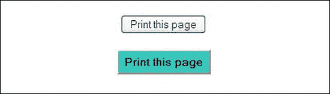
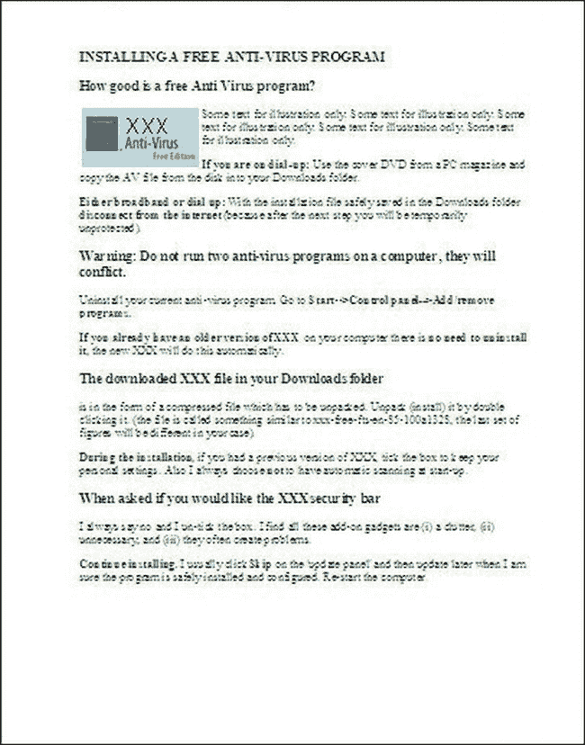
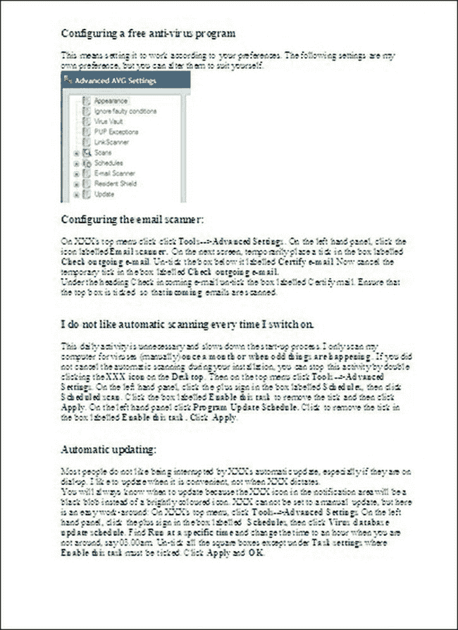
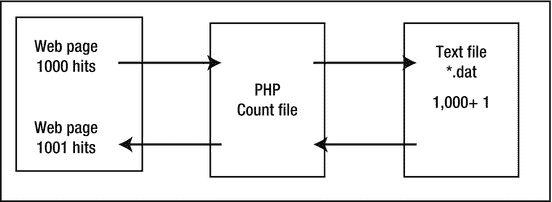
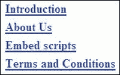
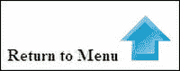
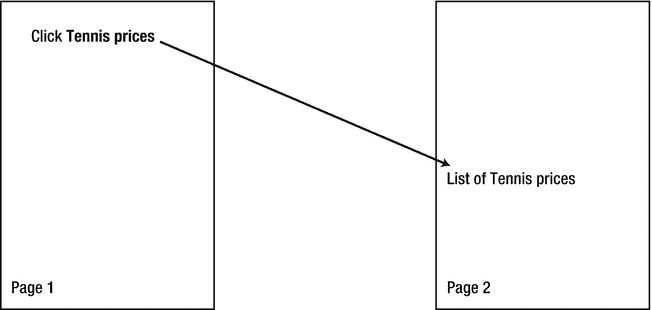
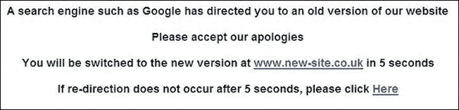
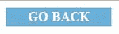

# 十七、打印、计数和重定向

顾名思义，本章提供了实现以下四个实用程序的实用方法:

> *   Page printing
> *   Self-service visitor counter
> *   Analyze Google Visitor Counter
> *   redirect

我将首先研究如何避免从浏览器工具栏打印的陷阱，以及用户如何节省墨水和纸张。然后，您将看到如何创建访问者计数器。最后，我将描述重定向到另一个页面、同一页面上的另一个位置或另一个网站的方法。

### 页面打印

通过使用浏览器工具栏上的“打印机”按钮或插入到页面顶部附近的“页面打印机”按钮，可以在没有特殊样式表的情况下从网站页面打印页面。

不幸的是，这两种方法都会打印出不需要的项目，如背景色、横幅标题、菜单按钮、页脚和广告。这些项目不必要地消耗纸张和墨水。此外，打印机必须设置为横向格式，以防止切断页面的右侧。诸如菜单按钮和“转到顶部”箭头等功能在打印的文档上毫无用处。此外，冗长的文档可能会在不方便的地方分页。下一节将展示如何通过研究以下主题来避免这些问题:

> *   Create this page button
> *   Prevent unwanted items from printing.
> *   Simplify printout to save ink and paper.
> *   page break
> *   Print URL (web address)
> *   Print check box
> *   Search engines and printable pages
> *   Test CSS printable page

#### 创建一个“打印本页”按钮

可以使用浏览器工具栏按钮打印页面，但大多数用户更喜欢突出的打印本页按钮，尤其是初学者。可以在页面顶部附近插入页面打印机按钮，如图图 17-1 所示。

***图 17-1。**两种类型的页面打印机按钮*

对于一个标准的窗口按钮(就像图 17-1 中的上部按钮)，把这个标记放在你想要按钮出现的页面上。下面只给出清单 17-1 的一部分，但是完整的清单可以从本书的页面`[`www.apress.com`](http://www.apress.com)`下载

***清单 17-1。【button-types.html 分部分项清单两种类型页面打印按钮】(??)***

`

        <input type="button" **value="Print this page"** onclick="window.print()"
        title="Print this page">
        
`

`value`(标记中以粗体显示)提供了按钮上的文本。

Windows 样式按钮的 CSS 是:

`        #button { text-align:center; }`

对于图 17-1 中的自定义下部按钮，使用以下标记:

`        

        <input id="printbtn" type="button" value="Print this page" 
        onclick="window.print()" title="Print this page">
        
`

自定义按钮的 CSS 是

`        #button { text-align:center;
        }
        #printbtn { margin-bottom:10px; padding:5px; font-weight:bold; 
        background:aqua; color:black;
        }`

#### 防止打印不需要的项目

为了在打印页面时去掉不需要的项目，必须创建一个附加的“打印”样式表。这将以更方便的纵向格式打印页面，以黑白方式打印，并删除所有不需要的项目。

> *   Main style sheet; For example, `mainstyle.css` will determine how the page is displayed on the screen.
> *   Print style sheet; For example, `print.css` will determine how the page is printed.

仅当单击“打印本页”按钮(或浏览器的“打印”按钮)时，打印样式表才会起作用。

在 HTML 页面的`<head>…</head>`部分，将打印样式表链接*放在屏幕样式表链接*之后，如下所示:

`        <link rel="stylesheet" href="**mainstyle.css**" type="text/css" **media="screen"**>
        <link rel="stylesheet" href="**print.css**" type="text/css" **media="print">**`

#### 简化打印输出以节省墨水和纸张

图 17-2 、 17-3 和 17-4 显示打印输出可以删除所有不必要的项目。

***图 17-2。**屏幕显示(仅页面的上半部分)*

***图 17-3** 。第一个打印页面*

***图 17-4。**第二印页*

在图 17-2 、图 17-3 和图 17-4 中，我选择从打印输出中省略以下项目:

> *   Background color (to save color ink).
> *   Header (which contains no useful information). This can save paper and ink.
> *   Print this page button because it doesn't work on printout.
> *   Menu buttons, because they don't work on printouts. On the screen display
> *   Headings (`h1` to `h6`) have large line spacing. I choose to reduce the text size and line height in the printout to save the user's paper.
> *   Go to the "Up" arrow at the top of the page because it doesn't work on printout.
> *   Footer, because it is a set of links that don't work on printout.

我还决定拆分栏目。这个项目中的屏幕页面有两列；每一栏包含不同的主题。因此，我设置了打印输出，以便为每一列/主题生成不同的页面。这可以防止页面在不适当的位置断开。我通过在第二列顶部放置分页符来实现这一点。

我保留了打印输出中的指导图像，因为它们对用户有用。

清单 17-2a 、 17-2b 和 17-2c 提供了两列页面和两个样式表的内容。这种情况下的菜单是一个带有翻转按钮的水平菜单栏。它包含在标题`
`中。没有使用语义标签，所以练习的要点可以被清楚地理解，而没有 IE 的 JavaScript hack 的混乱。在清单 17-2a 中，为了节省空间和清楚地显示打印 CSS 所针对的项目，大部分文本内容都被省略了。包含两个样式表的完整页面可以从 Apress companion 网站下载。屏幕和打印样式以粗体显示。打印机忽略的`
`也以粗体显示。

 **注意**打印的页面有一个小缺点:多栏页面打印每一栏，使其横跨页面的整个宽度，如图图 17-3 和 17-4 所示。

***清单 17-2a。【twocol-printer.html】展示页面打印的两栏页面***

`<!doctype html> <html lang=en> <head>
<title>Two column page for printer</title>
<meta charset=utf-8>
        *meta details go here*
**<link rel="stylesheet" type="text/css" href="twocol.css" media="screen">**
**<link rel="stylesheet" type="text/css" href="twocol-print.css" media="print">**
</head>
<body>

**
**<!--the CSS removes the header from the print-out-->
<h1>Coly Computer Help</h1>

**<ul id="hmenu">**<!--the CSS removes the menu from the print-out-->
<li class="hbtnew">
<a title="Computer Jargon explained" href="glossary.php">Jargon</a></li>
        *The rest of the code for the horizontal menu bar goes here*
**</ul>**
 
**
**<!--the CSS removes the print button from the print-out-->
<input type="button" value="Print this page" onclick="window.print()" title="Print this page">
**
** <!--End of page printer button-->
<h3>INSTALLING &amp; CONFIGURING A FREE ANTI-VIRUS PROGRAM</h3>

<h3>How good is a free Anti Virus program?</h3>

        *The content of the first column goes*

<!--LEFT COLUMN BEGINS ON A SEPARATE PAGE-->` `**
**
 <h3>Configuring a free anti-virus program</h3>
        *The content of the second column goes here*

**
**<!--the CSS removes the footer from the print-out-->
**<b>THIS IS THE FOOTER THAT YOU DO NOT WANT TO PRINT</b>**
**
**

</body>
</html>`

某些版本的 Mozilla Firefox 有时会因为一个内置的怪癖而插入一个空白页。为了避免任何浏览器怪癖，用`re-set`开始样式表，如清单 17-2b 所示。

***清单 17-2b。**打印机的 CSS 样式表(twocol-print.css)*

`/*PRINT.CSS: re-set style for printing only*/
/*re-set basic styles to avoid browser compatibility quirks*/
html, h1, h2, h3, h4, h5, p { padding:0; margin:0; font-size:100%; font-weight:normal;
}
/***TO SAVE INK**, set the text to black with white background*/
body { width:100%; padding:0; margin:0; float:none; color:black; background-color:white;
}
/***TO SAVE PAPER**, remove the large line space beneath a heading. Set headings to 14 point*/
h1, h2, h3, h4, h5, h6 { margin-top:0; margin-bottom:0; font-weight:bold; 
font-size:14pt; !important
}
/***SELECT UNWANTED PRINT-OUT ITEMS**, i.e., header, menu, print-button, footer and uparrow*/
#hdr, #hmenu, #button, #ftr, .uparrow { display:none;
}
/***REVEAL OUTGOING URL** links on printed page. See item on Printing URLs*/
ahref^="http://":after {content: "(" attr(href)")";
}
/***SET PAGE BREAK** class so that the printed pages do not break in undesirable places*/
.break-before { page-break-before: always;
}` 

color: #000000;
}
#container {text-align:center; margin: auto; width:960px;
}
img { border:0;
}
#leftcol { float: left; width: 48%; padding:2px; text-align:left;
}
#leftcol img { float:left; margin-right:5px;
}
#rightcol { float: right; width: 48%; padding:2px; text-align:left;
}
#ftr { clear: both;}/* ensure footer stays at the bottom */
#hdr { background-position:35% 20%; background-image:url('img/compbkgcrop.jpg'); 
background-repeat:no-repeat; width:960px; height:170px;
}
#button {margin:auto; }
h1 { position:absolute; top:90px; left:300px; width:450px; font-family:"Times New Roman"; 
font-size: 300%; color: #0080a0; font-weight:bold; margin-bottom:5px;
}
.uparrow { text-align:center;
}
#hmenu { width:790px; text-align:center; margin:5px 0 10px 100px;
}
li.hbtnew {display:block; margin:auto; float:left; text-align:center; padding:3px; 
list-style-type:none; list-style-position:inherit;
}
li.hbtnew a {display:block; text-decoration:none; color:white; background-color:#0080a0; 
font-weight:bold; padding:4px;
}
li.hbtnew a { background: #0080a0; border: 4px outset #AABAFF;
}
li.hbtnew a:hover { background: #0060a0; color:yellow; border: 4px outset #8ABAFF;
}
li.hbtnew a:active { background:#ABCBFF; border: 4px inset #ABCBFF;
}
h3, h4, h5, h6 { margin-top:0; margin-bottom:0;
}
span.tiny {font-size: x-small;
}
.cntr { text-align:center; margin:auto;
}
.lft {text-align:left;
}
.right {text-align:right;
}`

#### 打印网址(网址)

如果网页有到其他页面的内部链接或同一页面上的锚，打印它们是没有意义的，因为它们在打印的页面上没有任何作用。CSS 标记的下一部分将打印对用户有用的网站的 URL。打印的 URL 将省略下划线，因为这有时会掩盖 URL 中的下划线。该代码适用于所有浏览器。

`/*reveal links on printed page*/
a[href^="http://":after {content: "("attr(href)")"; }`

注意中间的四个括号(大括号之间)是普通的弯括号。假设下面几行出现在 HTML…

`

        Click for <a title="Click for free computer help"
        href="http://www.colycomputerhelp.co.uk">Free computer help </a>

`

URL 的屏幕外观如下:

> 点击获取<ins>免费电脑帮助</ins>

相应的打印输出将是:

> 点击获取免费电脑帮助(`[`www.colycomputerhelp.co.uk`](http://www.colycomputerhelp.co.uk)`)。

#### 打印复选框

在订单等可打印页面上，使用 Wingdings 或 Webdings 的方形复选框(也称为勾选框)在 Mozilla Firefox 中不起作用。然而，几乎每台计算机都有 Lucida Sans Unicode 符号。Lucida Sans Unicode 复选框`&#9633;`在所有流行的浏览器中都能正确显示。您需要在文本框中使用比文本更大的字体。

***图 17-5。**这是盒子在所有流行浏览器中的显示和打印方式。*

清单 17-5 提供了一个可以正确打印并在所有浏览器中正确显示的复选框。

***清单 17-5** 。适合在所有浏览器中打印的勾选框(tickbox-printer.html)*

`<!doctype html>
<html lang=en>
<head>
<title>This is box styled with Unicode Lucida font</title>
<meta charset=utf-8>

</head>
<body>

The tick box shown below is styled with Unicode Lucida and it is
formatted as xx-large and bold 

&#9633;
` `</body>
</html>`

#### 搜索引擎和可打印页面

一些网页设计者创建一个易于打印的网页，它是主要文本内容的副本。搜索引擎不赞成使用重复的页面。以下是 Google 关于使用重复页面而不是页面的 CSS 可打印版本的说法:“不要在不同的 URL 下创建一个页面的多个副本。许多网站提供纯文本或打印友好版本的页面，这些页面包含与相应的图形丰富的页面相同的内容。为了确保您的首选页面包含在我们的搜索结果中，您需要使用 robots.txt 文件阻止重复的页面。有关使用 robots.txt 文件的信息，请访问我们关于阻止 Googlebot 的信息。”

有关`robots_text`的信息，请访问:

`[`code.google.com/web/controlcrawlindex/docs/robots_txt.html`](http://code.google.com/web/controlcrawlindex/docs/robots_txt.html)`。

 **注**本章描述的页面打印机并没有颠覆搜索引擎。使用本章所示的 CSS 页面打印机可以避免这个问题。

#### 测试 CSS 可打印页面

没有必要浪费纸张和墨水，即使测试需要合理的反复试验。将页面加载到浏览器中，然后单击文件打印预览，查看可打印页面的外观。如果可打印页面包含分页符，请单击打印预览屏幕底部的向右箭头查看后续页面。

按 Esc 键退出打印预览模式。

### 自助游客柜台

许多客户要求设立访客柜台。支付了网站和托管费用后，他们会急于知道是否有人访问它。你必须在第三方柜台，依靠主机的柜台，或者在网站上放置自己的 DIY 柜台之间做出选择。

第三方计数器意味着向页面添加一些代码。该代码然后链接到一个为您管理计数的 URL。我发现第三方计数器有时会受到拒绝服务攻击(DOS ),使计数器暂时无法工作。一位网站所有者曾经告诉我，网站的计数不再有意义。因此，我使用 DIY 计数器，因为它完全在网站管理员的控制之下，不依赖于易受攻击的主机。

大多数主机提供访问者统计数据，但是所有者不愿意钻研他们网站的控制面板。这意味着 DIY 柜台可能是最好的选择。在接下来的部分中，我将向您展示如何创建一个。它确实涉及到一小段 PHP 脚本的简单应用，但这是完全解释。主要议题将介绍如下:

> *   Why use the counter?
> *   Explain visitor count
> *   How does the counter work?
>     *   Step 1: Create a free PHP visitor counter.
>     *   Step 2: Create `"count"` file
>     *   Step 3: Create three tiny and identical text files with a text editor.
>     *   Step 4: Match the menu with three PHP main pages.
>     *   Matching step 5: upload the counter to the host.
>     *   Step 6: Ensure

#### 为什么要用计数器呢？

一些网页设计师不鼓励他们的客户设置访客柜台。他们说柜台是过时的，业余的，没有意义的。这些借口通常掩盖了设计师对搜索引擎优化的无能。他们不想因为访客数量少而暴露他们的无能。

仅限于主页的访问者计数器可能无法为网站所有者提供足够的信息。主页可能有很多点击率，但是如果主页过于花哨、混乱或者晦涩难懂，用户就不会浏览网站的其他部分。计数器只是告诉网站所有者有多少人访问了主页，这不是很有用。所有者需要知道访问者是否被诱惑去浏览其他页面。因此，访问者计数器应该放在其他关键页面上，也就是所有者希望被访问的页面。这将告诉所有者，主页是否已经说服用户进行更深入的研究。

#### 解读访客数量

通过查看访问者数量以及多少页面应该有计数器，我们可以了解到什么？

假设主页上的访客计数器显示为 10，000。所有 10，000 个访问者可能只看了一眼你的主页，然后跳到另一个网站。或者他们可能看了好几页。所有者永远不会知道访问者是否被诱惑去更深入地研究网站。

很明显，只在主页上有一个计数器不会提供很多信息。如果计数器也放在另外三个关键页面上，我们可以了解更多。让我们将关键页面称为步行者页面、露营者页面和关于我们的页面。我们如何解释下面的访问者数量？

> *   Home page: 10000 visitors
> *   Traveler page: 5800 visitors
> *   Camp page: 8700 visitors
> *   About our page: 2300 visitors

这一信息表明

> 主页不会因为其他页面有访客而拒绝访客。*   Tourists are more interested in camping equipment than walking equipment.*   The sum of other page hits is greater than that of the first page; Therefore, the homepage will attract visitors to look at more than one other page.

#### 计数器如何工作

这个计数器不仅免费，而且完全可靠。计数器需要一些 PHP 代码，但是您不需要 PHP 知识来实现它。只需将您自己的文件名和编号插入到本节包含的简单列表中。计数可以从所有者选择的任何数字开始；在这个例子中，我选择了 1000。该方法非常简单，只需将一段 PHP 代码插入到页面中。当用户访问网页时，这段代码触发一个小的 PHP 文件，将文本文件中存储的数字加 1。新的数字(现在是 1001)被传回网页并显示出来。该过程如图 17-6 所示。

***图 17-6。**当一个页面被访问时，访问者的数量如何增加 1*

一个虚拟主页？一些设计者创建了一个类似于`index-dummy.html`的复制主页，这样所有的页面都链接到虚拟主页，而不是真正的主页。这种方法意味着，如果在浏览了网站上的其他页面后，访问者点击返回主页，他们将被发送到虚拟主页。正版主页上的计数器不会记录另一个唯一访问者。虽然这给出了一个更准确的访问者数量，但它确实意味着网站违反了搜索引擎的一条规则:“不要创建重复的页面。”所以，不推荐这种技术。

##### 第一步:创建一个免费的 PHP 访客计数器

本章介绍的访客柜台是由 CJ 网站设计公司的詹姆斯·克鲁克设计的。他的网站是`[`www.cj-design.com`](http://www.cj-design.com)`。

这个柜台可以免费使用，条件是你要把他记在访客柜台旁边。完成这项工作的代码在三个`count*.php`文件的步骤 2 中列出。

这个工作示例假设关键页面是`index.html`、`walk.html`和`camp.html`。(在本例中，我们将假设所有者不希望“关于我们”页面上有计数器)。

 **注**只有列出的三页才会有一个`DOCTYPE`。支持文件(`*.dat`和`count*.php`)必须*而不是*有一个`DOCTYPE`。

> 1.  Use a text editor (such as Notepad or Notepad++) to insert the `include` code type (shown in bold) directly above the end body tag (`index.html`) of the homepage, or you can put it in the footer.
> 2.  将修改后的索引页面保存为`index.php`，如清单 17-6 所示。
>     
>     ***清单 17-6.【index . PHP】包含访客计数器的主页***
>     
>     `<!doctype html>
>     <html lang=en>
>     <head>
>     <title>index page with counter</title>
>     <meta charset= windows-1252>
>             *meta details go here*
>     *<link to style sheet goes here…*
>     </head>
>     <body>
>             *the home page content goes here*
>         **
**
>         **<?php**
>         **include("counthome.php");**
>         **?>**
>         **
**
>     </body>
>     </html>`
>     
>     **注意**因为页面包含了一些 PHP，所以本例中的`charset`必须是`windows-1252`；否则,页面将无法验证.
>     
>     
> 3.  Repeat the process in `camp.html page` as follows: `**
**
>     **<?php include("countcamp.php");**
>     **?>**
>     **
**`
> 4.  Save the file as `camp.php`.
> 5.  Repeat the process in the `walk.html` page. `

>     <?php include("**countwalk.php**"); ?>
>     
`
> 6.  Save the file as `walk.php`. Now you have three new `.php` files: `index.php`, `camp.php` and `walk.php`.

##### 第二步:创建盘点文件

使用文本编辑器从头开始创建三个`"count"`文件，并将它们保存为`.php`文件。除了粗体显示的项目外，这些文件是相同的。

> 1.  Create the first `"count"` file for the home page, as follows: `<?php
>     $COUNT_FILE = "**counthome.dat**";
>     if (file_exists($COUNT_FILE)) {
>             $fp = fopen("$COUNT_FILE", "r+");
>             flock($fp, 1);
>             $count = fgets($fp, 4096);
>             $count += 1;
>             fseek($fp,0);
>             fputs($fp, $count);
>             flock($fp, 3);
>             fclose($fp);
>     } else {
>             echo "Can't find file, check '\$file' ";
>     }
>     ?>
>     
>     <?php echo $count;
>     ?>
>     <a href=”http://www.cj-design.com>&copy;CJ Counter</a>
>     `
> 2.  Save the file as `counthome.php`.
> 3.  Create a second `"count"` file for the camping page, as follows: `<?php
>     $COUNT_FILE = "**countcamp.dat**";
>     if (file_exists($COUNT_FILE)) {
>             $fp = fopen("$COUNT_FILE", "r+");
>             flock($fp, 1);
>             $count = fgets($fp, 4096);
>             $count += 1;
>             fseek($fp,0);
>             fputs($fp, $count);
>             flock($fp, 3);
>             fclose($fp);
>     } else {
>             echo "Can't find file, check '\$file' ";
>     }
>     ?>
>     
>             <?php echo $count;
>     ?>
>     <a href=”http://www.cj-design.com>&copy;CJ Counter</a>
>     `
> 4.  Save the file as `countcamp.php`.
> 5.  Create a third `"count"` file for the walking page, as follows: `<?php
>     $COUNT_FILE = "**countwalk.dat**";
>     if (file_exists($COUNT_FILE)) {
>             $fp = fopen("$COUNT_FILE", "r+");
>             flock($fp, 1);
>             $count = fgets($fp, 4096);
>             $count += 1;
>             fseek($fp,0);
>             fputs($fp, $count);
>             flock($fp, 3);
>             fclose($fp);
>     } else {
>             echo "Can't find file, check '\$file' ";
>     }
>     ?>
>     
>             <?php echo $count; ?>
>             <a href=”http://www.cj-design.com>&copy;CJ Counter</a>
>     `
> 6.  Save the file as `countwalk.php`.

##### 第三步:使用文本编辑器创建三个微小的相同的文本文件

> 1.  Only the starting number of the counter (such as 0 or 1000) is put in each file. Don't put anything else in these files, and don't insert commas to represent thousands.
> 2.  Save these three files with the names of `home.dat`, `camp.dat` and `walk.dat`.

您现在有了三个新的 PHP 网页、三个`.dat`文件和三个`*count.php`文件。

##### 第四步:让菜单与三个 PHP 页面相匹配

在*网站的每个*页面上，更改菜单超链接，使其链接到`index.php`、`camp.php`和`walk.php`页面，而不是旧的`*.html`页面。

##### 第五步:上传计数器到主机

> 1.  Use your FTP program to access the website on the host server.
> 2.  Now upload three `.dat` files, three `count.php` files and three main PHP pages to the host server.
> 3.  Using FTP program, right-click New File `counthome.php` on the panel of the host server. In the drop-down menu, look for Properties/CHMOD and click it. Change the number 644 to 777.
> 4.  对`countcamp.php``countwalk.php``counthome.dat``countcamp.dat``countwalk.dat`，
> 
> 重复此步骤

 **注** CHMOD 代表改变模式；也就是说，它使您能够更改文件的访问权限，从而使内容不能被 Linux 服务器上未经授权的人激活。主页面保留为 CHMOD 664，因此不会受到干扰。其他页面被设置为 777，以允许文件之间进行交互，从而在每次有人查看页面时改变访问者数量。在支持 PHP 的 Windows 服务器上，这要稍微复杂一些。最简单的方法是将`.dat`文件放在子目录中，并将子目录设置为 777。

##### 第六步:确保浏览器访问新的*。php 页面而不是旧的*。html 页面

这很可能是最重要的一步，因为它防止浏览器访问旧的 HTML 文件；因为如果两个文件有相同的前缀，比如`index.html`和`index.php`，浏览器总是会选择 HTML 版本。

> 1.  In the right server/host pane of FTP program, right-click the file `index.html`, rename it `indexold.html` or delete it. The user will now automatically access the `index.php` file.
> 2.  Repeat this step for `camp.html` file and `walk.html` file.

计数器现在的功能应该如下:当一个访问者访问一个页面时，这将触发一个相关的文件:`countcamp.php`或`countwalk.php`或`counthome.php`。这些导致相关`*.dat`文件上的数字增加 1。然后，新号码被传递到相关页面，并在那里显示。您现在需要测试计数器。

##### 第七步:测试计数器

使用浏览器访问网站，以确保计数器数字显示在页面底部。如果计数器编号出现在页面上，请单击浏览器上的刷新图标。该数字应增加 1。访问其他主页，检查它们的计数器是否正常工作。

 **注意**如果出现 PHP 解析错误，很可能是在`<?`和`php`之间插入了空格。删除那个空格，使它看起来像`<?php`。

##### 使用谷歌分析追踪访客

Google Analytics 是之前描述的 DIY 计数器的替代产品。它为每个页面的访问者提供了详细的分析，甚至记录了访问者浏览每个页面的平均时间。你将能够发现游客流量来自哪里；例如，搜索引擎、推荐或直接 URL 输入。它甚至会告诉你哪些国家使用你的网页最多。

Google Analytics 要求你在网站的每个页面的`<head>`部分添加一段 JavaScript。以下步骤将为您提供代码并帮助您安装它:

> 1.  To install Google Analytics, please visit `[`www.google.com/analytics`](http://www.google.com/analytics)` and log in. If you have a Google account, log in with it; Otherwise, register an account.
> 2.  In the form that appears, check the box to indicate that you agree to the terms.
> 3.  Click the "Create Account" button, and you will see a code inserted into the `<head>` section of each page. This code is essential; Without it, Google can't track your web page. Insert a code snippet before the closing `</head>` tag.

当您下载代码时，它将类似于以下内容:

`
        `

24 小时后，您将能够看到第一批访客报告。随着时间的推移，这些报告将变得更有意义。要访问分析(称为我的仪表板)，打开`[www.google.com/analytics](http://www.google.com/analytics)`并登录。单击您的网站名称，统计数据就会显示出来。

在 Google Analytics 的左侧菜单中，选择流量来源关键字。这将向您显示人们为了到达您的网站而搜索的所有关键字的列表。

如需帮助，请访问`[`support.google.com/googleanalytics/?hl=en`](http://support.google.com/googleanalytics/?hl=en)`。

### 重定向

重定向是链接的子集(或者用完整的术语来说是*超链接*)。链接有三种形式:将用户从一页带到另一页的导航链接；页面的`<head>`部分内将页面连接到脚本或 CSS 样式表的链接；和不属于其他两个类别的重定向链接。

大多数用户都熟悉顶部有一组链接的网页(见图 17-7 )。单击这些链接时，光标会跳转到页面上的各个部分。用户被重定向到页面上的特定位置。用户也可以被重定向到另一个页面上的特定位置。它们可以从一个网站重定向到另一个网站，旧网站可以将用户重定向到具有不同 URL 的较新版本。

#### 锚和链接

重定向指向的地方称为*锚*。最初，页面上的锚被定义为``。虽然``没有被弃用，但是 W3C 在 2002 年推荐用`id`代替`name`。然后代码变成了``。同样的建议也适用于同一页面或其他页面上的锚；也就是用`id`不要用`name`。

将光标重定向到锚点的组件是一个链接。您将完全熟悉将您重定向到另一个页面的链接。这通常采取以下形式:

`<b>For a desciption of the tennis courts</b> Please click
<a href="tennis.html " title="Tennis court information"><b>Tennis</b</a>.`

接下来的六个小项目显示，将光标发送到比整个页面更具体的锚点时，需要稍微不同的链接格式。

#### 重定向到同一页面上的特定位置

页面顶部的链接列表可以将用户重定向到该页面的各个部分。对于长页面的信息，这是常见的做法。图 17-7 显示了在同一页面上移动的典型菜单。单击链接会将您带到页面上的相关部分。总是在每一部分的末尾放置一个向上箭头(或返回菜单链接)，以允许用户重定向回菜单(见图 17-8 )。

***图 17-7。**默认链接重定向*

***图 17-8。**使用向上箭头重定向*

清单 17-7 中的粗体字显示了这两个图中重定向链接的位置。单击菜单上的一个项目会将您带到相关部分。单击页面上任意位置的向上箭头会将您重定向到菜单。完整的文件可以从 Apress 伙伴网站下载。

***清单 17-7。【long-page-with-links.html 在长页面上创建两种类型的重定向***

`<!doctype html>
<html lang=en>
<head>
<title>Long page with links to items on page</title>
<charset=utf-8>
        
</head>
<body>
****

**
<b><a href="#intro">Introduction</a></b>
**
**
<b><a href="#about">About Us</a></b>
**
**
<b><a href="#embed" title="Embed scripts">Embed scripts</a></b>
**
**
<a href="#terms" title="Terms and conditions"><b>Terms and Conditions</b> </a>
**

<h1>EMBEDDING SCRIPTS</h1>
****

Introduction

        *Long block of text goes here*
**
<b>Return to Menu</b><a href="#top">
**
****` `
About Us

        *Long block of text goes here*
**
<b>Return to Menu</b><a href="#top">
**
****

Embed scripts

        *Long block of text goes here*
**
<b>Return to Menu</b><a href="#top">
**
****

Terms and Conditions

        *Long block of text goes here*
**
<b>Return to Menu</b><a href="#top">
**
</body>
</html>`

您需要创建颜色和大小适合您的页面的箭头图像。

对于很长的文本块，可能需要不止一个向上箭头。为附加的向上箭头创建一个类，并将该类的上边距设置为 400 像素。向上的箭头将会在垂直方向上分开，而不会像`     `或`
&nbsp;

&nbsp;

&nbsp;

&nbsp;
`等那样在向上的箭头之间使用很多间隔。

#### 重定向到同一网站不同页面上的特定位置

在下一个例子中，一个名为`page1.html`的网页有一个到`page2.html`的链接，但是锚是第 2 页上的一个特定位置。在`page2.html`的那个特别的地方有使用网球场的费用清单。原理如图 17-9 中的所示。

***图 17-9。**重定向到另一个页面上的特定位置*

`page1.html`中的重定向链接将是`page2.html#tennis-prices`。完整的链接是:

`<b>For details of the cost of using the tennis courts</b> Please click 
<a href="page2.html#tennis-prices" title="Tennis court hire prices"><b>
Tennis prices</b </a>`

`href`指定目标页面(`page2.html`)，散列符号指定目标页面上的精确位置(`#tennis-prices`)。在`page2.html`中，就在网球场价格列表的前面，您将插入以下代码:

``

当用户点击`page1.html`上的链接时，浏览器立即跳转到`page2.html`上的网球场价目表部分。

#### 从旧网站重定向到新网站

所有者可能希望将流量从旧网站重定向到新网站。图 17-10 显示了一个被新网站取代的网站的典型页面。在显示页面的同时，用户将在几秒钟内被自动重定向到新的网站。

***图 17-10。**一个典型的重定向页面*

我们现在来看一个典型的例子。假设所有者是英国的一个镇议会。网址是`[`www.brightville-council.com`](http://www.brightville-council.com)`。委员会决定`.com`域名并不真正适合英国市政厅。因此，委员会委托你设计并制作一个闪亮的新网站，名为`[`www.brightville-council.org.uk`](http://www.brightville-council.org.uk)`。对于知道旧网址的 100，000 人，委员会能做些什么？然后是所有文献和那些引用旧 URL 的目录所带来的问题？

此外，搜索引擎将索引旧网站的一些页面，以便输入“Brightville”或“Brightville council”将访问旧网站。

最简洁的解决方案是让旧站点与新站点并行运行几年，但是您需要确保新旧站点之间没有紧密的重复。搜索引擎不会容忍重复的网站。

下一步需要一些侦查工作。使用搜索引擎来发现当输入关键字时搜索引擎选择了哪些页面。出现在结果的前三页的页面就足够了。记下页面名称，因为必须向这些页面添加重定向。

使用旧网站的 FTP 详细信息下载这些页面的副本。使用清单 17-10 中显示的标记创建这些页面的新版本，并保持相同的页面名称。重定向指令以粗体显示。

清单 17-10 为这个问题提供了一个简单的解决方案，它自动通知用户，然后将他们重定向到新的网站。此列表没有可下载的模板。

***清单 17-10** 。添加到另一个网站的重定向*

`<!doctype html>
<html lang=en>
<head>
<title>Redirection page</title>
<charset=utf-8>
**<meta http-equiv="refresh" content="5; URL=http://www.*brightville-council.org.uk*">**
        *no need for any other meta content*
        
</head>
<body>

A search engine such as Google has directed you to an old version of our web site

Please accept our apologies
>

You will be switched to the new version at 
<a href="http://www.***brightville-council.org.uk***"> 
www.***brightville-council.org.uk*** </a> in 5 seconds

If re-direction does not occur after 5 seconds, please click 
<a href="http://www.***brightville-council.org.uk*** /">Here</a>

</body>
</html>`

插入您自己的新网站详细信息，以取代粗体斜体显示的 URL。在存储旧 URL 的主机中，上传修改后的页面以替换旧页面。重定向消息上的文本可能类似于图 17-10 中的文本。在每一页上稍微改变一下文字，这样搜索引擎就不会被重复的页面打乱。

#### 创建“返回”按钮

可打印表单等页面可能没有导航菜单。通过返回按钮进行重定向将是一个有用的功能。返回按钮可能类似于图 17-9 中的所示。

***图 17-11。**典型的返回按钮*

通常只有在网站的单个页面上才需要返回按钮，所以内部样式表是一个明智的选择。但是，如果网站中有几个页面需要“返回”按钮，请使用外部样式表。清单 17-11 创建了如图图 17-11 所示的返回按钮。此列表没有可下载的模板。

***清单 17-11。**在网页中插入返回按钮*

`<!doctype html>
<html lang=en>
<head>
<title>A Go-back-button</title>
<charset=utf-8>` `        *meta details go here*
        
</head>
<body>

        <a class="button" href="***previous-page*.html**" title="Return to previous screen 
and full menu">GO BACK</a>

</body>
</html>`

用您希望返回的页面的文件名替换`**previous-page.html**`。

#### 返回任何页面

如果用户已经从任何其他页面随机访问了一个页面，您将需要一点 JavaScript 来实现到未知页面的重定向。这确实复制了浏览器后退按钮的功能，但是它可能是有用的，例如，在反馈表单的错误报告页面上。按钮文本的*值*将会是“返回表单”。

如果用户已经从任何其他页面到达一个名为`page2.html`的页面，她可以通过该按钮返回到*任何*的上一页(参见图 17-12 )。

***图 17-12。**将用户重定向到上一页的按钮*

当单击按钮时，用户返回到上一页。该按钮是用清单 17-12 中的创建的。(此列表不可下载)。

***清单 17-12。**在页面上放置一个按钮，将用户重定向到上一页*

`<!doctype html>
<html lang=en>
<head>
<title>A Go-back-to previous page button</title>
<charset=utf-8>
        *meta details go here*
</head>
<body>
<form method="post" action=" ">
<input type="button" value="Go to previous page" onclick="history.go(-1)">
</form>
</body>
</html>`

### 总结

本章讨论了三个主题:页面打印、访问者计数器和重定向。页面打印机代码旨在节省用户的纸张和墨水，并提供一个干净的打印输出，没有不必要的项目，如背景色，横幅标题，菜单按钮，广告和页脚。

DIY 访问者计数器为用户提供了一个简单的网站是否吸引访问者的视觉评估。这一章解释了为什么在不止一页上有一个计数器很重要。提供了安装 Google Analytics 作为 DIY 计数器替代方案的说明。

重定向部分列出并解释了五种类型的重定向。

在下一章中，您将了解为什么验证是重要的，以及如何解释验证器(如 W3C 验证器和`html5.validator.nu`)提供的报告。