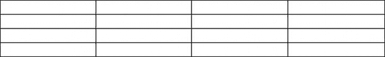

# 十九、故障排除

这一章旨在帮助你找到那些占据了网页设计师大量时间的难以捉摸的问题。它涵盖了最常见的问题和测试方法。本章没有涉及的问题通常可以通过 W3C 验证器运行问题页面或者将问题发布到搜索引擎中来解决。

### 测试你的页面

在你的电脑上安装五种主要的浏览器——Internet Explorer、Mozilla Firefox、Safari、Chrome 和 Opera。将它们的图标放在桌面上，并在工作时在每个浏览器中测试您的页面。如果你使用 IE 9，你需要 IETester 工具来测试 IE 6、IE 7 和 IE 8 中的网站。或者你可以在另一台电脑上用 XP 和 IE 8 进行测试。

一些勇敢的设计者在他们的计算机上安装 Apache 本地主机来测试 PHP 表单和计数器。我花了很多令人沮丧的时间试图安装 Apache，但没有成功；有时它会工作两三个星期，但最终失败了。一个更简单快捷的解决方案是，使用 Mozilla Firefox 查看存储在计算机上的 PHP 页面。要测试 PHP 反馈表单或 PHP 页面计数器的交互性，请在您现有的网站主机上创建一个测试文件夹。然后将交互文件上传到测试文件夹并运行；与花几个小时安装 Apache 相比，这大约只需要两分钟。

 **提示**这个漂亮的 IETester 工具是无价之宝，对于在旧版本的 ie 浏览器上测试你的网页来说，它是一个真正的省时工具。从`[`www.my-debugbar.com/wiki/IETester/HomePage`](http://www.my-debugbar.com/wiki/IETester/HomePage)`下载并安装。这个工具是免费的，但是非常值得捐赠。关于其他一些好的测试资源，请访问位于`[`browserlab.adobe.com/en-us/features.html`](https://browserlab.adobe.com/en-us/features.html)`的 Adobe BrowserLab 和位于`[`netrenderer.com`](http://netrenderer.com)`的快速“版本检查器”。

使用 IETester 可能会令人困惑。似乎无法打开存储在计算机文件夹中的网页。首先，您需要在浏览器中加载页面。然后从浏览器的地址栏中选择并复制它的地址(Ctrl+C)。它应该像下面这样开始:

`file:///C:/Documents%20and%20Settings/User/…`

或者像`C:\Documents and Settings\User\My Documents\BOOK\Ch10 \filename`。

打开 IETester，点击其中一个标签，(比如 IE 6)。您将在地址栏中看到一个蓝色的网址。不要点它；只需按 Ctrl+V 将地址替换为您的文件位置，然后按 Enter。单击另一个选项卡(比如 IE 7)，重复 Ctrl+V 并按 Enter。一旦一个页面被加载到 IETester 中，您就可以点击它的导航按钮，用 IETester 测试站点上的其他页面。

当使用 IETester 时，偶尔会弹出一条错误消息，说程序需要关闭，但这是一个 bug，它实际上并没有关闭程序。

大多数所见即所得的网页编辑器都有**错误检查**功能。比如 MS Expression Web 有一个优秀的错误检查器；在“代码”视图中按 F9 键会逐步显示并解释错误。

如果你有一个关于**浮动下降或者定位**的问题，这个提示可以帮助你找到原因。在问题页面的标题部分添加一个临时行，如下所示:

``

在浏览器中查看时，块元素将被红色边框包围；这可以揭示你的问题的原因。

其他测试方法和工具包含在相应的章节中。例如，第十八章展示了如何测试你的代码是否符合 W3C。第十四章给出了残疾人可以进入的考场信息。

### 如果浏览器将页面视为没有文档类型

这表明`DOCTYPE`不是页面上的第一行。在`DOCTYPE`之前不能有任何东西，甚至不能是空行。如果这个错误存在，浏览器将使用怪癖模式来显示页面，您可能不会喜欢这个结果。然而，可以将一段 PHP 代码放在`DOCTYPE`之前，而不会产生负面影响。

### 如果您有定位问题

元素可能不会出现在页面上您希望它们出现的位置。以下是一些例子:

> *   *The left navigation menu* appears on the right side of the screen: try to put one or more ` ` labels before `
` or `<nav>` containing the menu.
> *   *The image will not stay at the* position: sometimes it is centered instead of left aligned, and vice versa. Check the stylesheet and delete any image positioning styles that cause misalignment. The stylesheet can contain two image alignment instructions; The web page will follow the last of the two.
> *   *The page can't be displayed normally in WYSIWYG webpage design program* : In this case, the page viewed in various browsers may be displayed normally in all browsers. Some WYSIWIG programs are not completely accurate in displaying the appearance of web pages in the browser.

### 如果有横向菜单问题

以下是两个最常见的水平菜单问题:

> 1.  One of the buttons dropped, especially when viewed in Internet Explorer 6.
> 2.  One button increases the depth, or one button becomes two buttons.

这些故障如图 19-1 所示。

***图 19-1。**首页按钮有故障的横向菜单*

这些故障也可能是由 IE 6 引起的，因为它使用的默认字体比任何其他浏览器都大。较大的字体扩大了按钮的宽度，因此菜单对于其容器来说太宽了。为了解决这个问题，你只需要为 IE 6 指定一个较小的字体。创建一个名为`ie6style.css`的特殊附加样式表。它只需要包含来自`mainstyle.css`的`#`容器或#菜单代码，但是将它的字体大小从中等改为较小，如下面的粗体所示:

`#container{text-align:center; background-color:#D7FFEB; font-family: "times new roman";
   **font-size: small;** color: #000000; margin: auto; width:95%;}`

在 HTML 的 head 部分，插入一个条件链接(以粗体显示)。将它放在其他链接的下面，如下面的代码片段所示。

`<head>
<title>Home page …</title>
*meta details go here*
<link rel="stylesheet" type="text/css" href="mainstyle.css" media="screen">
**<!--[if lte IE 6]>**
**<link rel="stylesheet" type="text/css" href="ie6style.css" media="screen">**
**<![endif]-->**
<link rel="stylesheet" type="text/css" href="print.css" media="print">
</head>`

还有另外两个问题需要考虑。弱视用户可以用自己的样式表增加字体大小。请注意这一点，并尝试在按钮上为更大的文本尺寸留出足够的空间。

如果水平菜单拒绝在页面上居中，确保在样式表中将`<ul>`块的容器设置为`text-align:center;`。

### 如果你的服务器有问题

反病毒警报:“威胁被阻止。”这是一个真正的警报，因为您没有故意在您的网站中构建任何恶意软件。但是一些卑鄙的家伙入侵了你的网站，并在一个或多个页面中插入了一些 JavaScript 代码。使用您的 FTP 程序下载页面，并查找 JavaScript 片段。流氓脚本通常位于标签`<body>`之后。

典型的流氓脚本如下所示:

`<!-- ad --><!-- /ad -->`

这种情况不会发生在像样的主机上，但偶尔会发生在安全意识较差的主机上。作为预防措施，请始终使用包含特殊字符和数字的更长、更复杂的密码。但是，如果问题已经发生，补救措施是登录到主机上的控制面板，将 FTP 密码更改为更复杂的密码。然后使用您的 FTP 客户端上传所有受感染页面的干净副本。然后联系主机大声抱怨，直到它让它的服务器更安全。

如果主机服务器突然不接受你的 FTP 密码，可能是因为上一段描述的同样的问题；解决方法是一样的。

### 如果您遇到浏览器变异问题

如果您的页面在一个或多个浏览器中显示不正确，不要认为问题是您的错。我花了两个小时追踪一个问题，结果发现是 Mozilla Firefox 的一个 bug。最右边的列显示在中间的容器中。一次偶然的机会，我在另一台使用火狐浏览器的电脑上查看了这个页面，它没有问题。答案？每台电脑都有不同版本的 Firefox。旧的火狐版本是问题所在；通过更新到最新版本，页面显示正确。总是在浏览器的最新版本和之前的版本上进行测试。

另一个问题可能是，在 Mozilla Firefox 中，可打印页面或屏幕上的方形复选框显示为圆形。在显示订单等可打印页面的屏幕上，使用 Wingdings 或 Webdings 的方形复选框在 Firefox 中不起作用。几乎每台计算机都有 Lucida Sans Unicode 符号。通过使用这种字体，复选框可以在所有流行的浏览器中正确显示(见图 19-2 )。

***图 19-2。**这是这个盒子在所有流行浏览器中的外观*

盒子的代码是`&#9633`，如清单 19-2 所示。当打印包含勾选框的反馈表单或订单表单时，此代码使框能够正确打印。

***清单 19-2。【tickbox-printer.html 创建在 Mozilla Firefox 中正确显示的复选框***

`<!doctype html>
<html lang=en>
<head>
<title>This is a box styled with Unicode Lucida font</title>
<meta charset=utf-8>

</head>
<body>

The tick box shown below is styled with Unicode Lucida and it is formatted as 
xx-large and bold 

&#9633;

</body>
</html>`

### 是否应该排查 IE 6 等老浏览器的问题？

这取决于目标受众以及是否可能使用较旧的浏览器。在英国和美国，只有不到 2%的电脑用户仍然使用 IE 6 上网。然而，你可以接受一个使用 IE 6 的客户(例如，一些政府部门和一些地方政府服务)。

大多数设计师现在都忽略了 IE 6，理由是微软发起了一场强有力的运动，让人们不再依赖它。Mozilla、Chrome、Safari 和 Opera 的用户通常会下载最新版本的浏览器。

 **提示**访问 Stat Counter Global Stat ( `[`gs.statcounter.com`](http://gs.statcounter.com)`)查看最新统计数据，评估浏览器流行趋势。选择条形图版本，以便更清楚地了解当前情况。选择趋势的折线图版本。

另见`[`marketshare.hitslink.com/browser-market-share.aspx?qprid=3`](http://marketshare.hitslink.com/browser-market-share.aspx?qprid=3)`。有关 2012 年全球浏览器使用百分比的表格，请参见附录。各个组织的统计数据各不相同。我们永远不会知道哪些是最可靠的，但你将能够发现非常有用的明确趋势。

### 浏览器可能会有微小的显示差异

IE 6 不识别`max-width`和`min-width`。如果客户使用 IE 6(例如，一些地方政府部门可能会被时间扭曲)，你需要给它的网站页面固定的宽度。

消除小的分歧。尽管最新的浏览器符合 W3C 标准，但仍然存在一些小的差异，特别是在边距和填充方面，这些差异可以通过在样式表的开头包含一个重置来避免，就像 David Sawyer McFarland 在*CSS:The Missing Manual*(O ' Reilly，2009)中展示的那样。

`/*reset all browsers to a common standard*/
html, body, h1, h2, h3, h4, h5, h6, p, ol, ul, li, pre, code, address, variable, 
form, fieldset, blockquote {
 padding: 0;
 margin: 0;
 font-size: 100%;
 font-weight: normal;
}
table { border-collapse: collapse; border-spacing: 0;
}
td, th, caption { font-weight: normal; text-align: left;
}
img, fieldset { border: 0;
}
ol { padding-left: 1.4em; list-style: decimal;
}`

在 IETester、IE 9、Mozilla Firefox、Chrome、Opera 和 Safari 中创建页面时测试它们。

### 如果屏幕上出现奇怪的符号

这些可以采取正方形的形式。检查符号在屏幕上出现的位置处的标记。用字符实体代替引起问题的符号。例如，英国符号将显示为正方形。用字符实体`&pound;`替换符号。

### 如果你改变了 CSS，但它看起来是一样的

这可能会令人沮丧。有两个常见的原因。

第一个原因是浏览器缓存已经存储了以前的样式表，因此，您看到的是旧样式表的结果。要查看由修改后的样式表设计的页面，请使用浏览器的刷新按钮，或者在 IE 和 Chrome 中尝试 Ctrl+F5。在 Firefox 中尝试 Ctrl+Shift+R。

第二个原因是样式、`<link>`和 JavaScript 在`<head>`部分中的顺序不正确。标记中出现的顺序应该遵循一个计划。

以下代码片段显示了包含在`<head>`部分中的项目的正确顺序:

`<!doctype html>
<html lang=en>
<head>
<title>Correct order for head items</title>
<meta charset=utf-8>
*meta details go here*
<link rel="stylesheet" type="text/css;" href="media-sheet.css" media="handheld">
<link rel="stylesheet" type="text/css;" href="main-stylesheet.css" media="screen">
<link rel="stylesheet" type="text/css;" href="print-sheet.css" media="print">
        
<!--[if lte IE 8]>

<![endif]-->
</head>`

代码片段显示，如果页面链接到多个基于设备的样式表，链接的顺序应该是手持、屏幕和打印。如果某个页面有特定页面的内部样式(例如，在前面的清单中，用白色背景和黑色文本显示页面)，该样式应该在主样式链接之后。条件样式和 JavaScript 应该放在最后。

一般规则是最后一种风格胜出。在前面的代码片段中，计算机屏幕上的显示很大程度上是由屏幕链接决定的，内部样式只覆盖主页的颜色和文本颜色。只有当访问者使用 IE 8 或 IE 的早期版本时，条件和 JavaScript 才会生效。

### 如果您遇到浮动下降

浮动元素可能会受到浮动下降的影响；也就是说，一个元素下降到了它原本要占据的位置之下。这可能发生在以下两种相关情况下:

> *   *Static* : When the width of the container is not enough to accommodate the lateral contents.
> *   *Dynamic* : When the browser window is horizontally reduced by the user, the width is not enough to accommodate the content in the horizontal direction.

任何包含固定宽度元素的水平行的页面都可能遭受浮动丢失。本例中选择的页面包含一个菜单块和水平行中的三个图像。图 19-3 显示了预期的显示。

我非常感谢艺术家安·罗·琼斯，她友好地允许我使用她给人留下深刻印象的肖像照片。我为她设计的网站使用了这些肖像图片。请务必访问她的网站`[`www.annroejones-artist.co.uk`](http://www.annroejones-artist.co.uk)`

***图 19-3。**没有浮动下降的显示*

图 19-3 没有飘降，但是图 19-4 演示飘降:女孩的画像滑落到了另外两张画像的下方。

***图 19-4。一幅肖像落在了其他肖像的下方。***

放下的肖像会在其他肖像的右侧留下一大片空白。如果您认为可以通过将图像的宽度和菜单块的宽度相加来设置页面容器的最小宽度，这是情有可原的。然而，还有隐藏的额外费用。像图像和菜单块这样的项目可能有水平填充、边框和边距。这些项目都增加了宽度。你可以决定这些额外的尺寸，并设置容器的最小宽度。

我发现设置最大和最小容器宽度来匹配最流行的屏幕尺寸和分辨率更快更方便。然后我让水平元素适合最小的容器宽度。这可以通过在图形程序中裁剪或调整图像大小，和/或调整菜单块和图像的水平边距和填充来实现。

从本书的页面`[`www.apress.com`](http://www.apress.com)`下载故障排除章节的文件和文件夹。在浏览器中查看文件`portraits-drop.html` ( 清单 19-4a )。然后水平缩小浏览器的窗口，看到女孩的图像下降到其他人的下方。

***清单 19-4a。【portraits-drop.html**演示飘降的例子*

`<!doctype html>
<html lang=en>
<head>
<title>Float drop test</title>
<meta charset=utf-8>
    *meta details go here*
<link rel="stylesheet" type="text/css" href="portraits-drop.css">
<!--Add conditional JavaScript-->
    <!--[if lte IE 8]>
    <![endif]-->` `</head>
<body>

<header>
<h1>Ann L Roe &nbsp;SWAc</h1>
</header>
<!--start of left column-->
<nav>
<ul>
    <li><a title="Portrait Paintings" href="portraits.html">Portraits</a></li>
    <li><a title="Commissions" href="commissions.html" >Commissions</a></li>
    <li><a title="Prints" href="prints.html">Prints</a></li>
    <li><a title="Latest" href="latest.html">Latest News</a></li>
    <li><a title="About Ann" href="about.html">About Ann</a></li>
    <li><a title="Return to Home Page" href="index.html">Home Page</a></li>
</ul>
</nav>

<h3><b>SOME PORTRAITS BY ANN ROE (JONES) SWAc</b></h3>

<figure>
    
    <figcaption> 
Professor Robert Clements OBE
</figcaption>
</figure>
<figure>
    
    <figcaption> 
Reuben
</figcaption>
</figure>
<figure>
    
<figcaption> 
Megan
</figcaption>
</figure>
<aside>
    
&nbsp;

    
<b>All of Ann&#39;s portraits are painted  in oils on canvas.</b>

    
For information on commissioning a portrait, click the &#39; 
    Commissions&#39; button 

    
Click the &#39;Contact Ann&#39; button to request more detailed 
    information.

</aside>

  
<footer> 
    Footer goes here
</footer>

</body>
</html>`

在清单 19-4b 中，容器的`min-width`(以粗体显示)导致了浮动下降，因为它太小了，无法包含所有的水平元素。

在 *(* `portraits-drop.css`)你在`[`www.apress.com`](http://www.apress.com)`从书的页面下载的 CSS 表中，把容器的宽度从 850 像素改成 960 像素，看看这是如何防止浮动下降的。

***清单 19-4b。**清单 19-4a 的 CSS 样式表*

`/*set attributes for consistent appearance in all browsers*/
p, ul, li, h1, h2 {margin:0; padding:0;
}
img { border:0;
}
/*add display attributes for the semantic tags*/
header, footer, section, article, nav { display:block;
}
/*A container width that prevents float drop*/
/*#container {min-width:960px; font-family:"times new roman"; font-size:medium; color:black; margin:auto; max-width:1050px;
}*/
/* A container width that causes float drop*/
#container {**min-width:850px;** font-family:"times new roman"; font-size:medium; color:black; margin:auto; max-width:1000px;
}
header {width:100%; margin:auto; height:60px; text-align:center;
}
#midcol-portraits {margin-left:165px; margin-right:15px;
}
figure { float:left; margin-right:5px; display:inline;
}
figure p { font-size:80%; height: 15px; margin:0 auto 0 auto; text-align:center; 
width:200px;
}
#gallery img { margin-right:20px; margin-top:5px;
}
aside { float:left; width:260px;
}
footer {clear:both; text-align:center;
}
/* set side menu position */
nav {float:left; margin-left:0; width :135px; padding:0; zoom:1;
}
/* set general side button styles */
nav ul li{ margin-bottom: 4px; text-align: center; list-style:none;
}
/* set general anchor styles */
nav ul li a { color: white; background:#D20B0D; font-weight: bold; text-decoration: none
}
/* specify state styles */
/* mouseout (default) */
nav li a { background: #D20B0D; border: 4px outset #FFAAAA; display:block;
}
/* mouseover */
nav li a:hover { background: maroon; border: 4px outset maroon;
}` `/* onmousedown */
nav li a:active { background:#AECBFF; border: 4px inset #AECBFF;
}
h1 {font-size:300%; font-weight:bold; color:#D20B0D; margin-top:0; margin-bottom:0; font-family:"Calligraph421 BT"; font-style:italic; text-align:center;
}
span.swac {font-size:x-large; font-weight:bold; color:#D20B0D; 
font-family:"Calligraph421 BT"; font-style:italic; text-align:center;
}
h3,h4 { margin-top:0; margin-bottom:0;
}
h2 {font-size:x-large; font-weight:bold; margin-top:0; margin-bottom:0;
}`

通过将容器的`min-width`改为`890px`，防止了浮子掉落。

### 如果一个 HTML5 页面在 IE 7 和 IE 8 中没有样式

你改变了风格，在 IE 7 和 IE 8 的显示中什么也没发生。可能的原因有以下几种:

> *   The JavaScript file `html5.js` of Remy Sharp has not been uploaded to the folder of the server.
> *   JavaScript is not called in the `<head>` part of the HTML page. It should read as follows: `<!--[if lte IE 8]>
>             
>     <![endif]-->`
> *   The following line is omitted from the CSS page of the link: `header, nav, article, footer { display:block;
>     }`
> *   Maybe you enclosed the condition in the style label of the style sheet or internal style. The HTML tag must contain a condition.

### 如果数据表有双边框

虽然您将不再使用表格进行页面布局，但表格是显示数据的推荐和基本工具。默认表格在单元格边框周围显示双线。这是相当不吸引人的，而且有点过于繁琐。图 19-5 显示了这些边界是如何被一个默认的 2 像素间隙分开的。

***图 19-5。**双边框数据表*

清单 19-5 产生了双边框。主要的 WYSIWYG 网站编辑器有一个表格对话框，可以消除这种差异。学生和初学者经常不能勾选对话框上的将消除间隙的框；通常这是因为他们还不理解 CSS 属性`border-collapse`的含义。

***清单 19-5。【default-table.html 创建双边框默认数据表***

`<!doctype html>
<html lang=en>
<head>
<title>Default table</title>
<meta charset=utf-8>

</head>
<body>
<table>
        <tr>
                <td>&nbsp;</td>
                <td>&nbsp;</td>
                <td>&nbsp;</td>
                <td>&nbsp;</td>
        </tr>
        <tr>
                <td>&nbsp;</td>
                <td>&nbsp;</td>
                <td>&nbsp;</td>
                <td>&nbsp;</td>
        </tr>
        <tr>
                <td>&nbsp;</td>
                <td>&nbsp;</td>
                <td>&nbsp;</td>
                <td>&nbsp;</td>
        </tr>
        <tr>
                <td>&nbsp;</td>
                <td>&nbsp;</td>
                <td>&nbsp;</td>
                <td>&nbsp;</td>
        </tr>` `</table>
</body>
</html>`

要移除边框之间的 2 像素间隙，请更改 CSS 样式以包含属性`border-collapse:collapse;`。这合并了两个边界，在每个单元格周围给出了一条单独的、无间隔的线，如图 19-6 所示。

***图 19-6。**将双边框折叠成单边框*

下面的 CSS 片段替换了清单 19-5 中的 CSS 样式来折叠边框。`border-collapse`项以粗体显示(`collapsed-table.html`)。

``

### 如果网站所有者没有收到安全反馈表的回复

网站的所有者抱怨她没有从安全表单收到任何反馈(如第十一章所述)。原因显然是忘记在表单处理程序中切换电子邮件地址。相信我，这是真的。web 设计者急于通知所有者表单可以工作(当用他自己的电子邮件地址测试时)，以至于忘记交换地址，或者他更改了地址但忘记上传修改后的版本。

如果您看到以下代码，请检查处理程序:

`<?php
// -------- SET THE EMAIL HEADINGS ------------------------
/* set the recipient’s email address (i.e., the person you want to send the feedback to)
//$mailto = "***your-client@her-isp.co.uk***" ;
$mailto = "***me@my-isp.co.uk***" ;`

按如下方式交换注释掉的斜线:

`<?php
// -------- SET THE EMAIL HEADINGS ------------------------
/* set the recipient’s email address (i.e., the person you want to send the feedback to)
$mailto = "***your-client@her-isp.co.uk***" ; //$mailto = "***me@my-isp.co.uk***" ;`

别忘了上传修改后的处理程序。

### 总结

在本章中，您学习了如何测试您的页面，以及如何对开发网站时出现的一些最常见的问题进行故障排除。如果您遇到模糊的问题，通常可以通过验证第十八章中描述的页面进行诊断和解决。互联网论坛提供了另一种可能性。尝试在搜索引擎中输入问题，或者注册成为网页设计师论坛的成员。

本章后面有一个附录。它包含了 CSS2 和 CSS3 的快速参考部分，关于在页面上定位元素的提示，插入 IE 条件的提示，HTML 元素的排序说明，以及浏览器流行度的统计表。它还包含关于设置 MIME 类型的建议和一个通用实体表。