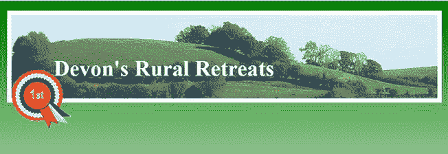

# 二十、附录：快速参考、技术和有用的数据

本附录有以下三个主题:

> 1.  *Quick reference chapter* . Why do readers of this book want such basic information? Because even the most experienced web designers will have short-term amnesia. It is convenient to remind the basic principles in one place of a book; It saves time searching in several books, chapters or the Internet.
> 2.  *Technical summary* . This paper summarizes some useful technologies, such as positioning, floating, tag sorting and ensuring that MIME type is set on the server.
> 3.  *Table information* . Include useful data tables so that you can find information about character entities and browser statistics.

### 快速参考章节

#### HTML5 和 XHTML5 快速参考

HTML5 和 XHTML5 的文档类型比早期的表单简单得多。

<colgroup><col align="left" valign="bottom" width="25%"> <col align="left" valign="bottom" width="75%"></colgroup> 
| **对于 HTML5:** | `<!doctype html>

<html lang=en>
<head>
<title>HTML5 test document</title>
<meta charset=utf-8>
*meta details go here*
</head>` |
| **对于 XHTML5:** | `<!DOCTYPE html>
<html lang="en">
<head>
<title>XHTML5 test document</title>` `<meta charset="utf-8" />
meta details go here
</head>` |

 **注意**对于标记为 XHTML5 的页面，可以使用更简单的 HTML5 DOCTYPE。

对于英语以外的语言，请访问`[www.w3.org/International/questions/qa-choosing-language-tags.en](http://www.w3.org/International/questions/qa-choosing-language-tags.en)`或`[www.w3.org/blog/International/tag/qa-choosing-language-tags/](http://www.w3.org/blog/International/tag/qa-choosing-language-tags/)`

#### 验证

这两种文档类型都将在 W3C 验证器(`[`validator.w3.org`](http://validator.w3.org)`)或`.nu`验证器(`[`html5.validator.nu`](http://html5.validator.nu)`)中进行验证。

在撰写本文时，这两种验证器都是实验性的。那个。XHTML5 检查的 nu 祝贺消息表明检查的文件是 HTML5，反之亦然。这应该在本书出版时得到纠正。参见第十八章，其中涵盖了验证的全部细节。

如果选择使用 XHTML5 标记，应该遵守 XHTML 中的自结束标记和双引号规则。如果你像我一样喜欢使用 HTML5 标记，生活会变得更容易；您可以忘记自结束标记和双引号以及许多其他以前的标记要求。例如，要指定语言，使用`<html lang=en>`；要指定字符集，请使用`<meta charset=utf-8>`。不需要为 JavaScript 指定 MIME 类型，因为新浏览器，由于 HTML5，不再需要被告知 JavaScript 文件是`type="text/javascript`。

#### CSS2 快速参考

有关 CSS 的更多信息，请尝试以下手册:

> *   *用可扩展的超文本标记语言开始超文本标记语言和 CSS* 作者克雷格·库克和大卫·舒尔茨(阿普莱斯，2006 年).
> *   *ProCSS and HTML Design Pattern* Author Michael Bowles (April, 2007).
> *   [ CSS: Missing Manual 2nd edition, by David Sawyer McFarlane (O'Reilly Media, 2009).

在`[`www.apress.com`](http://www.apress.com)`还有很多其他的标题。访问该网站，在搜索框中键入“css”或“html”。

#### 美国拼写必须用于三个属性

使用`gray`、`center`、`color`；不像英国、澳洲和纽西兰的`grey`、`centre`和`colour`。

#### CSS 选择器的四个主要类别

以下是 CSS 选择器的四个主要类别:

> *   `id` (identity)
> *   `class`
> *   `span`
> *   `group`

##### 身份(id)

在 CSS 样式表中，用散列符号写了一个`id`选择器；例如:

`#credits {font-size:small;}`

每页仅使用一个`id`。

在这种情况下，网页上的目标将是`
`

##### 类(。)

在样式表中，类选择器以句号开头；例如

`.bigblue {font-size:xx-large; color:blue;}`

这个类会产生一个蓝色的大字体。您可以在每页上使用任意多个相同的类。

在这种情况下，网页中的目标是

`
The Sausage Shop
`

##### 跨度<跨度>

跨度选择器在页面中内联使用，用于定位较大元素中的小元素，例如段落中的几个单词。CSS 的一个例子是

`span.redfont {color:red;}`

这将把一段文本变成红色。A ``不会像标签`
`和`
`以及标题`hi`、`h2`、`h3`等那样在一行文本的上下添加行间距；每页使用尽可能多的相同跨度。

本例中的 HTML 目标是

`
We hope you will visit The Sausage Shop very soon
`

##### 分组目标

可以在每个标签后使用逗号将样式表选择器分组。本示例将所有标题的边距和填充设置为零。

`h1, h2, h3, h4, h4, h5, h6 {margin:0; padding:0 }`

##### 特定群体目标

通过在选择器中选择一个选择器，选择器可以变得更加具体，但是没有逗号。例如:

`header strong {color:blue;}`

在这种情况下，选择器的目标是包含在`<strong>`标签中的一些文本，但是只有当`<strong>`标签本身包含在一个 header 标签中，如下所示:

`<header><strong>some text</strong></header>`

单词`some text`将被涂成蓝色。这个选择器的行话是*后代选择器*。`<strong>`标签是`<header>`标签的后代。

##### 其他目标

HTML 标签如``、`<html>`、`<body>`、`<ul>`都可以是目标；它们就像特殊的`
`一样。例如，下面这段样式去除了所有图像的边框:

`img { border:none; }`

下一种样式设置网站上每个页面的总体外观。

`body { font-family:arial; font-size:medium; background:#FFF; color:#000;}`

##### 锁定超链接

链接的外观和行为应该由样式表决定。CSS 可以是

`/*set the hyperlink colour to blue and the font size to mediuml*/
a.small-normal:link { color: blue; text-decoration:none; font-weight:normal; font-size:medium; }
a.small-normal:visited { color: blue; text-decoration: none; font-weight:normal; font-size:medium; }
a.small-normal:hover { color: red; text-decoration: none; font-weight:normal; font-size:medium; }
a.small-normal:active { color: blue; text-decoration: none; font-weight:normal; font-size:medium; }`

在这个例子中，目标链接将是蓝色的，以使它从默认的黑色文本中突出出来，并且它不会被加下划线，因为文本装饰被设置为“none”。当鼠标指针悬停在链接上时，链接将从蓝色变为红色。

前一种样式对应的 HTML 可能是

`<a title="Computer Jargon explained" href="jargon.html">Go to Jargon page</a>`

如果您希望链接在悬停时加下划线，请按如下方式更改悬停条件的文本装饰:

`a.small-normal:hover { color: red; **text-decoration: underline;** font-weight:normal; font-size:medium; }`

##### 使用 3D 按钮定位滚动导航菜单

以下代码片段使用一个无序列表来生成 3D 菜单按钮(第四章给出了工作示例):

`nav {position:absolute; top:100px; left:3.6%; width: 866px; padding: 5px; 
list-style: none; overflow: hidden; height: 35px;
}` `nav li { display:inline; padding: 5px; padding-top:15px; margin:5px 0 0 2px; 
height:25px; width:100px;
}
nav a {height:25px; width:100px; color: #fff; font-size:80%; font-size: 100%; 
font-weight:bold; text-decoration: none; background-color: #72b720; 
border: 4px outset #5edd51; padding:5px 5px 0 5px; display: inline-block;
}
nav a:hover { font-weight: bold; background-color:green; color:white;
}
.clear { clear:both;
}`

##### 伪元素前的

CSS 可以生成一段特殊的高亮文本，并将其放在所选段落的开头，如图图 App-1 所示。单词*注释*是用彩色框中的白色文本生成的。

***图 App-1。**生成内容*

IE 7 不支持伪元素`:before`。清单 App-1 有一个内部 CSS 样式，而`:before`的伪样式以粗体显示。

***清单 App-1。【为段落中的第一个单词创建特殊效果(css2-before.html)***

`<!doctype html> <html lang=en> <head>
<title>Generate some content before a selected paragraph</title>
<meta charset=utf-8>
        *meta details go here*
        
</head>
<body>

surrounding paragraph

        <**p class="note">**The text with the coloured background is generated with CSS2 
        but is not supported by IE 6 and IE 7. The class "note" is targeted by the 
         pseudo-element <strong>:before</strong>
` `
surrounding paragraph

</body>
</html>`

#### 更广泛的命名颜色

最初，只有 17 种命名的颜色可用。这个数字大大增加了，像巧克力，黑鲑鱼，蜜露这样的名字可以用来代替 RGB 或十六进制颜色。

如需完整列表，请访问`[`somacon.com/p142.php`](http://somacon.com/p142.php)`。

#### 排序标记:什么在<头>部分中排在第一/最后？

某些项目必须以特定的顺序出现在标记的`<head>`部分，否则您可能会遇到意想不到的结果。首选顺序如下。

##### 链接到不同的媒体

`<link rel="stylesheet" type="text/css;" href="md-sheet.css" media="handheld">
<link rel="stylesheet" type="text/css;" href="stylesheet.css" media="screen">
<link rel="stylesheet" type="text/css;" href="print-sheet.css" media="print">`

 **注意**`print`媒体链接应该出现在`screen`链接之后。`screen`链接指的是默认的台式机/笔记本电脑显示屏。要记住顺序，试试这个助记符:**H**ot**S**oup**P**lease(**H**and held，**S**screen，以及 **P** rint)。

使用特殊样式表的链接进行打印的替代方法是在全局样式表中包含一个将应用于所有页面的`@media print`指令。例如，您可能希望减小从网站打印的任何页面上的标题大小和行距。此外，让我们假设网站使用无衬线，10 点字体；我们将把字体改为 12 磅乘以新罗马体，因为它在印刷品上更容易阅读。为此，您可以将以下代码添加到主外部样式表中:

`        @media print {
                        p { font-family: "times new roman"; font-size:12pt;
                        }
                        h1 { font-size:20pt; margin-bottom:0;
                        }
                        h2 (font-size: 14pt; margin-bottom:0;
                        }
                     }`

##### 将链接样式放在内部样式之前

将默认链接语句*放在任何内部样式*之前，如下所示:

`<link rel="stylesheet" type="text/css;" href="stylesheet.css">
        `

##### IE 条件句所在

在`<head>`部分找到任何条件样式。它们必须在之后*出现，如下所示:*

`<link rel="stylesheet" type="text/css" href="*default.css*" />
        <!--[if IE 6]>
        <link rel="stylesheet" type="text/css" href="*style-ie6.css*" />
        <![endif]-->
</head>`

##### 包括 JavaScript

将 JavaScript 链接放在链接样式和内部样式之后，如下所示:

`<!doctype html>
<html lang=en>
<head>
<title>Home page</title>
<meta charset=utf-8>
        *meta details go here*
</head>
<link rel="stylesheet" href="*default.css*" type="text/css" />
                
        
        
</head>`

##### 在<正文>部分列出视频源

`<body>`部分中的视频源必须按以下顺序列出，否则某些手持设备可能会出现问题:

> *   `.mp4`
> *   `.webm`
> *   `.ogv`

IE 7 和 IE 8 的后备文件应该位于列表的末尾。

##### 订购伪类

设计链接样式时，顺序很重要。应该是这样的:

> *   interlinkage
> *   Visit
> *   hover
> *   having the initiative

一个有用的记忆方法是永远不变。

### CSS3 快速参考

CSS3 有几个期待已久的增强功能。这些正在逐步完善和发布；大部分浏览器(除了 IE 7 和 IE 8)都开始回升了。IE 7 和 IE 8 忽略了这些增强，例如，带有 CSS3 圆角的页面将显示方形角。IE 9 可能会利用一些新的 CSS3 增强功能。

CSS3 元素的当前列表包括以下内容:

> *   [fillet] (see chapter 7 of )
> *   Multi-column (see Chapter 15 of )
> *   Shadows (see chapter 8 )
> *   Shading the text (see chapter 8 of )
> *   Multi-background (see Chapter 3 of )
> *   Font selector (see chapter 5 of ).
> *   An opaque attribute (see chapter 5 of )
> *   RGBA color notation (see chapter 5 of )
> *   A template layout module
> *   Frame picture
> *   Grid layout

 **注**这本书给出了标有章节号的模块的工作示例。

### 技术总结

#### 元素的相对定位

CSS 相对定位相对于项目通常出现的位置移动项目。通过相对定位，图 App-2 中左边的圆被做成了向右 320 像素，但是这个的 CSS 代码并不像你预期的那样。CSS 代码实际上告诉你原来的圆在哪里；即向左 320 像素，向上 70 像素。CSS 代码是

`#circle { position:relative; left:320px; top:70px; }`

记住这一点的最好方法是假设左边的*和上边的*和*的尺寸是边距。*

***图 App-2。**相对定位将元素从其原始位置移开*

为了说明这一点，我们将使用第三章中一个熟悉的图像。图 App-3 显示了带有玫瑰花结的割台。

***图 App-3。**玫瑰花结定位前的位置*

玫瑰花结位于页眉边框的内部左侧边缘。清单 App-3 为玫瑰花结设置*原始*默认位置。

***清单 App-3。**在其默认位置叠加一个玫瑰花结(original-position.html)*

`<!doctype html>
<html lang=en>
<head>
<title>Rosette in original position</title>
<meta charset=utf-8>
        *meta details go here*

<!--conditional JavaScript added-->
<!--[if lte IE 8]>

<![endif]-->
</head>
<body>
<header>
<h1>Devon's Rural Retreats</h1>

</header>
</body>
</html>`

#### 相对放置玫瑰花结

从逻辑上来说，你可能会认为玫瑰图必须放在右边的位置，但是如前所述，你需要想象相对的位置尺寸是 ?? 边距。所以，通过反复试验，我使用下面的 CSS 样式，给玫瑰图左边 750 像素*和上边 5 像素*的假想边距:**

`#rosette { position:relative; left:750px; top:5px; }`

玫瑰花结的新位置如图 App-4 所示。

***图 App-4。**玫瑰花结相对定位后的位置*

通过清单 App-4 中的粗体显示的代码应用相对位置。

***清单 App-4。【re-positioned.html】相对定位玫瑰花结***

`<!doctype html>
<html lang=en>
<head>
<title>Rosette relatively re-positioned</title>
<meta charset=utf-8>
        *meta details go here*

</head>
<body>
<header>
<h1>Devon's Rural Retreats</h1>

</header>
</body>
</html>`

#### 元素的绝对定位

绝对定位相对于以下内容定位元素:

> 1.  *The edge of the browser window* . For example
>     
>     `#element { position:absolute; left:0; top:0; }`
>     
>     
>     
>     This CSS style will position an element so that it is close to the left and top of the browser window.
>     
>     
> 2.  *The edge of its nearest container* . In this case, the container must be a direct ancestor and it must also have positioning applied to it. The ancestor’s positioning does not need to have any dimensio NS such as left, top, right or bottom.
>     
>     For example, the following CSS statement absolutely locates the horizontal navigation bar in the container; The container applies some positioning, which in this case is relative. The location of the container can be zero, as shown in bold in the first line, it still works; In fact, the items shown in bold in the first row can be completely omitted.

`#container {position:relative; **top:0; left:0;** width:950px; margin:auto; 
text-align:center;
}
nav { **position:absolute; top:100px;** left:8%; width: 785px; padding:5px; 
list-style: none; height: 35px;
}`

 **提示**为了避免跨浏览器的问题，总是给绝对定位和固定位置的元素一个宽度。

#### 显示内嵌、块或内嵌块

有些元素默认为`inline`元素。要改变这种行为，可以使用 CSS `display` style 属性来设置元素的样式。

> *   `display:inline;`: line height, width, top and bottom filling; The top margin and bottom margin cannot be changed. Increasing the height or width has no effect. And padding margins can only be added to the right and left sides of the content. However, the width of the element will be determined by any text and/or images contained in the element in the line. By default, these elements are inline; `` 、 `<a>, <label>` 、 `<input>` 、 `` 、 `<strong>` 、 `<b>` 、 `<em>` 。 Elements such as < UL >, < Li > can be changed to `inline`. In this case, they are subject to the same restrictions: width, height, top and bottom padding and top and bottom margins cannot be adjusted.
> *   `display:block;`: Ensure that an element has top and bottom line spacing, and allow optional width, height, top and bottom padding and top and bottom margin. If there is no width, the element will default to the width of the element it contains, such as the sidebar column. Examples of blocks are `
`, `<h1>`, `<h2>`, `<h3>`, `<h4>`, `<h5>`, `
`, `<form>`, `<dl>`, `<dd>`, `<dt>, <ul>`, `<li>`, `<ol>` and ` `. Elements are placed on top of each other, so they are very suitable for vertical lists like menus.
> *   `display:inline-block;`: Delete the space between the upper and lower rows, but allow padding up and down. This is a very useful style for embedded menu buttons. It was not fully utilized in the past because some old browsers did not support it.
> *   All three styles allow left and right filling.
> *   Inline elements can only contain text and other inline elements. A block can contain text and inline elements.

#### 浮动元素

浮动是定位元素的另一种方法。项目可以向左或向右浮动。默认为`float:none;`。浮动元素应该总是有宽度(浮动的*图像*已经有预定义的宽度)。当一个元素被浮动时，它*不能*被赋予`position:absolute;`或`position:relative;`。CSS 为`float:left;`或`float:right;`或`float:none;`

 **提示**浮动的元素可以有正或负的边距来帮助定位。

图 App-5 显示顶部玫瑰花形向左浮动，下部玫瑰花形向右浮动。

***图 App-5。**左右浮动的玫瑰花结*

清单 App-5 创建了如图 20-5 所示的浮动属性的演示。

***清单 App-5。【float-1.html 演示左右浮动***

`<!doctype html>
<html lang=en>
<head>
<title>float-1</title>
<meta charset=utf-8>` `        *meta details go here*

</head>
<body>

The rosette is floated left. The paragraph flows around the rosette. The rosette is floated
left. The paragraph flows around the rosette. The rosette is floated left. The paragraph flows
around the rosette. The rosette is floated left. The paragraph flows around the rosette.

The rosette is floated right. The paragraph flows around the rosette. The rosette is
floated left. The paragraph flows around the rosette. The rosette is floated left. The
paragraph flows around the rosette. The rosette is floated left. The paragraph flows around
the rosette.

</body>
</html>`

#### 应用于浮动元素的<清除>属性

文本围绕浮动项目流动。有时你不希望文本四处流动；您希望文本位于浮动元素的下方。这可以通过使用`clear`属性来实现；然而，我从来不记得什么清除了什么，以及左右应该如何应用。

一般的规则是，如果一个项目，比如一个图像，向左浮动，给文本 CSS 属性`clear:left;`——换句话说，清除向左浮动的项目。相反，如果一个元素是右浮动的，并且你不希望文本围绕它流动，那么给文本 CSS 属性`clear:right;`。

CSS 命令`clear`也可以像在`clear:both;`中一样拥有属性`both`。这对于将像页脚这样的元素放在页面的列下面非常有用。

在图 App-6 中举例说明了`clear:left;`和`clear:right;`属性。

***图 App-6。**段落被设计为清除浮动图像。*

清单 App-6 中粗体显示的代码强制文本远离图像。

***清单 App-6。【使用清晰属性(float-2.html)***

`<!doctype html>
<html lang=en>
<head>
<title>float-2</title>
<meta charset=utf-8>
        *meta details go here*

</head>
<body>

` `

The rosette is floated left. The paragraph has been given a class <i>
        clear-left</i>. The rosette is floated left. The paragraph has been given a class
<i>clear-left</i>.

**The rosette is floated right. The paragraph has been given a class <i>
clear-right</i>. The
rosette is floated right. The paragraph has been given a class <i>clear-right</i>. 

</body>
</html>`

#### 了解 MIME 类型

MIME 类型(多用途互联网邮件扩展)告诉浏览器正在处理什么类型的文件。尽管最初是为电子邮件设计的，但该标准已经扩展到了网站。你在网页上看到几种 MIME 类型；它们是这样出现的:`type="something"`。以下是典型的 MIME 类型:

> HTML 页:??]
> 
> JavaScript: `type="text/javascript"`
> 
> MP3 文件:`type="audio/mpeg"`
> 
> SVG:??㎡t
> 
> CSS:??]

幸运的是，网页设计者不必过多担心 MIME 类型，因为浏览器足够聪明，知道`.jpg`、`.gif`和`.png`是图像，它们自动知道应用哪种 MIME 类型。这在 HTML5 中会变得更加普遍；例如，以后的浏览器会识别 JavaScript，这样就不需要在标记中声明脚本的 MIME 类型。

##### 基于服务器的 MIME 类型

MIME 类型并不总是输入到网页中；有些位于服务器/主机中。这尤其适用于新 HTML5 建议的音频和视频。

以下笔记摘录自`[`tomraftery.com2005/01/15//creating-an.htaccess-file/`](http://tomraftery.com2005/01/15//creating-an.htaccess-file/)`和`[`www.javascriptkit.com/howto/htaccess.shtml`](http://www.javascriptkit.com/howto/htaccess.shtml)`的网站。

 **注意**有些主机允许网站设计者向服务器添加 MIME 类型权限。你可以创建自己的`.htaccess`文件，但是你需要弄清楚你的主机是否允许你上传它。请注意，在更改`.htaccess`文件时，您必须非常小心。如果可能的话，请你的主人改变它。一些主机在其网站的控制面板中有一个工具，可以让你自己修改文件。否则，如果你能在主机的文件夹里看到一个`.htaccess`文件，就下载一份。该文件通常存储为隐藏文件，因此您可能看不到它。在这种情况下，您将无法下载它(尽管文件名前面的点表示一个隐藏的文件，但它可能不会隐藏在您的特定主机上)。*始终保留一份`.htaccess`文件的备份*；如果你犯了一个错误，你可以上传原件。在`.htaccess`文件中犯一个错误会让你的整个网站停止工作。如果发生这种情况，只需从备份中上传原件。无论是出版社还是作者都不会对你在主机服务器上犯的任何错误负责。

###### 视频 MIME 类型

在尝试为网站提供 HTML5 视频之前，请务必联系主机服务器，请求为`.ogv`、`.mp4`、`.flv`、`.swf`和`.webm`视频文件设置 MIME 类型。如果你忽略了这一点，你的视频将无法在某些浏览器上播放。

下面是大多数主机用来在服务器上设置 MIME 类型的代码片段。它和其他名为`AddType`的权限一起存在于`.htaccess`文件中。

`AddType video/ogg .ogv
AddType video/mp4 .mp4
AddType video/webm .webm
AddType video/x-flv .flv
AddType application/x-shockwave-flash swf`

 **注意**使用纯文本编辑器创建文件是绝对必要的。可以使用笔记本创建文件，并先保存为`.htaccess.txt`。然后您必须通过右击文件并将其重命名为`.htaccess`来删除`.txt`文件类型。如果在`.htaccess`文件名后面写任何东西都不行。

> *   Each `AddType` must be on its own line, and no line break is allowed. If the text editor wraps the text, make sure it doesn't insert line breaks to create the wrapping.
> *   Use `#` (hash) at the beginning of a line to comment out a line.
> *   Ignore multiple or single spaces, but do not use tabs.
> *   When uploading files using FTP, *should not* be sent in binary. You must upload it in ASCII mode.
> *   You should upload the `.htaccess` file to the folder (root folder) where your homepage is located. Then, the file affects every folder in the entire site.
> *   Use your FTP client, find the `.htaccess` file you uploaded, and right-click it. Set CHMOD to 644 or (rw-r–r–). This prevents unauthorized people from interfering with it. This also makes it available to the server, but it can't be seen in the browser.

 **提示**你的主机/服务器可能选择不显示`.htaccess`文件，但是它仍然存在，所以试试这个:在你的 FTP 程序中，点击下载按钮，不选择文件名。通常会出现一个文本框，要求您输入文件名。键入`.htaccess`然后点击 OK 下载文件。

如果你的文本编辑器不允许你像*一样重命名一个文件。* `htaccess`如果前面有一个点，请尝试在 MyComputer 中查看该文件(或在 Windows 7 中在 Computer 中查看)。然后右键单击该文件，选择重命名，键入新名称，并按 Enter 键进行确认。或者，您可以将`.htaccess`上传到您的主机服务器，并在服务器上重命名它。然而，如果主机使文件不可见，这将不起作用。如果您的 FTP 程序可以配置为查看所有文件，它可能会克服这个问题。在 FTP 程序中重命名文件后，您可能看不到该文件。

上传您的新`.htaccess`后，您可能会在尝试查看您的网站时看到错误消息。这意味着你的`.htaccess`文件有问题。上传保存好的，好的版本；或者在绝望中，你可以尝试上传一个完全空的`.htaccess`文件来覆盖这个有问题的文件。

永远保存好你的`htaccess.txt`文件，以防你将来需要修改。

##### 主持人可能允许你改变。htaccess 文件

我使用`[www.bargainhost.co.uk](http://www.bargainhost.co.uk)`是因为它对网页设计者/所有者有很多有用的功能，而且支持人员是我见过的最有帮助的。我可以使用以下步骤从廉价主机 cPanel(控制面板)访问`.htaccess`文件:

> 1.  Log in to cPanel. Click under File Manager Options.
> 2.  。
> 3.  Select the home directory.
> 4.  Select the `public_html` folder.
> 
> `htaccess`

#### Internet Explorer 条件句

有时 IE 需要一个简短但附加的样式表来克服浏览器无法符合标准建议的问题。

条件链接必须放在 HTML 标记的 head 部分，在样式化整个网站的主链接之后。条件位由`if`和`endif`包围。

如果 IE 6、IE 7 和 IE 8 是不符合特定 W3C 标准的浏览器，那么 HTML 将如下所示:

`<link rel="stylesheet" type="text/css" href="*global.css*">
        <!--[if lt IE 9]>
        <link rel="stylesheet" type="text/css" href="*style-IE.css*">` `        <![endif]-->
</head>`

表达式`<!--[if lt IE 9]>`中的`lt`表示“如果浏览器低于 IE 9。”

如果 IE 6 是唯一不符合特定 W3C 标准的浏览器，那么 HTML 将如下所示:

`<link rel="stylesheet" type="text/css" href="*global.css*" />
        <!--[if IE 6]>
        <link rel="stylesheet" type="text/css" href="*style-ie6.css*" />
        <![endif]-->
</head>`

如果 IE 6 和 IE 7 是不符合特定 W3C 标准的浏览器，那么 HTML 将如下所示:

`<link rel="stylesheet" type="text/css" href="global.css" />
        <!--[if lte IE 7]>
        <link rel="stylesheet" type="text/css" href="style.ie67.css" />
        <![endif]-->
</head>`

表达式`<!--[if lte IE 7]>`中的`lte`表示“如果浏览器小于或等于 IE 7。”

 **注意**你大概习惯打“IE6”、“IE7”、“IE8”。输入条件句的时候一定要在 IE 和数字之间加一个空格，否则会被浏览器忽略。

IE 条件句的全部细节可以在`[`msdn.microsoft.com/en-us/library/ms537512(VS.85).aspx`](http://msdn.microsoft.com/en-us/library/ms537512(VS.85).aspx)`找到。同样参见`[`www.conditional-css.com/usage`](http://www.conditional-css.com/usage)`了解所有浏览器的条件。

### 数据表

#### 常见的人物实体

在 HTML5 中，有些字符必须用字符实体来表示。表 App-1 显示了最常见的实体。

要了解全部细节，请在搜索引擎中输入“ISO-8859-/entities”。

#### 浏览器流行度统计

网页设计者需要知道他们的大多数目标用户使用的是哪种浏览器。当决定我们的目标受众时，我们可以把杂志投票作为设计技术网站的指南，比如教程和 W3C 信息。对于提供新闻、商品、服务、旅游信息的网站，以及一般的网站，表 App-2 中的统计数据更适用。总是问你的潜在客户她正在使用哪个浏览器。

警惕计算机杂志调查收集的统计数据。调查结果并不代表公众的观点。相反，他们给出了一组精选的计算机爱好者的观点。大多数人和商业公司使用 Windows 和该操作系统免费提供的内容。在表格 App-3(*computer active*杂志和`[`gs.statcounter.com`](http://gs.statcounter.com)`)中比较两类用户 2012 年 2 月在英国的数字。

表 App-2 和表 App-3 并不能说明全部情况。IE 的数据包括好的和不太好的版本。我们可以忽略 IE 6。如果我们假设到 2015 年，Windows 7 和 Windows 8 的用户已经成为主导，这些用户可能会遵循他们早期的偏好，使用他们的操作系统自带的任何东西——IE 9 和 IE 10。与此同时(2012 年 2 月)，IE 7 仅占英国 IE 总使用量的 12 %,而且还在快速减少。IE 8 占 IE 总数的 62 %,并逐渐被 IE 9 取代，2012 年 2 月 IE 9 占 26%。

调查变得更加复杂，因为现在许多人有不止一台电脑，每台电脑都装有不同的 Windows 操作系统和不同的浏览器。政府机构有时落后于更有知识的公众。

短期内，确保你的网站可以在所有浏览器上运行，包括 IE 7 和 IE 8。希望到 2015 年我们可以忘记 IE 条件，因为所有的浏览器都将更加符合标准。

 **提示**访问`[`gs.statcounter.com`](http://gs.statcounter.com)`时，选择条形图版本，清晰了解当前情况。选择折线图版本以查看趋势。另请参见`[`marketshare.hitslink.com/browser-market-share.aspx?qprid=3`](http://marketshare.hitslink.com/browser-market-share.aspx?qprid=3)`。

浏览器使用的统计数据也由以下网站监控:

> *   `[`www.w3schools.com/browsers/browsers_stats.asp`](http://www.w3schools.com/browsers/browsers_stats.asp)`
> *   `[`gs.statcounter.com`](http://gs.statcounter.com)`
> *   `[`www.netmarketshare.com/browser-market-share.aspx?qprid=0&qpcustomd=0`](http://www.netmarketshare.com/browser-market-share.aspx?qprid=0&qpcustomd=0)`
> *   `[`en.wikipedia.org/wiki/Usage_share_of_web_browsers`](http://en.wikipedia.org/wiki/Usage_share_of_web_browsers)`

不同组织的统计数据差异很大。我们永远不会知道哪个数据是最可靠的，但是你应该能够发现明确的趋势。