# 二、CSS3 变换和过渡

虽然 CSS 动画可以用来改变 HTML 元素的几乎每一个方面(除了上一章列出的属性)，但操纵网页表示的一些最强大的方法存在于 CSS Transforms 和 Transitions 模块中，这在 CSS3 中是全新的。

CSS 转换是最简单的动画形式:两种状态之间的移动。一旦你掌握了本章中描述的过渡的基本语法，你将能够将简单、有效的动画应用到图像(在第三章中描述)和用户界面元素(在第四章中描述)，然后开始创建更复杂的关键帧动画(在第五章和更远的地方描述)。

CSS 变换

有四个主要的 CSS 翻译函数:`translate`、`rotate`、`scale`和`skew`。这些功能被组合在`matrix`转换功能中。您将把这些转换应用到一个标准的 web 页面布局中，这个页面布局是一个浮动在文本段落旁边的图像，如清单 2-1 所示。

***清单 2-1 。*** HTML5 代码为浮动图像

```html
<!DOCTYPE html>
<html>
<head>
<title > Simple CSS3 Transformation</title>
</head>
<body>
<p> < img src = "dudley-storey-statuette.jpg" alt = "Student-made statuette of Dudley Storey" style = "width: 300px; height: 300px; float: left; margin: 0 2em 1.4em 0;" > Lorem ipsum dolor sit amet, consectetur adipiscing elit. Suspendisse eu mi tellus. Vestibulum tortor erat, facilisis in auctor semper, pharetra quis mi...</p>
</body>
</html>
```

清单 2-1 中所示的代码将产生图 2-1 所示的布局。

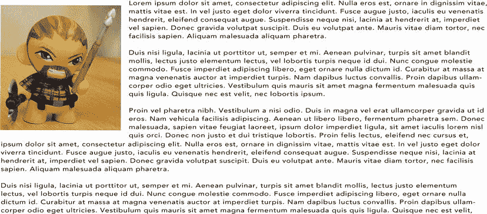

图 2-1。浮动有段落文本的图像

有了这个基础页面，就可以开始对图像元素应用变换了。

旋转

首先，你将通过旋转来变换图像(见清单 2-2 )。CSS3 旋转变换的值可以用度、梯度、转角或弧度来指定，使用正或负浮点值来创建顺时针或逆时针旋转。您必须包含供应商前缀以涵盖所有浏览器。

***清单 2-2 。*** 内嵌 CSS 旋转图像

```html

```

清单 2-2 中代码的结果如图图 2-2 所示。

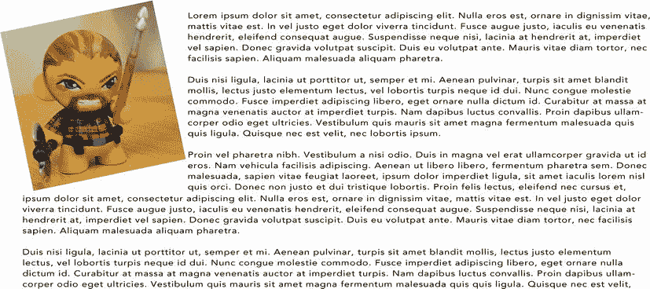

图 2-2。带有 CSS 旋转变换的浮动图像

虽然测量旋转角度是编写 CSS 转换时最常用的方法，但 CSS3 允许各种单位，如表 2-1 所示:

*表 2-1。**CSS 角度数据类型*可能的单位制

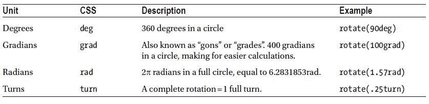

使用`rotate` : 浮动图像时，有一些事情需要注意

*   页面上的其他 HTML 内容不受变换的影响:段落的布局不会随着图像的旋转而改变；进一步旋转图像会使其与文本重叠。(CSS 区域模块支持对变换做出反应的内容)。
*   文档对象模型(DOM) 同样不受影响；转换后的元素(如`offsetWidth`)的属性值也将保持不变。
*   CSS 转换本质上在受影响的元素上强加了一种相对定位的状态；元素使用的原始空间将被保留。
*   如果`overflow`属性的值是`scroll`或`auto`，滚动条将根据需要出现，使您能够查看在可见区域之外转换的内容。
*   旋转从元素的计算的*中心*开始，即`transform-origin`。
*   应用于元素的其他 CSS 外观规则，如`box-shadow`，在转换之前应用*，因此它们将随效果一起旋转。*
*   将图像旋转 180 度不会翻转或镜像图像；这可以通过使用本章稍后讨论的`scale`变换或第九章讨论的 3D 旋转来实现。
*   你可以旋转任何你想要的 HTML 内容，但是从设计的角度来看，不建议你旋转文本:这样做会降低可读性，并且会给你的读者带来痛苦。
*   测量单位需要存在，即使旋转量为 0。在大多数 CSS 测量中，0 对于任何单位都是 0，(即`width: 0`作为`width: 0px`的替代)。)但旋转到 0°时，必须指定`transform: rotate(0deg)`；`transform: rotate(0)`不起作用。

正如您所看到的，由于需要包含供应商前缀，转换的内联样式可能会很长。更常见的是单独创建转换，如嵌入或链接样式表中的`class`或`id`(见清单 2-3 )。

***清单 2-3 。*** 用于转换图像的嵌入式 CSS 样式表

```html
<!DOCTYPE html>
<html>
<head>
<title > Simple CSS3 Transformation</title>
<style>
img.tilt {
width: 300px; height: 300px; float: left;
-moz-transform: rotate(7.5deg); -o-transform: rotate(7.5deg);
-ms-transform: rotate(7.5deg); -webkit-transform: rotate(7.5deg);
transform: rotate(7.5deg);
}
</style>
</head>
<body>
<p >  Lorem ipsum dolor sit amet, consectetur adipiscing elit. Suspendisse eu mi tellus. Vestibulum tortor erat, facilisis in auctor semper, pharetra quis mi...</p>
</body>
</html>
```

要旋转图像，就像它被钉在右上角一样，你必须将元素的`transform-origin`移动到那个位置，如清单 2-4 中的所示。

***清单 2-4 。*** 从一个角落旋转一个图像

```html
img.tilt {
width: 300px; height: 300px; float: left;
-moz-transform-origin: right top;
-o-transform-origin: right top; -ms-transform-origin: right top;
-webkit-transform-origin: right top; transform-origin: right top;
-moz-transform: rotate(−10deg); -o-transform: rotate(−10deg);
-ms-transform: rotate(−10deg); -webkit-transform: rotate(−10deg);
transform: rotate(−10deg);
}
```

清单 2-4 中的代码将产生如图图 2-3 所示的结果；注意，我不得不稍微改变图像的内嵌样式，为右边的空白提供更多的空间，以补偿图像的新角度。

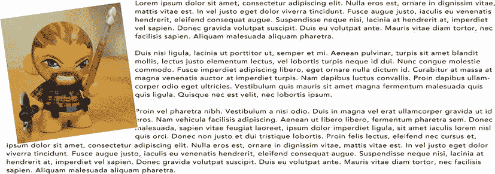

图 2-3。带有段落文本的旋转浮动图像

`transform-origin`取值的方式与`background-position`和其他组合水平和垂直偏移的属性相同。这些值被指定为原点的水平位置，后跟相对于元素本身的垂直位置*。*这些值可以指定为关键字(`top`、`center`、`bottom`、`left`和`right`)、数字或两者的组合。它们也可以在元素本身的区域之外(例如，在元素的上方或下方创建一个变换原点轴，如第三章中的“card fan”图像库示例所示)。

Webkit CSS3 转换锯齿问题

Chrome 和 Safari 的早期版本(直到版本 5.1)包含一个渲染 bug:当转换一些元素时，浏览器不会对旋转或倾斜的 HTML 内容的边缘进行反锯齿，从而导致图像边缘出现所谓的“锯齿”或“阶梯”，如图 2-4 所示。

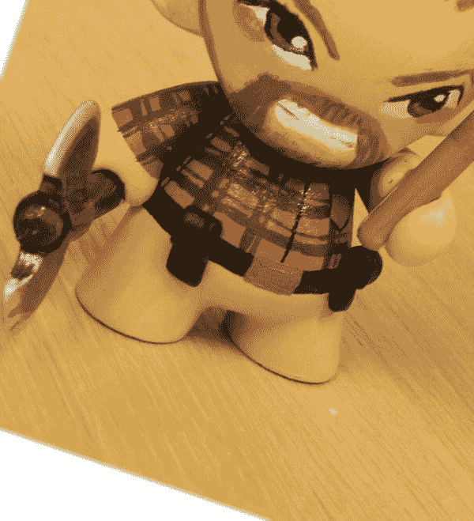

图 2-4。缩放图像，显示使用 CSS 变换旋转的图像边缘的锯齿

有多种方法可以解决这个问题:

*   在元素周围应用 1 像素的白色边框。
*   将`webkit-backface-visibility: hidden;`应用到元素。
*   向元素添加另一个转换，比如`-webkit-transform: rotate(−10deg) translateZ(0);`。

然而，没有一种技术能在所有情况下都最好地解决呈现错误；每种技术的有效性取决于所呈现的元素的上下文。

标度

当应用于图像时，`scale`变换有点奇怪:考虑到改变图像的`height`和`width`会有几乎相同的视觉效果，它可能看起来没什么用。不同之处在于,`scale`可以应用于任何 HTML 元素的*:改变段落的`width`会重排文本内容，但改变其`scale`会使文本物理上变大或变小。*

`scale`的值是一个乘数:`scale(2)`应用于一个元素将使它看起来两倍宽和两倍高(换句话说，是正常大小的四倍)，而`scale (.5)`将产生一个原始大小四分之一的图像。`scale`将在所有方向上均等地变换元素。您也可以将`scale`应用于顺序方向:X(水平)、Y(垂直)和 Z(深度)。

使用 scaleX 翻转图像

您可以使用`scale` CSS 转换来有效地镜像 HTML 元素(通常是图像，尽管原则上这种技术可以应用于任何元素)。如果`scale`从`1`开始，如图 2-5 左侧所示，当您降低`scale`的值时，受影响的元素将变小，直到您达到 0，此时图像消失。如果将该值推入负值区域，图像将再次开始增长，但会出现水平翻转，如图 2-5 右侧所示。

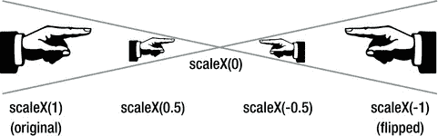

图 2-5。使用 scaleX()的小负值的影响

您可以使用`scale`快速翻转页面上的图像，而不是通过 Adobe PhotoShop 等应用处理它来生成新的副本。清单 2-5 展示了如何应用变换来反转亚伯拉罕·林肯的图像。

***清单 2-5 。*** 使用内嵌变换样式翻转图像

```html

```

图 2-6 显示了清单 2-5 中代码的结果。

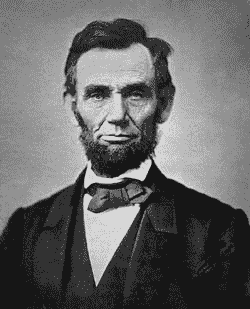 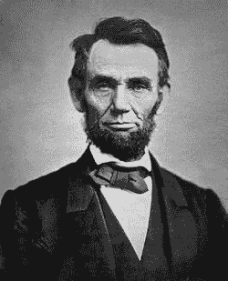

图 2-6。亚伯拉罕·林肯的原始照片(左)使用 CSS3 缩放变换(右)翻转

使用像这样的 CSS 技术，您可以动态调整图像，而不必返回 PhotoShop 进行更改，然后保存文件并上传到网站，也不必修改任何 HTML 代码。

翻译

与`scale`一样，`translate`修改器起初看起来可能有点多余:它使用相同的坐标系(视觉上，产生相同的结果)将`top`、`left`、`bottom`和`right`属性应用于相对定位的元素。然而，正如你将看到的，`translate`可以使 HTML 内容更容易动画化。

`translate(x,y)`使用正值或负值在水平和垂直方向移动元素。`translateX()`在水平面内移动元素，translateY()在垂直方向上移动元素。

例如，如果你想将图 2-4 中显示的小雕像图像向上`4em`并向右移动`50px`，你可以使用清单 2-6 中显示的代码。

***清单 2-6 。*** 用于翻译图片的 CSS 代码

```html
img.tilt {
width: 300px; height: 300px; float: left;
-moz-transform: translate(50px, -4em); -o-transform: translate(50px, -4em);
-ms-transform: translate(50px, -4em); -webkit-transform: translate(50px, -4em);
transform: translate(50px, -4em);
}
```

歪斜

将`skew`应用到一个元素会水平或垂直地“剪切”它，这对于赋予一个元素额外的速度或运动感很有用。想象一下，拿一个矩形的对边(例如，上边和下边，或者左边和右边)向不同的方向拉，同时确保它们保持平行。

为`skew`输入的值指的是*其他*侧将被设置的角度。例如，将图像向右“倾斜”是一种`skewX`变换。`transform: skewX(21deg)`将意味着图像的左右边缘将被设置为与垂直方向成 21 度(参见清单 2-7 )。将图像向左倾斜仍然使用`skewX`，但是使用负值:例如:`skewX(−21deg)`，将设置相同的边缘从垂直方向负 21 度(即向左)。`skewY`将元素框的*左侧*和*右侧*上下移动。

***清单 2-7 。*** 倾斜图像的 CSS 代码

```html
img.tilt {
width: 300px; height: 300px; float: left;
-moz-transform: skewX(21deg); -o-transform: skewX(21deg);
-ms-transform: skewX(21deg); -webkit-transform: skewX(21deg);
transform: skewX(21deg);
}
```

你可以在图 2-7 中看到列表 2-7 的结果。

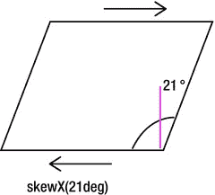

图 2-7。倾斜 CSS 的矩形元素

在相应方向上平移元素时，水平和垂直倾斜与适当值的组合可以提供元素形成一个盒子的一边的印象，如清单 2-8 所示。

***清单 2-8 。*** CSS 代码将一幅图像转换成一个等角长方体的一边

```html
img.tilt {
width: 300px; height: 300px; float: left;
-moz-transform: skewY(30deg); -o-transform: skewY(30deg);
-ms-transform: skewY(30deg);  -webkit-transform skewY(30deg);
transform: skewY(30deg);
}
```

将单独的变换组合在一起(例如，旋转和平移)可以为 CSS 提供更多的功能，并为动画提供更多的可能性。

组合变换

可以通过以下两种方式之一合并元素的转换:作为转换属性的空格分隔值，或作为矩阵属性的值。

要将转换合并为一个`transform`属性的空格分隔值，使用清单 2-9 中的代码。

***清单 2-9 。*** 单个 CSS 声明中的多次变换

```html
img.tilt { width: 300px; height: 300px; float: left;
-moz-transform: translate(50px, -4em) rotate(15deg);
-webkit-transform: translate(50px, -4em) rotate(15deg);
-o-transform: translate(50px, -4em) rotate(15deg);
-ms-transform: translate(50px, -4em) rotate(15deg);
transform: translate(50px, -4em) rotate(15deg); }
```

将转换合并为一个`matrix`属性的值的过程要复杂得多。矩阵变换稍微超出了本书的范围；使用工具生成代码是最简单的。Useragentman 矩阵构造集`(www.useragentman.com/matrix/)`和 CSS3 变换矩阵计算器`(www.leeourand.com/test/transform/test/transform.html)`提供了两种方法。矩阵变换的解释可以在 CSS Matrix Transform for The mathematical Challenged`(www.useragentman.com/blog/2011/01/07/css3-matrix-transform-for-the-mathematically-challenged/)`和 Opera Web Developer site `(http://dev.opera.com/articles/view/understanding-the-css-transforms-matrix).`找到，虽然它们的优点是更短和更有效，但是矩阵变换不是人类可读的，所以我不会在本书的例子中使用它们。

 **注意**编写单独的转换将*而不是*创建一个组合的转换。

```html
img.tilt { width: 300px; height: 300px; float: left;
transform: translate(50px, -4em);
transform: rotate(15deg);
-webkit-transform: translate(50px, -4em);
-webkit-transform: rotate(15deg); }
```

使用上面的 CSS，浏览器将遵循最后一行适用的代码；也就是说，图像将被旋转，但不会被平移。

CSS 过渡

CSS 转换就是:从一种视觉状态到另一种视觉状态的转换，通常是由一些用户事件引发的，比如鼠标悬停在一个元素上。换句话说，转换是点对点的。如果你需要在多个状态和另一个状态之间制作动画，你会发现 CSS 关键帧更适合这项工作。(CSS 关键帧将在第五章中讨论。)

注意，对于本章中的例子，我将使用`:hover`来启动转换，但是从技术上来说*对元素属性值的任何*修改都会触发该属性的转换。

让我们回到第一个例子，为页面上的图像创建一个简单的旋转过渡。当用户将鼠标放在图像上时，您希望将元素旋转 7.5 度。你可以通过在`.tilt`选择器中添加一个`:hover`伪类来做到这一点`(:hover`可以应用于每个元素，而不仅仅是链接)，如清单 2-10 所示。

***清单 2-10 。*上的** CSS 变换悬停，无过渡

```html
<style>
img.tilt:hover {
-moz-transform: rotate(7.5deg); -o-transform: rotate(7.5deg);
-ms-transform: rotate(7.5deg); -webkit-transform: rotate(7.5deg);
transform: rotate(7.5deg);
}
</style>
```

清单 2-10 中显示的代码可以工作，但是如果你试着在浏览器中查看页面，你会发现鼠标经过时没有动画，只有一个状态和另一个状态之间的瞬间切换。您将通过使用`transition`属性在这些状态之间创建一个动画(参见清单 2-11 )。

***清单 2-11 。*** 使用过渡平滑 CSS 变换

```html
img.tilt:hover {
-moz-transform: rotate(7.5deg); -o-transform: rotate(7.5deg);
-ms-transform: rotate(7.5deg); -webkit-transform: rotate(7.5deg);
transform: rotate(7.5deg);
-moz-transition: 2s all; -webkit-transition: 2s all;
-o-transition: 2s all; transition: 2s all;
}
```

在清单 2-11 中显示的代码要成功得多:当你将鼠标放在图像上时，你会看到它现在平滑地旋转到新的位置。用多个供应商前缀重复的语法也很容易理解。元素旋转超过两秒钟，在转换过程中它的所有属性都可以改变。注意，值的顺序无关紧要:您可以使用`2s all`或`all 2s`。

如果你在包含几分之一秒的时间段内制作元素动画，你可以将时间段指定为以秒为单位的浮点值，或者以毫秒(千分之一秒)为单位，如清单 2-12 所示。

***清单 2-12 。*** 一个以秒为单位的 CSS 转场

```html
img.tilt:hover {
-moz-transform: rotate(7.5deg); -o-transform: rotate(7.5deg);
-ms-transform: rotate(7.5deg); -webkit-transform: rotate(7.5deg);
transform: rotate(7.5deg);
-moz-transition: 2.35s all; -webkit-transition: 2.35s all;
-o-transition: 2.35s all; transition: 2.35s all;
}
```

这也可以用清单 2-13 中的来表示。

***清单 2-13 。*?? 一个以毫秒为单位的 CSS 转场**

```html
img.tilt:hover {
-moz-transform: rotate(7.5deg); -o-transform: rotate(7.5deg);
-ms-transform: rotate(7.5deg); -webkit-transform: rotate(7.5deg);
transform: rotate(7.5deg);
-moz-transition: 2350ms all;
-webkit-transition: 2350ms all; -o-transition: 2350ms all;
transition: 2350ms all;
}
```

虽然以毫秒为单位的动画计时允许更高的精度，但是上面的两个声明达到了相同的结果——使用毫秒并不能创建更平滑的动画序列。很少有动画需要精确到千分之一秒，以毫秒为单位指定时间通常需要更多的输入，所以我坚持使用更熟悉的秒格式(例如，即使值小于一秒:`transition: .35s all`)。你应该使用你觉得更舒服的系统。

 **注意**如果你已经用 JavaScript 制作了动画，注意这里的区别:CSS3 可以使用秒*或*毫秒的浮点值来计时动画。JavaScript 专门使用毫秒，尽管许多用于创建动画的 JavaScript 框架可以使用以秒为单位的时间间隔。

还有一点需要改进。您会注意到，旋转元素后，将鼠标从图像上移开会立即将它恢复到初始状态。虽然这可能是您在某些情况下为网页元素寻求的视觉效果，但在大多数情况下，最好是显示元素返回到其初始方向，就像它到达其旋转状态一样平滑。

解决方案有点违反直觉:将 CSS 代码的`transition`部分从`:hover`声明移到图像的*默认*状态，只保留`:hover`声明上的`transform`(参见清单 2-14 )。

***清单 2-14 。*** 创建与默认状态的平滑过渡

```html
<style>
img.tilt {
width: 300px; height: 300px; float: left;
-moz-transition: 2s all; -webkit-transition: 2s all;
-o-transition: 2s all; transition: 2s all;
}
img.tilt:hover {
-moz-transform: rotate(7.5deg); -o-transform: rotate(7.5deg);
-ms-transform: rotate(7.5deg); -webkit-transform: rotate(7.5deg);
transform: rotate(7.5deg);
}
</style>
```

想法很简单:将`transition`属性放在类声明中意味着任何从和*返回到*状态的*转换都是有效的。前面的例子将转换放在了`:hover`声明上，这意味着它只在鼠标悬停时有效，在返回正常状态时无效。*

您还会注意到，如果在图像区域来回移动鼠标，过渡会被打断；它的运动将平稳地逆转。您可以通过仅指定转换时间来进一步简化代码(参见清单 2-15 )。

***清单 2-15 。***CSS 变换中的定时旋转

```html
img.tilt {
width: 300px; height: 300px; float: left;
-moz-transition: 2s;
-webkit-transition: 2s; -o-transition: 2s;
transition: 2s; }
img.tilt:hover {
-moz-transform: rotate(7.5deg); -o-transform: rotate(7.5deg);
-ms-transform: rotate(7.5deg); -webkit-transform: rotate(7.5deg);
transform: rotate(7.5deg);
}
```

正如你所看到的，使用 CSS3 转场创建一个平滑简单的动画是很容易的。您可以修改 CSS 属性提供访问的元素外观的几乎每个方面并制作动画。到目前为止，我向您展示的转换一次只改变了元素的一个方面，并且总是以相同的方式进行。要创建更丰富的动画，您可以组合同一元素在不同时间和速度发生的多个属性转换。

延迟和组合过渡效果

转换事件可以通过添加一个`transition-delay`来延迟，或者作为一个单独的属性，或者附加到`transform`的值上:

```html
-moz-transition: 2s 4s;
-webkit-transition: 2s 4s; -o-transition: 2s 4s; transition: 2s 4s;
```

请注意，延迟在动画开始时以及元素反转到其起始点时生效。光标停留在图像上四秒钟后，动画才会开始；一旦完全旋转，该元素将停留在原位四秒钟，然后返回到其默认方向。(另请注意，直到鼠标在图像上停留至少*四秒钟*，动画才会开始)。

你可以通过将多个 CSS 属性添加到`:hover`状态来同时激活它们(见清单 2-16 )。

***清单 2-16 。*?? 几个 CSS 属性同时过渡**

```html
<style>
img.tilt {
width: 300px; height: 300px; float: left;
-moz-transition: 2s;
-ms-transition: 2s;
-o-transition: 2s;
-webkit-transition: 2s;
transition: 2s;
}
img.tilt:hover {
-moz-transform: rotate(15deg);
-o-transform: rotate(15deg); -ms-transform: rotate(15deg);
-webkit-transform: rotate(15deg); transform: rotate(15deg);
opacity: .3;
}
</style>
```

属性可以在动画中被赋予单独的时间，方法是将`transition-duration`声明为具有逗号分隔值的单独属性。假设你想在悬停时将图像向右移动，同时淡出，但是淡出时间是移动时间的一半(见清单 2-17 )。

***清单 2-17 。*** 多个属性的 CSS3 转换，每个属性有不同的计时

```html
<style>
img.tilt {
width: 300px; height: 300px; float: left; position: relative;
-moz-transition-property: opacity, left;
-o-transition-property: opacity, left;
-webkit-transition-property: opacity, left;
transition-property: opacity, left;
-moz-transition-duration: 2s, 4s;
-o-transition-duration: 2s, 4s;
-webkit-transition-duration: 2s, 4s;
transition-duration: 2s, 4s;
}
img.tilt:hover {
opacity: .2; left: 60px;
}
</style>
```

我添加了`position: relative`，以便能够通过改变其`left`的值来移动元素，并通过清楚地声明要动画的属性来提高动画的效率。(显然，你不必为所有浏览器都支持的属性加上前缀，比如`opacity`。)您会注意到，在某些浏览器中，从左到右的动画可能不是特别流畅。让我们将动画属性改为`translate`，如清单 2-18 所示。

***清单 2-18 。*** 一 CSS3 翻译过渡

```html
<style>
img.tilt {
width: 300px; height: 300px; float: left;
-moz-transition-property: opacity, translateX;-o-transition-property: opacity, translateX;
-webkit-transition-property: opacity, translateX;
transition-property: opacity, translateX;
-moz-transition-duration: 2s, 4s;
-o-transition-duration: 2s, 4s;
-webkit-transition-duration: 2s, 4s;
transition-duration: 2s, 4s;
}
img.tilt:hover {
opacity: .2;
-webkit-transform: translateX(60px);
-moz-transform: translateX(60px); -ms-transform: translateX(60px);
-o-transform: translateX(60px); transform: translateX(60px);
}
</style>
```

你可能会发现运动现在更顺畅了；对于通过操纵`absolute`或`relative`定位来动画化 HTML 元素的移动来说，`translate`是一个很好的选择。

介绍缓动功能

请仔细观察您到目前为止创建的动画中鼠标悬停时图像的移动:它有一些特殊之处(延长动画的时间值可能有助于使其更加清晰)。图像的运动不是机械的，而是有机的:从默认位置开始，图像随着旋转而加速，在一段时间内达到恒定速度，然后在静止之前减速。

在动画中，这种运动被称为*缓入/缓出*。它是日常世界中物体的运动。例如，没有一辆车，无论多么强大，可以达到 0-60 秒的速度记录。每一个运动的物体都加速到一定的速度；在其行程结束时(除了极端情况，如汽车以最高速度撞上砖墙)，物体将在停止前减速。

在 CSS3 动画中，*缓和*转场是默认的；没有必要声明你正在使用它们。如果你想让动画更有“机械”感，你可以从指定一个`linear`过渡开始(见清单 2-19 )。

***清单 2-19 。*** CSS 为线性旋转过渡

```html
<style>
img.tilt {
width: 300px; height: 300px; float: left;
-moz-transform: rotate(7.5deg); -o-transform: rotate(7.5deg);
-ms-transform: rotate(7.5deg); -webkit-transform: rotate(7.5deg);
transform: rotate(7.5deg);
-moz-transition: 2s transform linear;
webkit-transition: 2s transform linear; -o-transition: 2s transform linear;
transition: 2s transform linear;
}
</style>
```

你会发现鼠标悬停时图像的运动更加机械。

过渡定时功能和贝塞尔曲线

`linear`和`ease`只是被称为*计时函数* 的两种形式，即描述一个物体以直线从 A 到达 B 的方式。这些定时函数可以用一种称为贝塞尔曲线的数学表达式来表示。

例如，如果你绘制了一个元素在线性条件下从 0 度到 15 度的转换过程中的运动，将时间分配给水平轴，将图像的角度分配给垂直轴，则线性动画的图形将看起来像图 2-8 。随着时间的推移，旋转的角度随着时间的流逝而增加，从而产生了恒定的运动速度。

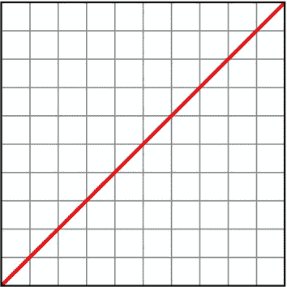

图 2-8。线性动画图形:x 轴为时间，y 轴为距离/角度。注意这种直接关系

从声明中删除关键字`linear`会使动画返回到自然的放松状态，当绘制在相同的轴上时，看起来更像图 2-9。

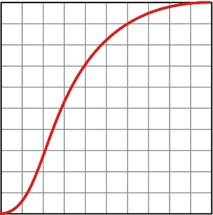

图 2-9。缓时功能:x 轴时间，y 轴距离

正如你所看到的，旋转的角度在放松的动画的第一瞬间变化很慢；在过渡的中间，变化率显著增加，达到一个“极限速度”，然后减速，直到序列到达其结尾。

有几个关键字可用作普通过渡运动的快捷方式(见表 2-2 )。

表 2-2。常用三次贝塞尔计时函数的关键字替代方法

| 关键字 | 图表 | 三次贝塞尔曲线 | 描述 |
| :-: | :-: | :-: | :-: |
| `linear` | 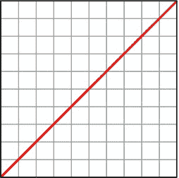 | `0, 0, 1, 1` | 瞬间启动和停止；在整个运动范围内速度恒定。 |
| `ease` |  | `0.25, 0.1, 0.25, 1` | 启动迅速，加速迅速；缓慢过渡到终点停止。 |
| `ease-in` | 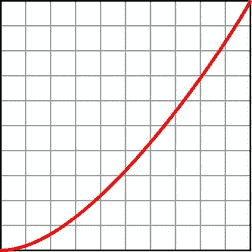 | `0.42, 0, 1, 1` | 缓慢启动，加速爬升至突然停止。 |
| `ease-out` | 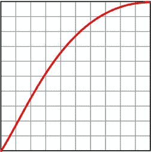 | `0, 0, 0.58, 1` | 动画瞬间开始，运动在接近尾声时变慢。 |
| `ease-in-out` | 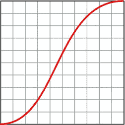 | `0.42, 0, 0.58, 1` | 在动画过程中元素被缓和地放入和放出:一个缓慢平滑的开始，在过渡中间短暂地达到一个恒定的速度，然后减速到停止。 |

正如您所看到的，所有缓动曲线都有一个三次贝塞尔表达式形式的数学等价物:一个数字对，其中每组浮点数字描述坐标空间中的一个点，形成一条创建缓和曲线的线。(注意，不能移动或定义曲线任一端的终止点)。

对于渐入渐出曲线，这些点看起来像图 2-10 。

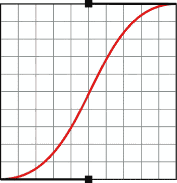

图 2-10。贝塞尔曲线渐出动画效果

用 CSS 表示，图 2-10 是这样的:

```html
transition-timing-function: cubic-bezier(0.42, 0, 0.58, 1);
```

理解三次贝塞尔函数允许你为你的 CSS 动画创建几乎无限多种自定义缓动曲线。甚至可以给这些点负值或大于 1 的值来创建极端的缓和曲线，这可以在图 2-11 中看到。

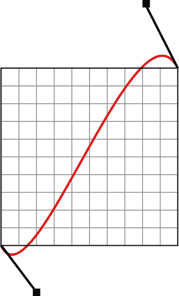

图 2-11。使用负值和大于 1 的值的贝塞尔曲线，创建“推拉”动画效果

在 CSS 中，图 2-11 是这样的:

```html
transition: all 2000ms cubic-bezier(0.280, -0.315, 0.685, 1.390);
```

使用这些值创建带有“弹簧”或“弹跳”的动画，也称为*推拉*动画。我将在第四章中探索这些动画的用途。

 **提示**停止`(http://matthewlein.com/ceaser/)`和三次`(http://cssglue.com/cubic)`是从图形操作的三次贝塞尔曲线生成 CSS 缓和代码的优秀工具。两者都包括一个测试服务，允许你看到变化的可视化结果。彼得·贝弗卢的资源`(http://peter.sh/experiments/css3-transition-timing-functions/)`也很有用，尤其是在可视化阶跃函数方面。

分步制作动画

也可以分步制作元素动画，而不是平滑过渡。(想象一下时钟上秒针的突然递增运动)。这些是通过`steps`函数和变量创建的。在这里，我将通过只显示标准属性、Firefox 和 Webkit 的 CSS3 代码来节省代码。

假设你有一个`h1`想要在鼠标悬停时制作动画(见清单 2-20 )。

***清单 2-20 。*中的**过渡序列为一个标题的步骤

```html
<style>
h1 {
 font-family: Futura; "Arial Black", Arial, sans-serif;
 text-align: center;
 }
h1:hover {
 -moz-transition: 4s all steps(3, end);
 -webkit-transition: 4s all steps(3, end);
 transition: 4s all steps(3, end);
 -moz-transform: translateX(400px);
 -webkit-transform: translateX(400px);
 transform: translateX(400px);
 }
</style>
```

清单 2-20 中的代码将在两秒钟的延迟后，在四秒钟内连续三次“跳跃”动画化所有的`h1`元素，每一步之间没有可见的运动。其他变化也是可能的，如表 2-3 所示。

表 2-3。CSS3 过渡的步长值

| 功能 | 图表 | 描述 |
| :-: | :-: | :-: |
| `steps(3)` | 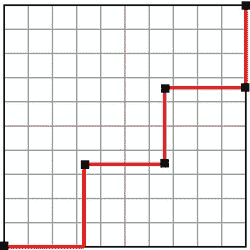 | x 步数的动画(图中显示了`steps(3)`)。开始时暂停。相当于`steps(x, end)`。 |
| `steps(3), end` | 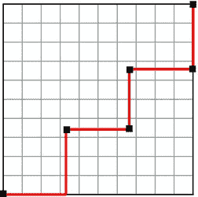 | 元素仍在开始处，在结尾处暂停。 |
| `steps(x), start` | 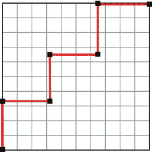 | 动画即时开始，元素在结束时暂停。 |

在 CSS3 过渡中增加对移动设备的支持

到目前为止，您只在`:hover`上激活了变换。这是最常见的伪类，但不是唯一的，你会在第三章中看到。

:`hover`可能会给安装在移动设备上的浏览器带来两个问题:

*   用户的指尖可能会模糊动画，尤其是在较小的屏幕上。
*   一些设备不支持`:hover`(严格来说，这是有意义的，因为当前所有的移动平台都依赖于直接触摸)。相反，它们涵盖了与`:focus.`的简单用户交互

如果您选择使用`:hover`，您应该通过使用一个分组选择器来覆盖只有`:focus`的移动平台的可能性，如下面的代码所示:

```html
img.tilt:hover, img.tilt:focus {
-moz-transform: rotate(7.5deg); -o-transform: rotate(7.5deg);
-ms-transform: rotate(7.5deg); -webkit-transform: rotate(7.5deg);
transform: rotate(7.5deg);
}
```

摘要

在本章中，你已经学习了 CSS3 变换 : `scale`、`rotate`、`skew`和`translate`的语法，包括如何翻转图像和组合变换。我还讲述了最简单的动画形式 CSS3 转场的代码，向您展示了如何创建转场，如何修改它们的定时和延迟，以及启动它们的两种常用方法。

虽然也可以使用`steps`功能和关键字快捷键，但过渡的移动和定时通常是通过贝塞尔曲线控制的。

在下一章，我们将探索如何将这些动画技术应用于图像元素。