# 三、图像的 CSS3 过渡

CSS3 转场在网页上最常见的用途是，首先，为用户界面(UI)元素生成视觉效果(将在下一章讨论)，其次，为图像创建简短的动画效果。在这一章中，你将使用转场模块的语法通过动画来增强图像及其标题。这些技术展示了在视觉上增强网页的简单方法，使图像内容和相关信息更具交互性，同时最小化屏幕“空间”:这是移动 web 开发时代的一个重要考虑因素。

简单图像交叉渐变效果

你将处理的第一个过渡将演示在后续练习中使用的许多基本概念:将大小完全相同的图像放置在彼此之上，并在`:hover`启动事件(参见图 3-1 )。

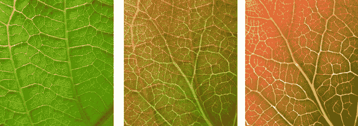

图 3-1。使用过渡不透明度的交叉淡入淡出效果

有几种可能的方法可以达到图 3-1 所示的效果:

*   *选项 1* :将第一张图片指定为容器元素的 CSS `background`，第二张图片在元素本身内部。
*   *选项 2* :创建一个带有`position: relative`的容器元素来保存两个图像，第二个图像带有`position: absolute`。
*   *选项 3* :将两幅图像都指定为背景，并在它们之间进行过渡。

这三种方法各有利弊。第一种和第三种方法可能创建速度更快，响应速度更快，但是不太容易使用。使用第一种方法还意味着对图像的任何更改都必须在不同的地方进行，因为一个图像将只存在于 CSS 中，而另一个图像将作为 HTML 元素存在。第二个选项可能需要更多的代码，但好处是将两张图片都保存为`元素，因此更容易访问。在撰写本文时，第三个选项在技术上超出了规范范围，但可能是最容易使用的。

我将使用由 Ton Rulkens `(www.flickr.com/photos/47108884@N07/4595559479/)`和 Peter Shanks `(www.flickr.com/photos/botheredbybees/1954163161/)`提供的照片来演示所有这三种方法，这些照片是经许可使用的。

两幅图像的大小必须完全相同。有几种方法可以实现这一点:

*   在 Adobe PhotoShop 等应用中将图像裁剪为相同的尺寸(这是最明显的解决方案)。
*   您可以通过 CSS 或 HTML 属性修改图像的`width`和`height`，尽管这通常会导致视觉失真。
*   您可以在`div`上设置一个`width`和`height`，并使用`overflow:hidden`来修剪图像中落在该区域之外的部分。
*   如果两个图像都被表示为代码中的元素，那么可以对每个图像使用相同的 CSS `clip`值。

选项 1:第一张图片作为 CSS 背景

这个选项的 HTML 非常简单，如清单 3-1 所示。

***清单 3-1。*** HTML 选项 1 创建两个分层图像

```html
<div class=crossfade>
        
</div>
```

 **注意**本书中展示的 HTML5 代码样本是“缩小的”语法，以节省空间。元素仅在需要时闭合，属性值仅在包含空格时加引号。

清单 3-2 中显示的 CSS 也非常简单。

***清单 3-2。*** CSS 为 HTML 选项 1 创建交叉渐变效果

```html
div.crossfade { background: url(leaf-veins.jpg); background-size: cover; }
div.crossfade, div.crossfade img  { width: 418px; height: 500px;  }
div.crossfade img { transition: 3s opacity ease-out; }
div.crossfade img:hover { opacity: 0; }
```

选项 2:两个图像都作为 HTML 元素

或者，您可以将两个图像作为单独的图片堆叠在一个容器中；HTML 如清单 3-3 中的所示。

***清单 3-3。*** HTML 选项 2 创建分层图片

```html
<div class=crossfade>
        
        
</div>
```

与其通过将一个类附加到第二个图像来使 HTML 变得复杂，不如使用第 n 个子伪选择器来改变它，如清单 3-4 所示。

***清单 3-4。*** CSS 为 HTML 选项 2 创建交叉渐变效果

```html
div.crossfade { position: relative; }
div.crossfade, div.crossfade img { width: 418px; height: 500px; }
div.crossfade img:nth-child(2) { position:absolute; left:0; top:0; transition: 3s opacity ease-out; }
div.crossfade img:nth-child(2):hover { opacity: 0; }
```

选项 3:两幅图像都作为背景

虽然最容易编码，但这个选项也是最大胆的:它超出了当前的规范(而且，在撰写本文时，仅在 Chrome 中受支持)。在这种情况下，包含的 *div* 完全没有内容，一切都是通过 CSS 实现的，如清单 3-5 所示。

***清单 3-5。*** CSS 创建图像交叉淡入淡出效果(选项 3)

```html
div.crossfade { width: 418px; height: 500px; transition: 3s background-image ease-out;
background-image: url(leaf-veins.jpg); }
div.crossfade:hover { background-image: url(jatropha.jpg);  }
```

如果你愿意进一步推进你的代码，另一种方法是对 CSS4 `cross-fade`属性使用相同的空`div`，如清单 3-6 所示。

***清单 3-6。***【CSS4】交叉淡入淡出用于创建图像过渡

```html
div.crossfade { width: 418px; height: 500px;
background-image: -webkit-cross-fade(url(jatropha.jpg), url(leaf-veins.jpg),0);
transition: 2s background-image linear; }
div.crossfade:hover { background-image: -webkit-cross-fade(url(jatropha.jpg), url(leaf-veins.jpg),100); }
```

顾名思义，`cross-fade`是一种更有效的方法，但目前实际应用有限；`cross-fade`不是通过过渡`opacity`来伪造溶解效果，而是用适当的算法来处理图像。

CSS4？你在说什么，威利斯？

随着 CSS3 在浏览器中成为主流，W3C 的注意力已经转移到 CSS 开发的下一个阶段，其中包括新的选择器以及图像和渐变的外观规则。浏览器支持(在撰写本文时)是有限的和试验性的，但正在增长。

与本节最相关的是 CSS4 图像值和替换的内容模块，您可以在`http://dev.w3.org/csswg/css4-img/`阅读其概述。还有一个用于背景和边框`(http://dev.w3.org/csswg/css4-background/)`以及文本`(http://dev.w3.org/csswg/css4-text/)`的模块。

几乎不可避免的是，在不久的将来,“CSS4”这个术语将会像今天的“CSS3”一样被广泛误解和误用，正如我在第一章中所讨论的。

用 CSS3 增强的简单图库

对于第二个例子，您将使用 HTML 创建一个图像缩略图图库，并使用 CSS3 过渡增强图库中大图像的显示(参见图 3-2 )。

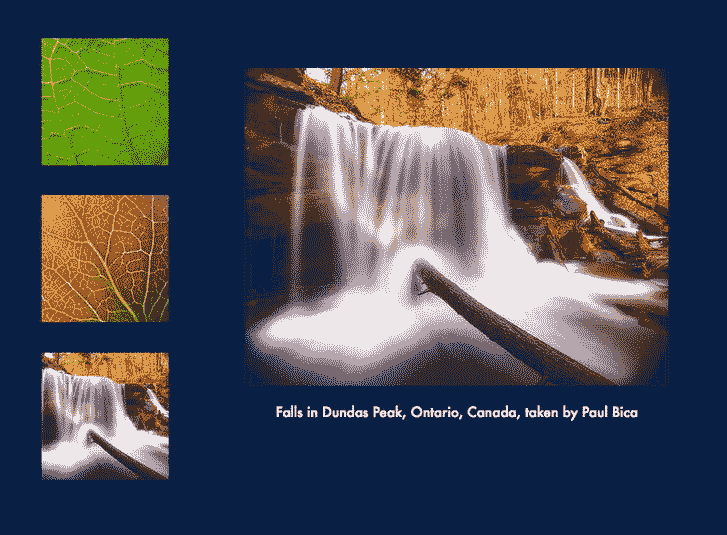

图 3-2。一个简单的图库

你至少需要三对图像。每一对将由一个缩略图和一个相同图像的全尺寸版本组成。大版可以是你希望的任何尺寸，只要合理；我建议缩略图的大小大约为 150 x 150 像素。为了保持文件组织的清晰，请遵循命名约定。例如，如果全尺寸图像是`x,jpg`，则将成对的缩略图命名为`x_thumb.jpg`，两者都存储在 images 文件夹中。

HTML 标记

你的目标是尽可能保持图库中使用的 HTML 简洁明了。为此，您将使用定义列表作为标记的基础。定义列表包含成对的元素:一个(定义术语)用于您的缩略图，另一个(定义声明)用于它匹配的大图像。

在相对于文件夹的标记中组装内容，页面的 HTML 看起来类似于清单 3-7 (使用前一个练习中的图片，以及 Paul Bica 的另一张照片`(www.flickr.com/photos/dexxus/4137841698/)`。

***清单 3-7 。*** HTML5 为一个简单的图库

```html
<!DOCTYPE html>
<html lang=en>
<head>
<meta charset=utf-8>
<title> CSS3 Gallery</title>
<style>
        body { background: #234; }
</style>
</head>
<body> 
  <dl id=gallery>
        <dt>
        <dd>
        <dt>
        <dd>
        <dt>
        <dd>
</dl> 
</body>
</html>
```

初始 CSS

这里使用的 CSS 应该是不言自明的:你正在定位定义列表`relative`,这样大的、绝对定位的图像是相对于列表而不是文档的主体来组织的。绝对定位大图像也意味着您可以将它们堆叠在完全相同的位置，并且文档的其余部分(包括缩略图)将表现得好像全尺寸图像根本不在那里一样。最后，用`visibility: hidden`隐藏大图。，并通过在带有相邻组合子的`dt`元素上使用`:hover`选择器再次显示它们，如清单 3-8 所示。

***清单 3-8。*** CSS 用于一个简单的图库

```html
dl#gallery { position: relative; }
dl#gallery dt img { width: 150px; height: 150px; margin: 2.2em; }
dl#gallery dd { position: absolute; left: 200px; top: 2.2em; visibility: hidden; }
dl#gallery dt:hover + dd { visibility: visible; }
```

将鼠标移动到缩略图图像上，会立即显示定义列表中与之配对的大图像。但是，在将动画引入画廊之前，您需要解决一个 UI 问题。

改善画廊

到目前为止，您所做的工作是有效的，但是有点笨拙:您会注意到，将鼠标放在缩略图图像的右侧会使相关的大图像立即出现。您将通过几行 CSS 来解决这两个问题，从用`visibility`(不能动画)隐藏大图像改为用`opacity`(可以)，同时与缩略图共享定义术语的大小，如清单 3-9 所示。

***清单 3-9。*** 用转场增强图库的 CSS

```html
dl#gallery dd { position: absolute; left: 200px; top: 2.2em; opacity: 0;
transition: .85s opacity linear; }
dl#gallery dt:hover + dd { opacity: 1; }
```

现在，当你将鼠标移动到缩略图上时，大图会平滑地淡入。

添加字幕

如果用户能够阅读图片说明，这将非常有帮助。在这种情况下，不需要添加任何额外的标签，只需要标题内容和 CSS。我将修改其中一个`<dt` `><dd` >对作为例子，如清单 3-10 所示。

***清单 3-10。*** 简单标题图片的 HTML 示例

```html
<dt>
<dd> A closeup photograph of a Jatropha Hybrid
```

你的 CSS 也必须做出相应的改变(见清单 3-11 )。

***清单 3-11。*** CSS 为简单的带标题的图片

```html
dl#gallery dd { position: absolute; left: 200px; top: 2.2em; opacity: 0;
text-align: center; font-family: Futura, Arial, sans-serif; color: white;
transition: .85s opacity linear; }
dl#gallery dd img { display: block; margin: auto; padding-bottom: 1.2em; }
```

在这种情况下，你的说明会随着图片淡入。将标题与图像分开制作动画也很常见，这将在下一个练习中进行。

改变启动事件

虽然`:hover`用于启动图库中的大图像的淡入，但对于用户来说，*点击*缩略图似乎更自然。这里，您遇到了一个问题:在 CSS 中没有与 JavaScript `onclick`事件处理程序直接对等的东西。然而，在这种情况下有几个选择。

:活动

虽然它与链接紧密相关，但也可以使用`:active`伪类来启动转换，如清单 3-12 所示。

***清单 3-12。*** CSS 对鼠标按下产生效果

```html
dl#gallery dt:active + dd { opacity: 1; }
```

您将立即看到这种方法的主要缺点:只有在缩略图上按住鼠标按钮时，大图像才会出现。

:目标

在这种情况下，使用:`target`可能是最有效的伪选择器，尽管它确实需要在标记中添加一些内容。`:target`源自使用传统的`id`值的“锚”,检测链接到这些 id 的元素的点击。

您的 HTML 更改为清单 3-13 中显示的内容。

***清单 3-13。*** HTML 为一个图库配:target

```html
<dl id=gallery>
<dt><a href=#jatropha></a>
<dd id=jatropha> 
A closeup photograph of a Jatropha Hybrid leaf
<dt><a href=#veins></a>
<dd id=veins> 
Closeup photgraph of leaf veins
<dt><a href=#cascada></a>
<dd id=cascada> 
Falls in Dundas Peak, Ontario, Canada
</dl>
```

在正常情况下，一个锚的链接会迫使页面滚动到`id`的位置，并有一个视觉跳转；这种情况下可以避免，因为`dd`元素绝对位于页面顶部附近。

只有一行 CSS 需要修改。您的`:hover`声明如清单 3-14 中的所示。

***清单 3-14。*** 一个图库用 CSS:target

```html
dd#jatropha:target, dd#veins:target, dd#cascada:target { opacity: 1; }
```

这种方法还具有修改 URL 的优点，这意味着通过使用带有附加 id 的链接，用户可以被引导到特定的图像。例如，`www.yourdomain.com/gallery.html#cascada`会自动调出图库中的最后一幅图像。

简单的弹出图像标题

也可以在鼠标悬停时显示图像的标题，可以在图库中显示，也可以作为用户界面的一部分。理想的标记要么是一个定义列表，如前一个例子，要么是一个`<figure` >和`<figcaption>`，这是你将在下一个例子中使用的元素，如图 3-3 和清单 3-15 所示。(我用的是布拉德利·戴维斯`(www.flickr.com/photos/backpackphotography/244716694/)`和沃尔夫冈·斯陶特`(www.flickr.com/photos/wolfgangstaudt/)`的照片。如果您决定使用自己的图像，请确保它们的大小相似。)

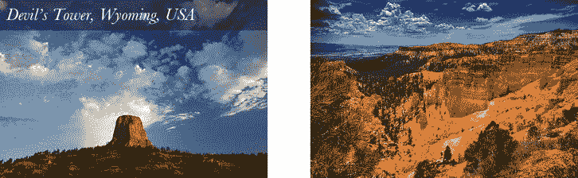

图 3-3。动画图像字幕

在这种情况下，标题是图像的描述，但这种技术也可以用于网站的图形导航(见第四章)。

***清单 3-15*** 。HTML5 图形和图形标题代码

```html
<figure>
        
        <figcaption> Devil's Tower, Wyoming, USA</figcaption>
</figure>
<figure style=left:550px>
        
        <figcaption> Bryce National Park, Utah, USA</figcaption>
</figure>
```

您将在 CSS 中做一些事情。首先，图像和它们周围的`figure`元素应该设置为相同的大小，并且并排浮动。您还将在用更多 CSS 隐藏标题之前对其进行样式化。

**雷姆:不是乐队**

传统上，网页上的字体是以像素、百分比或 ems 来确定大小的。后两种方法通常是首选方法，因为它们具有内在的可伸缩性。由于`1em`实际上是`M`字符的宽度，将段落文本放大 20%就像声明`p`选择器的`font-size`是`1.2em`一样简单。使用`em`还可以随着字体大小的增加和减小，方便地按比例调整元素之间的间距。例如，您可以通过以`em`为单位测量图像的边距来设置图像及其周围文本之间的装订线，从而在正文和插图之间创建一种视觉关系。

在网页中使用`em`作为度量系统的一个问题是它很复杂，因为单位总是相对于父元素的字体大小来设置*。将`li`元素的大小设置为`1.2em`是没问题的，直到你在其中嵌套了一个列表:内部 l `i`的内容将以`1.4em`的大小呈现。*

`rem` (for *root em* )通过相对于根元素(即`html`元素)测量自身来解决这个问题。这意味着你可以在`html`选择器上声明一个单一的字体大小，并相对于它缩放一切，如清单 3-16 所示。

***清单 3-16。*** 为文档调整 rem 字体大小

```html
html { font-size: 62.5% }
body { font-size: 1.4rem; }
h1 { font-size: 2.4rem; }
```

这也很好地转换为像素:在上面的样式表中，页面上的正文文本大小相当于 14px，而`h1`元素呈现为 24 像素。

浏览器对 rem 的支持出奇的好:最近所有支持 CSS 转换的浏览器(Safari 5+，Chrome，Firefox 3.6+，IE9+，Opera 11.6+)也都支持`rem`单元)。

现在让我们来看看图表和标题的基本 CSS(见清单 3-17 )。

***清单 3-17。*** 基本 CSS 为一个图和标题

```html
figure { float: left; }
figure, figure img { width: 500px; height: 333px; }

figcaption {
font-family: Baskerville, "Baskerville Old Face", Garamond, "Times New Roman", serif;
font-style: italic; background: rgba(0,0,0,0.4);
font-size: 2rem; padding: 0.8rem; color: #fff;
}
```

在这个阶段，页面看起来将类似于图 3-4 。

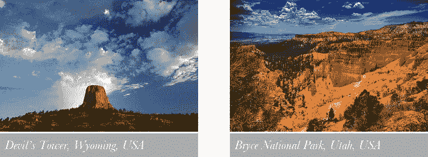

图 3-4。隐藏前带有定位字幕的图像

现在它们已经被样式化了，您将通过在 figure 元素上使用`overflow: hidden`来隐藏标题。同时，你需要定位标题。对于本例中的图像，从顶部向下放置标题可能看起来最好。有几种可能的方法来定位字幕。我将使用`relative`定位和一个稍微大于图片高度加上标题高度的`bottom`值(见清单 3-18 )。

 **提示**在添加转场之前检查元素的重定位是否有效是个好主意。

***清单 3-18。*** CSS 隐藏并定位标题

```html
figure { float: left; }
figure, figure img { width: 500px; height: 333px; overflow: hidden; }
figcaption {
font-family: Baskerville, Garamond, "Times New Roman", serif;
font-style: italic; background: rgba(0,0,0,0.4); font-size: 2rem;
padding: 0.8rem; color: #fff;  position: relative;  bottom: 400px;
}
figure:hover figcaption { bottom: 340px; }
```

最后，你将添加标题的过渡，如清单 3-19 所示。

***清单 3-19。*** CSS 到转场一个字幕

```html
figcaption {
font-family: Baskerville, Garamond, "Times New Roman", serif;
font-style: italic; background: rgba(0,0,0,0.4);
font-size: 2rem; padding: 0.8rem; color: #fff;
position: relative;  bottom: 400px;
transition: 2s all; }
```

 **注意**我已经通过使用描述性文件名和 alt 属性值来保持我们的图像的可访问性。这是非常重要的:永远记住，不是每个人都能够看到你的设计或与之互动。

图像牌叠和扇形显示

随着网页变得越来越复杂，它们变得越来越难以概括和说明。如果你创建了一个大的图库页面，很难只选择一张图片来激发访问者的兴趣。一个可能的解决方案是使用几个图像，显示在一个关键帧*滑块*画廊(如第五章所示)或一个交互式显示器中。在这种情况下，我会将几张照片明显地堆叠在一起，在鼠标悬停时显示它们，以产生更大的兴趣和对链接内容的理解(参见图 3-5 )。

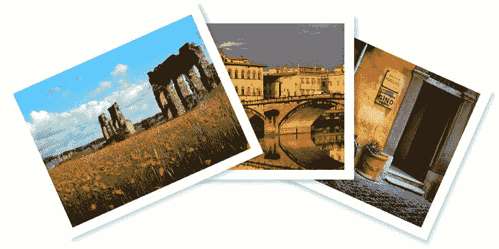

图 3-5。一种动画卡牌粉丝效果

同样，您将使用相同大小的图像来产生最佳效果，如清单 3-20 所示。

***清单 3-20*** 。动画图像的 HTML】卡扇效果

```html
<div id=cardfan>
        
        
        
</div>
```

您已经将图像包装在一个容器元素中，使它们更容易通过 CSS 引用和控制。`div`和它包含的图像大小相同。当样式化和堆叠里面的图像时，你也将使容器居中对齐页面(见清单 3-21 )。

***清单 3-21 。*** 基本 CSS 为一卡一扇效果

```html
#cardfan, #cardfan img { width: 640px; height: 480px; }
#cardfan { margin: 0 auto; }
#cardfan img { border: 32px solid #ffe;
box-shadow: 12px 12px 10px rgba(0, 0, 0, 0.2);
position: absolute; }
```

您希望当用户将鼠标悬停在图像上时，图像呈扇形展开；你可以通过使用`:first-child`和`:last-child`伪类将堆栈中的*第一个*和*最后一个*图像旋转 12 度来实现，如清单 3-22 所示。

***清单 3-22 。*** 卡片叠中第一张和最后一张图片的旋转效果

```html
#cardfan:hover img:first-child {
    transform: rotate(12deg);
}
#cardfan:hover img:last-child {
    transform: rotate(−12deg);
}
```

清单 3-22 中的代码将产生如图图 3-6 所示的图像。

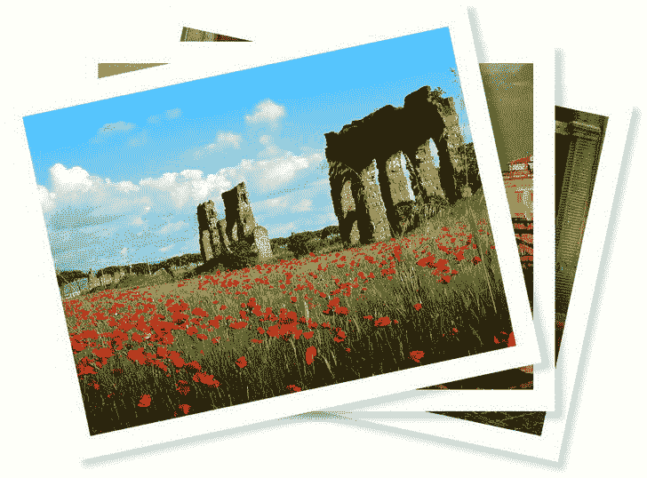

图 3-6。使用 CSS 变换围绕各自中心旋转的堆叠图像

如你所见，图像围绕其中心旋转。在这种情况下，您希望图像稍微成扇形，因此您需要将变换轴*移动到图像的*下方(参见清单 3-23 )。

***清单 3-23 。*偏移图像的变换原点**

```html
#cardfan img { border: 32px solid #ffe;
    box-shadow: 12px 12px 10px rgba(0, 0, 0, 0.2);
    position: absolute;
    transform-origin: center 600px;
}
```

清单 3-23 中的代码将产生如图图 3-7 所示的输出。

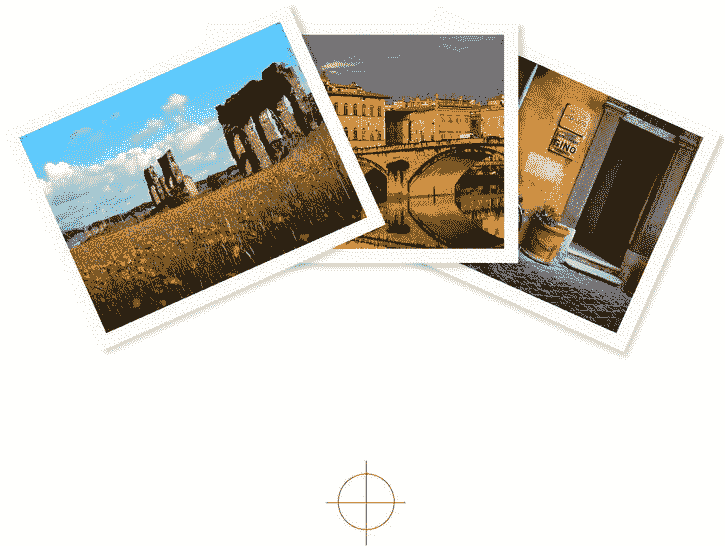

图 3-7。围绕偏移原点旋转的堆叠图像，用十字光标高亮显示

现在你可以真正地将卡片展开，同时应用一个过渡，如清单 3-24 所示。(请注意，我已经更改了一些值来增加风扇效果。)

***清单 3-24 。*** 全 CSS 为动画卡粉丝图库

```html
#cardfan, #cardfan img { width: 640px; height: 480px;
transition: .6s transform ease-out;
}
#cardfan { margin: 0 auto; }
#cardfan img { border: 32px solid #ffe;
box-shadow: 12px 12px 10px rgba(0, 0, 0, 0.2);
position: absolute;
transform-origin: center 1200px;
}
div#cardfan:hover img:first-child {
    transform: rotate(24deg);
}
div#cardfan:hover img:last-child {
    transform: rotate(−24deg);
}
```

你也可以将图片链接到一个图库页面，如清单 3-25 所示。

***清单 3-25 。*** 一联卡粉丝图库

```html
<div id=cardfan>
 <a href=gallery.html>
 	
 	
 	
 </a>
</div>
```

如果您想旋转第一个*和第二个*图像，并保持顶部的照片不变，请更改以下选择器:

```html
div#cardfan:hover img:last-child
```

到

```html
div#cardfan:hover img:nth-child(2n)
```

你也可以稍微旋转图像的默认位置，让用户对将要发生的事情有所了解，如清单 3-26 所示。

***清单 3-26 。*** 一个视觉上有暗示的卡迷图库

```html
#cardfan img:first-child {
    transform: rotate(6deg);
}
#cardfan img:nth-child(2n) {
    transform: rotate(−6deg);
}
```

你也可以将照片单独链接到本章开头的图库示例(见清单 3-27 )。

***清单 3-27 。***

```html
<div id=cardfan>
<a href="gallery.html#bike">
    
</a>
<a href="gallery.html#florence">
    
</a>
<a href="gallery.html#aqueduct">
    
</a>
</div>
```

但是，如果您单独链接图像，您将需要更改您的 CSS，因为您的标记的组织已经发生了变化。你将通过它们的`src`属性的值来引用图像，而不是将它们作为子对象来引用(参见清单 3-28 )。

***清单 3-28 。*** 一个卡片爱好者图库，图片被其 src 属性引用

```html
#cardfan img[src="bike.jpg"] {
    transform: rotate(6deg);
}
#cardfan img[src="roma.jpg"] {
    transform: rotate(−6deg);
}
#cardfan:hover img[src="bike.jpg"] {
    transform: rotate(24deg);
}
#cardfan:hover img[src="roma.jpg"] {
    transform: rotate(−24deg);
}
```

注意清单 3-26 中的技术没有为你的图像创建和引用 id 值灵活:如果你因为任何原因改变了文件名，你将不得不相应地改变你的 CSS。

你也可以在鼠标悬停时将单个图像提升到前景(见清单 3-29 )。

***清单 3-29 。*** 一个卡迷图库的图像提升到前台

```html
img[src="bike.jpg"]:hover, img[src="florence.jpg"]:hover { z-index: 2; }
```

通过使用`::before`和`::after`伪元素选择器来生成其他图像，您可以编写更少的标记(但稍微多一点 CSS)。(请注意，您不能在`标签上使用生成的内容，因为它们是替换元素的一种形式)。同样重要的是要注意，这种方法实际上扼杀了可访问性，因为大多数屏幕阅读器目前不访问生成的内容，JavaScript 也不能访问它。这里显示的技术是一种有趣的可能性，而不是作为一种网站中心内容的生产方法。

 **注意** *替换的*元素是 HTML 元素，有固有的宽度和高度，没有 CSS 的好处；也就是说，任何产生占位符的标记，其内容随后被外部资源替换。例如，当您使用`<input type` `=text>`时，文本框会以适合单行文本输入的大小出现。这并不意味着你不能应用 CSS 来调整它的大小，只是默认情况下浏览器*用预定大小的元素替换了`<input>`标签的*实例。``也是如此；如果没有 CSS，图像会以其自然的宽度和高度加载到页面上。

```html
<br>, , <video>, <iframe>, and <object>are all replaced elements, as are <input>, <button>, and <textrarea>.
```

最重要的是，在这个练习的上下文中，作为一般规则，*生成的内容不能应用于替换的元素。*也就是说，你不能在``或者上面列出的其他标签上使用`::before`或者`::after`。此外，不能转换内联元素，除非它们也是被替换的元素。

走这条路，你的 HTML 和 CSS 代码简化成你在清单 3-30 中看到的样子。

***清单 3-30 。*** HTML 和 CSS 代码为一张卡片生成粉丝效果图

```html
<div id=cardfan>
        
</div>
#cardfan { position: relative; margin: 0 auto; }
#cardfan, #cardfan img, #cardfan img:before, #cardfan img:after {
    width: 640px; height: 480px;
}
#cardfan img, #cardfan:before, #cardfan:after {
    border: 32px solid #ffe;
    box-shadow: 12px 12px 10px rgba(0, 0, 0, 0.2);
    position: absolute;
    transform-origin: center 1200px;
}
div#cardfan::before { content: url(bike.jpg); }
#cardfan::after { content: url(roma.jpg); }
#cardfan::before, div#cardfan:after { position: absolute; left: 0; top: 0; }
#cardfan::before { transform: rotate(6deg); }
#cardfan::after { transform: rotate(−6deg);  }
```

清单 3-30 中的代码创造了同样的卡迷效果，可以说具有更强的适应性；要更改中心图像两侧的照片，只需修改 CSS，而无需修改标记。如前所述，这种方法也有明显的缺点。

你可以通过链接伪选择器来制作这些图像的动画，如清单 3-31 所示。

***清单 3-31 。*** CSS 代码动画生成内容

```html
div#cardfan:hover::before {
    transform: rotate(24deg);
}
div#cardfan:hover::after {
    transform: rotate(−24deg);
}
```

 **注**为什么`::before`和`::after`中的双冒号？CSS2 和 CSS2 之间对现有选择器的少数正式更改之一是 W3C 在生成的内容选择器中添加了另一个冒号，以便区分它们的不同性质。现代浏览器将会识别并支持`::`或`:`前置到生成的内容选择器。在本书中，我使用了新的正式版本；为了更好地向后兼容旧的浏览器，您可能希望只使用一个冒号。

具有不同进入和退出效果的快板图像字幕

虽然从顶部或底部引入图像标题适用于短文本，但当涉及大量文本时，过渡会有点大且笨拙。如果标题文本很长，最好在悬停时“摆动”它。

你将使用与之前相同的方法:一张已知尺寸的图像(由美国宇航局提供)，使用`overflow: hidden`隐藏标题，直到你在悬停时显示它(见图 3-8 )。

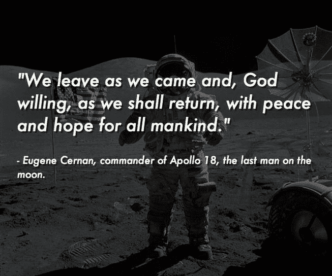

图 3-8。快板字幕动画

图 3-8 所示的快板标题的 HTML 和 CSS 如清单 3-32 所示。

***清单 3-32 。*** 代码创建一个快板标题

```html
<figure class=clapperboard> 
  
<figcaption>
<q>We leave as we came and, God willing, as we shall return, with peace and hope...</q> 
– Eugene Cernan, commander of Apollo 18, the last man on the moon.
</figcaption>
</figure>
figure.clapperboard { position: relative; }
figure.clapperboard figcaption { position: absolute; top: 0; left: 0; padding: 2rem; }
figure.clapperboard, figure.clapperboard figcaption { width:618px;height:515px; }
figure.clapperboard figcaption q { font-size: 2rem; display: block; margin-bottom: 2rem; }
```

你还没有隐藏标题，这使得它更容易定位:你需要将`figcaption`元素旋转 90 度，使其右下角与图像的角相匹配(见图 3-9 )。

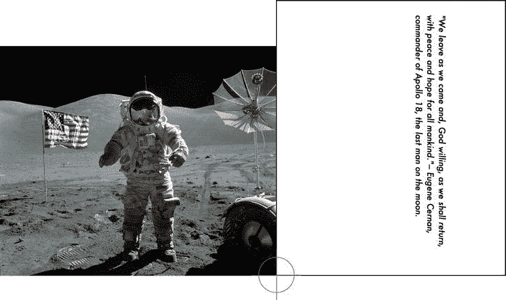

图 3-9。图和旋转的标题，突出显示重新定位的变换原点

在图 3-9 中定位标题的代码可以在清单 3-33 中看到。(注意，我使用了 CSS3 `box-sizing`属性来确保添加填充后`figcaption`保持正确的宽度和高度。)

***清单 3-33 。*** CSS 代码来定位一个快板标题

```html
figure.clapperboard figcaption { font-family: Futura, Arial, sans-serif;
font-weight: 100; font-style: italic; color: black;
box-sizing: border-box;
font-size: 1.2rem; padding: 2rem; padding-top: 8rem;
border: 2px solid black;
transform-origin: bottom right; transform: rotate(90deg);
}
```

现在标题在正确的位置，你可以关闭`border`，设置`overflow`为`hidden`，并反转颜色(见清单 3-34 )。

***清单 3-34 。*的** CSS 代码来定位一个拍板的*标题*

```html
figure.clapperboard, figure.clapperboard figcaption {
    width:618px;height:515px;
    overflow: hidden;
}
figure.clapperboard figcaption {
    font-family: Futura, Arial, sans-serif;
    font-weight: 100; font-style: italic; color: white;
    font-size: 1.2rem; padding: 2rem; padding-top: 8rem;
    box-sizing: border-box;
    background: rgba(0,0,0,0);
    transform-origin: bottom right;
    transform: rotate(90deg);
}
figure.clapperboard:hover figcaption {
    transform: rotate(0);
}
```

要使这成为一个动画过渡，请将以下内容添加到`figure.clapperboard figcaption`声明中:`transition: transform 2s cubic-bezier(.12,.49,.17,.87);.`

(注意，通过使用适当的属性，您将转换限制为仅仅跟踪转换:这不仅更有效，而且当您在六个月后再次使用它时，更容易跟踪代码。。。同时避免仅仅因为在字幕的默认状态和旋转状态之间改变了某些东西而出现意外的转换)。

虽然这种方法可行，但仍然存在一些问题。例如，在宇航服和月亮的背景下，文本确实不够清晰，所以你会想给`figcaption`添加一些`text-shadow`和`background`。

***清单 3-35。*** 改进了快板字幕过渡的代码

```html
figure.clapperboard figcaption {
    font-family: Futura, Arial, sans-serif;
    font-weight: 100; font-style: italic; color: white;
    font-size: 1.2rem; padding: 2rem; padding-top: 8rem;
    box-sizing: border-box;
    background: rgba(0,0,0,0.6);
    text-shadow: 3px 3px 1px rgba(0,0,0,0.6);
    transform-origin: bottom right;
    transform: rotate(90deg);
    transition: transform 2s cubic-bezier(.12,.49,.17,.87);
}
```

这对于文本的易读性来说是一个显著的改进，但是背景边缘下降的方式看起来仍然有点奇怪。有几个可能的解决方案:一个是使`figcaption`更宽，把文本推到右边，把`figcaption`本身推到左边，这样盒子看起来更像一个视觉“切片”效果(清单 3-36 )。

***清单 3-36 。*** 改进了快板字幕过渡的代码

```html
figure.clapperboard figcaption {
    width: 1236px; height:515px;
    font-family: Futura, Arial, sans-serif;
    font-weight: 100; font-style: italic; color: white;
    font-size: 1.2rem; padding:
    padding: 8rem 2 rem 0 660px;
    box-sizing: border-box;
    background: rgba(0,0,0,0.6);
    text-shadow: 3px 3px 1px rgba(0,0,0,0.6);
    transform-origin: bottom right;
    transform: rotate(90deg);
    left: -618px;
    transition: transform 2s cubic-bezier(.12,.49,.17,.87);
}
```

在这种情况下，我将`figcaption`的宽度增加了一倍，并从左侧填充内容，使其覆盖图像的相同部分。通过改变`figcaption`框的位置和元素变换原点的位置，你会发现创建许多不同种类的效果是可能的。

创建单独的过渡序列

创建字幕过渡的另一种方法是在文本旋转到位后，淡入字幕背景*。这需要设置两个独立属性的动画，并延迟其中一个属性，直到第一个属性完成。默认情况下将`figcaption`的`background`设置为完全透明可以启动这个过程，然后用逗号分隔过渡效果，并为一组值添加延迟。参见图 3-10 中的示例。*

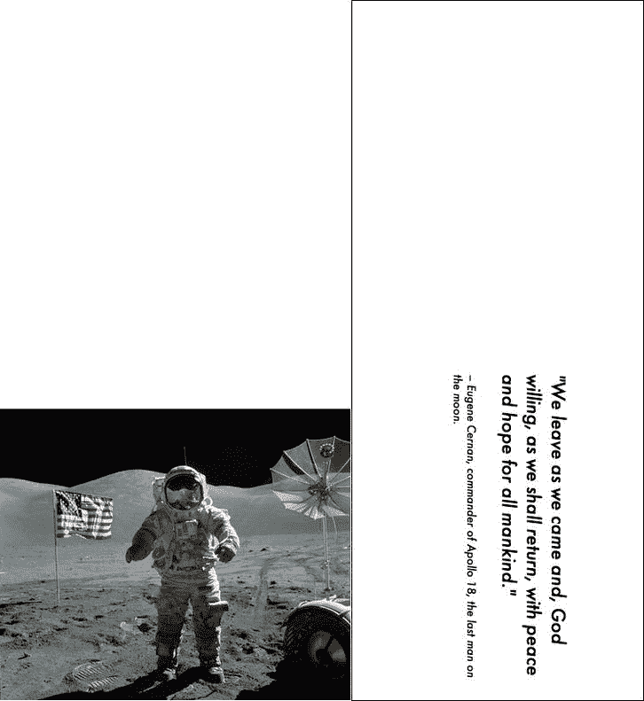

图 3-10。扩展 figcaption，获得更好的隔板字幕过渡效果。(溢出:为了便于说明，隐藏被关闭，颜色被反转，并且添加了边框。)

清单 3-37 展示了完整的 CSS 代码。

***清单 3-37 。*** 用于快板标题的 CSS 代码

```html
figure.clapperboard { position: relative; overflow: hidden; }
figure.clapperboard figcaption { position: absolute; top: 0; left: 0; padding: 2rem; }
figure.clapperboard, figure.clapperboard figcaption { width:618px;height:515px; }
figure.clapperboard figcaption {
    font-family: Futura, Arial, sans-serif; font-weight: 100; font-style: italic;
    color: white;  font-size: 1.2rem; padding: 2rem; padding-top: 8rem;
    box-sizing: border-box; background: rgba(0,0,0,0);
    text-shadow: 3px 3px 1px rgba(0,0,0,0.6);
    transform-origin: bottom right; transform: rotate(90deg);
}
figure.clapperboard:hover figcaption {
    transform: rotate(0);
    opacity: 1;
    background: rgba(0,0,0,0.6);
    transition: transform 2s cubic-bezier(.12,.49,.17,.87), background .9s linear 2.2s;
}
figure.clapperboard figcaption q { font-size: 2rem; display: block; margin-bottom: 2rem; }
```

你会注意到，在文本旋转到位后，背景会在 200 毫秒内消失。剩下的一个问题是，当用户将鼠标从图像上移开时，标题会立即消失，这导致了我在《??》第二章中引入转场时遇到的同样问题。将`figcaption`的转换代码移动到默认状态将意味着转换将在 mouseout 上反转，这看起来也有点奇怪。理想情况下，你想要的是让`figcaption`以不同于它出现时的方式消失。

改变退出事件

为了达到这个效果，你将制作三个属性的动画:`opacity`、`transform`和`background`。您将明确地将转换划分为单独的组件，以便于跟踪。每次指定属性的顺序必须相同，此效果才能生效。

然而，首先，您将把`opacity`添加到各种状态中(清单 3-38 )。

***清单 3-38 。*** 改进了用于快板标题的 CSS 代码

```html
figure.clapperboard figcaption {
    opacity: 0;
...
figure.clapperboard:hover figcaption {
    opacity: 1;
...
```

现在这没有任何区别，因为标题在默认状态下是不可见的，因为`figure`元素上有`overflow: hidden`。但是稍后会有所不同，你很快就会看到。

接下来，你将分解不同的动画组件(清单 3-39 )。

***清单 3-39 。*** 为快板标题的 CSS 代码

```html
figure.clapperboard:hover figcaption { transform: rotate(0); opacity: 1;
    transition-property:         opacity,    transform,                              background;
    transition-timing-function:     ease,         cubic-bezier(.12,.49,.17,.87), linear;
    transition-duration:                 0s,           .9s,                      1s;
    transition-delay:                      0s,            0s,                    1s;
 }
```

它有助于将转换更改作为列来阅读，这就是为什么我在代码中添加了不必要的空格。在这种情况下，`opacity`没有计时功能，没有持续时间，也没有延迟(意味着它立即生效)，而`background`具有线性计时功能，持续一秒，延迟一秒(意味着它在文本旋转到位后生效)。

现在到了`figcaption`的默认状态(清单 3-40 )。

***清单 3-40 。*** 为快板标题的 CSS 代码

```html
figure.clapperboard figcaption {
opacity: 0;
transition-property:                 opacity,   transform,               background;
transition-timing-function;     linear,      ease,                        linear;
transition-duration:                 2s,           9999999s,                0s;
transition-delay:                      0s,           0s,                    0s;
...
```

这些效果发生在从*转换回*默认状态的过程中，在两秒钟内将`figcaption`的不透明度设置回 0。你可能想知道为什么自转会持续不到 1000 万秒。这个高得离谱的数字是适当的，因此将`figcaption`转换回默认方向(即侧身站立)实际上具有无限的持续时间。从视觉上看，这意味着当用户将鼠标从图像上移开时，文本不会发生任何旋转:标题只是保持静止并淡出。

背景图像过渡和页面加载动画

为了说明页面加载的转变，您将创建一个新西兰在线旅游指南页面(参见图 3-11 )。

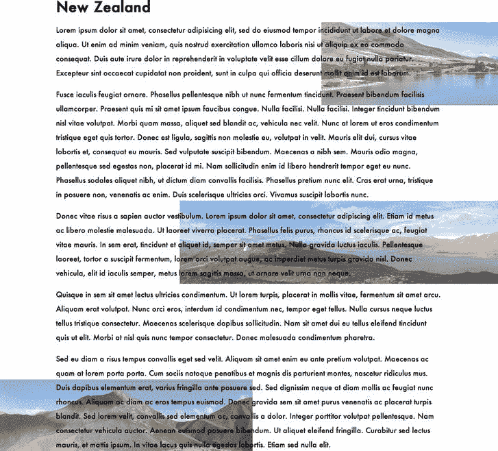

图 3-11。过渡背景图像

当页面加载时，您希望几张图片从页面的一边滑到另一边。在这个例子中，我将使用车红`(www.flickr.com/photos/chleong/6867222762/)`、安德里亚斯·比克`(www.flickr.com/photos/kiwiwings/2148854337/sizes/l/in/photostream/)`、戈登·瑞格里`(www.flickr.com/photos/tolomea/4498923741/sizes/l/in/photostream/)`和大卫·普尔斯豪斯`(www.flickr.com/photos/mdid/2235443912/sizes/l/in/photostream/)`的照片。

首先，你将设置你的基本页面，其标记在整个练习中将保持不变(见清单 3-41 )。请注意，图像从页面左侧偏移其宽度(1300 像素)加上一个增量，在水平方向上交错排列。

***清单 3-41 。*** HTML 和 CSS 代码，用于页面加载时的后台过渡

```html
<div id=wrapper>
<h1> New Zealand</h1>
<p> Lorem ipsum dolor sit amet....
</div>
body { font-family: Futura; margin: 0; line-height: 200%;
background:
    url(lake-benmore-new-zealand-panorama.jpg) -1300px 200px no-repeat,
    url(lake-tekapo-new-zealand-panorama.jpg) -2000px 600px no-repeat,
    url(new-zealand-panorama.jpg) -3900px 1000px no-repeat,
    url(lindis-pass-new-zealand-panorama.jpg) -1300px 1300px no-repeat;
}
div#wrapper { width: 600px; margin: 5em auto; padding: 3em; }
```

不幸的是，CSS 中还没有`background-opacity`属性；在保存图像之前，您必须在 PhotoShop 中淡出图像，或者在图像经过文本下方时，采取其他措施来保持文本的易读性。首先，通过应用`background: rgba(255, 255, 255, 0.8);`，给`div`添加一个部分透明的`background-color`。

加载背景图像时制作动画

用 CSS3 关键帧开始这样的动画是最容易的(在第五章中讨论过),但是通过在主体上放置一个伪类，只使用过渡也可以达到类似的效果。为了演示这个概念，您将向您的 CSS 添加一个新的声明(清单 3-42 )。

***清单 3-42 。*** CSS 代码用于页面加载时的背景过渡

```html
body:hover {
background:
    url(lake-benmore-new-zealand-panorama.jpg) calc(100%+1300px) 200px no-repeat,
    url(lake-tekapo-new-zealand-panorama.jpg) 2400px 600px no-repeat,
    url(new-zealand-panorama.jpg) 2400px 1000px no-repeat,
    url(lindis-pass-new-zealand-panorama.jpg) 2400px 1300px no-repeat;
    transition: 70s all linear;
}
```

假设浏览器窗口宽度小于 2400 像素，这会将图像设置在屏幕的最右侧。(现在做出一个合理的假设，但长期来看是危险的:更好的解决方案是在完全支持 CSS3 变量或 *calc* 后使用它们。)

这种方法有三个缺点:第一个也是最严重的一个缺点是，当用户的鼠标移出浏览器窗口时，图像会重置到屏幕左侧的默认位置。您可以通过将转换代码移动到默认的身体状态来稍微缓解这个问题，这样当用户的鼠标移开时，转换将开始反转。

第二个问题是所有的背景图像必须作为一个组一起被动画化；使用这种方法无法单独过渡图像。

CALC 是什么？

虽然在这种情况下技术上没有必要，但我在清单 3-42 中的声明中使用了`calc`作为展示一个令人兴奋的新属性的手段。`calc`非常接近 CSS3 变量的概念(另一个新的 CSS3 模块)，允许我们将任何长度值指定为算术表达式。在清单 3-42 的例子中，计算只是简单地将当前元素的宽度加到它的父元素(??)上，这样当页面加载时，图像就能保证不在屏幕上。

你可以在`https://hacks.mozilla.org/2010/06/css3-calc/`阅读更多关于`calc`的内容。

最后一个不太严重的问题是，当背景图像移动到`div`后面时会突然褪色。这个问题有两个显而易见的解决方案:

*   使用与`div`的`background`同色的双`box-shadow`和高模糊量来模糊`div`的左右边缘，如清单 3-43 所示。

***清单 3-43 。*** *CSS 代码模糊背景图片的过渡*

```html
div#wrapper { width: 600px; margin: 5em auto;
    padding: 3em;
    background: rgba(255, 255, 255, 0.8);
    box-shadow: 100px 0 100px  rgba(255, 255, 255, 0.8),
    -100px 0 100px  rgba(255, 255, 255, 0.8);
```

`}`

*   扩展`div`以覆盖整个身体，这样它后面的所有东西都会被淡出。如清单 3-44 中的所示设置开始声明。

***清单 3-44 。*** CSS 代码强制整个页面背景图片的不透明度

```html
html, body { min-height: 100%; margin: 0; }
html, body { height: 100%; margin: 0; }
div#wrapper { width: 100%; min-height: 100 %;
    padding: 3em;
    box-sizing: border-box; background: rgba(255, 255, 255, 0.8);
}
```

创建假背景图像并制作动画

如果您希望对背景图像有更大程度的控制，您必须通过利用`position`和`z-index` CSS 属性将图像强制放入背景中来伪造它们。有两种主要方法可以做到这一点。第一个是创建真实的图像，并把它们放在背景中。

这种技术不是通过 CSS 绘制背景图像，而是将它们作为图像放在代码中的上方、下方，甚至是在`div` ( 清单 3-45 )内部。

***清单 3-45 。*** HTML 和 CSS 代码为页面创建假背景图片

```html


#benmore, #tekapo, #lindis { position: absolute; z-index: -1; }
#benmore { top: 300px; left: 200px; }
#tekapo { top: 600px; left: 800px; }
#benmore, #tekapo, #lindis {
    position: absolute; z-index: -1; opacity: 0; transition: 4s linear all 2 s; }
#lindis { top: 900px; left: 50px; }
```

作为单独的图像，这些元素可以跨所有属性单独设置动画。为元素提供一个负的`z-index`将它们推入深层背景。它们在清单 3-46 中以与之前练习中相同的方式被制作成动画。

***清单 3-46 。*** 动画假背景图片

```html
body:hover img#benmore, body:hover img#tekapo, body:hover img#lindis { opacity: 0.6;  }
```

同样，如果您希望序列不管用户活动如何都循环播放，您通常会使用关键帧动画。

或者，您可以通过使用生成的内容来创建相同的效果。这样做的优点是不需要额外的标记，但是限制了两个添加的元素(一个通过使用`:before`生成，一个通过使用`:after`)。如前所述，给定`z-index`和`opacity`，这些元素也可以被转换。

摘要

在这一章中，你已经学习了如何使用带有不透明度的 CSS3 过渡和 CSS4 交叉淡入淡出来交叉淡入淡出两幅图像。您还创建了一个简单的图片库(在许多站点环境中都很有用),并通过过渡逐渐增强了图片库。我已经向您展示了如何使用几个不同的伪选择器(`:target`、`:active`和`:hover),`)来启动这些转换，其中的每一个都将适用于特定的演示。

您已经为图像的标题制作了动画，并且在这个上下文中，移动了变换轴以创建“偏移”旋转。

过渡模块有几种延迟序列以创建分层动画效果的方法，从简单的(`transition-delay`)到诸如提供极高的时间值以有效地将过渡元素永久保持在适当位置的技巧。您可以使用这些相同的技术在过渡元素中创建不同的入和出效果，这些效果通常只是按照它们出现时的动画顺序进行反转。

最后，您已经将过渡推进到了大多数开发人员很少涉足的领域:生成内容的动画和页面加载时移动的背景图像。

在下一章，我将向你展示如何将 CSS3 过渡应用到网站导航和其他用户界面功能中。