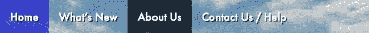
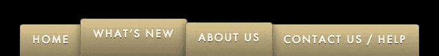
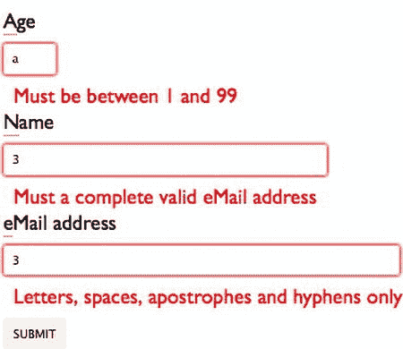
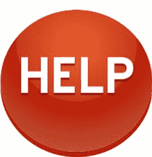
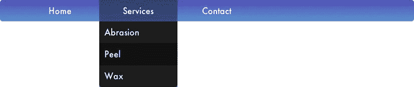
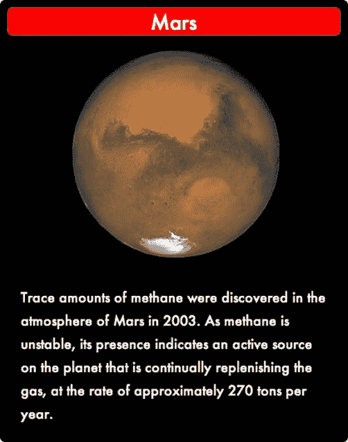
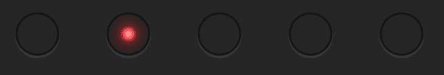

# 四、UI 元素的 CSS3 过渡

CSS3 transitions 的另一个明显的作用是增强网页中的用户界面元素:在导航、表单和按钮中构建动画，使网站上的信息更清晰、更吸引人。在这一章中，我将学习到目前为止你已经探索过的动画原理和 CSS 语法，并在课程中对它们进行扩展，这将使你的设计更具互动性、更有趣、更好玩。

现代网站导航标记

在你的站点导航中添加过渡之前，花点时间研究一下你将把 CSS 规则挂入的标记是值得的。对于 HTML5 网站，主导航应该位于一个`<nav>`元素中。为了确保与屏幕阅读器的兼容性，您将在标签中添加一个 ARIA 导航角色，如清单 4-1 所示。

***清单 4-1 。*** 最小 HTML5 站点导航结构

```html
<nav role=navigation>
<a href=index.html>Home</a>
<a href=about.html>About Us</a>
<a href=products.html>Products</a>
</nav>
```

 **注**您可以在`www.w3.org/TR/wai-aria-practices/`了解更多关于 ARIA 地标角色的信息。

如您所见，HTML5 允许您在`nav`元素中放置一系列简单的站点链接。但是，您可能会发现，添加标记增加了导航的语义价值，同时允许您以更大的灵活性修改其外观。在大多数情况下，站点导航可以被视为一个无序列表；或者，如果希望用户以特定的顺序阅读页面，您可能希望使用有序列表。

无论您选择哪种方法，键盘快捷键也应该通过`accesskey`属性添加到主链接中，如清单 4-2 所示。(注意,`role`属性已经移动到无序列表中。)

***清单 4-2 。*** 一个易访问的站点导航代码结构

```html
<nav>
<ul role=navigation >
<li><a href=index.html accesskey=1>Home</a>
<li><a href=new-xyz-corp.html accesskey=2>What's New</a>
<li><a href=about-xyz-corp.html accesskey=a>About Us</a>
<li><a href=contact-xyz-corp.html accesskey=6>Contact Us / Help</a>
</ul>
</nav>
```

这是你将在本章中构建的每一个主要导航界面的基础。为了节省空间，您并不总是需要包含完整的辅助功能，但是在最终的产品代码中使用这些功能是非常重要的。

 **注意**在某些情况下，对于 CSS 规则的某些组合，如果链接在水平排列的`<li>`元素中，它们之间可能会出现微小的视觉间隙(如清单 4-3 )。虽然无论如何格式化都希望保留您的代码——与 HTML 相反，HTML 将所有连续的空格字符折叠成一个空格，回车符计为一个空格，除非内容包含在`<pre>`标签中——但是找出这些差距的原因可能会非常令人沮丧。

The issue lies not with the CSS, but with the HTML, in the form of carriage returns between each list item. While CSS solutions to this problem exist (setting `font-size: 0` on the parent element, for example, or floating the list item elements), the best option is usually to remove the carriage returns, placing all of the list items in a single line, as shown in Listing 4-3.

***清单 4-3 。*** 一个无障碍的站点导航代码结构，没有多余的空格

```html
<nav>
<ul role=navigation><li><a href=index.html accesskey=1>Home</a><li><a href=new-xyz-←
corp.html accesskey=2>What's New</a><li><a href=about-xyz-corp.html accesskey=a>About←Us</a><li><a href=contact-xyz-corp.html accesskey=6>Contact Us / Help</a></ul>
</nav>
```

`For the sake of clarity I will not be using this solution in the code samples to come, but you should be aware of the potential problem and its solution.

不管它们是否用一行代码编写，用有序或无序列表构建的导航结构都会在单独的一行上显示每个链接。要创建水平导航栏，您必须在 CSS 中添加一个内容。

水平导航栏基础知识

当网站相对较小时，通常使用水平导航界面。(下拉菜单条是这个规则的一个例外，我将很快介绍它。)

“神奇的数字 7，加或减 2”是确定导航结构的有效经验法则:平均而言，人类在任何时候都可以回忆或联系到多达 7 个项目。导航中超过七个条目通常意味着你需要重新考虑 UI(用户界面)——*分块*或者将相关条目组合在一起通常可以解决问题。根据屏幕的宽度，你通常也可以在一个导航浏览器窗口中水平放置七个导航项目；非常窄的窗口(比如在移动设备上)或者超过七个主链接通常需要垂直方向的导航格式。

链接是自动内联显示的，所以几乎不需要添加 CSS 来使它们在水平导航栏中看起来有组织。如果您已经将链接包装在`<li>`标签中，那么几乎没有什么工作要做:只需将清单 4-4 中的声明添加到您的样式表中。

***清单 4-4 。从一个 HTML5 导航结构创建一个水平导航条***

```html
nav li { display: inline; }
```

现在您已经为最常见的站点导航格式建立了基本的标记，您可以继续使用 CSS3 来增强它们。

用 CSS3 增强的简单导航栏

让我们从清单 1-1 中选取最简单的导航标记，并在导航栏后面放置一个`background-image`。您将可视化地格式化文本，以便通过添加`a text-shadow and a hover effect`仍然可以阅读，如清单 4-5 所示。

***清单 4-5 。从一个 HTML5 导航结构创建一个水平导航条***

```html
nav { background: url(img/clouds.jpg) no-repeat; padding: 1em 0; }
nav a { text-decoration: none; color: #fff; padding: 1em;
font-family: Futura, Arial, sans-serif;
text-shadow: 2px 2px 1px rgba(0, 0, 0, 0.6); }
nav a:hover { background: rgba(0, 0, 0, 0.7); }
```

然后，你将添加一个简单的过渡，通过调整清单 4-6 中的选择器，来淡入一个悬停链接后面的背景。

***清单 4-6 。*** 使用 CSS3 给链接引入过渡效果

```html
nav a { text-decoration: none; color: #fff; padding: 1em;
font-family: Futura, Arial, sans-serif;
text-shadow: 2px 2px 1px rgba(0, 0, 0, 0.6);
-webkit-transition: background .85s ease-in-out;
-moz-transition: background .85s ease-in-out;
-o-transition: background .85s ease-in-out;
transition: background .85s ease-in-out;
 }
```

最后，做一点安全检查:任何时候你把一张图片放在一个元素的背景中，你都应该设置一个代表图片主色的`background-color`，以防图片无法加载。修改`nav`声明，如清单 4-7 所示，确保链接的文本在任何情况下都清晰可辨。

***清单 4-7 。*** 创建一个 CSS 背景色作为图片的退路

```html
nav { background: url(img/clouds.jpg) #007 no-repeat; padding: 1em 0; }
```

您还可以使用`nav a:visited`作为选择器，对用户之前访问过的链接应用不同的外观。如清单 4-8 所示，当鼠标悬停在这样的链接上时，你甚至可以创建一个不同颜色的过渡。

***清单 4-8 。*** 为访问过的链接创建单独的效果

```html
nav a:visited:hover {
background: #f00;
background: rgba(255, 0, 0, 0.7);
}
```

过渡效果仍将应用于已访问的链接，但它们将褪色为红色，而不是黑色。这将产生如图 4-1 所示的菜单。


图 4-1。具有动画悬停效果的导航栏

以这种方式添加 CSS3 完全向后兼容旧的浏览器。如果浏览器不支持过渡，用户只会在当前悬停的链接后面看到部分透明的背景。

 **提示**想象只支持 CSS 2.1 的旧浏览器的行为的最简单的方法是记住，它们对任何过渡都施加了一个持续时间`0`。顺便说一下，这就是为什么`transition-duration`和`transition property`的默认值分别是`0`和`all`。

如果您想确保更好的跨浏览器兼容性，您可以在声明的`rgba`部分之前为悬停的链接添加一个后退的黑色`(#000`背景。理解`rgba`的浏览器会遵循最后一条规则；那些没有的将遵循十六进制颜色。淡入仍然可以工作，并且在支持它的浏览器中正确显示。

在导航中高亮显示当前页面

在导航栏中突出显示用户的当前页面是有问题的。CSS 不知道应用的内部状态——它不知道*在哪里。*你可以通过在`body`标签上为每个页面上的自引用链接创建一个`class`、`data`属性或`id`来避免这个问题，允许 CSS 匹配选择器，如图图 4-2 所示。



图 4-2。高亮显示当前位置的导航栏

从清单 4-9 中的代码开始。

***清单 4-9 。*** 在网站导航条上标记出“你在这里”的视觉效果

在`index.html`:

```html
<body id=home>
<nav role=navigation>
<a href=index.html class=home>Home</a>
<a href=about.html class=about>About Us</a>
<a href=products.html class=products>Products</a>
</nav>
about.html:
<body id=about>
<nav role=navigation>
<a href=index.html class=home>Home</a>
<a href=about.html class=about>About Us</a>
<a href=products.html class=products>Products</a>
</nav>
```

定位表示当前页面的链接是一个简单的过程，将一系列后代选择器分组，如清单 4-10 所示。

***清单 4-10 。*** CSS 高亮显示当前页面链接

```html
#home nav a.home, #about nav a.about { background: rgba(0,0,212,0.6);}
```

也可以通过在每个页面上嵌入一个单独处理每个链接类的样式表来达到这种效果。这两种方法都有相同的缺点:它们需要为每个页面定制标记。更好的解决方案可能是 CSS 和 JavaScript 的结合(这里以 JQuery 的形式显示)。

HTML 返回到开始时的样子(清单 4-1 )，你的样式表简单地加入一个新类，如清单 4-11 所示。

***清单 4-11 。*** CSS 通过 JavaScript 突出显示“你在这里”链接

```html
a.current { background: rgba(0,255,0,0.7); }
```

在每个文档的`head`中，你包含了清单 4-12 中的代码。

***清单 4-12 。*** JavaScript 将“你在这里”类应用到站点导航中

```html
<script src=//code.jquery.com/jquery.min.js></script>
<script>
$(document).ready(function(){
$('ul[role="navigation"] a').each(function() {
if (this.href === window.location.href){ $(this). addClass('current');}
});
})
</script>
```

在下一节将要创建的更高级的导航示例中，您可以使用这些方法中的任何一种来突出显示当前页面。

带有 CSS3 过渡的水平标签导航

作为站点导航的一个更高级的例子，你可以在“标签”导航中包含移动。在这种情况下，你将把链接放在一个有序列表中以提供更多的结构，就像你在清单 4-2 中所做的那样。按照清单 4-13 中的，你将通过并排设置链接，在它们的右上角和左上角添加一个`border-radius`，并在每个标签的背景中放置一个渐变来创建标签的视觉效果。这将产生如图 4-3 中所示的菜单。



图 4-3。动画标签导航系统

在这个例子中，您将使用一个属性选择器来访问列表项和链接。

***清单 4-13 。*** CSS 将导航链接样式化为选项卡

```html
ul[role=navigation] li {
display: inline; font-family: Futura, Arial, sans-serif;
text-transform: uppercase;
}
ul[role=navigation] li a {
text-decoration: none; color: #fff;
padding: 0.8rem 1.2rem 2rem 1.2rem;
border: 1px solid #777; border-radius: 5px 5px 0 0;
background: linear-gradient(to bottom, #dfc891, #776c51);
box-shadow: 0 0 15px rgba(0,0,0,0.5);
letter-spacing: 0.15rem; text-shadow: 0 1px 0 #000;
}
```

接下来，您需要稍微重叠选项卡。您可以通过为每个列表项提供一个负数`margin-left`来实现。鼠标经过时标签会上移，所以你故意把它们做得比正常状态下要长。使用无序列表上的`overflow: hidden`隐藏底部边缘的多余部分，如清单 4-14 所示。

***清单 4-14 。*** CSS 将导航链接样式设置为选项卡

```html
ul[role=navigation] {
background: #000;  padding-top: 3.2rem; padding-bottom: 1rem;
overflow: hidden; margin-top: 0; }
ul[role=navigation] li {
display: inline; font-family: Futura, Arial, sans-serif;
text-transform: uppercase; margin-left: -.5rem;  }
```

代表当前页面的链接将应用一个类`forefront`。这个类通过使用负的`top`值`position: relative`和修改后的`z-index` ( 清单 4-15 )，将适当的链接放在所有其他选项卡之上，并且比其他选项卡略高。

***清单 4-15 。*** 将当前页面的链接放置在其他页面的顶部

```html
ul[role=navigation] li a.forefront { -0.2rem; z-index: 2;}
```

您可以使用已经讨论过的任何一种方法来应用这个类:将它添加到标记中，或者用 JavaScript 动态地应用它。最后，你将在悬停时通过提升链接的顶部位置来提升链接，并将默认状态的转换动画化(清单 4-16 )。

***清单 4-16 。*** 制作标签页链接动画

```html
ul[role=navigation] li a {
position: relative; top: 0;
transition: 0.2s all linear;
...
}
ul[role=navigation] li a:hover,  ul[role=navigation] li a:focus {
top: -0.6rem;
}
```

HTML5 表单自定义验证错误动画

用户输入表单的信息通常至少要检查两次:一次在前端(通常用 JavaScript)，一次在后端(用 PHP 或其他服务器端语言)。这种方法有几个优点:

*   *冗余* :如果客户端验证过程失败，或者在浏览器中被阻止或不支持，后端过程仍然会寻找错误。
*   *即时性* :客户端解决方案通常在访问者向字段中输入信息时或字段失去焦点后提供即时反馈；除非使用 AJAX 或类似技术，否则服务器端解决方案在提交按钮被按下之前无法提供响应。
*   安全 :一般来说，服务器端语言将提供一种比使用 JavaScript 更合适、更安全的方式从 VISA 和 Mastercard 获取信用卡验证信息。

JavaScript 中已经有很多验证脚本，但是在 HTML5 中，同样的验证表单的能力现在在浏览器中得到了原生支持，具有`pattern`属性和两个新的 CSS 伪类:`:valid`和`:invalid`。为了演示这一点，你将创建如图 4-4 所示的表单。



图 4-4。用 CSS3 制作动画形式的错误信息

你从易访问表单的基本标记开始，如清单 4-17 所示。

***清单 4-17 。**?? 一个可访问的 HTML5 表单*

```html
<form>
<label for=age accesskey=a>Age</label>
<input type=number name=age id=age size=3 maxlength=2 min=1 max=99 ←pattern="^([1-9]|[1-9][0-9]){1,2}$” required >
<label for=name accesskey=n>Name</label>
<input type=text name=name id=name size=40 maxlength=38 ←
pattern="^[a-zA-Z]'?[- 'a-zA-Z]+$" placeholder="Your full name" required >
<label for=email accesskey=e>eMail address</label>
<input type=email name=email id=email size=50 maxlength=256 placeholder="Your contacteMail" ← required>
<input type=submit value=submit>
</form>
```

正如您所看到的，您使用了一个带有`min`和`max`值的`number`字段来限制用户输入的年龄、一个电子邮件输入和一个带有正则表达式的标准文本输入来获取用户的姓名。所有输入都是必需的。(我给`number`输入添加了一个`pattern`，尽管它在 HTML5 中是无效的，以便在 Firefox 14 和更早的版本中得到加强，它识别`pattern`但不识别`number`属性值本身，默认字段为标准文本输入。)你可以使用一些基本的 CSS 来改善这些元素的显示，如清单 4-18 所示。

***清单 4-18 。*** CSS 为典型的可访问表单

```html
form { font-size: 1.2rem; font-family: "Gill Sans", Arial, sans-serif; }
label,input { display: block; }
label:first-letter { border-bottom: 2px solid #bbb; }
input { border: 1px solid #bbb; padding: .4rem; border-radius: .2rem; margin: .5rem 0; }
input[type="submit"] { border: none; text-transform: uppercase; }
```

这个样式表唯一稍有不同的地方是第三个声明，它给每个表单标签的第一个字母加下划线，以显示相关字段的适当的 accesskey。要显示输入的信息是对还是错，需要添加清单 4-19 中的代码。(注意第一个 CSS 声明，它关闭了有效和无效输入的当前默认 Firefox UA 样式)。

***清单 4-19 。*** CSS 为典型的可访问表单

```html
input:valid, input:invalid {box-shadow: none; }
input:valid { border: 2px solid green; }
input:invalid { border: 2px solid yellow; }
```

虽然您当然可以将目前的表单制作成动画，但是目前的表单有一些缺点:当用户第一次看到页面时，浏览器默认将输入显示为无效，并且没有指示用户输入错误的确切内容。

您不能使用伪类在输入之后生成错误消息，因为它们是被替换的元素，但是您可以将错误消息放在输入之后的跨度的属性中。清单 4-20 中显示了一些例子。

***清单 4-20 。*** 在 HTML5 表单输入后添加 Span 元素作为验证错误消息

```html
<span title="Must be between 1 and 99"></span>
<span title="Must a complete valid eMail address"></span>
<span title="Letters, spaces, apostrophes and hyphens only"></span>
```

因为每个`span`只包含其`title`属性中的信息，没有可见的内容，所以不完全支持 CSS3 的旧浏览器不能向用户显示任何令人困惑的消息。从你的代码中删除清单 4-20 ，用清单 4-21 代替。

***清单 4-21 。**样式和显示验证错误*

```html
input + span:after { content: attr(title); color: red; margin-left: 0.6rem; opacity: 0; }
input:invalid + span:after { opacity: 1; }
```

有一个直接的问题:浏览器通过在页面加载时显示`span title`属性来继续显示输入错误。原因？

 **提示**具有`required`属性的`input`由它的`pattern`评估，或者在用户聚焦或向字段中输入任何信息之前输入`type` *。*

通过从输入中移除`required`属性，并给错误消息添加一个转换，如清单 4-22 中的所示，你实现了你想要的效果。请注意，我已经为转换添加了延迟:如果没有延迟，在输入字段中的第一个字符时，错误消息会立即显示出来。在你告诉用户他们的信息是错误的之前，你需要一段合理的时间。

***清单 4-22 。*** 延迟后显示表单验证错误信息

```html
input + span:after { content: attr(title); color: red; margin-left: 0.6rem; opacity: 0;
transition-property: opacity;transition-duration: 2s; transition-delay: 2s;}
```

您还可以通过在表单元素中显示勾号来显示输入的有效性状态。回到清单 4-17 中的标记和清单 4-18 中的 CSS，添加清单 4-23 中的 CSS。(你可以进一步将*tick.png*变成精灵图像，并在输入无效时显示一个十字)。

***清单 4-23 。*** 显示表单输入验证的背景图像

```html
input:focus:valid { background-image: url(tick.png); background-repeat: no-repeat;
background-position: right 6px;  }
```

您不能直接淡入背景图像(到目前为止，还没有对背景图像不透明度的直接控制)，但是您可以*操作图像，所以如果您想淡入符号，您可以将图像放在输入之后，并像您之前处理验证消息一样转换它。*

 **注意**您也可以完全通过 JavaScript 关闭浏览器的内置表单验证消息，如下所示，使用 jQuery:

```html
$(document).ready(function() {
$('form').bind('invalid', function(e){
$(e.target).attr('validity')
}); });
```

UI 按钮按下过渡

使用 CSS，你也可以给人一种链接或按钮降低或沉入页面的感觉，如图图 4-5 所示。



图 4-5。典型的按钮示例

实现这一效果的简单方法如清单 4-24 所示。

***清单 4-24 。*** CSS 使链接点击时降低

```html
a:active { position: relative; top: 1px; }
```

当然，也可以更精细地设计一个链接，如清单 4-25 所示。

***清单 4-25 。*** HTML 和 CSS 创建巨型帮助按钮

```html
<a href=# class=bigbutton>help</a>
a.bigbutton {
font-family: "Blue Highway"; text-transform: uppercase; color: #fff;
background: radial-gradient(center 50px, circle farthest-corner, #ef6634, #c63a17 43%,#ba1a01 45%,#bf6e4e 100%);
display: inline-block; width: 200px; height: 200px; border-radius: 100%;
font-size: 70px; text-decoration: none; text-align: center; padding-top: 50px;
box-sizing: border-box; font-weight: 900;
box-shadow: 0 8px 0 rgb(183,0,0), 0 15px 20px rgba(0,0,0,.35);
text-shadow: 0 3px 1px rgba(122,17,8,.8);
transition: .4s all ease-in;
}
```

在这里，您通过创建两个方框阴影来创建 3D 按钮的效果:一个用于创建按钮边缘的效果，另一个在其下方作为常规阴影。您通过转换四个同时发生的动作来创建按钮降低的印象:

1.  降低按钮上的文本。
2.  使用 translate 物理降低整个按钮。
3.  减少代表按钮边缘的阴影。
4.  减少和加强整个元素下方阴影的模糊度。

你将在一个基于`:active`伪选择器的声明中做到这一点，如清单 4-26 所示。

***清单 4-26 。*** HTML 和 CSS 创建巨型帮助按钮

```html
.bigbutton:active {
   padding-top: 53px;
   transform: translate(0, 4px);
   box-shadow: 0 4px 0 rgb(183,0,0), 0 8px 6px rgba(0,0,0,.45);
}
```

还可以创建一个按钮显示效果，您将在下一节看到。

UI 按钮显示过渡

标准的 HTML `button`元素也可以用包含过渡的 CSS 进行大量定制。在这种情况下，你需要一个按钮在`hover`上展开，显示里面的推广或引导信息(见图 4-6 )。


图 4-6。一个按钮有两种模式，用 CSS3 过渡了

你的 HTML 将由三个元素组成:一个包含两个标签的`button`。你可以在清单 4-27 中看到这个标记。

***清单 4-27 。*** HTML 为一个显示按钮

```html
<button>Sign up
<span class=hidden>For Free</span>
<span class=right>▶
</span>
</button>
```

 **提示**当用于 UI 元素的右侧时，Unicode 字符比图像适应性更强，也更容易控制。我在这里使用了一个十进制实体字符来表示向右的黑色(可以在`copypastecharacter.com`找到 Unicode 字符的一个很好的资源)。)

接下来，您将添加 CSS 来设置您的按钮外观(清单 4-28 )。

***清单 4-28 。*** 为一个显示按钮的基本 CSS

```html
* {box-sizing: border-box;
color: #333; font-family: Futura, Arial, sans-serif;
}
button {
        font-weight: 600;
        text-shadow: 0px 1px 1px rgba(255, 255, 255, 0.3);
border-radius: 34px; height: 68px; width: 180px;
padding: 0 20px; font-size: 18px;
background: linear-gradient(to bottom, #1e5799,#7db9e8);
border: 1px solid rgba(0,0,0,0.4);
box-shadow: 0px 1px 1px rgba(255, 255, 255, 0.8) inset,
1px 1px 3px rgba(0, 0, 0, 0.2),
0px 0px 0px 4px rgba(188, 188, 188, 0.5);
text-align: left;
}
span.hidden, span.right  { color: #fff;  }
span.right { padding-left: 18px;  }
span.hidden {background: linear-gradient(to bottom, #222, #000);
display: inline-block; width: 0; margin-left: 22px;
overflow: hidden;
white-space: nowrap; padding: 22px 0;
border-left: 2px double rgba(0,0,0,0.3); }
```

因为`.hidden`跨度设置为`box-sizing: border-box`、`white-space: nowrap`、`overflow: hidden`、`width: 0`，所以正常情况下你只能在左侧看到它的`border`。

您希望多个过渡事件在同一时间以相同的动作发生。虽然您可以将转换属性放在单独的声明中，但是将它们放在 CSS 中尽可能高的位置通常会更有效。

***清单 4-29。*** CSS 为一个按钮显示过渡

```html
button { transition: .6s all ease-in-out; }
button:hover { width: 290px; color: #fff; text-shadow: none;  }
button:hover span.hidden { width: 120px; padding: 22px;  }
```

带有 CSS3 过渡 的可访问水平下拉导航

下拉菜单是复杂网站的常见导航选项。用户已经熟悉了他们电脑上用户界面的格式，所以在网站上使用相同的界面设计是有意义的。参见图 4-7 中的示例。



图 4-7。下拉菜单

HTML 页面上的下拉菜单传统上是使用 Flash 或 JavaScript 创建的，但这些工具都有一个明显的缺点:对于残疾人来说，使用屏幕阅读器和/或键盘使用它们创建的菜单可能很困难。

通过在带有 CSS3 过渡的 HTML5 标记中使用 ARIA 特性，您可以获得最好的一切:可访问的、视觉上吸引人的、动画的 UI 元素。基本标记如清单 4-30 所示。

 **提示**你可以在`www.w3.org/TR/wai-aria/roles`了解更多关于咏叹调角色的信息。

***清单 4-30 。*** 可访问下拉菜单的 HTML

```html
<nav role=navigation aria-label="Main menu">
<ul role=menubar>
<li role=menuitem tabindex=0><a href=#>Home</a>
<li role=menuitem aria-haspopup=true tabindex=0><a href=#>Services</a>
<ul class=submenu role=menu aria-hidden=true>
<li role=menuitem tabindex=-1><a href=#>Abrasion</a>
<li role=menuitem tabindex=-1><a href=#>Peel</a>
<li role=menuitem tabindex=-1><a href=#>Wax</a>
</ul>
<li role=menuitem tabindex=0><a href=#>Contact</a>
</ul>
</nav>
```

代码类似于您在清单 4-1 中开始的代码(没有访问键，为了节省空间，本例中省略了访问键)。导航角色已经移回到`nav`元素上，该元素也获得了一个描述其用途的标签，相当于标题工具提示。

每个列表项都有一个角色`menuitem`，表示它是可操作的，还有一个`tabindex`，或者是`0`(表示它可以通过使用 TAB 键在两个列表项之间跳转)或者是`-1`(意味着必须使用其他控件，比如箭头键来聚焦它们)。最后，包含子菜单的列表项有一个`aria-haspopup`属性，子菜单本身有一个`aria-hidden`属性，表示默认情况下它是不可见的。

为此，你要添加一些基本的 CSS，如清单 4-31 所示。

***清单 4-31 。**代码为 CSS3 的*下拉菜单

```html
body { font-family: Futura, Arial, sans-serif; }
nav { height: 41px;
background: linear-gradient(to bottom, rgb(93,146,207) 0%, rgb(79,79,181) 100%); }
nav ul { margin: 0; }
nav, ul.submenu { background: #35f; border-radius: 5px;  padding: 0;  }
nav ul li { display: block; width: 150px; text-align: center; float: left; margin: 0; padding: 0;  }
nav li:hover { background: rgba(0,0,0,0.4); }
nav a { color: #fff; text-decoration: none; display: block; padding: 10px; }
nav ul.submenu { background: rgba(0,0,0,0.8); position: relative; border-radius: 0 0 5px 5px; height: 0px; overflow: hidden; }
nav ul.submenu li { float: none; text-align: left; border-bottom: 1px solid rgba(0,0,0,0.3); }
```

清单 4-31 中的代码应该是不言自明的:主列表项并排浮动，子菜单放在下面，在本例中，通过将其高度设置为 0 来隐藏。

在当前大多数浏览器中，CSS3 的实现要求您在转换元素的维度时设置明确的度量；在这种情况下，`height: 100%`和`height: auto`都不起作用。此外，您希望将相同的过渡效果添加到多个元素中；与其重复自己，不如在清单 4-32 的顶部添加声明。

***清单 4-32 。*** CSS 为一个动画下拉菜单

```html
nav ul li { transition: .3s all linear; }
nav ul li:hover ul.submenu { height: 126px;  }
```

这种标记和 CSS 可以成为许多界面设计的基础。例如，通过一些小的调整，垂直扩展的“手风琴式”菜单也可以遵循这个模板。

点击按钮后启动 CSS3 过渡效果

在大多数标准 HTML 中，没有记录状态的方法；也就是说，你可以捕捉用户的鼠标在一个元素上的动作(`:hover`)、按下的动作(`:active`)，以及在某些情况下，在一个元素内输入的动作(`:focus`)，但是很少有直接明显的方式来说“如果这个元素被点击，这样做；但如果关闭了，就撤销动作。”

然而，对于 CSS，您确实有一些选择。CSS 可以通过使用`:checked`伪类读取复选框和单选按钮元素的状态。通过隐藏复选框，但通过使用关联的`label`元素来保持可访问性，您可以使用 CSS 来“切换”页面的显示。

 **注意**虽然我接下来要讨论的技术在 HTML5 中是有效的(它允许你在页面的任何地方放置表单元素)，但是它们在语义上是有问题的。有一个学派认为表单元素只应该在表单中使用，并且这些类型的行为应该专门归属于 JavaScript。在继续下面的技术之前，您应该意识到这种争用。

接下来，我将演示如何实现图 4-8 所示的图像。



图 4-8。一张火星的图片和描述，显示了一个被点击的元素(图片由美国宇航局提供)

根据清单 4-33 中的，你的标记将由一个容器`div`、一个复选框`input`和一个包含一些内容的内部`div`组成。

***清单 4-33 。**??【复选框标记】打开和关闭一个关联的 div*

```html
<div id=mars>
<input type=checkbox id=marstoggle>
<div class=toggle>

<p>Trace amounts of methane were discovered in the atmosphere of Mars in 2003... ←Asmethane is unstable, its presence indicates an active source on the planet that is ←continuallyreplenishing the gas, at the rate of approximately 270 tons per year. ←
</div>
</div>
```

您将使用清单 4-34 中的代码对外部`div`及其内容进行样式化。

***清单 4-34 。*** div 为弹出文本

```html
div#mars { background: #000; color: #fff;
font-family: Futura, Arial, sans-serif;
width: 400px; padding: 1.6rem;
line-height: 175%; border-radius: 6px; }
img { display: block; margin: 0 auto; }
div#mars p { margin: 1rem; }
```

您想要隐藏内部的`div`,方法是使用同级选择器将它的`height`设置为`0`,并隐藏它之外的任何内容。同时，您还将使用前面讨论的推拉动画原理来设置过渡。(参见清单 4-35 。)

***清单 4-35 。**??【开合一格】过渡*

```html
input ∼ div { overflow: hidden; height: 0; transition: .6s all cubic-bezier(0.735, -0.485, ←
0.145, 1.625);   }
```

要完成交互式元素的基本功能，如果复选框被选中，您需要展开内部的`div`。正如我提到的，`height`需要被显式设置，以便元素在当前浏览器中正确转换(参见清单 4-36 )。

***清单 4-36 。*** div 为弹出文本

```html
input:checked ∼ div { height: 480px; }
```

这在这里效果很好，但是用单选按钮隐藏和显示页面内容对于大多数设计来说可能不太好。为了解决这个问题，您可以将一个`label`与`input`相关联，通过使用`for`属性将`label`的文本“链接”到`checkbox`。因此，点击`label`将打开表单元素，并使你的 CSS 继续响应，即使复选框本身是隐藏的(见清单 4-37 )。

***清单 4-37 。*** 完成复选框关联 div 的标记

```html
<div id=mars>
<label for=marstoggle>Mars</label>
<input type=checkbox class=toggle id=marstoggle>
<div>

<p>Trace amounts of methane were discovered in the atmosphere of Mars in 2003...
</div>
</div>
label { display: block; text-align: center; font-size: x-large;
background: red; border-radius: 6px; padding: .2rem; }
label:hover { background: yellow; color: #000; cursor: pointer; }
input { display: none; }
```

如果您愿意忽略一些语义问题，这个复选框控件有许多可能性。甚至可以在菜单中使用它来保持状态打开(例如，作为一系列下面有内容的选项卡，或者作为一个折叠菜单)。

用 CSS3 制作表单元素动画

可以扩展转换来直接修改表单元素的外观。一个简单的例子是当输入文本元素的信息不正确时，视觉上的“抖动和淡入”，如清单 4-38 和图 4-9 中的所示。

清单 4-38 。简单动画表单元素的 CSS

```html
input { padding: 1rem; transition: .5s 2s all cubic-bezier(0.475, -0.600, 0.435, 1.650);   }
```

`input:invalid { border: 3px solid red; transform: translateX(10px); }`



图 4-9。一组动画的、定制的单选按钮

有一些注意事项，您可以使用 Simurai ( `http://simurai.com/`)首先提出的技术将它扩展到单选按钮。基本的标记非常简单:每个单选按钮都有相同的名称，这意味着每个按钮在被单击时都会关闭其他按钮。默认情况下，一个单选按钮自动打开，如清单 4-39 所示。

***清单 4-39 。*** HTML 为动画单选按钮

```html
<input type="radio" name="radiobutton" checked>
<input type="radio" name="radiobutton">
<input type="radio" name="radiobutton">
<input type="radio" name="radiobutton">
<input type="radio" name="radiobutton">
```

接下来是 CSS，如清单 4-40 所示。

***清单 4-40* 。**动画单选按钮的 CSS

```html
body, input { background-color: rgb(20%,20%,20%); }
input {
     appearance: none;
     margin: 10px; width: 22px; height: 22px;
     border-radius: 50%; cursor: pointer;
     vertical-align: middle;
     box-shadow: hsla(0,0%,100%,.15) 0 1px 1px, inset rgba(0,0,0,.5) 0 0 0 1px;
     background-color: rgb(20%,20%,20%);
        background-image: radial-gradient(
        hsla(0,100%,90%,1) 0%,
        hsla(0,100%,70%,1) 15%,
        hsla(0,100%,60%,.3) 28%,
        hsla(0,100%,30%,0) 70%
    );
      background-repeat: no-repeat;
      transition-property: background-position, transform;
      transition-duration: .15s, .25s;
       transition-timing-function: cubic-bezier(.8, 0, 1, 1);
     }
input:checked {
     transition-property: background-position, transform;
     transition-duration: .2s, .25s;
     transition-delay: .15s, 0s;
     transition-timing-function: cubic-bezier(0, 0, .2, 1);
   }
input:active { transform: scale(1.5); transition: transform .1s cubic-bezier(0, 0, .2, 1); }
input,input:active { background-position: 22px 0; }
input:checked { background-position: 0 0; }
input:checked ∼ input, input:checked ∼ input:active { background-position: -22px 0; }
```

 **注意**`appearance`属性旨在从一个元素中移除所有预配置的默认样式，或者允许元素呈现其他元素的外观(例如，将一个`span`样式化为一个`textbox`)。`appearance`是为 CSS3 提出的，但没有进入 UI 模块的规范，尽管它正在被考虑用于规范的未来迭代。该属性在 Webkit 中支持前缀，在 Firefox 中支持部分前缀。出于这个原因，在我写这篇文章的时候，清单 4-40 中显示的代码在 Chrome 中运行得最好。

一旦你克服了`hsla`颜色渐变的复杂性(非常适合创建不同颜色的“信号”灯),剩下的代码就简单了:单选按钮在焦点上变大，释放时径向渐变的背景图像移动到按钮的位置。

摘要

在这一章中，你已经看到了 CSS3 过渡可以用来增强用户界面元素的一些方法，从表单到站点导航。有无数的可能性，我将留给你的想象力和实验。

尽管它们很有用，但转换受到两个事实的限制:它们依赖于某种用户动作来启动，并且它们总是在两点或两种状态之间活动。在曲线上移动对象是不可能的，因为让它们自己循环或运行是不可能的。所有这些特性都属于 CSS 动画模块的范围(我称之为“关键帧动画”以进一步区分它们和过渡)。我将在下一章讨论这个模块。`