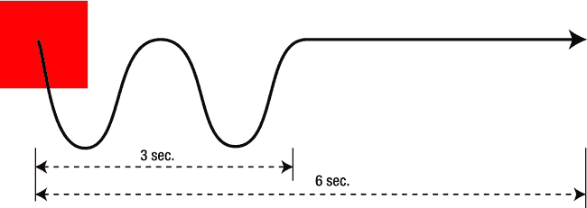
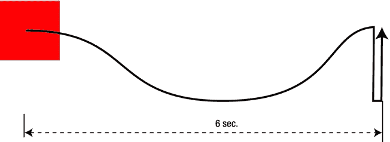
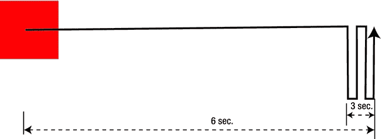
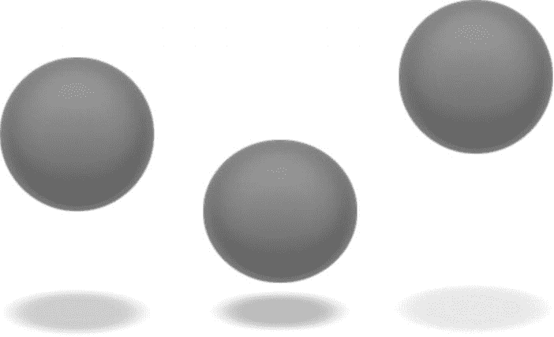

# 五、CSS3 关键帧动画

对于在两种状态之间创建简单的元素动画，CSS 转换很容易实现和使用，但是这种简单性有几个明显的限制。为了创建更复杂的动画，你需要 CSS 动画模块。我将 CSS 动画模块创建的动画称为*关键帧动画*，以进一步区分它们和过渡。

如果您更熟悉 Flash 之类的动画工具，或者来自视频或电影背景，CSS 关键帧动画使用的基于时间的“无帧”方法一开始可能会有点混乱。为了确保每个人都有相同的理解，我将定义关键帧和补间，然后看看它们是如何通过 CSS 动画模块实现的。

关键帧和补间和

现代动画继承了迪士尼和其他动画师在 20 世纪早期开发的传统手绘、cel-shaded 动画的术语和流程。在角色研究、草图和剧本完成后，动画开发是这样的:

1.  一个序列的主要帧是由一个监督动画师绘制的。(在迪士尼工作室，这可能是“九个老人”中的一个，他是创造确立镜头的动画大师。)例如，在像 *Dumbo* 这样的功能中，Dumbo 试图通过拍打他的耳朵来飞翔的序列可能包括两个*关键帧*:一个是 Dumbo 耳朵朝上的帧，另一个是耳朵朝下的帧。
2.  然而，将动画限制在这两帧会使序列看起来非常不稳定(或者使 Dumbo 看起来像蜂鸟一样飞)。为了创建一个更平滑的动画序列，关键帧被交给一个“中间者”，一个低级别的动画师，他将使用第一个和最后一个关键帧作为参考来绘制所需的中间帧。这个过程被称为*补间。*
3.  完整的序列将被着墨、着色和对齐。以每秒 24 帧的速度回放，每幅画之间的过渡看起来很流畅，创建了一个无缝的动画。

今天，你是主动画师，浏览器扮演中间人的角色。创建一个好的 CSS3 动画就是为浏览器提供完整的关键帧，这些关键帧具有足够的信息来在它们之间平滑地进行补间。在补间时，浏览器必须做出许多假设。糟糕的动画通常是由于没有为样式表提供足够的元素信息，或者做出了与 CSS3 内置的假设相反的假设。

 **注意**根据屏幕上的运动速度，如果大约每 50 毫秒显示一个新帧，动画序列就会平滑播放。遵循 CSS 的原则，动画模块不试图定义回放速率或每秒显示的帧数(FPS)。所有 CSS 动画都是由状态(*到*和*从* a 状态)或一个序列需要多长时间(之前的*时间和* a 状态之后的*时间)定义的。剩下的就交给浏览器或客户端了。您完全可以优化您的 CSS 声明，以减少浏览器的负载并创建更高效的动画，但是您不能“逐帧”创建您的序列(除了可能的步骤过渡，在第三章中讨论)，并且您不能定义帧速率。*

CSS3 关键帧动画语法

关键帧动画总是以动画名称开始，该名称与 id 值一样，必须是唯一的。如果两个关键帧序列具有相同的名称，则只会识别最后一个。动画序列本身可以用两种方式指定。第一个是作为一个`from ... to`声明，如清单 5-1 所示。

***清单 5-1** 。*简单的从左到右动画的关键帧

```html
@keyframes slide {
from { left: 0; }
to {left: 100%; }
}
```

动画也可以指定为时间百分比，如清单 5-2 所示。

***清单 5-2 。**?? 一个复杂动画的多个关键帧*

```html
@keyframes multislide {
0% { left: 20px; }
20% { right: 200px; }
80% { left: 50px; }
100% { right: 180px; }
}
```

如果您没有在动画声明中明确定义开始或结束状态(`from/0%`或`to/100%)`)，浏览器将从元素的初始或最终状态进行插值。您还可以在声明中创建关键字和值的混合，如清单 5-3 所示。

***清单 5-3 。*** 混合了关键词和百分比值的关键帧序列

```html
@keyframes multislide {
20% { right: 200px; }
80% { left: 50px; }
to { right: 180px; }
}
```

因为它只描述了两种状态，所以在清单 5-1 中显示的 CSS 动画语法产生了一个本质上等同于过渡的结果，尽管动画方法仍然保留了一些优于过渡序列的优点，你很快就会看到。

实际上，关键帧序列可以写在 CSS 中的任何地方，但是我建议在大多数情况下将它们放在样式表的顶部，与任何`@font-face`声明放在一起，以便于参考。您可能希望将很长的序列放在样式表的底部(以避免它们碍事)，或者甚至将它们作为一个单独的。css 文件(通过`@import`或`<link>), although this adds a separate HTTP request.`进入你的页面)

通过对一个元素应用单独的 CSS 属性来调用 CSS 关键帧动画序列，如清单 5-4 所示。

***清单 5-4 。*** 调用 CSS 关键帧动画序列

```html
#redbox {
background-color: red;
width: 100px; height: 150px;
animation-name: slide;
animation-duration: 5s;
animation-timing-function: ease-in;
}
```

正如你所看到的，这些属性(除了`animation-name`之外)非常类似于第三章中介绍的那些过渡，并且它们具有非常相同的功能。一个区别是`animation-duration`可以设置为 infinite 关键字，而不是以秒或毫秒为单位的时间。动画模块也有`animation-delay`属性，增加了`animation-iteration-count`、`animation-direction, animation-play-state`和`animation-fill-mode`。

该动画也可以在单个`animation`快捷方式属性中调用，如清单 5-5 所示。

***清单 5-4 。*** 用快捷方式调用 CSS 关键帧动画序列

```html
#redbox { animation: slide 5s ease-in 2s; }
```

动画值可以以任何顺序声明，除了`duration`和`delay`值，必须先声明`duration`，后声明`delay`。

支持旧浏览器中的关键帧动画

旧的浏览器需要厂商前缀，正如已经讨论过的过渡。这很复杂，因为`@keyframes`声明也需要前缀，如清单 5-6 所示。

***清单 5-6 。*** 调用旧 Webkit 浏览器的 CSS 关键帧动画序列

```html
@-webkit-keyframes multislide {
0% { left: 20px; }
20% { right: 200px; }
80% { left: 50 %; }
100% { right: 180px; }
}
#bluebox {
width: 100px; height: 150px;
-webkit-animation-name: multislide;
-webkit-animation-duration: 10.5s;
-webkit-animation-timing-function: ease-in-out;
-webkit-animation-delay: 200ms;
}
```

这种重复显然是在你为支持其他旧版本浏览器而写的时候积累起来的；第十章中讨论的一些工具可以简化和自动化这个过程。

控制关键帧动画回放

如果您尝试回放您创建的动画，您将看到元素重置为其初始状态。如果希望元素在最后一帧停止，有几种选择。

*   为元素设置一个长的`animation-duration`，让它永远到达最后一帧。
*   设置`animation-direction`,使元件在同一位置缠绕。
*   将`animation-fill-mode`设置为`forwards`。

`animation-fill-mode`的名字很奇怪，但是它有一个特殊的用途，如表 5-1 所示。

表 5-1。动画填充模式属性值

| 填充模式 | 描述 |
| --- | --- |
| `forwards` | 元素位置在最后一帧结束。 |
| `backwards` | 元素返回到第一帧的位置。 |
| `both` | 将元素设置为页面加载时第一个关键帧的位置，而不考虑元素在其他 CSS 中的默认位置。仅当`animation-delay` 的值大于 0 时适用。 |
| `none` | 元素在关键帧之外由 CSS 提供的初始默认位置开始和结束。 |

您也可以使用`animation-direction`返回动画序列，如表 5-2 所示。

表 5-2。动画方向属性值

| 动画方向 | 描述 |
| --- | --- |
| `normal` | 动画正常向前播放 |
| `alternate` | 动画向前播放，然后反向播放，返回到其初始位置 |
| `reverse` | 动画向后播放 |
| `alternate-reverse` | 动画在第一次播放时向后播放，第二次播放时反向正常播放 |

混合和链接关键帧动画

合并多个关键帧动画与合并转场非常相似，如清单 5-7 所示。

***清单 5-7 。*** 在一个元素上混合多个关键帧动画

```html
@keyframes lefttoright {
0% { left: 0; }
100% { left: 800px; }
}
@keyframes toptobottom {
0% { top: 0; }
25% { top: 100px; }
50% { top: 0; }
75% { top: 100px; }
100% { top: 0; }
}
#box { background: red; width: 100px; height: 100px; position: absolute;
animation-name: lefttoright, toptobottom;
animation-duration: 4s, 2s;
animation-timing-function: ease-in, ease-in-out;
}
```

组合这两个动画序列的绘制结果如图 5-1 所示。



图 5-1。一个合并的 CSS3 动画

这个动画可以通过保持相同的关键帧但改变它们的持续时间来改变，如清单 5-8 所示。

***清单 5-8 。*** 一个通过改变关键帧持续时间而改变的合并 CSS3 动画

```html
#box { background: red; width: 100px; height: 100px; position: absolute;
animation-name: lefttoright, toptobottom;
animation-duration: 3s, 6s;
animation-timing-function: ease-in, ease-in-out;
animation-fill-mode: both;
}
```

结果如图图 5-2 所示。



图 5-2。改变动画时长值后元素的移动

也可以通过在关键帧动画序列之间引入延迟来“链接”它们，如列表 5-9 和图 5-3 所示。

***清单 5-9 。*** CSS3 连锁动画序列

```html
#box { background: red; width: 100px; height: 100px; position: absolute;
animation-name: lefttoright, toptobottom;
animation-duration: 3s, 6s;
animation-timing-function: ease-in, ease-in-out;
animation-delay: 0s, 3s;
animation-fill-mode: both;
```

`}`



图 5-3。设置动画延迟值后元素的移动

您将在 CSS3 动画模块中使用所有这些功能的组合来创建复杂的动画，如下一节中描述的弹跳球和图像幻灯片。

重复动画序列

增加迭代次数允许动画重复多次。使用`infinite`关键字可以将动画设置为无休止地重复播放。例如，无限动画可以用来创建一个永无止境的弹跳球(见图 5-4 )。



图 5-4。来自动画弹跳球序列的截图

为了创建一个真实的橡胶球，你需要同时完成几个视觉效果:当球接触到它下面的理论表面时，它应该在反弹之前稍微“挤压”(使用在第四章中讨论的挤压和拉伸原理)，而当球升到空中时，它下面的阴影变得更加分散，并远离撞击点。要增加额外的真实感，您可以为某些关键帧插入单独的缓动功能。(本动画来源于[`tym pus . net/CoDrops/2012/05/22/creating-an-animated-3d-bounding-ball-with-css3/`](http://tympanus.net/codrops/2012/05/22/creating-an-animated-3d-bouncing-ball-with-css3/)的 CoDrops 原创作品，经许可使用。)参见清单 5-10 。

***清单 5-10 。*** CSS 使用挤压和拉伸动画原理制作一个无休止重复的弹跳球

```html
@keyframes ballbounce {
 0% { top: 0;
 	animation-timing-function: ease-in; }
 50% { top: 140px; height: 140px;
 	animation-timing-function: ease-out;}
 55% { top: 160px; height: 120px; border-radius: 50 % / 60px;
 	animation-timing-function: ease-in;}
 65% { top: 120px; height: 140px; border-radius: 50 %;
 	animation-timing-function: ease-out;}
 95% { top: 0; animation-timing-function: ease-in;}
 100% { top: 0;animation-timing-function: ease-in;}
}
@keyframes shadowshrink {
 0% { bottom: 0;
 	margin-left: -30px;width: 60px;height: 75px;
 	background: rgba(20, 20, 20, .1);
 	box-shadow: 0px 0 20px 35px rgba(20,20,20,.1);
 	border-radius: 30px / 40px;
 	animation-timing-function: ease-in;}
 50% {bottom: 30px;
 	margin-left: -10px;width: 20px;height: 5px;
 	background: rgba(20, 20, 20, .3);
 	box-shadow: 0px 0 20px 35px rgba(20,20,20,.3);
 	border-radius: 20px / 20px;
 	animation-timing-function: ease-out;}
 100% { bottom: 0;
 	margin-left: -30px;
 	width: 60px;
 	height: 75px;
 	background: rgba(20, 20, 20, .1);
 	box-shadow: 0px 0 20px 35px rgba(20,20,20,.1);
 	border-radius: 30px / 40px;
 	animation-timing-function: ease-in;}
}
#ball {
 width: 140px;
 height: 140px;
 border-radius: 70px;
 background: rgb(187,187,187);
 background: linear-gradient(to bottom,
 	rgba(187,187,187,1) 0%,rgba(119,119,119,1) 99 %);
 box-shadow: inset 0 -5px 15px rgba(255,255,255,0.4),
 	inset -2px -1px 40px rgba(0,0,0,0.4), 0 0 1px #000;
 animation: ballbounce 1s infinite;
}
#shadow {top: 280px;
 width: 60px;
 height: 75px;
 box-shadow: 0px 0 20px 35px rgba(20,20,20,.1);
 border-radius: 30px / 40px;
 transform: scaleY(.3);
 animation: shadowshrink 1s infinite;}
#ball, #shadow { position: absolute; top: 0; }
#shadow { left: 65px; }
#wrapper { position: relative; width: 200px; margin: 40px auto; }
<div id = wrapper>
<div id = shadow > </div>
<div id = ball > </div>
</div>
```

正如你所看到的，通过合并和同步多个 CSS 动画序列，你可以在 HTML 元素中创建复杂的、真实的运动。

暂停关键帧动画

可以通过更改`animation-play-state`属性的值来暂停动画。在清单 5-9 和 5-10 的代码中，可以添加清单 5-11 中的代码。

***清单 5-11 。*** 暂停一个 CSS3 动画

```html
#wrapper:hover #ball, #wrapper:hover #shadow  {
animation-play-state: paused;
}
```

因为`animation-play-state`的默认值是`running`，所以当鼠标从悬停在包装器 div 上移开时，动画将恢复。正如你将在第六章中看到的，完全可以通过其他方式设置`running`和`paused`状态。

摘要

利用关键帧的 CSS3 动画为网页上的 HTML 元素提供了更多的动画机会，比通过过渡创建的 HTML 元素有更多的变化。虽然为旧的浏览器构建前缀支持可能是一个有些艰难的过程，但基本的语法使 CSS3 动画更加有效和有趣。虽然许多属性与过渡模块有共同之处，但`animation-fill-mode` 却非常不同:虽然受 CSS3 过渡影响的元素通常会返回到它们的初始状态，但对于成熟的动画来说，这样做是不常见的，需要小心处理`animation-direction`和`animation-fill-mode`。

在下一章中，您将使用在这里学到的语法来创建 web 内容的高级动画，包括图像幻灯片。