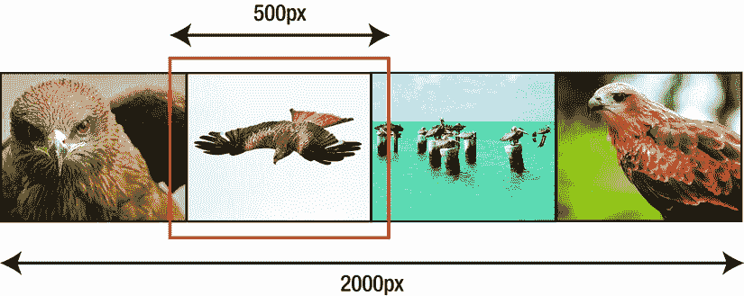
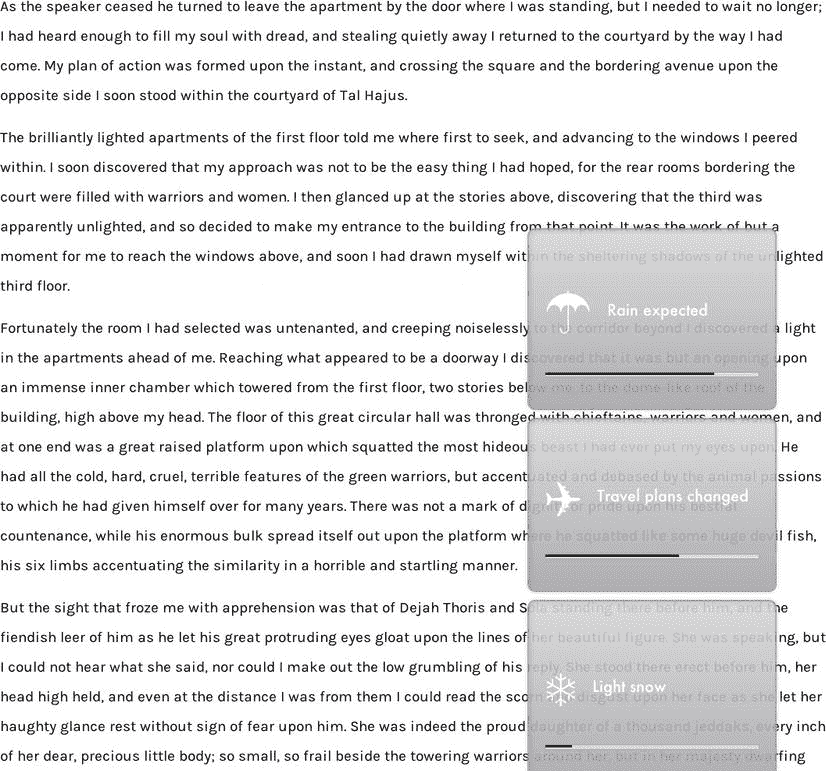
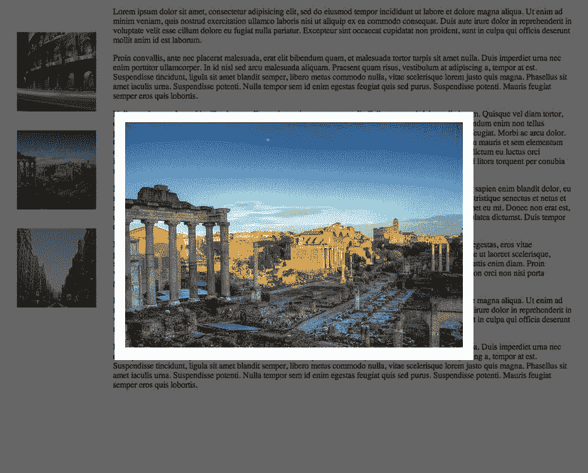
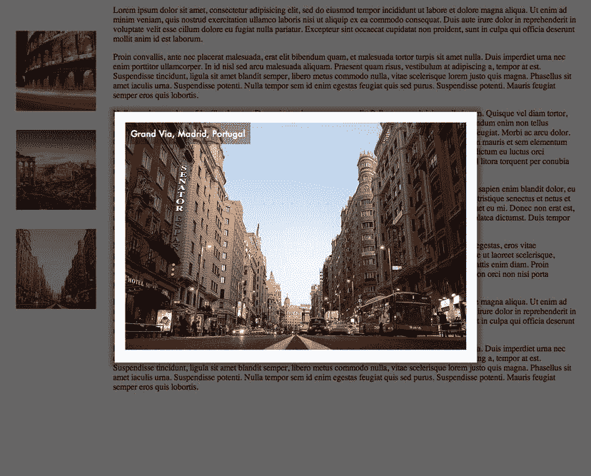

# 六、Web 内容的 CSS3 关键帧动画

正如您在上一章中看到的，CSS 动画模块的语法比过渡语法更强大，允许通过使用关键帧来更好地控制 web 内容。本章将通过几个例子来说明这种能力:一个循环幻灯片，一个复制 JavaScript 经典 Lightbox 插件外观的图库，以及一个徽标动画。

一个简单的 CSS3 幻灯片演示

传统上，图片库幻灯片效果是使用 Flash 或 JavaScript 创建的，通常以框架插件的形式出现，如 Nivo Slider ( `http://nivo.dev7studios.com`)和 Camera ( `www.pixedelic.com/plugins/camera`)。虽然使用框架/插件方法有很多优势(主要是在可用的各种过渡方面)，但是在 CSS3 中完成幻灯片也有很多优势，稍后您将会看到。

HTML 代码

标记 CSS3 幻灯片的图像是一个相当简单的过程:你将图像放入一个容器中，该容器作为一个条带穿过另一个“窗口”元素，该元素与条带中的每个图像大小相同(参见图 6-1 )。



图 6-1。CSS 幻灯片的组织(红色“窗口”容器被放大以示强调)

在代码中，这是使用清单 6-1 中的创建的，在接下来的例子中会添加更多的标记，

***清单 6-1 。*** HTML 代码为一个基本的 CSS3 幻灯片

```html
<div id=slideshow>
    <figure id=imagestrip>
        
        
        
        
    </figure>
</div>
```

在本例中，您有四个 400 像素高、500 像素宽的图像，因此内部容器的总宽度必须为 2000 像素。(注意，所有图像的大小必须完全相同；示例中的图片由 Challiyil Eswaramangalath Pavithran Vipin、Ariful H Bhuiyan、Márcio Cabral de Moura 和 Alan Saunders 根据知识共享协议授权使用。

清单 6-2 中显示的基本 CSS 同样简单明了:

***清单 6-2 。****CSS 3 幻灯片图像库的基本 CSS 代码*

```html
div#slideshow { position: relative; background: #000; overflow: hidden; }
figure#imagestrip, div#slideshow { box-sizing: border-box; }
div#slideshow, figure#imagestrip img { width: 500px; height: 400px; float: left; }
figure#imagestrip { position: absolute; width: 2000px; margin: 0; }
```

要创建最简单的滑块动画，您必须以 500 像素的增量水平移动内部图形，每次移动后都有一个停顿，以便观众有时间欣赏每张图片。正如我在前一章中讨论的，CSS3 动画不能在显式帧中工作。您必须将动画视为时间的一部分:为每个图像指定相等的时间，在此期间它将保持静止，剩余时间指定为运动。在这个例子中，每个图像在 20%的时间里是静止的，而整个带在 20%的时间里是运动的，分为四个序列。因此，每次间隙移动将占用总时间的 5%。

写入关键帧时要记住的重要部分是，如果你想保持它们相同，你改变的属性*必须*作为多个关键帧之间的设定值出现；否则，浏览器将使用您不希望它使用的值恢复到插值。

你对关键帧声明的第一次尝试可能看起来类似于清单 6-3 。

***清单 6-3 。*** *简单图像滑块的关键帧*

```html
@keyframes slider {
  0%  { transform: translateX(0px); }
  20% { transform: translateX(0px); }
  25% { transform: translateX(−500px); }
  45% { transform: translateX(−500px); }
  50% { transform: translateX(−1000px); }
  70% { transform: translateX(−1000px); }
  75% { transform: translateX(−1500px); }
  95% { transform: translateX(−1500px); }
 100% { transform: translateX(−2000px); }
}
```

然后你调用动画序列。与过渡不同，关键帧动画不需要启动事件，这意味着该动画将在页面加载时运行，如清单 6-4 所示。

***清单 6-4 。*** *简单图像滑块的关键帧*

```html
figure#imagestrip { animation: slider 10s infinite; }
```

您会发现这是可行的，但只有一个问题:最后一次移动显示了一个空窗口，因为没有超过 2000 像素的图像用于显示图像条。您可以通过引入一点小技巧来解决这个问题，将第一个图像的副本放在条带的末尾，在我们的 CSS 中将整个条带延长到 2500 像素(清单 6-5 )。

***清单 6-5 。**修改了一个基本 CSS3 幻灯片的 HTML 代码*

```html
<div id=slideshow>
    <figure id=imagestrip>
       
        
        
        
        
    </figure>
</div>
```

由于最后一个关键帧现在在视觉上与第一个匹配，这就创建了一个完整平滑的动画序列。

背景图像的变化

您可以仅使用背景图像来创建等效的效果，例如，在横幅元素或徽标后面创建幻灯片显示。这将把您的代码简化为一个单独的`<figure>`，但是会使您的 CSS 有些复杂。(请注意，您将在背景列表的末尾重复第一幅图像，就像您在上面的示例中所做的一样，原因也是一样的。参见清单 6-6 。)

***清单 6-6 。*** HTML 和 CSS 代码为一个滑块使用背景图片

```html
<style>
figure#imagestrip { width: 500px; height: 400px;
background: #000; box-sizing: border-box;
 background-image: url(black-kite.jpg), url(red-kite.jpg), url(pelicans.jpg),← url(pariah-kite.jpg), url(black-kite.jpg);
 background-repeat: no-repeat;
 background-position-x: 0, 500px, 1000px, 1500px, 2000px;
 animation: slider 20s infinite;
}
@keyframes slider {
  0%  { background-position-x: 0, 500px, 1000px, 1500px, 2000px; }
  20% { background-position-x: 0, 500px, 1000px, 1500px, 2000px; }
  25% { background-position-x: -500px, 0px, 500px, 1000px, 1500px, 2000px; }
  45% { background-position-x: -500px, 0px, 500px, 1000px, 1500px, 2000px; }
  50% { background-position-x: -1000px, -500px, 0px, 500px, 1000px, 1500px; }
  70% { background-position-x: -1000px, -500px, 0px, 500px, 1000px, 1500px; }
  75% { background-position-x: -1500px, -1000px, -500px, 0px, 500px, 1000px; }
  95% { background-position-x: -1500px, -1000px, -500px, 0px, 500px, 1000px; }
  100% { background-position-x: -2000px, -1500px, -1000px, -500px, 0px, 500px; }
}
</style>

<figure id=imagestrip></figure>
```

您还可以创建一个包含多个背景图像的容器元素，并通过一个可见的“窗口”移动它，或者为背景创建一个将所有图像连接在一起的图像。后一种方法会使 CSS 变得更容易，但也会使以后更改图库变得更加困难。

暂停幻灯片放映

允许用户暂停滑块来聚焦一张图片是合理的。启动这样一个动作最简单的方法是滑块本身上的一个`hover`；同时，您应该在幻灯片上放置一个视觉标识符，以清楚地表明它处于暂停状态。对于这个例子，我将通过淡化`imagestrip`元素并在屏幕上放置一个替代暂停图标的文本作为伪元素(我也可以使用一个图像文件)来实现。所有的变化都是对 CSS 的补充，如清单 6-7 所示。

***清单 6-7 。*** CSS 代码悬停时暂停一个图库幻灯片

```html
div#slideshow:hover figure#imagestrip { animation-play-state:paused; opacity: 0.5; }
div#slideshow:hover:before {
content: "||"; font-size: 200px;
color: rgba(255,255,255, 0.7);
position: absolute;
left: 160px; top: 80px;
}
```

注意，您可以通过在内部的`figure`元素(比如`transition: 1s opacity linear`)上放置一个适当的转换来缓和暂停状态的可视标识符。

改变图像之间的过渡

最终，滑块图库中的每个图像之间有许多种可能的淡入淡出和擦除方式，下面将展示其中的几种。

淡入淡出

在简单的水平或垂直爬行之后，滑块最常见的过渡是让每个图像按顺序淡入/淡出黑色。在不改变标记的情况下，你可以淡出图像条，在它是黑色的时候移动图像条“在黑暗的掩护下”,然后作为一个整体再次淡入图像条，如清单 6-8 所示。

***清单 6-8 。*** CSS 代码悬停时暂停一个图库幻灯片

```html
@keyframes slider {
  0%  { transform: translateX(0); }
  20% { opacity: 1; }
  22% { opacity: 0; transform: translateX(0); }
  23% { opacity: 0; transform: translateX(−500px);  }
  25%,   45%  { opacity: 1; }
  47% { opacity: 0; transform: translateX(−500px); }
  48% { opacity: 0; transform: translateX(−1000px); }
  50%,   70%  { opacity: 1; }
  72% { opacity: 0; transform: translateX(−1000px); }
  73% { opacity: 0; transform: translateX(−1500px); }
  75%, 95%  { opacity: 1; }
  97% { opacity: 0; transform: translateX(−1500px);  }
  98% { opacity: 0; transform: translateX(−2000px); }
 100% { opacity: 1; transform: translateX(−2000px); }
}
```

请注意，我对具有相同属性的关键帧进行分组的方式与对普通 CSS 选择器进行分组的方式相同。然而，通常情况下，您会希望让动画上的调用更长，以防止它显得匆忙。我建议使用`animation: slider 20s infinite`。

```html
Because the other images in the strip are not visible during the fade sequences, you can drop the final duplicate image on the end of the slider div, running it back to the beginning in complete darkness before starting the animation again. That will not be possible in the next example.
```

运动过程中的淡入淡出

通过在图像从左向右移动的过程中淡出图像，您可以保留带有淡出效果的滑块效果。虽然在单个关键帧动画中完全可以做到这一点，但最简单的方法可能是将代码创建为同时运行的两个序列。

为了实现这一点，你恢复到你原来的滑块关键帧序列，现在运行超过 30 秒，并添加一个新的`fader`关键帧声明(见清单 6-9 )。

***清单 6-9 。*** CSS 代码悬停时暂停一个图库幻灯片

```html
@keyframes slider {
    0%  { transform: translateX(0px); }
    20% { transform: translateX(0px); }
    25% { transform: translateX(−500px); }
    45% { transform: translateX(−500px); }
    50% { transform: translateX(−1000px); }
    70% { transform: translateX(−1000px); }
    75% { transform: translateX(−1500px); }
    95% { transform: translateX(−1500px); }
    100% { transform: translateX(−2000px); }
}
@keyframes fader {
    0% { opacity: 1; }
    70% { opacity: 1; }
    90% { opacity: 0; ease-out; }
    95% { opacity: 0; }
    100% { opacity: 1; ease-in; }
 }

figure#imagestrip { width: 2500px;
animation: slider 30s infinite, fader 7.5s infinite; }
```

计时背后的原理很简单:动画总长度为 30 秒，幻灯片中的每个图像将在屏幕上完全显示 6 秒(动画时间的 20%)，并在 1.5 秒内移动到左边(总时间的 5%)。通过循环播放第二个动画，使`imagestrip`元素在接近结束时淡出超过 7.5 秒，您可以合并这两个动画以获得平滑的结果。

交叉路径〔??〕

要实现交叉渐变效果，您有三个选项，但在所有情况下，图像不再作为“条带”放置，而是一个叠一个，最上面的图像依次淡出。

第一个也是最简单的选择是简单地将每个背景图像设置为一个空的(但大小正确的)元素的关键帧(见清单 6-10 )。

***清单 6-10 。*** CSS 代码为一个交叉渐变图像滑块

```html
@keyframes imageswap {
    0% { background-image: url(black-kite.jpg);  }
    20% { background-image: url(red-kite.jpg);  }
    40% { background-image: url(pelicans.jpg);  }
    80% { background-image: url(pariah-kite.jpg);  }
    100% { background-image: url(black-kite.jpg);  }
}
```

这将简单容易地在图像之间交叉渐变；然而，它可能不会给你想要的结果或控制程度。另一种方法是使用交叉渐变滤镜将图像带到页面上，如清单 6-11 所示。

***清单 6-11 。*** 一个交叉渐变图像滑块的替代 CSS 代码

```html
@keyframes slider {
    0%  { background-image: url(black-kite.jpg); }
    20% { background-image: cross-fade(url(black-kite.jpg), url(red-kite.jpg),0%); }
    25% { background-image: cross-fade(url(black-kite.jpg), url(red-kite.jpg),100%); }
    45% { background-image: cross-fade(url(red-kite.jpg), url(pelicans.jpg),0%); }
    50% { background-image: cross-fade(url(red-kite.jpg), url(pelicans.jpg),100%); }
    70% { background-image: cross-fade(url(pelicans.jpg), url(pariah-kite.jpg),0%); }
    75% { background-image: cross-fade(url(pelicans.jpg), url(pariah-kite.jpg),100%); }
    95% { background-image: cross-fade(url(pariah-kite.jpg), url(black-kite.jpg),0%); }
   100% { background-image: cross-fade(url(pariah-kite.jpg), url(black-kite.jpg),100%); }
}
```

第三种选择，使用“真实”图像，稍微复杂一些:最上面的图像必须淡出，然后在返回前景之前延迟。(想象一副牌，在第一张牌被放入弃牌堆一段时间之前，上面的牌和下面的牌之间发生了过渡。)CSS 变成了清单 6-12 中所示的样子。

***清单 6-12 。*** 第三个选项 CSS 代码为交叉渐变图像滑块

```html
@keyframes slider {
    0%, 25% { opacity: 1;  }
    30%, 100% { opacity: 0;  }
}
figure#imagestrip {
    width: 500px; height: 400px;
    background: #000; box-sizing: border-box; overflow: hidden;
    position: relative;
}
figure#imagestrip img { position: absolute; top: 0; left: 0; }
```

HTML 也会改变；注意，在新代码中，我已经将图像按照*与*相反的顺序放置了(清单 6-13 )。绝对定位，图中的最后一个图像将在顶部。(或者，您可以在每个上放置一个内联的`z-index`属性)。

***清单 6-13 。*** 第三选项交叉渐变图像滑块的 HTML 代码

```html
<figure id=imagestrip>


</figure>
```

由于关键帧序列中的每个图像在动画长度的四分之一中是“实心”的，并且整个动画的长度为 10 秒，因此对关键帧的每个后续调用都会额外延迟总时间的四分之一。提供给第一遍(黑风筝的动画)的额外时间是为了使照片的返回不会“踩到”在图形开始处的淡入淡出。

添加字幕

您可以像在前面的图像过渡示例中一样，为幻灯片添加标题。标记如清单 6-14 中的所示。

***清单 6-14 。*** 带标题的图片滑块的 HTML 代码

```html
<div id=slideshow>
  <figure id=imagestrip>
      <figure>
         
        <figcaption>Black kite</figcaption>
      </figure>
  <figure>
    
    <figcaption>Red kite</figcaption>
  </figure>
  <figure>
      
      <figcaption>Pelicans</figcaption>
    </figure>
    <figure>
        
        <figcaption>Pariah kite</figcaption>
    </figure>
  </figure>
</div>

```

向清单 6-2 和 6-3 添加清单 6-15 中所示的标记。

***清单 6-15 。*** CSS 代码给图片滑块添加标题

```html
figure#imagestrip figure figcaption {
    position: absolute; background: rgba(0,0,0,0.4);
    color: #fff; width: 500px; padding: 8px;
    font-size: 18px; top: -42px;
    transition: 1s top linear;
   }
figure#imagestrip:hover { animation-play-state:paused; }
figure#imagestrip figure:hover figcaption { top: 0; }
```

暂停的点击方法

您也可以使用前面讨论的`label`方法来创建一个暂停幻灯片动画的替代方法，方法是在开始`<div>`之后添加如清单 6-16 所示的代码以及相关的 CSS。

***清单 6-16 。*** HTML 和 CSS 代码添加一个点击暂停到一个图像滑块

```html
<input type=checkbox id=pause><label for=pause></label>

label {
    display: block; z-index: 24; transition: 0.3s all ease-in-out;
}
input:checked ∼ figure#imagestrip {
    animation-play-state:paused;
}
input#pause:checked ∼ label {
    background: rgba(0,0,0,0.4);
}
input#pause:checked ∼ label:before {
    content: "||"; font-size: 200px;
    color: rgba(255,255,255, 0.5);
    position: relative;
    left: 160px; top: 80px;
}

```

虽然以上是一个选项，但如果您选择使用它，请记住本章前面讨论的可访问性问题。

为旧版本的 Internet Explorer 创建后备

声明的`overflow: hidden`部分将被 Internet Explorer (IE) 9 和早期版本读取和遵循，尽管关键帧动画不会。这将模糊其他图像，意味着 IE 10 版之前的用户将看不到它们。这可以通过一个条件注释来避免，这个条件注释将图像的可见性传递给那些用户，如清单 6-17 所示。(请注意，IE 6、7 和 8 将需要 JavaScript 和稍微多一点的 CSS，以便浏览器识别 HTML5 元素，例如在第九章中讨论的`<figure>`。)

***清单 6-17 。*** 有条件的 CSS 使图片在早期版本的 IE 中可查看

```html
<!--[if lte IE 9]>
div#slideshow { overflow: visible; }
<![endif]-->
```

对文本使用字幕动画的警告

标签有着漫长而惨淡的历史，可以追溯到早期版本的 Internet Explorer。在 90 年代后期，`<marquee>`从来不是一个标准化元素，也不是任何 HTML 规范的一部分，它通常被用来为网页上的文本创建一种滚动的“滚动条”效果。除了在非常特殊的情况下，`<marquee>`和动画 gif 和闪烁的文字一起，成为了糟糕的网页设计的标志之一。

虽然天真的设计者可能会尝试使用这些技术来制作文本爬行动画，但是应该避免使用它们。撇开设计趋势不谈，字幕文字有许多可用性问题:

*   人类视觉系统被运动所吸引，并且字幕文本处于不断的运动中；字幕功能在页面上非常容易分散注意力。
*   出于同样的原因，字幕文本可能很难阅读，尤其是对于有视觉障碍的用户。
*   在字幕文本中包含链接会让糟糕的想法变得更糟:链接很难跟踪和点击。当字幕文本循环移动时，错过一个链接意味着如果用户第一次错过它，就必须等到该链接的下一次出现，这是非常令人沮丧的。因此，出现在字幕中的任何重要链接也应该以静态形式出现在网页上。

新闻字幕/通知动画

在本节中，您将使用 CSS3 动画创建一个新闻提示序列，而不是使用 marquee 来制作文本动画。每个新的通知将堆积在页面的右下角，显示一段时间后消失。用户应该能够单击每个通知以获取更多信息，每个面板的剩余时间将显示在进度条中。(参见图 6-2 。)



图 6-2。【CSS3 驱动的新闻收报机

对此的标记相当简单:通知是包含在一个更大的`div`中的`div`元素，每个进度条是一个内部带有`span`的`div`，如清单 6-18 所示。

进步元素呢？

HTML5 有显示进程时间的标记:`<progress>`元素。虽然您可以按照自己的方式设置 progress 元素的样式，但是您不能使用 CSS 来修改标记中可视化显示的进度(这就是 JavaScript)。这样的任务超出了本章的范围，因为我们尽可能对每个特性都使用 CSS3，所以在这种情况下使用它并不合适。

*清单 6-18 。CSS3 驱动的定时通知系统的 HTML*

```html
<div id=breaking-news>
    <div class=notification><a href=#><span>☂</span>Rain expected</a>
    <div class=progress><span></span></div>
</div>

<div class=notification><a href=#><span>✈</span>Travel plans changed</a>
    <div class=progress><span></span></div>
</div>

<div class=notification><a href=#><span>❄</span>Light snow</a>
    <div class=progress><span></span></div>
    </div>
</div>

```

样式化通知的基本 CSS 如清单 6-19 所示。

***清单 6-19 。*** CSS 为一个通知告警序列

```html
div#breaking-news {
    position: fixed; bottom: -20px; right: 15%;
}
div.notification {
    position: relative; width: 275px; border-radius: 10px;
    background: linear-gradient(rgb(215,215,215), rgb(165,164,169));
    padding: 60px 20px 40px; border: 2px solid #999;
    margin-top: 10px;
    box-shadow: 3px 3px 6px rgba(0,0,0,0.1) inset, 0 0 6px 2px rgba(0,0,0,0.1);
    opacity: 0.9;
}
div.notification a {
    color: white; text-stroke: 1px solid #000;
    text-decoration: none; font-family: Futura, sans-serif; font-size: 20px;
}
div.notification a span {
    font-size: 60px; padding-right: 20px; vertical-align: middle;
}
div.progress {
     height: 5px; border-radius: 2px; border: 1px solid #999;
     margin-top: 32px; background: rgb(215,215,215);
}
div.progress span {
    background: #000; display: block; width: 0; height: 3px;
}

```

有三个动画序列:`popup`，驱动每个通知向上；`progress`，显示剩余时间；还有`fade`，让每一个通知都在最后淡去。这些都显示在清单 6-20 的中。

***清单 6-20 。*** CSS 为一个通知告警序列

```html
@keyframes popup {
0%, 30% { height: 0; padding: 0 20px; display: none; }
}
@keyframes fade {
     100% { opacity: 0; }
}
@keyframes progress {
     100% { width: 100%; }
}
```

请注意，您对这些关键帧序列采用了一种稍微不同的方法:因为元素的默认状态已经在清单 6-20 中定义了，所以您仅使用关键帧来定义从状态(在弹出的情况下)或从*到*状态(在进度和淡入淡出的情况下)的*。浏览器将根据需要自动在这些值和默认的嵌入、内嵌和链接样式之间进行补间。只有在您的`@keyframes`声明中包含 0%和 100%的值时，您才能控制元素的整个外观(不考虑`animation-fill-mode`)。*

所有通知弹出窗口共享相同的动画，除了为每个弹出窗口初始化动画之前的延迟。有效地使用你的 CSS 意味着你应该在一个声明中放尽可能多的相似的 CSS，如清单 6-21 所示。

***清单 6-21 。*** 从单个共享声明中调用关键帧序列

```html
div.notification {
...
    animation-name: popup, fade;
    animation-duration: 2s, 1s;
    animation-timing-function: cubic-bezier(0.325, 0.730, 0.695, 1.650);
    animation-fill-mode: backwards, forwards;
    animation-delay: 2s, 14s;
}
```

没有任何矛盾的陈述，每个通知面板将继承清单 6-21 中的所有样式，但是动画延迟是你必须为每个改变的一件事(见清单 6-22 )。

***清单 6-22 。*** 为后续通知面板设置不同的动画延迟值

```html
div.notification:nth-child(2) {
animation-delay: 6s, 18s;
}
div.notification:nth-child(3) {
animation-delay: 12s, 24s;
}
```

你对每个面板的进度条采取类似的方法(清单 6-23 )。

*清单 6-23 。*为进度条设置不同的动画延迟值

```html
div.progress span {
       background: #000; display: block; width: 0; height: 3px;
       animation: progress 12s 4s forwards linear;
       }
div.notification:nth-child(2) div.progress span { animation-delay: 6s; }
div.notification:nth-child(3) div.progress span { animation-delay: 12s; }
```

自然，在现实世界中，用纯 CSS3 手工制作每个通知需要花费大量的精力。正如你将在第九章中看到的，你可以使用这里的工作基础来巧妙地整合 JavaScript 的优势。

CSS3 中的 Lightbox 图像库等价物

Lightbox 是用于显示图库图像的第一个流行模态技术的通称:经典的 Lightbox 效果是页面的淡出，然后是页面中心图像的扩展和淡入。它的流行导致了在 web 上的过度使用，许多开发人员只是因为不熟悉或懒惰而使用代码自带的默认值。用 CSS 编写等价的内容允许开发人员根据自己的需求轻松定制图库的外观。

首先，你将使用一个非常相似的标记(清单 6-24 )，与你在第三章中的第一个图库示例中使用的标记相似。这一次你将使用由罗伯特·洛、乔恩·罗林森和卡米洛·鲁埃达·洛佩斯提供的图片，这些图片是在知识共享协议下获得许可的(图 6-3 )。



图 6-3。CSS3-light box 等效值放大的大图

***清单 6-24 。*** 在 CSS3 中相当于一个灯箱的 HTML

```html
<body id=base>
<dl id=gallery>
    <dt><a href=#col1></a>
    <dd id=col1><a href=#></a>
    <dt><a href=#col2></a>
    <dd id=col2><a href=#></a>
    <dt><a href=#col3></a>
    <dd id=col3><a href=#></a>
```

`</dl>`

你需要`dd`是页面的全高和全宽*和*来居中显示内容。要做到这一点，你将把 CSS 放在 HTML 元素本身上，这样`dd`就可以相对于 HTML 元素测量自己，并使用 flexbox 模块将 dd 的子元素居中(清单 6-25 )。

***清单 6-25 。**中的*基本 CSS 为一个灯箱等效于 CSS3

```html
html { min-height: 100%; position: relative; }
body { margin: 0; height: 100%; margin-right: 2em;  }
dl#gallery { float: left; }
dl#gallery  dt { width: 150px; }
dl#gallery dd {
    margin-left: 0; background: rgba(0,0,0,0);
   position: absolute; top: 0; bottom: 0;
    width: 100%; height: 100%;
    display: box; box-pack:center; box-align:center;
    visibility: hidden;
}
dd a { background: #fff; display: block; transition: 4s all ease-in; }
```

请注意，如果页面明显超出浏览器窗口的底部，这种方法有一个潜在的缺点，因为这种 CSS 将导致图像始终垂直居中于正文内容的高度。

为了展开并显示`dd`元素，您将使用一个关键帧序列来制作图像动画，并通过过渡`dd` ( 清单 6-26 )的背景来淡化页面。

***清单 6-26 。*** 为灯箱效果的关键帧序列

```html
@keyframes blowup {
    0% { width: 0;  height: 0; opacity: 0;  }
    30% { width: 640px; height: 0; opacity: 0;  }
    60% { width: 640px; height: 480px; opacity: 0; margin: 20px; }
    100% { width: 640px; height: 480px; opacity: 1; margin: 20px; }
}
dd:target {
    visibility: visible; background: rgba(0,0,0,0.6);
    transition: 2s background linear;
}
dd:target a { box-shadow: 0 0 8px 8px rgba(0,0,0,0.3); }
dd:target a img { animation: blowup 3s forwards; }
```

通过将`dd`的内容链接到`body`的`id`，点击图像将重新定位浏览器并撤销动画。

添加字幕

向 Lightbox CSS3 代码添加标题有几个选项。第一个给现有代码添加了一个最小量，作为`span`元素(清单 6-27 )。效果如图图 6-4 所示。



图 6-4。对于一个大的 CSS 灯箱图片，鼠标经过时的标题

***清单 6-27 。*** 为灯箱效果的关键帧序列

```html
<dl id=gallery>
<dt><a href=#col1></a>
<dd id=col1><a href=#>
<span>Coliseum at Night</span></a>
<dt><a href=#col2></a>
<dd id=col2><a href=#>
<span>Roman Coliseum and Forum</span></a>
<dt><a href=#col3></a>
<dd id=col3><a href=#>
<span>Grand Via, Madrid, Portugal</span></a>
</dl>
```

通过将 CSS 添加到`dd`容器中，使其成为`position: relative`并将`span`绝对定位在其中，您可以在悬停时转换标题(清单 6-28 )。

***清单 6-28 。*** 灯箱图库标题的 CSS

```html
dl#gallery {
float: left; font-family: Futura, Arial, sans-serif; margin-bottom: 12em;
}
dl#gallery dd {
margin-left: 0; background: rgba(0,0,0,0);
position: absolute; top: 0; bottom: 0;
width: 100%; height: 100%;
display: box;  box-pack:center; box-align:center;
visibility: hidden;
}
dl#gallery dt { width: 150px; margin: 2em 2em 0 2em; }
dd:target { visibility: visible; background: rgba(0,0,0,0.6); transition: 2s background linear; }
dl#gallery dd a { background: #fff; display: block; text-decoration: none; }
dl#gallery dd a span {
display: block; background-color: rgba(0,0,0,0.3); color: white;
position: absolute; top: 20px; left: 20px;
padding: 10px; opacity: 0;
transition: 1s opacity ease-in;
}
dl#gallery dd a:hover span { opacity: 1;  }
dl#gallery dd:target a img { animation: blowup 3s forwards; }
dl#gallery dd:target a {
box-shadow: 0 0 8px 8px rgba(0,0,0,0.3);
transition: 4s all ease-in;  position: relative;
}
```

CSS3 也可用于在页面加载时制作公司标志动画(见图 6-5 )。当我们谈到响应式设计时，我会进一步探讨这个话题(第九章)。只播放一次动画是很重要的:循环播放的动画会分散观众的注意力。


图 6-5。页面加载时添加到公司徽标的标题

页面加载上的徽标动画

由于虹膜组件不会被动画化，只有虹膜作为一个整体，你通常会创建一个图像标志(可能是一个 SVG 矢量文件)。为了便于说明，我们将使用纯 CSS 来制作它。(参见清单 6-29 。)

***清单 6-29 。*** HTML 标记为企业标志

```html
<div id=container>
<span id=iris1></span>
<span id=iris2></span>
<span id=iris3></span>
<span id=iris4></span>
<span id=iris5></span>
<span id=iris6></span>
<span id=iris7></span>
<span id=iris8></span>
<div id=iris>
</div>
</div>
<h1>Avid <span>Laboratories</span></h1>
```

为此，您可以添加 CSS 来创建徽标的虹膜部分，并设置文本样式(清单 6-30 )。

***清单 6-30 。*** 基本 CSS 为企业 Logo

```html
div#container span {
display: block; width: 100px; border: 7px solid white;
height: 32px;
position: absolute; top: 90px; left: 90px;
background-color: #333;
transform-origin: top right; z-index: -4;
}
div#iris {
border-radius: 50%; border: 30px solid #fff;
width: 200px; height: 200px; position: relative;
}
div#container span#iris1 { transform: translate(−35px, 55px) rotate(0deg);  }
div#container span#iris2 { transform: translate(−70px, 90px) rotate(45deg); }
div#container span#iris3 { transform: translate(−130px, 70px) rotate(90deg); }
div#container span#iris4 { transform: translate(−160px, 20px) rotate(135deg); }
div#container span#iris5 { transform: translate(−145px, -35px) rotate(180deg); }
div#container span#iris6 { transform: translate(−95px, -60px) rotate(225deg); }
div#container span#iris7 { transform: translate(−45px, -45px) rotate(270deg); }
div#container span#iris8 { transform: translate( −20px, 5px) rotate(315deg); }
h1 {
font-family: "Univers LT 55"; text-transform: uppercase; font-size: 80px;
letter-spacing: 10px; position: absolute; top: 10px; left: 150px;
text-align: left; line-height: 50px;
}
h1 span {
font-family: "Univers CE 45 Light"; font-size: 25px; display: block;
letter-spacing: 20px; text-indent: 30px;
}
```

最后，你可以创建动画(清单 6-31 )。

***清单 6-31 。*** 用于企业标志动画的关键帧序列

```html
@keyframes spinner {
0%   {
    transform: translate(800px,-25px) rotate(378deg); opacity: 0; }
    100% { transform: translate(2px,-25px) rotate(−56deg); opacity: 1; }
}
div#container {
    position: relative; width: 200px; height: 200px;
    animation-name: spin;
    animation-duration: 2s;
    transform: rotate(−18deg);
    animation: spinner 1.5s 2s linear both;
}
```

请注意，您没有将动画附加到任何特定的状态，因此关键帧动画将在页面加载时自动运行。

摘要

在这一章中，你已经探索了如何使用 CSS3 关键帧为图片库和其他页面内容创建动画。关键帧序列可以包括任何形式的需要随时调用的复杂运动:鼠标点击、页面加载或其他形式的用户交互。

到目前为止，我在动画中还没有解决的一个问题是显示可伸缩性:序列中的元素越大，浏览器和 GPU 就越难对它们进行转换、过渡和动画制作。此外，位图图像占总页面大小的很大一部分，降低了连接速度，尤其是在移动设备上。图像也不能很好地适应缩放:将显示基于位图的作品的屏幕的 DPI 加倍会导致图像质量下降。

在下一章中，您将看到所有这些问题的一个潜在答案，以 SVG 矢量图形与 CSS3 集成的形式。