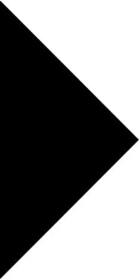
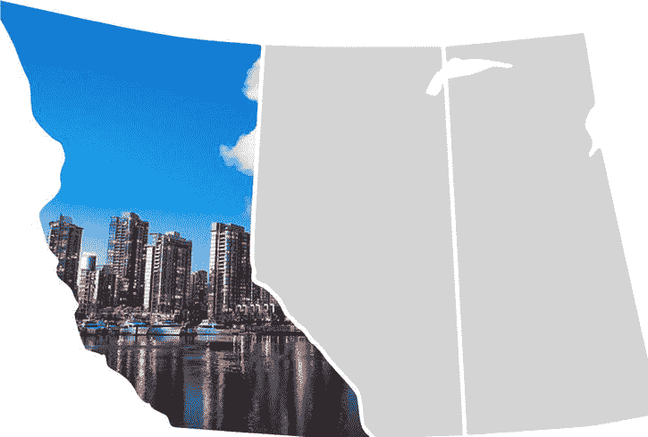
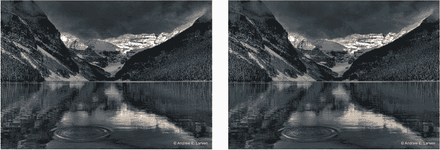
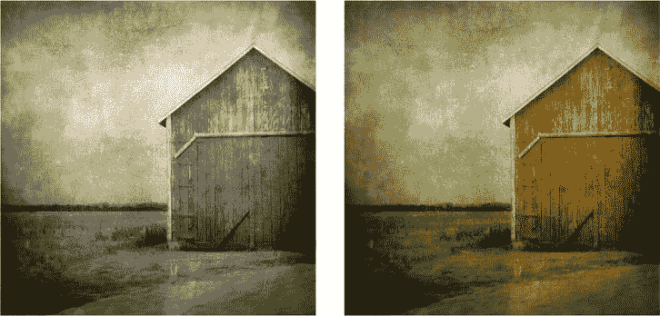
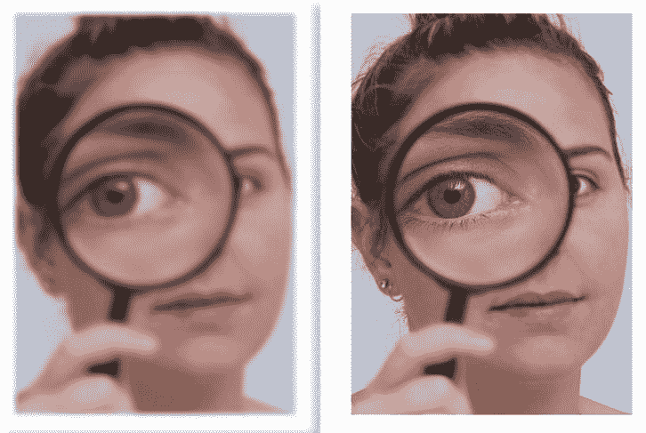

# 七、将 CSS3 动画与 SVG 和滤镜集成

每个支持 CSS 变换、过渡和动画的浏览器还支持 SVG(可缩放矢量图形)，这是一种长期以来被大多数 web 开发人员忽略的图像格式。在被 Internet Explorer (IE)忽略了十年之后，SVG 正在经历一场复兴，IE9 和所有其他现代浏览器都支持它，这使它非常适合部署在移动开发和其他用例中。正如您将在本章中看到的，CSS3 转场和关键帧可以很好地与 SVG 集成。

本章后半部分讨论的过滤器对 CSS 来说是新的，但在 SVG 中是标准化的。事实上，CSS 过滤器直接源自 SVG 标准。滤镜允许对 HTML 内容(尤其是图像)进行实时和交互式的可视化编辑，这在以前只能在 PhotoShop 中实现。作为一个 CSS 属性，滤镜可以很容易地被动画化，就像其他任何东西一样。

SVG 简介

SVG 是一种开放的、基于 XML 的格式。这个事实允许在普通的文本编辑器和几乎任何 web 开发语言中创建和修改 SVG 数据。SVG 支持它自己的渐变、交互性、文本和层，但是对于我们的目的来说，最重要的特性是这种格式描述了*矢量*形状。这意味着 SVG 图像可以缩放到任何大小或分辨率，或者以任何方式转换，而不会有任何质量损失。这种格式提供了基于文本的矢量信息描述，这一事实也使得 SVG 文件相对较小:例如，一个简单的 UI(用户界面)形状(如播放按钮)可以在 SVG 中描述为三个点和一种填充颜色，而不是单独定义的像素。这使得这种格式具有自然的响应性，非常适合移动设计、高 DPI 显示和 CSS 操作。

例如，考虑一个 UI 播放按钮元素。简化到绝对最小值，描述这种形状的 SVG 代码可能类似于清单 7-1 。

***清单 7-1 。**?? 一个简单的 SVG 文件*

```html
<svg version="1.1" FontName1">http://www.w3.org/2000/svg">
<polygon points="0,0 0,400 200,200 "/>
</svg>
```

SVG 数据可以直接在浏览器中查看。用文件名`play.svg`保存清单 7-1 中的代码，并将其加载到浏览器窗口中，得到如图图 7-1 所示的可视化结果。



图 7-1。浏览器中显示的 SVG 播放按钮

注意，SVG 多边形元素使用点来描述形状，类似于 imagemaps。最终，显示器必须将 SVG 元素呈现为像素，默认情况下，为多边形指定的点将映射到屏幕上的像素。(默认情况下，您的播放按钮将在浏览器中显示为 400 像素高、200 像素宽，并位于屏幕的最左上角。)最终，SVG 元素的最终呈现尺寸是任意的:按钮可以呈现为一英里高(如果您的屏幕足够大)或两厘米宽(例如，在打印的页面上)，除了所有其他因素，质量是相同的。

同样，与 imagemaps 一样，为 SVG 手工编写所有代码通常效率不高。对于许多任务，您会发现使用绘图应用并将结果导出为 SVG 文件要容易得多。(我将很快讨论这些工具。)

将 SVG 放在网页上

在 HTML 页面上放置 SVG 文件有三种主要方法:作为图像引用、内嵌在页面上(也称为*嵌入式* SVG)和作为对象引用。

SVG 作为内嵌图像

web 开发人员最熟悉的将 SVG 元素放入网页的方法是使用`标签。在你这样做之前，你的 SVG 代码必须包含更多关于其“自然”大小的信息(同样，保持代码绝对最小)，如清单 7-2 所示。

***清单 7-2 。*** SVG 代码准备作为图片插入到网页上

```html
<svg version="1.1" FontName1">http://www.w3.org/2000/svg" viewBox="0 0 400 400">
<polygon points="0,0 0,400 200,200 " fill="rgba(90,70,80,0.5)" />
</svg>
```

属性指定了一个 400×400 像素的“画布”。CSS 中没有为图像元素指定宽度或高度，当 SVG 元素作为标准 HTML 的图像放在页面上时，它为自己保留了 400 × 400 像素的“空间”,如清单 7-3 所示。

***清单 7-3 。**?? 一个 SVG 元素作为图像插入到网页上*

```html

```

您也可以在 CSS 中通常使用图像的任何地方引用 SVG 作为图像——例如，作为元素的背景(清单 7-4 )。

***清单 7-4 。*** 在 CSS 中应用 SVG 作为背景图片

```html
h1 { background: url(svg/wave.svg); }
```

虽然以这种方式引用外部 SVG 文件是最简单和最常见的方法，但它确实有几个缺点:

*   SVG 文件仅被视为图像；代码中编写的任何交互或脚本都将被忽略。
*   您不能“深入”SVG 代码，使用 CSS 直接改变元素的外观，这种自由度与内联 SVG 相同。

线 SVG〔??〕??㎡线

如果直接在页面上嵌入 SVG 数据，就需要在 SVG 代码中包含更多的信息。你需要提供元素的宽度和高度，要么作为属性(`viewBox`、`width`或`height`属性)，要么作为样式(见清单 7-5 )。

***清单 7-5 。*** 内嵌 HTML 应用 SVG

```html
<!DOCTYPE html>
<html lang=en>
<head>
<meta charset=utf-8>
<title > SVG Embedded File Example</title>
</head>
<body>
<h1 > Standard content</h1>
<svg version="1.1" FontName1">http://www.w3.org/2000/svg" style="width: 200px; height: 400px">
<polygon points="0,0 0,400 200,200"  />
</svg>
</body>
</html>
```

内联 SVG 节省了一个额外的 HTTP 请求，这对于移动页面尤其重要，因为移动页面普遍存在延迟。与简单地将文件作为图像引用相比，其他优点是能够用 CSS 直接影响 SVG 的外观。还支持与 SVG 的脚本交互。

内联 SVG 的主要缺点是它向 HTML 页面添加了更多的代码。

SVG 作为对象或 iframe 添加

将 SVG 作为对象或 iframe 添加到 web 页面是最古老的方法，在这种方法中，脚本交互性保留在元素内部(清单 7-6 )。

***清单 7-6 。*** SVG 作为对象或 iframe 应用于网页

```html
<object type="image/svg + xml" data="icon.svg">
Warning for older browsers, or alternative content
</object>

<iframe src="icon.svg">
Warning for older browsers, or alternative content
</iframe>
```

然而，作为一个`<object>`或`<embed` >标签应用，定制 SVG 元素外观的能力被最小化了。如果 SVG 内容溢出了它的容器，那么`<object` >或`<embed` >标签也可能和滚动条一起出现。

用 CSS 操作 SVG

正如可以用几种不同的方法将 SVG 放在网页上一样，也可以用几种不同的方法来处理 SVG 元素的外观。SVG 有自己的原生语法来实现某些视觉效果，这使得事情变得更加复杂。

在最简单的层面上，当 SVG 元素作为图像放在页面上时，您可以调整它的大小，如清单 7-7 所示。

***清单 7-7 。*** 内联 CSS 用于调整 SVG 元素的大小

```html

```

您还可以从嵌入或链接的样式表中改变元素的外观，就像您为任何其他类型的图像编写表示规则一样。(由于这个原因，页面上使用的 SVG 元素通常被赋予一个`id`属性。)

你可以在 SVG 文件中改变 SVG 形状的填充颜色，使用`fill`(见清单 7-8 )。(注意`fill`可以接受 CSS 中使用的任何颜色值:关键字、十六进制、rgb 或 hsl)。

***清单 7-8 。*** 填充属性用于给一个 SVG 多边形元素着色

```html
<polygon points="0,0 0,400 200,200 " fill="red" />
```

您还可以使用 SVG 文件中的嵌入样式表来更改填充颜色(清单 7-9 )。

***清单 7-9 。*** 用嵌入的样式表修改 SVG 元素的外观

```html
<svg version="1.1" FontName1">http://www.w3.org/2000/svg" viewBox="0 0 400 400">
<style type="text/css">
polygon { fill: blue; }
</style>
<polygon points="0,0 0,400 200,200" />
</svg>
```

最后，如果 SVG 文件直接嵌入到您的页面中，您也可以通过 CSS 来实现这一点(清单 7-10 )。

***清单 7-10*** 。使用嵌入的样式表修改内联 SVG 元素的外观

```html
<!DOCTYPE html>
<html lang=en>
<head>
<meta charset=utf-8>
<title > SVG Embedded File Example</title>
<style>
polygon { fill: red; stroke: black; stroke-width: 9px;  }
</style>
</head>
<body>
<svg version="1.1" FontName1">http://www.w3.org/2000/svg" style="width: 200px; height: 400px">
<polygon points="10,19 10,390 190,200"  />
</svg>
</body>
</html>
```

请注意，这并不意味着您可以像您所希望的那样，神奇地为任何 HTML 元素提供新的 stroke 或 fill 属性。这些属性专门应用于 SVG 内容。

您还可以检测 SVG 元素上的悬停，并改变 SVG 内容的外观作为响应(清单 7-11 )。

***清单 7-11*** 。SVG 元素上的 CSS 悬停检测

```html
polygon { fill: red; stroke: black; stroke-width: 9px;  }
polygon:hover { fill: black; }
```

注意，对按钮使用内嵌 SVG 有一个很小但很重要的优点:悬停的“热点”区域正好是多边形的形状。在标准位图图像上，无论图像的形状如何，该区域总是矩形的。

这意味着您也可以转换这些效果，就像您可以转换受 CSS 影响的任何其他元素一样。为了使 CSS 更加清晰和具体，我在 polygon 元素中添加了一个`id`，并在我的样式中这样处理，如清单 7-12 中的所示。(请注意，我还将多边形从边缘“向内”移动了一点，因为 stroke 添加到了形状的外部，就像 CSS border 添加到 HTML 元素一样。如果没有这一点，笔画的尖端将被 SVG“画布”的边缘切断，因为它延伸到它们之外)。

***清单 7-12 。**?? 一个 SVG 元素上的 CSS 过渡*

```html
<!DOCTYPE html>
<html lang=en>
<head>
<meta charset=utf-8>
<title > SVG Embedded File Example</title>
<style>
#play { fill: red; stroke: black; stroke-width: 9px;  transition: 1s all linear; }
#play:hover { fill: black; stroke: black; stroke-width: 9px;  }
</style>
</head>
<body>
<svg version="1.1" FontName1">http://www.w3.org/2000/svg" style="width: 200px; height: 400px">
<polygon id="play" points="10,19 10,390 190,200"  />
</svg>
</body>
</html>
```

任何可以应用于 HTML 元素的 CSS3 变换、过渡或动画也可以应用于 SVG，这使得矢量形状和 CSS 的结合非常强大。

动画 SVG 图像映射

在本练习中，您将使用 SVG 来复制 HTML imagemap UI 的功能，但是您将添加几个进化步骤:您的 SVG“image map”的各部分将屏蔽图像内容，当 CSS3 悬停在适当的区域上时，这些内容将被过渡(参见图 7-2 )。



图 7-2。一个 SVG 图像映射

首先，您需要一个 SVG 绘图。谢天谢地，网上有大量免费的 SVG 内容:在这种情况下，我将使用 Wikimedia Commons 提供的加拿大地图。为了便于说明，我把地图编辑成了不列颠哥伦比亚省、艾伯塔省和萨斯喀彻温省。

每个省由一条路径来区分，路径以坐标字符串的形式提供。我们首先在页面中内联 SVG，并在每个路径上创建一个简单的悬停效果。结果将类似于清单 7-13 中的。

***清单 7-13 。*** 在 SVG 图像上简单高亮显示

```html
<!DOCTYPE html>
<html lang=en>
<head>
<meta charset=utf-8>
<title > SVG Embedded File Example</title>
<style>
path { fill: #fdfdfd; }
path:hover { fill: red; }
</style>
</head>
<body>
<svg version="1.1"  xmlns:svg=http://www.w3.org/2000/svg
FontName1">http://www.w3.org/2000/svg" xmlns:xlink="http://www.w3.org/1999/xlink" x="0px" y="0px"
width="1000px" height="600px" viewBox="0 0 1000 660">
<path id="alberta" d="M1654.393,678.219 . . .>
<path id="british-columbia" d="M982.854,27.912l150.51,33.221c17.. . .>
. . .
</svg>
```

为了实现蒙版效果，你要在每条路径后嵌入每张“透明”图片，然后将路径转换成剪辑路径。您将通过引用图像的适当剪辑路径的 id 将元素关联在一起，并用`<g>`将元素分组在一起。

SVG 图像的开始代码，包括阿尔伯塔省的路径，看起来类似于清单 7-14 。

***清单 7-14*** 。图像的 SVG 剪辑路径

```html
<g>
<clipPath id="ab-clipper">
    <path fill="#D3D3D3" d="M1654.393,678.219 . . .>
</clipPath>
<image clip-path="url(#ab-clipper)" height="100%" width="100%" x="800" y="50"
xlink:href="lake-louise.jpeg" preserveAspectRatio="xMidYMin slice" />
</g>
```

`clipPath`在其中定义路径，作为引用`clipPath id`的元素的遮罩，就像`lake-loise.jpe` g 图像一样。图像元素被交叉链接到与地图相同位置的位图图片。图像被设置为其完整的“自然”宽度和高度，并在 x 和 y 轴上移动，直到它与路径位于相同的位置。(您可能需要将链接设置为剪辑路径，作为您对图像采取的最后一个操作；否则，当图像被遮盖并且可能不可见时，您将玩一个关于图像位置的猜谜游戏。

现在你已经创建了一个蒙版位图图像。显示这部分地图的 CSS(清单 7-15 )很简单。

***清单 7-15 。*** CSS 在一个 SVG 元素中显示悬停时的剪辑图像

```html
svg image { opacity: 0; transition: 400ms opacity ease; }
svg image:hover { opacity: 1; }
```

只有一个问题:裁剪路径是不可见的，这意味着在你的地图上有一个阿尔伯塔省大小的缺口。悬停效果有效，但是如果您将相同的效果应用到其他省份路径，用户将看不到他们的鼠标移动到哪里。一旦变成剪贴画，路径上的填充就没用了。你可以整天改变颜色，永远看不到任何不同。

解决方案是在代码中的剪辑路径和图像之间放置一个路径*的填充副本，如清单 7-16 所示。*

***清单 7-16 。*** 添加了复制填充路径的 SVG 中可见的裁剪区域

```html
<g>
<clipPath id="ab-clipper">
       <path fill="#D3D3D3" d="M1654.393,678.219 . . .>
</clipPath>
<path fill="#FF0000" d="M1654.393,678.219\. . . />
<image clip-path="url(#ab-clipper)" height="100%" width="100%" x="800" y="50"
xlink:href="wheat.jpeg" preserveAspectRatio="xMidYMin slice" />
</g>
```

位图图像(由 Kenny Louie 创作，在 Creative Commons: `http://flickr.com/photos/kwl/3102355428`下授权)仍然不可见，但它被渲染在复制路径的“上方”，因此当用户将鼠标悬停在复制路径填充的区域上时，它仍然会显示。

最后一步是链接 SVG 图像中的每个区域。链接位于 SVG 文件本身的每个组内部，并且需要使用`xlink`名称空间(清单 7-17 )。

***清单 7-17 。***SVG 中的链接裁剪图像

```html
<g>
<a xlink:href="http://www.hellobc.com/">
<clipPath id="bc-clipper">
    <path d=" M982.854,27.912l150.51,33.221c17.. . .>
</clipPath>
<path id="british-columbia" d="M982.854,27.912l150.51,33.221c17.. . .>
<image clip-path="url(#bc-clipper)" height="100%" width="100%" x="80" y="50"
xlink:href="false-creek.jpeg" preserveAspectRatio="xMidYMin slice" />
</a>
</g>
```

请注意，链接的区域沿着路径的边缘，就像真实的图像映射一样，并且过渡发生在同一区域内。

SVG 雪花动画

矢量形状的可伸缩性意味着您可以使用不同大小的 SVG 元素的多个副本，而不必担心图像质量。我将通过为季节性背景场景制作矢量雪花动画来演示这一点。(为此，我将使用在`http://upload.wikimedia.org/wikipedia/commons/5/50/Snow_flake.svg. See Figure 7-3`从维基共享下载的稍加修改的 SVG 雪花。)


图 7-3。静止来自一个 SVG 飘落雪花动画

首先，您要将雪花作为多个图像放在页面上。雪花将有不同的大小，并将在不同的位置开始，但它们将共享相同的动画特征:它们将从天空落下，在微风中横向漂移。(参见清单 7-18 。)

***清单 7-18 。*** SVG 雪花作为图片放置在页面上

```html


```

接下来，您将应用 CSS 通过渐变创建冬天天空的效果，并为雪花创建基本大小。同时，您将调用两个关键帧序列:一个是在雪花向底部下落时旋转雪花(称为雪)，另一个是将雪花从一边飘到另一边(漂移)。(参见清单 7-19 。)

***清单 7-19 。*** 基础 CSS 为雪花动画

```html
html { min-height: 100%; }
body { height: 100%; background: linear-gradient(#b5d3ff, #30509a); }
img.flake { width: 150px; height: 150px; position: relative;
animation: snow 8s linear infinite forwards,
drift 12s ease-in-out forwards infinite; }
```

关键帧序列以不同的长度运行，每个雪花从不同的高度开始(清单 7-20)；这种组合创造了随机循环运动的印象。

***清单 7-20 。*** 为雪花动画的关键帧序列

```html
@keyframes snow {
   100% { top: 700px; transform: rotate(2.2turn);  }
}

@keyframes drift {
    0% { left: -5px; }
    25% { left: 55px; }
    55% { left: -15px; }
    100% { left: 0px; }
}
```

这是可行的，但是如你所见，有两个问题。首先，要添加更多雪花，需要在标记中添加更多图像，这很快就会变得很累。第二个问题是，较小的雪花会被解释为距离更远，因此从屏幕底部落下需要更长的时间(在这个例子中，我们假设它的高度为 700 像素)。你可以通过使用添加的具有不同动作计时的类来调用雪花，如清单 7-21 所示。

***清单 7-21 。*** 通过创建二级类来减缓动画

```html
img.flake { width: 150px; height: 150px; position: relative;
    animation: snow 8s linear infinite forwards,
    drift 12s ease-in-out forwards infinite;
}
img.slow {
    animation: snow 16s linear infinite forwards,
    drift 24s ease-in-out forwards infinite;
}
```

分开的类意味着较慢的雪花可以通过调用两个类来控制。创建更多的变化意味着创建更多的类，这又回到了添加更多雪花的问题上。当你在第九章开始整合 JavaScript 和 CSS3 动画时，你会解决这个问题。

用于 SVG 的工具

目前，广泛使用 SVG 的最大障碍之一是设计工具的相对缺乏。最受欢迎的包括:

*   Adobe Illustrator 有一个 SVG 导出选项，但是，与许多所见即所得工具一样，它创建的代码并不十分高效:生成的 SVG 文件通常包含远远多于所需的代码。
*   开源软件 Inkscape ( `http://inkscape.org/`)与 Adobe Illustrator 面临同样的问题。然而，Inkscape 确实有处理本地 SVG 文件的优势，它支持 SVG 过滤器。
*   Raphaë是一个小型的 JavaScript 库，可以在 JavaScript 中轻松创建和操作 SVG。

CSS3 滤镜简介

CSS 过滤器允许在网页内容出现之前对其进行处理。最常见的(但绝不是唯一的)，这些过滤器适用于位图图像。滤镜极大地改变了典型的 web 开发图像制作工作流程:设计师可以从 PhotoShop 中优化和导出图像，而不是永久地“烘焙”图像像素中的视觉效果，这将保持相对不变，将视觉变化留给 CSS。

这意味着图像可以在 CSS 中动态修改，而不是必须在 PhotoShop 中重新编辑原始图像，导出它们，然后重新上传到服务器。这也意味着这些效果可以被动画化。

黑白/灰度滤镜过渡

灰度滤镜效果非常适合在线作品集或照片库。CSS 滤镜可以轻松地将彩色图像转换为黑白图像，而不是使用复杂的 JavaScript 或 Flash 解决方案。你可以在悬停时撤销这种转换，并附加一个过渡以缓解两种状态之间的转换，如图 7-4 中所示的图像(由 Andrew Larsen 在`www.flickr.com/photos/papalars/4013594219`创作，经知识共享许可)。参见清单 7-22 。



图 7-4。用 CSS(左)过滤的彩色图像(右)

***清单 7-22*** 。应用灰度滤镜过渡

```html
img { border: 20px solid #fff; box-shadow: 10px 10px 8px rgba(0,0,0,0.3); }
img.bw { filter: grayscale(1); transition: 1s filter linear; }
img.bw:hover { filter: grayscale(0); }


```

和我在本章中描述的其他滤镜一样，灰度滤镜采用介于 0(无效果)和 1(全效果)之间的值，浮点值介于两者之间。请注意，您不能平稳地过渡到“无”或未应用过滤器的状态；必须给过滤器一个新值。

棕褐色滤镜过渡

棕褐色滤镜可以用来创建一个“老化”的照片效果，如图图 7-5 (应用于 Robb North 的一张照片，`www.flickr.com/photos/robbn1/3650713106`)。



图 7-5。用 CSS(左)过滤的彩色图像(右)

实现图 7-5 所示效果的代码与灰度非常相似(见清单 7-23 )。

***清单 7-23*** 。在图像上过渡棕褐色滤镜的 CSS

```html
img { border: 20px solid #fff; box-shadow: 10px 10px 8px rgba(0,0,0,0.3); }
img.old { filter: sepia(1); transition: 1s filter linear; }
img.old:hover { filter: sepia(0); }


```

虽然图 7-5 中的谷仓照片之前已经在图像编辑器中处理过，添加了“风化”和部分晕影外观，但你只使用 CSS 为图像提供了棕褐色调。其他效果也可以用 CSS 添加。

显影宝丽来照片效果

通过用`div`包围图像并制作应用于容器元素的样式的动画，可以将滤镜和带有`inset`值的`box-shadow`组合起来，重新创建正在显影的宝丽来照片的外观。保存在里面的图像需要使用`z-index`被“推回”，这样`div`的内嵌内阴影就会覆盖它(见清单 7-24 )。

***清单 7-24*** 。用宝丽来效果转换图像

```html
div.polaroid { float: left; border: 25px solid #f3f4e3; border-bottom-width: 45px;
box-shadow: 0 0 200px 200px rgba(29,25,4,1) inset;
filter: sepia(.8);  transition: 3s all ease-in;  }
div.polaroid img { position: relative; z-index: -1; }
div.polaroid:hover { filter: sepia(.2); box-shadow: 0 0 50px 0 rgba(29,25,4,0.2) inset }

<div class="polaroid" >  </a>
```

模糊滤镜过渡

模糊滤镜需要小心使用；过度使用它们会使网站难以阅读或互动。模糊是为数不多的不采用 0 到 1 之间的值的滤镜之一。相反，它使用长度测量来设置模糊量。(参见图 7-6 ，其中使用了 Louise Docker 的另一幅知识共享图像`www.flickr.com/photos/aussiegall/6311469113` `.`)



图 7-6。使用 CSS 模糊(左)过滤的彩色图像(右)

请注意，模糊效果会延伸到整个图像，包括边框和阴影。通过使边框和阴影成为第二个父元素(如`div`)的属性，可以限制模糊的程度。(参见清单 7-25 。)

***清单 7-25*** 。将模糊滤镜应用于图像

```html
img { border: 20px solid #fff; box-shadow: 10px 10px 8px rgba(0,0,0,0.3); }
img.old { filter: blur(2px); transition: 1s filter linear; }
img.old:hover { filter: blur(0px); }
```

摘要

SVG 和滤镜是可以添加到 CSS 动画中的两个最强大的功能。SVG 允许无分辨率的过渡和动画，而过滤器允许快速的客户端视觉图像处理。

SVG 十几年了；CSS 滤镜是全新的。两者都立即受到你用它们创造的东西是单一的这一事实的限制:你的创造不能立即被重复。在屏幕上制作一个元素的动画很容易，您可以重用该动画来制作另一个元素的动画，但是每个新元素都必须单独创建。

您可以使用 JavaScript 来简化、增强和改变您的 CSS3 动画和过渡，轻松地复制动画元素并制作新的动画，您将在下一章中探索这一功能。