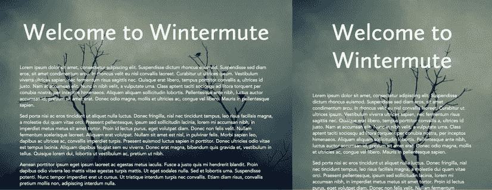
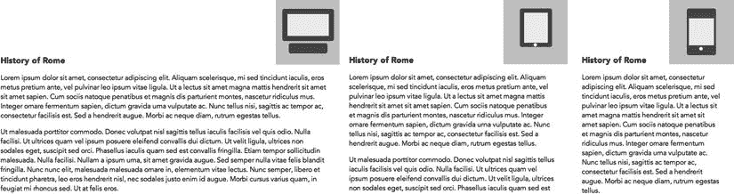

# 八、将 CSS3 动画与响应式网页设计和 JavaScript 整合

现在是时候把你到目前为止看到的所有元素放到你的网页上了。要做到这一点，你需要将 CSS3 转换、过渡和动画与当前的网站开发原则相结合，包括响应式网页设计(RWD) 。

在基本层面上，一个响应式网站将由一个流动的设计组成，大多数元素以百分比、`rem`、`em`、`vh`或`vw`单位来衡量，而不是像素，结合一系列在 CSS 媒体查询中定义的 CSS *断点*。这些断点的位置通常由浏览器宽度(更准确地称为*视窗*)改变时页面设计“中断”的值来定义。为了方便起见，这些值通常用像素来度量，尽管有很好的理由用 rems 或 ems 来度量，以尽可能脱离“屏幕尺寸”的概念

使用响应式 web 设计原则设计网站，可以让访问者在使用各种设备访问网站时获得流畅、连续和不间断的体验:桌面浏览器、平板电脑、手机和其他设备。

在设计失败的宽度处指定断点是一个很好的做法，而不是使用最新 iPhone 或 iPad 型号的显示尺寸。移动设备变化很快，智能手机和平板电脑的种类比大多数人意识到的要多得多，尤其是在 Android 市场。让网站响应与你的设计相关的尺寸要比今年技术的任意分辨率好得多。

在每个断点处，您指定布局中的更改:元素被调整大小或重新定位，以及出现或消失。一个*移动优先*的理念颠倒了典型的开发过程:从一开始你就为小屏幕(水平分辨率为 320 像素或更低)设计一个站点，并随着视窗的扩大调整页面，让站点有更多的空间“呼吸”Mobile first 的优势在于，在大多数移动设备的空间和带宽都非常有限的情况下，它可以让你集中精力开发网站绝对需要的功能。

 **注意**一般来说，移动用户在使用桌面浏览器时，应该拥有完全相同的工具、导航和网站功能。在响应站点中为移动用户删除一个特性之前，考虑一下这个组件是否是必需的。

许多 web 开发人员纯粹从`@media`查询的角度考虑响应式 web 设计。虽然查询是一个非常重要的组件，并且将是这里的重点，但重要的是要理解许多响应式解决方案将需要 JavaScript 和 PHP 等服务器端解决方案的额外贡献(通常称为 *RESS:响应式设计+服务器端组件*)。

在这一章中，我将重点介绍如何使用 CSS 动画来简化响应页面中断点之间的转换。应该注意的是，虽然设计师们喜欢这个东西——你可能会发现自己不断地来回拖动浏览器窗口的右下角来欣赏你将要创造的效果——但你的许多用户永远不会看到它。大多数访问者在访问网站时，浏览器的宽度是固定的，并且在整个访问过程中保持不变，尤其是移动用户，他们没有改变视窗大小的选项。因此，你将在本章中探索的许多技术应该被认为是“最好拥有”的，而不是必需的。

在这一章的后面，你将会看到 JavaScript 如何与 CSS3 动画和过渡集成，以使它们更加有效和高效。

在无过渡的响应式网页设计中调整元素大小

使用我上面讨论的原则，您可以在调整视窗大小时“动画化”网页内容，而根本不需要使用过渡或关键帧动画。

动态调整图像和视频的大小

首先，你将根据视窗大小调整图像和视频的大小(见图 8-1 )。


图 8-1。页面内响应图像的两种状态

通过相对于元素的容器调整元素的大小，您可以在调整浏览器窗口大小时平滑地“激活”元素的大小。严格来说，这根本不是动画。在这个阶段，你只是通过相对于它的容器缩放来动态地调整图像的大小(见清单 8-1 )。

***清单 8-1。*** 一个有求必应的形象

```html
html { font-size: 62.5%; } 
p { font-size: 1rem; }
.left { max-width: 100%; height: auto; float: left; margin-right: 2rem; margin-bottom: 1rem; }
<section>
<p>Lorem ipsum dolor sit amet. . .
</section>
```

当用户调整浏览器大小时，他们会有图像(由 filtran，`www.flickr.com/photos/filtran/2978448269/`)被动态调整大小的印象。如果浏览器设置得足够宽，照片将以其自然大小显示，但会缩放以适应无法包含其完整尺寸的视窗宽度。

这种方法有两个可能的缺点:根据图像相对于正文文本的初始原始大小，图像可能在大或小的屏幕宽度下显示超出比例。或者，可以将图像设置为其容器宽度的百分比，以便它在整个视口范围内缩小。例如，假设您已经确定段落的整体尺寸为 900 像素宽，每个尺寸(文本行)为 90 个字符。给定 HTML 和段落的表示规则，这意味着 section 元素的宽度等于 90rem。图像的自然大小为 425 像素宽。要使图像完全可缩放，您需要将所有这些值转换为百分比:

```html
425 / 900 = 0.4722
```

这意味着图像占据了段落宽度的 47.22%，并转化为你在清单 8-2 中看到的 CSS。

***清单 8-2 。*** 一个交替反应的形象

```html
section { max-width: 90rem; }
.left { width: 47.22%; height: auto; float: left; margin-right: 2.5%; margin-bottom: 2%; }
```

CSS 声明的这种组合将创建如图 8-2 所示的页面外观。


图 8-2。备选响应图像

剩下的一个问题是在极端的视口尺寸下创建非常大或非常小的图像的可能性。你可能希望通过设置图像的最小和最大尺寸来保护设计(见清单 8-3 )。

***清单 8-3 。*** 具有最小和最大尺寸的响应式图像

```html
.left { width: 47.22%; height: auto; float: left;
    margin-right: 2.5%; margin-bottom: 2%;
    max-width: 425px; min-width: 150px;
}
```

您可以使用相同的技术在`<video>`元素上实现相同的效果。(通过 YouTube 或 Vimeo 等服务嵌入视频时，让视频变得有响应性要复杂得多；我推荐 Dave Ruppert 在`http://fitvidsjs.com/`的 FitVids JQuery 插件来实现这一点。

 **提示**不使用关键帧、过渡或媒体查询也可以动态调整文本大小。`vw`单位测量视窗宽度:`1vw`是浏览器窗口宽度的 1/100 <sup>th</sup> 。因此，如果视口宽度为 400 像素，`1vw`将等同于`4px`。当浏览器调整大小时，您可以使用此单位来缩放文本:

`h1 { font-size: 4vw; }`

有了这个 CSS，网页上的 h1 元素会随着浏览器的伸缩而调整大小。你也可以在其他元素上使用 vh 和 vw。

响应背景图像

通过使用`background-size`属性(这里使用的是 Vinoth Chandar 在`www.flickr.com/photos/vinothchandar/6168933212/`的一幅图像)，你可以很容易地动态调整背景图像的大小，以响应视窗的变化，如清单 8-4 所示。

***清单 8-4 。*** 一幅有求必应的背景图像

```html
html, body { min-height: 100%; font-size: 62.5%; }
body { background-image: url(fog.jpg); background-size: cover; } 
```

结合一些正文，这给出了如图 8-3 所示的效果。


图 8-3。有反应的背景图像

有关“过渡”背景图像的其他方法，请参见第三章。

使用过渡调整响应式网页设计中元素的大小

在@media 查询断点之间转换元素是完全可能的。从设计的角度来看，需要注意的主要问题是元素在调整视窗大小时可能会在不同状态之间“跳跃”,这可能会让用户感到惊讶。

让我们创建一个设计，在页面中间有一个大的 h1 元素，在一张照片的上面(清单 8-5 )。

***清单 8-5 。*** 用于响应背景图像和过渡文本的 HTML

```html
body { background-image: url(fog.jpg); background-size: cover;
     background-repeat: no-repeat; color: #fff; font-family: Avenir, Arial, sans-serif;
}
h1 { font-family: 'Calluna Sans', Arial, sans-serif; text-align: center;
      font-size: 10rem; margin: 8rem auto;
}
```

随着视窗变窄，标题文本会自然地在空格处断开，如图图 8-4 所示。



图 8-4。一个无响应的标题元素在一个狭窄的视口下的空间上断开

相反，如果我们想让标题保持在一行，我们可以减小断点处的文本大小，并在它们之间转换，如清单 8-6 所示。

***清单 8-6 。*** 用于响应背景图像和过渡文本的 HTML

```html
h1 { font-family: 'Calluna Sans', Arial, sans-serif;
    text-align: center; font-size: 10rem; margin: 8rem auto; transition: 1s font-size linear; 
}
@media screen and (max-width: 1100px) { 
        h1 { font-size: 8rem; } 
} 
@media screen and (max-width: 900px) { 
        h1 { font-size: 7rem; }
} 
@media screen and (max-width: 800px) { 
        h1 { font-size: 6rem; } 
}
```

清单 8-6 中的代码给出了如图图 8-5 所示的结果。


图 8-5。响应式标题元素

用 CSS3 媒体查询和过渡指示视窗大小

使用媒体查询，您可以在浏览器变窄时触发元素的外观“变形”——例如，在响应页面中显示不同的查看模式，以便用户了解他们不是在移动平台上查看桌面站点的简单解释，而是在查看根据浏览器窗口的大小进行自我定制的页面(参见图 8-6 )。



图 8-6。三种不同状态的响应转换符号，代表三种不同的视窗尺寸

首先，您将设置一系列断点:

*   120em 宽及以上将被视为“宽屏”。
*   在 80em 宽的情况下，你可以假设用户正在用平板电脑浏览网站。
*   在 40em 及以下，你应该假设用户正在使用智能手机。

接下来，您将创建用于从纯 CSS 中显示这些不同状态的元素。总共有三个元素:一个包含`div`的元素，它有一个绝对位置，将所有的元素保持在屏幕的右上角；一个`span`代表显示器，另一个`span`代表底座或按钮，如清单 8-7 中的所示。

***清单 8-7 。*** 响应页面中转换显示模式的 HTML 代码

```html
<div id="viewingmode">
        <span id="display"></span>
        <span id="buttonbase"></span>
</div>
```

接下来，您将为清单 8-8 中的元素创建基本 CSS。这将包括过渡设置。

***清单 8-8 。*** CSS 代码创建响应式设计中的查看模式符号

```html
* { box-sizing: border-box; }
body { font-family: Avenir, sans-serif; margin: 100px 0; }
#viewingmode {
    width: 150px; height: 150px; background: rgba(0,0,0,0.2); 
    position: absolute; top: 0; right: 0; text-align: center;
}

/* screen, in default widescreen presentation */

#display {
    width: 80%; height: 50%; border: 12px solid #585858;
    border-radius: 5px; margin-top: 20px; background-color: #eee; 
}

/* base, in default monitor stand - keyboard configuration */

#buttonbase {
    width: 90px; border: 12px solid #585858; border-radius: 5px;
    position: absolute; top: 100px; left: 30px; transform-origin: 25px 5px;
}
#display, #buttonbase { display: inline-block; transition: .5s all linear; }
```

最后，您将创建媒体查询来改变`#display`和`#buttonbase`元素的外观(清单 8-6 )。请注意，这些更改是级联的:较小的屏幕尺寸将继承在较大屏幕的媒体查询中所做的更改。

***清单 8-6 。*** CSS 代码创建响应式设计中的查看模式符号

```html
@media screen and (max-width: 80em) {
    #display { width: 50%; height: 60%; border: 10px solid #585858; }
    #buttonbase { width: 8px; height: 8px; border: none; 
        border-radius: 50%; background: #fff; top: 101px; left: 70px; }
}
@media screen and (max-width: 40em) {
    #display { border-width: 23px 5px; width: 45%; height: 73%; }
    #buttonbase { top: 110px; }
}
```

如上所述，大多数用户——尤其是移动用户——不会看到这些动画，因为移动设备的屏幕宽度是固定的，没有什么可调整的。另一种方法可能是显示屏幕处于纵向还是横向模式，如清单 8-7 所示。

***清单 8-7 。*** 媒体查询以在设备上显示横向和纵向模式

```html
@media screen and (orientation: landscape) and (max-width: 80em) {
    #display { transform: rotate(90deg);    } 
   }

```

这就产生了你在图 8-6 中看到的变化显示，当视口根据设备的方向调整大小时，每个设备“变形”到下一个。同样的原理也可以应用于动画网页的不同方面。

为移动设备优化 CSS 过渡和动画

随着时间的推移，移动设备中的处理器不可避免地会变得更快、更强大，但它们将永远落后于全台式机型号的能力。同样不可避免的是，开发人员将倾向于在他们的鼻子前面为平台编码，而不是他们的观众可能在使用什么(正如我们在浏览器战争和供应商前缀偏见中看到的)。开发人员为他们面前的屏幕编写代码，其结果可能并不总是符合移动设备更受限制的能力。

有几种方法可以改善在移动设备上运行缓慢的 CSS 效果:

*   *尝试通过设备的 GPU 进行过渡和优化*:由于其更复杂和要求更高的性质，许多浏览器会尝试通过运行 CSS 动画的设备的专门图形处理单元来平滑 3D 变换、过渡和动画(在第九章中介绍)。你可以通过一个“空的”3D 操作启动 CSS 声明块来搭这个优化流的顺风车，这个操作不会在视觉上改变元素，但会允许 GPU 访问同一个声明中的 2D 变换:

    ```html
    transform: translate3d(0,0,0);
    ```

 **注意** Remy Sharp 在`www.youtube.com/watch?v=IKl78ZgJzm4`的 YouTube 上有一个非常有效的视频，展示了通过设备的 GPU 进行过渡和优化的优势。

*   *使用媒体查询*限制或替换动画:您可以通过在`@media`查询下创建不同版本，为移动设备设置更多受限版本的动画。
*   *确保包含动画元素的页面将完全缩小到移动屏幕大小*:边缘被剪掉的动画在移动设备上显然不好看或不能有效地运行。

将 CSS3 媒体查询与 SVG 集成

您还可以使用媒体查询(以及其他 CSS3 特性)来定位 SVG 中的元素。

就像 Adobe PhotoShop 和其他图形应用一样，SVG 包含了多层的概念。这意味着您可以将多个图形合并到一个 SVG 文件中，并使用 CSS 切换每个图形的可见性。

让我们回到把图标放在浏览器窗口右上角的想法，但是改为把它们做成 SVG 在这种情况下，一系列不同体型的分组 SVG 图纸，包括*中胚层*和*外胚层*类型。为了节省空间，简化的清单 8-8 中只显示了第一种体型的代码。

***清单 8-8 。*** 多个图层的 SVG 文件

```html
<svg version="1.1" width="142px" height="340px" 
viewBox="0 0 142 340">
<style>
    g { visibility: hidden;  }
    g:target  { visibility: visible;  }
</style>
    <g id="ectomorph">
            <path d="M11.356,682.57c5.297,6.354,10.253,10.084,17.781,14.844
             C18.907,694.043,15.905,690.475,11.356,682.57z"/>
. . . .
    </g>
<g id="mesomorph">
    <path d="M9.981,679.538c0,0-8.719,7.188-8.719,17.125 . . ." />
. . . .
```

`</g>`


图 8-7。SVG 矢量图形的不同命名层相互叠加

每个分组的 SVG 图都是一层一层的，如图 8-7 所示。然后用 CSS 隐藏这些层。如果 URL 指向某个组，嵌入样式表中的下一行将打开该组的可见性。您可以使用 CSS 将 SVG 文件作为背景图片放在`div`中，如清单 8-9 中的所示。

***清单 8-9 。*** 多个图层的 SVG 文件

```html
div#shapes { background-image: url('bodyshapes.svg#mesomorph');
position: absolute; top: 0; right: 0; width: 145px; height: 355px;  }
```

使用相同的定位技术，您可以交换用于`div` ( 清单 8-10 )背景图像的 SVG 文件中的图层的可见性。

***清单 8-10 。*** 多个图层的 SVG 文件

```html
@media screen and (max-width: 1000px) { 
    div#shapes { background-image: url('bodyshapes.svg#ectomorph); } 
}
```

最后，应该注意的是，SVG 元素可以使用`<animate />`元素来制作动画，如果 SVG 被直接插入到页面上，而不是被用作背景图像，那么每个层的可见性都可以使用过渡来制作动画。

用 JavaScript 触发 CSS3 转换

JavaScript 可以用来触发 CSS3 中的过渡和动画。例如，当用户到达页面底部时，你可以让元素淡入以增加他们对相关内容的兴趣(见图 8-8 )。CSS 无法检测滚动条的状态——您需要使用 JavaScript 来完成这项工作，然后使用 CSS3 将出现的元素制作成动画。


图 8-8。用 JQuery 触发的 CSS 转换制作页脚元素动画

 **注意**有一种观点认为，如果你用 JavaScript 开始制作动画，你也可以继续用同样的语言来制作动画。然而，正如在第一章中所讨论的，CSS3 过渡将会更加平滑和高效，并且将会获得比 JavaScript 更高的帧速率。JQuery Transit ( `http://ricostacruz.com/jquery.transit/`)和 Move.js ( `http://visionmedia.github.com/move.js`)等库越来越多地被用于将 JavaScript 与 CSS3 过渡和动画方法挂钩，这是有原因的。这种功能分离反映了内容、表示和行为之间的分离:在这个例子中，JavaScript 用于检测 DOM 事件，CSS 用于向内容呈现外观上的变化。

首先，让我们假设你有足够的内容来填充视窗:我将在清单 8-11 中显示一个标题和一段 *Lorem ipsum* 填充文本，以指示正文的开始。在页面的最底部，你会在一个`footer`元素中看到两个链接。第一个链接将引导用户到逻辑上“先前”于他们当前所在页面的内容；右边的第二个链接将引导他们进入当前页面之后的“下一个”页面。为了节省空间，我在链接中使用了 Unicode 黑色的向左和向右的三角形:你应该分别使用合适的 HTML 实体`(&#9664;`和`&#9654;`。

***清单 8-11 。*** 超长页面的 HTML 代码，页脚中的内容采用 JavaScript 和 CSS3 转换

```html
. . .
   <script src="//ajax.googleapis.com/ajax/libs/jquery/1.8/jquery.min.js"></script>
</head>
<body>
<article>
    <header><h1>A History of the Roman Empire</h1></header>
    <p>Lorem ipsum dolor sit amet, consectetur adipiscing elit. . .

<footer id="articlefooter">
    <a href=# id=prevpage>◀Cicero and Claudius</a>
    <a href=# id=nextpage>Caligula and Ceasar ▶</a>
</footer>
</article>
</body>
```

文章中的内容应该将`footer`推到视窗底部边缘以下。您将设计页面样式，稍微缩进`footer`中的链接，并通过降低它们的不透明度使它们不可见(清单 8-12 )。

***清单 8-12 。*** 带页脚导航页面的基本 CSS 代码

```html
body { font-family: Avenir, sans-serif; margin: 100px 0; }
article { width: 768px; margin: 0 auto; }
footer#articlefooter { padding: 0 25px; } 
footer#articlefooter a { 
    text-decoration: none; color: #000; opacity: 0;  position: relative; 
} 
footer#articlefooter a img { width: 77px; height: 77ps; vertical-align: middle; }
a#prevpage { padding-left: 70px; float: left; transition: 1s 1s opacity linear, 1s 1s translateX ←linear; }
a#nextpage { padding-right: 70px; float: right; transition: 1s .5s opacity linear, 1s 1s ← translateX linear; }
```

您已经将 CSS3 转换代码与链接相关联:如果它们同时被触发，与`#nextarticle`元素相关联的`.linkmoveright`将首先移动。短暂的延迟之后，紧接着是与`#prevarticle`相关的`.linkmoveleft`级。

请注意，通过声明您正在更改的属性，您已经使转换更加有效:因为它们是多个属性，所以您使用了由逗号分隔的重复。

与其将元素的变化与`:hover`或`:focus`伪选择器相关联，不如将它们定义为一个新的类(参见清单 8-13 )。

***清单 8-13 。*** 变换为页脚导航元素

```html
.linkmoveleft { transform: translateX(-70px); opacity: 1; }
.linkmoveright  { transform: translateX(70px);  opacity: 1; }
```

最后，您将在页面的最底部添加一个脚本，它将查看一些变量并判断何时将这些类添加到元素中。

如清单 8-14 中的所示，`articleheight`变量决定了主体的总高度，包括其所有内容。`scrollTop`测量页面中有多少像素比浏览器窗口的顶部边缘*高:这将是页面加载时的`0`，随着用户向下滚动，该值增加。通过将`articleheight`除以 2 并将结果与`scrollTop,`进行比较，您可以确定用户何时滚动了半个页面，然后应用这些类(**清单 8-14 )。*

***清单 8-14 。*** JQuery 代码将类放置在导航页脚元素上

```html
<script>
$(function() {
    var articleheight = $("body").height();
    $(window).scroll(function() {
        if ($(this).scrollTop() > (articleheight / 2)) { 
              $("#prevpage").toggleClass("linkmoveleft"); 
              $("#nextpage").toggleClass("linkmoveright");

    });
}); 
</script>
```

CSS3 transitions 将响应于与它们相关联的元素状态的任何适当变化而触发，无论这些变化是由 CSS、JavaScript 还是其他任何东西强加的。在这种情况下，使用 JQuery 放置包含元素不透明度和位置更改的新类就足以引发转换。

虽然这是可行的，但仔细观察结果会发现这种方法有几个可能的缺点:

*   特别长的文章的正文可能会超过浏览器窗口高度的两倍。清单 8-14 的脚本中的比较意味着对于这样的文章，过渡可能会在用户到达页面底部之前触发(也就是说，在阅读了一半以上的文章后，他们可能仍然看不到页脚)。
*   `toggleClass`函数意味着当用户向上滚动时，JQuery 将尝试撤销对这些类的应用，当用户返回页面底部时，JQuery 将再次触发它们。这种反复的转变可能会令人讨厌。
*   最后，我们假设页脚总是与页面底部一致。这不一定是真的:页脚下面可能会有注释，这会显著增加文章的整体高度，导致 JavaScript 过早地应用这些类。

 **注意**在 HTML5 规范下，嵌套在另一篇文章中的文章元素被假定为包含对父文章的评论。

另一种方法是，当页脚清楚地显示在页面上时，只应用一次过渡(清单 8-15 )。

***清单 8-15 。*** 改进了 JQuery 代码，将类放置在导航页脚元素中

```html
$(function() {
    var footerBottom = $("#articlefooter").offset().top + $("#articlefooter").height(); 
       $(window).scroll(function() {
            if ($(this).scrollTop() > (footerBottom - $(window).height())) { 
                     $("#prevpage").addClass("linkmoveleft"); 
                     $("#nextpage").addClass("linkmoveright"); 
                 }
           });
});
```

如果您想支持 Internet Explorer 6 到 8，您可以使用 Modernizr ( `http://modernizr.com/`)来检测浏览器对 CSS 转换的支持。如果浏览器缺乏支持，JQuery 可以依靠动画元素本身(见清单 8-16 )。

***清单 8-16 。*** 改进了 JQuery 代码，将类放置在导航页脚元素中

```html
<script src=//ajax.googleapis.com/ajax/libs/jquery/1.8/jquery.min.js></script>
<script src=scripts/modernizr.js></script>
</head>
<body>
<article>

. . .

</article>
<script>
$(function() {
    var footerBottom = $("#articlefooter").offset().top + $("#articlefooter").height();
    $(window).scroll(function() {
        if ($(this).scrollTop() > (footerBottom - $(window).height())) { 
             if (Modernizr.csstransitions) {
                         $("#prevpage").addClass("linkmoveleft"); 
                         $("#nextpage").addClass("linkmoveright");
                             } else { 
                        $("#prevpage").animate({ opacity: 1, left: '-=70'}, 1000, function() { });
                        $("#nextpage").animate({ opacity: 1, left: '+=70'}, 1000, function() { });
                           }
                 }
    });
}); 
</script>
```

如果你想创建一个更复杂的效果，你可以编写关键帧动画，或者将它们作为类应用，如清单 8-16 中的所示，或者直接使用 JQuery 调用动画。最后一个例子，您将使用后一种方法，调用关键帧动画来复制您刚刚创建的带有过渡的效果(清单 8-17 )。

***清单 8-17 。*** JQuery 代码用于应用 CSS3 动画

```html
@keyframes leftmove { 
        100% { transform: translateX(-70px);  opacity: 1; }
}

@keyframes rightmove { 
        100% { transform: translateX(70px);  opacity: 1; }
}

<script>
$(function() {
    var footerBottom = $("#articlefooter").offset().top + $("#articlefooter").height();
    $(window).scroll(function() {
        if ($(this).scrollTop() > (footerBottom - $(window).height())) { 
              $("#prevpage").css('animation', 'leftmove 1s 2s forwards');
              $("#nextpage").css('animation', 'rightmove 1s 1s forwards');
    });
});
</script>
```

 **注意**通过使用`form`标签和`checkbox`按钮，清单 8-17 中显示的技术可用于避免第四章中演示的语义可疑的交互方法。您可以简单地使用 JavaScript 来检测任何元素上的 DOM 事件，并启动其他元素上的 CSS3 转换、过渡和动画，而不是跳过标记环来获得您想要的 CSS 结果，如清单 8-18 所示。

***清单 8-18 。*** JQuery 代码用于在点击时应用 CSS3 动画

```html
$(function() {
    $("#at").click(function() { $(".box").toggleClass("wobble"); });
});

```

用 JavaScript 定制 CSS3 过渡

在第六章中，你看到了用 CSS3 制作多个 SVG 元素的动画。当你这样做的时候，你会遇到一个主要的问题:为了制作元素动画，你必须在页面上将它们创建为单独的元素，这使得创建随机性的外观变得困难(见图 8-9 )。


图 8-9。用 CSS3 制作的随机元素动画

为了减少您必须在任何页面中进行的手工编码，您将使用 JavaScript 来解决这两个问题。为了简单起见，您使用红色的`div`元素作为动画对象。在页面底部，你将添加清单 8-19 中的脚本。

***清单 8-19 。*** JavaScript 代码创建随机分散元素

```html
<script>
var html = [];
for (i = 0; i < 30; i++) {
    var randomX = Math.random() * (100 - 1) + 1;
    var randomY = Math.random() * (1200 - 1) + 1;
    var randomZ = Math.random() * (100 - 1) + 1;
html.push('<div style="left:'+randomX+'%;top:'+randomY+'px;width:'+randomZ+'px;height: ←'+randomZ+'>
</div>');
}
    $("body").append( html.join('') );
</script>
```

您可以使用一个 JavaScript 循环来创建任意多的`div`元素的副本。对于每个元素，您将使用三个变量来确定其水平位置、距视口顶边的偏移量以及水平和垂直大小。

然而，你拥有的许多元素都将遵循相同的关键帧动画规则，如清单 8-20 所示。

***清单 8-20 。*** JavaScript 代码创建随机分散元素

```html
html { height: 100%; }
body { min-height: 100%; margin: 0; }
@keyframes snowflake { 
        100% { transform: translateY(1800px) rotate(1200deg);  }
}
div { background: red; position: absolute; animation: snowflake 40s linear infinite;  }
```

虽然这种方法可行，但有几个问题:所有的形状都以相同的速度下落，并同步转动。小的元素看起来离得更远，应该下落得更慢，而所有的元素都应该以随机旋转开始。为了实现这一点，您将创建几个类，这些类将调用具有不同计时的关键帧动画，并根据元素的大小用 JavaScript 应用这些类(清单 8-21 )。

***清单 8-21 。*** CSS 和 JavaScript 代码创建随机化的分散元素

```html
<style>
@keyframes snowflake { 
    100% { transform: translateY(1800px) rotate(1200deg);  }
}
div { background: red; position: absolute; 
animation-name: snowflake; 
animation-iteration-count: infinite;
animation-timing-function: linear;
}
.small { animation-duration: 40s; }
.medium { animation-duration: 20s; }
.large { animation-duration: 10s; }
</style>

<body>
. . .
</body>

<script>
var html = [];
for (i = 0; i < 30; i++) {
    var randomX = Math.random() * (100 - 1) + 1;
    var randomY = Math.random() * (1200 - 1) + 1;
    var randomZ = Math.random() * (100 - 1) + 1;
    var randomR = Math.random() * (360 - 1) + 1;
    var sizes = ['small','medium','large'];
    var dim = sizes[Math.round(randomX/50)];
    html.push('<div style="left:'+randomX+'%;top:- ←
'+randomY+'px;width:'+randomZ+'px;height:'+randomZ+'px;transform:translateY(0px) ← 
rotate('+randomR+'deg)" class='+dim+'></div>');
}
$("body").append( html.join('') );
</script>
```

这段 JavaScript 代码是基础的，还可以做得更深入，但是需要注意的重要方面是，您正在利用每种技术的核心优势:您使用 CSS 提供外观规则，使用 JavaScript 对 DOM 进行快速更改。

摘要

本章介绍了 CSS3 动画、转换和过渡与响应式 web 设计、JavaScript 和 SVG 的集成。通过使用百分比和 vw 单位缩放内容，并使用`@media`查询在断点处动画化元素，您可以创建“动画”元素的印象来响应视窗大小调整。

您还可以使用 JavaScript 为 CSS 本身无法检测的动画提供触发点，并使用脚本语言为动画序列制作多个随机的“克隆”元素。这些技术的集成可以更进一步:一个很好的例子是 Sebastian Markbå ge 通过使用 SVG 路径数据生成关键帧动画声明(`http://csspathanimation.calyptus.eu/`)来解决让元素以恒定的运动速度跟随复杂路径的技术难题。

在本书中，到目前为止，您一直在使用 CSS3 在页面的平面上移动元素。在下一章中，你将在 3D 空间中操作 HTML 元素。