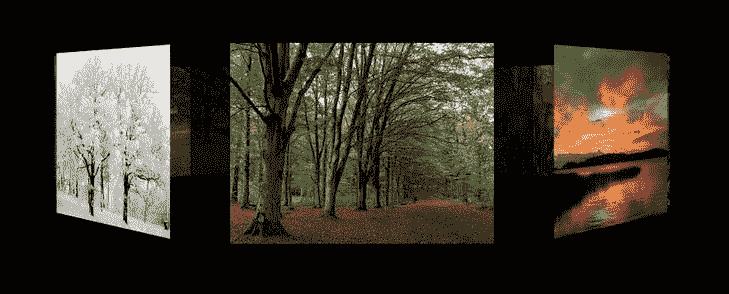

# 九、CSS3 3D 变换、过渡和动画

到目前为止，您已经在视口的平面空间中操作了图像、UI 元素和其他 web 内容。但是使用`scale`变换并不一定意味着一个元素离观察者更远，只是意味着它更大或更小；使用标准的 CSS 无法传递真实的透视感或深度感。

CSS 变换模块的 3D 属性改变了这一切。3D 变换允许您在投影的 3D 空间中操作内容。然后，可以使用您在前面章节中探索过的转场或关键帧语法来制作这些 3D 投影元素的动画。

3D 转换是 CSS3 的一个方面，在浏览器中往往*而不是*降级:如果客户端不理解 3D 转换声明，元素通常会堆叠出现。在旧浏览器中呈现元素之前，您应该仔细考虑这一点

尽管 CSS 3D 转换可以这样使用，但它并不打算使整个网站成为一个“3D 环境”，在这个环境中，浏览器窗口在一个页面和另一个页面之间旋转。更确切地说，新属性的使用通常与 CSS 的其他部分非常相似:为网页上的一些元素做出表示选择。通过 WebGL 之类的技术，创建 3D 内容的整个“世界”并与之交互最好是留给`canvas`元素的上下文。

由于计算要求更高，3D 变换被直接传输到客户端的 GPU，从而在动画过程中提供高帧速率。

视角

在 3D 空间转换 HTML 元素的关键是`perspective`，可以指定为 CSS 属性:

```html
#ngc-1763 { perspective: 600px; } 
```

也可以在`transform`中指定一个值:

```html
#ngc-1763 { transform: perspective(600px); } 
```

这两种方法完全等效，并且产生相同的结果。自然，这两种方法都需要厂商前缀来获得旧浏览器的支持。

注意，单独应用`perspective`后，你不会看到任何区别。设置`perspective`是 3D 操作的必要前提，但不会改变元素本身的外观。

`perspective`可以取任何正的 CSS 长度值，并定义从视点到 3D 元素的*距离。这可能是 3D 变换最难理解的方面，这也是为什么这个属性比其他属性更值得考虑的原因。`perspective`属性如图图 9-1 所示。(此处显示的图像来自`www.flickr.com/photos/powi`的 Per Ola Wiberg，与本章中使用的所有照片一样，经许可使用)。*


图 9-1。在 3D 变换中改变视角会产生不同的视觉效果

在左边的图像中，视点相对靠近受影响的元素；通过设置为 200 像素获得的视角类似于通过相机的微距镜头观看场景。3D 变化很可能会出现戏剧性和扭曲。在右边的图像中，视点(设置为 2000px)远离受影响的元素，使内容相对“平坦”，就像通过长焦镜头观看一样。3D 空间中的视觉变换更可能是微妙和低调的。

虽然单个元素可能应用了单独的`perspective`属性，但这样做意味着每个元素都有自己的视觉原点，并且将与 3D 空间中的其他元素无关地显示。元素的变换意味着每个元素将显示不同的消失点，同时可能会增加浏览器的负担，因为它会计算每个元素的独立方向。除非你有意要达到类似 *Inception-* 的效果，否则建议你只对包含你想要在 3D 空间中操作的内容的*父*元素应用一次`perspective`。包含`div`或者可能是`body`元素本身都可以很好地工作。随着`perspective`声明在右边元素上就位，它的子元素的 3D 变换将创建一个一致的视觉外观，如图 9-2 的右边图像所示。


图 9-2。在 3D 变换中改变视角会产生不同的视觉效果

正如 2D 变换有一个`transform-origin`，3D 变换有一个`perspective-origin`，默认为元素的中心。虽然将`perspective-origin`放置在其他地方没有错(使用任何 CSS 长度或适当的关键字，水平后跟相对于元素的垂直位置)，但是您应该知道在这样做时使用较高的值可能会产生极端的视觉失真，例如等距效果。一个单独的元素有自己的`perspective`，它的`perspective-origin`被“埋”在里面，屏蔽了大多数 3D 操作的效果。将`perspective`——通过关联，`perspective-origin`——放在父元素中通常会提供更好的视觉效果。

让我们从视觉上来看看这些效果。在图 9-2 中的两个截图共享在清单 9-1 中显示的相同的基本代码。

***清单 9-1 。*** HTML 和 CSS 共享一个简单的 3D 操作图像库

```html
<style>
    html { height: 100%;  }
    body { min-height: 100%; background: #333;  margin: 60px; }
   img {  width: 300px; height: 300px; margin: 30px; }
</style>

<body>
    
    
    
    
    
    
    
    
    
</body>
```

在图 9-2 中，左边的截图将`perspective`和`perspective-origin`应用于单独的图像，而右边的截图显示了应用于*身体*的相同属性。两个示例对图像应用了相同的旋转。

在左边的图像中，图像向内*旋转*到自己，没有显示透视的变化。在左边，图像相对于*身体*视角旋转*，从一致的消失点转换。*

有趣的是，在第二个示例中，3D 效果是有响应的:因为`perspective-origin`在`body`的右侧，调整浏览器窗口会改变原点的位置，从而改变所有 3D 元素的消失点。扩大和缩小浏览器将导致图像元素旋转，因为它们与变化的透视原点保持对齐。

放置`perspective-origin`时，要特别注意 CSS 中元素的默认行为:例如，容器元素的浮动子元素没有高度，或者默认情况下`body`是其内容的高度。当在隐含的 3D 空间中放置原点和操纵内容时，这些方面会有显著的影响。

为了演示这一点，以清单 9-1 中的 HTML 代码为例，但是替换清单 9-2 中的 CSS。

***清单 9-2 。*** CSS 在 3D CSS 透视上表现出意料之外的局限性

```html
body { perspective: 1200px; perspective-origin: center center; margin: 2rem; }
img { width: 500px; height: 375px; float: left; margin-right: 2rem; margin-bottom: 2rem;  }
img {  transform: rotateY(45deg); }
```

CSS 代码将`body`元素的`perspective-origin`设置为 X 轴和 Y 轴的默认值`center`，但是正如您从图 9-3 中看到的，图像的效果显示原点不在文档的中心，而是在顶部。


图 9-3。由于透视原点未对准，图像方向不正确

为了使图像的透视正确，必须使`body`元素至少和它包含的内容一样高。在这种情况下，你将在 html 上使用标准的`min-height: 100%`，在 body 方法上使用`height: 100%`，你可以在清单 9-3 中看到。一旦浏览器支持 CSS3 值，您将能够单独在 body 元素上使用`min-height: contain-floats`。

***清单 9-3 。*??【CSS 3D 透视】校正身体高度**

```html
html { height: 100%; }
body { perspective: 1200px; perspective-origin: center center; margin: 2rem; 
margin-top: 8rem; min-height: 100%; }
img { width: 500px; height: 375px; float: left; margin-right: 2rem; margin-bottom: 2rem;  }
img { transform: rotateY(45deg); }

```

CSS 的改变为图像提供了正确的变换，正如你在图 9-4 中看到的。


图 9-4。用校正的身高校正图像的方向

如你所见，在代码和网页的笛卡尔空间中正确放置`perspective`和`perspective-origin,`,可以对内容的显示方式产生显著的影响。

旋转

现在，您已经在 3D 中完成了一点旋转，您应该花点时间来完全探索它。2D 变换只有一次旋转；毫不奇怪，3D 有三个。令人困惑的是这三个轴的方向和效果，如图 9-5 所示。


图 9-5。3D 空间旋转选项

如你所见，`rotateX`实际上与 2D CSS 旋转相同，并像风车一样围绕轴移动*。`rotateY`像门一样左右摆动元素，`rotateZ`像猫门一样绕水平轴移动。自然，这些变换的视觉效果会随着`perspective-origin`的改变而不同。*

如果元素一次绕多个轴旋转，使用`rotate3d`快捷键通常更有效:

```html
img  { transform: rotate3d( 0, 1, 0, 45deg); }
```

您可以将`rotate3d`视为每个轴(x，y，z)的矩阵乘数:如果前三个槽中的任何一个有任何类型的数值，元素将围绕适当的轴旋转最后一个值。例如，上面的声明将图像绕 y 轴旋转 45 度。通过为多个轴启用 bits，可以组合多个旋转:

```html
img  { transform: rotate3d( 1, 1, 0, .15turn); }
```

翻译

3D 变换元素也可以沿 X、Y 和 Z 轴移动。请注意，如果元素绕 X 或 Y 轴旋转或沿 Z 轴移动，这样做会使元素移向或远离其消失点。例如，清单 9-4 中的代码可以为一部电影创建一个开场爬行的视觉效果，片尾字幕消失在无限的空间中。

***清单 9-4 。*** 代码、内容、CSS 进行一次期初信用抓取

```html
<style>
body { background: #000; perspective: 700px; }
div#crawl { width: 80%; text-align: center; color: #fff;
font-family: 'Franklin Gothic Medium', sans-serif; 
font-size: 4rem; margin: 0 auto; 
transform: rotateX(30deg) translateY(−200px); }
</style>
<body>
<div id="crawl">
<h1>Blue Harvest</h1>
<p>The waves of grain moved like the surface of the ocean under the light of the moon, stirred faintly by a susurrus of wind from the east. Caleb hoisted the worn wooden shaft of a scythe over his shoulder and peered out into the darkness, dirt-grimed thumbnail scratching under the brim of his straw hat, just above the sun-seared terminator of skin.</p>
</div>
```

自然地，这也很容易被动画化(清单 9-5 )。

***清单 9-5 。*** CSS 为动画开场信用抓取

```html
@keyframes crawl { 
    100% { transform: rotateX(40deg) translateY(−2000px);  }
}
div#crawl { transform: rotateX(40deg) translateY(1000px); animation: crawl 30s linear; }
```

这就产生了你在图 9-6 中看到的结果。


图 9-6。仍然来自用 CSS3 创建的动画信用抓取

您也可以像前面使用`rotate3d`属性一样使用`translate3d`。

 **注意**`translateZ`和`scaleZ`在视觉上几乎没有区别:假设没有应用其他变换，它们都实现了相同的结果。除此之外，`scale`的工作方式与其他属性相同，包括`scale3d`。

卡片标题翻转

您可以使用这些 3D 变换的组合，在图库图像的“反面”创建几个图像标题的变体，通过鼠标悬停显示(图 9-7 )。


图 9-7。 3D 翻转图像字幕库

您将创建的第一个示例将对标准列表中的图像使用过渡。所有的图片大小完全相同，每张图片后的标题编码为 span 元素，如清单 9-6 所示。

***清单 9-6 。*** 代码为一个简单的 3D 图库

```html
<ul id=gallery>
    <li>
    <span>Tulips</span>
    <li>
    <span style=padding-left:4rem>Nepatica nobilis</span>
    <li>
    <span style=padding-left:4rem>Ekebyhosparken</span>
</ul>
```

在这个例子中，每张图片在鼠标滑过时都会水平翻转，显示出背面，就好像你是从另一面透过透明的图片看一样。暂停之后，`span`内容将淡入这个反转图像的顶部(行内填充仅用于`move`在`span`空间内的文本)。将鼠标从图像上移开会颠倒这个顺序。(参见清单 9-7 。)

***清单 9-7 。*** CSS 用于简单的 3D 图库

```html
body { background: #fff; font-family: Avenir, Arial, sans-serif;
    font-size: 1.5rem; text-shadow: 3px 3px 2px rgba(0,0,0,0.6); }
ul#gallery { margin-top: 400px; perspective: 1000px;  }
ul#gallery li { display: inline-block; margin: 20px;  }
ul#gallery li img { width: 320px; height: 244px;
    box-shadow: 0px 0px 16px rgba(0,0,0,0.3); 
    transition: 1s all linear;
}
ul#gallery li:hover img { transform: rotateY(180deg); }
ul#gallery li span { position: absolute; width: 320px; height: 244px;
    margin-left: -320px; color: #fff; opacity: 0; background: rgba(0,0,0,0.8); display: inline-block; 
    box-sizing: border-box; padding-top: 6rem; padding-left: 8rem;  }
ul#gallery li:hover span { opacity: 1; transition: 1s 1s opacity linear; }
```

旋转完成后，`span`元素立即使用`transition-duration`值。每次旋转都是围绕图像自身的中心；如果你想引入更多的可变性，你可以改变每个元素的`transition-origin`。

作为一个实验，让`span`元素在你的 CSS 中可见并且不被转换；你会看到旋转的图像旋转*到*标题文本，这个效果你以后会有机会用到。与`z-index`很相似，未转换的内容被认为存在于 3D 投影内容可以穿过的表示的“基础层”,这取决于其位置和视角。

同样值得注意的是，图片的`box-shadow`是*而不是*显示在你的正文内容的白色页面上；相反，阴影作为图像的一部分围绕着它旋转。虽然理论上可以操纵单独的“阴影”`div`来提供投影的印象，但这需要相当大的额外努力。

作为一个整体，画廊运作良好，但游客看到图像的“另一面”可能会感到困惑。(参见图 9-8 。)给人的印象是，你的图像是真正的卡片，背面有一个普通的标题，所有这些元素一起移动，这需要更多的工作。


图 9-8。背面为实心的 3D 翻转图像字幕库

首先，您将更改标记以提供具有更多语义值的页面变体，如清单 9-8 所示。

***清单 9-8 。*** 代码为更复杂的 3D 图库

```html
<figure>
    <figcaption>Tulips</figcaption>
    
</figure>
<figure>
    <figcaption>Nepatica nobilis</figcaption>
    
</figure>
<figure>
       <figcaption>Ekebyhosparken</figcaption>
    
</figure>
```

注意源的顺序:每个图片标题出现在它所引用的图片之前。这在 HTML5 中完全有效，对你的 CSS 动画也很有用。您可以将标题放在图像之后，但是这需要更改标题的 *z-index* 值。CSS 代码以类似于上一个例子的方式开始(见清单 9-9 )。

***清单 9-9 。*** 基本 CSS 代码，用于更复杂的 3D 图库

```html
body { background: hsl(100,0%,100%); font-family: Avenir, sans-serif; font-size: 1.5rem;
    margin-top: 400px; perspective: 1000px;     }
figure { margin: 20px; transition: 1s all linear;
    box-shadow: 0px 0px 16px rgba(0,0,0,0.3); float: left; }
figure, figure img, figcaption { width: 320px; height: 244px; box-sizing: border-box; }
figure img, figcaption { position: absolute; }
figcaption { background: #fff; text-align: center; padding-top: 6rem;   }
figure:hover { transform: rotateY(180deg);  } 
```

图像-标题对的大小完全相同，位置绝对一致。因为照片出现在标题之后，所以它们显示在文字的“顶部”。但是，在此阶段将每个图形作为一个整体进行旋转只会显示图像的反面，而不会显示文本。

背面可见度

围绕 Z 和 Y 轴旋转元素带来了一个有趣的问题:当您将元素旋转超过 180 度时会发生什么？到目前为止，图像的有效“厚度”为 0，那么图像的另一边是什么呢？

此状态下的外观由`backface-visibility`属性决定，该属性的默认值为`visible`。这意味着当一个元素翻转超过 180°时，在另一侧显示的是在元素原始方向看到的*反转*:图像实际上变成了透明的，在两侧同样可见，文本呈现镜像。将*背面可见性*设为`hidden`会导致渲染器在元素旋转超过 180 度时忽略元素的另一侧；在大多数情况下，这意味着渲染器的工作量更少，结果是动画更平滑、更干净。

变换风格

默认情况下，浏览器将假设 3D 变换元素的子元素采用其父元素的 3D 变换，但是被投影到同一平面上:对于这样的子元素没有“前”或“后”的感觉。形式上，这将被声明为应用于父元素的`transform-style: flat`。

如果您希望 3D 操作元素的子元素在与其父元素相同的 3D 空间中移动，但投影到它们自己的平面上，则必须将值`preserve-3d` *应用到父元素*。这允许您将一个子元素放在另一个的后面，这样您的卡片就可以有两个可见的“面”

在这种情况下，代码中还需要添加一项内容——这些属性本身不足以给人一种双面卡片的感觉。为了在图像的另一侧正确显示字幕，必须在任何动画发生之前水平翻转*。(想象两张扑克牌背对背放在一起，两面都可以看到它们的正面)。*

您的代码会变成您在清单 9-10 中看到的样子。

***清单 9-10 。*** 为更复杂的 3D 图库完成 CSS 代码

```html
body { background: hsl(100,0%,100%); font-family: Avenir, sans-serif; font-size: 1.5rem;
    margin-top: 400px; perspective: 1000px;     }
figure { margin: 20px; transition: 1s all linear;
    box-shadow: 0px 0px 16px rgba(0,0,0,0.3); float: left;
    transform-style: preserve-3d; }
figure, figure img, figcaption { width: 320px; height: 244px; box-sizing: border-box; }
figure img, figcaption { position: absolute; backface-visibility: hidden; }
figcaption { background: #fff; text-align: center; padding-top: 6rem;
    transform: rotateY(180deg);  }
figure:hover { transform: rotateY(180deg);  }
```

还有一种变化需要考虑:如果你想让照片的另一面透过标题隐约可见，该怎么办？关闭`backface-visibility: hidden`本身不足以产生这种效果。你需要在三维空间中更精确地定位每个元素(见清单 9-11 )。

***清单 9-11 。*** 替换完整的 CSS 代码，用于更复杂的 3D 图库

```html
body { background: hsl(100,0%,100%); font-family: Avenir, sans-serif; font-size: 1.5rem; 
    margin-top: 400px; perspective: 1000px;     }
figure { margin: 20px; transition: 1s all linear;
    transform-style: preserve-3d; box-shadow: 0px 0px 16px rgba(0,0,0,0.3); float: left; }
figure, figure img, figcaption { width: 320px; height: 244px; box-sizing: border-box;   }
figure img, figcaption { position: absolute;  }
figcaption { background: #fff; text-align: center; padding-top: 6rem;
    transform: rotateY(180deg) translateZ(1px); opacity: 0.9;
}
figure:hover { transform: rotateY(180deg);  }

```

标题沿 z 轴的轻微平移足以将标题放置在图像的“后面”,这样就可以看到下面照片的反面，如图图 9-9 所示。


图 9-9。背面部分透明的 3D 翻转图像字幕库

圆形 3D 图库

您可以将目前使用的所有照片转换成一个全圆形的 3D 图库，并在悬停时旋转(图 9-10 )。如清单 9-12 所示，标记非常简单。


图 9-10。动画圆形 3D 图库

***清单 9-12 。*?? 圆形 3D 图库的 HTML 代码**

```html
<div>
    <figure> 
        
       
       
        
       
       
       
       
    </figure>
</div>
```

您将通过绝对定位这些图像来将它们推入一个 3D 圆，以便它们都堆叠在彼此之上，在 3D 空间中定位它们的公共变换原点 z“back ”,并围绕 Y 轴独立旋转每个图像。由于有八幅图像，每幅图像将以 45 度的增量旋转，以创建一个均匀分布的照片圈(清单 9-13 )。

***清单 9-13 。*** 一个圆形 3D 图库的基本 CSS 代码

```html
div { perspective: 1000px; margin-top: 400px; width: 1400px; }
figure { transform-style: preserve-3d; height: 244px; transform-origin-x: 660px; }
img { width: 320px; height: 244px; position: absolute; left: 500px; }
figure, img { transform-origin-z: -500px; }
div img:nth-child(1) { transform: rotateY(0deg); }
div img:nth-child(2) { transform: rotateY(−45deg); }
div img:nth-child(3) { transform: rotateY(−90deg); }
div img:nth-child(4) { transform: rotateY(−135deg); }
div img:nth-child(5) { transform: rotateY(−180deg); }
div img:nth-child(6) { transform: rotateY(−225deg); } 
div img:nth-child(7) { transform: rotateY(−270deg); }
div img:nth-child(8) { transform: rotateY(−315deg); }
```

注意，改变`figure`元素的`height`会改变画廊原点的`Y`坐标，在 3D 空间中上下倾斜图像圆。在照片的一半高度上，照片的圆圈看起来与观众的“眼睛高度”相同。

还要注意，您可以使用 JavaScript 来自动分发图像——这将在下一节中进行。

悬停时有两种方法可以旋转图库。一种是将每张图像的`rotateY`值增加相同的量:这是一种过于复杂的方法，不需要借助脚本。正如你所看到的，你已经设置了图像和围绕它们的`figure`具有相同的`z`原点，所以你的第二个选择是动画人物本身(清单 9-14 )。

***清单 9-14 。*** CSS 动画代码为圆形 3D 图库

```html
@keyframes spin { 100% { transform: rotateY(360deg);  }  }
figure:hover  { animation: spin 12s linear infinite;  }
```

虽然 3D 和动画效果很好，但画廊缺乏现实主义的另一个方面:在现实生活中，远处的物体不仅更小，而且更暗。隐藏图像的背面是行不通的:这将使图像消失，而不是褪色，而且根据第一个画廊的解决方案，在每个图像后面添加跨度是太多的额外标记。模糊滤镜也不能处理 3d 转换图像的像素值，至少在撰写本文时不能。

有几种可能的方法来实现这种效果:可以在画廊圈的“后面”看到的第四个和第六个图像可以动态地设置为不透明，并在它们出现在最前面时变成实心的。或者，可以应用一个均匀应用于每幅图像所有侧面的无模糊的方框阴影(清单 9-15 )。

***清单 9-15 。*?? 圆形 3D 图库的 CSS 底纹效果**

```html
img { box-shadow: 0px 0px 0px 48px rgba(0,0,0,0.8); }
```

这种方法的局限性在于包含`div`的`figure`的`background-color`或`body`本身必须是纯黑色；任何更亮的东西都会显示阴影的边缘。(参见图 9-11 )。



图 9-11。带阴影效果的圆形 3D 图库

由于每张图片都作为自己的元素有效地保持独立，你可以将第三章第一节中探索的标题技术与圆形画廊中的照片结合起来，尽管对标记做了一些改变(见清单 9-16 )。

***清单 9-16 。*** 带弹出字幕的圆形 3D 图库代码

```html
<style>
@keyframes spin { 
    100% { transform: rotateY(360deg); } 
} 

body {  background: black; font-family: Georgia, serif; font-style: italic; font-size: 1.2rem; } 
div#gallery { perspective: 1000px; margin-top: 400px; width: 1400px; }
div#inner{ transform-style: preserve-3d;
    transform-origin-x: 660px; transform-origin-z: -500px; height: 244px; }
figure, img { width: 320px; height: 244px; }
figure { left: 500px; position: absolute;  overflow: hidden; transform-origin-z: -500px; }
figcaption { background: hsla(0,0%,0%,0.5); color: #fff; position: relative; top: 0; padding: 8px; 
    transition: 0.6s top linear; } 
figure:hover figcaption { top: -38px; }

div#gallery:hover div#inner { animation: spin 24s linear infinite; }
div#gallery figure:nth-child(1) { transform: rotateY(0deg); }
div#gallery figure:nth-child(2) { transform: rotateY(−45deg);  }
div#gallery figure:nth-child(3) { transform: rotateY(−90deg); }
div#gallery figure:nth-child(4) { transform: rotateY(−135deg); }
div#gallery figure:nth-child(5) { transform: rotateY(−180deg); }
div#gallery figure:nth-child(6) { transform: rotateY(−225deg); }
div#gallery figure:nth-child(7) { transform: rotateY(−270deg); }
div#gallery figure:nth-child(8) { transform: rotateY(−315deg); }
</style>

<body>
<div id="gallery">
    <div id="inner"> 
    <figure>
        
        <figcaption>Färentuna Church, Färingsö, Sweden</figcaption>
    </figure> 
    <figure> 
         
         <figcaption>Trees in winter, Sweden</figcaption>
     </figure>
     <figure>
          
         <figcaption>View From Rastaholm, Sweden</figcaption>
     </figure>
     <figure>
          
          <figcaption>Swedish park in Fall</figcaption>
      </figure>
      <figure>
          
          <figcaption>Sunset</figcaption>
       </figure>
        <figure>
             
             <figcaption>Tulips</figcaption>
         </figure>
         <figure>
               
               <figcaption>Nepatica nobilis</figcaption>
          </figure>
          <figure>
               
               <figcaption>Sunset</figcaption>
          </figure>
          <figure>
               
               <figcaption>Ekebyhosparken</figcaption>
          </figure>
      </div>
</div>
</body>
```

你可以在图 9-12 中看到结果的静止图像。


图 9-12。带有弹出式标题的圆形 3D 图库

用 4 级选择器和 JavaScript 增强图库

有许多方法可以增强您用 JavaScript 创建的图库。显而易见的主要方法是用脚本来处理图像的初始旋转，而不是手工操作。(为了简单起见，我假设你已经回到了清单 9-17 中显示的图库的基本标记)。

***清单 9-17 。*** JQuery 代码自动将图片分发到 CSS3 圆形图库中

```html
<script>
var numberOfImgs = $("figure img").length;
var degreeSep = 360 / (numberOfImgs - 1);
var angle = 0;
for (i = 1; i < numberOfImgs; i++) { 
    $("figure img:nth-child(" + (i) + ")").css('transform','rotateY('+ angle +'deg)'); 
    angle = angle + degreeSep;
}
</script>
```

这将消除 CSS 的八个重复行，并产生更加灵活的结果:如果在图形中添加或删除图像，它们的分布将自动调整。更高级版本的脚本可能使用基本的三角学来确定图像的大小和数量以及 origin-z 距离是否足以在照片之间提供可接受的间距；否则，图像的宽度、高度和/或原点 z 距离可以由 JavaScript 修改。

第二，您可以允许用户通过检测图形元素内的鼠标位置来手动旋转图库，并使用其相对于中心的水平偏移来确定图库的旋转量(清单 9-18 )。

***清单 9-18 。*** JQuery 代码基于鼠标位置旋转 CSS3 圆形图库

```html
<script> 
$("figure").mousemove(function(e) {
    var relativeX = e.pageX - (this.offsetLeft + 660); 
    $(this).css('transform','rotateY('+ relativeX +'deg)'); 
});
</script>
```

这将意味着移除 CSS3 动画并在过渡中替换，如清单 9-19 所示。

***清单 9-19 。*** CSS 代码用于 JQuery 鼠标位置旋转圆形图库

```html
figure { transform-style: preserve-3d; transform-origin-x: 660px; 
    transform-origin-z: -500px; height: 244px; transition: 2s transform linear; }
figure:hover { cursor: ew-resize; }
```

 **注意**这在某种程度上也可以使用纯 CSS 来实现，两个元素分别是图的高度和宽度的一半，放置在`figure`的左右两侧，每个元素上有一个悬停伪选择器，分别驱动顺时针和逆时针动画。然而，有两个明显的缺点:不能与下面的图库直接交互(即没有弹出字幕)，因为两个重叠的元素会捕获所有的鼠标事件；2)使用纯 CSS 会将动画限制在一个固定的旋转速度，而不是我们之前看到的 JavaScript 解决方案的“越远=旋转越快”。

该 JavaScript 的更高级版本——以及与移动 UI 约定更兼容的版本——可能包含一个脚本来测量鼠标和/或指尖在屏幕上的拖动运动，将圆形图库旋转相应的度数。您还可以添加左右按钮，以增量方式旋转图库。

添加 CSS 四级选择器

一旦浏览器支持它，您可以通过使用父选择器使图库更具探索性:

```html
$figure img:nth-child(2):hover { transform: rotateY(−45deg); }
```

这将旋转圆形画廊作为一个整体，使当前悬停的图像前面和中心。

UI 元素的 3D CSS 变换和过渡

一般来说，清晰导航的要求意味着 UI 元素应该尽可能少地使用视觉“技巧”。下面的技术源自哈基姆·艾尔·哈塔布(Hakim El Hattab)(`http://hakim.se`，经许可使用)的开创性工作，使用了相反的方法:当导航被聚焦时，页面的其余部分以 3D 方式过渡。清单 9-20 中显示了代码的一个变体。你可以在图 9-13 中看到结果。


图 9-13。使用带侧拉导航的 CSS3 转换正文内容

***清单 9-20 。*** 用于侧拉导航的 HTML 代码

```html
<!doctype html>
<html lang="en">
<head>
     <meta charset="utf-8">
     <title>3D fold-away menu</title>
    <link rel="stylesheet" href="wedge.css">
</head>
<body>
    <div class="meny">
    <h2>Other Demigods</h2>
    <ul>
        <li><a href="#">Aegir</a>
        <li><a href="#">Balder</a>
        <li><a href="#">Bragi</a>
        <li><a href="#">Eostra</a>
    </ul>
</div>
<div class="meny-arrow"> </div>
<div class="meny-contents">
    <div class="cover"></div>
    <article>
    <h1>Deigods of Asgard</h1>
    <p>HWÆT, WE GAR-DEna in geardagum, þeodcyninga þrym gefrunon. . . . . 
    </article>
</div>
</body>
<script src="meny.js"></script>
</html>
```

附加的样式表如清单 9-21 所示。

***清单 9-21 。*** CSS 样式表用于侧拉导航

```html
*{ margin: 0; padding: 0; }
html, body { height: 100%; overflow: hidden; }
body { background-color: #222;  font-family: Lato, Helvetica, sans-serif;
    font-size: 16px; color: #222; } 
.meny-wrapper {perspective: 800; perspective-origin: 0% 50%; }
.meny, .meny-contents { box-sizing: border-box; transition: transform .5s ease;
    transform-origin: 0% 50%; }
.meny { display: none; position: fixed; height: 100%; width: 300px;
    z-index: 1; margin: 0px; padding: 20px;
    transform: rotateY( −30deg ) translateX( −97% ); }
.meny-ready .meny { display: block; }
.meny-active .meny { transform: rotateY( 0deg ); }
.meny-contents { background: #eee; padding: 20px 40px; width: 100%; height: 100%;
    overflow-y: auto; }
.meny-active .meny-contents { transform: translateX( 300px ) rotateY( 15deg ); }
.meny-contents .cover { display: none; position: absolute;
    width: 100%; height: 100%; top: 0; left: 0; visibility: hidden; z-index: 1000;
    opacity: 0;     background: linear-gradient(left,  rgba(0,0,0,0.15) 0%,rgba(0,0,0,0.65) 100%); 
    transition: all .5s ease; }
.meny-ready .meny-contents .cover { display: block; }
.meny-active .meny-contents .cover { visibility: visible; opacity: 1; }
.meny-arrow { position: absolute; top: 45%; left: 12px; z-index: 10;
    font-family: sans-serif; font-size: 20px; color: #333;
    transition: left 0.8s cubic-bezier(0.680, -0.550, 0.265, 1.550); }
.meny-active .meny-arrow { left: -40px; opacity: 0; }
.meny-fold .meny, .meny-fold .meny-contents {transition: transform 0.6s ease; }
.meny-fold .meny-contents { position: fixed; z-index: 3; }
.meny-fold .meny {transform-origin: 50% 50%; }
.meny-fold .meny.right .cover { position: absolute; 
    width: 100%; height: 100%; left: 0; top: 0; opacity: 1;
    background: linear-gradient(to right,  rgba(0,0,0,1) 0%,rgba(0,0,0,0) 90%); } 
.meny-ready .meny-fold .meny.right .cover { transition: opacity 0.6s ease; } 
.meny-active .meny-fold .meny.right .cover { opacity: 0; } 
.meny-fold .meny.left { clip: rect( 0px, 150px, 10000px, 0px );
    transform: translate3d( −150px, 0, -300px ) rotateY( 90deg ) scale(1.25); } 
.meny-active .meny-fold .meny.left { clip: initial; }
.meny-fold .meny.right { clip: rect( 0px, 300px, 10000px, 150px );
    transform: translate3d( −150px, 0, -300px ) rotateY( −90deg ) scale(1.25); } 
.meny-active .meny-fold .meny.left, .meny-active .meny-fold .meny.right { 
    transform: rotateY( 0deg ); }
a { color: #c2575b; text-decoration: none; transition: 0.15s color ease; }
a:hover { color: #f76f76; }
h1 { font-size: 24px; }
.meny { background: #333; color: #eee; }
.meny ul { margin-top: 10px; }
.meny ul li { list-style: none; font-size: 20px; padding: 3px 10px; }
.meny ul li:before { content: '-'; margin-right: 5px;
   color: rgba( 255, 255, 255, 0.2 ); } 
.meny-contents>article { max-width: 400px; }
.meny-contents p { margin: 10px 0 10px 0; font-size: 16px; line-height: 1.32; }
```

最后，覆盖悬停、触摸和滑动事件的 JavaScript 如清单 9-22 所示。

***清单 9-22 。*** 用于侧拉导航的 JavaScript

```html
(function(){
    var meny = document.querySelector( '.meny' );
    if (!meny || !meny.parentNode ) { return; }
    var menyWrapper = meny.parentNode;
    menyWrapper.className += ' meny-wrapper';
    var indentX = menyWrapper.offsetLeft,
    activateX = 40, 
    deactivateX = meny.offsetWidth || 300,
    touchStartX = null,
    touchMoveX = null,
    isActive = false,
    isMouseDown = false;
    document.addEventListener( 'mousedown', onMouseDown, false );
    document.addEventListener( 'mouseup', onMouseUp, false );
    document.addEventListener( 'mousemove', onMouseMove, false ); 
    document.addEventListener( 'touchstart', onTouchStart, false );
    document.addEventListener( 'touchend', onTouchEnd, false );
    window.addEventListener( 'hashchange', onHashChange, false );
    onHashChange();
    document.documentElement.className += ' meny-ready';
    function onMouseDown( event ) { isMouseDown = true; }
    function onMouseMove( event ) {
        if( !isMouseDown ) { var x = event.clientX - indentX;
        if (deactivateX ) { deactivate(); }else if( x < activateX ) {activate(); } }
} 
    function onMouseUp( event ) { isMouseDown = false; }
    function onTouchStart( event ) { touchStartX = event.touches[0].clientX - indentX; 
    touchMoveX = null;
    if (isActive || touchStartX < activateX ) {
        document.addEventListener( 'touchmove', onTouchMove, false ); }
    }
function onTouchMove( event ) {
    touchMoveX = event.touches[0].clientX - indentX;
    if ( isActive && touchMoveX < touchStartX - activateX ) { 
        deactivate(); event.preventDefault();
    }else if ( touchStartX < activateX && touchMoveX > touchStartX + activateX ) {
         activate();
        event.preventDefault(); } }
function onTouchEnd( event ) {
    document.addEventListener( 'touchmove', onTouchMove, false );
    if (touchMoveX === null ) { 
        if (touchStartX > deactivateX ) { deactivate(); } 
        else if (touchStartX < activateX * 2) { activate(); }}}

function onHashChange( event ) {
    if( window.location.hash.match( 'fold' ) && !document.body.className.match( 'meny-fold' ) ) {
         addClass( document.body, 'meny-fold' );
        var clone = document.createElement( 'div' ); 
       clone.className = 'meny right';
clone.innerHTML = meny.innerHTML + '<div class="cover"></div>';
document.body.appendChild( clone );
addClass( meny, 'left' );
    } else {
removeClass( document.body, 'meny-fold' );
var clone = document.querySelector( '.meny.right' );
if (clone ) {
    clone.parentNode.removeChild( clone ); } } }

function activate() { if (isActive === false ) {
    isActive = true;
    addClass( document.documentElement, 'meny-active' ); }}

function deactivate() { 
    if( isActive === true ) {
    isActive = false;
    removeClass( document.documentElement, 'meny-active' ); }
}

function addClass( element, name ) {
    element.className = element.className.replace( /\s+$/gi, '' ) + ' ' + name; }

function removeClass( element, name ) {
    element.className = element.className.replace( name, '' ); 
} 
})();
```

HTML、JavaScript 和 CSS 结合在一起，为桌面浏览器和移动设备创造了你在图 9-10 中看到的效果。

摘要

3D 变换、过渡和动画可用于增加网页内容的深度和视角。虽然在平面 2D 屏幕的环境中很难看到 z 轴，但使用这里和前面章节中讨论的原则(包括围绕一个点操纵原点和变换、使用强制透视、背面可见性和变换样式)会有很大帮助。

到目前为止，您已经手工生成了所有的代码。虽然这是最好的学习方法，但是使用配置良好的工具可以使 CSS 代码的生成更快更有效，在下一章你会找到相关的建议。您还将了解 CSS 中的下一个创新以及相关技术可能来自哪里。