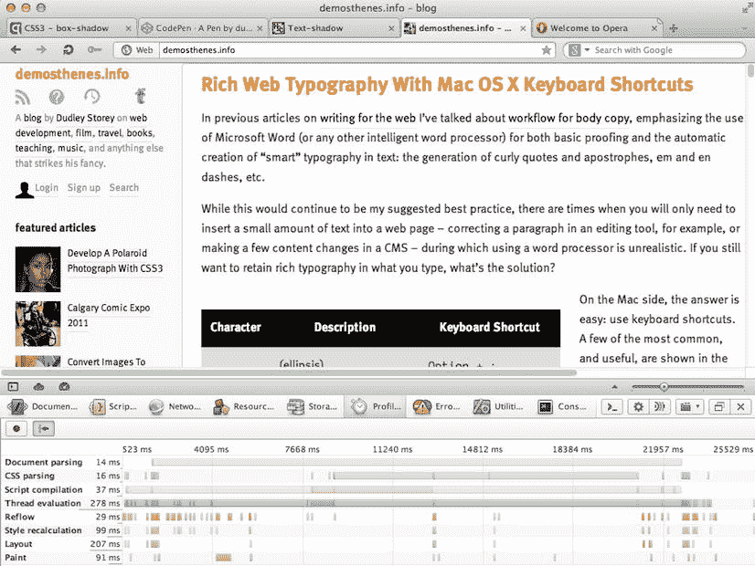
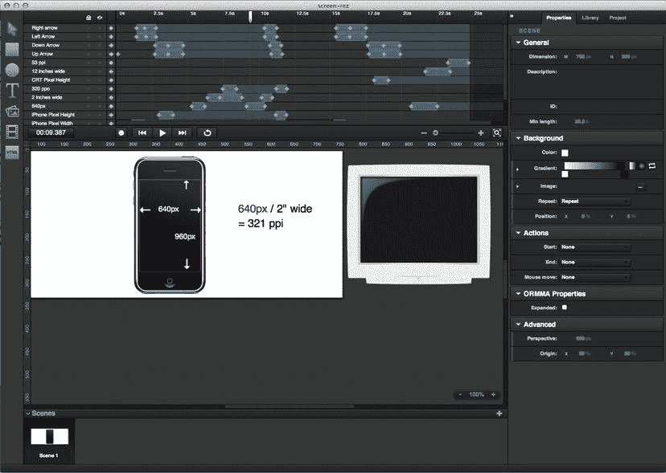
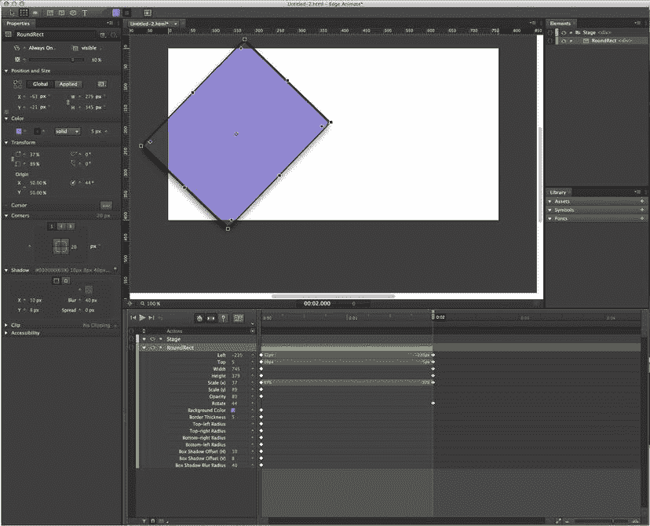
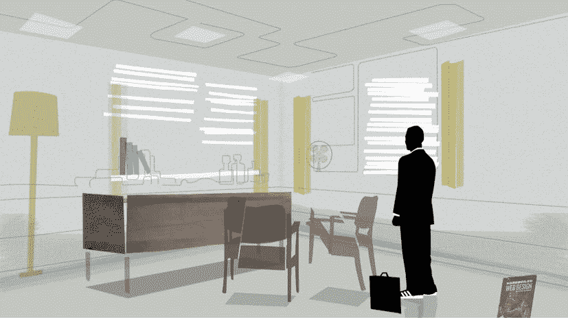
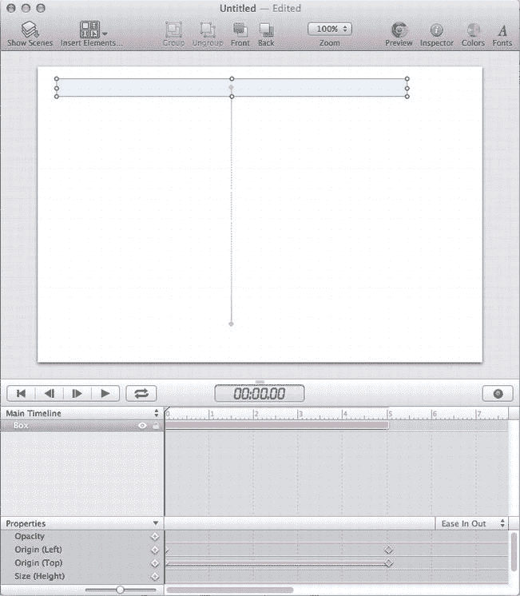

# 十、CSS 动画的工具、技术和未来

作为一组 W3C 模块，它们才刚刚开始从工作草案进入候选推荐状态，CSS 转换、过渡和动画规范还没有旧的最终规范所拥有的健壮的行业工具集。软件开发人员不能因为工具的相对缺乏而受到指责:规范一直是一个移动的目标，使得应用开发具有挑战性。与此同时, W3C 在新技术上向前发展，使得工具开发更加困难，而 CSS 本身变得更加强大。

尽管变化的速度很快，但有许多解决方案可以加速和简化 CSS3 动画的工作流和开发，既可以向后兼容旧浏览器，也可以为现在和未来的开发提供前瞻性的应用。然而，在我们开始之前，你应该花一点时间来欣赏如何有效地使用你到目前为止学到的技能。

编写有效的 CSS3 动画和过渡:避免回流

对于浏览器来说，CSS 中有两个处理起来计算量很大的操作:重画和重流。

当页面内容的布局改变时，页面*重排* 被启动:想象一下当浏览器窗口变窄时，一个流畅的站点的外观发生变化。当一个元素改变它的可见性时，会发生一个 *重画*，但是不会影响它的邻居的布局:例如，当一个元素的可见性、不透明度或者背景颜色改变时。

在这两种情况中，回流通常对性能更不利，因为回流会在 DOM 树中从受影响的元素向下通过所有子节点和之后的子节点“波及” ，迫使多个元素改变它们的位置。在许多情况下，回流实质上可以重绘整个页面。回流操作对现代台式机的性能可能不太重要，但对智能手机等功率较低的设备可能会造成严重影响。与我们的兴趣最相关的是，使用任何伪元素，比如`:hover`，或者一个操纵 DOM 的脚本，都会启动一个回流。

 **注意**如果你是一个更注重视觉的人，你可以在 Firefox 中看到一个非常缓慢的回流过程，因为它在`www.youtube.com/watch?v=nJtBUHyNBxs`首次在 YouTube 上展示了`google.co.jp`主页。

虽然浏览器回流是不可避免的，但是通过遵循一些规则，它们的影响可以被最小化和本地化:

*   尝试直接影响你想要设计的元素，而不是它的父元素。也就是说，尝试限制任何回流的范围:与其改变容器元素的类来影响其子元素，不如尝试直接影响子元素本身。这并不能避免所有的回流，例如，改变元素的高度可能会影响其父元素的尺寸，导致回流波动，但这是一个很好的通用规则。
*   *避免设置内嵌样式*。最重要的是，避免创建多个内联样式。相反，将相关的 CSS 外部化到一个类中，然后更改该类。强调相反方面的工作流程(例如，试图操作内联样式，或者在嵌入、链接和内联样式之间合并样式)可能会在每次调整时导致多次重排。
*   *使用* *变换**将动画应用于元素，或应用于绝对定位或固定的元素*。具有这些特征的元素不会影响其他元素的位置，这意味着只有受影响的元素会被重新绘制，而不需要重新绘制。
*   *创建具有固定高度和宽度的元素的“内部”动画和/或应用了* *溢出:隐藏**的动画。这些元素中的动画不会影响其他元素，避免了回流的机会。*
**   *指定设定图像尺寸*。如果浏览器知道图像元素的宽度和高度，那么当图像被放置在页面上时，它就不必四处移动内容。显而易见，这被当前的响应式设计趋势复杂化了。*   *避长后代选择器*。带有许多标签的长后代选择器往往计算量很大。*   *避免使用通用选择器*。通配符(*)选择器是所有选择器中计算量最大的选择器。*   *尽量指定你希望过渡的属性，而不是使用【全部】*。虽然与重排没有直接关系，但在转换中使用“`all`”选项是浪费，因为浏览器被迫跟踪元素的每一个可能的变化*。指定您希望跟踪和更改的单个属性，比如`opacity`，效率要高得多。**   *使用风格分析器*。(参见图 10-1 。)*

 *

图 10-1。一个剖析工具，比如 Chrome 中的时间轴开发工具或者 Opera 蜻蜓中的风格剖析工具，可以帮助你突出你的 CSS 特别低效或者缓慢的地方

自动前缀工具:客户端

为了在旧版本的浏览器中获得支持，CSS3 转换、过渡和动画必须作为单独的声明，使用正确的浏览器厂商前缀，如第一章中所述。虽然为单个转换维护五行不同的代码肯定是可以实现的，但是维护任何更复杂的代码都是一场噩梦。虽然 Prefixr `(http://prefixr.com)`等工具可以向现有代码添加前缀，但它们对于开放更改的代码来说并不现实:对原始 CSS 的任何更改都意味着您需要再次经历相同的过程来添加前缀。这个问题有几种可能的解决方案，一种是服务器端的，另一种是客户端的，每种都有自己的优缺点。

-无前缀

希腊开发人员 Lea Verou `(http://lea.verou.me)`编写了一个流行的、轻量级的、有效的脚本，将它放入一个页面中，将根据查看页面`(http://leaverou.github.com/prefixfree/)`的浏览器的需要定制任何无前缀的 CSS 代码。

这是我个人对于轻量级工作的首选解决方案(比如在一篇博文的页眉制作一个 CSS3 动画)；它允许我编写符合预期最终规范的单行代码，从而最小化文件大小，并让脚本处理向后兼容性。但是，有几个问题需要注意:

*   有一个强有力的论点是，这种 CSS 声明转换不是客户端脚本的角色，而是服务器端脚本的角色，如下所述。
*   浏览使用`-prefix-free`脚本但关闭了 JavaScript 的站点的用户——直接或通过诸如 NoScript`(http://noscript.net)SPI`_ AMP _ AMP；并且正在使用仍然依赖于供应商前缀的浏览器，将看不到任何转换、过渡或动画。然而，这个特殊的受众群体很小，尤其是考虑到支持无前缀 CSS3 的浏览器数量，这个群体的规模正在迅速缩小。此外，如果你遵循了第二章中的渐进增强和优雅降级的原则，缺少 CSS3 应该不会影响用户享受或使用你的网站的能力。
*   在某些情况下，从服务器交付带有标准前缀的 CSS3 可能会稍微快一些，因为`-prefix-free`必须先处理 CSS 客户端才能使用。实际上，这通常由其他解决方案中所需的服务器端处理来平衡，或者与全前缀 CSS 代码相关联的较大文件大小。
*   对于 Firefox 3.6 或更低版本，内联样式中出现的无前缀属性不会被转换为无前缀属性(这是一种非常罕见的情况，至少对于大多数站点及其访问者来说是这样)。

萨斯、莱斯、指南针和工具包

SASS `(http://sass-lang.com)`和 LESS `(http://lesscss.org)`可能最好被描述为 CSS 的“元框架”，允许诸如变量、函数、循环、自动验证、优化和代码精简、嵌套规则以及(与我们的兴趣最相关的)通过“mixins”自动添加 CSS3 前缀等功能两个框架都将自己宣传为 *CSS 扩展*，尽管这不应该被认为是 W3C 的认可。(也就是说，CSS 框架推动的许多创新，比如变量，正在新的 CSS 模块中被采用。)

LESS 通过 JavaScript 工作，在运行时将一个注入较少的样式表(`styles.less`)翻译成浏览器就绪的 CSS:结果，它分享了-prefix-free 的许多优点(和缺点)。SASS 采用的方法是把用 SASS ( `styles.scss`)编写的样式表预编译成一个完整的`.css`文件，每个浏览器都可以使用。

Compass `(http://compass-style.org/)`将 SASS 的许多最佳附加功能捆绑在一起。管理不同的 SASS 工具和扩展有些困难，因为它们必须像 Ruby gems 一样通过命令行来控制。CodeKit `(http://incident57.com/codekit)`是一个用于 Mac OS X 的框架管理器，它将所有功能(包括 LESS、Stylus 和 Compass)整合在一个图形用户界面中，还提供了一些其他不错的功能，比如当 CSS 发生变化时，在打开的浏览器中自动刷新页面。

最后，包含一个“mixin”有助于进一步简化代码；像 Bourbon `(http://thoughtbot.com/bourbon/)`或 Compass 这样的脚本库将允许您以这种方式在 SASS 中输入一个简单的过渡。(清单 10-1 中的代码以 Compass 语法显示。)

***清单 10-1 。*** 使用 SASS Mixin 生成厂商前缀代码

```html
#element { 
@include transition-property(width);
@include transition-duration(2s);
@include transition-timing-function(ease-in); }

#element:hover {
  width: 180% 
}
```

清单 10-4 中的代码在编译时会自动扩展以覆盖所有浏览器厂商的前缀。

自动前缀工具:服务器端

CSS Prefixer `(http://cssprefixer.appspot.com)`采用服务器端的方法:作为 Python 脚本运行，当提供一个`.css`文件时，它将非前缀的 CSS 转换成供应商声明。虽然它比客户端解决方案 like -prefix-free 或 LESS 更可靠，但它不尝试任何类型的客户端检测:为每个可能的浏览器生成的 CSS 都有前缀，这大大扩展了代码库和文件大小。

基于 GUI 的 CSS3 动画工具

随着 CSS3 动画变得更加雄心勃勃和复杂，文本编辑器开始受到挑战:虽然它们非常适合小型项目，但可视化工具在分别制作多个元素的动画时具有显著的优势。该领域发展迅速，以下仅是一个选择。

Sencha 动画师

Sencha Animator `(www.sencha.com/products/animator)`是最受欢迎的工具之一，它使用熟悉的时间轴 UI 和一整套变换和关键帧工具来创建 CSS 动画(见图 10-2 )。



图 10-2。Sencha 动画师截图

然而，应用的输出有些混乱，使得结果很难在任何其他应用中使用；它呈现作品的默认方式(通过 JavaScript，并且只使用 Firefox 和 Webkit 的供应商前缀代码)意味着结果必须经过大量编辑才能完全跨浏览器兼容。

Adobe Edge 动画

Adobe Edge Animate `(http://html.adobe.com/edge/animate)`是 CSS 动画工具系列的最新成员(几乎还在测试阶段)，是一个非常有前途的应用，它建立在标准的 Adobe UI(和 Adobe 的 Creative Suite 6 的默认深灰色主题，如图 10-3 所示)上，但它增加了许多重大改进。它还使用 JavaScript 作为框架来支持 CSS3 动画，但它支持所有现代浏览器和带有供应商前缀的旧版本。



图 10-3。Adobe Edge Animate 截图

可制作动画

在为 AMC 电视台的*《广告狂人》*(见`http://stuffandnonsense.co.uk/content/demo/madmanimation/ and Figure 10-4)` *)的片头制作了一部非常受欢迎的 CSS3 动画而引起轰动之后，*的可动画制作([《http://animatable.com》](http://animatable.com))的发展似乎已经停滞，或者至少已经沉寂；然而，关注产品的突破性变化仍然是值得的。



图 10-4。还是出自《广告狂人》演员表由 Animatable 创作的 CSS 动画序列

喧嚣炒作

在这里描述的所有工具中，另一个 web 动画 GUI 是对 JavaScript 投资最多的:该应用将自己描述为“HTML5 动画工具”，而不是 CSS3 开发程序。这很遗憾，因为它的用户界面可能是最直观的，如图 10-5 所示。



图 10-5。骚动炒作动画 UI 截图

未来趋势:CSS 自定义滤镜

之前被称为 Web Shaders 的 Adobe 技术，W3C 已经采用了这项新技术作为一项名为 CSS 自定义过滤器的提案。

在第九章的中探讨的标准滤镜可能最好被描述为简单的图像转换器:`hue-rotate`、`blur`、`sepia`始终如一地移动受影响图像的所有像素，仅此而已。标准 CSS 滤镜不能影响单个像素:你不能在半幅图像上使用滤镜，也不能使用滤镜扭曲图像。自定义滤镜将这一过程明确拆分为两个独立的功能:可编程的*片段着色器* 可用于调整像素的颜色，动画擦拭，以及创建自定义过渡；*顶点着色器*将每个 DOM 元素的区域视为一个可视网格*，*允许设计者对图像和其他元素的表面进行波纹、弯曲、扭曲和变形。

如当前规范中所提议的，对定制过滤器的调用看起来像清单 10-2 中的。

***清单 10-2 。*** 一个利用 CSS 自定义滤镜的过渡

```html
#shaded-element { 
filter: custom(url(‘wobble.vs’) 
      40 40,
      amplitude 60,
      amount 0.0);
)
transition: filter ease-in-out 2s;
}
```

数字对`40 40`用于定义元素被划分成的虚拟网格的密度:更多的划分将创建更平滑、更流畅、更细致的效果。`amplitude`是效果的强度，`amount`是元素受影响的程度。

第一行中提到的`wobble.vs`(顶点着色器)文件是用 OpenGL ES 着色语言编写的，使用与 WebGL 相同的语法在网页上创建浏览器原生 3D，如清单 10-3 所示。

***清单 10-3 。*** 在 OpenGL 上是着色器

```html
precision mediump float; 
attribute vec3 a_position; 
attribute vec2 a_texCoord; 
uniform mat4 u_projectionMatrix; 
uniform float amplitude;
uniform float amount;
varying vec2 v_texCoord; 
const float rotate = 20.0;
const float PI = 3.1415926; 
mat4 rotateX(float a) {. . .} 
mat4 rotateY(float a) {. . .} 
mat4 rotateZ(float a) {. . .} 
void main() { 
    v_texCoord = a_texCoord.xy; 
    vec4 pos = vec4(a_position, 1.0);
    float r = 1.0 - abs((amount - 0.5) / 0.5); 
    float a = r * rotate * PI / 180.0;
    mat4 rotX = rotateX(a);
    mat4 rotY = rotateY(a / 4.0);
    mat4 rotZ = rotateZ(a / 8.0);
    float dx = 0.01 * cos(3.0 * PI * (pos.x + amount)) * r;
    float dy = 0.01 * cos(3.0 * PI * (pos.y + amount)) * r;
    float dz = 0.1 * cos(3.0 * PI * (pos.x + pos.y + amount)) * r;
    pos.x += dx;
    pos.y += dy;
    pos.z += dz;
    gl_Position = u_projectionMatrix * rotZ * rotY * rotX * pos; 
}
```

如你所见，这与你所熟悉的 CSS 非常不同:这是一种全新的语言。然而，将所有这些作为`#shaded-element`(如清单 10-4 所示)的过渡，很大程度上回到了你在第二章中探索的原则。

***清单 10-4 。*** 一个利用 CSS 自定义滤镜的过渡

```html
#shaded-element:hover { 
    filter: custom(url(‘wobble.vs’)
    40 40, 
    amplitude 60, 
    amount 1.0); 
}
```

过滤器上的所有控件保持不变，除了`amount`；原始默认状态的转换将确保元素平滑地转换到新的悬停状态。

自定义过滤器承诺对 HTML 内容进行高度的可视化控制，这是标准 CSS 无法实现的，并且有可能彻底改变 web 上的动画和交互。然而，这个过程需要一些时间:规范非常新，在撰写本文时，只在 Chrome 的最近版本中得到支持。最终确定规范、获得跨浏览器支持以及处理诸如安全等重要问题可能需要几年时间。

未来趋势:混合和合成

Adobe 还在混合和合成领域推进 CSS，采用您可能在 Adobe PhotoShop 和 Illustrator 中熟悉的控件(如乘法、变暗、变亮和高级剪辑)并将它们转换为 CSS。

虽然这项工作只是在建议阶段，但如果实现的话，它有望成为一个视觉上更加生动的网站，特别是如果属性可以被动画化的话。可以想象，从长远来看，位图和矢量插图工具将越来越多地成为制作过程早期阶段的内容创造者，而大部分编辑工作将使用 CSS 在浏览器中实时完成。

未来趋势:协调 CSS3 和 SVG

对于两种可以很好地协同工作并相互影响的 web 技术(特别是在转换和过滤领域)，CSS 和 SVG 仍然存在大量的冲突。

虽然 CSS 可以用来制作许多 SVG 表示属性以及 SVG 图像本身的动画(正如你在第九章中看到的那样)，虽然 SVG 可以制作自己的动画——使用`<animate>`标签，这是 SMIL(同步多媒体集成语言)标准的一部分——但是将两者结合起来目前是非常困难的。CSS 关键帧动画规则会覆盖 CSS 过渡和 SVG (SMIL)动画，但在涉及 CSS 过渡和 SMIL 动画时会发生冲突。由于 Internet Explorer 10 不支持 SMIL，兼容性问题变得更加复杂。

W3C CSS-SVG 特效工作组正在解决这些问题，但是这个过程可能带来的发展和变化目前还不清楚。

摘要

从 Flash 和 JavaScript 是在网页上实现运动的唯一方式的时代开始，Web 动画技术已经走过了很长的路，而且随着您在这里看到的工具和语法的出现，以及那些即将出现的工具和语法的出现，它们肯定会走得更远。

这本书提供了对基于现代标准的 CSS3 动画的介绍和深入研究。一路上，您探索了 CSS 变换、过渡、关键帧动画和 3D 操作，并将它们与 SVG、JavaScript 和响应式设计等其他技术结合起来。使用这种混合语言进行开发的支持工具正在出现，但是最可靠的——也是唯一能让您自由地保持在前沿的工具，如果您选择追求它的话——是不起眼的文本编辑器。

编写带有供应商前缀的跨浏览器兼容性 CSS 声明的漫长时期即将结束。最近的浏览器版本完全放弃了你在本书中看到的属性。

这种快速采用技术的新环境正在形成——“下一个网络”——承诺比任何已经成为的事物都更加开放、可能性更加丰富、更具创造性。我很兴奋地想看看它可能会发现什么新的前景，我希望你也是。

我期待着看到你的作品并得到你的反馈——并从你对 CSS3 动画的探索和创新中得到启发。*