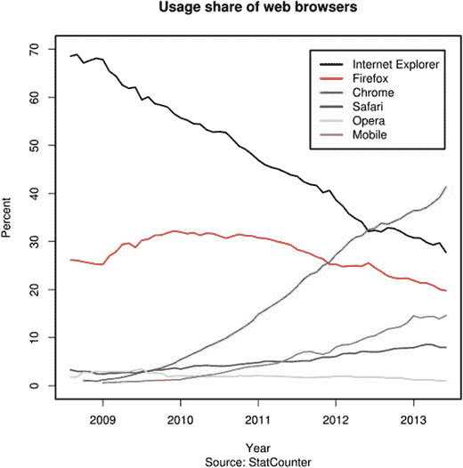

# 一、克服网页布局的挑战

Electronic supplementary material The online version of this chapter (doi:[10.​1007/​978-1-4302-6503-0_​1](http://dx.doi.org/10.1007/978-1-4302-6503-0_1)) contains supplementary material, which is available to authorized users.

欢迎使用 Pro CSS3 布局技术！

虽然说风格比内容更重要是不公平的，但我们都希望网站看起来不错，对我们的设备做出反应，并在参与度上与其他媒体竞争，这确实是事实。这意味着，作为网页设计者，我们被寄予了很大的期望，去生成更加直观的布局、用户友好的展示和与设备无关的代码。虽然我们已经准备好迎接挑战，但是我们所拥有的一些核心工具要么从来就不是为版面设计设计的，要么已经用了十多年了。网络在发展，但是布局工具却没有——直到 CSS3 的出现和实现。

这本书将涵盖以下主题:

*   利用 CSS3 布局模块
*   决定今天什么是可行的
*   发现即将在真实环境中使用的内容
*   在 CSS3 不可用的情况下，学习使用 CSS Level 2.1 规范进行布局的最佳实践方法

在我们对新玩具过于兴奋之前，首先很有必要理解为什么我们会处于这种境地。为了正确理解，我们需要回顾 HTML(超文本标记语言)和 CSS(层叠样式表)的发展。不要担心:这篇评论不会是一次详尽的记忆之旅，但是当您下一次使用 CSS 来设计布局时，它会很好地为您服务。

## HTML 属性和标签

当网络发展到非常早期的时候，HTML 被用于标记和样式。HTML 属性和标签定义了页面的外观。关于如何标记内容的决定很可能来自标签的默认视觉特征，也可能来自任何语义层次的感觉。考虑以下示例及其用途:

*   标签用于大而粗的文本，同时也表示页面上最重要的信息。
*   `<p>`对于小文本，还可以显示段落文本，即标题的骨架。
*   `<center>`标签来对齐段落和表格。最初，它们只是用来显示表格数据的。这些标记开始被用于创建复杂的多栏布局，这对于语言中有限的标记和格式属性来说是不可能的。

尽管这种方法非常足智多谋且富有创造性，但它导致了一些既难以阅读又难以维护的可怕代码。随着布局需求变得越来越复杂，表格开始相互嵌套，通常有几层之深。视觉上多余的透明间隔 gif 越来越多地用于确保元素的正确定位。一个简单的页面包含成百上千行难以理解的代码变得很常见，如清单 1-1 所示。

```html
<FONT FACE=TIMES COLOR=#FF0000 SIZE=3>
<H2><I>WELCOME TO MY WEBSITE</I></H2>
  <CENTER>
    <TABLE WIDTH=720 HEIGHT=480 BORDER=2 BGCOLOR=BLACK>
     <TR>
       <TD BACKGROUND=texture.gif>
         <TABLE WIDTH=360 HEIGHT=480 BORDER=0>
           <TR>
             <TD>
                <BR>
                 <H1>ABOUT MY SITE</H1>
                 <P>...</P>
             </TD>
            </TR>
           </TABLE>
         </TD>
         <TD BACKGROUND=texture2.gif>
          <TABLE WIDTH=360 HEIGHT=480 BORDER=0>
           <TR>
             <TD>
                <BR>
                 <H1>ABOUT ME</H1>
                 <P>...</P>
             </TD>
           </TR>
         </TABLE>
       </TD>
     </TR>
    </TABLE>
  </CENTER>
</FONT>

Listing 1-1.Example of a Vast Listing to Create a Basic 

Two-Column Layout

```

这种编码和维护网站的方法提出了一些问题，这些问题对于使用 HTML 的每个人来说都是显而易见的。Web 需要一种将内容和样式分开的方法，因此万维网联盟(W3C)承担了这项任务，开发了 CSS Level 1 规范。

## CSS 的到来

随着 Web 开始超越简单的基于文本的媒体，成为更加视觉化、杂志式的体验，很快就发现 HTML 样式带来的限制将成为一个问题。负责定义网络标准的 W3C 认为将风格与内容分开更明智，并开始研究一种新的语言，这种语言将控制内容的美学处理，而不考虑内容的语义。解决方案是层叠样式表(CSS)，它是现代网页上所有设计和布局的基础。

### CSS 级别 1

CSS Level 1 (CSS1)并不打算作为实现布局的解决方案。相反，这个想法是替换所有基本的视觉特征，比如颜色、字体、边距和边框，这些都是用 HTML 标签和属性指定的。结果是以下有限的属性集:

*   块级元素的宽度和高度
*   漂浮，清除漂浮元素
*   边距和填充
*   背景颜色和图像
*   边界
*   字体和字体样式
*   列表样式
*   一些基本的排列

CSS1 允许设计采用 HTML 代码本身之外的单个元素的基本样式。第一次，一个网站的外观可以通过一个外部文件来控制。这对页面设计的维护和一致性有很大的好处，因为一行 CSS 代码现在可以影响整个网站。以前，简单的标题颜色改变意味着单独编辑网站中的每个页面。

由于浏览器市场缺乏竞争以及设计者的需求相对缓慢，网络浏览器花了一些时间来采用新的 CSS 规范。直到 20 世纪 90 年代末，设计人员才能够依靠常用的浏览器，如 Netscape Navigator 和 Microsoft Internet Explorer，以近乎精确的方式解析和呈现 CSS 代码。巧合的是，微软和网景正在争夺霸权。如图 1-1 所示，Internet Explorer 是最终的胜利者。


图 1-1。

Internet Explorer on the Mac was the first CSS-compliant browser

也许你熟悉使用浮动元素作为创建布局的系统。然而，CSS1 中引入的`float`和`clear`属性从来不是为了这个目的。它们旨在提供以前属于 HTML 的`ALIGN=LEFT`和`ALIGN=RIGHT`属性的 CSS 传真。计划是在图像上使用它们，让文本自动围绕元素流动。第二章讨论了如何有效地使用浮动元素。

您可能已经注意到了规范中的宽度和高度属性，它们可以用来定义元素的尺寸。但是它们的目的仅仅是复制以前在 HTML 中作为图像、表格和其他块级元素的属性使用的相同属性。

CSS1 显然是网络的一个里程碑。随着它在 20 世纪 90 年代后期被浏览器实现，W3C 开始致力于级联样式表语言的下一个迭代:CSS Level 2。

### CSS 级别 2

CSS Level 2 设计的一个目的是在样式表中实现一些布局控制。将布局从 HTML 转移到 CSS 的第一次尝试是基于网页设计者已经习惯的表格模型。引入的一个关键的新属性是`display`，规范的一部分提供了要应用的值`table-cell`。(见图 1-2 。)该值在正确呈现后，可以让您创建一个类似于使用表格的布局，并包含等高的列。


图 1-2。

CSS2 introduced the `display` `: table-cell` property to mimic the existing tabular layout solution being used by designers

可悲的是，并不是每个浏览器都支持 CSS2 标准，所以它实际上在网络上是不可用的。虽然很多浏览器支持`display: table-cell`，但是 Internet Explorer 6 不支持。因此，可靠的布局仍然牢牢地留在 HTML 表格的领域中。此外，浏览器供应商对松散编写的 CSS2 规范的解释略有不同。因此，浏览器呈现的同一页面不一致，让设计者和消费者都很沮丧。

W3C 已经开始着手 CSS 的下一个版本——level 3。然而，认识到 CSS2 规范中的缺陷，该组织搁置了 CSS3，转而花了很长时间致力于解决 CSS2 产生的互操作性问题，最终开发了 CSS Level 2.1 形式的后继版本。

因为 Internet Explorer 实际上享有垄断地位，所以大多数网站的设计都考虑到了它的呈现方式。最终，设计师采用了风格和内容的分离，但他们被迫使用浮动和绝对定位来设计布局。正如您已经看到的，这些属性从来就不是用来作为布局工具的。但是足智多谋的网页设计社区找到了劫持它们的方法，并且在不使用表格的情况下生成巧妙的布局。

## 浏览器

图 1-3 显示了权力的天平向谷歌的 Chrome 浏览器倾斜。然而，很大一部分用户依赖于 Internet Explorer。



图 1-3。

Market share statistics from 2013 show browser usage. Image from StatCounter.com

让我们来看看下面的例子:

*   火狐浏览器
*   微软公司出品的 web 浏览器
*   铬

### 火狐浏览器

1999 年美国在线(AOL)收购网景浏览器后，源代码被开源，允许开发者社区为其做出贡献。这一令人钦佩的行动导致了一种全新的浏览器功能的形成。其结果是 Mozilla 基金会和 2004 年新的网络浏览器 Firefox 的出现。

Firefox 单枪匹马引发了一场新的浏览器大战。微软仍然是占主导地位的浏览器，市场份额在 90%左右，但 Firefox 慢慢削弱了它的主导地位。这最终迫使微软在中断六年后更新了老化的 ie 浏览器。

### 微软公司出品的 web 浏览器

Internet Explorer 7 于 2007 年发布。它给用户带来了选项卡式浏览，但在标准采用或对设计者 CSS 的额外支持方面很少。

2000 年代末，Internet Explorer 8 引入了对`display: table-cell`的支持，最终实现了一定程度的互操作性。令人沮丧的是，仍有超过一半的网络用户使用 Internet Explorer 6 的问题。

Note

即使在今天，Internet Explorer 6 也只有大约 1%的市场份额。大多数网页设计者现在选择忽略这部分市场，因为提供支持所花费的时间与回报的递减不成比例。

### 铬

当微软继续拖后腿的时候，Firefox 开始流行，一个新的竞争者被引入市场。搜索引擎巨头谷歌基于开源 WebKit 项目开发了自己的品牌浏览器，并于 2008 年底发布。Chrome(见图 1-4 )很快取代 Firefox 成为网络上第二受欢迎的浏览器，并朝着完全符合 CSS2.1 迈出了一大步。


图 1-4。

Google’s Chrome is now the world’s most widely used browser

## CSS 盒子模型

在 2000 年至 2009 年期间，网页设计师不得不应对非常头痛的问题，即差异巨大的渲染引擎以完全不同的方式显示他们的代码。最大的问题是 CSS box-model(见图 1-5 )，它用于从指定的宽度、高度、边距和填充的组合中确定元素的宽度。由于编写松散的 CSS2 规范，微软对 box 模型的解释与其他浏览器供应商社区不同，导致了竞争浏览器之间文档呈现的不一致；在 Internet Explorer 6 以外的浏览器中，页面无法按预期呈现。因此，采用了变通方法、shivs 和 hacks 来创建布局，这些布局基于符合 CSS2.1 规范的代码，但也适用于不符合标准的 IE6 渲染引擎。


图 1-5。

An illustration of the different box-model rendering across browsers

微软目前正在邀请用户放弃 Internet Explorer 6，并认为它只不过是一个糟糕的记忆。然而，由于 Internet Explorer 7 和 8 的兼容模式，很大一部分浏览器市场份额仍然使用 Internet Explorer 6 渲染方法。因此，常见到针对微软浏览器的专家样式表。此外，整个 JavaScript 库都包含在一个页面中，以便符合 polyfill 的布局呈现。

为了应对不同浏览器之间实现互操作性的困难，开发了一系列测试来帮助衡量不同浏览器相对于 CSS 规范的性能。这些酸性测试被标准支持者用来向包括微软在内的浏览器供应商施压，要求他们改进软件。

最后，在 21 世纪中后期，微软开始开发符合标准的 IE 浏览器版本:IE8 于 2008 年发布，IE9 于 2011 年发布。与此同时，随着 iPhone 等设备的发布，移动领域正在发生一场革命。这些新的支持互联网的智能手机支持新开发的 CSS3 规范的元素，以及 HTML5，并进一步增加了现有市场领导者采用标准的压力。

## CSS 级别 3

CSS Level 3 不同于之前的迭代，因为它是模块化的。这允许 CSS 工作组在规范成熟时发布不同的部分，并且浏览器供应商能够快速采用功能。CSS 级模块化方法大致分为四个部分:

*   选择器和逻辑
*   装饰效果
*   排版(包括对国际化的支持)
*   布局

最有趣的是，布局方面封装了一系列新模块，这些模块在页面布局方面提供了灵活性和标准化，这在 Web 上是前所未有的。令人沮丧的是，即使有了这个新规范，我们仍在旧浏览器和不完整实现的阴影下挣扎。

## CSS 布局模块

CSS Level 3 为设计者的武库中增加了一系列新的布局工具。这些模块中的每一个都提供了一种令人兴奋的方法，只使用 CSS 来制作布局。这些模块将改变你创作风格的方式，更重要的是，改变你的 HTML 标记。

四个主要模块正在开发中，而不是一个单独的方法来制作布局。每一个都有自己的概念、规则，以及最重要的浏览器支持。以下章节深入探讨了每个模块:

*   CSS 多列布局模块
*   CSS 灵活盒子布局(Flexbox)模块
*   CSS 网格布局模块
*   CSS 区域布局模块

在第 4–7 章节深入每个模块的全部细节之前，您将在第二章中对每个模块进行适当的概述。与此同时，您可以通过快速查看每个模块在布局方面可以实现的功能来激起您的兴趣。

### CSS 多列布局

CSS 多列布局是新布局模块中最容易掌握和实现的。它也是对浏览器支持最成熟的模块，尽管它可能是对高级布局最没用的模块。

多栏布局(见图 1-6 )确实如你所料:它使内容很容易自动流入多栏，这可以适应可用空间，以便较小的屏幕比较大的屏幕呈现较少的栏。第四章考查本模块。


图 1-6。

CSS Multi-column Layout rendering content into a column-based layout

### CSS 灵活的盒子布局

CSS 柔性盒布局(或 Flexbox)已经经历了几次不同的修订。多亏了一些早期的浏览器实现，网络上有许多现在已经不存在的例子。这导致了网页设计社区的混乱；但是现在规范已经稳定了，对模块有了相当好的跨浏览器支持。

Flexbox 的设计并不是为网站提供一个完整的布局解决方案，但是它确实可以让你创建一些元素，比如工具栏和标签区域，这些元素可以响应用来查看它们的设备(见图 1-7 )。第五章深入探讨了 Flexbox 模块。


图 1-7。

Flexbox helps solve some common user interface design problems

### CSS 网格布局

CSS 网格布局是最令人兴奋的布局模块之一，因为它第一次允许设计真正与表现分离。元素可以使用 CSS 网格布局重新排序，因此标记到达的顺序与布局无关。对于努力创建有意义的语义标记的设计师来说，这是一个极好的消息，更不用说该模块允许在定义的网格内进行布局控制，并完成垂直对齐(见图 1-8 )。第六章研究了所有的细节和浏览器支持。


图 1-8。

The CSS Grid layout brings a flexible and reliable grid layout option to the Web for perhaps the first time

### CSS 区域布局

CSS 区域布局允许内容在杂志风格的布局中从一个区域到另一个区域的复杂流动。这种复杂的布局超出了其他布局模块。它可用于创建响应不同设备的动态、流畅布局(参见图 1-9 )。CSS 区域布局还不是一个完全成熟的模块，但是第七章会检查所有的细节，包括当前的浏览器支持。


图 1-9。

CSS Regions Layout offers an exciting way to position content in and around elements without affecting document flow Note

还有一些新兴的布局模块，虽然还不是 CSS 规范的一部分，但提供了更多的布局选项。在这本书的结尾你会看到一些。

正如您所料，目前使用 CSS3 模块存在许多潜在的问题:一些仍在开发中，而另一些已经相当成熟。一些浏览器几乎已经完全实现了单个模块的标准，但是其他浏览器还在继续努力合并或者在某些情况下定义它们。这可能是一个雷区，但这本书引导你安全地通过陷阱！

## 这本书将如何帮助你

现在你知道你面对的是什么了，让我们快速看看你能从阅读这本书中得到什么。我的目的是帮助你理解在你的网站设计方法中可以使用的关键 CSS 布局技术。

CSS3 提供了大量令人兴奋的可能性，这本书着眼于每个关键的布局模块。给你一个警告:作为阅读这本书的结果，你将改变你构建网站布局的方式！但话虽如此，你也会看到一些限制——标准本身的限制，或者人们用来访问网络的浏览器软件带来的限制。

到这本书结束时，你会对你今天能做什么有一个现实的看法，以及对未来一两年可能发生的事情有一个好的想法。您还将看到一系列有用的多填充技术示例，它们可以为您的布局提供一个优雅的后备。

当然，如果忽略了大部分继续使用旧浏览器软件的用户，任何 CSS 布局书籍都没有用。因此，您还将看到仅使用 CSS2.1 进行布局的最新最佳实践方法，并在此过程中学习概念。尽管我假设你熟悉 CSS2.1，下一章还是从这个主题开始。

## 摘要

CSS3 仍在发展中，但它的大部分现在都可以安全地使用。像 Flexbox 这样的布局模块为网页设计者面临的一些现实挑战提供了一个可靠的解决方案。自网络出现以来，CSS 已经走过了漫长的道路，在过去的几年中，这种语言的发展速度大大加快。这本书将让你快速掌握开发中每个主要布局模块背后的核心原理，并向你展示如何在现实世界中使用这些模块。我们开始吧！