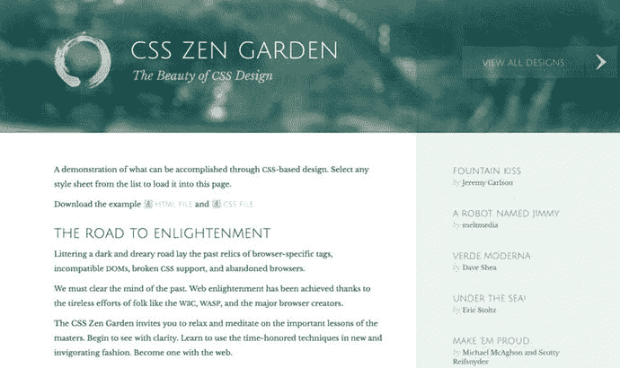
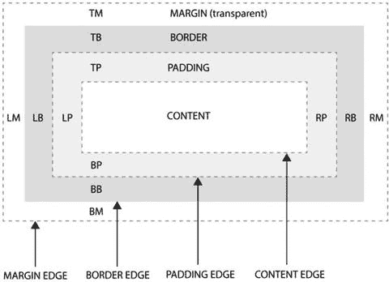

# 二、CSS 中的布局模块：旧与新

本章将帮助你在与 CSS 相关的核心布局概念上站稳脚跟。如果你熟悉 CSS2.1，你已经对它了如指掌，但是可能有一些你没有意识到 CSS 支持的概念(因为浏览器支持一直很差)。

本章快速浏览了 CSS 提供的所有不同的布局范例，从 CSS 的原始版本:level 1 开始。请注意，CSS 提供的每个布局解决方案都是作为一个模块实现的。在 CSS3 之前，每一层的整个 CSS 规范都包含在一个无所不包的模块中，而现在每一层都被分割成自己独立的模块；但是为了简单起见，我把每种方法都当作一个单独的模块来讨论。

正如我在第一章中提到的，在 CSS 出现之前，HTML 并没有提供多少布局控制。设计者找到了一种巧妙的方法来制作复杂的布局:通过使用表格在页面上精确定位元素来破解 HTML 规范。表格是一个非常有用的布局工具，因为它们为单个内容的定位提供了一个可控的解决方案。然而，HTML 表格从来就不是用来布局的；所以，从语义上来说，这次黑客攻击是一场灾难。因为整个方法是一种变通方法，所以还存在内容的可维护性和可读性问题。发现六七层深度的嵌套表并不少见。

随着 CSS1 的出现，焦点开始从使用 HTML 呈现一切(包括内容和表示)转移开来。取而代之的是，将内容从审美呈现中分离出来的思想得以确立。

Note

本章讨论了不同的 CSS 级别:1、2 和 3。需要注意的是，在设计网站时，你不能选择使用哪个级别；浏览器支持不同的级别，每个级别都建立在现有级别之上或旁边。虽然这本书是关于 CSS3 的，但是在屏幕上看到的结果取决于你使用的浏览器——或者更重要的是，浏览你网站的人使用的浏览器。

## 布局概念

在引入 CSS3 之前，CSS 提供了四种(官方)不同的布局模式。正如已经建立的那样，除了用户代理应用的默认行为之外，HTML 本身不包含任何布局特定的功能。对于网页设计者来说，这是一个发现的旅程，从基于表格的布局作为实现对定位的精细控制的方法开始，到本世纪最初几年 CSS 的采用，最终达到今天的成熟程度，表现和可用性的问题是内在相关的。

那么什么是 CSS 呢？当设计者试图创建一个更加视觉化的网站时，HTML 语言的局限性很快就显现出来了。作为一个主要基于文本的系统，HTML 是一个交流信息的好方法，但是它不是一个很好的美化信息的工具。负责开发 HTML 语言的机构做了各种尝试来解决基本的样式需求，但是从根本上说，HTML 的最初目的正在被侵蚀。级联样式表(CSS)的引入是实现可视化 Web 的第一步。一旦建立起来，CSS 就被迅速采用并不断迭代，直到 21 世纪初达到 2.1 版本，当时它陷入了政治和缓慢的浏览器开发的泥潭，陷入了停顿。尽管如此，设计师们继续试验 CSS 的可能性，通过 CSS Zen Garden 这样的工具来推广它，如图 2-1 所示。



图 2-1。

CSS Zen Garden spearheaded the CSS revolution in the early years of the 21<sup>st</sup> century

网络在发展，但是我们可以使用的工具却没有——直到 CSS3 的出现和实现！CSS 处理 HTML 文档的外观和样式，包括以下内容的表示方面:

*   文本，包括字体选择、字体大小、粗细、间距、方向和装饰
*   不同元素的颜色和背景，包括图像和渐变
*   边框和边框效果，包括线条样式、大小和弯角，以及投影等特殊效果
*   不同元素在页面上的定位，可以在文档流内，也可以在文档流外
*   页面上不同元素的边距和填充
*   跨不同结构元素(包括列和区域)分布和对齐内容
*   过渡和动画，包括用户交互控制
*   2D 和三维空间中的变换

值得快速强调的是，CSS 的最新版本仍然处于不断变化的状态。而在以前的版本(CSS2.1)中，整个规范包含在一个模块中，而在 CSS3 中，各个组件都被模块化了。这意味着 CSS 工作组(CSSWG)可以更快更有效地迭代单个模块，浏览器供应商可以实现标准，而不必等待每个单个模块都达到推荐状态。不利的一面是，规范被分割在许多不同的模块和项目中。这使得跟踪哪个浏览器支持某个特定功能以及全球范围内的最新发展变得很棘手。

自从 W3C 在 2005 年宣布 CSS3 的开发以来，web 设计社区一直带着兴奋和期待的混合情绪关注着，等待浏览器实现这些标准并为设计开辟一系列新的可能性。从 CSS3 开发开始到现在已经将近十年了，但是直到最近一两年才有了对 CSS2.1 的普遍支持！

尽管如此，随着浏览器供应商迅速实现对新功能的支持，CSS3 正在 web 设计界掀起巨大的波澜。所有主流浏览器都已经支持大量新的 CSS3 属性、创新的 CSS3 布局方法、基于 CSS 的动画和特殊的视觉效果。今天，甚至可以在一些浏览器中直接渲染 3D 场景，而不需要插件或特殊的阅读器软件。

历史上，web 采用新技术的速度一直很慢，因为 Web 用户需要在这些技术得到支持之前主动更新他们的浏览器软件。自然，用户有比更新软件更有趣的事情要做，结果整代用户(和计算机)都被购买时安装的原始浏览器所困扰。随着新一代笔记本电脑和台式电脑的出现，更不用说基于 Android 和 iOS 操作系统的智能手机的广泛采用，浏览器软件也在发展，现在许多流行的浏览器在有新版本时会自动更新。

直到几年前，如果不借助 Photoshop、Adobe Flash 或一些非常复杂的 JavaScript，在网页上渲染阴影是不可能的。现在呢？CSS3 使得渲染阴影像设置一个属性一样简单！更好的是，由于这个 CSS3 属性在今天的浏览器中被广泛采用，这是一个非常安全的渲染效果的方法。

CSS3 规范提供了一套强大的新工具，远远超出了简单的投影渲染。这本书关注的是布局选项，但是不要忘记 CSS3 提供的不仅仅是布局控制；CSS3 将你的网页和应用程序的样式提升到了一个全新的水平，远远超越了过去的可能性。当然，它不是一个完美的工具；在本章中，我们来看看 CSS3 没有解决的问题以及它擅长的事情。

### 不同类型的布局

关于现代 web 开发，需要理解的一个关键问题是内容的结构独立于表现形式。CSS 是专门设计来让你定义视觉或听觉的表现，而不需要以特定的方式构造 HTML，至少是为了如何向用户显示页面。

这并不是说这两件事没有明确的联系！CSS 依赖于它所应用的 HTML 中明确的结构；但是，页面的布局越来越不受 HTML 中内容的顺序或特定标记的支配。

这是非常有益的，因为它允许在稍后阶段更容易地重新调整内容的用途，无论是到新的平台还是作为设计改进的一部分。这也意味着您可以根据设备或访问设备的用户的配置文件，以不同的方式呈现完全相同的内容。在实践中，这就是响应式设计(在不同设备上适当呈现工程内容的过程)。另一个好处是，内容可以按照语义顺序进行组织和交付，而不是依赖于网站的视觉设计。

随着 CSS 语言的发展，可用的布局选项也发生了变化。CSS 的每个新级别都建立在以前级别的基础上，增加了功能和能力。因此，有许多潜在的方法可以用看似相同的布局来设计页面的样式，但是每种方法都有不同的行为和特征。让我们快速看一下在引入新的 CSS 布局模块之前 CSS 提供了什么，这些模块是 CSS3 规范的一部分。

### CSS1 中的布局

当网络发展到非常早期的时候，HTML 被用于标记和样式。HTML 属性和标签定义了页面的外观。关于如何标记内容的决定很可能来自标签的默认视觉特征，也可能来自任何语义层次的感觉。`<h1>`标签用于需要大而粗的文本的地方，`<p>`用于小文本，`<center>`标签用于对齐段落和表格——仅作为一种呈现表格数据的方式——以创建复杂的多栏布局，这在语言中可用的标签和格式属性的有限集合中是不可能的。

尽管这种方法非常足智多谋且富有创造性，但它导致了一些可怕的代码，这些代码既难以阅读又难以维护。随着布局需求变得越来越复杂，表格开始相互嵌套，通常有几层之深。视觉上冗余的透明间隔 gif 越来越多地被用来确保元素的正确定位，一个简单的页面包含数百或数千行意大利面条汤(难以理解的代码)变得很常见。清单 2-1 显示了与第一章中相同的代码示例:实践中一个典型页面的 HTML 代码，包括大量可视化渲染指令。

```html
<FONT FACE=TIMES COLOR=#FF0000 SIZE=3>
 <H2><I>WELCOME TO MY WEBSITE</I></H2>
  <CENTER>
    <TABLE WIDTH=720 HEIGHT=480 BORDER=2 BGCOLOR=BLACK>
      <TR>
        <TD BACKGROUND=texture.gif>
          <TABLE WIDTH=360 HEIGHT=480 BORDER=0>
            <TR>
              <TD>
                <BR>
                  <H1>ABOUT MY SITE</H1>
                  <P>...</P>
              </TD>
            </TR>
          </TABLE>
        </TD>
        <TD BACKGROUND=texture2.gif>
          <TABLE WIDTH=360 HEIGHT=480 BORDER=0>
            <TR>
              <TD>
                <BR>
                  <H1>ABOUT ME</H1>
                  <P>...</P>
              </TD>
            </TR>
          </TABLE>
        </TD>
      </TR>
    </TABLE>
  </CENTER>
</FONT>

Listing 2-1.Typical HTML Code Before CSS and Modern Web Standards Were Widely Adopted

```

这种编码和维护网站的方法所带来的问题对于每个使用 HTML 的人来说都是显而易见的。Web 需要一种方法来将内容与风格分开，因此 W3C 接手了这一工作，开发了 CSS Level 1 规范。

第一章谈到了 CSS 旨在解决的不同视觉特征。回想一下，CSS Level 1 并不打算作为布局的解决方案。取而代之的是，用 HTML 标签和属性取代所有基本的视觉特征。如第一章所述，结果是一组非常有限的属性，包括以下内容:

*   块级元素的宽度和高度
*   漂浮，清除漂浮元素
*   边距和填充
*   背景颜色和图像
*   边界
*   字体和字体样式
*   列表样式
*   一些基本的排列

CSS1 允许设计者在 HTML 代码之外获取单个元素的基本样式。第一次，一个网站的外观可以由一个单独的外部文件来控制。这对页面设计的维护和一致性有很大的好处，因为一行 CSS 代码现在可以影响整个网站。以前，简单的标题颜色改变意味着单独编辑网站的每个页面。

web 浏览器花了一些时间来采用新的 CSS 规范，直到 20 世纪 90 年代末，设计人员才能够依靠常用的浏览器来理解和准确地呈现他们的 CSS 代码。对于历史爱好者来说，这也是微软和网景争夺霸权的时期，Internet Explorer 是最终的胜利者。

值得注意的是，虽然您可能熟悉使用浮动元素作为创建布局的系统的想法，但 CSS1 中引入的`float`和`clear`属性从来不是为了这个目的。引入它们是为了提供以前属于 HTML 一部分的`ALIGN=LEFT`和`ALIGN=RIGHT`属性的 CSS 传真，旨在用于图像，允许文本自动围绕元素流动。

### CSS2 和 CSS2.1 中的布局

CSS2.1 引入并定义了四种不同的布局模式来呈现网页。这些是浏览器在解析 CSS 规则时使用的系统，用于根据元素的兄弟元素、文档中的流和父元素来确定元素的大小和位置。这四种模式如下:

*   块布局:用于布局或组织文档中的元素
*   嵌入式布局:用于布局文本
*   表格布局:用于在二维网格中显示和布局表格数据
*   定位布局:用于在页面上明确定位元素，将它们从文档流中移除

#### 块布局

W3C 的 CSS2.1 规范提供了对块布局的解释:

> In the context of block formatting, starting from the top of the containing block, vertically place the boxes one after the other. The vertical distance between two sibling boxes is determined by the margin property. Vertical margin folding between adjacent block-level boxes in block format context.

块布局在元素周围创建矩形框，描述该元素占用的空间量。许多 HTML 元素自动采用块布局，包括像`<p>`、`<h1>`、`<div>`和`<ul>`这样的元素。块级盒子垂直堆叠，每个盒子紧接着前一个占据垂直空间。块级盒子不会水平堆叠。每个新块出现在新的垂直位置。

有一些与块级框的布局相关联的特殊规则，以及用于确定每个块级框占用多少空间的规则。简言之，这些规则如下:

*   块级元素的`background`完全延伸到`border`的外边缘。这意味着背景填充了内容区域以及`padding`和`border`区域的组合。如果边框使用任何透明度(例如，如果它使用虚线)，则在虚线之间的空间中可以看到`background`。
*   块级元素的`width`默认设置为`auto`(填充可用的水平空间)。唯一可以设置为`auto`的其他属性是`margin`和`height`属性。
*   负值可以应用于`margin`属性，但是其他属性不能有负值。
*   `width`和`height`属性仅定义内容区域。`padding`、`border`、`margin`都是为了布局的目的而增加盒子的宽度。

这最好用图表来说明，如图 2-2 所示。`margin`、`padding`、`border`都增加了块级元素的位移大小。从历史的角度来看，Internet Explorer 最初实现的盒子模型包括元素的定义宽度(和高度)内的填充，导致了多年的变通方法和特定于浏览器的样式表破解。幸运的是，那些日子已经过去了！



图 2-2。

The block-level box model. The `width` property affects only the content area, with `padding`, `border`, and `margin` adding to the overall displacement width and height

#### 内嵌布局

内联级元素是源文档中不构成新内容块的那些元素；内容按行分布(例如，段落中强调的文本片段、内联图像等)。内联级元素生成内联级框，它们是参与内联格式上下文的框。这意味着它们在相同的读取流中替换相邻的内容，但是它们不会干扰块级呈现。

内联框是内联级别的，其内容参与其包含的内联格式上下文。一个`display`值为`inline`的非替换元素生成一个内嵌框。默认采用内联行为的元素的常见例子包括`<span>`和`<em>`。

#### 表格布局

使用`display`属性进行访问，表格布局允许元素像构成表格的一部分一样工作——承担表格单元格的角色，并占据表格布局中的行和/或列。这种布局模式非常强大，原因和早期的 web 设计者劫持表格一样，但是糟糕的浏览器支持在历史上意味着它从来没有作为一种可靠的布局解决方案出现过。

现代浏览器支持非常好。因此，表格布局是一种可行且有效的布局方法。

#### 定位布局

定位布局允许您使用坐标精确地放置单个元素，相对于页面或另一个具有定义位置的包含元素。这使您可以将元素放在浏览器窗口的右上角，或者让单个元素在视口内的任意位置相互重叠，并假定在文档流中有一个位置是默认行为。

CSS2.1 规范中提供了几种不同的定位属性值:

*   静态:应用正常的流程规则，并且`top`、`bottom`、`left`和`right`属性不起作用。
*   相对:框的位置根据它在文档流中的位置来确定。属性然后相对于它的“正常”位置偏移盒子的位置。受框在文档流中的位置影响的后续元素的行为就像框上没有偏移一样。
*   绝对:盒子的位置(可能还有大小)由`top`、`left`、`bottom`和`right`属性指定。这些属性指定从包含框(可能是页面本身)的偏移量。
*   Fixed:长方体按照绝对位置定位，但它固定在相对于某个参考的位置。在大多数情况下，位置相对于视口是固定的，不会相对于用户滚动页面而移动。

### CSS3 中的布局

正如已经讨论过的，CSS3 以一种新的方式处理布局。各个组件被分解成独立的模块，而不是单一的整体规格。因此，CSS3 有几个不同的布局模块，每个模块都是单独开发和维护的。

浏览器已经很好地支持了几个模块；其他的仍在开发和定义中。这本书检查了所有主要的布局模块，并指出哪些模块你可以直接使用，哪些是即将推出的，哪些是未来要关注的。第一章简要地讨论了每一个模块，所以与其再详细讨论每一个模块，不如在这里提醒一下本书所关注的模块:

*   CSS 多列布局
*   CSS 灵活盒子布局(Flexbox)
*   CSS 网格布局
*   CSS 区域布局

然而，这个列表并不是 CSS3 中布局的限制。正如你在这本书的结尾所看到的，一些令人兴奋的想法正在被讨论和提出，它们可能会改变你默认的页面布局方式！

理解 CSS3 不会以任何方式取代 CSS2.1 或 CSS1 是很重要的。接下来的章节中涉及的新模块建立在现有规范的基础上。因此，您将继续使用 CSS2.1 引入的四种布局类型——块、内联、表格和绝对——作为最常见的默认布局解决方案。您可以将这些原始布局范例与新模块结合使用，并对其进行补充。

## 模块化的重要性

您可能想知道为什么 CSS3 以模块化的方式构建很重要，以及这与现有 CSS 规范的工作方式有何不同。简单的回答是，通过采用模块化方法，组成 CSS3 的每个独立模块都可以被浏览器供应商测试、评估和采用，而无需采用整个规范。这也意味着 CCSWG 可以在其生命周期的不同阶段关注规范的不同领域。

这为什么有用？嗯，仍在开发中的新布局模块(例如，CSS 区域布局和 CSS Flexbox)可以与已完成的模块共存。功能可以在持续的基础上发布，而不需要完成每个模块，从而提高了实现和采用的速度。这对大家都好！

我提到过 CSS3 规范的不同部分由不同的模块覆盖，并且每个模块都处于开发生命周期的不同阶段。这听起来像是理想的解决方案，但这并不意味着开发新规范的所有令人沮丧的部分都会被自动删除。仍然有一个固有的缓慢的开发周期，这可能会让热衷于推动 web 前进的 Web 设计人员和开发人员感到沮丧。

然而，您可以从中获得的是，整个规范的不同元素现在都可以使用。相比之下，CSS2.1 过了十年才得到完全支持——而且是在 W3C 的 CSS 团队完成了所有开发工作之后！

一个额外的好处是，因为每个模块都是独立于其他模块的，当一个模块成熟时，浏览器供应商(如微软、苹果、谷歌和 Opera)能够在其浏览器中集成对它的支持。这为新的模块和属性提供了早期支持，但这往往是有代价的；因为当工程师在浏览器中创建支持时，每个新模块都是不完整的，所以新属性在声明之前通常需要一个特定于供应商的前缀。这使得浏览器能够创建早期的支持，而不会导致后来的向后兼容性问题:当最终规范达成一致时，供应商前缀被删除，只留下完整的规范属性名称和行为。

总的来说，CSS3 仍然处于不断变化的状态(我会在整本书中提醒你这一点！).在 CSS2.1 中，整个规范包含在一个模块中，而在 CSS3 中，各个组件都被模块化了。这意味着 CSSWG 可以更快更有效地迭代单个模块，浏览器供应商可以实现标准，而不必等待每个单个模块都达到推荐状态。

### CSS 布局的限制

如您所见，CSS2.1 提供了相当多非常有用的布局选项，CSS3 为工具箱带来了大量新选项。这对网页设计师来说是个好消息，随着新技术的发展，你将开始一段激动人心的发现之旅，充分利用新模块提供的机会。

然而，这并不完全是一片美好的前景。光靠 CSS 还是有很多事情做不到的。对于这些任务中的大多数，脚本化的工作区提供了一个解决方案；但是完整的布局涅槃还是有一段路要走。本书的最后几章对一些即将到来的提案进行了短暂的浏览。

正如您所看到的，CSS 主要关注页面的美学表现，无论是通过屏幕上内容的视觉表现，还是在办公室激光打印机上打印页面的方式，或者屏幕阅读器如何强调内容。对于这项任务来说，CSS 是网页设计者可用的最佳解决方案，在可预见的未来也是如此。如果你想做的只是创建静态网页，并把它们漂亮地呈现出来，CSS 将会是最合适的工具。

你可能已经猜到了，有一个“但是”来了！在今天的网站中，很难找到不需要某种文档对象模型(DOM)操作(移动、添加或删除树中的元素)或过程化生成标记的页面。有时，您创建完全通过服务器端脚本语言(如 ASP.NET 或 PHP)呈现的页面，使用处理逻辑生成按需呈现和样式化的页面。

CSS 可以很好地处理这种情况，提供了处理不同数量或排列的标记的灵活性。然而，它不是为设计者试图减少或消除回发到服务器进行数据处理的需要而设计的。

让我们以一个带有搜索表单的页面为例，当用户开始输入时，搜索表单会返回结果。现在，您不必依赖于页面首次加载时呈现的所有内容，而必须考虑到内容可能会随时发生变化，以响应动态加载的新内容。

Note

在继续之前，我应该指出，这种交互式数据反应用户界面解决方案与传统的页面加载/页面呈现模型一样频繁地向服务器回发数据。是生成和呈现内容的方法发生了变化。

内容通常使用 JSON 或 XML 通过 JavaScript 以这种方式加载。该脚本调用一个服务器方法，该方法或者为正在读取的页面生成附加标记，或者以脚本可以解释并用于操作页面内容的格式输出数据。

无论以何种方式加载内容，页面上显示的数据量和数据类型都会随着事件的发生而改变。当然，在创建样式表时，您可以考虑所有可能的场景，但是仅仅使用 CSS 是无法实现表示的细微差别以及向用户展示新内容已经加载到页面中的。

对于这些情况，JavaScript 是操纵页面外观的最佳方式。通常情况下，JavaScript 用于更新应用于特定元素的 CSS，但是程序性地生成值和属性的能力将脚本化解决方案与纯 CSS 方法区分开来。

如果单独使用 CSS 无法实现特定的布局，那么现在使用 JavaScript 为缺失的行为提供多种填充是完全可以接受的。我将在每个模块章节的末尾介绍这些场景。

Note

只是提醒一下:本书中的一些模块处于不断变化的状态。请经常查看 W3C 网站上的最新规范，以确保您使用的是最新的语法。

### 总结:为未来做好准备！

本章研究了不同层次的 CSS 提供的布局选项。CSS1 主要为内容提供了样式选项，忽略了控制这些元素位置的需要。第 2 级带来了四种不同的布局方法，用于相对于页面以及元素之间的定位。CSS3 远远超越了这四个工具。

现在，让我们继续学习新的模块，以及如何使用它们来创建新的布局，这在以前单独使用 CSS 是不可能的。下一章将向你展示 CSS3 之前的布局模块的概要，之后就是 CSS3 了。让我们开始吧！