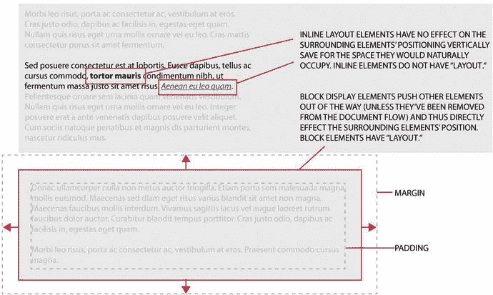

# 三、我们去过的地方：定位、浮动和显示

本章介绍 CSS2.1 和 CSS1 布局模块。它既是现有布局选项的总结，也是基于 CSS 布局的“老式”方法的最佳实践指南/参考指南。有经验的网页设计师可能会选择跳过这一章，但是你可能会错过一些有用的技术和方法，即使是最老练的网页设计师也可能不知道。本章包括以下内容:

*   CSS 布局介绍
*   CSS2.1 布局模块
*   如何使用它们
*   真实世界的例子

您将快速浏览 CSS 提供的所有布局范例，从 CSS 的原始版本:Level 1 开始。请注意，CSS 提供的每个布局解决方案都是作为一个模块实现的。在 CSS3 之前，每个层次的整个 CSS 规范都包含在一个无所不包的模块中，而现在每个层次都被分割成自己独立的模块；为了简单起见，我把每种方法都当作一个单独的模块来讨论。

正如在第一章提到的，CSS 之前，HTML 在布局控制方面没有提供太多。设计者找到了一种巧妙的方法来制作复杂的布局:通过使用表格在页面上精确定位元素来破解 HTML 规范。表格是一个非常有用的布局工具，因为它们为单个内容的定位提供了一个可控的解决方案。然而，HTML 表格从来就不是用来布局的；所以，从语义上来说，这次黑客攻击是一场灾难。由于整个方法是一种变通方法，所以还存在内容的可维护性和可读性问题。发现六七层深度的嵌套表并不少见。

随着 CSS1 的到来，焦点开始从使用 HTML 渲染一切转移开来。取而代之的是，将内容从审美呈现中分离出来的思想得以确立。

Note

如果你已经是 CSS2 布局的专家，这一章不会给你提供任何新的见解，所以可以直接跳到第四章。如果你是网页设计新手，请继续阅读 CSS2 和 CSS1 提供的布局选项。

## CSS3 之前的布局

正如在第二章中提到的，除了根据语义层次标记内容的能力之外，HTML 不是为布局而设计的。网络的第一个版本仅仅是为了方便访问和检索而互相链接的科学文献的集合。HTML 语言确实发展到以对齐的形式加入了一些有限的布局选项，但在早期，布局主要是通过误用`<table>`标签实现的。

想象一下这样一个场景:您想要为 Web 创建一个布局，其特征不仅仅是像 Word 文档一样的一系列内容。你的设计需要两栏(现代的说法是侧栏)。使用直接的 HTML 这实际上是不可能的，直到有人注意到`<table>`标签提供了这种程度的布局控制。图 3-1 显示了一个没有任何“布局”的布局，旁边是一个使用表格创建“布局”的布局很容易看出哪一个在视觉上更有吸引力——难怪设计师们想尽一切办法来美化和拓展网页设计的边界。


图 3-1。

A linear layout versus a table-based layout , demonstrating the attraction of using tables when there were no other options available to designers

通过使用表格来排列不同的内容，设计者能够精确地控制元素在页面上的位置。尽管表格是为表示表格数据集而设计的。这种方法曾一度奏效，但随着设计师开始寻求更具进步性的设计，布局革命变得不顺利。使用表格可以实现极其复杂的布局，但是设计越复杂，就越有可能需要表格中的表格和跨越多列或多行的单元格；这导致了一种可怕的意大利面条式代码，难以破译，维护起来也很糟糕。

然而，难以理解的代码并不是表格独有的问题。作为将风格与内容分离的更广泛策略的一部分，W3C 致力于设计 CSS。直到 CSS2 才出现了任何特定于布局的特性；本章介绍了这些功能。

第二章列出了布局范例。本章从实际应用的角度讨论了所有的选项，所以让我们把浮动布局添加到列表中。在 CSS3 到来之前，可用的 CSS 布局选项如下:

*   块布局:用于在布局文档时控制框
*   嵌入式布局:用于布局文本
*   表格布局:用于在二维网格中显示和布局表格数据
*   相对和定位布局:允许在页面上显式定位元素，或者对文档流做出反应并影响后续元素，或者将它们从文档流中移除并使它们对页面上的周围元素没有影响
*   浮动布局:允许元素在出现时从文档流中移除，但仍会影响页面上相对定位的元素

如果您对表格布局感到困惑，这是可以理解的。使用表格进行布局的想法从来没有问题，但是 HTML 表格实现并不是为适应布局而设计的。所以 CSS 2.1 规范引入了表格布局作为布局范式。让我们来看看实现布局的每一个选项，包括一些基本的例子，如果你是网页布局的新手，这些例子可以帮助你迅速进入角色。

### 相对和绝对定位

默认情况下，页面上的 HTML 元素采用相对定位。这意味着它们会将其他元素挤出来，为它们在文档中占据的位置腾出空间。如果您选择为某个元素分配绝对定位，您将从普通文档流中删除该元素，并且它不再与页面上的其他元素争夺位置。此外，相对定位的元素作为页面上的在先元素的结果被放置在页面上，而绝对定位的元素可以被分配坐标来占据。看看清单 3-1 中的代码，看看这两个选项是如何工作的。

```html
<style>
.relative {
 position: relative;
 width: 100px;
 height: 100px;
 background: red;
 margin: 10px;
}
.absolute {
 position: absolute;
 top: 100px;
 left: 200px;
 width: 100px;
 height: 100px;
 background: yellow;
 margin: 10px;
}
</style>
<div class="relative">Element 1</div>
<div class="relative">Element 2</div>
<div class="relative">Element 3</div>
<div class="absolute">Element 4</div>
<div class="absolute">Element 5</div>
<div class="absolute">Element 6</div>

Listing 3-1.Difference between Relative and Absolute Positioning

```

列表 3-1 的结果如图 3-2 所示:相对定位的元素整齐地堆叠在一起，由于`margin`属性引入了 10px 的间隙。但是，绝对定位的元素都堆叠在彼此的顶部，因此您只能看到最近绘制的元素(元素 6)。这是 z- index 的一个例子，您可以在元素上设置一个属性，以改变它们在页面上的元素堆栈中的显示顺序，进而改变它们的绘制顺序。


图 3-2。

The result of the code in Listing 3-1

绝对定位元素提供了大量的精细控制，但是当你处理不同大小的屏幕和浏览器窗口时，它们并不总是很方便。通常，您会希望文档流决定元素在页面上的显示位置。值得注意的是，绝对定位使用相对于其父元素的坐标。这意味着如果您将绝对定位的元素放在相对定位的元素中，绝对定位的元素会移动以反映父元素的位置。得心应手！

请看清单 3-2 中所示的示例代码，看看这在实践中是如何工作的。结果如图 3-3 所示。请注意，绝对定位的元素可以呈现在其相对父元素的边界之外。父节点只是提供计算位置的锚点。还值得强调的是，本例中最后一个绝对定位的元素不是位于相对定位的`<div>`中，而是位于相对定位的`<body>`中:它看起来呈现在页面的更高处，因为定位坐标是从整个页面的左上角开始计算的，而不是位于页面上其他地方的元素。


图 3-3。

The result of the code in Listing 3-2

```html
<style>
.relative {
 position: relative;
 top: 100px;
 left: 100px;
 width: 100px;
 height: 100px;
 background: red;
 margin: 10px;
}
#absolute1 {
 position: absolute;
 top: 100px;
 left: 200px;
 width: 100px;
 height: 100px;
 background: yellow;
}
#absolute2 {
 position: absolute;
 top: 100px;
 left: 200px;
 width: 100px;
 height: 100px;
 background: purple;
}
#absolute3 {
 position: absolute;
 top: 100px;
 left: 200px;
 width: 100px;
 height: 100px;
 background: yellow;
}
</style>
<div class="relative">
 Element 1
 <div id="absolute1">Element 4</div>
</div>
<div class="relative">Element 2</div>
<div class="relative">
 Element 3
 <div id="absolute2">Element 5</div>
</div>
<div id="absolute3">Element 6</div>

Listing 3-2.An elaboration on the previous example, showing the difference between relative and absolute positioning

```

相对定位和绝对定位的结合可以为 Web 上许多不同的布局挑战提供一个好的解决方案，但绝不是所有的挑战。以之前的例子为例，设计师想要将侧边栏合并到页面中。绝对定位的元素会给人一种侧边栏的感觉，但是因为绝对定位从文档流中删除了一个元素，所以侧边栏不会考虑页面上的任何其他内容。它会遮住任何想要呈现在它下面的内容，并且不会对它周围的任何其他内容区域做出反应。在这种情况下，设计师转而使用浮动元素。

### 浮动布局

浮动元素就是这样做的:它们在父元素中浮动，或者向左，或者向右。父元素中的内容不能侵犯浮动元素占用的空间。相反，内容围绕浮动元素流动，允许它继续影响周围的元素。但是，请注意，浮动元素会将其从页面的大小调整流程中移除。

与绝对位于相对元素内的定位元素一样，浮动不需要保持在父元素的范围内(尽管它们在水平轴上保持不变)。为什么这是一个问题？因为浮动元素可能会从相对定位元素的底部漏出，影响页面上后续相对定位元素的定位。

让我们看一个这种效果的例子。清单 3-3 显示了一个位于相对定位的父元素中的基本浮动元素。清单 3-4 扩展了布局，添加了额外的浮动元素，使它们溢出了父元素的底部。图 3-4 为列表 3-3 的结果，图 3-5 为列表 3-4 的结果。


图 3-5。

The result of Listing 3-4. Note how floating elements do not contribute to the height of the relatively positioned parent element


图 3-4。

The result of Listing 3-3

```html
<style>
.relative {
 position: relative;
 width: 300px;
 background: grey;
 margin: 10px;
 padding: 10px;
}
#floater {
 float: right;
 width: 160px;
 height: 160px;
 padding: 10px;
 margin: 10px;
 background: green;
}
</style>
<div class="relative">
  <div id="floater">Floating element</div>
  <p>Cras justo odio, dapibus ac facilisis in, egestas eget quam. Etiam porta sem malesuada magna mollis euismod. Vestibulum id ligula porta felis euismod semper. Fusce dapibus, tellus ac cursus commodo, tortor mauris condimentum nibh, ut fermentum massa justo sit amet risus.</p>
</div>

Listing 3-3.Continuing to explore the differences between Relative and Absolute Positioning

```

```html
<style>
.relative {
 position: relative;
 width: 300px;
 background: grey;
 margin: 10px;
 padding: 10px;
}
.floater {
 float: right;
 width: 160px;
 height: 160px;
 padding: 10px;
 margin: 10px;
 background: green;
}
</style>
<div class="relative">
  <div class="floater">Floating element 1</div>
  <div class="floater">Floating element 2</div>
  <div class="floater">Floating element 3</div>
  <div class="floater">Floating element 4</div>
 <p>Cras justo odio, dapibus ac facilisis in, egestas eget quam. Etiam porta sem malesuada magna mollis euismod. Vestibulum id ligula porta felis euismod semper. Fusce dapibus, tellus ac cursus commodo, tortor mauris condimentum nibh, ut fermentum massa justo sit amet risus.</p>
</div>

Listing 3-4.Floating Element within a Relative Parent: Content within the Relative Element Flows around the Floating Element

```

在 CSS3 之前，浮动元素通常用于创建水平导航栏。但是正如您将看到的，CSS3 中有新的、令人兴奋的(并且更加可靠的)选项。

浮动最大的问题是它们不可预测。有一些变通办法，如清单 3-5 所示，它使用`clear`属性来指示一个元素仅在所有浮动元素完成渲染后才出现。但是这些变通办法往往会导致页面上出现多余的代码或冗余的元素，比如一个`<br>`标签仅仅用于扩展一个相对定位的元素以完全包围一个浮动的子元素。同样值得一提的是，浮动元素不会影响结构布局，所以使用浮动元素创建的侧边栏在高度上无法与其父元素匹配，除非求助于黑客或脚本。

```html
<style>
.relative {
 position: relative;
 width: 300px;
 background: grey;
 margin: 10px;
 padding: 10px;
}
.floater {
 float: right;
 width: 60px;
 height: 60px;
 padding: 10px;
 margin: 10px;
 background: green;
}
.clearfloat {
 clear: right;
}
</style>
<div class="relative">
  <div class="floater">Floating element 1</div>
  <div class="floater clearfloat">Floating element 2</div>
  <div class="floater">Floating element 3</div>
  <div class="floater ">Floating element 4</div>
  <p>Cras justo odio, dapibus ac facilisis in, egestas eget quam. Etiam porta sem malesuada magna mollis euismod. Vestibulum id ligula porta felis euismod semper. Fusce dapibus, tellus ac cursus commodo, tortor mauris condimentum nibh, ut fermentum massa justo sit amet risus.</p>
  <br class="clearfloat" /> <!-- this isn't necessary on this page, but is commonly used to ensure the <div> with a class of relative expands to encapsulate the floating elements -->
</div>

Listing 3-5.Using the clear Property to Ensure that the Second Floating Element Doesn’t Stack Next to the First

```

图 3-6 显示了列表 3-5 的结果。属性强制周围的元素考虑浮动；但是正如您在最后一行代码中看到的，这可能会导致额外的元素被引入到标记中，仅仅是为了解决浮动的限制。这可不是什么好事！毕竟，CSS 旨在促进样式和内容的分离。


图 3-6。

The output of Listing 3-5

先不说警告，浮动元素肯定有它们的用处。出现在文本块中的图像、引用、节内导航和旁白都是`float`属性的有效用法，所以不要把它当作布局工具。

到目前为止，本章讨论的所有内容都依赖于所讨论的元素在页面上的大小和位置。这就是所谓的块显示，这也是下一节要讨论的内容。

### 块和内嵌显示

页面上的元素有两种不同的显示类型，任何特定元素的默认显示样式取决于其语义功能。让我们看看每个术语的含义:

*   块显示意味着元素占据水平和垂直空间，用一个不可见的边界框包围它。块元素替换页面上的其他元素，导致它们移动位置以适应其边界框的空间。块级元素总是从新的垂直空间开始，并占据全部可用宽度，尽可能地延伸。
*   内联显示意味着元素位于内容流中，占据水平空间，但不影响垂直布局，除非元素的比例导致任何位移。

图 3-7 中的图表显示了两种显示类型之间的差异。



图 3-7。

Differences between block and inline display, and how each impacts layout Note

请记住，当我说垂直和水平时，我假设您正在使用从左到右、从上到下的拉丁语。CSS 现在也支持其他阅读方向，但是为了避免混淆，我将这些术语作为页面上使用的阅读方向的同义词。

还有一种你没见过的展示:没有。如果将`display`属性设置为`none`，该元素会保留在页面上，但不会被渲染引擎绘制，也不会对周围的元素产生任何位移。您可能想知道何时需要使用`display` `: none`，因为排除 HTML 代码肯定比使用 CSS 隐藏元素更有意义。考虑一下弹出式模态对话框、页面的“阅读更多”部分和下拉菜单系统。将`display`属性的值设置为`none`是一种非常有用的能力，没有它，你在网上遇到的很多交互都是不可能的！(如果你真的需要隐藏一个元素，但仍然让它占据页面上的空间，使用`visibility: hidden`而不是`display: none`。当你准备好再次展示时，使用`visibility: visible`。这将继续渲染对象，但阻止它在屏幕上绘制，允许它继续占用布局中的空间。)

让我们看一些块元素和内联元素的例子。表 3-1 显示了每种情况的一些常见示例。

表 3-1。

Examples of Elements that Are Either `display: block` or `display: inline` by Default (CSS Allows You to Overwrite This Default)

<colgroup><col> <col></colgroup> 
| 块和内联元素的示例 |
| --- |
| 街区 | 在一条直线上的 |
| --- | --- |
| `<div>` | `<span>` |
| `<h1>` | `<strong>` |
| `<h2>` | `<em>` |
| `<h3>` | `<i>` |
| `<p>` |   |
| `<ul>` | `<u>` |
| `<li>` | `<a>` |
| `<article>` | `<abbr>` |
| `<header>` | `<br>` |

除了`display: block`、`display: inline`和`display: none`之外，还有另一个选项，它结合了`display: block`和`display: inline. Display: inline-block`的属性，在两者之间提供了一个折衷方案，允许元素内嵌放置，但占用指定的宽度和高度。`Inline-block`相对来说是 CSS 党的后来者，主要是因为在 CSS2.1 的早期，浏览器没有可靠地支持它。但它是另一个有价值的工具，也是帮助解决布局挑战的一个选择。清单 3-6 展示了`display: inline-block`的一个简单例子。结果如图 3-8 所示。


图 3-8。

The output of Listing 3-6, where elements have been given structure thanks to `display: inline-` `block`

```html
<style>
.relative {
 position: relative;
 padding: 10px;
 width: 500px;
 background: red;
 margin: 10px;
}
.navitem {
  display: inline-block;
  width: 70px;
  height: 40px;
  line-height: 40px;
  text-align: center;
  background: grey
}
</style>

<div class="relative">
  <h1>Example of inline-block</h1>
  <p>Here is some content <span>that includes an inline &lt;span&gt; element</span>.</p>
  <p>Here's some more content, and this time the &lt;span&gt; elements have the class navitem applied to them: <span class="navitem">Item 1</span> <span class="navitem">Item 2</span> <span class="navitem">Item 3</span></p>
  <p>Note that inline-block elements contribute to the layout.</p>
</div>

Listing 3-6.Using inline-block to Give Inline Elements Structure in the Form of Width and Height 

```

#### 显示属性如何影响布局？

如您所见，您对页面上元素的绘制方式有很大的控制权。`display`属性直接影响布局。默认情况下，一些元素的`width`和`height`不能被显式设置，因此它们不能影响周围的元素或它们在页面上的位置。其他的默认有影响。自然，您可以使用 CSS 中的`display`属性覆盖任何元素的默认属性。

让我们快速地看一下它的运行情况。清单 3-7 结合了相对和绝对定位；浮动元素；和内联块元素合并到一个页面中。这并不罕见；你通常会在最复杂的布局中找到各种布局的例子。列出 3-7 的结果如图 3-9 所示。


图 3-9。

The output of Listing 3-7. Note that different layout paradigms are suited to different solutions, so it’s common to use a range of tools to achieve a specific part of the overall layout

```html
<style>
.relative {
 padding: 10px;
 position: relative;
 width: 920px;
 background: #efefef;
 border: 1px solid #ccc;
 margin: 10px auto;
}
#header {
 position: relative;
 padding: 10px;
 height: 80px;
 line-height: 80px;
 background: #999;
 color: #fff
}
#header h1 { font-weight: normal;margin:0;padding:0;}
#search {
 position: absolute;
 top: 10px;
 right:10px;
}
#search input {
 padding: 5px;
}
#nav {
 position: relative;
 height: 30px;
 background: #ccc;
}
#nav ul {
 margin: 0;
 padding: 0;
}
#nav ul li {
 float: left;
 list-style:none;
 padding: 0;
 margin: 0 3px;
 width: 70px;
 height: 30px;
 line-height: 30px;
 text-align: center;
 background: #ddd;
}
.sidebar {
 float: right;
 width: 200px;
 background: #ebebeb;
 padding: 10px;
}
.ib {
 display: inline-block;
 width: 70px;
 line-height: 30px;
 text-align: center;
 background: #ddd;
 border: #ccc;
 margin: 5px;
}
.clearfloat {
 clear: both;
}
</style>

<div class="relative">
 <div id="header">
  <h1>Site Name</h1>
  <form id="search"><input type="text" value="search site" /></form>
 </div>
 <div id="nav">
  <ul>
   <li><a href="#">Home</a></li>
   <li><a href="#">About</a></li>
   <li><a href="#">Contact</a></li>
  </ul>
 </div>
 <div class="sidebar">
  <h3>Popular CSS modules</h3>
  <p><span class="ib">CSS Flexbox</span><span class="ib">CSS Multi-Column</span><span class="ib">CSS Regions</span><span class="ib">CSS Grid Layout</span><span class="ib">CSS Shapes</span></p>
 </div>
 <div id="content">
  <h2>Welcome to our website</h2>
  <p>Praesent commodo cursus magna, vel scelerisque nisl consectetur et. Curabitur blandit tempus porttitor. Maecenas faucibus mollis interdum. Aenean eu leo quam. Pellentesque ornare sem lacinia quam venenatis vestibulum.</p>
  <p>Donec id elit non mi porta gravida at eget metus. Vivamus sagittis lacus vel augue laoreet rutrum faucibus dolor auctor. Curabitur blandit tempus porttitor. Donec sed odio dui. Maecenas sed diam eget risus varius blandit sit amet non magna.</p>
  <p>Praesent commodo cursus magna, vel scelerisque nisl consectetur et. Donec id elit non mi porta gravida at eget metus. Praesent commodo cursus magna, vel scelerisque nisl consectetur et. Nulla vitae elit libero, a pharetra augue.</p>
  <p>Sed posuere consectetur est at lobortis. Sed posuere consectetur est at lobortis. Maecenas sed diam eget risus varius blandit sit amet non magna. Nullam id dolor id nibh ultricies vehicula ut id elit.</p>
 </div>
 <br class="clearfloat" />
</div>

Listing 3-7.Combining relative, absolute, float, inline, block, and inline-block Elements into One Example Layout

```

### 表格布局

本章讨论的最后一个布局工具是表格布局。正如你在第 1 和 2 章中所看到的，从网络的早期开始，表格就被用来实现布局。一旦 CSS 变得可用和可靠，Web 上就出现了强烈的反表格布局运动，结果表格布局几乎成了禁忌。这是一种基于 HTML 中的表格仅仅是为了使用表格数据而形成的观点，而不是为了页面的布局和显示。

因此，区分 HTML 表格和 CSS 表格是很重要的。这里讨论的表格布局是通过将`display: table`分配给一个容器元素实现的。将`display: table`应用到现有的页面元素和使用 HTML `<table>`元素的区别在于，根据定义，`<table>`元素是并且将永远是一个表格。将`display: table`设置为属性的`<div>`可以简单地通过编辑 CSS 代码或使用`@media`查询来更改为使用不同的布局范式。CSS 表格有利于布局！

CSS 表格布局提供了一种基于样式的解决方案，以类似于 HTML 表格但又不完全相同的方式呈现内容。每个不同表格元素的相应属性值如下:

<colgroup><col></colgroup> 
| `table    { display: table }` |
| `tr       { display: table-row }` |
| `thead    { display: table-header-group }` |
| `tbody    { display: table-row-group }` |
| `tfoot    { display: table-footer-group }` |
| `col      { display: table-column }` |
| `colgroup { display: table-column-group }` |
| `td, th   { display: table-cell }` |
| `caption  { display: table-caption }` |

清单 3-8 展示了如何使用其中的每一个来实现基于表格的布局，以及该方法提供的所有好处。结果如图 3-10 所示。


图 3-10。

A page layout achieved using `display: table`. This is practically impossible to achieve without table layout, unless you use scripts or CSS3! Note that some properties have been ignored and aren’t rendered in the final page. `display: table` works just like an HTML table!

```html
<style>
 .table {
  display: table;
  border: 1px solid red;
  background: #eee;
  margin: 2px;
  padding: 2px;
 }
 .tr {
  display: table-row;
  border: 1px solid red;
  background: #ddd;
  margin: 2px;
  padding: 2px;
 }
 .td {
  display: table-cell;
  border: 1px solid #red;
 width: 200px;
 background: #ccc;
 margin: 2px;
 padding: 2px;
 }
</style>
<div class="table">
 <div class="tr">
  <div class="td"><p>This is a normal div, but displays like a cell in a table!</p></div>
  <div class="td"><p>This is another table cell</p></div>
 </div>
 <div class="tr">
  <div class="td"><p>Here is a third cell, in a second row</p></div>
  <div class="td"><p>And a final cell.</p></div>
 </div>
</div>

Listing 3-8.Creating a Layout Using display: table Properties to Achieve Something that’s Very Difficult Using Alternative CSS2.1 Layout Options

```

CSS 表格布局是一个非常有用的布局工具，是无数场景中的最佳选择。在 CSS3 出现之前，实现三列布局是一个很好的选择，其中各个列匹配最长列的高度，而不需要脚本或黑客。这也是一种垂直对齐内容的有用方式，而不必求助于负边距或其他类似的解决方法。但是这本书是关于 CSS3 的——让我们不要花太多时间担心`display: table`。您可能会遇到这种情况，作为一种潜在的布局工具，它当然不容忽视，但您阅读本书并不是为了了解基于表格的布局！

本章的要点是 CSS 布局模块不是孤立存在的。你几乎不可能遇到一个设计不包含 CSS 布局选项的样式。成功的设计师使用最好的工具，所以在设计页面时，不要害怕调用 CSS2.1 布局模块。在设计元素中找到最适合您的特定需求的布局模块，并使用它。

## 摘要

在本章中，您已经看到了 CSS3 之前可用的布局选项的高级概述。一些基本的例子有助于解释这些选项，本章还谈到了使用这些模块的一些布局限制。设计网站时，您每天都会用到所有这些布局模块；因此，如果你的胃口被激起，你想进一步阅读，去看看涵盖 CSS2.1 的书籍。

现在你已经准备好使用 CSS2.1 创建布局了。让我们直奔主题，开始学习新的东西:是时候探索 CSS3 布局了！