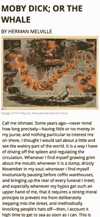
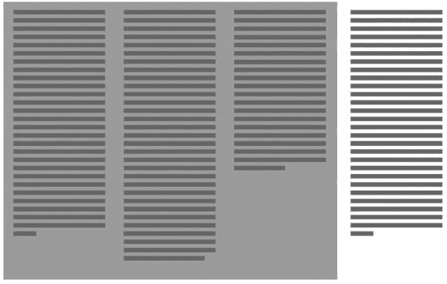

# 四、CSS 多列布局

CSS 多列布局模块提供了一个解决方案，这个方案解决了 web 设计者从 Web 诞生之初就面临的一个基本布局问题:如何排列内容，使其占据多个垂直容器，如报纸或杂志。多年来，聪明的网页设计者开发了各种变通方法来创建多栏布局。最初，这涉及到使用表格来对齐内容列，就好像每个元素都是单元格中的一个值一样。最近，浮动元素、清除元素和偶尔的 JavaScript 的巧妙组合提供了更具语义的解决方案，但这些方法都不太适合创建多栏布局。新的 CSS3 模块克服了许多与生成这种布局相关的问题，自动处理内容的流动和分发；而且浏览器支持已经相当不错了，所以今天开始使用这个模块还是相对安全的！

Note

虽然浏览器的支持已经很好了，但是浏览器厂商还在实现这个模块。所有常见的警告都适用！

## 什么是 CSS 多栏布局模块？

CSS 多列布局提供了一种将内容区域划分成列的解决方案，内容可以自动分页。与本书中涉及的其他全新布局模块不同，多列布局模块扩展了现有的 CSS box 模型。因为新模块建立在现有布局范例之上，所以回退是自动处理的。不理解多栏布局属性的浏览器会忽略它们，将内容区域呈现在单个栏中，而不是呈现为多个栏；见图 4-1 。


图 4-1。

CSS Multi-column Layout in action versus a fallback non-columnar layout in the same container

## 语法和结构

CSS 多列布局模块扩展了现有的 CSS 框模型，总共增加了十个属性。其中的每一个都提供了对内容呈现到容器中的列的方式的一个方面的控制。

因为所有属性都影响单个容器，所以从浏览器的角度来看，该模块非常容易理解，而且更重要的是，实现起来非常简单。因此,“在野外”对这个模块的支持是极好的！如果您的用户使用他们选择的最新版本的浏览器，您的内容将以列的形式呈现，每个常用的浏览器都支持此模块。

Note

与任何新的 CSS3 布局模块一样，在所有浏览器和操作系统组合中进行彻底测试总是值得的。您可以在 [`http://caniuse.com/`](http://caniuse.com/) 查看最新的浏览器对 CSS 多栏的支持表。

### 基本概念

CSS3 多列布局模块引入了十个可以应用于块级元素的新属性。除了控制列数、分布、宽度和分段的新属性之外，还有一些新的关键字可用于帮助控制内容跨列拆分的方式。

使用多栏布局模块创建多栏布局非常简单。没有不必要的复杂属性需要学习；因为所有事情都发生在单个元素中，所以除了你熟悉的 CSS2.1 的规则之外，没有必要担心内容如何在容器外包装。

仅使用这十个属性，您就可以执行以下操作:

*   将现有的单列元素转换为多列元素
*   内容自动跨列换行
*   控制列填充可用空间的方式，或者通过扩展以填充容器，或者始终遵循预设大小(这对于创建响应性布局很方便)
*   定义出现在列之间的边框和装订线宽度
*   呈现内容，使其跨越多列，以便在需要时打破分栏布局

关于溢出内容的呈现方式以及内容跨列分隔的方式，有一些特殊的规则。你将在本章的后面详细了解这些。

值得一提的是 CSS 多列布局允许您做的事情列表中的第三项。开箱即用，CSS 列可以快速响应。这意味着，如果您希望针对多种不同的设备配置对内容进行定位和分页，这是一个理想的布局模块。有很多方法可以打破这种固有的响应能力，但接下来的几页将重点介绍需要注意的事项。

CSS 列的响应特性不仅限于文本。图像也遵循分栏布局，因此通过使用典型的响应图像技术，您还可以使图片缩放以适合用于查看页面的屏幕。这是一个很好的节省时间的方法，也是值得你花时间熟悉这个模块的另一个原因。

我希望你相信 CSS 多列布局是你布局武库中的一个有用工具。让我们深入研究一下代码，看看它是如何工作的。

#### 理解术语

与本书中涉及的一些其他布局模块不同，CSS 多列布局模块使用了我们都熟悉的现有布局范例。这使得理解和开始在你的布局中使用模块变得非常容易。也就是说(以防你对列的概念不太熟悉)，让我们快速了解一下列这个词在 CSS 环境中的含义。

列是在整个容器中呈现内容的垂直划分。一个容器可以包含一列或多列，内容根据所用语言的规则从一列流向下一列。如果您用英语创作，列从左到右呈现。当内容溢出第一列时，它开始在下一列的顶部呈现。当所有的列都被使用时，根据正常的 HTML/CSS 规则，内容会溢出，尽管这可能会导致额外的列——您稍后会看到这一点。

CSS 多列模块的好处之一是，默认情况下，容器的高度会自动计算以容纳所有内容。这很有用，也是使用该模块优于一些旧的变通解决方案的主要好处之一。开箱即用，内容还会自动在所有列之间平衡，从而产生一个令人满意的内容块，它被划分为整齐的列，以符合您的规范。

图 4-2 展示了 CSS 多栏布局讨论中使用的不同属性。你可能会很快学会，因为它很直观；但是如果你不确定`column-fill`和`column-span`之间的区别，这个数字还是值得参考的。


图 4-2。

The terms used to talk about multi-column layouts in CSS3

在全神贯注于理论和财产名称/价值之前，让我们看一个例子。基本多栏布局的代码如清单 4-1 所示，您可以在图 4-3 中看到一个输出示例。在接下来的几页中，我将解释这个例子中发生了什么。注意，与所有使用供应商前缀属性实现的新兴模块一样，您可能需要添加`-webkit-`或`-moz-`前缀来使其显示在您的浏览器中。


图 4-3。

The resulting appearance from the combination of HTML and CSS code in Listing 4-1, shown at normal desktop resolution of greater than 960px width

```html
<style>
.multicol {
  position:    relative;
  margin:    auto;
  max-width:    960px;
  columns:    4 12em;
  column-gap:    2em;
  column-rule:    1px solid red;
}
.multicol p {
  padding:    0.25em;
}
.multicol figure {
  margin:    0;
  padding:    0;
  width:    100%;
}
.multicol figcaption {
  color:    #999;
  font-size:    0.7em;
}
.multicol img {
  width:    100%;
}
.multicol h1 {
  column-span:    all;
  margin:    0.25em 0;
  padding:    0;
}
.multicol h2 {
  margin:    0.25em 0;
  padding:    0;
}
</style>

<article class="multicol">
  <h1>Moby Dick; Or the Whale</h1>
  <h2>by Herman Melville</h2>
  <figure>
    
    <figcaption>Voyage of the Pequod, illustrated by Everett Henry</figcaption>
  </figure>
  <p>Call me Ishmael. Some years ago—never mind how long precisely—having little or no money in my purse, and nothing particular to interest me on shore, I thought I would sail about a little ... How then is this? Are the green fields gone? What do they here?</p>
</article>

Listing 4-1.HTML Markup Being Styled with CSS Multi-column Layout Properties

```

这个例子真正有用的地方在于它能立即响应，正如你在图 4-4 和 4-5 中看到的，我已经缩小了浏览器窗口的宽度来模拟更小的屏幕。让我们看看这个例子的不同元素。



图 4-5。

The result of Listing 4-1 rendered at 320px wide—the most common smartphone resolution


图 4-4。

The same rendering shown with a reduced browser window width Note

需要一些额外的非多栏布局代码来定义图 4-3 、 4-4 和 4-5 中所示的颜色、边框和印刷样式。我还删减了清单 4-1 中标记的段落内容以节省空间。

### HTML 标记

我不需要谈论 HTML，因为您正在使用标准的语义元素作为内容的容器。使用 CSS 多列布局没有特殊的标记要求；使用此模块，任何块级元素都可以应用多个列。

### 多列模型

关于图 4-3 和清单 4-1 中所示的例子，有一些事情需要注意，特别是关于内容如何在容器中呈现。在最初的 CSS 盒模型中，元素的内容流入该元素的内容盒。CSS 多列布局引入了一种新类型的容器，它存在于内容框和实际内容之间。W3C 称之为列框(简称为 column)。内容在一个元素内自动跨列流动，以内嵌(或阅读)方向流动。在基于拉丁语的语言(如英语)中，这是从左到右的。

列被排列成行。一行中的所有列都有相同的宽度和高度。列之间可以有间隔，这被称为列间距(或印刷术语中的装订线)。在大多数屏幕情况下，拆分成列的元素只有一行。但是，在特殊情况下，一个元素可能包含多行列。打印的文档也可以由多行组成，其中一个内容区域占据多个打印页面。在本章的后面，您将看到一个屏幕上多行的示例。

我在解释 CSS3 多栏布局时使用 W3C 的语言。出于这个原因，当谈到应用了多列属性的容器时，我引用了`multicol`元素。多列(`multicol`)元素是其`column-width`或`column-count`未被设置为`auto`的任何容器。如您所见，在这种情况下，我使用了一个`<article>`元素。为了避免混淆，我也使用`multicol`作为属于这个元素的类的名称。

下一节中涉及的所有单个属性都应用于`multicol`元素。在 CSS3 中，不可能在单个列上设置属性和值。明确地说，这意味着您不能为某一列指定`background`、`padding`或`margin`。

Note

应用于`multicol`元素的`Padding`和`margin`被应用于容器，而不是它的列

虽然您不能控制单个列，但理解浏览器呈现器将它们视为独立的块级框(就像表格单元格一样)是很重要的。每个列框充当其内容的包含块。这意味着，例如，应用于在列中呈现的段落元素的`margin`和`padding`被应用于该列的包含块的边缘。

### CSS 属性

查看清单 4-1 和图 4-3 、 4-4 和 4-5 中所示示例的 CSS 代码，看起来不熟悉的第一段代码应该是使用了`columns`属性。这是为两个 CSS 属性定义值的简写(参见清单 4-2 )。

```html
.multicol {
 columns: 4 12em;
}

Listing 4-2.Defining the <article> with a class of multicol as Having Four Columns, Each of Width 12em

```

正如我刚才提到的，`columns`属性是两个 CSS 属性的简写:`column-count`和`column-width`。在这种情况下，我已经为`.multicol`元素分配了四列，每列的宽度为`12em`。需要注意的是，浏览器不一定会完全呈现您指定的内容。如果没有足够的空间来创建四列，每列的宽度为`12em`，渲染引擎会删除列以使其适合。结果宽度可能不是`12em`，列数可能不是四列！

这意味着当您使用 CSS 多列布局模块定义列时，您不能确定浏览器将准确呈现您直观期望的内容。这听起来像是一个糟糕的实现；但是正如您将看到的，它是该模块最强大的方面之一的基础:CSS3 多列布局在默认情况下是响应性的。

#### 列计数

`column-count`定义一个`multicol`元素应该被分成的列数。正如您将看到的，规则决定了浏览器是否尊重该属性。如果未指定或设置为`auto`，则根据`column-width`属性值划分空间。

#### 列宽

`column-width`指定了每列在`multicol`元素中应该占据的最小宽度。注意，我说的是最低限度，不是最终的！同样，渲染引擎遵循一系列逻辑规则来确定是否严格遵守该规则。如果未指定或设置为`auto`，列宽由拆分成的列数决定——根据`column-count`属性值。

#### 列

`columns`属性是组合`column-count`和`column-width`属性的有效快捷方式。根据您传递给`columns`属性的值，浏览器会以不同的方式解释您的意图，因此理解所有可能的排列很重要。我在代码清单 4-3 中借用了 W3C 的示例代码来帮助说明。

记住这是如何工作的一个简单方法是，如果你使用单个值和一个单位，浏览器会将其解释为一个`column-width`值。如果省略一个单位，该值将被解释为一个`column-count`值。如果您不确定，请指定两个值:一个有宽度单位，一个没有计数单位。

```html
columns: 12em;      /* equates to column-width: 12em; column-count: auto */
columns: auto 12em; /* equates to column-width: 12em; column-count: auto */
columns: 2;         /* equates to column-width: auto; column-count: 2 */
columns: 2 auto;    /* equates to column-width: auto; column-count: 2 */
columns: auto;      /* equates to column-width: auto; column-count: auto */
columns: auto auto; /* equates to column-width: auto; column-count: auto */

Listing 4-3.Effective Longhand Version of Each of Six Property Values Assigned Using the columns Shorthand Property

```

#### 删除列和更改宽度的规则

如前所述，浏览器的渲染引擎并不总是严格遵循您对`multicol`元素的宽度和总列数的定义。W3C 的 CSS3 多列布局模块规范定义了如何以及何时改变呈现意图的规则。W3C 提供了一个伪代码列表来显示要应用的逻辑。我在清单 4-4 中复制了这个；上市后可以找我翻译的规则，不用担心看不懂这段代码！

```html
if ((column-width = auto) and (column-count = auto)) then
    exit; /* not a multicol element */

if ((available-width = unknown) and (column-count = auto)) then
    exit; /* no columns */

if (available-width = unknown) and (column-count != auto) and (column-width != auto) then
    N := column-count;
    W := column-width;
    exit;

if (available-width = unknown) then
   available-width := shrink-to-fit;

if (column-width = auto) and (column-count != auto) then
    N := column-count;
    W := max(0, (available-width - ((N - 1) * column-gap)) / N);
    exit;

if (column-width != auto) and (column-count = auto) then
    N := max(1, floor((available-width + column-gap) / (column-width + column-gap)));
    W := ((available-width + column-gap) / N) - column-gap;
    exit;

if (column-width != auto) and (column-count != auto) then
    N := min(column-count, floor((available-width + column-gap) / (column-width + column-gap)))
    W := ((available-width + column-gap) / N) - column-gap;
    Exit

Listing 4-4.W3C’s Pseudocode for Calculating the Width and Number of Columns According to the Values Set for the column-width and column-count Properties

```

下面是我对清单 4-4 中伪代码的翻译。请注意，规则和条件是按照以下顺序进行比较和操作的:

If the `column-count` and `column-width` properties are both either unset or set to `auto`, no columns are rendered. The same is true if `column-count` is set to `auto` and the width of the `multicol` element is unrestricted.   If the `column-count` and `column-width` properties both have values and a width hasn’t been specified for the `multicol` element, use the values exactly as they are specified.   If the `column-count` property has been set with a value other than `auto` and the `column-width` property has been set to `auto`, divide the available width into the number of columns specified.   If the `column-width` property has been set with a value other than `auto`, the `column-count` property has been set to `auto`, and the container has a specified width, set the number of columns to match the available space divided by the specified width of each column. This may mean the columns end up wider than specified, if the width of the `multicol` element doesn’t divide perfectly by the specified width of each column.   If the `column-count` and `column-width` properties have both been set with a value other than `auto` and the width of the `multicol` element has been set, look at whether the combination of width and count will fit inside the container element. If not, reduce the number of columns to match the number of times the specified width of each column will fit in the available space, and then expand the column width to fill the `multicol` element using the calculated `column-count`.  

我希望您可以看到这种方法不仅有意义，而且使 CSS3 多列布局模块非常灵活。它被设计为自动响应，同时尽可能接近地尊重指定的`column-count`和`column-width`属性的值。

#### 列间隙

如果你关注清单 4-4 中的代码，你会发现一个我还没有讨论的新属性:`column-gap. column-gap`用于定义列之间的装订线宽度。图 4-3 中的例子使用了`column-gap`。您可以在清单 4-5 中再次看到`.multicol`元素的完整定义。

```html
.multicol {
  position:    relative;
  margin:    auto;
  max-width:    960px;
  columns:    4 12em;
  column-gap:    2em;
  column-rule:    1px solid red;
}

Listing 4-5.Stylesheet Definition for the .multicol Element, Showing the column-gap Property in Use

```

与`column-width`和`column-count`属性不同，`column-gap`属性是绝对的。这意味着如果您指定了一个值，浏览器将尊重该设置，即使这意味着牺牲列。

#### 列规则

属性控制是否在呈现的列之间画一条分隔线。`Column-rule`的工作方式与 CSS 1 和 2.1 中的`border`属性非常相似。事实上，与`border`属性一样，`column-rule`是三种不同属性的简写属性:

*   `Column-rule-width`:和`border-width`一样，这个属性接受一个单位的参数，比如`2px`，或者关键字`none`。
*   `Column-rule-style`:设置要渲染的线条样式。与`border-style`相同的选项可用，包括`dotted`、`dashed`、`solid`等。
*   `Column-rule-color`:该颜色属性可以使用浏览器支持的任何颜色模型进行设置，包括`hex`和`rgb()`。

Note

列标尺始终绘制在列间距(装订线)的正中央。

列规则(见图 4-6 )呈现为好像该列完全被内容填充，不管这是否是真的。如果样式表定义要求平衡填充列以外的内容，这很有用，因为这有助于直观地定义列所占的空间，即使它没有内容。回想一下，使用浮动元素生成列来实现这个简单的效果是多么困难！


图 4-6。

The column rule in action

#### 分栏符

通常，浏览器的渲染引擎决定如何以及在哪里在一个`multicol`元素中跨列分解内容。这在许多情况下都很有效，但是有时您可能希望控制内容的分割方式。例如，您可能想要强制内容在每个`<h3>`标签之前的新列中开始呈现。有三个属性可用于控制如何以及何时中断内容:`break-before`、`break-after`和`break-inside`。

##### 先断后合

此属性指定应该在应用元素之前应用分隔符。它接受以下值:`auto`|`always`|`avoid`|`left`|`right`|`page`|`column`|`avoid-page`|`avoid-column`。在 CSS3 多列布局的情况下，特别有趣的是`column`和`avoid-column`选项，它们确保或防止(在可能的情况下)在`multicol`元素中出现中断。

##### 中断后

此属性指定应该在应用了分隔符的元素之后应用分隔符。它接受以下值:`auto`|`always`|`avoid`|`left`|`right`|`page`|`column`|`avoid-page`|`avoid-column`。在 CSS3 多列布局的情况下，特别有趣的是`column`和`avoid-column`选项，它们确保或防止(在可能的情况下)在`multicol`元素中出现中断。

##### 闯入内部

与其他两个选项不同，`break-inside`控制内容在它所应用到的元素内部如何断开。它接受以下值:`auto` | `always` | `avoid` | `avoid-page` | `avoid-column`。在 CSS3 多栏布局的情况下，特别有趣的是`column`和`avoid-column`选项，它们确保或防止(在可能的情况下)一个`multicol`元素的中断。

Note

当分栏符拆分一个框时，该框的边距、边框和填充对拆分位置没有视觉效果。但是，分割后的利润立即生效。

#### 列跨度

`column-span`属性允许列中的块级元素超出该列的边界。将来可能会指定要跨越的列数，就像可以应用于表格单元格的`colspan`属性一样，但是在 CSS3 规范中只有两个可能的值:`none`和`all`。

默认情况下，`column-span`设置为`none`。这意味着内容在列的约束内呈现。如果它被设置为`all`，列将在元素被渲染的地方断开。这就产生了一种效果，一个`multicol`元素可以包含多行列。

#### 图像、响应和列中的裁剪

图像在布局中提出了一个特殊的问题，你不能绝对确定多少空间将被分配给它们的显示。有两种方法可以处理分栏布局中的图像:

*   用图像填充列宽，放大或缩小图像以匹配可用空间。
*   预先确定图像应该显示的大小，并根据需要环绕或裁剪图像以填充空间。

清单 4-1 中的例子，如图 4-3 、 4-4 和 4-5 所示，使用第一个选项。使用宽度为 100%的 CSS 规则会强制图像以整列宽度呈现。这有效地提高了图像的响应性，因为它可以根据可用空间的大小进行缩放。

另一种方法是以设定的大小呈现图像。就像任何其他块级容器一样，浮动元素在`multicol`元素中工作，但是被限制在呈现它们的列中的空间内。此外，如果呈现的图像占据的水平空间比列中可用的空间多，则图像会在该列的有效内容框的边缘被裁剪。这两种不同的图像渲染方法的区别如图 4-7 所示。


图 4-7。

Image 1 is set to 100% width, which allows it to scale to fit the column width. Image 2 uses an absolute size, forcing it to crop to the column width when the column is narrower than the image Note

如果您希望您的图像具有响应性，请使用第一种方法，因为它使图像能够根据可用空间调整大小。

#### 控制如何用内容填充列

使用 CSS3 多列布局，可以通过两种方式在列中填充内容:可以让内容在列之间平衡，也可以按顺序填充，直到内容用完。如果使用后一个选项，有可能会呈现一个或多个没有任何内容的列。

属性提供了对浏览器使用哪种方法的控制。它接受两个可能的值:`balance`和`auto`。正如您所料，`balance`在所有可用的列中平等地呈现内容，`auto`使用顺序方法。缺省(未指定)值是`balance`，所以如果您没有显式地将`column-fill`设置为`auto`，浏览器会尝试呈现平衡的列填充。清单 4-6 中的代码和图 4-8 中的浏览器内结果显示了使用两个选项呈现的相同内容。


图 4-8。

The two different column-fill options. The first balances the content equally across the columns, and the latter fills columns sequentially

```html
<style>
 .multicol1 {
  columns: 3 20em;
  column-fill: balance;
 }
 .multicol2 {
  columns: 3 20em;
  column-fill: auto;
 }
</style>
<div class="multicol1">
 <p>Cras justo odio, dapibus ac facilisis in, egestas eget quam. Lorem ipsum dolor sit amet, consectetur adipiscing elit. Nullam quis risus eget urna mollis ornare vel eu leo. Nulla vitae elit libero, a pharetra augue. Sed posuere consectetur est at lobortis.</p>
 <p>....</p>
</div>
<div class="multicol2">
 <p>Cras justo odio, dapibus ac facilisis in, egestas eget quam. Lorem ipsum dolor sit amet, consectetur adipiscing elit. Nullam quis risus eget urna mollis ornare vel eu leo. Nulla vitae elit libero, a pharetra augue. Sed posuere consectetur est at lobortis.</p>
 <p>....</p>
</div>

Listing 4-6.Two Different Column-Fill Approaches

```

#### 控制列内容溢出的方式

正如您看到的超出列边界的图像，延伸到列间隙的内容在列间隙的中间被剪切。再看一下图 4-7 中的图表，看看它是如何工作的。

当内容超出了为一个`multicol`元素分配的空间时，浏览器可以根据你在 CSS 代码中使用的设置以几种不同的方式呈现。有时这可能会导致在`multicol`块之外呈现额外的列。理解这一点的最好方法是使用两个简单的例子。

清单 4-7 中的代码创建了一个简单的有三列的`multicol`元素，并在每个段落后填充包含强制分栏符的内容。当您在 HTML 代码中添加第四个段落时，浏览器会继续执行强制换行，并创建第四列来容纳附加的段落。这被呈现在`multicol`元素的内容框之外，因为有足够的空间来容纳指定的三列，并且你显式地声明了一个列宽(见图 4-9 )。



图 4-9。

If you force a break after the end of each paragraph, adding a fourth paragraph forces an additional column to render outside the content box

```html
<style>
 .multicol {
  width: 60em;
  columns: 3 18em;
 }
 p {
 break-after: column;
 }
</style>
<div class="multicol">
 <p>Cras justo odio, dapibus ac facilisis in, egestas eget quam. Lorem ipsum dolor sit amet, consectetur adipiscing elit. Nullam quis risus eget urna mollis ornare vel eu leo. Nulla vitae elit libero, a pharetra augue. Sed posuere consectetur est at lobortis.</p>
 <p>Donec id elit non mi porta gravida at eget metus. Etiam porta sem malesuada magna mollis euismod. Cras justo odio, dapibus ac facilisis in, egestas eget quam. Aenean eu leo quam. Pellentesque ornare sem lacinia quam venenatis vestibulum. Lorem ipsum dolor sit amet, consectetur adipiscing elit.</p>
 <p>Nulla vitae elit libero, a pharetra augue. Fusce dapibus, tellus ac cursus commodo, tortor mauris condimentum nibh, ut fermentum massa justo sit amet risus. Vivamus sagittis lacus vel augue laoreet rutrum faucibus dolor auctor. Curabitur blandit tempus porttitor. Vivamus sagittis lacus vel augue laoreet rutrum faucibus dolor auctor. Fusce dapibus, tellus ac cursus commodo, tortor mauris condimentum nibh, ut fermentum massa justo sit amet risus. Vivamus sagittis lacus vel augue laoreet rutrum faucibus dolor auctor.</p>
 <p>Maecenas sed diam eget risus varius blandit sit amet non magna. Vestibulum id ligula porta felis euismod semper. Nullam quis risus eget urna mollis ornare vel eu leo. Cum sociis natoque penatibus et magnis dis parturient montes, nascetur ridiculus mus. Donec ullamcorper nulla non metus auctor fringilla. Fusce dapibus, tellus ac cursus commodo, tortor mauris condimentum nibh, ut fermentum massa justo sit amet risus.</p>
</div>

Listing 4-7.Example of an Extra Column Rendering Outside the Content Box

```

在图 4-9 中，内容被强制插入到内嵌方向的附加列中。如果为`multicol`元素显式指定了高度，并且要呈现的内容量超过了可用空间，也会出现相同的效果。

与任何块级元素一样，如果您为`overflow`属性指定了一个值，它就会被执行，从而能够控制是否在文档中呈现额外的列。避免生成额外列的最简单方法是不指定`multicol`元素的高度，并避免强制分栏。

对于分页媒体(如打印页面)如何处理溢出的内容，也有特殊的规则。阅读 W3C 规范以获得完整的细节。

## 如何使用 CSS 多栏布局

正如您所看到的，CSS 多列布局提供了一个明智而实用的解决方案，可以像报纸一样将内容排列成列。也许该模块最大的好处是它给网页设计过程带来的工作流程的改进，使填补和变通成为过去。此外，该模块在默认情况下具有响应能力，为移动优先的设计方法提供了一个真正有用的选项，同时减少了在所有屏幕分辨率下实现有效解决方案所需的开发时间。

CSS 多列布局是一个很棒的整体布局工具，但它也可以用来创建更小的页面内用户界面元素，例如:

*   内容在大屏幕上排列成栏，但在移动设备上退回到单列的表单
*   水平导航菜单，其中每个元素占据相同的水平空间是很重要的(尽管在 Flexbox 上查看第五章可以获得更好的选择！)
*   在您事先不知道有多少内容或水平空间可用的区域呈现内容

也就是说，CSS 多栏布局的主要目的是作为一个整体的页面布局工具，这是你可以从中获得最大好处的地方。

### 浏览器支持

浏览器对 CSS 多栏布局的支持已经很不错了。每个主流浏览器都支持至少两个版本。Internet Explorer 目前拥有最完整的实现，从版本 10 开始，当前版本提供对该规范的完全支持和部分支持。Firefox、Chrome、Safari 和 Opera 也都提供了对该规范的部分支持，而基于 WebKit 的浏览器提供了完全支持。在移动平台上，情况是相似的:所有常见的浏览器都有很好的支持，IE mobile 提供了最完整的实现。

CSS 多列布局模块在 2011 年 4 月达到候选推荐状态，这实际上意味着它是一个完整的模块，你可以认为它是稳定的。尽管如此，CSSWG 仍在继续努力完善和进一步开发该模块。您可以在 [`http://caniuse.com/#feat=multicolumn`](http://caniuse.com/#feat=multicolumn) `.`查看最新的浏览器对 CSS 多栏布局的支持

Caution

尽管浏览器对该模块的支持非常好，但该标准的旧实现可能包含错误或缺陷。与任何新模块一样，为了确保最佳结果，您必须在所有可能的浏览器配置中进行测试。不要假设每个浏览器都会相同地呈现你的`multicol`元素。

### 后备选项和聚合填充

不理解 CSS 多栏布局属性的浏览器会对每个元素使用默认值。这意味着在大多数情况下，设计为具有多列的元素会在单个列中呈现。对于许多布局来说，这并不是什么大问题，而且对于布局的渐进增强方法来说，这是一个合理的结果。如果你的布局中必须有列，不管浏览器是否支持 CSS 多列布局，使用 Modernizr 框架将允许你识别和处理不能显示 CSS 列的浏览器。您可以在 [`http://modernizr.com`](http://modernizr.com/) `.`了解更多信息

## 真实世界的例子

尽管多栏布局并不是什么新东西，但新模块带来的工作流程改进对网页设计者来说意义重大。因此，很值得探索一个真实世界的例子，看看一切是如何组合在一起的。你不会被一个全新的视觉范例所震撼，但是如果你在网络上工作过一段时间，你会欣赏代码的美丽！

### 模型

对于这个例子，我为一份虚构的在线报纸创建了一个页面设计模型。渲染输出如图 4-10 所示。本示例使用 CSS 多列布局模块呈现设计中显示的所有列，包括布局顶部的嵌套列，其中一行有三个标注。它还使用了本章中讨论的一些特性，包括`column-span`属性来创建有效的引用。


图 4-10。

A mockup for a fictional online newspaper

### HTML 标记

这个页面的 HTML 标记非常简单。其核心是一组元素，每个元素包含一篇文章。无论用户的浏览器是否支持 CSS 多列布局，标记都可以工作。清单 4-8 显示了整个页面的 HTML 代码。

```html
<div id="container">
 <header>
 <hgroup>
  <h1><span>the</span>news</h1>
  <h2>Your daily news</h2>
 </hgroup>
 <nav id="primarynav">
  <ul>
  <li>News</li>
   <li>Sport</li>
   <li>Culture</li>
   <li>The Arts</li>
   <li>Business</li>
   <li>Economy</li>
   <li>Lifestyle</li>
   <li>Travel</li>
   <li>Technology</li>
   <li>Comment</li>
  </ul>
 </nav>
 </header>
 <section id="news">
 <nav id="sectionnav">
 <ul>
  <li>News</li>
  <li>US & Canada</li>
  <li>World</li>
  <li>Politics</li>
  <li>Media</li>
  <li>Education</li>
  <li>Science</li>
  <li>Entertainment</li>
  <li>Weather</li>
 </ul>
 </nav>
 <div id="pagelayout">
 <div id="mainlayout">
  <div id="callouts">
  <div class="callout1">
   
   <h2>Banks in Recovery</h2>
  </div>
  <div class="callout2">
   
   <h2>Weekend ideas</h2>
  </div>
  <div class="callout3">
   
   <h2>New museum set to open</h2>
  </div>
  </div> <!-- End Callouts -->
  <article>
   <h2>Island boat service due to stop in September</h2>
   <figure>
    
    <figcaption>Above: The service provides a lifeline to the local island community</figcaption>
   </figure>
  <p>Etiam porta sem malesuada magna mollis euismod. Duis mollis, est non commodo luctus, ....</p>
  <h3>Nullam id dolor id nibh ultricies vehicula ut id elit. Nullam id dolor id nibh ultricies vehicula ut id elit. Nullam id dolor id nibh ultricies vehicula ut id elit.</h3>
   <p>Etiam porta sem malesuada magna mollis euismod. Duis mollis, est non commodo luctus....</p>
   </article>
  </div> <!-- End Main Layout -->
  <aside>
   <div id="promoted">
    <article>
     
      <h3>Jobs of the future</h3>
      <p>Susan Hill explains why the jobs market our children will face bears no relation to today's workplace</p>
     </article>
     <article>
      
      <h3>10 amazing getaways</h3>
      <p>Our top pick of summer breaks on a budget, that offer a lot of bang for your bucks</p>
     </article>
    </div> <!-- End Promoted -->
    <div id="features">
     <h4>Features</h4>
      <ul>
       <li>
        
        <h5>Rise of the cupcake</h5>
        <p>Inceptos Aenean Dolor Sit Commodo</p>
       </li>
       <li>...</li>
      </ul>
     </div> <!-- End Features -->
    </aside>
   </div> <!-- End Page Layout -->
  </section>
 </div>

Listing 4-8.HTML Code for the CSS Multi-column Layout Page

```

### 呈现列

仅使用 CSS2.1 肯定可以实现这种布局，但是新的 CSS 多列布局模块使得维护页面上的内容更加容易，而不必调整标记或手动对内容进行分页。我将单独向您展示每一部分，以便您可以看到 CSS 多列布局模块是多么有用。

Note

与许多 CSS3 属性一样，在实现阶段，浏览器供应商为属性添加了前缀。我将向您展示不带前缀的代码，以保持清单的整洁。检查您的目标浏览器，看看您是否需要使用每个属性的供应商前缀版本。

#### 主要文章

主要标题和文章区域遵循贯穿全书的逻辑设计模式。CSS 如清单 4-9 所示。这是实现如图 4-10 所示的柱状布局所需的全部代码。

```html
#mainlayout {
 max-width: 560px;
 columns: 2 250px;
 column-rule: 1px solid #999;
 column-gap: 20px;
}
#mainlayout article p {
 font-size: 1.1em;
 line-height: 1.7em;
}
#mainlayout article figure {
 width: 100%;
 margin: 0;
 padding: 0;
}
#mainlayout article figcaption {
 font-style: italic;
 font-size: 0.8em;
}
#mainlayout article figure img {
 width: 100%;
 border: 1px solid #297C21;
}
#mainlayout article h2 {
 color: #297C21;
 column-span: all;
 font-size: 2.2em;
 font-weight: normal;
}
#mainlayout article h3 {
 column-span:  all;
 padding: 10px 0px;
 border-top: 1px solid #999;
 border-bottom: 1px solid #999;
 font-weight: normal;
 color: #333;
 font-size: 1.5em;
 line-height: 1.5em;
}

Listing 4-9.CSS Code Used to Create the Main Article’s Multi-column Layout

```

这段代码中的简单规则创建了在主文章区域中呈现两列所需的布局，并打破了 pullquote 的列结构。结果是在 pullquote 的上方和下方呈现一组列行。注意，代码还将`column-span: all`用于`<h2>`标记，这将跨两列呈现标题。你可以在图 4-11 中看到输出，这是在 Safari 中渲染的。


图 4-11。

The primary article rendered in Safari

#### 其他列内容

页面上的其他列和内容很容易呈现。使用相同的原则，但值稍有不同，可以呈现顶部的标注部分。因为这个标注区域是主容器的子容器，所以首先需要跨越标注区域的两列，然后为容器设置一个`3`的`column-count`，允许三个标注呈现在三列中。HTML 再次显示在清单 4-10 中，相关 CSS 显示在清单 4-11 中，结果呈现在图 4-12 中。


图 4-12。

The three-column callout area sitting above the two-column article, rendered in Safari

```html
<div id="mainlayout">
  <div id="callouts">
  <div class="callout1">
   
   <h2>Banks in Recovery</h2>
  </div>
  <div class="callout2">
   
   <h2>Weekend ideas</h2>
  </div>
  <div class="callout3">
   
   <h2>New museum set to open</h2>
  </div>
  </div> <!-- End Callouts -->
 ...
</div>

Listing 4-10.HTML for the Callout Area

```

```html
#callouts {
 column-span: all;
 columns: 3 180px;
}

Listing 4-11.CSS Applied to the HTML in Listing 4-10, Spanning the #mainlayout Columns and Setting Up a Three-Column Layout for the Callout Area

```

剩下的部分是右边较小的列区域。这以类似于主内容区域的方式呈现，但是它包括堆叠列表项和特性。相关的 HTML 代码如清单 4-12 所示。

```html
<aside>
 <div id="promoted">
  <article>
   
   <h3>Jobs of the future</h3>
   <p>Susan Hill explains why the jobs market our children will face bears no relation to today's workplace</p>
  </article>
  <article>
   
   <h3>10 amazing getaways</h3>
   <p>Our top pick of summer breaks on a budget, that offer a lot of bang for your bucks</p>
  </article>
  </div> <!-- End Promoted -->
  <div id="features">
   <h4>Features</h4>
   <ul>
    <li>
    
    <h5>Rise of the cupcake</h5>
    <p>Inceptos Aenean Dolor Sit Commodo</p>
    </li>
    <li>...</li>
   </ul>
  </div> <!-- End Features -->
</aside>

Listing 4-12.
Sidebar Content Area

```

对于页面的这一部分，CSS 实际上非常简单。唯一需要的 CSS3 多列布局代码强制第二列成为一个新列，并首先创建这两列。重要的位如清单 4-13 所示；结果如图 4-13 所示。


图 4-13。

The resulting layout shows two columns in the sidebar area. Note that I’ve used a combination of image techniques in this layout, which is rendered in Safari

```html
#pagelayout > aside {
 max-width: 350px;
 columns: 2 160px;
 margin-left: 10px;
}
#pagelayout > aside img {
 width:  100%;
}
#features {
 break-before: column;
}
#features ul li img {
 clear: left;
 width: 35%;
 float: left;
}

Listing 4-13.Pertinent Bits of CSS Used to Achieve the Two-Column Layout in the Sidebar

```

记住 CSS3 多栏布局是默认响应的。这意味着随着可用水平呈现空间的减少，主布局中呈现的列数也会减少。回想一下，在主文章区域中显示了一组嵌套的列。因为您没有为这些列指定最大或固定的宽度，所以它们会收缩，直到达到 220px 的最小宽度。一旦它们达到那个宽度，它们就不能再变小了；相反，浏览器在单个列中呈现内容，该列可以扩展以填充可用空间。你可以在图 4-14 中看到这个效果。


图 4-14。

Notice that when the browser window is pulled in to be narrower than a typical desktop resolution, the content automatically reformats to reduce the number of columns

当以智能手机分辨率查看内容时，也会发生同样的响应性重新格式化。您可以通过将浏览器窗口拖至尽可能小的宽度来模拟这种效果。在这种情况下，一旦窗口窄于 500px，内容将再次重新格式化，在一个连续的列中显示所有主要内容，如图 4-15 所示。


图 4-15。

On a smartphone, the page automatically responds, rendering content in a single column layout rather than in columns side by side Note

需要一些额外的非 CSS 多栏布局 CSS 代码来定义颜色、边框和印刷样式，如图 4-10 到 4-15 所示。

## 摘要

CSS 多列布局提供了一种非常有用的方法，可以将内容呈现为好看且易于维护的读者友好的列。这是新模块的主要优势，因为它简化了这些复杂布局的创建，使未来更新内容的速度大大加快，并且首先需要更少的黑客和变通方法来创建布局。

浏览器支持非常好，所以这是在网络上使用的所有新 CSS3 布局模块中最安全的一个。不支持的浏览器会自动退回到单列布局。通过为各个列使用指定的宽度，布局在默认情况下也会做出响应，自动重新格式化以适应更小或更大的屏幕，而无需任何进一步的代码。

使用像 Modernizr 这样的库，可以很容易地为不兼容的浏览器提供一组使用旧的 CSS 2.1 规范的多填充样式。但是在很多情况下，这并不是绝对必要的，因为大多数布局都没有分栏来分隔内容。