# 五、CSS 灵活的盒子布局

CSS 灵活的盒子布局模块解决了一个定位问题，这个问题是 web 设计者从 CSS 诞生的第一天起就一直在努力解决的:沿水平或垂直轴均匀地间隔元素，而不需要求助于复杂的浮动或基于脚本的技巧。这一章将更详细地介绍灵活的盒子布局模块，并展示它如何革新你设计网页的方式。

Note

该模块通常被称为 Flexbox，因此在本章中，我交替使用术语 Flexbox Layout 和 Flexbox 来指代该模块。

## 什么是 Flexbox？

CSS 灵活的盒子布局提供了一个为用户界面设计优化的盒子模型。使用 flex 布局模型，启用 flex 的容器的子元素可以被布置在轴上(水平或垂直)，并且这些子元素可以自动增长和收缩以填充可用空间，而不会溢出父容器。Flexbox 模块的一个特别的好处是易于设置和操作子元素的对齐。这使得定位内容变得简单，同时保留了以后引入其他兄弟元素的灵活性:使用基于像素的布局的日子已经一去不复返了。

也可以将单个 flex 容器嵌套在其他 flex 容器中。通过将垂直容器嵌套在水平容器中，您可以构建灵活的跨两个轴的布局，反之亦然。

CSS 2.1 引入并定义了以下四种用于呈现网页的布局模式:

*   文档的块布局
*   文本的嵌入式布局
*   二维网格中表格数据的表格布局
*   定位布局，用于在页面上显式定位元素，并将其从文档流中移除

浏览器在解析 CSS 规则时使用这些系统。这些布局模式根据元素的同级、文档中的流动和父元素来确定元素的大小和位置。

Flexbox 引入了第五种布局模式，W3C 将其命名为 flex layout(见图 5-1 )。这种模式是专门为排列复杂的用户界面元素而设计的。Flex-layout 模式考虑了比 CSS2.1 更复杂的页面和 web 应用程序的使用场景。

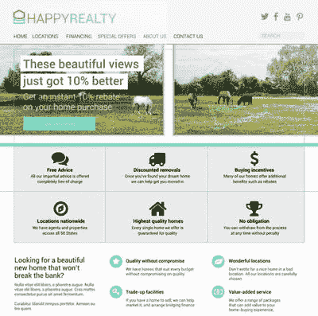

图 5-1。

Flexbox in action, rendering a page without the need to use workarounds to achieve the layout. You build this layout at the end of this chapter

## 语法和结构

W3C CSSWG 自 2009 年第一份工作草案发布以来一直致力于 Flexbox 模块。在此期间，规范和语法发生了实质性的变化。目前的规范包括 2012 年 9 月发布的候选人推荐和 2013 年 10 月更新的编辑草案。

一个候选推荐被认为是稳定的，并且这一个形成了本章中详细描述的语法的基础。虽然没有太大的不同，但编辑的草稿引入了一些我也提到的改进。我会指出，这里显示的语法来自编辑的草稿，而不是候选人的推荐。此外，我会让您知道浏览器目前提供的支持。

Note

截至 2013 年 10 月 3 日，Flexbox 模块的最新版本是基于 W3C 候选推荐标准的编辑草案。编辑的草稿是公开讨论的，可以随着时间的推移而改变。因此，语法不能被认为是稳定的。为了避免问题，请确保您使用的是最新的候选人推荐。您可以在 [`http://dev.w3.org/csswg/css-flexbox/`](http://dev.w3.org/csswg/css-flexbox/) 查看当前编辑的规范草案。

### 基本概念和术语

在对 Flexbox 的介绍中，W3C 将 flex 布局描述为表面上与块布局相似，因为它们遵循相似的设计模式。我发现把 flex layout 想象成有点像 table layout 是有帮助的，因为它允许元素相对于轴对齐和调整大小，就像表格的单元格被挤压成一行一样。正如您将看到的，flex 布局实际上非常不同，尽管它确实具有块、内联和表格布局的可识别特性。

本质上，flex 布局很简单。但是不要被骗了，以为 Flexbox 功能没那么强大，因为它很容易上手。这是一个非常通用的布局模块，允许您执行以下任务:

*   以四种不同方向之一布局元素:从左到右、从右到左、从上到下或从下到上
*   仅使用 CSS 重新排列元素的顺序
*   自动调整元素大小以适应可用空间
*   根据容器或同级元素对齐元素，实现通用的跨轴比例
*   折叠容器内的元素，而不影响容器的偏移量
*   创建线性单轴布局或沿横轴缠绕的多线布局

灵活布局模式的核心是轴的概念。Flexbox 是一个二维布局工具，有两个可能的工作轴:水平，简称`row`；还有垂直的，简称`column`。

Flexbox 布局需要一个元素作为 flex 容器，以及零个或多个作为 flex 项目的子元素。这些 flex 项目使用 flex 布局模型进行布局，而父容器可以应用其他布局模型(如 float)。这意味着您可以将 flex 容器合并到您的标准 CSS 2.1 布局中，而不必改变整个结构方法。

## 浏览器支持

浏览器支持灵活的盒子布局已经很不错了。Internet Explorer 从版本 10 开始就部分支持该规范，IE11 中包含了完全支持。Firefox、Chrome、Safari 和 Opera 都至少部分支持该规范，基于 WebKit 的浏览器提供完全支持。

在移动平台上，iOS Safari 有很好的支持，黑莓的浏览器也是如此。IE mobile 和 Android 的浏览器都有部分支持。只有 Opera Mini 目前不支持该规范。您可以在 [`http://caniuse.com/#search=flex`](http://caniuse.com/#search=flex) 查看 Flexbox 最新的浏览器支持。

Caution

在灵活盒子布局模块的开发过程中，一些浏览器实现了该规范的早期版本。语法已经改变了。因此，Web 上的许多示例现在都已经过时了，所以在遵循示例代码时要小心，以确保您使用的是模块的正确版本。

不理解 Flexbox CSS 属性的浏览器会对每个元素使用默认值。通常情况下，`<div>`、`<section>`和`<article>`等结构项显示为块级元素，而`<span>`等内联元素则恢复为默认的内联级行为。您可以利用这些信息来处理较旧的浏览器；或者，如果您想填充类似 Flexbox 的渲染，Modernizr JavaScript 库允许您测试浏览器支持。您可以在 [`http://modernizr.com`](http://modernizr.com/) 了解更多信息。

### 方向和大小

要完全理解 Flexbox 容器的流程方向的含义以及起点和终点在哪里，使用通用语言定义 Flexbox 模块的相关方面会有所帮助。W3C 在灵活盒子布局的候选推荐草案中已经在这方面做了很好的尝试，所以我在讨论方向和大小时使用了相同的方法。

flex 容器的主轴是沿其放置各个 flex 项目的轴。主开始和主结束是根据页面的语言定义的，并与主尺寸的开始和结束对齐。横轴垂直于主轴延伸，并具有十字起点和十字终点。同样，这些是由交叉大小定义的。

图 5-2 展示了我在讨论 Flexbox 时使用的不同轴和命名约定。你可能想回头参考这个图，直到你对两个轴的概念感到舒服为止。

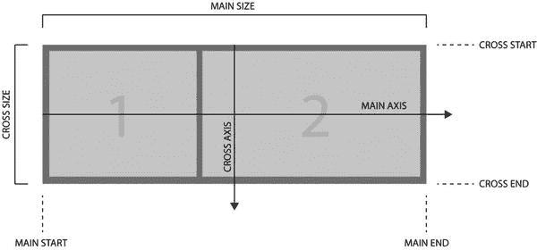

图 5-2。

Terms used when talking about Flexbox dimensions and flow direction

举个例子会让这个理论更容易理解。清单 5-1 显示了这个例子的代码。你可以在图 5-3 中看到样本输出。我将在接下来的几页中解释这是怎么回事。

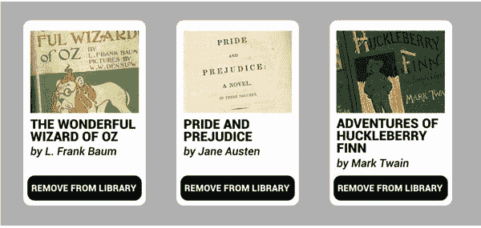

图 5-3。

The result of combining the HTML and CSS code shown in Listing 5-1

```html
<section id=library">
 <article class="library-item">
  <h1>The Wonderful Wizard of Oz</h1>
  <h2>by L. Frank Baum</h2>
  
  <button>Remove from library</button>
 </article>
 <article class="library-item">
  <h1>Pride and Prejudice</h1>
  <h2>by Jane Austen</h2>
  
  <button>Remove from library</button>
 </article>
 <article class="library-item">
  <h1>Adventures of Huckleberry Finn</h1>
  <h2>by Mark Twain</h2>
  
  <button>Remove from library</button>
 </article>
</section>

<style>
#library {
 position: relative;
 display: flex;
 flex-flow: row wrap;
}
.library-item {
 display: flex;
 flex-flow: column;
}
.library-item > img {
 order: -1;
 align-self: center;
}
.library-item > button {
 margin-top: auto;
}
</style>

Listing 5-1.HTML Markup Being Styled with Flexbox CSS Properties

```

Note

需要一些额外的非 Flexbox 代码来定义图 5-3 中所示的颜色、边框和印刷样式。

让我们来看看这个例子的不同柠檬。

## Flex 容器

flex 容器是根据 flex 布局的规则和属性放置 flex 项目的元素。Flex 项目是 flex 容器的直接子对象。每个 flex 容器可以包含零个或多个 flex 项目，这些项目可以是显式元素，如`<div>`、``、`<section>`和`<article>`，也可以是一串连续的文本，Flexbox 将其视为包含在一个元素中。

通过使用设置为值`flex`或`inline-flex`的`display`属性，将元素定义为 flex 容器。`display: flex`和`display: inline-flex`的区别在于`display: flex`将容器定义为 CSS 2.1 块级项目，而`display: inline-flex`将容器设置为内联级元素。清单 5-2 显示了将`#library`部分定义为具有自己的 flex 上下文的 flex 容器的代码。

```html
#library {
 display: flex;
}

Listing 5-2.Defining the Library Element as a Flex Container by Assigning display: flex;

```

当您使用`display: flex`或`display: inline-flex`定义一个 flex 容器时，您正在为该容器的内容创建一个新的 flex 格式上下文。该上下文仅影响该容器的 flex item 子元素。外部元素不会影响嵌套的弹性项目。在`flex`的渲染中缺乏对外部元素的感知意味着`float`和`clear`对 flex 项目没有影响。还值得注意的是，多列布局模块中的列属性对 flex 项目没有影响。

### Flex 格式上下文

每个 flex 格式上下文都独立于其在布局中的对应部分工作。因此，对于创建完美的网格来说，Flexbox 并不是一个好的选择，在本书的后面，当我讨论一个专门为网格布局设计的模块时，你会看到这一点。这是因为单个容器允许它们的 flex 项目根据它们的大小和内容扩展或收缩，而不引用相邻 flex 容器中的 flex 项目。相比之下，基于网格的布局严格遵循特定的节拍和节奏，并考虑到相邻的元素。图 5-4 展示了三种不同的 flex 容器，每种容器都有自己的 flex 格式上下文，不关注相邻的容器。

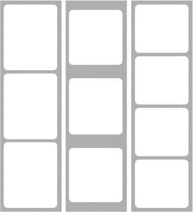

图 5-4。

Flex items are sized and positioned relative to their own flex container, not flex items inside other flex containers

### 展示模型

像 flex 容器一样，flex 项目定义了自己的格式上下文。这可以使用`display`属性和任何 CSS 2.1 允许的值来设置。因此，您可以将伸缩项设置为`float`，显示`inline`，或者设置为`table-cell`。如果使用显示值`flex`，flex 项本身就变成了一个 flex 容器，并支持其他属性，如`visibility: collapse`，这将在本章后面讨论。

Note

如果您使用`position: absolute`或`position: fixed`，flex 项将从 flex 格式上下文流中取出，除非`left`和`right`或`top`和`bottom`都设置了值`auto`。在这种情况下，这些位置属性的值是根据 flex 容器上下文中 flex 项目的静态位置计算的。

在下一个例子中，主 flex 容器是一个`<section>`元素，其`id`为`library`。每个子元素——一个具有`library-item`类的`<article>`元素——也被设置为使用`display: flex`。清单 5-3 隔离相关的 CSS。

```html
.library-item {
 display: flex;
 flex-flow: column;
}

Listing 5-3.CSS to Define Each Flex Item in the Context of the #library Flex Container

```

每个 flex 项目实际上都是一个 flex 容器，如图 5-5 所示。因此，每个条目的内容也被视为 flex 条目，但仅在父条目`library-item`的上下文中。

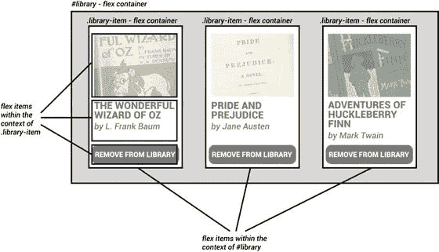

图 5-5。

Each flex item in the `#library` flex container acts as its own flex container, following a horizontal flex direction

### 弯曲方向

`flex-direction`用于定义一个柔性容器的主轴。回想一下，灵活盒子布局是一个二维布局模块，因此只有两个轴可供选择:

*   `row`:英文横。
*   `column`:英文竖着。

每个轴可以向前或向后运行。定义`flex-direction: row`反向版本的语法是`flex-direction: row-reverse`；而对于`flex-direction: column`，是`flex-direction: column-reverse`。

Caution

术语`row`和`column`可能会让你分别想到水平和垂直布局，但在 Flexbox 中，这只适用于水平书写模式。在垂直语言中，如日语，row 从上到下排列内容。

默认主轴以及`flex-direction`值是根据网页上使用的书写模式设置的。对于英语来说，这是从左到右，从上到下，定义为`ltr`。结果是使用`ltr`书写模式创建的网页默认为`row`，并且从左到右运行。设置值`row-reverse`使伸缩项从右向左显示。

### 柔性包装

属性控制 flex 容器是单行的还是多行的。有三种可能的值:

*   `nowrap`:将 flex 容器定义为单行。容器中的所有 flex 项目都适合一个线性运行，而不需要换行到两行或更多行。这是`flex-wrap`的默认值。
*   `wrap`:允许伸缩项沿横轴分布在两条或多条线上。
*   `wrap-reverse`:类似`wrap`工作，但运行方向与默认相反。

如果通过使用值`wrap`或`wrap-reverse`允许 flex 容器跨多行呈现，当没有足够的空间在一行中显示所有项目时，flex 项目会换行到第二行(或第三、第四或第五行)。对于响应式设计来说，这是一个非常有用的选项，因为它会根据容器自动对内容重新分页。

与`flex-direction`一样，默认的`flex-wrap`方向由写入模式定义。对于英语，这是从左到右，从上到下。在某些语言中，可能是从右到左，从上到下，或从上到下，从左到右。为了避免疑问，使用 HTML 元素上的`lang`和`dir`属性显式设置页面的语言和书写模式，如下所示:

```html
<html lang="en" dir="ltr">

```

### 柔性流

`flex-flow`为`flex-direction`和`flex-wrap`属性提供了方便的快捷方式。它允许您使用一行代码来定义这两个属性，但是它也可以在没有`flex-wrap`值的情况下使用，就像`flex-direction`一样工作。清单 5-4 使用了`flex-flow`，尽管因为`nowrap`是`flex-wrap`的默认值，我可以省略第二个值。最终布局如图 5-6 左侧所示；右侧显示了如果我指定了`wrap`的话布局会是什么样子。

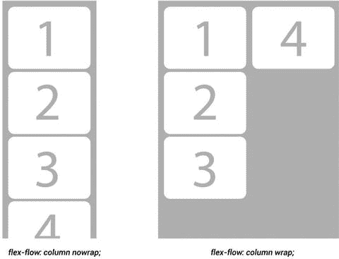

图 5-6。

Notice the difference between the `nowrap` and `wrap` values for `flow-wrap`

```html
.library-item {
 display: flex;
 flex-flow: column nowrap; /* nowrap is the default value for flex-wrap, so isn't strictly necessary here */
}

Listing 5-4.
Flex-flow Shorthand Solution for Defining Both the flex-direction and flex-wrap Properties

```

## 控制项目的顺序

Flexbox 最好的特性之一是能够使用纯 CSS 控制 flex 项目的顺序。这是允许网页设计者正确区分风格和结构的一个重大进步，也给搜索引擎优化带来了好处。

默认情况下，伸缩项沿主轴排列。通过使用`order`属性，您可以覆盖缺省值并指定特定项目在流中的位置。`Order`取整数值，较低的值呈现在较高的值之前。负值也是允许的，如清单 5-5 所示。

```html
.library-item > img {
 order: -1;
 align-self: center;
}

Listing 5-5.Negative Value for the order Property, Forcing the Image to Render at the Beginning of the Flow Along the Main Axisy

```

让我们修改这个 CSS 代码来看看`order`属性的作用。清单 5-6 用粗体显示了变化。图 5-7 按照单个元素的顺序显示了结果。

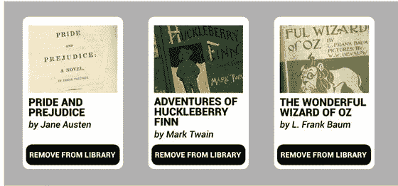

图 5-7。

By adding specific `order` property values to each `library-item`, you can reorder them along the main axis without having to change the markup

```html
<style>
#library {
 position: relative;
 display: flex;
 flex-flow: row wrap;
}
.library-item {
 display: flex;
 flex-flow: column;
}

.library-item:nth-child(1) {

 order: 3;

}

.library-item:nth-child(2) {

 order: 1;

}

.library-item:nth-child(3) {

 order: 2;

}

.library-item > img {
 order: -1;
 align-self: center;
}
.library-item > button {
 margin-top: auto;
}
</style>

Listing 5-6.CSS Applied to the HTML Code in Listing 5-1, Updated to Include order Properties for the library-item Elements

```

Note

`order`属性只影响可视媒体，因此屏幕阅读器继续按照内容在标记中出现的顺序来阅读内容。在检查页面布局的可访问性时，理解这一点很重要。

## 控制柔性

也许 Flexbox 规范中最重要的部分是定义 flex 项目的大小和间距的能力。传统上，很难在一个轴上排列导航项目，以使它们以相等的间距扩展或收缩来适应主尺寸。Flexbox 通过以下`flex-`属性提供对这两个设计方面的完全控制:

*   `flex-grow`
*   `flex-shrink`
*   `flex-basis`

这三个属性的组合可以很好地控制一个项目在没有足够的空间时是增长以填充空间还是收缩以适应空间，这是增长和收缩的基础。您马上会看到一个示例，但是让我们先依次看一下每个属性。

### 灵活增长

`flex-grow`属性定义了相对于同一 flex 容器上下文中的其他 flex 项，flex 项增长了多少。该值被指定为整数，默认为 1。因为该属性与上下文中的其他项目相关，如果您为一个特定项目设置值 2，则任何额外的空间都将被分割，这样，对于分配给其他 flex 项目的每 10 个像素的额外空间，`flex-grow`值为 2 的项目将获得 20px 的额外空间。属性`flex-grow`的值`0`防止任何可用的额外空间被给予灵活项目。

### 弯曲收缩

`flex-shrink`类似于`flex-grow`,但是决定了当 flex 项目收缩以适合 flex 容器时如何分配空间。同样，该值是一个整数，默认值为 1，并且相对于容器中的其他 flex 项。当缺少可用空间时，`flex-shrink`属性的值`0`防止伸缩项收缩。

### 弹性基础

`flex-basis`设置 flex 项目的初始宽度，但也可以设置为值`auto`，这允许浏览器根据项目的内容计算宽度。当`flex-basis`设置为正值或`auto`时，`flex-grow`和`flex-shrink`的基准都设置为内容周围的间距。(参见图 5-8 。)当`flex-basis`的值设置为`0`时，`flex-shrink`和`flex-grow`对项目占用的总空间进行操作。(参见图 5-9 。)

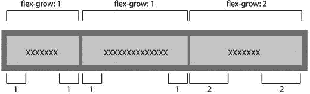

图 5-9。

When `flex-basis` is set with a value of `auto` or a width greater than `0`, only the extra space is distributed

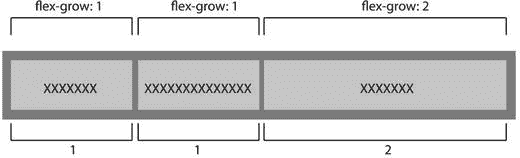

图 5-8。

When `flex-basis` is set with a value of `0`, all the space is evenly distributed

### flex 速记属性及其特例

您可以使用`flex`属性作为`flex-grow`、`flex-shrink`和`flex-basis`的简写。对于`flex`有一些关于默认值和省略值的特殊规则，以说明 W3C 期望设计者使用该属性的最常见方式。这些很快就会显示出来以供快速参考，但是如果您有任何疑问，请确保在使用`flex`属性时指定这三个值中的每一个。

清单 5-7 显示了`flex`属性的语法。属性设置等同于列表后显示的单个属性。

```html
// Syntax flex: <flex-grow> <flex-shrink> <flex-basis>

flex: 1 1 auto;

// This is short-hand for each of following property:value pairs

flex-grow: 1;
flex-shrink: 1;
flex-basis: auto;

Listing 5-7.
flex-grow, flex-shrink, flex-basis, and the Shorthand flex Properties

```

三个`flex-`属性的组合有几种常见的使用场景，因此规范定义了一些特殊的规则，当省略了`flex`速记语法的单个元素或者对其应用了文本值时，可以应用这些规则。这些是从 W3C 候选推荐标准中直接分解出来的:

*   `flex: 0 auto`或`flex: initial`:相当于`flex: 0 1 auto`，也是该属性的默认值。它根据 CSS 中定义的`width`和`height`属性来调整 flex 项的大小。如果项目的主轴大小设置为`auto`，则项目的大小基于其内容。即使 flex 容器中有可用空间，该值也可以防止 flex 项目增长，但当空间不足时，它可以缩小到最小大小。
*   `flex: auto`:这个跟`flex: 1 1 auto`一样。该值根据 CSS 中定义的`width`和`height`属性来调整 flex 项目的大小，但允许它完全灵活地扩展和收缩，以适应可用空间的大小。
*   `flex: none`:相当于`flex: 0 0 auto`。当根据 CSS 中定义的`width`和`height`属性调整大小时，该值创建一个不灵活的 flex 项目。它类似于`flex: initial`，但不允许项目收缩。
*   `flex: <positive-number>`:这个跟`flex: <positive-number> 1 0px`一样。结果是一个`flex-basis`为 0 的灵活伸缩项，根据容器中不同伸缩项上定义的伸缩因子来分配总空闲空间的一部分。

### flex 的一个例子

`flex`属性为整个 Flexbox 模块提供了一个最令人兴奋的设计机会。现在，创建既有响应性又成比例的灵活布局变得很简单。清单 5-8 展示了这种灵活性。(你会在本章末尾看到一个更深入的例子。)

```html
<style>
.layout {
 display: flex;
 flex-flow: row nowrap;
}
section > aside {
 flex: auto;
}
section > article {
 flex: 2 1 auto;
}
aside.level1 {
 order: -1;
}
aside.level2 {
 order: 2;
}
</style>

<section class="layout">
<article class="maincontent">
  ...
 </article>
 <aside class="level1">...</aside>
 <aside class="level2">...</aside>
</section>

Listing 5-8.HTML Markup and CSS to Which the Flexbox Properties Are Being Applied

```

应用于清单 5-8 中标记的 CSS 将主要内容`<article>`设置为占据两倍于`<aside>`元素的空间。所有的元素都会根据容器的大小而增减，内容也会重新排序，形成一个典型的三列布局。这种常见的布局方式如图 5-10 所示；在 Flexbox 之前，它需要浮动元素和特定的 HTML 顺序。

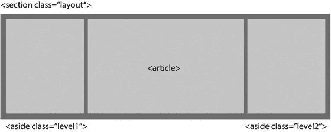

图 5-10。

The result of the combination of HTML code and CSS shown in Listing 5-8

## 控制弹性项目的对齐

扩展和收缩 flex 项目以及沿主轴和横轴对齐和调整其大小的能力是 Flexbox 最有用的方面之一。使用 CSS，您第一次可以准确地定义项目在容器中应该如何对齐，还可以确定项目之间的间距。尽管已经有了脚本解决方法，但直到现在还不可能创建一个灵活的、水平居中的导航栏。更令人印象深刻的是垂直对齐项目(或横轴)的能力。

### 主轴

在 Flexbox 中有两种不同的方法来控制沿主轴的对齐:通过`margin`和`justify-content`属性。

#### 边缘

边距在 flex 项目上的工作方式与 CSS 2.1 边距在块级元素上的工作方式非常相似。如果您设置了自动边距，flex 容器中的任何可用空间都会被分配给该轴上的边距。因此，通过将`margin-left: auto`指定给一个 flex 项，你将它推到容器的右边(见图 5-11 )，而`margin-right: auto`将该项推到左边。以这种方式使用 margin 还可以防止项目增长以填充可用空间，因为所有空间都被 margin 占用了。清单 5-9 借用了 W3C 候选推荐规范中的一个例子来说明如何使用边距将一个列表项推到导航栏的右侧。


图 5-11。

This output is achieved with Listing 5-9

```html
<style>
 nav > ul {
  display: flex;
 }
 nav > ul > #login {
 margin-left: auto;
 }
</style>
<nav>
 <ul>
  <li><a href=/about>About</a>
  <li><a href=/projects>Projects</a>
  <li><a href=/interact>Interact</a>
  <li id='login'><a href=/login>Login</a>
 </ul>
</nav>

Listing 5-9.Using margin to Align One Item to the Main End Edge 

```

##### 调整内容

`Justify-content`控制沿主轴分配给 flex 容器上下文中的 flex 项目的对齐类型。计算完任何一个`margin`或`flex`后，应用`justify-content`属性。这对于指定了最大弹性项目宽度或项目在某种程度上不灵活的布局非常有用。`Justify-content`分配剩余的可用空间。

`justify-content`有五种不同的可能值:

*   `flex-start`从 flex 容器的主起始边缘对齐项目。如果您的 flex 流从右到左水平运行，这意味着 flex 项目与容器的左侧对齐。
*   `flex-end`从柔性容器的主要末端边缘对齐项目。如果您的 flex 流从右到左水平运行，这意味着 flex 项目将与容器的右侧对齐。
*   `center`特别令人兴奋，因为它允许项目与 flex 容器的中心对齐，自动考虑所有 flex 项目占据的总主轴空间以及它们之间的任何间距。在灵活的盒子布局出现之前，这是不可能用 CSS 单独实现的。
*   `space-between`沿主轴均匀分布柔性项目，第一个项目与主起点对齐，最后一个项目与主终点对齐。注意，如果没有足够的空间容纳所有的 flex 项，这个值的行为与`flex-start`相同。
*   `space-around`与`space-between`相似，但在第一个项目之前和最后一个项目之后增加了一半大小的空间。剩余的项目再次平均分布在第一个和最后一个项目之间。

图 5-12 展示了这五个选项。

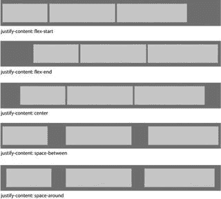

图 5-12。

These alignment options are available with `justify-content`

#### 在多条生产线上工作

允许 flex 容器换行的一个好处是它给你的布局带来了灵活性。例如，如果你使用 Flexbox 导航条，你可以允许单独的导航选项溢出到第二行，如果有太多的导航选项在一行上放不下的话。这将自动使你的导航栏响应不同的屏幕尺寸。

如图 5-13 所示，最终结果可能有点不美观。但是，正如您所看到的，您可以使用`flex`属性来使各个导航项目占据空间。如果你给弹性项目添加一个`flex: auto`规则，最终结果如图 5-14 所示更加漂亮。

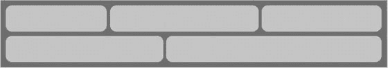

图 5-14。

The same navigation bar with `flex: auto` applied to the flex items

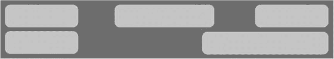

图 5-13。

A navigation bar with `flex-wrap: wrap` enabled

### 横轴对齐

除了沿主轴对齐的能力之外，Flexbox 还提供了对横轴上 flex 项目对齐的控制。您不仅可以对齐，还可以自动拉伸项目，使它们在横轴上占据相同的空间，解决了基于浮动的布局多年来一直难以解决的问题。

有三个属性可用于控制横轴对齐:

*   `align-items`
*   `align-self`
*   `align-content`

这些属性中的每一个都行使不同类型的控制，所以让我们依次来看看它们。

#### 对齐项目和对齐自身

`align-items`和 align-self 的工作方式与`justify-content`类似，但它们是沿着横轴而不是主轴工作的。`align-items`适用于 flex 容器，而您可以在单个 flex 项目上使用 align-self。与`justify-content`一样，这些属性是在应用任何余量后计算的。

以下是`align-items`和`align-self`的可能值:

*   `flex-start`和`flex-end`的工作方式与您预期的完全一样，分别将项目对齐十字起点或十字终点边缘。
*   `center`根据 flex 容器沿横轴的总尺寸，沿横轴中心对齐项目。如果容器被设置为使用`wrap`或`wrap-reverse`的`flex-flow`值，允许多行，则项目沿着它们出现的行的中心对齐。
*   `baseline`将每个项目的基线与十字起始边缘对齐。
*   `stretch`沿横轴扩展项目以填充线条。这具有使每个伸缩项沿横轴占据相同空间的效果。如果您的 flex 项目设置了`min-height/min-width`或`max-height/max-width`，这些值仍然适用于这些项目，可能会导致项目无法填充行或溢出行。`stretch`是`align-items`的默认值。
*   `Auto`是`align-self`的默认值。

图 5-15 显示了所有不同的选项和最终布局。

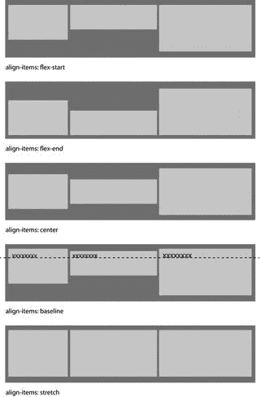

图 5-15。

These are the alignment options for `align-items` and `align-self`

#### 对齐内容

align-content 属性的工作方式与`justify-content`类似，但它作用于启用了`wrap`或`wrap-reverse`的 flex 容器中的行，决定如何在这些行之间分配额外的空间。与`justify-content`一样，有几种不同的可能值，如图 5-16 所示:

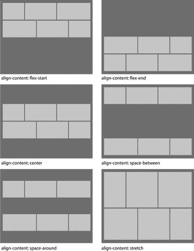

图 5-16。

Different `align-content` options are available for distributing and aligning individual lines in the flex container

*   `flex-start`从柔性容器的十字起始边缘对齐线条。如果您的 flex 流从右向左水平延伸，这意味着线条与容器顶部对齐。
*   `flex-end`从柔性容器的交叉端边缘对齐项目。如果您的 flex 流从右向左水平延伸，这意味着线条与容器底部对齐。
*   `center`将所有行对齐横轴上 flex 容器的中心，自动考虑所有行占据的总空间以及它们之间的任何间距。
*   `space-between`沿十字轴均匀分布线条，第一条线条对齐十字线起点，最后一条线条对齐十字线终点边缘。注意，如果没有足够的空间容纳所有的行，这个值的行为与`flex-start`相同。
*   `space-around`在第一行之前和最后一行之后添加半个空格。剩余的线再次平均分布在第一和最后一行之间。`space-around`类似于`justify-content`。
*   拉伸会导致线条自动拉伸，并填充任何额外的可用空间。如果没有足够的空间来容纳所有的行，这个值同样呈现给`flex-start`。

Note

`align-content`仅适用于具有多行的柔性容器。这是因为单行容器的行自动填充分配给容器的整个空间。

### 折叠的项目

您可以通过为`visibility`属性指定值`collapse`来折叠 flex 项目的可见性。这具有将 flex 项目从页面呈现中移除的效果，同时将它保留在格式化结构中。这允许折叠的项目定义 flex 容器横轴的整体比例，同时从视图中隐藏。

这个新选项对于用户界面元素(如下拉导航菜单)特别有用，在下拉导航菜单中，只有顶级选项才会显示，直到用户选择一个项目，子项才会显示。通过继续影响横轴比例，您可以根据菜单中的最大选项自动设置菜单大小，即使这是折叠的。清单 5-10 完美地展示了这种行为。图 5-17 显示结果。

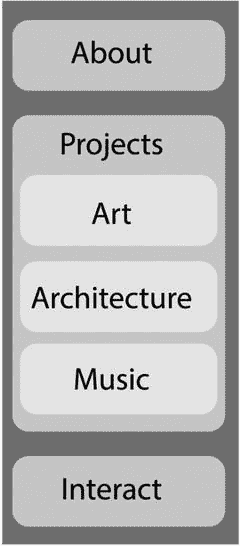

图 5-17。

The navigation menu with the second option opened to reveal the submenu. The widest submenu item sets the width of the overall menu container, despite being initially hidden

```html
<style>
nav > ul > li {
  display: flex;
  flex-flow: column;
 }
 /* dynamically collapse submenus when not targeted */
 nav > ul > li:not(:target):not(:hover) > ul {
  visibility: collapse;
 }
</style>
<nav>
  <ul>
   <li id="nav-about"><a href="#nav-about">About</a>
     ...
   <li id="nav-projects"><a href="#nav-projects">Projects</a>
    <ul>
     <li><a href="...">Art</a>
     <li><a href="...">Architecture</a>
     <li><a href="...">Music</a>
    </ul>
   <li id="nav-interact"><a href="#nav-interact">Interact</a>
    ...
  </ul>
 </nav>

Listing 5-10.Example from the W3C Specification, Showing a Dynamic Menu that Collapses the Visibility of Submenu Items

```

## 如何使用灵活的方盒子布局

到目前为止，您应该对 Flexbox 的功能和用途有了清晰的认识。它可以单独解决许多常见的布局问题，因此很容易将 Flexbox 视为所有布局需求的答案。我想阻止你屈服于这种诱惑。尽管 Flexible Box Layout 能够呈现整个页面布局，但其他布局模块是专门为整个页面布局设计的(参见这一章之前和之后的章节，了解一些很好的选项！).

与整体页面布局相比，Flexbox 更适合单个用户界面元素。一些常见的使用场景包括:

*   希望在两个轴上真正居中的元素
*   需要呈现数量未知的项目的场景，例如通过内容管理系统控制的菜单
*   您希望根据标记顺序对内容进行重新排序的页面区域(尽管其他一些布局模块也允许您这样做)
*   隐藏当前未选择的内容的标签和内容群组
*   表单和表单元素布局

当然，没有什么可以阻止你使用 Flexbox 作为你的主要布局工具，但是考虑一下最适合手头任务的布局模块是值得的。

我不能放过一个关于 Flexbox 的章节而不提供一个 Flexbox 的实际例子。下面的示例只是一个可能的使用场景，它结合了您在前面几页中看到的许多属性。如果你还不相信灵活的盒子布局模块的能力和灵活性，我敢肯定这个例子会说服你。

## 真实世界的例子

这个例子为一个虚构的房地产公司创建了一个页面设计模型，如图 5-18 所示。该示例使用 Flexbox 来呈现几个布局部分。

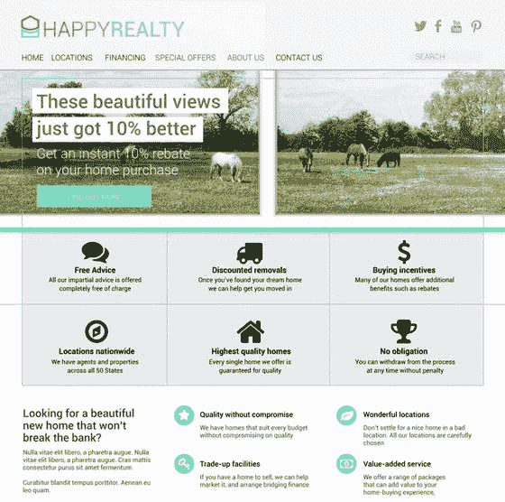

图 5-18。

A mockup for a fictional real-estate company

### HTML 标记

这个页面需要的 HTML 标记是基本的。它遵循的模式类似于布局设计者过去使用浮动来排列设计元素时使用的模式。您可以使用 Flexbox 来创建整个页面，但是因为最好将每个模块用于其预期目的，所以本示例将重点放在页面的以下部分:

*   导航栏
*   大屏幕区域
*   利益陈述

清单 5-11 显示了页面这些部分的相关 HTML 代码。

```html
<!—The navigation section -->
<nav>
 <ul>
  <li><a href="#">Home</a></li>
  <li><a href="#">Locations</a></li>
  <li><a href="#">Financing</a></li>
  <li><a href="#">Special Offers</a></li>
  <li><a href="#">About us</a></li>
  <li><a href="#">Contact Us</a></li>
  <li class="searchform"><form><input type="text" value="search" /></form></li>
 </ul>
</nav>

<!—The big icons/jumbotron section -->

<section id="jumbotron">
 <article>
  <h2>Free Advice</h2>
  <p>All our impartial advice is offered completely free of charge</p>
  
 </article>
 <article>
  <h2>Discounted Removals</h2>
  <p>Once you've found your dream...
...</article>
</section>

<!—The badge benefits section -->

<section id="benefits">
 <article>
  <h1> Looking for a beautiful new home that won't break the bank?</h1>
  <p> Nulla vitae elit libero, a pharetra augue. Nulla vitae elit libero, a pharetra augue. Cras mattis consectetur purus sit amet fermentum.</p>
 </article>
 <article class="badge">
  <div>
  <h3>Quality without compromise</h3>
  <p>We have homes that suit every budget without compromising on quality</p>
 </div>
  
 </article>
 <article class="badge">...
 ...</article>
</section>

Listing 5-11.HTML Code for Three Parts of the Page Suited to Flexbox Layout

```

虽然使用 CSS2.1 可以实现这种布局，但使用 Flexbox，在页面上正确排列项目几乎变得微不足道。让我们单独看一下每一部分，这样你就可以看到 Flexbox 的布局是多么强大。

Note

与许多 CSS3 属性一样，在实现阶段，浏览器供应商会给属性添加前缀。我将向您展示不带前缀的代码，以保持清单的整洁。在支持完成之前，您需要使用每个属性的供应商前缀版本来完全支持每个浏览器。

#### 航行

导航区域遵循您在清单 5-9 中看到的相同设计模式，因此这一部分的代码几乎相同。清单 5-12 显示了实现实体模型中显示的导航布局所需的所有代码！

```html
/* The navigation section */
nav > ul {
  display: flex;
  flex-flow: row wrap;
 }
  nav > ul > .searchform {
  margin-left: auto;
 }

Listing 5-12.Flexbox CSS Code to Create the Navigation Layout

```

这段代码中的两个简单规则创建了将搜索表单推到导航区域右侧所需的布局。你可以看到图 5-19 中的输出，它是在 Chrome 30 中渲染的。

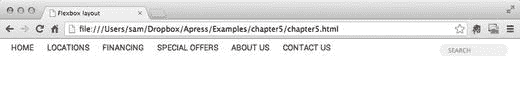

图 5-19。

The navigation output in Chrome

#### 大屏幕

大屏幕区域(带有大图标)也很容易成形。Flexbox 可以帮助解决该领域正在进行的几件事情，例如:

*   每个`<article>`大小均匀。
*   大屏幕中每个元素的内容在两个轴上居中对齐。
*   图像在文本之前呈现，但出现在标记中的文本之后。

为了对这些内容重新排序，您需要将每篇文章呈现为整个 flex 容器中的一个 flex 容器，id 为`#jumbotron`。参见清单 5-13 。

```html
/* The jumbotron section */
#jumbotron {
  display: flex;
  flex-flow: row wrap;
  align-content: stretch;
  justify-content: center;
 }
#jumobtron article {
  display: flex;
  flex-flow: column nowrap;
  flex: 1 1 250px;
  align-content: center;
  justify-content: center;
 }
#jumbotron article * {
  align-self: center;
}
#jumbotron article img {
  order: -1;
  flex: none;
}

Listing 5-13.Flexbox Code to Style the Jumbotron Section

```

图 5-20 显示了结果，用 Chrome 渲染。注意`<article>`元素的`flex`的`250px`的底部宽度。这确保了所有的`<article>`以相同的宽度开始，并均匀地弯曲。这也意味着当使用 960 像素的窗口时，每行可以水平放置三篇文章。

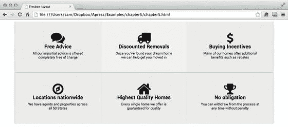

图 5-20。

When the window is wider than 960px, three `<article>`s render per row

当窗口大小折叠或在移动设备上查看页面时会发生什么？Flexbox 的一个主要优点是它可以作为一个响应式设计工具。这段代码足够灵活，可以处理不同大小的窗口。当窗口变得更窄时，内容会重新分页，这样每行只出现两个`<article>`，如图 5-21 所示。

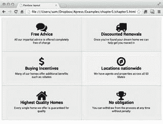

图 5-21。

When the window narrows, the content automatically reformats onto more lines

当以智能手机的分辨率观看内容时，也会发生同样的事情。您可以通过将浏览器窗口拖至尽可能小的宽度来模拟这种效果。在这种情况下，一旦窗口窄于 500px，内容将再次重新格式化，每行显示一个`<article>`(参见图 5-22 )。

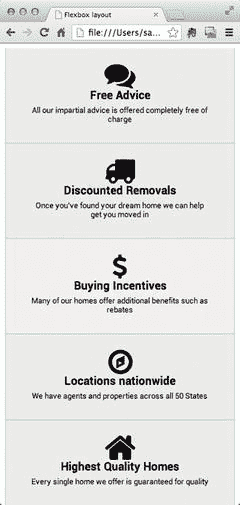

图 5-22。

At smartphone resolutions the content renders a single `<article>` per line

#### 福利区

福利区域稍微复杂一些，因为左侧部分的高度是各个徽章区域的两倍。这种布局包含嵌套的 flex 容器，但是列而不是行充当主轴。这使得可以将左侧物品上的弯曲设置为徽章弯曲的两倍。参见清单 5-14 和图 5-23 中的 Chrome 输出。

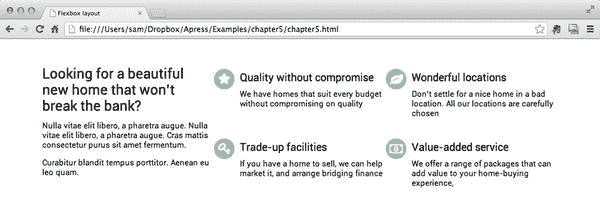

图 5-23。

The output in Chrome

```html
/* The badge benefits section */
#benefits {
 display: flex;
 flex-flow: column wrap;
 height: 260px;
}
#benefits article {
 flex: 2 2 260px;
 width: 318px;
}
#benefits article.badge {
 display: flex;
 flex-flow: row nowrap;
 flex: 1 1 130px;
}
#benefits article.badge img {
 order: -1;
 flex: none;
}

Listing 5-14.CSS Code for the Benefits Area

```

注意文章被设置为使用`flex: 2 2 260px`，而`article.badge`使用`flex: 1 1 130px`。第二条规则覆盖了第一条规则，并强制所有徽章的大小保持一致。剩下的文章正好是徽章高度的两倍，其`flex-grow`和`flex-shrink`值为 2，而徽章值为 1。这使得`<article>`占据了徽章高度的两倍。

Note

需要一些额外的非 Flexbox CSS 代码来定义如图 5-18 到 5-23 所示的颜色、边框和印刷样式。

## 摘要

CSS 灵活的盒子布局提供了一个非常多才多艺的布局模型，非常适合创建响应用户界面元素。该模块使用基于轴的范例，它的内容可以根据通过`flex-`属性集定义的一些简单规则沿着轴伸缩。

Flexbox 解决了许多布局问题，到目前为止，这些问题都需要复杂的解决方案。在一个容器中集中排列多个项目现在变得很简单，就像对齐和调整盒子大小以使它们相互匹配一样。

浏览器支持很好，所以在网上使用 Flexbox 相当安全。大多数情况下，不支持的浏览器会自动退回到块级布局。您可以使用诸如 Modernizr 之类的库，这使得使用旧的 CSS 2.1 规范为这些浏览器提供多填充样式集变得很容易。