# 六、CSS 网格布局

CSS 网格布局为标准布局范式提供了一个明智的解决方案，自从远离基于表格的布局和采用 CSS 布局以来，标准布局范式一直是 web 设计者的挑战。

Note

CSS 网格布局可能是新模块中最难使用的，因为浏览器支持仍在开发中。在撰写本文时，唯一可靠的渲染供应商是微软，尽管在您阅读本书时，这种情况可能已经发生了变化。

## 什么是 CSS 网格布局？

W3C 将 CSS 网格布局模块描述为定义了一个二维布局系统，为用户界面设计进行了优化。至关重要的是，也是对布局设计者最有用的是，他们继续阐明“在网格布局模型中，网格容器的子容器可以被放置到灵活或固定的预定义布局网格中的任意位置。”我将在接下来的几页中讨论这意味着什么，但这是个好消息！

在讨论技术方面之前，有必要反思一下在布局设计中使用网格的问题。您已经对网格系统很熟悉了，因为您每天都会遇到它们。书籍和杂志使用网格系统来创建它们的布局，使得页面上的元素看起来彼此有某种关系。你见过的每个数据表都使用完全相同的原则来帮助确保数据点正确地归属于它们的图例。事实上，可以说基于网格的布局是 Web 的第一个主要设计步骤:HTML `<table>`元素被用于布局而不是数据显示。

然而，与表格不同，网格应该能够以基于布局的偏好而不是数据偏好来显示内容，这正是 CSS 网格布局规范要实现的目标。在某些方面，你可以认为它类似于 CSS Flexbox 但是在 CSS 网格布局中，不是所有的事情都发生在一个轴上，而是使用两个维度:块和行(或者，如果你喜欢，列和行)。

当用于布局时，CSS Grid Layout 是一个非常令人兴奋的模块，它使实现灵活流畅的布局变得轻而易举，并保持页面上元素之间的指定关系。这与您在使用浮动元素或表格时可能遇到的有时不可预测和违反直觉的行为形成了鲜明的对比，尤其是在涉及压缩的设备或窗口宽度时。图 6-1 显示了网格布局的典型使用场景。

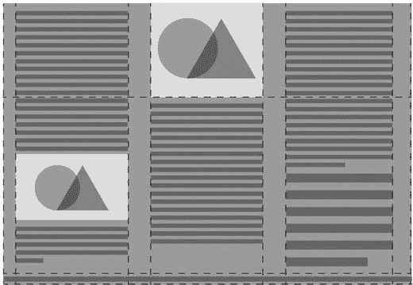

图 6-1。

A grid-based layout in action

## Web 上的网格布局

W3C CSSWG 自 2012 年发布第一份工作草案以来一直致力于 CSS 网格布局模块。在此期间，规范和语法发生了实质性的变化。撰写本文时的当前规范发布于 2015 年 9 月，此处讨论的语法基于在 [`www.w3.org/TR/css-grid-1/`](http://www.w3.org/TR/css-grid-1/) 找到的文档。

请务必检查在您阅读时是否有更新的规范版本。尽管整体语法正在(缓慢地)向稳定发展，但模块的语法和结构可能会有一些变化。

重申一下，该规范目前被认为是一个工作草案，这意味着在为 1.0 版本的 CSS3 网格布局确定一切之前还有几个阶段要走。你现在是在网络设计的西部，所以穿上你的牛仔靴吧！

Note

理解 CSS 网格布局仍在开发中是至关重要的。您可以在 [`www.w3.org/TR/css-grid-1/`](http://www.w3.org/TR/css-grid-1/) 查看当前的工作草案规范。

### 为什么要使用网格？

为了理解为什么你会为你的布局选择一个网格系统，在你的脑海中有一个网格可能是什么样子的图片是有帮助的。W3C 使用了我在这里借用的两个场景来帮助说明 Web 上网格背后的思想和概念。

我已经谈到了设计者对网格作为一种布局工具的固有的熟悉，但是理解 Web 工具没有提供任何有目的的解决方案来创建基于网格的布局是有用的——直到 CSS 网格布局！历史上，设计者使用表格、脚本和像素完美的浮动元素的组合来构建具有网格系统外观的布局。这对于固定宽度的布局非常有效，在这种布局中，设计者可以控制或指定最小的视口宽度。然而，随着智能手机、平板电脑和其他网络连接设备的出现，那些日子已经一去不复返了。布局需要能够适应各种各样的设备配置文件和屏幕方向。

#### 网格布局的基础

CSS 网格布局就是专门为解决这个问题而设计的。在它的基础上，它允许你把可用的空间分成一系列的区域，每个区域都可以用于布局。然后，可以对特定的内容进行定位和调整大小，以占据该网格中的各个列、行和单元格。图 6-2 借用了 W3C 的示例布局来展示一个可以用 CSS 网格布局创建的基本布局。

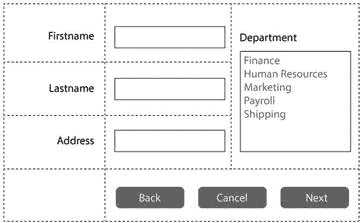

图 6-2。

A typical application layout that could be achieved with CSS Grid Layout

#### 固有的灵活性

CSS 网格布局背后的核心原则之一是调整布局以适应可用空间不需要额外的工作。响应式设计的好处是 CSS 网格布局的标准！让我们看看 W3C 用来解释这个概念的例子。(此后，我坚定地转向新的例子！)

CSS 网格布局被设计成响应性工作。这意味着随着可用视口空间的定义，元素会在页面内智能地重排。图 6-3 显示了我对 W3C 例子的解释:一个游戏屏幕，在布局中有五个不同的元素。

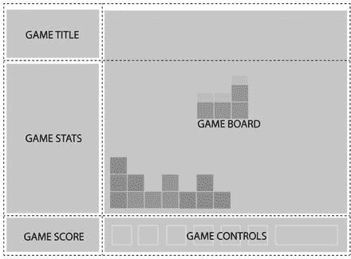

图 6-3。

My interpretation of the game screen used in the W3C’s example project

注意图 6-3 中显示内容区域划分的虚线。这些是网格线！设想的设计概要中指定了布局的一些基本目标:

*   统计区域总是出现在游戏标题的正下方。
*   游戏面板出现在统计数据和标题的右边。
*   游戏标题和游戏板的顶部应该总是对齐。
*   当游戏达到最小高度时，游戏板的底部和统计区域对齐，否则游戏板会伸展以利用所有可用的屏幕空间。
*   得分区域应该与游戏和统计区域创建的列对齐，控件在棋盘下方居中。

传统上，这种布局可能使用具有指定宽度和高度的绝对定位元素、浮动元素和内联元素的组合。由此产生的代码很难破译，也很容易被破解。更糟糕的是，它在不同的分辨率下通常是不可靠的。

通过使用 CSS 网格布局，你可以实现 brief 的所有要求！您将在下一节中详细了解属性和语法；但是首先检查图 6-4 ，它显示了与图 6-3 相同的图，但是在视口中增加了宽度。清单 6-1 展示了使用 CSS 网格布局实现这种布局的一种方式。(现在还不用太担心语法是如何工作的。)

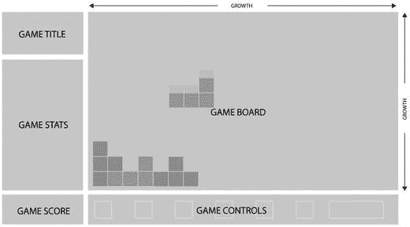

图 6-4。

The same layout you saw in Figure 6-3, but with additional width and height, allowing the board to grow

```html
<style>
#grid {
 display: grid;
 grid-template-columns: auto minmax(min-content, 1fr);
 grid-template-rows: auto minmax(min-content, 1fr) auto
}

#title { grid-column: 1; grid-row: 1 }
#score { grid-column: 1; grid-row: 3 }
#stats { grid-column: 1; grid-row: 2; align-self: start }
#board { grid-column: 2; grid-row: 1 / span 2; }
#controls { grid-column: 2; grid-row: 3; justify-self: center }
</style>

<div id="grid">
 <div id="title">Game Title</div>
 <div id="score">Score</div>
 <div id="stats">Stats</div>
 <div id="board">Board</div>
 <div id="controls">Controls</div>
</div>

Listing 6-1.Achieving the Layout Shown in Figures 6-3 and 6-4 Using CSS Grid Layout

```

请注意，通过一些额外的造型，该设计可以重新分页以适应纵向屏幕，如图 6-5 所示。您将在本章后面看到如何使用`@media`查询来实现这种级别的响应。

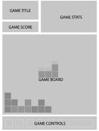

图 6-5。

The same layout as in Figures 6-3 and 6-4, orientated to work in portrait Note

使用 CSS 网格布局规范有很多方法可以实现这种布局。这个例子摘自 [`www.w3.org/TR/css-grid-1/`](http://www.w3.org/TR/css-grid-1/) 的工作草案，目的是说明网格的力量，而不是建议最佳实践。

### 理解术语

我希望你的胃口被激起。让我们继续了解这个模块是如何工作的。与每个 CSS 模块一样，CSS 网格布局也有其特有的术语和语言。它部分是由 W3C 定义的，但是大部分是从传统的图形设计和关于网格系统的讨论中发展出来的。

任何应用了网格布局的元素都被称为网格容器。网格本身是一组相交的水平线和垂直线，将网格容器的空间分成一系列的行和列。因此，有两种类型的线:一组定义沿块轴(也称为列轴)延伸的列，另一组定义沿内嵌轴(也称为行轴)正交延伸的列。

术语 block 和 inline 直接指的是 CSS3 Writing Modes 模块，这意味着列轴不一定是从上到下垂直的，行轴不一定是从左到右水平的。然而，对于大多数基于拉丁语的语言，这是列和行的主要经验；因此，为了理解模块如何工作，可以从这些方面考虑。图 6-6 显示了刚刚定义的术语。

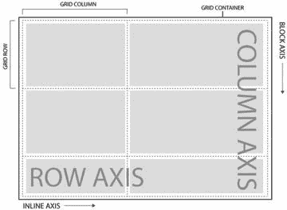

图 6-6。

The key terms used when describing grids in context

在开始探索定义和使用 CSS 网格布局的属性之前，您需要了解一些额外的技术语言。网格轨迹用于定义网格列或网格行。这类似于 CSS Flexbox 使用的语言，所以如果你已经读过第五章，应该听起来很熟悉。

网格单元是每个轴上相邻的两组网格线之间的空间。网格单元是可以放置内容的区域，是网格中的最小单位。同样，这最好用图表来说明，所以请看图 6-7 ，它显示了上下文中的术语。

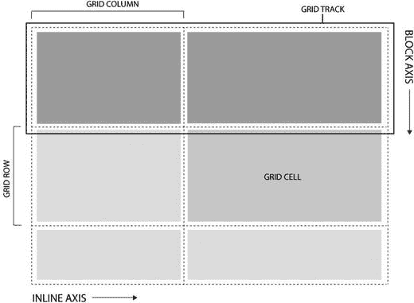

图 6-7。

The terms grid track and grid cell in context

我们不要忘记网格线。这些是将网格划分成网格区域的线，正如你所看到的，你可以用它们运行的轴来描述它们。在 CSS 网格布局中，还可以使用数字索引或 CSS 代码中指定的名称来显式引用单独的行。

网格项目是分配给网格中的网格区域(或网格单元)的单个元素。网格区域由两对四条网格线定义，可以跨越多个网格单元。每个网格容器包含零个或多个网格项目；网格容器的每个子元素都自动成为网格项目。

图 6-8 显示了上下文中的网格线、网格区域、网格单元和网格项目。您会很高兴地听到，这是在您开始使用代码之前需要的最后一个与网格相关的术语！

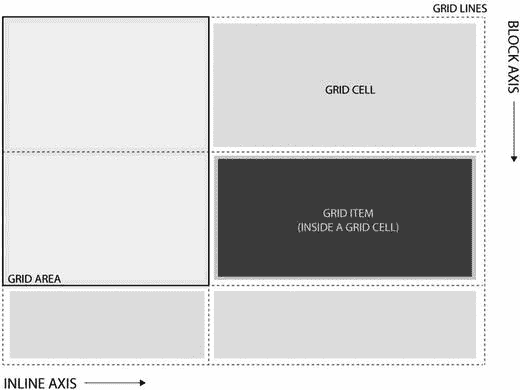

图 6-8。

Grid lines, grid areas, and grid items

### 在 CSS 中定义网格

现在你知道了在 CSS 中谈论网格时应该使用什么语言；让我们直接进入规范，探索如何使用该模块建立一个网格。清单 6-2 展示了一个简单的网格定义，以及用作网格容器和网格项的 HTML 元素。你马上就会看到每一行代码做了什么，但是首先看看图 6-9 ，这是一个根据规范应该如何渲染的图示。请注意，如果您在最新版本的 Internet Explorer 或当前版本的 Microsoft Edge 之外的任何地方进行测试，您将会非常失望！这个特性最近出现在 WebKit nightlies 中，但是只有一个`-webkit-`前缀。

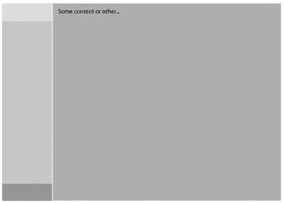

图 6-9。

An illustration of how the code shown in Listing 6-2 should render in the browser

```html
<style type="text/css">
 #gridcontainer {
 display: grid;
 grid-template-columns: 150px 1fr; /* two columns */
 grid-template-rows: 50px 1fr 50px; /* three rows */
 }
#griditem {
 grid-column: 2;
 grid-row-start: 1;
 grid-row-end: 4;
}
</style>

<div id="gridcontainer">
 <!-- begin the grid item -->
 <div id="griditem">
  <p>Some content or other...</p>
 </div>
 <!-- end the grid item -->
</div>

Listing 6-2.CSS and HTML Markup Defining a Grid

```

图 6-9 显示了它在浏览器中呈现时的样子(或者至少是我对它应该是什么样子的说明)。我添加了一些额外的阴影，使行更清晰。

Note

需要一些额外的非网格代码来定义图 6-9 中所示的颜色、边框和印刷样式。

让我们看看这个例子的不同元素。

### 网格容器

网格容器是根据网格布局的规则和属性放置网格项目的元素。通过使用设置为值`grid`或`inline-grid`的`display`属性，将元素定义为网格容器。清单 6-3 突出显示了用于定义网格容器的代码。

```html
#gridcontainer {
 display: grid;
}

Listing 6-3.Defining the gridcontainer Element as Being a Grid Container by Assigning display: grid;

```

当您使用`display: grid`或`display: inline-grid`定义一个网格容器时，您为该容器的内容创建了一个新的网格格式上下文。该上下文只影响该容器的网格项子元素。外部元素不会影响嵌套的网格项目。

#### 网格容器的两个显示选项

`display: grid`和`display: inline-grid`的区别在于`display: grid`将容器定义为 CSS 2.1 块级项目，而`display: inline-grid`将容器设置为内联级元素。如果这听起来很熟悉，那是因为您熟悉 CSS Flexible Box Layout，它使用了关于容器及其在页面流中的处理的类似方法和语法。

#### 定义行和列

当使用`display: grid`或`display: inline-grid`将一个元素作为网格容器时，默认情况下，它有一列和一行，这构成了网格容器的完整大小。这并不是非常有用，所以您可以使用`grid-template-columns`和`grid-template-rows`属性将一个网格容器分成列和行。

在清单 6-4 中，您可以看到如何将网格容器分成两列三行。每行或每列都是依次定义的，每行或每列定义之间用空格隔开。可以使用任何测量单位来设置值，包括`fr`单位，它定义了一个灵活的空间，该空间由固定大小的项目计算后剩余的空间量来确定。

```html
#gridcontainer {
 display: grid;
 grid-template-columns: 150px 1fr; /* two columns */
 grid-template-rows: 50px 1fr 50px; /* three rows */
 }

Listing 6-4.Defining the Number of Rows and Columns in the Grid, Along with Their Proportions

```

这定义了两列。第一个被设置为总是占据内嵌轴中 150 像素的空间，第二个被允许填充该轴中剩余的可用空间。

定义了三行。第一个和最后一个都被设置为在块轴上占据 50 个像素的空间。中间一行被设置为填充该轴中剩余的可用空间。这意味着您已经有效地创建了一个流体布局，它总是在第一列的开头有一个 150px × 50px 的单元格，后面是一个流体单元格，然后是另一个固定大小的单元格。第二列再次分为三个单元格，但每个单元格在内嵌轴上都是流体，中间的单元格在两个轴上都是流体。图 6-10 更清楚地说明了这一点。

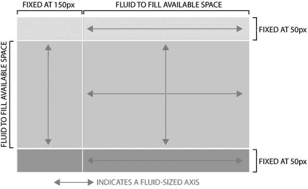

图 6-10。

The effect of the CSS definition of rows and columns in Listing 6-4; incorporating both fixed and fluid sizing Note

`fr`单元表示可用空闲空间的一部分，但是因为这个例子在每个轴中使用了一次`fr`,所以它等于所有可用的空闲空间。

The Flexible-Length fr Unit

值得花点时间来谈谈`fr`单元。`fr`(或`<flex>`)单位被定义为可用空间的一部分。每个列或行的空闲空间份额可以根据 W3C 计算为列或行的`<flex> * <free space> / <sum of all flex factors>.`。

最简单的方法是将你在一个轴上使用的所有 fr 单元相加，然后在使用这些单元的元素之间分配空闲空间。因此，一个带有`3fr`的元素占用的空间是一个带有`1fr`单元的兄弟元素的三倍。如果只有这两个元素被定义为沿着该轴的`fr`单元，那么总的可用空间将被计算为分成四部分，其中三个相等的部分被分配给第一个元素，剩余的相等部分被分配给第二个元素。

#### 在容器内定位网格项目

清单 6-3 对#griditem 元素应用了一些代码，将它放在第二列，占据了第 1 到第 4 行。清单 6-5 重复了这段代码，所以你可以明白我在说什么。

```html
#griditem {
 grid-column: 2;
 grid-row-start: 1;
 grid-row-end: 4;
}

Listing 6-5.Positioning of the 
#griditem Element

```

清单 6-5 显示了我还没有讨论的三个属性。`grid-column`定义网格项目应该占据的列。这里，您使用一个数字引用来定义一个项目应该位于的列，但是正如您稍后看到的，您也可以使用一个名称。

和`grid-column`一样，你也可以用`grid-row`定义一个单行来占用。然而，在这种情况下，您跨越了多行，因此您使用`grid-row-start`和`grid-row-end`来定义项目所占据的空间的开始和结束。

您可能想知道为什么代码只定义了三列，却引用了第 4 列。答案在于你如何看待列和行。出于 CSS 网格布局的目的，每一列都由开始该列的网格线定义；行以同样的方式工作。如果有三根柱，实际上有四条柱网轴线。请看图 6-11 来看看这是怎么回事。

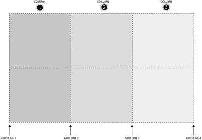

图 6-11。

There are four grid lines to define three columns

`grid-column`和`grid-row`使用了相同的原理，但是因为每一列和每一行前面都有相同编号的网格线，所以这并不能立即看出编号系统是如何工作的。这是需要注意的，尤其是当你开始使用装订线栏和行来分隔内容区域的时候。

清单 6-6 给出了一个例子。它总共定义了五列和三行，但目的只是将内容放入定义为宽度或高度大于 10px 的主要内容区域。

```html
#gridcontainer {
 display: grid;
 grid-template-columns: 150px 10px 150px 10px 150px; /* five columns */
 grid-template-rows: 150px 10px 150px; /* three rows */
}

Listing 6-6.CSS Defining Five Columns and Three Rows, Including Gutter Columns and Rows to Separate Content

```

该定义的结果如图 6-12 所示；为了清楚起见，主要内容区域都用阴影表示。请注意，即使看起来只有三列两行，您也必须将间距定义为网格容器中的列。理解这一点很重要，因为如果开始使用`grid-column`属性定位网格项，就需要考虑这些额外的间距列。在本例中，将一个网格项放在列 2 中会导致它占用前两个主要内容列之间的 10px 空间。

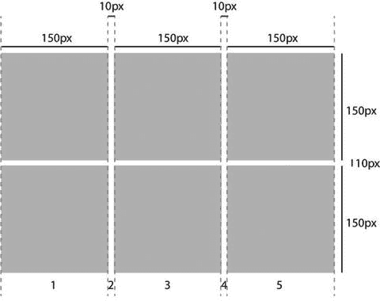

图 6-12。

A total of five columns and three rows, with the second and fourth columns set to be 10px wide, and the second row similarly set to occupy 10px of height. This creates the effect of a gutter around the content areas shown shaded

#### 速记网格项目定位

键入`grid-column-start`和`grid-column-end`会很快变得令人厌倦；但是和以前一样，CSS 有一个简化的语法来加速开发。只需使用`grid-column`属性指定开始和结束列(或`grid-row`的行)，用正斜杠分隔两个值。清单 6-7 显示了应用于图 6-12 所示示例的这种简写。最终元件的位置如图 6-13 所示。

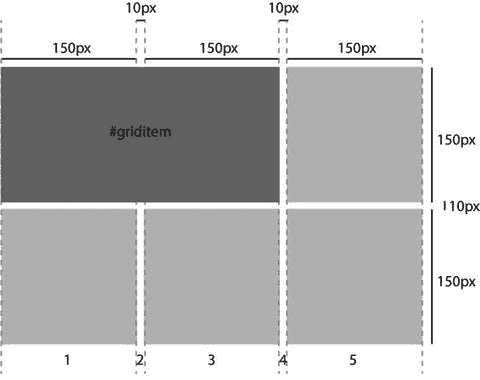

图 6-13。

The positioning of element `#griditem` when the code shown in Listing 6-7 is applied to it

```html
#griditem {
 grid-column: 1 / 4;
 grid-row: 1;
}

Listing 6-7.Position and Span of the #griditem Element, Spanning Three Columns and One Row

```

Caution

术语“行”和“列”可能会让你分别想到水平布局和垂直布局。但是在 CSS 网格布局中，和 Flexbox 一样，这只适用于水平书写模式。在日语等垂直语言中，`row`从上到下布局内容。

#### 使用网格区域定位

`grid-area`属性使用边界网格线显式地控制网格项目的位置，而不是使用列和行的隐喻。语法如下:

```html
grid-area: row-start / column-start / row-end / column-end

```

通过使用基于坐标的定位方法，这为在网格中放置元素提供了更快的方法。让我们修改清单 6-7 中的代码，以利用`grid-area`属性，而不是`grid-column`和`grid-row`属性。结果代码如清单 6-8 所示。

```html
#griditem {
 grid-area: 1 / 1 / 1 / 4;
}

Listing 6-8.Same Effect as in Listing 6-7, but with Significantly Less Code

```

#### 跨越多列或多行

如果您希望 CSS 网格布局更像基于表格的布局，可以使用`span`属性达到同样的效果。这是通过对列数或行数求和，并分配网格项目自动占据正确的行数和/或列数来实现的。继续这个例子，清单 6-9 使用`span`而不是显式使用`grid-area`或`grid-column-start`和`grid-column-end`。终点是根据起点和跨度计算的。当您希望从视觉上跨越多个列而不是在头脑中记住数字的角度来考虑时，这是非常有用的。你需要记住的是，任何装订线栏仍然有效！

```html
#griditem {
 grid-column: 1 / span 3;
 grid-row: 1;
}

Listing 6-9.Same Result as Listings 6-8 and 6-9, but Using the span Keyword to Define the Grid Item’s Size Occupying Three Columns Total

```

#### 命名网格线

如果您发现自己因为需要考虑所有多余的列和行而感到沮丧，CSS Grid Layout 允许您根据自己的需要命名各个跨度，从而为这个问题提供了一个实用的解决方案。这是非常灵活和有用的，一旦你习惯了使用命名网格线，它对于代码的易维护性和易读性有很大的实际意义。语法如下所示:

```html
grid-template-columns: [name-of-line1] <width> [name-of-line2]

```

解释这一点最简单的方法是在上下文中展示它，所以让我们重温一下清单 6-6 中五列三行的早期定义:

```html
#gridcontainer {
 display: grid;
 grid-template-columns: 150px 10px 150px 10px 150px; /* five columns */
 grid-template-rows: 150px 10px 150px /* three rows */
}

```

可以通过在方括号中指定名称来命名每条网格线。清单 6-10 展示了这在实践中的样子。这些名称几乎可以是任何适合您的名称(保留关键字除外)。

```html
#gridcontainer {
 display: grid;
 grid-template-columns: [col1start] 150px [col1end] 10px [col2start] 150px [col2end] 10px [col3start] 150px [col3end];
 grid-template-rows: [row1start] 150px [row1end] 10px [row2start] 150px [row2end]
}

Listing 6-10.CSS from Listing 6-6, with the Sddition of Named Grid Lines

```

通过命名网格线，您现在可以在定义网格项目的位置时使用这些名称而不是数字。清单 6-11 显示了来自清单 6-7 、 6-8 和 6-9 的相同网格项目，使用清单 6-10 中的名称进行定位和定义。

```html
#griditem {
 grid-column: col1start / col2end;
 grid-row: row1start;
}

Listing 6-11.Size and Positioning from Listings 6-7, 6-8, and 6-9, Using the Named Lines Defined in Listing 6-10

```

列表 6-11 的结果如图 6-14 所示。正如您从代码中看到的，当您使用合理的命名策略并根据您对列和行的看法而不是它们相对于装订线列和行的位置来分配名称时，这要直观得多。

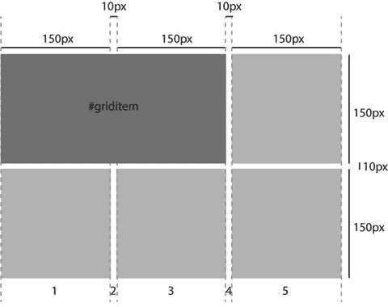

图 6-14。

The same net result as shown in Figure 6-13, but the underlying code is potentially easier to understand than earlier listings

此外，值得指出的是，您可以继续对命名的网格线使用`span`关键字，从而允许进一步的布局灵活性。`span`继续观察每个定义的列或行，但是。

#### 用重复定义网格

网格容器中网格的定义可以通过使用关键字`repeat`来自动完成。其语法如下:

```html
grid-template-columns: repeat(<number of times to repeat>, <column definitions to repeat>);

```

清单 6-12 显示了一个使用中的`repeat`关键字的例子，它定义了一个总共有 6 列 6 行的网格容器。

```html
#gridcontainer {
 grid-template-column: repeat(3, 150px 10px);
 grid-template-row: repeat(2, 75px 75px 10px);
}

Listing 6-12.Defining Six Columns and Six Rows Using the repeat Keyword

```

清单 6-12 中代码的结果如图 6-15 所示。同样，为了清晰起见，我给网格加了阴影。

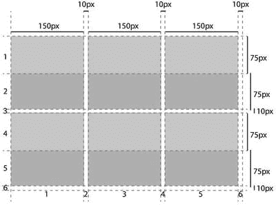

图 6-15。

Six columns and six rows defined using the `repeat` keyword in combination with `grid-template-column` and `grid-template-row`

您还可以使用带有关键字`repeat`的命名网格线，提供更大的灵活性。清单 6-13 给出了一个例子，它定义了一个网格容器和一个网格项。

```html
#gridcontainer {
 grid-template-column: repeat(3, [column] 150px [colgutter] 10px);
 grid-template-row: repeat(3, [row] 150px [rowgutter] 10px);
}

#griditem {
 grid-column: column 2;
 grid-row: row 1;
}

Listing 6-13.Combining the repeat Keyword with Named Grid Lines to Create a Grid, and Positioning a Grid Item Within It

```

列出 6-13 的结果如图 6-16 所示。很酷吧。您可以创建一个网格系统，并在网格中定位一个项目，只需几行 CSS 代码！如果你愿意，你仍然可以使用`span`关键字。

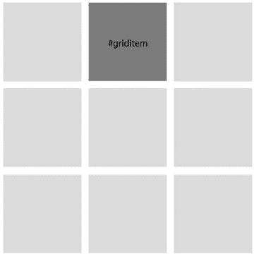

图 6-16。

The result of Listing 6-13, with shading added for emphasis

还有更多！`repeat`关键字不一定是`grid-template-column`属性的唯一参数，因此您可以在重复的部分之前或之后添加额外的列(或`grid-template-row`的行)。这允许你用最少的代码设计一个非常灵活但是精确的网格系统。清单 6-14 中显示了一个例子。另外，请注意，您不必命名每一条网格线。

```html
#gridcontainer {
 grid-template-column: [sidebarstart] 200px [sidebarend] 10px repeat(3, [column] 150px [colgutter] 10px);
 grid-template-row: repeat(3, [row] 150px [rowgutter] 10px);
}

Listing 6-14.Building on the Previous Example to Add a Sidebar Column Before the Repeating Section

```

列出 6-14 的结果如图 6-17 所示。有一点没有明确显示出来，但是您应该知道，当重复定义导致相邻的命名网格线时，这两个名称会连接成一个名称。举个例子`grid-template-column: repeat(2, [a] 20px [b])`。这相当于`grid-template-column: [a] 20px [b a] 20px [b];`。

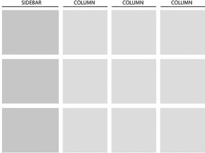

图 6-17。

The result of Listing 6-14, incorporating a sidebar defined outside the repeating section of the column specification

#### 定义网格区域

我已经提到了网格单元和网格区域之间的区别。一个区域由四条网格线定义:两条列线和两条行线。这些线不需要紧邻，因此一个网格区域可以包含一个或多个网格单元。网格区域对于定义页面布局不同部分之间的语义关系很有用，允许您指定页面的哪个部分包含页眉、侧栏、内容区域和页脚。使用`grid-template-area`属性定义区域，该属性映射到一组现有的网格轨迹定义上。清单 6-15 展示了一个这样的例子。

```html
<style>
#gridcontainer {
 display: grid;
grid-template-areas: "header header"
                     "sidebar content"
                     "sidebar content";
grid-template-columns: 150px 1fr;
grid-template-rows: 50px 1fr 50px;
}
</style>

Listing 6-15.
grid-template-area Defining a Header, Sidebar, and Content Area in the Grid That’s Already Defined by the grid-template-columns and grid-template-rows Properties

```

一旦创建了网格区域，就可以通过使用`grid-area`属性直接分配网格项来占据这些区域；参见清单 6-16 。组合列表 6-15 和 6-16 的结果如图 6-18 所示。请注意，该图人为地分解了网格单元的位置，以使每个网格区域的边界易于识别。

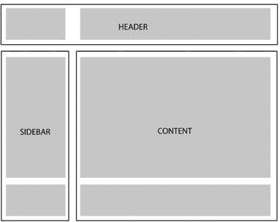

图 6-18。

The defined grid areas. Note that I have exploded this diagram, adding extra space between the grid cells to illustrate the bounds of each area

```html
#item1 { grid-area: header; }
#item2 { grid-area: sidebar; }
#item3 { grid-area: content; }

Listing 6-16.Assigning Three Items to the Three Grid Areas Defined in Listing 6-15

```

#### 控制网格项目的顺序

正如我所展示的，您可以通过使用`grid-column`和`grid-row`属性在网格中任意定位网格项目。此功能的主要好处之一是，它允许您控制页面上元素的视觉顺序，而与它们在代码中的顺序无关。就像 Flexbox 一样，这使得重新分页内容以适应不同的设备配置文件变得容易:响应式设计变得简单。它也促进了风格和结构的分离，并带来了搜索引擎优化的好处。

除了能够直观地定位网格项目之外，您还可以控制它们在屏幕上的呈现顺序。该功能使用 Flexbox 中可用的相同的`order`属性。通过使用`order`属性，您可以覆盖缺省值，并指定特定项目在网格呈现流中的位置。`order`取整数值，较低的值呈现在较高的值之前。负值也是允许的。`order`在绘制元素的过程中确实会影响 z-index，所以请注意，除非您专门为元素声明了 z-index 值，否则更改它的`order`属性将会使它在堆栈中向前或向后移动。

#### 自动流动的网格项目

我还没有提到的是，如果你没有为每个条目明确指定一个`grid-column`和`grid-row`坐标，网格条目会发生什么。回想一下，默认情况下，网格容器的任何子容器都是一个网格项。没有明确定位和定义的网格项目会自动定位和调整大小，以类似于 flex 项目在 Flexbox 容器中流动的方式流入网格容器。

默认情况下，浏览器在流动网格项目时采用阅读方向规则。在基于拉丁语的语言中，这意味着行从左到右填充整个列，直到一行填满，然后开始新的一行。为了帮助说明这一点，清单 6-17 中的代码包含一个网格容器和九个子元素。

```html
<style>
 #gridcontainer {
 display: grid;
 grid-template-columns: repeat (3, 150px);
 grid-template-rows: auto;
 }
</style>

<div id="gridcontainer">
 <div class="item">1</div>
 <div class="item">2</div>
 <div class="item">3</div>
 <div class="item">4</div>
 <div class="item">5</div>
 <div class="item">6</div>
 <div class="item">7</div>
 <div class="item">8</div>
 <div class="item">9</div>
</div>

Listing 6-17.Creating a Grid Container: Child Elements Become Grid Items by Default

```

默认情况下，列表 6-17 的结果如图 6-19 所示。注意，使用`auto`关键字允许浏览器决定需要创建多少行来容纳容器中的网格项。通过使用 grid 容器元素上的`grid-auto-flow`属性，您可以显式地要求浏览器将项目流入行上下文。默认是`row`，所以显式设置这个属性的代码是`grid-auto-flow` `: row`。将该属性更改为使用值`column`的结果如图 6-20 所示。

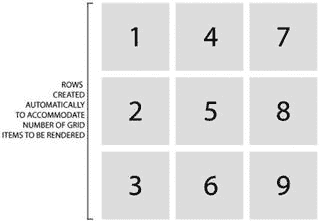

图 6-20。

The result of Listing 6-17, but with the grid flow set to a column specifically. `grid-auto-flow: column` has been applied to the `#gridcontainer` element

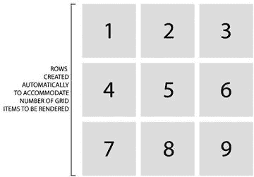

图 6-19。

The result of Listing 6-17. Grid items are automatically flowed into the row context, although this can also be explicitly set using `grid-auto-flow: row`

auto-flow 的另一个很好的特性是，它可以处理您显式放置在网格上的任何网格项目。这意味着你可以将重要元素推到它们指定的位置，然后让你的页面或应用程序中的所有其他内容自动流入周围的空间，完成布局。

#### 子网格

与 Flexbox 一样，单独定义的网格容器相互之间没有渲染效果。这意味着，如果在同一个页面上有两个网格容器，那么在每个网格中呈现和放置内容时，它们不需要(也不会)相互引用。这在大多数情况下是有用的，但有时让一个网格明确引用并遵循另一个网格的比例也是有帮助的。对于这些情况，CSS 网格布局规范中提供了`subgrid`赋值。

关键字`subgrid`指定一个网格容器元素，它是一个现有网格容器的子元素，与父网格的布局相关。因此，子栅格中的栅格轨迹观察并符合父栅格的轨迹。这有助于实现表单的完美对齐，如清单 6-18 中的示例代码所示。

```html
<ul>
 <li><label>Name:</label> <input name="fn">
 <li><label>Address:</label> <input name="address">
 <li><label>Phone:</label> <input name="phone">
</ul>

<style>
ul {
 display: grid;
 grid-auto-flow: row;
 grid-template-columns: auto 1fr;
}
li {
 display: grid;
 grid: subgrid;
 margin: 0.5em;
 border: solid;
 padding: 0.5em;
}
label {
 grid-column: 1;
}
input {
 grid-column: 2;
}
</style>

Listing 6-18.Defining a Grid on the <ul> Element and Again on Each <li> within the <ul>; the <li> Elements Are Defined as Subgrids, Allowing Them to Achieve Coherent Alignment with Each Other as Well as with the Overall Parent Grid Defined on the <ul>

```

列表 6-18 的结果如图 6-21 所示。我使用 auto-flow 选项在父网格中沿着行轴流自动布局每个列表项。

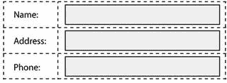

图 6-21。

The result of the subgrid in action in Listing 6-18

在这个例子中，子网格`<li>`项目的跨度没有被明确地设置。渲染引擎自动注意到子网格中网格单元的使用，并将其映射到父网格上，遵守在父网格上定义的网格轨迹定义。可以用与常规网格项目相同的方式定义轨迹跨度。

##### 显式与隐式网格

至此，您已经专门处理了显式定义的网格，将网格项分配到预定义的网格位置。CSS 网格布局提供了动态定义网格的选项，但是，只需将网格项分配到尚未显式创建的位置。

在这些情况下，会自动创建附加栅格轨迹。例如，如果您将一个网格容器定义为`grid-template-columns: 100px 100px 100px 100px`，然后应用一个网格项来占据`grid-column: 5`，则定位网格项所需的额外列将被创建来容纳该网格项。清单 6-17 专门使用关键字`auto`来请求浏览器将这种行为应用于网格行，但是，严格来说，这不是必需的。就我个人而言，我认为如果有助于避免疑问，具体甚至详细是很好的，所以我倾向于不依赖默认值或行为。什么适合自己，你可以自己拿主意！

#### 将项目与网格对齐

使用应用于网格容器的`align-items`属性，网格项可以相对于网格对齐。`align-items`的可能值如下:

*   `stretch`:默认。扩展项目以填充单元格定义的空间。
*   `start`:相对于流上下文，将内容与网格单元的开头对齐。项目的大小可以容纳内容。
*   `end`:和`start`一样，但是对齐到单元格的末尾而不是开头。
*   `center`:将内容与网格单元格的中心对齐，根据需要扩展以填充单元格，从而容纳网格项目的内容。

除了沿着流上下文工作的`align-items`，CSS 网格布局还允许跨流上下文工作的`justify-items`。对于这两个属性来说，相同的一组值是可以接受的，并且它们以完全相同的方式工作，或者与流动方向一致，或者与流动方向垂直。

图 6-22 显示了`align-items`的四个对准选项的结果。注意，在这个例子中，流上下文是沿着列轴的，每个网格项占据了 5 行。我调整了单个项目的大小，就好像它们装满了足够的内容，可以有效地占据这五行所提供的空间的一半。

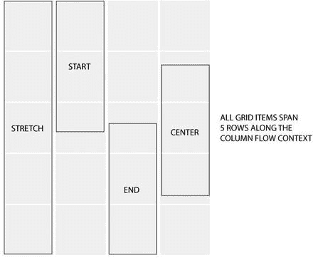

图 6-22。

The four alignment options

最后，还可以选择使用`justify-self`和`align-self`属性在每个项目的基础上设置对齐。这些属性支持相同的四个值，但是被分配给网格项而不是网格容器。

## 如何使用 CSS 网格布局

到目前为止，您应该已经清楚 CSS 网格布局是多么强大和有用了。它可以单独解决许多常见的布局问题，在许多方面，它是自 Web 诞生以来 CSS 模块设计者一直渴望的。因此，很容易把 CSS 网格布局看作是为所有布局需求提供最终解决方案。

的确，CSS 网格布局将为经验丰富的网页设计师提供一个天堂。注意我对 will 这个词的强调！一旦我将要讨论的问题得到解决，CSS Grid Layout 将会是您的工具集的一个极好的、非常有用的补充。常见的使用场景包括:

*   杂志风格的布局
*   Pinterest 类型的网络应用
*   您想要从标记顺序重新排序内容的页面区域(尽管注意 Flexbox 也允许您这样做)
*   应用程序，尤其是在使用网络视图和针对一系列设备配置文件时
*   表单和表单元素布局

当然，这仅仅是网格布局好处的开始。如果能够在不同的浏览器上可靠地使用 CSS 网格布局，那么目前 Web 上的许多设计都可以使用 CSS 网格布局来呈现。

### 浏览器支持

正如我在本章开始时提到的，目前浏览器对 CSS 网格布局的支持很差。微软帮助定义了该规范，并且是迄今为止唯一一家已经准备好部分工作实现并可用于在面向消费者的浏览器版本中测试的供应商，但是一旦该规范变得完全稳定，这种情况将会迅速改变。请注意，在撰写本文时，您可以在 Chrome 的金丝雀版本中访问一些当前规范。

和以往一样，对于目前的情况，你应该参考并定期检查 [`http://caniuse.com/#search=grid`](http://caniuse.com/#search=grid) 。维护此站点是为了提供 CSS 网格布局的最新浏览器支持的快照。

### 后备选项和聚合填充

与所有不支持的 CSS 一样，不理解 CSS 网格布局属性的浏览器会对每个元素使用默认值。这意味着，通常情况下，`<div>`、`<section>`和`<article>`等结构项显示为块级元素，而`<span>`等内联元素则恢复为默认的内联级行为。您可以利用这一点来处理较旧的浏览器，或者如果您喜欢使用众多依赖 JavaScript 来定位和调整元素大小的网格系统中的一个来进行聚合填充。请注意，由于 Flexbox 有一些共同的交叉属性，回退选项可能比您预期的更难预测。Modernizr JavaScript 库允许您测试浏览器支持；您可以在 [`http://modernizr.com`](http://modernizr.com/) 了解更多信息。

## 摘要

CSS 网格布局潜在地提供了所有新的到 CSS3 模块中最令人兴奋的布局选项。但是，它还不能在野外使用——除非您愿意编写大量的 JavaScript 回退和/或聚合填充。

然而，我们正处于网格革命的风口浪尖。一旦主流浏览器提供支持，设计者将拥有一个极其灵活的布局工具，它被设计成可以快速响应。CSS Grid Layout 将解决过去 20 年来困扰设计师的许多布局难题，让我们摆脱过去必须的费力而复杂的工作。不幸的是，浏览器支持还不存在，所以在 Web 上使用 CSS 网格布局还不安全。