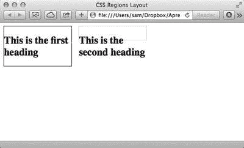

# 七、CSS 区域布局

CSS 区域布局使内容从一个框流到另一个框变得容易，而不必担心内容如何适合每个容器。

Note

此模块仍处于编辑的草稿状态，可能会有更改。请务必在 [`www.w3.org/TR/css3-regions/`](http://www.w3.org/TR/css3-regions/) 查看最新的 W3C 文档，了解当前语法和规范的详细信息。在`Apress.com/9781430265023`的图书页面上的源代码选项卡中，也可以查看这本书的代码。

## 什么是 CSS 区域布局？

CSS 区域布局为控制不同容器之间的内容流提供了一个高级解决方案。各个容器在布局中不必彼此相邻，因此很容易创建杂志风格的布局，这种布局可以灵活地适应内容的变化。

CSS 区域布局不控制页面上元素的布局，只控制内容在元素之间流动的方式。这允许该模块与 CSS 规范中的任何布局模型一起使用。

也就是说，通过添加一个有用的伪元素选择器，您可以使用许多属性来设置流入区域的内容的样式。我将在本章后面讨论`::region()`选择器和它所替代的`selector`方法。

如果你现在想使用 CSS 区域布局，你面临的最大挑战是不完整的浏览器支持。Safari 和 Chrome 都提供支持，但 Chrome 默认不支持 CSS 区域布局。Internet Explorer 10 也支持 CSS 区域布局，但源内容只能来自一个`iframe`。当然，正如许多新的 CSS3 布局模块一样，您可以使用 polyfill 解决方案来支持所有浏览器；我将在本章的后面讨论这些选项。

### 一个例子

理解 CSS 区域布局能做什么的最简单的方法是直接跳到一个例子中。图 7-1 显示了一个有三个盒子的简单布局。使用 CSS 区域布局来控制每个框的内容，但是使用 CSS2.1 绝对定位和 CSS3 转换的组合来设置布局。


图 7-1。

The layout is controlled by CSS2.1 and CSS3 transformations. The content is controlled by CSS Regions Layout.

清单 7-1 显示了用于创建这个例子的 HTML 标记。请注意，标记中有两个不同的区域:

*   一个`<article>`元素中页面的文本内容
*   不包含可呈现内容的三个`<div>`元素

```html
<body>
 <article>
  <h1>Lorem Condimentum Fringilla</h1>
  <p>Fusce dapibus, tellus ac cursus commodo, tortor mauris condimentum nibh, ut fermentum massa justo sit amet risus. Duis mollis, est non commodo luctus, nisi erat porttitor ligula, eget lacinia odio sem nec elit. Donec id elit non mi porta gravida at eget metus. Duis mollis, est non commodo luctus, nisi erat porttitor ligula, eget lacinia odio sem nec elit.</p>
   <p>Nullam id dolor id nibh ultricies vehicula ut id elit. Integer posuere erat a ante venenatis dapibus posuere velit aliquet. Donec sed odio dui. Integer posuere erat a ante venenatis dapibus posuere velit aliquet. Curabitur blandit tempus porttitor.</p>
   <p>Integer posuere erat a ante venenatis dapibus posuere velit aliquet. Nullam id dolor id nibh ultricies vehicula ut id elit. Donec ullamcorper nulla non metus auctor fringilla. Nulla vitae elit libero, a pharetra augue. Maecenas faucibus mollis interdum. Duis mollis, est non commodo luctus, nisi erat porttitor ligula, eget lacinia odio sem nec elit. Morbi leo risus, porta ac consectetur ac, vestibulum at eros.</p>
   <p>Maecenas faucibus mollis interdum. Nulla vitae elit libero, a pharetra augue. Praesent commodo cursus magna, vel scelerisque nisl consectetur et. Cum sociis natoque penatibus et magnis dis parturient montes, nascetur ridiculus mus. Maecenas sed diam eget risus varius blandit sit amet non magna.</p>
   <p>Duis mollis, est non commodo luctus, nisi erat porttitor ligula, eget lacinia odio sem nec elit. Etiam porta sem malesuada magna mollis euismod. Integer posuere erat a ante venenatis dapibus posuere velit aliquet. Nullam quis risus eget urna mollis ornare vel eu leo. Nulla vitae elit libero, a pharetra augue.</p>
 </article>
 <div id="box1"><!-- no content --></div>
 <div id="box2"><!-- no content --></div>
 <div id="box3"><!-- no content --></div>
</body>

Listing 7-1.HTML Markup for the Example Shown in Figure 7-1

```

使用 CSS 区域布局时，内容从一个元素(或一系列元素)流入一个或多个区域。提供内容的元素没有在浏览器中呈现，所以清单 7-1 中的`<article>`没有直接出现在图 7-1 所示的呈现中。

让我们看看用来创建这个布局的 CSS 代码。清单 7-2 展示了呈现这个页面的完整样式表。你可以在 [`http://www.apress.com`](http://www.apress.com/) 下载这个例子以及本书中所有其他例子的源代码。

```html
body {
 font-family: 'Noto Sans', sans-serif;
 font-size: 62.5%;
}
article {
 -webkit-flow-into: article;
 -ms-flow-into: article;
 flow-into: article;
 font-size: 1.2em;
}
#box1, #box2, #box3 {
 -webkit-flow-from: article;
 -ms-flow-from: article;
 flow-from: article;
}
#box1, #box2, #box3 {
 padding: 4em;
 border: 10px solid #fff;
 position: absolute;
 width: 200px;
 height: 400px;
 background: #fff;
 box-shadow: 0px 0px 10px #999;
}
#box1 {
 background: #f9e719;
 top: 100px;
 left: 100px;
 -webkit-transform: rotate(-5deg);
 transform: rotate(-5deg);
}
#box2 {
 background: #92f919;
 top: 100px;
 left: 370px;
}
#box3 {
 background: #19d2f9;
 top: 120px;
 left: 640px;
 -webkit-transform: rotate(5deg);
 transform: rotate(5deg);
}

Listing 7-2.CSS Code Used in Conjunction with Listing 7-1

```

这个例子使用了`flow-into`和`flow-from`属性来创建区域。id 为`box1`、`box2`和`box3`的三个`<div>`各自成为一个区域，而`<article>`元素实际上成为一个内容存储，并不直接呈现在页面上。

在这里使用 CSS 区域布局的好处是，如果以后想要更新内容，可以简单地编辑`<article>`元素中的 HTML。内容将在三个定义的区域中重排，无需任何手动格式化。

Note

第一个例子显示了不同厂商前缀版本的`flow-into`和`flow-from`属性。其余的例子省略了这些特定于供应商的前缀版本的属性，以避免混乱。在规范完成之前，您需要在自己的代码中包含属性的前缀版本。

## 浏览器支持

CSS 区域布局是一个相当新的规范，最初由 Adobe 在 2011 年提出并推广。尽管如此，这个提议已经有了几次迭代，一些浏览器提供了相当成熟的支持。Safari 及以上版本支持厂商前缀，Chrome 也是如此(在地址栏中输入`about:flags`并启用实验性网络平台功能即可启用支持)。Internet Explorer 10 和更高版本也支持 CSS 区域布局，尽管源标记必须包含在一个`iframe`中。在本文发表时，Firefox 还没有对 CSS 区域布局的任何支持，一些从事 Firefox 工作的工程师公开表示，他们没有实现该提议的计划。这是因为 Firefox 背后的开发团队认为 CSS 区域布局规范存在问题，特别是当提议的 CSS 溢出模块处理一些类似的布局问题时。因此，在这一点上有理由相信这可能是未来发展的一个问题。

Tip

勾选 [`http://caniuse.com/#feat=css-regions`](http://caniuse.com/#feat=css-regions) 查看显示最新浏览器支持级别的表格。

## 语法和结构

CSS 区域布局的语法非常简单。只有两个主要属性:

*   `flow-into`
*   `flow-from`

这些属性中的每一个都接受一个命名的参数，该参数在`flow-into`的情况下定义一个流上下文，或者在`flow-from`的情况下调用一个流上下文。流上下文可以被赋予任何名称，只要它以字母开头并且包含有效的 CSS 字符。

### 流入

一旦定义了流上下文，所有分配了与该分配相匹配的`flow-into`属性的元素都会将其内容贡献给流。它们也从页面的可视布局中删除。

内容分配到流中的顺序由 HTML 标记的顺序决定，按时间顺序排列。清单 7-3 显示了这一点，其中三个不同的内容区域以不同于它们在标记中的位置的顺序被分配给同一个流上下文。

```html
<article id="article1"> <h1>Article 1</h1>
 <p>...</p>
</article>
<article id="article2"><h1>Article 2</h1>
 <p>...</p>
</article>
<article id="article3"><h1>Article 3</h1>
 <p>...</p>
</article>
<div id="layout"><!-- single content container --></div>
<style>
 #article1, #article3 {
 flow-into: reorderedcontent;
}
#article2 {
 flow-into: reorderedcontent;
}
#layout {
 flow-from: reorderedcontent;
}
</style>

Listing 7-3.Order of Content in the Flow Is Determined by the Markup Alone

```

列出 7-3 的结果如图 7-2 所示。请注意，文章在输出中没有被重新排序，尽管在分配`flow-into`属性时，它们是按照`#article1`、`#article3`、`#article2`的顺序定义的。


图 7-2。

The order of content is defined by the HTML markup, not the CSS assignment to a named flow.

在将元素分配到流中时要小心，以避免意想不到的后果，这一点很重要。以一个表格为例，可以使用清单 7-4 中所示的代码将它分配给一个流。

```html
table {flow-into: table-content}

Listing 7-4.Moving a Table and Its Contents into a Flow Named table-content

```

如您所料，该规则将文档中的所有表格移动到名为`table-content`的流中。除了将所有内容移动到流中之外，表本身也保持了与其他元素的分离。清单 7-5 中显示的代码只选择表中的直接子元素移动到流中。

```html
table > * {flow-into: table-content}

Listing 7-5.Moving All Direct Children of the Table Element(s) into the Flow

```

这允许文档中来自多个源表的所有表行一起呈现在单个表中。这是一个非常有用的功能。但是，请注意，它留下了作为空元素的`<table>`,该元素仍然呈现在文档中；因此，如果应用了样式，它们仍然会出现。

不过，考虑一下清单 7-6 ，你会发现这种力量可能会被意外使用，带来意想不到的后果。

```html
table * {flow-into: table-content}

Listing 7-6.Moving All Descendants of the Table Element(s) into the Flow at the Same Level

```

清单 7-6 中代码的净效果是在一个平面列表中呈现所有表格的内容，而不是像表格通常呈现的那样呈现一个嵌套树。这几乎肯定不是你所期望的。

要吸取的教训是，在处理 CSS 区域布局时，特殊性尤其重要。尽可能具体，以避免意想不到的结果。

Note

CSS 区域布局的另一个潜在的意外后果是，元素周围的任何空白都不会移动到流中，从而导致添加到流中的行内元素彼此相邻。

### 流动来源

属性允许任意定位的容器形成一系列区域，通过这些区域呈现内容流。图 7-3 展示了如何使用它来创建杂志风格的布局，而不需要将内容呈现到单独的容器中。


图 7-3。

Two named flows forming a magazine-style layout

`flow-from`属性只有两个限制:

*   命名流必须存在，并且已经使用文档中的一个或多个元素上的`flow-into`属性进行了定义。
*   应用了`flow-from`属性的容器不能已经是区域。

一个页面可以包含无限数量的命名流和无限数量的区域。如果定义了一个已命名的流，但该流为空，则该元素不会以可视方式呈现。值得注意的是，命名流的循环赋值也不能使用；元素不能包含具有相同命名流的`flow-into`和`flow-from`属性。

### 控制断点

当内容从文档流移动到 CSS 区域布局流上下文中时，内容在不同容器区域之间的断点由这些区域的大小决定。当内容跨多个区域流动时，这可能会产生不希望的中断。为了帮助解决这个问题，该规范定义了与`flow-from`一起支持的三个附加属性:

*   `break-before`
*   `break-after`
*   `break-inside`

这些属性中的每一个都可以应用于 CSS 区域中呈现的任何 HTML 元素，控制跨不同区域呈现的中断。有许多不同的潜在价值:

*   `auto`
*   `always`
*   `avoid`
*   `left`
*   `right`
*   `page`
*   `column`
*   `region`
*   `avoid-page`
*   `avoid-column`
*   `avoid-region`

`break-before`、`break-after`和`break-inside`的属性和可能值已从 CSS3 多列布局模块扩展而来，这将在第四章中讨论。我没有详尽地重复第四章的解释，而是在这里总结并强调 CSS 区域布局引入的附加选项。

除了`auto`之外，每个中断选项都定义了一个特定的点，在链中的下一个区域中继续呈现之前，内容可以或不可以在该点中断。例如，`left`、`right`、`page`和`avoid-page`值仅适用于打印页面，强制内容在打印时呈现，以便内容落在左侧页面上。

`column`、`region`、`avoid-column`和`avoid-region`值每个都允许元素在列或区域之前、之后或内部断开，或者避免这样做。`region`选项是 CSS 区域布局所特有的。图 7-4 显示了`break-before:region`选项应用于标题标签时的效果。


图 7-4。

<h1>s are forced to break before a region

选择何时以及如何在页面上的区域之间分割内容可以提供对页面外观的精细控制，同时保留抽象内容的好处。默认情况下，所有 CSS 布局容器都会扩展以适应其内容，就像普通的内联 HTML 内容一样。这在处理未知数量的内容时很有用，但在目标是基于像素的布局时不太实用。图 7-5 显示了将`height`属性结合`break-after`属性应用到一个区域的效果。这个例子的源代码如清单 7-7 所示。



图 7-5。

The second region does not expand to fit its contents

```html
<article>
 <h2>This is the first heading</h2>
 <h2>This is the second heading</h2>
</article>
<div id="region1"><!-- empty --></div>
<div id="region2"><!-- empty --></div>
<style>
 article h2 {
  flow-into: overfloweg;
  break-after: always;
 }
 #region1, #region2 {
  flow-from: overfloweg;
  float: left;
  width: 10em;
  margin-right: 1em;
 }
 #region1 {  border: 1px solid #333; }
 #region2 {
  border: 1px solid #ccc;
  height: 2em;
 }
</style>

Listing 7-7.Applying a Fixed Height to the Second Region <div>

```

Note

由于`break-after: always`的问题，这个例子不能在 WebKit 浏览器中正确显示。

#### 区域碎片和溢出

`region-fragment`属性提供了对命名流的最终区域行为的控制。假设你有一股水流穿过图 7-6 所示的区域。


图 7-6。

A simple CSS Regions Layout flow example

`region-fragment`属性定义了如果内容占据的空间超过了最终区域(在图 7-6 中标记为区域 4)所能容纳的空间，该如何呈现内容。`region-fragment`有两个可能的值:

*   `auto`
*   `break`

`auto`允许溢出的内容作为最终区域的一部分进行渲染。`break`从最后一个区域移除溢出的内容，就像有另一个区域要流入一样。

这和`overflow: hidden`不一样，它保留了区域内的内容，但隐藏了溢出的内容。图 7-7 结合`overflow: hidden`显示了两个可能值之间的差异。请注意，`region-fragment`并不影响最终区域的大小，因此它对调整大小以容纳内容的区域没有任何影响(也就是说，在本例中没有设置`height`属性)。


图 7-7。

Examples of how different `region-fragment` options render in the browser

因为 CSS 区域布局不处理用于呈现内容的元素的位置或布局，所以理解区域根据应用的布局属性呈现区域片段是很重要的。例如，如果将 CSS 灵活盒子布局与 CSS 区域布局结合使用，内容可能会在水平轴上溢出，而不是在垂直轴上溢出。

### 新的区域样式方法

如果你还记得本章的介绍，我说过 CSS 区域布局不处理内容看起来的样子——只处理它如何流动。这是事实，但不是全部。

新的`::region()`伪选择器允许在特定区域呈现的流中的内容上设置视觉特征。这些可视属性大部分是内联的，不会影响文档流，但有些会影响块级呈现。清单 7-8 中显示了使用`::region()`选择器的语法。

```html
<region-element>::region(selector) {
 // styles
}

Listing 7-8.Syntax to Assign Rules to Content Rendering in a Specific Region Element

```

清单 7-9 展示了一个真实世界使用场景的例子，它选择了`#region1`中从流中呈现的所有段落，并应用了`2em`的`margin-right`。

```html
#region1::region(p) {
 margin-right: 2em;
}

Listing 7-9.Applies a Right Margin of 2em to All <p> Elements Rendered from the Flow in #region1

```

不幸的是，目前很少有浏览器支持 CSS 区域布局规范的这一部分。

### 旧区域样式方法

当 CSS 区域布局的原始规范在 2011 年起草时，它要求一个选择器方法，允许以类似于`@media`查询的方式设计区域中的内容。虽然这已经被`::region()`取代了，但是 Web 上的很多例子都在继续使用这种语法，三种支持良好的浏览器(Safari、Chrome 和 Internet Explorer)都支持较老的方法。

与`@media`一样，`@region`使用一个参数来选择应用一组样式的区域。清单 7-10 显示了基本语法。

```html
@region #region1 {
 p {
   margin-right: 2em;
 }
}

Listing 7-10.Example Syntax for the Now-Deprecated @region Selector Method

```

这个例子使用旧的语法重新创建了清单 7-9 中的例子。CSS 选择 ID 为`region1`的区域，并将`2em`的`margin-right`应用于其中呈现的任何段落。

我建议您避免对生产网站使用这种语法；但是在本文发表时，浏览器对`::region()`的支持是不存在的。相比之下，Safari 和 Chrome 对`@region`的支持都不错。您需要自己决定是使用旧的还是新的语法，或者完全避免使用它。

#### 可用选择器

不是每个 CSS 属性都可以应用到用`::region()`或`@region`选择的元素。可以分配的属性如下:

*   `font`属性
*   `color`
*   `opacity`
*   `background`
*   `word-spacing`
*   `letter-spacing`
*   `text-decoration`
*   `text-transform`
*   `line-height`
*   `alignment`和对齐属性
*   `border`
*   `border-radius`
*   `border-image`
*   `margin`
*   `padding`
*   `text-shadow`
*   `box-shadow`
*   `box-decoration-break`
*   `width`

#### CSS 区域布局的视觉特征

CSS 区域布局对于如何在页面上设置区域样式或位置没有任何限制。该模块可以很好地与所有的 CSS2.1 和 CSS3 布局方法结合使用，因此您可以将 CSS 区域布局与 CSS 多栏布局、CSS 网格布局、CSS 灵活盒子布局以及浮动和绝对定位元素结合使用。

## 多填充选项

正如您所看到的，浏览器对 CSS 区域布局的支持并不像是通用的，而且这在不久的将来也不太可能改变。作为一个网页设计师，这是看到新的 CSS 模块被开发时最令人沮丧的方面之一；我们都渴望尝试新功能，但它们还没有准备好迎接黄金时间。

作为 CSS 区域布局的主要支持者，Adobe 开发了一种 polyfill，在尚未采用该提议的浏览器中为大部分规范提供支持。可以从 [`http://adobe-webplatform.github.io/css-regions-polyfill/`](http://adobe-webplatform.github.io/css-regions-polyfill/) 下载 polyfill 源代码。除了使用`–adobe-`作为 CSS 区域布局代码的前缀之外，您可以完全按照打印的内容使用本章中显示的代码示例。

## 真实世界的例子

如前所述，CSS 区域布局对页面设计中的元素布局没有影响。它可以与本书中讨论的任何其他 CSS 布局模块一起使用。因此，我没有提供其中一个模块的示例，而是结合了 Adobe 为这个简单示例提出的另一个新模块:CSS Shapes。

CSS 形状模块在第十章中有进一步的讨论，所以我在这里不做详细介绍，但是它是一个有趣的，虽然有点古怪的例子，说明 CSS 区域布局如何帮助解决特殊的布局问题。图 7-8 显示了在 Adobe Illustrator 中创建的一个模型:一个简单的杂志风格的布局，其中两个文本区域完美地围绕着一个吉他图像。此示例使用 CSS 区域布局呈现内容，以便内容自动流经两个文本框和 CSS 形状，从而创建包含文本的框。


图 7-8。

A mockup of a magazine-style layout, created in Adobe Illustrator

### HTML 标记

这个页面所需的 HTML 标记非常简单。您有一个页面容器，它本身有两个文本框。清单 7-11 显示了页面的 HTML 代码，并包含了取自维基百科关于该主题的文章的文本内容。

```html
<div id="container">
 <div id="title"><h1><span>the development of</span> <br />The Gibson Les Paul</h1></div>
 <div id="box1"><!-- left side of the guitar --></div>
 <div id="box2"><!-- right side of the guitar --></div>
</div>
<article id="content">
 <p> The Gibson Les Paul was the result of a design collaboration between Gibson Guitar Corporation and the late jazz guitarist and electronics inventor Les Paul. In 1950, with the introduction of the radically innovative Fender Telecaster to the musical market, solid-body electric guitars became a public craze (hollow-body electric guitars have more acoustic resonance but are, therefore, more prone to amplifier feedback and have less natural note duration "sustain".) In reaction, Gibson Guitar president Ted McCarty brought guitarist Les Paul into the company as a consultant. Les Paul was a respected innovator who had been experimenting with guitar design for years to benefit his own music. In fact, he had hand-built a solid-body prototype called "The Log", a design widely considered the first solid-body Spanish guitar ever built, as opposed to the "Hawaiian", or lap-steel guitar. This guitar is known as "The Log" because the solid core is a pine block whose width and depth are a little more than the width of the fretboard; conventional hollow guitar sides were added for shape (Image 2), a design similar to the popular Gibson ES-335 semi-hollowbody guitar introduced in 1958\. Although numerous other prototypes and limited-production solid-body models by other makers have since surfaced, it is known that in 1945–1946, Les Paul had approached Gibson with "The Log" prototype, but his solid body design was rejected.[8][9]</p>
 <p>In 1951, this initial rejection became a design collaboration between the Gibson Guitar Corporation and Les Paul. It was agreed that the new Les Paul guitar was to be an expensive, well-made instrument in Gibson's tradition.[10] Although recollections differ regarding who contributed what to the Les Paul design, it was far from a market replica of Fender models. Founded in 1902, Gibson began offering electric hollow-body guitars in the 1930s, such as the ES-150; at minimum, these hollow-body electric models provided a set of basic design cues for the new Gibson solid-body, including a more traditionally curved body shape than offered by competitor Fender, and a glued-in ("set-in") neck, in contrast to Fender's bolt-on neck.</p>
 <p>The significance of Les Paul's contributions to his Gibson guitar design remains controversial. The book "50 Years of the Gibson Les Paul" limits Paul's contributions to two: advice on the trapeze tailpiece, and a preference for color (stating that Paul preferred gold as "it looks expensive", and a second choice of black because "it makes your fingers appear to move faster on the box", and "looks classy―like a tuxedo").[11]</p>
 <p>Additionally, Gibson's president Ted McCarty states that the Gibson Guitar Corporation merely approached Les Paul for the right to imprint the musician's name on the headstock to increase model sales, and that in 1951, Gibson showed Paul a nearly finished instrument. McCarty also claims that design discussions with Les Paul were limited to the tailpiece and the fitting of a maple cap over the mahogany body for increased density and sustain, which Les Paul had requested reversed.</p>
</article>

Listing 7-11.HTML Code for the Magazine-Style Layout Page (Content from Wikipedia)

```

### CSS 形状和 CSS 区域布局代码

如前所述，我不打算解释这个例子中的 CSS 形状代码；你可以在书的后面读到更多关于这个提议的内容。清单 7-12 显示了创建形状和区域的 CSS 代码。和正文一样，吉他图像来自维基百科。

```html
#container {
 position: relative;
 margin: auto;
 width: 960px;
 height: 1200px;
 background: transparent url(guitar.jpg) no-repeat bottom left;
}
#container h1 {
 position: absolute;
 top: 300px;
 left: 50px;
 font-weight: 100;
 font-size: 2.2em;
 text-transform: uppercase;
 margin: 0;
 padding: 0;
}
#container h1 span {
 font-size: 0.5em;
 text-transform: none;
}
article {
 -webkit-flow-into: article;
 flow-into: article;
}
#box1, #box2 {
 -webkit-flow-from: article;
 flow-from: article;
}

#box1 {
 position: absolute;
 top: 385px;
 left: 50px;
 width: 390px;
 height: 600px;
 overflow: hidden;
 -webkit-shape-inside: polygon(0% 0%, 100% 0%, 100% 36%, 70% 50%, 80% 70%, 50% 100%, 0% 100%, 0% 0%);
}

#box2 {
 position: absolute;
 top: 400px;
 right: 50px;
 width: 420px;
 height: 600px;
 overflow: hidden;
 -webkit-shape-inside: polygon(3% 0%, 5% 50%, 28% 50%, 20% 68%, 35% 85%, 45% 100%, 100% 100%, 100% 0%, 0% 0%);
}

Listing 7-12.CSS Used to Render Both CSS Regions Layout and CSS Shapes

```

Note

这个例子只能在 Chrome(启用了实验特性)或 WebKit 的夜间版本中正确呈现。

#### 结果呢

图 7-9 显示了清单 7-11 中的 HTML 和清单 7-12 中的 CSS 的结果，以启用实验特性的 Chrome 呈现。这不是对我的原始模型的完美再现，但通过一些额外的特定于地区的内容样式，这将是一个非常接近的匹配。


图 7-9。

The result of the code in Listings 7-11 and 7-12, rendered in Chrome

## 摘要

CSS 区域布局在设计者在页面上放置内容框的方式上提供了一个飞跃，从元素的表现中抽象出元素的内容。这开启了一系列潜在的令人兴奋的新布局可能性。

不幸的是，通用浏览器支持还有很长的路要走，特别是考虑到 Firefox 似乎不太可能在不久的将来实现这一提议。聚合填充选项可以在没有本机支持的浏览器中提供功能，但与任何解决方法一样，这些功能依赖于脚本(用户可以禁用脚本)。在未来的某个时候，CSS 区域布局可能会在 web 设计者的工具箱中扮演重要角色，但目前它只是对未来的一个令人兴奋的一瞥。