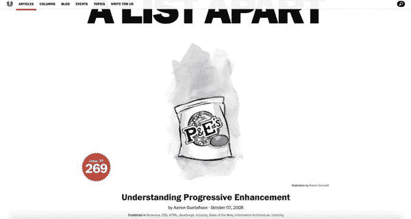
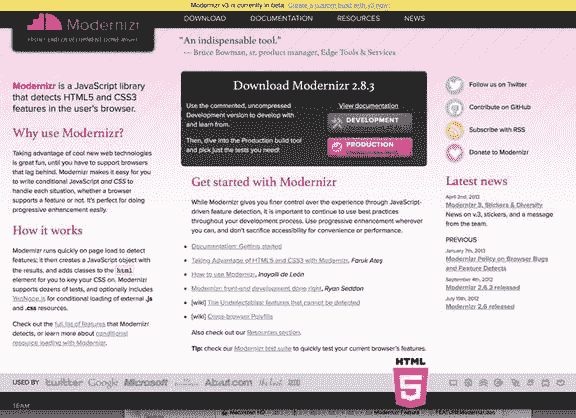
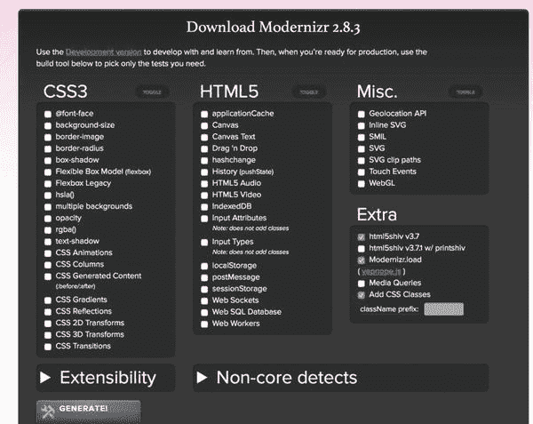
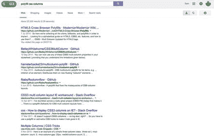
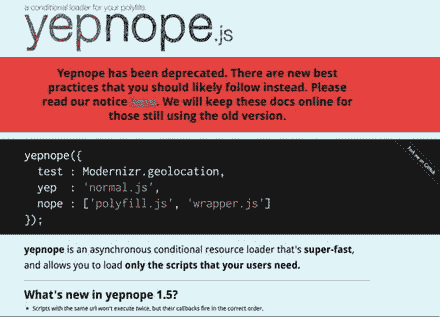
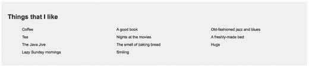

# 八、支持旧浏览器

网络的一个基本原则是有许多不同的设备类型，包括尖端、最新的智能手机、平板电脑和笔记本电脑，以及较旧的企业桌面系统。这对于整个互联网的民主来说是很棒的，但是它给网页设计者带来了头痛，特别是当我们都热衷于采用最新的标准并在我们的页面中充分利用它们的时候。

当你正在为一个网站设计一个新的布局，并且想要采用一个 CSS3 布局模块时，这个问题留给你什么？如何在使用新模块的同时，避免让旧浏览器的用户无法阅读页面？

幸运的是，在大多数情况下，可以采用一种渐进的增强方法(见图 8-1 )来支持这些旧的、过时的浏览器；通过应用一个不需要任何新布局模块就能工作的核心基本布局，您可以将好的东西放在上面。理解新模块的浏览器会遵守增强的规则，不理解的浏览器会忽略它们，坚持核心的后备布局。



图 8-1。

A useful article on the A List Apart web site, found at [`http://alistapart.com/article/understandingprogressiveenhancement`](http://alistapart.com/article/understandingprogressiveenhancement) , that explains the concept of progressive enhancement in detail Tip

定期检查你的访问者统计数据，并做出明智的决定，决定投入多少精力来支持旧的浏览器，这是非常值得的。如果仍然运行 Internet Explorer 8 的人每年只访问你 5 次，那么是时候停止花费精力让你的网站为该浏览器服务了！

## 当别无选择时

尽管渐进式改进在许多情况下都有效，但它并不总是支持旧浏览器问题的令人满意的解决方案。有时项目要求你必须采用一种布局，如果没有对特定 CSS 模块或范例的某种程度的支持，这是不可能的。

在这种情况下，有一种替代方法，它与渐进式增强一起工作，要么以编程方式在旧浏览器中构建对模块的支持，要么使用脚本或黑客来解决缺乏支持的问题。这种处理旧软件不足之处的方法被称为多填充。

维基百科将聚合填充描述为“可下载的代码，它提供了不是内置于网络浏览器中的工具。它实现了开发人员期望浏览器本身提供的技术，提供了一个更加统一的 API 环境。例如，早于版本 8 或 9 的 Internet Explorer 版本不支持 HTML5 的许多功能，但如果网页安装了 polyfill，则这些网页可以使用这些功能。用于描述处理不支持浏览器的类似方法的相关术语包括 shiv 和 shim。然而，不管您如何命名该方法，基本前提是相同的。JavaScript 通常用于询问浏览器对特定功能的支持，如果不支持，它要么提供 CSS 挂钩以允许替代样式(在渐进增强的情况下)，要么以伪本机遵守标准的形式提供工作区支持。

## 实现现代化

在本章的学习过程中，您将会看到，有许多不同的多填充解决方案和多填充方法可供使用，但它们都依赖于使用某种方法来检测浏览器对特定功能的支持，并在发现缺乏支持的情况下，提供一种替代方法。这种方法的基础是特征检测，也许最著名的工具是 Modernizr 库(见图 8-2 )。



图 8-2。

The Modernizr web page: [`http://modernizr.com`](http://modernizr.com/)

Modernizr 是一个 JavaScript 库，允许您使用特性检测来确定用于访问您的网站的浏览器是否可以呈现特定类型的内容或支持特定的特性。该库通过一系列测试来检查浏览器中的支持。例如，如果您正在使用 CSS 转场，您可以测试浏览器渲染这些转场的能力，如果浏览器不处理动画，则提供一个后备或替代方案。

Modernizr 允许您编写条件 CSS 和 JavaScript 来根据用户 web 浏览器的功能定制您的网站体验。对于整个 CSS 规范来说，这是一种有用的技术，但是在这种情况下，它特别方便，因为您可以测试对新布局模块的支持。

该库安装快捷，使用简单。当加载带有 Modernizr 的页面时，会创建一个包含测试结果的 JavaScript 对象，并将 CSS 类添加到`<html>`元素中，允许您通过脚本或 CSS 检查特定的特性是否受支持。

正如我提到的，您可以对特性支持进行测试。这可能会让您想知道具体可以运行哪些测试，以及 Modernizr 支持哪些特性。这个库之所以如此有用和受欢迎，是因为它几乎是浏览器功能支持测试的一站式商店。Modernizr 允许您测试 40 多种下一代功能，包括`font-face`、`rgba`、CSS 动画、渐变、画布、HTML5 音频和视频、本地存储和 WebGL。最重要的是，它可以用来测试本书中讨论的 CSS3 布局模块！

这个库不会强迫你为每一个特性运行测试；Modernizr 的一大优势是它的模块化特性。你只需要测试你需要的特性，而不是必须进行每个单独的特性测试(见图 8-3 )。



图 8-3。

Customizing the Modernizr library to suit the specific tests required for a given project THREE ALTERNATIVE METHODS TO TEST FEATURE SUPPORT IN BROWSERS

在服务器上

如果您担心依赖 JavaScript 来识别浏览器特性，您可以使用服务器端嗅探来代替。这种方法使用浏览器的`user agent`属性在页面被发送到浏览器之前将特定于浏览器的类注入到`html`元素中。请注意，这与任何类型的浏览器嗅探都有相同的潜在问题:它不能很好地伸缩。

条件注释

解决浏览器缺陷的另一个潜在解决方案是使用条件注释来有选择地加载样式表和脚本。这种方法通常用于 IE6 和 IE7，并允许根据版本号和供应商进行加载，尽管支持仅限于 Internet Explorer。

@支持

CSS3 被提议的新特性之一是`@supports`方法。这让您可以编写浏览器呈现特定 CSS 属性能力的条件测试，其工作方式类似于`@media`查询。具有讽刺意味的是，`@supports`最大的问题是缺乏浏览器支持。

### 现代化的替代方案

需要强调的是，Modernizr 并不是唯一一个解决浏览器中缺失支持的解决方案。事实上，Modernizr 本身只是询问浏览器是否支持特定的特性，并相应地更新 DOM 以指明哪些特性支持哪些特性不支持。

与网络上的任何图书馆一样，在你最喜欢的搜索引擎中做一点研究是值得的，因为形势正在迅速变化(见图 8-4 )。使用 Modernizr 的一个好处是，由于它被广泛采用，bug 修复往往会定期发布。



图 8-4。

More than 20,000 results when searching for a polyfill for CSS Multi-columns Layout Note

在创作您的页面时，我再怎么强调在网上查找最新最好的 polyfill 解决方案的重要性也不为过。当你读到这本书的时候，情况已经足够多变，可能会有许多新的解决方案在现有的基础上有所改进。

### 夜明珠

YepNope 挂钩到特定 Modernizr 测试的结果，并使用它们将资源加载到浏览器中(参见图 8-5 )。这非常有用:如果您能够将代码分成单独的部分，那么添加的 YepNope 允许您有条件地加载脚本和样式表。



图 8-5。

The YepNope download page at [`http://yepnopejs.com`](http://yepnopejs.com/)

因为它只有在 Modernizr 测试运行之后才会被调用，所以您可以根据浏览器特性支持有条件地加载脚本和样式，从而避免在每个浏览器中加载所有的解决方案。只有那些需要多填充物的人才能得到它们。当与本章稍后描述的预构建 polyfill 解决方案结合使用时，Modernizr with YepNope 几乎为您在生产网站中实现 CSS3 布局模块时所面临的许多兼容性问题提供了一个拖放式解决方案。

请注意，在撰写本文时，YepNope 已经停止使用，因为 Modernizr 已经更新，包含了足够的功能，使 YepNope 加载程序不再必要。如果您使用的是 Modernizr 的最新版本，几乎可以肯定您不再需要 YepNope，但我在这里提到了它，以防您在企业环境中坚持使用旧版本。

Tip

选择 [`http://caniuse.com`](http://caniuse.com/) 查看显示浏览器对单个 CSS 布局模块支持的最新级别的表格。

### 使用 Modernizr 的示例

让我们快速地看一个 polyfill 的例子，它使用 Modernizr 为不支持您正在使用的模块的旧浏览器提供类似 CSS3 的支持。这个例子使用 CSS3 多列布局模块设计了一个简单的无序列表，将列表的内容分布在一系列列中。在大多数现代浏览器中，这不需要任何供应商前缀或特殊的变通方法。查看 [`http://caniuse.com/#feat=multicolumn`](http://caniuse.com/#feat=multicolumn) 了解最新的浏览器支持。请注意，Internet Explorer 8 和 9 不提供对此模块的任何支持。

#### 该项目

首先，用一些非常基本的样式生成一个 HTML 文档，以创建一个简单的多列布局。你可以在清单 8-1 中看到代码，在图 8-6 中看到 Safari 的输出。



图 8-6。

Output of Listing 8-1 in Safari on a Mac

```html
<!DOCTYPE HTML>
<html>
 <head>
  <meta http-equiv="Content-Type" content="text/html; charset=UTF-8">
   <title>Multicol Polyfill Example</title>
   <style>
    body {
     font-family: arial, helvetica, sans-serif;
     font-size: 62.5%;
     background: #fff;
     color:#333;
     }
     article {
     background: #eee;
     position: relative;
     padding: 20px;
     width: 920px;
     margin: auto;
}
     article h1 {
     font-size: 2em;
}
     article ul {
     columns: 3;
     }
     article ul li {
     list-style: none;
     font-size: 1.2em;
     padding: 5px;
}

  </style>
 </head>
 <body>
 <article>
 <h1>Things that I like</h1>
 <ul>
   <li>Coffee</li>
   <li>Tea</li>
   <li>The Java Jive</li>
   <li>Lazy Sunday mornings</li>
   <li>A good book</li>
   <li>Nights at the movies</li>
   <li>The smell of baking bread</li>
   <li>Smiling</li>
   <li>Old-fashioned jazz and blues</li>
   <li>A freshly-made bed</li>
   <li>Hugs</li>
  </ul>
 </article>
</body>
</html>

Listing 8-1.Code to Achieve a Three-Column Layout with the CSS Multi-column Layout module

```

如您所见，代码通过将 CSS 代码`columns: 3`添加到样式表，将规则应用到`ul`元素，创建了一个基本的三列布局。这适用于除 Internet Explorer 8 和 Internet Explorer 9 之外的所有常用浏览器。然而，你不能绝对保证用户只能使用常用的浏览器。为了确保不支持 CSS 多列布局的浏览器用户也能看到呈现为三列的列表，您可以使用 Modernizr 来测试支持，如果没有找到支持，则使用 polyfill 来呈现列。

#### 聚合填料

这是一个非常基本的布局，因此您不需要任何花哨或壮观的东西来解决缺乏浏览器支持的问题。您可以使用专门为呈现多列内容而构建的多列填充:多列多列填充，您可以在 [`https://github.com/hamsterbacke23/multicolumn-polyfill`](https://github.com/hamsterbacke23/multicolumn-polyfill) 找到并下载。

在使用这个脚本之前，您需要确保在您的页面上安装并激活了 Modernizr。向页面的`<head>`部分添加一行代码，以调用 CDN 托管版本的 Modernizr 库，如清单 8-2 所示。

```html
<head>
 <meta http-equiv="Content-Type" content="text/html; charset=UTF-8">
 <title>Multicol Polyfill Example</title>
<script src="jquery.js"></script>
 <script src="https://cdnjs.cloudflare.com/ajax/libs/modernizr/2.8.3/modernizr.min.js"></script>
 <style>
  body {
   font-family: arial, helvetica, sans-serif;
   font-size: 62.5%;
   background: #fff;
   color: #333;
  }

Listing 8-2.Adding a CDN-Hosted Version of the Modernizr Library

```

现在您已经在页面上安装了 jQuery 和 Modernizr 库，您可以使用一个简单的 JavaScript 测试来检查浏览器是否支持 CSS 多列布局模块。将它添加到代码中紧接在结束的`</body>`标签之前，如清单 8-3 所示。

```html
  <li>Hugs</li>
  </ul>
  </article>
  <script src="polyfill/multicolumn.js"></script>
  <script>
   if (!Modernizr.csscolumns) {
     $('article ul').multicolumn();
   }
   </script>
 </body>
</html>

Listing 8-3.Test and Polyfill in Action 

```

这一额外代码的结果是，如果浏览器没有通过多列支持的 Modernizr 测试，则加载 polyfill。polyfill 使用浮动元素跨列呈现内容，并隐藏原始容器。就这么简单明了。

这个特定的示例解决了一个非常简单的多填充布局问题，但是无论您的需求变得多么复杂，同样的原则也适用。分解每个元素和聚合填充就是识别功能、测试支持，然后为这些布局元素提供备用方案。注意，不保证支持特定的浏览器。这取决于您选择的特定聚合填充，如 IE9 没有使用前面的示例呈现列所示。

Note

在撰写本文时，Modernizr 正在经历一个新的大版本。您可以复制并粘贴特定的测试代码，而不是下载或安装整个库，这些代码特定于您想要检查的特性。请务必访问 Modernizr 网站以获得该库的最新版本。

## 预建多孔填料

有时，现成的聚合填充解决方案无法满足您的特定需求，在这种情况下，您可能会发现自己需要构建自己的脚本，以提供功能来替代缺少的支持。然而，在大多数情况下，简单地使用 Modernizr、YepNope 和一个预构建的 polyfill 脚本就足够了。还要注意，还有其他不使用 Modernizr 的选项。

为了让您对涵盖布局模块的现有聚合填充的范围有所了解，以下是从 Modernizr 博客(其中有一个广泛的选项列表)中借用的一个略加整理的列表。要查看完整列表，请访问注释中的链接:

*   CSS 多列布局:塞德里克·萨瓦雷塞多列填充， [`http://alistapart.com/article/css3multicolumn`](http://alistapart.com/article/css3multicolumn)
*   CSS 灵活的盒子布局:由理查德埃雷拉灵活， [`http://flexiejs.com`](http://flexiejs.com/)
*   CSS 网格布局:弗朗索瓦·雷米的网格布局 polyfill， [`https://github.com/FremyCompany/css-grid-polyfill`](https://github.com/FremyCompany/css-grid-polyfill)
*   CSS 模板布局:CSS 模板布局 jQuery 插件由 Alexis Deveria， [`https://code.google.com/p/css-template-layout/`](https://code.google.com/p/css-template-layout/)
*   CSS 区域布局:弗朗索瓦·雷米的区域填充， [`https://github.com/FremyCompany/css-regions-polyfill`](https://github.com/FremyCompany/css-regions-polyfill)

Note

有关本书中每个布局模块特定的 polyfills 的完整列表，请参考 Modernizr 在 [`https://github.com/Modernizr/Modernizr/wiki/HTML5-Cross-Browser-Polyfills`](https://github.com/Modernizr/Modernizr/wiki/HTML5-Cross-Browser-Polyfills) 发布的关于该主题的博客文章。

## 摘要

虽然当新功能出现时，人们很容易被冲昏头脑，特别是在标准实现速度非常慢的 Web 上，但是不要忽视支持旧浏览器的需要，这一点很重要，因为旧浏览器在访问您的网站的用户中占很大比例。在许多情况下，聚合填充为提供支持提供了一个实用的解决方案。如果由于技术或资源原因，这样做不切实际或不可能，那么采用渐进式增强方法可以提供一种有用的替代方法，确保您的内容易于访问且用户友好。

随着浏览器支持的改进和用户更新他们的系统以利用最新的软件，polyfills 应该会变得不那么流行。但是就目前而言，当你想使用本书中讨论的布局模块之一，并且不能控制观众的操作系统和设备配置文件时，它们是值得使用的。

不要忘记通过你最喜欢的搜索引擎定期检查新的和改进的 polyfills。全世界有才华的 web 开发人员都在不断构建解决方案，以解决通用浏览器中尚未实现的模块问题。