# 九、加速工作流：CSS 库和框架

从事网页设计需要大量的重复工作:虽然每个页面都是独一无二的，但是大部分底层代码都依赖于相同的核心原则和构建模块。CSS3 引入的布局模块为许多不同的布局范例提供了一个整洁的解决方案，但是当你一遍又一遍地设计本质上相同的布局时，它们可能会变得不必要的复杂。在使用核心构建块时，您如何减少时间和复杂性开销？通过使用 CSS 库和框架，您可以简化布局过程，抽象一些复杂性，并提供一个一致、快速的开发平台。

您很可能熟悉许多这样的框架和库；它们不是新的，也不局限于 CSS3 布局模块。一些最受欢迎的网站是建立在开源框架之上的，这些框架是由 Twitter、微软、苹果和脸书背后的开发团队开发的。例如 Bootstrap，它提供了一种简单的解决方案，以响应方式创建许多布局元素，几乎适用于所有可能的设备。这些框架都倾向于去除与基础 CSS 代码的直接联系，使得开发成为将适当的结构和 CSS 类应用于页面结构中的单个元素的情况。

许多库和框架处理的不仅仅是布局。内置的许多功能还允许您以一致的方式制作小部件和按钮以及样式副本和标题。这可能有好处，但是如果你只想能够使用一套预定义的风格进行设计，你就不会有这本书在你的手中！这一章向你介绍了一些最好的 CSS3 布局库和框架，特别关注于保持样式的工作在你的控制之下。不可避免地，你会找到一个你喜欢的，你会坚持下去。有必要定期查看网络，看看在线社区开发了哪些新的框架(例如，见图 9-1 )，因为环境是如此的不稳定，事情可能会变化得非常快。

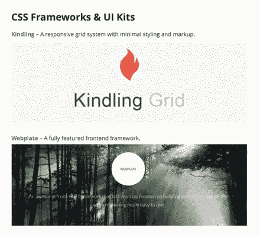

图 9-1。

There are many web sites dedicated to showcasing CSS3 libraries and frameworks, such as SpeckyBoy ( [`http://speckyboy.com/2014/06/02/css-libraries-frameworks-tools/`](http://speckyboy.com/2014/06/02/css-libraries-frameworks-tools/) ) Tip

一旦你找到了你喜欢的图书馆，花时间去了解它的细微差别会在以后带来巨大的回报。但是不要坐以待毙，接受你已经找到了库/框架选项的顶峰。货比三家是值得的！

## 不要从头开始

库和框架有多种形式。有些是全功能的网站开发工具，充当页面布局、设计实现和内容样式的脚手架。其他人采取更结构化的方法，提供构建模块，并从美学的角度处理页面上的元素。

这两种方法各有优缺点，但它们有一个共同的目标:加速页面的开发，使代码更容易实现一致性。您不需要从头开始设计每个新页面:相反，通过调用合适的库，您可以使用其他人的工作来减少重复工作。

开发人员和设计人员倾向于找到他们喜欢的工具并坚持使用。当您使用特定的库或框架时，这会带来好处，因为随着您对特定代码库的方法越来越熟悉，您可以充分利用它所提供的优势。忠于一个工具也有它的缺点，尤其是因为看不到其他可用的工具，您可能会错过其他地方提供的增强功能和能力。因此，我鼓励您尝试许多不同的库和框架，并不断进行采样。

经常反对使用其他开发人员代码的一个论点是，您可能会依赖于该供应商的意愿和能力来消除 bug 并提供更新和修订。学习每个特定代码库的细微差别也需要时间投入。我想让你相信，前期的一点投资可以在未来带来巨大的时间(和金钱)收益。

另一个值得讨论的问题是跨浏览器的可操作性，这也是库和框架倾向于缓解的一个问题，而您对此不必太担心。尽管(幸运的是)一些最糟糕的 CSS 实现差异已经成为过去，但是对于规范中的各个模块应该如何集成，仍然存在不同的解释。对于新兴的模块来说尤其如此，比如你在本书中看到的那些。通过使用一个库，你可以在图 9-2 中看到一个例子，你可以消除提供厂商前缀版本选择器的不确定性。这意味着你有更多的时间花在整体布局上，而不是浪费时间去弄清楚为什么一个特定的浏览器不像其他浏览器那样实现你的设计。

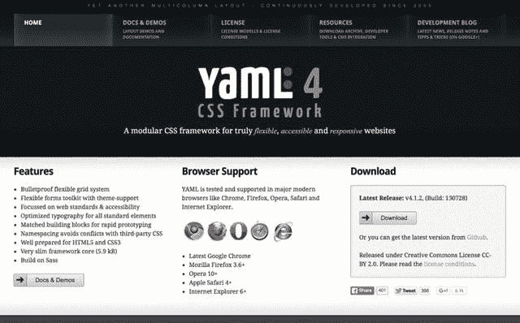

图 9-2。

The YAML webpage, found at [`http://www.yaml.de`](http://www.yaml.de/)

同样，与这种好处相反的是，库有时会变得臃肿和笨重，这意味着它们可能会影响网站的性能。当您只对公司的企业设备感兴趣时，支持世界上所有设备的额外代码可能会超过使用库的一些好处。

### 库和框架没有正确的答案

正如你所看到的，有支持和反对使用 CSS 库和框架的争论。它是否适合您的特定项目，这个问题只能通过您自己的分析来回答，而且通常需要您做出判断。

然而，认识到在某些情况下使用它们是有益的，本章的其余部分将致力于研究在写作时可用的一些选项。在本章快结束时，你还将重温在第五章完成的一个项目，看看如果你使用一个库而不是原始的 CSS 代码，它会如何被不同地解释和实现。

Note

一些库和框架使用 CSS3 布局模块和非 CSS3 布局技巧的混合方法。除非您是一个纯粹主义者，否则这可以为实现特定布局的问题提供一个好的、健壮的解决方案。

## 最好的 CSS 框架和库

考虑到你正在一个非常不稳定的时期使用 CSS3 布局模块，这一节的标题是加粗的，但是我挑选了一些目前可用的最好的 CSS 框架和库。我怎么知道他们是最好的？我对搜索引擎结果进行了一项完全不科学的研究，以确定大众观点。我会一直这么说:当你开始搜索一个图书馆的时候，你一定要看看网上社区是怎么说的。

如前所述，有两种基本类型的库和框架可用。区别就像一个普通的汽车旅馆房间和五星级酒店房间一样。有时候，你想要的不过是四面墙和一张床，能够自己做饭，可以随心所欲地使用自己的房间；其他时候，你希望奢侈地让其他人担心细节，并且把所有东西都放在银盘上带给你！

在最基本的层面上，CSS3 布局库只提供挂钩来允许您创建网格布局、呈现 flexbox 或调用多列布局，除了将适当的类名应用于一系列的`<div>`、`<section>`或`<article>`之外，无需做任何其他事情。这些类似于一个基本的汽车旅馆房间。他们只做一件事，仅此而已。剩下的就看你自己了！另一端是完成所有布局的解决方案，这些解决方案还提供小部件、样式和皮肤，它们基本上可以提供实现页面设计和布局所需的所有工具，包括所有的美学。

我在汽车旅馆的房间里犯了错误。但是，不要让这阻止你追求全面服务的选择，如果它能更有效地满足你的特殊项目的需求。

### Flexbox 网格

Flexbox 网格系统是一个简单明了的库，旨在允许您使用元素上的类将不同的 Flexbox 属性分配给布局，而不必直接钻研 CSS(参见图 9-3 )。由 Kristopher Joseph 创建，这是一个非常轻量级的解决方案，几乎不抽象源代码 CSS3 Flexbox 代码；但正因为如此，也真的很容易学会使用。在本章的后面，您将使用这个库来重新创建原来的 Flexbox 项目。

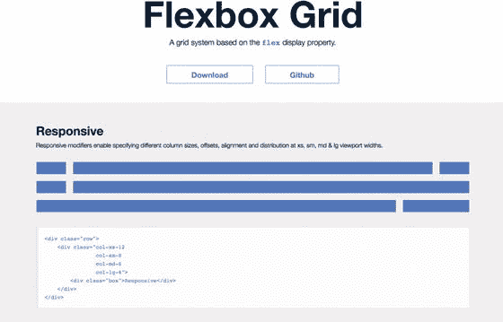

图 9-3。

Flexbox Grid, found at [`http://flexboxgrid.com`](http://flexboxgrid.com/)

### ptb/flexgrid

该框架也基于 Flexbox 模块，但它并没有提供框架，而是试图重新创建 Bootstrap 使用的相同布局范例(见图 9-4 )。由此产生的网格布局比其他选项要严格得多，但是如果您已经熟悉了 Bootstrap 12 列网格，您会立即有宾至如归的感觉。

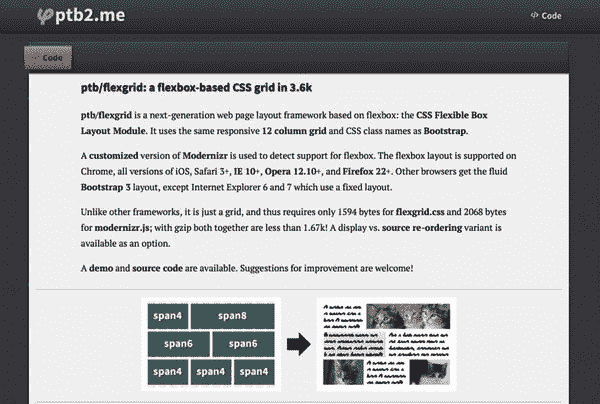

图 9-4。

ptb/flexbox, found at [`http://ptb2.me/flexgrid`/](http://ptb2.me/flexgrid/)

ptb/flexgrid 完全是为了在网格系统中布局内容而设计的——没有花哨的用户控制样式或额外的小部件。结果是，除了 Modernizr 库之外，整个框架占用的空间不到 2 KB，Modernizr 库是确保布局在所有浏览器上都能工作所必需的。

### 指南针

Compass 与本节重点介绍的其他库和框架的不同之处在于，它不仅仅使用单个 CSS3 布局模块，而是提供了一个解决方案，使得使用 CSS3 和 CSS 中的所有可用工具更加容易(参见图 9-5 )。前提很简单:减少与精心设计特定设计相关的代码混乱，并提供对 Web 上流行的可重用设计模式的轻松访问。这意味着您可以使用该框架，使用您熟悉的构建块来快速原型化和部署布局。还有许多扩展，涵盖了从排版控制到精灵生成的所有内容。

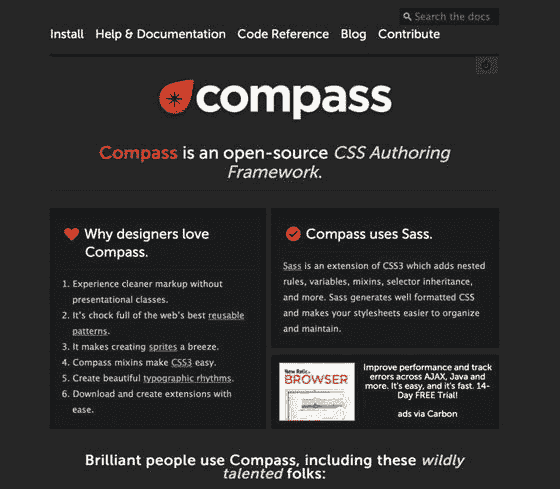

图 9-5。

Compass, found at [`http://compass-style.org`](http://compass-style.org/)

### CSS 区域聚合填充

尽管 Francois Remy 的 CSS Regions Polyfill 在技术上并不是一个框架，但我在这里包含了它，因为它为立即使用 CSS 区域布局规范提供了一个真正有用的解决方案(见图 9-6 )。使用 Francois 的 JavaScript 库的特别好处是，它允许您实现没有浏览器供应商前缀的区域，使您今天编写的代码仍然需要直接访问和理解 CSS 区域布局模块，但由于 JavaScript，它是面向未来的，同时仍然可以被旧浏览器访问。

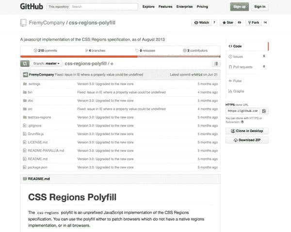

图 9-6。

CSS Regions Polyfill, found at [`https://github.com/FremyCompany/css-regions-polyfill`](https://github.com/FremyCompany/css-regions-polyfill)

因为该库使用原始规范，所以除了本书所涵盖的内容之外，您不需要了解任何其他内容。这不会简化您的代码，但它消除了在提供跨浏览器支持和回退方面的一个令人头痛的问题。

### 反应灵敏的永旺

这个基于网格的库使用了与这里强调的其他一些库类似的方法，但是布局工程是完全抽象的，所以不能立即看出哪些模块被用来创建布局(见图 9-7 )。事实上，最新的更新使用了大量的 CSS2.1 来产生布局，同时使用了类似于 CSS3 网格布局的方法。请记住，当你使用 CSS 布局时，你是在调用几十年工作的组合；因此，如果您需要比“开发中”的 CSS3 模块更稳定的东西，这可能是迈向完全 CSS3 解决方案的一个很好的跳板。代码非常简单，因此也适合进行定制，以形成您可以在未来项目中重用的库的基础。

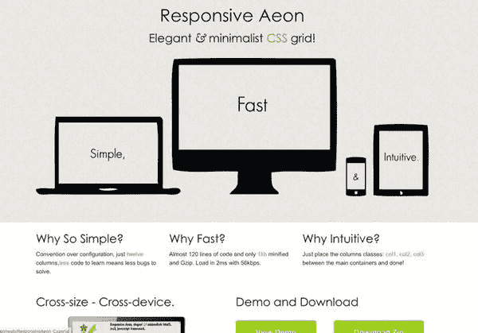

图 9-7。

Responsive Aeon, found at [`http://newaeonweb.com.br/responsiveaeon/`](http://newaeonweb.com.br/responsiveaeon/)

### 仅仅是开始…

请记住，本章中强调的库和框架只是 Web 上可用选项的开始。为了加快工作流程，尽早投入时间检查和探索可用的选项至关重要。

Note

在这里，我再次强调，当你创作你的页面时，在网上查找最新最好的库和框架是非常重要的。当你读到这本书的时候，几乎可以肯定的是，在写作的时候，将会有许多选择加入到可用的组合中。

## 加速您的工作流程:一个例子

既然您已经看到了一些当前可用的使用 CSS 库和框架来加速页面开发的选项，那么让我们更详细地研究其中一个，看看使用其中一个库会是什么样子。出于这种探索的目的，让我们回到您在本书前面看到的一个示例项目。这是很有用的，因为它允许您看到如何通过使用框架来简化早期编写的代码。

### 现实世界的例子

如果你还没有阅读第五章的话，现在就快速浏览一下，熟悉 CSS Flexbox 以及它是如何填充空间的。此示例重新创建了该章中的项目；但是它没有使用原始的 CSS Flexbox 代码，而是利用了 Flexbox 网格库，并显示了该库对代码的影响。

让我们回忆一下您想要创建的布局。图 9-8 显示了第五章中的模型；这个例子使用了完全相同的元素来创建这个项目的另一个版本，但是一旦你熟悉了 Flexbox 网格库，这应该会容易得多。

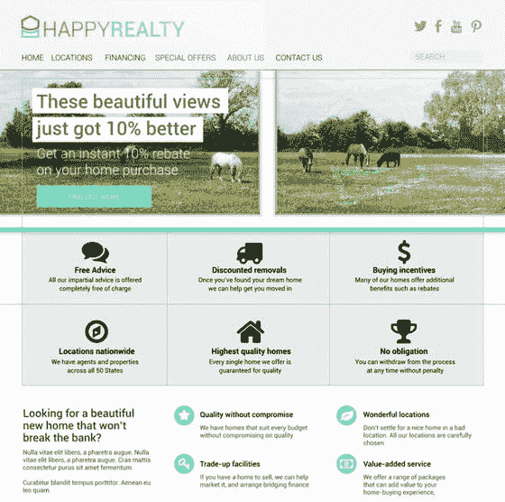

图 9-8。

The project to be re-created from Chapter 5 using a library instead of raw CSS flexbox code

如果你一直在关注，你会发现 Flexbox 被用来创建图 9-9 中的布局。为了提供公平的比较，您将使用相同的模块来呈现库支持的布局。这意味着调用本章前面强调的 Flexbox 网格库。我不是在支持那个特定的图书馆。但是正如您将看到的，它确实为精心设计布局提供了一个有效且实用的解决方案。正如前面的布局尝试一样，让我们专门关注页面的三个部分:导航栏、大屏幕区域和利益陈述。

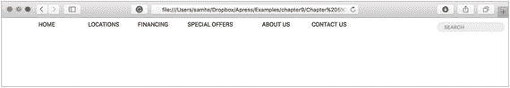

图 9-9。

If you’re eagle-eyed, you’ll notice that this is practically the same as the render in Chapter 5 following the native CSS attempt. The primary difference is that this version aligns to a grid

### HTML 标记

让我们从第五章中使用的 HTML 标记开始，如清单 9-1 所示。这个页面的代码很简单，遵循的模式类似于过去使用浮动来排列设计元素时使用的布局。

```html
<!—The navigation section -->
<nav>
 <ul>
  <li><a href="#">Home</a></li>
  <li><a href="#">Locations</a></li>
  <li><a href="#">Financing</a></li>
  <li><a href="#">Special Offers</a></li>
  <li><a href="#">About us</a></li>
  <li><a href="#">Contact Us</a></li>
  <li class="searchform"><form><input type="text" value="search" /></form></li>
 </ul>
</nav>

<!—The big icons/jumbotron section -->
<section id="jumbotron">
 <article>
  <h2>Free Advice</h2>
  <p>All our impartial advice is offered completely free of charge</p>
  
 </article>
 <article>
  <h2>Discounted Removals</h2>
  <p>Once you've found your dream…
...</article>
</section>

<!—The badge benefits section -->
<section id="benefits">
  <article>
   <h1> Looking for a beautiful new home that won't break the bank?</h1>
   <p> Nulla vitae elit libero, a pharetra augue. Nulla vitae elit libero, a pharetra augue. Cras mattis consectetur purus sit amet fermentum.</p>
  </article>
  <article class="badge">
   <div>
    <h3>Quality without compromise</h3>
    <p>We have homes that suit every budget without compromising on quality</p>
   </div>
   
  </article>
  <article class="badge">...
  ...</article>
</section>

Listing 9-1.HTML Code for Three Parts of the Page Suited to Flexbox Layout

```

### 使用图书馆

不同的库有不同的实现方案。这个例子使用了 Flexbox 网格库，所以您下载了这个库，并按照说明将其插入到我的页面中。这就像在`<head>`部分创建一个`<link>`一样简单，如清单 9-2 所示。

```html
<head>
  ...
   <link rel="stylesheet" href="css/flexboxgrid.min.css" type="text/css">
  ...
</head>

Listing 9-2.Installing the Library by Copying Files into the Web Site Folders and Using a <link> Statement

```

Tip

回想一下，由于新的 CSS3 模块是由浏览器供应商实现的，所以他们在实现中倾向于从特定于供应商的前缀开始。库和框架消除了你关心这些细微差别的需要。

#### 导航

您需要处理的页面的第一部分是贯穿设计顶部的导航。如果你回头参考第五章，你会发现直接使用 Flexbox 非常简单。清单 9-3 重复了第五章中使用的 CSS 代码，来说明有多简单！使用 Flexbox 网格库同样简单，如清单 9-4 所示。

```html
/* The navigation section */
nav > ul {
  display: flex;
  flex-flow: row wrap;
 }
 nav > ul > .searchform {
  margin-left: auto;
 }

Listing 9-3.Native Flexbox CSS Code to Create the Navigation Layout

```

```html
<!—The navigation section -->
<nav>
 <ul class="row start-xs">
  <li class="col-xs"><a href="#">Home</a></li>
  <li class="col-xs"><a href="#">Locations</a></li>
  <li class="col-xs"><a href="#">Financing</a></li>
  <li class="col-xs"><a href="#">Special Offers</a></li>
  <li class="col-xs"><a href="#">About us</a></li>
  <li class="col-xs"><a href="#">Contact Us</a></li>
  <li class="col-xs-offset-2 col-xs searchform"><form><input type="text" value="search" /></form></li>
 </ul>
</nav>

Listing 9-4.Using the Flexbox Grid Library and Altering the HTML Code to Apply Specific Classes to Elements

```

如您所见，这两种方法的主要区别在于，当您通过直接编写 CSS Flexbox 代码来处理实现时，您使用 CSS 来创建布局。在 Flexbox 网格库的情况下，您可以将类名应用于 HTML。在这个例子中，差别是微不足道的；但是随着事情变得越来越复杂，如果您希望更改出现在布局中的项目数量，第二种方法会更加灵活。图 9-9 显示了实现 Flexbox 网格库后 Chrome 中的导航输出。

#### 大屏幕

使用直接的 CSS，超大屏幕很容易制作。回想一下以下关于设计模型的内容，这些内容有助于将设计模型转化为功能性布局:

*   每个`<article>`大小均匀。
*   大屏幕中每个元素的内容在两个轴上居中对齐。
*   图像在文本之前呈现，但出现在标记中的文本之后。

回头查看 HTML 代码，注意最后一点要求您在演示过程中对内容进行重新排序。Flexbox 让这变得简单明了，Flexbox 网格库也是如此。同样，通过将特定的类应用到标记中的元素来处理所有事情。清单 9-5 中显示了使用该库的代码。

```html
<!—The big icons/jumbotron section -->
<section id="jumbotron" class="row">
 <article class="col-lg-4 col-xs-12">
  <div class="marginbox row">
   <h2 class="col-xs-12">Free Advice</h2>
   <p class="col-xs-12">All our impartial advice is offered completely free of charge</p>
   <div class="col-xs-12 first-xs"></div>
  </div>
 </article>
 <article class="col-lg-4 col-xs-12">
  <div class="marginbox row">
   <h2 class="col-xs-12">Discounted Removals</h2>
   <p class="col-xs-12">Once you've found your dream home we can help get you moved in</p>
   <div class="col-xs-12 first-xs"></div>
  </div>
 </article>
 <article class="col-lg-4 col-xs-12">
  <div class="marginbox row">
   <h2 class="col-xs-12">Buying Incentives</h2>
   <p class="col-xs-12">Many of our homes offer additional benefits such as rebates</p>
   <div class="col-xs-12 first-xs"></div>
  </div>
 </article>
 <article class="col-lg-4 col-xs-12">
  <div class="marginbox row">
   <h2 class="col-xs-12">Locations nationwide</h2>
   <p class="col-xs-12">We have agents and properties across all 50 States</p>
   <div class="col-xs-12 first-xs"></div>
  </div>
 </article>
 <article class="col-lg-4 col-xs-12">
  <div class="marginbox row">
   <h2 class="col-xs-12">Highest Quality Homes</h2>
   <p class="col-xs-12">Every single home we offer is guaranteed for quality</p>
   <div class="col-xs-12 first-xs"></div>
  </div>
 </article>
 <article class="col-lg-4 col-xs-12">
  <div class="marginbox row">
   <h2 class="col-xs-12">No obligation</h2>
   <p class="col-xs-12">You can withdraw from the process at any time without penalty</p>
   <div class="col-xs-12 first-xs"></div>
  </div>
 </article>
</section>

Listing 9-5.Flexbox Grid Classes Applied to the HTML Markup, Assigning Layout Attributes to the Elements on the Page

```

改变 HTML 也意味着原来的 CSS 不再相关。您可以删除所有的 Flexbox 代码，如清单 9-6 所示，留下清单 9-5 中分配的类。

```html
/* The jumbotron section */
#jumbotron {
 background: #38CEB1;
 max-width:    960px;
 min-height:    380px;
 justify-content: center;
 padding-left: 1px;
}
#jumbotron article {
 /* Vertical align */
 justify-content: center;
 text-align: center;
}
.marginbox {
 /* Vertical align */
 justify-content: center;
 text-align: center;
 min-height: 190px;
 background: #EAEAEA;
 margin: 0 1px 1px 0;
}

#jumbotron article .marginbox * {
 align-self: center;
}

#jumbotron article .marginbox:hover {
 background: #efefef;
}

Listing 9-6.Removing the Flexbox Code from the CSS Used in Chapter 5, and Thus Simplifying the Code

```

在 Safari 中渲染的结果如图 9-10 所示。请注意，这种替代方法要求您在每篇文章的内容周围添加一个额外的`<div>`元素。这是考虑到文章之间的边距，否则将导致每行仅呈现两篇文章。我还将这个额外的`<div>`设置为嵌套的 Flexbox 网格行，确保三个元素按照设计要求伸缩。渲染的每个其他方面都是相同的。

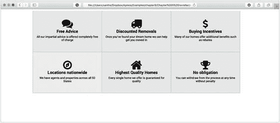

图 9-10。

The output from Listing 9-6 is identical to the original version created in Chapter 5

如果您想知道当浏览器窗口比 960px 窄时会发生什么，Flexbox 的优势在这里仍然适用。当窗口变得更窄时，内容会重新分页。这得益于为每个元素分配多个类的能力。在这种情况下，我分配了一个额外的小屏幕，以 12 列的宽度显示每个`<article>`(填充整个行)，这意味着每行只呈现一个`<article>`。

#### 福利区

最初使用 Flexbox 呈现的页面的剩余部分是底部的福利部分。你可能还记得，这是三个部件中最复杂的一个。

福利部分更复杂，因为左边的列是右边部分的两倍高。为了处理这个问题，HTML 嵌套了元素。您可以在清单 9-7 中看到实现 Flexbox 网格库时所需的代码。同样，除了库处理的布局挂钩之外，还需要一些额外的 CSS 代码，如清单 9-8 所示。产生的代码量与第五章中创建的原始版本大体相似，但是布局控制已经被移植到 HTML 元素上的类的使用上，而不是纯粹在 CSS 中。这意味着通过引入额外的元素来改变布局可以直接从 HTML 中控制。

```html
<!—The badge benefits section -->
<section id="benefits" class="row">
 <article class="col-lg-4">
  <h1>Looking for a beautiful new home that won't break the bank?</h1>
  <p>Nulla vitae elit libero, a pharetra augue. Nulla vitae elit libero, a pharetra augue. Cras mattis consectetur purus sit amet fermentum.</p>
  <p>Curabitur blandit tempus porttitor. Aenean eu leo quam.
 </article>
 <div class="col-lg-8 row">
  <article class="badge col-lg-6 row">
   <div class="col-lg-9 row">
    <h3 class="col-lg-12">Quality without compromise</h3>
    <p class="col-lg-12">We have homes that suit every budget without compromising on quality</p>
   </div>
   <div class="col-lg-3 first-xs"></div>
  </article>
  <article class="badge col-lg-6 row">
   <div class="col-lg-9 row">
    <h3 class="col-lg-12">Trade-up facilities</h3>
    <p class="col-lg-12">If you have a home to sell, we can help market it, and arrange bridging finance</p>
   </div>
   <div class="col-lg-3 first-xs"></div>
  </article>
  <article class="badge col-lg-6 row">
   <div class="col-lg-9 row">
    <h3 class="col-lg-12">Wonderful locations</h3>
    <p class="col-lg-12">Don't settle for a nice home in a bad location. All our locations are carefully chosen</p>
   </div>
   <div class="col-lg-3 first-xs"></div>
  </article>
  <article class="badge col-lg-6 row">
   <div class="col-lg-9 row">
    <h3 class="col-lg-12">Value-added service</h3>
    <p class="col-lg-12">We offer a range of packages that can add value to your home-buying experience, </p>
   </div>
   <div class="col-lg-3 first-xs"></div>
  </article>
 </div>
</section>

Listing 9-7.Required HTML Alterations 

```

```html
/* The badge benefits section */
#benefits {
 width:    960px;
 max-width:  960px;
 margin-top: 50px;
 height: 260px;
}
#benefits article.badge img {
 margin:  0.5em 0;
 margin-right: 10px;
}
#benefits article h1 {
 font-size:  2em;
 padding-right: 1em;
 font-weight:  normal;
 margin-bottom:  0.5em;
}
#benefits article h3 {
 font-size:  1.6em;
 font-weight:  normal;
 margin:  0;
 padding-left: 0;
 text-align:   left;
}
#benefits article p {
 text-align:   left;
 padding:  0;
 font-size:  1.2em;
 margin-bottom:  1em;
}

Listing 9-8.CSS to Size Elements on the Page

```

该实现的输出如图 9-11 所示。请注意，结果再次与第五章的原始版本几乎相同。这是意料之中的，因为从根本上说，这两种实现的代码是相同的；区别在于如何将属性分配给标记。您喜欢哪种方法由您自己决定，但是使用预构建的库来按照通用的设计模式创建布局，而不需要每次都创建自己的解决方案是非常有用的。

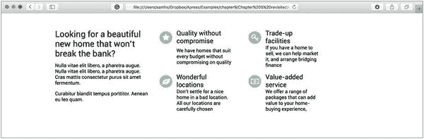

图 9-11。

The output in Safari Note

再次重申，需要一些额外的非 Flexbox CSS 代码来定义本例中显示的颜色、边框和印刷样式。我特意修剪了代码片段，只显示相关的 CSS 代码用于布局。

## 摘要

本章介绍了使用 CSS 库和框架加速页面开发的方法。虽然每次你开始一个页面布局的时候都很想重新发明轮子，但是基本上相同的核心元素支撑着你将要设计的几乎每一个页面。通过认识到这一事实，并使用库来加速布局，您可以专注于获得正确的设计细节。

当然，有时一个库或框架不适合你的项目，所以不要害怕承认你需要不时推出自己的解决方案。最好在开发过程的早期就认识到这一点，而不是在你投入大量时间将一个设计硬塞进一个框架中之后才恍然大悟。出于这个原因，预先花一点时间调查所有选项并选择最适合您特定项目的选项是值得的——即使这导致您不使用库！