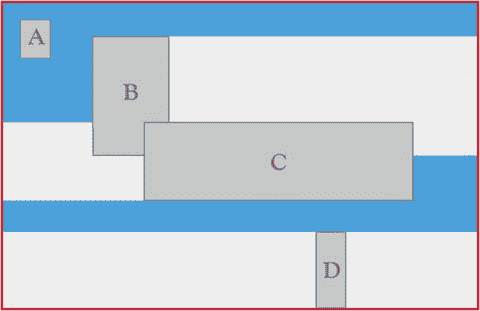
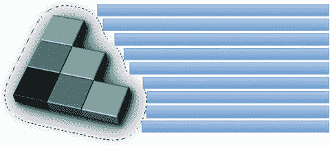

# 十、CSS 布局的未来

恭喜你！关于作为 CSS3 的一部分提供的当前布局选项，您已经到达了这本书的末尾。但是不要以为这就是故事的结局！

在学习本章的过程中，您已经深入研究了 CSS Flexbox、CSS 多列布局、CSS 区域布局和 CSS 网格布局，您甚至快速回顾了过去提供的替代方案。我希望您也已经获得了一些想法，如何填充缺失的功能，并使用渐进增强的原则为越来越多使用最新浏览器的用户提供新的和改进的布局，同时不排除那些停留在旧浏览器上的用户。

## 这一切都还在开发中

正如你从本书中讨论的一些模块的短暂性所看到的，CSS3 正在积极开发中。不仅仅是我提到的模块还在开发中——更多的好东西正在开发中，可能会给你日常使用的布局带来全新的范例。

在写作和研究这本书的过程中，有很多关于 Adobe、微软、苹果和 Mozilla 等公司令人兴奋的新发展的传闻。2000 年代 CSS 发展停滞的时代已经结束；随着越来越多的消费者接受新技术并对他们的在线体验提出更多要求，负责提供支持这些体验的框架的公司正在倾听并做出反应！

Adobe 就是一个例子。以桌面出版和创意工具而闻名的 Adobe，决心拥抱数字化的未来——还有什么比开放网络更好的平台呢？除了共同发起许多你已经看到的模块，这个软件巨人的开发室里还在讨论许多其他的模块。

### 即将推出的模块和想法

我希望你已经意识到这样一个事实，即我们正处于 CSS 发展的一个非常激动人心的阶段。这种语言发展迅速，人们可以毫无畏惧地随意表达观点。这意味着有很多参与，设计师和技术人员正在接受进一步开发的想法。让我们快速看一下可能会成功的两个未来模块。

#### CSS 排除项

CSS 排除已经超越了闭门讨论的范畴，现在正在通过 W3C 进行开发。它目前处于工作草案形式，由 Adobe 和微软共同赞助；它基于 CSS2.1 中引入的浮动元素的思想。

在某些方面类似于 CSS 区域布局，CSS 排除描述了内容围绕元素流动的方式，有效地为设计者的军火库增加了另一个布局格式化工具(见图 10-1 )。值得注意的是，该规范仍处于最早期阶段，因此在不久的将来您将无法可靠地使用它，但您可以在 [`www.w3.org/TR/css3-exclusions/`](http://www.w3.org/TR/css3-exclusions/) 找到更多信息，那里有当前的规范。在撰写本文时，还没有太多的实现可用，但这可能是一个小而重要的改进，可以让您以更杂志式的方式控制内容。

图 10-1。

The effect of CSS Exclusions on content, determining how wrapping should occur

#### CSS 形状

虽然不仅仅是关于布局，CSS Shapes 是另一个即将到来的规范的例子；您可以在 [`www.w3.org/TR/css-shapes/`](http://www.w3.org/TR/css-shapes/) 了解更多信息。同样，它建立在网页上实现更像杂志的布局的想法上；在这种情况下，它为内容确定非盒形的盒子。这是一件相当大的事情，因为到目前为止，你不得不使用烟雾和镜子来给人一种处理东西而不是盒子形状的内容区域的印象。

同样，这个模块是由 Adobe 和微软共同赞助的，并且仍在积极开发中。请关注网站，获取关于何时可以真正使用它的最新信息(没有当前基于脚本的填充工具！).图 10-2 让你知道这对于格式化网络上的图片(或其他内容)有多么重要。

图 10-2。

A CSS shape acting based on the alpha channel of an image, wrapping content automatically around the image subject

## 还有更多…

正在探索的想法不仅限于这两个模块。查看 CSS 工作组网站了解更多信息，包括根据内容级别确定样式的演示级别模块(对于 PowerPoint 样式的演示非常有用)以及对网页上处理分页媒体的方式的升级。这里有很多内容超出了我的篇幅，所以很值得浏览一下，看看这本书的下一版会有什么内容！

Caution

事情会随着时间而改变！不要忘记定期查看权威的 CSS3——W3C——对本书中概述的规范的修订和增强。在编写这本书的这段时间里，已经有了许多发展，毫无疑问，在整套模块处于候选发布阶段之前，还会有更多的发展。但是，这也是在网络上工作的乐趣之一，不是吗？

## 摘要

这一章已经看了我们已经走了多远，以及 CSS3 布局的当前状态。我还偷偷瞥了一眼未来，以及未来几年可能会开发出哪些令人兴奋的新模块。这是一个参与网页设计的绝佳时机；随着推动网络发展的语言和技术的进步，以及允许用户浏览和享受网络的浏览器的进步，我们作为网页设计师的未来只会更加光明。前进，展开！