# 一、流程的价值

在这一章中，我们旨在关注你的团队和公司中的流程如何帮助而不是阻碍你的生产力。这些主题中的许多并不特定于 CSS(层叠样式表)，但是要编写可扩展的、在许多团队或网站之间共享的 CSS，拥有可靠的流程和一致性是至关重要的。我们将讨论开发方法，如何确保一致的代码风格、源代码控制、工具和命名约定。因为我们的目的是给你有用的实际例子，所以我们将在本书的最后给出一个示例流程。

在本章中，我们将了解:

*   团队及其组成部分
*   扩大业务规模
*   处理员工流失问题
*   代码的一致性
*   工具
*   版本控制
*   支持
*   样机研究
*   开发方法

### 团队

可以说，CSS 开发中最重要的元素是支持开发人员的团队。每个团队都是不同的，不仅仅是成员的个性或团队的规模，还有团队内部的纪律和技能。有些团队包括几个服务器端开发人员和一个前端开发人员，有些团队包括构建 web 解决方案所需的全部技能:设计人员、前端开发人员、服务器端开发人员、数据库专家、测试人员等等。

这种规模的团队有其组成部分之间快速沟通的好处，但也有规模的缺点；由于各种原因，较大的团队对需求的响应较慢。究其原因，研究者称之为“责任分散”这意味着在较大的团队中，成员假设其他人在任何给定的时间点做任何给定的任务，而不是自己承担。如果没有明确的指导方针，就很难确定谁或者应该对意外的问题或任务负责，所以即使这些问题被注意到了，它们也被遗忘了。在较小的团队中，除了交流更加直接和有效之外，更多的注意力放在每个人身上，成员将承担责任并更加积极主动。然而，这个问题可以通过良好的项目管理来解决。如果你所有的任务都有明确的责任范围，就没有混乱的空间。

 **注:**描述写 CSS 的人有很多术语:前端开发人员、客户端开发人员、网页开发人员、网页设计人员只是少数。

公司内部的流程会根据团队的类型而发生巨大的变化。对于没有设计师的团队来说，如果反馈给团队的需求已经包括了完整的设计和规范，那么就没有多少空间和时间向设计师或信息架构师反馈任何问题，并且开发更加远离需求创建流程。如果团队不包括测试人员，并且用户测试流程在您的团队之外，他们发现的错误或问题会在您完成开发后反馈给您，这是修复它们的效率最低的时候。

谁写你的 CSS 也有很大的区别。如果它是由网页设计师写的(希望是为你正在开发的东西做设计的人)，那么只要他们擅长他们所做的事情，他们就会考虑到诸如可访问性、可用性和模板化之类的东西。如果设计师和你的团队是分开的，你可能会发现他们提供的设计本质上并没有考虑这些事情。最糟糕的情况是，CSS 是由那些完全不擅长前端代码的人编写的，因为他们不擅长他们正在做的事情，这可能弊大于利。CSS 看似简单，很容易编写低效臃肿的代码，很快成为遗留代码。然而，公司的流程通常基于传统，不容易改变。

项目经理负责最大限度地利用团队并处理这些问题。流程中最重要的部分之一是定义职责范围。在组建团队之前，需要清楚地规划这些领域，这样你就知道团队中应该包括谁。一个简单的例子如下:

*   *项目经理*:项目经理负责向业务代表他的团队(以及向团队代表业务)，确保一切都被正确记录，促进会议，并确保他的团队成员知道他们应该做什么，并拥有他们需要做的一切(包括帮助消除任何阻碍他们做这件事的障碍)。就团队而言，责任到此为止；如果一个项目失败了，很可能是项目经理被追究责任。
*   *团队领导/技术领导*:团队领导负责产品的技术交付。他们需要确保了解项目的总体方向以及用于解决技术挑战的方法，并与团队成员交流以发现任何潜在的风险或陷阱，并提出解决它们的方法。
*   *开发商*:术语*开发商*是一个广义的术语。在这个例子中，开发人员是承担项目中实际任务的人(编写 CSS)。他负责给出记录任务所需的估计和细节，向团队领导反馈技术问题，向项目经理反馈后勤问题，并完成任务。

随着这些角色的明确定义，谁应该做什么就变得显而易见了。通过定期的会议，任何问题都应该被迅速地发现和处理。

我们没有提到设计师或测试人员，因为他们并不总是在开发项目的团队中，但是如果他们是你团队的成员，列出他们的职责也是很重要的。如果你的团队中有会写 HTML 和 CSS 的网页设计师，你可以把他们当成开发人员。

一旦你计划好了你的团队，你的公司就很容易开始为你的每个团队和每个项目使用这个模板。我们鼓励你继续逐个项目地考虑你的团队是如何组成的。虽然严格的流程是一件好事，但是如果你不偶尔改变它们，你可能永远不会发现更好的方法来运行你的开发。

图 1-1 显示了一个团队设置的示例层级图。

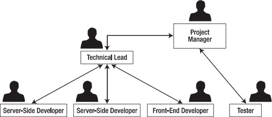

***图 1-1。**分层设计的一个例子*

### 变得越来越大

一旦你有了自己的流程，并且团队的所有成员都了如指掌，那么就不会有什么惊喜了。然而，在较小的公司或团队中，严格的流程被认为不太重要。假设每个人都是有用的、努力工作的贡献者(在小公司，如果不是这样，他们会很快被发现)，快速自发的会议和面对面的交谈可以促进沟通。因为员工之间的互动更加亲密，所以培训新员工是一项更加实际的任务。政策每天都在变化，尽管流程对于高效的绩效仍然是有用的，但事实上，一点混乱有助于创造力。

随着公司和团队变得越来越大，这不再是一种奢侈，而是一项繁琐的工作。试图在新员工入职时对他们进行培训是一项艰巨的任务，需要专门的空间和更多的员工。保持团队之间的沟通畅通变得更加困难和耗时。精心制作的 CSS 样式和口头约定的工作方法以及保持网站一致和整洁的方法开始在越来越多的团队之间迷失。如果你的团队越来越大，越来越多的时间被用于个人管理，甚至只是在会议上等待轮到你发言。如果你有场外资源，会议的效率会变得更低，因为它们从面对面的交谈变成了电话会议和电子邮件。

异地资源的优势显而易见，因为您只需使用(并付费！)当你需要它们的时候，它们通常非常便宜——但这是以个人交流的损失为代价的。

面对面交流的好处如下:

*   手势
*   面部表情
*   身体语言
*   白色书写板
*   直接
*   清楚

远程通信的缺点如下:

*   技术困难
*   失去意义和意图
*   失焦
*   优先权的丧失
*   理解力差
*   浪费时间和资源

注意:使用视频会议、屏幕共享和白板软件可以减轻一些担忧，但它们带来了新的技术困难，丧失了即时性和即时满足感。

如果您的团队成员在不同的国家，时区差异和潜在的语言障碍会进一步加剧这些问题。然而，在印度或爱沙尼亚这样的国家使用远程开发人员可以降低成本，这对企业来说太有吸引力了，不容忽视，这可能是有充分理由的。

很明显，在公司规模很小、日益壮大的时候，在大白板上贴上草草写好的便利贴，在房间里大声传达重要信息等以前可以接受的方法，不再是有效的管理手段。团队中的每个人(希望是公司)都接受并同意的可靠流程将有助于减轻这些担忧。如前所述，如果清楚每个人应该执行什么任务以及何时执行，误解就更难发生。

如果每个人的所作所为都以可追踪和一致的方式记录下来，任何遗留的误解都可以被发现和解决。更重要的是，在小公司中，团队中疏忽、无能或低效的成员很难不被注意到——编写与遗留代码不一致的 CSS，在没有尽职调查的情况下修改代码，或者在相关代码中造成 bug 和缺陷——而在大公司中，这些代价高昂的个人可以在雷达下潜伏数月。我们将在本章中介绍的流程可以更快地展现和暴露它们的活动(或缺少活动)。

在小公司里，每个人都有发言权。然而，在大公司里，这种声音可能会被人群淹没，或者根本无法传到需要听到它的人的耳朵里。伟大的想法和改进可能会被忽视，员工对一家他们无法留下任何印象或印记的公司投资较少。反馈会议、公司会议、直线经理和更少层级等简单流程有助于确保每位员工都有参与和贡献的机会。

如果这些流程能够从一开始就在公司的思维方式中根深蒂固，它们将更容易实现，并成为增长的良好基础。

### 员工流失率高

许多大公司的员工流动率都很高——人们来来去去更加频繁，带走了他们的知识和技能。前端开发者更是如此；他们在今天的市场上需求量很大，通常在短时间内作为承包商工作，因此可以在没有任何警告的情况下从一个角色跳到另一个角色。尽管公司创始人希望他们的员工会永远忠于他们，但事实是大多数人都会在某个时候离开并继续前进。对于小公司来说，在每个员工身上投入了大量的金钱，有时甚至是感情。每一名新员工(无论是替换已离职的员工还是填补因成长而变得必要的职位)都需要入职和培训。这些员工有助于塑造公司，选择合适的人是必须认真考虑的事情。在更大的公司里，这变得更加重要。大公司有自己的个性和特点，有更多的东西需要去适应。新员工几乎必须被公司的行为所同化。开始变得有效率需要相当长的时间，而要达到在你的环境中感到舒适的效率水平则需要更长的时间。更复杂的流程意味着需要设置更多的用户账户和密码、阅读更多的文档、学习更多的政策，以及寻找更大的空间。这意味着引导和培训你的员工对效率至关重要——毕竟，你仍然在员工非生产期支付他们工资。

 **提示:**尽你所能让新员工尽快开始工作是很重要的。

你应该探索的另一件事是如何更有效地留住这些员工。每个员工都会给企业带来成本，但随着时间的推移，他们获得的知识会成倍增长，优秀团队成员的价值也是如此。首先，考虑你提供的薪资和福利待遇是否比你的竞争对手好。在许多研究中发现的证据表明，增加金钱奖励以提高绩效的简单概念只有在考虑体力劳动时才成立。在追求更多脑力活动的情况下，更重要的是让员工感受到挑战和价值。为此，给他们足够的报酬是很重要的，钱不是问题，但你不必支付高于市场的价格来获得忠诚的员工。提高个人工作幸福感的非金钱奖励也很有价值。灵活的工作时间、培训、休假时间，甚至每天早上提供一碗水果都有助于提高员工在工作场所的满意度。一个好的食堂不仅能让你的员工开心、吃饱——还能让他们离办公桌更近，从而更快地回到工作岗位！

另一件有助于留住员工的事情是对他们的贡献表示赞赏。颁奖典礼或其他形式的表彰、聚会和外出晚会表明了对他们对公司的承诺的赞赏，并进一步加强了团队的整体实力。

虽然你希望你的员工能满足你的截止日期和要求，尽可能多产，但你也不希望他们精疲力竭。确保您的截止日期尽可能切合实际(让员工参与评估流程，并根据之前的评估来确定评估的准确性),并确保您的员工对工作场所感到满意，这将有助于保持良好的职业道德和工作效率。

最后，你要确保你的员工对他们的工作感到自豪，并感到投入其中。尽最大努力让每个人都有发言权会有所帮助。一些公司，比如谷歌，给他们的员工提供开发自己产品的机会，如果他们开发出对整个公司有价值的东西，他们会给予支持和认可。谷歌的每个星期五都是“谷歌星期五”，开发者被鼓励尝试新技术。这种玩法导致了 Gmail、Google News、Orkut、Google logo 成为功能齐全的 Pacman 游戏，以及其他内部创新。在 Atlassian，每三个月，他们的员工被允许做一天他们喜欢的任何发展，只要他们之后向公司提交他们的结果。开发人员对他们的工作感到自豪，这一点在开发人员自由支配时选择工作的项目中表现出来。在此期间，对开发人员(而不是业务)来说重要的 bug 被修复，拼写错误被纠正，重要的重构发生，流程中的问题被隔离，现有业务问题的解决方案出现。结果是你有更好的软件，但更重要的是，你有更快乐和更自豪的人。

所有这些建议都同样适用于 CSS 开发人员和其他员工。然而，web 开发世界发展和变化很快，可能很难跟上。如果员工对自己的工作充满热情，他们会希望保持自己的技能与时俱进，如果公司希望他们快乐，就会帮助他们实现这一点。尽管较新的 CSS 技术可能由于不完整的浏览器支持而尚未成熟，但应该给 CSS 开发人员留出时间来阅读和熟悉这些技术。允许你的 web 开发人员有机会参加会议(甚至可能代表你的公司在会上发言),表明了对员工和他们所关心的技术的承诺。保管好图书馆的参考书(比如这本！)考虑订阅杂志也有帮助，给开发者时间阅读杂志、博客和其他在线文章也有帮助。允许他们通过公司博客在线展示自己的发现通常是他们会喜欢的，但这可能取决于你公司的公开立场和政策。

让员工开心应该是首要考虑的问题，这将有助于留住他们更长时间，但员工辞职应该是有计划的，而不是恐慌的原因。

### 一致性比质量更重要

雇佣新员工时，你应该努力雇佣高素质的员工。你希望人们了解自己的东西，并有东西与团队的其他成员分享。然而，特别是在编程和编码领域，不同的人有不同的写作风格。

代码的不一致是有代价的，无论是时间还是资源。尽管以特定的方式编写 CSS 选择器可能更高效、更聪明，但是由于潜在的高人员流失率，如果代码不寻常或者更难理解，那么在团队成员之间共享就变得很困难。自己写 CSS 框架是好事，只要不是太复杂拿不起来。你也应该考虑一些我们在第四章中谈到的已经可用的 CSS 框架。如果实现你自己的 CSS 框架的流程需要复杂的构建脚本并使调试变得困难，也许这个解决方案被过度设计了。我们并不是建议因为性能和效率的原因不应该使用构建脚本(你可以在第九章中读到)，但是流程应该简单。CSS 开发人员通常工作速度很快，经常一分钟在他们的文本编辑器和浏览器之间切换很多次。运行代码所需的任何流程都应该以不引人注目的方式实现。一个阻碍开发的构建流程对开发人员效率的影响比许多人想象的要大得多。进入 CSS 调试模式应该很简单，所以如果 CSS 在进入生产时被缩小，CSS 开发人员可以看到他们编写的代码，而不是 CSS/DOM 检查器报告选择器在第 1 行，那里只有一行。

一个开发者囤积了你的代码的某些部分如何工作的所有知识，这应该是一个明显的危险信号。如果这个开发人员选择离开公司，或者由于某种原因不能再为他们工作了，就会有一个直接的知识赤字。新的开发人员可能在理解代码上有困难，一段停滞期开始了，同时这些开发人员努力掌握代码的复杂性。如果没有之前的 CSS 开发人员在那里指导他们，CSS 的大部分区域可能会被搁置多年，因为没有其他开发人员有足够的勇气删除它们，因为他们害怕在网站的其他地方引起问题。遗留代码的这种停滞是非常普遍的，并且很难解决，成本也很高。

为此，最好尽可能使用更简单、更清晰的代码，以便将知识囤积保持在最低水平。一些公司选择以特定的时间间隔频繁地轮换他们的开发人员到他们项目的不同部分来解决这个问题。事实上，尽管有明显的时间成本，这种方法有一些相当大的好处，因为每个团队成员对项目作为一个整体是如何工作的有一个很好的想法，并且可以考虑如果没有这种整体观点可能会被忽略的因素。在开发流程中发现的问题比在计划流程中发现的问题更难克服。这种方法的主要缺点是，开发人员不断地从一个难题转移到另一个难题，可能会发现很难“进入状态”，这可能会令人沮丧，并且会增加成本。

在这些场景中，一致性的价值不能被夸大。举一个非常基本的例子，一个人可以用这种方式编写他们的 CSS 代码:

`/* Main Heading */
#mainHeading {
   font-size: 2em;
   font-weight: bold;
   color: red;
}`

另一个人可能会这样写:

`/*========================================================================
   Main Heading
========================================================================*/
#main-heading {font-size:20px;font-weight:bold;color:#ff0000}`

这两种都是完全有效的，技术上正确的 CSS 编写方式。但是，如果这两个人在不同的时间处理同一个 CSS 文件，那么您可能会在同一个文档中混合使用这两种截然不同的编码风格。这导致文档难以扫描和阅读。许多开发人员在发现不同于他们自己的代码风格时，可能会以他们认为更好的方式重新格式化代码。最初的开发人员可能会以同样的方式将其格式化。这既没有效率，也没有必要。

CSS 比大多数编码语言更容易受到这个问题的困扰。将代码行放入一个文件中很容易，直到某个部分正确呈现，但是很难隔离出可以安全删除或不再使用的部分。为此，严格格式化您的 CSS 文档，并将选择器和规则保持在正确的位置，这对于避免代码中遗留下来的难以定位的部分非常重要。糟糕或仓促编写的代码被称为“技术债务”，这个术语是沃德·坎宁安在 1992 年创造的。只要你还钱(重构和修复代码)，一点债务是没问题的，但是你等待的时间越长，利息就越多(构建在初始代码之上并依赖于初始代码的代码)，直到你破产(不得不从头开始)。

为了解决这个问题，在指南中预定义标准是很重要的，这样每个人都知道 CSS 在你的组织中是以一种特殊的方式编写的。任何规模的大多数公司都有某种 wiki(见下文)或公司手册，这是存储此类指南的合适位置。尽管已经过时，BBC 还是在网上发布了 CSS 指南。

我们不建议制定严格执行的硬性指导方针(例如，您不应该使用`!important`、、 1 、，但在某些情况下，这可能是最合适的做法)。然而，我们建议存在某种形式的指导方针。以下是 CSS 格式指南的一部分示例:

*   CSS 的所有相关块都应该以这种格式的注释作为前缀，以帮助 CSS 文档的视觉扫描和可搜索性:`/*========================================================================
       Main Heading
    ========================================================================*/`
*   所有颜色都应该是十六进制格式(`#123456`)。
*   所有的 CSS 选择器和规则应该在一行上，以节省空间，并在一个屏幕上同时显示更多的选择器。

这些要点作为一个例子，不一定是我们建议您采取的步骤。在这本书的最后，我们会给你一个 CSS 格式指南的例子。对于本指南，使用*莫斯科*(确定优先级的常用方法)很有用。莫斯科(在这种情况下)指的是:

*   我必须这样做
    *   这条规则必须一直遵守，没有例外。
*   S 应该这样做
    *   除非有合理的理由，否则任何时候都应该遵守这条规则。
*   C 可以这样做
    *   这与其说是一条规则，不如说是一条技巧，可以在适当的时候使用。
*   现在我不会这么做，但将来我会这么做(??)
    *   这是你现在不能做的事情(可能是因为缺乏浏览器支持)，但将来可能会考虑。

使用这种方法很有用，因为这意味着所有 CSS 主题都被捕获，以证明它们已经被考虑过了，并且先前的结论可以保留下来供将来讨论。

同样重要的是，在可能的情况下，以及在不清楚的情况下，在我们的指南中解释这些规则的原因。

从商业的角度来看，创建干净的、写得好的 CSS 是很难证明的。这并不是说企业希望编写糟糕或混乱的代码，而是我们的工作通常基于业务需求。企业希望交付这些需求，并让团队准备好尽快转移到其他工作上。为此，你需要一个很好的妥协。你想要好的干净的代码——你知道它使未来的生活更容易，并且允许你为你的工作感到自豪。但是也许复杂而简洁的代码(并不总是好代码)弊大于利。如果你有一个坚实和严格的结构和方法，你坚持，我们的新员工可以适应我们的内部编码风格，最大限度地减少大惊小怪，直接进入生产。如果您知道哪些样式在哪些文件中，以及如何定位这些文件中的 CSS 块，您就可以立即找到需要修改的部分，而不需要无休止地争论(几乎没有商业价值)使用哪个位置。

____________

1 ！重要的在第三章中有更详细的描述。

当然，极端来说，过于冗长和注释过多的代码同样难以处理。选择器可能会变得过于具体，注释可能会占据我们所有的屏幕空间，使浏览文档变得困难。我们将在第二章中看到注释的用法。

这并不意味着使用新技术是一件坏事，或者你不应该争论技术。然而，这确实意味着，作为我们进程的一部分，这些辩论应该定期有一个适当的论坛。您可以在需要的时候修改文档，只要您将这些更改传达给所有需要知道的人。如果你把你的 CSS 指南放在一个 wiki 中(参见下面工具标题下的 wiki 部分)，它们通常会通过“被关注的页面”或类似的方式支持某种通知机制。这意味着，任何未明确标记为“次要”的修订，都会向订阅者列表发出变更警报。组织内从事 CSS 工作的任何人都应该是这个列表的成员。他们还应该能够自己修改指南(并依次通知其他人)。但是，一定要有人拥有这份文件，也就是说，一定要有人对文件中发生的变更负责，并确保其他人知道对文件所做的任何变更。

比方说， *RGBA(红绿蓝阿尔法)*的颜色声明方法最近在我们的 CSS 开发人员中很受欢迎。在我们想象的组织中， *Igloo 冰箱部件公司*，我们所有的前端开发人员每月召开一次会议。在本月的会议上提出并同意这种方法有价值，我们想开始使用它。使用 *RGB(红绿蓝)*作为十六进制代码的直接替换被发现在我们希望保持足够功能的浏览器中有很好的支持(参见第六章中的“分级浏览器支持”)，并且`RGBA`给了我们以前没有的能力(特别是 alpha 透明)，所以我们想把它添加到我们的 CSS 格式指南中，并修改我们以前的建议。同样，这是一个例子，不是我们的建议。

以前，我们有这样一句话:

*   所有颜色都应该是十六进制格式:`#123456`。

我们现在可以这样修改它:

*   所有颜色都应该是 RGB 格式:`rgb(100,100,100)`。
*   在颜色需要支持 alpha 透明的地方，我们应该使用 RGBA 格式:`rgba(100,100,100,0.5)`。

 **提示:**总是先声明一个非 alpha 的 RGB 颜色，不要依赖于旧版浏览器的 alpha 透明度。

在会议上，有人被赋予了做出这些修改的责任，并确保每个人都被告知这些修改。请注意，这并不意味着我们应该立即重新访问我们所有的 CSS 代码，并将所有的十六进制颜色转换为 RGB，但这确实意味着任何未来的颜色都应该是 RGB 格式的。下一次我们有机会重构的时候，就是转换遗留代码的时候了，以满足新的指导方针。

通常，在较大的组织中，不同的部门之间不会相互交流，而且业务可能如此之大，以至于他们甚至从来不知道其他部门的存在。我们鼓励你去接触你的企业中写 CSS 的每一个人，试着让每个人都说同一种语言并一起工作。

### 工具

有许多工具可以帮助我们开发网站和管理流程。有无数的软件来管理我们的任务，存储我们的文件，存储文档，创建模型，共享文件，开发我们的代码，相互通信，等等。本节讨论了一些可能对您的流程有用的软件类型，并提到了每种类型的一些例子。不可能提及(并使用过)所有的东西，所以请将这些工具视为一个潜在的候选列表，并注明重要的功能，而不是一个完整的概述。在决定特定的选择之前，先回顾一下可用的选项。

#### 维基百科

一个*维基*是一个软件(几乎总是基于一个网络浏览器),作为一个文档库，并允许特定人群编辑它们。它们通常包括一些功能，如“被关注”的页面，允许用户在更改时收到通知，以及存储文档以前修订的版本信息。维基最著名的例子当然是著名的`[www.wikipedia.org](http://www.wikipedia.org)`。将所有文档以组织有序的方式集中存储有很多好处:

*   易于备份
*   在哪里定位特定类型的数据显而易见
*   数据不会过时或发生冲突(每个人都处理同一条信息，而不是在多个地方有多个版本)
*   潜在远程可用
*   独立于平台
*   文档以前的修订不会丢失

维基很容易失去控制。确保有人负责拥有 wiki，执行合理的结构化分类，并执行内务管理。存在许多 wiki 软件的例子。有些是托管的，有些你可以自己托管，许多是免费的，许多是付费的…他们使用许多不同的语言来格式化。 2

这里有一些最丰富和众所周知的。

____________

一种被称为克里奥尔语的标记语言旨在标准化维基中使用的语言，并已被许多不太知名的维基所采用(尽管不一定是默认语言)。你可以在 www.wikicreole.org/的 ?? 读到克里奥尔语。

##### 媒体维基

可以说是最著名的维基软件——这是维基百科背后的维基。MediaWiki ( `[www.mediawiki.org](http://www.mediawiki.org)`)是开源的，高度可配置的，并且设置简单。它支持大多数数据库，并且是用 PHP 编写的。插件可用。有些身份验证功能是内置的，但感觉还没有完成，没有经过测试。MediaWiki 还有一个非常慢的名声。通常情况下，使用开源软件的好处(它是免费的！)的不足之处在于，它给人的感觉*像是*开源软件。

##### 亚特兰提斯的汇合

Confluence ( `[www.atlassian.com/software/confluence](http://www.atlassian.com/software/confluence)`)不是免费的，但它是一个更加完善、功能更加全面的维基百科，拥有一个非常棒的所见即所得(WYSIWYG)界面。有一个托管解决方案，也有一个您可以在内部运行的解决方案。Confluence 是用 Java 编写的，支持大多数常见的数据库。Confluence 可以与 Atlassian 的其他产品巧妙地集成，并具有一些基本的社交网络功能。有一个很大的插件库。您可以(在撰写本文时)以 10 美元的价格为最多 10 个用户购买一个许可证，但是当您的需求超过这个数目时(在大型环境中很可能是这样)，它很快就会变得更加昂贵。

##### Mac OS X 服务器 Wiki

如果您正在运行 OS X Server(从版本 10.5 以上)，您已经安装了此 wiki(`[www.apple.com/server/macosx/](http://www.apple.com/server/macosx/)`)。默认情况下，每个用户组都有自己的维基，但是你可以创建更多。身份验证功能运行良好。Mac OS X Server Wiki 在用户界面后面使用 HTML 来格式化数据，但有一个非常严格的白名单来控制哪些标签和属性可用，这很快就会成为一个障碍。你可以修改这个列表，但是这样做没什么意思。它非常吸引人，非常精致，设置和使用都很简单，但是在功能上有点局限。

##### 轨道

Trac ( `[`trac.edgewall.org/`](http://trac.edgewall.org/)`)包括一个 bug/问题跟踪器，是一个专门针对软件开发项目的专用 wiki。Trac 将 bug 追踪器和 wiki 合二为一，这可能会简化您工作流程。它是开源和免费的，但是感觉不像这个列表中的其他人那么完美。

 **提示:**比较不同维基的一个很好的资源在`[www.wikimatrix.org](http://www.wikimatrix.org)`。

#### 漏洞报告

错误报告软件的目的是给我们一个集中的地方来记录你的软件中发现的任何错误或缺陷。就像维基的情况一样，有些是托管的，有些可以自己托管，有些很贵，有些是免费的。Bug 追踪器用于测试人员提出不同优先级的 bug。 3

下面几节将讨论一些专门的错误报告软件的例子。

##### 灯塔

Lighthouse ( `[`lighthouseapp.com/`](http://lighthouseapp.com/)`)是*软件即服务(SaaS)* ，它提供了一个干净简单的界面，可以在你的浏览器上运行。它不是免费的，但价格合理。

##### 布吉拉

Bugzilla ( `[www.bugzilla.org/](http://www.bugzilla.org/)`)是 Mozilla 的一款免费开源 bug 追踪器。它功能齐全，成熟，对版本控制系统有很大的支持。它是用 Perl 编写的，支持使用 web、电子邮件、RSS、Web 服务和命令行的用户界面。MySQL 和 PostgreSQL 都支持作为数据库。

##### 阿斯塔纳·希拉

JIRA ( `[`www.atlassian.com/software/jira/`](http://www.atlassian.com/software/jira/)`)不是免费的，但是有一个庞大的功能集。它的管理可能有点令人生畏，但它足够灵活，可以处理几乎任何流程或工作流。安装和维护(尤其是升级)并没有想象中的那么简单，但是可用插件的质量大大弥补了这一点。

##### 轨道

Trac ( `[`trac.edgewall.org/`](http://trac.edgewall.org/)`)第二次被提及是因为它的缺陷跟踪能力。您可能会发现，将 wiki 和 bug tracker 结合起来对您的公司非常有用，Trac 在这两方面都非常出色。先前的批评仍然适用。

#### 任务管理

任务管理软件让我们记录我们期望团队承担的任务。它可能包括资源/时间管理和综合报告功能等功能。这种软件的作用是为输入和检查任务提供一个简单的界面。企业任务管理软件(也可以称为项目管理软件)通常是围绕敏捷流程构建的。

下面几节给出了一些例子。

____________

你可以在他的博客[`zeroedandnoughted . com/standardized-bug-reporting-with-SEERS/`](http://zeroedandnoughted.com/standardised-bug-reporting-with-seers/)上了解 Antony 记录和优先处理 bug 的标准化方法，称为 SEERS(截图、环境、预期/实际行为、再现、严重性)。

##### 事物

OS X 的桌面应用程序，Things ( `[`culturedcode.com/things/`](http://culturedcode.com/things/)`)实际上是在个人层面上管理任务，而不是在团队之间共享。许多人发现这种额外的自我管理很有用。也有一个 iPhone 应用程序可以通过 wifi 与桌面版本同步(遗憾的是，不是通过云)。

##### 集会

Rally ( `[www.rallydev.com/](http://www.rallydev.com/)`)是一个托管和付费的解决方案。虽然不直观，缺乏一些功能，但当您的员工可能同时处理几个项目时，它可以很好地处理资源和时间管理。

##### 打成一片

Mingle ( `[www.thoughtworks-studios.com/mingle-agile-project-management](http://www.thoughtworks-studios.com/mingle-agile-project-management)`)是由 ThoughtWorks 开发的，ThoughtWorks 因其对 IT 行业敏捷运动的贡献而闻名。Mingle 包括一个精致的基于网络的界面，带有内置的 wiki。用户界面只在白板上的卡片上工作，并且流程是非常可定制的。定价是基于每个用户的，不太可能便宜，尽管最多五个用户可以免费试用一年。

#### 错误跟踪和任务管理

有些解决方案可以同时满足这两个需求，而不是让这两个系统保持完全不同。这很有道理——我们的 bug 需要修复，修复它们当然是一项任务。在一个好的流程中，这些东西可以一起管理。需要维护的软件越少越好，如果开发人员只需要学习一个应用程序，那么培训成本就会降低。

下面是一些将任务管理和错误跟踪结合起来的软件的例子:

##### 亚特兰蒂斯 JIRA(带绿色漏斗插件)

绿色漏斗(`[www.atlassian.com/software/greenhopper](http://www.atlassian.com/software/greenhopper)`)把 JIRA 变成了一个全功能的敏捷任务跟踪器。这是非常可配置的，很容易使 JIRA 类似于我们许多人习惯的白板和卡片。看板(一种不太常见的敏捷开发方法)也得到很好的支持。很难找到比这更好的设置，但是(对于较大的团队)它不便宜，也不容易管理、安装和维护。4

##### 敏捷

Agilo ( `[www.agile42.com/cms/pages/agilo/](http://www.agile42.com/cms/pages/agilo/)`)基于并支持与 Trac 的集成，为 SCRUM(一种敏捷开发方法)提供了一个全功能的解决方案。除了付费版本，还有免费版本可供选择。提供了安装程序，如果您熟悉 Python 的话，还提供了一个 Python 彩蛋，它是用。

____________

我们不为亚特兰蒂斯人工作。我们真的很喜欢他们的作品。

##### 牙床

Fogbugz ( `[www.fogcreek.com/fogbugz/](http://www.fogcreek.com/fogbugz/)`)最初是 Fog Creek 软件的内部错误跟踪工具，于 2000 年首次发布。它已经扩展到包括维基、论坛和任务管理。它支持基于证据的调度(EBS) 5 ，并且有一个内置的 API 用于连接到你自己的软件。它可以作为托管解决方案(有 45 天的免费试用期)使用，也可以安装在您自己的服务器上，而且价格合理。

很容易达到软件过载。许多公司有三个或四个同时运行的 wikis，以及不同版本的任务或错误跟踪软件。这种情况非常低效，对流程有害，必须不惜一切代价避免。决定在你的业务中使用哪种软件，然后应用它。尝试使用严格的和可执行的规则来组织你的信息，而不使它变得太复杂。

 **提示:**你的工具发送电子邮件的地方，如果你能这样配置的话，保持这封邮件最少、相关、切题是很重要的。如果你的开发人员不知所措，邮件就不会被阅读。

#### 源代码控制

源代码管理有许多风格，但是每一种风格的核心都是维护项目中每个文件的历史(存储在一个*存储库*中)的概念，并且能够回滚到任何文件的先前版本。还有一个(典型的)概念，一个文件可能被许多人处理，因此需要被“合并”以包含每个人的更改。

我们项目中文件的主要副本被称为*主干*。当一个版本的软件被发布时(被认为可以安全地放入生产环境中)，很常见的是*标记*存储库的当前状态，或者*分支*存储库(这意味着创建存储库当前状态的复制版本)。我们这样做的目的是，如果在生产中发现版本有问题，我们可以对代码进行修改，而不必担心可能会冲突或无法发布的最新更改。通常我们应该尽可能在主干中工作，因为合并分支之间的变更可能会有问题。

下面几节给出了一些源代码控制系统的例子。

##### Visual SourceSafe (VSS)

VSS ( `[www.microsoft.com/visualstudio](http://www.microsoft.com/visualstudio)`)现在被广泛认为是一种遗留的和过时的源代码控制方法。当一个用户选择处理一个文件(通过签出)时，该文件被锁定，任何其他用户都不能处理，直到它被提交回存储库(签入)。

这种方法有一个好处:文件几乎不需要合并，因为它们总是处于开发人员满意的状态。然而，这意味着开发人员永远不能同时处理同一个文件，并且经常忘记提交他们的文件，从而对其他用户锁定文件。

____________

乔尔·斯波尔斯基发明的一种更精确地评估任务的方法。点击`[www.joelonsoftware.com/items/2007/10/26.html](http://www.joelonsoftware.com/items/2007/10/26.html)`阅读更多信息

##### 并行版本系统(CVS)

CVS ( `[www.nongnu.org/cvs/](http://www.nongnu.org/cvs/)`)是 Dick Grune 在 1986 年 7 月开发的。尽管以前也存在其他类似于 CVS 的版本控制系统(这是第一个允许多人同时修改文件的系统)获得了广泛的接受。CVS 模型将所有文件保存在服务器上的集中存储库中，客户端从该存储库中取出文件并提交到该存储库中。

##### 颠覆(SVN)

CVS 有许多缺点，尽管它今天仍被普遍使用，Subversion ( `[`subversion.apache.org/`](http://subversion.apache.org/)`)是由 CollabNet 在 2000 年创建的，试图修复 CVS 中的许多错误，并添加许多非常需要的“缺失功能”。因此，它的运行方式与 CVS 非常相似。由于其相对的稳定性和成熟度，它是当今公司中最常见的版本控制系统之一。

##### 走吧

Git 6 ( `[`git-scm.com/`](http://git-scm.com/)`)是*分布式版本控制*的一种形式。这意味着开发人员在自己的机器上有一个存储库，以及一个(或多个)集中存储的存储库。用户不会因为害怕提交错误的代码而“囤积更改”(因此增加了由于崩溃或硬件故障而丢失数据的可能性)，而是将他们的代码提交到他们的本地存储库，并可以从那里管理修订。Git 不是一个单独的库，它实际上是由一系列独立的工具组成的，利用这些工具，你可以实现你喜欢的任何版本控制流程。尽管 Git 中使用的合并算法很受推崇，并且已经通过同时合并 12 个 Linux 内核补丁得到了验证，但是 Git 是一个复杂的系统，很难理解，而且对于您的项目来说可能有些矫枉过正。 7

##### 水银

另一个分布式版本控制系统 Mercurial ( `[`mercurial.selenic.com/`](http://mercurial.selenic.com/)`)有时以其命令行名称而闻名:hg。它由 Matt Mackall 开发，于 2005 年发布。Git 和 Mercurial 是同时开发的，因为免费版的 BitKeeper——Linux 内核项目当时使用的源代码控制软件——被它的开发者 BitMover 撤回了。尽管 Git 最终被 Linux 内核项目所使用，Mercurial 仍然受到业内许多人的拥护。与 Git 相比，Mercurial 功能不全，但仍然非常实用、快速且易于使用——特别是对于那些从 Subversion 迁移过来的人。

 **注:** BitBucket ( `[`bitbucket.org/`](http://bitbucket.org/)`)是一个类似于 GitHub 的服务，用于 Mercurial 项目。

____________

在英国英语俚语中，Git 是一个不愉快的词，用来称呼同样不愉快的人。Git 的创造者 Linus Torvalds 说，“我是一个自私的混蛋，我以自己的名字命名所有的项目。先是 Linux，现在是 git。”

____________

7 GitHub ( `[`github.com/`](http://github.com/)`)提供可能适合你的项目的免费公共库。

##### 图形用户界面

几乎所有的版本控制系统都带有命令行界面，但是存在许多图形用户界面(GUI)以及插件，以使集成开发环境(ide)和其他软件能够与它们通信。提及所有这些超出了本书的范围，但是值得一提的是用于 Windows 平台的龟壳扩展家族(TortoiseCVS、TortoiseSVN、TortoiseHG 等等)。它们与 Windows 紧密集成，在文件系统资源管理器中的右键菜单中添加了功能，以及表示状态的图标，这是它们最直观的位置。OS X 和 Linux 的模仿版本已经尝试过了，但是没有一个(在撰写本文时)像乌龟一样紧密和直观地集成在一起。

##### 使用版本控制系统

当使用源代码控制时，当你对你所做的感到满意时，你*提交*文件到存储库。这将使用您正在处理的版本更新中央代码。如果您正在使用分布式版本控制，您应该经常提交到本地存储库，并且只有在您确信您的代码工作正常时才提交到中央存储库。在图 1-2 和图 1-3 中可以看到版本控制和分布式版本控制的直观对比。

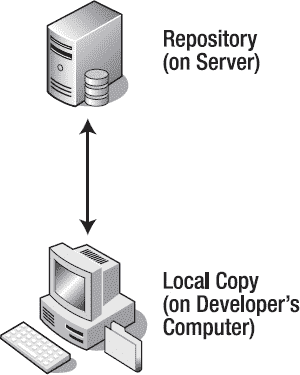

***图 1-2。**普通版本控制图*

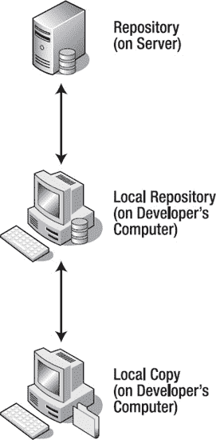

***图 1-3。**分布式版本控制图*

当你在团队中处理 CSS 时，使用版本控制系统是至关重要的。它给了你更多的信心去处理其他开发人员可能正在处理的文件，以及我们提交的每个变更的可恢复历史的保证。当我们使用 CSS 的时候，我们经常分成小块工作。我们做一些小的改变，切换到我们的浏览器，刷新页面，改变，切换，F5，等等。我们应该记得经常提交我们的变更，这样我们就可以对我们所做的一切有一个好的历史记录。

当提交您的更改时，大多数版本控制系统会要求您提供一个描述您所做更改的注释。当您的版本控制系统进一步嵌入到您的流程中时，这些注释变得非常有价值。因此，最重要的是你的评论是相关的，描述性的和有帮助的。

像这样的评论没有什么价值:

`Changed some bits and pieces.`

但是像这样的注释准确地描述了文件中发生的事情:

`Changed hex colors to RGB colors.`

当事情出错时(它们会出错)，您会发现自己在查看有问题的文件的提交历史，有用的注释将非常有助于澄清每个修订中的更改。

通常，鼓励您在开始工作之前手动更新文件。这意味着从存储库中获取最新版本。如果您未能更新文件的过期版本并开始工作，或者如果另一个开发人员在您开始工作后提交了更改，则您需要合并这些文件。因为两个开发人员同时工作，所以您的本地副本和存储库中的版本之间的变化是非线性的。不可能以自动的方式确定保留哪些部分和替换哪些部分；这导致文件发生冲突*。为了解决冲突，有必要定位差异，适当地编辑文件，然后将冲突标记为*已解决*，以便您可以提交文件的修改版本。*

#### 差异工具

为了处理这些冲突，您将希望确切地看到这两个文件之间的差异。有一种特殊类型的应用程序可以做到这一点:一个 *Diff* 程序。再说一次，它们中有很多是存在的，我们不打算提升其中一个。这些程序的目的是比较两个相似的文件，并显示它们之间的差异。

目的是使识别和解决同一文件的两个版本之间的冲突变得容易。因为 CSS 通常不像我们希望的那样模块化(或者可能在意想不到的地方产生影响)，尽管冲突可以解决，但我们仍然应该尽可能避免它们。最好的方法是与你的团队进行有效的沟通，让每个人都确切地知道你在任何时候都在处理哪些文件。

在这些冲突存在的地方，我们必须合并并解决它们。解决冲突和合并变更是让多个个体处理同一个文件的一些最头痛的事情。老式的命令行比较程序只显示文件之间的差异，类似于图 1-4 中显示的输出。

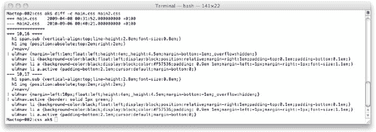

***图 1-4。**命令行比较工具的输出示例*

更现代的 Diff 程序通过让你并排查看两个文档来减轻这种痛苦。两个文档之间的差异被突出显示，任何不同的部分都可以从一个文档复制到另一个文档(参见图 1-5 )。

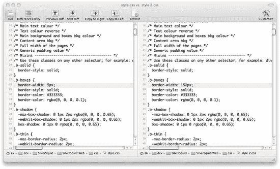

***图 1-5。**一个基于 GUI 的比较工具的输出示例*

通常，在您的 IDE 或版本控制系统中会提供简单版本的 Diff 工具，但是下面的部分描述了其他专用 Diff 程序的示例。

##### 习语合并

Araxis Merge ( `[www.araxis.com](http://www.araxis.com)`)标准版可以比较两个文档，专业版可以同时比较合并三个独立的文档。它价格合理，可用于 Windows 和 Mac 平台，在这两个平台上都有很好的性能。

##### WinDiff

WinDiff ( `[`support.microsoft.com/kb/159214`](http://support.microsoft.com/kb/159214)`)包含在 Microsoft Visual Studio 中，因此如果您已经使用该平台进行开发，它是免费的。如果您运行的是 Windows XP，您也可以从`[www.microsoft.com/downloads/details.aspx?familyid=49ae8576-9bb9-4126-9761-ba8011fabf38&displaylang=en](http://www.microsoft.com/downloads/details.aspx?familyid=49ae8576-9bb9-4126-9761-ba8011fabf38&displaylang=en)`下载它，但它包含在 Windows 版本(包括 Windows 2000 和更高版本)的光盘中。

##### WinMerge

WinMerge ( `[`winmerge.org/`](http://winmerge.org/)`)顾名思义就是 Windows 应用。它是开源的，可以免费获得，并且性能良好。

##### 无与伦比

Beyond Compare ( `[www.scootersoftware.com/](http://www.scootersoftware.com/)`)是由 Scooter Software 开发的，已经是第三版了。它适用于 Windows 和 Linux。它价格合理，有很好的声誉和特性集。

##### 变化

Changes ( `[`connectedflow.com/changes/`](http://connectedflow.com/changes/)`)是一个基于 Mac 的应用程序，可以很好地与 OS X 上的其他应用程序集成在一起。图 1-5 显示了实际操作中的变化。它价格低廉，可以比较文件夹以及文件。

##### 万花筒

万花筒(`[`kaleidoscopeapp.com/`](http://kaleidoscopeapp.com/)`)值得一提，是一个非常有吸引力和直观的差异工具。它是由 Sofa 公司开发的(该公司也使版本 SVN 成为 OS X 的客户端软件)，是一个漂亮而直观的低价软件的典范。不幸的是，从版本 1(撰写本文时的当前版本)开始，它不包含合并功能，这可能会限制它对您的用处。

更完整的比较工具列表可在`[`en.wikipedia.org/wiki/Comparison_of_file_comparison_tools`](http://en.wikipedia.org/wiki/Comparison_of_file_comparison_tools)`获得。

#### 解决冲突

让我们演示一下如何解决 SVN 冲突。我们将在 OS X 上使用版本 SVN 客户端和更改比较工具。为了举例，我们正在处理一个专门用于 Internet Explorer 8 的文件，名为 ie8.css。我们已经更新了本地存储库，然后在本地处理该文件。该文件的内容最初如下:

`#imagePath {
   filter: alpha(opacity=0);
}
#tryit-form .input-file {
   height:18px;
   width:217px;
}`

我们添加了一个额外的选择器，并改变了`#triyit-form .input-file`的高度和宽度，所以文件现在看起来像这样:

`#imagePath {
   filter: alpha(opacity=0);
}
**img.example {**`
`**   float:left;**
**}**
#tryit-form .input-file {
   height:**22**px;
   width:**220**px;
}`

我们测试了这些更改，它们工作正常，所以我们用适当的注释提交文件(见图 1-6 )。

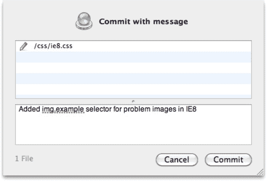

***图 1-6。**一个 SVN 提交对话框的例子*

结果如图 1-7 所示。

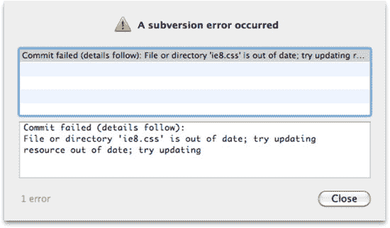

***图 1-7。**一个 SVN 冲突对话的例子*

这个图告诉我们，自从我们上次更新它以来，这个文件已经被修改和提交了。正如所建议的，我们现在将对我们的本地副本进行另一次更新，以拉下最新的更改(见图 1-8 )。

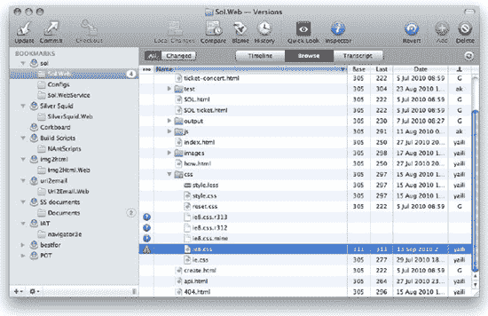

***图 1-8。**文件浏览器窗口中的 SVN 冲突*

版本现在显示几个新的文件和图标。`ie8.css`旁边有一个感叹号，表示目前处于冲突中。但是三个全新的文件也出现了:

*   `ie8.css.r313`
*   ie8.css.r312
*   ie 8 CSS 地雷

这些文件中的每一个都有其用途:

*   `ie8.css.r313`是存储库中此文件的最新版本。
*   `ie8.css.r312`是我们上次更新时从存储库中下载的文件版本。
*   `ie8.css.mine`是我们刚刚尝试提交的文件的版本。
*   `ie8.css`现在包含了标记，我们创建的版本，以及存储库中的变更。

内容看起来像这样:

`#imagePath {
   filter: alpha(opacity=0);
}
img.example {
   float:left;
}
#tryit-form .input-file {
<<<<<<< .mine
   height: 22px;
   width: 220px;
=======
   height: 24px;
   width: 320px;
   float: left;
}
.clearfix {
   zoom: 1;
>>>>>>> .r313
}`

标记显示发生了什么变化。更新后`<<<<<<< .mine`和`=======`之间的所有内容都被更改过，`=======`和`>>>>>>> .r313`之间的所有内容都被别人更改过。请注意，SVN 并没有暗示我们的`img.example`选择器和规则有冲突，因为它足够聪明，可以自己解决和合并这些更改。

为了解决这个问题，让我们比较一下我们的版本和存储库中的最新版本。首先，我们在变更中打开这两个文件(见图 1-9 )。我们需要考虑将这些文件中的一个作为主文件，所以我们将使用`.mine`文件，并确保首先选择该文件，使其出现在左侧。

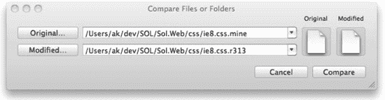

***图 1-9。**更改 app 文件选择对话框*

结果如图 1-10 所示。

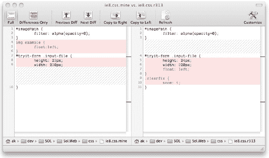

***图 1-10。**变更应用中的文件比较*

文件中的差异现在非常明显。我们为选择器`img.example`添加了一个部分，别人添加了`.clearfix`，另一个选择器的内容被修改了。我们快速检查日志，找出谁修改了这个文件，并阅读他们的提交注释。如果有必要，我们可以联系他们，询问他们的变化。原来，设计的改变需要改变特定元素的高度和宽度，而我们对它们的改变不再是必要的。使用变更中左边的文件作为我们的主文件，我们现在合并我们的变更。我们只想要文件的底部，所以我们点击右边文档中该部分的任何地方，然后点击复制到左边(见图 1-11 )。

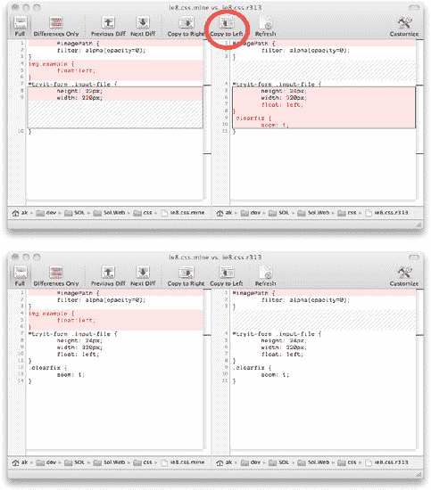

***图 1-11。**在变更应用中合并文件*

左边的文件现在是我们想要的样子。我们将内容复制粘贴到`ie8.css file`中，在版本中标记为“已解决”(见图 1-12 )。

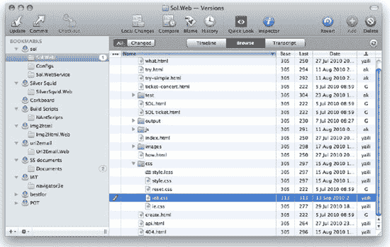

***图 1-12。**解决变更 app 中的冲突*

最后，我们从存储库中进行另一次更新，并测试该文件以确保它能够正常工作。确实如此(希望如此！)，所以我们把它交给 SVN。 8

### 备份

不言而喻，备份是任何开发流程的重要元素。备份存储库和其他重要数据非常重要。如果可能，这些备份的版本应该存储在几个不同的位置。硬件故障、数据损坏以及火灾或洪水损坏可能会在瞬间毁掉数月甚至数年的工作。

备份应该像保险一样对待。你几乎从来不需要它，但是如果你需要，它可能比实现它的成本更有价值。您还应该有不同日期的备份，比如在过去七天的任何时间点每天备份一次，甚至可能是更早的每月备份。有时我们发现我们想要恢复到几天前丢失的版本或者查看产品的遗留版本，并且不是所有的东西都将被存储在源代码控制中。

____________

对于这个例子来说，创建一个冲突实际上是相当困难的，这表明 SVN 在合并文件方面做得很好，除非你想让它这么做。

确保您的备份切实有效非常重要。虔诚地记住将不同的备份磁带带回家固然很好，但如果您不运行测试恢复，您可能会在最糟糕的时候发现所有的努力都白费了。

开发人员的机器没有您的存储库和服务器重要。简单的硬盘备份就足够了；目标是当硬盘出现故障(这是不可避免的)时，能够让开发人员尽快恢复运行。

 **注意:**硬盘*做*失败。不是的话*的问题，而是*的时候*的问题。做好准备。*

#### 在线备份

有几个在线备份示例，通常提供免费和付费服务。一些例子包括如下:

*   Dropbox(“??”)
*   活网(`[www.mesh.com](http://www.mesh.com)`)
*   白痴(1230)
*   spiderak(`[`spideroak.com/`](https://spideroak.com/)`

它们都支持 Windows 和 OS X(在许多情况下还支持 Linux)，并允许你与其他用户分享你的内容。某种脚本操作可以从您的本地机器复制到它们中的每一个，如果您没有太多数据(开发人员通常只需要备份他们机器上的一个或两个文件夹)，它们通常是免费的。如果你的员工在家或远程工作，能够共享大文件通常是非常有用的，尽管许多大公司不喜欢他们的任何文件在其他公司的服务器上。

#### 桌面备份

如果您想要一个自动化程度更高的现成解决方案，这里也有很多:

*   Microsoft NTBackup/Windows 备份和恢复中心/Windows 服务器备份(某些 Windows 版本免费)
    *   *??`[www.microsoft.com/athome/setup/backupdata.aspx](http://www.microsoft.com/athome/setup/backupdata.aspx)`*
*   时间机器(免费提供 OS X 的最新版本)
    *   *??`[www.apple.com/support/leopard/timemachine/](http://www.apple.com/support/leopard/timemachine/)`*
*   赛门铁克备份执行
    *   *??`[www.symantec.com/business/products/family.jsp?familyid=backupexec](http://www.symantec.com/business/products/family.jsp?familyid=backupexec)`*
*   Roxio Retrospect
    *   *??`[www.retrospect.com/](http://www.retrospect.com/)`*

事实上，备份选项比我们在此列出的要多得多。更完整的备份软件列表和比较可以在`[`en.wikipedia.org/wiki/List_of_backup_software`](http://en.wikipedia.org/wiki/List_of_backup_software)`找到。

### 原型制作

作为范围界定流程的一部分，通常有必要为我们将要构建的内容创建一个基本版本，以提供一个实际操作的示例，否则这可能是一个需要解释的复杂概念。我们对产品质量代码的考虑——如可访问性、文件大小、浏览器支持等——在这里并不重要。我们正在开发的代码只能在内部看到，我们可以指定浏览器的要求。任何框架(在第四章阅读更多关于框架的内容)和加速开发的捷径在创建原型时都是完全可以接受的。

通常完整的原型被认为足够好，成为产品代码，尽管没有其他代码写得好。这应该避免，因为它鼓励代码膨胀和技术债务，以及其他 CSS 罪恶。为此，以某种方式削弱原型通常是一个好主意，这样我们肯定会有机会在以后重构和重写它。

如果我们想要原型化纯视觉的东西，比如一个站点的布局或用户旅程，有很多工具可以帮助我们。一个很好的例子是 Balsamiq Mockups ( `[www.balsamiq.com/products/mockups](http://www.balsamiq.com/products/mockups)`)，它的好处是创建的图可以是功能性的，但看起来仍然像草图(这是 Comic Sans 唯一有效的用途之一！).它们不能被误认为是生产图像，讨论的重点是内容和布局，而不是像字体和颜色这样的东西。

尖峰类似于原型。一个*尖峰*如此命名是因为它是我们当前路径的切线的可视化描述。如果在开发流程中，我们发现一些我们需要开发的东西，并且我们不确定要遵循的最佳路径，我们可以在那一点上“加速”开发。我们将创建一个非常粗略的例子来演示我们想要的路径，并证明它是可行的。这个例子除了展示我们的方法将达到我们想要的效果所必需的部分之外，不会包括任何东西，并且从定义上来说(除非它是非常直观的东西，否则我们会被扣球)是没有吸引力的和有限的。虽然原型是我们可以复制、粘贴和修改以满足我们的需求的东西，但 spike 在被证明(或未被证明)后总是会被丢弃。

### 开发方法

存在许多开发方法和流程。它们中的每一个都有自己的一本书，但是我们将很快地触及两个最流行的类型(很远)，瀑布和敏捷。

#### 瀑布开发

瀑布模型源于制造业。虽然瀑布这个词从未被使用过，但这种模型的第一次官方描述通常被认为来自温斯顿·w·罗伊斯在 1970 年写的一篇文章。罗伊斯实际上是在写这个模型，以指出在他看来，这是一个有缺陷和有问题的工作方式。

瀑布(在软件中)描述了一种遗留的开发方法，尽管在许多组织中仍在使用。就其最基本的形式而言，它是为我们打算交付的内容生成技术规范的流程，给出我们的资源(人员)所需的工作级别(时间段)的细节，以及我们将要构建的解决方案的精确细节的非常精细的描述。一旦对规范达成一致，开发人员就致力于准确地交付规范中的内容，直到它完成，在这一点上，它被呈现给企业或客户。此时，它要么被拒绝，然后进行修改，要么被签署并标记为已批准。

这些阶段可以这样描述(见图 1-13 ):

*   需求收集(或范围界定)
*   设计
*   实现(或构建)
*   验证(或测试)
*   维护(或支持)

术语*瀑布*的产生是因为一旦我们到达一个阶段，就不可能改变(或返回)前一阶段的输出。那就是我们只能朝一个方向流动。

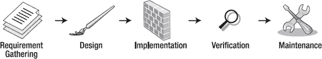

*图 1-13。瀑布流程示例*

与所有方法一样，瀑布开发也有优点和缺点:

*   赞成的意见
    *   *业务/客户对预期成本和时间表有明确的指示。*
    *   对于正在建造的东西，有一个确切的定义。
*   骗局
    *   在构建开始之前，规范通常是不完整的，或者有太低级别的错误而无法隔离。这导致开发团队和客户争论解决方案的特定部分是否包含在最初的成本计算中。如果不把规范做得非常精细和详细，对客户/企业来说显而易见、隐含和直观的项目可能会被开发人员误解。
    *   有一个悖论:要写一个完全准确的规格说明，需要作者已经建立了解决方案。
    *   规范没有为流程中的变化留有余地；如果企业/客户发现了另一个必须包含的需求，那么有必要等到“瀑布”干涸后再考虑这个需求。

无论您采用哪种开发方法，很少会发现一个企业或客户不是以瀑布方式工作的。当我们作为一个企业需要建造一些东西时，我们需要知道它要花多少钱，要花多长时间。为此，通常从他们的角度将项目视为一个瀑布，但是在项目生命周期的内部使用不同的方法。

#### 敏捷开发

敏捷开发已经流行了 10 到 15 年了。敏捷开发的核心是团队应该敏捷的概念，也就是说，团队应该能够轻松地切换和改变他们的流程、概念和任务。敏捷方法基于迭代开发，并允许团队反思每个时间段内的成功或失败，修改他们的流程并快速响应需求的变化。在 2001 年发表敏捷宣言之后，许多早期的敏捷工作流，如 SCRUM 和极限编程，现在被称为敏捷方法。

敏捷宣言可以在`[`agilemanifesto.org/`](http://agilemanifesto.org/)`找到，但是为了清楚起见，我们把它放在这里:

> 我们通过自己动手和帮助他人来发现开发软件的更好方法。通过这项工作，我们开始重视

*   流程和工具之上的个人和交互
*   综合文档之上的工作软件
*   合同谈判中的客户协作
*   响应变化而不是遵循计划

也就是说，虽然右边的项目有价值，但我们更看重左边的项目。

以下是敏捷开发的一些优点和缺点:

*   赞成的意见
    *   团队能够快速地改变和应对新的或变化的需求。
    *   这个流程一直在发展，团队的每个成员都可以在这个发展流程中发表意见并发挥作用。
*   骗局
    *   通常很难或不可能承诺固定的截止日期。
    *   规范可能太松散，遗漏的特性发现得太晚。

尽管存在许多敏捷开发方法，但它们都促进协作和易于适应的流程。以下部分展示了敏捷实践的例子。

##### 测试驱动的开发

测试驱动开发(TDD) 是在我们编写代码之前编写自动化测试(基于我们的需求和验收标准)的流程，并且只编写帮助我们通过这些测试的代码。这有助于最小化范围蔓延(新需求的产生)和不必要的代码。无论何时发现软件中的错误，我们都可以立即添加一个测试来重现这些错误。如果这个测试仍然在我们的测试套件中，我们可以确定我们不会在不知道它的情况下倒退。你可以在第十章中阅读更多关于测试的内容。

##### 代码重构

重构我们的代码意味着重新访问它，并确保它尽可能地高效、快速和干净，并且不会留下任何潜在的代码味道。

 **注:** *代码气味*是马丁·福勒和肯特·贝克在福勒写他的书*重构:改进现有代码的设计*时讨论的一个术语。代码气味是一段代码，它表明了更深层次的问题。

任何关于“要做的事情:解决这个问题！”应该在代码重构期间解决。代码评审可以帮助促进团队之间的知识共享。代码重构通常是一种奢侈；如果你有机会做这件事，一定要充分利用它。这也可以被认为是偿还你的技术债务。尝试去除任何遗留代码，并考虑是否有其他方法可以格式化 CSS，以便最大限度地利用最小化算法或在浏览器中获得更好的呈现性能。

##### 持续集成

*持续集成* *(CI)* 服务器构建并测试我们的代码，并执行其他自动化任务，以响应版本控制存储库的提交或以预定义的时间间隔执行。我们将在第九章的中进一步讨论这个问题。

##### 结对编程

许多公司现在提倡*结对编程*流程:与另一个开发人员一起工作，以避免知识囤积，指导和帮助团队的其他成员，因为这减少了成品中出现错误的机会。三个臭皮匠顶个诸葛亮。其他一些公司认为让两个开发人员同时从事同一项工作是低效的。我们建议，当一项工作足够复杂时，结对编程可能是非常宝贵的，但通常代码审查就足够了。在团队之间轮换开发人员是避免知识囤积的另一种有效方法。

##### 策划扑克

*计划扑克*(有时被称为*计划游戏*)是一种针对任务收集资源估计的方法。它被称为扑克游戏，因为它使用卡片或代币来代表投票。在合理详细地描述了要评估的任务之后，特定领域的每个人(无论是服务器端开发、客户端开发、测试人员、设计人员等等)都会拿出一张卡片，上面显示了他们期望一个人完成任务所花费的时间。价值最高的人证明了他们的选择，价值最低的人证明了他们的选择，我们重复这个流程，直到我们有一个一致的决定。

规划扑克可能是一项非常耗时的工作，并不一定适合所有公司，但它有利于确保团队的每个成员都很好地理解我们正在交付的东西，并可能考虑和想到可能会滑入实现阶段的错误。通常，时间估计由卡片或令牌以不同的方式表示；例如，作为故事点或反映斐波纳契数列的天数(1、2、3、5、8、13 等等)。

 **注意:**斐波那契数列实际上是从 0，1，1 开始的，但显然在这个例子中会适得其反。

##### 代码审查

代码评审与结对编程相似，因为它们为其他开发人员提供了一个对已经编写好的代码进行评论的机会。通常这种学习是双向的，评审者会问为什么事情会以一种特定的方式完成，并提供反馈。就时间而言，它比结对编程成本更低，并且是在较小的团队中保证代码质量的更有效的方式。

##### 每日站立会议

只要整个团队都有空，这些会议每天都会召开。在这些会议中，我们使用鸡和猪的概念。这个术语来自一个古老的笑话:

一天，一只猪和一只鸡正在聊天，这时鸡说:“嘿，我在想我们应该一起开一家餐馆！”

“我们应该吗？我们会叫它什么？”猪问。

"“火腿鸡蛋”怎么样？"鸡肉表明。

“不用了谢谢！”猪惊呼道。“我会承诺，但你只会参与！”

猪是实际建造项目的人。一只*鸡*是有人参与了这个项目。一只鸡(项目经理，或者 scrum master)应该促进每日站立，但是只有猪应该有所贡献。这很有帮助，因为鸡应该对整个项目的成功感兴趣，而每只猪可能有自己的偏见或议程。通常猪是开发者，鸡是其他人。在每日站立时，每只猪应依次说以下内容:

*   他们昨天在做什么
*   他们今天在做什么
*   如果有任何问题影响他们的工作能力

为了避免长时间的谈话，有一个非常有用的问题，我们可以在任何时候问:“每个人都关心吗？”

*   如果在每日例会上有影响到每个人的问题，他们应该解释清楚，主持人应该鼓励讨论来解决问题。
*   如果有只影响某些人的问题，主持人应该让这些人留下来进一步讨论。这通常被称为将对话*离线*。

每天的起立发言通常应该非常快——每人发言不超过一两分钟。

##### 回顾会

在我们流程的特定点，进行*回顾*非常有用。这是一个机会来回顾我们到目前为止的流程，并在必要时改进或改变它们。回顾有许多不同的形式，但是每个团队可以自己决定。任何感兴趣的团体都可以参加回顾会，但是只有猪(见前面的每日站立会议)可以参与。回顾的重要组成部分如下:

*   scrum 主管或项目经理应该促进回顾。
*   每头猪都应该参加回顾展。
*   团队应该认可成功的个人和流程。
*   团队应该确定流程中可以改进的地方或以前遇到的问题。
*   对于提出的每一个负面观点，主持人必须定义一个*行动*来解决问题，并将这个*行动*分配给个人或他们自己。
*   没有不好的反馈！团队的所有成员都必须感到有能力并欢迎参与。

典型流程的一个示例可能是:

*   每只猪都有一堆便利贴。
*   在一分钟内，每只猪在一张纸条上记下上一次迭代的积极点。
*   主持人将这些笔记排列在墙上，将相似的项目组合在一起。项目越相似，团队作为一个整体对某件事的感觉就越积极。如果团队对个人做出了积极的评价，个人应该得到认可和表扬。
*   在一分钟内，每只猪在一张纸条上记下关于前一次迭代的一个负分。
*   对于每个负面项目，主持人讨论潜在的解决方案(行动)。
*   当发现一个动作时，主持人会将其分配给相关人员。

回顾是任何流程中最重要的部分之一。需要有一种方式让开发者反馈他们的想法。通常他们会有非常有用和聪明的建议；有时，他们可能想对某些事情咆哮或发泄(为此提供一个论坛是很重要的)。如果可能的话，最好安排一个户外的回顾会，并结合更多的社交活动，比如团队午餐。放松的人会给出更诚实的批评和反馈。

已经有很多很多关于开发方法的书籍，在这一节中，我们实际上只是浏览了皮毛。

### 总结

这一章关注于我们可以用来帮助我们以最有效的方式进行开发的流程和工具。尽管流程因公司而异，而且工具通常是内部开发的，但我们讨论的基本原则仍然适用。我们的流程必须严格，以确保它们得到遵守，我们必须始终确保有一个“反馈循环”，以便我们的员工可以指出我们流程中的任何失败，并可以进行更改以反映这一点。

如果可能的话，整个团队应该从所有可用的风格和方法中挑选，并随着时间的推移继续完善它们。这些流程适用于所有类型的开发规程，尤其适用于 CSS 开发，但是它们构成了您的工作环境的基础。要建立一个好的团队，写出最好最高效的 CSS，你需要一个坚实的基础。

下一章将关注 CSS 格式指南和规则，我们可以具体应用于如何编写和构造我们的样式表。我们也将开始研究最佳实践，并讨论在高流量网站上工作时需要考虑的问题。