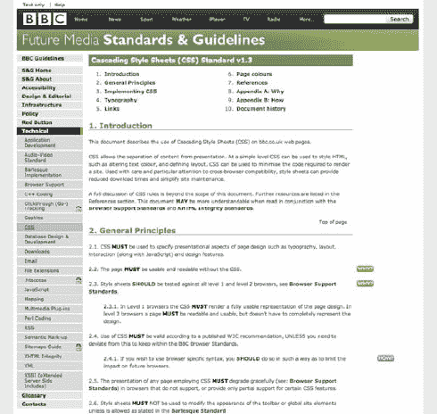

# 二、CSS 样式指南

每个 CSS 作者都有他喜欢的编写代码的方式。例如，有些人喜欢将每个属性和选择器写在单独的一行上，而有些人则喜欢将所有内容写在一行上。有些作者从不在选择器的最后一个属性上添加分号(因为这不是必需的)；其他人喜欢删除冒号和属性值之间的空格。名单还在继续。

这些只是几个 CSS 创作因人而异的例子——看看任何 CSS 论坛，你会发现对这些话题的无休止的争论，还有更多。你也可能会得出结论，没有人是完全正确或错误的——在围栏的每一边都有有效的论点。

然而，当处理大规模样式表时——或者要应用于大规模网站的样式表，其中性能和健壮性是最重要的因素——个人偏好通常必须被搁置，以让位于更灵活、更一致的代码编写方式。

这种方法在开始时并不是最有效的(一个新雇佣的开发人员必须适应组织中使用的惯例，所以他不能在不熟悉它们的情况下立即开始编码)，但是它将使员工更容易编辑和更新由其他开发人员创建的样式表，而不必花时间去理解(有时正确的词应该是“解密”)和熟悉其他人的 CSS 写作风格。

有一套约定也将使作者更容易知道走哪条路。尽管在创建 CSS 解决方案时总会有一定程度的主观性，但是如果有一个 CSS 样式指南，许多疑虑将会消失，因为有“规则”可循。检测错误、错别字和错误也变得更加容易。

这一章集中在最重要的几个点上，在这些点上 CSS 创作可以变得更加一致和有效。您将了解以下内容:

*   为什么你应该有一个 CSS 样式指南
*   格式化 CSS 的有效方法
*   如何有效地使用 CSS 注释
*   ID 和类命名的最佳实践
*   命名空间

### CSS 样式指南

如果你正在制作一个 CSS 样式指南(正如我们推荐的那样),它将被团队的所有成员所了解和使用，它可以并且应该包括一个 CSS 如何被格式化的参考。这将使阅读他人创建的样式表变得更容易，并且将消除 CSS 作者在创建或编辑文件时常见的主观性。它还应该指出如何提出意见，并鼓励使用它们。

创建和实现 CSS 样式指南将会消除一些与编码 CSS 相关的不一致性，不同的开发人员有不同的编码样式，有时其他人很难阅读和理解。这减慢了开发过程，并增加了错误、冗余和代码膨胀。风格指南是避免这种情况的工具，它通过一致性考虑到代码的可重用性和效率，为开发高流量网站提供了一个简化的团队环境。

像 BBC(见图 2-1 )或 Drupal(见图 2-2)这样的公司都有 CSS 样式指南，这些指南是公开的，对任何创建者来说都是很好的参考。

***图 2-1。** BBC 层叠样式表标准&指南(`[`www.bbc.co.uk/guidelines/futuremedia/technical/css.shtml`](http://www.bbc.co.uk/guidelines/futuremedia/technical/css.shtml)` )*

***图 2-2。** Drupal CSS 编码标准页面(`[`drupal.org/node/302199`](http://drupal.org/node/302199)` )*

然而，重要的是要记住，指南就是指南，仅仅是指南。开发人员总是不得不自己做大部分的决定，即使有一个合适的向导。一个风格指南不应该试图完全去除主观性，因为那永远不会发生，应该允许一定程度的灵活性和自由度。

在本章接下来的几节中，我们将讨论 CSS 样式指南应该参考的一些方面。你可以在本书末尾的附录 1 中找到一个完整的 CSS 样式指南的例子。

### CSS 格式

CSS 是一种(像 HTML 一样)松散格式化的语言，在解析它时通常会忽略空白，因此您可以使用任意多的空格、制表符或回车，以便以您认为最容易读写的方式格式化它。正因为如此，它适合以多种方式进行格式化。

尽管两种写作风格有相似之处，但在小细节上有如此多的变化，很难提出一个大家都同意是最好的明确解决方案。

我们能做的是向您展示最常见的选项，以及为什么有些选项比其他选项更好或更有效。毕竟效率是我们看这本书都想达到的，对吧？

#### 单线对多线

如果有一个 CSS 讨论通常不会导致有用的结论，那就是关于不同风格的 CSS 格式。栅栏倾向于把那些喜欢把他们的规则写在一行上的人和那些喜欢把每个单独的财产声明在一行上的人分开。

这是一个单行 CSS 示例，其中选择器、属性和值位于同一行:

`div { width: 200px; height: 300px; padding: 20px; background: #efefef; }`

这是一个多行版本:

`div {
   width: 200px;
   height: 300px;
   padding: 20px;
   background: #efefef;
}`

multiline 方法的主要参数如下:

*   它更容易阅读，尤其是如果你不熟悉的文件。
*   更容易进行文件比较(使用 Diff 工具，在第一章中有更详细的描述)。
*   没有水平滚动。

单行 CSS 也有它的优势:

*   文档中的行数更少
*   选择器更容易扫描
*   减小文件大小

为了保持一致，本书将使用多线方法。这一选择背后的理由如下:

*   更容易对变更和注释进行注释。
*   对于较小的文件，这种格式更容易阅读。
*   我们假设 CSS 文件将在开发的后期被缩小或压缩(更多关于 CSS 缩小和压缩的内容在第八章中)。

尽管这并不意味着我们相信这是绝对最好的 CSS 格式样式，但我们同意这是一种提供了更清晰的方式来阅读选择器和属性的样式。它也更容易对特定的属性和值进行注释，这是处理多人共享的 CSS 文件时的一个重要因素，大多数开发人员更喜欢多行 CSS 而不是单行版本。

支持多行 CSS 的一个主要论点是单行 CSS 使得使用 Diff 工具变得更加困难，因为在某些情况下，这些工具显示每行文件版本之间的差异(见图 2-3 )。或者，如果他们找到实际的差异，可能是在一长行的末尾，需要水平滚动。

***图 2-3。**在本例中，在“变更”应用程序中，虽然该行被突出显示，但我们看不到实际差异。*

好的 Diff 工具会突出差异，不管文件是如何格式化的(见图 2-4)；当涉及到文件比较时，格式的争论实际上应该不是问题。的确，乍看之下，如果它们在屏幕之外，可能更难发现这些差异，但是这个问题并没有大到您应该改变您的做法。如果它确实给你带来了问题，你可能会发现一个不同的比较工具可能会有所帮助。

***图 2-4。**在万花筒应用程序中，查看差异的各种方法否定了这个问题。*

#### 缩进

CSS 文件中的缩进可以提高可读性，也有助于理解 HTML 文档的结构。

属性可以在选择器本身内缩进，这样更容易只扫描样式表上的选择器，如下例所示:

`section {
   width: 400px;
   font-size: 14px;
   float: left;
}

footer {
   border-top: 1px solid #000000;
   font-size: 12px;
   clear: both;
}`

有些作者选择根据应用样式表的 HTML 文件的文档树来缩进选择器:

`section {
   width: 800px;
}

   section article {
      border-bottom: 1px solid #999999;
      padding-bottom: 10px;
   }

      section article footer {
         font-size: 11px;
         font-style: italic;
      }`

即使使用这种格式化方法，文档的结构变得更加清晰，它也很容易变得过于复杂或主观，当标记复杂时，您的规则可能会从页面的右侧消失。我们建议，如果你觉得这是对你的样式表的一个很好的补充，在你指定你的文档树的主要分割块的部分使用它，不要试图在其他部分复制它，如链接或排版。

#### 制表符与空格

制表符对空格的争论远比 CSS 开发更古老，而且不太可能在本书中得到解决。然而，我们可以解释每个的优点和缺点。

缩进代码时，您可以选择使用制表符或预定义数量的空格作为单级缩进。大多数文本编辑器允许您在保存文档时选择将制表符转换为一定数量的空格(软制表符)或用不同的宽度表示制表符。有些人喜欢用两个空格来表示他们的缩进，有些人喜欢用四个空格，有些人甚至有比这些更复杂的个人规则。

使用选项卡的好处如下:

*   单个字符比几个空格占用的文件空间少。
*   通常可以在文本编辑器中控制单个制表符的宽度(这样开发人员可以选择它的可视显示方式)。
*   如果您没有使用等宽字体，您的代码仍将正确缩进。

使用空格的好处包括:

*   无论使用哪种编辑器，缩进的宽度都是一样的。
*   可以相信空格总是出现在同一个地方，而制表位可能会因编辑器而异。
*   环境之间的空间是一致的。

我们将提供的结论(非常主观)如下:

*   使用制表符缩进。
*   使用等宽字体。
*   使用空格进行对齐。

如果你和你的团队不同意(看起来有二分之一的可能性)，这不是问题。我们的目标是团队中的每个成员都做同样的事情，无论是空格还是制表符。一致性始终是我们最关心的问题。

#### 冒号和分号

为了追求更小的文件大小，一些作者选择省略 CSS 规则中最后一个属性后面的分号。所以代替这个的是:

`img {
    border: 2px solid red;
    float: left;
}`

我们会有这个:

`img {
    border: 2px solid red;
    float: left
}`

事实上，如果文件大小是一个主要问题，我们也可以省略选择器之间的空格和冒号与每个属性值之间的大括号，以及最后一个属性值后面的最后一个空格——这仍然有效，尽管会使它更难阅读:

`img{border:2px solid red;float:left}`

然而，当走向这些极端时，我们正在接近缩小对 CSS 文档的影响。

在大型网站工作时，性能是一个持续关注的问题；压缩和缩小你的 CSS，使其具有尽可能最小的文件大小，这应该是开发过程中的一个步骤。(你可以在第八章阅读更多关于缩小的内容。)在这一节中，我们所指的是当一个 CSS 文件仍在被编辑时，当文件大小不是一个问题时，如何格式化它，至少在是否添加最后一个分号或是否在冒号后有一个空格的层次上是如此。

和以前一样，无论你做什么决定，都需要你的团队坚持。假设文件将被缩小，当你在处理文件时，你应该主要关心它们的易读性和对团队最有利的东西。

### 注释和 CSS 元数据

CSS 注释经常被作者遗忘或忽略，但是如果它们是一致的并且是最新的，它们会非常有用。

这里有一个简单 CSS 注释的快速提示:

`/* This is a CSS comment */`

 **注意:**您可能会注意到这与 JavaScript 和许多其他语言中的块注释相同。不幸的是，CSS 不支持单行注释，如下所示:

`//This is a CSS comment`

但是有一些选项比如 LESS (Leaner CSS)可以帮你实现这个(见第九章)。

可以内联添加注释以对特定属性进行注释，例如:

`.myClass {
    color: red; /* Same color as logo */
}`

或者在单独的行上，例如，将选择器分成有意义的部分:

`/* Table headings */

thead th {
        font-weight: bold;
}
tbody th {
        font-weight: normal;
}

/* Table rows */

.odd {
        color: red;
}
.even {
        color: blue;
}`

CSS 注释可以跨越任意多行。当 CSS 文件被缩小时，注释往往是第一个被剥离的东西(我们在第八章中更详细地讨论了缩小)，但是在开发阶段，注释有许多不同的用处。

#### 现有标准:CSSDOC

已经有一些创建 CSS 文档标准的尝试。一个例子是 CSSDOC，它是 Javadoc(一个将 Java 源代码中的注释提取到 HTML 中的文档生成器)的改编版。

CSSDOC 使用 *DocBlocks* ，这是从 PHPDocumentor 项目借用的术语。文档块是人类和机器可读的数据块，具有以下结构:

`/**
 * Short description
 *
 * Long description (this can have multiple lines and contain 
 tags
 *
 * @tags (optional)
 */`

DocBlock 以/**开头，以一个空格后跟*/(像普通的 CSS 注释一样)结尾。每行必须以一个空格开头，后跟一个星号(*)，否则它将被文档生成器忽略。标签以星号开头，然后是它们的名称(没有空格)。标签可以包含诸如@author、@copyright、@todo 等信息。它们的描述或值应该以一个空格开头，紧接在标记名之后。

CSSDOC 标准建议 CSS 文件应该在文件顶部包含一个*文件注释*，它应该包含与整个文件相关的元数据。此文件注释应包括文档标题等信息；一段描述；和标签，如@project、@version、@author、@copyright，甚至@colordef 标签，指示文件中使用了哪些颜色。

文件注释后面可以跟零个或多个*部分注释*，将样式表分成相关的块。黑客攻击和错误修复应该放在每个部分的末尾。部分注释包含标签@section，如下所示:

`/**
 * Typography
 *
 * @section typography
 */`

一些文本编辑器，如 Textmate 或 CSSEdit，支持普通 CSS 注释中的@group 标记，以将 CSS 文件分成几个部分。CSSEdit 使用这些组来创建文档的可视轮廓；Textmate 需要一个捆绑包来实现此设置(有一些可用的)。虽然最新的草案提到了@group 标签，但是它还没有被合并到 CSSDOC 规范中。它允许 CSS 作者将选择器分组为有意义的部分，这些部分可以根据需要折叠和展开，从而更容易扫描和处理长 CSS 文件。有单独的包可供 Textmate 添加 CSSDOC 功能。 1

CSSDOC 标准还有更多的内容(足以写满一整章)，所以我们建议看一下官方页面`[`cssdoc.net`](http://cssdoc.net)`，以获得更深入的信息。

有一个合适的标准不仅使与其他 CSS 作者共享代码变得更简单，而且使从 CSS 文件中自动提取注释变得更容易，以便于文档化。

在这一节中，我们将参考和借用 CSSDOC 文档中包含的一些指导原则，主要是因为它们代表了对 CSS 注释标准化的展望，这对编写 CSS 的每个人都有好处。然而，我们认为，在某些情况下，CSS 元数据应该存在于文件本身之外(例如版本和作者)，维护这样的注释很容易成为一项费力的任务，而不是一项有效的任务。评论一旦过时，就很快失去了价值。

____________

1Adam Salter 出色的 GetBundles 捆绑包(`[`github.com/adamsalter/GetBundles.tmbundle`](https://github.com/adamsalter/GetBundles.tmbundle)`)使得定位、更新和安装 TextMate 捆绑包变得更加容易。

#### 文件信息

CSS 注释最常见的用途是用于作者信息、创建和最后更新日期。CSS 文件通常在开头有这样的注释:

`/* CSS file, created by John Doe, http://domain.com, on 12.28.2009 */`

其他人会不厌其烦地添加更多信息，例如最后一个更新文件的人是谁，以及何时更新的:

`/* CSS file, created by John Doe, http://domain.com, on 12.28.2009
Last update by: Jane Doe, on 5.19.2010 */`

尽管我们认为有些数据最好存储在自动生成这些数据的版本控制系统中——CSS 作者会经常忘记更新这些数据，这使得这些数据变得毫无意义——但有些与样式表相关的信息可能应该存储在其中，并且很容易找到。

这是提及文件可能具有的任何依赖关系的好时机——例如，它是否使用主重置文件(CSS 重置文件在第四章的中有更深入的描述)或任何其他导入的样式表。它还可以说明文件是为哪个网站、子网站或页面创建的，以及它是否覆盖其他样式表。如果需要，还可以引用与该特定文件相关的命名空间实现。

下面是一个包含所有这些内容的示例:

`/*

Style sheet for: Igloo Refrigerator Parts Inc Christmas website

Created by John Doe, http://domain.com, on 12.28.2009

Importing reset file: /css/resets/master.css

Overriding: /css/base.css

Namespacing: use the “xmas” prefix for all the classes and IDs referenced in this file. For example: .xmasLatestNews or #xmasLatestNews

*/`

如果您使用的是 CSSDOC 类型的注释，文件信息区域(或*文件注释*)将如下所示(所有的描述和标签都是可选的):

`/**
 * Christmas theme
 *
 * CSS theme for the Christmas version of the Igloo Refrigerator Parts Inc website
 *
 * This theme has been developed by the Design Team at IRP Inc and should be used between
 * the dates of November 7th and January 7th
 *` ` * @project    IRP Christmas Site
 * @author     Design Team at IRP Inc
 * @copyright  2010 Igloo Refrigerator Parts Inc
 * @cssdoc     version 1.0-pre
 */`

这些是数据片段的例子，对于开发人员来说，手边有这些数据片段是很有用的，可以避免为了访问它们而钻研版本控制系统。根据应用样式表的内容类型，可以添加许多其他细节。

这里主要关注的是这些信息必须保持相关和最新——它不能被轻易忽略，因为那样会违背这个评论块的目的。

#### 目录

注释可用于在样式表的开头插入目录。这是有用的，因为它将消除滚动 CSS 文件(很容易有数千行)来找出它包含的内容以及在哪里找到特定信息的需要。

目录可以像下面这样简单:

`/* Table of contents:

1\. Reusable classes
2\. Structural elements
3\. Colors and typography
4\. Visual media
5\. Widgets

*/`

也可以详细到如下:

`/* Table of contents:

Imports
Reusable classes
Structure
Navigation
Links
Typography
   Headings
   Body text
   Blockquotes
Lists
   Generic
   Definition lists
Forms
Images
Sidebars
Footers
Homepage
  Widgets

*/`

无论你选择哪种格式的目录，重要的是它要不断更新，以反映样式表的结构。

一些 CSS 编辑器会自动创建一个可视化的目录，例如，MacRabbit 流行的 CSSEdit(见图 2-5 )。

***图 2-5。** CSSEdit 在左边创建 CSS 文件的自动轮廓(`[`macrabbit.com/cssedit/`](http://macrabbit.com/cssedit/)` )*

但是，如果软件不可用或者开发人员喜欢使用其他工具，在 CSS 文件的顶部包含一个手动更新的目录(即使很简洁)总是很有帮助的。

#### 切片

只有当样式表实际上被分成几个部分时，目录才有意义。

当在 CSS 文件中创建部分时，您可能想让它们在代码的其余部分中易于识别。类似下面的划分不会很有特色:

`.myClassA {
   font-size: 14px;
}

.myClassB {
   font-size: 18px;
}

.myClassC {
   font-size: 24px;
}

/* Colors */

.error {
   color: red;
}

.success {
   color: green;
}`

相反，如果你使用这样的东西:

`.myClassA {
   font-size: 14px;
}

.myClassB {
   font-size: 18px;
}

.myClassC {
   font-size: 24px;
}

/* Colors
-------------------------------------------------------- */

.error {
   color: red;
}

.success {
   color: green;
}`

分部会更容易找到。

安迪·巴德在他出色的 *CSS 掌握*、、 2 、中提出，章节也应该易于搜索。如果我们将一个节命名为标题*和*，在同一个文件中，我们有名为*侧栏标题*或*脚注标题*的类，当使用内置的软件搜索工具时，我们可能必须通过几个不相关的结果才能找到我们想要的节标题。相反，如果我们在部分标题前添加一个不会在样式表的其余部分使用的字符，搜索过程将会更容易。安迪建议等号:

`/* =Headings */`

如果你搜索“=头”，软件很可能只会产生一个结果。

如果您使用的是 CSSDOC 注释，则一个节的划分格式如下:

`/**
 * Typography [optional]
 *
 * Description [optional]
 *
 * @section typography
 */`

不管你选择哪种风格，重要的是章节标题要与众不同，最重要的是，它们将样式表分成逻辑块。它们应该使浏览文档变得更容易，而不是更难；因此，创建的部分应该是直观的，即使它们遵循组织内的既定惯例。

当将一个样式表分成几个部分时，确保每页上重复出现的元素与特定于页面的元素分开也是一个好主意。

这将使查找冗余或不必要的选择器变得更容易——通过将它们隔离开来，在测试或完全删除它们时(也许将它们移到一个单独的样式表中)更容易注释掉它们。

您还可以考虑将 CSS 中经常使用的部分和依赖于交互的部分分开。例如，主标题将始终显示在页面上，但错误消息可能只在某些情况下显示。弄清楚这一点，以后就更容易找到过时的遗留代码。

#### 色盘

CSS 文档顶部的另一条有用信息是对整个站点所用颜色的引用。

CSS 作者的一个常见错误是使用与应该使用的颜色相近的颜色。这可能是因为没有现成的品牌指南，或者即使有也不在手边，或者根本没有足够的时间去查阅。颜色最终是使用 Firebug、xScope 或 Photoshop 等工具选择的，这可能导致仅仅是近似的结果(特别是如果 CSS 开发人员获得的 jpegs 质量低于 100%，这种情况经常发生)，从而导致在一个样式表中使用几十种相似但不同的颜色。尽管颜色错误对性能的影响很小，但随着时间的推移，颜色会越来越偏离其原始值。根据颜色的放置和使用，以及最终用户的显示器和显示设置，这些错误可能会变得更加明显。此外，如果使用一致的颜色，压缩时文件大小可能会更小，因为重复的文本模式可以实现更高效的压缩。

____________

2

如果在 CSS 文件中添加一个颜色参考，就可以避免这些误解。使用样式表顶部的注释可以很容易地做到这一点:

`/* Color reference:

Main text      #111111
Headings       #999999
:link          #9f0000
:visited       #720000
:hover,
:active,
:focus         #004899
…

*/`

颜色参考可以而且应该比前一个例子更详细。它可以包含背景和边框颜色、更详细的印刷颜色、不同类型的链接颜色、根据站点部分的颜色等等。

需要记住的一件重要事情是，每个元素或元素组的描述应该是基本不可变的。如果我们使用“深灰色文本”而不是“主要文本”，那么引用表的目的就失去了。

这并不意味着这样的引用不应该被指定——当然有一个地方来说明网站应该使用的适当的红色或粉红色。但它们可能更多地被视为颜色参考中的次要元素，而不是主要的结构或印刷元素之一。

使用动态 CSS(在第九章中有更详细的解释)也可以减少不断参考颜色参考表的需要。

例如，当使用 LESS 时，可以在样式表的顶部声明如下所示的变量:

`@mainText:   #111111;
@headings:   #999999;
@links:      #9f0000;`

这将允许您在整个 CSS 文件中引用变量，而不是实际的颜色值，这也使更改颜色变得更加容易—您只需要在最初声明变量的地方做一次，它将更改颜色的所有实例，如下所示:

`body {
   color: @mainText;
}`

使用 CSSDOC 类型的注释时，使用@colordef 标记将颜色信息添加到 CSS 文件顶部的文件注释中:

`/**
 * Christmas theme
 *
 * CSS theme for the Christmas version of the Igloo Refrigerator Parts Inc website
 *
 * This theme has been developed by the Design Team at IRP Inc and should be used between` ` * the dates of November 7th and January 7th
 *
 * @project     IRP Christmas Site
 * @author      Design Team at IRP Inc
 * @copyright   2010 Igloo Refrigerator Parts Inc
 * @cssdoc      version 1.0-pre
 *
** * @colordef    #111111; main text**
** * @colordef    #999999; headings**
** * @colordef    #9f0000; links**
 */`

#### 文件夹路径

注释可用于解释文件夹路径。这到底是什么意思？

尽管我们建议有一个清晰实用的文件夹结构(本书在第八章中对文件夹结构进行了更详细的介绍)，但通常还是需要更深入一些——例如，为了更好地组织图片。发生这种情况时，在引用这些文件的样式表中引用这些路径是很有用的，这主要是为了避免最初没有编写 CSS 特定部分的开发人员犯错误。

CSS 文档顶部的这些注释可以像下面这样简单:

`/* Branding elements are located in the Assets/Branding folder at the root of the main website */`

只要记得保持它们的简洁和最新；否则，它们就没用了。

#### 测量值

当创建复杂的 CSS 布局时，计算是不可避免的。

让我们描绘一个有两列的流体布局(见图 2-6 )。根据用户屏幕的大小，主要内容栏应该具有可变的宽度；侧边栏应该是 200 像素宽；我们还希望 20 像素垂直分隔两列。

***图 2-6。**简单的两栏流体布局:侧边栏宽度固定；主要内容区域具有可变的宽度。*

我们的 CSS 可能看起来如下所示:

`#main {
   margin-left: 220px;
}

aside {
   width: 200px;
   float: left;
}`

在计算出初始度量值后更新 CSS 的人可能会发现很难理解所使用的一些值。

使用注释，我们可以编写一个更好的、有文档记录的解决方案:

`#main {
   margin-left: 220px; /* aside width + 20px of margin */
}` `aside {
   width: 200px;
   float: left;
}`

度量注释对印刷计算也很有用。

假设您有一个文本设置为 14 像素的页面，其`line-height`为 1.5。这意味着页面上的每一行的高度为 21 像素:14 × 1.5。

如果这个页面上的标题被设置为 18 像素，为了保持页面的垂直节奏不变，我们需要拿起计算器做一些数学计算——我们需要找到调整后的标题的`line-height`。这个思考过程是 CSS 注释的一个很好的候选:

`h2 {
   font-size: 18px;
   line-height: 1.167; /* 21 (original line-height) / 18 (h2 font-size) */
}`

即使不熟悉印刷概念的人可能不完全理解这种计算的需要，展示达到这种特定值所采取的步骤对于避免将来的错误是无价的。 3

 **注:**这不是一本印刷书籍，所以我们不会过多讨论垂直间距是如何工作的或者应该如何计算的。关于网页排版的精彩介绍，请阅读 Richard Rutter 的“应用于网页的排版风格元素”，第 2.2.2 节`[`webtypography.net/Rhythm_and_Proportion/Vertical_Motion/2.2.2/`](http://webtypography.net/Rhythm_and_Proportion/Vertical_Motion/2.2.2/)`。

#### 记录黑客攻击和漏洞修复

黑客和 bug 修复文档是 CSS 注释的一些最重要的用途。

一个 CSS 作者经常会处理一个特殊的样式表，并且会遇到一个别人以前创建或编写的解决方案，这个解决方案看起来不清楚甚至不正确。也许可以使用一个更简单的解决方案，一个不会使 CSS 文件无效的解决方案，或者也许一开始就没有问题。

通常发生的情况是，即使代码不是最干净的，考虑到时间和预算限制、浏览器支持以及其他可能影响决策过程的因素，它可能是以前的开发人员能够编写的最佳解决方案。

在这些情况下，注释就派上了用场。例如，他们可以参考 Web 上的一篇特定文章，该文章解释了所采取的解决方案或进一步记录了错误:

____________

没有向上或向下舍入的标准设置，所以浏览器不会始终如一地舍入包含小数位的值。

`aside section {
   float: left;` `   width: 50%;
   display: inline; /* display: inline; fixes the Double Float Margin bug on IE5/6\. More on this bug/solution: http://www.positioniseverything.net/explorer/doubled-margin.html */
}`

这种类型的文档注释应该简要地解释什么是 bug(如果它是一个众所周知的有文档记录的 bug，使用它的最常见的名称)，采取的解决方案(提供一个链接，在那里进一步解释这个问题，如果存在的话)，以及编辑或删除该特定黑客的后果。

当使用 CSSDOC 约定时，黑客和变通方法应该这样注释:

`/**
 * Name of the bug
 *
 * @workaround [or @bugfix]
 * @affected   IE6
 * @valid      yes [or no]
 * @see        [include, for example, a link to an online article describing the bug]
 */`

记录 CSS 攻击和错误可能看起来很麻烦，特别是在处理众所周知和记录良好的 Internet Explorer 错误时，但是我们必须记住，即使我们中的一些人熟悉它们和它们的解决方案，许多开发人员并不熟悉。对我们的代码采取防御性的方法通常是最好的选择。

#### 使用模板

拥有一个可供开发人员参考的 CSS 样式指南是有用和可取的，但是也建议为他们提供一个实际的 CSS 基本结构版本，这将使他们更容易理解应该如何组织一个或多个文件，以及在组织或团队中使用了哪些注释约定。

在此模板中，您应该包括以下内容:

*   文档信息部分，包括文件依赖、覆盖、命名空间约定等等
*   目录，包含最常见的部分
*   调色板，它可以预先填充品牌颜色或只包括一个例子，它应该如何填充
*   诸如“可重用类”、“结构”、“版式”等部分。

如前所述，诸如最后一个编辑文件的人和时间之类的信息应该用更合适和更可靠的方法来处理，如版本控制系统，以使过程自动化并避免重复劳动。应该鼓励开发人员在编辑这些文件时更新任何相关的部分。

### 类别和 ID 命名

在不深入了解什么是类和 id(我们假设您至少熟悉 CSS 的最基本概念)的情况下，我们将简要解释两者之间的区别。

类和 id 是在你的 HTML 中提供钩子的方法——也就是说，隔离和引用特定元素的方法。以下面的 HTML 片段为例:

`<ul>
<li>Home</li>
<li>Contact Us</li>
<li>Search</li>
</ul>`

没有简单的方法来引用“联系我们”列表项。我们可以使用第 n 个子元素选择器来定位无序列表元素的第二个子元素:

`ul li:nth-child(2) {
        …
}`

但这意味着，如果我们在列表项之前添加了任何列表项，我们的 CSS 将无法立即引用它(这是脆弱 CSS 的一个例子，在第四章中有所介绍)。这个选择器在我们可能要迎合的浏览器中也有不完全的浏览器支持。通过添加一个 ID，如下所示:

`<ul>
<li>Home</li>
<li id="contactLink">Contact Us</li>
<li>Search</li>
</ul>`

我们现在可以很容易地通过 CSS 定位这个元素，如下所示:

`#contactLink {
    …
}`

ID 是唯一的标识符。这意味着在任何一页中，它只能出现一次。从我们 HTML 的角度来看，每个页面都是一个独特的实体。因此，我们可以在整个站点中尽可能多地重用 id。在同一个页面上多次使用一个 ID 将导致不可预知的结果:可能只针对第一个项目，或者只针对最后一个项目，或者所有项目，或者根本不针对任何项目。它还会使我们的 HTML 无效(这会使调试和解析更加困难，并影响我们的搜索引擎排名)。一个元素最多只能有一个 ID。

那么，如果我们想针对多个项目，我们该怎么做呢？这正是上课的目的。在前面的例子中，如果我们想定位除了 Home 项之外的所有列表项，我们可以这样修改 HTML:

`<ul>
<li>Home</li>
<li id="contactLink" class="nonHomeLink ">Contact Us</li>
<li class="nonHomeLink">Search</li>
</ul>`

我们现在可以很容易地锁定这两个列表项:

`.nonHomeLink {
    …
}`

元素可以有任意多的类，如果使用多个类，应该用空格分隔。如果我们想用多个类作为目标元素，并使每个类都是强制性的，我们可以像这样将类链接在一起:

`.warning.error {
    …
}`

这将针对具有“警告”类和“错误”类的任何元素但是，请注意，Internet Explorer (IE) 6 和早期版本不理解使用多个类的选择器。在前面的例子中，IE 6 和 5 将只读取最后一个类“error”，这可能会引起很多人的头痛。避免问题的最简单方法是避免在选择器中使用链式类，而是单独声明每个类，确保它们相互补充。IE 6 将解释正确定义了多个类的 HTML，但不是多个类选择器。

尽管命名元素的类和 id 的确切方式并不重要，但是有几件事您应该记住:

*   语义学
*   接受的字符
*   惯例
*   一致性

#### 语义学

为你的 CSS 命名钩子的方式应该是语义化的和描述性的，而不是描述性的。以下是一些错误 ID 和类名的示例:

*   紫色框
*   大头
*   左上框
*   下划线和绿色

更合适的是以下内容:

*   mainNavigationItem
*   出错信息
*   外部连接
*   侧面内容

W3C 网站上有一个关于这个主题的页面，其中解释道“人们经常使用 bluetext 或 redborder 这样的类名。命名类的一个更好的方法是使用该类的某个 HTML 元素所具有的角色。你可以在`[www.w3.org/QA/Tips/goodclassnames](http://www.w3.org/QA/Tips/goodclassnames)`了解更多信息。

使用非代表性的类名和 ID 名将使它们可重用并适应变化。例如，如果您的页脚的背景颜色是紫色，并且容器的类名是“紫色”，那么当品牌更新并且新的公司徽标是橙色时，会发生什么情况？类名“紫色”变得过时且不连贯——徽标是橙色的！

这就是为什么选择与内容相关的类名和 ID 名很重要，因此，不要将侧边栏命名为“boxLeft”，而应该命名为“sidebar”——您不知道下周它是否会移到右边。或者，与其将红色警告框命名为“红色”，不如将其命名为“警告”，这样，如果有一天它变成黄色，这个名称仍然有意义。

然而，在某些情况下，使用表示性类名可能比使用结构性类名更灵活。例如，如果在网站上不止一个实例中使用了某种类型的容器框(如带有边框的容器)，使用“bordered”这样的表示名称可能是最聪明的解决方案，使其可重用，而不是将特定的容器样式绑定到某种内容类型(创建冗余并使文件变大)。

但是，我们并不鼓励在 CSS 文件中到处使用表示性的类和 ID 名称——有时最好的解决方案并不是最干净或最漂亮的，我们需要转向一种更通用的思维框架。

#### 公认的人物

W3C 指定了哪些字符和组合在`[www.w3.org/TR/CSS21/grammar.html#scanner](http://www.w3.org/TR/CSS21/grammar.html#scanner)`对于类和 id 是有效的。本质上，类名或 ID 必须以下划线、连字符或字母开头。第二个字符可以是下划线或字母，后面可以跟任意数量的下划线、连字符、字母或数字。您还可以包含转义的 Unicode 字符。

但是，在使用类名和 ID 名时，应该避免使用某些字符和组合。其中包括:

*   根据 HTML 标准，下划线在 HTML 属性中一度是合法的，但根据 CSS 标准却不是。在一些浏览器中，实现了各种方法来转义下划线，并取得了不同程度的成功。一些较旧的浏览器(包括 Netscape 4.x 和 Opera 3.5x)在类名或 ID 名中误解了下划线，因此尽管您不太可能支持这些浏览器，但避免使用这些字符似乎是一种好的做法。
*   *正斜杠或反斜杠*:这些是不被接受的字符。
*   *星号*:这些是不被接受的字符。
*   以数字字符开头的类名或 ID 名:一些浏览器会接受这些，但很多不会。
*   以连字符开始的类名或 id:一些浏览器会接受这些，但是很多不会。

有很多方法可以对这些字符进行转义；例如:

为了使“. 55 英尺”成为有效的类，CSS2 要求对第一个数字进行转义(“。“35 英尺 5 英寸”)

`[www.w3.org/TR/CSS2/grammar.html](http://www.w3.org/TR/CSS2/grammar.html)`

这并不简单，因为不同的浏览器可能会错误地解释边缘情况。最好只是避免使用这些字符。您还应该记住，ID 和类名是区分大小写的。

正如您所看到的，对更难理解的字符的支持各不相同，如果您选择使用不符合最简单规则的字符或命名约定，并且不太可能经过很好的测试，新浏览器中可能会出现错误。要遵守的最佳规则是始终只使用字母数字字符或连字符，并且只以字母字符开始类名或 ID 名。您应该避免任何重音或 Unicode 字符。您可以安全地使用连字符，但这似乎是对单个字符的浪费，当您考虑足够大的带宽时，这一点很重要——尽管它们确实有助于获得更易读的值。

#### 习俗

尽管对于我们应该如何命名我们的类和 id 并没有什么规则，但是一些约定现在已经相当确定了，并且发现无处不在的命名实践是很常见的。

这些是您可能在大多数样式表中看到的一些类和 id 的示例:

*   。标题/#标题
*   。页脚/#页脚
*   。侧栏/#侧栏
*   。导航/#导航

在开发新的 HTML 5 元素时，这些名称的普遍存在使它们成为显而易见的选择(有一些变化):`header`、`footer`、`aside`、`nav`。事实上，现在决定不跳到 HTML5 的作者被鼓励使用新元素名作为更成熟元素的类名或 ID 名，比如`div`或`ul`。

有许多任何人都能理解的类名和 ID 名，即使不熟悉手边的特定样式表。一些例子是标题、导航、侧边栏、页脚、主页面、包装、内容、列、提交、错误、警告、发布和动作。

如果可能的话，我们建议使用这些容易理解的名称，而不是更晦涩的名称。这将使代码更容易预测，因此对于没有创建初始命名的人来说也更容易理解。

在组织内部，可能存在其他不为 it 部门所知的命名约定。例如，当命名空间 CSS 选择器(本章稍后将详细介绍命名空间)时，应该有一个内部约定，这样就不会落入每个 CSS 作者的个人偏好中。

合理的命名和明确定义的内部指导原则的结合应该产生一致和直观的类名和 ID 名。

此外，使用可预测的类名和 id 可以帮助一些屏幕阅读器或解析器，并提高 SEO。微格式是一组标准化的规范，用来描述人、日历、产品评论等等。使用这些将有助于搜索引擎理解您的内容，并在搜索结果中以更具吸引力的方式呈现这些内容，以及许多其他好处。在`[`microformats.org/`](http://microformats.org/)`阅读更多关于微格式的内容。

#### 案例

使用语义类名/id 并遵守我们的可接受字符列表的结果仍然会产生大量潜在的可接受的类和 id，我们可以将它们用于我们的元素。以下所有内容都是完全有效的类名:

*   主要内容
*   英雄形象
*   初级导航

这里最重要的是我们保持一致，记录我们期望我们的开发人员使用的 ID 或类名作为参考。在可能的情况下，为了简单起见，尽量不要将单词串在一起是有意义的。然而，当这是不可能的时候，有两个流行的关于你应该如何命名你的类和 id 的思想流派。

##### 骆驼案

一个流行的命名约定叫做*骆驼案*。骆驼大小写是一种习惯，总是以小写字母开头，去掉所有空格和标点符号，并使每个连续的单词以大写字母开头。例如:

*   主要内容
*   英雄形象
*   初级导航

使用首字母缩略词时，应该以相同的大小写将它们组合在一起。如果在名字的开头，让它们都小写；否则，请将它们全部大写，如下例所示:

*   pdfLink
*   链接到 pdf

 **注意:** JavaScript 实际上在如何使用 camel case 上是内部不一致的。一个常用的方法是 getElementById()，一个常用的属性是 innerHTML。我们建议我们使用的方法更清晰，但一如既往，选择你喜欢的方法并保持一致。

Camel case 是 IT 行业中一个很好理解的术语，它不添加不必要的字符，也不影响语义。最重要的是，新开发人员很可能已经知道了，并且很容易简洁地解释。通过不使用任何其他字符，我们可以使用这些字符作为名称空间的明确分隔符(参见本章后面的内容),并节省使用的字符数量。

##### 连字符

使用 camel case 存在缺陷。如果开发人员不是 JavaScript 开发人员，他们可能不习惯这种方法，可能会发现如果没有某种分隔符，很难阅读或浏览。CSS 是一种连字符语法(`background-color`、`border-radius`等等)，许多人觉得只使用一种语法更舒服，尽管其他人认为视觉上的区别很有用。有些人还认为 HTML 是一种典型的小写语言，在 camel case 中，不匹配的大小写更容易出错。类名和 ID 名是区分大小写的，所以说“mainContent”和“maincontent”是不一样的，坚持小写更容易。用连字符连接的类和 id 如下所示:

*   主要内容
*   英雄形象
*   初级导航

这种约定更容易理解，并且还有其他性能优势。坚持小写字符减少了你的字符集，并有可能增加重复模式，这将使你的压缩算法更有效。但是，在编辑器中查看文件时，断字会增加额外的字符，并留下较少的水平空间。

在决定遵循哪种约定时，要记住的重要事情是，采用这种约定的最有价值的结果是它确保并促进了一致性，使开发人员更容易想出其他人都能理解的新名称。在本书中，我们将使用 camel case 作为例子，但是您应该使用您认为更合适的例子。

### 命名空间

命名空间是防御性 CSS 的技术之一。通过隔离部分代码，我们尽最大努力确保它们不会以任何方式影响我们自己或他人开发的现有和未来的代码，也不会受到未来编写的代码的影响。

我们来看一个例子。假设有一个侧边栏小部件，它列出了您公司博客的最新帖子。这个小部件可以插入公司的任何站点或小型站点，甚至可以插入外部站点(您可以鼓励公司员工将其添加到个人博客中，或者鼓励供应商将其添加到他们的公司站点中)。为这个小部件及其类和 id 创建 CSS 时，最终结果可能是这样的:

`<section class="blog">

   <h1>Latest posts from the company blog</h1>

   <ul>
      <li><a href="/blog/post1.html">Great news for all the shareholders</a></li>
      <li><a href="/blog/post2.html">Christmas party venue confirmed</a></li>
   </ul>

   
<a href="/blog/feed.xml">Subscribe to the RSS feed</a>

</section>`

这一切看起来都很好，但是如果代码被注入到一个有另一个名为“blog”的类的页面中(这听起来不是完全不可能)，会发生什么呢？代码在自找麻烦。

CSS 中命名空间的目的是避免这些类和 id 的冲突。通过向类和 id 添加前缀，我们将它们与现有的和即将出现的其他类和 id 分开，否则它们会干扰我们的代码(或受其影响)。

在前一种情况下，我们可以使用以下代码，其中前缀“irpb-”代表 Igloo 冰箱部件博客(我们虚构的组织的名称):

`<section class="irpb-blog">

   <h1>Latest posts from the company blog</h1>

   <ul>
      <li><a href="/blog/post1.html">Great news for all the shareholders</a></li>
      <li><a href="/blog/post2.html">Christmas party venue confirmed</a></li>
   </ul>

   
<a href="/blog/feed.xml">Subscribe to the RSS feed</a>

</section>`

现在这个代码片段已经被隔离在它自己的(模拟的)名称空间中。另一个网站使用相同的类前缀是不太可能的，而且，如果所有团队成员都知道您的组织内提出新名称空间的惯例，那么也不应该与内部网站有任何冲突。作为分隔符的连字符充当一个清晰的视觉指示器，表明“irpb”是一个名称空间。

命名空间使 CSS 更加模块化；它允许我们将可转移的代码片段插入到不同的地方，无论是在团队必须工作的网站范围之内还是之外。如果你的网站包含第三方的内容，比如小工具或者广告，命名空间可以保证他们的代码可以很好地与你的兼容。

WordPress 是一个为一切事物命名的公司的好例子。WordPress 数据库中的表格被称为`wp_users`、`wp_options`、`wp_posts`，等等。推荐插件开发者使用他们插件的名字作为他们插件中任何类的名称空间。这里有一个例子:

`
  

<strong>Share this Article:</strong>

<ul>
        <li class="sociablefirst"></li>
…
</ul>

`

这段代码有一些非常糟糕的错误(见下面的注释)，但是忽略它们，下面是我们可以看到的类:

*   好交际的
*   社交 _ 标语
*   社交电话
*   社交活动

这个名称空间显然是“sociable”，所以只要我们页面上没有其他类以 *sociable* 开头，就不会有冲突。

 **注:**四种不同的类名约定！四个！显然，四个不同的开发者开发了这个插件(或者一个*非常*不一致的一个)。

#### 可重用类

正如您到目前为止所看到的，命名空间的一个缺点是需要适当的文档。它通常使用不熟悉代码的人不能立即识别的类和 ID 前缀——通常是缩写或首字母缩略词——所以它们的含义应该解释，要么在实际 CSS 文件的顶部，要么更好的是，在公司的 wiki 中。

因为命名空间一定会被重复创建，所以定义 CSS 作者在生成更多案例时应该遵循的适当约定也是一个好主意。

尽管我们可能已经决定使用 camel case 来命名我们的 id 和类，但是我们可能希望在我们作为前缀的名称空间之后包含一个连字符。这直观地证明了前缀是一个名称空间，并且使得这些类或 id 与其他任何东西冲突的可能性更小。一些例子如下:

*   irpb 主内容
*   irpb-heroImage
*   irpb-初级导航

这真的是我们所能做的最好的防御。可能我们只是想根据页面或页面类型以不同的方式对待页面。为了实现这一点，另一种常用的命名空间技术是给`body`(或`html`)元素自己的类或 ID:

`<body class="homepage">  `

这将更容易根据元素所在的页面来设计不同的样式，这也是很多内容管理系统默认添加到`body`元素中的东西。

在这种情况下，如果我们想改变主页页脚的样式，甚至完全隐藏它，我们可以使用赋予 body 的类:

`footer {
   display: block;
}

.homepage footer {
   display: none;
}`

虽然你有很多规则，但这会使你的 CSS 非常冗长。记住，给身体一个 ID 或类会使使用那个 ID 或类的选择器更具体(更多关于具体性的内容在第三章)。

CSS 命名空间实际上不是严格的命名空间，不像在其他语言如 XML 中那样。相反，它是对它的模仿。在 XML 中，我们可以在特定的名称空间中定义标记组，当我们包含这些标记时，我们在它们前面加上名称空间和冒号，就像这样:

`*<namespace:tagname />*`

在 XML 中，这种命名约定是功能性的，也是必需的。在 CSS 中，它是我们可以选择实现的工具，帮助我们保护和分类代码。

#### CSS 名称空间模块

尽管它主要适用于 XML，但不太适用于 HTML，值得一提的是，在撰写本文时(??)，CSS3 命名空间模块正处于 W3C 的候选推荐阶段。目前所有现代浏览器都支持@namespace 声明，Internet Explorer 的下一个版本 IE 9 也应该支持它。

使用@namespace 规则，您可以将命名空间前缀声明为以下示例(前缀区分大小写):

`@namespace irpb "http://example.com/irpb"  `

在前面的例子中，“irpb”是用来表示名称空间的前缀(别名)，而“[`example.com/irpb`](http://example.com/irpb)”是名称空间的完整表示，它在页面上应该是唯一的(这也是经常使用 URL 的原因)。要在 CSS 选择器中调用名称空间，需要使用带有竖线(|)的类型选择器。选择器中位于栏之前的部分是名称空间前缀。如果在类型选择器中没有声明名称空间，则该规则适用于没有名称空间的元素；如果使用星号，则该规则适用于属于任何命名空间的元素:

`irpb|div {
   …
}
|div {
   …
}
*|div {
   …
}`

命名空间规则必须在@charset 和@import 规则之后声明，并且必须在所有其他 at 规则和普通规则之前声明。它仅适用于该特定样式表(不适用于导入的样式表)。我们出于兴趣将它包含在这里，并不建议您在生产代码中使用它。

### 总结

这一章强调了拥有一套明确的指导方针的重要性，团队或组织中的 CSS 作者可以遵循这些指导方针来创建更加标准化和文档化更好的代码。这些指南应该有助于创建一个完整的 CSS 样式指南，可以由任何在创建和使用样式表方面有任何输入或影响的人共享和更新。

虽然我们并不声称对 CSS 格式和最佳实践有确定的答案，但我们相信本章中的建议是新开发人员和有经验的开发人员最广泛观察和接受的，这反过来又使它们更容易转化为一种编码标准，这种标准会受到欢迎并用于在您的团队中促进一致和有效的代码。

在下一章中，我们将看看 CSS 的基础，它是如何工作的，以及它的特点。通过利用 CSS 的特性和避免常见问题，这些将使你和你的团队能够以更有效的方式使用 CSS。