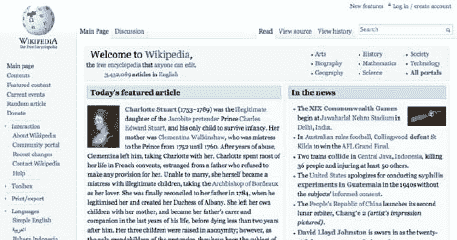

# 三、基本原则

在使用 CSS 的时候，有一些基本的概念是开发人员应该注意和理解的，但是这些概念往往会被忽视甚至忽略。深入了解这些概念将意味着创建的 CSS 将得到更好的规划，错误将更容易避免，并且样式表通常会更简单、更干净、更容易维护。

CSS 通常被认为是一种理解起来相对简单的语言(它的语法很直观，很容易理解，即使对于从未写过一行 CSS 的人来说也是如此)。但是 CSS 作者需要一些经验来编写复杂的 CSS 布局，在不太兼容的浏览器中不会崩溃，同时保持他们的样式表干净和灵活。

在一个理想的世界中，我们网站的所有访问者都将使用最新的浏览器，我们不需要在我们的 CSS 文档中加入黑客、条件注释和变通方法:一切都可以在任何地方工作。我们并不是生活在一个理想的世界中，因为我们必须处理各种各样的浏览器不一致，我们的 CSS 文档最终看起来与我们希望的相差甚远。处理高流量网站的一个结果是，我们的访问者将使用各种各样的浏览器，从最新的测试版模糊浏览器到旧版本的 IE 浏览器。

 **注意:**你的流量越大，来自更不知名设备的访问的可能性就越大。你的公司应该在内部讨论哪些是你支持的，哪些是你不支持的，但重要的是要明白(例如)如果只有 0.5%的用户使用 IE 5，而你的网站每天收到 2000 万次点击，那么你的网站每天将收到来自使用 IE 5 的用户的 10 万次点击！这不是一个微不足道的数字，应该仔细考虑。

重要的是将指导方针付诸实践，包括如何最好地处理这些情况，并确保团队成员熟悉 CSS 的基本工作原理。采取这一步骤可能意味着新员工需要更长的适应期，但你应该认识到，指南永远不会涵盖所有可能的情况或浏览器错误，编码人员每天都要做出决定，这些决定将影响网站的有效性和性能。你的团队中的这种额外的培训和知识只能是一件积极的事情，使团队能够更好地理解 CSS 和编写好的代码，并且它将在光环效应中向外共享。

在本章中，您将:

*   了解重要的 CSS 概念，如级联、重要性、继承和特异性
*   理解编码的重要性以及如何实现本地化
*   了解如何处理特定于浏览器的 CSS
*   了解对付黑客的最佳方法
*   发现服务器端用户代理检测是否是一个好主意
*   看看浏览器不一致的例子，以及如何最好地处理它们

### 级联:起源、重要性和继承

了解级联如何工作是构建灵活和健壮的样式表的基础。如果忽略这些基本概念，或者只是在需要的时候临时添加一些规则，而不考虑它们之间的相互影响，那么你的网站的 CSS 就会因为每一次添加而成倍地复杂化。您将生成更大的文件，增加冗余，并使开发人员更难理解或进一步扩充它们。对 CSS 工作原理的深刻理解将使你和你的团队能够做出最好的决定，以使样式表更容易维护。

“层叠”的概念是 CSS 的核心。正是这个过程决定了哪些 CSS 规则将影响哪些元素，并赋予每个规则特定的权重和优先级。当所有因素都考虑在内时，在多个规则适用于特定元素的情况下，权重较大的规则将优先于权重较小的规则。

为了给规则赋予权重，级联依赖于三个方面:重要性、继承性和特异性。如果针对同一元素的两个或多个规则最终具有相同的权重，则最后一个规则将胜出。这同样适用于在同一规则中重复的属性(最后定义的属性值是应用的属性值)。

在这一部分，我们将讨论起源、重要性和继承；而特异性足够复杂，以至于后来有了自己独立的部分。

#### 起源和重要性

来自三个不同来源的样式表可以影响网页:

*   用户代理样式表
*   用户样式表
*   创作样式表

*用户代理样式表*(见图 3-1 )是那些默认出现在用户代理(用户用来访问我们代码的设备，通常是网络浏览器)中的样式表。即使当我们打开一个没有链接 CSS 文件的 HTML 文件时，它看起来也是没有样式的；实际上，它是由用户代理样式表进行样式化的。这个样式表为未访问的链接添加典型的蓝色，为已访问的链接添加紫色，为不同类型的标题添加不同的字体大小，等等。

***图 3-1。**bbc.co.uk 的主页，仅应用了用户代理样式表(在本例中是 Firefox 的样式表)。*

例如，用户样式表(见图 3-2 )可以是基于用户浏览器偏好应用于页面的样式表，如更大的字体或特定的字体系列，以便于阅读。

***图 3-2。**应用了用户样式表的维基百科首页:在这种情况下，用户样式表确保任何网站上的文本都不会小于 18px。*

用户样式表也可以是用户创建的 CSS 文件，浏览器将读取这些文件以更改特定站点的设计或细节。在这种情况下，外部文件通常存储在用户的机器上，并由浏览器引用。

默认情况下，作者样式表覆盖用户样式表，用户样式表又覆盖用户代理样式表。但是，有一种方法可以让用户样式表更有分量，并覆盖作者声明。这可以通过使用`!important`声明来实现，它确保了无论发生什么，用户总是对页面如何显示有最终决定权。

`!important`声明是在逐个属性的基础上使用的，它可以应用于内联、嵌入或外部样式表:

`p {
   color: black !important;
}
p {
   color: red;
}`

在前面的例子中，因为我们使用了`!important`声明，所以第一个规则将是应用于`p`元素的规则，即使第二个规则在后面出现并且具有相同的特异性(关于如何计算选择器特异性的更多细节，请参见下一节)。 1

在作者样式表中应该小心使用，如果可能的话应该避免使用，因为它会干扰规则的特殊性，为过于具体和复杂的 CSS 让路。

让我们看看下面的例子，用户在网站上隐藏了一个广告栏:

`#myfavoritesite .advertbanner {
   display: none !important;
}`

带有`!important`声明的用户样式表将总是覆盖来自任何其他来源的样式表，所以在这种情况下，用户可以确定广告栏不会被显示。

为了让用户更容易将自己的 CSS 规则注入特定的网站，一些开发人员在他们的页面的`body`元素中添加了一个 ID，甚至更进一步，既添加了站点范围的 ID，又添加了逐页类，这样用户就可以在需要时轻松地指向特定的页面。

作者样式表是由 CSS 作者创建的，在服务器返回的实际页面中提供。它们可以内嵌在标记中(使用 HTML style 属性)，嵌入在页面中(使用 HTML style 标记)，或者外部链接(使用 HTML link 标记或@import 规则)。

在混合添加了`!important`之后，我们剩下以下不同类型的声明，从最重要到最不重要:

*   标记为重要的用户声明
*   标记为重要的作者声明
*   作者声明
*   用户声明
*   用户代理声明

#### 继承

W3C 对继承的定义指出“继承是将属性值从父元素传播到其子元素的一种方式”(`[www.w3.org/TR/css3-cascade/](http://www.w3.org/TR/css3-cascade/)`)。

这意味着一些 CSS 属性在默认情况下(或者可以被强制)可以被子元素继承。

__________

1 在这个例子中，我们在`!important`前加了一个空格，以便于阅读。空格是不必要的，这是你在缩小文件或编写 CSS 格式指南时需要知道的。

让我们来看一个典型的场景:

`body {
   color: #111111;
   padding: 20px;
}`

在前面的例子中，`color`属性将被`body`元素的子元素所继承，因此标题、段落、列表和其他文本都将是深灰色(“`#111111`”)。然而，`padding`属性不会被继承；如果我们将一个`div`或一个段落放在`body`元素中，它们将不会继承 20 像素的填充。

这些是遗传如何工作的例子。在第一种情况下，颜色，它影响父元素的子元素是有意义的；除了生成大得多的文件之外，还必须声明父元素中每个元素的颜色，这将是令人厌烦和低效的。另一方面，如果它的子元素继承了 20 个像素的填充，那么重写这些填充也是令人厌烦的。

W3C 在其网站上有一个所有 CSS2.1 属性的列表，`[www.w3.org/TR/CSS21/propidx.html](http://www.w3.org/TR/CSS21/propidx.html)`，其中说明了它们是否被默认继承，初始值(默认值)和可能值，以及其他特征。

继承对于默认继承的元素是有意义的，但是也可以通过使用“inherit”值对不继承的元素进行强制继承。

假设您希望`aside`父元素中的`section`元素继承其`margin`值:

`aside {
   margin: 10px;
}
aside section {
   margin: inherit;
}`

使用这个 CSS，`aside`元素中的每个`section`元素现在将有 10 个像素的边距。

W3C 规范中解释了用户代理处理继承的方式:

属性的最终值是一个四步计算的结果:该值通过规范确定(“指定值”)，然后解析为用于继承的值(“计算值”)，然后在必要时转换为绝对值(“使用值”)，最后根据当地环境的限制进行转换(“实际值”)“(`[www.w3.org/TR/CSS2/cascade.html#value-stages](http://www.w3.org/TR/CSS2/cascade.html#value-stages)`)。

根据规范，级联按以下顺序查找四个值，以确定属性的最终值:

1.  *指定值*:用户代理确定属性的值是来自样式表，还是继承而来，还是应该取其初始值(即属性规范中规定的值)。
2.  *计算值*:指定的值被解析为计算值，即使某个属性不适用也存在。在这个阶段，不必对文档进行概述。
3.  *已用值*:已用值取计算值，并解析任何依赖关系，这些依赖关系只能在绘制文档后才能计算(例如，百分比)。
4.  *实际值*:这是在应用任何近似值(例如，将小数值四舍五入为整数)后，用于最终渲染的值。

计算继承时使用的值是计算值。即使 CSS 中没有声明该属性，该值也存在，这使得即使父元素没有指定该属性，也可以强制继承。

让我们看看下面的例子:

HTML:

`<body>
   
To find what you are looking for visit <a href="http://google.com">Google</a>.

</body>`

CSS:

`body {
   font-family: Arial, sans-serif;
   font-size: 12px;
}
a:link {
   color: inherit;
}`

如果我们没有为 link 元素(“a”)指定颜色，我们将会从浏览器(用户代理)样式表中看到默认的蓝色。虽然我们没有为`body`元素指定文本颜色，但是当使用未访问链接选择器的颜色属性的“inherit”值时(“a:link”)，它将使用父元素的计算值。在这种情况下，这是初始值，其颜色属性取决于用户代理(如 W3C 的属性规范中所述)，但往往是`#000000`(黑色)。

“inherit”值并不常用，但是在上面的例子中，当子属性依赖于父属性时，创建依赖关系比显式声明一个值更容易，这种情况下它会很有帮助。

“inherit”值在实践中很少使用的原因之一是，除了“direction”和“visibility”属性之外，它不被版本 8 之前的 IE 版本支持。当使用它的优势(例如，当它增加了更大的灵活性，使 CSS 更新更快，更不容易出错)取代了使用它时可能出现的任何呈现差异时，应该使用它。

与“inherit”关键字相对的是 CSS3 中引入的“initial”关键字。此值允许您通过指定该属性的初始值(如属性规范中所述)而不是继承的值来取消继承。然而，只有 Firefox(使用`-moz-initial`关键字)和 WebKit 支持这个属性。

#### 继承和万能选择器

通用选择器(" * ")匹配文档树中的任何单个元素(注意这里使用了单词 *single* ，因为它不会匹配两个或更多元素的组合，或者零个元素)。如果使用不当，它会破坏继承性，很容易将样式表变成继承性和特异性的噩梦。

举以下例子:

HTML:

`<section>
   <header>
      <hgroup>
         <h1>Main title</h1>
         <h2>Secondary <i>title</i></h2>
      </hgroup>
   </header>
        …
</section>`

CSS:

`section header * {
   color: red;
}
section header h2 {
   color: black;
}`

第一个 CSS 规则包括通用选择器，它针对的是`header`元素中的所有元素，无论是直接的子元素、孙元素还是更深层次的元素。对于第二个 CSS 规则，预期的行为是`h2`中的任何元素都应该是黑色的。但是，如果我们在`h2`中有另一个元素，会发生什么呢？因为最初的规则是针对 header 中的任何元素，所以它将与下面的语句相同:

`section header h2 i {
   color: red;
}`

因为这个选择器比“section header h2”更具体，所以最终结果会将单词“Secondary”呈现为黑色，而将“title”呈现为红色(参见图 3-3 )。

***图 3-3。**使用通用选择器时继承被破坏*

虽然，起初，在这种情况下使用 CSS 通用选择器似乎是确保每个元素都具有所需颜色的最安全的选择，节省了宝贵的代码行，但这并不是健壮 CSS 的一个例子。相反，它是一个例子，说明破坏继承会导致不必要的复杂、不可预测和冗长的样式表——这正是我们在一个高流量网站中想要避免的，在这个网站中，许多人可能在处理许多文件。

### 特异性

在使用 CSS 时，需要仔细考虑和计划特殊性，在处理频繁覆盖和导入样式表的大型 CSS 文件时，这一点更为真实，因为在高流量网站中往往会发生这种情况。

使用更通用的选择器开始开发 CSS 文件是一个很好的经验法则，在适当的时候增加特异性。反过来工作要困难得多，并且总是会导致无法重用的过于具体的选择器，以及不必要的冗长和不灵活的样式表。

依赖于选择器的顺序会使你创建的样式表更加脆弱(这个主题在第四章中有进一步的阐述)并且会导致不必要的冗余。当您需要覆盖一个规则时，您将在文件中创建一个新的规则，这将发生几次，直到您一次又一次地重复同样的事情。如果由于某种原因改变了顺序，您希望应用于元素的属性(过去是最后应用的)将不再被应用，因为它们依赖于选择器的顺序。依赖特定性而不是选择器的顺序将使样式表更容易编辑、维护和重构，并且更健壮。

选择器的特殊性也会对网站的性能产生影响，因为选择器的某些部分是从右到左进行非直观评估的，而更具体/复杂的选择器在查询 DOM(文档对象模型)时会遇到更多的问题。你可以在第八章中读到更多这方面的内容。

无论你是否需要在更深的层次上使用高度特定的规则，这最终都是你的决定，也是你需要你的 CSS 有多模块化和灵活的副产品，但是在你的团队计划样式表的方式中，特定性应该是一个基本的考虑。

#### 计算特异性

在为 CSS 规则分配权重时，cascade 将首先根据它们的重要性和来源对它们进行排序(如前一节所示)。如果规则具有相同的重要性和来源，那么它们将根据其具体性来排列优先级:更具体的选择器将覆盖不太具体的选择器。最后，如果两个选择器具有相同的来源、重要性和特异性，样式表中后面的那个将优先于前面的那个。这也适用于单个属性，因此如果在同一个规则中多次声明同一个属性，则最后一个声明将覆盖之前的声明。

因为导入的样式表(使用`@import`声明)必须在其他规则之前指定，所以当 CSS 文件的其余部分中有其他具有相同权重的未导入规则时，导入的规则将被覆盖(由于选择器的顺序，它们的优先级较低)。

为了计算特异性，根据 W3C 规范(`[www.w3.org/TR/css3-selectors/#specificity](http://www.w3.org/TR/css3-selectors/#specificity)`)，我们使用重要性递减的四种数字表示法(a、b、c 和 d ),其中

*   如果声明在 style 属性内，则等于 1；0 如果不是
*   b 等于 ID 选择器的数量
*   c 等于属性选择器、类和伪类的数量
*   d 等于元素名和伪元素的数量

非 CSS 表示标记，比如`font`属性，将被赋予 0 的特性。

基于此列表，以下选择器的特异性为 1，0，0，0 (a=1，b=0，c=0，d=0):

`<section style="padding-bottom: 10px;">`

因为是内联 CSS，“a”等于 1，其余数字等于 0。请记住，即使链接到而不是内联的规则中有 10 个 ID 选择器(因此具有 0，10，0，0 的特异性)，它的优先级仍然低于上面的选择器——特异性在其计算中不使用十进制(或十进制)系统，而是使用无限进制:如果“a”等于 1，规则将始终优先于它等于 0 的规则。

这个更复杂的选择器将具有 0，0，1，3 (a=0，b=0，c=1，d=3)的特异性:

`article section h1.title {
   …
}`

由于不是内联的，“a”等于 0，“b”等于 0，因为没有 id，“c”等于 1，因为它有一个类选择器，“d”等于 3，因为它有三个元素选择器。

根据所提供的列表计算特异性似乎令人望而生畏，但事实是，根据一些经验，很容易看到一个选择器，并判断它是否比另一个选择器更具体或更不具体(也许它有一个或两个 ID 选择器或其他类似的明显提示)。在编写 CSS 时，您应该注意不要在不必要的地方创建高度特定的选择器，每当出现更棘手的情况时，Firebug 或 Safari Web Inspector 等工具会帮助您理解特定性是如何应用的，它们会按特定性的顺序向您显示规则(更特定的规则在顶部)，并删除被更特定的规则覆盖的属性。你可以在第十章中读到更多关于这些的内容。不过，有两件重要的事情需要记住:内联 CSS 比嵌入或链接 CSS 具有更高的优先级，一个 ID 选择器将胜过任何数量的类、属性或元素选择器。

#### 该！重要声明

在速记属性上使用`!important`声明等同于将每个子属性重新声明为重要属性(即使这意味着它们被恢复到它们的初始(缺省)值)。

例如，假设我们有以下选择器:

`h1 {
   font-family: Georgia, serif;
   font-size: 18px;
   font-style: italic;
}`

稍后在样式表中我们声明如下:

`h1 {
   font: 18px Arial, sans-serif !important;
}`

结果将与以下内容相同:

`h1 {
   font-style: normal !important;
   font-variant: normal !important;
   font-weight: normal !important;
   font-size: 18px !important;` `   line-height: normal !important;
   font-family: Arial, sans-serif !important;
}`

发生这种情况是因为没有在`!important`声明中明确定义的属性(在这种情况下，`font-style`、`font-variant`、`font-weight`和`line-height`)被恢复到它们的初始值(在属性的规范中指明)，即使它们是在一个不太明确的规则中声明的(比如在这种情况下的`font-style: italic`)。

#### 命名空间和特异性

在某些情况下，高度特定的选择器是必要的。例如，当创建要在各种页面、子网站、小型网站甚至第三方网站上使用的小部件或代码片段时，通常的做法是命名代码的这一部分，这在 CSS 中基本上意味着使用特定的类、ID 或类或 ID 的前缀来隔离它(我们在第二章中更详细地讨论了命名空间)。为了使页面具有不同的样式，命名整个页面也很常见；在这种情况下，我们将向 body 元素添加一个 ID 或类，例如:

`<body class="home">`

重要的是要认识到，虽然这是为不同页面或页面上的不同部分创建不同样式的一种常见且简单的方法，但它会影响特殊性。当在我们的 CSS 中定位这些页面或代码片段时，我们必须为规则引入一个类或一个 ID，增加它的特异性，从而使它更难被覆盖。例如，要使页面中我们指定为“home”类的`h2`标题比站点中的其他标题大，我们可以使用以下规则:

`h2 {
   font-size: 24px;
}
.home h2 {
   font-size: 36px;
}`

在前面的示例中，即使没有类，规则也将被应用，因为规则将具有相同的特性，但将在以后声明。然而，这将依赖于顺序，这将适得其反，因为如果规则的顺序被改变，它将失败(你可以在第四章中了解更多)。

如果出于某种原因，我们需要在主页中再次覆盖此设置，例如，我们需要向特定标题添加一个类别，并创建一个更具体的规则:

`.home h2.highlight {
   font-size: 30px;
}`

这会产生一个过于具体的规则的雪球，不可避免地导致不必要的复杂 CSS。这里的诀窍是仔细计划这些情况，这些情况会更频繁地发生，因为整个网站需要更多的某些元素和设计的变化，如果没有设计库，或者有但不经常更新，情况会更糟(你可以在第五章中阅读更多关于设计库和保持设计一致性的内容)。你应该准备一个适应性强的样式表，以及一套关于特定开发人员如何应对特殊情况的指导方针——不断重写高度特定的选择器不利于创建灵活的 CSS，但是当类和 id 是更高效和健壮的解决方案时，避免使用它们也不是高流量网站的选择。

#### 使用你的工具

使用诸如 Firebug(见图 3-4 )或 Safari 的 Web Inspector(见图 3-5 )这样的工具，可以更容易地理解哪些属性优先，哪些属性优先。这些工具还可以显示用户代理样式表和计算值，即使它们没有在 CSS 中声明。

***图 3-4。**使用火狐的 Firebug 插件深入查看网站的标记和 CSS*

***图 3-5。** Safari 的网页检查器。这些工具有助于了解级联是如何工作的。*

这并不意味着理解级联是如何工作的不重要，但它使调试过程不那么痛苦。你可以在第十章中了解更多信息。

### 编码

虽然 CSS 很少出现问题，但值得一提的是，字符编码可能会导致 CSS 文件(和其他文件)出现问题，当问题出现时，它们可能是一个非常现实的问题，并且可能很难隔离。通常，文件将以默认的区域设置编码保存在您的计算机上，这是 ISO-8859-1，适用于使用拉丁字符集的西方国家。这个字符集不支持许多字符，如重音字符或不常见的符号。实际上，只有三个地方会出现问题:

*   使用添加内容的伪选择器，如`:after`或`:before`
*   引用路径中包含异常字符的图像或文件
*   可能包含异常字符的注释

尽管使用 Unicode 字符集会(非常小地)增加文件大小，但坚持使用 UTF-8 可以避免令人痛苦的兼容性问题，有助于提高文档的可读性，并避免本地化和转义字符的问题。如果您可能要转义许多字符，这实际上会节省字符和文件大小。关于为什么应该避免逃逸的更多信息，请参考`[www.w3.org/International/questions/qa-escapes](http://www.w3.org/International/questions/qa-escapes)`。

请仔细考虑这一点，并将其包含在 CSS 格式指南中。如果您可能会使用默认字符集中不包含的字符，我们建议您使用 UTF-8。

### 本地化

如果您的网站需要在多个不同的国家工作，本地化可能会成为一个问题。对于由内容管理系统(CMS)或其他方式生成的动态内容，您的文本可能具有不可预测的大小。特别是德语和汉语是非常冗长的语言。有两种方法可以解决这个问题。

首先，你可以把每一个容器都做成流体的，并根据其内容改变大小。在某些情况下，这可能是可以实现的，但在许多情况下，这可能变得不切实际。

其次，你可以给你的 CSS 一些特定国家和语言组合的钩子。您可以使用服务器端代码在您的主样式表之后为这些特定的国家和语言包含一个额外的样式表，这样您就可以为它们实现覆盖，如下所示:

`<link rel="stylesheet" href="css/en-gb/overrides.css" />`

在本例中，我们使用了具有特定命名约定的子文件夹。我们使用了 ISO 639-1 标准的语言代码——“en”——简单明了；然后是连字符；最后是国家代码的 ISO 3166-1 alpha-2 标准(`[`en.wikipedia.org/wiki/ISO_3166-1_alpha-2`](http://en.wikipedia.org/wiki/ISO_3166-1_alpha-2)`)—“GB”。 2

这种方法会导致性能下降，因为有一个额外的请求，但它也确保了我们不会试图在一个文件中满足所有国家和语言的需求，这将是低效的。另一个缺点是我们的规则是不同的，我们必须维护许多文件；当修改我们主要语言的 CSS 时，我们可能会忘记修改其他国家和语言的相应规则。

__________

虽然 ISO 3166-1 的所有内容都是大写的，但是我们把所有内容都用小写的，这样有助于压缩和保持简单。

针对这些语言的另一种方法是向`html`或`body`标签添加类，如下所示:

`<html class="en-gb">`

这使得以这种语言为特定目标的页面变得容易，并且将我们所有的 CSS 保存在一个地方，但是不利的一面是会产生非常冗长和低效的 CSS，因为我们可能会向永远不会使用它的用户提供大量的代码。出于这个原因，我们推荐第一种方法，在主样式表中使用注释来提醒开发人员其他文件包含对相同规则的引用。

另一个本地化考虑是一些语言从右向左流动(RTL)，而不是从左向右(LTR)。对于这些，您几乎肯定需要使用不同的模板，以便您的标记处于正确的顺序，然后您可以使用上面详细介绍的方法来确保一切看起来和读起来都像它应该的那样。

 **提示:**使用 accept-language HTTP 头，您通常可以检测用户设备的语言，并以正确的语言返回他们的内容，这是一种他们会欣赏的好方法。您也可以根据他们的 IP 地址来检测他们的位置，但这通常是不准确的。HTML5 ( `[`dev.w3.org/geo/api/spec-source.html`](http://dev.w3.org/geo/api/spec-source.html)`)中的地理定位 API 要精确得多，但还没有得到很好的支持。

如前所述，CSS 和标记文件坚持使用 UTF-8 可以省去很多麻烦，但是您可能需要根据自己的需求为特定国家实现其他字符集。

### 特定于浏览器的 CSS

在大规模和高流量的网站上工作通常意味着必须迎合各种各样的浏览器。不是每个人都会使用最新版本的最现代的浏览器，而且通常的决定是，用户不应该因为可能不是他们的错的障碍而受到惩罚。

根据组织选择支持的浏览器(参见第六章中关于分级浏览器支持的更多内容)，几乎总是需要将特定的 CSS 定位于不完全兼容的浏览器，如 IE 7 或更低版本。

有各种方法可以实现这一点。根据此类浏览器和网站设计本身所需的支持级别，主 CSS 文件和特定于浏览器的文件之间的差异可能会有所不同，从对几个属性的少量调整到许多应该拥有自己的单独 CSS 文件的选择器。

意见不一。独立样式表的支持者提出这样的论点，即这将有助于保持主文件的有效性和免受黑客攻击，使得以后删除特定于浏览器的文件也更容易。其他人会说更新两个或更多不同的样式表是不实际的，验证应该只是一个工具，而不是目标。有些人甚至会争辩说，因为当我们处理特定于浏览器的 CSS 时，我们经常求助于黑客——而黑客是“丑陋的”——我们样式表上的这些“污点”不应该被隔离，而是非常明显和容易发现的。拥有更多的 CSS 文件对性能有着的影响，你可以在第八章中读到。采取哪种立场由你的公司决定，因为两者都有自己的好处。

如果您有少量针对(例如)IE 6 和 ie7 的特定修复，通常最有效的方法是在默认属性声明旁边包含针对这些浏览器的 hacks，并带有解释其用法的注释。将属性和它们的 hack 副本放在一起，很明显，当更新一个时，应该更新另一个。使用外部样式表来应用小的更改(即使对少数人而言)会对这些浏览器的用户造成大的性能影响，并且很少是解决这个问题的最佳方式。然而，如果需要使用大量的黑客攻击，并且你所针对的浏览器给你的网站带来的流量很小，或者对你网站的目的来说不重要，那么为了给你的主要用户带来更好的体验而惩罚这些用户可能更好。

您应该密切关注您的站点可用的报告工具，并非常清楚与您最相关的浏览器和设备。记住这些数字，您应该用您通常的 CSS 和单独的样式表中的 hacks 来测量 HTTP 性能，以便很好地了解每种方法的优缺点。有些人主张在页面中的条件注释内嵌入非常小的代码，但是我们不推荐这种方法，因为它鼓励不同的代码(在许多不同的地方有相似的代码),并且取消了对单个文件缓存的控制。

如果 CSS 文件中的 hacks 数量占总代码的 20%以上(在缩小、连接等之后)或超过 50 KB，出于性能和带宽的考虑，将代码移到外部文件中可能是可行的。如果使用单独的样式表，那么将它们连接起来是非常重要的，这样用户可以得到尽可能少的额外文件。

正如我们以前多次说过的，最重要的是进行对话，做出决定，并始终如一地执行决定。但是，还有其他方法可以将 CSS 应用于特定的浏览器和设备，如下面的内容所讨论的。

#### 黑客和过滤器

有几种方法可以使 CSS 属性和选择器仅对一个(或多个)浏览器可见，也可以对某些浏览器隐藏它们。

我们不会详尽地列出这些技术，但我们会提到一些最常用的技术，这样您就可以了解它们的样子和用途。从维基百科(`[`en.wikipedia.org/wiki/CSS_filter`](http://en.wikipedia.org/wiki/CSS_filter)`)开始，网上有几个资源，提供了这些黑客攻击的完整目录，因为它们现在已经众所周知，并有完整的记录。

##### 盒子模型黑客

被公认为有史以来第一个 CSS hack，box model hack 用于为 IE 5 和 5.5 提供不同的措施，因为它们的盒子模型是坏的(因此得名)。我们将在本章中进一步解释 IE 盒子模型。由于浏览器解析错误，仅处理第一个宽度(来自以下示例)。兼容的浏览器将理解这两个宽度值，用第二个值覆盖第一个值:

`.box {
   width: 600px;
   voice-family: "\"}\"";
   voice-family: inherit;
   width: 560px;
}` `html>body .box {
   width: 560px;
}`

使用 voice-family 属性不会影响屏幕样式表。没有解析错误的浏览器会将第一个`voice-family`值读取为“}”，而有解析错误的浏览器会将整个规则解释为以包含在`voice-family`值中的右括号结束，忽略后面的所有内容。第二个`voice-family`属性是这样的，万一名为“}”的文件确实存在，这个值可以被覆盖。第二个规则适用于同样会遇到解析错误，但是有正确的盒子模型的浏览器。IE 5 和 5.5 忽略它，因为这些浏览器不理解子选择器(用“>”表示)。

##### 下划线黑客

我们可以通过在属性名前添加下划线来为 IE 及以下版本提供不同的属性值，如下所示:

`#logo {
   background-image: url(logo.png);
   _background-image: url(logo.gif);
}`

因为以非转义下划线开头的属性是无效的 CSS，所以其他浏览器会忽略第二个属性。另一方面，IE 6(及更低版本)处理下划线的方式是忽略它，并像平常一样解析属性，用第二个值替换第一个值。

##### 明星钻营

star hack 的目标是 IE 7 及以下版本。原来 IE 6 对待星号的方式和对待下划线完全一样。因为对下划线的错误处理引起了如此多的关注，微软在 IE 7 中让浏览器正确处理了下划线。然而，它没有修复星号。通过在属性名前面加一个星号，它将被所有其他浏览器忽略，其工作方式几乎与前面的攻击(下划线攻击)相同:

`section {
   width: 860px;
   *width: 960px;
}`

这种不一致性使得 IE6 和 IE7 可以分别作为目标，如下所示:

`section {
   width: 860px; /* all browsers */
   ***width: 960px; /** IE7 and below */
   _**width: 1060px; /** IE6 and below */
}`

因为最后一个规则总是优先，对于解释以下划线开头的属性的浏览器(IE 6 和更低版本),前面的属性被覆盖。

##### 明星 Html Hack，IE4-6

因为 IE 4 到 6 错误地在 DOM 中根`html`元素之前包含了一个不可见的神秘元素，通过使用 star html ("* html") hack，您可以在一个规则中针对这些特定的浏览器:

`* html h1 { background-image: url(logo.gif); }`

因为在任何其他浏览器中，`html`元素之前不存在任何元素，所以所有其他浏览器都将忽略整个选择器及其所有属性。

##### 子选择器破解

IE 6 及更老版本不理解子选择器(用“>”表示)。因此，我们可以用它来隐藏这些浏览器的规则。例如，下面代码块中的第二条规则，我们将透明的 PNG 背景应用到一个`div`(IE 6 不支持)，ie6 不会读取它，使它使用前面提到的普通背景色:

`div {
 background-color: #dd4814;
}
body > div {
 background-image: url(orange.png) no-repeat;
}`

##### 被评论的反斜杠 Hack

IE for Mac 有自己的特点(尽管它已经不再被普遍使用)。这个浏览器选择(违反规范)让你用反斜杠转义注释中的星号。我们可以利用这个事实，因为这个浏览器不知道以某种方式编写的注释是关闭的，因此不会读取位于转义字符和普通注释之间的 CSS:

`/* IE for Mac doesn’t understand this comment is closed \*/
(anything between the comments won’t be read by IE for Mac)
/* IE for Mac will continue reading the CSS file after this comment */`

Mac IE 浏览器的上一次发布要追溯到 2003 年，微软在 2005 年就停止了对这款浏览器的支持，因此这款浏览器的流量不太可能成为问题。

##### 不可避免的灾祸

虽然我们不喜欢鼓励使用这些所谓的“过滤器”，但我们知道它们在某些情况下可能是有用的，并且由于时间或预算的限制，使用它们而不是花费数小时试图解决问题的根源可能是必要的。分离特定于浏览器的 CSS 的另一种方法是使用条件注释，这通常被认为是一种更干净的解决方案。我们将在本章后面讨论条件注释。

#### CSS 表达式

CSS 表达式(或*动态属性*)是在 IE 5 中引入的，直到版本 7(或 8 和 9，当在兼容模式下渲染时)都受支持。通过将 JavaScript 放在表达式中，我们可以根据环境或其他因素返回不同的结果。

连接两个字符串的简单 CSS 表达式(记住这是 JavaScript，因此语法不在本书的讨论范围之内)如下所示:

`aside {
   width: expression("320"+ "px");
}`

这与具有以下内容是一样的:

`aside {
   width: 320px;
}`

在下面的示例中，表达式检查正文宽度是否小于 1200 像素；如果是这样，宽度设置为“1200 像素”，如果不是，则设置为“自动”:

`#container{
   width: expression((document.body.clientWidth > 1200) ? "1200px" : "auto");
}`

CSS 表达式是资源密集型的，会严重影响网站的性能。雅虎！在其高性能网站规则系列中，将规则 7 列为“避免 CSS 表达式”，认为“它们不仅在页面呈现和调整大小时被评估，而且在页面滚动时，甚至在用户将鼠标移动到页面上时也被评估。”(`[`developer.yahoo.net/blog/archives/2007/07/high_performanc_6.html`](http://developer.yahoo.net/blog/archives/2007/07/high_performanc_6.html)`)。

有些表达式可能比其他表达式具有更强的性能，因此总是建议进行性能测试(与所有 JavaScript 一样)，因为在某些情况下，使用一个 CSS 表达式是处理浏览器不一致性的最快和最有效的解决方案。

CSS 表达式的另一个缺点是它们依赖于 JavaScript 来工作，这远非理想，因为我们实际上是在处理 CSS，并且用户可能禁用了 JavaScript。鉴于我们正在创建一个 JavaScript 依赖项，我们的建议是将它们转移到 JavaScript 中，使 CSS 远离 CSS 表达式，避免随之而来的性能损失。

很少有跨浏览器的情况实际上需要 JavaScript 来解决，像 CSS expressions 这样的事件驱动解决方案就像高速公路上的砖墙一样微妙。除非你有非常充分的理由使用它们，并且这是最后的手段，否则我们建议你不要这样做。

#### 供应商特定的扩展

特定于浏览器的 CSS 不仅仅意味着处理有缺陷的 IE 渲染和解决它的怪癖。它还可能包括使用特定于供应商的属性来创建更高级的效果，这些效果符合最新的 CSS 开发或者还不是任何规范的一部分。

例如，创建 CSS `border-radius`的语法需要为已经以实验(并且通常不完整)方式实现该属性的浏览器编写，使用其特定于供应商的版本以及官方规范:

`.box {
   -moz-border-radius:  4px
   -webkit-border-radius: 4px;
   border-radius: 4px;
}`

在这个例子中，我们基本上对同一件事重复了三次，以适应尽可能多的浏览器。我们已经包含了规范中最后提到的属性，所以当所有浏览器最终实现它时，它仍然可以工作，并且正确的符合标准的实现将覆盖特定于供应商的版本。 3

这会导致一个无效的 CSS 文件，因为特定于供应商的扩展仍然会被 CSS 验证器解析为错误(尽管有些人已经开始要求改变这种行为)。但是，请记住，浏览器制造商使用这些特定于供应商的扩展是标准做法，在 W3C 规范中有所预见，其中规定“以`‘-‘`或`‘_’`开头的属性名是为特定于供应商的扩展保留的”，并且它们“保证永远不会被任何当前或未来级别的 CSS 用于属性或关键字”(`[www.w3.org/TR/CSS21/syndata.html#vendor-keywords](http://www.w3.org/TR/CSS21/syndata.html#vendor-keywords)`)。供应商之间应该没有冲突，因为两个供应商不太可能选择相同的前缀。然而，这些实验性属性的实现有可能(并非不可能)在它们仍处于“测试”阶段时发生变化——如果您不想大吃一惊，那么了解 W3C CSS 工作组的最新消息是一个好主意。

下面是最常用的特定于供应商的前缀列表:

尽管这些属性是无效的、特定于供应商的 CSS，但它们不能被称为黑客或变通方法，它们是对可能成为最终规范一部分的属性的支持。将它们局限于自己单独的样式表可能会在寻求效率的过程中出现失误:当其中一个属性需要更改时，所有其他属性也需要更新——来回切换可能会令人生畏。同样，CSS 文件越多(因此 HTTP 请求越多)，性能受到的影响就越大。

__________

3 最新发布的浏览器如 Safari 或即将发布的 IE 9 支持`border-radius`而不需要厂商前缀，因此包含默认属性是永远不要忘记的重要一步。

4 由于 WebKit 最初是 KHTML 的分叉版本，所以它使用了用于 CSS 属性的`-khtml-`扩展，而`-apple-`扩展用于特定于 Apple 的功能。这些最终被合并到了`-webkit-`扩展中，尽管仍然有一些属性是 Safari 专用的，并且使用了`-apple-`扩展(例如，`-apple-line-clamp`)。Konqueror 浏览器仍然使用`-khtml-`扩展。

其他解决方案，例如将这些特定于供应商的属性放在主 CSS 文件中的一个单独的部分，使它们更容易找到(因此，在需要时更容易删除)，可能是一个更好的节省劳动力的解决方案，尽管它会导致重复的选择器，效率更低，更难管理。

#### 媒体查询

我们鼓励使用功能检测，而不是使用黑客或其他方法只为某些浏览器提供特定的 CSS，因为这是一种面向未来的明智方法，不依赖于错误或容易被覆盖和欺骗的属性。媒体查询允许创建依赖于用来查看网站的设备的功能或特征的 CSS。例如，您可以编写只在单色屏幕、小视窗、打印机甚至两种或多种功能组合的设备上显示的 CSS。媒体查询不针对特定的浏览器，而是针对显示网站的设备的功能。

媒体查询有三种不同的应用方式:

*   直接在样式表中
*   从样式表中导入
*   在 HTML 文档的`head`中使用链接标签

下面是一个直接嵌入到样式表中的媒体查询示例，与 CSS 的其余部分放在一起:

`@media screen and (max-width: 320px) {
   aside {
      float: none;
   }
}`

您可以使用@import 规则从样式表导入不同的文件:

`@import url(320.css) screen and (max-width: 320px);`

最后，在 HTML 文档的`head`内的`link`标记中插入一个媒体查询:

`<link rel="stylesheet" media="screen and (max-width: 320px)" href="320.css" />`

当创建网站的移动版本时，媒体查询经常被引用，但是除了纯粹的设计，还有其他因素你应该考虑。使用媒体查询不一定会阻止图像被下载。 5 事实上，在使用`link`标签时，无论媒体属性如何，样式表都会被下载，尽管它们可能不会被应用。虽然媒体查询可以应用于创建网站的快速移动版本，但在处理高流量网站时，性能和可访问性考虑因素(许多移动设备仍然不支持媒体查询)可能(也应该)位于列表的顶部，并可能在很大程度上使它们的使用无效。我们将在第七章中详细讨论媒体查询。

__________

5 WebKit 下载图片设置为`display:none`；火狐和 Opera 没有。这适用于桌面和移动设备。它更适用于媒体查询，因为如果媒体查询适用，则不下载背景图像，但如果媒体查询覆盖已在通用样式表中应用的另一个背景图像，则不下载背景图像—在这种情况下，两者都下载。基本上，要知道通过 CSS 隐藏东西并不意味着浏览器不会下载它们。

#### 条件注释

条件注释是在 IE 5 中引入的，是特殊格式的 HTML 注释，允许针对特定版本的微软浏览器。它们可以被包装在另一个 HTML 块中，并有效地隐藏起来，不让非目标浏览器看到。

条件注释可用于针对 IE 的一个特定版本:

`<!--[if IE 8]>
        <link rel="stylesheet" href="ie8.css" />
<![endif]-->`

在这种情况下，ie8.css 文件只会被 ie8 请求。

它可用于定位低于或高于特定版本号的版本:

`<!--[if lt IE 7]>
        <link rel="stylesheet" href="ie6.css" />
<![endif]-->

<!--[if gt IE 7]>
        <link rel="stylesheet" href="ie8.css" />
<![endif]-->`

在第一个例子中，我们的目标是从 5 到 6 的 IE 版本(`lt`代表“小于”)。在第二个例子中，我们使用了`gt`操作符(“大于”)，目标是高于 7 的版本，但不包括 7(在撰写本文时，将包括 IE 8 和 9)。

它还可以用于比特定版本更低或更高的目标版本，但包括指定的版本，如下所示:

`<!--[if lte IE 6]>
        <link rel="stylesheet" href="ie6.css" />
<![endif]-->

<!--[if gte IE 7]>
        <link rel="stylesheet" href="ie7.css" />
<![endif]-->`

第一个例子针对的是从 5 到 6 的 IE 版本，使用了`lte`操作符(“小于或等于”)。第二个目标是 IE 7 以上的所有版本，包括 IE 7 ( `gte`代表“大于或等于”)。

也可以使用 NOT 运算符("！"如在许多编程语言中使用的)，以便对一个或多个浏览器版本隐藏注释。以下条件注释将被 IE 5 忽略，但不会被其他版本的 IE 忽略:

`<!--[if !(IE 5)]>
        <link rel="stylesheet" href="advanced.css" />
<![endif]-->`

虽然条件注释并不常见，但随着表达式的使用，它会变得更加复杂，比如 AND 运算符("&")。这里有一个例子:

`<!--[if (gte IE 5)&(lt IE 8)]>
        <link rel="stylesheet" href="hacks.css" />
<![endif]-->`

这里我们针对的是高于并包含 IE 5 和低于 IE 8 的 IE 版本，所以版本 5 到 7 包括在内。我们也可以在这些表达式中使用 OR 运算符(" | ")。

条件注释有时会被列在其他黑客中，但与它们不同的是，它们不依赖于浏览器漏洞来工作，这使得它们使用起来更安全，更经得起未来的考验。它们提供了一种更干净的方式来将特定于浏览器的 CSS 从基本或更高级的样式表中分离出来，如果对旧浏览器的支持下降，则更容易删除这些样式表。

为了减少 HTTP 请求，包含在条件注释中链接的文件中的 CSS 可以直接嵌入到 HTML 文档的头部，如下所示:

`<!--[if lte IE 6]>
        
<![endif]-->`

这比链接到每个浏览器的外部文件更有优势，因为每个浏览器都需要单独的样式表，尤其是在只需要几个规则的情况下。这种做法可能会妨碍这段代码的可维护性，但是如果在页面性能方面的优势更大，这是一个值得考虑的解决方案，并且一些高流量网站已经在使用它了。每个请求都有非常真实的性能含义。

在文本节点或属性中不能使用条件注释。例如，这是行不通的:

``

这也不会:

`
ie6<![endif]-->">
   …

`

针对除 IE 以外的浏览器，即隐藏所有 IE 浏览器的内容，有必要使用“下层显示的注释”,以便条件注释仍可被 IE 读取，但不会在其他浏览器中注释掉内容。这看起来像这样:

`<!--[if !(IE)]><!-->
        
<!--<![endif]-->`

这包括围绕条件注释的两个部分的完整注释。使用这种方法，我们可以创建仍然有效的标记。

##### html 元素中的条件注释

为每个浏览器使用单独的样式表会影响 CSS 的可维护性，也会使调试变得不那么简单(如果某个特定的属性或选择器不在主样式表中，您可能不会立即意识到它们正在影响有问题的元素)。将 CSS 直接放在页面的样式标签中可能会节省 HTTP 请求，但是它会导致“关注点分离”(`[`en.wikipedia.org/wiki/Separation_of_concerns`](http://en.wikipedia.org/wiki/Separation_of_concerns)`)的问题——我们的表示逻辑(CSS)不应该存在于我们的内容(HTML)中。考虑到这一点，前端开发人员保罗·爱尔兰提出了一个非常简单但实用的解决方案，它使用了条件注释和页面的`html`(或`body`)元素。

使用这种方法，我们有条件地向`html`标签添加一个类，这取决于使用哪个浏览器来查看页面:

`<!--[if lt IE 7 ]><html class="ie6"><![endif]-->
<!--[if IE 7 ]><html class="ie7"><![endif]-->
<!--[if IE 8 ]><html class="ie8"><![endif]-->
<!--[if IE 9 ]><html class="ie9"><![endif]-->
<!--[if (gt IE 9)|!(IE)]><!--><html><!--<![endif]-->`

应用这些条件注释后，我们可以使用 CSS 中的类来创建针对特定浏览器的选择器，如下所示:

`#logo {
   background-image: url(logo.png);
}
.ie6 #logo {
   background-image: url(logo.gif);
}`

两个(或更多)样式表总是比一个更难管理，这个简单的技术可以帮助最小化对各种特定于浏览器的 CSS 文件(`[`paulirish.com/2008/conditional-stylesheets-vs-css-hacks-answer-neither/`](http://paulirish.com/2008/conditional-stylesheets-vs-css-hacks-answer-neither/)`)的需求。

### 何时以及如何使用黑客技术

CSS 黑客依靠浏览器漏洞来解决渲染问题。这意味着它基本上是依靠一个 bug 来修复另一个 bug，这是很不理想的。

应该避免黑客攻击。当我们使用黑客来处理渲染问题时，我们并没有处理根本问题本身，而是应用补丁来掩盖损害。

尽管这些补丁起初看起来是一个很好的快速解决方案，但如果浏览器得到更新并且错误得到修复，会发生什么呢？(记住，我们在使用 hack 时，通常依赖于两个 bug。)后果将难以预料。

#### “安全”黑客

新浏览器版本中修复的错误可能带来的问题与旧浏览器无关，旧浏览器在未来不太可能看到任何类型的更新。IE 5.5 或 6 等浏览器有一长串记录在案的众所周知的错误。这些错误中的一些可以通过小心的 CSS 来避免；其他的 bug 会一直存在，但是其他的 bug 更加喜怒无常，以一种不可预测和不一致的方式出现。

因为这些旧的浏览器不再被积极开发(你应该只期待在非常严重的安全问题需要修复的情况下的任何更新，即使这样，CSS 渲染可能也不会受到影响)，对它们使用 CSS hacks 往往被认为是安全的做法。我们的观点是，即使在这些情况下，黑客也必须适度使用。了解使用它们的风险是很重要的。由于它们的工作是由于不一致或不良实现的 CSS 解析和边缘情况，未来的浏览器版本也有可能受到它们的影响，尽管这种可能性不大。

作为一个安全攻击的例子，让我们来看看`@import`攻击，这种攻击通常被用来在 IE 或 Netscape 等浏览器的版本 4 中隐藏 CSS 文件。因为这些版本不理解`@import`指令，所以其中引用的任何样式表都不会被请求。这个黑客(或过滤器)是由 Tantek ce lik 公开的。它可以在 HTML 文件的`head`中与`style`标签一起使用:

``

它也可以位于实际 CSS 文档的顶部:

`@import "advanced.css";`

不过，在这种特殊情况下，要注意使用`@import`声明会导致额外的 HTTP 请求，并且会影响网站的性能。为了避免这些问题，在一个 CSS 文件中使用不超过两个`@import`声明是常见的做法。(我们将在第八章的中进一步讨论`@import`声明如何影响下载速度。)

符合最新 web 标准的现代浏览器不应该为了正确呈现 CSS 布局而需要任何类型的攻击。当然，这不会在市场上所有可用的浏览器上产生原始设计的像素完美副本，但这是我们正在使用的媒体中隐含的东西。如果你的公司要求每个浏览器之间的渲染完全相同，那么就有必要展示一下时间成本与功能损失的对比，甚至进行用户测试，以证明用户不会注意到这种程度的细节。如果这仍然是不可接受的，你就必须尽你所能做到最好。明智地选择你的战斗。 6

__________

尽管许多人声称并非如此，但事实是，由于字体渲染差异、浏览器色度、实现，甚至图像中的颜色配置文件渲染，一个网站不可能在所有浏览器中看起来完全相同。

#### 现实世界

当面临需要修改的情况时，理想的情况是重新访问标记和 CSS，看看是否有一个有效的、不特定于浏览器的干净的解决方案，这样我们就可以在第一时间避免这个问题。

另一个好的选择是考虑这个 bug 是否足够相关，可以被修复。例如，如果布局没有损坏，并且我们正在处理浏览器之间几乎不明显的像素差异，那么真的有必要浪费时间和工时来修复它吗？权衡时间成本，以及在此期间可能发生的潜在功能和开发损失，答案几乎总是否定的

尽管最好的解决方案总是编写标记和 CSS 来避免对黑客的需求，但问题是不可避免的，使用黑客是必要的。有时无法访问 HTML，现有的 CSS 无法编辑，或者以这种方式处理问题所需的时间成本无法接受。

在这些情况下，只要有可能，特定于浏览器的攻击应该被归入特定于浏览器的样式表或 CSS 文件中存储所有攻击的部分，这样在不再需要时就可以更容易地删除它们。另一种方法是，可以在黑客的代码行上使用特定的注释，这样以后就很容易找到它们。最常见的例子是 TODO，它被许多集成开发环境(ide)所理解和实现，可以这样使用:

`/*
   TODO : Remove this when we drop support for IE6
*/ _float:left;`

以这种方式标记注释使得在开发过程的后期搜索和定位它们变得容易。 7 您甚至可以使用自定义注释，使用易于定位和解析的分隔符，如下所示:

`/* HACK_IE7 */ *float:right;
/* HACK_IE6 */ _float:left;`

如果使用 CSSDOC 类型的注释，那么可以在文件和节注释中使用`@todo`标记。(CSSDOC 在第二章中有更详细的解释。)

与团队或组织中 CSS 创作的每个方面一样，重要的是要有一套适当的指导方针来确定哪些黑客行为是可接受的，哪些是不可接受的。解决这个问题的一个安全的方法是允许 CSS 作者自由地只应用那些众所周知的和有文档记录的预定义列表中的技巧，并且只针对那些不再被积极开发的浏览器。理想情况下，开发人员还应该知道在什么情况下渲染是完美的或几乎完美的，以及在什么情况下浏览器的不一致性可以被忽略。例如，指南可以提到，对于破坏页面布局的度量，需要对不兼容的浏览器使用黑客技术；对于更多的装饰测量，没有必要的黑客。

### 服务器端用户代理检测

除了在浏览器或设备本身中，我们还有其他方法为不同的设备提供特定的内容。有时我们只想呈现必要的内容，而不是区分设备所需的所有文件和逻辑。这可以节省用户必须下载的数据量，但是会妨碍缓存，并且会影响服务器端的性能。

__________

7 你可以在`[`en.wikipedia.org/wiki/Comment_(computer_programming)#Tags`](http://en.wikipedia.org/wiki/Comment_(computer_programming)#Tags)`阅读更多关于评论标签的内容。

对于服务器的每个请求，在*头*中发送各种额外的信息:与请求相关的额外信息。一些例子是*推荐人*(用户到达这个地址的站点)、用户设备使用的语言、可接受的字符集等等。

 **注:**在将 referer 添加到 HTTP 规范的最初提议中，菲利普·哈拉姆-贝克将其拼错为 *referer* 。从那以后，它的拼写和实现不一致，但正确的拼写是 referrer。

其中一个头称为*用户代理*，它是一个文本字符串，代表关于用户设备和环境的各种信息。以下是一些例子:

*   `Mozilla/5.0 (Macintosh; U; Intel Mac OS X 10.6; en-US; rv:1.9.2.9) Gecko/20100824 Firefox/3.6.9`
*   `Mozilla/5.0 (Windows; U; Windows NT 5.1; en-US) AppleWebKit/525.13 (KHTML, like Gecko) Chrome/0.2.149.29 Safari/525.13`
*   `Mozilla/5.0 (Macintosh; U; PPC Mac OS X; en) AppleWebKit/125.2 (KHTML, like Gecko) Safari/125.8`
*   `Mozilla/4.0 (compatible; MSIE 5.5; Windows 98; Win 9x 4.90)`

使用一些简单的字符串操作和条件逻辑，使用这些数据来推断和分类用于访问网站的浏览器是很容易的。我们不鼓励你使用这种方法；但这里有几件事值得一提。首先，用您喜欢的任何东西替换请求头是非常容易的，因此用户可以很容易地模拟他们实际使用的设备之外的设备。 8

第二个是(如前所述)当前的想法阻止我们检测浏览器并以特定的方式呈现给它。我们应该检测能力，而不是设备。然而，这并不总是合适的行为方式或最佳解决方案，因此了解我们拥有的选项是有好处的。

最后，您可能会尝试使用这些技术向(例如)来自 Google 或 Yahoo！希望能索引你的网站。虽然很容易做到这一点，但它被认为是一种黑帽技术，如果搜索引擎意识到你为他们提供的内容不同于为你的用户提供的内容，你可能会受到惩罚，你的搜索结果排名也会受到负面影响。

有*种*种情况，检测用户代理是正确的做法。如果您正在为一个特定的设备提供服务，而不考虑它的能力，那么使用用户代理是完全明智的。例如，“我们注意到您正在使用 iPhone！您可以在此下载我们的应用程序”是一个合适的场景。

__________

这不一定是我们需要担心的事情。特别是在 CSS 领域，这并不意味着真正的安全问题，但是插件、浏览器扩展、缓存服务器甚至恶意软件都可能修改这个头，知道这是可能的是很重要的。

下面是一些代码片段的粗略示例，这些代码片段使用一些常见的服务器端语言与用户代理一起工作:

PHP【9】

`<?php
   function detectBrowser() {
      $ua = $_SERVER['HTTP_USER_AGENT'];
      if(strchr($ua,"MSIE")) return 'IE';
      if(strchr($ua,"Firefox")) return 'FIREFOX';
      if(strchr($ua,"Opera")) return 'Opera';
   }

   echo detectBrowser();
?>`

ASP.NET

`

Your environment: <asp:literal id="envDetails" runat="server" />`

JSP

`<%
String ua = request.getHeader("user-agent");
out.print ("USER AGENT IS " +userAgent);
%>`

红宝石

`user_agent = request.user_agent.downcase`

如您所见，不同语言访问用户代理的方法非常相似。我们想再次重申，我们不推荐这种技术，但是在您的实现中实用是很重要的，我们在这里提到它，因为您可能会发现这种方法解决了您可能遇到的特定问题，我们的目标是成为实用主义者而不是纯粹主义者。

__________

9 Chris Chuld 在`[`chrisschuld.com/projects/browser-php-detecting-a-users-browser-from-php/`](http://chrisschuld.com/projects/browser-php-detecting-a-users-browser-from-php/)`有一个全面的 PHP 用户代理检测库。

### 浏览器渲染差异的一些例子

我们都知道不同的浏览器呈现相同的标记和 CSS 是不同的。不管是不是因为一个 bug，这是 CSS 作者每天都要处理的事情。有了经验，接触到最常见的差异是不可避免的，理想情况下，这将导致更好地了解如何避免或解决这些问题。

虽然在较小的网站中，使用旧浏览器的访问者比例很小，这意味着只有几十人，但这并不适用于高流量网站，在那里，即使不到 1%的用户也可能意味着数万人。这意味着您应该至少熟悉一些浏览器最常见和最具破坏性的怪癖，以避免任何可访问性问题，这些问题可能会阻碍相当多的用户访问内容和浏览网站页面，或者可能会削弱甚至损害您组织的形象。

在本节中，我们将列出一些最常见的浏览器差异，并为您提供一些关于如何计划这些差异或如何修复这些差异的最常见方法的提示。它们是可以在不同层面影响设计的差异，从简单的像素变化到可以破坏布局的错误；虽然在大多数情况下可能需要解决较大的问题，但是是否需要迎合较小的问题应该在团队或组织级别上定义(最好是在 CSS 样式的指南中)。

#### 怪癖模式

旧网站的开发依赖于旧浏览器对 CSS 的不完善呈现，旧浏览器要么遵循未完成或不完整的规范，要么干脆选择不实现 W3C 规定的文档的某些方面。随着新的浏览器版本更加符合标准，这些围绕着漏洞和不一致性开发的旧网站出现了问题，被破坏了。为了保持网站向后兼容(并且不“断网”)，现代浏览器经常可以以*怪癖模式*显示页面，这模仿了老式浏览器的行为。

浏览器通常会根据页面的文档类型声明来决定触发哪种呈现模式(这称为文档类型切换)。完整的 doctype 将触发标准模式(无需页面实际有效)，而不完整、无效或缺失的 doctype 将触发古怪模式。如果 doctype 前面有 XML prolog 10 ，IE 6 也会触发 quirks 模式，而当 doctype 前面有注释时，任何 IE 版本都会触发 quirks 模式。 11

迟早，您会面临浏览器呈现差异的问题，您可以将其归咎于页面以怪癖模式呈现。如果编辑标记以应用正确的 doctype 或删除可能触发 quirks 模式的任何其他代码部分不是一个选项，解决方案将不得不依赖于等式的 CSS 部分。

##### 一些怪癖

不同的浏览器有不同的特点，但是这里有一些最常见的特点，它们可能会以更明显的方式影响你的布局。

标准和怪癖模式渲染的一个主要区别就是盒子模型，以及 IE 对它的解释。因为这个问题会对你的网站的整体表现产生更大的影响，我们已经把下面的部分专门用来讨论这个问题。

__________

这是正确的拼写。 *XML Prolog* 可以声明 XML 中使用的版本和编码格式。这里举个例子:`<?xml version="1.0" encoding="iso-8859-1"?>`。

11 维基百科提供了不同文档类型如何在`[`en.wikipedia.org/wiki/Quirks_mode#Comparison_of_document_types`](http://en.wikipedia.org/wiki/Quirks_mode#Comparison_of_document_types)`触发不同模式的综合列表。

###### 边距:自动

影响布局的一个小但重要的区别是`margin: auto`属性/值。如果你将`margin: auto`应用到一个有固定宽度的元素上，除非页面在 IE 上以特殊模式呈现，否则它可以在父元素内居中。然而，通过将属性`text-align: center`添加到父级，IE 7 版本将会错误地将它的块级子级居中，尽管达到了期望的效果，甚至在标准模式下。

###### 表格中的字体属性继承

一些较老的浏览器破坏了表格中字体属性的继承(`font-size`、`font-style`、`font-variant`和`font-weight`)，这意味着，例如，如果您为`body`元素设置了一个`font-size`，它将不会被表格中的文本继承，而是显示用户代理的默认设置。怪癖模式将模仿这种行为。

###### 溢出

如果`overflow`被设置为`visible`，浏览器在 quirks 模式下将扩展容器的大小以容纳内容，而不是保持容器的尺寸不变并简单地溢出内容。无论是否以怪癖模式渲染，IE 6 都有这个 bug。

###### 类名不区分大小写

这一部分的标题没什么可补充的。在 quirks 模式下，浏览器会解释*`class=`**`error`*“与*`class=`**`ERROR`*”或*`class=`**`Error`*”。

###### 颜色值

在光怪陆离模式下，接受不带井号(#)的颜色值。

##### 几乎标准模式

由某些文档类型触发的*几乎是标准模式*，基本上是标准模式，只是做了一点调整，使得表格单元格内的图像呈现方式有所不同。火狐、Safari、IE 8、Opera (7.5+)都有这种模式。

这种模式和标准模式的不同之处在于表格单元格中垂直大小的实现，它遵循 CSS2 规范。该规范规定图像是行内元素，与文本基线对齐，因此应该为下行字符保留一些空间(小写字符如 *p* 或 *q* 有下行字符)。然而，我们都知道图像没有后代。几乎标准模式(就此而言，还有怪癖模式)将在表格单元格内呈现图像，没有那个间隙，消除了那个不方便的底部空间。这对于按照“将图像切片并放入表格单元格”技术创建的网站尤其有用——如果图像下方有空白，布局将被破坏。

这里的建议是，如果您使用过渡标记，您不应该使用触发标准模式的 doctype，而应该使用几乎标准的模式，以避免装饰图像的任何问题。

#### IE 盒子模型

当文档在可视媒体上布局时，CSS 将每个元素表示为一个矩形框。这些盒子可以一个接一个放置，也可以嵌套放置。CSS3 定义了三种类型的盒子:

*   块级盒子；例如，一个段落
*   线盒:例如；一行文字
*   内嵌级别的框；例如，一行中的单词

每个框都由实际的内容区域组成，并且可以选择具有边框、填充和边距。W3C 定义，边框、填充和边距应该添加到元素框的初始宽度和高度，因此，如果一个`div`应用了以下 CSS，根据 W3C 规范，`div`应该具有 124 像素的宽度和高度(100px + 2*10px + 2*2px ),所有边都有 20 像素的边距:

`div {
   width: 100px;
   height: 100px;
   padding: 10px;
   border: 2px solid #333333;
   margin: 20px;
}`

然而，IE 5 以不同的方式解释事情:对于这个浏览器，要从指定的宽度和高度(在这个例子中是 124px)中减去一个框的填充和边框，正如你在图 3-6 的底部图像中看到的。

***图 3-6。**W3C 的盒子模型(上图)和 IE 的盒子模型(下图)的区别*

尽管这种解释更符合逻辑，但它是不正确的，这就是为什么这种行为在 IE 6 发布时得到了纠正。然而，如果触发了怪癖模式(如前所述), IE 6 和更高版本将使用其不正确的盒子模型进行渲染。

如果你不做好计划并进行必要的测试，这个错误会带来灾难性的后果，因为它会影响布局中的框的尺寸，并使它们呈现完全不同的大小。

想象一个简单的场景:一个外部容器有 940px 的宽度和 10px 的填充，两个内部盒子有 470px 的宽度，并排浮动。如果 IE 以 quirks 模式呈现，外部容器中的实际可用空间将不是 940px，而是 920px(因为填充是从 940px 中减去的，而不是添加的，这是应该的)。这意味着这些盒子不会并排放置，而是一个放在另一个上面，因为它们不在同一条线上。这只是一个非常简单的例子，说明了对盒子模型的错误解释是如何破坏布局的，这将导致不必要的时间和资源花费在本来可以避免的调试上。

有三种方法可以处理这个 bug:

*   始终使用正确的文档类型，以便不会触发怪癖模式。
*   不要在同一个元素上同时指定尺寸和填充/边框(推荐)。
*   依赖 IE 盒子模型，对较新的浏览器使用 CSS3 `box-sizing`。

通过只指定父元素的尺寸，然后分别指定其子元素的填充和边框，您可以避免这个问题，而不必依赖于是否应用了正确的文档类型。这是 CSS 作者用来避免 IE 6 布局混乱的最古老的技巧之一。在有子元素来实现这一点的情况下，这是一个方便而简单的解决方案。但是，如果不存在子元素，我们建议您使用其他方法专门针对 IE6，而不是仅仅为一个过时的浏览器添加不必要的标记。

另一种选择是使用 CSS3 属性`box-sizing`，所有现代浏览器都支持该属性，包括 IE 8 (Firefox 需要`-moz-box-sizing`特定于供应商的属性，而基于 Webkit 的浏览器需要`-webkit-`前缀)。`box-sizing`属性接受两个值之一:`content-box`或`border-box`。`content-box`值将应用于 CSS2.1 指定的框模型元素，其中填充和边框被添加到元素的给定尺寸。`border-box`值将使填充和边框从元素的指定宽度和高度中减去，模仿 IE 框模型。

使用该属性的一个缺点是它必须逐个元素地添加。还可以通过使用通用选择器(*)将它添加到每个元素中，或者将其添加到最有可能需要它的元素中，如截面元素。

总而言之，盒子模型问题是一个可以很容易避免的问题——尽管如果不加以考虑，它可能会产生悲剧性的后果。理想的解决方案是确保 IE 在符合标准的模式下呈现；这解决了许多问题，也是随着浏览器的现代化和向前发展，我们应该努力的方向。我们建议，作为你的防御性 CSS 策略的一部分(你可以在第四章中读到更多相关内容)，你可以通过不在同一个元素上指定尺寸和填充/边框来完全避免这个问题。

无论你的团队决定哪种解决方案是最好的，它都应该包含在内部 CSS 样式指南中。

#### hasLayout

hasLayout 概念是微软创造的，只适用于 IE；它“决定了元素如何绘制和绑定它们的内容，如何与其他元素进行交互和关联，以及如何对应用程序/用户事件做出反应并进行传输”(`[www.satzansatz.de/cssd/onhavinglayout.html#def](http://www.satzansatz.de/cssd/onhavinglayout.html#def)`)。

元素的 hasLayout 属性可以是 true 或 false。当它为真时，元素“有布局”默认情况下，有些元素具有布局，而您可以通过 CSS 为其他元素触发该属性。这不是通过特定的 hasLayout 属性而是通过其他 CSS 属性来完成的。

根据微软的说法，以下元素具有布局:

*   html(标准模式下)，正文
*   图片
*   表，tr，th，td
*   整点
*   输入，按钮，选择，文本区，字段集，图例
*   选取框
*   框架集，框架
*   iframe，embed，object，applet
*   绝对定位元素
*   浮动元素
*   内嵌块元素
*   过滤器(微软专有；例如，旋转和阴影)

以下属性/值对将触发 hasLayout 为元素的 true:

*   位置:绝对
*   浮动:左/右
*   显示:内嵌块
*   宽度:auto 以外的值
*   缩放:非正常值
*   写入模式:tb-rl
*   溢出:隐藏/滚动/自动(IE 7)
*   溢出-x/y:隐藏/滚动/自动(IE 7)

 **提示:**由于 CSS 作者很少使用 zoom 属性，经常添加`zoom`:1；是一种简单而安全的方法，可以快速给出元素布局，并可能修复大量 IE 错误。如前所述，分离或注释这些特定的修复是很重要的，这样它们就不会与 CSS 的其他部分混淆。

许多 IE 的渲染错误可以通过给出相关的元素布局来修复。由具有(或不具有)布局的元素触发的一些最令人恼火的呈现问题是:

*   *自清除浮动*:当内容太长时，浮动会自动清除，而不是伸出其父容器，因此它的父容器会扩展以适合它。在兼容的浏览器中，您必须手动清除浮动才能发生这种行为。
*   *列表元素*:一个快速、令人沮丧的例子:当处理一个或多个`li`元素有布局的有序列表时，那些有布局的元素会将它们的计数器重置为 1(或者您选择应用于项目符号的任何样式的第一个表示)。
*   *绝对定位元素*:应该给绝对定位元素最近的定位祖先布局；否则，它们会出现在意想不到的地方。

关于 hasLayout 有很多内容超出了本书的范围。虽然这不是世界上最令人兴奋的话题，但很容易理解当面临问题时，意识到这一点并知道如何最好地处理它是多么重要。由 hasLayout 属性引发的问题是常见的，并且经常以一种不可忽视的方式影响页面的设计。我们建议您阅读位于`[www.satzansatz.de/cssd/onhavinglayout.html](http://www.satzansatz.de/cssd/onhavinglayout.html)`的综合“关于布局”以获取更深入的信息。

 **注:**微软已经修复了 IE 8 和 9 中由 hasLayout 引起的大部分问题，但该属性仍然存在。

#### 实验 CSS

CSS 不断发展，规范不断变化，浏览器供应商也在不断尝试。和任何其他实验一样，随着时间的推移，事情会随着它们的完善而不断变化。这对 CSS 作者来说实际上意味着，尽管我们希望能够舒适地使用像`border-radius`或`box-shadow`这样的属性，知道它们的行为是不变的和跨浏览器的，但实际上浏览器对它们的解释是不同的。差异可能不会很大，可能会导致最终的同质化，但它们是存在的。

这不应该成为使用实验性 CSS 的障碍；恰恰相反。正是通过 CSS 作者对新属性的广泛实现，浏览器供应商才知道他们应该如何以一种实用且符合开发人员实际需求的方式进行操作，这反过来将反映在未来规范的起草上(因为它们是基于实现和示例而不是基于理想主义)。

当在高流量和高知名度的网站上工作时，人们需要更加小心和留意哪些属性可以安全使用，哪些不可以。关注 CSS 工作组的发展，并与新的浏览器版本保持同步是最基本的。参与工作组也是一个很好的方式，让你的声音被听到，成为运动的一部分。尽管在理想情况下，团队中每个处理 CSS 的成员都有兴趣了解最新的更新，但是指定团队中的一个成员负责跟踪最新的消息并让团队中的其他成员了解最新的消息可能是个好主意。建立一个内部邮件列表，所有对此事感兴趣的人都可以订阅，并提供相关文章的链接，这将极大地有利于前端团队。

### 总结

这一章的主要目的是介绍 CSS 固有的一些基本概念，但是许多开发者容易忽略这些概念。毫无疑问，CSS 很容易掌握，但制作良好编码的样式表，当网站在 IE 中呈现时不会中断(或者只会出现最小的问题)，同时保持它们的效率和可维护性，这需要多年的经验和对 CSS 背后的理论的深入了解。

虽然没有必要记住标准模式和怪癖模式下浏览器之间的呈现差异列表(并且可以在 Web 上搜索 hasLayout 问题的最佳解决方案)，但是理解为什么会出现这些问题以及在描述它们和定位它们的修复时使用的术语是很重要的。通过了解，我们可以预防，这将在工时和金钱方面为我们的公司节省宝贵的资源。意识到这一点，至少你会知道在谷歌上搜索什么。

在下一章中，我们将看看一些最流行的框架，它们如何以及为什么有用(或无用)以及我们能从它们中学到什么。我们还将看看如何使你的 CSS 更加健壮的一些技巧。