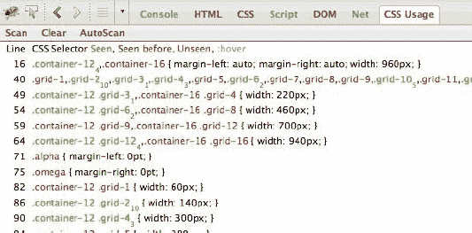
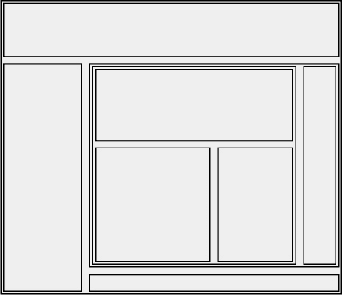
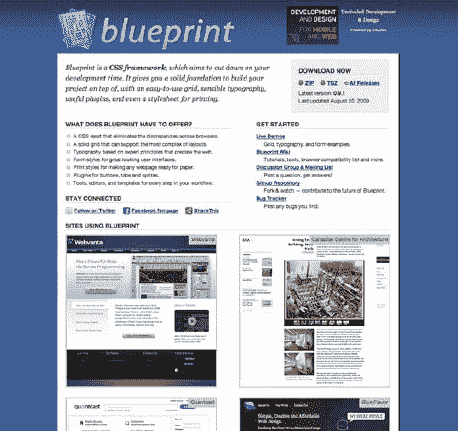
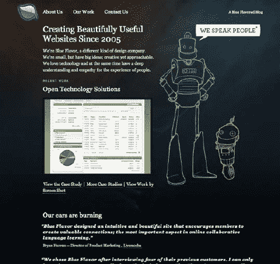
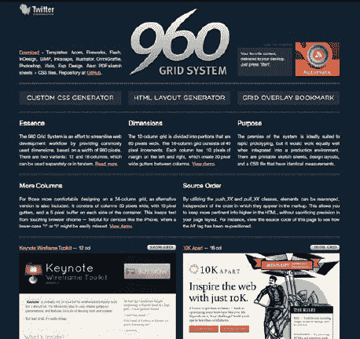
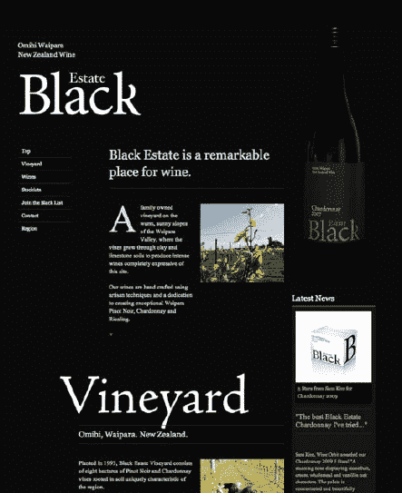
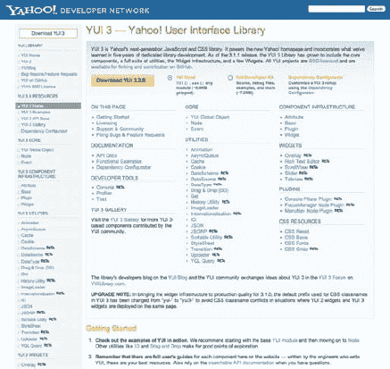
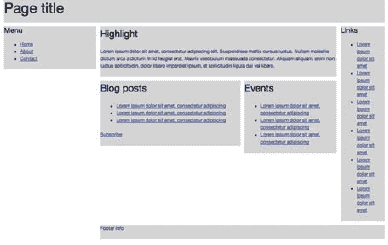
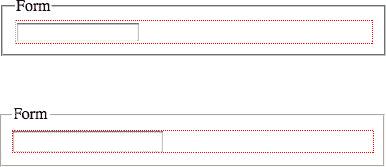

# 四、框架和集成

当在高流量的网站上工作时，我们希望达到最高水平的效率和可维护性。就 CSS 而言，这意味着我们的样式表应该灵活、健壮并且尽可能小。

在实现这些目标的过程中，我们可以使用一些工具，遵循一些指导方针。任何经验丰富的开发人员都知道，在任何需要构建的时候从头开始通常都是浪费时间和资源。当在封闭的团队和组织中工作时更是如此，这些团队和组织倾向于从事已经(或者应该)定义了基础的项目。

在前面的章节中，我们提到了为了使你的代码和过程一致化，制定指导方针是很重要的。在下一章，我们将会看到一些在你的网站上实现品牌化的技巧，以及一些设计概念在应用于 CSS 时意味着什么。我们还将看看如何建立一个设计库，你可以翻译成你的 CSS 和模块化使用。这一切都与简化开发有关，通过向开发人员提供有意义且他们可以遵循的一般规则，使他们能够做出自己的选择。有了一套明确的指导方针，你也将最小化错误和个人偏好(在你的团队和组织中，个人偏好没有一致性重要)的可能性。

另一个实现高水平的灵活性以及高效率和可维护代码的步骤是拥有一个为您的需求而设计的框架。如果这样一个框架构建得当，它应该是足够模块化和灵活的，这样你就可以依赖它来启动任何一个遵循与公司内其他项目相同的设计准则的项目。在本书的最后一章，我们将从头开始创建一个框架，但是在这一章，我们将看看一些现有的和最流行的 CSS 框架，它们是如何工作的，以及使用它们的利弊。

你所从事的项目的规模可能意味着你的代码不会永远被隔离或者只被负责的人接触。您最终会向 it 部门介绍一名新员工，他不习惯您的流程，可能会不小心破坏一些东西，或者您可能需要集成第三方代码，完全在您的团队或公司之外。

这些都是在高流量、高性能的网站上工作时会遇到的可能性和麻烦，但它们不也让你的工作变得有趣吗？它们很有挑战性，但是你可以做一些事情让你的生活变得更容易。

在本章中，您将执行以下操作:

*   看看一些最流行的 CSS 框架，包括重置样式表
*   理解面向对象的 CSS 背后的原理以及它是如何工作的
*   查看如何处理覆盖 CSS 文件
*   获取一些关于如何处理第三方代码的提示
*   理解防御性 CSS 的原理
*   了解如何避免创建脆弱的 CSS
*   了解如何在 CSS 中使用元数据

### 框架

任何有一点经验的 CSS 作者都知道，创建灵活、健壮、跨浏览器的 CSS 布局不是一件容易的事情。这也不是一项独特的任务——尽管我们很想否认这一点，但只有一定数量的网格布局在 Web 上是有效的。我们一遍又一遍地使用相同的元素和相同数量的列——诚然，有一些变化。

这种重复不一定是件坏事；虽然这是老生常谈，但没有必要重新发明轮子(或者，对于体育爱好者来说，改变一支获胜的球队)，这就是为什么 CSS 框架在 web 设计师和代理机构中如此受欢迎。它们提供了一个坚实的结构，我们可以在此基础上构建，消除了编码基于 CSS 的布局所带来的一些重复和琐碎的任务。

然而，通过这样做，框架必须能够适应任何设计者选择的任何布局变化。在必要的灵活性和保持代码简洁之间有一个权衡。

框架容易遭受分裂和阶级之苦。虽然 *divitis* 是一个修饰过度使用`div`元素的布局的术语，但是*classis is*(你猜对了)适用于滥用类的样式表。

他们不仅遭受这些弊病，而且框架也倾向于带来各种不必要的冗长代码——就像任何类型的框架一样。因为它们迎合了尽可能多的变化，我们可能会看到类似下面的片段:

***清单 4-1。【http://www.blueprintcss.org/蓝图 CSS 框架代码摘录】??***

`input.span-1, textarea.span-1 { width: 18px; }
input.span-2, textarea.span-2 { width: 58px; }
input.span-3, textarea.span-3 { width: 98px; }
input.span-4, textarea.span-4 { width: 138px; }
input.span-5, textarea.span-5 { width: 178px; }
input.span-6, textarea.span-6 { width: 218px; }
input.span-7, textarea.span-7 { width: 258px; }
input.span-8, textarea.span-8 { width: 298px; }
input.span-9, textarea.span-9 { width: 338px; }`

在前面的例子中，您可以看到 CSS 作者可以用来确定表单输入宽度的类列表。这只是一小段，因为框架列出了 48 个不同类别中的 24 种可能的宽度。

当使用一个现成的框架时，你会留下一些你不需要的代码。您可以使用一些工具来扫描与 HTML 页面相关的 CSS 文件，这些文件会列出页面未使用的任何规则。

其中一个工具的例子是 Firefox 附加 CSS 用法(`https://addons.mozilla.org/en-US/firefox/addon/css-usage/`)，它也是 Firebug 的扩展(见图 4-1 )。这个附加组件将向 Firebug 添加一个选项卡，您可以逐页单击它，它将返回页面中链接或嵌入的所有 CSS 规则的列表，用红色突出显示没有使用的规则。它还显示了正在使用的规则在页面中出现的次数。

 **注意:** CSS 的使用将不会通过 JavaScript 影响动态创建的元素。虽然它不是 100%有效，但它是一个非常有用的工具。

***图 4-1。** Firefox 的插件，CSS 用法，这是一个 Firebug 扩展，在页面上显示未使用的选择器。*

这些工具不仅对现有的框架有用，而且在确定您自己的样式表是否需要彻底清理时，它们也是一个有用的工具。

许多 CSS 作者反对使用这样的框架。反对它们的主要论点是，因为它们需要灵活性，框架倾向于使用无意义的类命名，并使它们自己成为非常类似于表格的布局方法。发生这种情况是因为当使用框架编码 CSS 布局时，您必须像处理表格一样可视化布局，包括所有的嵌套和单元格跨度。如果你看一下图 4-2 中的例子，它使用了与清单 4-1 中代码部分相同的网格，你可以看到这种类似表格的方法的一个例子:

***图 4-2。**可视化必要的容器元素，使用框架将布局转化为 CSS 网站*

 **注意:**在接下来的“替代用途”一节中，我们将介绍如何使用 Blueprint CSS 框架创建这个布局的快速教程。

使用公共框架的一个很大的好处是，新员工更有可能熟悉和适应它们，因此在他们的第一个项目和任务中更快地产生更少的问题和错误。他们也已经被记录在案，可能有一个社区邮件列表，IRC 频道，等等。

有各种各样的 CSS 框架。三个比较有名的是

*   蓝图
*   960 网格系统
*   YUI 网格

我们不会推荐一个框架而不推荐另一个——事实上，我们认为对于高流量网站来说，创建一个定制的框架是更好的选择，即使它借鉴了现有的框架。然而，我们将简要地看一看每一个最著名的。

#### 蓝图 CSS

蓝图 CSS 框架由 Olav bjrky 创建，并于 2007 年 8 月发布(见图 4-3 )。它通常被认为是最全面的 CSS 框架，因为它不仅允许创建基于网格的布局，还提供了坚实的排版基础，考虑到垂直节奏等方面。它还提供了重置和打印样式表，以及表单的基本样式。

***图 4-3。**蓝图 CSS 网站首页(`[`www.blueprintcss.org/`](http://www.blueprintcss.org/)` )*

默认情况下，框架使用 24 列布局(每一列跨越 30 个像素，右边距为 10 个像素)，但是您可以使用文件中包含的压缩器来创建不同的布局(您可以在官方文档`[`jdclayton.com/blueprints_compress_a_walkthrough.html`](http://jdclayton.com/blueprints_compress_a_walkthrough.html)`中找到相关教程)。

使用 Blueprint 就像在页面上的块周围包含一个带有“容器”类的包装容器一样简单。例如，根据每个内部容器的宽度，您需要对跨越整个页面宽度的`div`使用“span-24”类，或者对跨越 8 列的块使用“span-8”类。如果容器是特定容器或列中的最后一个，它还应该包括一个“last”类(这将删除该容器的右边距，因为它是不必要的)。包含页眉、侧栏、主要内容区域和页脚的简单布局的 HTML 如下所示:

`

   

      Header
   

   
` `      

         Sidebar
      

      

         Main content
      

   

   

      Footer
   

`

Blueprint 的优势之一是其背后的社区，它不断地创建和发布新的插件、主题和其他可以与基本框架结合使用的工具。

***图 4-4。**蓝色恩惠网站使用蓝图(`[`www.blueflavor.com/`](http://www.blueflavor.com/)` )*

Blueprint 的核心文件(screen.css，ie.css，print.css)加起来总共 20 KB。

#### 960 网格系统

960 网格系统 CSS 框架(见图 4-5 )由纳森·史密斯开发，并于 2008 年 3 月发布。该框架的开发重点是网格；尽管它提供了基本的印刷样式，但它的主要目的是提供一个跨浏览器的基础(它有完整的 A 级浏览器支持。 1 你可以在第六章中读到更多关于分级浏览器支持的内容，它允许在最常见的基于网格的布局上有许多变化。

***图 4-5。**960 网格系统框架首页(`[`960.gs/`](http://960.gs/)` )*

按照我们用来演示 Blueprint 的同一个简单布局示例，我们将使用 960 Grid System 创建它的一个版本。默认情况下，框架在 12 列或 16 列的网格上工作。我们需要添加一个容器，用“container_16”(或“container_12”)类包围我们的内部块；内部容器应该有“grid_16”、“grid_14”等类，这取决于它们跨越了多少列。下面是我们简单布局的最终 HTML 标记:

`<body>
   

      

         Header
      

      

         Sidebar
      

      

         Main content
      
` `       

         Footer
      

   

</body>`

__________

1 基于雅虎！在`[`developer.yahoo.com/yui/articles/gbs/`](http://developer.yahoo.com/yui/articles/gbs/)`的定义。

和 Blueprint 一样，有几个在线工具可以让你根据自己的需要配置框架(见图 4-6 )。由 Stephen Bau 创建的 Fluid 960 网格系统基于最初的 960 网格系统，但允许流动和固定的布局，并包括导航、表格、表单、文章和排版等元素的基本样式。

***图 4-6。**黑色庄园网站首页，使用 960 网格系统框架(`[`blackestate.co.nz/`](http://blackestate.co.nz/)` )*

简化后，主 960gs 文件(960.css 和 reset.css)占用 12 KB。

#### YUI 3 格

YUI 3 网格框架是雅虎的一部分！用户界面(YUI)库(见图 4-7 )。该库包括 JavaScript 资源和 CSS (YUI 3 CSS 还包含重置和排版样式表)。它的工作方式与本章介绍的其他框架类似，不同之处在于:主容器没有预定义的宽度；只有预定义的“单位”，其中一个容器可以在另一个容器中扩展。

***图 4-7。**YUI 3 库主页，包含 YUI 3 CSS(框架`[`developer.yahoo.com/yui/3/`](http://developer.yahoo.com/yui/3/)` )*

为了说明 YUI 3 网格是如何工作的，我们将使用与前面相同的例子。然而，在这种情况下，我们需要向页面的`body`元素添加所需的宽度，如下所示:

`body {
    margin: auto;
    width: 960px;
}`

“margin: auto”属性将使我们的内容在页面上居中。接下来，与其他框架一样，我们需要包含一个带有类“yui3-g”的包装容器。其中的容器将根据它们应该填充的宽度百分比(或“单位”)来取类名。所以，举个例子，如果侧边栏占了总宽度的三分之一，就应该有一个“yui3-u-1-3”的类，如果主内容区占了总宽度的三分之二，就应该有一个“yui3-u-2-3”的类。YUI 附带了一组预定义的单元类(列在框架的网站上)。

我们的最后一个示例将包含以下 HTML:

`<body>
   

      

         Header
      

      

         Sidebar
      

      

         Main content
      
      
      

         Footer
      

   

</body>`

缩小的 YUI 3 网格文件占用 4 KB。但是，这仅包括网格，不包括文本默认值或重置。附带的 YUI 重设(本章中提到)、YUI 基础和 YUI 字体也各为 4 KB(总共 12 KB)。

#### 替代用途

CSS 框架的一个常见用途是在原型阶段，即使是那些不喜欢在生产中使用它们的人。因为它们提供了一个可靠的、跨浏览器的 CSS 解决方案，所以使用现有的框架很容易快速创建模型、线框和网站的简化版本。

根据定义，原型(在第一章中有更详细的介绍)是由我们不打算投入生产的代码组成的(至少在其当前状态下)，编写原型只是为了创建一个概念证明。记住这一点，与交付时间和资源使用相比，语义、可访问性、过多的标记、文件大小和其他通常至关重要的考虑事项并不重要。事实上，有时更好的办法是削弱你的原型，以避免它成为产品代码，因为它“足够好了”

让我们以图 4-2 中的基本线框为例，使用 Blueprint CSS 框架将其翻译成 HTML。第一步是在 HTML 文档的头部链接所需的 CSS 文件:

`<link rel="stylesheet" href="blueprint/screen.css" media="screen, projection" />`

接下来，我们需要添加一个带有类“container”的包装器`div`,以便蓝图文件将其中的容器作为目标:

`<body>
        

        …
        

</body>`

我们的布局由 8 列组成；Blueprint 框架默认使用 24 列，所以我们将在线框图中为每一列计算 3 列。考虑到这一点，顶部块跨越 24 列，左侧列跨越 6 列，右侧(包括 5 个容器)跨越 18 列，依此类推。

如果一个容器是一行中的最后一个，它也应该有“last”类，所以右边距被删除。

我们的线框的基本结构应该是这样的:

`<body>
   

      

        …
      

      

        …
      

      

         

            

              …
            

            

               …
            

            

               …
            

         

         

            …
         

         

            …
         

      

   

</body>`

接下来的步骤是向这些容器中添加一些简单的文本片段，向容器中添加一个新的类，并在我们的 CSS 中引用该类，以便我们可以使用它来进一步设计主容器的样式(记住，这是一个简单的线框，因此对于我们的示例，我们已经将这一行简单的 CSS 直接嵌入到 HTML 文档中::

``

在图 4-8 中，你可以看到完成的线框。

***图 4-8。**用蓝图 CSS 框架创建的简单线框*

从这个简单的例子中可以看出，现有的框架是创建快速线框和实体模型的有用工具(从阅读入门指南到创建最终产品只花了我们不到 10 分钟的时间)。

#### 重置样式表

尽管有人反对 CSS 框架，但大多数 CSS 作者总是使用其最简单的形式之一:重置样式表。每个浏览器都有一套默认样式，在细节上与其他浏览器不同，如元素的边距和填充、垂直对齐、宽度和高度或字体大小(见图 4-9 )。大多数最新的浏览器在用户代理样式表上相当一致；即使是最新版本的 Internet Explorer 和 9)也在迅速赶上并朝着类似的方向发展。 2 为了克服仍然存在的小的不一致，特别是在旧浏览器中，从一个共同的空白开始，作者求助于所谓的“重置样式表”

***图 4-9。**Safari 5(上图)和 Firefox 3.6(下图)中输入元素的渲染对比。Safari 会在元素周围添加额外的边距。*

__________

2 您可以在`[`www.iecss.com/`](http://www.iecss.com/)`看到不同版本的 Internet Explorer 中用户代理样式表的比较和演变。

对于重置样式表，有人支持，也有人反对。我们认为，most 列出的缺点可以通过规划来克服，对于一个有经验和知识的 CSS 作者来说应该不成问题。

使用现成的重置样式表的一个缺点是，我们没有利用浏览器的默认设置，稍后我们会在 CSS 中及时添加回来。人们倾向于按原样使用重置样式表，而不根据自己的需要进行调整。这通常会导致 CSS 文件中的大部分规则被覆盖，被那些更为设计考虑的规则覆盖。在这些情况下缺乏计划会给我们留下不必要的规则，这只会使我们的文件更长，更难更新和调试。如果你希望你的网站上的简单列表有默认的项目符号，没有理由在你的重置(或基础)样式表中添加一个“`li { list-style: none; }`”规则；相反，你应该只设计不需要项目符号的列表，比如导航。如果你网站的标题主要是粗体，那么如果你要覆盖它，也没有理由添加一个规则来声明它们都应该有一个`normal`的`font-weight`值。

也许考虑一个更像基本样式表的重置样式表(这是许多 CSS 作者提出的),并在创建它们时包含一些浏览器自己的默认设置，这可能是理解拥有一个共同起点的重要性的更简单的方法，尤其是在团队中工作时。

W3C 已经为 HTML 4 发布了一个“鼓励开发者使用”的 CSS2 默认样式表现在已经过时，不完整，但可以作为参考和起点(`[`www.w3.org/TR/CSS2/sample.html`](http://www.w3.org/TR/CSS2/sample.html)`)。

 **注:**有一个非官方的(虽然基于规范的渲染部分，可以在`[`www.whatwg.org/specs/web-apps/current-work/multipage/rendering.html#the-css-user-agent-style-sheet-and-presentational-hints`](http://www.whatwg.org/specs/web-apps/current-work/multipage/rendering.html#the-css-user-agent-style-sheet-and-presentational-hints)`找到)HTML5 版本的这些默认值，由 Jonathan Neal ( `[`www.iecss.com/whatwg.css`](http://www.iecss.com/whatwg.css)`)创建，W3C 工作组成员推荐。

让我们看几个比较常见的重置方法和样式表。

##### 通用选择器复位

通用选择器复位无疑是同类产品中最小的。尽管这可能感觉像割下你的鼻子来气你的脸，但它的简单性是无可辩驳的，而且与其他重置相比，这种好处还伴随着文件大小的节省。

没有比这更简单的复位了:

`{
   margin: 0;
   padding: 0;
}`

但这真的能被认为是彻底的重置吗？毕竟，它只涵盖了两个属性，而可能还有其他属性需要重置，以定义一致的跨浏览器基础。除此之外，它还会从您可能不想重置的元素(如表单元素或表格)中删除边距和填充，您以后必须覆盖这些元素。还要考虑到节省的文件大小可能会被你不得不在文件的后面为你的网站上使用的许多其他元素定义边距和填充所抵消。

众所周知，通用选择器在单独使用时不会对网站的性能产生负面影响(当它与其他选择器一起使用时会产生恶劣的影响)，但它不是克服浏览器不一致性的完善或完整的解决方案。

 **注意:**尽管使用通用选择器的低效率和性能影响似乎是显而易见的，但用当前的工具进行纯粹的跨浏览器研究是不可能的。我们建议不要理所当然地使用选择器，但是它在这里的使用是清晰而实用的。

##### 埃里克·迈耶的重置

Eric Meyer 的重置样式表是最流行的，也是大多数 CSS 作者使用的样式表。这个样式表最初是受 Yahoo！它的主要目的是明确说明哪些元素应该被重置，而不是像通用选择器重置那样使用一个无所不包的选择器。

样式表被仔细地注释，以便 CSS 作者不要忘记样式不应该开箱即用，但事实是许多人选择忽略这些注释，简单地复制和粘贴 CSS。这导致了一些人的评论，他们担心重置(因为它在开发人员中非常受欢迎)会妨碍可访问性，因为它最有争议的规则是:“`:focus { outline: 0; }`”，在最初的版本中，它之前有一个警告作者定义焦点样式的评论(这经常被忘记)，但在最新的版本中已被删除。

Meyer 已经发表了这个重置的几个版本，最新的版本发表在他的博客上，时间是 2011 年 1 月 26 日`[`meyerweb.com/eric/tools/css/reset/`](http://meyerweb.com/eric/tools/css/reset/)`。

`/* http://meyerweb.com/eric/tools/css/reset/
   v2.0 | 20110126
   License: none (public domain) */` `html, body, div, span, applet, object, iframe,
h1, h2, h3, h4, h5, h6, p, blockquote, pre,
a, abbr, acronym, address, big, cite, code,
del, dfn, em, img, ins, kbd, q, s, samp,
small, strike, strong, sub, sup, tt, var,
b, u, i, center,
dl, dt, dd, ol, ul, li,
fieldset, form, label, legend,
table, caption, tbody, tfoot, thead, tr, th, td,
article, aside, canvas, details, embed,
figure, figcaption, footer, header, hgroup,
menu, nav, output, ruby, section, summary,
time, mark, audio, video {
   margin: 0;
   padding: 0;
   border: 0;
   font-size: 100%;
   font: inherit;
   vertical-align: baseline;
}
/* HTML5 display-role reset for older browsers */
article, aside, details, figcaption, figure,
footer, header, hgroup, menu, nav, section {
   display: block;
}
body {
   line-height: 1;
}
ol, ul {
   list-style: none;
}
blockquote, q {
   quotes: none;
}
blockquote:before, blockquote:after,
q:before, q:after {
   content: '';
   content: none;
}
table {
   border-collapse: collapse;
   border-spacing: 0;
}`

这个最新版本的重置，除了更加小心大纲焦点样式，还包括新的 HTML5 元素，并删除了不赞成使用的 HTML 元素。

 **注意:**在 Internet Explorer 之前的版本中，您无法定位新的 HTML5 元素。为了克服这一点，有必要将它们包含在另一个元素中并以包含元素为目标，或者使用一种称为 HTML5 Shiv 的 JavaScript 技巧为每个标签创建一个虚拟元素(不呈现它)，这迫使 IE 注意到这些标签的存在。这项技术由 Sjoerd Visscher 发现，由 John Resig 推广，由 Remy Sharp 在`[`remysharp.com/2009/01/07/html5-enabling-script/`](http://remysharp.com/2009/01/07/html5-enabling-script/)`完善。这两种方法都有缺点(第一种会产生多余的标记，第二种会产生 JavaScript 依赖)，所以在做出决定之前要考虑你的受众。

这是一个相当全面的重置样式表，我们建议您从中获取灵感。但是，我们不建议完全按原样使用它(作者也不建议),因为您可能会发现自己重新定义了一些您以前重置的规则——它将始终取决于您正在进行的设计的需要以及您希望您的元素具有的基线样式。

##### YUI 3 CSS 复位

最初的 YUI 重置样式表是在 2006 年和完整的库一起发布的。它非常精确地选择了哪些元素以及如何设计。例如，它只删除块级元素和一些表单元素的边距和填充；它解决了表单元素中的字体继承问题；它还增加了浏览器特有的调整字体大小的功能(`[`developer.yahoo.com/yui/3/cssreset/`](http://developer.yahoo.com/yui/3/cssreset/)`)。

以下是最新 YUI 重置的评论版本(在撰写本文时):

`/*
Copyright (c) 2010, Yahoo! Inc. All rights reserved.
Code licensed under the BSD License:
http://developer.yahoo.com/yui/license.html
version: 3.3.0
build: 3167
*/
html{
   color:#000;
   background:#FFF;
}
body,div,dl,dt,dd,ul,ol,li,h1,h2,h3,h4,h5,h6,pre,code,form,fieldset,legend,input,textarea,p,blockquote,th,td {
   margin:0;
   padding:0;
}
table {
   border-collapse:collapse;
   border-spacing:0;
}
fieldset,img {
   border:0;
}
address,caption,cite,code,dfn,em,strong,th,var {` `   font-style:normal;
   font-weight:normal;
}
li {
   list-style:none;
}
caption,th {
   text-align:left;
}
h1,h2,h3,h4,h5,h6 {
   font-size:100%;
   font-weight:normal;
}
q:before,q:after {
   content:'';
}
abbr,acronym {
   border:0;
   font-variant:normal;
}
/* to preserve line-height and selector appearance */
sup {
   vertical-align:text-top;
}
sub {
   vertical-align:text-bottom;
}
input,textarea,select {
   font-family:inherit;
   font-size:inherit;
   font-weight:inherit;
}
/*to enable resizing for IE*/
input,textarea,select {
   *font-size:100%;
}
/*because legend doesn't inherit in IE */
legend {
   color:#000;
}`

尽管这种重置经过了多年的改进，但对于您的特定问题来说，它可能不是完美的解决方案。如前所述，您正在处理一种特定的设计风格，并且在这个样式表中声明的一些规则可能必须在稍后的代码中被覆盖，这是没有效率的。

##### 其他复位示例

除了前面提到的复位之外，还有各种其他复位，每种都略有不同。然而，他们似乎从同一套重置(主要是 YUI 和埃里克·迈耶的重置)中汲取了灵感，并分享了其中的许多规则和属性。

blue print 框架将其 reset.css 集成到主 screen.css 文件中，但也在源代码文件夹中提供了单独的文件。蓝图 reset.css 看起来是这样的:

`/* --------------------------------------------------------------

   reset.css
   * Resets default browser CSS.

-------------------------------------------------------------- */

html {
   margin:0;
   padding:0;
   border:0;
}

body, div, span, object, iframe,
h1, h2, h3, h4, h5, h6, p, blockquote, pre,
a, abbr, acronym, address, code,
del, dfn, em, img, q, dl, dt, dd, ol, ul, li,
fieldset, form, label, legend,
table, caption, tbody, tfoot, thead, tr, th, td,
article, aside, dialog, figure, footer, header,
hgroup, nav, section {
  margin: 0;
  padding: 0;
  border: 0;
  font-weight: inherit;
  font-style: inherit;
  font-size: 100%;
  font-family: inherit;
  vertical-align: baseline;
}

/* This helps to make newer HTML5 elements behave like DIVs in older browers */
article, aside, dialog, figure, footer, header,
hgroup, nav, section {
    display:block;
}

/* Line-height should always be unitless! */
body {
  line-height: 1.5;
  background: white;
}

/* Tables still need 'cellspacing="0"' in the markup. */
table {
   border-collapse: separate;
   border-spacing: 0;
}
/* float:none prevents the span-x classes from breaking table-cell display */` `caption, th, td {
   text-align: left;
   font-weight: normal;
   float:none !important;
}
table, th, td {
   vertical-align: middle;
}

/* Remove possible quote marks (") from <q>, <blockquote>. */
blockquote:before, blockquote:after, q:before, q:after { content: ''; }
blockquote, q { quotes: "" ""; }

/* Remove annoying border on linked images. */
a img { border: none; }

/* Remember to define your own focus styles! */
:focus { outline: 0; }`

960 网格系统的重置也从同样流行的样式表中汲取灵感。以下是 960.gs reset.css 文件的格式化版本(在其原始版本中，该文件被缩小):

`html,body,div,span,applet,object,iframe,h1,h2,h3,h4,h5,h6,p,blockquote,pre,a,abbr,acronym,addr
ess,big,cite,code,del,dfn,em,font,img,ins,kbd,q,s,samp,small,strike,strong,sub,sup,tt,var,b,u,
i,center,dl,dt,dd,ol,ul,li,fieldset,form,label,legend,table,caption,tbody,tfoot,thead,tr,th,td
{
   margin:0;
   padding:0;
   border:0;
   outline:0;
   font-size:100%;
   vertical-align:baseline;
   background:transparent
}
body {
   line-height:1
}
ol,ul {
list-style:none
}
blockquote,q {
   quotes:none
}
blockquote:before,blockquote:after,q:before,q:after {
   content:'';
   content:none
}
:focus {
   outline:0
}
ins {
   text-decoration:none
}` `del {
   text-decoration:line-through
}
table {
   border-collapse:collapse;
   border-spacing:0
}`

##### 从一个巧妙的默认的共同点开始

网上有几十种不同的重置样式表，有些比其他的更详尽。CSS 重置背后的主要思想是，它为您提供了一个跨所有浏览器的共同点，您可以在此基础上满怀信心地构建，您的代码和设计的跨浏览器实现之间不会出现不一致。

当建立一个有数百万用户访问的网站时，最好知道你所创建的东西有正确的基础，并且最令人不快的浏览器默认设置不会进入你不太显眼的页面。然而，这并不意味着您应该使用现成的重置样式表。

作为一个有经验的 CSS 作者，你应该花时间考虑你想为你的页面设置哪些默认值；您应该考虑可以从现有的样式表中使用什么，以及可以从它们中学到什么，但是不要忘记它们的存在和创建主要是为了满足创建它们的开发人员的需求。花时间定制你的基本样式，使它们与你的网站相关:你希望你的 CSS 高效并避免冗余，所以重置一切以便以后再添加不是一个好主意。

因为你应该尽可能减少 HTTP 请求，我们的建议是样式表的重置部分不应该作为一个单独的文件，而应该合并到你的主 CSS 文件中。

#### 为什么要创建自己的框架？

模块化是一个灵活的 CSS 文件系统的核心概念，也是任何从事高流量网站工作的团队的目标。

模块化之所以重要，是因为它允许代码在同一网站的不同部分和同一系列的子网站中重用。如果在构建 CSS 时考虑到了这一点，那么使用代码片段来设计不同页面中相似元素的样式将变得可能和容易，而无需破坏现有代码，也无需嵌入或链接到更大的 CSS 文件。

通过创建您自己的框架，您正在创建一个可重用的代码库，从而提高团队的效率。一个框架不需要太大，但是它应该包含基本的排版和布局变化等元素；表单元素；跨多个站点使用的模块，有小的变化，如导航项目；幻灯片、工具提示或标签等组件。以及在一个或多个站点中易于多次使用的每个元素。它还应该包括网站的印刷和移动版本的单独样式表。

框架(或 CSS 库)带来的可重用性对于效率和文件大小来说是无价的，并且允许更一致和健壮的代码。不同的作者有不同的元素编码方式，比如制表符或者水平导航；如果有一个包含示例或模块的存储库，可以应用于现有的样式表，显示这些元素应该如何显示和编码，那么很大一部分不同的编码样式将被消除。

第十一章包含了创建你自己的 CSS 框架的分步指南。

### 面向对象的 CSS

面向对象的 CSS (OOCSS)是由前端性能顾问妮可·沙利文引入的概念。Nicole 项目的核心是 CSS(尤其是高性能网站)应该以模块化、灵活的方式处理的概念。

#### 面向对象编程

*面向对象编程(OOP)* 是一种编程方法，它将代码分解成离散的块(对象)，并允许我们重用它们或构建继承其属性的新块。

举个例子，我们可能有一个名为 *car* 的对象。这个对象有某些属性:它有门、引擎、钥匙、窗户、轮子等等。在许多方面，我们可以把这个对象看作类似于一个模板。我们可能会使用这个模板来创建许多汽车。虽然我们是基于我们的基本模板的汽车，他们可以有更具体的属性；我们可以定义门的数量、引擎大小、颜色、品牌、型号等等。

这种方法同样适用于 CSS，并且很可能您已经不假思索地使用了它。例如，我们的页面上可能有一个我们认为是*块*的对象。为了举例，我们说一个块有绿色边框、圆角和灰色背景。

`
I am a discrete block

I am another discrete block
`

但是，我们可能希望一些块具有更具体的属性，如位置、宽度等:

`
I am a discrete block

I am another discrete block
`

以这种方式使用类允许我们拥有一个基本对象，然后创建继承基本对象属性的更具体的对象。我们甚至可以通过使我们的选择器更加具体来覆盖基本对象的属性。

#### oocs

尽管术语*面向对象*可能会引起误解——事实上，这也是许多类似讨论的主题——OOCSS 是编码 CSS 的有效方法。

OOCSS 的主要目标之一是鼓励重用独立于我们试图设计的元素位置的代码片段——CSS 在任何地方都应该完全一样:“不管你把一个对象放在页面的什么地方，它的行为都应该是可预测的，这就是为什么面向对象的 CSS 避免依赖于位置的样式。”(`[`www.stubbornella.org/content/2009/02/28/object-oriented-css-grids-on-github/`](http://www.stubbornella.org/content/2009/02/28/object-oriented-css-grids-on-github/)`)。

这与团队在开发他们的样式表时通常采用的沙箱方法相反——例如，命名空间 CSS 选择器，这在第二章中有更详细的描述。

同样的与位置无关的原则反过来也适用:更改代码的一部分并不意味着破坏其余部分。此外，如果子元素不需要在特定的父容器中才能看起来正确，则父容器不应该依赖其子元素才能在页面上正确呈现。Nicole 将其总结为将内容与容器分离 OOCSS 的原则之一。

在下面的例子中，容器和其中标题的样式规则是分开的，可在其他元素中重复使用——父元素不依赖其子元素来保持正确的外观，反之亦然:

`CSS:

.module {
   margin: 10px;
}
.hd {
   padding: 5px;
   color: #333333;
}

HTML:

   <h1 class=”hd”>Title</h1>

`

另一个原则建议，控制元素(或对象)结构的规则应该与控制其外观(美学)的规则分开。让我们看一个例子:

`CSS:

.module {
   margin: 10px;
}
.moduleSale {
   background: #efefef;
}

HTML:

   …

`

在前面的例子中，我们用另一个控制组件皮肤的类来扩展组件。控制布局的规则和控制皮肤的规则都可以独立地为其他组件重用。

抽象重复模式以实现可重用性和整体模块化是一种很有帮助的方法，因为你必须基于对设计中所有元素的全面分析，在动手之前考虑如何构建 CSS。在 OOCSS 中，鼓励你首先考虑独立的对象，然后才是页面；您应该能够使用现有的模块化 CSS 构建任何类型的页面。

然而，对于 OOCSS 来说，并非一切都是优势。在拥有一个更小的样式表(其中不惜一切代价避免冗余)和拥有一个更大的、类混乱的 HTML 文档之间有一个折衷。

因为 OOCSS 试图避免使用元素选择器——这样类就不会局限于某个特定的元素——它没有充分利用原始标记的语义。为了避免特殊性冲突，级联还没有发挥出它的全部潜力(事实上，你正在与之对抗)。创建基于类的选择器是为了使每个规则都具有相同的特性，以便能够覆盖(或者更好的是，扩展)其他类。

OOCSS 的另一个弱点，也是反对者最喜欢指出的，是它对类的使用是无意义的。

如果对 CSS 采用面向对象的方法，你将拥有一个“模块”类，而不是一个“侧栏”类之所以会发生这种情况，是因为通过将它命名为*侧边栏*，我们正在将其本地化，并将其限制在我们页面上的某个位置——我们可能希望在我们网站的主要内容区域内对`div`使用完全相同的样式，因此命名需要有灵活性。问题是，通过删除这些更具语义性和更易理解的类名，我们似乎正在接近表示性的类名，正如我们前面提到的，这是框架也面临的一个问题。

随着新的 HTML5 元素的引入，这个问题可能会得到一定程度的缓解，比如`header`、`footer`和`aside`。通过使用这些新元素，我们已经在标记中指出了我们想要样式化的内容的基本语义轮廓。当然，永远不会有足够的元素来表明我们可能希望从文档中得到的一切。实际上，除非您使用非常常见的类名或基于标准的类名(比如微格式)，否则语义对开发人员的好处大于对用户的好处。我们应该尽可能地追求语义，但这不是 CSS 的全部。

OOCSS 在处理需要灵活但健壮的代码的大型网站时最有意义，并且编码实践的一致性是一个目标。虽然我们同意它有有效的强有力的论据，并赞同它推荐的许多技术，但我们也认为在灵活的 CSS 和灵活的标记之间应该有一个平衡。

良好的语义和可重用的 CSS 之间的平衡对于一个高效的高流量网站来说是至关重要的，将所有的重担都转移到标记上并不理想。如果你的团队与设计团队是分开的，你可能会发现使用这种方法很难遵循隐含的过程。也就是说，有许多 OOCSS 的拥护者，您可能会发现它适合您的需求。

如果你有兴趣阅读更多关于 OOCSS 的内容，请前往`[`oocss.org/`](http://oocss.org/)`。

### 覆盖 CSS

CSS 的级联性质允许我们用更具体的样式表覆盖现有的样式表，而不必编辑原始的基本文件。出于各种原因，这可能是必要的，例如季节性的重新设计、每个不同的公司部门需要稍微不同的配色方案、存在从主网站借用的子网站，以及不遵循主样式表中包含的相同设计模式的特殊一次性页面，等等。这些情况必然发生在大的、高流量的网站。

通常，这意味着更具体的 CSS 规则将被放在一个单独的文件中，该文件要么与现有的样式表连接，放在特定页面的 head 元素中的样式标签中(导致关注点分离问题)，要么链接到主样式表之后的 HTML 文档，在某些地方覆盖它(尽管在最后一种情况下，您将添加一个代价高昂的 HTTP 请求，这会降低您的网站的性能)。

覆盖 CSS 作为主样式表的补充，通常是在设计中创建不同主题和变化的最有效方式。如果你的样式表是以一种模块化和灵活的方式构建的，它们会被其他更具体的规则所补充，而不需要增加代码的冗余。

然而，如果原因是重大的重新设计，应该避免创建覆盖主样式表的新样式表，因为 CSS 的很大一部分将由过于具体的规则组成，这些规则之所以具体，是因为有一个旧的、过时的样式表需要取消优先级。

当覆盖 CSS 文件时，您将处理的主要因素是特殊性。你希望能够利用已经存在的东西，但是在不需要重复的情况下增加它。为此，明智的做法是从头开始构建主样式表，首先专注于创建合理的默认值，这样就不必为相似的元素重复相同的声明。例如，假设大多数无序列表都应该有特定的样式。下面的 CSS 很难被覆盖(我们在最后的规则中覆盖它):

`#homepage #highlights ul li {
   list-style-type: disc;
   margin: 0 0 1em;
}
#homepage #popular ul li {
   list-style-type:disc;
   margin: 0 0 1em;
}
#homepage #special ul li {
   list-style: none;
   margin: 0 0 1em;
   background: url(star.gif) no-repeat left center;
   padding-left: 24px;
}`

执行以下操作会更容易:

`li {
   margin: 0 0 1em;
}
#special li {
   list-style: none;
   background: url(star.gif) no-repeat left center;
   padding-left: 24px;
}`

如果我们在重置中没有更改无序列表项的`list-style-type`值，现在我们将利用浏览器的默认设置，通常情况下，无序列表项的`list-style-type`值是`disc`。因此，我们没有将它添加到我们的 CSS 中，并且由于我们对所有列表使用相同的间距，除了一些例外，更简单的方法是将其添加为所有列表项的默认样式，然后根据需要覆盖它。

这种思考和计划将产生更小的样式表，更容易更新，也更容易被不熟悉代码的开发人员理解。

许多大型网站选择在页面正文中添加一个类或 ID，作为指示应该使用哪个模板的一种方式。这是一种简单而有效的技术，但您应该小心使用，因为它很容易阻止您重用代码(因为您将为每个模板沙箱化部分代码，所以您需要确保您为一个模板构建的内容不会对所有模板都有用)。如果走极端，当一个新的特殊模板或主题需要到位时，它也会使你走上重复和过于具体的规则的道路。

例如，如果您的样式表有多余的或过于具体的规则，当您想要为网站的某些元素添加圣诞边框时，您可能需要覆盖类似这样的内容:

`#home .template-12 #main .col-1 .post img.thumbnail {
   border: 1px dotted green;
}
…` `#europe .template-8 aside#secondary ol li img {
   border: 1px dotted #333333;
}`

如果 id`home`和`europe`被添加到`html`或`body`元素中，可能没有其他方法可以从嵌入的样式表中清除覆盖(让我们避免内联 CSS)。重写以下代码片段会容易得多:

`img { /* You should make an effort to make this initial style as generic as possible. Maybe
you would need a class or an ID before the element selector in your case */
   border: 1px dotted black;
}
…
.post img {
   border-color: green;
}
…
#secondary img {
   border-color: #333333;
}

…` `/* Christmas styles */
#christmas img,
#christmas #secondary img {
   border-color: red;
}`

在你的网站中，图像边框的工作方式可能会有重叠和模式，所以你所做的是将最常见的场景作为默认样式，只在需要时增加更多的细节。

如果采用 OOCSS 方法(本章前面提到过)，CSS 的模块化本质意味着引入级联的新文件和规则将倾向于补充现有的文件和规则，而不是覆盖它们。这基本上与我们到目前为止在本节中描述的非常相似，不同之处在于 OOCSS 技术较少利用级联，主要关注于类，避免 id 和类相互补充。在这种情况下，您的 CSS 可能看起来更像下面这样:

`img {
   border: 1px dotted black;
}
…
.img-post{
   border-color: green;
}
…
.img-secondary {
   border-color: #333333;
}
…
/* Christmas styles */
#christmas img {
   border-color: red;
}`

因为我们正在使用类，`christmas` ID 足够强大，可以覆盖任意数量的类。

在大型网站中，覆盖现有的 CSS 规则是不可避免的。这还不错；事情就是这样的。既然有可以作为基础的风格，为什么要从头开始呢？

我们在本书中所说和推荐的一切(如何避免冗余，争取模块化和更灵活的样式表，不要在没有必要的时候把事情复杂化，等等)应该给你很好的指导，如何避免使你的 CSS 变得不必要的复杂。

### 与第三方代码和谐相处

网站开发人员经常会发现自己合并了其他人编写的代码，而他们对这些代码没有控制权。这些代码可能是一个小部件、插件或其他形式的网站块，旨在直接放入您的页面。因为这段代码是为最小公分母场景设计的，所以作者希望它不管周围的代码如何都可以工作——这段代码通常比任何特定情况下的代码都要冗长。如果代码包含 JavaScript 和 CSS，那么经常会出现与网站中已有代码的重复。处理这种情况有两种主要方法:

*   Rewrite the CSS yourself, and opt to not include the third-party CSS.

    > This solution gives developers the greatest control over the code provided to users. Although it looks attractive, this method is usually not an effective way of working. If the third-party code is updated in some way (it may be written into the page by external JavaScript), but CSS is not updated, there may be visual or functional problems in the website. Usually CSS will be included in other servers besides your own, which means that you must also use the overlay to modify the code on your site. You should also be aware that when a third party releases a newer and better code version, branching from the original code will make it difficult for you to upgrade easily. The practical method of is usually to accept the third-party code and build around it. If there are so many code problems that this is not an effective method, you should really question whether this third party is a good partner of your business, and look for alternatives or the possibility of writing your own equivalent code internally.

*   Build your CSS to minimize the likelihood of conflicts in your code; Thentest thoroughly.

    > This is a more realistic method, although it needs to think ahead. If including third-party code is an unpredictable choice, then you are probably unprepared for this situation.

您可以做的第一件事是尝试将第三方代码从您的代码中分离出来。如果第三方代码被直接放入你的标记中，你应该找到它并弄清楚如何定位它的容器。如果它通过 JavaScript 添加元素，你可以在你的 web 开发工具中观察 DOM(见第十章)并记下容器的细节。如果没有容器，可以考虑自己添加。这将使你有能力定位和修复任何出现的问题。

您可以使用体贴的方法，如果有可能包含第三方代码的特定区域，您可以对它们应用基本的 CSS 重置，只针对那些块。避免使用`!important`(无论如何你都应该这样做)，在使用非常简单的元素选择器的地方，尽量不要命名它们，这样你就最不可能影响具有更高特异性的第三方代码。

您也可以使用可疑的方法，在这种方法中，您尝试使用更具体的选择器，以避免第三方的模糊选择器有机会影响您的页面。

我们推荐体贴的方法，尽管这并不适合每个人。如果你的外部代码写得如此糟糕，以至于影响到你的代码，期望(并要求)他们修复这个问题是合理的。如果您的场景要求您无论如何都要使用该代码，并且它很糟糕，那么您可以自己重写它或者进行彻底的测试，并根据需要为您的标记创建更具体的规则。

走极端的话，您可以包含另一个页面作为 iframe 来完全保护他们的代码不受您的影响。除了最戏剧性和不可避免的情况，我们不建议这样做。

相反，如果你写的代码要包含在别人的页面中，要考虑周全。您应该尽可能地对容器进行命名分隔(使用某种前缀，使您的代码明显地与其他代码分开)，以便您可以使用特定的选择器来选择它，然后将它用作应用于块内元素的任何选择器的前缀。不要只以元素名为目标。您可能需要使用命名空间和容器将您自己的重置应用到您的块。

### 防御性 CSS

当您认为您的代码容易被内部或外部开发人员破坏时，您希望确保采取所有可能的措施来防止这种情况发生。在大型网站和拥有不同实现和 web 团队的大型组织中尤其如此。防御性 CSS 是我们在本书中推荐和提供的技巧。在本节中，我们将概述它们。

可以做几件事来进行防御性编码。请记住，防御性的 CSS 不同于创建健壮的 CSS。健壮和高效的 CSS 是我们最终想要实现的，而防御性 CSS 是实现它的方法之一。例如，确保我们的 CSS 不完全依赖于选择器的顺序不一定是防御性的 CSS，但它是健壮样式表的一个特征。

确保你的样式表被正确地注释和记录，特别是在它们比较脆弱的地方——比如当你求助于黑客或笨拙的解决方案来解决一个别人可能不理解并想要解决的问题——是一种成为防御性 CSS 作者的方法。你应该陈述最初的问题，解释为什么你选择了那个特定的解决方案，提供一个记录解决方案的网站的链接(如果它存在的话)，并解释如果有人编辑了那段代码会发生什么(在我们的观察中，我们遇到了几个“如果你编辑了这段代码，一切都会变得混乱”类型的评论，但是我们推荐一些更具描述性的东西)。你可以在第二章中阅读更多关于评论的内容。

采取防御方法的另一种方式是声明对于特定的选择器不一定需要的属性，但是这将防止其他选择器覆盖它。当与命名空间结合使用时，效果尤其好。在下面的例子中，我们声明了一个命名空间规则来设计侧边栏小部件中的标题:

`#sidebar #sb-widget h2 {
   border: 1px solid #efefef;
   font-weight: bold;` `   padding: 5px 10px;
}`

如果我们的样式表中有以下不太具体的规则，侧边栏小部件的`font-color`属性也会发生变化，因为在最初的示例中没有说明:

`h2 {
   color: #dd4814;
}`

为了防止这种情况发生，您可以将属性的初始值添加到更具体的规则中，以便它完全保持您想要的方式:

`#sidebar #sb-widget h2 {
   border: 1px solid #efefef;
   font-weight: bold;
   padding: 5px 10px;
**   color: #1448dd;**
}
…
h2 {
   color: #dd4814;
}`

请记住，这将使这条规则更难覆盖，但这是一个缺点，每次您决定命名部分代码时都必须考虑到这一点。

正如本章前面提到的，OOCSS 是创建防御性 CSS 的另一种方式。重申一下，它的主要原则是父元素和子元素不应该相互依赖，无论它们在页面上的位置如何，看起来都是一样的，而且布局应该与皮肤分开。因此，如果有人对部分代码的工作方式进行了更改(例如，小部件中的标题)，这并不意味着子元素、父元素或周围的元素一定会被破坏。

防御性 CSS 的极端例子是命名空间(在第二章中有更详细的介绍)。当您命名代码的各个部分时，您要确保它不会影响代码的其他部分，也不会受其他部分的影响。通过增加它的特异性来隔离它，以便只针对您希望样式化的标记的确切部分。其他任何东西都不会受到影响，所以在这个过程中也不会损坏任何东西。但是，这并不意味着您应该将名称空间作为保护代码的灵丹妙药。它的缺点是代价太大:由于重复和极度缺乏可重用性，你会留下臃肿的代码。这不是在高性能网站上工作的团队应该做的事情。

在处理非开发人员通常使用的内容管理系统时，您必须采取防御性 CSS 方法的最常见场景之一是，从 Word 文档中复制和粘贴文本是经常发生的事情。在这些情况下，我们的建议是，你应该为内容编辑提供他们可以挂钩的类和 id，并给他们来自设计库的示例代码块(我们在第五章中更详细地提到了这一点),这样你就尽可能地为他们做了思考，他们也就有了他们可能需要的一切。

在他们的需求没有得到满足的地方，应该有一个反馈循环:一个让他们请求一个新的设计库元素的过程，他们自己所做的任何改变(在`style`属性、`style`标签中的内联 CSS，等等)必须被记录，并在元素准备好时被他们替换。请注意，我们永远不应该阻止内容发布者发布某些东西——大公司通常有时间紧迫的公告或变更要做——但我们应该始终为内容编辑提供一种方式，让他们以正确的方式做他们想做的事情，而不是让所有垃圾 CSS 堆积起来，或者(不切实际地)阻止他们做他们的工作。

当内容编辑不熟悉 CSS 时，巧妙的默认设置和确保所有可能的元素至少有一个基本的样式也有助于克服一些不可预知的情况。

你的团队内部需要一定程度的信任，你应该确保尽可能雇佣最好的开发人员。这对任何人来说都不是新闻，但这并不意味着你不应该试图防止错误的发生。这就是防御性 CSS 的意义所在。它是关于在你力所能及的范围内采取措施，以使错误最小化。

### 脆弱的 CSS

与*健壮的 CSS* (转化为可以被多人安全处理的灵活样式表)相反，*脆弱的 CSS* 是容易崩溃的 CSS。发生这种情况有多种原因。

脆弱 CSS 的一个常见情况是 CSS 选择器依赖于页面内容。考虑到我们的 CSS 是一个独立的美学层，这听起来不应该是一个问题——毕竟，无论内容是什么，CSS 都是用来设计内容样式的。然而，我们这样说的意思是，当构建动态网站时，内容不断变化，不一定(或很少)受代码创建者的控制，有时我们应该避免将 CSS 与页面上更可能发生变化的内容捆绑在一起，或者依赖于 DOM 元素的顺序，DOM 元素的顺序也可能发生变化。

比如说，假设你有一个书单；每本书都有标题和封面图片:

`<dl id="books">
   <dt>CSS Mastery</dt>
   <dd>by Andy Budd</dd>
   <dd></dd>

   <dt>Designing With Web Standards</dt>
   <dd>by Jeffrey Zeldman</dd>
   <dd></dd>
</dl>`

您希望将第一本书的图像定位在左侧，然后将第二本书的图像定位在右侧。您可以编写以下 CSS:

`#books img[src="book-cssmastery.jpg"] {
   float: left;
}
#books img[src="book-webstandards.jpg"] {
   float: right;
}`

它会得到您想要的结果，但是如果图像的文件名被更改了会发生什么呢？或者你把这些书换成别的书？这是一个很好的例子，说明将 CSS 与页面内容捆绑得太紧会产生脆弱的 CSS。

这种情况下的另一个解决方案是使用一个`nth-of-type`选择器来定位特定的`img`元素:

`#books img:nth-of-type(1) {
   float: left;
}` `#books img:nth-of-type(2) {
   float: right;
}`

现在我们只针对第一个和第二个图像。这是一个比第一个更健壮的解决方案，但是仍然有些脆弱:CSS 现在依赖于内容的顺序和列表中书籍的数量。

更直接的解决方案是给每个`img`元素添加一个类，如下所示:

`<dl id="books">
   <dt>CSS Mastery</dt>
   <dd>by Andy Budd</dd>
   <dd></dd>
   <dt>Designing With Web Standards</dt>
   <dd>by Jeffrey Zeldman</dd>
   <dd></dd>
</dl>`

现在我们可以只使用 CSS 中的类，这就简单多了:

`#books img.odd {
   float: left;
}
#books img.even {
   float: right;
}`

这种解决方案使得在其他地方重用这些类或者甚至向收藏中添加更多的书变得更加容易。在这种特殊情况下，我们也可以以不同的方式使用`nth-of-type`选择器:

`#books img:nth-of-type(odd) {
   float: left;
}
#books img:nth-of-type(even) {
   float: right;
}`

现在，我们不只是设计第一个和第二个实例的样式，而是定义一个可以随着列表的增长而伸缩的样式，它不依赖于任何数量的项目或任何文件名。这种技术有一个缺点:旧的浏览器不理解这个 CSS3 选择器。

 **注意:**这是一个你的团队应该清楚的问题:你应该定义旧浏览器对更高级的 CSS 选择器的不支持是否意味着它们被搁置，呈现差异被接受，或者是否应该有某种 JavaScript 回退来复制这种效果。

另外值得一提的是，CSS3 选择器的解析要比简单的选择器复杂得多，因此会对性能造成更大的影响。尽管 CSS 性能很少会成为你的网站的瓶颈，除非必要，否则最好避免它们。

通过不把我们自己和内容捆绑在一起，抽象出这一点 CSS，我们可以更深入到我们在样式表中不断寻找的东西，并创建一个可以在整个页面中重复使用的设计模式。在这种情况下，这将是一个列表，其中的项目显示交替的样式。如果不使用 ID 选择器来定义这个列表，我们可以创建一个具有更方便的名称(允许重复)的类，该类可以在一个页面和网站中多次使用(如果我们保留了“books”的 ID，并且我们需要对一个名为“boardGames”的列表进行样式化，该名称将不再具有语义):

HTML:

`<dl id="books" class="alt">
   <dt>CSS Mastery</dt>
   <dd>by Andy Budd</dd>
   <dd></dd>

   <dt>Designing With Web Standards</dt>
   <dd>by Jeffrey Zeldman</dd>
   <dd></dd>
</dl>`

CSS:

`.alt img:nth-of-type(odd) {
   float: left;
}
.alt img:nth-of-type(even) {
   float: right;
}`

继续我们最初的例子，但是现在说明另一种非脆弱 CSS 的情况，而不是依赖于文件的全名，我们可以创建 CSS 来寻找文件名的特定部分并相应地对其进行样式化。例如，您可能希望用一个小图标来设计 PDF 和文本文档的所有链接，向用户表明他们应该从该链接中得到什么。让我们使用上面示例标记的修改版本:

`<dl id="books">
   <dt>CSS Mastery</dt>
   <dd>by Andy Budd</dd>
   <dd><a href="css-mastery-sample.pdf">Download a sample of the book</a></dd>

   <dt>Designing With Web Standards</dt>
   <dd>by Jeffrey Zeldman</dd>
   <dd><a href="designing-web-standards-sample.doc">Download a sample of the book</a></dd>
</dl>`

使用属性选择器，您现在可以将链接作为目标，这些链接的`href`属性值以特定的字符序列结束(`$`)，如下所示:

`a[href$=".pdf"] {
   padding-left: 20px;
   background: url(pdf-icon.gif) no-repeat left center;
}
a[href$=".doc"],
a[href$=".txt"] {
   padding-left: 20px;
   background: url(txt-icon.gif) no-repeat left center;
}`

请再次记住，这些更高级的选择器不会被旧的浏览器所理解。

正如您在前面的示例中看到的，脆弱的 CSS 有不同的级别。然而，脆弱的 CSS 并不仅仅指与标记联系不紧密的 CSS。这也意味着 CSS 会在自身内部分裂，例如，稍后添加的选择器会覆盖原来的选择器，因为它们在文件的后面或更具体。忽略特定性和顺序，并不断添加选择器来覆盖前面的选择器，因为它们来得更晚，更特定，这是做 CSS 的简单方法，不考虑(或不了解)级联是如何工作的。每次需要更新和调试代码时，它都会增加一层复杂性，并且如果开发人员在未来对选择器的顺序进行任何更改，或者只是不熟悉他所继承的纸牌房子，代码很容易被破坏。

这个问题的解决方案不应该是用沙箱保护所有东西，这样当编辑发生时就不会破坏。这会给高流量网站造成另一个有害影响:冗余。所以解决方案是多方面的。正如我们在整本书中所建议的，规划你的样式表以便代码可以被有效地重用，为你将需要的所有元素定义坚实的基础样式，确保有处理遗留元素的指导方针，有一个定义良好的可重用组件的设计库，并且只在必要时添加 id 和类(在 DOM 可能改变的地方，使用它们)。

脆弱的 CSS 往往是复杂的 CSS(虽然不总是)。有经验和知识丰富的 CSS 作者的一个常见行为是编写过于复杂的选择器，以便在不需要接触原始标记的情况下定位元素，而添加简单的类或 ID 实际上会提供更简单、优雅和更有效的解决方案。

类和 id 正是为了这个目的而存在的——这样我们就可以很容易地找到元素——它们就是为了被使用而存在的。作为最简单的选择器，它们也是最快的(特别是 IDs)，当在语义上使用时，它们给出了我们的标记上下文和意图。当有他们的位置时，你不应该害怕使用他们。不要试图太聪明，首先考虑最简单的解决方案是否不是最好的解决方案，避免给代码增加不必要的复杂程度，这会使代码效率更低，更脆弱。

### CSS 中的元数据

元数据可以被描述为关于数据的数据。HTML 中的`meta`标签就是很好的例子，它提供了关于文档的额外信息，比如作者、描述、页面语言等等。虽然注释只是为了开发人员的利益，但是元数据可以被 JavaScript 或搜索引擎解析和使用。标签与它们提供的数据类型无关，因为数据的名称和内容存储在结构本身中，如下所示:

`<meta name="author" content="Anna Sasin" />`

因为你可以有多个`meta`标签，所以理论上可以包含无限量的信息。

虽然 HTML 为页面中的所有内容提供了包装，并且我们的类和 id(希望)告诉我们一些关于它们所针对的元素的角色，但是 HTML 文档类型定义(DTD)只定义了有限数量的标记和属性。在我们有静态内容的地方，这总是足够的信息来传达我们想要的一切。然而，当我们使用 JavaScript 在页面中移动东西或修改文档对象模型(DOM)时，通常没有足够的信息来实现我们需要的东西。

例如，也许我们有一个表单，其中的字段需要采用特定的格式。它可能是一个订单参考代码，我们知道它总是有三个字母字符和三个数字字符。虽然我们可以使用 HTML5 或其他方法来验证这个字段，但是我们决定(为了举例)在这个实例中我们要使用 JavaScript 来验证这个字段:

`<input type="text" id="orderReference" />`

对于这种结构，我们不知道如何验证该字段。我们需要在 JavaScript 中找到这个字段，并根据它的 ID(或类)决定它应该是什么格式。我们需要的是向 HTML 元素本身添加元数据的能力。有几种方法可以实现这一点。首先，我们可以向该字段添加一个自定义属性:

`<input type="text" id="orderReference" datatype="orderReference" />`

然而，这立即使我们的 HTML 无效，因为`datatype`不是`input`标签的有效属性。我们可以使用类来保存这些信息:

`<input type="text" id="orderReference" class="dataTypeOrderReference" />`

这仅仅给了我们布尔值(`true`如果类存在，或者`false`如果类不存在)，如果我们想要更复杂的值，它们将很难表示。??

JavaScript 有一种存储信息的方法，称为 JavaScript Object Notation (JSON ),这使得以简洁和通用的方式呈现大量信息变得非常容易。对于本例，它看起来像这样:

`{dataType:'orderCode'}`

如果我们将这些信息放在类中，我们的 HTML 仍然会验证，我们有能力表示复杂的数据，除非我们在 CSS 中定义了非常模糊的命名类，否则永远不会有任何冲突:

`<input type="text" id="orderCode" class="{dataType:'orderCode'}" />`

虽然感觉语义上不正确，但这种技术的好处大于坏处。

__________

您也可以自己为 HTML 创建一个定制的 DTD，或者在 XHTML 中使用一个特定的名称空间，但是这两个选项都不适合胆小的人，也不能保证文档是有效的。

 **提示:**如果你使用 HTML5 作为你的 doctype，你有一个数据属性形式的解决方案。通过在属性前添加数据，我们可以表示任意多的额外字段，如下所示:

`<input type="text" id="orderCode" data-datatype="orderCode" data-errortext="Please enter a
valid order code." />`

但是，这种方法认为所有值都是字符串(字符组),因此很难表示其他数据类型，如数字或布尔值。

我们可能遇到的另一个问题是我们想要显示的错误。我们可以将它包含在 HTML 中，并使用 CSS 来隐藏它:

`<input type="text" id="orderCode" class="{dataType:'orderCode'}" />

Please enter a  valid order code.
`

由于某种原因禁用 CSS 的任何人，或者使用不支持 CSS 的设备(纯文本浏览器，如 Lynx ( `[`lynx.browser.org`](http://lynx.browser.org)`)、旧浏览器、一些屏幕阅读器、搜索引擎蜘蛛等)的任何人，仍然会看到这些文本。在我们想要显示它之前，它不应该真正存在于我们的 HTML 中。但是，如果我们在 JSON 结构中包含这些信息，JavaScript 就有了显示错误所需的一切:

`<input type="text" id="orderCode" class="{dataType:'orderCode',errorText:'Please enter a valid
order code.'}" />`

这是一个强大的、真正可扩展的方法，可以在不使代码失效的情况下向标签添加额外的信息，尽管它会产生一个 JavaScript 依赖，并且您仍然应该使用服务器端验证。

流行的 jQuery 库有一个插件，使得在`[`plugins.jquery.com/project/metadata`](http://plugins.jquery.com/project/metadata)`获取数据变得更加容易。语法很简单。一旦包含了 jQuery 库和元数据插件，以及前面的 HTML 代码片段，该代码将创建一个警告对话框，显示文本“请输入有效的订单代码”:

`alert($("orderCode").metadata().errorText);`

你可以在第六章中了解更多实现相同目标的方法。您也可以编写自己的解析器来获取这些值。如果用户禁用了 JavaScript，我们可以优雅地降级并在服务器端处理错误，重新加载带有可见错误消息的页面。

### 总结

在这一章中，我们研究了现有的框架是如何工作的，我们能从它们身上学到什么，以及它们失败的地方。拥有一个合适的框架所提供的灵活性和效率对于任何一个在高流量网站上工作的团队来说都是无价的，不应该被低估。

除了框架之外，你还可以实现其他原则和编码实践，这不仅意味着你的代码不容易出错，也不容易被内部或外部开发人员或代码破坏。

精心编写的 CSS 可以简洁，但也可以健壮且适应性强。因为它不会永远被隔离，所以您应该计划好它会与其他代码、其他开发人员甚至它自己交互的事实。

在下一章，我们将看看品牌指南的重要性以及如何运用它们。