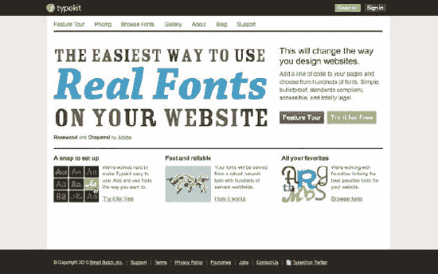

# 五、品牌实现

每个人都知道，在网上，我们的竞争对手只需点击一下鼠标。普通用户的注意力持续时间变得越来越短。很容易得出这样的结论:即使你网站的典型用户可能参与度稍高，你也应该确保网站有影响力，品牌体验被正确地转化到网络上。

品牌总是会影响网站的处理方式:它是如何设计的，它使用的语气——基本上，它如何通过在线媒体传达品牌信息。确保正确完成这一任务往往是营销和设计团队的能力。

尽管网页设计和开发团队通常不直接参与品牌建设，但他们面临着在网上实现品牌的挑战。他们还经常面临这样的挑战:让营销团队知道什么是网上可以做的，什么是不可以做的，为什么会有一些惯例(以及什么时候应该和不应该打破这些惯例)，以及为什么网络应该被视为一种有机地不同于印刷的东西，而不是一种仅仅遵循印刷视觉识别指南应该做的事情的媒介。

由于本书的主题是 CSS，我们将主要讨论品牌实现的美学方面。诸如品牌文化、处理客户反馈、处理表单和错误信息，或者发展和保持正确的语气等领域都不属于 CSS 领域(但我们希望您正在考虑)。

这一章没有详细介绍如何开发一个视觉品牌。相反，它假设已经存在一个品牌，并且品牌指导方针已经到位。它侧重于如何克服一些困难，以有效的方式实现这些准则。它涵盖了

*   什么是品牌
*   使用品牌风格指南和设计库
*   处理网络上的排版
*   处理色彩的有效方法
*   保持布局一致
*   处理主题变化
*   品牌演变

_________________________

Ron Kohavi 和 Roger Longbotham 在 2007 年发表的一篇名为“在线实验:经验教训”的文章中指出，在 Amazon.com，页面加载时间每增加 10 毫秒就会导致销售额下降 1%，而谷歌搜索结果显示时间每增加 500 毫秒就会导致收入下降 20%。

### 什么是品牌？

品牌通常被认为是公司、产品或服务最重要的资产——这是它区别于竞争对手的地方。但是我们不应该把品牌和仅仅用来识别它的标志混为一谈。品牌可以包含如下属性:

*   名称、徽标、标语
*   颜色、排版、图像
*   语音语调
*   价值观和使命
*   客户和反馈处理
*   店内体验
*   等等。

基本上，它包括与公司(无论是产品、服务还是组织)被感知的方式相关的一切；它传达给外部世界和内部员工的信息。

品牌有多种类型，但主要分为以下三类:

*   *伞式品牌*:这些品牌用于组织内的各种产品和服务，在内部和外部都有使用。例如，Amazon 是 Amazon Marketplace、Amazon MP3、Amazon S3、Amazon Mechanical Turk 等的总品牌。
*   *子品牌*:这些品牌虽然是单独推广的，但都与一个伞品牌相关联，以便继承和建立伞品牌的声誉。例如，奇巧、Aero 和 Smarties 是雀巢的子品牌。
*   *单个品牌*:这些品牌与它们的伞式品牌完全分开销售。例如，Schweppes、Sprite 和 Dr Pepper 等个别品牌都是由可口可乐制造的，但它们在营销时却没有提到它们的保护伞品牌。

熟悉这些术语(属于品牌架构的范畴)是一个好主意，因为当处理企业品牌时，这个组织经常反映子网站和小型网站将如何设计和开发，以及品牌将如何在它们之间实现。

### 品牌风格指南

有不同类型的品牌风格指南。有些只涉及品牌的视觉方面，如标志的使用、字体、颜色等。，而其他人则更深入地探讨品牌文化，谈论价值观、工作流程或如何在不同情况下处理客户关系等各种不同的主题。

风格指南通常是在考虑到印刷媒体的情况下开发的。这种情况大多发生在指南不是最近开发的时候，尽管令人震惊的是，现在生产的一些指南仍然不能提供如何在线处理品牌的参考。

当风格指南不能满足网络需求时，营销团队和经理会试图执行为平面媒体制定的规则。这导致了各种各样的问题。

最好的例子之一就是试图让网站页面表现得和纸质页面一模一样。为打印而设计的页面是静态的，打印后不会改变，而在线页面可能会受到内容团队或用户应用的各种更改的影响。长文章会影响页面的高度，更小或更大的屏幕尺寸会引入(或消除)滚动的需要，就像用户样式表可以使文本变大或变小一样，也会影响页面布局和流动。更不用说浏览器呈现字体的方式不同，演示的抗锯齿行为也不同。没有办法确定你的用户会看到你想要他们看到的东西。

这并不意味着在设计和编码在线页面时没有一定程度的控制，但这些只是几个例子，说明专门为印刷格式创建的视觉指南将如何使不直接与网络打交道(或至少不是日常工作)的部门更难理解如何以有机和集成的方式使品牌适应网络。

除了在组织中有一个人的工作是验证品牌的一致性(这个角色通常被认为是品牌经理)，所有员工都接受关于品牌应该传达什么的教育是有益的。这不应该仅仅局限于面向客户的角色和营销部门，因为组织中其他领域的人也面临着做出影响品牌认知度的日常决策。

例如，如果一个网站不能适应字体大小的变化，对于有视觉障碍的用户来说，整个体验就会被破坏，他们需要使用更大的字体。或者，如果一个新的页面需要添加到网站上，而它的设计不能恰当地代表品牌，访问者可能会觉得他或她不在同一个网站上，并被迫离开或失去对该网站的信任和好感。

开发者可能并不总是乐于处理影响品牌一致性的设计问题。通常，前端开发人员和 web 设计人员是团队中的不同成员(或者是完全独立的团队——有时甚至不在同一个建筑或国家),有时前端开发人员不得不做出他们可能不适应的设计决策。在这种情况下，灵活且适应性强的品牌指南应该到位，确保网站的一致性，并确保品牌不会因为越来越多的人摆弄样式表或添加新元素而被稀释。

一份全面的网络品牌指南文件应包括以下内容:

*   关于底层网格、其变体以及如何使用它的信息
*   排版信息:首选字体、后退和缩放信息
*   调色板(翻译成十六进制或 RGBA 等 Web 格式)以及应该如何使用它们
*   web 友好单位的度量，如像素、ems 或百分比
*   通用和可重用元素的规范，比如导航、按钮、小部件、表单、通知等等。

在本文档中提及在不同的浏览器中什么是可以接受的，什么是不可以接受的也是有用的。例如，它可能会指出，无论是否采用 PNG 或其他格式，公司的徽标和主要行动号召必须始终保持一致，以便采取必要的措施来确保这一点。

即使是最彻底的品牌风格指南也不能预见一切。开发者在某些阶段做出设计决策是不可避免的。虽然前端开发人员通常不需要有设计背景，但了解设计如何工作的基本原则将使设计决策落入他们手中的时刻变得更加容易和清晰。对于勤奋的读者，我们推荐马克·博尔顿的*网站设计实用指南* ( `[`fivesimplesteps.com/books/practical-guide-designing-for-the-web`](http://fivesimplesteps.com/books/practical-guide-designing-for-the-web)`)，这是五个简单步骤系列的一部分。这本书非常适合那些没有设计背景，想要实际例子和对基础知识有很好理解的人。

#### 指导方针不断发展

因为大型网站处于不断的变化和扩展中，所以引入新元素、设计新部件、为新部分创建新调色板等等并不罕见。随着设计的发展和成长，指南应该跟随它的脚步。品牌风格指南的主要目的首先是确保一致性；通过将越来越多的不同元素添加到设计人员和开发人员可以参考的中心参考中。为了确保他们没有重复别人已经定义的东西，指南需要保持更新。

如果在一个主要网站中实现了创建第三级导航的新标准，当下一个网站应用它时，它应该被用作参考。保持文档更新的方式可能比实际提出更多模式更复杂。尽管内部 wiki 通常是最简单的设置(特别是对于熟悉使用 wiki 的技术人员来说)，但设计和营销团队可能不习惯管理它们。

无论为此目的使用何种技术，最重要的是确保定期更新指南(可能是每周、每月或更少的频率，取决于新指南产生的速度)并将其存储在每个相关人员都可以轻松访问的中心位置；每个人使用一个系统的好处是巨大的。同样重要的是，有人(或团队)负责并监督这个存储库，这样就不会有重复，也不会有与现有元素的差异难以察觉的新元素——如果设计的每个新元素都产生一个新标准，那么就不会有标准。

#### 设计库

对于大型网站，将新标准添加到指南中的过程很可能(也应该)导致设计库的创建，其中所有的模式都存储为片段(图像、HTML 和 CSS)。但是，向库中添加新的模式并不容易——正如前面提到的，大多数时候重用现有的元素比向库中添加新的设计更明智。如果有人觉得有必要这样做，他们应该证明这一点，并确保到目前为止所创建的东西都不符合要求。这意味着品牌和设计有视觉控制，一切保持一致。这也意味着 CSS 不会失控，这使得每个人的生活更容易:更少的代码行，更少的冗余，更大的灵活性，更容易维护。然而，这也意味着引入到库中的元素需要足够灵活，以便可以注入到网站中的各种位置并按预期工作。

想象一下，在你的网站中你使用三种不同风格的列表框:简单框、双框和选项卡式框(见图 5-1 )。

***图 5-1。**设计库中有三个不同的列表框:所有设计都是一致的，但它们有不同的用途。*

这个设计很明显遵循了一个基本的模板，但是根据我们需要这个盒子有多突出或者它所容纳的内容类型，有三种不同的变化。对于这些框中的每一个，我们都提供了 HTML，因此不同的内容或开发团队可以使用相同的代码(这甚至可以作为模板文件或可以包含的文件提供，以便在一个地方更改标记会在所有地方更改它)。这里的目标是使 HTML 在框之间尽可能地相似(例如，很明显，简单框和选项卡式框中的标题需要不同的标记，但是双框不需要额外的元素作为内部背景色，您可以使用容器中的列表)。

这些框的 HTML 看起来像这样:

`< div class="box">
   < h2> Heading< /h2>
   < ol>
      < li>
         < p class="content"> Lorem ipsum…< /p>
         < p class="info"> 13 January 2011< /p>
      < /li>
      < li>
         < p class="content"> Curabitur…< /p>
         < p class="info"> 28 December 2010< /p>
      < /li>
   < /ol>
< /div>`

要在盒子的风格之间切换，我们只需向盒子容器添加另一个类。 2

不需要提供这个 HTML 片段的 CSS，因为我们可以确定它已经存在于网站的 CSS 中，但是图像示例应该显示这些框如何处理不同类型的内容，以及它们在页面中不同位置的行为。提供 Photoshop、Illustrator 或其他分层图稿文件也很有用，设计师可以在设计中复制并粘贴这些文件。这可以节省创建新设计的工作量，并确保它们之间的一致性。

_____________________

对于选项卡式的盒子，我们将在盒子容器中添加一个类(例如“tab”)，并为每个选项卡重复这个过程，用一个类(例如“tab”)将所有的 div 包装在一个容器中，然后使用 JavaScript 重写 DOM。这样，对于禁用了 JavaScript 的用户来说，我们的代码仍然具有语义意义。

很明显，拥有一个针对这种情况的设计库将节省大量时间，这些时间将被浪费在一些任务上，例如浏览网站的现有页面，试图找到类似于我们需要的盒子类型的东西，要求设计师提出已经到位但不容易发现的解决方案(导致许多设计相似，但不完全相同)， 或者在数百行 CSS 中复制和改编一些与现有的其他六种解决方案只有细微差别的内容，增加了冗余，降低了灵活性。

这些原则与面向对象的 CSS (OOCSS)所提倡的非常一致:通过可重用的类来实现灵活的 CSS，避免冗余并减小文件大小。这是一种模块化的 CSS 方法，其中每个模块可以放在标记中的任何位置，并且它将正确地工作，使自己适应它的位置，而不依赖于某些父或子来获得它的特征。你可以在第四章中阅读更多关于 OOCSS 的内容。

 **提示:** *模块化网页设计*，作者 Nathan A. Curtis ( `[`www.amazon.com/Modular-Web-Design-Components-Documentation/dp/0321601351`](http://www.amazon.com/Modular-Web-Design-Components-Documentation/dp/0321601351)`)在创作自己的设计库时是一个很好的资源。

### 排版

品牌指南应该为 CSS 作者提供在网站上保持一致排版的基础知识。除了显而易见的类型选择，他们应该陈述细节，如`font-size`和`line-height`、`font-weight`、边距和填充以及颜色。

在不进入设计领域的情况下，标题、正文、列表、引用等等有一个清晰的层次结构是很重要的，品牌指南的创建应该牢记这一点。

在网上使用字体是有法律含义的。字体是授权的，不是买的，每个字体代工厂都有自己的规则。您拥有的许可类型决定了您可以在哪里使用它们。以 Adobe 为例，说明了 OpenType 字体在文档中嵌入时可以有四种不同的权限设置类别:

*   *不嵌入*:这些字体在任何情况下都不能分享给未经授权的用户。这是最严格的许可形式。
*   *预览&打印*:这种许可方案的字体可以以只读方式嵌入电子文档中，例如 PDF 文件。
*   *可编辑*:以这种方式授权的字体可以嵌入到电子文档中进行查看、打印或编辑；任何更改都可以保存在初始文档中。字体不能从文档中导出，也不能安装在(未经许可的)最终用户的计算机上。
*   *可安装*:这些字体可以永久免费安装在用户的电脑上。

由于在网络上使用字体文件需要通过用户的本地缓存将它们(临时)安装在用户的计算机上，因此*可安装*类型的许可是唯一一种 100%安全使用的许可。这使得许多字体无法以这种方式使用。一些字体代工厂提供这种字体，但是在一个大型组织中，使用的字体很可能是授权给该组织的，因此不适合以这种方式分发。

Adobe 在`[`www.adobe.com/type/browser/info/embedding.html`](http://www.adobe.com/type/browser/info/embedding.html)`提供了关于其许可的更多细节，并在`[`www.adobe.com/type/browser/legal/embeddingeula.html`](http://www.adobe.com/type/browser/legal/embeddingeula.html)`提供了其字体和许可细节的列表。如果授权您的字体的字体制造商在其网站上没有类似的列表，那么联系他们以了解他们施加的许可限制是很重要的。如果您在没有正确许可的情况下分发字体，您的公司将承担责任。

然而，在网页中嵌入字体的替代方法*可以*使用*预览&打印*许可，只要只使用可用字符的子集。这就是 sIFR(可伸缩因曼闪存替换)如何合法地在网页上显示这些图像。只要一种字体的整个字符集不可用，以这种方式许可的字体就可以显示在网页上。

#### 图像替换与灵活性

在可能需要国际化并不断更新和添加内容的大型网站上，避免使用图像作为使用自定义字体的手段是至关重要的——今天，仅使用 CSS 就可以实现很多功能(我们不仅指 CSS3，也指 CSS2.1)。除此之外(特别是对于链接)，搜索引擎认为文本比`alt`属性更有价值。

虽然像徽标、横幅或主标题这样的重要元素可能会受益于您的组织所使用的自定义公司字体，但在按钮、导航或普通标题上使用图像时，您可能需要三思。

然而，这并不意味着使用非典型网页安全字体(例如 Arial 或 Verdana)是不可能的。随着`font-face`及其带来的 web 服务的出现(下一节将进一步解释)，为各种平台的用户提供定制字体是一项越来越简单的任务。

替换图像的老方法是用背景图像和高负值`text-indent`来实现的，以隐藏屏幕外的原始文本。例如:

`h2 {
   background: url(heading.png) no-repeat;
   text-indent: -1000px;
   height: 30px;
}`

使用这种方法有一些缺点:启用 CSS 但禁用图像的用户既看不到文本，也看不到背景图像替换(在图像是透明 PNG 的情况下，将文本留在图像后面不是一个选项)，图像文件降低了页面的速度，文本不可选择或缩放，并且不容易维护。

这种技术的一些变体包括，例如，在文本周围添加一个额外的元素，然后使用`display: none`(或`visibility: hidden`)通过 CSS 隐藏它。没有一种技术是完美的；每一个都显示了一个或多个问题的组合，如 CSS on/images off 场景，使文本对屏幕阅读器不可见或需要多余的 HTML 元素。

图像替换领域的另一个玩家是 Adobe 的 Scene7。它通常被大型组织用作自动创建带有自定义文本的标题或图像的方式。

提供自定义字体的其他选项通常被削减为库芬或 sIFR。

Cufón 依靠 JavaScript 工作，即使它允许选择文本，也没有清晰的视觉指示；sIFR 依赖 Flash 工作，这使得它不适合 iPhone 或 iPad 等设备，或者使用 Flash 阻止插件的浏览器。这两种技术也允许 CSS 作者嵌入字体，这些字体的发行许可证不允许它们在线使用。

Cufón 使用 HTML5 `canvas`标签(或 Internet Explorer 中的 VML)。与 sIFR 相比，它的一个主要优势是其更简单的实现和字体转换过程(你可以直接在项目的网站上完成:`[`cufon.shoqolate.com/generate/`](http://cufon.shoqolate.com/generate/)`)。将字体上传到生成器并指定所需的字符(这将减少字符集)后，您需要做的就是链接到 Cufón 脚本和包含字体轮廓的生成的 JavaScript 文件:

`< script src="cufon-yui.js"> < /script>
< script src="LillyRegular.js"> < /script>`

然后，您需要为想要使用 Cufón 的文本调用 JavaScript 函数。例如:

`< script>
        Cufon.replace('h1');
< /script>`

您还可以将生成的字体 JavaScript 表示锁定到特定的域，这样第三方就不能轻易下载和使用它。生成器中有一个选项可以做到这一点。

这两种方法都是可访问的，因为它们可以被屏幕阅读器读取(这使得它同时也是 SEO 友好的)。然而，Cufón 将每个单词包装在一个`span`中，这可能会导致一些屏幕阅读器将每个单词当作一个完整的句子来朗读，或者更糟糕的是，在每个实例中只朗读第一个单词。3

不幸的是，当用户在浏览器中改变字体大小时，Cufón 不会调整生成文本的大小；从版本 3 开始，sIFR 已经能够处理这个问题。

sIFR 最大的缺点是它使用 Flash(在 JavaScript 之上):如前所述，Flash 在一些设备上被阻止或不可用，所以用它们浏览你的网站的人会看到你的字体堆栈中的下一个可用字体。此外，您团队中的 CSS 作者可能不一定手头有创作 Flash 文件的工具来创建新文本(即使有插件可以使这一过程自动化，如 jQuery sIFR 插件)。这两种方法在执行时都会引入非样式文本(FOUT)的闪现。我们将在本章后面描述这个问题。

可缩放矢量图形(SVG)也可以嵌入字体，并且是可缩放的(与常规图像不同)。 4

所有这些方法都可以被认为是字体嵌入，但其合法性因字体而异。如果对您要使用的字体的最终用户许可协议(EULA)不清楚，我们强烈建议您直接联系字体制造商，查看您可以对该字体做什么。从法律上来说，sIFR 是比库芬更安全的选择，因为 Adobe Flash 被允许嵌入字体，许多字体代工厂在其 EULAs 中迎合了这种情况。Cufón 在网站上嵌入字体，这违反了许多字体 EULAs。

互联网浏览器 6 支持库芬和 sIFR。即使你可以自动化这两种技术的工作方式，它们也总是会消耗资源并增加你的网站的依赖性。像`font-face`(在下一节中提到)这样更干净的方法应该首先被认为是理想的解决方案。除了小部分文本(如标题)之外，不建议使用图像替换。

____________________

3 如果您将“单独”选项设置为“无”,这个问题会得到缓解。然而，Cufón 这样做的原因是它可以将文本换行到下一行。解决第一个问题会重新引入第二个问题。

4 我们不推荐使用 SVG 作为文本替换技术，因为早于 9 的 Internet Explorer 版本不支持它。你可以用 SVGWeb ( `[`code.google.com/p/svgweb/`](http://code.google.com/p/svgweb/)`)来伪造，但那用的是 Flash，所以你还不如用 sIFR。

在创建网络品牌指南时，将这些因素考虑进去是很重要的。如果这些困难还没有得到解决，网站需要依靠图片替换非网页安全字体，也许现在是更新指南的时候了。

#### 字体面

@font-face 规则是在 CSS3 中引入的，它允许 CSS 作者链接到他们可以在样式表中引用的字体。Internet Explorer 是第一个从版本 4 开始支持这一规则的浏览器(但是只支持其专有格式 EOT)。

 **注:** *嵌入式 OpenType (EOT)* 是微软为在网页上嵌入字体而创建的专有字体格式。众所周知，将字体转换成 EOT 格式的过程是痛苦的，微软的 Web 嵌入字体工具(WEFT)被大多数网页设计师普遍描述为离折磨不远。幸运的是，现在有其他工具可以实现类似的结果，比如 Font Squirrel 的@font-face Kit Generator(本章后面会提到)。

在撰写本文时，Internet Explorer 平台预览显示支持 WOFF 5 格式。

在@ `font-face`规则中，各种描述符可以提供像名称这样的信息，这些信息将在文件的后面用于引用字体(`font-family`；但是要注意 IE 不支持超过 31 个字符的名称)、字体文件所在的位置及其格式(`src`)或者字体的样式和粗细(`font-style`和`font-weight`)。以下是一个@ `font-face`规则的例子:

`@font-face {
   font-family: "Lilly";
   src: url("fonts/lilly.eot");
   src: local("LillyRegular"), url("fonts/lilly.woff") format ("woff"), url("fonts/lilly.ttf")
format("truetype"), url(" fonts/lilly.svg#LillyRegular") format("svg");
}
@font-face {
   font-family: "LillyItalic";
   src: url("fonts/lilly-italic.eot");
   src: local("LillyItalic"), url("fonts/lilly-italic.woff") format ("woff"),
url("fonts/lilly-italic.ttf") format("truetype"), url("fonts/lilly-italic.svg#LillyItalic") format("svg");
}`

_______________________

WOFF 字体格式是由 Mozilla 基金会与字体设计师埃里克·范·布洛克兰和塔尔·乐铭共同开发的，并且正在成为 W3C 的标准推荐(在由微软、Mozilla 和 Opera 提交之后)。开发 WOFF 时就考虑到了网络。它是一种压缩字体格式，基本上是将字体数据重新打包；TrueType 或 OpenType 等其他格式可以转换为 WOFF，字体许可信息等元数据可以附加到文件中。许多字体代工厂支持 WOFF，因为他们认为它更安全，所以很可能越来越多的商业字体将通过 WOFF 的 font-face 获得使用许可。

@ font-face 规则链接到五个不同的文件位置，因为不同的浏览器支持不同的字体文件格式。“本地”引用是为样式表提供使用本地版本字体的能力，如果它安装在用户系统中的话。还要注意，我们需要声明两个不同的@font-face 规则，以便拥有同一字体的常规和斜体版本。我们本可以使用`font-style`描述符来声明斜体变体，保持相同的`font-family`名称，但是 Internet Explorer 和 Opera(10.5 版本之前)将无法正确理解它。

Internet Explorer 在理解一些@font-face 规则语法方面有一些问题。它不理解`format()`提示或多个位置，并且它试图下载非 EOT 文件，即使它不能读取它们。这就是为什么我们在一个单独的声明中链接到 EOT 格式(后跟一个`local() src`描述符，它不解析这个描述符)。

添加本地字体名称时，请务必注明 Postscript 版本(如果与全名不同)，以便 OS X 上的 Safari 能够理解。

另一个需要考虑的重要因素是，在 Firefox (Gecko)中，字体文件必须与使用它们的页面来自同一个域。这可以通过允许跨站点 HTTP 请求的 HTTP 访问控制来规避。 6

Firefox 支持 TrueType 和 OpenType 格式(从 3.5 开始)，而 3.6 版本增加了对 WOFF 的支持；WebKit(525 版起)和 Opera(10.0 版起)支持 TrueType 和 OpenType，以及 SVG 字体；Opera 11 及以上支持 WOFF；Chrome 从版本 5 开始也支持 WOFF；Internet Explorer 从版本 4 开始就支持@font-face 规则，尽管它只接受 EOT 字体。

 **提示:** Font Squirrel 提供了一个自动化的“@font-face Kit Generator”，可以更容易地将字体文件转换成不同的格式(`[`www.fontsquirrel.com/fontface/generator`](http://www.fontsquirrel.com/fontface/generator)`)。

字体权限和在系统中安装字体管理器存在一个已知问题，当@font-face 规则尝试使用本地字体时，这可能会导致出现意外字符。为了避免这个问题，Paul Irish 提出了一个修改后的规则，让浏览器忽略`local()`引用，强制下载链接的字体:

`@font-face {
   font-family: "Lilly";
   src: url("fonts/lilly.eot");
   src: local("☺"), url("fonts/lilly.woff ") format ("woff"), url("fonts/lilly.ttf") format("truetype"), url("fonts/lilly.svg#LillyRegular") format("svg");
}`

通过使用一个不太可能用作真正字体名称的字符，这种语法避免了用户在计算机上安装 FontExplorer X 等软件时可能出现的任何问题，但可能会强制进行不必要的下载。

___________________________

6 在`[`openfontlibrary.org/wiki/Web_Font_linking_and_Cross-Origin_Resource_Sharing`](http://openfontlibrary.org/wiki/Web_Font_linking_and_Cross-Origin_Resource_Sharing).`阅读更多信息

 **注意:**每个浏览器都有自己的问题列表，在使用 font-face 时需要绕过。Paul Irish 在两个帖子中记录了其中的一些，这两个帖子经常更新，并且在`[`paulirish.com/2009/bulletproof-font-face-implementation-syntax/`](http://paulirish.com/2009/bulletproof-font-face-implementation-syntax/)`和`[`paulirish.com/2010/font-face-gotchas/`](http://paulirish.com/2010/font-face-gotchas/)`有几个开发人员的贡献。

虽然`font-face`允许在设计网站时有很大的灵活性，但在使用任何字体之前都需要考虑字体许可。还应该考虑带宽问题，因为字体文件往往很大，尽管这可以通过使用精简字符集和 gzip 字体文件来解决(WOFF 除外，它已经是一种压缩格式)，以及字体非常可缓存的事实。

 **注意:**如果需要支持多种语言，字体文件会很快变大。为了支持所有已知的语言，字体需要支持成千上万的字形。

许多在线服务现在为设计师提供了大型字体库，并使其易于嵌入网站中(见图 5-2 )。这可能是一种选择，但你需要记住，这些服务需要不断更新和付费订阅服务，你将依赖于别人的服务器和他们的正常运行时间。

***图 5-2。** Typekit(上图)和 Fontdeck(下图)是两项在线服务，允许您在网站中使用 font-face，同时提供托管服务并确保所有字体都获得在线使用许可。*

 **注意:**为了保护自己的字体，TypeKit 使用了 JavaScript，这就产生了 JavaScript 依赖。Fontdeck 使用纯 CSS 解决方案来提供其字体。

像 Font Squirrel 这样的免费服务都有可以免费使用的字体库(见图 5-3 )。通常你必须下载真正的字体文件并自己保存它们。字体松鼠提供各种字体格式，以适应每种浏览器(EOT，WOFF，SVG 等)。

***图 5-3。** Font Squirrel 有一个庞大的免费商业用字库。*

使用自定义嵌入字体比使用图像更好，但是您需要做好在某些浏览器中失败的准备，并且您需要意识到法律可能不会使这成为您或您的组织的可行选项。它还有效地使字体公开可用，并且第三方很容易以他们认为合适的任何方式下载和使用这种字体，这是许多保护其品牌的公司不愿意看到的。

#### 备用字体

CSS 作者必须预见到，不是每个用户都会在他们的系统上安装最佳字体。这包括确保样式表包括适当的备用字体，并验证网站的布局是否灵活，以适应字体大小的变化(一些字体可能比最佳字体大，如果不考虑这一点，可能会破坏布局)。

当选择备用字体时，不应该简单地根据它们是衬线字体还是无衬线字体来选择字体。您应该考虑一些因素，如备用字体的纵横比是否与首选字体相似。确定一种字体是否是合适的替代字体的一个简单方法是覆盖使用不同字体选项的单词，并检查其高度、宽度和粗细是否与最佳字体足够相似。你可以在 Photoshop 或 Fireworks 之类的程序中轻松做到这一点(见图 5-4 )。

***图 5-4。**如图所示，Chaparral Pro(深灰色)在 Times New Roman(右，浅灰色)中找到了比 Georgia(左，浅灰色)更好的退路，尽管并不完美。*

在使用与`font-face`相关的技术时，比如前面提到的 Typekit 或 Fontdeck，确保备用字体与首选字体相似是非常重要的。当使用这些字体时，网页在下载和向浏览器提供正确的字体时通常会有延迟，在一小段时间内显示下一个可用的字体。当这种字体的大小和比例与由`font-face`服务提供的字体不同时，页面上的内容将跳转，文本流将重新排列，这可能会干扰用户，特别是如果他们的连接速度很慢，或者如果他们有阅读和学习障碍，如阅读障碍。这被称为无样式文本闪现(或 FOUT)，无样式内容闪现(FOUC)的字体特定版本，当您可以看到网站的无样式 HTML 时，在 CSS 加载之前，或在 JavaScript 修改 DOM 之前发生。

属性可以最小化这个问题，不仅是当你使用服务和体验跳转的时候，也是当用户没有在系统中安装首选字体或者 ?? 不在的时候。如果使用一种备用字体，此属性允许您保留首选字体的纵横比。就拿下面这个 CSS 来说吧:

`p {
    font-family: Calibri, "Lucida Sans", Verdana, sans-serif;
    font-size-adjust: 0.47;
}`

`font-size-adjust`值将除以备用字体的原始`font-size`值，保留备用字体中首选字体的 x 高度。在前面的例子中，如果使用 Lucida Sans、Verdana 或默认的 system sans serif 字体，为了保持 Calibri 的纵横比，它们的`font-size`将除以 0.47。

 **提示:**一些推荐的字库可以在`[`www.awayback.com/revised-font-stack/`](http://www.awayback.com/revised-font-stack/)`找到。

#### 单位

文本可以在网页上以各种不同的单位类型设置，关于旧像素 vs EMS7的争论已经说得很多了。以像素为单位设置文本的两个主要优势满足了设计人员和开发人员的需求:我们对设计有更多的控制权，并且我们不需要执行复杂的计算来确定字体大小。缺点完全在于用户的领域:一些浏览器不支持使用像素设置的文本的字体大小调整。由此，应该很容易推断出使用更灵活的单位(如 ems 或百分比)的利弊。(我们将在第六章的中深入探讨单位的主题。)

虽然大多数新浏览器(甚至是 Internet Explorer 7)允许用户放大(缩小)整个页面，但他或她可能只想放大文本。如果文本以像素为单位设置，一些浏览器(如 IE 6 到 9)会忽略这个用户设置。放大整个页面也可能导致浏览器在更宽的网站上显示水平栏，这可能相当令人讨厌，因为它以网站设计者没有考虑的方式限制了用户的视区，并且如果它导致内容被裁剪，可能会使内容变得无意义。数量惊人的人选择缩放或调整字体大小，可能是因为他们有某种视觉或认知障碍，或者是不寻常的屏幕尺寸或分辨率。

无论你决定在你的站点中使用像素、ems 还是其他单位度量，指南都需要反映这一点。这是设计师(或设计师团队)的工作，制作指南，以确定哪些是最好的规模和比例使用。指南应该在默认场景中使用像素，例如 BBC 的全球体验语言(GEL)，其中字体比例和大小以像素表示，但网站的实际 CSS 使用 ems，因为它们是更容易访问的选择。

__________________________

em 之所以被称为 em，是因为它被认为是大写字母“M”的高度。事实上，根据印刷工 Robert Bringhurst 的说法，“em 是一个滑动的量度。一个 em 是等于字体大小的距离。在 6 点字体中，em 是 6 点；在 12 点字体中，em 是 12 点，在 60 点字体中，em 是 60 点。因此，一个 em 空间在任何大小上都是成比例的相同。”

***图 5-5。**英国广播公司的全球体验语言指南以像素为单位说明了允许的字体大小，尽管英国广播公司的网站使用 ems 作为字体大小。*

在 BBC 新闻主页上，头条新闻的`h2`级别标题的`font-size`值为 2.461em。这个数字可能看起来很奇怪，但是如果您查看最终计算的值(您可以使用 Firebug 来计算)，您会发现它实际上是 32px(假设您的浏览器使用默认的字体大小)。开发商是如何得出这个数字的？`body`元素的字体大小设置为 62.5%。由于默认的字体大小通常是 16px，这个老技巧使得 em 计算更容易:16 的 62.5%是 10。一个 em 等于 10 个像素。因为页面包装器和标题的祖先应用了“`font-size: 1.3em`”(使其计算值为“13px”)，所以我们需要计算 32px/13px，以了解我们必须增加多少子级的`font-size`，从而获得所需的 32px。听起来复杂吗？的确如此，这也是为什么尽管 ems 是一种更容易使用的解决方案，但是许多 CSS 作者都避免在他们的样式表中使用 EMS 作为字体大小单位。我们建议您花时间做这项工作，并在可能的情况下使用 ems。

 **提示:**在`[`topfunky.com/baseline-rhythm-calculator/`](http://topfunky.com/baseline-rhythm-calculator/)`和`[`jameswhittaker.com/journal/em-based-layouts-vertical-rhythm-calculator`](http://jameswhittaker.com/journal/em-based-layouts-vertical-rhythm-calculator)`有几个不错的 em 计算器。在`[`fordinteractive.com/tools/emchart/`](http://fordinteractive.com/tools/emchart/)`也有一个方便的参考图表。

### 颜色

颜色是品牌被感知的一个基本因素。一些品牌与它们的颜色联系如此紧密，以至于有时我们甚至不需要看到它们的名字，就能从它们的颜色和形状中认出它们(例如，*国家地理*的黄金矩形或可口可乐的红色字体)。

正因为如此，每个品牌风格指南几乎肯定会包括一个与颜色相关的部分:可以使用什么样的调色板，合适的组合和比例是什么，每种颜色在品牌色彩景观中代表什么，等等。

有了这些指导原则，重要的是实现团队了解它们，知道如何使用颜色以及如何将它们转换到 Web 上——前端开发人员甚至不知道他们正在构建或扩充的网站上应该使用预定义的颜色，更不用说了解这些颜色的适当用途了。这导致了设计者和开发者的挫败感，也稀释了用户的品牌。

对于设计师来说，了解色彩在印刷品和网络上的作用是不同的也很重要，首先，尽管印刷品对每个人来说看起来都一样，但每个用户都用不同的显示器或设备浏览网络，具有不同的功能、校准和配置。在开发风格指南时，网页设计师(和平面设计师一样)应该考虑到有视觉障碍或色盲的人，并确保设计中包含的颜色和颜色组合提供了适当的对比度，但这些问题属于易访问性范围，而不是本章的主题，因此将在第六章中进一步讨论。

品牌指导方针是首先考虑网络色彩，然后是印刷色彩，还是反过来是设计师的选择；只要有一个在网络上使用的定义好的和同意的调色板。

然而，一些视觉品牌指南并没有提及屏幕颜色。这可能是因为该指南是在互联网还没有被考虑的时候制作的，或者仅仅是因为它不完整。无论是哪种情况，都应该修改指南，以包括在 Web 上使用的适当的颜色参考，避免时间浪费和不精确的颜色使用，因为每个 CSS 作者都必须将 CMYK 和 Pantone 颜色转换为 RGBA、十六进制或网站的首选颜色格式， 8 ，并且这个过程应该由设计师或设计团队签署。

#### 多种配色方案

颜色是区分子网站或网站部分的有力工具。例如，如果你有一个面向儿童的子品牌，它可能会用更大胆、更明亮的颜色设计，而如果你的组织中有一个高级品牌，你可能会使用更经典、更优雅的颜色。

当构建子品牌和他们的网站时，从用户和开发者的角度来看，更容易保持网站范围内的一致性，同时保持差异清晰——我们希望他们知道他们仍然在我们的网站大家庭中，但看的是不同的产品。

Fox 是一个很好的例子，通过使用相同的基本模板，你可以有几乎无限范围的不同子网站，在这个例子中是每个节目。在 Fox 的例子中，加粗的背景图像与特定的节目相关，而链接配色方案遵循该节目的品牌。然而，页面布局和导航元素的设计和行为保持不变。这很好地展示了如何实现外观的变化，同时保持设计模板的一致性，借助颜色(和图像)进行区分，避免不和谐和不一致的用户体验。

________________________

8 CMYK、RGB 和 Pantone 颜色具有不同的色域(颜色子集)，一种颜色模型中的一些颜色在其他颜色模型中“超出色域”(无法准确再现)。在此阅读更多关于色域的信息:`[`en.wikipedia.org/wiki/Gamut`](http://en.wikipedia.org/wiki/Gamut).`

***图 5-6。**福克斯的《美国爸爸》和《厨艺大师》网站:这两个例子展示了如何通过使用相同的模板和不同的配色方案和图像来实现差异化。*

需要记住的一点是，用户很少按照颜色对网站的各个部分进行分组，也很少理解其意义(尽管组织内部的人和开发人员可能会理解),除非颜色已经与品牌相关联。这里提到的案例就是这样的例子；给你公司的各个部门标上颜色是完全不同的事情，因为他们不会被外界视为“品牌”

#### 颜色参考

除了生活在视觉样式指南中，在 CSS 文件本身中有一个调色板参考也很有用。在第二章第一部分中，我们展示了如何将它们包含在 CSS 注释中，这样对于作者来说总是有一个方便的参考。下面是一个如何在 CSS 文件顶部保留调色板的示例:

`/* Color reference:

Main text    #333333
Background   #f7f7f7
:link,
:visited     #dd4814
:hover,
:active,
:focus       #bc522d
…

*/`

您可以选择使用 CSSDOC 注释；你可以在第二章的中看到更详细的解释。这种方法要求您在两个不同的地方维护信息，尽管将这些引用保存在 CSS 文件中很方便，但您可能更喜欢更准确的单个引用点。

#### 动态色彩

使用动态 CSS 或编译器，如 LESS 或 Sass，大型网站上的颜色和颜色更新可以变得更容易管理。使用这些技术，您可以轻松地为最常用的颜色(如主文本、链接、背景或边框)设置变量，无需经常参考颜色指南来使用正确的十六进制代码或 RGB 参考。您甚至可以基于三种或四种主色生成整个配色方案，方法是将其他颜色基于这些主色并使用颜色计算。我们将在第九章中更详细地介绍这个主题。

#### 回退颜色

旧的浏览器不支持新的 CSS3 颜色格式，如 RGBA 或 HSLA。对于这些浏览器，您必须始终确保提供后备颜色。例如，如果在一个`div`上指定一个透明的背景颜色，你可以在 RGBA 浏览器之前提供一个声明(这个声明将被忽略，因为它不被支持):

`div {
   background-color: #b9cf6a;
   background-color: rgba(255, 255, 255, 0.3);
}`

在前面的例子中，我们没有指定准确的十六进制版本 255，255，255，因为那将是纯白色的。相反，使用拾色器工具(比如 xScope `[`iconfactory.com/software/xscope`](http://iconfactory.com/software/xscope)`)你可以选择一种近似透明色和它下面的基本色的颜色，给老的浏览器一个更精确的设计。这些备用颜色不太可能在品牌指南中指定，所以确保它们存在并被准确选择是一个勤奋和彻底的 CSS 作者的工作。安全总比后悔好，所以留个评论提醒自己更新回退颜色，以防原始颜色发生变化总是个好主意。

当使用 CSS 渐变时，记住总是指定一个后备背景颜色，确保在不支持它们的浏览器上，背景和前景之间仍然有足够的对比度。同样适用于使用图像作为背景色(确切地说，CSS 渐变实际上是动态生成的背景图像和*而不是*颜色)；始终为容器指定背景颜色，并始终在关闭图像并打开 CSS 的情况下测试网站——对于在禁用图像的情况下浏览(在较慢的连接或移动设备上)的用户来说，由于开发人员忘记定义背景颜色并依赖背景图像进行对比而无法访问内容可能会非常令人沮丧。慢速连接的用户也会看到你的网站在加载之前图像丢失了一会儿，而且屏幕变化越小，发生时对用户的干扰就越小。

### 布局

定义页面的基本结构是 CSS 网站编码的一个重要步骤，它将影响到整个过程。重要的是要有一个坚实的基础——一个定义好的网格，每个单独的页面都可以建立在这个网格上，而不是在需要的时候就把“s”扔到页面上。

网格和模板的使用也将提高 CSS 文件和设计的灵活性(和适应性)，有助于保持布局的一致性。

#### 网格

知道如何最好地使用网格是任何一个设计师的基本技能，无论是在网上还是网外。

然而，使用网格并不意味着创建僵硬的布局——它们是设计基础的一部分，有助于形成一个坚实的、考虑周全的结构，并有助于做出一些决定；但是，就像任何一套规则和约束一样，它们也会被打破。

Web 上一些最原始的布局是在适当定义的网格上组成的。我们来看一个例子(见图 5-7 )。

***图 5-7。**《连线》网站(上图)与网格叠加(下图)`[`www.wired.com/`](http://www.wired.com/)`*

正如你所看到的，即使它遵循一个网格，Wired 网站的设计也不觉得死板。反而感觉很有表现力，很有动感。

一个仔细考虑过的网格是灵活的，它适合于多种布局设计，有助于保持不同页面之间的一致性，并且它应该有助于保持品牌的一致性。然而，当网格最终确定时，设计者的工作还没有完成；如果一个好的网格的唯一目的是正确对齐页面上的每一个元素，那么它将毫无用处。

虽然正确的对齐是实现平衡与和谐的基本步骤，但设计的其他方面并不包括在内——元素的视觉层次、颜色、排版等等仍然需要考虑。设计不仅仅是在网格中定位元素。

试图将网格转换成 HTML 和 CSS 的一个缺点是，内容的自然流动(文档的轮廓)可能会被忽略，成为网格的附属。当布局开始表现得更像基于表格的旧布局时，就会发生这种情况。

尽管基于表格的网站在使用立体网格时几乎是完美的，但它们的一个(许多)缺点是形式不符合内容；内容遵循形式。内容在页面上的视觉位置比内容本身的意义和流动更重要。如果 HTML 基本上是创建要定位的框，就像表格一样，那么我们没有做到内容公正。

这是许多 CSS 框架采用的方法，也是许多 CSS 作者不喜欢使用它们的原因之一。

在图 5-8 中，我们有一个基本的 8 列网格；每列宽 100 像素，左右各 10 像素。

***图 5-8。**一个简单的 8 列网格的例子*

编写这种布局的第一反应可能是关注列并创建八个浮动在左侧的容器:

`div {
   width: 100px;
   float: left;
   margin: 0 10px;
}`

但是更有可能的是一个网格中的元素跨越了不止一列，如图 5-9 所示。

***图 5-9。**带有内容块的 8 列网格*

这个网格可以用许多不同的方法转换成 HTML 和 CSS，但是最佳的方法总是考虑到页面的实际内容和流程，并且保持顺序不变。网格是次要的，内容不应该成为它的从属；它仅仅是实现布局一致性和和谐性的一种手段。

在我们的示例中，我们可以从定义最重要的内容块开始，并从底层网格中提取它们的宽度:

`header {
   width: 940px; /* full width */
}
nav {
   width: 220px; /* 2*100px + 1x20px */
   float: left;
}
#highlight {
   width: 580px; /* 5*100px + 4x20px */
   float: left;
}

…

aside {
   width: 100px; /* single column = 100px */
   float: right;
}`

网格的存在是为了给设计者和 CSS 作者提供衡量标准，他们将在此基础上做出一些设计决策，这将使从设计阶段到编码阶段的翻译不那么容易带有主观性。如果负责 CSS 的人知道设计中跨越两列的元素自动为 220 像素宽，这将有助于设计保持一致性和平衡。

我们将在第十一章中更详细地介绍使用网格的过程，在那里我们将从头开始创建一个框架。

#### 模板

HTML 和 CSS 模板为作者提供了一个坚实的基础。模板是确保标题、导航、基本页面结构和版式等关键元素在一系列网站和子网站中保持一致的简单方法。

模板和 CSS 框架之间有一些不同，尽管它们的目的是交织在一起的。现有的 CSS 框架由预先构建的代码库组成，您可以根据手头的项目进行调整。有几个现存的 CSS 框架可供许多开发者和机构免费使用(我们将在第四章中介绍)，比如 960gs 或 Blueprint。在某些情况下，团队创建他们自己的 CSS 框架(我们强烈推荐这种方法，并在第十一章中介绍)。框架应该具有适应性、灵活性和模块化。

模板可以采取不同的方法。您可能有一个 HTML 和 CSS 模板，其中包括一个示例网站的页眉、主导航、内容区域和页脚，并且应该在您组织内的所有网站中使用。然而，这并不意味着这组文件允许框架所做的模块化和通用的方法。

模板是标记应该如何构造以及 CSS 如何绑定到它的基本示例——它们作为页面的框架而存在。理想的情况是基于现有的 CSS 框架构建 HTML 和 CSS 模板，这样开发人员就可以看到 CSS 文件如何被使用、覆盖和适应各种页面模板的活生生的例子。

### 主题

组织通常会根据相关的季节、假期和事件来改变网站的设计和内容，例如夏天的开始、圣诞节、新年或促销活动。

这些更新通常是显示网站没有停滞不前的好方法；它是不断更新的；最重要的是，背后的公司、产品或服务关心他们的客户做的同样的事情——这增加了参与度。

虽然有时品牌重塑可能只与一次性事件有关(例如，公司的 25 周年纪念)，但重复发生的事件也会引发这些更新(例如，每年一次，如圣诞节品牌重塑，或一年几次，如季末销售活动)。

季节性品牌重塑的最好例子之一是星巴克的圣诞节网站。除了重新装修他们在世界各地的商店以符合季节精神，星巴克还为他们的网站访问者提供了一个改进的设计，与商店和广告活动相协调，在完美的营销编排中(见图 5-10 )。

***图 5-10。**星巴克的圣诞主题网站有了全新的设计和布局。*

从设计的角度来看，设计人员的工作是处理更复杂的站点主题的创建，但是这些改变最终会落入 CSS 作者和其他开发人员的手中，他们需要能够用更新来覆盖现有的样式表。

这可以被看作是对 CSS 的一次考验:样式表需要足够灵活，这样覆盖一些规则就不会变成特定性的噩梦。

 **注:**注意到在本书中*特异性噩梦*这个术语被提及的频率了吗？这是因为我们对它太熟悉了，因为这是 CSS 作者经常面临的情况——非灵活和脆弱的样式表的结果。

如果 CSS 使用了过于特殊的选择器，当创建一个新的主题时，你将不得不创建更多特殊的选择器。理想情况下，您应该能够向`body`元素添加一个类或 ID，例如“christmas ”,或者在 HTML 的`header`部分的默认样式表之后链接季节性样式表，或者将新规则合并到现有的主文件中。

例如，Threadless 在`body`标签中添加了一个类，这样网站的某些元素就可以被定位，它们的 CSS 也可以随着改变而被覆盖(见图 5-11 )。

`.holiday_week_2_3 .footer_wrap {
    background: url(/imgs/sale/black_friday/bg_footer.jpg) no-repeat scroll center 30px
#ffffff;
    clear: both;
    overflow: hidden;
    padding: 90px 0 0;
}` 

***图 5-11。**以销售为主题设计的无线网站。*

你可以在第四章中阅读更多关于覆盖 CSS 文件的内容。

### 灵活的 CSS 和品牌进化

品牌不会永远不变。尽管最知名的品牌倾向于避免激进的品牌重塑，这可能会损害客户和公众对他们的看法，但我们也经常看到他们进行较小的更新，这些更新在外部几乎察觉不到，但仍然涉及到 web 实现团队的一些工作。

这些小的变化可能包括排版的改进、颜色的改变、整个网站使用的图像的更新、较小的布局和导航调整以及徽标替换等。

大公司每两三年更新一次他们的网站也并不少见。这可能有多种原因:整体品牌重新设计需要反映在网站上，网站看起来过时(这种情况尤其发生在它被设计成遵循迅速过时的网页设计趋势的情况下)，公司被重组，或者网站本身的内容被重组，等等。

甚至那些倾向于保持不变的品牌也会对他们的网站做一些小的改动，主要是因为媒体的快速变化的本质，也因为这些改动通常比，例如，重新装饰整个车队或为数千名员工重印文具的成本要低。

因为进行这些更改通常会有成本，而速度总是人们追求的目标，所以通过创建灵活的 CSS 文档来为这些更改做准备是很重要的，这些文档可以尽可能容易地更新以进行小的或大的调整。

这是本书的主旨:让你的网站的 CSS 具有适应性，容易被很多人使用，并且在需要的时候可以更新，而不破坏其他的东西。

当网站面临大规模更新或重新设计时，重要的是尽早决定是从头开始更好，还是现有的 CSS 灵活且易于适应变化。通常，如果底层标记被重做，这也意味着 CSS 需要被重新构造，因为标记的构建方式往往与 CSS 的组织方式直接相关。

然而，最常见的场景(以及那些使大型网站必须拥有专门的 web 团队的场景)与不太明显的持续更新有关，这些更新虽然很小，但会持续测试标记和 CSS 的健壮性。这可能是向主导航添加新链接、更新文本颜色以使其更易于访问、重新调整网格、创建新的侧边栏小部件，或者为不同语言的新版本准备站点——在任何 web 实现团队中常见的日常任务。

这些都是很好的例子，说明了为什么保持 CSS 的一致性和灵活性很重要，以及最新和详细的 CSS 和设计和品牌风格指南如何使实现新元素或扩展现有元素变得更容易。

### 总结

CSS 作者和前端开发人员的大部分工作是让设计在网络上变得生动。用户体验设计师、信息架构师、视觉和图形设计师将他们的知识和最大努力投入到创建独特的品牌和产品中。确保他们的工作执行得天衣无缝是至关重要的，因为这将影响您的组织在外部(和内部)的形象，并最终影响其成功。从事网络工作的专业人员需要考虑到许多方面，我们假设他们知道这种媒体的潜力，但也知道它的局限性。建立清晰的品牌和设计指导方针，确保每个人都知道并理解它们，并有一个建立设计规则但允许灵活性和效率的过程是每个大型网站团队应该努力的，也是本章应该帮助实现的。

在下一章，我们将讨论可访问性以及它如何影响你的 CSS。我们将关注可能影响我们用户的缺陷，以及您可以采取哪些措施来确保他们获得最佳体验。