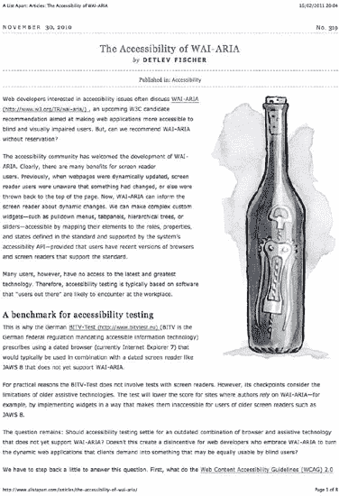
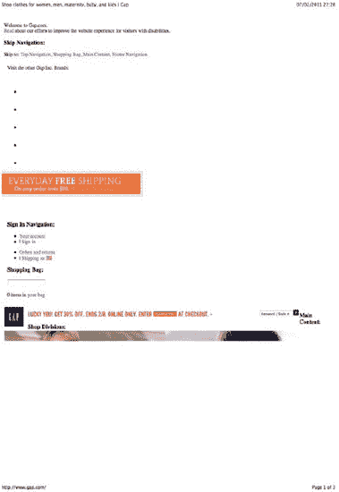
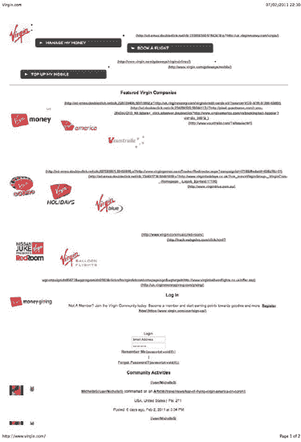
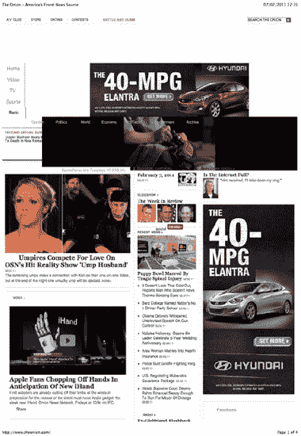
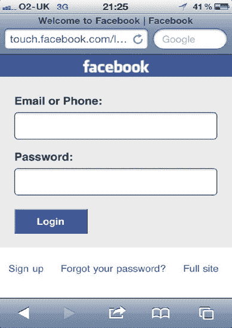
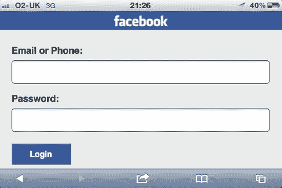
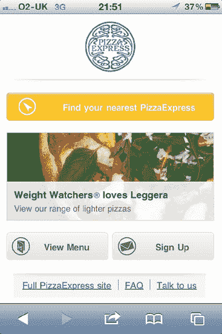
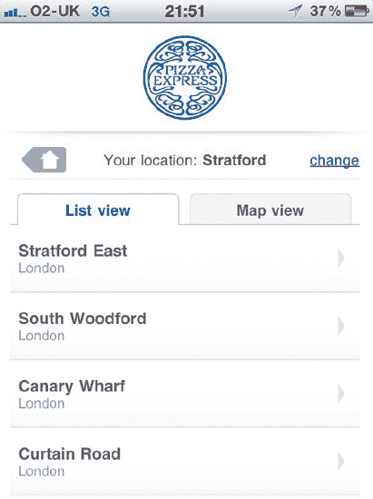

# 七、设备

在高流量的网站上，不寻常的设备比其他设备构成了更多的访问者。根据你网站的目标人群和你的报告工具的结果，你可能需要认真考虑这些设备。当我们从 CSS 的角度讨论设备时，实际上我们只是在谈论具有不同功能的浏览器。无论我们的 CSS 是提供给手机，笔记本电脑，还是搜索引擎蜘蛛，本质上它只是另一个网络浏览器，具有不同的分辨率和不同的能力来处理我们的 CSS。

每种设备都有不同的考虑因素；使用打印机时，我们需要注意分页符和灰度的清晰度，以及避免打印不必要的内容。对于移动设备，我们需要关注不寻常的屏幕尺寸和分辨率，以及缓慢的处理器或较差的 CSS 支持。屏幕阅读器也可以被认为是设备，但是我们在前一章已经详细讨论过了。

在本章中，您将了解

*   媒体类型
*   媒体查询
*   媒体特征
*   详细打印
*   具体的 SEO 注意事项
*   移动设备
*   其他设备

### 媒体类型

您的网站收到的流量越多，被不太可能或不寻常的设备访问的可能性就越大。虽然较小的网站可以忽略或忽视特定的设备和/或网络浏览器，但对于较大的网站来说，它们可能构成足够大的数量，需要作为重要的用户群来考虑。大公司非常重视他们的品牌和客户体验，至少你应该向任何有兴趣访问你网站的人展示合理的体验，不管他们用什么来浏览。为此，您需要实现各种方法来检测它们的平台并提供最合适的内容。

我们用来引用外部样式表的 link 标签中的 media 属性旨在标识样式表所针对的设备类型。如果设备/浏览器支持，它们将忽略不相关或未知的样式表媒体类型，并且不包括文件的内容。值得注意的是，大多数现代浏览器仍然会下载文件，即使它们不打算解析内容。 1 这意味着从性能角度来看这种方法没有用——它实际上比不使用它会招致更多的 HTTP 请求——而只对特定的浏览器或设备有用。

你实际上可以通过三种方法来定位媒体。第一个是在链接标签内，就像这样:

`<link rel="stylesheet" href="style.css" media="**screen**" />`

第二种是通过@import 指令:

`@import url(style.css) **screen**;`

@import 命令必须始终位于样式表中任何其他规则之前(其他@import 命令除外)。同样，大多数现代浏览器下载文件，即使它们不会解析文件的内容。无论如何，我们不建议您使用@import 规则，因为它们会阻止对文件其余部分的解析。

最后一种方法是@media 指令，它允许我们只使用特定媒体类型的文件的特定部分。这里有一个例子:

`@media **screen** {
   body {
      font-family: arial;
   }
}`

这只针对报告支持屏幕媒体类型的浏览器和设备。

对于所有这三种方法，您可以用逗号分隔媒体值，以针对多种类型，如下所示:

`<link rel="stylesheet" href="style.css" media="**screen, print**" />

@import url(style.css) **screen, print**;

@media **screen, print** {
   body {
      font-family: arial;
   }
}`

在这些情况下，如果浏览器或设备仅支持其中一种媒体类型，仍将解析文件/规则。

对于每种媒体类型，都有一些重要的因素需要考虑。这些被称为*媒体组*。

分页媒体(由页面组成的媒体，如打印的文档，而不是像屏幕上显示的网页一样的长文档)支持一些连续媒体没有的额外属性 2 网格媒体(与位图媒体相反)认为固定宽度字符很重要。例如，盲文媒体需要字符具有可预测且一致的宽度，以便用户能够理解。我们可以按静态、交互或两者来分组，表明目标是只读的还是可以交互的。媒体还可以分为视觉、听觉、语音(对于屏幕阅读器)或触觉(对于通过触摸进行交流的设备；例如盲文)。

__________

这是为了使它们的内容仍然可以通过 CSS 对象模型(CSSOM)来访问，并被列在 document.styleSheets 中，可以通过 JavaScript 来访问 document . style sheets，以给出附加到文档的所有样式表的详细信息。

我们将在本章后面提到它们。

让我们来看看 CSS2 规范中定义的媒体类型。

#### 全部

虽然不是真正的媒体类型，但 *all* 适用于以下所有媒体类型，因此适用于所有媒体组。如果不指定媒体类型，这是默认行为。

#### 盲文

盲文是一种传达字符的触觉方法，主要由盲人使用。盲文触觉反馈设备的功能各不相同。该规范将这种媒体类型描述为连续的而不是分页的(可以输出分页媒体的盲文打印机被认为是在浮雕媒体类型中)、触觉的、网格的以及交互和静态的。

#### 浮雕

*浮雕*介质类型类似于盲文类型，但旨在通过盲文打印机输出。因此，它被认为是分页的(而不是连续的)和静态的。除此之外，它与盲文类型完全相同。

#### 手持

*手持*型旨在瞄准手机等手持设备。这些设备通常连接速度较慢，屏幕较小，因此需要区别对待。由于手持设备的功能差异很大，它们被认为是除了触觉以外的所有媒体的一部分。??

手持设备的性能从差到强，以及介于两者之间，并提供许多不同的浏览器。由于它们变化如此之快，我们建议使用媒体查询(将在本章后面介绍)来定位它们，而不是仅仅依赖媒体类型。但是请记住，您不能依靠媒体类型或媒体查询来控制下载的内容；浏览器或设备可能会选择下载所有内容，因此没有性能优势。

由于目前的手持设备，如智能手机和平板电脑，尽最大努力呈现网络，而不是网络的精简版本，因此大多数设备实际上都是“屏幕”媒体类型的目标。WebKit (Mobile Safari 和 Android)和 Firefox Mobile 完全忽略这种媒体类型。如果用户在设置中切换到“手持模式”，或者文档具有已知的移动 doctype，Opera Mini 和 Opera Mobile 将尊重它。

#### 打印

*打印*介质类型专门适用于打印介质输出，因此被视为分页、可视、网格和静态。我们将在本章后面详细讨论印刷媒体和分页媒体。

__________

事实上，自 2009 年 9 月以来，诺基亚已经开始在手机上试验盲文阅读器。

#### o 投影

*投影*媒体类型用于投影输出，通常是投影仪。因为这种输出通常来自无人终端，所以被认为是分页的、可视的和位图的。规范将它列为仅交互，我们认为这是一个错误。Opera 在全屏呈现模式(Opera Show)下尊重这种媒体类型。我们不知道任何其他浏览器或设备实现了这一点。

#### 屏幕

*画面*媒体类型无疑是最常见的类型。主要用于电脑屏幕(台式机和笔记本电脑)，这是你最有可能使用的媒体类型，与*和*一起使用。几乎所有的设备都使用这种媒体类型，不管它是否是为他们设计的，因为这些设备中的大多数都打算在 web 浏览器中呈现互联网，而不是一个简化的版本。屏幕被认为是连续的、位图的，既有交互的也有静态的，既有视觉的也有听觉的。

#### 演讲

*语音*媒体类型适用于任何能够以声音方式阅读页面内容的设备或应用程序，例如屏幕阅读器或其他辅助技术。在旧的规范中，它被称为*听觉*(现在已被否决)，所以最安全的做法是同时针对两种媒体类型，就像这样:

`<link rel="stylesheet" href="style.css" media="**speech, aural**" />`

这种媒体类型被认为是连续的、语音的、交互的和静态的。网格或位图媒体组在这种情况下不适用。你可以在`[`www.w3.org/TR/CSS2/aural.html`](http://www.w3.org/TR/CSS2/aural.html)`阅读更多关于这种特定类型的样式表。

#### tty

这种媒体类型(是“电传打字机”的缩写)适用于使用“固定间距字符网格”(即宽度完全相同的字符网格)的媒体。由于这种媒体类型没有字符像素大小的概念，作者不应该提供它们。目前这种类型的设备非常少，支持互联网的就更少了，所以对这种媒体类型的支持和使用非常少。这种媒体类型被认为是连续的、可视的、网格的、互动的和静态的。

#### 电视

这种媒体类型是为电视机设计的。尽管规范将这些设备列为“低分辨率、彩色、有限滚动屏幕、可用声音”，但电视机的性能差异很大，这种描述通常是不正确的。当前的大型电视通常比它们的监视器提供更高分辨率的屏幕，有时甚至包括网络浏览软件和滚动能力。由于这些功能上的不一致，电视媒体类型被认为是连续的和分页的、可视的、音频的、位图的、交互的和静态的。

 **注:**虽然屏幕和印刷品是目前最常用的媒体类型，但我们知道除了`tty`之外，还有使用所有媒体类型的设备。媒体类型被添加到规范中，但不一定由设备制造商实现，这通常是因为开发人员很少实现。

其他设备可能支持此列表中未定义的媒体类型，但我们建议不要使用它们。您可以在`[`www.w3.org/TR/CSS2/media.html`](http://www.w3.org/TR/CSS2/media.html)`了解更多关于媒体类型的信息。由于媒体类型现在很少足以描述设备或浏览器的功能，CSS3 引入了*媒体查询*，它为我们提供了必要的工具来根据设备的特性和功能而不是(或与)其媒体类型来定位设备。大多数当前的移动设备(包括平板电脑)都支持媒体查询，如果您打算使用这些设备，我们建议您使用它们。

### 媒体查询

媒体类型可以让我们有能力针对我们可能期望浏览我们网站的一些设备，但它们在设备中的实现是不完整的。新设备的支持更加可预测，尤其是那些高流量网站可能会有大量访客的设备。同样，这些设备可能只占你总流量的一小部分，但仍然是很大一部分人。媒体查询让我们能够更好地控制目标设备和浏览器。

媒体查询由两部分组成:一个媒体类型和零个或多个将根据媒体特征进行检查的查询。当媒体类型与设备类型匹配并且所有查询都为真时，应用媒体查询。如果列出了多个媒体查询(使用逗号分隔的列表)，则只有一个媒体查询需要为真。

这里有一个简单的例子:

`<link rel="stylesheet" href="style.css" media="screen and (min-width:800px) and (max-width:1500px)" />`

除了针对支持“屏幕”媒体类型的浏览器和设备，我们还声明设备的视窗宽度必须至少为 800 像素，最多为 1，500 像素。我们在上面括号中命名的功能称为“媒体功能”。您可以将逗号分隔的媒体查询(与媒体类型完全一样)作为速记，如下所示:

`<link rel="stylesheet" href="style.css" media="tv, projection, screen and (min-width:800px) and (max-width:1500px)" />`

在这种情况下，每个逗号分隔的值都是作为一个整体进行计算的，(跟在“和”后面的部分仅适用于紧接在它们前面的媒体类型)。前面的媒体查询与下面的相同:

`<link rel="stylesheet" href="style.css" media="tv" />
<link rel="stylesheet" href="style.css" media="projection" />
<link rel="stylesheet" href="style.css" media="screen and (min-width:800px) and (max-width:1500px)" />`

每个列表中可以使用多个“and”子句。您还可以使用“not”来否定整个媒体查询。但是，您不能否定查询的个别部分。以下将起作用:

`<link rel="stylesheet" href="style.css" media="not screen and (min-width:800px) and (max-width:1500px)" />`

这将只解析任何浏览器或设备的 style.css，如果不应用“not”关键字，查询将失败(不支持媒体类型`screen`，或者视口宽度小于 800 像素，或者视口宽度大于 1500 像素)。以下(以及尝试相同操作的其他变体)不起作用:

`<link rel="stylesheet" href="style.css" media="screen and (min-width:800px) and not (max-width:1500px)" />`

对于任何习惯于基本条件逻辑的开发人员来说，这种粒度的缺乏都是令人沮丧的。要以这种方式定位多个功能集，必须首先将默认行为应用于所有设备，然后为每个设备覆盖此行为，如下所示:

`/* Applied to every device and browser */
body {
   color: black;
}

@media screen and (min-width:800px) {
   /* Only applied to screen devices with a viewport width of at least 800 pixels */
body {
   color: red;
   }
}`

每当用户代理(浏览器或设备)不理解媒体查询时，它就被认为是“不是全部”——即，它将不应用链接的样式表或查询的内容。

“only”关键字可用于确保只有符合 CSS3 的浏览器才会应用该样式表。

`<link rel="stylesheet" href="style.css" media="only screen" />`

在媒体查询的开头使用“only”关键字将对不支持它们的旧浏览器隐藏媒体查询(因为它们会认为“only”是媒体类型的名称)，而兼容的浏览器将忽略“only”关键字并检查其后的媒体查询。

和在`link`标签中一样，媒体查询可以在 CSS 文件中以另外两种方式使用，就像媒体类型可以单独使用一样:

`@import url(style.css) screen and (min-width:800px) and (max-width:1500px);

@media screen and (min-width:800px) and (max-width:1500px) {
   body {
      font-family: arial;
   }
}`

 **注意:**浏览器会下载链接的文件，即使这些文件不会应用于相关文档。

当媒体特性将评估为非零值(不考虑单位)时，您不需要提供值。例如:

`<link rel="stylesheet" href="style.css" media="all and (width)" />`

该样式表将总是被应用，因为视口的宽度将总是大于零(可能主要是听觉设备除外)。你不会使用这种方法；我们只是把它作为一个例子。

在我们深入了解可用的媒体特性之前，有必要花点时间讨论一下视口本身。视区是设备上可用的呈现大小，不包括任何浏览器镶边。

随着 Mobile Safari 的推出，苹果还推出了*viewport meta tag4。*

viewport `meta`标签给你一些对视窗大小和行为的控制。虽然这是 HTML，但理解我们将在本章中涉及的一些概念是很重要的。这里有一个简单的例子:

`<meta name="viewport" content="width=device-width" />`

名称“viewport”标识了这个`meta`标签。内容属性包含我们想要传递的值。属性是用等号分开的键/值对；您可以用逗号分隔它们，想要多少就有多少。我们可以使用两个重要的常数:

*   *设备宽度*:设备的实际像素宽度(横向)
*   *设备高度*:设备的实际像素高度(横向)

还有六个我们可以使用的重要属性:

*   *width* :视口的初始宽度(横向)，以像素为单位。该值也可以是这两个常数中的任意一个。默认值(在 Mobile Safari 上)为 980 像素。
*   *height* :视口的初始高度(横向)，以像素为单位。该值也可以是这两个常数中的任意一个。默认值是根据设备的宽度和纵横比自动设置的。
*   *初始比例*:比例是一个乘数，用于计算视口的大小。例如，如果我们将视口宽度设置为 400 像素，比例设置为 1.5，则视口实际上将为 600 像素，并在可视区域之外水平延伸 200 像素。此属性设置初始比例值。默认情况下，它通常会被自动设置为适合可见区域中整个网页的值。用户可以缩放设备来调整该值。
*   *最小比例*:设置用户可以缩放到的最小比例。
*   *最大比例*:设置用户可以缩放到的最大比例。
*   用户可缩放的(user-scalable):设置用户是否可以调整视窗的大小——是否可以缩放。潜在值为*是*或*否*。默认值为是。

__________

4 你可以在[`developer . apple . com/library/safari/# documentation/apple applications/Reference/safari html ref/Articles/meta tags . html`](http://developer.apple.com/library/safari/#documentation/AppleApplications/Reference/SafariHTMLRef/Articles/MetaTags.html)阅读关于 viewport 元标签的内容，以及在[`developer . apple . com/library/safari/# documentation/apple applications/Reference/safari web content/usingthe view port/usingthe view port . html`](http://developer.apple.com/library/safari/#documentation/AppleApplications/Reference/SafariWebContent/UsingtheViewport/UsingtheViewport.html)阅读关于 viewport 的具体内容。

 **提示:** Opera 提出了用 CSS 实现同样事情的方法，而不是用 HTML，这样更合适。遗憾的是，目前还没有真正的支持，但是你可以在`[`dev.w3.org/csswg/css-device-adapt/`](http://dev.w3.org/csswg/css-device-adapt/)`阅读规范。

重要的是，视窗可能会超出可视区域，但绝不会小于可视区域。这很重要，因为我们在媒体特性中使用了`viewport`。CSS3 规范中定义了许多媒体功能。我们将在下面的章节中列出这些。

#### 宽度

*宽度*媒体功能适用于视窗(连续媒体)或“页面框”(分页媒体)的宽度。 5 有虚拟视口的地方(即比例大于 1)这适用于整个视口的宽度，而不仅仅是可渲染的屏幕空间。

它接受大于零的数字(任何小于零的数字都会使查询无效)。您可以(像许多媒体功能一样)在 width 前面加上`min-`和`max-`，就像上面的例子一样。当分别大于或等于和小于或等于时，它们实际上起相同的作用。 6

可以使用任何单位，但是在使用相对大小的单位时，这些单位将相对于文档的根元素(即`html`标签)。

#### 身高

*高度*媒体功能的行为与其“宽度”功能完全相同，但应用于视口的高度。

#### 设备宽度

*设备宽度*媒体特性描述了设备的整个呈现表面(即可显示区域)的宽度。对于屏幕，这是屏幕的宽度。对于分页媒体，这是页面的宽度。同样，您可以使用`max-`和`min-`作为前缀，任何小于零的值都将导致无效的媒体查询。这使用实际的屏幕宽度，而不是您可能已经用 viewport `meta`标签设置的虚拟视窗，或者用户可能已经通过在他的设备上缩放页面而修改的虚拟视窗。

#### 设备高度

除了高度之外，*设备高度*媒体功能与`device-width`完全相同。

__________

在 www.w3.org/TR/2009/CR-CSS2-20090908/page.html#page-box[的 CSS 2.1 规范中定义的 5 。](http://www.w3.org/TR/2009/CR-CSS2-20090908/page.html#page-box)

我们决定避免使用<和>字符，因为它们可能会与 HTML 中的字符冲突。

#### 方位

*方向*媒体特征有两个可能的值:`landscape`和`portrait`。如果宽度视口大于高度，则方向为横向。否则就是人像。如果在查询中使用此媒体功能，您应该始终向其传递一个值。使用不带值的方向会导致浏览器或设备不应用 CSS。

 **注意:**没有方向的“平方”值。如果宽度和高度值完全相等，则方向被视为纵向。

#### 长宽比

*纵横比*媒体特征是视口的宽度与高度之比，用正斜杠分隔。这里有一个简单的例子:

`@media screen and (aspect-ratio: 4/3) {
   …
}`

#### 设备纵横比

*device-aspect-ratio*media 特性描述了设备的整个可呈现区域的宽度与高度之比，用正斜杠分隔。

#### 颜色

*颜色*媒体特性描述了设备每个颜色组件的位数。例如，如果器件的红、绿、蓝三色各使用四位，则该值为四。如果由于某种原因，每个组件使用了不同的位数，则最小的位数就是值。如果设备不是彩色的，或者不是可视的，这个数字将为零。您可以将`min-`和`max-`用于彩色媒体功能。

#### 颜色指数

*颜色索引*功能用于查询设备一次可以显示的颜色数量。这通常比彩色媒体功能更直观。设备通常支持 16 个；256;65,536;或者 16，777，215 种颜色。您可以将`min-`和`max-`与`color-index`一起使用，非彩色或不可视的设备会将该值显示为零。

 **注意:**在媒体查询中，您可以在数值中使用逗号，这对易读性有很大帮助。下面的例子就可以了:

`    <link rel="stylesheet" href="style.css" media="screen and (min-color-index:1,001)" />`

#### 单色

*单色*媒体特性描述了设备支持单色显示的位数(实际上，数字越大，可以显示的黑白灰度就越多)。您可以将`min-`和`max-`用于此媒体功能，如果设备是彩色的或没有显示，该值将为零。

#### 分辨率

*分辨率*媒体特性以每英寸点数(DPI)或每厘米点数(DPCM)来描述设备上的像素密度；您应该在媒体查询中使用这些单位(分别为 DPI 和 DPCM)。此媒体功能支持`min-`和`max-`前缀。如果使用带有非方形像素和`min-resolution`的设备，将使用密度最小的尺寸(DPI 较小的尺寸)。使用`max-resolution`时，将比较最密集的尺寸。如果对非方形像素使用“分辨率”(用于精确匹配)，则样式表永远不会被应用。此介质功能仅适用于基于位图的介质，将其应用于网格介质会导致整个介质查询被视为“非全部”

#### 扫描

*扫描*媒体功能专门适用于电视(以及`tv`媒体类型)。适用值为“渐进”和“扫描”。如果设备不是电视机，则该值将评估为零。

#### 网格

*网格*媒体功能描述设备是基于网格还是基于位图。对于网格输出设备，该值为 1；否则为 0。

 **提示:**媒体查询将被即时评估。也就是说，如果您已将媒体查询设置为应用于视窗小于 900 像素的设备，并且您正在使用具有可调整视窗大小的设备，则调整窗口大小将导致查询立即被应用或取消应用。

您可以在`[`www.w3.org/TR/css3-mediaqueries/`](http://www.w3.org/TR/css3-mediaqueries/)`了解更多关于媒体查询的信息。

自从在 WebKit 中引入 CSS 转换、过渡和动画以来，规范中定义的基本媒体特性显然不足以只针对支持它们的浏览器。为此，WebKit 定义了四个专有媒体功能，将在以下几节中讨论:

#### 二维变换

*transform-2d* media 特性描述了 CSS 变换在二维空间中的可用性。如果可用，该值将计算为 1，如果不可用，将计算为 0。

#### 变换-3d

这个媒体特性描述了 CSS 转换在三个维度上的可用性。如果可用，该值将计算为 1，如果不可用，将计算为 0。由于支持跨二维的 CSS 转换是该特性可用的必要条件，因此您可以根据该特性的值 1 安全地推断出`transform-2d`的值也为 1。

#### 过渡

*过渡*媒体特征描述 CSS 过渡的可用性。如果可用，该值将计算为 1，如果不可用，将计算为 0。

#### 动画

*动画*媒体特征描述了 CSS 过渡的可用性。如果可用，该值将计算为 1，如果不可用，将计算为 0。

 **注意:**遗憾的是，你不能用“not (-webkit-animation)”这样的话来定位不支持这些媒体功能的设备媒体查询中的任何未知特征将立即使媒体查询等同于“不是全部”。对于这些设备，您需要设置默认行为，然后覆盖它，就像我们之前演示的那样。

虽然在`[`webkit.org/specs/MediaQueriesExtensions.html`](http://webkit.org/specs/MediaQueriesExtensions.html)`和`[`developer.apple.com/library/safari/#documentation/appleapplications/reference/SafariCSSRef/Articles/OtherStandardCSS3Features.html`](http://developer.apple.com/library/safari/#documentation/appleapplications/reference/SafariCSSRef/Articles/OtherStandardCSS3Features.html)`描述并记录了所有这四种媒体特征，但事实上它们(在撰写本文时)无法在实践中使用。它们都需要特定于供应商的 WebKit 前缀才能正常工作。以下是工作介质功能的完整列表:

*   `-webkit-transform-2d`
*   `-webkit-transform-3d`
*   `-webkit-transition`
*   `-webkit-animation`

使用媒体查询可能会令人沮丧，但重要的是要记住规范一直在发展。现在，这里有四个要点可以帮助您在开发和使用媒体查询时避免困惑:

*   “not”关键字否定整个查询。您不能否定媒体查询的单个元素。
*   在介质查询中没有“或”运算符(尽管您可以用逗号分隔整个介质查询)。
*   无论媒体查询如何，都将下载外部引用的文件。不要假设将媒体类型应用于单独的文件会给你带来任何 HTTP 性能上的好处。相反，这实际上会导致更多的文件请求。
*   特定于 WebKit 的媒体功能需要供应商前缀。

### 现代化

由开发人员 Faruk Ateş、Paul Irish 和 Alex Sexton 创建的 Modernizr ( `[`www.modernizr.com/`](http://www.modernizr.com/)`)是一个 JavaScript 库，用于检测和公开浏览器功能。它的工作原理是向页面的`html`元素添加类；这些类指示浏览器中是否存在特定的特性(准确地说是 HTML5 和 CSS3 特性)。Modernizr 不支持浏览器中的功能；它只是说明它是否可用。它还支持在 Internet Explorer 等功能较弱的浏览器中设计新的 HTML5 元素。

要使用 Modernizr，您只需要在 HTML 文档的头部链接到它，就像这样:

``

其次，您需要在您的`html`标签中添加一个“no-js”类。这将是页面的默认状态。如果 JavaScript 关闭，Modernizr 将无法工作，您将能够检测到这一点，并向您的用户提供页面的非 JavaScript 版本:

`<html class="no-js">`

如果启用了 JavaScript，类似于下面的各种类将替换该类:

`<html class="js canvas canvastext geolocation rgba hsla multiplebgs borderimage borderradius boxshadow opacity no-cssanimations csscolumns no-cssgradients no-cssreflections csstransforms no-csstransforms3d no-csstransitions video audio cufon-active fontface cufon-ready">`

在前面的示例中，我们可以看到有问题的浏览器(在本例中为 Firefox 3.6)不支持 CSS 动画、CSS 渐变、CSS 反射、3D 中的 CSS 变换或 CSS 过渡(分别来自类“no-cssanimations”、“no-cssgradients”、“no-cssreflections”、“no-csstransform3d”和“no-csstransitions”)。它支持其他功能，如画布和地理定位。

有了这些知识，我们现在可以相应地编写 CSS。假设我们想给页面的`body`元素添加多个背景。我们可以首先为所有浏览器指定默认样式，然后用一个更具体的样式覆盖该样式，该样式只针对支持该功能的浏览器，如下所示:

`body {
        background: url(simple.png) top left repeat-x;`
`}
.multiplebgs body {
        background: url(multiple-top.png) top left repeat-x,
        url(multiple-bottom.png) bottom left repeat-x;
}`

在前面显示的`html`元素的例子中，Firefox 3.6 可以理解并显示多种背景。例如，Internet Explorer 8 将只显示“simple.png”背景图像，因为它使用的类将是“no-multiplebgs”。

同样重要的是要注意，在前面的例子中，Firefox 3.6 实际上会下载这两个图像，因为这两个规则都可以应用(即使不太具体的规则被覆盖)，所以即使我们确保满足用户可以和不可以看到这些功能，我们也通过让他们下载完全不必要的文件来惩罚那些可以看到这些功能的用户。我们可以通过使用"来避免这种情况。在我们的第一条规则中，不要只说“body”

尽管这是一个简单而有用的解决方案，但在您考虑使用它之前，请记住，Modernizr 会产生非常冗长的 CSS，所有用户都可以下载它，但不一定会应用它，而且它会在您的 CSS 中添加一个 JavaScript 依赖项，这远非理想。

### 打印样式表

打印样式表需要被认为是一个特例。用户经常想要打印你网站上的页面，你可以用不同于一般用户的方式来满足他们的需求。打印你的内容的用户是有兴趣的用户，用不必要的内容或不适合他们媒体的页面来打击他们会降低他们对你的网站和你的公司的好感。另一方面，以清晰友好的形式向他们提供他们需要的信息表明了对细节的关注和对他们需求的考虑。制作一个基本的打印样式表是非常容易的，如果你的标记和 CSS 是经过深思熟虑的，它通常会非常简洁，并且在你的整个网站上运行良好。

包含打印样式表很容易。我们将在此重申如何最好地实现这一目标:

`<link rel="stylesheet" href="print.css" media="print" />`

您可以使用@import 命令来实现同样的事情，但是这对于非常旧的浏览器来说是行不通的。您还可以使用@media 命令专门针对打印设备，但这同样会排除较旧的浏览器。对于打印您的内容的用户，您需要考虑在这个样式表中包含几件事情。

*   用户想要的是页面中的内容，而不是导航或其他多余的元素(如表单和其他在静态媒体中无用的交互元素，以及广告，除非你特别约定在打印时显示它们，这是不太可能的)。在这些元素上考虑一个类似“noprint”的类，这样就很容易用`display:none;`隐藏它们。或者，您可以使用一个类，比如“print ”,只用于那些您希望输出到打印机的元素。
*   考虑一下您是想要扩展您的屏幕样式表(通过使用媒体类型`all`作为该样式表)来维护现有品牌，还是完全替换它(通过使用媒体类型`screen`作为该样式表)。完全替换它通常会产生良好的结果，并避免不可预测的陷阱，这在您有大量页面需要考虑时是很常见的。
*   衬线字体在印刷媒体上更容易阅读(屏幕媒体上呈现的信息则相反)。考虑另一种衬线字体堆栈。
*   避免在打印样式表中更改字体大小。浏览器默认值通常是合适的。
*   如果你改变字体大小，以磅为单位(`pt`)。12 分一般没问题。
*   将任何容器调整到页面的宽度(`100%`)并移除它们的边距。这将确保它们填充被移除元素的空间以及可打印区域。这也有助于确保它们不会溢出到第二个水平页面上，从而导致糟糕的打印体验。您还应该使用@page 规则在打印的页面上添加一个小的页边距，这一点我们将在本节稍后讨论。这将有助于舒适的阅读，尤其是在能够进行无边框打印的打印机上。
*   不要让你的容器漂浮。这可能会产生不可预知的结果。
*   默认情况下，打印时通常禁用背景图像和颜色，因此请确保您指定的深色(或黑色)字体颜色在白色背景下清晰可见。
*   如果打印背景图像或颜色，请将背景设置为白色。这可以避免模糊或不清楚的内容，可以节省墨水，并使页面打印速度更快。
*   出于与前面相同的原因，移除不需要背景的元素上的背景(将其设置为透明)。
*   链接在印刷媒体上不明显，也没有悬停状态。给你的链接加下划线，这样可以清楚地表明它们是链接。我们将在这一节的后面讨论处理链接的其他巧妙方法。
*   使用适合介质的单位，如磅(`pt`)、英寸(`in`)和厘米(`cm`)。

 **注意:**打印样式表会阻止 Internet Explorer 中的渲染。因此，您可能会考虑推迟用 JavaScript 加载这些内容。

Eric Meyer 在他的优秀文章 List Apart ( `[`www.alistapart.com/articles/goingtoprint/`](http://www.alistapart.com/articles/goingtoprint/)`)中建议使用`:after`伪元素将链接到的 URL 附加到它们的链接文本之后。这非常有意义；如果没有 URL，链接文本在打印时实际上是无用的。下面是他实现这一目标的简化代码:

`a:after {
        content: " (" attr(href) ") ";
}`

他接着说，这种方法不能很好地处理相对于网站根的链接，并为此提供了一个解决方案:

`a[href^="/"]:after {
        content: " (http://www.alistapart.com" attr(href) ") ";
}`

这些解决方案并不完美。相对于当前文档的 URL 仍然不会显示它们的完整路径，并且句末的链接会在右括号后和句号前显示一个空格，但这是对另一种选择的巨大改进。

这是一个打印的列表页示例:

***图 7-1。**列表打印输出示例*

印刷和其他分页媒体支持连续媒体的一些额外规则和属性。页面本身可以使用`@page`在全局级别应用边距，如下所示:

`@page {
   margin: 2cm 3cm;
}`

您可以改为将边距应用于`body`元素，但是这样您就不会在每页的底部获得边距。

左右页也有伪类。打印双面文档时，第二页是“左”页，第三页是“右”页，第四页是“左”，依此类推。在用户将这些页面装订在一起的情况下，通常考虑页面之间更大的装订线区域。这很容易实现:

`@page:left {
   margin-right: 4cm;
}

@page:right {
   margin-left: 4cm;
}`

您还可以使用`:first`伪类专门针对第一页。第一页既不被视为左侧也不被视为右侧:

`@page:first{
   margin: 10cm;
}`

#### 控制分页符

有几个属性的存在是为了让我们更好地控制页面的破损位置。前三个是特定于分页符的:

*   `page-break-before`
*   `page-break-after`
*   `page-break-inside`

`page-break-before`和`page-break-after`接受五个可能的值(如果包括“inherit”，则为六个，这是它们的默认值):

*   `auto`
    *   这对打印输出没有影响。每当打印机(或分页设备)空间不足时，就会拆分页面。
*   `always`
    *   在元素之前(或之后，视情况而定)总是强制分页。
*   `avoid`
    *   设备将尝试避免在元素之前(或之后，视情况而定)分页。
*   `left`
    *   设备将在前面(或后面，视情况而定)插入分页符，这样下一页将是“左”页(因此可以用`:left`伪类作为目标)。
*   `right`
    *   设备将在前面(或后面，视情况而定)插入分页符，这样下一页将是一个“右”页(因此可以用`:right`伪类作为目标)。

`page-break-inside`仅支持该列表中的“自动”和“避免”。

 **提示:**如果你在表格中使用了 thead、tbody 和 tfoot 标签，页眉和页脚会在每一页上重复，使表格更容易阅读。表格行仍可能被拆分，这可以通过在打印样式表中使用以下 CSS 来避免:

`tr {
  page-break-inside: avoid;
}`

您可以在`[`www.w3.org/TR/CSS2/tables.html`](http://www.w3.org/TR/CSS2/tables.html)`阅读更多关于表格打印行为的信息。

从可访问性和可用性的角度来看，构建打印样式表是一件容易且值得做的事情。大型网站并不总是迎合打印机，因此给用户的体验很差；采取这一步骤有助于将你的网站与其他网站区分开来。同样，对于一个高流量的网站，越来越多的用户会想要打印你的页面，可能是因为他们没有支持移动互联网的设备。在图 7-2 、 7-3 和 7-4 中有现实生活中的打印样式表的例子。

***图 7-2。** Gap 不会隐藏不必要的元素或将其文本设置为深色，因此，大部分文本是不可见的，并且第一个打印页面没有有用的内容。*

***图 7-3。**维珍的网站在进入任何内容之前就打印出一大堆乱七八糟的东西。*

***图 7-4。**《洋葱》让广告妨碍了它的内容。*

一如既往的浏览器实现不一致，你还是需要测试你的代码。您可以在打印预览中快速检查您的工作结果，而不是杀死树木。您还可以快速地将您的`link`标签的媒体类型(或者@import 或@media 规则)切换到“all”，但是请注意，默认情况下，浏览器可能会将不同的样式应用于打印样式表，而不是屏幕样式表。你可以在`[`www.w3.org/TR/2009/CR-CSS2-20090908/page.html#page-box`](http://www.w3.org/TR/2009/CR-CSS2-20090908/page.html#page-box)`阅读针对分页媒体的 CSS 2.1 规范。CSS3 增加了更多的功能，允许您控制页码计数器、寡妇行(页面顶部左侧的行)和孤儿行(页面底部左侧的行)。虽然现在的支持是不完整的，但实现这些也无妨。在`[`dev.w3.org/csswg/css3-page/`](http://dev.w3.org/csswg/css3-page/)`阅读更多关于他们的信息。

### 移动设备

你的用户访问你的网站的方法一直在急剧增长。你的许多典型用户现在可能有几种手段来访问互联网:家用电脑，工作电脑，也许是某种机顶盒，和移动电话。手机已经从 20 世纪 80 年代的砖块形状走了很长一段路，现在许多手机本身就是有能力的电脑。他们可以通过许多不同的技术访问您的数据，包括 WiFi、GPRS、2G 和 3G，并且更快的标准一直在出现。对于高流量的网站，将你的数据提供给移动设备的可能性非常高，你的用户会对你有很高的期望。事实上，发展中国家的用户可能会完全绕过电脑，只拥有一台移动设备。平板电脑也在迅速普及，可以被视为移动设备。

向移动设备提供网站服务时，您需要特别考虑一些事情:

*   *延迟*:移动 web 开发人员的主要眼中钉，延迟是一个不可避免的问题。无论移动互联网连接速度有多快，延迟很可能永远是个问题。这意味着减少 HTTP 请求比以往任何时候都更重要。
*   小屏幕尺寸:移动设备的屏幕可能比你习惯使用的小得多。
*   *像素密度*:移动设备上的一些屏幕现在有足够高的像素密度(或者对于平板电脑来说足够大)，以至于你的媒体查询很容易将它们误认为桌面屏幕。
*   *方向*:现在很多移动设备都支持从横向切换到纵向，反之亦然。你的媒体查询应该利用这一点。 7
*   *较低的处理能力*:你将渲染卸载到 GPU 的聪明方法，以及你实现的所有过渡和变换不会以每秒三帧的速度给任何人留下深刻印象。
*   *电池寿命*:访问网络和做任何 CPU 密集型的事情都会以高于正常的速度消耗用户的电池。
*   成本:一些用户可能会为他们的带宽付费。他们不会欣赏不必要的网络访问或未经优化的图像。
*   *功能*:某些功能(特别是`:focus`、`:hover`和`position:fixed`)可能在这些设备上不可用。

__________

地理定位 2 的一个规范也引入了 DeviceOrientation 事件，当浏览器开始支持它们时，你可以用 JavaScript 把它们挂钩。在 http://dev.w3.org/geo/api/spec-source-orientation.html 的[了解更多信息。](http://dev.w3.org/geo/api/spec-source-orientation.html)

您有几种满足移动用户需求的解决方案。

#### 另一个网站

最佳解决方案是为移动用户提供不同的网站。基于服务器端用户代理检测重定向您的用户(例如，重定向到`[`m.facebook.com`](http://m.facebook.com)`或`[`touch.facebook.com`](http://touch.facebook.com)`)允许您基于他们可能的分辨率和他们潜在的和缓慢的网络速度为他们建立完整的体验。不幸的是，除了最流行的设备，这是一件很难实现的事情。首先，该设备上的浏览器制造商(无论是专有的、Opera Mini、Mobile Safari、Firefox Mobile 还是其他浏览器)都付出了大量努力，以确保这些浏览器的用户能够享受良好的体验，即使是在小屏幕上。其次，可用的用户代理一直在变化，每天都有新的代理出现。 8

通过 iPhone 访问时，脸书会将你重定向到完整网站的触摸版(见图 7-5 )。使用`accept-language` HTTP 头向用户呈现正确的语言(设备正在使用的语言)也足够聪明。

__________

8 Opera 其实伪装成 IE 很多年，以避免服务器端用户代理检测屏蔽浏览器内容。8.02 版改变了这种行为。

***图 7-5。**iPhone 上的脸书(上图，人像模式；下图，风景模式)。*

你只能现实地瞄准其中最常见的。对于高度和宽度较小的设备，您可以使用媒体查询在显著位置提供移动网站的链接，但请记住，一些最新设备具有非常高的像素密度，可以轻松拥有比台式机更高分辨率的屏幕。如果您确实提供了一个单独的网站，您应该做几件事:

*   提供移动网站的链接，以防您无法正确检测和重定向用户。
*   也提供一个正规网站的链接。如果用户遵循它，记住他的偏好。
*   尽可能以 CSS 精灵的形式提供你的图片。那些 HTTP 请求会对移动浏览器造成很大伤害。
*   考虑文本链接而不是图像。
*   考虑单列布局。
*   瞄准垂直滚动而不是水平滚动。
*   增加`font-size`值。
*   避免依赖任何依赖鼠标的交互，比如`:hover`。
*   避免依赖任何依赖键盘的交互，比如`:focus`。
*   触摸屏设备使用`:active`状态，带按钮的设备使用`:focus`状态。
*   避免浮动元素。
*   请记住，用户可能会改变方向，并迎合横向和纵向。使用百分比和流体布局，而不是固定的像素大小，将有助于你做到这一点。
*   使用 HTML5 输入类型，如“电话”和“电子邮件”，给设备提示如何帮助用户输入信息。不支持这些类型的设备将优雅地降级为文本。
*   避免 CPU 密集型操作，例如卸载到 GPU(阅读第八章中的相关内容)、变换、过渡和动画。
*   尽管使用`accept-language`头来检测语言是聪明的——使用地理位置 API 来检测位置——避免尝试使用 IP 地址来检测位置。这是出了名的不靠谱。

这种技术的缺点是它需要你维护两个网站。如果您可以使用相同的内容和模板系统来做到这一点，它可能会使实现起来不那么痛苦。这会给你的用户最好的体验。

Pizza Express 向移动设备提供其网站的精简版本，并增加了一些额外的功能，例如检测你的位置，并允许你在浏览器中拨打该餐厅的电话。这是一个很好的例子，说明你应该如何考虑移动设备:不只是打勾，而是给每个人你能给的最好的解决方案，不管是什么设备。

***图 7-6。**移动 Safari 上的“披萨快递”网站*

#### 使用媒体查询来定位移动设备

您也可以选择使用媒体查询来定位这些设备。请注意，这种方法对性能的影响是相当大的。不仅您的移动用户会因为下载您链接到的所有样式表而受到惩罚，不管应用的是什么样式表(通常，您覆盖的许多图像也是如此)，而且您现有的用户群也将被迫下载为移动设备设计的样式表。这增加了贵公司的带宽成本，因为许多文件是毫无目的地提供的。

不支持媒体查询的旧设备将忽略它们或无法解析文件。这使得他们只能使用默认的行为，这通常是足够的(或者至少是被设计成足够的)。

安迪·克拉克在`[`www.stuffandnonsense.co.uk/blog/about/hardboiled_css3_media_queries/`](http://www.stuffandnonsense.co.uk/blog/about/hardboiled_css3_media_queries/)`提供了一系列针对各种移动设备的媒体查询，您可能会发现这很有用。但是，不要依赖他们只针对列出的设备。新设备每天都在出现，它们可能满足也可能不满足这些查询的要求。另外，不要同时使用所有这些查询；这将导致大量额外的 HTTP 请求，对移动设备体验的损害更大。如果您有真正的理由针对单个特定设备而不是具有特定功能的所有设备，例如，将 iOS 用户指向您为他们的平台开发的应用程序，请将此视为使用服务器端用户代理检测的唯一有效用途之一。只要有替代方法，就应该避免 UA 检测。

 **注意:**你可以通过 tel:协议在网站内点击电话号码，就像这样:

`<a href="tel:12345678901">(123) 456-7890</a>`

对于已经在使用手机浏览你的网站的人来说，这是一个真正有用的功能。请记住使用国际号码，并以国家代码开始 href 中的号码。

#### 开发一个应用程序

您也可以选择直接为您想要支持的设备构建应用程序。虽然这在某种程度上限制了您的受众，但是您可以利用设备特定的功能和 API，否则您将无法利用它们。你也可以在一个非常封闭的环境中测试你的网站，并且对你的结果更加自信。另一种选择是在应用程序的浏览器中显示您的网站，潜在地将它绑定到更多功能，并保持它作为一个网站直接可用，只在一个地方维护它。

与此类似的是原生网络应用，这是一种制作跨平台应用的可行方法，可能与网站具有相同的代码库，但可以访问原生 API。PhoneGap ( `[`www.phonegap.com/`](http://www.phonegap.com/)`)包装你的代码，让它成为所有主要移动设备制造商的原生应用。批发应用社区(WAC― `[`www.wacapps.net`](http://www.wacapps.net)`)和设备应用编程接口和政策工作组(DAP― `[`www.w3.org/2009/dap/`](http://www.w3.org/2009/dap/)`)都不成熟，但是值得关注。

### 其他设备

您还应该考虑其他设备，这些设备可能是您的目标，也可能不是。内置网络浏览器的机顶盒、游戏机、智能电视中的原生浏览器、谷歌电视等等。其中每一个都有自己的功能和特点。我们建议尽一切可能进行测试。

### 搜索引擎优化(SEO)

搜索引擎蜘蛛(通过“抓取”所有可以找到的链接并将结果发送回搜索引擎来扫描您的网站的程序)本身可以被视为设备。他们有自己独特的用户代理，和自己独特的能力。搜索引擎优化(SEO)是确保这些蜘蛛有最好的机会到达你的所有内容，并且当它们到达时尽可能合适的做法。搜索引擎优化对大公司来说非常重要，因为它可以带来大量的流量，从而带来大量的销售额(或者不管你网站的目标是什么)。SEO 和可访问性一样，需要从一开始就考虑，并以一致和理智的方式实现。

讨论 SEO 技术的任何细节都应该有自己的书，但是我们将在这里提到一些高层次的观点。首先，我们将讨论白帽、灰帽和黑帽技术之间的区别:

*   白帽子:这些技巧是出于善意和无私的目的。考虑到 SEO，这通常意味着编写好的内容并在适当的时候链接到它。搜索引擎喜欢这类内容；这有助于他们确保搜索结果与搜索词相符，这也正是他们的用户想要的。
*   *灰帽子*:这些技术可以被认为是试图欺骗系统，但同样是在没有其他好的选择时出于善意使用的。一个例子是使用`text-indent:-9999px;`隐藏浏览器中的文本，但不隐藏屏幕阅读器中的文本(如前一章所讨论的)。这种技术也可以很容易地用于向页面填充网站作者想要排名的关键词，但对用户隐藏它们。搜索引擎通常会接受这种方法，而不会对有问题的网站造成不利影响(因为，目前，这是我们保持可访问性的最佳方法之一)，但不会对受其影响的单词给予额外的权重。
*   这些技术是彻头彻尾的欺骗系统的企图。例如，加载一个填充了您想要排序的关键字的页面，然后用 JavaScript 重定向(门口页面)，使用服务器端用户代理检测向搜索引擎呈现一个与您的用户完全不同的页面(隐藏)，将关键字放在白色背景上的白色文本中(不可见文本)，等等。使用这些技术将会导致你的网站受到惩罚，并在搜索引擎结果中比其他情况下显示得更晚。在极端的例子中，这可能导致你的网站被禁止在搜索结果中出现。

许多人认为他们已经找到了新的和聪明的方法来欺骗搜索引擎。事实上，他们所做的一切都是在浪费时间，给用户更糟糕的体验，浪费本可以更好地用于改善网站的时间，推迟不可避免的事情。从长远来看，搜索引擎会发现你在做什么，并因此惩罚你。事实是，唯一一个确切知道什么会在搜索引擎的算法中排名靠前的是搜索引擎。即使这样，您的请求也可能被定向到许多具有不同算法版本的服务器中的一个，并且算法可能会经常改变。然而，还是有一些通用的指导方针。为了获得好的搜索引擎排名，重要的是

*   拥有优质内容。
*   确保你的内容是语义和有效的。
*   确保你有良好的网站表现。

真的，这与制作高质量的网站是一致的，这也是我们希望你的目标。拥有好的内容是搜索引擎最重视的。使您的内容具有语义和有效性(包括使用微格式、公共类名和 id)有助于搜索引擎理解内容和您的意图，并在搜索结果页面上以更全面、更有吸引力的方式呈现内容。

根据搜索引擎的不同，蜘蛛作为设备有不同的功能。有的解析 JavaScript，有的不解析；有些解析 CSS，有些不解析。总的来说，搜索引擎现在理解并应用 CSS 到页面上。通常情况下，如果他们认为文本由于某种原因(灰色帽子)是不可见的，他们不会对你的页面的内容或其中的单词进行排名。如果您使用 JavaScript 来显示和隐藏信息(例如，在选项卡式的框中)，这意味着在页面加载时不活动的选项卡将不会对其内容进行索引。如果搜索引擎支持 JavaScript，那么当抓取页面上的链接时，如果特定链接使内容可见，搜索引擎可能会选择抓取该内容，尽管它可能认为它不如最初显示的文本重要。

出于(至少)这个原因，你应该在禁用 JavaScript 的情况下，让你的网站以合理的方式显示。对于选项卡式框，将标记中的每个选项卡显示为一个标题，选项卡的内容直接位于其下是有意义的。当页面加载时， 9 您的 JavaScript 可以根据需要重新排列页面，并附加正确设置选项卡所需的类。正如我们之前提到的，这也是一个很好的可访问性方法；如果你使你的网站具有语义和可访问性，你可以免费获得一些搜索引擎优化。

 **注意:**搜索引擎(几乎)永远不会提交表格。

搜索引擎越来越看重的另一件事是你网站的表现。如果你的网站下载速度很快并且通过了验证，你的排名会轻松提升。如果你一直遵循本书中的指导方针，希望你的 CSS 小而快，并且页面上没有太多的 HTTP 请求。使用内容交付网络(CDN——见第八章)也能提高你的速度，这是搜索引擎会欣赏的。

__________

JavaScript 可以挂钩到一个“DOM 就绪”事件，该事件在图像加载之前、DOM 加载之后触发。此时对文档进行更改(而不是在下载完文档上的所有内容后触发的“load”事件)将避免非样式内容(FOUC)的闪现，这可能会非常令人不安。

### 总结

本章旨在向您介绍一些用户可能会使用的设备，以及如何最好地锁定他们。媒体类型和媒体查询通常是有用的，但它们并不是我们中的一些人所希望的灵丹妙药。在这些情况下，努力让你的网站易于阅读和浏览将会有所回报。

下一章关注的是 CSS 的性能，并打算教你 HTTP 请求和响应是如何工作的，缓存策略，以及如何最好地利用两者。