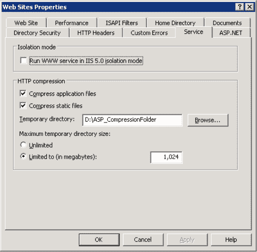
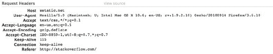
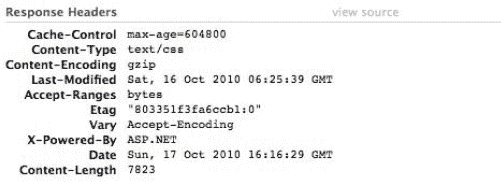
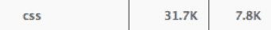
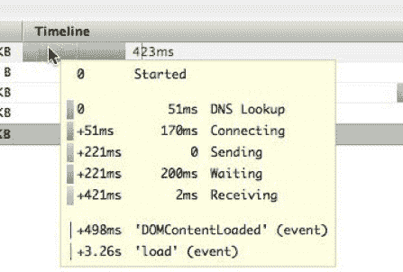
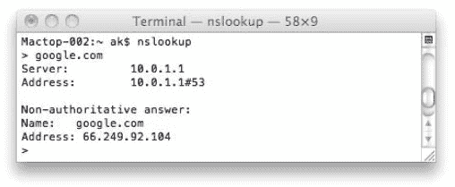
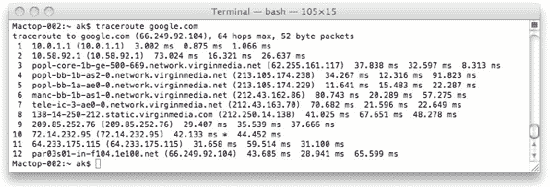

# 八、性能

CSS 文件通常是语法简单的小文件。看起来，就性能而言，几乎没有什么可做的，改进也是微不足道的。在很多情况下，这可能是真的。然而，当我们以更大的规模处理 CSS 时，我们的文件可能会变得更大，并且我们希望它们每天被提供数百万或数千万次，小的改进会产生大的差异——对用户和开发人员都是如此。以今天的标准来看，一千字节的数据量似乎很小，但是算一算，这些千字节很快就会增加到千兆字节的数据量，企业需要为此支付带宽费用。当我们考虑用户下载的有效负载和页面渲染的速度时，可以说每一点都很重要。

在关注性能时，我们必须考虑几个角度。从用户的角度来看，重要的是文件要小，可以很好地缓存(因此加载更快)，并且文件是最新的。从浏览器的角度来看，我们希望我们的 CSS 尽可能高效，并且尽可能快地呈现内容(如果需要，响应交互或动画而重新呈现)。从企业的角度来看，我们希望尽可能多地从用户的缓存(主要是我们的服务器缓存，其次是我们的服务器缓存)提供服务，并将我们发送给用户(和从用户接收)的数量保持在最低水平，同时仍然确保用户拥有我们代码的最新版本。

在这一章中，我们将集中讨论如何从这三个不同的角度提高性能，并且您将了解到关于每一个方面的一些重要的事情。您将了解以下内容:

*   文件大小问题和最佳实践
*   拥有更少的 HTTP 请求比文件大小更重要
*   缓存策略
*   浏览器渲染和阻止

### 有效负载—担心文件大小

CSS 中的最佳实践要求我们考虑输入的字符数量以及它们的含义。每个字符都很重要。虽然现在高速互联网越来越普及，但作为一个高流量网站的 CSS 作者，你要担心的人口统计数据要比大多数其他公司多得多。因此，您的用户可能在拨号上网(出于选择或由于他们的位置)，在接收信号差的地区使用移动设备，在远离您的站点(您的服务器)的国家，或这些情况的任何组合。预处理可能发生在许多级别，例如他们所在位置的 ISP、防火墙和路由器，或者数据路径上更高级别的防火墙和路由器。我们的数据尽快到达这些机器的主要问题之一是我们发送的数据量。当我们通过 TCP/IP(传输控制协议和互联网协议)，互联网通常使用的网络协议发送数据时，我们的信息被分组为称为*包*的包。在网络上有一个最大数据包大小的概念，或最大传输单元(MTU)，在以太网上通常是 1500 字节。超过这个大小的数据包会导致性能损失(损失有多大取决于许多因素:MTU、数据包大小、网络速度等)。由于我们无法确定任何特定网络的 MTU 是多少——即使我们知道，也很难知道哪个数据包会超出限制——为了避免这种数据包边界，我们所能做的就是尽最大努力提供尽可能少的数量。

比方说，互联网用户比购物中心的用户更易变。决定一个网站太慢并且浏览到另一个网站提供了即时的满足感，而找到另一个出售平底锅的商店需要用户承诺离开当前的商店，找到另一个商店，找到产品，等等。用户对我们网站的好感是有限的，我们必须尽一切努力让用户满意，并朝着我们的商业目标前进——无论是购买产品或服务、浏览页面还是消费内容。

保持文件大小和速度不仅对我们的访问者有好处。这对我们的业务也有好处——我们提供的数据越少，我们产生的带宽成本就越少。此外，谷歌和其他搜索引擎关心我们的网页加载速度。网站的性能正迅速成为有效的 SEO 策略的一个重要因素。此外，Internet Explorer (IE)版本 7 和更低版本无法处理 288 KB 以上的 CSS 文件。

 **注意:**对于超过 288 KB 的 CSS 文件，IE 7 及以下只会解析文件的前 288 KB。尽管可以将比这个大的文件分成多个文件(更多的请求会对性能产生影响)，但显然最好首先保持我们的 CSS 较小。

那么，我们能做些什么来降低文件大小呢？ 1

#### 命名惯例

正如我们以前说过的，制定关于类和 id 如何命名的规则，并严格遵守这些规则是很重要的。除非有很好的理由不在您的组织中这样做，或者您的开发人员特别反对这样做，否则我们建议使用 camel case 命名您的类和 id，如下所示:

*   主要内容
*   英雄形象
*   电子邮件地址

使用 camel case 应该有助于使我们的代码易于阅读，同时避免连字符、下划线或其他分隔符带来的额外字符。如果通过前缀给代码命名空间，尽量避免像这样冗长的前缀:

*   ourCompanyHeroImage
*   我们公司的电子邮件地址

____________________

1 谷歌在`[`code.google.com/speed/pagespeed/docs/payload.html`](http://code.google.com/speed/pagespeed/docs/payload.html)`提供了一个让你的有效载荷最小化的指南。雅虎！提供自己的指南，以最大限度地提高您的网站在`[`developer.yahoo.com/performance/rules.html`](http://developer.yahoo.com/performance/rules.html)`的性能。

相反，考虑缩写或首字母缩略词；例如:

*   赭石图像
*   ocEmailAddress

如果这些名字很难读，我们现在可以考虑使用一个分隔符，安全地知道我们的前缀仍然比其他的更小。

*   oc-HeroImage
*   oc 电子邮件地址

尽管我们希望我们的命名系统是语义化的，但我们也可以考虑将其缩写，只要它对开发人员来说仍然易于阅读:

*   海洛因
*   电子邮件地址

这种方法的缺点是单词有许多可接受的缩写，开发人员可能会发现命名不太直观，导致代码来回切换，或者命名技术不一致。我们建议(一如既往地)在您的组织内讨论什么是可接受的，以获得最佳结果，将该技术添加到您的 CSS 编码标准指南中，并严格执行。

#### 文件名

在我们的代码中，文件名用于将文件链接在一起并引用它们。为了保持我们的文件非常小，将我们的文件命名为 a.css、b.css 等等是很有诱惑力的。事实上，只要文件使用正确的 mime 类型， 2 我们甚至可以将它们命名为**a . c .**或者仅仅是 **a** 。然而，实际上，我们认为这在易读性上造成了太多的成本，使得代码难以编写，文件难以定位。尽管文件名不应该太长，但是它们应该足够长，以便于理解。下面是一个在 CSS 中引用文件的例子:

`input {background: urlimg/shadow background.gif");}`

URL 中通常不需要双引号。因为文件名中有空格，所以将它们包含在本例中，这意味着需要引号，以便浏览器理解空格是文件名的一部分。但是，在命名文件时，我们建议您始终使用连字符而不是空格。我们建议这样做有几个原因:

*   Google 会将 URL 路径中的连字符视为空格，而不是其他字符。如果我们将我们的文件命名为“shadow background.gif”，Google 会将其理解为“shadow background.gif”。对用于展示的图片而不是内容(如背景)进行良好的 SEO 可能看起来没有必要，但谷歌图片搜索占据了惊人的流量，任何可能将用户带到我们网站的东西都是积极的事情。
*   不使用空格意味着我们不需要 URL 值中的引号，节省了两个字符。
*   使用空格意味着浏览器需要智能地处理它们，并在 URL(一个空格，URL 编码)中将它们更改为%20，而较旧的浏览器可能不支持这一点。当然，您可以将编码的空格直接放在 URL 中，但是这将导致每个实例中多两个字符。

____________________

2 A *mime 类型*是一个响应头，标识所提供文件的类型。CSS 文件的 mime 类型是“text/css”。

我们还建议您始终用小写字母命名文件，即使使用不区分大小写的 web 服务器/操作系统。这是一个容易遵循的规则，如果你以后决定更换网络服务器，它会使你的文件更容易移植。避免使用符号和不常见的字符还可以简化从一个服务器到另一个服务器的转换，并避免意外问题。尽管在文件名中使用点号已经成为版本控制的常见做法(如在 jquery-1.4.4.min.js 中)，但是您应该避免将它们放在文件名的开头，因为基于 Linux 的操作系统会将其解释为隐藏文件。作为最佳实践，最好坚持使用拉丁字母数字字符、连字符和点。

#### 文件夹结构

乍一看，文件夹结构似乎对文件大小没有什么影响。然而，这是不真实的。文件夹经常在整个 CSS 代码中被引用，无论是指向背景图像、字体、行为还是导入其他样式表。 3

通过引用文件夹来最小化字符消耗的最简单的方法是将所有文件保存在与 CSS 相同的目录中。这种技术在任何规模的网站中都会很快变得不可用，然而，和往常一样，我们应该在什么是好的实践和什么会让开发人员的生活成为噩梦之间寻求一个好的平衡。

下面是一个在 CSS 中引用文件的例子:

`input {background: urlimg/shadow background.gif");}`

我们的 URL 中的第一个字符是一个正斜杠，这意味着从 URL 的根开始。所以，对于一个位于`[www.thedomain.com/css/style.css](http://www.thedomain.com/css/style.css)`的 CSS 文件，这个 URL 会指向`[www.thedomain.cimg/shadow%20background.gif](http://www.thedomain.cimg/shadow%20background.gif)`。CSS 中的所有 URL 都是相对于包含 CSS 的文件所在的位置，所以假设我们将 CSS 更改为以下内容(省略了斜杠):

`input {background: url("img/shadow background.gif");}`

该 URL 将指向`[www.thedomain.com/cimg/shadow%20background.gif](http://www.thedomain.com/cimg/shadow%20background.gif)`。

因为我们用 CSS 引用的任何文件主要是供 CSS 使用的，所以将它们保存在我们的 CSS 所在的同一个文件夹中的一个子文件夹中是有意义的。这使得我们的 CSS 更加可移植，因为我们可以复制或移动 CSS 文件夹，并且所有的文件路径和引用都将保持不变。它还为我们节省了 URL 中的正斜杠，或者../，跳到一个文件夹，找到我们要找的文件。

通常，文件夹是以它们所代表的复数来命名的，例如:

*   形象
*   资产
*   字体

____________________

3 行为通过 HTML 组件(HTC)文件实现，IE 版本 5 及以上支持。它们允许您通过 JavaScript 为元素分配特定的行为。因为它们引入了对 JavaScript 的依赖，并且只限于 IE 浏览器，所以我们不推荐你使用它们。

通过始终使用单数来代替，很容易节省字符并在我们的业务中实现这种命名技术。在文件夹名称中，使用缩写要安全得多，因为我们的整个文件夹结构(至少在高层)很可能是非常可预测的，并且从一个项目到另一个项目完全相同。这是另一件你应该添加到你的 CSS 编码标准指南中的事情:

*   图片
*   资产
*   字体

我们的行最初是 58 字节，如下所示:

`input {background: urlimg/shadow background.gif");}`

它现在是 52 字节，如下所示:

`input {background: url(img/shadow-background.gif);}`

这减少了 10%。这可能看起来是一个小变化，但是如果我们的文档中有 100 行类似的代码，我们现在就可以节省 60 个字节，如果考虑到我们要响应的请求的数量，这意味着更多。

您还应该在文件名中随意使用常见且易于理解的缩写，这可以进一步减少我们的 CSS:

`input {background: url(img/shadow-bg.gif);}`

我们的资产文件夹只是一个总括文件夹，用于存放我们想要引用的不容易归入另一个分组的任何文件，如 Shockwave Flash (SWF)、多媒体 Adobe Flash 文件。记住所有这些，让我们来看一个文件夹命名策略的例子:

`   /
      css
         img
         font
         asset
      img
      js
      asset`

如果您想一想我们引用这些文件的所有地方，这一切都转化为更小的文件、更快的下载和更少的带宽。

#### 语法

为了易读性，我们在 CSS 语法中加入了许多不必要的部分。因为这些通常可以通过缩小工具被最小化(在这一章的后面会读到更多)，如果你正在使用它们的话，在你写的时候把它们保存在你的 CSS 中是安全的。然而，了解这些及其含义是很重要的。

##### 空白

CSS 实际上需要很少的空白字符。选择器各部分之间的间距是必要的，正如速记 CSS 中引用的项之间的间距，或者将多个部分作为其值的属性之间的间距一样。其他一切的存在纯粹是为了让我们作为开发人员更容易阅读和扫描我们的代码。

请注意以下代码:

`body
{
        font-family: arial, sans-serif;
        font-size: 16px;
        background-color: #f4f4f4;
}

.clear
{
        clear: both;
}`

从浏览器的角度来看，前面的代码与此完全相同: 4

`body{font-family:arial,sans-serif;font-size:16px;background-color:#f4f4f4;}.clear{clear:both;}`

虽然第二个例子更难阅读，但它大大节省了文件大小。其中一些值得简单解释一下:

*   选择器和左大括号之间的空间是不必要的。
*   属性名后面的冒号和值之间的空格是不必要的。
*   逗号分隔值之间的空格是不必要的。
*   右大括号后的回车是不必要的。
*   空格在前！重要的都是不必要的(以及任何介于！而且重要)。

在所有这些情况下，您可以使用其他空白来代替空格，比如制表符。如你所见，这里有很多储蓄。我们不建议你用这种方式编写你的 CSS，因为这是不可能管理的(参见本章后面关于缩小你的代码的部分)。

 **注意:**当使用名称中带有空格的字体时，你应该根据 CSS 规范用引号(或者是双引号或者是单引号)将它们括起来。尽管许多浏览器对省略引号没有问题，但其他浏览器不能正确读取值。

____________________

4 虽然大多数浏览器不区分字体名称的大小写，但一些老的浏览器会区分。值得注意的是，Adobe Flex(`[www.adobe.com/products/flex/](http://www.adobe.com/products/flex/)`—用于开发 Adobe Flash 和 Adobe AIR 应用程序的框架)存在字体名称大小写不正确的问题。

##### 最后一个分号

最后一个属性之后和右大括号之前的分号是不必要的，在不影响可读性的情况下，很容易省略。

请注意以下几点:

`.clear {clear:both;}`

以及以下内容:

`    .clear {clear:both}`

就浏览器而言，这两行完全相同，并且为每个规则保存一个字符。

##### 背景颜色

当指定背景颜色时，不要(以更正确的方式)陈述如下:

`background-color: blue;`

使用以下代码是安全的:

`    background: blue;`

这在每个实例中节省了六个字符。但是请注意，这种技术会覆盖这个速记属性中设置的其他属性，可能会产生意想不到的效果。

##### 零和单位

因为无论使用什么单位，零都是零，所以在这种情况下没有必要使用单位。请注意这两个属性:

`border-width: 0px;
margin-top: 0em;`

它们可以安全地写成如下形式:

`    border-width: 0;
    margin-top: 0;`

这对页面的呈现没有任何影响。

##### 取消边界

移除边框时，不要声明以下内容:

`border-width: 0;`

或以下内容:

`    border: none;`

相反，您可以安全地放置以下内容:

`    border: 0;`

同样，从浏览器的角度来看，这导致没有边框和更少的字符。

##### 零和小数位

当使用从零开始的小数位时，可以安全地省略零。换句话说，不是陈述如下:

`font-size: 0.12em;`

安全的做法是改为使用以下内容:

`    font-size: .12em;`

这两个语句是完全等效的，并且在每个实例中都保存了一个字符，尽管对于一些开发人员来说它们可能更难阅读。这个动作是由大多数 CSS 缩小工具代表你采取的，所以如果你发现易读性受到影响并且你正在使用这些工具，保持零是安全的。

##### 空白/填充速记

请注意以下 CSS:

`margin-left: 10px;
margin-right: 10px;
margin-top: 10px;
margin-bottom: 10px;`

这也可以表示为(按上、右、下、左的顺序):

`    margin: 10px 10px 10px 10px;`

它也可以(因为所有四个值都相同)表示为:

`    margin: 10px;`

如果提供三个值，第一个代表顶部，第二个代表两个水平值，第三个代表底部。请注意以下 CSS:

`padding-left: 5px;
padding-right: 5px;
padding-top: 20px;
padding-bottom: 10px;`

与此相同:

`    padding: 20px 5px 10px;`

此外，如果只为 margin 或 padding 属性提供两个值，它们分别代表垂直和水平值。请注意以下 CSS:

`padding-left: 10px;
padding-right: 10px;
padding-top: 20px;
padding-bottom: 20px;`

这完全等同于:

`    padding: 20px 10px;`

也完全等同于这个:

`    padding: 20px 10px 20px;`

还有这个:

`    padding: 20px 10px 20px 10px;`

对于边框、边框半径、列表样式、字体以及其他许多属性，还有许多其他的速记属性，它们不在本书的讨论范围之内。值得花些时间研究和记录它们，并确保团队中的其他成员能够熟练使用它们。除了使你的 CSS 文件更小之外，它们还能使你的 CSS 更容易阅读和扫描。但是，您需要注意这种方法的注意事项，因为速记属性会覆盖组成它的所有子属性，可能会产生意想不到的后果。

##### 颜色

每个浏览器都有一系列命名的颜色(在 HTML 3.0 的规范中定义)，它可以理解这些颜色，并适当地呈现出来。其中包括以下: 5

*   浅绿色
*   黑色
*   蓝色
*   紫红色
*   灰色
*   绿色的
*   石灰
*   褐红色
*   海军
*   橄榄
*   紫色
*   红色
*   银
*   水鸭
*   白色
*   黄色

____________________

5CSS 2.1 规范中也包含了颜色“橙色”，定义为#ffa500。背景色的 CSS1 规范中包含了颜色“透明”,它没有十六进制颜色的对等物。CSS2 使该属性适用于边框颜色，CSS3 将其定义为适用于任何接受颜色值的属性。

浏览器支持更多的颜色，但它们不是 W3C 标准的一部分(`[www.w3.org/TR/css3-color/#html4](http://www.w3.org/TR/css3-color/#html4)`)。然而，这些颜色中只有八种是“绝对”颜色，这意味着它们的红色、绿色和蓝色值都是零或 255。这些是如下: 6

*   浅绿色(#00ffff)
*   黑色(#000000)
*   蓝色(#0000ff)
*   紫红色(#ff00ff)
*   石灰(#00ff00)
*   红色(#ff0000)
*   白色(#ffffff)
*   黄色(#ffff00)

在这些颜色中，只有下列颜色不可解释:

*   黑色(#000000)
*   蓝色(#0000ff)
*   红色(#ff0000)
*   白色(#ffffff)
*   黄色(#ffff00)

____________________

有趣的是，绝对的“绿色”被认为太亮而不能被描述为绿色，因此被命名为“石灰”；“绿色”作为关键词代表#008000，比绝对的绿色暗很多。

因此，我们建议在您的 CSS 中只使用这些。它们更容易阅读和理解，并且在许多情况下比它们的十六进制对应物的字符更短(除非你使用速记颜色(下面提到)；在所有情况下，它们都比它们的 RGB 对应物短)。

但是，还可以实现进一步的节约。以十六进制表示的颜色(称为“十六进制颜色”)被指定为三个一组(意味着它们由三部分组成)。三元组的每个部分都是一个十六进制字节:一个有 256 个变量的值，在本例中从 0 (00)到 255 (ff)。三联体本身有 16，777，216 种变化。如果三联体的每个部分都由两个相同的字符组成，我们可以将它们缩短为一个。例如:

*   #112233 可以表示为#123
*   #00aaff 可以表示为#0af
*   #99aa00 可以表示为#9a0

使用命名颜色或十六进制颜色的决定将在您的组织内做出。在使用十六进制颜色的地方，使用简写版本是安全的。您可以决定在适当的情况下使用命名的颜色，因为它们更容易阅读，但是任何经验丰富的 CSS 开发人员都会习惯于看到#000 和#fff，因此在这种情况下坚持使用十六进制颜色没有问题。虽然 RGB 颜色是在 CSS2.1 规范中定义的，但 CSS3 扩展了这一点，以支持 RGBA 以及 HSL(色调、饱和度、亮度)和 HSLA(色调、饱和度、亮度、Alpha)。这些接受非十六进制值 RGB 值是介于 0 和 255 之间的整数，Alpha 是介于 0(透明)和 1(不透明)之间的数字。色调以度为单位(0 到 360)，而饱和度和明度是百分比。虽然所有这些值都比十六进制颜色更冗长(并且增加了更多的文件大小)，但是您可能会发现实现它们更有用。

 **注意:**如果在 CSS 中使用 RGBA、HSL 或 HSLA 颜色定义，请确保为不支持它们的浏览器提供 RGB 或十六进制颜色回退。此外，如果您在 IE 中使用`filter`属性(可能是为了跨浏览器支持渐变、不透明等等)，请注意该属性不支持速记颜色、RGB、RGBA、HSL 或 HSLA。一些较老的移动浏览器对这样的简写颜色有问题。然而，这些浏览器几乎已经消失了，即使是流量最高的网站，我们也不建议关注这一人群。

作为使用这些语法方法来节省文件大小的最后一个例子，请参见下面的 CSS，重量为 146 字节:

`.our-company-main-content
{
   background-image: url("../img/shadow background.gif");
   border: none;
   margin-top: 0px;` `   color: #aabbcc;
}`

这可以很容易地缩短到 110 字节:

`.oc-mainContent {
   background-image: url(img/shadow-background.gif);
   border: 0;
   margin-top: 0;
   color: #abc
}`

可读性没有损失，但是我们节省了 36 个字节，减少了 25%——甚至在缩小文件之前。

##### 最小化图像尺寸

了解什么样的图像类型适合什么样的情况以及如何缩小图像大小至关重要。在接下来的部分中，我们将讨论您将使用的三种主要类型的图像。

###### GIF(图形交换格式)

gif 最多支持 256 种颜色，并支持透明，但不支持 alpha 透明。这意味着，通过使用我们可用的 256 种颜色中的一种，我们可以将像素设置为完全透明或完全不透明(不透明)，但不能介于两者之间(半透明)。它们通常适用于按钮图像、具有硬边的项目以及颜色准确性非常重要的图像。gif 是一种无损压缩格式，这意味着只要您使用 256 色或更少的颜色(包括透明度),图像质量就不会下降。当保存 gif 时，使用你的图像编辑器来确保你最小化使用的颜色数量，并且如果你不需要的话关闭透明度。gif 可以包含多个帧和信息，以在这些帧之间进行动画制作，并在这些帧之间循环播放简单的动画(这会显著增加文件大小，应谨慎使用)。

###### 联合图像专家组

JPEG 压缩是有损的，这意味着图像压缩得越多，信息就丢失得越多。您的图像编辑器应该包括一个滑块或类似的工具，用于在导出图像时调整压缩量。当您降低质量(提高压缩率)时，文件大小会减小，但图像中会出现伪像。由设计者决定适当的和视觉上可接受的压缩水平，通常 80%到 90%是最好的折衷，并且应该产生不明显的伪像。JPEGs 支持 1600 万种颜色，最适合照片或多种颜色的复杂图像。JPEGs 完全不支持透明。

###### PNG(便携式网络图形)

PNG 是一种无损格式，通常具有比 GIF 文件更好的压缩率。它们可以保存为不同的颜色深度，这意味着它们可以支持适合当前图像的任意多种颜色。它们还支持 alpha 透明，这意味着像素可以是半透明的。png 通常适合作为 gif 的替代品，尽管动画 png 还没有得到广泛的支持。保存 png 时，将颜色深度设置为适合图像的值是很重要的。

 **注意:**虽然 IE 6 不支持 alpha 透明，但是有很多黑客可以使用 JavaScript、行为文件、过滤器以及它们的混合来解决这个问题。我们推荐的方法是 Fireworks hack，或 8 位 PNG hack。如果您将 Adobe Fireworks 中具有 alpha 透明度的 PNG 保存为 8 位(这实际上是软件中的一个错误)，结果是它可以在所有浏览器中正常显示，但 IE 6 除外，它可以使任何半透明像素完全透明。这通常是一个可以接受的折衷方案，只要你的设计者考虑到这个约束。

您的图像编辑器应该有工具来帮助您最小化这些文件的文件大小，并查看各种文件格式、压缩率和颜色深度的差异。然而，即使在这之后，在您的图像文件中也可能有无关的信息。注释、元数据和不必要的颜色配置文件可能会留在文件中。有许多单独的工具可以解决这些问题，但 ImageOptim(可在`[`imageoptim.pornel.net/`](http://imageoptim.pornel.net/)`获得)是一个面向 OS X 的免费开源应用程序，它结合了所有这些工具。它通常可以节省 30%到 35%的文件大小。在您的构建过程中实现这样的工具是一件值得做的事情，应该认真考虑。可以使用各种 Windows 和 Linux 替代工具(尽管功能不太全面),但是在构建过程中使用多个命令行实用工具应该能够获得相同的结果。

#### 缩小

使用本章到目前为止概述的技术，编写你自己的 CSS 缩小脚本并不困难，它可以代表你自动完成所有的工作。然而，在这个过程中有很多事情会让你措手不及。幸运的是，已经有方法可以帮你做到这一点。其中最常见的是 YUI 压缩机。

YUI 压缩器是一个基于 Java 的工具，用于缩小 JavaScript 和 CSS 文件，这些文件可以在`[`github.com/yui/yuicompressor/`](http://github.com/yui/yuicompressor/)`下载。它代表我们自动执行任务，照顾到我们在本章中已经讨论过的最小化文件大小的许多方法，这意味着我们可以在开发代码中忽略它们，但仍然可以在生产代码中获得好处。一旦安装，语法非常容易使用。在命令提示符下，语法如下(其中 x.y.z .是版本号):

`java -jar yuicompressor-x.y.z.jar [options] [input file]`

适用于 CSS 的潜在选项有:

`--line-break`

这个选项允许我们在一个特定的列之后将 CSS 分成几行(在这个例子中，*列*表示一行中的一个特定字符)。例如，将此项设置为 1000 将在每行的第一千个字符后插入一个换行符。在很多情况下你可能需要这个选项，特别是在调试的时候(你可以在第十章中读到更多关于调试的内容)。将此项设置为 0 将在每个规则后插入一个换行符。

`--type`

该选项允许我们指定输入文件的格式。只有当我们的文件后缀不是。css(或者。js)，在这种情况下，对于我们的 css 文件，我们应该总是将它设置为 CSS。

`--charset`

这个选项允许我们指定输入文件的字符集。如果不提供，将使用运行 YUI 压缩程序的系统的默认字符集编码。虽然在大多数情况下没有必要，但如果您使用 UTF-8 字符(例如，在内容属性中)，则应该设置此选项。

`-o`

此选项指定我们要输出到的文件的名称。

以下是一个命令示例:

`java -jar yuicompressor-x.y.z.jar style.css –o style.min.css`

YUI 压缩程序对 CSS 文件执行以下功能:

*   一条条评论 7
*   删除不必要的空白
*   删除每个规则的最后一个分号
*   删除任何多余的分号
*   删除任何没有属性的规则
*   移除任何零值上的单位
*   删除任何小数位以零开始的值的前导零
*   在边距、填充和背景位置将相似的属性合并为一个
*   将任何 RGB 颜色转换成十六进制颜色 8
*   删除无关字符集 9
*   使用 filter 属性将 alpha 不透明度语句缩短为 IE4 样式 10

____________________

如果出于某种原因，你想保留特定的评论(也许是出于版权或许可的目的),你可以在评论的开头使用感叹号，就像这样:

`/*! This comment is far too important to be removed: */`

正如本章后面提到的，当使用 CSS 过渡时，在一些浏览器中使用十六进制颜色而不是 RGB 颜色会有性能损失，所以意识到这一点尤为重要。

如果您使用的是 YUI Compressor，您可以放心，因为所有这些操作都将被执行，而且，如果您愿意，也不用担心它们会出现在您的未统一代码中。

如果您使用过任何黑客攻击(其中许多在第三章中有详细介绍)，了解 YUI 压缩机容忍其中许多攻击并且不会试图缩小或破坏它们是很有用的。公认的方法包括:

*   下划线黑客
*   明星黑客
*   子选择器黑客
*   注释的反斜杠 hack
*   盒子模型黑客

如果您不希望使用 YUI 压缩器的 Java 实现，可以在`[www.phpied.com/cssmin-js/](http://www.phpied.com/cssmin-js/)`找到一个 JavaScript 端口。还有许多缩小 CSS 的其他选项，包括:

*   `[www.csscompressor.com/](http://www.csscompressor.com/)`
*   `[www.cleancss.com/](http://www.cleancss.com/)`
*   `[www.cssdrive.com/index.php/main/csscompressor/](http://www.cssdrive.com/index.php/main/csscompressor/)`

____________________

9 可以用如下命令定义 CSS 中的字符集:

`@charset "utf-8";`

任何 CSS 文件只能包含一个@charset 语句。

10 滤镜属性(Internet Explorer 专有)允许你设置各种视觉效果。要设置不透明度，建议的语法是:

`selector {
-ms-filter: "progid:DXImageTransform.Microsoft.Alpha(Opacity=65)";
filter: progid:DXImageTransform.Microsoft.Alpha(Opacity=65);
}`

filter 属性适用于 IE 8 和更低版本。–ms-filter 属性适用于 IE 9 及更高版本。YUI 压缩器将这些简化为它们的速记等价物，如下所示:

`selector {
-ms-filter:"alpha(opacity=65)";
filter:alpha(opacity=65);
}`

由于 YUI 压缩机的广泛使用，它是我们推荐的产品。使用它并为社区做出贡献的开发人员的数量意味着它是一个非常健壮且经过良好测试的解决方案。无论你做什么决定，我们都建议你对 CSS 代码使用一个缩小工具，尽管这意味着调试(你可以在第十章阅读更多关于调试的内容)是可以克服的。

#### 压缩

在我们尽可能地将文件变小之后，我们仍然可以使用一些技巧来使从服务器传输给用户的数据变得更小。其中之一是压缩。文件的压缩涉及到使用算法来存储重复的数据，并且只表示该数据一次而不是多次。有两种主要的压缩方式:无损压缩和有损压缩。有损压缩意味着在压缩过程中会丢失一些信息，JPEG 就是有损压缩格式的一个例子。我们对 JPEG 图像压缩得越多，出现的伪像就越多，离原始图像就越远。这对于图像格式来说是可以接受的，因为我们试图传达的内容并没有完全丢失。然而，对于 CSS 文件，任何引入数据的工件都会破坏我们的语法，使我们的文件变得不可预测和无用。无损格式，如 zip、tar 和 rar 文件，是我们需要的每个字符都很重要的数据。

HTTP 1.1——用于交付网页的协议——在其规范中支持三种压缩方法:gzip (GNU zip)、deflate 和 compress。浏览器和服务器对 deflate 和 compress 的吸收比 gzip 慢。所有现代浏览器和服务器都支持数据的 gzip 压缩，因此，它已经成为在互联网上压缩数据的行业标准技术。 11

下面显示了从浏览器向服务器发出请求以及服务器做出响应的示例流程:

*   The browser makes a request to the server, and includes headers similar to these: `GET /index.html HTTP/1.1
    Host: www.domain.com
    Accept-Encoding: gzip
    User-Agent: Firefox/3.6`

    这些行依次表示以下含义:

    *   浏览器正在使用 HTTP 1.1 协议请求文件/index.html。
    *   浏览器指定它想要文件的域。
    *   浏览器表明它支持 gzip 编码。
    *   浏览器将自己标识为 Firefox 3.6。
*   服务器找到该文件并将其读入内存。
*   如果浏览器表明它支持 gzip 压缩(在本例中就是这样)，服务器就会压缩文件。
*   The server returns the data, with headers similar to the following: `HTTP/1.1 200 OK
    Server: Apache
    Content-Type: text/html
    Content-Encoding: gzip
    Content-Length: 12345`

    这些行依次表示以下含义:

    *   服务器确认它正在使用 HTTP 1.1 作为协议，并发送一个 200 状态码来表示一切正常。
    *   服务器将自己标识为 Apache。
    *   服务器将响应的内容识别为 HTML。
    *   服务器通知浏览器数据是用 gzip 压缩的。
    *   服务器指定它返回的数据的大小，以便浏览器可以显示一个进度条，并确定何时收到所有数据。
*   浏览器解压缩数据，并读取它。

____________________

11 你应该知道，使用 gzip 时，由于压缩算法需要考虑单个字符，因此对于较小的字符集，压缩率会更高。提高性能的一个简单方法是尽可能使用小写字符，尽管这不如减少字符重要。

使用最新的 web 服务器，在服务器上实现 gzip 压缩很容易，您将在接下来的几节中看到这一点。

#### Apache

mod_deflate 是 Apache 用来压缩文件的模块。它包含在 Apache 2.0.x 源代码包中。安装 Apache 后，编辑适当的。conf 文件，并确保以下行存在:

`LoadModule deflate_module modules/mod_deflate.so`

一些老版本的浏览器在压缩特定类型的数据时会出现问题。定位它们很容易，这样做不会影响性能。Netscape 4.x 除了压缩 HTML 文件之外，还存在其他问题，因此我们应该添加以下内容:

`BrowserMatch ^Mozilla/4 gzip-only-text/html`

Netscape 4 的特定版本甚至有更糟糕的问题，所以我们可以完全禁用 gzip 压缩:

`BrowserMatch ^Mozilla/4\.0[678] no-gzip`

虽然 IE 有一个用户代理，也是以“Mozilla/4”开头的，但它对 gzip 压缩没有问题，所以我们可以取消那个浏览器的那些命令: 12

`BrowserMatch \bMSI[E] !no-gzip !gzip-only-text/html`

____________________

12 Apache 2.0.48 在 mod_setenvif 中有一个 bug，这就是为什么正则表达式在这个例子中看起来有点怪异。

我们不想压缩图像，因为它们已经有了自己的压缩方式。压缩这些文件只会给服务器和浏览器带来不必要的更大处理负载，而不会带来文件大小的优势。我们可以用这一行来停止:

`SetEnvIfNoCase Request_URI \
\.(?:gif|jpe?g|png)$ no-gzip dont-vary`

某些版本的 Adobe Flash 在通过 gzip 压缩时存在问题，因此，如果您发现 SWF 文件存在问题，可以将该行修改如下:

`SetEnvIfNoCase Request_URI \
\.(?:gif|jpe?g|png|swf)$ no-gzip dont-vary`

最后，一些代理和缓存服务器自己决定压缩什么和不压缩什么，并且可能通过这种配置提供错误的内容。下面一行告诉这些服务器执行我们设置的规则:

`Header append Vary User-Agent env=!dont-vary`

现在，任何对 CSS 文件(以及其他文件)的请求都将被支持它的浏览器压缩。

#### 微软 IIS(互联网信息服务)

在 IIE 启用 gzip 甚至更容易。

对于 IIS 6(参见图 8-1 )，右键单击网站(或只是您想要启用压缩的网站)并选择属性。单击服务选项卡。您可以选择对所有静态文件(图像、CSS、字体、JavaScript、swf 等)和/或所有应用程序(动态)文件启用压缩。

***图 8-1。** 在 IIS 6 中启用 HTTP 压缩*

对于 IIS 7，默认情况下对静态文件启用 gzip 压缩。对于动态(应用程序)文件，您可以使用以下命令启用它:

`appcmd set config -section:urlCompression /doDynamicCompression:true`

对于 IIS 之前的版本，文件压缩是不可靠的，我们不建议在生产环境中启用它。对于版本 6，您可以使用以下两个命令指定要压缩的静态文件类型:

`cscript adsutil.vbs SET W3SVC/Filters/Compression/Deflate/HcFileExtensions "htm html txt css"
cscript adsutil.vbs SET W3SVC/Filters/Compression/gzip/HcFileExtensions "htm html txt css"`

最后一个参数(用引号括起来)在一个空格分隔的列表中列出了要压缩的静态文件。

对于 IIS 7，有一个名为 applicationHost.config 的文件使用 XML 语法，该文件通常位于 C:\ Windows \ System32 \ inetsrv \ config \ application host . config 中，该文件列出了应该压缩的动态和静态文件的 mime 类型。静态文件在一个名为`<staticTypes>`的标签中。以下是该标签的一些示例内容:

`<staticTypes>
    <add mimeType="text/*" enabled="true" />
    <add mimeType="message/*" enabled="true" />
    <add mimeType="application/javascript" enabled="true" />
    <add mimeType="*/*" enabled="false" />
  </staticTypes>`

这个标签支持 mime 类型中的通配符，所以条目“text/*”将告诉 IIS 7 压缩 css(对于 CSS，mime 类型是“text/css”)。

几乎所有的现代网络服务器都支持 gzip 压缩。如果默认情况下未启用，请查阅 web 服务器的文档以了解如何启用它。

使用像 Firebug 这样的检查工具(或者许多其他工具中的一个，参见第十章)，您可以检查响应和请求的发生，以确保 gzip 压缩正在发生，并了解您的文件压缩得如何。

下面是一个发生在特定站点的请求/响应过程的例子，在这个实例中:`[`stackoverflow.com`](http://stackoverflow.com)`。

首先是请求(参见图 8-2)。

***图 8-2。**请求标题*

然后是响应(见图 8-3 )。

***图 8-3。**响应头*

从这些可以看出，我们最初的 Accept-Encoding 头声明我们支持 gzip(以及 deflate)。然后可以看到响应是用 gzip 编码的(通过检查 Content-Encoding 头)。这证明 gzip 在服务器上工作。您也可以查看该部分上方的行，以便对请求的整体结果一目了然(参见图 8-4 )。

***图 8-4。** 基本 HTTP 请求详情*

我们可以从中看到请求的确切文件、从服务器返回的 HTTP 状态代码、请求文件的域、文件的大小以及加载文件所花费的时间(分解成更小的部分)。我们将在第十章中更详细地讨论 Firebug。

使用雅虎的另一个火狐插件！名为 YSlow，还可以看到文件被 gzipped 前的大小(见图 8-5):13

***图 8-5。**显示压缩前后文件大小的 YSlow】*

这向我们展示了文件在被 gzipped 之前是 31.7 KB，之后是 7.8 KB。这大约节省了 75 %!显而易见，这种技术对于降低文件大小来说是非常重要且容易实现的。

YSlow 的一个更全面的替代产品是网页测试(`[www.webpagetest.org/](http://www.webpagetest.org/)`)，它是由 AOL 在 2008 年开源之前开发的。它允许你专门针对 IE 的所有版本运行测试，甚至可以运行多次并显示平均值，以获得更准确的结果。

#### 内容分发网络(cdn)和域

浏览器对它们可以同时拥有的连接数进行了限制(通常在 35 左右)。这是一件明智的事情；如果我们试图同时请求 200 个文件，那么每个连接的速度都会急剧下降。不仅如此，它们还对特定域的同时连接数进行了限制。最近这个限制有所松动，有些浏览器让你修改这个值，但是默认: 14

*   IE 6 和 ie7 支持每个域 2 个同时连接。
*   IE 8 支持每个域 6 个同时连接。
*   IE 9 支持每个域 2 个同时连接(在撰写本文时——推测当 IE 9 退出测试版时，这个限制会增加)。
*   Firefox 2 支持每个域 2 个同时连接。
*   Firefox 3 支持每个域 6 个同时连接。
*   Firefox 4 支持每个域 6 个同时连接。
*   Safari 3、4 和 5 支持每个域 4 个同时连接。
*   Chrome 6、7、8 和 9 支持每个域 6 个同时连接。
*   Opera 9 支持每个域 4 个同时连接。
*   Opera 10 支持每个域 8 个同时连接。

____________________

YSlow 是一个非常有用的工具，可以准确定位是什么让你的网站变慢了，更重要的是，它给出了很多可以修复它们的提示。可以在`[`developer.yahoo.com/yslow/`](http://developer.yahoo.com/yslow/)`下载。

有趣的是，随着浏览器的更新，连接不仅在增加，还在上下波动。

大多数当前的浏览器支持每个域至少 4 个同时连接。这意味着，如果我们有一个 HTML 文件、一个 CSS 文件、一个 JavaScript 文件、4 个背景图像和 4 个内嵌图像，我们已经有 11 个需要连接的单独项目，其中最多有 9 个可以排在其他连接之后。

 **提示:** Browserscope ( `[www.browserscope.org/](http://www.browserscope.org/)`)是比较这些浏览器功能的一个极好的资源。

此外，当发送文件请求时，我们到目前为止显示的标题并不是随请求一起发送的唯一标题。另一个值得注意的头是“Cookie”头。Cookies 是用于在用户机器上存储持久数据和会话信息的信息片段，因此当从一页浏览到另一页时，数据可以保存在本地并被服务器引用。可以在 cookie 上设置过期日期，因此，当浏览器关闭并在以后重新打开时，过期日期仍然有效。cookie 与一个域相关联，任何来自该域的资源请求都会在请求中包含 cookie。再读一遍——“任何要求。”当我们从服务器请求动态内容时，cookie 对于这些页面的正确运行至关重要，但是 cookie 也会随着对静态文件(如图像或 CSS 文件)的请求一起发送。

在某些网站上，这些 cookies 的大小可能不小。单个 cookie 的最大大小为 4096 字节(4 KB)，针对特定的域可以设置最大大小为 20 字节，因此对于给定的域，cookie 的总大小可能为 80 KB，不包括发送它们所需的分隔符。尽管这是一个极端的情况，但是如果我们在一个页面的每个图像请求中发送 80 KB 的数据，那么下载所有这些图像的时间将会大大增加。

解决这些问题的方法很简单。如果我们将主要/动态内容和静态内容领域分开，会发生两件大事:

*   我们的 cookies 不再发送到我们的静态内容。这导致一个更小的请求，这是一个好消息，没有任何影响，因为数据是没有价值的。
*   我们的连接限制适用于单个域，而不是一个域，使我们的连接限制增加了一倍。

实现这一点并不意味着对我们的架构进行大规模的反思。如果我们有一个初始域名`[`somedomain.com`](http://somedomain.com)`，我们可以继续从`[`somedomain.com`](http://somedomain.com)`和`[`www.somedomain.com`](http://www.somedomain.com)`提供我们的主页和动态内容。然后，我们可以创建`[`assets.somedomain.com`](http://assets.somedomain.com)`，并将其指向带有域名服务器(DNS)条目的相同位置。我们的文件夹结构不需要做任何改变，我们已经提高了我们的性能。这使我们的连接限制增加了一倍，但是我们可以做得更好。我们可以遵循一个简单的规则，让我们在这些子域中保持一致，但仍然有很多子域。如果我们考虑我们引用的文件类型的文件后缀，我们可以在我们的域名中使用它们。例如:

*   `[`www.somedomain.com`](http://www.somedomain.com)`和`[`somedomain.com`](http://somedomain.com)`为我们的主要和动态内容
*   `[`gif.somedomain.com`](http://gif.somedomain.com)`为 gif 图片
*   `[`jpg.somedomain.com`](http://jpg.somedomain.com)`对于 jpeg 图像
*   `[`png.somedomain.com`](http://png.somedomain.com)`对于 png 图像
*   `[`swf.somedomain.com`](http://swf.somedomain.com)`对于 swf 文件
*   `[`css.somedomain.com`](http://css.somedomain.com)`对于 css 文件
*   `[`js.somedomain.com`](http://js.somedomain.com)`对于 js 文件

如果我们始终如一地实现这一点，我们的 CSS 最终会有如下规则:

`input {background: url(http://css.somedomain.com/css/img/shadow-background.gif);}`

这完全违背了我们最小化文件大小的努力。相反，我们应该将域`http://css.somedomain.com`直接指向我们的 CSS 文件夹，并继续相对地引用这个文件夹中的文件。这是最小化 CSS 文件大小和拥有多个域之间的一个很好的折衷。我们可以引用我们的 CSS:

`<link rel="stylesheet" href="http://css.somedomain.com/style.css" type="text/css" />`

并继续像这样引用我们的图像:

`input {background: url(img/shadow-background.gif);}`

虽然上面的例子可能有些夸张，而且实现这么多子域也不可行，但仅仅一个子域就能带来值得的性能和带宽成本的改善。事实上，拥有多个域会对性能产生影响。每次额外的 DNS 查找都会导致性能下降，因此必须权衡这些好处和 DNS 查找成本。最多四个额外的域被认为是合理的数量。

使用子域的替代方法是使用内容分发网络(CDN)。

正如你将在本章后面看到的，在用户的计算机和他们连接的服务器之间有许多点；每一个都有性能影响。

CDN 将您的静态内容分布在许多服务器上，并总是试图从最接近用户位置的 CDN 响应用户。这可以极大地提高性能。实现 CDN 的困难在不同的选择中有很大的不同，但是使用它们的好处是不可否认的。虽然有几个免费的 cdn 可用，但对于高流量的网站，你需要使用商业产品来处理你所关心的那种带宽。一些比较知名的商业 CDN 产品如下:

*   *赤眉*——`www.akamai.com/`
*   *【亚马逊云锋】*——`http://aws.amazon.com/cloudfront/`
*   *微软 Windows Azure*——`www.microsoft.com/windowsazure/`

对于一个高性能的网站来说，无论你是选择在本地用子域还是通过 CDN 来提供你的静态 CSS 文件，这些都是必须考虑的事情。

#### 拥有更少的请求比文件大小更重要

对于一个规模合理的网站来说，你处理的不仅仅是一个 CSS 文件。以这种方式工作是荒谬的，原因有几个:

*   多个开发人员可能会同时处理同一个文件，伴随着这种方法的所有负面问题，例如冲突和合并问题。
*   当你只关心其中的一小部分时，扫描和阅读这种大小的文件是很困难的。
*   只为一个网站提供一个文件不利于用户。在主页上下载一个大文件会使页面呈现非常缓慢，因为除了站点的特定区域之外，可能不需要许多规则或选择器。

更有意义的做法是将 CSS 分割开来，分别处理各个小部分。为了举例，让我们列出几个我们可能会用到的文件:

*   reset . css-重设. CSS
*   global.css
*   home.css
*   log in . CSS-登入

reset.css 和 global.css 文件是我们希望在每个页面上使用的文件，而 home.css 只用于主页，login.css 只用于登录页面。如果我们像这样保存文件，链接到 CSS 文件的主页代码将如下所示:

`<link rel="stylesheet" href="http://css.somedomain.com/reset.css" type="text/css" />
<link rel="stylesheet" href="http://css.somedomain.com/global.css" type="text/css" />
<link rel="stylesheet" href="http://css.somedomain.com/home.css" type="text/css" />`

这有几个含义。最明显的是我们的主页 HTML 比它需要的要大一点。接下来，我们必须创建三个单独的连接来获取每个文件。除了最大连接限制，这对性能还有另一个更极端的影响。

事实证明，文件大小和连接限制并不是导致文件加载缓慢的唯一原因。让我们再来看看 Firebug 中向我们展示文件下载时间的部分(见图 8-6 )。

***图 8-6。** 一个 HTTP 请求/响应的阶段*

您可以在这里看到，数据的接收并不是这个特定项的加载时间的最大原因。让我们把它分成几部分，就像我们在处理`[`css.somedomain.com/home.css`](http://css.somedomain.com/home.css)`一样。

#### 域名服务器(DNS)查找

DNS 是一种将域名映射到 IP 地址的目录。在这一点上，浏览器首先试图找出`css.somedomain.com`指向哪里，因此它联系一个 DNS 服务器(特定于用户的网络设置)，向该服务器请求该域的 IP 地址，并接收一个带有答案的消息。如果服务器已经知道结果，它会立即从缓存中返回结果；否则，它会询问更上游的其他 DNS 服务器。nslookup 工具(见图 8-7 )让我们很容易看到这个过程的结果。 15

***图 8-7。**nslookup 工具*

____________________

15 每个 DNS 条目都有一个生存时间(TTL)。这是 DNS 服务器应该缓存结果的时间。它通常被设置为一天或更长时间，这就是为什么对 DNS 条目的更改可能需要一段时间才能传播到所有服务器。

幸运的是，DNS 是非常可缓存的，通常非常快。一旦用户的浏览器知道了特定域的 IP 地址，它(通常)在短期内不会再询问。但是，第一次从服务器获得响应确实会导致性能下降。 16

#### 连接

此时，浏览器实际上正在与服务器建立连接。因为它有直接的 IP 地址，所以有理由假设这个过程应该非常快，并且浏览器可以直接连接到远程机器。不幸的是，事实并非如此。在用户机器和服务器之间有几个路由器，数据包需要通过它们来建立连接。traceroute 命令让我们看到了这一点的证据(见图 8-8 )。

***图 8-8。**traceroute 命令*

正如您所看到的，在这个特定的例子中，在用户的计算机和服务器之间有 11 个独立的路由器。这将导致显著的性能下降，并且对服务器的每个请求都会发生这种情况。

#### 发送

此时，连接已经建立，用户的浏览器正在向服务器发送数据。这些数据包括请求头和为该特定域本地存储的任何 cookies。对于 CSS 文件，我们已经讨论了如何最好地减少这种延迟。在前面显示的例子中，有很少的数据要发送，这实际上不会导致延迟。

#### 等待

服务器现在已经收到了用户的请求并正在处理它。总会发生一定量的处理，即使它只是涉及远程服务器读取文件并将其返回，或者缓存服务器从内存中读取数据。如果请求的文件是动态的，并且需要特定于用户的处理(不能远程缓存)，性能影响会更大。

____________________

一些浏览器，比如 Firefox，有一个他们引用的内部 DNS 缓存。通过这个缓存需要用户重新启动浏览器或使用扩展。

#### 接收

最后，数据从服务器返回，浏览器接收它。在这种情况下，返回的数据非常小，网络速度非常快，因此延迟可以忽略不计。

从这个过程中我们可以看到，即使我们最大限度地减少了发送和接收的数据，仍然有其他因素在很大程度上影响性能。每次连接到服务器都会产生开销，而且这种开销通常比文件大小大幅增加所带来的影响更大。从中吸取的教训是，尽管最小化文件大小是最佳实践，当然也是值得努力的事情，但是请求越少对性能的影响就越大。 17

#### 串联

下面显示的初始示例显然不是形成 CSS 文件的最佳方式:

`<link rel="stylesheet" href="http://css.somedomain.com/reset.css" type="text/css" />
<link rel="stylesheet" href="http://css.somedomain.com/global.css" type="text/css" />
<link rel="stylesheet" href="http://css.somedomain.com/home.css" type="text/css" />`

让我们假设在这个实例中，我们的 reset.css 文件的大小是 2 KB，我们的 global.css 文件的大小是 4 KB，我们的 home.css 文件的大小是 6 KB。将这些文件连接成一个文件是减少服务器连接数量的一种明显的方法。由于 reset.css 和 global.css 在每个页面上都是必需的，因此我们应该将它们合并成一个页面，并将 home.css 分开，以防止用户不必要地下载重复的内容。实际上，对于这些小尺寸来说，这不是事实。如果我们将这三个文件连接成一个文件，我们将获得这个页面的最佳性能。但是，当用户浏览我们的登录页面时，我们希望包含这些文件:

`<link rel="stylesheet" href="http://css.somedomain.com/reset.css" type="text/css" />
<link rel="stylesheet" href="http://css.somedomain.com/global.css" type="text/css" />
**<link rel="stylesheet" href="http://css.somedomain.com/login.css" type="text/css" />**`

将这三个文件连接成一个文件似乎是违反直觉的——用户将像以前一样下载完全相同的 6 KB 文件(reset.css 和 global.css)。这似乎是重复劳动。但实际上，额外的 6 KB 下载不太可能像额外的 HTTP 请求的成本那样大(对大多数用户来说)。

这在高流量站点上如何工作取决于全局文件和特定文件的大小，并且需要测试以确保获得最佳结果。

我们还可以考虑将所有四个文件连接在一起。这是一个较大的初始点击，但是将在第一页之后被缓存，并且不会被服务器请求用于使用相同 CSS 的其他页面。

将这些文件连接在一起是一个简单的过程，但最好在构建过程中处理(如第九章中所述)。这使我们能够处理未压缩的单个文件，以获得最大的可读性，同时还能确保投入生产的代码尽可能的小和高效。

____________________

这就是为什么@import 指令应该少用的一个很好的理由；每一个额外的要求都会妨碍我们的表现。媒体选择器可以和 link 标签一起使用来引用单个文件，或者内嵌在 CSS 文件中，使我们的选择器更加具体。您应该使用哪一个取决于您有多少规则需要如此具体。HTTPS 连接招致更大的开销。

#### CSS spreads

CSS 精灵是提高性能的一个很好的方法，可以让页面感觉更快更灵敏。通常在我们的页面中，一个图形按钮可能有几种状态: 18

*   *正常*—按钮的正常状态
*   悬停(Hover)——显示的图像向用户表明他们的鼠标当前在可点击的东西上
*   *点击*—显示的图像，向用户表明他们已经成功地与按钮交互
*   *禁用*—显示的图像向用户表明该按钮不会对交互做出反应

为了达到这种效果，通常使用四个独立的图像。为了便于演示，我们来看看悬停状态:

`a {
        background: transparent url(img/button.gif) no-repeat 0 0;
        height:40px;
        width:120px;
        display:block;
}

a:hover {
        background: transparent url(img/button-hover.gif) no-repeat 0 0;
}`

浏览器选择如何处理悬停图像因浏览器而异。有些人可能会立即将其加载到缓存中，这样当用户悬停在锚点上时，加载图像就不会有延迟。其他人可能会选择等到用户悬停在元素上时再向服务器请求图像。第一个例子导致了对服务器的额外请求的性能成本。第二种方法会产生这种开销，但只是在加载之后，影响较小的时候。然而，在向用户显示该图像时存在延迟，给用户带来更差的体验。

这个问题是有解决办法的。CSS 精灵允许我们将多个图像堆叠成一个(见图 8-9 )。

____________________

不要依赖悬停状态来实现页面上的任何功能。这样做就是创建设备依赖关系；用户可能由于残疾而无法使用鼠标，或者可能正在使用对悬停状态没有概念的触摸屏界面。

***图 8-9。** 一个精灵形象的例子*

这张图片包括我们的常规按钮，在它的正下方是我们的鼠标悬停状态。通过使用背景位置，我们可以在 CSS 中的两个地方引用同一个图像，但是有效地裁剪掉它的一部分，只显示我们想要的部分。使用这种技术，我们可以像这样修改我们的 CSS:

`a {
        background: transparent url(img/button.gif) no-repeat 0 0;
        height:40px;
        width:120px;
        display:block;
}

a:hover {
        background-position: 0 40px;
}`

现在只有一个 HTTP 请求，我们的按钮对鼠标悬停在它上面有即时反应。人们很容易对这项技术产生热情，并认为“嘿！让我们把整个网站上的每一张图片都放入一个巨大的 CSS 精灵中！”但是在你兴奋之前，关闭 Photoshop，看看为什么这是个坏主意:

*   CSS 精灵并不适合所有的事情。对于大小不可预测的元素(可能会随着浏览器中的`font-size`变化而调整大小或缩放)，结果也可能是不可预测的。
*   对于设计者和 CSS 开发人员来说，一个充满图像的大文件很快变得很难管理。
*   决定图像中间的精灵需要改变尺寸会对图像的其余部分产生巨大的连锁效应。

相反，我们建议您在图像可能有多种状态的任何地方使用 CSS 精灵，例如前面演示的按钮。尽量避免允许使用精灵的元素以显示其他精灵或以不希望的方式裁剪它们的方式改变尺寸。如果这不可能，请确保在彼此之间添加足够的空间，这样，如果可视区域发生变化(例如当您增加字体大小或放大页面时)，相邻的图像就不会显示出来。像往常一样，找到对用户和开发人员都有利的平衡点，并在组织内部决定如何实现这一点。一个例外是移动网站，那里的延迟可能很大，以至于每个额外的 HTTP 请求都会对页面呈现速度产生重大影响。

### 数据 URIs(统一资源指标)

除了将图像表示为一个单独的文件，还可以将图像编码成一大串数据，然后直接插入到文件中，如下所示:

``

…或者:

`background-image: url("data:image/png;base64,ABCDEFHIJKLMNOPQRSTUVWXYA");`

这种方法有一个明显的好处:它为我们以这种方式包含的每个图像节省了额外的 HTTP 请求。在 CSS 精灵不合适的地方(例如，对于大小不可预测的元素)，它们也能给你即时响应的悬停状态。不幸的是，它有更多的缺点:

*   在比包含这些图像的文件更精细的级别上，对这些图像的缓存失去了控制
*   该文件的表示实际上比常规图像文件大三分之一
*   IE 7 及以下版本根本不支持数据 URIs
*   IE 8 将数据 URIs 限制在 32 KB 或更少

由于这些限制，我们不建议使用数据 URIs，除非它们用于您可以准确预测或控制正在使用的浏览器的环境中。 19

### 缓存

*缓存*是存储经常访问的数据，以便可以更快地检索这些数据来提高性能的行为。缓存可能存在于几个不同的点:

*   *浏览器缓存*—在客户端(浏览器)上，特定于机器的单个用户(尽管多个用户可以使用该帐户)
*   *【代理缓存(或共享缓存)*—由互联网服务提供商(ISP)或第三方在客户端和服务器之间提供的缓存，由多个用户共享
*   *网关缓存*—由 web 服务器(如缓存服务器或 cdn)的所有者实现的缓存，在许多用户之间共享

____________________

19Sveinbjorn Thordarson 在`[www.sveinbjorn.org/dataurls_css](http://www.sveinbjorn.org/dataurls_css)`提供了更多关于 URIs 数据的细节，以及生成它们的工具。

缓存主要服务于两个目的:减少延迟和减少网络流量。通常这两个目标符合每个人的最佳利益。每个人都希望用户尽快收到及时的信息和数据。每个人都希望传输尽可能少的数据，以进一步减少延迟并节省资金。作为一个高流量网站的所有者，我们唯一能够完全控制的缓存是我们已经实现的网关缓存。然而，我们可以给其他缓存一些命令和提示，并合理地期望它们会被遵循。这些命令是通过来自服务器的响应头来实现的，向浏览器和中间的代理缓存指示某个特定项在被再次请求之前是否应该在本地存储(以及存储多长时间)。

浏览器/代理缓存选择如何解释该信息最初是它的选择，并且不能保证我们使用的头将被正确实现，或者完全被读取，尽管大多数浏览器/代理现在已经标准化并且在它们如何处理这一点上相当一致。此外，浏览器中的用户设置可能会覆盖这种行为，在客户端完全禁用缓存的情况并不少见。缓存可以在短期内更有力地实现，这样，出现在多个地方的同一个图像就不需要再向服务器发出请求，并且单击后退按钮会立即得到响应。 二十

当提供内容时，由 web 服务器提供适当的缓存控制头。历史上控制缓存的第一种方法是 Expires HTTP 头，它可以设置为一个日期，在此日期之后，浏览器会向服务器重新请求数据。这种方法已被否决，原因如下:提供数据的资源(如网关缓存和代理缓存)之间的时间可能不同步，并且有必要以一定的时间间隔自动更新该值。相反，HTTP 1.1 规范定义了一个名为 Cache-Control 的新头，它存储一系列单独的值，让不同的缓存层做出智能决策，决定是提供文件的本地副本还是获取新的副本。这个决定基于两个因素: 21

*   *新鲜度*—一个文件可以在一段时间内被标记为*新鲜度*，之后就是*陈旧度*，必须向服务器重新请求。
*   *验证*—可以发出请求，让缓存机制知道本地存储的副本是否是最新的，而不必请求整个文件。

让我们快速看一下缓存机制通常是如何决定是否获取文件的新副本的。

*   如果文件头指定不缓存该文件，或者该文件是通过安全(HTTPS)连接提供的，则不会缓存该文件。
*   如果项目被认为是新的，它将被缓存，直到在这种情况停止后发出请求。
*   如果一个项目不被认为是新的，将尝试验证它。如果发现它仍然有效，将继续提供缓存的项目。如果不是，将向服务器请求新的副本。

____________________

出于安全考虑，通过 HTTPS(安全 HTTP 连接)提供的内容不应该(通常也不会)缓存在本地或代理服务器上。

试图通过 HTML 中的 meta 标签来控制浏览器缓存是可能的，但很少有浏览器支持它们，因为浏览器的缓存机制会在 HTML 被解析之前检查数据并做出缓存决定。我们不推荐这种技术。

Cache-Control 头由几个逗号分隔的值组成。以下是一些更重要的价值观，其含义应该很好理解:

*   *max-age*—定义(以秒为单位)自请求以来文件应被视为新文件的时间段。
*   *必须重新验证*—在特殊情况下，HTTP 允许缓存为过时的文件缓存提供服务。这个头告诉缓存机制不要遵循这种行为。
*   *不缓存*—指示缓存机制从不缓存该文件。
*   *no-store*—指示缓存机制从不保留该文件的副本；缓存可以从内存中存储和提供，但不能写入磁盘。
*   *public*—明确表示共享缓存可以缓存某个项目，即使存在安全连接。
*   *private*—明确表示一个项目是可缓存的，即使有安全连接— *，但只在客户端缓存中*。
*   *代理-重新验证*—在特殊情况下，HTTP 允许缓存为过时的文件缓存提供服务。这个头明确告诉*共享缓存*不要遵循这种行为。
*   *s-maxage*—定义(以秒为单位)自请求以来文件应被视为新鲜的时间段(但仅适用于共享缓存)。

下面是一个标题示例，它告诉所有代理永远不要缓存某个项目:

`Cache-Control: no-cache, must-revalidate`

以下是一个标题示例，它告诉所有代理将某个项目缓存一年，而不管该项目是否通过安全连接进行访问:

`Cache-Control: max-age=31536000, public`

*验证器*是代理用来检测一个项目是否已经改变的。在我们的第一个例子中，缓存机制将在每次请求时检查新版本。在第二种情况下，要等一年后才会检查。*验证*是向服务器发出特殊请求的行为，包括验证信息，如果缓存的副本仍然有效，服务器将不返回文件。缓存机制将使用两个主要的验证器。

第一个验证器是自文件最后一次修改以来的时间，它在名为 Last-Modified 的响应头中作为日期返回。代理可以发出一个名为 If-Modified-Since 的特定类型的请求，并在该请求中包含适当的日期，而不是发出两个请求(一个检查有效性，另一个检查本地副本是否无效)。

第二个验证器是在 HTTP 1.1 中引入的，叫做 ETag。ETag 是基于文件的内容构建的，是文件的一种指纹。当基于过时的缓存向服务器发出请求时，代理将发送一个名为 If-None-Match 的请求头，并包含存储的 ETag。 22

在这两种情况下，如果内容没有改变，则返回 304 HTTP 状态代码，这意味着没有修改，并指示缓存机制使用文件的存储表示。如果已更改，将返回包括文件内容在内的正常完整响应，并替换缓存的副本。

现代的 web 服务器会自动返回 Last-Modified 和 ETag 头，应该不需要进一步的配置。

 **注意:**etag 的生成对于生成它们的文件来说是唯一的，对于提供它们的服务器来说也是唯一的。网关缓存或负载平衡服务器可能会使该报头不可预测。因此，它们通常不适合高流量的网站，应该使用 Last-Modified 标签。

使用浏览器时，有一些方法可以强制完全刷新并绕过缓存。例如，在 Firefox 中，按住 Windows 中的 shift 和 F5，或 OS X 中的 shift-command-R。这将发送一个名为 *pragma* 的额外请求头，其值为 no-cache，告诉服务器和任何共享缓存忽略请求中的任何缓存命令或缓存本地存储的数据，并从服务器返回最新版本。

### 我们应该缓存什么？

CSS 文件通常是非常静态的，因此非常容易缓存。这意味着它们的内容不会因其他因素而改变，如 cookies 或用户提供的内容。一个人收到的 CSS 文件内容与另一个人收到的内容完全相同。 23

在这种情况下，缓存是我们的朋友，可以显著提高各个级别的性能。因此，我们应该将图像、CSS 文件和其他静态文件的缓存设置为非常长期的。而且(通常)这些类型的文件没有安全考虑。这意味着不管这些文件是否通过安全连接被访问，我们仍然应该缓存它们，并向所有用户提供相同的副本。

在这种情况下，我们前面的长期缓存示例仍然适用:

`Cache-Control: max-age=31536000, public`

我们可以设置一个比一年更长的最大年龄，但是不太可能有人在一年后仍然在这个缓存中工作。

边缘缓存通常是一种有用且有效的技术，尤其是对于动态 CSS。我们将在下一章提到边缘缓存。

____________________

22 文件的指纹(或散列)(通常是 MD5 散列)使用算法来表示字符串。对照原始文件检查字符串可以让我们知道文件的内容是否已经更改。这通常用于确保您下载的文件是预期的文件并且没有损坏，但是在这种情况下，它也可以很好地检查文件是否已经更改。

动态创建的 CSS 文件不一定如此。在第九章中阅读更多相关内容。

应尽最大努力将所有 CSS 和 JavaScript 保存在外部文件中，而不是内嵌在页面中，因为 HTML 的缓存寿命较短，而 CSS 和 JavaScript 的缓存寿命较长。

### 版本控制

当处理最长时间的缓存文件时，版本控制成为一个真正的问题。当我们修改 CSS 文件时，缓存机制完全按照我们的要求运行，这意味着当我们想要停止缓存文件时，我们需要一个新的策略。唯一真正的解决办法是改变文件名。考虑下面的场景。

我们的文件 home.html 已经过修改，对标记进行了实质性的修改。我们的主样式表 style.css 也进行了修改，以适应这些变化。我们给了样式表一个长的缓存过期时间，以确保在不必要的时候不会被请求。突然间，我们所有的用户都在抱怨 home.html 看起来很破！发生的情况是，对 home.html 的更改已经到达我们的用户，但对 style.css 的更改还没有到达，因为该文件仍然在他们的本地缓存中可用。

解决这个问题的最好方法是*版本化*我们的 CSS。对 CSS 文件进行版本控制比听起来要简单得多。我们通过简单地手动修改文件名来包含版本号或日期来做到这一点。

例如，style.css 变成了 style.1.0.css。数字 1 和 0 分别表示“主要”和“次要”修订。每当我们做一个小的修改，我们就增加次要编号。如果这是一个戏剧性的修改，我们增加主要数字，并将次要数字重置为 0。因此，在这个实例中，我们只对 CSS 做了一点小小的更改，文件名变成了 style.1.1.css。我们的新标记引用了这个文件。我们在 CSS 文件上有很长的缓存过期时间，但在 HTML 上没有。如果用户正在获取我们的标记的最新版本，他们将获得 style.1.1.css，它还没有缓存在浏览器中，因为它是一个新文件。如果用户有我们的标记的旧版本，他们从缓存中获得 style.1.0.css，或者如果由于某种原因缓存中的那部分被清除或损坏，则作为新的请求。我们可以很容易地将文件命名为 style-2010-12-31.css 或 style-strawberry . CSS；重要的是文件名是唯一的。我们也可以通过在 URL 中包含一个查询字符串来突破缓存，比如 style.css？v=1.1，这将强制刷新文件，但会阻止我们保留以前的版本，从而阻止我们的向后兼容性。

多个文件同时存在的好处是，它确保了我们的系统的完整性，无论哪个版本的 home.html 运行在我们网站访问者的浏览器上。如果他们由于某种原因拥有旧版本(可能是共享缓存有问题，或者某个版本仍然被缓存)，则仍然会请求 CSS 的适当版本。如果他们有更新的，同样是真实的。

作为我们构建过程的一部分(见第九章),我们可以让它自动化。

### 离线存储呢？

HTML5 为我们提供了一种离线存储机制，这样我们就可以在不向服务器发出任何请求的情况下提供页面和 web 应用程序。这可以通过`html`标签中的`manifest`属性来实现:

`<!DOCTYPE html>
<html manifest="/cache.manifest">
…`

清单文件(应该用我们指定的 mimetype `text/cache-manifest)`返回)包含关于哪些文件应该被自动缓存的信息。只有当缓存清单文件根据我们的正常缓存规则(即通过 ETags 或 Last-Modified)发生变化时，才会更新这些文件。清单文件示例如下:

`CACHE MANIFEST
/css/style.css
/css/img/background.png
/js/main.js`

因为这个文件实际上覆盖了所有现有的缓存机制，所以当文件改变时，这个文件也需要改变。缓存清单中以散列符号开头的任何一行都被视为注释，这是注册对文件的更改的最简单方法，而不必修改清单本身:

`CACHE MANIFEST
# Updated 2010/04/01
/css/style.css
/css/img/background.png
/js/main.js`

任何时候该文件被更改，*所有声明的文件将被重新下载，您现有的缓存策略将不会生效。如果只有一个文件发生了更改(这种情况很常见)，这是一种非常低效的管理缓存和性能的方式。由于这一点以及在撰写本文时浏览器支持较差，我们不推荐将它作为缓存常规内容的策略，尽管就其最初的用途而言，它仍然是一种很好的技术。*

缓存清单在各种场景中都很有用，并且具有比这里列出的更复杂的语法，尽管它们超出了本书的范围。

### 渲染和解析

理解浏览器如何呈现我们的页面对于理解如何从您的页面获得最佳性能是至关重要的。浏览器首先读取 HTML，然后从上到下请求 HTML 中的项目。如果浏览器发现链接在页面底部的 CSS 文件，许多浏览器将什么也不呈现，直到页面中的所有内容都被加载，然后是 CSS 文件。在`head`标签中定位所有的`link`标签将确保这些标签首先被加载，然后浏览器可以逐步呈现页面。

每当浏览器找到@import 规则时，它会导入引用的文件，并在该指令之后的任何内容之前包含内容。在一些浏览器中(特别是 IE ),这阻止了文件的其余部分被读取和任何其他 CSS 文件被下载。这意味着浏览器必须等待该文件，然后才能继续下载页面的其余资源。这只是避免@import 规则的众多原因之一。

因为 JavaScript 文件是以线性方式读取的，所以它们会阻止页面的其他部分加载，直到它们被执行。因此，将它们放在尽可能靠近页面底部的位置，可以确保它们不会阻止我们并行下载和阅读任何其他文件。

当浏览器解析我们的 CSS 时，它从右向左读取我们的选择器，这可能非常不直观。尽管 id 非常有效，但是如果我们在它们后面加上其他不太具体的选择器，比如标记名，这些选择器将首先被读取。一旦浏览器找不到一个匹配的查询，它就会忽略选择器的其余部分，转到下一个规则。最快和最有效的选择器是那些 id 在选择器右边的选择器，id 非常具体，这通常意味着选择器的其余部分是不必要的。这将表明最有效的 CSS 可能是完全基于 id 的，但是用 id 填充我们的标记将(可能)是不明智的，并且很难管理。一如既往，必须在可管理和高效的代码之间找到平衡。

假设一个 ID 或类还包括一个标记名，如下所示:

`div#mainContent {…}
img.heroImg {…}`

浏览器首先查询文档中具有这些 id 或类的所有元素，然后尝试进一步查询结果集中的标记。这很少是必要的，应该尽可能避免。

通用选择器(*)是您可以使用的效率最低的选择器:

`body * {…}`

尽管选择器看起来应该是一个简单的查询，但是它首先返回所有的元素，然后检查规则的下一部分(在本例中，元素应该在`body`标记内),这是一个非常低效的定位节点的方法。你应该尽可能避免它。您可以单独使用通用选择器，如下所示:

`* {…}`

有些人注意到在这种情况下，性能影响降低了，但是没有办法进行纯粹的测试。这将是一个“量子测试”，即观察行为会影响结果。除非必要，否则我们建议避免使用通用选择器。

CSS3 选择器更复杂，使用更多的资源来查询。因此，如果没有必要，您应该避免使用它们。id 总是 CSS 定位元素的最快方式，其次是类名。

CSS 文件的加载本身会导致一些浏览器阻塞，特别是 Internet Explorer。正如我们之前提到的，在页面加载了 JavaScript 之后，您可能会考虑“延迟加载”打印样式表。

然而，实事求是地说，CSS 性能很少会成为网站性能的瓶颈。你应该总是努力遵循最佳实践并保持 CSS 的高性能，但如果是以易读性或文件大小为代价的话就不要这样，因为这些更重要。

### 通过 JavaScript 改变属性

经常需要在与页面交互时修改样式，无论是简单的菜单可见性切换还是更复杂的事情。像下面这样的行很常见:

`$("#elementID").css({
   "height": "40px",
   "width": "40px",
});`

在本例中，我们找到了 ID 为“elementID”的元素，并将其高度和宽度分别设置为 40 个像素。因为无法同时设置各个属性，所以这与下面的代码相同:

`$("#elementID").css("height", "40px");
$("#elementID").css("width", "40px");`

需要注意的是，以这种方式设置属性会强制在浏览器中重新绘制页面，这在性能方面代价很高。一切的定位都要重新计算两遍。如果我们设置更多的属性，它会发生更多次。相反，我们应该将它添加到我们的 CSS 中:

`#elementID.modified {
   height: 40px;
   width: 40px;
}`

然后将我们的 JavaScript 更改为:

`$("#elementID").addClass("modified");`

现在，浏览器添加了该类，并且能够同时修改这两个属性，并且只强制进行一次刷新。虽然看起来我们在多个地方维护这些信息，但实际上 JavaScript 现在负责控制与元素相关的类，所有表示代码都保存在 CSS 文件中，这是应该的。如果我们必须在 JavaScript 的多个地方进行这种更改，那么将它抽象成一个简单的类显然是一种好的做法。

### 动画

动画是我们的页面将会做的最耗费资源的事情之一，可以通过很多方式实现(包括通过 CSS)。虽然我们不会深入 CSS 转换和过渡的细节，或者如何在页面上制作动画元素，但是我们会指出一些对性能有影响的事情。浏览器如何呈现页面对于理解如何获得最佳性能至关重要。

当通过 JavaScript 制作动画时，我们希望代码尽可能高效。除非我们在动画开始和结束之间的每一步都有一个类，否则我们不能一次轻易改变多个属性。为了用 JavaScript 制作动画，我们以特定的间隔改变 CSS 属性一定的量，直到我们达到目标值。例如，如果我们想让一个框从左向右移动，我们可以将“left”属性从 10px 修改为 100px，每 40 毫秒增加 10 个像素。这里有一系列可以遵循的好规则:

*   动画尽可能少的属性。
*   每次迭代做尽可能少的工作。
*   将间隔时间设置为产生良好结果的最高值。将其设置得太低会导致性能不佳；设置太高会导致动画不稳定。

虽然通过 CSS 制作动画在撰写本文时仅在 WebKit 中得到真正的支持，但以这种方式制作动画带来了巨大的优势——最大的优势是这些动画是硬件加速的。可以编写代码，让 feature 检测 WebKit 动画事件，如果它们可用，就使用它们，如果它们不可用，就退回到 JavaScript。当通过 CSS 制作动画时，如果制作颜色动画，请注意在动画过程中浏览器会将所有内容转换为 RGBA。如果首先以这种格式提供颜色，您会看到更好的性能。

### 硬件加速

使用 CSS 过渡和转换将在支持它们的浏览器中使用硬件加速。通过将元素移动到 3D 空间，您可以欺骗浏览器对元素(及其子元素)强制进行硬件加速，如下所示:

`… {
   -webkit-transform-style: preserve-3d;
}`

虽然在某些情况下，这确实会提高性能，即使是在 2D 平面上，但在其他情况下，这可能会导致问题。移动设备不具备笔记本电脑和台式机的处理能力，不能很好地应对这种技术。此外，3D 平面中的元素通过不同的管道处理到其他元素，您可能会看到不同的文本渲染或抗锯齿结果。如果你能控制你的用户环境，这可能是一件有用的事情，但这不是我们推荐给典型网站的技术。

### 总结

这一章的目的是教你许多影响页面性能的因素，并向你展示一些你可以应用到你自己的 CSS 中以获得显著性能提升的最佳实践。在许多情况下，一种尺寸并不适合所有人，测试将是必要的，以了解您需要在这些不同的技术之间找到的平衡。这一支出将会带来回报，既体现在网站访问者的体验方面(因此也体现在他们对你的网站和组织的好感方面)，也体现在你的带宽成本方面。

下一章关注的是动态 CSS，将教你如何为不同的用户提供不同的 CSS，以及如何使用 LESS 和 Sass 这样的预处理程序来使编写 CSS 更快、更实用、更有趣。