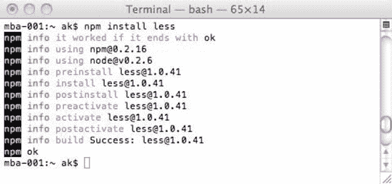
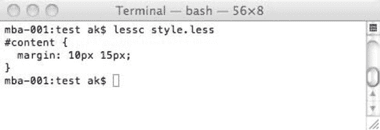
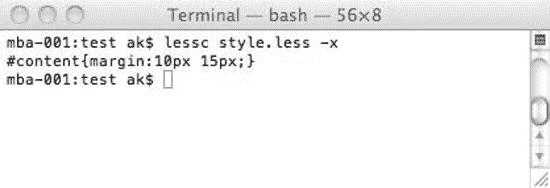
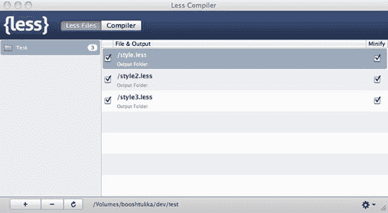
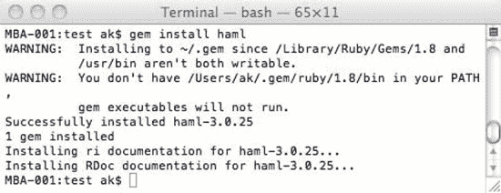
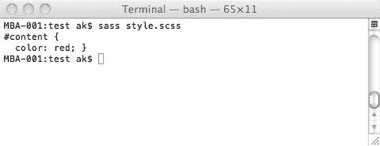
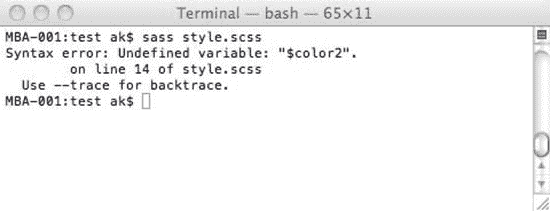

# 九、动态 CSS

到目前为止，这本书一直认为 CSS 文件是静态资产。也就是说，在每个实例中，从服务器请求并传递给站点访问者的内容是完全相同的。尽管这几乎总是实现 CSS 的预期行为和最高效的方式，但是可以根据其他因素定制 CSS 的输出，并向不同的用户交付不同的 CSS。

您可能想这样做有几个原因，有些是为了开发人员的利益，有些是为了用户的利益。从开发人员的角度来看，使用变量 1 或者动态填充 CSS 是很有用的。对于任何重复的代码，例如颜色或 CSS 的特定块，存储一次并在一个地方维护它会使代码更严格、更严格，修改起来也更容易、更安全。无论出于什么原因，在 CMS 驱动 CSS 的情况下，连接到服务器端组件或数据库可能是填充 CSS 或构建/输出选择器所必需的。有些工具使用动态行为来改进语言，使开发更有成效。

从用户的角度来看，一些网站选择为用户提供定制呈现给他们的 CSS 的能力，比如多种配色方案或版式。这可能是出于纯粹的美学原因，或者是为了解决诸如视力不佳或色盲等无障碍问题。

在本章中，您将了解以下内容:

*   CSS 扩展和预处理程序
*   评估第三方预处理器
*   用服务器端技术服务 CSS
*   连续累计
*   缓存注意事项

### CSS 扩展和预处理程序

有几个项目旨在构建 CSS，并提供一些许多开发人员认为缺失的功能。变量、注释样式和快捷方式是解决这些问题的常见方法。为了使用这些特性，开发人员通常创建一个具有不同文件后缀的文件，并以新的语法在该文件中工作；然后使用一个编译器来读取这个文件并输出一个正常的 CSS 文件。在这个领域有两个大的竞争者，LESS 和 Sass，尽管它们处理许多相同的问题，但它们之间有重要的差异。

____________________

关于在规范中包含 CSS 变量的讨论正在进行中，并且已经进行了一段时间。Tab Atkins Jr 最新(个人)稿可在`[`www.xanthir.com/blog/b4AD0`](http://www.xanthir.com/blog/b4AD0)`阅读。

### 少了

LESS 是 Alexis Sellie 创建的预处理器。它使用类似 CSS 的语法，并对 CSS 进行了许多改进。我们在版本 1.0.41 上执行了我们的测试。它是内建的 JavaScript，所以你可以包含一个 LESS 文件，就像它是常规的 CSS 一样(尽管有不同的`rel`属性)，和 less.js(来自`http://lesscss.org`)，它将在页面加载时被编译。

`<link rel="stylesheet/less" href="styles.less">
`

然而，使用 less.js 会引入对 CSS 的 JavaScript 依赖，所以我们建议使用命令行编译器。LESS 的最新版本可用于 node.js(用于创建网络应用程序的服务器端 JavaScript 框架)。从`[`nodejs.org`](http://nodejs.org)`获取 node.js。一旦你安装了它，获得更少的包的最简单的方法就是使用节点包管理器。关于安装的说明可在`[`howtonode.org/introduction-to-npm`](http://howtonode.org/introduction-to-npm)`获得。最后，您可以运行这个命令来安装 LESS 包:

`npm install less`

结果如图 9-1 所示。

***图 9-1。**安装少节点包*

辛苦到此结束。??它安装好了。这个安装为您提供了一个主要工具:`lessc`—LESS 编译器。使用这个很简单。您只需运行这个文件，将您希望它编译的 LESS 文件的路径传递给它，LESS 将创建一个与源文件同名的 css 文件，但带有“CSS”后缀。默认情况下，lessc 将输出到 stdout——直接输出到终端(见图 9-2 )。

***图 9-2。** lessc 输出到 stdout*

要输出到文件，请将 lessc 指向该文件。

`lessc style.less > compiled/style.css`

您也可以通过传递–x 作为参数来使用内置缩小(参见图 9-3 )。

***图 9-3。** lessc 缩小版*

____________________

LESS 的最初版本是用 Ruby 构建的，安装起来简单得多——尤其是在已经包含 Ruby 的 OS X 上。其实 LESS 在本章初稿写完之后就正式转到 node.js 了！这表明 LESS 仍在积极开发中。

这种缩小没有 YUI 压缩器有效——它在开始时留下了尾部分号——所以我们建议配合使用另一种压缩器。

命令行工具是开始的一种方式，但是我们马上会看到其他更友好的方式。现在，让我们详细看看 LESS 提供给我们的额外功能。

#### 变量

变量经常被认为是 CSS 最大的缺失特性之一，它可能非常强大和有用。您可以使用变量来存储您希望多次使用的任何信息，并在一个地方定义它。这意味着改变这个定义一次将影响我们使用该变量的每个实例。这是一种非常高效和稳健的工作方式。LESS 中的任何变量都以@符号为前缀。在 LESS 中声明变量非常简单，只需声明名称、冒号、值和行尾的分号。由于变量永远不会到达最终解析的 CSS，关于可以使用哪些字符的规则要简单得多；您正在为一个解析器而不是许多浏览器构建。

变量不能反复设置(它们不是变量！ 3 )。事实上，LESS 中的变量是常量。一种常见的编程约定是，常量全部大写，下划线作为单词分隔符，这使得在 LESS 文件中直观地定位变量变得非常容易，但是您应该使用您和您的团队认为最合适的命名约定(许多人更喜欢使用类似 CSS 的格式)。下面是变量用法的一个基本例子:

`@PRIMARY_COLOR: #faa344;

#content {color: @PRIMARY_COLOR;}`

编译后，它会发出以下内容:

`#content {
  color: #faa344;
}`

如您所见，LESS 对 CSS 的外观有自己的想法:多行缩进两个空格，规则之间没有垂直间隙。因为这个想法是您将主要在 LESS 中开发，所以输出的格式远没有那么重要。

你可以多次重用你的变量。LESS 也理解*作用域*的概念，这意味着你可以在不同的上下文中声明同一个变量，并且只为那个上下文改变值。顶层(任何选择器之外)的任何变量都属于*全局范围*。选择器中声明的任何变量都将该选择器作为其作用域。一个变量只存在于它的作用域内，并覆盖任何更大作用域的变量。当引用一个变量时，LESS 将在引用的局部范围内查找，然后使用它遇到的第一个值沿着链向上找到全局范围。用一个例子可能更容易理解。

这少了:

`@PRIMARY_COLOR: #faa344;

#content {
   @PRIMARY_COLOR: red;
   color: @PRIMARY_COLOR;
}

#footer {
   color: @PRIMARY_COLOR;
}`

…编译成以下内容:

____________________

3 和可扩展样式表语言(XSL)中一模一样，在 XSL 中变量不是变量，因此命名非常非常糟糕。

`#content {
  color: red;
}
#footer {
  color: #faa344;
}`

`@PRIMARY_COLOR`的第一个声明在任何选择器之外；它是全球性的。第二个声明是在`#content`的上下文中。此时，它会覆盖第一个声明，因为该声明的范围更广(不太具体)。第二个声明只存在于它的上下文中，所以一旦我们关闭了`#content`的大括号，这个变量就被丢弃了，取而代之的是我们的初始声明。当同一个变量在同一个作用域中被多次声明时，除了第一次声明之外的所有声明都被忽略。

通过用空格分隔，可以在一个属性中输出多个变量，如下所示:

`@VERTICAL_MARGIN: 10px;
@HORIZONTAL_MARGIN: 15px;

#content {
   margin: @VERTICAL_MARGIN @HORIZONTAL_MARGIN;
}`

它输出以下内容:

`#content {
  margin: 10px 15px;
}`

但是目前还没有将字符串连接在一起的方法——不留空格会减少为您添加的空格。为了证明:

`@VERTICAL_MARGIN: 10px;
@HORIZONTAL_MARGIN: 15px;

#content {
   margin: @VERTICAL_MARGIN@HORIZONTAL_MARGIN;
}`

在这段代码中，我们删除了输出变量之间的空格，但结果是一样的:

`#content {
  margin: 10px 15px;
}`

除了颜色，LESS 中的变量实际上可以表示我们在 CSS 中用作值或在值内使用的任何东西，从文本字符串到数字。

#### 混合蛋白

一个 *mixin* 是一段很容易在另一个地方重用的代码。您可以将它视为类似于 JavaScript 中的函数或方法，或者从另一个 CSS 规则继承属性的一种方式。使用 mixins，可以在另一个 CSS 规则中使用一个 CSS 规则。通过在另一个规则中只使用前一个规则中的选择器，引用规则中的所有属性都将被包括在内。

这少了:

`.callToAction {
   color: #123;
}
#content {
   .callToAction;
}`

…产生这个 CSS:

`.callToAction {
  color: #123;
}
#content {
  color: #123;
}`

值得注意的是，原来的规则仍然存在于我们输出的 CSS 中。如果您只是希望这是一个不针对任何元素的可重用代码块，那么这不会像您希望的那样高效，并且会在输出中产生无关的代码。

您也可以以类似于函数或方法的方式使用 mixins。这意味着您可以将值传递到 mixin 中，也可以在没有传递任何值时使用默认值。少管这些叫*参数混合*。为了表明 mixin 接受参数，可以在它后面加上括号，括号内是变量的名称。如果有多个变量，则应该用逗号分隔，每个变量后面应该跟一个冒号和它们的默认值(如果适用)。例如，这少了:

`.box (@HEIGHT: 40px, @WIDTH: 40px) {
   height: @HEIGHT;
   width: @WIDTH;
}

#content {
   .box(20px,80px);
}
.callToAction {
   .box;
}`

…编译成这个 CSS:

`#content {
  height: 20px;
  width: 80px;
}
.callToAction {
  height: 40px;
  width: 40px;
}`

正如您所看到的，这个方法有一个额外的好处，就是不再在我们的代码中输出 mixin！如果我们意识到这一点，我们可以使用这个技巧来使不需要参数的 mixins 不再出现在我们的输出中，只需在它们的名称后面加上空括号，如下所示:

`.callToAction () {
   color: #abc;
}

#content {
   .callToAction;
}`

这产生了这个 CSS:

`#content {
  color: #abc;
}`

这种方法不适用于比单个类名或 ID 更复杂的选择器，所以不能用标签名或派生选择器定义 mixin 这将导致错误。LESS 足够聪明，知道任何不包含属性(或只包含变量)的选择器都不会在编译后的 CSS 中输出。 4

实际上，不指定默认值会使这些参数成为“必需的”如果你引用一个没有设置默认值的 mixin，并且你没有传递值给它，这将导致一个错误。

Mixins 对于抽象出规范中尚未最终确定的实验属性特别有用。对于不同的浏览器，它们可能会有略微不同和复杂的语法，并使用供应商前缀来分隔它们。将这些属性保存在单独的模块中，可以使它们在规范和支持发生变化时易于修改，并将这些变化反映在整个代码中，同时最大限度地减少人为错误，并消除每次使用时写出每个特定于供应商的版本的需要。

____________________

4LESS 的早期版本允许您包含文档中存在的任何选择器，而不管选择器由多少个元素组成。

#### 嵌套规则

可以将规则嵌套在另一个规则中，然后沿着选择器链向上构建 CSS 的最终选择器。再举一个例子:

`#content {
   .callToAction {
      a {
         color: #321;
      }
   }
}`

结果是:

`#content .callToAction a {
  color: #321;
}`

这既是一种祝福，也是一种诅咒。通过缩进和嵌套，很容易模仿 HTML 的结构，这是一种非常直观的工作方式。然而，产生的选择器可能冗长而具体，这不太可能是我们想要的 CSS 结果。这里有一个更复杂的例子:

`#content {
   .callToAction {
      a {
         color: #111;
      }
      p {
         color: #111;
      }
      div {
         color: #111;
      }
   }
}`

结果是:

`#content .callToAction a {
  color: #111;
}
#content .callToAction p {
  color: #111;
}
#content .callToAction div {
  color: #111;
}`

这个 CSS 不仅比它可能需要的更具体，而且还可以通过多个逗号分隔的选择器更有效地完成，如下所示:

`#content .callToAction a, #content .callToAction p, #content .callToAction div {
  color: #111;
}`

这种方法还鼓励您编写特定于某些元素的 CSS，而不是可重用的类，这是一种低效的 CSS 编写方式。除非您使用这种方法对混合或变量进行分组(稍后将在“名称空间”和“访问器”小节中介绍)，或者您使用类名或 ID 作为名称空间，否则我们不建议以这种方式使用嵌套规则。

可以混合嵌套的规则和属性，如下所示:

`#content {
   position: absolute;
   p {
      color: red;
      a {
         color: blue;
      }
   }
}`

结果如下:

`#content {
  position: absolute;
}
#content p {
  color: red;
}
#content p a {
  color: blue;
}`

您还可以嵌套伪类，这是该特性的一个很好的用途。通过简单地包含冒号和伪类，您可以一次生成几行。未编译的 LESS:

`a {
   :hover {
      color:blue;
   }
   :visited {
      color:red;
   }
   :link {
      color:green;
   }
   :active {
      color:yellow;
     }
}`

…以及由此产生的 CSS:

`a :hover {
  color: blue;
}
a :visited {
  color: red;
}
a :link {
  color: green;
}
a :active {
  color: yellow;
}`

您还可以使用& combinator 来输出嵌套规则和属性中的整个选择器。这对于链接类名特别有用:

`#content {
   .callToAction {
      color: red;
      &.disabled {
         color: gray;
      }
   }
}`

结果是:

`#content .callToAction {
  color: red;
}
#content .callToAction.disabled {
  color: gray;
}`

然而，如果你试图使用& combinator 将父选择器*放在当前选择器*之后，LESS 将重新排列这些选择器:

`#content {
   body & {
      color:blue;
   }
}`

它变成如下:

`#content body {
  color: blue;
}`

这几乎肯定不是您的意图(您会期望选择器是`body #content`)。如果您理解嵌套选择器的潜在负面影响，它们会非常有用。

#### 操作

LESS 允许我们对值执行基本的数学运算，并在输出 CSS 之前对其求值。可用的运算有加、减、除和乘(没有模运算符)。这里有一个简单的例子:

`@BORDER_TOP: 1 + 1;
@BORDER_RIGHT: 1 - 1;
@BORDER_BOTTOM: 2 * 2;
@BORDER_LEFT: 6 / 2;

.callToAction {
   border-top:@BORDER_TOP;
   border-right:@BORDER_RIGHT;
   border-bottom:@BORDER_BOTTOM;
   border-left:@BORDER_LEFT;
}`

结果如下:

`.callToAction {
  border-top: 2;
  border-right: 0;
  border-bottom: 4;
  border-left: 3;` }

运算符(+或-)前后必须有一个空格，这一点很重要(其他空格字符会导致错误)，否则在对变量执行运算时，结果可能有些不可预测。LESS 也可以将这些运算符应用于单位。等式中只需要出现一个单位，更少的会假设所有其他单位都是这个单位。尝试使用多个单位执行计算将会导致错误，并且无法编译。 5 这里有个例子:

`@BORDER_TOP: 1px + 1px;
@BORDER_RIGHT: 1 - 1px;
@BORDER_BOTTOM: 2em * 2;
@BORDER_LEFT: 6 * 20%;

.callToAction {
   border-top:@BORDER_TOP;
   border-right:@BORDER_RIGHT;
   border-bottom:@BORDER_BOTTOM;
   border-left:@BORDER_LEFT;
}`

____________________

5 这不同于 CSS3 中提议的`calc()`函数(由 Firefox 的最新测试版支持——使用`–moz-cal()`供应商前缀——并计划由 IE9 支持),它足够聪明地混合了单元，因为它是在页面呈现时计算的，而不是预先计算的。更多信息请点击这里:`[`www.w3.org/TR/css3-values/#calc`](http://www.w3.org/TR/css3-values/#calc)`。

结果如下:

`.callToAction {
  border-top: 2px;
  border-right: 0px;
  border-bottom: 4em;
  border-left: 120%;
}`

请注意,%被视为一个单位，并不充当模数运算符 6 ，也不用于计算其他值的百分比。另请注意，LESS 在使用其内置压缩时，即使值为零(在不必要的情况下),也会继续附加该单元，但附加的缩小脚本可以消除这种情况。

您不能对简单的字符串值执行操作，但是 LESS 足够聪明，可以对颜色(包括 HSL 和 HSLA 颜色)执行类似的计算，尽管它会将颜色转换为十六进制。实际上，当在计算中使用 RGBA 和 HSLA 颜色时，当前版本甚至将它们转换为十六进制，完全失去了 alpha 通道，所以我们建议不要这样做。作者承诺将在下一个版本中解决这个问题。对命名的颜色执行计算是不可能的，因为 LESS 会将其视为一个字符串，而不是一种颜色—事实上，使用加法运算符时，LESS 会在第一个颜色后附加一个空格，这很可能不是您想要的结果。在计算中使用颜色时，LESS 会将颜色分解为各个分量，根据每个分量计算颜色，然后重新附着它们。您甚至可以在计算中使用多种颜色，LESS 将独立评估红色、绿色和蓝色通道(或色调、饱和度和亮度)。也可以在操作中使用变量。这里再举一个例子:

`@BORDER_TOP_COLOR: #aabbcc / 2;
@BORDER_RIGHT_COLOR: @BORDER_TOP_COLOR + #111;
@BORDER_BOTTOM_COLOR: rgb(13,26,39) * 2;
@BORDER_LEFT_COLOR: rgba(10,20,15,0.1) + @BORDER_RIGHT_COLOR;

.callToAction {
   border-top-color:@BORDER_TOP_COLOR;
   border-right-color:@BORDER_RIGHT_COLOR;
   border-bottom-color:@BORDER_BOTTOM_COLOR;
   border-left-color:@BORDER_LEFT_COLOR;
}`

编译后的代码如下:

`.callToAction {
  border-top-color: #555e66;
  border-right-color: #666f77;
  border-bottom-color: #1a344e;
  border-left-color: #708386;
}`

____________________

6 模运算符用于求除法运算后的余数。

如你所见，`@BORDER_LEFT_COLOR`的整个 alpha 通道已经丢失。在使用颜色操作时，您需要意识到这个障碍。

您可以使用这些方法来使颜色变亮或变暗，并使用单个主要变量来创建该颜色的阴影。这是一个非常强大的方法，只基于几个初始颜色来生成配色方案。

#### 颜色功能

LESS 中新引入了一些用于处理颜色的内置函数:

*   lighten(color, amount)

     `lighten()`允许您按百分比将颜色变浅。

*   darken(color, amount)

     `darken()`允许您将颜色加深一个百分比。

*   saturate(color, amount)

     `saturate()`允许你进一步按百分比饱和一种颜色。

*   desaturate(color, amount)

     `desaturate()`允许您按百分比进一步降低颜色的饱和度。

*   spin(color, amount)

     `spin()`允许您修改颜色的色调度数(正或负)。

*   fadein(color, amount)

     `fadein()`允许您按百分比增加颜色的不透明度。省略%符号仍会导致参数被视为百分比，因此 0.1 与 0.1%相同。更少不会增加超过 100%的不透明度。

*   fadeout(color, amount)

     `fadeout()`允许您按百分比降低颜色的不透明度。省略%符号仍会导致参数被视为百分比，因此 0.1 与 0.1%相同。“更小”不会将不透明度降低到 0 以上。

对于其中的每一个，LESS 会在应用变换之前将颜色转换到 HSL 颜色空间。然后，它会将颜色转换回十六进制结果，除非不透明度小于 100%，在这种情况下，它会将其转换为 RGBA。下面是这些颜色函数的使用示例:

`@COLOR: #aabbcc;
@COLOR1: lighten(@COLOR, 10%);
@COLOR2: darken(@COLOR, 10%);
@COLOR3: saturate(@COLOR, 10%);
@COLOR4: desaturate(@COLOR, 10%);
@COLOR5: spin(@COLOR, 10);
@COLOR6: spin(@COLOR, -10);
@COLOR7: fadeout(@COLOR, 50%);
@COLOR8: fadein(@COLOR7, 25%);

a {
   color: @COLOR;
   :link {
      color: @COLOR1;
   }
   :visited {
      color: @COLOR2;
   }
   :hover {
      color: @COLOR3;
   }
   :active {
      color: @COLOR4;
   }
   .callToAction {
      :link {
         color: @COLOR5;
      }
      :visited {
         color: @COLOR6;
      }
      :hover {
         color: @COLOR7;
      }
      :active {
         color: @COLOR8;
      }
   }
}`

结果是:

`a {
  color: #aabbcc;
}
a :link {
  color: #cad5df;
}
a :visited {
  color: #8aa2b9;
}
a :hover {
  color: #a3bbd3;
}
  a :active {
  color: #b1bbc5;
}
a.callToAction:link {
  color: #aab5cc;
}
a.callToAction:visited {
  color: #aac1cc;
}
a.callToAction:hover {
  color: rgba(170, 187, 204, 0.5);
}
a.callToAction:active {
  color: rgba(170, 187, 204, 0.75);
}`

这是一个很好的演示，说明了如何用一种颜色来生成一个完整的配色方案。还有提取单个 HSL 通道的内置函数，称为(可预测的)`hue()`、`saturation()`和`lightness()`。您可以使用这些函数基于其他颜色的通道来构建颜色。这些功能中的任何一个都可以与其他功能相结合。这里有一个例子:

`@COLOR1: #123;
@COLOR2: #456;
@COLOR3: #789;
@NEW_COLOR: lighten(hsl(hue(@COLOR1),saturation(@COLOR2),lightness(@COLOR3)), 10%);

a {
   color: @NEW_COLOR;
}`

使用我们的新颜色，结果如下:

`a {
  color: #8ea1b4;
}`

#### 名称空间

在 LESS 中，可以在嵌套的 mixins(名称空间)中将属性组合在一起，并通过使用>字符将这些属性作为组进行引用。这对于封装和保持代码整洁非常有用。和往常一样，这是最容易用例子来证明的:

`#box () {
   .square {
      width:80px;
      height:80px;
   }
}
.content {
   #box > .square;
}`

…结果是:

`.content {
  width: 80px;
  height: 80px;
}`

这种技术非常有用，尽管它在 LESS 的早期版本中有些缺陷，在早期版本中，您可以访问名称空间中的单个属性和变量。可以嵌套任意多层次的名称空间。

#### 正在评论

LESS 还支持 C 风格、单行注释以及块注释，但是只有 CSS 风格的注释会在编译后的 CSS 中输出，除非您使用内置的缩小功能。这里有一个简单的例子:

`/*
A regular CSS block level comment:
*/
#content {
   color: black; //A single line C-style comment
}`

结果是:

`/*
A regular CSS block level comment:
*/
#content {
  color: black;
}`

#### 导入

LESS 支持@import 指令直接将文件包含在其他文件中。您可以以这种方式包含 CSS 文件或更少的文件。当包含较少的文件时，文件后缀是不必要的。对于本例，我们需要演示几个文件的内容:

*   风格. less:

`@import "style2";

#content {
   color: red;
}`

*   style2.less:

`footer {
   color: red;
}

@import "style3.css";`

*   style3.css:

`header {
   color: red;
}`

编译 style.less 现在会产生以下结果:

`@import "style3.css";
footer {
  color: red;
}
#content {
  color: red;
}`

 **注意:**注意到什么了吗？LESS 足够聪明地意识到，当我们对 CSS 文件而不是 LESS 文件使用@import 时，我们并不打算让它组合这些文件，而让我们的代码保持原样。但更好的是，LESS 知道@import 命令需要在文件的顶部，并代表我们移动了它。LESS 的早期版本甚至聪明地意识到，当多个选择器具有相同的内容并且彼此直接相邻时，它应该用逗号分隔这些选择器并将它们分组在一起——遗憾的是，这种行为似乎已经消失了。

这种方法对于保持特征分离非常有用。在任何 LESS 文件中声明的任何变量或混合对其他人都是可用的，包括那个文件。这使得创建一个变量的配置文件变得很容易，例如，一个变量的配置文件用来驱动剩下的较少的代码。重要的是要记住，构建配置文件会产生一个空的 CSS 文件，因为其中没有标准的 CSS 代码。您必须始终编译包含其他文件的最底层文件，以构建正确的 CSS。这意味着编译该文件，即使它没有任何变化。

#### 结论

使用附带的编译器只是一种方式，你可以创建 CSS 文件，从他们不太对口。如果使用 node.js，可以在 node.js 应用程序中直接使用节点包。 7 对于那些更喜欢图形用户界面(GUI)而不是命令行的人来说，一个名为 Less.app 的应用程序在`[`incident57.com/less/`](http://incident57.com/less/)`可供 OSX 使用，它具有监视文件夹或文件，并自动编译的能力(参见图 9-4 )。

____________________

7 在`[`lesscss.org/#-client-side-usage`](http://lesscss.org/#-client-side-usage)`阅读更多关于在 node.js 中使用 LESS 的信息。

***图 9-4。** LESS.app 版本 2.3.1*

还有流行的 ide、文本编辑器和 web 框架的插件，比如 Apache、Grails、PHP ( `[`leafo.net/lessphp/`](http://leafo.net/lessphp/)`)和。NET ( `[`www.dotlesscss.org/`](http://www.dotlesscss.org/)`)。使用这些插件可以减少在读取时(当用户试图访问文件时)为您编译的代码，因此您不需要手动编译，缓存可以避免性能问题。

不幸的是，少也有不好的一面。虽然简单易学，但很少有开发人员不太熟悉。你需要严格实现它，并教育你的开发人员:任何开发人员不小心直接修改 CSS 代码，都会在下次编译时丢失更改。例如，嵌套规则可能会使控制选择器的特异性变得困难。最糟糕的是，当试图在 Firebug 或任何其他 web 检查器中调试 CSS 时，您正在检查的文件(输出的文件)不会以任何直观的方式与您的源文件相关联(行号不匹配，选择器可能不相同，等等)，除非您使用的是 LessPHP。

 **提示:**如果你正在使用 LessPHP，一个名为 Fireless ( `[`addons.mozilla.org/af/firefox/addon/fireless-for-firebug/`](https://addons.mozilla.org/af/firefox/addon/fireless-for-firebug/)`)的 Firebug 插件将使你能够调试你的 less 代码，只要你启用 LessPHP 的“debug_info”选项。

此外，代码和行为在不同版本之间发生了巨大的变化，没有变更日志或文档来解释发生了什么变化，或者如何修改现有代码来应对这些变化。如果您使用的是 LESS.app、LessPHP 或。此外，不同版本之间的接口和代码可能会有很大的不同，因为每个代码版本都需要更新端口，可能需要一段时间才能跟上。请阅读本章后面的“评估第三方预处理程序”,了解如何将这些评论应用于您在开发过程中使用的任何第三方代码。

也就是说，LESS 是编写 CSS 的一种有吸引力和有趣的方式。然而，我们提到的问题使我们很难推荐它用于生产系统；如果功能和实现变化如此之大，而没有记录的理由，并且错误悄悄进入系统，这表明没有回归测试发生——这不是你想在高流量网站上进行 beta 测试的那种事情。在官网`http://lesscss.org/`了解更多关于 LESS 的内容。

### 萨斯

Sass 代表语法上令人敬畏的样式表，就像首字母缩写词一样，它肯定是有前途的。Sass 比 LESS 存在的时间更长，已经是第三次修订了。因为 Sass 太成熟了，所以我们先介绍得少一点似乎有点不公平，尤其是现在它们的语法如此相似。然而，由于 LESS 与 CSS 和 mixins 的相似性，它的吸收速度更快。也就是说，Sass 的开发者们很快就开始效仿，而且做得优雅而恭敬。

Sass 的原始语法以 Haml 风格缩进。 8 在这个语法中，空格，比如缩进和回车，很重要，暗示着血统和结构。尽管 Python 开发人员喜欢这一点(Python 也将空白视为其语法的一部分)，但许多其他开发人员习惯于随意使用空白来格式化他们的文档。我们将巧妙地回避这一讨论，而是说从 SASS 3 开始，语法已经被称为 Sassy CSS (SCSS)的东西所取代。

SCSS 与 LESS 的相似之处在于，它的结构与 CSS 完全一样，并且每个有效的 CSS 文件也将是有效的 SCSS 文件。从视觉上看，旧语法(`.sass`文件)和新语法(`.scss`文件)的区别在于，新语法有大括号，而旧语法只有缩进；新的以分号结束规则，而旧的用回车。从功能上来说，使用 Sass 与使用 LESS 非常相似，但是 Sass 的文档要全面得多，而且有许多函数是 LESS 中没有的。

Sass 和 LESS 的原始版本一样，是用 Ruby 构建的，所以要安装它，首先需要安装 Ruby。如果使用的是 Windows，可以从`[`rubyinstaller.org/downloads/`](http://rubyinstaller.org/downloads/)`获取安装程序；如果您有 OS X，它已经安装。然后，要安装 Haml(包括 Sass)，在命令行输入(见图 9-5 ):

`gem install haml`

____________________

Haml 是一种简洁的 HTML 模板语言。在`[`haml-lang.com/`](http://haml-lang.com/)`阅读更多关于 Haml 的信息。从 3.1 版本开始，Sass 将与 Haml 分开提供。

***图 9-5。** 安装 Haml(包含 Sass)*

你完蛋了。您可能需要将 Ruby 添加到您的 PATH 变量中——如果这是真的，那么当您运行上面的命令时，就会得到警告。将文件编译成 CSS 的 Sass 命令叫做`sass`。同样，您可以在单个文件上使用它:

`sass style.scss style.css`

如果您未能提供输出文件作为参数，结果将简单地输出到标准输出(见图 9-6 )。

***图 9-6。** Sass 输出到 stdout*

你可以观察文件的变化来自动生成编译后的 CSS，语法略有不同:

`sass --watch style.scss:style.css`

或者，您可以观察整个文件夹，并将该文件夹中的任何更改输出到另一个文件夹，如下所示:

`sass --watch path/sass:path/css`

在这种情况下，新文件以与原始文件相同的名称命名，但后缀更改为. css。

总的来说，Sass 提供了更多的功能。LESS 的文档简单而缺乏，而 Sass 的文档却很全面且写得很好。为此，我们建议您参考他们在`[`sass-lang.com/docs/yardoc/file.SASS_REFERENCE.html`](http://sass-lang.com/docs/yardoc/file.SASS_REFERENCE.html)`的文档，并将重点关注许多主要特性和差异，因为否则只会重复他们的内容。我们将关注 SCSS 语法，而不是不太像 CSS 的老方法。

#### 变量

变量在 Sass 中使用稍微不同的语法。最初，创建变量使用以下语法:

`!variable = value`

由于转向了更像 CSS 的语法，这种方法已被弃用。新样式类似于 LESS，但使用美元符号作为前缀:

`$variable: value;`

Sass 还使您能够在输出中直接包含变量值(称为“插值”)，这允许您连接变量，甚至在选择器中使用它们。这是通过用大括号将变量名括起来并在前面加上一个散列符号来实现的。下面的 SCSS:

`$id: product;
$property: color;
$value: green;

#content .#{$id} {
   #{$property}:#{$value};
}`

…编译成以下内容:

`#content .product {
  color: green; }`

这使得变量在 Sass 中比在 LESS 中更加通用。默认情况下，Sass 也总是将输出格式化为多行，缩进两个空格，最后一个右括号在最后一行，而不是在新的一行。与 LESS 不同，Sass 理解变量的布尔值(真或假)。这使你能够使用条件逻辑，你可以在本章的后面读到。

 **提示:** Sass 实际上支持四种不同的输出格式:压缩、压缩、扩展和嵌套。如果您正在使用命令行，您可以通过`--style`开关选择使用哪一个，如下所示:

`sass test.scss test.css --style compressed`

Sass 压缩非常好，实现 this 和@import 指令足以模拟连接和缩小的构建脚本。

在 Sass 中，变量实际上是变量而不是常数(这就是为什么在我们的例子中我们用 camel case 而不是大写来命名它们)。您可以根据需要多次更改变量值:

`$color: red;
$color: green;
$color: blue;

#content {
   color: $color;
}`

…编译成:

`#content {
  color: blue; }`

在 Sass 中，变量的作用域也有所不同。由于无法区分创建和修改变量，一旦创建了变量，任何在比初始范围更具体的范围内创建同名变量的尝试都将修改变量，而不是创建另一个变量。然而，作用域仍然受到重视，因为在某个作用域创建的变量在不太具体的作用域中不可用。这更容易用一个例子来解释:

`$color1: red;

#content {
   $color1: green;
   $color2: blue;
   color: $color1;
   background-color: $color2;
}

.callToAction {
   color: $color1;
   //The following line is commented out, since it would cause a compilation error.
   //$color2 has not been created in the scope of this block.
   //background: $color2;
}`

…结果是:

`#content {
  color: green;
  background-color: blue; }

.callToAction {
  color: green; }`

在这种情况下，在`.callToAction`中引用`$color2`会导致编译错误，因为`$color2`还没有在该范围内创建(见图 9-7 )。

***图 9-7。** Sass 报告了范围问题的明显错误*

注意，如果命令行编译器遇到错误，Sass 将创建一个空文件，而不是完全忽略该命令。

#### 嵌套选择器

Sass 中的嵌套选择器的工作方式与 LESS 中的完全一样，只有一个显著的区别:当将当前选择器的*放在*之后时，Sass 正确地使用了&组合符。这个 SCSS:

`#content {
   a {
      .callToAction & {
         color: red;
      }
      &.externalLink {
           color: blue;
      }
   }
}`

...编译成以下内容:

`.callToAction #content a {
  color: red; }
#content a.externalLink {
  color: blue; }`

在这种情况下，Sass 的行为与我们预期的一样，而 LESS 会输出`#content a .callToAction`。

LESS 和 Sass 都不会输出没有属性的规则。但是，它们都很乐意在同一个选择器中输出相同的属性和值对:

`#content {
   color: red;
   color: red;
}`

…编译成:

`#content {
  color: red;
  color: red;
}`

正如您所看到的，它重新格式化了代码，但是并没有减少不必要的代码。这同样适用于代码的压缩版本，包括 Sass 和 LESS。

#### 条件逻辑

LESS 非常缺少条件逻辑和循环行为(将在下一节描述)，Sass 提供了这些。支持 If 和 else 子句。您可以使用大括号来包含要计算的 SCSS；和@if、@else 和@elseif 作为条件命令。一个非常简单的例子如下:

`$christmas: true;

@if $christmas {
   #content {
      color: red;
   }
} @else {
   #content {
      color: black;
   }
}`

产生的 CSS 如下:

`#content {
  color: red; }`

您还可以在选择器中使用 if 语句，就在单个属性周围。支持标准运算符:

<colgroup><col valign="top" width="30%" class="calibre11"> <col valign="top" width="67%" class="calibre11"></colgroup> 
| `==` | 等于 |
| `!=` | 不等于 |
| `<` | 不到 |
| `>` | 大于 |
| `<=` | 小于或等于 |
| `>=` | 大于或等于 |
| `and/or/not` | 用于组合条件的多个部分 |

这里有一个简单的例子:

`$lines: 10;

#content {   
   @if $lines < 10  {
      height: 20px;
   } @elseif $lines == 10 {
      height: 40px;
   } @elseif $lines > 10 {
      height: 60px;
   }
}`

结果如下:

`#content {
  height: 40px; }`

虽然这可能会使 SCSS 变得更加复杂和难以阅读，但它也使变量和 Sass 作为一个整体变得更加强大。

#### 循环

Sass 支持两种循环方法:@for 和@while。对于从一个数字到另一个数字的简单迭代，@for 是最合适的。语法很简单，包括声明一个变量和定义循环的起点和终点。变量可以在每次迭代中正常使用。这里有一个例子:

`@for $counter from 1 through 3 {
   #product#{$counter} {
         color: green;
   }
}`

生成的 CSS 如下所示:

`#product1 {
  color: green; }

#product2 {
  color: green; }

#product3 {
  color: green; }`

Sass 还支持“从 n *到* n”而不是“从 n *到* n”，这仅仅意味着变量必须小于而不是等于最后一位数字。在我们的例子中，这会给我们两次迭代，而不是三次。

@while 循环适用于更复杂的迭代，例如，对于循环的每次迭代，您可能希望增加不止一个步骤。循环将继续，直到条件评估为假。同样，语法很简单:

$ counter:1；

`@while $counter <= 6 {
   #product#{$counter} {
      color: green;
   }
   $counter: $counter + 2;
}`

结果如下:

`#product1 {
  color: green; }

#product3 {
  color: green; }

#product5 {
  color: green; }`

这些类型的控制指令是对 Sass 的一个非常受欢迎的补充(也是 LESS 中明显缺少的)。

#### 正在评论

Sass 支持单行的、C 风格的注释，在这方面的行为与 LESS 完全一样。

#### 访问者

Sass 使您能够使用@extend 关键字将选择器附加到前面的规则中——如果选择器只有一个元素的话。尽管要追加的选择器可以具有任何复杂性，但是它所应用到的规则不能有任何嵌套的选择器。下面的代码演示了这一点:

`.box {
   width:80px;
   height:80px;
}

div#content.main {
   color: red;
}

#content #product {
   color: black;
}

.redBox {
   @extend .box;
   color: red;
}
#content div a.callToAction {
   @extend div#content.main;
   text-decoration: underline;
}
.productBox {
   //The following line would cause an error
   //@extend #content #product;
}`

它编译成以下内容:

`.box, .redBox {
  width: 80px;
  height: 80px; }

div#content.main, #content div a.callToAction {
  color: red; }

#content #product {
  color: black; }

.redBox {
  color: red; }

#content div a.callToAction {
  text-decoration: underline; }`

您可以在一个声明中扩展多个规则。如果我们取消了标记行的注释，错误将如下所示:

`Syntax error: Can't extend #content #product: can't extend nested selectors
        on line 22 of style.scss
  Use --trace for backtrace.`

虽然复杂，这种技术可以是强大的。但是，如果处理特殊性问题，您必须小心，因为 Sass 在扩展时会重新排列选择器的顺序，并且很容易将选择器放在文件中比您预期的更早的位置。

#### 混合蛋白

在 Sass 中，Mixins 遵循稍微不同的格式。在 LESS 中，几乎任何简单的选择器都可以用作基本的 mixin，而在 Sass 中，选择器是用@mixin 关键字和一个惟一的名称创建的，并且用@include 关键字引用，从而使 mixin 和规则非常独立。在某些方面，这可能被认为不太灵活，但它也鼓励模块化代码，使代码具有更清晰的意图，并避免您可能会面临的一些问题(例如，当不必要时，mixin 会在最终的 CSS 中输出，或者试图使用复杂的选择器重用 CSS 块作为 mixin)。这里有一个例子:

`@mixin border {
   border: solid 1px black;
}

#content {
   @include border;
}`

输出如下:

`#content {
  border: solid 1px black; }`

在 Sass 中也可以将参数传递给 mixin，就像在 LESS 中一样，但是省略一个必需的参数会导致明显的错误。这里有一个真实的例子:

`@mixin borderRadius($radius) {
   -moz-border-radius: $radius;
   -webkit-border-radius: $radius;
   border-radius: $radius;   
}

#content {
   @include borderRadius(5px);
}
#product {
   @include borderRadius(15px);
}

.callToAction {
   //The following line would cause an error
   //@include borderRadius;
}`

它编译成以下 CSS:

`#content {
  -moz-border-radius: 5px;
  -webkit-border-radius: 5px;
  border-radius: 5px; }

#product {
  -moz-border-radius: 15px;
  -webkit-border-radius: 15px;
  border-radius: 15px; }`

如果我们取消了标记行的注释，由于没有为`$radius`参数设置默认值，将会发生以下错误(在 stdout 中):

`Syntax error: Mixin borderRadius is missing parameter $radius.
        on line 15 of style.scss, in `borderRadius'
        from line 15 of style.scss
  Use --trace for backtrace.`

### 颜色

和 LESS 一样，Sass 支持颜色的数学运算。Sass 理解所有颜色格式，包括命名的颜色(LESS 不理解)，并能正确地与 alpha 通道一起工作。Sass 还公开了许多特定于颜色的函数，这在 LESS 中是没有的。首先，有*个颜色访问器*，允许您公开颜色变量的特定属性:

*   red(color)

     `red()`返回颜色的红色通道，为 0 到 255 之间的整数。

*   green(color)

     `green()`返回颜色的绿色通道，为 0 到 255 之间的整数。

*   blue(color)

     `blue()`以 0 到 255 之间的整数返回颜色的蓝色通道。

*   hue(color)

     `hue()`返回一种颜色的色相，度数在 0 到 359 之间。 9 

*   saturation(color)

     `saturation()`以百分比形式返回颜色的饱和度。

*   lightness(color)

     `lightness()`以百分比形式返回颜色的亮度。

*   alpha(color)

     `alpha()`返回 0 到 1 之间颜色的 alpha 通道。 10 

虽然`hue()`、`saturation()`和`lightness()`都有更少的颜色，但其他颜色访问器是 Sass 特有的。

使用这些组成完整颜色的独立部分，您可以基于另一种颜色的特定属性来构建颜色，这对于基于几个原色构建配色方案来说是一种非常高级的技术。

我们将展示几个使用这些属性的快速示例。首先，我们将剖析一个命名的颜色，并使用组成部分来构建一个 RGBA 颜色。这是 SCSS:

`$color: red;

$red: red($color);
$green: green($color);
$blue: blue($color);
$alpha: alpha($color);

#content {
   color: rgba($red, $green, $blue, $alpha);
}`

下面是编译后的 CSS:

`#content {
  color: red; }`

有趣的是，Sass 选择将其作为命名颜色输出，这实际上是最有效的方法，也是最不容易解释的方法。它对所有可以被解析为命名颜色的颜色都这样做，这在读取输出的 CSS 时有时会更加混乱，但是您将在 SCSS 开发，所以除了在调试时，这应该不会出现问题。

事实上，Sass 总是将颜色转换成它认为最有效的输出。在可能的情况下，它会将它们输出为已命名的颜色。否则，它将使用十六进制颜色。最后，如果有一个阿尔法通道，它将输出 RGBA。这是另一个例子:

`$color: rgb(1, 2, 3);
  #content {
   color: $color;
}

$color: rgba(1, 2, 3, 0.5);

#product {
   color: $color;
}

$color: hsla(90deg, 50%, 50%, 0.5);

.callToAction {
   color: $color;
}`

____________________

9 计算一种颜色的色调非常复杂，需要运用一些相当高级的数学知识。你可以在`[`en.wikipedia.org/wiki/Hue`](http://en.wikipedia.org/wiki/Hue)`了解更多关于色相的内容。

10 为了向后兼容以前版本的 Sass，功能`opacity()`与`alpha()`完全相同。

以下是输出结果:

`#content {
  color: #010203; }

#product {
  color: rgba(1, 2, 3, 0.5); }

.callToAction {
  color: rgba(128, 191, 64, 0.5); }`

对于开发人员来说，这是一个有趣的决定，知道这一点很重要。这是一个值得称赞的方法，因为它通常能产生最有效的输出。

Sass 还为您提供了*颜色变异函数*:修改颜色变量的值的函数。我们将列出其中的每一项，并对其进行简要描述:

*   lighten(color, amount)

     `lighten()`允许您按百分比将颜色变浅。

*   darken(color, amount)

     `darken()`允许您将颜色加深一个百分比。

*   adjust-hue(color, amount)

     `adjust-hue()`允许你逐渐调整颜色的色调。这个和`spin()`里的少一样。

*   saturate(color, amount)

     `saturate()`允许你进一步按百分比饱和一种颜色。

*   desaturate(color, amount)

     `desaturate()`允许您按百分比进一步降低颜色的饱和度。

*   grayscale(color)

     `grayscale()`将把一种颜色转换成它的单色等价物。

*   complement(color)

     `complement()`将一种颜色转换成它的互补对应物。

*   mix(color, color, amount)

     `mix()`将两种颜色结合在一起。如果提供了 amount 属性(以百分比的形式)，它将使用第二种颜色的那部分。如果省略，Sass 会将两种颜色平均混合。

*   opacify(color, amount)

     `opacify()`将按特定量(0 到 1 之间)增加颜色的不透明度(或降低透明度/alpha)。它将不会(明显地)增加超过 1 或低于 0 的值。 11 

*   transparentize(color, amount)

     `transparentize()`与`opacify()`相反，将按照所提供的量(0 到 1 之间)增加颜色的透明度/alpha。像`opacify()`一样，萨斯绝不会让一个阿尔法通道超过 1 或者小于 0。 12 

虽然`lighten()`、`darken()`、`adjust-hue()`、`saturate()`、`desaturate()`、`opacify()`、`transparentize()`的等效物都有，但都比较少；其他颜色变异是 Sass 独有的。

使用这些函数(以及我们之前提到的颜色访问器)，可以实现非常复杂的颜色处理和计算。您可以生成一个完整的配色方案或变亮/变暗颜色，以便创建渐变，等等。一如既往，这里有一个简单的例子:

`$color: blue;

#content {
   background-color: $color;
   color: complement($color);
}`

结果如下:

`#content {
  background-color: blue;
  color: yellow; }`

____________________

11 为了向后兼容以前版本的 Sass，功能`fade-in()`与`opacify()`完全相同。

12 为了向后兼容以前版本的 Sass，功能`fade-out()`与`transparentize()`完全相同。

### 导入

Sass 支持@import，和 LESS 完全一样，只是有两个小的区别。Sass 不会将@import 命令移动到文件的顶部，这虽然不是一个明显的遗漏，但却是一个遗憾，因为它会导致无效的 CSS，其中@import 规则将不会被应用。当然，如果您打算直接将 CSS 作为输出的一部分，您只需要将文件后缀重命名为。scss(或。文件越少越好)。如果您使用如下命令:

`@import "style.css";`

Sass 会将其转换为以下内容:

`@import url(style.css);`

少了就不会这样了。这是一个不重要的改变，因为根据 CSS 2.1 规范，这两种语法都是可以接受的。但是，生成的 CSS 要大三个字符。因为@import 命令在 CSS 中并不常见(我们建议不要使用它们)，所以我们觉得这没什么好担心的。

#### 结论

Sass 还有许多其他特性，如果您打算将它作为开发过程的一部分，那么您应该通读大量编写良好的文档，并精通它们。

LESS than Sass 的应用越来越广泛——也许是因为它更简单，从一开始就看起来像 CSS 所以找到员工、应用程序支持和与它配合良好的插件可能会更容易。不可否认，Sass 更强大，但是，如果您选择使用这些预处理程序中的一个，您应该权衡每一个的利弊。

虽然不如 less 多产，但是存在用 Apache 在读取时编译 Sass 的方法，以及用于大多数主要可扩展 ide 和 Ruby gems 的插件。无论您的服务器设置如何，只要您愿意，您都可以将 Sass 集成到其中。

你可以在`http://sass-lang.com/`阅读更多关于 Sass 的内容。

尽管许多 CSS 开发人员对这两种技术(LESS 或 Sass)中的任何一种都有抵触情绪，因为他们认为这会带来太大的负担，但这确实是一种没有根据的批评。因为它们都支持 CSS 样式的语法，所以将原始 CSS 文件重命名为。少还是。scss 并添加您认为合适的新功能。真正的批评应该是对构建过程的修改、调试中的困难、对第三方的依赖以及所需的额外技能。然而，在您的组织中，您可能觉得这些问题是可以接受的，因为这些技术给您带来了许多好处。

### 评估第三方技术

在使用任何第三方代码作为开发过程的一部分之前，应该进行彻底的调查，以确保这些代码是适当的和安全的。尽管人们很容易对库、框架或预处理程序的能力感到兴奋，但是一旦它们被实现，以后要改变它们就很昂贵和困难了。因此，首先对它们进行彻底的研究，并确保团队同意使用它们是至关重要的。

需要考虑的一些事项如下:

*   Are many developers actively working on the code?

    如果只有一两个开发者，这应该是一个紧急的危险信号。很少的开发人员处理一段代码意味着很少的输入来源，这反过来意味着对用例或潜在问题的更狭隘的看法。它还表示风险，即开发人员可能会失去兴趣或由于某种原因不再能够对代码做出贡献。CSS 的世界变化(相对)很快，技术需要更新以适应这种变化。

*   Is the code mature (old)?

    没有被广泛使用的代码不太可能被很好地测试。尽管较新的技术往往是最令人兴奋的(我们当然鼓励尝试代码以获得想法或灵感)，但我们不建议在生产系统或高容量网站中使用它们，在这些地方边缘案例可能会很多。

*   Is the technology in widespread commercial use?

    同样，在更多地方使用的代码可能更安全，也更容易测试。流行技术的结果是社区、第三方文档(如书籍和博客/网络文章)和行业热情(因此可以雇佣更多的开发人员)。

*   Is the source code available?

    作为对代码停滞不前且不再被开发的未来场景的最后一招，可用的源代码将允许您的公司在内部进行未来的修改。这剥夺了允许第三方代表您有效地测试和开发代码的好处，但是保护您免受一定程度的风险。

*   Is there comprehensive documentation?

    好的文档显然有助于技术的实现和使用，同时也展示了认真的开发，这是一个好的迹象。

*   Is there a test suite?

    测试套件的存在应该表明测试良好的代码，并减轻对未来版本中回归错误的担忧。

*   Are there change logs?

    当新版本的代码发布时，很可能会对旧的实现产生影响。清晰的更改日志准确地指出了哪些内容发生了更改，以及哪些内容可能会导致问题或影响您现有的代码库。旧的方法和语法应该被弃用，至少在几个版本中不能被删除，以便让技术的消费者有机会将他们的代码更新到新的接口。

如果您对正在评估的技术的大多数问题的回答都不是肯定的，那么您应该认真思考实现这项技术是否会成为未来技术债务的来源，以及您试图解决的问题是否无法用其他方法更好地解决。

### 使用服务器端技术提供 CSS 服务

正如我们之前提到的，目前所有的浏览器都不关心你的 CSS 文件有什么后缀。 13 只要你用正确的 mime 类型(`text/css`)提供包含你的 CSS 的文件，浏览器就会很高兴地阅读它，然后继续它的日常事务。这意味着您可以使用您选择的服务器端技术，为您提供与预处理器相同的功能，甚至更多。您可以使用 PHP 连接到数据库，从那里填充变量，并将它们直接插入到代码中；或者编写自己的 ASP.NET 颜色处理函数。只要引用一个包含 CSS 的文件并提供正确的 mime 类型，这就可以了。

一个示例实现是具有许多子品牌的大型网站。尽管 CSS 基本上是相同的，但是服务器可以生成多个版本的 CSS 文件，这些文件具有从数据库中填充的不同配色方案。该数据库可以通过 CMS 进行填充，从而实现网站与网站之间一致的自动化布局，以及可以由出版部门而不是开发人员制作的配色方案。

您也可以使用这种技术在不同的情况下提供不同的 CSS。例如，您可以检测用户工作的部门(如财务、人力资源、IT 等)，并根据查询字符串或数据库条目向他们提供不同的 CSS。您还可以为用户提供他们独有的 CSS 尽管这种技术很难在服务器端缓存，并且会影响性能和带宽。更好的做法是为用户提供 CSS 选项或配色方案，并为他们提供有限数量的带有共享 URL 的 CSS 文件(或 querystring 配置)之一，以便可以有效地缓存结果。

与 LESS 和 Sass 相同的缺点也适用于此，或许程度更大。当试图调试你的 CSS 时，行号将与你的源代码不一致，选择器可能在你的源文件和结果文件之间看起来完全不同。也就是说，使用变量或数据库来维护代码的能力是允许非技术人员(如发布或内容团队)修改网站美学的一种很好的方式，自定义代码将使您对输出有更多的控制。当然，另一个不利之处是，很难雇佣廉价或低端的开发人员，因为学习曲线更陡峭，他们不能立即变得富有成效。

和往常一样，是否实现这种风格的 CSS 生成取决于您的特定场景。

### 持续集成(CI)

正如我们之前提到的，使用构建脚本来操作 CSS 是可能的，通常是出于性能的原因。虽然您可以手动运行这些脚本，但是能够以自动方式运行它们以部署到其他环境是很有用的。通常，一个组织应该有四个主要环境(可能每个都有几个):

*   Development

    虽然 CSS 作者通常在他们自己的机器上编写和测试 CSS，但当他们需要将他们的代码与其他人所做的更改集成，以更有效地测试他们作为项目的一部分所构建的内容时，他们会部署到开发环境中。这种环境通常是不可靠的，因为变化被非常频繁地部署到其中，因此对于团队进行高级测试是有用的，但对于彻底的或探索性的测试则不是。 14

*   Integration or QA

    此环境的部署频率较低，通常以预定的时间间隔进行。由于代码不经常更改，这是进行更彻底测试的好环境。通常，同时修改您的项目所依赖的代码的其他团队会使用这个环境来测试您的代码之间的连接。

*   Staging

    尽管开发和集成环境很少是实际生产环境的精确副本，但试运行环境的行为和配置应尽可能接近生产环境。对此环境的任何部署都应该是可靠的、可靠的、经过测试的代码；在这一点上，应该执行用户验收测试(UAT)。这种环境通常也是发布或内容团队在将它们推向生产环境之前用来测试它们对站点的修改的环境。

*   Production

    这是为你的用户提供页面的实时网站。

____________________

其他文件类型也是如此，比如图像、JavaScript 或字体。

当使用版本控制时，通常只有当您确信您的变更将按预期工作时，才将其推送到主存储库。一旦您提交了它们，您可能想要做的第一件事就是将它们部署到开发环境中。

虽然可以简单地连接到适当的服务器，从源代码管理存储库中获取最新版本的文件，然后手动运行任何构建脚本，但是这非常耗时，因此不是一种有效的工作方式。

持续集成(CI)系统解决了这个缺点。可以将服务器设置为自动检测存储库中的变更——或者在预定义的时间间隔后通过轮询，或者通过版本控制系统中的钩子。每当检测到更改时，服务器获取文件的新版本，然后构建项目。成功构建项目后，它会自动部署到开发环境中。

这种方法有几个优点:

*   任何测试都可以在项目构建之后、部署之前运行。这意味着，如果您有可以在客户端运行的测试，您可以构建一个临时环境，在服务器上自动运行测试——可能在许多操作系统和浏览器中——如果有问题或测试失败，选择不部署到开发环境。这被称为*破坏构建*。(你可以在第十章中读到更多关于测试的内容。)
*   任何构建脚本都可以自动运行。
*   所有用户都会收到关于任何构建问题的警告。如果有人破坏了构建，某种通知系统可以让所有其他开发人员知道，并且可以就谁应该修复它以及应该如何修复它进行对话。在问题解决之前，其他开发人员不应该提交存储库。
*   同一系统可用于手动(或自动)部署到其他环境。

____________________

14 “探索性测试”描述了无脚本测试，测试人员依靠他们的知识在站点上“捣乱”，寻找意想不到的结果或错误。

通常使用交通灯系统，其中一个小应用程序驻留在用户的菜单栏或系统托盘中。如果构建成功，它会亮绿色；如果构建失败，它会亮红色。

如果您已经选择合并构建脚本来缩小或连接您的代码，CI 可以在它被设置为部署时为您运行这些脚本。然而，您应该尝试包含启用某种调试模式的能力(如下一章所述)——至少在开发环境中——以便当测试失败或发现问题时，它们易于解决。

您可以运行的另一个测试是查看站点的结果文件是否有效，或者是否有任何生成警告。在这种情况下，您可能仍然会选择部署，但是应该通知签入导致警告的文件的开发人员。

CI 鼓励开发人员养成各种好习惯。如果它与自动化测试相结合，它可以使代码更加健壮，并节省许多浪费的时间——以及更早地提醒开发人员和测试人员注意问题。

### 巧妙构建脚本

前端工程师杰德·托马斯(Jade Thomas)提出了自己的方法，一次性解决了许多问题，而不仅仅是缩小和连接预定义的文件列表。选择在她的 CSS 中使用特定于浏览器的供应商扩展作为 WebKit 的目标，构建脚本解析这些属性，并将其复制到同一属性的所有其他特定于供应商的版本中，从而提供一种抽象的方法来处理规范中的变化，并在出现变化时添加更多特定于供应商的扩展。接下来，为 IE 的版本设置一系列自定义的供应商前缀，如`–ie6-`、`-ie7-`等(不是`–ms-`，因为它已经存在)，构建脚本可以解析并输出这些前缀，作为该浏览器的合适工具。

但是现在，聪明的部分。构建脚本实际上为 IE 的每个版本输出一个文件，为所有其他浏览器输出一个文件，而不是输出 hacks。然后，这些文件可以通过条件注释提供给适当的浏览器，这样每个浏览器都只能获得针对它的代码。LESS 或 Sass 这样的预处理器可以模拟一些这种行为，但远没有那么好。这种方法的好处是显著的:

*   原始文件不需要编译就可以工作(在 WebKit 上)——这意味着当我们调试时，我们仍然可以看到有问题的 CSS 在哪一行。
*   当验证工具支持厂商前缀时，我们的 CSS 实际上会进行验证！ 十五
*   输出中永远不会有黑客攻击。
*   构建脚本的修改版本可以在不修改行号的情况下输出 IE 版本，这也使调试变得容易。
*   每个浏览器只发出一个 HTTP 请求。
*   每个属性的特定于浏览器的代码并存，使得维护这些文件变得容易。

____________________

最新版本的 W3C CSS 验证器(`[`jigsaw.w3.org/css-validator/`](http://jigsaw.w3.org/css-validator/)`)允许你将厂商前缀显示为警告，而不是错误。

遗憾的是，这种技术还没有公开的版本或文档，但是如果您的过程证明了这一点，我们鼓励您考虑模仿这种行为。

### 缓存注意事项

当提供任何类型的动态文件时，缓存都会成为一个问题。如果您提供的文件是经过预处理的，但在其他方面是静态的，并且提供给许多用户，那么您只需要配置您的 web 服务器，将这些文件视为可缓存的(并且您仍然可以使用版本控制—如前一章所述—在必要时有效地绕过缓存)。如果这些文件是在对用户做出反应的任何时候处理的，而不是在此之前，那么这些文件也可以通过不同的机制进行缓存。但是，对于您的用户来说，最好是在请求之前主动准备好类似这样的文件。这意味着没有一个人会承受性能影响的冲击，服务器会承受可预测的(而不是不一致的)压力。

如果文件是动态修改的(可能是基于每个用户)，并且存在太多的潜在变化，预先创建这些文件是不合理的，那么从服务器端进行缓存就变得不切实际了(尽管浏览器仍然可以缓存内容)，因此性能下降是不可避免的。为了解决这个问题，您可以尝试限制潜在的变化，缓存获得最多流量的变化，或者确保您的 web 服务器没有额外负载的问题。在这种情况下，*边缘端缓存*可以帮助最小化负担。边缘缓存目前只能在(X)HTML 标记中使用，但是我们在这里提到它是为了您的兴趣，因为它可能与您选择的缓存策略有关。

边缘端缓存使用一种简单的标记语言*边缘端包含(ESI)* 来动态请求响应的特定部分，并将其余部分作为静态内容。这需要由某种 CDN 或缓存服务器来实现和解析，以便用户点击它并返回正确的响应。一些组织已经实现了它，对于高性能的网站来说，这是一种非常有效的技术。

 **注:**参见`[`en.wikipedia.org/wiki/Edge_Side_Includes`](http://en.wikipedia.org/wiki/Edge_Side_Includes)`支持 ESI 的厂商列表。

ESI 语言规范在 2001 年 8 月提交给了 W3C，但没有得到回应。然而，ESI 的反应和吸收是积极的，如果你想使用它，它是足够成熟和简单的，呈现最小的风险。一段非常简单的 ESI 标记如下所示:

`<esi:include src="http://yourcompany.com/uncachable.content"/>`

Varnish16支持 ESI，Akamai 等很多 cdn 和缓存服务器也是如此。你可以在`[`www.w3.org/TR/esi-lang`](http://www.w3.org/TR/esi-lang)`阅读更多关于 ESI 的信息。

### 总结

这一章解释了一些你可以拥有动态的和自我构建的 CSS 文件或响应的方法。这些技术并不总是合适的，并且在雇用新员工时会导致生产力下降，但是在正确的情况下可以使开发变得更加简单和愉快。如果它们适合你的网站，并且你已经考虑了这些方法的缺点，你就不应该担心实现它们。

下一章关注的是调试和测试，将教你需要知道什么来找到这种平衡，确保你充分利用你的资源，以及定位你的代码的问题并修复它们。

____________________

16 Varnish 是一款出色的软件，它极大地提高了许多 web 服务器的缓存能力。在`[`www.varnish-cache.org/`](http://www.varnish-cache.org/)`阅读更多信息。