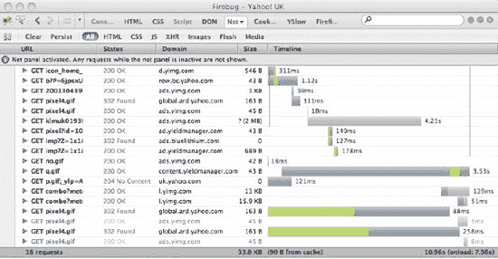
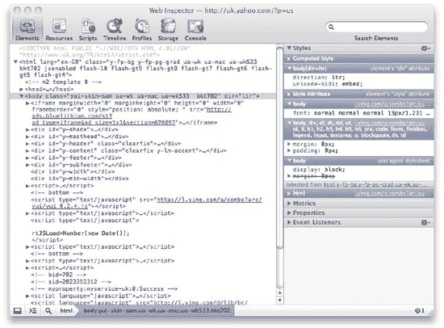

# 十、测试和调试

所以，你已经建立并运行了你的网站，你已经写好了你的 CSS，所有的事情第一次都完全正确，对吗？不太可能。对于任何类型的脚本或编程，在达到目标的过程中都有一定程度的尝试和错误。这同样适用于 CSS。编写 CSS 时，开发人员通常在代码和浏览器之间来回切换，编写或修改代码，并刷新以检查结果。如果中间有任何更复杂的步骤——构建、上传、编译等等——开发人员的生产力会受到每次编辑的影响。

一旦代码完成，有必要确保它在网站支持的所有浏览器中都能正常工作。像这样的测试需要时间和精力——CSS 经常影响网站的很大一部分——所有可能受到影响的东西都必须测试。

无论何时发现问题或错误，都需要快速修复，并在最小影响和最大信心的情况下，确保它们不会在网站的其余部分引发新问题(或重现旧问题)。

本章将关注帮助你以最有效的方式实现这一切的工具和方法。我们将讨论的许多工具都有我们不会提及的功能，因为它对 JavaScript 或服务器端开发人员更有用；我们将关注 CSS 开发人员感兴趣的部分。您将了解以下内容:

*   高效快速发展
*   创建“调试模式”
*   调试和工具
*   自动化测试
*   本地手动测试

### 快速发展

当您开始从事 web 开发时，您倾向于从事小型静态项目。这类网站在你电脑上的文件夹中运行得和在互联网上的服务器上运行得一样好。开发简单快捷，只需在编辑器和浏览器之间来回切换，无需担心外部依赖、第三方代码或其他开发人员和 CMS 对 CSS 的破坏。然而，在高流量网站的世界里，可以很有把握地假设您的开发实践受您的环境的影响要大得多。您的代码可能存在于多种环境中，并且需要额外的步骤来部署和测试您的代码。这违背了许多 CSS 开发人员的初衷，他们习惯于进行小的、迭代的更改，并频繁地测试这些更改。那么，如何才能找回自己如此热爱的快速开发周期和瞬间满足感呢？

第一步是找出影响你工作效率的事情。

#### 构建连接 CSS 的脚本

如果您正在使用一个将多个 CSS 文件连接在一起的构建脚本——我们当然建议您这样做——这个过程可能需要一段时间，并且会造成障碍。当然，对于生产代码来说，这样做是正确的，但是对于开发环境来说，这样做的速度和性能增益可以忽略不计，因为您运行的服务器很可能与您的开发机器在同一个网络上。

一个好的解决方案是使用调试样式表。让我们假设构建脚本作为某种 shell 脚本运行，它包含了我们想要连接的所有文件。可能会有一个配置文件告诉 shell 脚本我们希望它加载哪些文件以及以什么顺序加载。我们得到的文件可能被称为“main.css”。不使用配置文件，您可以考虑使用 CSS 文件，因为您有@import 指令，它允许您使用多个文件实现相同的功能。如果您有一个名为“main-debug.css”的文件，它可能包含如下内容。

`@import url(reset.css);
@import url(global.css);
@import url(login.css);
@import url(feature.css);`

使用一些巧妙的正则表达式，让我们的 shell 脚本读取这个文件并使用@import 指令构建“main.css”并不难。这给我们带来了两大好处:

1.  文件列表只保存在一个地方。
2.  您可以使用“main-debug.css”来模拟“main.css”的行为，但不需要运行构建脚本。

如果您随后修改页面以接受(例如)的 querystring？debugCSS=true，并使用该参数在包含的 CSS 的文件名中插入"-debug "，打开和关闭该行为变得很简单。现在很容易修改文件并立即看到结果。

#### 构建压缩 CSS 的脚本

如果你遵循了我们的建议，你也在压缩你的 CSS。如果构建脚本将您的 CSS 压缩到一个名为“main.css”的结果文件中，就会出现与串联相同的问题。如果在文件名中使用“-debug”来命名原始文件，那么可以使用前面提到的 querystring 技巧来访问未压缩的文件。当然，如果您既要连接又要压缩，我们在上一节中提到的处理连接的 CSS 的方法在这种情况下同样适用。

#### 不喜欢频繁刷新或超时的页面

如果您正在网站的某些部分工作，这些部分需要发布信息或具有安全连接，刷新这些页面可能会向您显示不同的内容或重定向到不同的页面。这意味着每次更改这些页面使用的 CSS 时，您都需要浏览回页面，可能需要再次登录或经历其他一些耗时的过程。

但是，有一些方法可以重新加载该页面的 CSS，而不需要重新加载页面的其余部分，假设 CSS 没有被 JavaScript 修改或者包含在页面本身中。如果您使用的是能够直接修改 HTML 的浏览器或具有相同功能的附加组件，如 Firebug、 1 ，您可以定位到外部文件的链接，并修改 URL 以包含具有唯一值的 querystring。例如，如果您的代码包含如下内容:

`<link rel="stylesheet" href="/css/main.css" />`

您可以将其修改如下:

`<link rel="stylesheet" href="/css/main.css?12345" />`

这应该会对文件提出新的请求。出于某种原因，您的 URL 可能已经包含查询字符串，例如:

`<link rel="stylesheet" href="/css/main.css?hello=goodbye" />`

然后，您只需要在它的末尾附加一个新参数来强制刷新并保持请求不被中断:

`<link rel="stylesheet" href="/css/main.css?hello=goodbye&12345" />`

但是，如果您继续使用这种方法，您附加的字符串将不会像您希望的那样唯一！无论你在键盘上敲击得多么随意，你都会很快地重复你自己，并开始从缓存中返回文件，而不是新的请求。为了解决这个问题，最好添加时间和日期，因为它们总是唯一的。不过，自己输入这些并不好玩，所以你可以使用 Firebug、Web Inspector、IE 开发工具或 Opera 蜻蜓中的控制台来运行一点 JavaScript 来为我们完成，就像这样:

`var date = new Date().getTime();
var links = document.getElementsByTagName('link');
for (var i=0,j=links.length; i<j; i++){
   var link = links[i];
   link.href += (link.href.indexOf('?') == -1 ? '?' : '&')+date;
};`

该脚本将对它在页面上找到的每个`link`标签进行这些更改。也可以把它做成一个 bookmarklet，它是一小段代码，可以从浏览器(包括 IE)的收藏夹菜单中运行，以更友好、更快捷的方式实现同样的功能。

 **提示:**这段代码确实有一些局限性，但是 Antony 在`[`zeroedandnoughted.com/bookmarklet-to-de-cache-css-and-images-version-2/`](http://zeroedandnoughted.com/bookmarklet-to-de-cache-css-and-images-version-2/)`写了一个功能更全面的版本。他的版本也将刷新图像和背景图像，并在当前文档和其中的框架或 iframes 内工作，但目前不支持使用@import 指令的文件。

__________

1 Opera 允许你直接修改页面的源代码，然后从缓存中刷新。尽管使用起来不直观，但这种有用的行为是现成可用的。但是请注意，如果您直接从文件系统运行文件，它会修改文件本身。

#### 缓存文件

由于在开发过程中缓存文件通常没有帮助，我们建议在开发时禁用浏览器中的缓存机制，但是在检查性能时不要忘记重新启用它。

#### 网络浏览器的 bug

虽然不会严重影响您的工作效率，但在 Internet Explorer 中进行开发足以让大多数开发人员放弃，转而从事管道行业。我们建议首先在符合标准的浏览器中工作，然后再修复旧版本 IE 和其他浏览器中的所有问题。这能确保你快速到达一个好的工作点，并有助于保持你的理智。当然，了解您打算支持的浏览器的局限性会有所帮助，这样您就不会构建无法在其中正确显示的东西。我们将在第三章中详细讨论这一点。

### 调试

有时，您的代码会出现难以确定的问题。一个规则可能会覆盖另一个规则，或者包含的文件可能会影响到一些意想不到的事情。如果选择器似乎没有被应用，使用`!important`将背景颜色设置为红色、绿色或蓝色通常足以证明选择器正在工作， 2 但是如果它是您有问题的属性，解决起来不太可能这么简单。然而，有一些工具可以帮助我们解决这个问题。以下是一些内置于浏览器中或作为附加组件提供的工具列表。还有很多其他的。

#### Firebug(火狐)

Firebug 是第一个真正有用的前端 web 调试器。第一个公开版本(0.2)于 2006 年 1 月发布，此后突飞猛进，激励和推动浏览器厂商开发和提供自己的等效工具。因为 Firebug 是 Firefox 的一个扩展，所以有许多其他扩展插入其中，并进一步增强了它的功能，如监控 cookies、HTTP 头等的附加组件。尽管 Firebug(以及本章后面讨论的其他开发人员工具)提供了监控和调试前端 web 开发的所有方面的方法，但我们将集中讨论 CSS、HTML 和 HTTP 部分。

Firebug 可以“捕捉”到我们浏览器的主窗口，但是我们将在它的“弹出”窗口视图中查看它。首先是 HTML 视图(如图图 10-1 所示)。

_________

使用彩色边框有相同的结果，但是修改了元素的大小和位置。

***图 10-1。**Firebug 的 HTML 视图*

这个视图包含各种有用的信息和功能。在主窗口中，它显示当前页面的 HTML 文档，并允许您展开和收缩任何带有子节点的节点。该视图中的一些可能操作如下:

*   将鼠标悬停在某个元素上，将在页面中突出显示该元素。
*   将鼠标悬停在图像上，会在一个小窗口中显示图像及其尺寸(其他浏览器工具都不这样做)。
*   单击一个元素将选择该元素。
*   在工具栏中的编辑按钮旁边，所选元素的祖先显示为面包屑。单击其中任何一个都会高亮显示该父元素。
*   单击任何元素属性将允许您重命名该属性；单击任何属性值将允许您更改属性的值。
*   在编辑属性时按 Tab 键允许您循环到下一个属性名称或值(Shift-Tab 将循环到上一个)，当您到达该元素的最后一个值时，再次按 Tab 键将允许您输入新的属性和值。
*   单击文本节点将允许您修改该节点中的文本。

执行这些操作中的任何一个都会导致对文档对象模型(DOM)和页面的即时更改，您可以立即看到这些更改。

 **提示:**你也可以在网页中选择元素，右击它们，选择 Inspect Element(这将自动显示 Firebug)。或者，您可以单击 Firebug 徽标旁边的图标，然后单击元素——这很有用，因为当您将鼠标悬停在元素上时，它们周围会显示蓝色边框，这以快速的视觉方式展示了元素所占用的布局和空间。

点击工具栏中的编辑按钮将允许你在一个内置的简单文本编辑器中编辑该元素的 HTML(包括外部 HTML)整体(见图 10-2 )。同样，这些更改将立即生效。再次单击编辑按钮将返回到上一视图。

***图 10-2。**Firebug 的 HTML 视图中的编辑模式*

在右侧，所有应用于高亮元素的作者 CSS 选择器被显示，从上到下递减。继承的值如下所示。每个规则旁边都有一个链接，指向声明它的样式表，行号显示在括号中。在以“Inherited from”开头的一行是一个链接——将鼠标悬停在该链接上将高亮显示页面中匹配的元素，单击它将在 Firebug 中高亮显示这些元素，并在 HTML 中将焦点切换到它们。

对于这些规则中的任何一个，您可以单击任何属性或属性值来更改它，并立即在页面中看到这些更改。当鼠标悬停在它们上方时，一个有一条线穿过的圆会显示在该属性的左侧；单击此处将禁用该规则的该属性。从规则的最后一个属性值中跳出来将允许您输入一个新的属性值，或者您可以双击选择器上的任意位置或属性旁边的任意位置来实现相同的目的。当输入新属性时，Firebug 会为您添加冒号和分号，所以省略它们，否则它们将被视为参数名或参数值的一部分。

在另一个更具体的选择器中被覆盖的任何属性都被直观地删除。

默认情况下，这个视图不显示用户代理 CSS(Firefox 本身应用的规则)。通过单击样式旁边的向下箭头，您可以选择显示它们，从而选择它们在层叠中的应用位置。用户代理 CSS 在规则旁边显示有红色的“<system>”，以使区别更加明显。Computed 选项卡将显示应用于元素的任何 CSS 的计算值(例如，实际的像素字体大小)，分为文本、背景、框模型、布局和其他部分(你可以在第三章中阅读更多关于计算值的内容)。如果您想快速地将一个属性添加到一个元素中，您可以右键单击选择器并选择“编辑元素样式…”——这相当于将一个样式属性添加到元素中，当然，我们并不推荐这样做，但是这对快速测试很有用。</system>

 **提示:**通过点击活动标签旁边的向下箭头，可以在 Firebug 中访问其他有用的选项，例如查看和编辑方法:悬停或:链接的活动状态，否则很难访问这些选项。

布局选项卡显示所选元素的大小、填充、边框和边距，以及位置和`z-index`(参见图 10-3 )。将鼠标悬停在其中任何一个值上都会在页面中直观地显示出来，单击其中任何一个值都可以让您编辑它们并立即看到变化。这些更改将只影响所选的元素，因为它们将在 HTML 中的元素上显示为内联样式。

***图 10-3。**Firebug 的 HTML 视图中的布局标签*

 **提示:**在 Firebug 中，任何时候你发现自己在修改一个数值，你都可以使用键盘上的向上和向下键快速递增和递减整数中的值(一次一个整数)，同时保持单位值(px 或 em)。

我们将忽略 DOM 选项卡，因为它主要关注 JavaScript。

CSS 视图显示每个 CSS 文件的全部内容，并且可以像 HTML 视图中的样式侧栏一样进行编辑(见图 10-4 )。它还包括一个使用内置文本编辑器的编辑按钮。在这个视图中，选择器也是可编辑的，这在 HTML 视图中是没有的。这种视图作为整个文件的整体视图是很有用的，但是 HTML 视图通常更有用。

***图 10-4。**Firebug 的 CSS 视图*

Net 视图显示请求当前页面时加载的所有资源。这里提供了丰富的信息(见图 10-5 )。在一行级别上，您可以看到任何花费了异常长的时间来加载和阻塞其他资源的资源。您可以使用顶部的按钮根据文件类型进行过滤(显然，作为一名 CSS 开发人员，您最感兴趣的是完整视图，或者是深入查看 CSS 和图像)。

***图 10-5。**萤火虫的网景*

将鼠标悬停在某个资源的任何时间线上(参见图 10-6 )会显示该特定请求的更多细节(这在第八章中有详细介绍)。有时，此视图会在发送前显示阻塞(或在旧版本中显示排队)，这意味着浏览器已经用完了与该域的所有可用同时连接，并且正在等待其他资源下载，然后再下载该文件。这些细节对于发现哪些因素导致你的网站表现不佳是非常宝贵的。

***图 10-6。**悬停在 Firebug* 网络视图中的时间线上

展开任何资源项目都会显示该特定请求的更多细节(参见图 10-7 )。第一个选项卡 Params 显示了任何发布的信息，或者作为查询字符串包含在请求中的信息。第二个选项卡显示 HTTP 标头，这些标头对于以下用途很有用:

*   定位缓存头以确保它们正常工作
*   检查随请求发送的任何 cookies，这是 CSS 文件的一个性能问题，应该避免
*   检查响应是否被压缩(内容编码)，这是一种性能增强

***图 10-7。**在 Firebug 的网络视图中查看请求的详细信息*

其余的选项卡以不同的形式向我们展示了实际的响应。

你可以从`[`getfirebug.com/`](http://getfirebug.com/)`获得 Firefox 的 Firebug。尽管它是跨平台的，可以在 Windows、OS X 和 Linux 上运行，但目前它只适用于这些操作系统上的 Firefox。Firebug 的跨浏览器版本正在开发中，计划在 2011 年发布。

一个名为 Firebug Lite 的 Firebug 版本可以在`[`getfirebug.com/firebuglite`](http://getfirebug.com/firebuglite),`获得，它可以通过一个 bookmarklet 访问，在其他浏览器中提供许多与 Firebug 相同的功能，最明显的省略是 Net 选项卡。

Firebug 的一些最佳可用扩展(可能会使 Firefox 不太稳定)有:

*   用于管理 cookie 的 Firecookie
*   Firediff 来查看在 Firebug 中对页面所做的更改
*   查看输入的 CSS 选择器(或 XPath 表达式)会选择哪些元素
*   Codeburner 显示 HTML 和 CSS 的参考资料
*   像素完美地覆盖图像，以帮助元素与所提供的屏幕图像对齐
*   使用 CSS 来隔离未使用的选择器
*   YSlow 提供关于如何提高页面性能的建议

因为这个列表中的许多其他工具基本上都是模仿 Firebug 的，所以我们将只详细讨论它们的功能差异。

#### 网络开发人员(火狐或 Chrome)

尽管 Web Developer ( `[`chrispederick.com/work/web-developer/`](http://chrispederick.com/work/web-developer/)`)本质上并不是 Firebug 或调试工具的竞争对手，但它提供了一些额外的功能，值得一提(参见图 10-8 )。

***图 10-8。**Firefox 中的 Web 开发者扩展*

快速禁用/启用缓存、JavaScript、cookies、CSS 和图像的能力通常证明了自己是一个有价值的时间节省者。方便地验证 CSS 和 HTML 是有用的，在预定义的窗口大小之间切换以测试多种分辨率也是提高生产率和节省时间的有效方法。

#### 开发者工具(Internet Explorer 8)

Internet Explorer 8 提供了开发者工具，以努力使浏览器在调试方面达到标准。从视觉上看，它旨在模仿 Firebug，但可用的功能确实不同。它也可以停靠在主窗口上，或者有自己的窗口。

Developer Tools 包含了几个 Firebug 没有的功能，事实上它在模仿 Firebug 和 Web Developer 的功能方面走得很远。JS、CSS 和 images 的禁用/启用只需两次点击；缓存和 cookies 也是如此。验证 HTML 和 CSS 很容易，您可以生成一个“图像报告”——当前页面上所有图像及其各自文件大小、尺寸、`alt`属性等的列表——这对 SEO 和可访问性非常有用。

图 10-9 到 10-11 是在一台 Windows XP 机器上拍摄的，被置于“丑陋模式”(所有闪亮的塑料都被关闭)以使它稍微快一点。除此之外，它们应该与你的经历相符。

HTML 标签的左窗格(见图 10-9 )类似于 Firebug 的，但是没有添加新属性的能力。要添加新的属性，需要使用右窗格中的属性选项卡，以及自动完成条目的下拉菜单。可以在内置的文本编辑器中编辑 HTML，但不能编辑单个的片段或元素。同样，编辑过的 HTML 只是在`body`标签里面的 HTML 除此之外，不可能编辑任何 HTML。

***图 10-9。**Internet Explorer 8 开发者工具的 HTML 视图*

右窗格的 Style 选项卡中的规则可以扩展和收缩，但是选择器本身不能编辑，这反映了 Firebug 的行为。在这个视图中可以启用/禁用整个选择器(在 Firebug 中不能)以及单个属性。无法在此视图中添加新的属性/值。

“跟踪样式”面板显示应用于当前元素的所有 CSS 的结果，不包括选择器(所有非默认属性)。

布局面板的行为与 Firebug 完全一样，但是没有有用的悬停行为(见图 10-10 )。您可以单击来编辑大多数值。它还显示偏移值(Firebug 没有)，这可能对您有用。

***图 10-10。**ie 8 开发者工具 HTML 视图的布局标签*

CSS 标签几乎完全模仿 Firebug 的标签，单个样式表的全部(重新格式化的)内容是可见的和可编辑的(见图 10-11 )。选择器在这个视图中是可编辑的，并且您可以通过一个复选框来启用/禁用整个选择器，除了 Opera 蜻蜓之外，这个列表中的任何其他工具目前都无法做到这一点。

***图 10-11。**ie 8 开发者工具的 CSS 视图*

没有与“净”选项卡等效的选项卡。虽然你可以用 Fiddler 或 Charles(本章后面会提到)来弥补这一点，但是需要不同的工具来实现这一点会降低你的效率和生产力。

总的来说，这个工具比以前提供的有用得多，但仍然没有视觉吸引力，感觉不完整。可以是一个*量子工具*；有很多情况下，使用开发者工具实际上会大大降低 IE 的速度，或者导致它崩溃。

Internet Explorer 9 的开发工具(虽然仍处于测试阶段)看起来是一个很大的改进，现在包括了一个相当于 net 选项卡的功能，但是它们在不同版本之间变化很大，在这里详细介绍它们是没有意义的。

#### 网页检查器(Safari)

如果你在 Safari 中启用了开发菜单，你可以访问这些工具的苹果版本:网页检查器 3 (见图 10-12 )。一般来说，Firebug 中所有可用的相同功能在这里都有，虽然感觉不太成熟。然而，在某些地方，Firebug 是开源的，Web Inspector 背后有资金支持，这一事实变得非常明显。特别是，Resources 选项卡(相当于 Firebug 的 Net 选项卡)看起来更加精致，尽管您需要在请求和 Resources 视图之间来回切换才能看到所有细节。

***图 10-12。** Safari 的网页检查器*

Safari 现在支持扩展，但在编写本文时，还没有针对 Web Inspector 的扩展。不过，WebKit 正在突飞猛进地发展，似乎在某个时候，它将在功能和可用性方面超越 Firebug。

__________

3WebKit 的 Web Inspector 的 wiki 可从`[`trac.webkit.org/wiki/WebInspector`](https://trac.webkit.org/wiki/WebInspector).`获得

 **注意:**有趣的是，Web Inspector 实际上是用 HTML、CSS 和 JavaScript 编写的，这意味着你可以检查 Web Inspector 本身背后的代码。

#### 开发者工具(Chrome)

Chrome 的等价物可以通过进入视图>开发者>开发者工具找到。因为 WebKit engine 在 Safari 和 Chrome 的检查器之后，所以它们几乎是相同的。然而，Chrome 是一个更新的版本，因为谷歌更频繁地发布 Chrome 版本(见图 10-13 )。

***图 10-13。** Chrome 的开发者工具*

CSS 的显示是最明显的区别。Chrome 显示了属性周围的括号，因此看起来更友好，更整洁，但这意味着规则不可扩展/收缩。

 **提示:**在 Safari 的 Web Inspector 和 Chrome 的开发者工具中，都可以双击选择器并直接修改它们，这是 Firebug 或其他工具中的样式窗格(在编写本文时)无法实现的。

#### Internet Explorer 开发者工具栏

对于 IE 6 和 IE 7，如果你能在你的站点上使用 Firebug Lite 的话，它通常是一个不错的选择。然而，开发者工具栏可以从`[`www.microsoft.com/downloads/en/details.aspx?FamilyID=95e06cbe-4940-4218-b75d-b8856fced535`](http://www.microsoft.com/downloads/en/details.aspx?FamilyID=95e06cbe-4940-4218-b75d-b8856fced535)`下载(搜索它可能比在浏览器中输入更简单！)，确实提供了一些有用的特性。

***图 10-14。** Internet Explorer 开发者工具栏*

火狐开发者工具栏提供的一些功能是可用的；对元素应用样式的只读视图也是可用的，但是工具栏不会与列表中的其他项目竞争。但是，如果没有其他选择，它确实提供了一些有用的调试选项。

#### 蜻蜓歌剧院

Opera 蜻蜓是 Opera 提供的产品，它为我们提供了调试功能，否则我们就会求助于 Firebug(见图 10-15 )。由于它是直接从 Opera 作为离线应用程序提供的，最新的版本总是可以无缝下载。当这本书发布时，蜻蜓 1.0 将会推出，所以我们使用了一个实验版本来尽可能多地模拟 1.0 版本的功能 4 。

***图 10-15。**歌剧院蜻蜓*

Opera 蜻蜓比名单上的其他产品都年轻，在撰写本文时，它仍处于发展的初级阶段。它提供了内置功能，如颜色选择器、屏幕放大镜和存储颜色管理器，这些功能是其他产品在没有附加组件的情况下无法提供的。其他一些细节也很不错，比如从突出显示的元素中突出出来的水平和垂直规则有助于对齐。

事实上，它正在开发中，这在一些容易发现的直接错误中是显而易见的，但它肯定是值得关注的，并且处于快速迭代开发中。

所有主要的浏览器供应商现在都提供这些工具，这是一件好事，表明他们理解开发人员的需求，并打算提供这些工具。它们都很有用，并在每个浏览器中为我们提供了可以对您的工作流程做出巨大改变的功能。然而，很难推荐任何一款感觉最成熟、功能最强大、可扩展性最强的 over Firebug，不管你更喜欢哪种浏览器。

__________

4 关于启用实验版的说明可以在`[`my.opera.com/dragonfly/blog/getting-opera-dragonfly-ready-for-opera-11/#enable`](http://my.opera.com/dragonfly/blog/getting-opera-dragonfly-ready-for-opera-11/#enable)`找到。

### 代理工具

尽管 Firebug Net 选项卡或等效工具为我们提供了查看 HTTP 请求及其组成部分的能力，但*代理工具*在较低的级别拦截流量，并为我们提供比其精简版浏览器更多的功能。有许多产品可以实现这一点，但很少有人能在调试能力上与 Charles 和 Fiddler 竞争。

#### 提琴手

Fiddler 2 是微软的 Eric Lawrence 开发的免费 Windows 程序，最初于 2003 年发布(见图 10-16 )。它的成熟使它成为一个非常强大和完美的产品。它使用。NET 微软开发框架(2.0 版或更高版本；Fiddler 1.3 适用于 1.1 版本的用户，因此您需要安装它才能使用 Fiddler。从`[`www.fiddler2.com/`](http://www.fiddler2.com/)`开始提供。

***图 10-16。**提琴手*

Fiddler 的组件太多了，本书无法一一介绍，但我们将提到对 CSS 开发人员有用的最常见的特性。本质上，Fiddler 位于您的浏览器和您的浏览器请求信息的服务器之间。这允许它检查在这两点之间通过的任何流量(包括安全流量)。

屏幕分为两个垂直窗格:第一个显示通过 Fiddler 的流量，第二个允许您进一步检查该流量。在文件菜单下，您可以选择启用或禁用流量捕获(是否在左窗格中显示请求)。

 **提示:**您也可以通过按 F12 快速切换流量捕捉。

当 Fiddler 捕获流量时，每个请求将按照请求的顺序显示在左侧窗格中，包括 HTTP 状态代码、协议、主机(域)、URL、主体(内容的大小)、缓存细节、内容类型和请求它的进程(例如，iexplore)。突出显示该请求将在右窗格中显示更多信息。

许多网站发出的 HTTP 请求比我们预期的要多得多，并且会很快填满左窗格(还有你电脑的内存)。右边的 Filters 选项卡允许您准确地指定您想要显示和捕获的请求类型，这将帮助您专注于您所关心的请求，而不是将它们淹没在噪声中。

Statistics 选项卡提供了关于所选请求所用时间的非常详细的信息，甚至给出了不同互联网速度和地理位置的性能估计，这对于定位性能问题非常有用。

Inspectors 选项卡是最有用的选项卡之一，它提供了所有的标题信息，以及查看响应数据的多种方式。对于请求，您可以看到标头、文本数据、表单数据、十六进制请求、身份验证信息、原始数据以及请求中提供的任何 XML。对于响应，您可以看到标题、文本数据、图像数据、十六进制响应、基本 web 预览、身份验证信息、缓存信息、隐私数据(例如，正在创建/修改/删除的 cookies)和原始响应。如果响应是压缩的，Fiddler 会警告你，替你检测算法，给你呈现解码后的数据。

这些全面的视图主要用于 CSS 开发人员检查意外的大文件、压缩是否正常工作、预期的数据是否被返回以及数据是否被正确缓存。

自动回复标签可能是 Fiddler 提供的最有用的功能。调试时的一个常见问题是，一个环境中的 CSS 文件或 HTML 响应与其他环境不匹配，或者其他一些因素干扰了我们的预期结果。要绝对确定一个 CSS 变化将修复我们的目标环境中的问题是非常困难的。理想情况下，例如，如果我们在生产环境中替换一个文件，我们希望知道确切的结果。自动回复可以让你做到这一点。您可以提供一个 URI 来匹配(例如，`[`www.mycompany.com/css/style.css`](http://www.mycompany.com/css/style.css)`)和一个响应。Fiddler 为各种 HTTP 状态代码提供了典型的响应，但它也允许您在本地机器上选择一个文件。这样做允许您用自己的文件替换任何服务器上的单个文件，这对于客户端开发人员来说是一种非常好的开发方式，因为他们不再需要关心服务器或底层基础结构，而是可以自信地独立处理特定的文件。

所提供的 URI 格式并不像看起来那么简单，它可以以“EXACT:”和“regex:”作为前缀，以及其他用于不同模式类型的前缀。也不可能重定向整个文件夹(例如，匹配`[`www.mycompany.com/css/`](http://www.mycompany.com/css/)`并重定向到类似`c:/projects/mycompany/css`的本地文件夹)但保持文件名不变，这样`[`www.mycompany.com/css/1.css`](http://www.mycompany.com/css/1.css)`重定向到`c:/projects/mycompany/css/1.css` , `[`www.mycompany.com/css/2.css`](http://www.mycompany.com/css/2.css)`重定向到`c:/projects/mycompany/css/2.css`等等。

为了解密 HTTPS 流量，Fiddler 在你的电脑上安装了一个证书，这是一个潜在的安全风险，但却是一个必要的方法。您可以在工具> Fiddler 选项中启用它。由于 Fiddler 向您的浏览器提供所有数据，它也能够“节流”这种流量，并模拟较慢的互联网连接。

#### 查尔斯

尽管没有 Fiddler 成熟，Charles 很快成为一个竞争者(见图 10-17 )。Charles 可以在 Windows、OS X 和 Linux 上使用，它比 Fiddler 提供的特性集更好，而且更容易使用。它不是免费的，但也不贵，你可以在`[`www.charlesproxy.com/`](http://www.charlesproxy.com/)`下载 30 天的免费试用版。

***图 10-17。**查尔斯*

Charles 的跨平台特性是一大优势；你只需要学习一次它的界面，这些经验将适用于你选择使用的任何操作系统。这个界面比 Fiddler 的更有吸引力，也不那么吓人，而且它建立在一些可用的功能之上。

要进入录制模式(Fiddler 认为是捕捉模式)，可以在窗口顶部切换一个红色的大圆圈按钮。当处于记录模式时，记录显示在窗口的右下角，Charles 将截取所有通过 web 浏览器请求的 HTTP 数据。在初始安装过程中，Charles 会为 Firefox 安装一个插件，以便能够拦截来自那里的数据。

 **提示:**要检查 HTTPS 流量，需要添加代理下的主机>代理设置> SSL 并安装证书。这方面的说明可在`http://www.charlesproxy.com/documentation/using-charles/ssl-certificates/`获得。

查看数据有两种主要方法。第一种是在结构视图中，它按主机对所有内容进行分类，以便很容易看到哪些请求来自哪个主机。另一个视图(之前演示过)是 Sequence 视图，它类似于 Fiddler 的默认视图，按顺序显示每个单独的请求。在这个视图中，文本框使得输入过滤字符串变得很简单。任何不包含输入字符串的项目都是隐藏的，这是查询数据的一种快速而直观的方式。在这个文本中也可以使用正则表达式。

在任一视图中，突出显示单个请求会在选项卡式窗格中显示更多信息——在结构视图中位于右侧，在序列视图中位于下方。第一个选项卡是 Overview，类似于 Fiddler 中的 Statistics 选项卡。

接下来的选项卡是请求和响应，分别代表请求和响应数据。根据数据的不同，这些视图的底部可能会显示其他选项卡，包括标题、文本、十六进制、压缩、HTML、查询字符串、Cookies、Raw 和 JSON。信息以比 Fiddler 更直观的格式命名和呈现，这对 CSS 开发人员可能更有用。HTML 在那个视图中是用颜色编码的，尽管不幸的是没有特定于 CSS 的视图。

“摘要”选项卡显示突出显示的请求的基本详细信息，以及作为对该请求的响应而触发的任何请求。例如，突出显示一个 HTML 请求将显示该页面指定的所有资产。这对于高级视图很有用，但是图表选项卡更详细，类似于 WebKit 的 Web Inspector 或 Firebug 的 Net 选项卡。此选项卡还提供了默认时间线视图的其他视图，如与原始请求相关的所有请求文件的可视比较大小、这些请求的持续时间，以及可视演示所请求文件的类型及其数量的类型。

通过切换屏幕顶部的方格标志图标，可以启用和禁用带宽限制。这方面的设置可以在代理>节流设置中设置，有几个有用的预设以及输入您自己的自定义值的能力。

隐藏在工具菜单下的是 Charles 提供的真正的宝石。Map Remote 允许您将任何远程请求重定向到任何其他远程目的地，这对于将一个环境的资源映射到另一个环境非常有用，可能是为了在一个服务器上使用一个特定的 CSS 文件或文件夹，或者替换另一个服务器上的文件或文件夹。Map Local 相当于 Fiddler 的自动回复器，但是它具有更友好的匹配方法和重定向整个文件夹以及文件的能力。Rewrite 选项允许我们以几乎所有可以想到的方式重写请求或响应的内容，以匹配位置，包括替换正文中的字符串或添加新的头。

 **提示:**要检查来自其他设备的流量，将它们与运行 Charles 的机器放在同一个网络上，并手动将该机器设置为设备上的代理服务器。

除了 Charles 提供的额外功能外，它还让人感觉更加精致。当你粘贴一个 URL 并在所有字段中填入代表你的各个部分时，Charles 足够聪明地将 URL 分开，这让你感觉这是一个很好的、可靠的软件。Fiddler 中嵌入的一些更深层次的功能超出了 Charles 的能力，但对于 CSS 开发人员来说，Charles 觉得更合适。

### 测试

测试是制作一个运行良好、在不同浏览器间外观和工作一致的健壮站点过程中的重要一步。不幸的是，有效地测试 CSS——网站的表示层——是一件非常困难的事情。尽管测试网站的其他层都可以以自动化的方式完成——JavaScript 可以有单元测试，服务器端代码可以有单元测试，HTML 可以被解析和验证——CSS 依赖于浏览器如何呈现它，并且需要由人工进行视觉检查。

从理论上讲，有一个页面应该如何呈现的截屏是可能的，并且作为自动化过程的一部分，将这个截屏与不同浏览器中的实际截屏进行比较。可以定义一个可接受的误差范围，根据两个截图之间的差异，测试可以通过也可以失败。然而，一个网站不可能也不会在不同的浏览器上看起来一样，这是事实。浏览器处理各种属性、字体呈现甚至图像呈现的差异确保了无论多小，不一致性总是存在的。两个文件的比较永远不会考虑哪些不一致是重要的，哪些是可接受的，所以这种测试方法永远不会完全准确。

然而，帮助这一过程的自动化技术确实存在。尽管通常测试人员需要访问每个需要测试的页面，但是在每个受支持的浏览器中，您可以使用技术来代表您生成屏幕截图，测试人员可以快速连续地查看这些截图，并且通过将两者叠加，可以很容易地与主示例进行比较。首先，有必要知道在这种情况下什么是通过或失败。

#### 分级浏览器支持

因为完美地支持每个浏览器是不实际的，所以有必要提出一个矩阵来显示哪些浏览器被支持以及支持到什么程度。该矩阵的内容因地点而异。典型网站的流量主要由最新版本的 Internet Explorer 构成。技术含量更高的网站可能会有更高比例的访问者使用被认为更先进的浏览器，这些浏览器基本上都是当前的浏览器，在较小程度上也是当前版本的 Internet Explorer。在处理高流量网站时，很可能即使是占流量一小部分的旧浏览器也仍然代表着大量的用户。决定你支持哪种浏览器取决于你网站的流量，这应该被跟踪和报告以帮助你做出决定。

保持更新的一个很好的示例矩阵是 Yahoo！分级浏览器支持，可在`[`developer.yahoo.com/yui/articles/gbs/`](http://developer.yahoo.com/yui/articles/gbs/)`查看。编写时的当前版本如图 10-18 中的所示。

***图 10-18。**雅虎！分级浏览器支持*

你决定的矩阵可能与这个有很大不同。例如，许多网站现在从 Windows 上的 Opera 或 Safari，或 OS X 上的 Chrome 看到了合理水平的流量，一些网站从 IE 6 看到了低水平的流量。

我们将在第六章中详细讨论分级浏览器支持。一旦你决定了你接受的浏览器矩阵，有必要确保你(和测试人员)有能力使用你打算测试的所有浏览器。

#### 运行多个版本的 Internet Explorer

大多数浏览器(移动设备除外)都很容易并排安装，只要你有 Windows 安装和 OS X 安装(可能还有 Linux)。这可以通过虚拟机(允许用户在其当前操作系统内运行其他操作系统的软件)来实现，尽管你不能合法地在非苹果硬件上运行 OS X。IE 以外的浏览器更新速度很快，因为这些浏览器的用户通常会很快升级到最新版本。但是，要测试多个版本的 Internet Explorer，还需要采取其他措施。

尽管 IE 的每个版本都有一个独立的虚拟机是可能的(事实上，这是测试人员应该做的)，但这对 CSS 开发人员来说是多余的。一款名为 Multiple IEs 的软件很早就解决了这个问题，允许同时安装 IE 版本 3 到 6。 5

这种方法有一些警告，主要是由于稳定性、过滤器和 cookie 处理，但对于旧版本 ie 中的页面快速视觉检查来说已经足够了。

多个 ie 上的开发已经停止，但是核心服务已经开发了一个名为 IETester 的 Windows 应用程序(见图 10-19 )。IETester 本质上提供了与多个 IE 相同的功能，，但是在一个带标签的窗口中，可以代表从 5.5 开始的任何版本的 IE。尽管这是一个 alpha 版本(从 2008 年就开始了)，但是产品的开发仍然是活跃的，并且稳定性足以满足测试目的。它可能不稳定——有几个已知的问题——但对于 CSS 开发人员来说，它为提供相同功能所需的多个虚拟机提供了一个有用且有能力的替代品。

_________

5 虽然 Multiple IEs 不再是活跃的开发，但是如果你感兴趣的话可以在`[`tredosoft.com/Multiple_IE`](http://tredosoft.com/Multiple_IE)`找到它。

***图 10-19。** IETester*

IETester 也可以配置为使用 IE 9，但这需要 Windows Vista Service Pack 2 或 7(或更高版本)。可以从`[`www.my-debugbar.com/wiki/IETester/HomePage`](http://www.my-debugbar.com/wiki/IETester/HomePage)`下载。

 **注意:**一款名为 ies4osx 的应用也允许你在 osx 下运行 IE 的版本，但它需要 Darwine(一种 Windows 模拟器)或类似的软件，而且安装起来很麻烦。也就是说，如果你想玩它，你可以从`[`www.kronenberg.org/ies4osx/`](http://www.kronenberg.org/ies4osx/)`下载。

#### 仿效其他设备

拥有测试网站所需的所有设备并不总是现实的，有时从这些设备访问开发环境可能是一件痛苦的事情。为此，这里有一个快速的模拟器列表，您可以使用它在台式计算机上模拟这些设备:

*   *苹果 iOS SDK* : `http://developer.apple.com/devcenter/ios`
    *   该工具允许您模拟 iPhones、ipad 和 iPod Touches。然而，它不是免费的，只能在 OS X 下运行。
*   *Android* : `[`developer.android.com/sdk`](http://developer.android.com/sdk)`
*   *歌剧迷你模拟器* : `[`www.opera.com/developer/tools/`](http://www.opera.com/developer/tools/)`
*   *火狐手机* : `[`www.mozilla.com/en-US/mobile/download/`](http://www.mozilla.com/en-US/mobile/download/)`
*   *完美移动* : `[`vf.perfectomobile.com/np-cas/login`](https://vf.perfectomobile.com/np-cas/login)`
    *   该工具允许您在真实的移动设备和网络上进行远程测试。这个链接是沃达丰版本的，注册沃达丰的开发者是免费的。

#### 自动生成截图

因为测试 CSS 通常需要一个人，所以让这个过程更有效的最好方法是让一个软件为你生成屏幕截图。有许多工具可以帮助解决这个问题。让我们来看看最常见的三种。

##### 硒

Selenium 是一个广泛使用的集成测试工具(见图 10-20 )。Selenium 目前是第 2 版，对原来的版本进行了重要的改进。它最初是作为 ThoughtWorks 的内部框架开发的，但后来已经成为一个完全独立的系统，有许多贡献者。一个名为 Selenium IDE 的 Firefox 插件允许您创建测试，例如:

*   浏览至`[`mycompany.com`](http://mycompany.com)`
*   等待页面加载
*   检查特定`div`中的文本是否包含短语“我们的公司太棒了”
*   单击特定的锚点
*   检查特定`div`中的文本是否包含短语“单击此处联系我们”

这个插件既可以记录你在浏览器中的行为，也可以用来一点一点地构建这些测试。记录对于了解动作是如何构建的以及它们是如何工作的特别有用。这些操作存储在一个“测试用例”中，并且您可以在一个“测试套件”中拥有多个测试用例这些测试可以从 IDE 中运行，每个操作将分别变成绿色或红色，这取决于它是通过(成功执行或为真)还是失败。

***图 10-20。**硒 IDE*

从 CSS 开发人员的角度来看，Selenium 提供的最有用的命令是 captureEntirePageScreenshot，它确实做了它所说的事情。使用这个命令，很容易在 Firefox 中自动创建一系列截图。

然而，只测试 Firefox 不如测试我们整个支持的浏览器矩阵有用。为此，Selenium IDE 的老大哥 Selenium RC 可用于针对多种浏览器、分辨率、色深和操作系统运行这些测试。Selenium RC 还支持比 Selenium IDE 更多的命令；例如，captureScreenshot 仅捕获当前视口中的视图。测试可能会很快变得非常大，并且完成起来很慢，如果您在持续集成(CI)环境中使用它们，这可能是一个问题(参见第九章)，但是这可以通过 Selenium Grid 来克服，它允许您将许多服务器连接在一起并并行运行所有测试。

一旦您创建了您的截图并批准了它们，就可以将批准的版本与后续的截图进行比较，并基于此通过或未通过测试——但正如我们之前提到的，这可能是一个脆弱的测试。

尽管 Selenium IDE 感觉笨重且功能有限，但可用的工具套件是免费的、成熟的且非常强大。如果您需要所提供的其他功能(您很可能需要)，Selenium 是帮助您实现这一目标的一个很好的工具。你可以在`[`seleniumhq.org/`](http://seleniumhq.org/)`了解更多信息。

尽管 Selenium 是您可能找到的最接近行业标准的集成测试工具，但仍有几种替代工具，下面列出了其中一些:

*   watir:??]
*   sahi:??]
*   风车:`[`www.getwindmill.com/`](http://www.getwindmill.com/)`

##### 浏览器主机

假设你唯一感兴趣的是截图， *Browsershots* 是一个简单得多的一次性测试。通过浏览到`[`browsershots.org/`](http://browsershots.org/)`，您可以输入一个 URL，勾选您想要测试的浏览器和操作系统，然后提交表单。您的请求将被放入一个队列中，当完成时，您将返回一系列屏幕截图。Browsershots 可能需要很长时间才能完成，但它是免费的。或者，每月大约 30 美元，你可以获得优先处理，跳过许多排队。虽然它是一次性执行大量测试的好工具，但是它有几个缺点:

*   它是托管的，这意味着您测试的页面必须对外部世界是可访问的，这对于您的组织来说可能是不可接受的
*   试图使这一过程自动化是非常困难和脆弱的
*   它非常慢

如果你别无选择，Browsershots 是一个有用的工具。

##### 浏览器摄像头

Browsercam ( `[`www.browsercam.com/`](http://www.browsercam.com/)`)是 Browsershots 的一个更有能力和功能的等价物，也有能力进行收费的交互。它还提供远程访问服务，以便您可以选择您想要的操作系统和浏览器，并直接连接到具有该配置的机器上进行尝试。从简单地生成截图的角度来看，它与 Browsershots 有相同的缺点，也很昂贵，尽管它更快。

### 总结

本章展示了许多工具中的一些，这些工具可以帮助您进行调试，以及了解如何决定测试哪些浏览器以及运行这些浏览器的最佳方式。它还向您展示了自动化可以帮助测试 CSS 的一些最佳方式。

在下一章，我们将把我们所有的知识付诸实践，我们将提供关于如何构建你自己的 CSS 框架的指南和例子。