# 十一、创建您的 CSS

在本章和附录中，我们把前面所有的章节付诸实践。我们打算把你在整本书中学到的一切都拿出来，给你一些现实生活中的例子，你可以根据自己的需要进行修改。虽然我们不打算规定您的流程以及您应该如何建立自己的指导原则，但我们会为您提供模板，供您在团队内部讨论时使用，以建立自己的指导原则。我们也将从头到尾经历制作一个框架的过程，然后你可以适应你的网站的需要。

在附录 1、2、3 和 4 中，您将分别找到示例 CSS 编码标准文档、示例可访问性指南文档、示例浏览器支持指南文档和示例开发流程文档。

在本章中，您将学习以下内容:

*   如何将设计解构为网站的资产和模板
*   创建 CSS 框架时要考虑哪些因素
*   如何记录设计资产的 CSS 库

### Igloo 冰箱零件公司网站

让我们向您介绍虚构的冰屋冰箱零件公司的设计。这里向您展示了设计团队提供的主页(见图 11-1 )和内部顶层部分页面(见图 11-2 )。

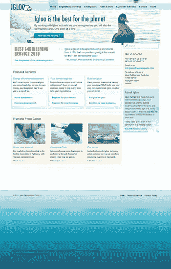

***图 11-1。**冰屋冰箱配件网站首页设计*

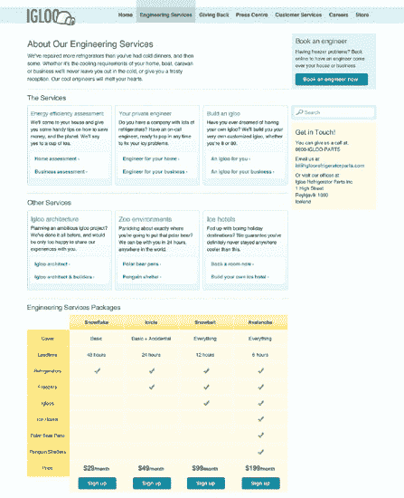

***图 11-2。**冰屋冰箱零件网站的示例内容页面*

设计团队努力创造符合业务需求和目标的设计，确保用户体验和交互尽可能清晰简单，信息传达顺畅，用户愉快地完成旅程。

正如在大型组织中经常发生的那样，许多利益相关者可能对设计应该如何，或者网站的某些区域应该包括什么内容有发言权。知道了几个有着不同职责和目标的人对这个结果的影响，CSS 作者和开发人员的工作通常是确保所创建的东西是可行的，尽可能干净地编码，并且所有的东西都被构建成最终产品不仅是可用的和可访问的，而且是可维护的。

下一步是分析这个设计，看看是否有任何问题需要我们在继续构建它之前解决。

### 分析设计

当在构建设计之前分析它时，有一些重要的问题需要回答:

*   在不同的浏览器中出现不同的外观是可以接受的(和不可以接受的)是什么？
*   在实现解决方案时，您可能会遇到什么问题？
*   你还需要和设计师讨论哪些问题，如果不解决这些问题，它们可能会成为更大的问题？

回答完这些问题后，一个很好的练习是确定页面中使用的公共元素(如果有设计库，这可能已经由设计团队完成了；你可以在第五章中阅读更多关于设计库的内容。这将使您更容易避免代码中的冗余:如果您注意到一个组件在页面的不同位置被重复使用，您将知道您不应该使它的 CSS 过于具体，以便您可以允许它被重用。如果你注意到另一个组件有两个(需要的)变体，你会知道你应该为组件的默认状态创建基本 CSS，然后可以很容易地用另一个类扩展(受面向对象 CSS (OOCSS)的启发，你可以在第四章中读到更多)。

对于第一个问题，在与设计者讨论后，你被告知跨浏览器的不同外观是不可接受的。

至于问题的后半部分，以下元素跨浏览器看起来不同是可以接受的(但对于具有 A 级支持的浏览器，要尽可能相似):

*   盒子上的圆角
*   在按钮上投射阴影
*   在文本上投射阴影

您的团队针对该解决方案提出的一些问题和疑问如下:

*   如何处理主页横幅上的文本？它使用的是 *Futura Condensed* ，这不是一种网络安全字体，只能通过`font-face`通过网络字体服务获得(更多细节见第五章)。
*   该设计没有为导航项目或链接提供悬停状态。你需要将这些反馈给设计团队，这样你们就能一起找到解决方案。

您应该在自己的团队中提出的一个问题的例子是，使用高级选择器(如`:nth-child()`选择器)删除第一个/最后一个元素上的边距和边框是否可以接受。高级选择器带来的性能提升值得吗？你应该选择通过一个类来定位这些元素的更简单的解决方案吗？如果你使用高级选择器，你会为不支持它们的浏览器提供 JavaScript 后备吗？

最后一个问题也应该咨询设计团队，因为如果你不提供后备，一些浏览器会显示不同的设计。请记住，不仅要向开发人员，还要向业务部门解释提议的解决方案的利弊，因为设计人员更希望实现的解决方案尽可能与他们的原始作品相似，而不管您是否需要更多的工作来实现它。

#### 网格

设计的底层网格应该在设计指南中指定，而不是前端开发人员通常会创建的东西。意识到这个网格，至少在基础层面上，将会使构建 CSS 更加容易，并且会使你的结果更加准确。网格在第五章中有更详细的介绍。

在我们的示例网站中，网格基于 Blueprint 默认网格，该网格由 24 列组成，宽度为 30 像素，间距为 10 像素(参见图 11-3 )。了解了这一点，您就会知道如果一个元素跨越 4 列，那么它的宽度将是 150 像素(这个结果是通过将 4 * 30px 列的宽度加上 3 * 10px 间距的宽度得到的)。

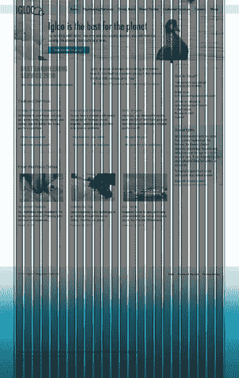

***图 11-3。**冰屋冰箱部件设计，底层网格可见*

#### 可复用组件

如前所述，在开始编写标记和 CSS 之前，识别可重用的块是很重要的。如果没有可以遵循的设计库或组件库，这一点尤其重要。

在提供给您的两个页面中，您已经确定了七个不同的框或内容块，它们将在网站的各个不同页面中重复使用(参见图 11-4 ):

*   圆形苍白色(“接触”)
*   带背景图像的圆形(“关于”)
*   带链接列表的渐变(“服务”)
*   行动号召横幅(“预约工程师”)
*   搜索
*   桌子
*   带 3 列的苍白色(“按”)

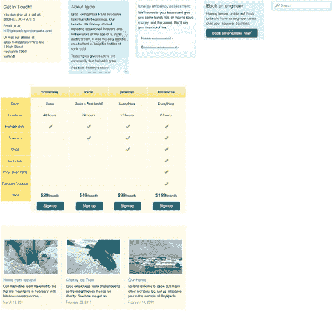

***图 11-4。**不同类型的箱子。*

这个列表给你一个设计的鸟瞰图和一个重要的轮廓，供你开始工作时使用。它还使得检测非常相似的块和元素变得容易，并且可以合并到单个模块中，因此 CSS 和设计可以进一步简化。在我们的例子中，在内容页面上(参见图 11-2 ，你可以看到第一排服务框和第二排非常相似，除了第二排的标题更大(参见图 11-5 )。

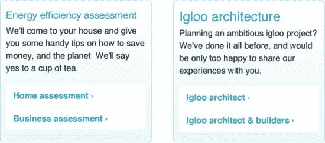

***图 11-5。**左边方框和右边方框的唯一区别是标题的大小*

理想情况下，通过统一标题大小使其成为一个单一框的决定不是由实现团队做出的，而是必须由设计师签字同意。尽管如此，重要的是要意识到这些微小的变化可能会渗入设计中，并使它们变得更加复杂(设计团队和品牌经理也将把它们作为他们角色的一部分)。您的案例中的变化不太可能像前面的例子那样简单，但是您必须意识到，有时设计解决方案可以而且应该被改变，以保持设计和代码的简单。

#### 调色板

该设计为我们呈现了十种经常使用的颜色:

*   正文
*   帮助文本(搜索)
*   未访问的链接
*   导航背景
*   选择导航
*   方框背景(蓝色和黄色)
*   虚线
*   渐变框边框
*   表格背景

还使用了四种渐变:链接列表框、按钮、表格标题和页脚背景。

也使用其他颜色(例如，在奖项宣传横幅上)，但它们主要是一次性的，不应该扰乱基本的调色板。

在分析所使用的颜色时，通过直接与设计团队交谈或参考贵组织的设计指南，确保您有正确的必要值。重要的是，例如，每当你处理简单的文本时，你使用相同的正确颜色，而不是以 12 种不同的非常相似(和不正确)的变化结束。

#### 无障碍问题

理想情况下，设计师或设计团队会对设计进行测试，以便颜色组合为色盲用户提供足够的对比度。在可访问性指南(参见附录 2)中，建议使用诸如 Color Oracle 之类的工具来测试设计，这提供了一种快速简单的方法来模拟色盲用户将会看到的内容。

前景色和背景色也应该使用对比检查器进行测试，比如 Jonathan Snook 的颜色对比检查(同样，在可访问性指南中也提到了)。

对设计的快速分析发现了一个问题:页脚文本和背景之间的对比度似乎不够。在这种情况下，如果怀疑被证明是正确的，你可以与设计团队讨论最佳解决方案:也许简单地将文本颜色改为白色就可以解决问题。

目前，我们只是根据手头的设计来分析可能的复杂情况。在开发此设计解决方案时，应该已经讨论了其他可访问性考虑事项，而其他考虑事项只能在创建代码时解决。

如果存在可以立即发现的可访问性问题，最好在动手使用代码之前解决它们。

#### 沟通很重要

开发人员很容易感觉与设计人员完全分离，交流也很少。这并不理想。设计师和开发人员都在朝着同一个目标努力:拥有一个伟大的网站，人们会觉得必须访问和使用，这将有助于公司实现其目标。虽然开发人员可能不愿意为设计师提供设计建议，但是有理由要求一个勤奋的 CSS 作者不仅反馈、建议甚至教育设计师，还包括所有参与网站创建的人，让他们了解最佳实践、标准以及以某种方式做事的含义。这不是一条单行道:同样勤奋的开发人员应该对业务的其他部分带来的新想法持开放态度，并应该努力找到问题的解决方案，这些问题可能不一定容易在代码中解决，但最终对用户来说是最好的。

一种容易引起混淆的元素是标题，所以它们是一个很好的例子，说明设计者和页面构建者之间的沟通是多么重要。如果设计者牢记在特定情况下使用的标题级别不取决于我们想要的字体大小，而是取决于内容的实际层次，那么他将更容易开发一个解决方案，其中标题(以及它们的大小和相对于它们在页面上的位置的比例)被更好地考虑和更仔细地考虑。

### 创建 CSS

在分析整体设计的重要步骤之后，是时候开始为网站创建 HTML 和 CSS 了。由于本书关注的是事物的 CSS 方面，我们假设你将遵循 web 标准，使你的标记可访问，并且(尽可能)干净和有语义。请记住:干净高效的 CSS 只能来自干净高效的标记，尽管只有在困难的时刻，需要解决更复杂和混乱的难题时，真正的专业知识才会显露出来。如果你在`[`procssforhightrafficwebsites.com`](http://procssforhightrafficwebsites.com)`前往这本书的配套网站，你可以随意查看它的标记。

我们将继续使用冰屋冰箱零件公司的网站作为我们的例子。即使它不是一个过于复杂的网站，我们也会为你提供一些提示，告诉你如何思考和编写可以应用于任何网站和过程的 CSS。

这个练习的主要目标是讨论和修改设计；为您和您的团队提供 CSS，使您无需编辑 CSS 文件即可创建更多页面(除非需要向库中添加不同类型的设计元素)；并向您展示如何创建高效且可维护的代码，以及如何创建和扩充相关的设计库。

Igloo 冰箱配件公司网站的 CSS 创建遵循该组织的 CSS 标准指南(附录 1 )、CSS 可访问性指南(附录 2 )、浏览器支持指南(附录 3 )和开发流程(附录 4 )。

我们将以我们的字符集声明开始每个 CSS 文件:

`@charset "UTF-8";`

这有助于我们避免以后必须对字符进行转义，从而节省字符并使我们的代码更容易阅读。

#### 正在评论

遵循 CSS 标准指南(参见附录 1)，我们将在开头使用 CSSDOC 注释(参见第二章了解关于 CSSDOC 的更多细节)——*文件注释*——并用于分隔样式表的各个部分——*部分注释*。在文件注释中，我们将包括样式表的描述和关于项目、最初创建样式表的团队和版权的信息。我们还将使用该注释来包含整个 CSS 中使用的主色列表(如前面所列)。下面是这个评论的样子:

`/**
 * Igloo Refrigerator Parts Inc Corporate site
 *
 * Main CSS file for the IRP Inc's corporate site
 *
 * @project             IRP Inc Corporate
 * @author               Design Team at IRP Inc
 * @copyright            2011 Igloo Refrigerator Parts Inc
 *
 * @colordef            #333; main text
 * @colordef            #999; help text (search)
 * @colordef            #1299b4; unvisited links
 * @colordef            #cdf2f8; navigation background
 * @colordef            rgba(18,153,180,.2); navigation selected
 * @colordef            #a1e0e9; navigation selected fallback
 * @colordef            #e1f4f7; box background blue
 * @colordef            #fffbeb; box background yellow
 * @colordef            #cecac5; dotted lines
 * @colordef            #b0daea; gradient box border
 * @colordef            #fffbeb; table background
 */`

在文件注释之后，我们将声明该文件是否有任何依赖关系。在我们的例子中，我们将导入一个重置样式表(reset.css ),因此我们将包含以下注释:

`/**
 * Dependencies
 *
 * Importing reset file: reset.css
 */`

后面是目录，以便更容易地引用样式表的内容。请记住，如果这个目录比较简洁，那么它会更实用，所以不必经常更新。

`/**
 * Table of contents
 *
 * Structure
 * Generic typography and lists
 * Global elements
 * Links
 * Forms
 * Tables
 * Visual media
 * Components
 * Reusable
 * One-offs
 */`

这个结构也表明了我们需要在样式表中包含哪些部分的注释。不过，最好已经有一个基本模板，它应该包括一个示例文件注释和 CSS 文件的理想结构，后面是部分注释。这将使开发人员更容易开始创建新的样式表。以下是部分注释的示例，其中描述是可选的:

`/**
 * Reusable
 *
 * Modular classes that can be applied to other elements
 *
 * @section reusable
 */`

除了介绍性和分段注释之外，您可以添加到样式表中的一些最有用的注释是那些解释为什么采取某个操作的注释。在我们的例子中，我们对使用的每一个 Internet Explorer 过滤器都做了注释，以便文件的未来编辑者知道使用它们的原因。这里有一个例子:

`#masthead {
        margin-top: -20px;
        *margin-top: 0; /* IE 7 and below: Navigation is partially hidden on IE 7 without this
property. */` `padding-top: 20px;

}`

在这种情况下，我们需要反转“masthead”部分的负上边距属性，这样它的内容在 IE 7 中就不会被裁剪。通过在属性名前添加星号，只有 IE 7 及以下版本才会正确解析第二个属性(你可以在第三章中读到更多关于这个的内容)。

您可能希望在 CSS 标准指南的主样式表中包含一个注释，说明哪些 CSS 技巧是可以接受的。有时，当应用的 hacks 数量很少时，不将这些污点从主 CSS 中分离出来会更有效率和性能。你可能会说，在未来，如果你想删除这些黑客，这将使它成为一个更困难的任务，但如果不动这些简单的记录黑客不太可能会造成任何问题。

你也可以(事实上，你应该)用一种共同的语言来标记这些黑客，以便将来容易搜索。我们将使用“HACK_”以及 HACK 的详细信息。我们更新的代码如下:

`#masthead {
        margin-top: -20px;
        *margin-top: 0; /* **HACK_IE_LTE_7:** Navigation is partially hidden on IE 7 without this
property. */
padding-top: 20px;

}`

这段代码的确切语法在附录 3 中有详细说明，你可以在第二章中阅读更多关于注释的内容。

#### 单位

在我们的 CSS 中，我们将使用相对和绝对单位的组合:ems 用于字体大小，像素用于其他测量。这一决定背后的原因是，在大多数浏览器中，以相对单位调整大小的字体可以调整大小，但是使用 ems 作为元素宽度等值会使整个布局扩展，即使用户已经设置了仅调整文本大小的首选项。

为了简化计算，我们在`body`元素中包含了属性`font-size: 62.5%`。这将使默认浏览器字体大小为 10 像素(通常是 16 像素)。知道了这些，我们就可以推断出 1 em 等于 10 像素，1.1 em 等于 11 像素，以此类推。

#### 基线样式

我们希望从头开始，所以我们将创建一个重置样式表(您可能希望将其称为“base.css”而不是“reset.css”)，通过重置一些不太一致的属性(如边距和填充)，使大多数 HTML 元素在跨浏览器时工作类似。但是我们不想重置一切，所以我们将利用一些用户代理样式表的缺省值，而不是在以后将它们添加到我们的代码中(你可以在第三章中阅读更多关于用户代理样式表的内容)。

从 Eric Meyer 的 reset 样式表开始(你可以在第四章的中读到更多关于这个和其他 reset 样式表的内容)，我们将从初始声明中删除以下元素:`fieldset`、`dt`和`dd`。尽管这些元素的边距和填充在一些浏览器中不一致，但它们作为基本样式已经足够好了，我们知道，在这种情况下，它们不会经常使用。

下一步是定制`body`选择器，使其满足我们的需求。在他最初的重置中，Eric 只对`body`元素应用了`line-height: 1`。在我们的案例中，我们需要的不仅仅是这些:

`body {
        background: #fbfdfc url(i/bkg.jpg);
        color: #333;
        font-family: "Helvetica Neue", Helvetica, Arial, sans-serif;
        font-size: 62.5%;
        line-height: 1;
}`

我们还将为`blockquote`、`ins`和`abbr`等元素添加基本样式。我们将把默认的版式留给主样式表，此时只对`body`元素应用通用的字体相关属性。

#### 结构

我们网站的设计遵循一个简单的两栏布局，顶部是全宽的页眉部分(包含导航)，底部是全宽的页脚。如前所述，底层网格(参见图 11-3 )基于 24 列布局，每列 30 像素宽，由 10 像素宽的间距隔开。容器元素可以跨越 6、9、12、18 和 24 列。

在开始构建您的框架时，记下这些度量是相当简单但极其重要的一步。这些值会在你的样式表中反复出现，所以拥有正确的值而不仅仅是近似值是至关重要的。

这同样适用于边距和填充等值。在我们的设计中，标准盒子的填充值为 14px 11px。优秀的设计师不太可能创造出这样的解决方案，例如，列表项呈现不同的底部边距。一致性很重要，模型中的一致性必须转化为代码中的一致性。

让我们开始写我们的 CSS。在我们的基本模板的“结构”部分，我们将添加主要内容包装器的样式:

`.wrapper {
        width: 950px;
        margin: auto;
}`

我们在这个实例中使用了一个类，因为我们将在每页中不止一次地使用这个包装器。因为我们设计的一些区域有全幅背景，内容区域居中，我们将使用这个泛型类来设计内部容器`div`或`section`元素的样式，同时保持主区域包装器全幅。下面是页脚标记:

`<footer>
        

                <ul>
                        <li><a href="#">Help</a></li>
                        <li><a href="#">Terms of Service</a></li>
                        <li><a href="#">Privacy Policy</a></li>
                </ul>
                
© 2011 Igloo Refrigerator Parts Inc

        

</footer>`

在这个泛型类之后，我们将为其他主容器添加样式，比如顶部`header`元素、主`(#main`和次列`(#sec`区域，以及`footer`元素。然而，我们将把`#main`和`#sec`选择器的宽度留到以后…

因为我们希望我们的元素尽可能灵活，我们将创建可以附加到任何容器的附件类，给它一个我们希望允许页面生成器使用的可能宽度。对于这些，我们将使用表示类。只要有正当的理由，这是可以的；在我们的例子中，除了“span-6”或“col-6”之外，我们如何命名一个表示跨越 6 列的元素的类呢？如果我们包含了每个元素的宽度(例如，“main”和“sec”容器的宽度，等等)，我们就不能为页面创建者(无论是开发人员还是内容编辑人员)快速创建新页面提供足够的灵活性。如果这确实是您需要实现的，那么我们建议您不要使用这些无意义的类名——这是为了更高的灵活性我们愿意接受的一种折衷。以下是我们将为集装箱宽度提供的类别:

`.span-6,
.span-9,
.span-12,
.span-18 {
        margin-right: 10px;
}
.span-6 {
        width: 230px;
}
.span-9 {
        width: 350px;
}
.span-12 {
        width: 470px;
}
.span-18 {
        width: 710px;
}`

这些类遵循了已知框架设置的例子，其中每个宽度选择器还包括一个右边距。当你需要浮动容器的时候，你可以使用类“fRight”或者“fLeft”(后面会提到)。要删除一行中最后一个容器的页边空白，您必须将类“last”添加到该容器中，该类只包含属性`margin-right: 0`(您可以在本章后面阅读更多关于可重用类的内容)。

当构建一个通用的公共框架时，比如 960.gs 或 Blueprint(你可以在第四章中读到更多关于这些框架的内容)，你需要确保你的代码能适应尽可能多的变化。然而，在创建定制框架时，没有必要走极端。你知道它的用途，你知道可能的变化，你甚至可能知道你不希望它做什么。您可以将该框架视为一种工具，它允许您根据需要创建任意多的页面变体，不多也不少。这个框架不是每个人的一切，而是必须的，这意味着没有浪费或未使用的代码或带宽。

对于我们的网站，我们不需要超过前面列出的容器宽度。在您的特殊情况下，您可能想要更复杂的变化。

#### 排版默认值

在定义了主要的结构元素并为不同的布局创建了可重用的类之后，我们将为我们需要迎合的所有元素添加基本的印刷样式。这与 reset 样式表的区别在于，在这一部分中，只包括具有字体相关属性的选择器。

通过为每个元素设置一个基本样式，您可以确保内容创建者能够创建新的页面，这些页面将始终呈现至少正确的元素层次结构，并遵循设计准则。我们将对所有六个标题级别(`h1`到`h6`)、段落(`p`)、列表元素(`li`)、定义列表(`dt`和`dd`)、引号(`blockquote`)和预格式化文本(`pre`)进行样式化。该设计具有非常一致的标题层次结构，因此我们知道，即使某些级别标题位于特定的容器中，它们也会具有相同的`font-size`、`line-height`和`margin`值。有一些变化，但是它们不应该在默认样式部分中处理，而应该只在组件级别添加，只应用必要的更改并利用继承来使变化最小化并避免冗余。

正如我们之前提到的，我们将使用 ems 来定义网站中的`font-size`值，但是我们将使用像素来定义高度、宽度、边距和填充。这将允许字体大小调整，甚至在旧的浏览器，保持布局一致，并避免不必要的水平滚动条。

以下是前三级标题的样式:

`h1, h2, h3, h4, h5, h6 {
        font-weight: normal;
}
h1 {
        font-size: 2.4em;
        margin-bottom: 10px;
}
h2 {
        font-size: 1.8em;
        margin-bottom: 12px;
}
h3 {
        font-size: 1.5em;
        margin-bottom: 10px;
}`

下面是我们的段落和列表元素的样式:

`p, li, dt, dd {
        font-size: 1.3em;
        line-height: 1.4;
        margin-bottom: 12px;
}`

`line-height`值是无单位的，因此它可以适应文本的大小。在这种情况下，计算出的`font-size`值将是`13px`，计算出的`line-height`值将是`18.2px`(你可以在第三章中了解关于计算值的更多信息)。如果字体大小增加，例如增加到`1.5em`，计算值将分别为`15px`和`21px`—`line-height`值与`font-size`成比例增加。

我们有意识地将`ul`、`ol`和`dl`元素排除在基本样式之外:默认的用户代理样式满足设计的需要，因此没有必要重置或覆盖这些样式。

您可以更进一步，为某些元素后面的标题添加样式。例如:

`p + h1,
p + h2,
p + h3,
p + h4,
p + h5,
p + h6 {
        margin-top: 24px;
}`

可能性是无限的:您可以为遵循特定列表类型或图像的标题、遵循相同元素的段落、遵循特定标题级别的列表类型等包含样式。

对于我们的网站，我们还将为放置在`blockquote`元素中的`p`和`cite`元素添加样式:

`blockquote p {
        font-size: 1.3em;
        font-style: italic;
        margin-bottom: 8px;
}
blockquote p:before {
        content: "“";
}
blockquote p:after {
        content: "”";
}
blockquote cite {
        display: block;
        font-size: 1.3em;
}
blockquote cite:before {
        content: "—";
}`

前面的代码应该是不言自明的。我们已经使用了`:before`和`:after`伪元素将引号添加到 blockquote 中段落的开头和结尾。因为我们已经声明文件的字符集是 UTF-8，所以没有必要对这些特殊字符进行转义。我们没有使用这些伪元素的 CSS3 版本(分别是`::before`和`::after`，以便 Internet Explorer 8 能够理解它们:我们希望向尽可能多的浏览器显示相同的设计。

出于两个原因，我们在本节中没有包括表单和表格样式。我们的表单元素将从用户代理样式表中继承大部分样式，只添加一些用于定位和定制按钮设计的样式。表格样式本身就很复杂，所以在样式表中保留一个单独的部分，将表格作为一种特殊类型的组件，可以使这个基本样式部分更清晰，更容易浏览和引用。

你可以在第五章中阅读更多关于排版考虑的内容。

#### 全球元素

添加基本样式后，我们将为全局元素创建样式。这些元素出现在网站的每个(或者几乎每个)页面上。在我们的例子中，它们是标题区域、主导航和页脚。对于某些应用程序，我们需要覆盖我们已经创建的一些基本样式，例如导航列表:

`nav ul {
        list-style: none;

}
nav li {
        display: inline;
        font-size: 1.4em;
        font-weight: bold;
        margin-top: -35px;
        margin-bottom: 0;
}`

对于主导航中的列表项，我们必须覆盖默认的用户代理`list-style`值，应用不同于基本样式的边距值，并增加字体大小。我们将把链接样式留给“链接”部分，这样我们就有了一个集中的区域，可以确保所有的链接状态都得到满足。您不必在自己的样式表中遵循这种结构，但是我们的经验表明，将所有链接放在同一个位置可以使不同的开发人员在需要编辑或扩充时更容易在文档中找到它们。

根据手头的设计，这一部分可能需要包含更多或更少的元素。您可能会发现将全局元素分隔在各自的部分中更容易，然后将不同的部分用于主导航、辅助导航、页脚等等。

#### 组件和可重用类

在我们的例子中，我们将组件分类为应用了特定样式的可重用内容块。通过将组件的类或 ID 添加到容器元素中，可以使其中的元素继承这些样式。这使得 CSS 更加可重用和模块化。这些块不是为它们出现的每个实例设计样式，而是与位置无关的、可移动的块。我们将使用 serviceBox 作为我们的示例组件(参见图 11-6 )。

但是，在创建 serviceBox 之前，我们首先创建了一个基本的 Box 组件:

`.box {
        background: #fffbeb;
        padding: 14px 11px;
        -moz-border-radius: 4px;
        -webkit-border-radius: 4px;
        border-radius: 4px;
}`

这个类可以应用于任何容器，它将使用正确的圆角值、填充和背景来设置样式。通过“serviceBox”类，我们将扩展“Box”类。这遵循了 OOCSS 的概念，其中类可以被其他类重用和扩展，从而形成更加模块化的样式表。你可以在第四章中阅读更多关于 OOCSS 的内容。

下一步是创建 serviceBox 类:

`.serviceBox {
        background: #fff url(i/box-grad.jpg) repeat-x left bottom;
        border: 1px solid #b0daea;` `        overflow: hidden;
        height: 1%;
}`

如设计所示，serviceBox 有一个不同的背景、一个边框，并以三行显示。“serviceBox”元素的宽度和边距将由父容器`div`决定，并应用正确的“span”类(在本例中为`span-6`)。我们包含了值为 1%的`height`属性，这样 IE 6 将清除容器，因为它不理解`overflow: hidden`属性(在其他更兼容的浏览器中用于清除容器)。这个框中的内容总是标题、段落和链接列表。了解了这一点，我们可以进一步设计其中的内容:

`.serviceBox ul {
        list-style: none;
        margin-left: 0;
}
.serviceBox li {
        border-top: 1px solid #eef9fb;
        margin: 0;
        width: 100%;
}`

我们已经利用了这个事实，即标题使用的样式与我们文件的基本样式部分中定义的样式相同，所以我们不需要在这里为它添加任何样式。我们现在只需要给列表元素添加圆角。因为这种样式不会随着链接的悬停或活动状态而改变，所以我们可以在本节中添加它:

`.serviceBox li:first-child a {
        border-top: none;
        -moz-border-radius: 4px 4px 0 0;
        -webkit-border-top-left-radius: 4px;
        -webkit-border-top-right-radius: 4px;
        border-radius: 4px 4px 0 0;
}
.serviceBox li:last-child a {
        -moz-border-radius: 0 0 4px 4px;
        -webkit-border-bottom-left-radius: 4px;
        -webkit-border-bottom-right-radius: 4px;
        border-radius: 0 0 4px 4px;
}`

请注意，WebKit 特定的属性是为 WebKit 的旧版本单独添加的。WebKit 只支持在最新版本的`border-radius`属性中的简写。一些老的浏览器看不到这种风格，但是他们也不会理解`border-radius`属性，所以这是一个公平的妥协。我们已经设计了我们的 serviceBox 组件！如前所述，我们将在样式表的适当部分添加链接样式。

组件是可重用的，但是这里我们对组件和可重用类进行了区分，因为可重用类更具有表示性，并且倾向于只满足单个属性/值的组合。创建组件主要是为了保存特定类型或组合的内容。

在我们的主样式表中，我们已经创建了五个不同的可重用类。第一个可重用的类可能是大多数前端开发人员所熟悉的:`clearfix`。这个类可以应用于任何需要“自我清除”的元素(清除时没有专门为此创建的元素)。我们还包括 Internet Explorer 7 和以下版本的这个小技巧:

`.clearfix:after {
        content: ".";
        display: block;
        height: 0;
        clear: both;
        visibility: hidden;
}
.clearfix { /* HACK_IE_LTE_7: IE 7 and below don't support the :after pseudo-element (above). */
        *zoom: 1;
}`

接下来，我们创建两个类，允许开发人员和内容创建者轻松地左对齐或右对齐元素:

`.fLeft {
        float: left;
}
.fRight {
        float: right;
}`

接下来，我们将添加可以应用于一行中最后一个元素的“last”类。这将删除右边距，否则将被应用，以便它整齐地适合可用的宽度:

`.last {
        margin-right: 0;
}`

最后，我们包括一个可访问性类，允许内容创建者隐藏只有屏幕阅读器才能阅读的文本:

`.accessibility {
        position: absolute;
        text-indent: -9999px;
}`

#### 一次性的

总会有一些元素需要被创建和设计，这些元素并不遵循我们添加到框架中的任何东西的设计。我们称这些为一次性的。您可能更喜欢称它们为“异常”、“唯一的”，或者任何您认为合适的名称。

在 Igloo 冰箱零件公司网站的例子中，我们已经确定了(到目前为止)两个特例:主页上的横幅和“最佳工程服务奖”框，也在主页上。

对于横幅，我们将创建一个可以附加到`#masthead`组件的类，包括正确的背景图像和文本大小:

`.planet {
        background:url(i/hp-banner01.jpg) no-repeat center 20px;
}
.planet h2 {
        font-size: 4.8em;
        margin-bottom: 0;
}
.planet p {
        font-size: 1.6em;
        padding-bottom: 6px;
}`

这个类基本上是`#mastead` ID 的扩展，并依赖于它。因为它的风格非常特别，并且不适用其他任何东西，所以它被放在样式表的“一次性”部分下。

对于奖励框，我们也将利用一些元素的默认样式，但是我们需要改变许多属性:

`#bestEngAward {
        border: 1px solid #fce8b8;
        background: #fff;
        padding: 23px 20px;
}
#bestEngAward h2 {
        color: #fcb61a;
        font: 3em/1.1 Impact, "Helvetica Compressed", "Helvetica Inserat", Arial Narrow,
Tahoma, Geneva, "MS Sans Serif", sans-serif;
        margin-bottom: 20px;
        text-transform: uppercase;
}
#bestEngAward p {
        margin-bottom: 0;
        width: 100%;
}
#bestEngAward p a:link, #bestEngAward p a:visited {
        border: none;
}
#bestEngAward p a:after {
        content: " ›";
}
#bestEngAward blockquote {
        background: url(i/blockquote.gif) no-repeat;
        color: #0f6080;
        margin: 0 25px 0 0;
        padding: 3px 0 0 40px;
        width: 321px;
}
#bestEngAward blockquote p {
        font-size: 1.6em;
        font-style: normal;
        margin-bottom: 3px;
}` `#bestEngAward blockquote p:before {
        content: "";
}`

为了改变它们的样式，我们必须覆盖`h2`和`p`元素的属性、链接样式以及`blockquote`元素及其子元素的样式。如果最初的样式过于具体，这段代码会更加冗长:我们要么没有利用继承来声明最少的属性，要么不得不重写过于具体的选择器。

小心:随着网站的增长，一次性网站的数量可能会呈指数级增长。设计者应该对这种情况敏感，并确保没有创建与现有元素非常相似的元素。这不仅会使 CSS 变得更加复杂和不确定，而且会使设计方案更加淡化。确保您正在创建的元素还没有以某种方式出现在您的样式表中，或者它不能扩展具有几个属性的现有组件。

#### 妥协

作为有意识的 CSS 作者，我们知道什么是最佳实践；我们了解并遵守网络标准；我们掌握了最新的 CSS 技术，这些技术通常是为了让 CSS 更有效，让开发人员更有效率而开发的。这些我们都知道。但是作为在大型网站上工作的 CSS 作者——数百万用户在无数不同的设备和设置上访问——我们也知道我们需要做出一些妥协。

冰屋冰箱零件公司网站也不例外。我们已经提到了一些妥协，比如使用无意义的类名来增加灵活性，或者求助于用户代理样式表的默认设置来实现一些元素的基本样式。

另一个我们妥协的例子是使用一个图片来在主页的横幅上显示一个自定义的非网页安全字体。最初的设计使用 Futura Condensed Medium，很少有用户会在他们的计算机中安装这种介质。这种情况的选项如下:

*   使用图像
*   使用图像替换技术
*   使用库芬或 sIFR(你可以在第五章中了解更多)
*   使用 Fontdeck 作为 web 字体服务，因为它提供了这种字体

由于这种字体只在一种情况下使用，简单地用图像替换文本并使用`alt`属性来识别图像中的文本被证明是最快、最简单、最便宜的解决方案，并且不会妨碍可访问性。如果更多地方需要这种字体，我们最喜欢的解决方案是利用像 Fontdeck 这样的服务，但是额外的下载和增加的费用在这种情况下是不合理的。

以“最佳工程服务奖”框中使用的字体为例，*影响*，我们知道这是 Windows 和 Mac 电脑中默认普遍安装的字体。在这种情况下，最好的解决方案是创建一个字体堆栈，在没有安装字体的地方，堆栈中的第二、第三甚至第五种字体仍然是可接受的(最终的字体堆栈是`Impact, Helvetica Compressed, Helvetica Inserat, Arial Narrow, Tahoma, Geneva, MS Sans Serif,`和`sans-serif`)。参见图 11-6 。

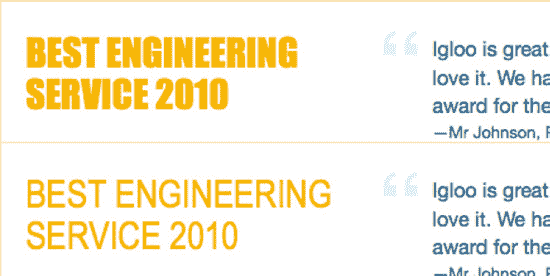

***图 11-6。**以首选字体 Impact(顶部)呈现的文本与以字体堆栈中稍后出现的字体呈现的文本之间的比较，在本例中为 Arial Narrow(底部)*

这些都是非常简单的例子，说明您可能必须做出妥协，但只要您权衡所有选项，并选择在效率和维护方面最可行的一个，您就应该在正确的轨道上。请记住，您(以及参与设计创建的团队)可能是唯一知道事情看起来不完全正确的人；用户不会在不同的平台上比较网站的表现。

#### 跨浏览器一致性

跨浏览器一致性的主题与前面讨论的妥协主题紧密相关。当我们在开始 CSS 之前分析设计时，我们被告知需要完美跨浏览器的唯一元素是公司的徽标。其他元素在具有 A 级支持的浏览器中应该尽可能看起来相同(浏览器支持指南见附录 3)。

为了确保徽标即使在不支持 alpha 透明 PNG 图像的 IE 6 中看起来也是一致的，我们求助于 Fireworks hack，在那里我们将带有 alpha 透明的徽标导出为 8 位文件；这给了我们支持它的浏览器中的 alpha 透明性和 IE 6 中的索引透明性。这种差异几乎无法察觉，所以被认为是可以接受的。你可以在第八章中读到更多关于这个技巧的内容。

`header h1 a:link, header h1 a:visited {
        background: url(i/logo.png) no-repeat;
        border: none;
        width: 132px;
        height: 46px;
        display: block;
        text-indent: -9999px;
}`

我们可以用下面的代码达到同样的效果，使用一个不同的图像和一个黑客来让我们对 IE 6 的显示有更多的控制:

`header h1 a:link, header h1 a:visited {
        background: url(i/logo.png) no-repeat;
**        _background: url(i/logo.gif) no-repeat; /* HACK_IE_6: IE 6 doesn't support alpha**
**transparent PNGs */**
        border: none;
        width: 132px;
        height: 46px;
        display: block;
        text-indent: -9999px;
}`

在这种情况下，这种级别的控制是不必要的，但我们已经求助于主样式表中的一些黑客(或过滤器)*来克服其他浏览器的差异。我们知道你在想什么:你不应该使用黑客。在需要大量黑客的地方，我们当然不推荐这种技术。但是，当只需要几个文件时(对于整个网站来说)，我们必须务实:我们处理的是高流量的网站，在这里 HTTP 请求需要最小化，并且只为特定的浏览器提供额外的文件从来都不是理想的。只要这是一个全球性的决定，并且开发者被告知他们可以使用哪些黑客技术，我们不认为这是一个你应该绝对忽视的方法。它对性能有积极的影响，并且使值在两种情况下更容易同时更新:符合和不符合。有多少次你忘记了更新 IE 专用样式表中背景图片的文件路径或者相应的`min-height` / `height`值？*

CSS 中没有考虑到的(但被认为是可接受的变化)最明显的浏览器呈现差异出现在 Internet Explorer 6 和 7 中。

*   主导航呈现不完美(即 6 和 7)(参见图 11-7 )
*   不支持用于定位搜索输入的属性选择器，这会影响搜索框的样式(即 6 和 7)。参见图 11-8 。
*   当不支持`:empty`伪类时，空的表格单元格呈现背景(即 6、7 和 8)。参见图 11-9 。

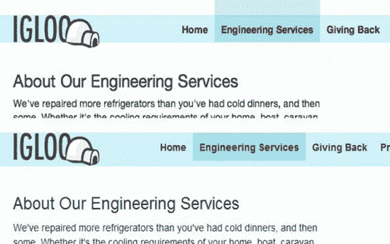

***图 11-7。**Safari 5(上图)和 Internet Explorer 6(下图)中呈现的主导航*

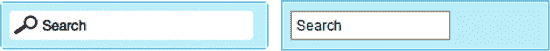

***图 11-8。**Internet Explorer 7(右)中搜索框不显示背景图片(火狐 3.6，左)*

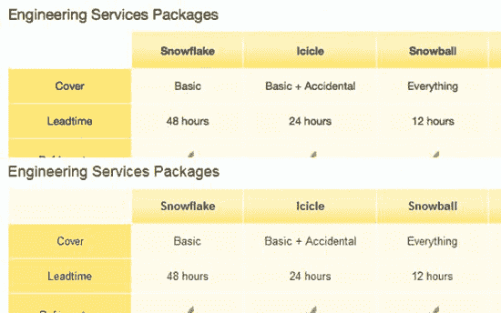

***图 11-9。**火狐 3.6(上)正确渲染空表格单元格。Internet Explorer 8(底部)没有，因为它不理解* `:empty` *伪类*

在某些浏览器中根本不会显示的其他装饰性细节如下:

*   圆角
*   主导航中所选链接的透明度
*   在按钮上投射阴影

根据我们的经验，这些细节是大多数设计师乐于在不同浏览器中以不同方式呈现的。让这些技术在不兼容的旧浏览器中一致地工作所花费的时间以及这些技术对样式表(和标记)的可维护性的影响是不合理的，要知道有更简单的解决方案看起来仍然是正确的。

然而，我们采取了一些措施来为旧浏览器提供最好的解决方案:

*   一些背景没有使用 CSS3 渐变，而是使用了简单的 GIF 图像。
*   没有使用高级选择器来定位第一个和最后一个元素，否则会破坏旧浏览器中的布局(由于缺乏支持)，而是使用了类。
*   在使用透明色的地方，提供了纯色的备用色，尽可能地模拟支持透明的情况下显示的结果。

有时我们需要避开更复杂和高级的功能，如果我们知道这样做会给更多的访问者提供更好的体验。我们不建议你走极端；正如你从上面的列表中所看到的，有更新更简单的方法来做一些在几年前需要几个小时或几天的事情。但有时，通过简单地使用图像而不是 CSS 渐变，对于一些用户来说，体验会成倍地提高，他们会感谢这种努力。

#### 可访问性和链接

在一个网站的创建和开发过程中，易访问性必须是我们脑海中一直存在的东西。就前端开发而言，它必须从最基础的东西开始，即标记，赋予内容意义的东西，然后逐步发展到其他层——样式和行为。

Igloo 冰箱零件公司网站通过以下方式确保尽可能方便访问:

*   确保网站内容清晰易懂，禁用所有样式，启用 CSS，禁用图片。
*   确保前景色和背景色的组合对色盲用户有足够的对比度。
*   测试网站的字体大小上下增加两步(参见图 11-10 )。
*   不仅为键盘用户提供悬停和活动链接状态，还提供焦点链接状态。
*   包括一个“跳转到内容”的链接，就在页面的顶部。这将使用户更容易直接进入内容。
*   以`body`类和 id 的形式提供钩子，用户可以用它来创建用户样式表。
*   只要有可能，就使用微格式，微格式可以将内容转换成更易于机器阅读的格式。这有助于屏幕阅读器，以及辅助设备和搜索引擎。
*   包括一个合理的打印样式表。

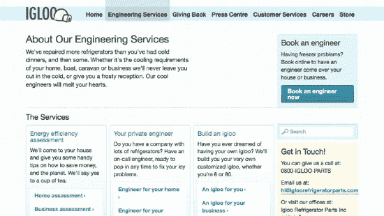

***图 11-10。**尽管略欠优雅，但这种布局巧妙地保留了两级字体大小的增加。*

其他步骤可以添加到您的列表中，例如确保网站的移动版本去除了次要元素(但仍为用户提供查看完整网站的链接)，并确保所有图像文件的大小尽可能小。

所有这些措施都应该存在于 CSS 可访问性指南文档中(参见附录 4)。

我们将链接的主题包含在可访问性中，因为它们是使我们的网站可访问时要考虑的最重要的因素之一，并且经常被遗忘。在我们的样式表中，我们将所有的链接样式加入到一个单独的部分中，这样就更容易比较不同的链接样式，并保证所有必要的链接状态都是样式化的。

你可以在第六章中阅读更多关于可访问性的内容。

### 文档和设计库

一旦定义了可重用元素，下一步就是将它们保存在一个可以被设计者、开发者和内容编辑者访问的存储库中。

理想情况下，每个可重用的代码片段都应该被可视化地记录下来，并伴随着在页面上使用它所必需的 HTML 标记，以及 Photoshop 文件，以便设计人员可以轻松地进入他们的设计、示例、类名、id 和其他任何可能有用的内容。这个存储库应该对每个人都是可访问的，可搜索的，有版本控制的。

例如，如果我们要记录 serviceBox，显示创建它时使用的不同测量方法将会很有用(见图 11-11 )。

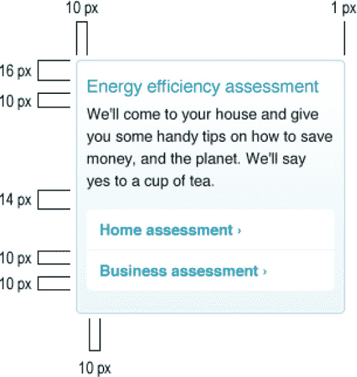

***图 11-11。**文档化的可重用模块。*

当开发人员需要在页面中使用此框时，他们将复制并粘贴以下 HTML 标记:

`

        <h3>Title</h3>
        
Description of title

        <ul>
                <li><a href="#">Action link</a></li>
                <li><a href="#">Action link</a></li>
        </ul>

`

在这种情况下，我们可以指定这个特定的块不应该被自己使用；它应该总是以三的倍数用于行中，其中每行的最后一个块应该包括“last”类(一个可重用的类，可用于删除一行中最后一个元素的右边距，不管上下文如何)，并在前面加上一个标题(`h2`)。我们还可以指定每个块应该包含的副本数量，应该包含多少个链接，以及它是否依赖于周围的代码(在本例中不是)。

尽管我们的建议是面向开发人员的，但除了代码和规范之外，还包括可供设计人员使用的 Photoshop 文件(或其他类型的分层文件，如 Illustrator 或 Fireworks)也很有用。

请记住，如果不及时更新，这个库很容易变得无用。给某人分配定期更新的任务是非常重要的。

### 总结

最后，我们已经准备好了一个网站，它是用 CSS 主干构建的，可以容纳我们想要的任何页面。在这一章中，我们带你剖析了设计，以及你可能必须进行的对话，以确保设计、业务和开发人员之间的一致。我们考虑了哪些元素是可重用的，结构和网格，全局元素，一次性的，以及可访问性。我们还展示了浏览器之间可能的争用点和折衷点，以及如何解决它们。我们得到的 CSS 清晰、简洁、不复杂。覆盖选择器并不困难，并且很容易找到代码中的特定部分。最重要的是，它很快，具有最小的合理文件大小和很少的 HTTP 请求。

我们研究了设计库的构建，这对于实现这些设计的效率和一致性以及将来对网站的修改是至关重要的。我们尽可能地遵循自己的建议，并在我们不同意的地方给出理由。都是为了提高效率，减少冗余。

在四个附录中，您可以找到我们在虚构组织中实现的流程和规则的支持文档，这些文档旨在尽可能对您实用和有用。

我们真诚地希望你能喜欢这本书，并从生产力、成本、品牌认知、用户体验和性能等多个角度，很好地理解 CSS 是如何给你的网站带来巨大变化的。让我们一起努力来构建可扩展的、可访问的、智能的界面，这些界面看起来很美，并且工作起来很直观。每个团队都有自己的做事方式，只要每个人都同意相同的系统，那绝对没问题。我们很想听听你自己的经历。

感谢阅读。现在去写点代码吧！