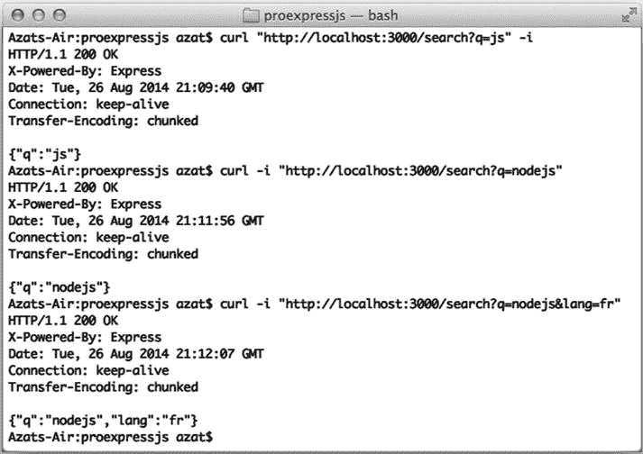
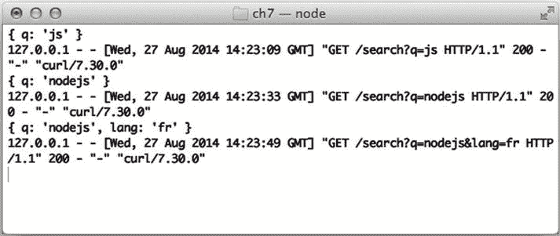
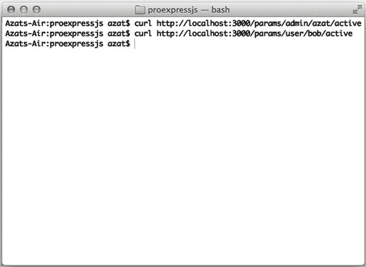
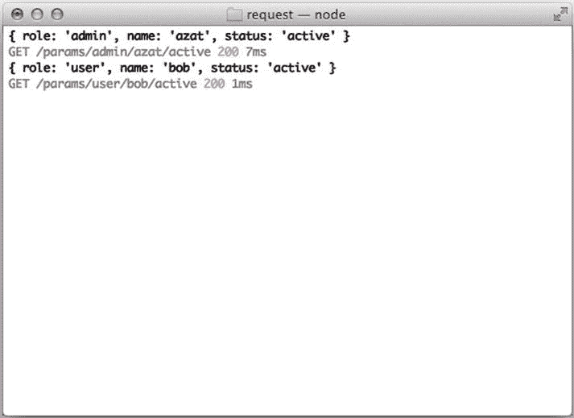
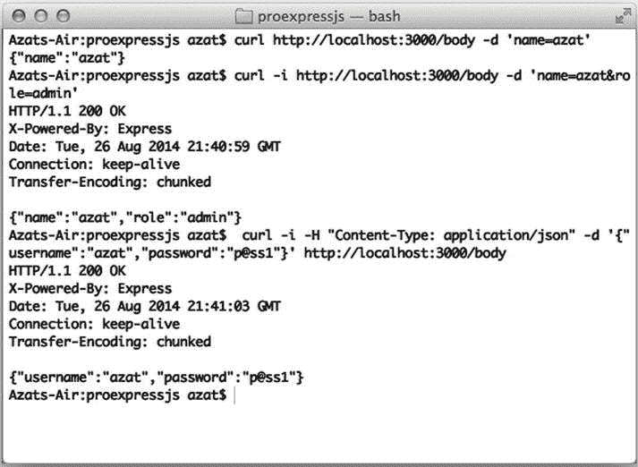
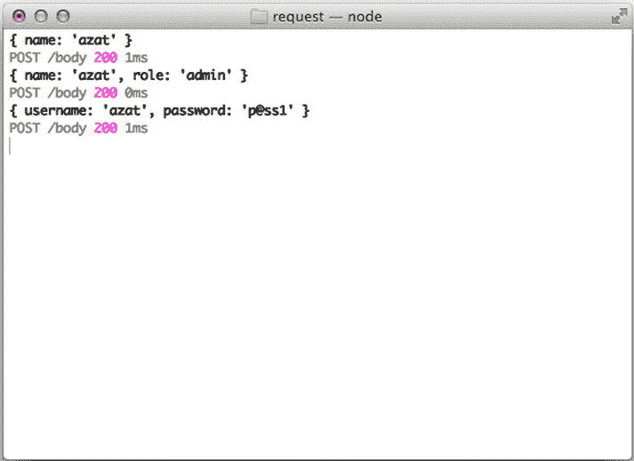
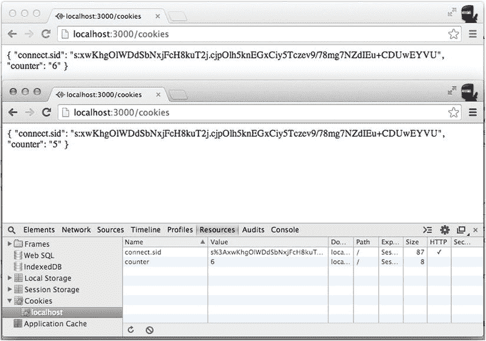

# 七、Express.js 请求对象

Express.js 请求对象(简称为`req`)是核心 Node.js `http.request`对象的包装器，它是传入 HTTP(S)请求的 Node.js 表示。在 web 中，请求包含以下部分:

*   方法:获取、发布或其他
*   URI:地点举例`http://hackhall.com/api/posts/`
*   标题:主机:`www.hackhall.com`
*   body:URL encoded、JSON 或其他格式的内容

Express.js 请求对象有一些额外的简洁功能，但本质上它支持本机`http.request`对象可以做的一切。

例如，Express.js 自动添加了对查询解析的支持，当系统需要访问以下格式(问号后)的 URL 中的数据时，这一点至关重要:`http://webapplog.com/?name1=value&name2=value`。

这是我们将在本章中涉及的 Express.js 请求对象的方法和对象列表:

*   `request.query` :查询字符串参数
*   `request.params` : URL 参数
*   `request.body` :请求体数据
*   `request.route` :路线路径
*   `request.cookies` : cookie 数据
*   `request.signedCookies` :已签名的 cookie 数据
*   `request.header()` 和`request.get()` :请求头

 **提示**当你在代码中看到`request.` *doSomething* 时，不要把 Express.js 请求对象与 Mikeal Roger 的`request`模块(`https://github.com/mikeal/request`)或者与 core Node.js http 模块的请求(`http://nodejs.org/api/http.html#http_event_request`)混淆。

为了更好地理解请求对象，让我们用 express . js 4 . 8 . 1 版创建一个全新的 Express.js app。这是项目的 `package.json`文件(`ch7/package.json`):

```js
{
  "name": "request",
  "version": "0.0.1",
  "private": true,
  "scripts": {
    "start": "node app.js"
  },
  "dependencies": {
    "express": "4.8.1",
    "errorhandler": "1.1.1",
    "jade": "1.5.0",
    "morgan": "1.2.2",
    "serve-favicon": "2.0.1",
    "cookie-parser": "1.3.2",
    "body-parser": "1.6.5",
    "debug": "~0.7.4",
    "serve-favicon": "2.0.1"
  }
}

```

接下来，我们将带有 NPM 的模块安装到本地项目`node_modules`文件夹中:

```js
$ npm install

```

现在用`$ node app`启动 app。它应该显示一个标准的 Express.js 生成器页面，带有文本“欢迎使用 Express”(在`http://localhost:3000`上)。本章末尾提供了`app.js`的完整源代码供参考。你可以在`https://github.com/azat-co/proexpressjs`从 GitHub 下载。

请求.查询

查询字符串是给定 URL 中问号右侧的所有内容；例如，在 URL `https://twitter.com/search?q=js&src=typd`中，查询字符串是`q=js&src=typd. After the query string is parsed by Express.js, the resulting` JS 对象将是`{q:'js', src:'typd'}`。这个对象被分配给请求处理程序中的`req.query`或`request.query`，这取决于您在函数签名中使用的变量名。

默认情况下，解析由`qs`模块(`http://npmjs.org/qs` `)`完成，Express.js 通过`express/lib/middleware/query.js`内部模块在后台使用该模块。这个设置可以通过`query parser`设置来改变，这个你在第三章里学过(希望如此)。

`request.query`的工作方式类似于`body-parser`的`json()`和`cookie-parser`中间件，因为它在请求对象`req`上放置了一个属性(在本例中为`query`),该请求对象被传递给下一个中间件并进行路由。因此，如果没有某种查询解析，我们就无法访问`request.query`对象。同样，Express.js 默认使用`qs`解析器——我们不需要额外的代码。

为了举例说明`request.query`,我们可以添加一个搜索路径，以查询数据格式打印输入的搜索词。本例中的数据为`q=js`、`q=nodejs`和`q=nodejs&lang=fr`。服务器返回 JSON，其中包含我们发送给它的相同查询字符串数据。我们可以将这个路由添加到任何 Express.js 服务器，比如我们用 CLI 创建的服务器(即`ch7/request`):

```js
app.get('/search', function(req, res) {
  console.log(req.query)
  res.end(JSON.stringify(req.query)+'\r\n');
})

```

 **提示**`\n`和`\r`分别是 ASCII 码和 Unicode 码中的换行符和回车符。它们允许文本在新的一行开始。更多信息请参考`http://en.wikipedia.org/wiki/Newline`和`http://en.wikipedia.org/wiki/Carriage_return`。

保持服务器运行(`$ node app`来启动它)，在另一个终端窗口中，用 CURL 发出以下 GET 请求:

```js
$ curl -i "http://localhost:3000/search?q=js"
$ curl -i "http://localhost:3000/search?q=nodejs"
$ curl -i "http://localhost:3000/search?q=nodejs&lang=fr"

```

CURL GET 请求的结果如图图 7-1 所示，服务器输出的结果如图图 7-2 所示。



图 7-1 。使用查询字符串参数运行 CURL 命令的客户端结果



图 7-2 。使用查询字符串参数运行 CURL 命令的服务器端结果

请求参数

第六章讲述了如何建立中间件来处理来自请求 URL 的数据。然而，有时直接从特定的请求处理程序中获取这些值更方便。为此，有一个`request.params`对象，它是一个包含键/值对的数组。

为了试验`request.params`对象，我们可以向我们的`ch7/request`应用添加一条新的路线。这个路由将定义 URL 参数，并在控制台中打印它们。添加以下路线到`request/app.js`:

```js
app.get('/params/:role/:name/:status', function(req, res) {
  console.log(req.params);
  res.end();
});

```

接下来，运行以下 CURL 终端命令，如图图 7-3 所示:

```js
$ curl http://localhost:3000/params/admin/azat/active
$ curl http://localhost:3000/params/user/bob/active

```



图 7-3 。用 CURL 发送 GET 请求(客户端窗口)

如图 7-4 所示，我们看到`request.params`对象的这些服务器日志:

```js
[ role: 'admin', name: 'azat', status: 'active' ]
[ role: 'user', name: 'bob', status: 'active' ]

```



图 7-4 。处理请求的服务器结果。参数

请求.正文

`request.body`对象是 Express.js 提供给我们的另一个神奇对象，它是通过应用`body-parser`(express . js 3 . x 中的`express.bodyParser()`)中间件函数填充的。主体解析器模块有两个功能/中间件:

*   `json()`:用于将 HTTP(S)有效负载解析成 JavaScript/Node.js 对象
*   `urlencoded()`:用于将 URL 编码的 HTTP(S)请求数据解析成 JavaScript/Node.js 对象

在这两种情况下，结果对象和数据都被放入`request.body`对象中——非常方便！

要使用`request.body`，我们需要单独安装 body-parser(如果你使用的是`ch7`，你可以跳过这一步，因为生成器为我们把它放在了`package.json`):

```js
$ npm install body-parser@1.0.0

```

然后我们需要导入并应用它:

```js
var bodyParser = require('body-parser');
// ...
app.use(bodyParser.json());
app.use(bodyParser.urlencoded());

```

您不必同时使用`json()`和`urlencoded()`方法。如果足够的话，只使用需要的那个。

为了说明`request.body`的作用，让我们重用我们之前的项目，并添加下面的路径来看看`request.body`对象是如何工作的，记住两个`bodyParser()`中间件功能都已经应用到 Express.js 应用中，并包含在代码中:

```js
app.post('/body', function(req, res){
  console.log(req.body);
  res.end(JSON.stringify(req.body)+'\r\n');
});

```

同样，使用 CURL 或类似工具提交几个 HTTP POST 请求:

```js
$ curl http://localhost:3000/body -d 'name=azat'
$ curl -i http://localhost:3000/body -d 'name=azat&role=admin'
$ curl -i -H "Content-Type: application/json" -d '{"username":"azat","password":"p@ss1"}' http://localhost:3000/body

```

 **提示**一个简短的提示:`-H`选项设置头，`-d`传递数据，`-i`启用详细日志记录。

前面的命令产生了`request.body`对象，如图 7-5 中的客户端和图 7-6 中的服务器端所示:

```js
{ name: 'azat' }
{ name: 'azat', role: 'admin' }
{ username: 'azat', password: 'p@ss1' }

```



图 7-5 。使用 CURL 发送 POST 请求(客户端日志)



图 7-6 。处理请求的结果。正文(服务器日志)

请求.路由

`request.route`对象只包含当前路线的信息，例如:

*   `path`:请求的原始 URL 模式
*   `method`:请求的 HTTP 方法
*   `keys`:URL 模式中的参数列表(即以`:`为前缀的值)
*   `regexp` : Express.js 为路径生成的模式
*   `params` : `request.params`对象

我们可以将上一节示例中的`console.log(request.route)` `;`语句添加到我们的`request.params`路由中，如下所示:

```js
app.get('/params/:role/:name/:status', function(req, res) {
  console.log(req.params);
  console.log(req.route);
  res.end();
});

```

然后，如果我们发送 HTTP GET 请求

```js
$ curl http://localhost:3000/params/admin/azat/active

```

我们应该得到`request.route`对象的服务器日志，它有`path`、`stack`和`methods`属性:

```js
{ path: '/params/:role/:name/:status',
  stack: [ { method: 'get', handle: [Function] } ],
  methods: { get: true } }

```

当从中间件内部使用时,`request.route`对象可能是有用的(即，在多个路由上使用),以找出当前使用的路由。

请求. cookie

cookie 解析器(在 Express.js 3.x 和更早的版本中以前是`express.cookieParser()`)中间件(`https://www.npmjs.org/package/cookie-parser`、`https://github.com/expressjs/cookie-parser`)允许我们以 JavaScript/Node.js 格式访问请求的 cookie。快速会话中间件需要`cookie-parser`，因为 web 会话通过将会话 ID 存储在浏览器 cookies 中来工作。

随着`cookie-parser`的安装(用 NPM)、导入(用 ??)、应用(用 ??)，我们可以通过`request.cookies`对象访问 HTTP(S)请求 cookie(用户代理 cookie)。Cookies 自动呈现为 JavaScript 对象；例如，您可以使用以下命令提取会话 ID:

```js
request.cookies['connect.sid']

```

 **警告**出于安全考虑，不鼓励在浏览器 cookies 中存储敏感信息。此外，一些浏览器对 cookie 的大小施加了限制，这可能会导致错误(Internet Explorer！).我通常只用`request.cookie`来支持`request.session`。

 **注**关于如何安装和应用中间件的更多信息，请参考第四章。

可以使用`response.cookie()`或`res.cookie()`存储 cookie 信息。Express.js 响应对象包含在第八章的中。为了说明`request.cookies`，我们可以实现一个`/cookies`路由，它将增加一个计数器，改变 cookie 的值，并在页面上显示结果。这是您可以添加到`ch7/request`中的代码:

```js
app.get('/cookies', function(req, res){
  if (!req.cookies.counter)
    res.cookie('counter', 0);
  else
    res.cookie('counter', parseInt(req.cookies.counter,10) + 1);
  res.status(200).send('cookies are: ', req.cookies);
})

```

 **提示**`parseInt()`方法用于防止 JavaScript/Node.js 将数字值视为字符串，这将导致 0、01、011、0111 等。而不是 0，1，2，3 等等。建议将`parseInt()`与基数/基数(第二个参数)一起使用，以防止数字被错误转换。

由于转到`http://localhost:3000/cookies`并刷新几次，你应该看到计数器从 0 向上递增，如图图 7-7 所示。



图 7-7 。Cookie 值保存在浏览器中，并在每次请求时由服务器递增

检查 Chrome 开发者工具中的网络或资源标签会发现一个名为`connect.sid`的 cookie 的存在(见图 7-7 )。浏览器窗口之间共享 cookies，因此即使我们打开一个新窗口，计数器也会从原始窗口中的值增加 1。

请求.已签名的预订

`request.signedCookies`类似于`request.cookies`，但是它是在将秘密字符串传递给`express.cookieParser('some secret string');`方法时使用的。要填充`request.signedCookies`，您可以使用带有标志`signed: true`的`response.cookie`。下面是我们如何修改之前的路线以切换到签名 cookies:

```js
app.use(cookieParser('abc'));
// ... Other middleware
app.get('/signed-cookies', function(req, res){
  if (!req.signedCookies.counter)
    res.cookie('counter', 0, {signed: true});
  else
    res.cookie('counter', parseInt(req.signedCookies.counter,10) + 1, {signed: true});
  res.status(200).send('cookies are: ', req.signedCookies);
});
// ... Server boot-up

```

因此，我们所做的就是将`request.cookies`改为`request.signedCookies`，并在响应上分配 cookie 值时添加`signed: true`。签名 cookies 的解析是自动完成的，它们被放在普通的 JavaScript/Node.js 对象中。注意`'abc'`是一个任意的字符串。你可以在 Mac OS X 上使用`$ uuidgen`来生成一个随机密钥，给你的 cookies 或者 Random.org 之类的网络服务签名(`http://bit.ly/1F1fbL8`)。

 **注意**签署 cookie *不会*隐藏或加密 cookie。这是通过应用私有值来防止篡改的简单方法。签名(或哈希)不同于加密。前者用于识别和防止篡改。后者用于对未授权的接收者隐藏内容(例如，参见`http://danielmiessler.com/study/encoding_encryption_hashing`)。您可以在服务器上加密您的 cookie 数据(并在读取时解密)，但是，假设这仍然容易受到暴力攻击。漏洞的级别取决于您使用的加密算法。

request.header()和 request.get()

`request.header()` 和`request.get()`方法是相同的，并且允许通过名称检索 HTTP(S)请求的头。幸运的是，标题命名不区分大小写:

```js
request.get('Content-Type');
request.get('content-type');
request.header('content-type');

```

其他属性和方法

我们已经介绍了 Express.js 请求对象的最常用和最重要的方法和对象。在大多数情况下，它们应该足够了。但是清单并不止于此。为了方便起见，在 Express.js 请求中有大量的*糖衣*对象(见表 7-1 )。糖衣意味着这些对象的大部分功能可以用基础方法实现，但是它们比基础方法更有说服力。例如，`request.accepts`可以替换为`if/else`和`request.get()`，这为我们提供了请求头。当然，如果您理解这些方法，您可以使用它们来使您的代码更优雅、更易读。

表 7-1 。Express.js 请求中的其他属性和方法

<colgroup><col width="20%"> <col width="40%"> <col width="40%"></colgroup> 
| 

属性/方法

 | 

条件/定义

 | 

应用接口

 |
| --- | --- | --- |
| `request.accepts()` | `true`如果传递的字符串(单个或逗号分隔的值)或 MIME 类型(或扩展)的数组与请求`Accept`头匹配；`false`如果没有匹配 | `http://expressjs.com/api.html#req.accepts` |
| `request.accepted` | 接受的 MIME 类型的数组 | `http://expressjs.com/api.html#req.accepted` |
| `request.is()` | `true`如果传递的 MIME 类型字符串匹配`Content-Type`头类型；`false`如果没有匹配 | `http://expressjs.com/api.html#req.is` |
| `request.ip` | 请求的 IP 地址；参见第三章中的`trust proxy`配置 | `http://expressjs.com/api.html#req.ip` |
| `request.ips` | 启用`trust proxy`配置时的 IP 阵列 | `http://expressjs.com/api.html#req.ips` |
| `request.path` | 带有请求的 URL 路径的字符串 | `http://expressjs.com/api.html#req.path` |
| `request.host` | 请求的`Host`报头中的值 | `http://expressjs.com/api.html#req.host` |
| `request.fresh` | `true`如果请求是基于`Last-Modified`和`ETag`标题的*新鲜*；`false`否则 | `http://expressjs.com/api.html#req.fresh` |
| `request.stale` | 与`req.fresh`相反 | `http://expressjs.com/api.html#req.stale` |
| `request.xhr` | `true`如果请求是通过 X- `Requested-With`报头及其`XMLHttpRequest`值的 AJAX 调用 | `http://expressjs.com/api.html#req.xhr` |
| `request.protocol` | 请求协议值(如`http`或`https`) | `http://expressjs.com/api.html#req.protocol` |
| `request.secure` | `true`如果请求协议是`https` | `http://expressjs.com/api.html#req.secure` |
| `request.subdomains` | 来自`Host`头的子域数组 | `http://expressjs.com/api.html#req.subdomains` |
| `request.originalUrl` | 请求 URL 的不可更改值 | `http://expressjs.com/api.html#req.originalUrl` |
| `request.acceptedLanguages` | 请求的`Accept-Language`头中的语言代码数组(如`en-us, en`) | `http://expressjs.com/api.html#req.acceptedLanguages` |
| `request.acceptsLanguage()` | `true`如果传递的语言代码在请求报头中 | `http://expressjs.com/api.html#req.acceptsLanguage` |
| `request.acceptedCharsets` | 请求的`Accept-Charset`头中的字符集数组(如`iso-8859-5`) | `http://expressjs.com/api.html#req.acceptedCharsets` |
| `request.acceptsCharset()` | `true`如果传递的字符集在请求头中 | `http://expressjs.com/api.html#req.acceptsCharset` |

在这一章中，我们一直在对`ch7`项目做一些小的调整，所以现在是时候看看全貌了。因此，下面是来自`ch7/app.js`文件的最终`request`服务器的完整源代码(可在`https://github.com/azat-co/proexpressjs`获得):

```js
var express = require('express');
var path = require('path');
var favicon = require('serve-favicon');
var logger = require('morgan');
var cookieParser = require('cookie-parser');
var bodyParser = require('body-parser');

var routes = require('./routes/index');

var app = express();

// View engine setup
app.set('views', path.join(__dirname, 'views'));
app.set('view engine', 'jade');
app.use(logger('combined'));
app.use(favicon(path.join(__dirname, 'public', 'favicon.ico')));
app.use(bodyParser.json());
app.use(bodyParser.urlencoded({extended: true}));
app.use(cookieParser('abc'));
app.use(express.static(path.join(__dirname, 'public')));

app.use('/', routes);

app.get('/search', function(req, res) {
  console.log(req.query);
  res.end(JSON.stringify(req.query)+'\r\n');
});

app.get('/params/:role/:name/:status', function(req, res) {
  console.log(req.params);
  console.log(req.route);
  res.end();
});

app.post('/body', function(req, res){
  console.log(req.body);
  res.end(JSON.stringify(req.body)+'\r\n');
});

app.get('/cookies', function(req, res){
  if (!req.cookies.counter)
    res.cookie('counter', 0);
  else
    res.cookie('counter', parseInt(req.cookies.counter,10) + 1);
  res.status(200).send('cookies are: ', req.cookies);
});

app.get('/signed-cookies', function(req, res){
  if (!req.signedCookies.counter)
    res.cookie('counter', 0, {signed: true});
  else
    res.cookie('counter', parseInt(req.signedCookies.counter,10) + 1, {signed: true});
  res.status(200).send('cookies are: ', req.signedCookies);
});

/// Catch 404 and forward to error handler
app.use(function(req, res, next) {
    var err = new Error('Not Found');
    err.status = 404;
    next(err);
});

/// Error handlers

// Development error handler
// Will print stacktrace
if (app.get('env') === 'development') {
    app.use(function(err, req, res, next) {
        res.status(err.status || 500);
        res.render('error', {
            message: err.message,
            error: err
        });
    });
}

// Production error handler
// No stacktraces leaked to user
app.use(function(err, req, res, next) {
    res.status(err.status || 500);
    res.render('error', {
        message: err.message,
        error: {}
    });
});

module.exports = app;

var debug = require('debug')('request');

app.set('port', process.env.PORT || 3000);

var server = app.listen(app.get('port'), function() {
  debug('Express server listening on port ' + server.address().port);
});

```

摘要

理解和处理 HTTP 请求是 web 开发的基础。Express.js 处理请求的方式是添加对象和属性。开发人员在请求处理程序中使用它们。Express.js 在请求中提供了许多对象和方法，在它没有提供的地方，有许多第三方选项。

在下一章中，我们将讨论 Express.js 响应。响应对象是请求对象的对应对象。响应是我们实际上发送回客户端的东西。与 request 类似，Express.js 响应对象具有特殊的方法和对象作为其属性。我们将讨论最重要的，然后列出其余的内置属性。