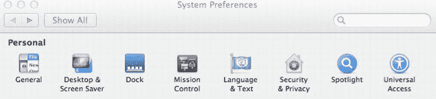

# 二、了解残疾和辅助技术

在本章中，我们将了解一系列不同类型的残疾，以及残疾人使用的一些辅助技术(at)的示例。本章将帮助您更好地理解残疾意味着什么，以及残疾如何改变 at 用户使用网页内容的方式。

### 了解你的用户

对于试图构建易访问网站的开发人员来说，最困难的事情之一是成功地理解用户的需求。你应该从几个不同的角度考虑潜在的需求。首先，你必须考虑用户的功能需求，比如他们在使用网站时希望完成的任务。这对网站所需的功能有着明显的影响，也影响着您应该对信息架构采取的方法。

然后是你的观众将要使用的设备。暂且不谈，随着智能手机使用的增长，我们许多人现在都在移动中使用网络，因此移动空间非常重要。

 **注意**在可访问性和移动网络之间有着非常紧密的映射。你为移动设备创建内容的许多开发实践对可访问性也非常有益！

#### 都是我，我，我和一些人！

许多设计师有意无意地为自己或朋友建造东西。然而，在过去的几年中，设计社区对可访问性有了更大的认识，并且对构建可访问界面的挑战有了更多的关注，这激发了开发人员的想象力。

下面的文字将帮助你理解残疾意味着什么，以及它如何影响你对世界的认知和与世界的互动。这种理解可以用来更好地理解如何适应残疾人的各种互动需求。它并不详尽，也不打算详尽，但它应该是一个很好的介绍。

所以不用担心。让常识成为你的向导，学会接受反馈，即使它最初看起来是负面的。真的很值钱！当一个人在你的网站上执行一项任务时遇到了问题，这意味着有更多的人也遇到了问题，只是没有说出来而已。所以，感激有人脾气暴躁到可以抱怨！通过积极的反应，你将能够提高你的设计项目的质量，同时作为一名开发人员也有所提高。所以是双赢。这可能会有点伤你的自尊，但你会克服的。

我们将在第九章“HTML 5，可用性和以用户为中心的设计”中探讨一些以用户为中心的设计技术，但是现在让我们来看看一些不同的残疾类型。

### 失明概述

失明有多种程度。人们通常认为盲人什么也看不见，但事实往往并非如此。盲人也许能辨认出一些光、形状和其他形式。

我的一个朋友实际上视力很好，但他被登记为法定盲人，因为他有严重的阅读障碍，这使他功能性失明，因为他的状况造成了认知混乱。所以有很多有趣的边缘案例。

也有理由认为一个人必须被正式定义为有残疾。这些原因包括获得国家援助、福利和其他服务的资格。

例如，在美国，根据社会保障法，如果符合以下条件，则被视为盲人:

> 使用矫正镜片后，他的好眼的中心视觉敏锐度为 20/200 或更低1

在英国，Snellen 测试是一种测量视敏度的常用方法，通过使用不同大小字母的图表来评估一个人的视觉锐度。如果一个人正在接受视力障碍的评估，该测试将专门检查

*   低于 3/60 Snellen 的人(大多数低于 3/60 的人视力严重受损)
*   那些好于 3/60 但低于 6/60 的人
*   6/60 Snellen 或以上(该组中视野收缩的人，特别是如果收缩在视野的下部) 2

__________

①`[www.who.int/blindness/causes/en/](http://www.who.int/blindness/causes/en/)`。

 **注**残疾的定义因国家而异，国际社会正在努力根据国际功能分类(ICF)等倡议统一这些定义。这些是从身体、个人和社会角度对健康和健康相关领域的分类。分类是通过查看身体功能和结构列表，以及它们的活动和参与水平来确定的。因为一个人的功能和残疾是在一定的环境中发生的，所以 ICF 也包括了一系列的环境因素。因此，活动和参与这两个领域是用于记录积极或中性表现的任务、行动和生活情况的列表，以及一个人可能遇到的任何活动限制和参与限制。这些以各种方式分组，以概述个人在诸如学习和应用知识、沟通、行动、自理、社区、社会和公民生活等领域的能力水平。

世界范围内一些最常见的失明原因如下

*   白内障(47.9%)
*   青光眼(12.3%)
*   年龄相关性黄斑变性(8.7%)
*   角膜混浊(5.1%)
*   糖尿病视网膜病变(4.8%)
*   儿童期失明(3.9%)
*   沙眼(3.6%)
*   盘尾丝虫病(0.8%) 3

 **注意**就计算机和网络而言，盲人用户是一个真正从技术发展中受益的群体。文本到语音转换软件的发展使得 AT 的盲人用户可以从事多种工作(并非所有工作),并积极参与各种在线社区。这些都有助于一个人的包容感。

__________

2 定义还考虑了视角或视野。您可以在`[www.ssa.gov/OP_Home/ssact/title16b/1614.htm](http://www.ssa.gov/OP_Home/ssact/title16b/1614.htm)`了解更多信息。

3

#### 盲目性和可达性

大多数时候，当人们想到网页可访问性时，他们会想到盲人！如果你认为是这样，那也情有可原——因为盲人用户通常是网上最直言不讳的群体。

然而，网页可访问性并不仅仅与盲人计算机用户有关。当你在网上看到很多关于这两个主题的讨论时，不要陷入只把网页可访问性与盲人和屏幕阅读器联系起来的陷阱。“如果它与屏幕阅读器一起工作，它就是可访问的”这个想法只是部分正确。但这有点像说，“函数 *x* 在 HTML5 规范中是这样定义的，因此你应该这样做，它就会工作。”在理想世界中，是的，它肯定可以工作，但是在现实世界中，你必须考虑浏览器，它对任何给定功能的支持，以及用户模式(或交互方法——他们是 AT 的视力正常的用户还是盲人用户，等等)。).

对于更多串行设备的用户来说，还有其他方面需要考虑，例如为行动不便的人提供的单按钮开关。屏幕阅读器用户可能在导航或与小部件或页面内容交互方面没有问题，而对于行动不便的人来说，这可能非常困难。行动不便的电脑用户经常会非常容易疲劳，甚至在浏览你当时认为应该包含的 20 个链接时感到筋疲力尽！

因此，当您考虑可访问性时，不要只考虑盲人用户(尽管他们当然非常重要)和屏幕阅读器。然而，因为使用中的屏幕阅读技术非常复杂，正如您将在后面看到的，正确地向这些设备提供内容以及使用它们都有一定程度的复杂性。

#### 视力障碍

视力障碍的范围很广。这里列出了一些最常见的，包括一些试图模拟患有这种疾病的人的视力的照片示例。一个有视力障碍的人并不是真的看不太清楚。正如这些例子所希望说明的那样，取决于损伤本身，患有这种疾病的人可能会遇到更大的问题。

图 2-1 是我在创建任何模拟之前的桌面图片。

***图 2-1。**我的桌面，被视力相对较好的人看到*

#### 青光眼

导致青光眼的原因有很多，从简单的衰老到吸烟。青光眼患者可能会完全丧失周边视觉，如图 2-2 中的图所示。在早期阶段，青光眼会导致一些细微的颜色对比度损失，这会导致难以看清周围环境或使用计算机。

***图 2-2。**青光眼患者看到的我的桌面(残余视力样本)*

如果周边视力丧失的人不在特定元素或小部件附近，他们可能很难看到动态内容更新。对于屏幕放大用户来说，这也是一个问题(稍后将详细介绍)。

#### 黄斑变性

黄斑变性在老年人中很常见，会导致眼睛中心的视力丧失，如图图 2-3 所示。这使得阅读、写作、在电脑上做任何工作或近距离工作都非常困难。识别某些颜色也是一个问题。

***图 2-3。**黄斑变性患者看到的我的桌面(残余视力样本)*

#### 视网膜病变

这种情况导致部分视力模糊或片状视力丧失，如图图 2-4 所示。它可能是由晚期糖尿病引起的。这个人的近视可能会降低，近距离阅读可能会有困难。

***图 2-4。**视网膜病变患者看到的我的桌面(残余视力样本)*

#### 视网膜脱落

视网膜脱落会导致视网膜受损处的视力丧失。脱离的视网膜可能会导致一个人的部分视觉出现黑色阴影，或者这个人可能会经历明亮的闪光或大量的黑斑。参见图 2-5 。

***图 2-5。**视网膜脱落的人看到的我的桌面*

 **注意**有一些有用的在线工具可以充当*视觉模拟器*，比如灯塔国际开发的那种。该模拟器旨在帮助告知、教育和提高公众对视力受损的认识。使用模拟黄斑变性、糖尿病性视网膜病变、青光眼、偏盲和色素性视网膜炎的过滤器，通过您选择的 YouTube 视频，该模拟器显示了患有眼疾的人每天都会遇到的一些视觉问题。 4 

为了获得更加身临其境的模拟体验，剑桥大学开发了一套非常有用的眼镜，旨在模拟看细节能力的总体丧失，但不打算代表任何特定的眼睛状况。这种类型的损失通常发生在衰老和大多数眼睛疾病，以及没有佩戴最合适的眼镜。剑桥仿真眼镜可以帮助

*   理解视力丧失如何影响现实世界的任务
*   同情那些视力不好的人

__________

4

*   评估任务的视觉需求，基于损伤等级 5

### 身体残疾

有许多种身体残疾可以以不同的方式表现出来，从中度到更严重。身体残疾可能是出生时就存在的情况，也可能是在以后的生活中由于事故而导致的。

一些常见的活动问题包括缺乏对运动的身体控制或不必要的痉挛，如震颤。通常身体残疾的人很容易精疲力尽，并发现许多形式的运动非常累。

说到电脑的使用，身体残疾的人通常不会使用鼠标。当试图与计算机交互时，所使用的设备(开关、操纵杆和其他 at，我们将很快看到)会有很大的帮助。

一些身体残疾的人可能不会使用任何类型的 AT，但他们会发现很难甚至不可能使用不支持键盘访问的网站和应用。事实上，确保你的网站是键盘可访问的，可能是你能帮助身体残疾的用户的最重要的事情之一。根据经验，这样做是一个很好的想法，也有助于支持交换机和其他串行输入设备的用户。

### 认知和感觉障碍

有认知和感官障碍的计算机用户可能是最难适应的。这在很大程度上是因为这是一个如此新的研究领域，关于什么有效什么无效几乎没有确凿的证据。

与易访问性相关的 web 开发技术也没有被详细说明。然而，随着时间的推移，人们对认知和感官残疾有了更多的了解，将会有一套更容易使用的开发方法来满足这一用户群体的需求。

在接下来的章节中，我们将概述设计者在构建可供有认知和感官障碍的人使用的界面时所面临的一些挑战。

#### 感知

这是一种视觉和听觉上的困难，某些形状、形式和声音可能很难识别。理解如何满足有感知困难的用户的需求可能很难，因为很难知道他们可能如何感知某些项目，例如不寻常的用户界面。

当在富媒体界面中使用视觉和听觉提示的组合时，必须小心，因为这可能会导致诸如*排序*之类的问题(这将在接下来的部分中解释)。

一致和清晰的设计肯定会有所帮助，使用清楚地说明其固有功能并易于理解的独特设计的组件也会有所帮助。

#### 记忆力和注意力

短期记忆和注意力的问题会对一个人执行最基本任务的能力产生深远的影响，并且会使使用更复杂的技术变得非常具有挑战性。经历失忆问题的人会发现，这严重影响了他们对用户界面反馈(如表单验证)的理解和反应能力，并且使他们很难在任何给定的情况下做出适当的或所需的反应。

*将内容分块成小的、相关的块，对有记忆问题的人有很大帮助。在这里你将相关的内容和界面元素分成五到七个*块*，这是一个帮助理解和帮助注意力持续时间短的用户的有用方法。*

 *#### 测序

*排序*与随着时间的推移将听觉和视觉线索联系起来的能力有关，或知道执行给定任务需要什么步骤。排序的困难可以通过在界面中提供*提示*来减少，例如，可以帮助你的用户理解什么时候需要输入。

此外，如果您避免使用不必要的闪烁内容、动画或移动，可以将与排序相关的问题降至最低，这些内容、动画或移动会分散用户的注意力，使他们无法关注核心功能，或者在用户试图阅读时会分散用户的注意力。许多其他用户也会感谢你这样做，包括我！

#### 阅读障碍

术语*诵读困难*包括一系列与理解单词、数字或数学困难有关的情况。

在网页内容中使用清晰、简洁的语言对有阅读障碍的人有很大的帮助，你使用的字体也是如此。患有诵读困难症的人在使用包含*记号*或*尾巴*的字符时会遇到问题，这些字符出现在大多数衬线字体中。有些字母上的上行和下行的大小(如 *p* 上的下行和 *b* 上的上行)会混淆，所以字符的视觉形状必须清晰。诵读困难的人依靠这个视觉线索来帮助他们区分字母。

可以在`Dyslexic.com`，特别是`[www.dyslexic.com/fonts](http://www.dyslexic.com/fonts)`找到一些关于字体使用的一般建议。

 **注**漫画 Sans 似乎是一种很棒的字体，但是大多数设计师宁愿咬掉自己的腿也不愿使用它。一种更时髦、设计者更友好的字体是相当不错的“诵读困难症:诵读困难症患者的字体”这种字体是荷兰特温特大学开发的，旨在帮助有阅读障碍的人更容易阅读。

它基于这样一个概念，即在英语中使用的标准拉丁字母中的 26 个字母看起来很相似，例如 v/w，i/j 和 m/n。因此，患有阅读障碍症的人经常混淆这些字母。通过创造一种新的字体来强调这些字母的区别，人们发现诵读困难的人犯的错误更少。

在下面的网站上也有一个关于阅读障碍的非常好的视频。

### 什么是辅助技术？

辅助技术(AT)设备和控制的范围非常广泛。也有很多定义。我喜欢这个:

> *“用于描述所有工具、产品和设备的术语，从最简单到最复杂，可以使特定功能更容易或可能执行。”*

美国国家多发性硬化症学会

你可能已经注意到，根本没有明确提到残疾，这很重要。你不认为你的眼镜或电视遥控器是辅助技术，但它们确实是。

 **提示**要了解 at 的精彩介绍，请观看杰夫·莫耶的 AT boogie 视频和海克·霍辛顿的动画。好玩又有教育意义，可以在`[`inclusive.com/assistive-technology-boogie`](http://inclusive.com/assistive-technology-boogie)`找到。

为什么技术不能不分能力被很多不同的人使用？好的设计能让这成为现实吗？不管用户的能力如何，好的设计应该让用户能够执行期望的任务。

作为一名设计师或 web 开发人员，你不需要深入了解辅助技术是如何工作的。事实上，这种知识的广度和深度是很难达到的，因为这需要花费大量的时间和精力。

许多辅助技术设备是串行输入设备。它们接受一个二进制输入，开/关。其他的要复杂得多(比如屏幕阅读器)，可以和浏览器结合使用，做非常复杂的事情，开发新的交互模型。在下一节中，我们将了解屏幕阅读器——它们是什么，它们是如何工作的，以及如何在测试网站的可访问性时使用它们(带有警告)。

你真的不需要对每一种 AT 都有详尽的理解，但是对屏幕阅读器技术的良好理解是成功的可访问性设计的重要基础，不管使用什么样的 AT。

#### 什么是屏幕阅读器？

屏幕阅读器主要由盲人和有视觉障碍的人使用，但它们也有利于其他用户群体，如有阅读障碍的人或有读写问题的人。

屏幕阅读器将识别屏幕上的内容，并将这些数据作为语音输出。它是一种文本到语音转换软件，当用户将焦点放在屏幕上的项目上并使用键盘进行导航时，它会向用户逐字读出屏幕上的内容。屏幕阅读器用于与 PC、Mac、web 浏览器和其他软件交互并控制它们。

屏幕阅读器可以很好地与主计算机本身的操作系统一起工作，它们可以提供与计算机的深层交互，让用户执行许多复杂的系统管理任务。事实上，屏幕阅读器在与主机操作系统交互时通常表现得更好，因为它们是紧密集成的。当屏幕阅读器用户上线时，问题就开始了。网络世界不是一个受控或监管良好的地方，所以有理由说明为什么操作系统的安全和设计良好的环境通常更容易接近。

屏幕阅读器可用于模拟鼠标右键单击、打开项目和询问对象。询问一个对象实际上意味着查询——就像关注一个对象并问它“你是什么，或者你有什么属性？”屏幕阅读器也有一系列的*光标类型*，可以用来浏览网页和控制屏幕上的光标，以及在使用 JavaScript 的网络环境中模拟鼠标悬停事件。简而言之，几乎所有有视觉的用户功能都可以使用屏幕阅读器来完成。

 **注意**术语*屏幕阅读器*很容易让人误解。屏幕阅读器不仅仅是阅读屏幕。更准确的术语应该是*屏幕导航和阅读设备*，因为该软件不仅用于导航用户的计算机，还用于导航网络。

有许多不同的屏幕阅读器可用，如 JAWS、Window-Eyes、免费的开源 Linux 屏幕阅读器(ORCA)和免费的 NVDA，以及已经与 Mac OS X 捆绑在一起的不断改进的 VoiceOver。还有其他的，如 Dolphin 的 Dolphin Supernova、Serotek 的 System Access 和 Ai Squared 的 ZoomText 放大镜/阅读器。接下来是一些更常用的屏幕阅读器的概述。这不是对可用产品的详尽介绍，不同的包基本上做同样的事情。人们使用什么很大程度上取决于预算和偏好。

##### 口

JAWS for Windows 是最常用的屏幕阅读器之一，由美国自由科学公司开发。JAWS 代表*带语音的工作访问*，它是一款昂贵的软件，专业版的价格约为 1000 美元。

也有许多可用的 *JAWS 脚本*，它扩展了它的功能以允许访问一些定制的接口和平台。JAWS 最初是一个基于 DOS 的程序。由于其使用宏和快速访问内容和功能的能力，它越来越受欢迎。

大约在 2002 年，这种能力被引入到更加图形化的 Windows 环境中，增加了使用快捷键在网页中导航以及将焦点放在 HTML 元素(如标题)上的功能。这种功能和用户与屏幕阅读技术的交互已经成为可访问 web 开发的基石。

随着时间的推移，JAWS 的功能不断扩展，能够查询页面中使用的字体，指定哪些 web 元素具有焦点，以及更多高级功能，如 *tandem* ，允许您远程使用他人的屏幕阅读器来访问计算机。Tandem 对于故障排除和远程可访问性测试非常有用。

JAWS 12 引入了虚拟功能区，用于 Microsoft Office 和其他应用，并引入了对 WAI-ARIA 的支持。

###### 那么，一个盲人如何访问网页和使用屏幕阅读器呢？

下面将帮助你掌握如何使用屏幕阅读器，如果你决定用屏幕阅读器手动测试你的 HTML5 界面，也会有所帮助。

首先，JAWS 在与网络内容交互时使用所谓的虚拟光标。所以你实际上不是直接与网页本身交互，而是与页面刷新时加载的页面的虚拟版本或快照交互。虚拟光标还用于阅读和导航 Microsoft Word 文件和 PDF 文件，因此您将在这里学到的一些技巧可以在导航可访问的脱机文档时应用。

 **注意**使用 JAWS，与网页内容的交互包括使用一个*离屏模型(OSM)* ，其中来自页面的 HTML 内容被临时缓冲或存储，屏幕阅读器与之交互，而不是直接与页面交互。然而，有时候，当使用 DOM 时，其他屏幕阅读器不再使用屏幕外模型，因为它被认为有点过时和有问题。所以直接与 DOM 交互更好。现在不要太担心这个，因为我将在第四章“理解可访问性 API、屏幕阅读器和 DOM”中更详细地介绍它当我们讨论动态内容和使用 JavaScript 时，屏幕阅读器如何使用 OSM 和与 DOM 交互的细节变得很重要。

###### 从大白鲨开始

您使用的 JAWS 语音类型，以及它的音高、速度和 JAWS 输出的标点数量，都可以通过选项菜单>语音>语音调整来控制。

 **提示**你可能也想做一些调整，比如在你打字的时候关掉*回声*。以我的经验，很多盲人用户马上就这么做了；否则，当你输入一个句子时，你输入的每一个字符都会被朗读出来，这会变得非常烦人，非常快。

JAWS 中的许多语音功能都是通过数字键盘来访问的。INSERT 键也非常重要(通常称为 JAWS 键)，因为它用于在联机时访问一些更高级的功能。

数字键盘用于查询文本，并控制如何阅读和阅读什么。因此，使用箭头键可以上下移动并阅读屏幕上的内容，而向左和向右使用箭头键可以分别向前和向后浏览文本。

 **注意**要随时停止牙关说话，按下 CTRL 键！

与文本交互最常用的键是

*   数字小键盘 5—说出字符
*   插入+数字小键盘 5—说出单词
*   插入+数字小键盘 5 两次—拼写单词
*   插入+左箭头—说出前一个单词
*   INSERT+右箭头—说出下一个单词
*   插入+向上箭头—说一行
*   插入+HOME(7 键)—对光标说
*   插入+向上翻页(9 键)—比如从光标处
*   插入+向下翻页(3 键)—比如说窗口的底部一行
*   插入+结束(1 键)—比如说窗口的顶行

如前所述，左箭头键和右箭头键分别用于移动和阅读下一个或上一个字符。向上箭头键和向下箭头键将允许您分别移动到和阅读上一行或下一行。如果您按住 ALT 键并按下向上键或向下键，您将逐句浏览文档。或者您可以使用 CTRL 键按段落导航文档。

##### 使用带有 JAWS 的对话框

要在电脑上打开的不同程序之间切换，您可以使用 CTRL+TAB 和 CTRL+SHIFT+TAB 键分别向前和向后切换。要在对话框中导航选项，可以使用 TAB 键前进，使用 SHIFT+TAB 键后退。

##### 大白鲨和网络

JAWS 提供了一种轻松浏览网页的杀手锏。当您打开 Web 浏览器(例如 Internet Explorer (IE))时，只需按一个键就可以跳转到您选择的页面上的任何 HTML 元素。要查找页面上的标题，请按 H；对于所有表格，请按 T；对于表单控件，请按 F；等等。按下这些键中的任何一个超过一次将导致文档源顺序中的下一个期望的元素被宣布并被给予焦点。这是一个很棒的方式来浏览网页，使用标题来导航，跳过内容的各个部分，并快速聚焦到你想要的任何元素！

 **注意**能够像我刚才描述的那样浏览网页，完全取决于页面是否有合适的语义结构，以便辅助技术首先使用。例如，如果网页没有标题，这种浏览方式就行不通。鉴于此，正如前一章所讨论的，格式良好的标记在可访问性中的重要作用应该是非常清楚的。

##### 将 HTML 项目显示为列表

扩展前面的用户交互方法，JAWS 还可以用于创建页面中所有标题、链接和其他 HTML 元素的列表，并在用户可以使用光标键轻松浏览的对话框中呈现给用户。

如果您按下 JAWS (INSERT)键和一个相应的功能键，您会得到一个在对话框中显示的 HTML 元素列表。例如，您可以按 INSERT+F7 来显示当前页面上所有链接的列表，如图 2-6 中的对话框所示。

***图 2-6。**链接列表对话框*

再比如你可以按 INSERT+F6 来显示当前页面所有标题的列表，如图图 2-7 所示。

***图 2-7。**标题列表对话框*

或者可以按 INSERT+F5 显示当前页面所有表单字段的列表，如图图 2-8 所示。

***图 2-8。**选择表单域对话框*

然后，您可以使用箭头键来选择一个项目，并按 ENTER 来激活或给予它焦点。

 **注意**一旦对话框打开，你还可以按字母顺序浏览列表——这是一个非常方便的功能。因此，如果您有一个很长的链接列表，而不是使用箭头键来一个接一个地浏览它们，如果您知道您想要的链接的名称，您可以按下它的第一个字母的键，并直接跳转到该链接。所以(一旦链接对话框打开)如果你想要的联系链接，按 C；如果你想了解我们，请按 A；或者如果你想要销售，按 S；等等。

##### 颌和形态

如前所述，JAWS 使用虚拟光标与网页进行交互。可以认为屏幕阅读器不直接与页面进行交互，除非用户需要输入一些数据，比如表单。这时虚拟光标被关闭，JAWS 禁用快速导航键和功能并进入表单模式。

 **提示**当您处于表单模式时，之前描述的快速导航功能会被关闭，因为您需要按键来输入！当使用 JAWS 虚拟光标(这是浏览网页时的默认设置)时，键盘输入被屏幕阅读器捕获并用于浏览网页。

在 JAWS 的早期版本中，当您移动到一个表单控件并想要键入或选择一个单选按钮或其他元素时，您必须手动选择表单模式。新版本的 JAWS 有一个自动表单模式，默认情况下是打开的。如果更高级的用户选择返回到在屏幕阅读器中手动选择表单模式，他们可以关闭该功能。这可以给用户更多的控制，因为他们可以选择进入或不进入输入模式，而不是默认的输入模式。这在很大程度上是一个偏好问题；其他屏幕阅读器，如 VoiceOver，当它有焦点并且没有用户控制的表单模式时，允许您在输入栏中输入文本。

 **注意**要使用 JAWS 手动控制一个表单，按 F 键移动到页面上的下一个表单控件。按 ENTER 键进入表单模式。在窗体模式下，按 TAB 键在窗体控件之间移动。在编辑字段中键入内容，选中复选框，并从列表和组合框中选择项目。按 NUM PAD PLUS 退出表单模式。

JAWS 屏幕阅读器可能会出现问题，因为虚拟光标关闭了，所以无法拾取表单中的某些内容。当您构建表单时，您应该确保您的表单被很好地标记，并且通过保持它们在布局和设计上的清晰和简单，您应该避免这些问题。然而，用残疾人来测试你的项目是一个突出你无法预料的问题的好方法。我们将在第九章“HTML5，可用性和以用户为中心的设计”中讨论这个问题同样在这个阶段，进入表单模式和所使用的各种光标的细节更像是一个研究生的话题，但是我会在后面的第四章“理解可访问性 API、屏幕阅读器、DOM”以及第八章“html 5 和可访问表单”中强调其中的一些问题

##### 画外音和苹果电脑

每台 Mac 都附带了原生的、开箱即用的 VoiceOver 屏幕阅读器，其质量有了巨大的改进。可以肯定地说，语音的质量、它与操作系统的集成以及它在网络上的实用性已经导致许多盲人用户转而使用 Mac。仅 JAWS 屏幕阅读器的成本就相当于购买一台较低规格的 Mac。此外，我听到一些盲人朋友说，他们更喜欢它，因为它只是“感觉更好。”

作为一名开发人员，VoiceOver 也适合您在测试网站的可访问性时使用——在某些方面，它比使用 JAWS 更好，因为您可以开箱就开始测试，而且学习曲线不会太陡。

在我们更详细地了解 VoiceOver 之前，我需要提一下您在配置 Safari 浏览器时确实应该做的一些重要事情。为了能够将焦点放在页面上的项目上，比如链接(这对于可访问性测试非常重要)，你需要在浏览器的通用访问下启用这个特性，如图 2-9 中的所示。无论 VoiceOver 是打开还是关闭，这项功能都将发挥作用——遗憾的是，它在默认情况下是不启用的。

***图 2-9。**您必须选择按下标签以高亮显示每个项目复选框*

 **注意**如果您有视力障碍，可以使用 VoiceOver 来配置您的 Mac。这是一个非常有用的功能。

那么画外音从哪里入手呢？如果您已经在运行 Mac，您可以通过按下 CMD+F5 来启动 VoiceOver。你会在左下角看到屏幕的变化，如图 2-10 所示。

***图 2-10。** VoiceOver 屏幕阅读器对话框*

这个对话框对测试非常有帮助，因为它代表了 VoiceOver 的文本输出。因此，如果你是一个有视力的人测试一个页面，你可以得到一个关于屏幕阅读器将输出什么的视觉提示。您使用键盘(或触控板或鼠标)关注的任何项目也将由 VoiceOver 宣布其名称(有时还有某些属性)，并且您将能够在此框中看到这些信息。

使用 VoiceOver 时，Control (Ctrl)和 Option (alt)键非常重要，也称为 VoiceOver 或 VO 键。你很可能需要同时按下这些键和其他键来让 VoiceOver 做一些事情，比如跳到一个标题、转到链接以及其他类似的操作。

您还可以将 VO 命令分配给触控板手势和数字键盘等，以较少的按键次数执行常用任务。你可能想要模仿滑动手势来在 HTML 项目之间导航，例如当使用 iPhone 和 VoiceOver 时(这是一种能够浏览网页的非常酷的方式)。稍后我会在这方面说得更多。VoiceOver 实用工具用于根据您的需要调整屏幕阅读器。

您可以通过在“系统偏好设置”对话框中选择“万能辅助”来访问 VoiceOver 实用程序，如图 2-11 所示。

***图 2-11。**访问通用访问选项*

然后你会看到与 Mac 相关的辅助功能选项，如图图 2-12 所示。

***图 2-12。**通用接入选项*

 **注意**你的 Mac 上已经有了其他几个辅助功能，比如为视力受损的人提供了一个相当不错的屏幕放大镜。(每个 Windows PC 和 Linux 机器上都有这个功能。)花点时间熟悉它们是值得的。

打开 VoiceOver 实用程序会将您带到可以自定义屏幕阅读器设置的区域，如图 2-13 所示。

***图 2-13。**画外音实用程序*

VoiceOver 实用工具可让您选择想要使用的嗓音、音高、速度和其他设置。您可能想要调整声音，根据您正在做的事情，加快或减慢对您说话的速度。我真的很喜欢维基的声音，设置在图 2-14 所示的值。

***图 2-14。** VoiceOver 实用程序—语音配置选项*

 **注意**还有几个你可能想调整的特性。例如，我喜欢关闭“按下修饰键时宣布”选项和“按下大写锁定键时宣布”选项。虽然当有视觉障碍的人使用屏幕阅读器时，这两个选项都很重要，但当测试网页的可访问性时，我发现第一个选项真的很烦人，因为每次按下 shift 键(如果我正在键入)，就会显示“Shift”。这些选项如图 2-15 所示，其中显示了详细度选项。

***图 2-15。** VoiceOver 实用工具—详细度选项*

图 2-16 中显示的网络选项也很重要。我建议你看一下并稍微调整一下，因为这可能有助于你的测试和浏览网页。

***图 2-16。**画外音—网络选项*

在图 2-16 中可以看到三个选项卡:导航、页面加载和 Web 转子。

 **提示** VoiceOver 提供了几种导航网页的方法。第一个是默认的 DOM 顺序，它允许您按照我前面描述的方式导航，比如从一个标题到另一个标题或者从一个链接到另一个链接。导航顺序由项在代码中出现的源顺序决定。第二个选项是对项目进行分组，这让你可以使用像左右滑动或上下滑动这样的手势来获得页面的空间感和项目的位置。虽然这可能对一些盲人用户有用，但对开发人员来说，测试页面的可访问性并不真正有用。所以我会选择 DOM Order 选项。

我建议保留页面加载选项，如图 2-17 所示。

***图 2-17。**更多 VoiceOver 网络选项*

最后一个选项我们将稍微调整一下。这是 Web 转子的“偏好设置”面板，这是 VoiceOver 中的一项重要功能，需要您理解，因为它是新一波基于手势的交互的核心。

###### 使用腹板转子

Web Rotor 是一种使用简单手势访问特定类型的 HTML 和其他元素的方式。如图图 2-18 、图 2-19 、图 2-20 和图 2-21 所示，这是一个虚拟表盘，你可以通过分别在比如 6 点钟和 12 点钟的位置按下拇指和食指，然后顺时针或逆时针转动手指来访问它。当你继续转动时，你会看到一个显示各种选项的刻度盘。当您选择了特定类型的内容(如链接或标题)时，您可以通过触控板使用简单的推送手势(向右或向左)来导航。每个手势将突出显示源代码中出现的所需项目，在你滑动时将它们输出为语音。相当整洁。

***图 2-18。**画外音—选择与 Web 转子的链接*

***图 2-19。**选择带腹板转子的工作台*

***图 2-20。**用 Web 转子选择按钮*

***图 2-21。**用 Web 转子选择表单控件*

从这四个屏幕截图可以看出，这是一个优雅而聪明的解决方案，充分利用了触控板和一些简单的手势。当您使用它时，您会发现在内容类型之间切换非常容易，并且可以感受到页面的可访问性。

 **注**您必须启用“触控板管理程序”才能工作，这样做会停用触控板的点击功能。此外，这项功能最适合 Safari。

您可以自定转子，以便调整转子项目的显示顺序，以及显示或不显示的内容。

我要做的另一个调整是选择启用实时区域复选框，如图 2-22 所示，将实时区域添加到转子选项中。实况区域和地标是 WAI-ARIA 规范的一部分。实时区域动态更新页面区域，例如最新的天气信息、股票价格和股票数据，或者任何不断更新的内容。地标是区分内容部分的一种方式，如标题、横幅项目等。

***图 2-22。**画外音—导航选项*

尽管默认情况下选择了“启用活跃片段”,但默认情况下它在转子中不会被启用。因此，如果您希望在 Web Rotor 偏好设置中看到此功能(是的，它会很有用)，我建议您在 VoiceOver 实用工具偏好设置中选择 Web Rotor 并激活实时区域和地标，如图 2-23 所示。在图中，我稍微重新安排了一下，以适应我对可访问性测试的需求。

***图 2-23。** Web 转子显示选项*

VoiceOver 还有许多其他出色的功能，比如用户自定义的 Web Spots。通过按下 VO 键、CMD 键和 Shift 键以及右大括号(})，您可以创建自定点列表(例如，在网页上经常使用的功能)，然后使用转子导航到它们。这对于重复使用您经常访问的页面非常有用。

 **注意**这些例子都与 MAC OS Lion (10.7.1)和使用 Safari 5.1 有关。也可以使用 VO 键和按 U 键访问转子，并通过箭头键导航。你也可以开始输入一个 HTML 元素的名称来获得一个可以访问的条目列表，就像一个聪明的搜索引擎功能。

JAWS 屏幕阅读器包含的所有功能(无论如何，当使用网络时)在 VoiceOver 中都有其功能等效物，尽管在界面的实现上有细微的差异。它们实际上不能被认为是完全相同的，因为它们以不同的方式运行，而 JAWS 是这个领域中的老大，因此具有一些更高级的功能。

 **提示**Lion(10.7)自带的新版 VoiceOver 有一个方便的新功能，叫做 QuickNav。这是一种以更直接的方式与转子互动的方式。同时按下左右光标键，然后进入快速导航模式。通过同时按下左箭头和上箭头，您可以向后移动转子，然后使用上/下箭头键通过所选项目浏览网页。通过使用向右箭头和向上箭头，您可以向前移动转子。欲了解更多信息，以及如何使用该功能的视频，请参见:`[www.apple.com/accessibility/voiceover](http://www.apple.com/accessibility/voiceover)`。

##### 窗眼

GWMicro 是 Window-Eyes(用于 Windows 操作系统)的开发者，这是一种类似于 JAWS 的屏幕阅读器，值得一提，因为它是首批支持 WAI-ARIA 的阅读器之一。它的操作与 JAWS 略有不同，因为它不使用屏幕外模型(OSM)并直接与 DOM 交互，但其核心功能与 JAWS 非常相似。我听到盲人朋友和同事表达了对它的偏爱，因为它更快，反应更快，但功能上非常相似。然而，它比 JAWS 便宜得多，这是一件好事。

##### 英伟达

NVDA 屏幕阅读器也值得一提，因为它有许多积极的方面(比如完全免费和开源)。它也是 WAI-ARIA 的坚定支持者。

它还可以通过合成语音和盲文提供反馈。NVDA 允许盲人和视障人士访问 Windows 操作系统和许多第三方应用并与之交互。

NVDA 的主要亮点包括:

*   支持流行的应用，包括 web 浏览器、电子邮件客户端、互联网聊天程序和办公套件
*   内置语音合成器，支持 20 多种语言
*   文本格式的公告，如字体名称和大小、文本样式和拼写错误
*   鼠标下方的自动文本通知，以及可选的鼠标位置声音指示
*   支持许多可刷新的盲文显示器
*   无需安装即可完全从 u 盘或其他便携式媒体上运行
*   易于使用的语音安装程序
*   被翻译成多种语言
*   支持现代 Windows 操作系统，包括 32 位和 64 位版本
*   能够在 Windows 登录和其他安全屏幕上运行
*   支持常见的辅助功能接口，如 Microsoft Active Accessibility、Java Access Bridge、IAccessible2 和 UI Automation
*   支持 Windows 命令提示符和控制台应用

NVDA 有自己的捆绑语音合成器(称为 *eSpeak* )，但它可以插入现有的常见语音合成引擎，如 SAPI 4/5。

#### 屏幕阅读器和替代品

如果您不想使用屏幕阅读器(您可能有充分的理由，因为很难学会如何正确使用它们)，您可以尝试使用屏幕阅读器模拟器，如 Fangs。獠牙可以用作火狐的插件，并向 JAWS 的用户演示网页的输出。然而，这种方法也不是灵丹妙药，因为它不会给你一种盲人用户体验的感觉，而这正是真正学习使用屏幕阅读器的诀窍所要做的。话虽如此，如果使用屏幕阅读器不太顺利，这是一个有用的工具。

 **提示**如果你不想听完整的语音输出，VoiceOver 可以使用这个技巧——voice over 会在屏幕底部的一个小窗口中显示它作为语音输出的文本。对于开发人员来说，这有助于理解当任何 HTML 元素具有焦点时屏幕阅读器将输出什么。

在第四章“理解可访问性 API、屏幕阅读器和 DOM”中，我们将更深入地了解屏幕阅读器是如何工作的；这将帮助你理解当你使用屏幕阅读器时发生了什么。最后，在第十章“工具、提示和技巧:评估你的 HTML5 项目”中，我们将进一步探索盲人在浏览网页时使用的一些常用策略，并概述你如何能够在屏幕阅读器的辅助功能测试中模拟这些浏览策略。我们还将看看其他一些可以在浏览器中使用的工具，以了解屏幕阅读器在幕后“看到”了什么。

#### 移动设备无障碍技术

这个关于移动设备可访问性的简短部分旨在向您简要介绍可供残障人士(尤其是视力障碍者)使用的移动设备。它不会为这些设备开发，因为其中许多设备需要特定平台的应用，尽管它们当然也可以使用你的 HTML5 内容。

__________

5

##### VoiceOver 和 iPhone

iPhone 上 VoiceOver 的功能也差不多。然而，它确实做了一些非常好的事情。例如，它有一种在 iPhone 上选择项目的新方法，因此使用 VoiceOver 的人将在屏幕上移动她的手指，任何被击中的对象都会被宣布。当屏幕上的项目是活跃的(已经被宣布)并且用户将手指放在项目上时，轻敲屏幕上的任何其他地方将选择它。

这真的很聪明，虽然需要一点时间来适应，但很有意义。与使用专用键盘相比，键入文本信息和电子邮件可能会慢很多，但可以添加外部键盘。我还见过一位盲人朋友使用专用的盲文输入设备。

标准的滑动手势也与 MacBook Pro 以及 Web Rotor 的工作方式相同。你甚至可能会发现自己在阳光明媚的日子里在户外听 iTunes 时使用 VoiceOver 即使对于视力正常的人来说，当很难看到屏幕时，它也非常有用。

 **注**看到 iPhone 的巨大飞跃真是令人惊叹。在可访问性方面，它是一个完全的游戏改变者，引入了一个全新的使用触摸和手势的交互模型。如果有人在四五年前告诉我，只有一个按钮的触摸屏设备会被盲人和视力受损的人成功地用作输入设备，我会说他们疯了。

##### 会谈和 Symbian

多年来，主要的移动屏幕阅读器是 Talks。它可以在 Symbian 手机(如诺基亚)上使用，作为访问手机、手机功能等的一种方式。它仍然相当受欢迎，但由于其他更新的移动操作系统的流行，它已经失去了很多地盘。

##### RIM 和 BlackBerry 可访问性

黑莓从来没有被真正认为是一个非常容易使用的设备，但这种情况即将改变。我已经听到了关于 RIM 提高黑莓平台可访问性的积极消息。

以下是新一波黑莓智能手机提供的一些辅助功能:

*   黑莓智能手机的清晰主题——包括简化的主屏幕界面、大的纯文本图标和高对比度屏幕显示。
*   来电、短信、电子邮件等的视觉、听觉和振动通知。
*   可自定义的字体—您可以增加字体的大小、样式和粗细。
*   听得见的咔哒声——用于使用触控板或轨迹球导航的确认声音。
*   反向对比度—您可以将设备显示颜色从亮时的暗更改为暗时的亮。
*   灰度——您可以将所有颜色转换成各自的灰度。
*   浏览器缩放—一种屏幕放大功能。

该平台上的一系列其他增强功能旨在满足有行动、认知和语言障碍的用户的需求。所以看起来很有希望。另一大优势是 Aaron Leventhal，他曾是 Mozilla 的首席可访问性架构师，并推动 Firefox 的可访问性，现在是 RIM 的高级可访问性产品经理，将为该平台带来许多技能和经验。

##### 机器人

Android 平台的使用越来越普及，从 1.6 版本开始，已经为有视力障碍的人提供了内置平台功能。但是，它仍然要求您下载适当的软件并配置手机。这可能有点复杂，但原则上，视障用户可以使用任何功能，包括打电话、发短信、发电子邮件、浏览网页和通过 Android Market 下载应用。

 **注意** Talkback 是谷歌开发的免费屏幕阅读器。重要的是要意识到，为了充分利用这些屏幕阅读器，你必须使用一个有物理导航控制器的手机，用于在应用、菜单和选项中导航。这可以是轨迹球、轨迹板等等。选择有物理键盘的手机也是一个好主意，因为触摸屏设备的辅助功能非常有限。

我是安卓平台的粉丝。我喜欢它的可定制性和灵活性，你可以连续几个小时摆弄它。然而，从可访问性的角度来看，整个体验还有很多不足之处——尤其是在触摸屏设备上。为 Android 设备配置和启用可访问性所涉及的复杂性与 iPhone 的开箱即用的可访问性体验之间存在着天壤之别。iPhone 远胜一筹，这很可惜，因为 Android 平台有很多值得推荐的地方。例如，你可以在 Android 上使用各种屏幕阅读器，还有其他有用的辅助功能。然而，就用户体验而言，它目前只是非常繁琐，不适合胆小的人。

#### 语音合成:它是什么？它是如何工作的？

既然你已经对如何使用屏幕阅读器有了一个介绍，来点背景知识怎么样？

要作为语音输出的文本被转换成称为*音素*的非常小的原子成分。这些是我们语言的组成部分(是的，它们比音节小)。例如，英语字母表有 26 个字符和大约 40 个音素。

用于实际创建声音输出的主要合成类型如下:

*   共振峰合成
*   串联合成
*   发音合成

三者中，共振峰使用最早，最常见。这也是快速创建可识别声音的最简单方法，因为共振峰是实时生成的声音，代表人声的主要频率成分。共振峰占据频谱的一个相当窄的频带(就像人的声音一样),它是通过将这些常用的频率以不同的振幅组合起来而产生的。

共振峰合成与其他类型的合成相比具有明显的优势，因为它可以用于以相当高的速度输出文本，并且仍然可以理解和理解，这在拼接或发音合成中是比较困难的。然而，基于共振峰的语音输出听起来相当机器人化。

拼接合成是指使用预先录制的声音数据库将文本输出表示为语音。它可以产生更像人类的声音，但也有一些缺点，例如在高速输出时清晰度下降(这对许多偏好高速语音输出的屏幕阅读器用户来说很重要)。

发音合成使用一种模型来复制人类声道和声音实际上是如何产生的。它更复杂，但它很好地引导我们进入一些其他模型，如 HMM，它试图根据以前或当前的输出来预测接下来会发生什么。这些模型通过使用隐马尔可夫链来做到这一点(这将我们带入概率建模的领域，所以让我们把它留在那里！).

 **注意**如果你想了解更多信息，有一个有趣的工作组正在研究基于 HMM 的语音合成系统，你可以在`[`hts.sp.nitech.ac.jp`](http://hts.sp.nitech.ac.jp)`找到它。您还可以在那里找到一些实时 HMM 生成器。

### 屏幕放大

视力受损的人使用屏幕放大软件。这些产品被用来放大屏幕的全部或部分。这个放大的视图是用户的主要视图，可以通过鼠标或其他设备在屏幕上移动。

你可能意识到这种功能已经是 Windows 操作系统和 Mac OS X 的一部分，并想知道为什么有人会把自己的血汗钱花在一个专用的软件包上。专用软件包和操作系统功能之间的区别在于质量和清晰度，当您将 SuperNova 或 ZoomText 等屏幕放大产品与内置操作系统产品进行比较时，这一点非常明显。事实是，当您使用(并真正推动)操作系统的放大功能时，您可能会看到伪像，更重要的是，模糊的文本在高放大级别下可能会变得难以辨认。

像 SuperNova 或 ZoomText 这样的屏幕放大软件包可以以更高的分辨率重绘屏幕。此外，此类软件包还具有其他内置功能，可提供高质量的抗锯齿功能，因此在高放大倍率下查看任何重新绘制的文本都会更加清晰。虽然您选择的操作系统的内置屏幕放大功能肯定可以由轻度至中度视力障碍的人使用，但视力障碍更严重的人通常需要使用现成的软件包。

 **注意**当你构建网站和应用时，需要注意的一些事情是以一种可以被使用屏幕放大软件的人看到的方式改变部分页面。一个经验法则是避免页面最左边的控件被激活时更新最右边的内容，当用户查看屏幕的一个很窄的部分时，很容易忽略这一点。说“当用户可能不期望它的时候”可能更准确如果该命令更新了购物车或类似的商品，这可能没什么问题，因为用户已经准备好期待这种情况发生。这种设计模式在意想不到的时候可能会有问题，因为屏幕放大镜的视图通常很小。所以请记住这一点。

#### 切换访问

增强的信息设计也有利于行动不便的用户。身体残疾的用户经常使用一种称为*开关*的设备，如图图 2-24 所示，来与他们的计算机进行交互并访问网络。

***图 2-24。**各种单按钮开关*

开关的形式各不相同。它们真的应该被认为是二进制输入设备，或者简单的“开”“关”输入，就像电灯开关一样。令人惊奇的是，使用这些非常简单的输入设备，结合合适的软件界面，可以做多少事情。

如图图 2-24 所示，一个开关通常只是一个大按钮，用户可以用最小的力气按下它。(此外，有些开关需要降低灵敏度，因为用户可能会用力敲击它们。)也有通过其他交互方式控制的开关，比如用户对着它们吹气或者摇晃它们。还有各种其他形式的交互来满足用户的能力。

一些用户经常组合使用两个或更多这些开关。可以将开关配置为执行默认操作，如打开常用的应用，也可以向其添加宏。这种强大的可定制功能确实有助于提高用户与计算机、web 浏览器或其他所需应用的交互能力。

##### 开关是如何工作的？

开关通常与其他软件结合使用。它们通常被称为*扫描软件*，有几种在使用，如 Grid、Clicker 和 EZ-Keys。

一般来说，这些扫描包的工作方式是将屏幕划分为网格类型的布局，并在开始时高亮显示网格的每一行内容(根据用户的偏好定义一段时间，比如两秒钟)。当指定的时间段过去后，下一行自动突出显示，然后是下一行，依此类推。

当用户看到包含他想要选择的项目的行被突出显示时，他按下或激活开关。然后，该行中的各个项目开始一次一列地突出显示，直到所需的项目突出显示。然后，用户可以激活开关按钮来选择它。这种临时突出显示以线性方式发生(首先逐行，然后当选择一行时，逐行)。这个过程被称为*扫描*。

输出可以在扫描软件中显示为文本(如图 2-25 中的，当用户输入时，文本输出出现在顶部的框中)，但通常该输出会被发送到另一个应用。

***图 2-25。**原网格软件*

有时电子邮件会使用定制的皮肤，如图图 2-26 所示。

***图 2-26。**使用电子邮件的自定义皮肤*

皮肤也可以被设计用于浏览网页，包括浏览特定的网站。图 2-27 显示了一个浏览 YouTube 的皮肤。

***图 2-27。**浏览 YouTube 的自定义皮肤*

最后，图 2-28 显示了一个 Grid 2 界面，它可以用来使输入消息更容易。

***图 2-28。**用于打字的网格 2 界面*

这种单开关、多开关和网格型软件的组合对于许多残疾人来说是一种非常强大的技术。这些技术使他们能够充分使用他们的电脑，与家人和朋友交流，并上网冲浪。

#### 老鼠仿真

另一种(更高级的)扫描类型的应用是 EZ-Keys XP，其操作稍有不同。如图 2-29 所示，EZ-Keys XP 是一款使用替代输入(如键盘或甚至使用开关激活的轻微眼球运动)提供完整鼠标模拟的软件。它允许用户使用创新的雷达型模式控制鼠标，并且它还具有其他功能，如标准键盘、扩展键盘、操纵杆以及单开关和多开关扫描。

***图 2-29。** EZ-Keys 软件*

#### 切换访问、鼠标模拟和网络

交换机接入系统确实需要实际操作才能理解。这里有一个 YouTube 视频的链接，演示了如何使用 EZ-Keys 之类的软件来使用交换机访问网络。

对于使用网格显示交换机访问的视频，请访问以下站点:`[www.youtube.com/watch?v=0pGleNU2Jtw](http://www.youtube.com/watch?v=0pGleNU2Jtw)`。

 **注意**我还推荐 YouTube 上的 Enable Ireland 频道，那里有很多关于 AT 的精彩视频。在这里，您可以看到各种各样的 AT 在使用。这些视频也有隐藏式字幕(CC)。

`[www.youtube.com/user/enableirelandat](http://www.youtube.com/user/enableirelandat)`

### 可达性重叠

为了帮助您解析我们在本章中介绍的信息，请记住许多 WCAG 2.0 准则和实践是重叠的。这意味着它们以积极的方式影响各种用户群体。例如，键盘可访问性和能够从键盘访问所有重要功能是创建可访问网站的核心要求，这将有助于减少所有残疾用户的障碍，无论他们使用什么 AT。那是一条有用的信息！

就可访问性而言，键盘访问是最接近银弹的东西，因为它影响广泛的残疾类型、交互模型/模式和 AT。通过提供可靠的键盘访问，您将有助于使您的网站更容易被屏幕阅读器的盲人用户、使用开关的行动不便的人、由于颤抖、痉挛和/或不自主运动而不能使用鼠标从而只能依靠键盘的人，以及像我这样喜欢通过高级用户快捷方式快速访问内容的书呆子访问。所以这是一个双赢的局面，我希望这是一个足够简单的交互模型，让你能够理解和实现。

如前所述，无障碍不仅仅是针对盲人。然而，(我在这里会后退一点)你应用到你的项目的可访问性最佳实践，使你的内容对盲人屏幕阅读器用户来说是可访问的，也将真正帮助许多其他用户组。

有时候一点点同情也会有很大帮助。例如，如果你脑海中的一个小声音告诉你，你的新 Web 3.0，动态交互部件可能有点过于工程化和复杂——你猜怎么着！大概是工程过度，复杂了吧！

简单是你的朋友。许多平面设计师，当他们第一次开始学习 PhotoShop 以及如何调整图层和使用滤镜时，会发疯。(我做到了。)他们最终会设计出大量图层和滤镜相互作用的图像，结果可能是一团糟。(我做了很多。)然而，如果你把事物剥离回来，看看你想要产生的图像的核心，并给元素一点呼吸的空间，那么物体本身固有的某种和谐就会出现。

将这种更实用的美学应用到你的设计和代码中，使用“形式服从功能”这句口头禅，会对你有所帮助。此外，看看你的用户想要什么，并试图设计一个你的用户可以理解的心智模型。

### 结论

在这一章，我介绍了一些不同类型的残疾，或者我应该说，我们看了不同范围的能力。我们还研究了各种可以帮助人们使用电脑和网络的技术。在接下来的几章中，我们将会看到 JavaScript，然后是一种叫做 *WAI-ARIA* 的新的可访问性标记语言，它可以与 HTML5(以及 HTML 的早期版本)结合使用，以创建可访问的、丰富的互联网应用。我们还将通过研究离屏模型来更详细地了解屏幕阅读器是如何工作的，您将了解 DOM 和可访问性 API。*