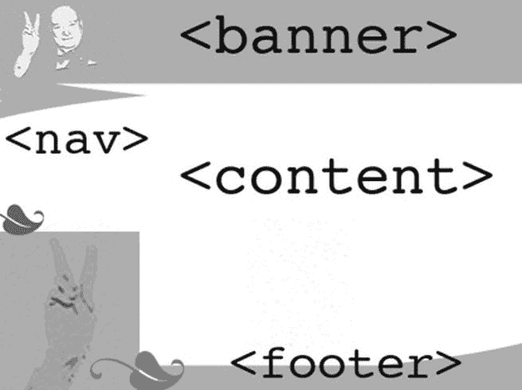

# 三、JavaScript 不是一个肮脏的词，ARIA 也不仅仅是美妙的音乐

很长一段时间，JavaScript 在可访问性圈子里是一个非常肮脏的词。它几乎是一个贱民，在面包专辑和不受欢迎的神奇宝贝中的网络开发的廉价地下室中被发现。Web 内容可访问性指南(WCAG)的第一版几乎禁止使用 JavaScript，这并没有帮助，而且开发者对使用 JavaScript 的态度也存在分歧。也有势利的人质疑它是否是一种合适的编码语言。低准入门槛，以及即使写得很差也能工作的能力，也无助于它的形象。现在这一切都改变了。

在这一章中，我们将看看如何使用 JavaScript 和其他技术来构建动态可访问网站和富互联网应用(RIA)。这些通常是使用 HTML、层叠样式表(CSS)、JavaScript 和最新产品 WAI-ARIA 的组合开发的。WAI 是基于 W3C 的 Web Accessibility Initiative，ARIA 代表*可访问的富互联网应用*。有时它被简称为*咏叹调*。

本章介绍了使用这些语言进行可访问性设计的一些常用方法，以及开发适用于每个人的动态内容——注意一些基本的良好的脚本实践。我们还将看看当前更加易于访问的 JavaScript 库。这一章也给了你一个很好的基础来帮助你过渡到可访问的 HTML5 开发，因为这里涉及的很多内容同样适用于 HTML 4 和 HTML 5。我还将概述一些在开发以支持旧的辅助技术(AT)时可能仍然需要使用的向后兼容技术。

 **注意**本章关于脚本的部分并不是详尽的 JavaScript 操作指南；相反，它概述了一些简单的原则。写这篇文章时，我采纳了朋友们的一些好建议。(鞠个躬，Gez 柠檬。我欠你一次。)我也借用了一些现有资源的例子。当谈到一般的脚本时，真的有很多方法可以做类似的事情，所以我将留下很多关于如何根据自己的喜好应用脚本的基本细节，而是集中在一些你应该坚持的简单原则上，这将使你的项目更容易理解。

如果你需要一本关于 JavaScript 的入门书籍，我推荐 Christian Heilmann 的书，他写了大量关于这个主题的文章，是可访问性方面的专家，还有 Jeremy Keith 和 Jeffrey Sambells 的《DOM Scripting:Web Design with JavaScript and the Document Object Model 》( friends fed，2010 ),也很棒。本章假设你有一些脚本经验，但是如果不是很高级也不要担心——你会得到大概的概念。

JSLint 是一个帮助你编写更好的 JavaScript 的有用工具，它最初是由道格拉斯·克洛克福特开发的。这将向您显示常见的错误，如行尾缺少分号；没有`if`、`for`或`while`语句的花括号；或者那些讨厌的`return`、`throw`、`continue`或`break`语句，它们会阻止你的代码运行。在`[www.jslint.com](http://www.jslint.com)`有在线版本。

### JavaScript:用得好的话很有用

以前的 HTML 版本主要是文档标记语言。它们是在网页还只是页面的时候设计的。它们是文本 Word 文档的在线等价物。随着时间的推移，它们变得越来越复杂，图像(然后是视频内容)可以嵌入其中。最终，web 演变成了今天的应用空间，其中 web 站点的行为更像桌面应用，用户可以在浏览器中做更复杂的事情。

所有这些 Web 2.0 的东西(因为没有更好的术语来描述更高级的功能)都是由一种相对简单的文档标记语言结合 CSS 和一些 JavaScript 实现的。事实是，有时候你不能单独使用 HTML，而一些有品位的使用 JavaScript 可以通过为用户提供额外的指导、帮助表单验证和提供更有意义的警告来增加网站的可访问性。

 **注意**美国的 Section 508 guidelines 规定，当用户需要定时响应时(例如，当预订音乐会门票时)，您必须通知用户。单独使用 HTML 几乎是不可能的——需要使用 JavaScript。

请注意，JavaScript 完全独立于 HTML 或它可以应用的任何其他语言。它很大程度上由一系列行为组成，可以被认为是占据了 web 开发栈中的那一层。它主要用于决定你的内容在被激活或移动时的行为，以及它将如何响应*触发*的特定事件。

JavaScript 是一种客户端语言，这意味着它完全在浏览器中运行。还有其他语言，比如 PHP，运行在*服务器端*，可以和 JavaScript 一起使用，实现更复杂的服务器/客户端交互。

### WAI-ARIA:这是什么？

在这一章的后面，我会讲很多关于 WAI-ARIA(有时也叫咏叹调)的内容。如前所述，WAI-ARIA 是 W3C 的 Web Accessibility Initiative(WAI)开发的一种技术规范，旨在弥合 HTML 4 和 HTML5 等标记语言之间的语义鸿沟。

 **注意**在过去的几年里，web 从静态网页转移到了 AJAX/Web 2.0 空间，变得更像应用。ARIA 的想法是开发一种可以插入到 HTML/XHTML 等宿主语言中的语言(它也可以与 SVG 一起使用)，这可以使使用 at 的残疾人更容易访问这些应用。

当然，HTML5 有一系列全新的控件(我们将在后面讨论)来提高网站和应用的可访问性。然而，当开发人员在等待 HTML5 时(让我们面对现实吧，这是一个漫长的等待)，需要有某种东西可以描述开发人员为辅助技术制作的手工滚动的动态交互小部件和组件的目的，有时是状态和其他属性。所以一些非常聪明的人集思广益，WAI-ARIA 诞生了。

#### 【HTML 4，3，2……怎么了？

我很惊讶在复杂的在线应用方面取得了如此大的成就，使用的实际上是一种有限的文档标记语言。(这是一种时髦的说法，“网络到底是怎么发展成现在这个样子的？”)

HTML 4 中只有两种元素可以单独通过键盘接收焦点:`<ahref>`锚标签和`<form>`控件。如前所述，键盘可访问性是可访问 web 开发的基础。在 HTML5 中，许多控件已经可以在 Opera 11、Safari 5、IE 9、Firefox 6 和 Chrome 13 等几个主要浏览器上通过键盘访问——全部或部分。这些包括`<audio>`元素；`<datalist>`元素；`<color>`输入元素；`<date>`输入元件；`<date and time>`输入元件；`<month>`、`<number>`、`<range>`和<搜索>输入元素；以及`<time>, <week>`和`
`元件。

尽管可聚焦元素和控件的调色板不再那么有限，但值得注意的是一些用于使元素在浏览器中可聚焦的技术，因为它们仍然非常有用——特别是在向后兼容较旧的 at 和尚不(或不愿)支持 HTML5 的浏览器等问题上。

您还应该意识到，虽然 HTML5 中的许多新控件可以通过键盘访问，但这并不意味着它们是完全可访问的。为此，他们的角色和其他信息需要通过辅助技术的可访问性 API 公开。我刚刚列出的几个新的 HTML5 控件还没有出现这种情况。

因此，从技术上来说，虽然用户可以单独使用键盘来访问控件，但这并不意味着他们可以发现控件实际上是什么或它做什么！

 **提示**为了处理上述情况，您可能需要使用 WAI-ARIA 添加可访问性信息。稍后我将更详细地介绍新的 HTML5 控件的可访问性，以及它们如何通过本机可访问性 API 向 AT 公开它们的角色和其他信息。

### 可访问的 JavaScript

就糟糕的脚本实践可能给最终用户带来的可访问性和障碍而言，许多开发人员并不真正关心。这种态度并不是有意针对残疾人的。开发人员只是喜欢他们可以用脚本做更多的事情，使页面的创作和使用更有趣，也更动态，他们被这种新语言所吸引。然而，对于使用 AT 的人来说，这些障碍往往是真实存在的。

其中一些障碍是由于当时一些用户关闭了 JavaScript，或者用户在防火墙后，或者只是在一个有限的浏览环境中。(企业环境可能非常封闭。)因此，无法访问 JavaScript 意味着许多脚本化的界面无法正常工作。

然而，在过去的几年里，这一切都改变了(除了封闭的企业环境)。JavaScript 在许多浏览器中是默认启用的，只要遵循我在这里概述的原则和实践，AT 的用户(如屏幕阅读器)就可以轻松地使用许多大量使用 JavaScript 的网站和应用。

 **注意**世界领先的在线网页可访问性网站之一的 WebAIM 研究了屏幕阅读器的使用情况，发现 98%的屏幕阅读器用户启用了 JavaScript。

更多信息，参见`[`webaim.org/projects/screenreadersurvey3/#javascript`](http://webaim.org/projects/screenreadersurvey3/#javascript)`。

#### 渐进增强

开发可访问脚本内容的首要原则之一是*渐进增强*的理念。根据这一原则来构建网站，你可以像看待 CSS 一样看待你的脚本——你可以将它们分成各自的文件或层。你的 HTML 是*内容层*，CSS 是*表示层*，JavaScript 是*行为层*。这种思考脚本的方式已经得到了很好的证明，并且很有意义，因为它有助于代码管理，并且使项目移交更容易，更少混乱。作为一个额外的好处，它对使用 AT 的残疾人有好处，因为基本内容总是可用的，并且不完全依赖脚本来工作。这意味着逐渐增强的内容也可以更容易地被你喜欢的搜索引擎解析。

 **注**你可以把谷歌搜索引擎想象成一个盲人用户。它将解析人们在表面上看不到的代码——就像屏幕阅读器一样——然后运行它神奇的算法并返回结果。所以在你的设计中善待残疾人，你也会为大 g 服务。

当您分离您的内容时，您从一个可访问的网页(结构良好的 HTML 内容、正确标记的表单控件、合适的替换文本等等)开始，为您的所有表示性内容添加一个单独的 CSS 文件，然后向站点的各个方面添加 JavaScript 功能，以增强其对可以正确处理它们的用户代理的功能。

渐进式增强的核心思想是，能够充分利用更新的技术规范和创作方法的用户代理(浏览器)能够并且将会，并且您的代码不会破坏那些不能、不会或者不会的。因此，一个逐渐增强的网站将是键盘可访问的，只有键盘用户才能在访问你的网站时执行他们需要的任务。

也就是说，JavaScript 必须以独立于*设备的方式应用，这意味着 JavaScript 不需要使用鼠标就能工作(这种情况经常发生)。*

#### 不引人注目的 JavaScript

JavaScript 的使用*不引人注目*也是至关重要的。这种方法旨在为不同的用户提供更加无缝的用户体验。他们可能不认识技术(在某种程度上，所有好的技术都应该是看不见的)，但当他们遇到不想要的行为时，他们会认识到这些行为，他们肯定会认识到那些不起作用的东西。网页上不必要的移动，复杂且通常不直观的小工具功能，以及怪异或不熟悉的控件遍布网络。不要给正典投稿。

 **注意***渐进式增强*和*不引人注目的 JavaScript* 有什么区别？嗯，有点像阴阳，因为是交织在一起的。它们都支持分层开发的思想，但是渐进式增强概述了以交错的方式向支持它们的用户代理提供行为的模型，并且不会破坏那些不支持它们的用户代理的内容。如果不被支持，不显眼的东西不会妨碍或扰乱用户体验。NOSCRIPT 问题就是一个很好的例子。(见下一节。)它们是同一枚硬币的不同面。

#### 整齐的编码

在 CSS 中，你编写全局定义的声明，使用它们通过`
`元素或者`id`或者`class`属性(也称为*钩子*)来控制外观，然后告诉浏览器以不同的方式呈现它。您可以添加更多谨慎的挂钩，然后在您的 CSS 文件中编写表示规则，而不是在 HTML 中添加大量繁琐的 CSS 代码。你可以用同样的方式思考 JavaScript。一个好的做法是在 JavaScript 文件中定义全局行为，这些行为将自己附加到 HTML 中的 ID 和类挂钩上，这样这些行为将(如果愿意的话)级联到 HTML 文件中。

注意，你可以给你的 id 和类名*起一个类似于*的名字，比如 *popup* 或者 *expand_menu* ，这在你编码的时候很容易理解。或者您可以借用现有的 ID 和类名。例如，考虑这个片段:`<a href="http://www.somewebsite.com" class="expand_menu">Expand me</a>`

 **注意**向钩子添加许多 JavaScript 事件的正确方法是定义元素，然后是事件，最后是动作。有几种方法可以做到这一点，比如`getElementbyId`、`getElementsByTagName`(当你想将几个具有相似行为的元素作为目标时)和`getAttribute`。每种方法都可以用来遍历 HTML 文档的 DOM 寻找特定的 id、元素类型或属性。然后在文档加载时对它们做些什么。添加`window.onload=prepareLinks();`函数还将确保您的 JavaScript 不会在页面加载之前触发。如果你的脚本在一个外部文件中，这一点很重要，因为它可能会在你的 HTML 文件之前加载。

#### 常见的 JavaScript 可访问性问题

 **注意**术语*事件处理程序*将在接下来的章节中大量使用。事件处理程序实际上是包含响应事件而执行的程序语句的方法，因此*事件处理程序*和*方法*可以互换使用。事件处理程序被添加到您的 HTML 代码中，并通过某种用户交互来激活或触发。它们也可以由浏览器本身触发，例如，当页面加载时，或者当网页的某个部分使用 XHR 对象异步更新时(这在 AJAX 开发中很常见)。

使用 JavaScript 时出现的大部分可访问性问题都是因为没有正确使用它，或者因为人们普遍缺乏对代码对用户体验的影响的认识，特别是对残疾人。这很大程度上是可以理解的，因为开发人员可能没有意识到他们如何实际应用脚本甚至是一个问题。

用 JavaScript 做类似的事情也有很多方法，看起来会产生相同的结果，但可能更多的是“黑帽子”而不是“白帽子”只有当你从一个残疾人的角度看一个严重脚本化的界面时，你才能意识到采用渐进增强这样的方法确实有意义。这一章呼吁更多的“白帽子”JavaScript，所以善待你的用户！

还有更多的易访问性问题——或者更准确地说，可用性问题——你可以用常识作为指南来解决。如果你认为你的脚本网站或者界面复杂难用，那么你猜怎么着——它可能对很多其他人来说复杂难用！当它像那样被拼写出来的时候，它似乎有点愚蠢，但是它是真实的。

但是，还有其他不太明显的可访问性问题:

*   **缺少键盘可访问性:** JavaScript 有一些只能用鼠标激活的事件处理程序，比如`onClick`、`onMouseOver`、`onMouseOut`、`onDblClick`。其他方法不太特定于设备，例如`onFocus`、`onBlur`、`onSelect`和`onChange`。当一个项目或对象获得焦点时，它们被激活，这可以通过鼠标、键盘或任何输入设备，如开关(如前一章所述)。后一种方法是一种*独立于设备的*方式，用于向网页中的对象添加行为，这是一个简单但强大的例子，说明了如何更方便地向内容添加 JavaScript。
*   **Lack of Control:** Taking the previous example a step further, if a webpage has been developed with only `onClick` methods, these functions often are not accessible to a keyboard user. The user might not be able to use the widgets/controls at all and therefore is blocked out of the web site. This can also be an issue when content is hidden or removed on certain events and the user either cannot undo an action or just can’t get to some content.

    WCAG 2.0 成功标准中详细描述了处理各种此类情况的方法。在下一节“JavaScript 和 WCAG 2.0”中，我们将会看到他们对可访问脚本的一些建议

*   **发生了太多事情:**过度工程化、过度烹饪的界面如今变得越来越常见。随着用户体验在这个看似无限选择的时代变得越来越重要，它们越来越不被容忍。当用户对一个网站有不好的体验时，他们很幸运不必回头，并且有大量的竞争网站很乐意收购他们的业务。当一个组织是一个公共部门或联邦机构时，情况就不同了，他们有义务确保他们的 web 界面符合某种标准。

然而，我们都见过为了功能、动画和动态行为而添加的页面。许多网页清楚地反映了它们设计的时代，因为它们展示了在特定时期流行的行为。总有一天，AJAX 界面、圆角等看起来会像旧的效果，但没有什么比令人困惑和迷失方向的界面更糟糕的了，设计师已经疯了，向只有他或她才能使用或理解的非直观界面添加额外的东西。这些界面可能会令人困惑，尤其是对老年人和有认知障碍的人来说，它们可能完全适得其反，实际上阻止了许多人使用网站的功能。

##### 键盘可访问性、仅鼠标事件和按键映射

在一个简单的`onFocus`方法之上，还有许多其他的事件处理程序，这是可访问脚本的基础。如果你注意到脚本的这些基础，你会发现你可以开发复杂的网站和应用，这些网站和应用也是高度可访问的。我之前也提到过，用户可能无法使用控件，因为对于只使用键盘的用户来说,`onClick`实际上会工作得很好(或者模拟回车键的任何其他开关设备)。

我将所有这些设备归入*键盘可访问*的范畴。这是因为你可以调用一个脚本函数(比如`onClick`)并将它附加到浏览器中具有本机键盘可访问性的控件上(比如一个链接或按钮)，或者你可以通过使用`tabindex="0"`使`
`可通过键盘聚焦。在幕后，`onClick`事件实际上被映射到一个链接或按钮的默认动作。该名称具有误导性，因为该事件将在按下 Enter 键时激活。然而，有些情况下你必须要小心一点——特别是当你添加`onclick`事件到`
`元素的时候。这是因为`onclick`事件将在文档的自然源顺序内的元素上触发，而`
`元素通常不遵循这一顺序。我在构建 HTML5 视频播放器时特别注意到了这一点(这将在第六章中出现),因为在 Firefox、Safari 和 Chrome 中`onclick`事件不会从键盘上触发。(IE 9 不支持`<video>`元素。)

在你的项目中，考虑用一些键盘友好和可访问性友好的事件处理程序来映射一些更常用的仅使用鼠标的事件可能也是一个好主意，比如那些在表 3-1 中概述的事件处理程序。

在构建 JavaScript 控件时，如果需要，可以提供两个事件处理程序，以确保鼠标和键盘都可以使用它们。当我们构建一个可访问的 HTML 5 播放器时，你会在第六章中看到一个这样的例子。

为了通过键盘触发一个行为，有时您可能需要编写您想要触发事件的实际按键的脚本。一些最常用的是空格键和回车键。你必须小心使用像`onkeypress`这样的事件处理程序，因为不管用户按下哪个键，它都会触发。所以如果你指的是一个特定的键，最好定义一下。

为此，您必须调用一个可以映射到特定功能的按键代码。空格键的键码是 *32* ，回车键的键码是 *13* 。将这些事件类型附加到各种输入键采取以下形式来激活事件。下面的代码示例是为响应按键事件而修改的`playVideo`函数。它还检查是否是正确的密钥:

`function someFunction(objEvent) {
       if (objEvent.type == 'keydown')
       {
               var iKeyCode = objEvent.keyCode;
               if (iKeyCode != 13 && iKeyCode !=32) {
                       return true;
               }
       }
       someFunction();
}`

一个很好的实时工具，给你键码来帮助你找出什么代码代表什么键可以在`[`asquare.net/javascript/tests/KeyCode.html`](http://asquare.net/javascript/tests/KeyCode.html)`找到。

 **注意事项**如前所述，注意不要混淆`onKeyPress`和`onClick`。`onKeyPress`(除非映射到特定的键)会在按下任何键时触发一个事件或调用一个函数——所以要小心使用。它可能是一个相当钝的工具。

##### 一些事件处理程序可访问性最佳实践

当我们谈到事件处理程序时，这里有一些通用的良好实践:

*   避免使用`onDblclick`方法，因为没有可访问的等效键盘。
*   避免将鼠标坐标映射到事件处理程序。这是行不通的，因为用户不能通过键盘或其他设备在浏览器中移动系统插入符号或关注它们。
*   避免在下拉框中使用`onChange`事件处理程序。使用屏幕阅读器的盲人将使用箭头键在下拉框中包含的选项之间上下导航，并通过让屏幕阅读器将它们输出为语音来找出选项。如果将`onChange`事件处理程序应用于菜单，而不是允许屏幕阅读器用户在其中导航，那么当用户在导航控件时点击箭头键时，该事件将被触发。然后，用户将被带到默认 URL 或列表中默认项目的 URL。通常，允许用户导航菜单项，然后让她按 Tab 键来选择 Go 按钮或类似的 UI 元素会更好。
*   对只能由特定事件处理程序激活的项目进行编码也不是好的做法。应该有一个添加事件处理程序的真实 URL 或链接，所以当 JavaScript 被禁用时，真实 URL 仍然可以获得焦点。
*   不要使用`createEvent()`、`initEvent()`和`dispatchEvent()`处理程序来给出元素焦点。用`element.focus()`代替。
*   不要使用命名锚点(`<ahref>`元素中的`#`属性)或内嵌代码，如`javascript:window.open()`，来控制动态菜单或弹出窗口。如果 JavaScript 关闭，这两种方法都不起作用，因为如果不启用脚本，`href`元素就无法向浏览器传递指令(就像打开 URL 时通常做的那样)。这是一个本地行为如何被脚本劫持的例子，使得交互完全依赖于新技术(JavaScript ),并且取消了`href`元素以默认方式运行的能力，因为它没有 URL 来提供焦点。

#### 创建可访问的弹出菜单和内联事件处理程序

使用弹出菜单时，您应该在用户实际启动弹出菜单之前通知用户弹出菜单将被启动，最好是在链接文本本身中包含这些信息(无论您是否使用脚本)。但是，应谨慎使用弹出菜单，并且仅在需要时使用。通常情况下，你并不真的需要这么做。在下面的例子中，即使关闭了 JavaScript，用户也不会孤立无援，仍然可以访问有用的页面:

`
 Here is a my <a href="http://www.myusefulpopup.html" target="_blank">really interesting
and useful pop box [Opens in new Window] </a>
`

为了确保您的`popUp`函数适度降级，请使用真实的 URL(如前面的示例所示)。

以下示例调用一个名为`popUp`的函数，它采用如下所示的一般形式:

``

以下是内联示例(这些示例不是最佳实践，但在此用于说明目的):

`<a href="http://www.myusefulpopup.html" onclick="popUp('http://www.myusefulpopup.html');
return false;"> Here is my really interesting and useful pop box [Opens in new Window] </a>`

这似乎是职能的重复，事实也的确如此。您可以使用 JavaScript 来简化它，只需指向它所附加的元素:

`<a href="http://www.myusefulpopup.html" onclick="popUp(this.getAttribute('href')); return
false;"> Here is my really interesting and useful pop box [Opens in new Window] </a>`

或者您可以使用 snazzier 版本:

`<a href="http://www.myusefulpopup.html" onclick="popUp(this.href); return false;"> Here is my
really interesting and useful pop box [Opens in new Window] </a>`

需要记住的一点是,`href`值是一个真实的 URL，所以当脚本关闭时，它仍然可以工作。这些是*内联*脚本或者包含在代码中的脚本的例子。最好将脚本放在一个单独的文件中，就像处理 CSS 一样，然后在头文件中指向该文件，引用 id、引用类名，或者像 JavaScript 允许的那样搜索元素 id 和类型。

 **注意**脚本的“返回假”位阻止事件触发。当您有许多事件处理程序，并且希望嵌入它们并以更细粒度的方式控制它们的行为时，这很有用。不希望事件传播？然后在事件处理程序中使用“return false”。这就给浏览器发送了一个大大的“不要激活这个”标志。记住，窗口对象有一个`open()`方法，用于确定特定的特性。它采用以下一般形式:

`Window.open(url, name, features)`

#### 使用 TabIndex 和更高级的聚焦技术

允许任何元素获得键盘焦点的最常见方式是为元素设置一个`tabindex`值。`tabindex`属性可以取几个值，确保它获得焦点的一个常见方法是将`0`或`-1`添加到属性(`tabindex="0"`或`tabindex="-1"`)中。然后给出焦点的一个常见方法是使用`element.focus()`方法。这允许键盘用户通过箭头键导航。

在`
`元素上使用`tabindex="0"`,如下面的代码示例所示，这意味着`
`可以在正常的页面项目跳转过程中获得焦点:

`

//Some content here

`

通过使用负值(`tabindex="-1"),`)元素可以获得焦点，但是会从 tab 键顺序中去掉。你为什么要这么做？嗯，您可能有一些小部件，当用户使用它们时，它们会显示功能，因此它们更具可定制性或更能响应用户需求。

`

//Some content here

`

一段简单的 JavaScript 将找到 name 元素(在本例中，我使用了 ID `‘some_control’`)并调用 focus 方法来完成这一任务:

`var objDiv = document.getElementById('some_control');
// Hit me
objDiv.focus();`

表 3-2 是一个重要的图表，展示了应用了`tabindex`属性的元素的行为。属性可以接受各种参数，所使用的参数会影响属性的行为。了解何时使用它们以及它们的行为方式非常重要。例如，您可能希望动态地更改控件的行为—有时给它焦点，有时不给它焦点—或者改变项目成为焦点的顺序。

有关这些核心行为的更多信息，请参见`[www.w3.org/TR/wai-aria-practices/#kbd_focus](http://www.w3.org/TR/wai-aria-practices/#kbd_focus)`。

 **提示**使用负的`tabindex="-1"`值将从文档源顺序中删除该元素，因此用户不能跳转到该元素。使用`tabindex="0"`将给予元素焦点，但仍然保持它在文档标签顺序中。

 **注意**当我谈到“Tab 键顺序”或“源代码顺序”时，我指的是元素在文档源代码中出现的顺序。这很重要，因为它准确地定义了链接、按钮和表单控件的焦点，以及它们的顺序。因此，简单地重新排列元素的顺序可以提高网站的可访问性和可用性。

#### JavaScript 和 WCAG 2.0

在 WCAG 1.0 的第一个版本中(你可以在`[www.w3.org/TR/WCAG10/](http://www.w3.org/TR/WCAG10/)`找到)，JavaScript 被称为“准则 6”。确保采用新技术的页面能够优雅地转变。”

完整的指南涵盖了与 JavaScript 不完全相关的问题，比如使用 CSS，以及确保文档在样式表丢失的情况下仍然可以阅读——这仍然是个好建议。以下是网页内容可访问性指南 1.0 1 的摘录:

> “即使在新技术不被支持或被关闭的情况下，也要确保页面是可访问的。”

这个想法是鼓励内容开发者使用新技术来解决现有技术带来的问题，同时继续确保他们的页面可以在旧浏览器上运行，并为那些选择关闭功能的人服务。

这仍然是合理的建议，值得在你的项目中应用。与 JavaScript 相关的检查点如下:

*   6.2 确保当动态内容发生变化时，动态内容的对等内容得到更新。[优先事项 1]

__________

1

*   6.3 确保当脚本、小程序或其他编程对象被关闭或不被支持时，页面是可用的。如果不可能，请在另一个可访问的页面上提供同等信息。[优先事项 1]
*   6.4 对于脚本和小程序，确保事件处理程序独立于输入设备。[优先事项 2]
*   6.5 确保动态内容是可访问的，或者提供替代的演示或页面。[优先级 2]例如，确保触发脚本的链接在脚本被关闭或不被支持时工作(例如，不使用“javascript:”作为链接目标)。如果在没有脚本的情况下无法使用页面，请使用 NOSCRIPT 元素提供一个等效文本，或者使用服务器端脚本而不是客户端脚本，或者提供另一个可访问的页面。

##### 为什么没有 NOSCRIPT？

我已经讨论了前面的大部分问题，在很大程度上，这是一个很好的建议。但是，我不同意关于 NOSCRIPT 的建议。与依赖回退内容相比，使用不引人注目的脚本方法是一个更好的主意。也就是说，构建项目和添加 JavaScript 时，不要破坏用户的体验，因为用户可能出于某种原因无法访问它。与回退内容相比，这种方法将带来更加流畅的体验。有些时候，您可能别无选择，只能使用回退内容，但是通过明智地使用不引人注目的 JavaScript，您可以在很大程度上避免这样做。

我将讨论 Checkpoint 6.2，“确保当动态内容发生变化时，动态内容的等价物也得到更新。[优先级 1]，”稍后，在新的 WCAG 2.0 准则的上下文中，因为自从 AJAX 和异步(客户端)内容更新出现以来，该检查点的含义已经发生了变化，变得更加技术性。

NOSCRIPT 有点像“你没有最新、最流行的浏览器，所以我们把你挡在我们华而不实、很酷的网站之外，让你回到你完全不酷的生活！”你以前收到的那种信息。令人惊讶的是，有人曾认为提供这种居高临下的信息是一个好主意，但你走了。

 **提示**我的朋友 Gez Lemon 在他出色的 JuicyStudio 网站上写了关于 NOSCRIPT 的更好替代方案。而且是的，`<NOSCRIPT>`在 HTML5 中技术上还是允许的。显然，有人仍然认为`<NOSCRIPT>`是一个好主意。Gez 在本文中概述了为什么这不是一个好主意:
`[`juicystudio.com/article/say-no-to-noscript.php`](http://juicystudio.com/article/say-no-to-noscript.php)`。

关于如何用可访问且不引人注目的 JavaScript 替换 NOSCRIPT 的有趣文章，请参阅 Frank M. Palinkas 关于 Dev 的文章。歌剧在`[`dev.opera.com/articles/view/replacing-noscript-with-accessible-un`](http://dev.opera.com/articles/view/replacing-noscript-with-accessible-un)`上演。

##### WCAG 2.0 的客户端脚本技术

WCAG 1.0 和 2.0 之间的一个很大的区别是，指南的第二次迭代被设计得更加严格可测试。也有很多有用的真实世界的例子供你研究。这里有成功标准的技巧、指南和概要，以及常见失败的列表。

我在这里列出了所有的客户端脚本技术，并为您精选了其中的一些，以便您可以更详细地了解它们。我想让你对它们有一个总体的感觉，它们几乎是按原样发表在这里的。我鼓励你研究这些和这里没有显示的其他内容，你可以在`[www.w3.org/TR/WCAG20-TECHS/client-side-script.html](http://www.w3.org/TR/WCAG20-TECHS/client-side-script.html)`在线完成。当然，您可以调整它们以适应您的项目。

 **注意**这些脚本技巧与特定的 WCAG 成功标准相关，你可以在网上查看。有些可能看起来有点老了。我在这里包括了一些技术，这样你就可以感受到脚本建议是如何与 WCAG 2.0 相关联的，而不是像 WCAG 的“如何做”指南一样。然而，应该很清楚，这些技术中的许多仍然是实用和有用的。

您会注意到这些例子中的`!DOCTYPE`是针对 HTML 4 的，但是这里概述的原则同样适用于 HTML 5(因为它只是脚本的宿主语言)。目前 WCAG 2.0 还没有任何 HTML5 测试用例，但它们正在开发中。

以下是客户端脚本技术的列表 2 ，你可以在`[www.w3.org/TR/WCAG20-TECHS/client-side-script.html](http://www.w3.org/TR/WCAG20-TECHS/client-side-script.html)`网站找到。在本书末尾的附录 A 中可以完整地找到它们中的一部分，它们被包括在内是为了加强我前面提到的一些内容，并介绍一些你会发现有用的新技术。以下所有技术都是根据 W3C 版权政策发布的。感谢迈克尔·库帕(W3C/WAI)的建议和帮助。

以下是客户端脚本技术的完整列表:

*   SCR1:允许用户延长默认时间限制
*   SCR2:使用冗余键盘和鼠标事件处理程序
*   SCR14:使用脚本使不重要的警报可选
*   SCR16:提供一个脚本，警告用户时间限制即将到期
*   SCR18:提供客户端验证和警报

__________

版权所有 2007 W3C(麻省理工学院，ERCIM，庆应义塾)。保留所有权利。W3C 责任、商标和文档使用规则适用。

*   SCR19:在 select 元素上使用 onchange 事件，而不改变上下文
*   SCR20:使用键盘和其他设备特定的功能。
*   SCR21:使用文档对象模型(DOM)的函数向页面添加内容
*   SCR22:使用脚本控制闪烁，并在 5 秒或更短时间内停止闪烁
*   SCR24:使用渐进式增强应用户请求打开新窗口
*   SCR26:将动态内容插入到文档对象模型中，紧跟在其触发元素之后
*   SCR27:使用文档对象模型重新排序页面部分
*   SCR28:使用可展开和可折叠的菜单绕过内容块
*   SCR29:向静态 HTML 元素添加键盘可访问的操作
*   SCR30:使用脚本更改链接文本
*   SCR31:使用脚本更改具有焦点的元素的背景色或边框
*   SCR32:通过 DOM 提供客户端验证和添加错误文本
*   SCR33:使用脚本滚动内容，并提供暂停它的机制
*   SCR34:以随文本大小缩放的方式计算大小和位置
*   SCR35:通过使用锚和按钮的 onclick 事件使操作键盘可访问
*   SCR36:提供一种机制，允许用户在静态窗口或区域中显示移动、滚动或自动更新的文本
*   SCR37:以独立于设备的方式创建自定义对话框

#### WCAG 2.0 中常见的脚本错误

以下是一些与动态内容和脚本相关的 WCAG 2.0 常见故障:

 **注意**WCAG 2.0 所有常见故障列表可以在这里找到:`[www.w3.org/TR/WCAG20-TECHS/failures.html](http://www.w3.org/TR/WCAG20-TECHS/failures.html)`。还提供了如何修复它们的建议。

*   F37:当单选按钮、复选框或选择列表的状态发生变化时，在没有事先警告的情况下启动新窗口，因此未达到成功标准 3.2.2
*   F42:成功标准 1.3.1 和 2.1.1 失败，原因是使用脚本事件以不可编程方式确定的方式模拟链接
*   F44:由于使用 tabindex 创建的 tab 键顺序没有保留含义和可操作性，因此不符合成功标准 2.4.3
*   F50:成功标准 2.2.2 失败，原因是脚本导致闪烁效果，但没有在 5 秒或更短时间内停止闪烁的机制
*   F52:不符合成功标准 3.2.1 和 3.2.5，因为加载新页面后立即打开新窗口
*   F54:成功标准 2.1.1 失败，原因是只对某个功能使用了特定于指点设备的事件处理程序(包括手势)
*   F55:由于在接收到焦点时使用脚本来移除焦点，因此不符合成功标准 2.1.1、2.4.7 和 3.2.1
*   F59:由于使用脚本在 HTML 中制作 div 或 span 用户界面控件，导致成功标准 4.1.2 失败
*   F60:由于当用户在输入字段中输入文本时启动新窗口，成功标准 3.2.5 失败
*   F61:由于通过用户无法从内容中禁用的自动更新完全改变了主要内容，因此不符合成功标准 3.2.5
*   F62:成功标准 1.3.1 和 4.1.1 失败，因为 DOM 中的信息不足以确定 XML 中的特定关系
*   F85:成功标准 2.4.3 失败，原因是使用的对话框或菜单在顺序导航顺序中与其触发控件不相邻

 **注意**我不会在这里一一列举(不过你应该在网上查一下)。即使粗略地看一下，也应该有助于您理解它们与前面讨论的几个问题有关，例如使用与设备无关的事件处理程序、使用可访问的表单验证、通知用户内容更新等等。

#### 可访问的 JavaScript 工具包

作为 web 开发人员工具箱的一部分，JavaScript 的使用变得越来越普遍和重要，这个库也随之兴起。JavaScript 库是一堆现成的脚本、小部件和组件，您可以复制和粘贴，或者直接插入到您的 web 项目中。然后，您将在文档的头部分中引用这些脚本在客户机或服务器上的位置。

使用脚本库和工具包是一件喜忧参半的事情。一方面，它可以帮你省去学习大量 JavaScript 的繁重任务；另一方面，这可能是一种痛苦，因为您必须相信您使用的组件是高质量的组件，并且可以被最广泛的受众访问和使用。情况并非总是如此。事实上，这是例外而不是规律。

 **注意**就像所有不是你自己构建的东西一样，当你不熟悉底层架构时，在不破坏你不知道的内部依赖的情况下修改代码会更加困难。话虽如此，较好的软件可以提供良好的文档和内部注释，使它们更容易适应您的需求。

然而，有几个 JavaScript 库在可访问性方面还不错，值得进一步探索。有几个我建议您避免使用，但是我不会在这里明确地提及它们，我将坚持使用那些值得注意的，因为它们在其架构中考虑了可访问性。

 **注意**以下工具包被认为比其他工具包更容易使用的主要原因是因为它们支持并实现了 WAI-ARIA 规范。WAI-ARIA 提供了一个语义工具包，通过辅助技术(如屏幕阅读器)的可访问性 API 来描述小部件和其他脚本控件的功能。在这一章的后面，我们将更详细地研究 WAI-ARIA。

##### 道场(迪吉特)

DIJIT 1.6 是 DOJO 的核心，支持键盘可访问的小部件，为视力受损的用户提供高对比度模式，并增加了对 WAI-ARIA 的支持。小部件的范围包括交互式菜单、对话框、进度条、灯箱等等。

*   **Dojo Explorer:** 查看 DOJO 特性浏览器页面，在这里您可以找到所有 DOJO 特性的有用演示。所有的演示都包括它们的源代码，或者是 HTML 标记，或者是 JavaScript，或者两者都有。您可以在`[`dojocampus.org/explorer`](http://dojocampus.org/explorer)`访问页面。
*   **DIJIT Accessibility(A11y):**您可以在下面的网站上找到更多关于 DOJO 小部件是如何被设计为可访问的、如何支持与设备无关的交互，以及如何为 AT 提供角色和状态信息的信息:`[`livedocs.dojotoolkit.org/dijit/a11y`](http://livedocs.dojotoolkit.org/dijit/a11y)`。
*   **DOJO 可访问性声明:**要了解完整的 DOJO 可访问性声明以及该工具包与 WCAG 2.0 和 Section 508 合规性的关系，请访问`[`dojotoolkit.org/reference-guide/dijit/a11y/statement.html`](http://dojotoolkit.org/reference-guide/dijit/a11y/statement.html)`。

##### jQuery UI

jQuery UI 框架位于核心 jQuery 工具包之上。一些小部件具有内置的可访问性，并且有许多可访问的插件可以添加到您的项目中。jQuery UI 有一个非常活跃的可访问性团队，支持 CSS3，以及大量的小部件，包括可访问的拖放、选项卡式菜单、可排序的表格、可访问的灯箱和表单验证。

*   **下载 jQuery UI:** 要下载 jQuery UI，请转到`[`jqueryui.com`](http://jqueryui.com)`。
*   **可访问的 jQuery 插件:**要了解所有可访问的插件，请访问`[`plugins.jquery.com/plugin-tags/accessibility?page=1`](http://plugins.jquery.com/plugin-tags/accessibility?page=1)`。

##### 流体项目:输液

Fluid Infusion 位于 jQuery 工具包之上，结合了 JavaScript、CSS、HTML 和以用户为中心的设计原则，提供了一个强大的包容性工具包。

以下是一些关于补液的有趣事实:

*   灵活的标记确保您可以随意更改组件设计，而不必担心破坏 JavaScript 代码。
*   Infusion 使用一个强大的事件系统来通知您的代码什么时候发生了什么，这样您就可以进一步进行交互。
*   没有黑盒。输液中的一切都是为了适应您的需要而修改、返工和调整的。
*   门户、混搭和内容管理系统的理想选择。灌注是完全命名空间的，与其他代码配合得很好。
*   Infusion 附带了一个轻量级且方便的 CSS 库来帮助你快速充实你的布局。

##### 流畅的“操作”指南

Fluid 附带了一些很好的教程供您入门。更多信息，参见`[`wiki.fluidproject.org/display/docs/How-to+Guides`](http://wiki.fluidproject.org/display/docs/How-to+Guides)`。

*   **Fluid Components:**Fluid Components 是可重用的用户界面，它消除了在 Web 应用中支持丰富交互的困难。考虑到用户工作流和序列，组件通常比 UI 工具包中熟悉的小部件要大。更多信息，参见`[`wiki.fluidproject.org/display/fluid/Components`](http://wiki.fluidproject.org/display/fluid/Components)`。
*   **流体演示:**流体演示页面为您提供了一个设计精美的组件“橱窗”。我喜欢它的布局方式，你可以选择一个组件，很容易地看到用来创建它的 CSS、HTML 和 JavaScript。从可访问的拖放，网格重排序系统都是可用的。更多信息，参见`[`build.fluidproject.org/infusion/demos`](http://build.fluidproject.org/infusion/demos)`。

注意其他或多或少支持 WAI-ARIA 的工具包是 YUI 库和 GWT (Google Web Toolkit)。还有其他的，支持一直在增长。如果你不确定并且你有一个你喜欢的工具包，直接让公司知道可访问性对你很重要总是一个好主意。所以给他们写封短信，如果你想的话，就参与进来吧！

 **提示**如果你使用 Wordpress，有许多支持 ARIA 的插件是作为 AEGIS 项目的一部分开发的。有关插件的完整列表，请访问`[`wordpress.org/extend/plugins/profile/theofanis1999`](http://wordpress.org/extend/plugins/profile/theofanis1999)`。

#### WAI-ARIA:怎么做！

WAI-ARIA 为开发人员提供了一种方法来描述一些新的导航结构，如树型控件，创建可访问的拖放功能，添加可访问的进度条，以便盲人用户可以(实时)了解下载进度，包括可访问的滑块来更改各种用户输入的值，或修改搜索查询的选择(如在搜索房屋租赁或购买时的最小值或最大值)。

例如，WAI-ARIA 还允许你标记网页中常用的*区域*，并让你在 at 上使用它们。这些可以是菜单、主要内容、次要内容、横幅信息等等。

 **提示**使用 WAI-ARIA，你可以识别网页的*地标*和*实时*区域，屏幕阅读器用户将能够“看到”这些区域，就像他们可以通过标题或链接导航并在页面上弹跳一样。

例如，WAI-ARIA live 区域用于经常更新的页面，如股票行情和聊天记录。JAWS 首选项确保 ARIA 属性值没有设置为 off。如果它是打开的，屏幕阅读器将自动检测是否有更新，并将宣布更新或更改的内容。这真的很有用，因为屏幕阅读器用户在任何给定的时间都不必关注他碰巧浏览的页面的任何部分。

这种不失去焦点并发布实时更新的问题是一个强大而有用的新功能，可以实现更完整的用户体验。此外，值得注意的是，不干扰用户的焦点是可访问 web 开发的一个重要部分，应该注意支持这一点——尤其是在开发大量脚本化的应用时。

 **提示**打破当前焦点的一个常见方法是强制进行不必要的页面刷新。所以尽量减少这些，尽可能在客户端进行更多的表单验证。或者，如果您使用脚本来更改 DOM 并添加新内容，请将此功能包装在一个活动区域中！

##### 实时区域属性

正如任何生活方面的交流(人类之间)，当一个人试图告诉你一些事情或做一些事情时，你不想成为话匣子或粗鲁地打断她。实时区域能够以不会不必要地打扰用户的方式设置中断级别。这些区域可以设置为关闭，礼貌，或主张。大多数情况下，您可能会使用礼貌值，但有时您想对屏幕阅读器用户说，“这真的很重要，您必须马上了解这一点”，因此您会将该值改为 assertive。曾经有一个`rude`属性用于 live 区域！

将该值设置为礼貌不会打断屏幕阅读器用户。当用户交互出现中断或暂停时，用户将会收到更新通知。将该值设置为 assertive 会立即通知屏幕阅读器用户，当需要用户输入或者发生了需要注意的重要事件时，该设置非常有用。

创建实时区域的原因有很多，其中之一是可以将它们用作实时数据流的容器，如股票市场信息、天气或更新新项目。

 **注意**活动区域也可以用于表单验证或通知用户某个动作已经完成。基本上，任何输入/数据源——无论是 PHP、ASP、JSON 还是 XML——都可以使用。

基本实时区域采用以下形式:

`

`

在前面的示例中，ARIA 角色区域被添加到父元素`
`中。这使得它是“活的”`ID of "SingleLiveRegion”`为您的数据源提供挂钩。使用`aria-live="polite"`会导致只有当用户完成与网页的交互时才会宣布小工具的更新内容——因此用户在使用屏幕阅读器浏览网页的正常过程中不会被打断。

属性的使用决定了屏幕阅读器是只更新活动区域(应用了`Region`角色的整个`
`)中包含的部分信息，还是全部信息。

默认行为是 at 不会查看整个区域的内容，因为它假设原子值被设置为`false`。当同一个`Live Region`中有几个节点将进行更新时，这种方法很有用，因为它对 at 将宣布的内容提供了更细粒度的控制。

考虑图 3-1 中的例子，它显示了一个股票市场小部件，有五个独立的实时流。用于创建它的代码如清单 3-1 所示。

***图 3-1。**幻想无障碍生活区*

 **注意**有时在代码示例中，我会使用省略号，比如“…]”来表示某个示例中的某些代码是不相关的或者被有意省略了。此外，我没有包括 CSS，因为你可以自己试验。这个例子和后面的例子主要是为了说明使这些模式可访问所需的语义。你可以根据自己的喜好设计它们。

***清单 3-1。**构建 Fantasy 可访问 Live Region Widget 的语义代码*

`<!DOCTYPE HTML>
<html>
  <head>
    <meta charset=”UTF-8">
    <title>Multiple Embedded Live Region Table</title>
  </head>
  <body>
    

      <h4><a href="http://www.somemarketurl.com">SomeMarket</a></h4>
      (live accessible market data)
      
        <a href="http://www.somemarketurl.com/ticker.html">SomeMarket Ticker</a>
      
    

    <table id="somemarket_items" summary="A LiveRegion sample of current market values for
major international indexes. Data will update in a polite manner (unlike stock market traders)
which won't interfere with screen reader browsing"  class="marketdata">
      <thead>
        <tr>
          <th>Market Name</th>
          <th>Current Value</th>
          <th>Movement</th>
          <th>Change</th>
          <th>Percentage Change</th>
        </tr>
      </thead>` `      <tbody>
        

          <tr class="up">
            <td class="marketname" >
              <ahref="http://www.somemarketurl.com/dow_jones_live/">Dow Jones</a>
            </td>
            <td class="current">11644.49</td>
            <td class="movement"></td>
            <td class="change">166.36</td>
            <td class="percentageChange">1.45&#37;</td>
          </tr>
        

        

          <tr class="up">
            <td class="marketname">
              <ahref="http://www.somemarketurl.com/Nasdaq_live/">Nasdaq</a>
            </td>
            <td class="current">2667.85</td>
            <td class="movement"></td>
            <td class="change">47.61</td>
            <td class="percentageChange">1.82&#37;</td>
          </tr>
        

        

          <tr class="up">
            <td class="marketname">
              <a href="http://www.somemarketurl.com/FTSE_live/">FTSE 100</a>
            </td>
            <td class="current">5466.36</td>
            <td class="movement"></td>
            <td class="change">62.98</td>
            <td class="percentageChange">1.17&#37;</td>
          </tr>
        

        [...]

      </tbody>
    </table>
  </body>
</html>`

 **注意**清单 3-1 中的代码是一个虚幻的可访问的 live region 小部件，不是因为它不可访问，而是因为股票在上涨。

##### 滚自己的？用咏叹调来标记和描述

Web 开发人员和设计人员通常希望设计他们自己定制的手工组件。这意味着您可能希望设计自己的图形用于您的界面，例如按钮和其他自定义控件。

对于一个视力正常的用户来说，能够看着浏览器就足以理解控件是什么，甚至它是做什么的。一个好的设计有特定的启示，可以直观地引导用户理解该做什么。如果你必须向用户解释它，它可能已经太复杂了！

一个没有视力的人无法在视觉上建立这种联系，除非以某种方式描述这个物体，否则手卷图形或整个部件的身份是未知的。当 AT 的用户激活它时，该用户可以期待什么？因此，描述元素是什么和它的功能是可访问 web 开发的核心，也是将语义正确应用于这些控件的核心。

如果您使用原生 HTML 控件，您应该知道它们具有固有的语义，这些语义用于描述一个元素以及当与 at 一起使用时它将做什么。如果没有，ARIA 是提供这些语义的一个很好的方式。以下是如何使用一些新的 ARIA 属性实现这一点的示例。

您可能对可访问性海报儿童/摇滚明星很熟悉，它是``元素的`alt`属性。这是大多数开发人员在开始学习无障碍 web 开发时要学的第一件事。这是您使用替代文本描述图像的地方。您还可以通过在图形中添加替代文本来描述图像对辅助技术的作用(当它的行为类似于链接时)。描述性图像采用以下形式:

` or for
functional images of `

 **提示**有时候你会想用其他的描述来描述一个手工擀面的元素是做什么的，而不是它看起来是什么样子。稍后我会详细介绍这一点以及 HTML5 中替换文本的使用。

因此，我们已经看到了使用 image 元素的`alt`属性来为 at 提供一些语义，以理解对象的身份，有时还理解对象的用途。ARIA 扩展了这一思想，并带来了一些强大的新特性。您可以使用这些来描述 AT 的自定义控件的标识和用途，以及其他关系、状态等。

以下是其中的一部分:

*   这是一种可访问地指向现有元素的方式，该元素标记了当前手工滚动的元素。当你指向一个实际在屏幕上的元素的文本，并且你想给一个元素一个可以被辅助技术识别的名字(比如“按钮”)时，你应该使用`aria-labelledby`。当你创建定制的控件，并且没有使用具有内在语义的通用真实 HTML 控件时，可以使用它。
*   `Aria-label:`当文本不在屏幕上时，这可以像`aria-labelledby`一样使用。
*   `Aria-describedby:`该属性与`aria-labelledby`非常相似，但旨在描述关于对象的附加信息。如果你创建了一个网页组件(比如一个按钮),并且你想描述这个按钮的用途，或者当它被激活时会发生什么，你可以使用`aria-describedby`来完成。

可以认为是为辅助技术提供了线索。当一个有视力的人在网页上看一个商品列表时，比如在一个网上商店，她可以在商品的图片、商品的描述和任何控件(比如按钮)之间建立联系。盲人用户不能以同样的方式做到这一点，所以他们依赖这些以编程方式提供的提示。

请考虑下面的代码示例，在该示例中，项的描述在视觉上非常清晰，并且以编程方式进行:

`

  <label for="imei">IMEI Code</label>
  <input type="text" name="imei" id="imei" aria-describedby="imeidesc">
  
   International Mobile Equipment Identity: 15-digit code to identify
 a mobile phone, found by dialing *#06#
  
 
`

要了解这些 ARIA 的新特性，请访问网站 WebA11y:Web Accessibility Adventures， 3 ，那里有一些关于如何用 ARIA 增加按钮文本的好例子。非常感谢 Becky Gibson (IBM)允许我在这里复制她的样本。

在第`[www.weba11y.com/Examples/connectionsInvite.html](http://www.weba11y.com/Examples/connectionsInvite.html)`页，你会发现各种使用 ARIA 来增加按钮文本的例子。您将找到一组邀请样本，用于联系不同的同事。有一系列接受和拒绝按钮，使用 ARIA 属性的组合对每个邀请重复使用。

不同的 ARIA 方法在下面的每个例子中都有使用和记录，截图显示了 Becky 创建的各种示例，后面是使用的代码:

*   **例 1:** 艾米·琼斯的例子使用了一个独立的屏幕外跨度(使用 CSS 声明推到屏幕外，如图图 3-2 所示)来标记按钮。在配套的清单 3-2 中，`span`元素包含了按钮标签的文本，当按钮获得焦点时，屏幕阅读器会读出该文本。

__________

3

***图 3-2。**截图来自 weba11y.com*

***清单 3-2。**一个语音按钮标签*

`.offscreen {
        position: absolute;
        margin-top: -9999px;
}

<button **aria-labelledby="invite_1_accept"…**>
accept invitation from Amy Jones
Accept
</button>`

*   **示例 2:**图 3-3 和清单 3-3 中显示的绿色账单示例在可视文本之后的按钮元素中使用了一个屏幕外跨度。因此，按钮的可视文本“接受”或“拒绝”在屏幕外文本之前朗读。

***图 3-3。【weba11y.com 截图***

***清单 3-3。** CSS 将描述推离屏幕，但屏幕阅读器会看到它*

`.offscreen {
        position: absolute;
        margin-top: -9999px;
}

<button…>Accept invitation from Bill Green</button>`

*   **例 3:**Ima 克隆例使用了`aria-label`，如图图 3-4 及其后的片段所示。

***图 3-4。【weba11y.com 截图***

`<button aria-label="accept invitation from Ima Clone"…>Accept </button>`

 **提示**通知用户的一种优雅方式是在网页中创建一个活动区域，当任一按钮被激活时，该区域就会更新。

##### 需要 ARIA

添加关于必填字段的信息是可访问 web 开发的一个重要部分。关于下面的示例，有几点需要注意:

1.  真的很好做。
2.  它非常防水(正如你将看到的)。
3.  真的很有用。
4.  参见第 1 点。

图 3-5 和清单 3-4 中的例子在每个输入框的文本标签中包含单词“Required”。这意味着一旦屏幕阅读器用户将焦点放在输入框上，就会显示标签的内容，包括控件的名称和关键字“Required”。这也适用于旧的屏幕阅读器，所以它已经是向后兼容的了。视力正常的用户(即使是视力不好的用户)也会看到该字段也是必填的。这比使用星号(*)来表示必填字段要好得多。对于有视觉障碍的用户来说，它们非常非常容易被忽略，在一般的用户交互过程中,“star”的屏幕阅读器输出可能会被忽略。

***图 3-5。**具有内嵌[必需]文本的基本表单，用于向后兼容*

清单 3-4 显示了生成图 3-5 的代码。

 **提示**你可以用 CSS 将输入控件包装在`<divs>`中，并随心所欲地设计样式。我把它留在这里，这样您就可以专注于对表单的可访问性至关重要的结构化标记。

***清单 3-4。**带行内[必填]文本的基本表单*

`<!DOCTYPE html>
<html lang="en">
  <head>
    <meta charset="UTF-8">
    <title>Required Delivery Details Form</title>
  </head>
  <body>
    <h1>Required Delivery Details Form</h1>
    <form id="a11y_delivery">
      

        

          <label for="title">Title</label>
        

        

          <input id="title" type="text" name="title" />
        

      

      

      

        

          <label for="first_name">Your First Name [Required]</label>
        

        

          <input id="firstname" type="text" name="firstname" aria-required="true" />
        

      

      

      

        

          <label for="last_name">Your Last Name [Required]</label>
        
` `        

          <input id="lastname" type="text" name="lastname" aria-required="true" />
        

      

      

      

        

          <label for="email">Email [Required]</label>
        

        

          <input id="email" type="text" name="email" aria-required="true" />
        

      

      

      

        

          <label for="homephone">Home Phone [Required]</label>
        

        

          <input id="homephone" type="text" name="homephone" aria-required="true" />
        

      

      

      

        

          <label for="workphone">Work Phone</label>
        

        

          <input id="workphone" type="text" name="workphone" />
        

      

      

      

        

          <label for="address1">Your Address:1 [Required] </label>
        

        

          <input id="address1" type="textarea" name="address1" aria-required="true" />
        

      

      

      

        

          <label for="address2">Your Address:2 [Required]</label>
        

        

          <input id="address2" type="textarea" name="address2" aria-required="true">
        

      

      

    </form>
  </body>
</html>`

 **注意**你可能想知道为什么我在输入控件上同时有一个`id`值和一个`name`值。这是为了向后兼容旧的浏览器，并且不理解`id`值。虽然你可能会说，“哇，有些人一定是在使用古老的技术。”是的，没错。他们是。

你可以更进一步，添加一些老式的 HTML 可访问性魔法，将一些控件包装在`<fieldset>`和`<legend>`中，以添加一些更有用的数据。(参见图 3-6 和清单 3-5 。)这样做有助于屏幕阅读器用户(以及视力正常的人)理解表单控件是如何分组的。当键盘将焦点放在`<legend>`和`<fieldset>`元素中的各个输入字段上时，屏幕阅读器就会宣布这种关系。这两个元素也受到较老的 AT 的良好支持，它们使您的表单更加向后兼容和健壮。

***图 3-6。**咏叹调“必选”示例带<字段集>和<图例>*

清单 3-5 展示了如何产生图 3-6 。

***清单 3-5。**使用<图例>和<字段集>和*

`<h1>Required Delivery Details Form</h1>
<form id="a11y_delivery">
  <fieldset>
    <legend>A little about you</legend>
    <label for="title">Title</label>
    <input id="title" type="text" name="title" />
    <label for="first_name">Your First Name [Required]:</label>` `    <input id="firstname" type="text" name="firstname" aria-required="true" />
    <label for="last_name">Your Last Name [Required]:</label>
    <input id="lastname" type="text" name="lastname" aria-required="true" />
    <label for="email">Email [Required]:</label>
    <input id="email" type="text" name="email" aria-required="true" />
    <label for="homephone">Home Phone [Required]:</label>
    <input id="homephone" type="text" name="homephone" aria-required="true" />
    <label for="workphone">Work Phone:</label>
    <input id="workphone" type="text" name="workphone" size="20">
  </fieldset>
  <fieldset>
    <legend> A little about where we are going</legend>
    <label for="address1">Your Address Line 1 [Required]: </label>
    <input id="address1" type="textarea" name="address1" aria-required="true" />
    <label for="address2">Your Address Line 2 [Required]:</label>
    <input id="address2" type="textarea" name="address2" aria-required="true" />
  </fieldset>
  <input type="button" value="Submit to Deliver" />
</form>`

HTML5 还有一个`required`属性，我们稍后会看到。是的，应用它和你用 ARIA 做的非常相似。

 **注意**添加行内单词`[Required]`作为输入框标签的一部分意味着这将由屏幕阅读器(包括一些旧的)在焦点上宣布。同样，当用户代理支持`aria-required="true"`属性时，这也将被宣布。因此*要求*使用更新的代理发布两次。添加`<fieldset>`将意味着字段集的内容将在您浏览的每个项目的焦点上公布。虽然它对前一两个表单很有用，但可能并不需要，或者对于较长的表单来说可能会很烦人。最终，你必须试着判断什么对你的用户最有利——对于残疾人来说，过多的可访问性和良好的用户体验之间是有细微差别的。

##### 想要一个桌面类型的菜单？使用 ARIA 菜单栏

清单 3-6 是一个支持 ARIA 的菜单栏的基本轮廓，其设计看起来和行为类似于你在桌面应用中找到的菜单。

***清单 3-6。**咏叹调菜单*

`<h1> Menubar test </h1>
<ul role="menubar" id="menu_css">
<li role="menuitem" aria-haspopup="true" aria labelledby="OpenFileLabel">
File
<ul role="menu">
<li role="menuitem">New</li>
<li role="menuitem">Open...</li>
<li role="menuitem">Save</li>
<li roles="menuitem">Save As...</li>
<li roles="menuitem">Print</li>
</ul>
</li>
<li role="menuitem" aria-haspopup="true" aria-labelledby="ViewFileLabel">
View
<ul role="menu">
<li role="menuitem">Undo</li>
<li role="menuitem">Redo...</li>
<li role="menuitem">Cut</li>
<li roles="menuitem">Copy</li>
<li roles="menuitem">Paste</li>
</ul>
</li>
<li role="menuitem" aria-haspopup="true" aria-labelledby="EditFileLabel">
Edit
<ul role="menu">
<li role="menuitem">Bullet List</li>
<li role="menuitem">Numbered List</li>
<li role="menuitem">Date</li>
<li roles="menuitem">Order ID</li>
<li roles="menuitem">Supplier</li>
</ul>
</li>
</body>
</html>`

您可以随心所欲地使用 CSS 样式化它，并且您还需要提供一些脚本(使用您选择的库)来为元素提供焦点(例如在菜单中显示和隐藏)并启动您希望它们具有的任何行为。这是一个支持 ARIA 的菜单的框架轮廓。如您所见，它非常简单，因为它是一系列基本的 HTML 列表项，被赋予 ARIA 角色`menubar`:

`<ul role="menubar">`

元素被赋予了两个额外的属性:?? 和 ??。我们之前遇到过的`aria-labelledby`属性，它意味着带有标签的``的内容将由屏幕阅读器在焦点上公布——例如，文件、编辑、查看等等。

` <li **role="menuitem" aria-haspopup="true" aria-labelledby="OpenFileLabel">**File`

下面的角色`menu`和`menuitem`是自然子类，顾名思义:

`<ul role="menu">
  <li role="menuitem">New</li>
  <li role="menuitem">Open…</li>
  <li role="menuitem">Save</li>
  <li roles="menuitem">Save As...</li>
  <li roles="menuitem">Print</li>
</ul>`

 **注意**您可以给列表项赋予不同的 JavaScript 行为，方法是给它们唯一的标识符，然后给它们附加一个脚本函数，或者使用编号数组以数字形式给这些节点赋予不同的函数或行为，随您喜欢。以下示例为每个项目提供一个 ID。但是，如果您希望它们以一种通用的方式运行，菜单项应该只接收一个类标识符，该标识符可以作为脚本行为的钩子。

`<ul role="menu">
  <li role="menuitem" id="NewItem">New</li>
  <li role="menuitem" id="OpenItem">Open…</li>
  <li role="menuitem" id="SaveItem">Save</li>
  <li roles="menuitem" id="SaveAsItem">Save As...</li>
  <li roles="menuitem"id="PrintItem">Print</li>
</ul>`

##### 记录地标和咏叹调

大多数网站都遵循一种已经确立的形式惯例(虽然不是大多数，但是很多都是)。这与下面类似:顶部是横幅，导航区域在左侧，内容在右侧，横跨中间。大多数开发人员(优秀的开发人员，使用 CSS 布局页面——我希望是你)会将这些部分包装在一个`
`中，并使用 CSS 定位它们。

一个有视力的人可以看着一页，很快理解每一部分的目的，它们之间的关系，等等。这对没有视力的人来说是不一样的。为了让他们理解每个部分的目的，他们需要描述页面的每个部分或块的目的的语义。HTML 的早期版本没有这种常见布局结构的语义，ARIA 提供了它们。

 **注意** HTML5 也有一套非常相似的语义，可以让你做和我在这里描述的差不多的事情。

图 3-7 是一个网页设计和布局的例子，就像我刚才提到的那样。请注意，与其他 Groovy 组织的任何相似之处完全是巧合。

***图 3-7。** Groovy 时代公司网站*

在这里，顶部有一个横幅，左侧有一个导航菜单，页面右侧的主要内容横跨中间。还有一个页脚。

作为一个线框，基本轮廓看起来有点像图 3-8 。

***图 3-8。** Groovy Times Inc 线框*

WAI-ARIA 现在为 AT 的用户提供了一种方式来描述这些网页内容的用途，就像屏幕阅读器一样。这显示在清单 3-7 中。

***清单 3-7。**描述章节内容*

`

[...]

[...]

[...]

`

你可以看到，通过简单地添加文本`role="banner"`或`role="navigation"`或`role="main"`，你可以很容易地描述这些部分的目的。

 **注意**记住`
`和``元素是*语义中立的*元素。它们没有任何意义，可怜的东西，只不过是空空的钩子——让你随心所欲的密码。当你赋予他们意义时，他们会高兴得无止境。生存危机解除！

您可以使用更多标志性角色，如下所示:

*   **应用:**表示页面中的一个区域，它为用户执行一组任务，或者被期望像桌面应用一样运行。它可以是整个页面或页面的一部分。然而,`role="application"`属性不应该在整个页面上使用。AT 如何处理具有应用角色的部分也有一些问题，因为屏幕阅读器虚拟光标被禁用，屏幕阅读器用户不能按标题浏览、提取链接等等。我将在下一章对此进行更多的讨论。
*   **横幅:**正如您之前看到的，这是可以包含徽标或网站标题的部分。
*   **补充:**任何单独有意义但支持网站主要内容的部分。
*   contentinfo: 这可以是版权信息、可访问性声明、页脚等等。这可以被认为是子内容。
*   **主要:**文档中的主要内容。
*   **导航:**用于导航网站的链接列表。
*   **搜索:**网站搜索工具。

 **注意**表单和搜索也有里程碑式的作用。你会注意到它们很好地完成了你所期望的，并且很容易添加到你的页面中。最棒的是，当老版本的浏览器遇到这些 ARIA 代码片段而不理解它们时，它们只是忽略它们，所以它们不会破坏任何东西。松一口气。

本书末尾的附录 B 中包含了更详细的 ARIA 角色和控制列表。如果你想熟悉它们，现在向前看。现在我们来看看 WAI-ARIA，看看它和 HTML5 有什么关系。

##### WAI-ARIA 和 HTML 5

正如你所看到的，这些角色与 HTML5 中的一些元素和控件相似。您可能希望使用它们的原因是，一些 HTML5 元素可能不被辅助技术支持，而这里概述的许多角色是受支持的。

这些 ARIA 角色中的许多可以与 HTML5 元素结合使用，作为一种使它们向后兼容 AT 的遗留版本的方式。此外，当浏览器遇到 HTML5 控件和 WAI-ARIA 的组合时，通常 ARIA 控件将胜过 HTML5 控件，并由浏览器呈现，而不是 HTML5 元素的本机功能。

 **注意**当 ARIA 被添加到任何一种宿主语言中时，它就胜过了宿主语言的语义。一般来说，添加 ARIA 功能会覆盖附加到元素的默认语义。前面的地标示例没有本地语义。通过添加一些，你赋予它们意义。快乐的日子。

WAI-ARIA 还有其他状态和属性，它们可以与您之前看到的更具描述性的角色结合使用，以更全面地描述控件的当前状态。举一个简单的例子，这可以描述一个复选框是被选中还是被取消选中。你会从我们在本章中讨论的内容中认识到一些状态和属性，但是我把它们全部包括进来，这样你就能感受到 ARIA 有多灵活。以下来自 W3C 的示例经许可使用。

当与事件处理程序和侦听器结合使用时，下列状态和属性可用于创建复杂的 Web 应用。

*   `aria-activedescendant:`标识复合小部件的当前活动后代。
*   `aria-atomic:`指示辅助技术将基于由`aria-relevant`属性定义的变更通知来呈现全部或部分变更区域。查看列表中相关的`aria-relevant`属性。
*   `aria-autocomplete:`表示是否提供用户输入的完成建议。
*   `aria-busy (state):`表示当前是否正在更新一个元素及其子树。
*   `aria-checked (state):`表示复选框、单选按钮和其他小部件的当前选中状态。参见该列表中相关的`aria-pressed`和`aria-selected`属性。
*   `aria-controls:`标识其内容或存在受当前元素控制的元素。参见该列表中相关的`aria-owns`属性。
*   `aria-describedby:`标识描述对象的元素(或多个元素)。
*   `aria-disabled (state):`表示元素可感知但被禁用，因此不可编辑或不可操作。参见该列表中相关的`aria-hidden`和`aria-readonly`属性。
*   `aria-dropeffect:`表示在拖放目标上释放被拖动对象时，可以执行哪些功能。这允许辅助技术向用户传达可能的拖动选项，包括应用是否提供了弹出菜单选项。通常，拖放效果功能只能在抓取对象进行拖动操作后提供，因为可用的拖放效果功能取决于被拖动的对象。
*   `aria-expanded (state):`指示该元素或其控制的另一个分组元素当前是展开还是折叠。
*   `aria-flowto:`识别内容的替代阅读顺序中的下一个元素(或多个元素),根据用户的判断，该替代阅读顺序允许辅助技术覆盖文档源顺序的一般默认阅读顺序。
*   `aria-grabbed (state):`表示拖放操作中元素的抓取状态。
*   `aria-haspopup:`表示该元素有一个弹出上下文菜单或子级菜单。
*   `aria-hidden (state):`表示作者实现的元素及其所有后代对任何用户都是不可见或不可感知的。参见该列表中相关的`aria-disabled`属性。
*   `aria-invalid (state):`表示输入的值不符合应用预期的格式。
*   `aria-label:`定义一个标记当前元素的字符串值。参见该列表中相关的`aria-labelledby`属性。
*   `aria-labelledby:`标识标记当前元素的元素。参见该列表中相关的`aria-label`和`aria-describedby`属性。
*   `aria-level:`定义结构中元素的层次级别。
*   `aria-live:`表示一个元素将被更新，并描述用户代理、辅助技术和用户期望从活动区域得到的更新类型。
*   `aria-multiline:`表示文本框是接受多行输入还是只接受单行输入。
*   `aria-multiselectable:`表示用户可以从当前可选后代中选择多个项目。
*   `aria-orientation:`表示元素和方向是水平还是垂直。
*   `aria-owns:`标识一个元素(或多个元素),以定义 DOM 元素之间的可视、功能或上下文父/子关系，其中 DOM 层次不能用于表示该关系。参见该列表中相关的`aria-controls`属性。
*   `aria-posinset:`定义一个元素在当前列表项或树项集中的编号或位置。如果集合中的所有元素都出现在 DOM 中，则不需要。参见该列表中相关的`aria-setsize`属性。
*   `aria-pressed (state):`表示切换按钮的当前按下状态。参见该列表中相关的`aria-checked`和`aria-selected`属性。
*   `aria-readonly:`表示元素不可编辑，但可操作。参见该列表中的`related aria-disabled`属性。
*   `aria-relevant:`表示辅助技术将在实时区域内接收到哪些用户代理变更通知(添加、删除等)。参见该列表中相关的`aria-atomic`属性。
*   `aria-required:`表示在提交表单之前，需要在元素上进行用户输入。
*   `aria-selected (state):`表示各种小工具的当前选中状态。参见该列表中相关的`aria-checked`和`aria-pressed`属性。
*   `aria-setsize:`定义当前列表项或树项集中的项数。如果集合中的所有元素都出现在 DOM 中，则不需要。参见该列表中相关的`aria-posinset`属性。
*   `aria-sort:`表示表格或网格中的项目是按升序还是降序排序。
*   `aria-valuemax:`定义范围小工具的最大允许值。
*   `aria-valuemin:`定义范围小工具的最小允许值。
*   `aria-valuenow:`定义范围小工具的当前值。参见该列表中相关的`aria-valuetext`属性。
*   `aria-valuetext:`为范围小部件定义了`aria-valuenow`的可读替代文本。

##### WAI-ARIA 和大白鲨

表 3-3 概述了像 JAWS 这样的主要屏幕阅读器目前是如何支持提到的许多角色和状态的。请注意，这很容易发生变化。表 3-3 是说明性的，因为出版时间可能会变得更好。屏幕阅读器对 WAI-ARIA 的支持一直在提高。一些屏幕阅读器，如 JAWS、NVDA 和 VoiceOver，已经对 ARIA 提供了高级支持。

###### 咏叹调指出

合理的通用原则同样适用于 ARIA 状态，如表 3-3 中适用于角色。

 **注**表 3-4 中的列表省略了一些状态，如与拖放相关的状态。

表 3-4 提供了 JAWS 识别的状态列表。

版权自由科学，经许可使用。

###### 使用颌和界标

JAWS 将宣布您定义的 ARIA 地标的类型。它还为屏幕阅读器用户提供了使用界标导航页面的能力，就像他们通过标题或链接在页面上跳来跳去一样。

您可以使用分号和 SHIFT+分号快速导航键到达页面上的下一个和上一个地标。此外，按 INSERT+CONTROL+分号应该会弹出一个对话框，其中包含一个地标列表，屏幕阅读器用户可以使用箭头键来导航。

JAWS 支持以下标志性角色:

*   应用
*   旗帜
*   补充的
*   内容信息
*   形式
*   主要的
*   导航
*   地区
*   搜索

##### 辅助拖放

JAWS 还支持 ARIA 拖放属性`aria-grabbed`和`aria-dropeffect`。这些可以被添加到对象中，屏幕阅读器将能够通知用户该项目是可抓取的、已抓取的还是可放下的。击键 WINDOWS 键+CTRL+EQUALS 打开 ARIA 拖放对话框，其中显示了页面上可拖放对象的列表。

### 结论

在这一章中，我们很好地介绍了一些可访问的 JavaScript 技术，以及优秀的 WAI-ARIA 规范。我们讨论了在 web 站点和应用中使用脚本时需要了解的一些基础知识。更先进的技术可以建立在坚实的基础上。你可以构建复杂的脚本化界面，我希望这一章有助于向你展示你的方法和其他东西一样重要。在下一章，我们将看看屏幕阅读技术是如何工作的，在 DOM、可访问性 API 和离屏模型(OSM)方面发生了什么。