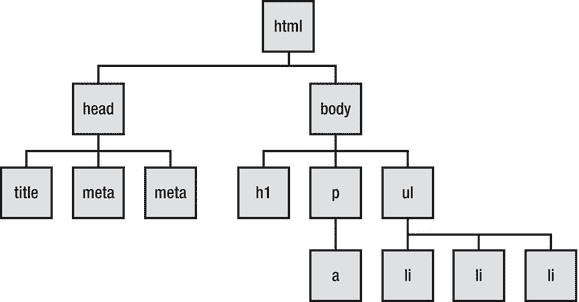
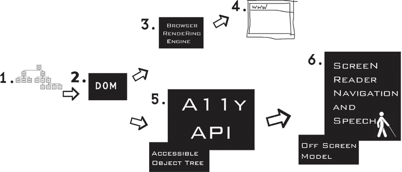
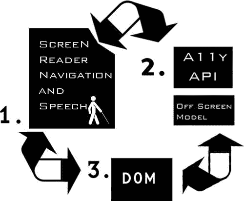
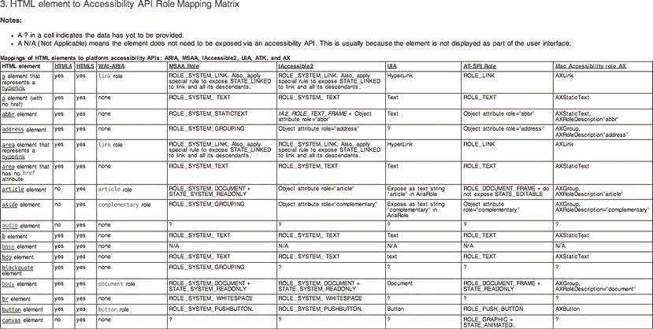

# 四、理解可访问性 API、屏幕阅读器和 DOM

在本章中，我们将更详细地考虑屏幕阅读器是如何工作的，并看看辅助技术(at)用来访问 web 内容的 DOM 和可访问性 API。理解这一点很重要。虽然有些东西看起来有点抽象或学术，这一章对你构建可访问的 HTML5 内容并不重要，但它会有所帮助。从设计上来说，它也很短。

 **注**如前所述，虽然屏幕阅读器不是残障人士访问网络的唯一技术，但它们无疑是最复杂的。此外，技术可访问性支持需求可能是最广泛的。

如果这一章看起来有点棘手，不要太担心；这不是一个容易的题目。我和残疾人一起工作了将近 10 年，当我作为一名 AT 专家工作时，我有着广泛的辅助技术经验。我很幸运地在现有的各种 AT 以及这些技术的无数应用中获得了大量的经验。

从这个经验来看，我可以诚实地说屏幕阅读器是最复杂的，无论是从可访问 web 内容的作者和 groovy 网站的设计者的角度来看，还是从用户的角度来看。屏幕阅读器熟练程度的范围或水平变化很大，从最基本的“页面周围的选项卡”或“点击全部，看看会发生什么”到虚拟光标的复杂使用、各种内容询问等等。像 VoiceOver 这样的屏幕阅读器的出现，及其对手势和转子的支持，使交互变得更加容易，我们将看到更多手势界面的趋势。然而，目前键盘交互模型过于复杂，用户要记住太多的自定义键盘组合。向移动设备的转移也将减少对键盘的依赖，并专注于更自然的输入形式，如手指滑动和其他手势。

我期待着这些技术的未来迭代，其中的技术调解了复杂性并简化了用户体验。我仍然从向屏幕阅读器用户展示如何用 AT 做新事情中获得快感，AT 用户的数字素养水平之低仍然令我惊讶。AT 用户有时抱怨一些网站或内容无法访问，而实际上障碍是用户无法正确使用他们的 AT。AT 的用户需要学习如何最大限度地使用他们的技术。这是一种双赢的方法，因为用户将从该技术中获得更长的寿命，而卫生服务提供商将获得更低的成本。此外，关注本章将帮助你更好地理解屏幕阅读器如何处理你写的代码。

 **注**辅助技术可能非常非常昂贵，实际上是小众技术。这导致了一种创造性的、自己动手的朋克摇滚文化，这种文化将富有想象力的技术应用融合在通常有限的可用资源中，为残疾人提供解决方案。

### 定义辅助技术下的元素

当你看到网络内容和 AT interaction 的具体细节时，事情就复杂了。这一章让你对各种平台可访问性 API 之间发生的事情有一个大概的了解，并看看动态 DOM 更新和正确应用语义来描述定制控件。

正如我提到的，我至少花了两到三年的时间来掌握屏幕阅读器的实际工作方式，从研究用户交互模型和熟悉 JAWS 击键到理解幕后发生的事情。这只是从屏幕阅读器的角度来看——不要管数据是如何在各种 API 之间转换的！所以，如果你在海上感到有点失落，也不用担心。这一章是我试图用一种我希望几年前有人为我做的方式向你解释事情。

#### 什么是 API？

一个 API 就是一个*应用编程接口*。这是一个框架或一组规则，提供用任何给定语言编程所需的代码、函数或词汇。API 可以被认为是一个代码库，你用它来告诉软件，比如浏览器或辅助技术，去做一些事情。

例如，浏览器将以 HTML5 编写的 web 内容转换为文档对象模型(DOM)。网页的这个 DOM 与浏览器使用的布局引擎相关联。然后，浏览器从布局引擎和 DOM 获取信息，以支持操作系统(OS)平台可访问性 API。该 API 允许辅助技术监控和查询浏览器向其公开的任何可访问性信息。

#### 什么是布局引擎？

布局引擎是每个浏览器中的嵌入式组件，它在浏览器中显示 HTML、XHTML、XML 或其他此类内容和格式信息，如级联样式表(CSS)。不同的浏览器有自己的渲染引擎，有自己的显示网页内容的规则。比如 Firefox 用 Gecko 引擎，Internet Explorer 用 Trident，Safari 和 Chrome 用 Webkit 渲染引擎，Opera 有自己的渲染引擎叫做 Presto。

#### 什么是可访问性 API？

辅助功能 API 是特定于平台的 API，可在桌面或浏览器中使用，以辅助技术可以理解的方式传达辅助功能信息。您将编写的 HTML5 代码包含标题、按钮、表单控件等元素。然后，这些元素中的每一个都有一个由可访问性 API 平台定义的角色、状态和属性集(以及与其余文档元素的父/子关系)。

以下是一些主要的可访问性 API:

*   断续器
*   UIAutomation
*   苹果无障碍 API
*   不可访问 2
*   AT-SPI

 **注意**还有其他可访问 API。例如，如果您正在编写一个 JAVA 应用，并且希望它是可访问的，那么您需要使用 JAVA 访问桥来提供可访问性映射。在 JAVA 中默认是不启用的。

### 荧幕外的模特(OSM)

在我们更详细地研究 API 本身之前，我们需要后退一点，讨论第一个易访问性模型:离屏模型，或 OSM。它的开发是为了让早期的屏幕阅读器和盲文输出设备能够访问可视桌面和第一个图形用户界面(GUI)。对屏幕外模型的了解将有助于您更广泛地理解这些相关技术是如何交互和表现的。

早期的基于 DOS 的系统，或者命令行界面系统，因为是基于文本的，所以很容易使用。用户输入到系统中的信息，以及系统返回的信息，可以很容易地在内存缓冲区中捕获并合成为语音。这种语音输出是通过使用我在第二章“理解残疾和辅助技术”中谈到的共振峰合成来实现的。文本字符串和数据等字符存储在缓冲区(或内存存储区)中，屏幕阅读器可以轻松地直接访问这些缓冲区，然后以语音形式输出给最终用户。

 **注**这种基本的语音输出被称为 TTS，或“文本到语音”合成。有各种各样的硬件和软件 TTS 引擎。

随着 GUI 的出现，这一切都改变了。然后，控制从通过命令行或基于文本的输入转移到分组为在屏幕上可视显示的相关可选控制(例如菜单和应用控制)，以便视力正常的人能够容易地理解。实际上，用户界面被转换成了屏幕上的图形像素，而不是更容易理解的文本。因此，不容易获得原文。因此，需要一种方法来访问来自绘图调用和窗口信息的信息，然后将这些信息转换为像素并存储在屏幕外数据模型中，以便屏幕阅读器可以访问和读取。让它工作是一个非常复杂的操作。为了处理这种复杂性，并提供一种屏幕阅读器以可访问的方式呈现屏幕内容的方法，开发并实现了离屏模型。这是使 GUI 可访问性所需要的一个缺失的环节。

 **注**关于一段非常有趣的屏幕阅读器历史，我推荐 Richard Schwerdtfeger 的论文《让 GUI 说话》，他是 IBM 辅助功能软件组的 CTO，也是著名的辅助功能专家。Rich 还与杰出的 Jim Thatcher 博士一起工作，他开发了第一个 DOS 屏幕阅读器和第一个基于 GUI 的 PC 屏幕阅读器。你可以在`ftp://service.boulder.ibm.com/sns/sr-os2/sr2doc/guitalk.txt`拿到这篇论文。

对于基于 GUI 的系统，离屏模型的工作方式是捕获关于要在屏幕上可视化呈现的控件的信息，然后创建一个单独的页面版本(离屏模型——因此得名)。然后，屏幕阅读器与这个 OSM 交互，并使用其内容作为输出最终用户可以理解的语音的基础。

您可以将离屏模型想象成任何给定时间的屏幕快照。正在发生的是一种被称为*屏幕抓取*或挂钩图形调用的技术。如今，对于桌面系统，操作系统提供了公开和检索这些信息的工具，但是是应用及其用户界面组件通过 API 公开这些信息。

现代编程语言允许使用对象和元素的描述，屏幕阅读器可以通过可访问性 API 锁定这些描述。然后，当用户通过键盘获得焦点时，屏幕阅读器将这些名称和属性作为语音输出给用户。正如我提到的，对于桌面应用来说，维护 OSM 的需求已经减少，但并没有完全消失，在开发人员忽略了标记控件的语义的情况下，它仍然是有用的。因此，OSM 可能仍然会发挥支持作用，为屏幕阅读器提供尽可能多的信息，从而促进更完整的用户体验。

对于一个操作系统来说，让它变得可访问肯定会带来特殊的挑战，但这些挑战或多或少都被克服了，因为操作系统通常设计良好，是一个更封闭的环境类型。这使得像屏幕阅读器这样的应用的设计变得更加容易，因为良好的编程实践，例如正确标记的控件等等，可以直接集成到操作系统中。那么，什么都可以去的*世界互联网*呢？

 **注**糊涂了？嗯，有点复杂，不用担心。简而言之，OSM 可以被认为是一个内部数据库，屏幕阅读器在内容呈现到屏幕之前访问它。作为一个有视力的人，你看着浏览器，得到一个页面内容和各种控件的图片，包括它们的功能等等。屏幕阅读器只是从与浏览器相同的来源获得这些信息，但它绕过了视觉呈现，使用代码来导航页面内容并将其输出为语音。

##### 屏幕阅读器如何访问网页或应用上的信息？

如今，并不是所有的屏幕阅读器都主要使用 OSM 来与网络交互。OSM 被视为过时的技术。此外，维护一个 OSM 在技术上很困难，对开发人员来说也是一个挑战。例如，当您第一次尝试自己测试网页时，您可能会发现很难理解屏幕阅读器是怎么回事。你会失去你在页面上的位置，或者发现在某些时候很难知道屏幕阅读器的焦点在哪里。(会发生的。)这有助于理解你首先不是直接与浏览器互动，而是与这个*第三位*互动。

 **注意**在与 Web 交互时，实际上“第三位置”是 DOM 和可访问性 API 输出的组合——以及一些屏幕阅读器的 OSM。当你第一次接触这些东西时，最初认为它们代表着同样的东西会有所帮助。它们并不相同，但实际上结合起来创造了“第三个位置”所以它作为一个抽象概念是有用的——这样你的脑袋就不会爆炸。

前面我们讨论了像 JAWS 这样的屏幕阅读器在与 Web 交互时使用的各种光标。电脑虚拟光标是 JAWS 用来浏览网页的主要工具。该虚拟光标实际上指向虚拟缓冲区中的内容数据库——实际上是 osm 和 API 调用组合的可用内容的缓存。屏幕上可视化内容的缓冲允许 at 用户浏览屏幕内容。因此，虚拟光标代表屏幕阅读器用户的*浏览点*，当视力正常的用户浏览网页时，它可能与焦点不匹配。

 **记住**视力正常的用户在浏览器中看到的只是 DOM 内容的可视化呈现，由 CSS 样式化。注意，这不适用于插件，如 Flash 内容或 Java 小程序，或者实际上，HTML5 `<canvas>` API。

为了让这个快照与辅助技术一起工作，或者为了让它被认为是可访问的，离屏模型需要被提供良好的语义代码，如前所述。这意味着对可访问性更敏感的开发人员已经以符合可访问性最佳实践的方式标记了页面标题、列表项、表单控件和图形。当您这样做时，OSM 的内容是结构化的，由良好的语义支持。因此，添加你的`<h1>`和`<li>`以及你的表单输入`<labels>`不仅仅是一个深奥的练习，而是创建一个可访问性架构的重要方式，该架构为辅助技术提供了一个用于导航和理解的结构。

您可能还记得我之前谈到过屏幕阅读器使用的表单模式。像 JAWS 这样的屏幕阅读器使用虚拟光标，这样用户可以通过按 H 键、G 键(对于图形)或 B 键(对于按钮)来导航标题，或者在页面上调出链接对话框。这是可能的，因为虚拟光标已经捕获了击键，将它们用作导航控件。那么当你想在网页上输入一些数据的时候呢？显然，您不能同时使用屏幕阅读器的这些导航功能。

 **记住**这就是为什么有像 JAWS 这样的屏幕阅读器的表单模式。在窗体模式下，屏幕阅读器从使用 PC 虚拟光标切换到直接与浏览器交互。这将禁用虚拟光标，并允许屏幕阅读器用户直接在表单中输入数据。

这种表单模式也给 web 开发人员带来了一定的挑战，因为当开发人员在表单模式下工作时，通过 PC 虚拟光标可以获得的重要数据可能不可用。这些丢失的数据可能是关于如何填写表单的说明等等。在表单模式下，应该注意表单验证和更新屏幕内容，这样屏幕阅读器用户就不会错过您需要给他们的指示或反馈，比如丢失输入数据等等。

简而言之，您已经看到了离屏模型的概述，以及 JAWS 等屏幕阅读器使用的一些光标。接下来，我们将查看 DOM，然后深入探讨启发式方法。

 **提示**记住有些屏幕阅读器根本不使用离屏模式。其中包括用于 Mac 的 VoiceOver 和用于 PC 的 NVDA，这是一款优秀的免费开源屏幕阅读器，可以与屏幕阅读器用户系统上现有的一些语音合成包一起使用，如 SAPI4 或 SAPI5。

### 什么是 DOM？

DOM 代表*文档对象模型*，以一种树的形式表示网页或其他类型文档的语义结构。如图图 4-1 所示，网页中的各种 HTML 元素组成了树上的叶子，叶子就是元素节点。

***图 4-1。**了解创建 DOM 的 HTML】*

图 4-1 所示的节点代表了浏览器或辅助技术将会看到的文档的各种结构部分。DOM 还可能提供关于节点的*状态*的信息。

正如您在图中看到的，您有一个 header，它包含文档的`<title>`，还有一个`<body>`，它包含一个作为标题的节点(`<h1>`)，一个作为段落的节点(`
`，它有一个作为`<a>`的子节点，还有一个作为无序列表的节点(`<ul>`，它有三个小小的`<li>`)。

 **注**在现实中，用户代理，可能是浏览器或某种辅助技术，在构建 web 文档的图片或模型时有几种选择。它可以直接与 DOM 交互，或者使用离屏模型，或者它可以通过平台可访问性 API 获得关于这些不同节点及其状态和属性的信息。我之前提到过一些可访问性 API，比如 MSAA、iAccessible2、苹果可访问性 API 等等。

##### 可访问性 API 是如何工作的？

可访问性 API 充当浏览器、DOM 和 AT 之间的网关或桥梁。为了让辅助技术能够理解 DOM 的内容，需要将这些内容映射到可访问性 API 中的相应角色。API 就像一个过滤器，帮助在任何给定的时间了解 DOM 中发生的事情。实际的 API 做的不止这些，因为它不是完全静态的。它可以促进用户界面组件和辅助技术之间的动态交互。

 **记住**对于辅助技术来说，可访问性 API 就像是操作系统和网络之间的桥梁。

一个 API，比如 MSAA 或者苹果的可访问性 API，允许屏幕阅读器用户知道一个项目何时有焦点以及它的名字是什么。如果该项是一个控件，API 会让屏幕阅读器知道它是什么类型的控件。如果它是一个类似复选框的交互控件，API 会指示它处于什么状态——例如，选中或未选中。

听起来熟悉吗？这是应该的——这正是 WAI-ARIA 的目标，它让您能够向没有任何固有语义的小部件添加这些描述性的名称、角色和状态属性。这也是原生 HTML 控件所做的——它们公开它们的名称、角色等等(在这个阶段，你应该明白了！)传递给可访问性 API，当用户通过键盘给出一个项目焦点时，该信息被传递给 AT。

图 4-2 给出了正在发生的事情的概述，并展示了 DOM 的内容是如何可视化地输出到屏幕和屏幕阅读器的。

 **注意**图 4-2 中的图表有点过于简化，但它的设计是为了概括核心 HTML 代码和屏幕阅读器输出的语音之间的交互。

***图 4-2。**可访问的 DOM 输出到屏幕和文本语音引擎*

以下是上图中项目的描述:

*   第 1 项:HTML 元素—这些元素构成了 DOM。
*   **第 2 项:DOM**—这是辅助技术和浏览器用来构建文档图片的基础，以用户要求的方式呈现给用户。请注意，可视浏览器和非可视屏幕阅读器可以使用同一个核心 HTML 文档。这是相当惊人的，表明普遍接入是一个技术现实。
*   第 3 项:浏览器渲染引擎—这用于确定 HTML 和 CSS 的组合在浏览器中的视觉呈现方式。
*   **第 4 项:浏览器**—这是一个可视的屏幕显示，由浏览器的渲染引擎将 DOM 和 CSS 声明的内容组合在一起。它通常是视力正常的人上网时使用的主要焦点。然而，如果用户看不见，他仍然需要能够访问相同的内容。在更易访问的网页中，页面以分层的方式在浏览器中可视化呈现，例如，根据 CSS 定义的声明、由不引人注目且逐渐增强的 JavaScript 定义的行为，以及提供对辅助技术至关重要的语义的 HTML 或 WAI-ARIA 代码。
*   **第 5 项:可访问对象树和可访问 API**—可访问对象树从 DOM 映射而来。这是可访问性 API 被实例化的地方。
*   **第 6 项:屏幕阅读器和离屏模式(OSM)**—OSM 由屏幕阅读器维护。这两者之间存在着持续的相互作用。随着 DOM 内容的更新，OSM 的内容也需要更新。屏幕阅读器驱动文本到语音(TTS)引擎，该引擎是诸如 Nuance、ViaVoice、DECTalk 或 Microsoft Speech 之类的应用。

这是屏幕阅读器导航和语音输出的初始模型。但这是全部情况吗？用户交互之类的呢？

图 4-3 提供了一个包含交互模型的更完整的图片，并显示了交互和 TTS 输出。(为了使事情更清楚，我从图中删除了可视化浏览器。)

***图 4-3。**互动和 TTS 输出——一个动态的、互动的循环*

以下是对图 4-3 中项目的描述:

*   **第 1 项:用户通过键盘和语音输出导航或与页面交互**—用户代理可能直接使用 DOM，也可能使用 OSM、可访问性 API 中实例化的可访问对象树和 DOM 数据的组合。因此，双向箭头描述了 DOM 中可以触发的事件，这些事件导致页面更新——特别是对于动态 web 内容。
*   **第 2 项:可访问性 API 和 OSM**—这些是通过 DOM 提供的，如前一项所述，屏幕阅读器可以直接与 DOM 交互，也可以与每隔几毫秒更新一次的可访问性 API/OSM 交互。
*   第 3 项:DOM—DOM 响应用户在浏览器中与 web 内容交互时触发的事件。

##### “无障碍”:电影，共同主演的“启发”

通常，屏幕阅读器需要额外的支持，以使最终用户更容易访问内容。为了做到这一点，屏幕阅读器使用了他们通过 DOM 获得的信息、可访问性 API(你刚刚见过的)和所谓的*试探法*的组合。这些评估帮助用户在几乎没有信息(例如无法访问的网页)的情况下构建更好的网页图片。

例如，如果一个网页的设计很糟糕，包含的可访问性信息很少(编码很差，等等)，那么就没有什么信息可以传递给屏幕阅读器。接下来发生的是，软件使用一种方法，试图通过猜测(当然是有根据的猜测)在给定的上下文中找到的某些内容可能是什么或很可能是什么来找到尽可能多的信息。这叫做*启发式评估*。该软件激活一套规则，试图找出什么是什么。该过程可以包括通过查看图像周围的内容来确定图像可能是什么，或者通过查看顶行中包含的第一个项目(可能是标题)来猜测文档中的表格标题可能是什么。这种依靠试探法进行修复的方法很脆弱，容易出错——因此，语义正确的代码很重要。

 **注意**术语“启发式”只是指“一套规则”

##### DOM 和动态内容的变化

离屏模型也可以认为是一个*虚拟缓冲区*。这个缓冲区是一个临时的内存存储，包含 DOM 在任何给定时间的快照。当这个页面没有变化时，这个快照是非常静态的，屏幕阅读器可以愉快地询问页面内容，用户不必太担心事情会发生变化。

 **注意**我不是指好警察/坏警察方式的“审问”，而是指严格意义上的用户与网页内容的互动。你可以把这种互动想象成如下的对话:

问:你是什么？答:我是一个复选框。
问:你是检查还是不检查？
我检查过了。

这不像一个好警察/坏警察的例行公事那样激动人心或富有戏剧性，但是你要做什么？

当页面内容动态变化并且缓冲区需要更新时，这种情况就明显不同了(如前所述)。几年前，当 AJAX 作为一种开发方法出现，异步内容更新成为规范时，这是一个明显的问题，这要归功于`XHR`对象。

 **注意** AJAX 开发人员将熟悉`XMLHttpRequest`或`XHR`对象，它们可以通过减少对服务器的调用来促进更多的客户端功能，并有助于创建更加动态和响应更快的 web 应用。

虽然客户端更新很棒，是一个真正的进步，但 AJAX 或 Web 2.0 应用中的动态内容更新对更注重可访问性的开发人员提出了挑战。开发人员如何让 AT 知道部分页面内容已经更新？如何以一种不引人注目的方式做到这一点？在 WAI-ARIA 出现之前，这非常棘手，因为虚拟缓冲区的更新必须是强制的，用户才能看到 DOM 中的任何变化。现在这已经不是什么大问题了，因为虚拟缓冲区每隔几毫秒就会自动更新一次，所以 DOM 的变化可以更可靠、更快速地传递给用户。

 **注意**对于一些关于这个问题的屏幕阅读器历史，如果你喜欢放松一点，我推荐以下 Gez Lemon 和 Steve Faulkner 在`[www.Juicystudio.com](http://www.Juicystudio.com)`发表的文章。Gez 和我也写了关于这个主题的文章，并在英国利兹的一次技术会议上提交了一篇论文，会议由大约五个人组成，我们是其中的两个人。所以这个主题确实有广泛的吸引力，哈哈！

欲了解更多信息，请访问 JuicyStudio 网站，查看`[`juicystudio.com/article/making-ajax-work-with-screen-readers.php`](http://juicystudio.com/article/making-ajax-work-with-screen-readers.php)`和`[`juicystudio.com/article/improving-ajax-applications-for-jaws-users.php`](http://juicystudio.com/article/improving-ajax-applications-for-jaws-users.php)`。

如果你正忙于一些脚本化的网页或应用，重要的是你要把它们开发成可访问的。这些事情是可能做到的，只是需要一些额外的关心和注意。

#### 常用辅助功能 API

以下部分描述了一些最常用的可访问性 API。这些可以在不同的平台上找到，比如 Windows、Mac 和 Linux。有些也是跨平台的。

##### 断续器

MSAA 是较老的老大哥 API，自 80 年代中后期以来一直在 Windows 平台上使用。有一个*可访问对象*，它是 MSAA 的核心，并且能够传递关于元素的角色、名称、状态和其他值的重要信息。

MSAA 通过向辅助技术对象发送有关程序元素的小块信息来传递信息。AT 帮助用户与应用交互所依赖的四个关键信息是元素的角色(控件做什么)、名称(它是什么)、值(它可以是数值或输入字段的值)和状态(是否选中复选框)。

 **注意** MSAA 的功能相当有限，不允许更复杂或高级的用户界面控制，它只能向 at 提供相对少量的属性信息。

##### 欢迎来到自动售货机！

随着 Windows Vista 和更新的 Windows 版本的出现，MSAA 本应被 UIAutomation 部分取代。UIAutomation 是一个更复杂、更高级的 API，具有更丰富的对象模型。这个想法是，它将扩大 MSAA 的能力，但改善其缺点。

UIAutomation 将有关用户界面组件的信息以树的形式显示给辅助技术，类似于将 DOM 树暴露给允许 AT 使用 web 内容的可访问性 API 的方式。与组件相关联的任何属性也通过 API 显示给 AT，以及系统事件等等。

该 API 涵盖了一些常见的控件类型，如下拉菜单、组合框、复选框和其他将为 at 交互做准备的控件，以及显示其支持 AT 的功能和交互类型的*控件模式*。这些控件类型代表不同的功能，并且可以组合起来创建复杂的交互模型和控件。

 **注意**在 MSAA 的介绍中，我说“部分替代”是因为它仍然被广泛用作平台可访问性 API，作为向 AT 公开信息的一种方式。然而，新的 API 在支持新的标记语言如 HTML5 和 WAI-ARIA 方面有很大的潜力。两种 API 都可以访问和共享 Web 和 OS 信息。

##### IAccessible 2

IAccessible COM 方法是 MSAA 的核心，它能够生成您反复遇到的非常重要的树结构。

 **记得**你开始看到一种模式了吗？它完全是关于文档树，以及树上暴露给 AT 的各种叶子或节点，以及这些节点所具有的任何属性、状态等等。这是 API 可访问性的核心。

虽然 UIAutomation 代表了一个飞跃，它有潜力丰富地描述用户界面组件及其值和状态，但 IAccessible2 是一个替代 API，它扩展了 MSAA 的功能，而不是打算取代它。从版本 3 开始，它就被内置到了像 Mozilla Firefox 这样的浏览器中，并在 JAWS、NVDA、ZoomText(一个流行的屏幕放大程序)、Window-Eyes 等浏览器中实现。

Firefox 浏览器对 IAccessible2 的支持是一个非常有趣的发展，因为 Firefox 成为了许多测试更高级辅助功能的人的首选浏览器，比如刚推出的 WAI-ARIA。因为 IAccessible2 构建于 MSAA 之上，所以与现有的 API 没有冲突，开发人员可以利用对当前角色、状态和属性的支持，通过 API 向 AT 公开重要的可访问性信息。

 **注意【UIAutomation 和 IAccessible2 都具有跨平台 API 的能力。例如，IAccessible2 也用于 Chrome 浏览器。**

##### 苹果无障碍 API

苹果公司开发了可访问的 API，在 OSX 和 IOS 上都可以使用。这个可访问性框架是苹果在 Mac OS X 10.2 中引入的，旨在适应较旧的 Carbon 和较新的 Cocoa 开发者框架。这件事做得相当巧妙。它使用一个*可访问性对象*,以统一的方式向 Carbon 和 Cocoa 应用传递关于它自己的信息(同样，它的名称、状态、角色属性等等),而不考虑开发它所使用的框架。这些可访问性对象和传递用户界面组件信息的统一方式消除了软件开发的复杂性，并减少了代码分叉等需求。

操作系统附带的标准控件已经非常容易访问。只有当你设计你自己的自定义控件时，你才必须非常小心，并为对象提供名称、角色和(你猜对了)属性。

代码和界面生成器应用使向自定义控件添加辅助功能信息变得容易。

这实际上与应用/软件有关。网络呢？

##### Webkit 可访问性

Webkit 是支持 Safari 浏览器和许多其他浏览器的渲染引擎。Safari 支持优秀的屏幕阅读器 VoiceOver。从可访问性的角度来看，VoiceOver 完全改变了游戏规则。它拥有优秀、先进的导航和交互功能，一个盲人电脑用户现在可以在众多苹果设备上使用同一个屏幕阅读器。

Safari 背后的 Webkit 引擎为它提供了对许多 HTML5 元素和功能的大量支持(我将在下一章中介绍)，如 HTML5 sectioning 元素、CSS3 web 字体、Web sockets、HTML5 表单验证、HTML5 音频和视频，以及隐藏字幕和臭名昭著的 2D JavaScript 渲染引擎 Canvas。(这个我以后再说。)

 **注**苹果有开源的 Webkit，现在是 Chrome 浏览器背后的渲染引擎，还有 ion 和 Android 浏览器等。尽管 Webkit 已经外包，但这并不意味着 VoiceOver 在其他浏览器上的表现会特别好。并没有。它与 Safari 紧密相连，但 Safari 也是一个很棒的浏览器，所以这是一个双赢的局面。

##### LINUX 可访问性 API

您应该知道的主要 Linux 可访问性 API 是 AT-SPI，即辅助技术服务提供者接口。这是由 GNOME 项目开发的。UBUNTU 使用这个 API，UBUNTU 是 Linux 的一个优秀版本，为 ORCA 等屏幕阅读器提供了高级别的开箱即用的可访问性支持。

 **注意**UBUNTU 操作系统还具有屏幕放大功能、修饰键(有点像 Windows 中的粘滞键)、语音识别支持和一个名为 Dasher 的有趣应用，它既不需要键盘也不需要鼠标，而是使用停顿功能和眼球跟踪器。它是完全免费的，所以非常值得一试。要查看更多内容并下载副本，请前往`[www.ubuntu.com](http://www.ubuntu.com)`。

#### HTML5 和可访问性 API

为了更好地了解 HTML5 如何映射到可访问性 API，我推荐由 Steve Faulkner(paci ello Group)和 Cynthia Shelly(微软)创建的文档。看起来可能有点抽象，但它可以让您很好地了解新 HTML5 元素的可访问性，因为它们需要映射到可访问性 API，以便 at 了解它们是什么、它们做什么以及如何与它们交互。

如文件所述:

> 所有特性和平台可访问性 API 之间没有一一对应的关系。当 HTML 角色、状态和属性不直接映射到可访问性 API，并且 API 中有一个方法来展示文本字符串时，通过该方法来展示未定义的角色、状态和属性。
> 
> IAccessible2 和 ATK 使用对象属性来暴露 API 中不直接支持的语义。对象属性是松散指定的名称-值对，对于在可访问性 API 中没有特定接口的地方公开内容非常灵活。例如，此时，HTML5 header 元素可以通过 object 属性公开，因为可访问性 API 没有这样的角色可用。
> 
> 对于本身没有对象属性的可访问性 API，找到一个类似的机制或者开发一个新的接口来公开名称/值对是很有用的。在 Mac OS X 可访问性协议下，所有的 getters 已经是简单的名称-值对，并且在任何需要的时候都可以公开新的语义。请记住，这还需要与辅助技术开发人员合作，以获得对新语义的支持。”

 **注意**概述 HTML5/API 映射的完整文本和详细表格可在`[`dev.w3.org/html5/html-api-map/overview.html`](http://dev.w3.org/html5/html-api-map/overview.html)`获得。

所以这些都是正在进行的工作。当您阅读本文时，各种 API 到 HTML5 的映射肯定会有所改进。

我在这里包含了一个矩阵的截屏(图 4-4 )，它概述了 HTML5 元素如何映射到可访问性 API，这样你就可以了解它是什么样子了。更多信息可以在刚刚显示的 URL 中找到。

***图 4-4。**html 5 和 API 映射的屏幕截图*

版权所有 2011 W3C(麻省理工学院，ERCIM，庆应大学)。保留所有权利。W3C 责任、商标和文档使用规则适用。

 **提示**如果你想找出任何 HTML5 或 ARIA 控件有什么样的作用，你可以使用几个工具来做到这一点，如 INSPECT32 (Win)或 ACC probe(Windows 上的 MSAA/IAccessible2)。当您关注浏览器中的小部件时，这些工具将让您看到它们如何映射到可访问性 API。

### 结论

在本章中，您学习了可访问性 API、DOM、屏幕阅读器如何通过可访问性 API 从 DOM 接收信息，以及旧的但仍在使用的离屏模型。在未来的章节中，我们将更多地使用易访问性 API 而不是 OSM。如前所述，屏幕阅读器不是 AT 现有的唯一部分，但它是最复杂的部分之一。在接下来的章节中，当我们继续更详细地研究 HTML5 时，我们在这一章中所涉及的领域肯定会对你更好地理解 at 是如何处理代码有很大的帮助。此外，我希望你能更好地理解为什么你有时可能需要提供一些额外的东西来支持旧的，例如，不使用更高级的 API。

好消息是这都是可行的，只要稍加注意，您就能够构建易于访问的 HTML5 应用，这些应用可以被支持它的新浏览器轻松使用，同时对那些不支持它的浏览器也很友好。