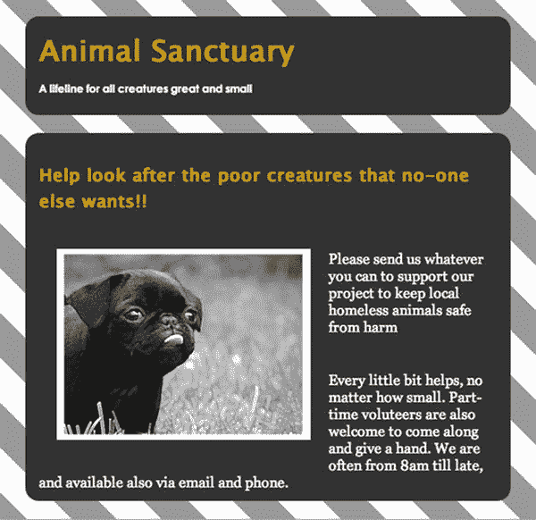

# 五、HTML5：文档标记的新语义和新方法

在这一章中，你将开始更详细地了解 HTML5 规范，尤其是与可访问接口的开发最相关的方面。有许多新的 API 进行后台客户端/服务器处理和数据存储，可以用于丰富、响应迅速的应用，但您将看到的主要是 HTML5 影响用户可访问性的方面。

您还将看到新的 HTML5 元素和用于定义文档轮廓和新的结构形式的语义。

### HTML5:有什么新消息？

HTML 的早期版本是相对简单的文档标记语言。它们允许文档被链接和引用，并为构建内容提供语义以支持小范围的浏览器和平台。这种多样的内容范围很广，从数据表到通过简单链接提供交互的内容(这实际上是 Web 的核心),再到表单控件，以及一些非常简单的媒体——实现了嵌入式图形。

但是真的是这样。这些项目构成了早期 HTML 标记语言能力的基础。聪明的人随后想出了压缩音频和视频的方法，比如使用 Flash、Silverlight、Maccies 的 QuickTime 或 PC heads 的 RealPlayer 等插件(以及这些插件的真正乐趣)。这些技术使得 Web 能够被用作像动画内容和视频这样的富媒体的平台。

 **注意**视频现在是真正的大生意，在美国网飞占所有网络流量的 22-35%(取决于你问的是谁)。因此，交付平台的性质非常重要。是的，网飞是首批采用 HTML5 向客户提供视频服务的公司之一。

HTML 的这些早期迭代被认为远远超出了职责的要求，因为 Web 已经远远超越了仅仅作为文档的页面，进入了应用空间等等。

好了，那么 HTML5 有什么新功能？相当多。以至于 HTML5 完全打破了仅仅是声明性文档标记语言的模式。HTML5 有许多新特性，涵盖了大量令人兴奋的新功能。在许多方面，它的大部分可能看起来不太像 HTML，事实上，这种语言远远超越了它的前辈。HTML5 确实是一项颠覆性的技术。

 **警告**对于任何新的或改变游戏规则的技术，你都必须小心谨慎，采用灵活的试错法。HTML5 的采用方式(至少在某种程度上)是该规范制定了解析规则，为浏览器制造商提供了一个构建浏览器的标准。浏览器内的支持通常是以零碎的方式提供的。随着规范的发展，浏览器供应商可能只实现其中的某些部分。

从可访问性的角度来看，最终结果是浏览器或辅助技术(at)供应商支持或不支持的内容似乎有点武断。例如，CSS2 在浏览器中得到广泛支持绝对需要几年时间。当它最终被支持时，它通常只得到部分支持，这导致了错误和故障(例如“盒子模型渲染不一致”)。在 AT 的世界里也有同样的特性。例如，< `table>`元素的`<scope>`属性使得在 HTML4 中创作更易访问的数据表比使用更受支持的`<headers>`和`for/id`方法要快得多。然而，对它的支持是如此之少，不幸的是，这种更简单的创作方法不能被依赖。

#### 新的 HTML5 语义

HTML 是一种很大程度上与意义相关联的语言。有些您已经熟悉的控件具有固有的行为(如通过键盘可点击或激活的链接等)，但这些行为是由用户代理(如浏览器)处理的。底层代码提供了一个基本结构，允许核心内容(通常是文本)被广泛的设备消费。这一内容层为“一次创作，发布到多种设备”的模式提供了实用的基础，该模式为电子通信提供了巨大的优势，实现了互操作性，而无需在过多的设备之间进行大量定制。

 **注意**html 5 规范对元素的使用非常严格。

当您想到语义对互操作性和可访问性的重要性时，前面的观察确实有意义。想想我们已经讨论过的关于结构化内容在支持可访问性架构和通过可访问性 API 向 at 传递可用信息方面的重要性。如果你的头还疼的话，我很抱歉，但这一切现在应该清楚一点了。

然而，HTML5 规范中非常明确的“正确的工具用于正确的工作”的规则在野外确实失效了。开发人员几乎只是做他们想做的事情，只要它对他们的目的“起作用”。同样值得注意的是，当涉及到可访问性时,“它看起来不错，很有效，只是不要在引擎盖下看得太近”的概念真的不成立。

这是因为只有当你做一些专家的可访问性审计或真人用户测试时，隐藏在引擎盖下的东西才可能暴露出来。我们将在第九章中更详细地讨论这个话题。

可以说，新规范给出的建议关注的是软件的互操作性，而不是它对最终用户的影响。事实上，该规范试图不定义用户体验，并且在某种程度上存在双重标准。为什么？因为规范的某些方面确实详细地描述了用户体验应该是什么样的。然而，当谈到可访问性时——通常情况下——这并没有明确的描述。

##### 语义忍者

同样值得注意的是，虽然我对一些开发人员对他们代码的态度有点厌烦(“对我来说似乎没问题，所以没问题”)，但如果开发人员拼凑的东西对残疾人有效的话，这实际上对我来说是没问题的。我想我对不适合残疾人和老年人的网络内容有特别的偏见。我之所以提到这一点，是因为对于可能使用 ATs 的残疾人来说，格式良好的代码、严格的验证，甚至语义正确性在积极的用户体验中排在第二、第三和第四位。

理想情况下，这些应该支持可访问性，并且在很多方面都支持——但不是在所有时间和所有情况下。如果良好的格式、验证和语义正确性是可访问性的铁一般的保证，那对所有人来说都是快乐的日子，但事实并非如此。所以不要绝对地思考；当涉及到 HTML5 和可访问性时，有许多相对的考虑。

所以当你读到这里的时候就很清楚了:我完全支持遵守规则，但前提是它们的工作方式不会破坏残疾人的用户体验——或者实际上没有残疾。我不太关心良好编码的规则，良好的格式，或者符合规范的规范大纲，或者你想叫它什么。话虽如此，我并不纵容草率的代码或以任何陈旧的方式设计代码；我只是承认，有时候你必须遵循自己的直觉或有洞察力的经验判断，而不仅仅是规范所规定的。

有些人自称了解可访问性，但实际上他们是规范狂热者，可能是验证吸血鬼。符合任何一种方法都不能保证可访问性、良好的可用性或积极的用户体验。所有这些开发工具真正能做的是表明开发人员在编写符合正式发布的语法的代码时知道她在做什么，但它们不一定在用户代理支持方面考虑用户体验，也不一定在浏览器或 at 上工作。唯一有助于开发人员理解实际情况的是用户测试或熟练使用屏幕阅读器的体验。在这一点上，开发人员自己的测试可能有助于发现什么时候工作或者不工作。这种知识非常重要，因为它基于用户体验的主观现实。

 **注意**好吧，其实格式良好的代码很重要。良好的语义非常重要，*但是*现实世界的可访问性非常微妙——特别是对于新的内容和元素类型。然而，请记住，一个未编码的&符号(它将抛出一个验证错误)*永远不会导致一个不可访问的网页。在网络文档上有一些标题结构，而不是没有，比仅仅确保标题以正确的方式排序要重要得多。*

##### 语义禁忌

处理新元素的 HTML5 规范的介绍部分警告不要使用不一致的内容和以不一致的方式使用一致的元素。建议您不要使用不一致的属性值(例子中为`"carpet"`)和不一致的属性(例子中为`"texture"`),这在 HTML5 中是不允许的。这些工具的用法如下所示:

`<label>Carpet: <input type="carpet" name="c" texture="deep pile" /></label>`

知道这一点当然很好——不是很有用，但是很好。然而，规范建议下面的代码示例更符合语义，因此可能是*有效的* HTML5:

`<label>Carpet: <input type="text" class="carpet" name="c" data-texture="deep pile" /></label>`

 **注意**我不是在拿地毯的例子开玩笑！可以在`[`dev.w3.org/html5/spec/Overview.html#elements`](http://dev.w3.org/html5/spec/Overview.html#elements)`上查看。

好吧，虽然这个例子一开始看起来有点傻，但它不是没有目的的。你可以从中看出语义变得更有意义了。`<input type="text" />`段是被赋予任意属性的标准输入(`class="carpet"`)。`data-texture="deep pile"`段会被不了解它的用户代理忽略，这是他们全部！

更严重的是，如果你有一个文档片段可以用来表示一个公司网站的标题，这也是不符合要求的，因为第二行不是一个小节的标题，而仅仅是一个副标题。你可能认为语义有点不确定，你是对的。然而，在早期版本的 HTML 中没有办法定义分组标题之间的关系。您可以看到以下不符合项:

`<body>
 <h1>ABC Company</h1>
 <h2>Leading the way in widget design since 1432</h2>
[…]`

HTML5 引入了一个`<hgroup>`元素来帮助定义一个标题在哪里可以有一个直接子标题，比如你在这里看到的:

`<body>
 <hgroup>
  <h1>ABC Company</h1>
  <h2>Leading the way in widget design since 1432</h2>
 </hgroup>
[…]`

当你有一个为你的网站或项目提供一个很酷的标语时，这种代码是很有用的。例如，如果您有一个动物收容所的网站，您可以使用以下代码:

`<hgroup>
  <h1>Animal Sanctuary</h1>
  <h2>A lifeline for all creatures great and small</h2>
 </hgroup>
 ...`

图 5-1 显示了一个页面中的清单 5-1 中的代码示例，以及加入一点层叠样式表(CSS)样式后的样子。

***清单 5-1。**使用<h 组>*

`body
{
   background-image:url(../img/gray_white_tile2.png);
}

#hg
{
   margin: 10px;
   padding: 10px;
   border-radius: 15px;
   background-color: #333;
   height: 80px;
   margin: 20px;
   padding: 15px;
}

h1
{
   font-family: Lucida Sans Unicode, Lucida Grande, sans-serif;
   color: #C90;
   background-color: #333;
   margin: 0;
   padding: 0;
   border-radius: 15px;
}

h2
{
   font-family: Century Gothic, sans-serif;
   color: #FFF;
   font-size: 50%;
}` 

***图 5-1。**利用新<组>举例*

 **注**前面的例子是一种新的文档布局方法的开始。这是一种更复杂的定义内容和轮廓的方式，在 HTML5 中使用了新的元素，比如`<section>, <article>, <header>, <footer>,`等等。HTML5 规范警告说，使用脚本会改变许多属性、文本的值，甚至整个文档的结构。您可以很容易地动态实现这一点，这样用户代理就必须更新文档的这些语义，以便正确地表示文档的当前状态。维护文档的语义完整性非常重要，这样互操作性和可访问性也可以得到适当的支持。该规范确实建议作者“尽可能使用声明性替代脚本，因为声明性机制通常更易于维护，并且许多用户禁用脚本。”这是个好建议。

#### html 5 中的全局属性

以下是可以添加到任何本机元素的常见属性:

*   `accesskey`
*   `class`
*   `contenteditable`
*   `contextmenu`
*   `dir`
*   `draggable`
*   `dropzone`
*   `hidden`
*   `id`
*   `lang`
*   `spellcheck`
*   `style`
*   `tabindex`
*   `title`

您以前见过一些这样的全局属性，例如`id`(一个元素的唯一标识符，可以用作 CSS 或 JavaScript 的钩子)`class`(与`id`相同，只是它可以在许多元素上重用)`title`(元素的咨询信息)`accesskey`(一种提供作者定义的快捷键的方式)`tabindex`(为元素提供连续的键盘焦点)`style`(添加 CSS)，等等。

 **注意**有了`accesskey`属性，作者就可以在他们的网页内容中添加快捷的快捷键。这似乎是一个好主意，除非你使用 AT——因为如果你这样做，这些击键已经做了一些事情！作为一名作者，我强烈建议您避免使用访问键，除非您可以找到一些保留键，这些键还没有被大部分 at 使用。顺便说一句，祝你好运。

有许多事件处理程序属性也可以添加到任何 HTML 元素中:

*   奥纳博特
*   onblur*
*   在线播放
*   在线播放
*   昂哥
*   单击事件
*   上下文菜单
*   oncuechange
*   ondblclick(点击鼠标)
*   忍无可忍
*   不可忍受
*   翁德拉贡特
*   软骨叶
*   昂格洛夫
*   ondragstart
*   羔羊
*   老化变化
*   一个提示
*   统一的
*   恐怖片*
*   onfocus*
*   推理能力
*   on 无效
*   叔叔家
*   有印刷机吗
*   onkeyup
*   加载*
*   onloadeddata
*   onloadedmetadata
*   onloadstart
*   鼠标点下时
*   鼠标移动
*   你真大胆
*   鼠标悬停
*   是 mouseup
*   鼠标滚轮
*   ONP 原因
*   蒙皮
*   播放中
*   onprogress
*   最新变化
*   无期
*   onscroll*
*   被发现
*   观察
*   onselect
*   昂什
*   安装
*   昂松宾
*   暂停
*   按时更新
*   on volume exchange
*   等待中

 **注意**前面标有星号的事件处理程序可能会改变含义，这取决于它们使用的上下文——在本例中，如果它们用在`<body>`元素或窗口对象上。

##### 再来点咏叹调吗，先生？

该规范还建议，对于可能需要比当前 HTML5 规范所能提供的更多细节的辅助技术产品，可以为辅助技术产品指定一组注释(ARIA 角色和 aria-*属性)。

我们在前面的章节中已经介绍了 ARIA 的很多内容，但是这里有必要概述一下 ARIA 和 HTML5 是如何一起工作的，因为它们都有本地语义。

这里有一个启发性的引用，直接取自 HTML5 规范:

> *"下表定义了适用于 HTML 元素的强本机语义和相应的默认隐式 ARIA 语义。第一列中的每个 HTML 语言特性(元素或属性)暗示了同一行第二列的单元格中给出的 ARIA 语义(角色、状态和/或属性)。当多个行应用于一个元素时，必须应用定义角色的最后一行中的角色，并且必须组合所有行中的状态和属性。以下是这一工作方式的详细列表。”1*

表 5-1 概述了强本地语义及其相应的默认隐式 ARIA 语义。

__________

1

 **注意**在 ARIA 被添加到原生 HTML5 元素的情况下，一般来说，添加的 ARIA 语义将胜过 HTML 并覆盖默认语义。然而，在某些情况下，这不会发生，并且有一些限制适用。还要注意的是，任何元素都可以被赋予表现角色，不管表 5-2 中显示的限制。

版权所有 2011 W3C (MIT、ERCIM、Keio)，

其中一些看起来相当复杂和粗糙，乍一看确实如此。然而，最好了解 HTML5 和 WAI-ARIA 等新增语言之间的语义相互作用。正如您之前看到的，这两者有许多相似之处。

##### 内容模型

新的 HTML5 元素的定义方式包括以下信息:

*   元素所属的类别
*   可以在其中使用元素的上下文
*   内容模型概述了应该包含的元素的子元素
*   元素应该实现的 DOM 接口

 **注意**属性可以有任何字符串值，包括空字符串。有一些限制，但这些一般规则适用。

内容模型概述了元素应该包含的内容。仔细想想，这是有意义的，因为它有助于清晰地勾勒出内容应该如何表现，以及浏览器在遇到某些项目时应该做什么。当您考虑嵌套项应该如何表现时，这也变得更加相关。通常，元素的使用必须遵循其内容模型。

 **注意**当处理强语义和弱语义，或者在某些上下文中“什么胜过什么”的决定时，这可能会有点模糊，比如你可以在表 5-1 和表 5-2 中看到的那些。我提到了对元素进行分组的 HTML 内容的类别，下面是它们的列表:

元数据内容

流动内容

切片内容

标题内容

语法内容

嵌入内容

互动内容

规范中有一个很好的交互式 SVG 图，直观地展示了这些类别之间的关系。更多信息，请访问`[`dev.w3.org/html5/spec/Overview.html#kinds-of-content`](http://dev.w3.org/html5/spec/Overview.html#kinds-of-content)`。

##### 元数据内容

元数据内容是概述页面内容的行为或表示的内容。您将习惯使用的是典型的元数据内容，如 JavaScript 和/或 CSS，使用以下元素:

*   <命令>
*   <link>

*   <noscript></li> <li><script/></li> <li><style/></li> <li></li> </ul> 
元数据内容还可以提供关于文档如何相互关联的信息。
 
 <b>注意</b> <code>noscript</code>仍然是有效的 HTML5 内容。对于出于某种原因没有 JavaScript 可用的用户来说，这是一种不够优雅的呈现内容的方式。
 <h5 class="h5">流动内容</h5> 
这些是 HTML 文档主体中使用的主要元素。有相当多的，你会认识其中的大部分:
 <ul> <li><code>&lt;a&gt;</code></li> <li><code>&lt;abbr&gt;</code></li> <li><code>&lt;address&gt;</code></li> <li><code>&lt;area&gt;</code>(如果是<code>map</code>元素的后代)</li> <li><code>&lt;article&gt;</code></li> <li><code>&lt;aside&gt;</code></li> <li><code>&lt;audio&gt;</code></li> <li><code>&lt;b&gt;</code></li> <li><code>&lt;bdi&gt;</code></li> <li><code>&lt;bdo&gt;</code></li> <li><code>&lt;blockquote&gt;</code></li> <li><code>&lt;br&gt;</code></li> <li><code>&lt;button&gt;</code></li> <li><code>&lt;canvas&gt;</code></li> <li><code>&lt;cite&gt;</code></li> <li> <code>&lt;code&gt;</code></li> <li><code>&lt;command&gt;</code></li> <li><code>&lt;data&gt;</code></li> <li><code>&lt;datalist&gt;</code></li> <li><code>&lt;del&gt;</code></li> <li><code>&lt;details&gt;</code></li> <li><code>&lt;dfn&gt;</code></li> <li><code>&lt;div&gt;</code></li> <li><code>&lt;dl&gt;</code></li> <li><code>&lt;em&gt;</code></li> <li><code>&lt;embed&gt;</code></li> <li><code>&lt;fieldset&gt;</code></li> <li><code>&lt;figure&gt;</code></li> <li><code>&lt;footer&gt;</code></li> <li><code>&lt;form&gt;</code></li> <li><code>&lt;h1&gt;</code></li> <li><code>&lt;h2&gt;</code></li> <li><code>&lt;h3&gt;</code></li> <li><code>&lt;h4&gt;</code></li> <li><code>&lt;h5&gt;</code></li> <li><code>&lt;h6&gt;</code></li> <li><code>&lt;header&gt;</code></li> <li><code>&lt;hgroup&gt;</code></li> <li><code>&lt;hr&gt;</code></li> <li><code>&lt;i&gt;</code></li> <li><code>&lt;iframe&gt;</code></li> <li><code>&lt;img&gt;</code></li> <li><code>&lt;input&gt;</code></li> <li><code>&lt;ins&gt;</code></li> <li><code>&lt;kbd&gt;</code></li> <li> <code>&lt;keygen&gt;</code></li> <li><code>&lt;label&gt;</code></li> <li><code>&lt;map&gt;</code></li> <li><code>&lt;mark&gt;</code></li> <li><code>&lt;math&gt;</code></li> <li><code>&lt;menu&gt;</code></li> <li><code>&lt;meter&gt;</code></li> <li><code>&lt;nav&gt;</code></li> <li><code>&lt;noscript&gt;</code></li> <li><code>&lt;object&gt;</code></li> <li><code>&lt;ol&gt;</code></li> <li><code>&lt;output&gt;</code></li> <li><code>&lt;p&gt;</code></li> <li><code>&lt;pre&gt;</code></li> <li><code>&lt;progress&gt;</code></li> <li><code>&lt;q&gt;</code></li> <li><code>&lt;ruby&gt;</code></li> <li><code>&lt;s&gt;</code></li> <li><code>&lt;samp&gt;</code></li> <li><code>&lt;script&gt;</code></li> <li><code>&lt;section&gt;</code></li> <li><code>&lt;select&gt;</code></li> <li><code>&lt;small&gt;</code></li> <li><code>&lt;span&gt;</code></li> <li><code>&lt;strong&gt;</code></li> <li><code>&lt;style&gt;</code>(如果<code>scoped</code>属性存在)</li> <li><code>&lt;sub&gt;</code></li> <li><code>&lt;sup&gt;</code></li> <li><code>&lt;svg&gt;</code></li> <li><code>&lt;table&gt;</code></li> <li> <code>&lt;textarea&gt;</code></li> <li><code>&lt;u&gt;</code></li> <li><code>&lt;ul&gt;</code></li> <li><code>&lt;var&gt;</code></li> <li><code>&lt;video&gt;</code></li> <li><code>&lt;wbr&gt;</code></li> <li><code>&lt;text&gt;</code></li> </ul> <h5 class="h5">切片内容</h5> 
这是相关的内容，可以组合在一起。以下新元素可用于定义主题分组内容的新部分:
 <ul> <li></li> <li></li> <li><nav/></li> <li><section/></li> </ul> <h5 class="h5">标题内容</h5> 
这种类型的内容用于定义文档的标题，这些标题通常用于构建页面内容。这里有一些常见的疑点，我们将在本章的后面重新讨论:
 <ul> <li><h1/></li> <li><h2/></li> <li><h3/></li> <li><h4/></li> <li><h5/></li> <li><h6/></li> <li><hgroup/></li> </ul> 
你将会熟悉这些标题和它们在你以前的网络项目中的用法。它们对于创建可访问的内容是无价的。&lt;<code>hgroup&gt;</code>元素是块中的新成员。
 <h5 class="h5">语法内容</h5> 
这是文档中文本的主体和用于标记该内容的内联元素:
 <ul> <li>&lt;&gt;(如果只包含语法内容)</li> <li><abbr area="">(如果是<code>map</code>元素的后代)</abbr></li> <li></li> <li><b/></li> <li><bdi/></li> <li><bdo/></li> <li> </li> <li><button/></li> <li><canvas/></li> <li><cite/></li> <li><code/></li> <li><command/></li> <li><data/></li> <li><datalist/></li> <li><del>(如果只包含语法内容)</del></li> <li><dfn/></li> <li><em/></li> <li><embed/></li> <li><i/></li> <li><iframe/></li> <li></li> <li><input/></li> <li><ins>(如果只包含语法内容)</ins></li> <li><kbd/></li> <li><keygen/></li> <li><label/></li> <li><map>(如果只包含语法内容)</map></li> <li><mark/></li> <li><math/></li> <li><meter/></li> <li><noscript/></li> <li> &lt;对象&gt;</li> <li><output/></li> <li><progress/></li> <li><q/></li> <li><ruby/></li> <li><s/></li> <li><samp/></li> <li><script/></li> <li><select/></li> <li><small/></li> <li></li> <li><strong/></li> <li></li> <li></li> <li><svg/></li> <li><textarea/></li> <li><u/></li> <li><var/></li> <li><video/></li> <li><wbr/></li> <li><text/></li> </ul> 
一般来说，规范规定允许对内容进行语法分析的元素需要有某种嵌入的内容，或者称为<i>元素间空白</i>。术语“元素间空白”听起来像是属于量子物理学或弦理论，但它的全部含义是“空白空间”或“空文本节点”。
 
一般来说，被 HTML5 规范归类为<i>语法内容</i>的内容应该只包含其他语法内容。这在很大程度上定义了如何创建有效的内容。
 
 <b>注意</b>你可能已经注意到一些措辞内容也是流动内容(实际上相当多)。这种重叠应该会使您在混合和匹配时更容易避免验证错误。
 <h5 class="h5">嵌入内容</h5> 
这是嵌入的内容，或者说<i>将另一个资源</i>导入到文档中:
 <ul> <li></li> <li><canvas/></li> <li><embed/></li> <li><iframe/></li> <li></li> <li><math/></li> <li><object/></li> <li><svg/></li> <li><video/></li> </ul> 
其中一些元素被设计为具有<i>后备内容</i>——当浏览器或其他用户代理(如屏幕阅读器)不支持任何前述元素时，功能替代或等效的内容。例如，在撰写本文时，<code>&lt;canvas&gt;</code>的可访问性意味着你必须考虑屏幕阅读器的用户将如何体验你的内容。(注意<code>&lt;canvas&gt;</code>目前对于屏幕放大用户来说也是个问题，因为目前没有办法将画布的焦点暴露给屏幕放大器。)
 
以下代码片段说明了&lt;<code>canvas&gt;</code>元素的回退内容:
 <code>&lt;html&gt;  &lt;canvas id=”Groovy_anim_with_fallback” width=”300” height=”150”&gt;  &lt;p&gt; Some fallback instruction for the user..or links to other more accessible resources&lt;/p&gt;  &lt;/canvas&gt;  &lt;/html&gt;</code> 
旧的浏览器或用户代理会忽略<code>&lt;canvas&gt;</code>，因为它不理解它；但是，它将能够解析包含在。理解&lt; <code>canvas&gt;</code>元素的用户代理将只是渲染它，而忽略嵌入的内容。
 
 <b>注意</b>你可以使用一些条件函数比如<code>if()</code>，里面包含了你的<code>&lt;canvas&gt;</code>绘制方法。如果不支持，可以显示图像。
 <code>&lt;html&gt;  &lt;canvas id="Groovy_anim_with_fallback" width="300" height="150"&gt;  &lt;h1&gt;Oops..your browser won’t show our groovy Canvas Animation&lt;/h1&gt;  &lt;img scr="myserver/usful_andgroovy_image.png" alt="Visit the ‘overview’ section of the website which has a more accessible content"&gt;  &lt;/canvas&gt;  &lt;/html&gt;</code> 
在前面的例子中，我没有向屏幕阅读器用户描述一个 groovy 图形，而是给图像提供了一些有用的说明。这可能不是完全有效的 HTML，但它提供了一些有用的东西，对我来说更重要。
 
如果图像纯粹是装饰性的，并且嵌入的内容标题足以告诉用户她可以做什么来访问更易访问的内容版本，或者这只是一个提醒，她可以忽略它，那么给图像一个空的<code>alt</code>值(<code>alt=""</code>)将导致图像被视为表示性的，并被大多数屏幕阅读器忽略。
 
你也可以给画布一个表现性的咏叹调角色，如下所示:
 <code>&lt;html&gt;  &lt;canvas id="Groovy_anim_with_fallback" width="300" height="150"role='presentational'&gt;  &lt;h1&gt;Oops..your browser won’t show our groovy Canvas Animation&lt;/h1&gt;  &lt;img scr="myserver/usful_andgroovy_image.png" alt="Visit the ‘overview’ section of the website which has a more accessible content"&gt;  &lt;/canvas&gt;  &lt;/html&gt;</code> 
使用<code>role="presentational"</code>应该对支持 ARIA 的新屏幕阅读器隐藏画布。
 
我们将在后面的章节中讨论<code>&lt;canvas&gt;</code>。应该如何处理回退内容应该在元素的定义中概述。然而，我觉得这是不够明确的方面应该是什么回退。理想情况下，回退内容是一种功能替代，或者有时只是提醒用户某些东西可能不起作用。实际上，回退实现也可能会破坏用户体验。没有人想回到“你没有一个很棒的浏览器——你怎么敢！”类型的消息，但是不清楚应该如何回退，开发人员该怎么办呢？规范非常清楚，例如，在有更合适的具有内在语义的 HTML5 设计模式的地方，不应该使用<code>&lt;canvas&gt;</code>内容。然而，我们都知道这个世界并不是这样的，?? 街为事物找到了自己的用途。
 
在一个理想的世界里，像<code>&lt;canvas&gt;</code>这样的东西将会在黄金时间准备好，有一个完全可访问的架构——它不是。
 
 <b>注意</b><code>&lt;canvas&gt;</code>准备的主要是视觉用户，但它仍然会给屏幕放大用户带来挑战，因为屏幕放大器目前没有办法跟上<code>&lt;canvas&gt;</code>内容的关键变化。
 <h5 class="h5">互动内容</h5> 
这是供用户交互的内容:
 <ul> <li><code>&lt;a&gt;</code><ul style="list-style-type:disc"> <li><code>&lt;audio&gt;</code>(如果<code>controls</code>属性存在)</li> </ul></li> <li><code>&lt;button&gt;</code></li> <li><code>&lt;details&gt;</code></li> <li><code>&lt;embed&gt;</code></li> <li> <code>&lt;iframe&gt;</code></li> <li><code>&lt;img&gt;</code>(如果<code>usemap</code>属性存在)</li> <li><code>&lt;input&gt;</code>(如果<code>type</code>属性不处于隐藏状态)</li> <li><code>&lt;keygen&gt;</code></li> <li><code>&lt;label&gt;</code></li> <li><code>&lt;menu&gt;</code>(如果<code>type</code>属性处于工具栏状态)</li> <li><code>&lt;object&gt;</code>(如果<code>usemap</code>属性存在)</li> <li><code>&lt;select&gt;</code></li> <li><code>&lt;textarea&gt;</code></li> <li><code>&lt;video&gt;</code>(如果<code>controls</code>属性存在)</li> </ul> 
前面的 HTML 元素列表代表了构建既定的用户交互设计模式的框架。这些控件有固有的激活行为来触发特定的事件。
 
 <b>注意</b>规范还概述了流内容和措辞内容应该包含<i>可触知的内容</i>。这实际上意味着“最终用户可以感知并且不隐藏的东西。”
 <h5 class="h5">段落</h5> 
&lt;<code>p&gt;</code>元素是您非常熟悉的元素。它代表内容的措辞。也就是“一段文字，包含一个或多个讨论特定主题的句子。”
 
一些较老的元素如<code>&lt;ins&gt;</code>和<code>&lt;del&gt;</code>仍然是 HTML5 的一部分。您可能不常使用它们，但是它们对于分别显示插入段落或从段落中删除的内容非常有用。以下示例详细说明了它们的用法:
 <code>&lt;section&gt;    &lt;h1&gt;Example of paragraphs using &lt;pre&gt;ins&lt;/pre&gt; and &lt;pre&gt;del&lt;/pre&gt;&lt;/h1&gt;  &lt;p&gt;This is a chunk of content that was &lt;del&gt;deleted&lt;/del&gt; &lt;ins&gt;and then updated&lt;/ins&gt;.&lt;/p&gt;    &lt;p&gt;This is another paragraph where nothing was inserted or deleted.&lt;/p&gt;  &lt;/section&gt;</code> 
新的是如何将<code>&lt;paragraph&gt;</code>元素与一些新的 HTML5 sectioning 元素一起使用，比如<code>&lt;aside&gt;</code>、<code>&lt;section&gt;</code>等等。
 <h5 class="h5">HTML 文档元数据</h5> 
HTML5 有以下提供文档元数据的元素，通常位于 HTML 文件的头部。
 <h6 class="h6">&lt;头&gt;元素</h6> 
这为文档提供了一些简单的元数据。它可以采取以下一般形式:
 <code>&lt;!DOCTYPE HTML&gt;  &lt;html&gt;   &lt;head&gt;    &lt;title&gt;What kinda of page am I?&lt;/title&gt;   &lt;/head&gt;   &lt;body&gt;</code> 
好的，到目前为止还不错。没什么新东西。以下元素对于屏幕阅读器的可访问性非常重要，所以请注意！
 <h6 class="h6"><title>元素</title></h6> 
HTML5 中的<code>&lt;title&gt;</code>元素并没有什么新内容，它的目的是向用户代理显示文档的标题或名称。该规范建议:
 <blockquote> 
作者应该使用能够识别他们文档的标题，即使这些标题是在脱离上下文的情况下使用的，例如在用户的历史记录、书签或者搜索结果中<a href="#CHP-5-FN-2">2</a>
 </blockquote> 
这是一个非常好的建议，不仅仅是因为它可以作为一种在书签菜单中识别页面内容的方式(尽管这很棒)。这也是因为当 HTML 文档加载时，<code>&lt;title&gt;</code>元素是屏幕阅读器读取的第一项。这使得它成为一条非常重要的信息，可以帮助屏幕阅读器用户知道他们在网站中的位置。
 
你可以从<a href="#fig_5_2">图 5-2 </a>中看到<code>&lt;title&gt;</code>元素是如何向用户展示网站身份的。
 
__________
 
2
  
 <i> <b>图 5-2。</b>使用动物避难所&lt;称号&gt;元素</i>
 <h6 class="h6">一些更基本的聪明</h6> 
巧妙使用&lt;<code>title&gt;</code>元素有助于引导用户完成一个过程，比如使用在线购物功能购物。例如，假设整个购买过程有三个或四个阶段。在这种情况下，您应该使用&lt; <code>title&gt;</code>元素向用户强调他在任何给定时间处于哪个阶段。您可以通过“选择您的产品”、“输入送货地址”和“输入您的信用卡信息”等提示来完成此操作
 
对于每个页面，<code>&lt;header&gt;</code>可能看起来有点像清单 5-2 中的代码示例。
 
<i> <b>清单 5-2。</b>使用&lt;标题&gt;元素</i>
 <code>Stage 1:  &lt;!DOCTYPE HTML&gt;  &lt;html&gt;   &lt;head&gt;    &lt;title&gt;Select your product&lt;/title&gt;   &lt;/head&gt; </code> <code> &lt;body&gt;    Stage 2:  &lt;!DOCTYPE HTML&gt;  &lt;html&gt;   &lt;head&gt;    &lt;title&gt;Enter a Shipping Address&lt;/title&gt;   &lt;/head&gt;   &lt;body&gt;    Stage 3:  &lt;!DOCTYPE HTML&gt;  &lt;html&gt;   &lt;head&gt;    &lt;title&gt;Enter your Credit Card Information&lt;/title&gt;   &lt;/head&gt;   &lt;body&gt;</code> 
随后的页面内容在每个步骤中都支持用户，并且它显然允许用户完成交易。所以<code>&lt;title&gt;</code>元素对所有用户都非常有用，因为它出现在浏览器的标题和标签名称中(在 Safari 中)。参见<a href="#fig_5_3">图 5-3 </a>。
  
<i> <b>图 5-3。</b>Safari 中如何显示&lt;标题&gt;元素</i>
 <h6 class="h6"><base/>元素</h6> 
这是一个用来定义所谓的<i>文档库 URL </i>的元素。你为什么想这么做？我听到你问，“URL 不是相对于 HTML 文档根或 index.html 文件定义的吗？”好问题，的确如此。如果您有一个包含相关文档集合的网站子部分，为了更好的 SEO，您可能希望为当前文档提供更多的上下文。它是一个 void 元素，所以它不接受任何类型的内容，它位于文档的头部。此外，在 HTML5 中，你现在可以添加一个<i>目标</i>属性到基本 URL，这在 HTML 的早期版本中是做不到的。<a href="#list_5_3">清单 5-3 </a>详细说明了<code>&lt;base&gt;</code>元素的使用。
 
<i> <b>清单 5-3。</b>使用&lt;底座&gt;元素</i>
 <code>&lt;!DOCTYPE HTML&gt;  &lt;html&gt;      &lt;head&gt;          &lt;title&gt;&amp;lt;Base&amp;gt; element sample&lt;/title&gt;          &lt;base href=http://www.mysiteandsubsite.com/repository/index.html /&gt;      &lt;/head&gt;      &lt;body&gt;          &lt;p&gt;Visit the &lt;a href="collectionoflinks.html"&gt;Here is a collection of interesting  documents&lt;/a&gt;.&lt;/p&gt;          &lt;p&gt;Visit the &lt;a href="collectionofworddocuments.html"&gt;Here is a collection of  interesting Word documents&lt;/a&gt;.&lt;/p&gt; </code> <code>        &lt;p&gt;Visit the &lt;a href="collectionofimages.html"&gt;Here is a collection of interesting  images&lt;/a&gt;.&lt;/p&gt;      &lt;/body&gt;  &lt;/html&gt; <a href="#CHP-5-FN-3">3</a></code> <h6 class="h6"><link/>元素</h6> 
&lt;<code>link&gt;</code>元素是有用的头部元数据，它帮助您定义保存脚本和 CSS 的位置。它还用于指示 HTML 文档头中的其他资源。一个&lt; <code>link&gt;</code>元素必须有一个<code>rel</code>属性，如下面的代码片段所示:
 <code>&lt;head&gt;  &lt;link rel="stylesheet" type="text/css" href="generalstyle.css" /&gt;  &lt;/head&gt;</code> 
 <b>注意</b>当<code>&lt;link&gt;</code>元素有一个<code>rel</code>属性时，它适用于整个文档。然而，当它用在&lt; <code>a&gt;</code>或&lt; <code>area&gt;</code>元素上时，它指的是一个链接，其中上下文由它在文档中的位置给出。
 
有多种内容属性与<code>&lt;link&gt;</code>元素相关联:
 <ul> <li>超链接</li> <li>能量损耗率</li> <li>媒体</li> <li>元首万岁</li> <li>类型</li> <li>大小</li> </ul> 
<code>title</code>属性也是这个列表的成员。<code>href</code>属性是你所熟悉的，我们刚刚谈到了<code>rel</code>属性。<code>type</code>属性与<code>icon</code>关键字一起使用来链接元素，以便创建一个外部资源链接。图标可以是听觉图标、视觉图标等等。如前所述，<code>sizes</code>属性给出了图标的大小。<code>hreflang</code>可以用来提供链接资源的语言。
 
__________
 
 3 所有这些链接都将解析为“<code><a href="http://www.mysiteandsubsite.com/repository">www.mysiteandsubsite.com/repository</a></code>”
 
  <b>注意</b>如果你想让屏幕阅读器发现文档中语言的变化，你最好使用<code>lang</code>属性。一般来说，文档的语言可以分别由用于英语的<code>lang="en"</code>、用于法语的<code>lang="fr"</code>或用于德语的<code>lang="de"</code>提供。我在罗杰·约翰逊的网站(优秀的<code><a href="http://www.456bereastreet.com">www.456bereastreet.com</a></code>)上的<a href="#list_5_4">清单 5-4 </a>中找到了这个例子，他是从维基百科得到的。清单使用了<code>lang</code>属性，并将它们附加到一个<code>&lt;div&gt;</code>元素上。当屏幕阅读器遇到这些属性时，它们会切换合成模块，以便正确地输出语言。
 
<i> <b>清单 5-4。</b>使用 Lang 属性</i>
 <code>&lt;div lang="sv"&gt;      &lt;h2&gt;Svenska&lt;/h2&gt;      &lt;p&gt;Välkommen till Wikipedia, den fria encyklopedin som alla kan redigera.&lt;/p&gt;  &lt;/div&gt;    &lt;div lang="de"&gt;      &lt;h2&gt;Deutsch&lt;/h2&gt;      &lt;p&gt;Wikipedia ist ein Projekt zum Aufbau einer Enzyklopädie aus freien Inhalten in allen  Sprachen der Welt.&lt;/p&gt;  &lt;/div&gt;    &lt;div lang="fr"&gt;      &lt;h2&gt;Français&lt;/h2&gt;      &lt;p&gt;Bienvenue sur Wikipédia, le projet d’encyclopédie libre que vous pouvez améliorer.&lt;/p&gt;  &lt;/div&gt;    &lt;div lang="es"&gt;      &lt;h2&gt;Español&lt;/h2&gt;      &lt;p&gt;Bienvenidos a Wikipedia, la enciclopedia de contenido libre que todos pueden  editar.&lt;/p&gt;  &lt;/div&gt;</code> 
属性给屏幕阅读器的提示，使它能够转换到一个合适的模式，以一种适合自然韵律等的方式输出语言，当然有助于易读性。这也意味着屏幕阅读器说话不像游客。
 
<code>media</code>属性通常为空，这意味着文档中的链接适用于所有不同类型的媒体。<code>type</code>属性很重要，因为它可以用来表示各种内容的 MIME 或内容类型，包括富媒体或 HTML 文档。例如，选择正确的 MIME 类型将决定如何解析您的内容。<code>title</code>属性为用户代理提供了额外的咨询信息，除了当它被用来定义可选的样式表时。
 
为了定义可选的样式表，你可以编写类似于清单 5-5 中所示的代码。
 
 <i> <b>清单 5-5。</b>替代样式表的使用</i>
 <code>&lt;!—if you need to define a persistent style sheet-&gt;  &lt;link rel="stylesheet" href="main.css" /&gt;    &lt;!—if you have an alternate style sheet-&gt;  &lt;link rel="stylesheet" href="main_pref.css" title="More accessible styles" /&gt;    &lt;!-- some alternate style sheets-&gt;  &lt;link rel="alternate stylesheet" href="b_w_y.css" title="Black White and Yello Layout" /&gt;  &lt;link rel="alternate stylesheet" href="large.css" title="16 Point Layout" /&gt;  &lt;link rel="alternate stylesheet" href="fluid.css" title="Fluid Layout" /&gt;</code> <h6 class="h6"><meta/>元素</h6> 
清单 5-6 中的&lt; 】 element, shown in <a href="#list_5_6">用于 HTML 文档的标题中，描述由前面提到的一些标题元素定义的内容。它有<code>name</code>、http-equiv、content 和 charset 属性。它可用于指定文稿的字符编码、指定应用类型(如果网页代表特定的应用)等等。最初，描述和关键字是为搜索引擎设计的，但是这些年来它们已经被作者们滥用了。然而，原则上它们可能仍然应该被使用，即使你最喜欢的搜索引擎页面排序算法选择忽略它。还有其他技术可能会发现它们的用处，比如在大型 CMS 支持的网站或语义 web 应用中使用。</a>
 
<i> <b>清单 5-6。</b>元内容的例子</i>
 <code>&lt;!DOCTYPE HTML&gt;  &lt;html&gt;   &lt;head&gt;   &lt;meta charset="UTF-8" /&gt;  &lt;meta name="description" content="This site outlines how the smartest guys in the room are  amoral strawmen who would sell their grandmothers into slavery to enhance their profit and  prestige. They may also gain tenure at Columbia for doing so." /&gt;   &lt;meta name="keywords" content="Money, Gold, Economics, Greed, Folly, House of Cards, Pyramid  Scam, Ponzi Scheme" /&gt;    &lt;title&gt;A website about Economics&lt;/title&gt;   &lt;/head&gt;   &lt;body&gt;  […]</code> 
 <b>注意</b>也许忽略最后几个关键词……后果自负！(lol)
 
更多关于<meta/>用法的例子可以在<code><a href="http://dev.w3.org/html5/spec-author-view/the-meta-element.html#the-meta-element">http://dev.w3.org/html5/spec-author-view/the-meta-element.html#the-meta-element</a></code>找到。
 <h5 class="h5">&lt;样式&gt;元素和作用域属性</h5> 
&lt;<code>style&gt;</code>元素在 HTML5 中并不新鲜，但<code>scoped</code>属性是。<code>scoped</code>属性允许你为网页的一部分定义一些内嵌样式。它允许您定义应用样式的元素范围。如果 HTML 内容中存在<code>scoped</code>属性，那么只有包含带有<code>scope</code>属性的&lt; <code>style&gt;</code>元素的部分才会受到 CSS 声明的影响。这对于内容联合来说是很有用的，这样可以保持一篇文章的特定品牌或设计风格。
 
如<a href="#list_5_7">清单 5-7 </a>所示，现有的文档样式可以像往常一样在文档标题中定义(这里使用内嵌样式进行说明)。
 
<i> <b>清单 5-7。</b>CSS 样本</i>
 <code>&lt;!DOCTYPE HTML&gt;  &lt;html&gt;   &lt;head&gt;   &lt;meta charset="UTF-8" /&gt;    &lt;!—-document css styles declared in the normal way--&gt;      &lt;style type="text/css"&gt;    h1{     color: #ff0;     background-color: #999;     border-radius: 15px;     padding: 15px;  }    p{     color: #fff;     background-color: #999;     border-radius: 15px;     padding: 15px;  }      &lt;/style&gt;  &lt;/head&gt;    &lt;body&gt;  &lt;article&gt;  &lt;h1&gt;Really interesting news article that you’ll soon find in other online Papers&lt;/h1&gt;  &lt;p&gt;Here is some really interesting news that just has to go around the world&lt;/p&gt;  &lt;/article&gt;    &lt;/body&gt;  &lt;/html&gt;</code> 
如果你有一个包含几篇文章的页面，第一篇文章是联合内容，并且你想保留这些样式，那么可以使用<code>scoped</code>属性将它们与一些内联样式结合起来。(参见<a href="#list_5_8">清单 5-8 </a>。)
 
<i> <b>清单 5-8。</b>示例 CSS 和作用域属性的使用</i>
 <code>&lt;!DOCTYPE HTML&gt;  &lt;html&gt;   &lt;head&gt;   &lt;meta charset="UTF-8" /&gt;    &lt;!--document css styles declared in the normal way--&gt;      &lt;style type="text/css"&gt;  h1{     color:#ff0;     background-color:#999;     border-radius: 15px;     padding: 15px;  }    p{     color:#fff;     background-color:#999;     border-radius: 15px;     padding: 15px;  }    &lt;/style&gt;  &lt;/head&gt;    &lt;body&gt;  &lt;article&gt;  &lt;style scoped&gt;    h1{     color: #ff0;     background-color: #999;     border-radius: 15px;     padding: 15px;  }    p{     color: #fff;     background-color: #999;     border-radius: 15px;     padding: 15px;  } </code> <code>    &lt;/style&gt;    &lt;h1&gt;Really interesting document that contains nicely styled news articles that you&amp;apos;ll  find in other online Papers&lt;/h1&gt;  &lt;p&gt;Here is some really interesting news that just has to go around the world&lt;/p&gt;  &lt;/article&gt;      &lt;article&gt;  &lt;h2&gt;Second really interesting article that just has to go around the world, that you&amp;apos;ll  also find in other online Papers&lt;/h2&gt;  &lt;p&gt;Here is some really interesting news that just has to go around the world&lt;/p&gt;  &lt;/article&gt;    &lt;article&gt;  &lt;h2&gt;Third really interesting article that just has to go around the world, that you&amp;apos;ll  also find in other online Papers&lt;/h2&gt;  &lt;p&gt;Here is some really interesting news that just has to go around the world&lt;/p&gt;  &lt;/article&gt;    &lt;/body&gt;  &lt;/html&gt;</code> 
 <b>注意</b>如果所有的文章都是联合的，你可以用合适的 CSS 声明将<code>scoped</code>样式属性内联到前面的每篇文章中。
 <h5 class="h5">新的 HTML5 截面元素</h5> 
您在之前的一些示例中遇到了一些新的 HTML5 sectioning 元素，比如使用了<code>article</code>元素。这些新的分段元素就是这样，为描述 web 文档的常用部分提供了有用的语义。
 <ul> <li><code>body</code></li> <li><code>section</code></li> <li><code>nav</code></li> <li><code>article</code></li> <li><code>aside</code></li> <li><code>h1 h6</code></li> <li><code>hgroup</code></li> <li><code>header</code></li> <li> <code>footer</code></li> <li><code>address</code></li> </ul> 
您之前看到了新的&lt;<code>hgroup&gt;</code>元素，并且您熟悉&lt;元素。
 
在我们更详细地看一些新的部分元素之前，我们将再看一下标题——它们是什么，以及如何使用它们使你的网页内容更容易被访问。
 
不要随便加大字号加粗！HTML 中的标题有着特殊的意义，尤其是对于使用辅助技术(AT)的人来说。不仅仅是标题的视觉呈现。因此，仅仅增加字体大小或改变字体来传达结构是不够的。是的，对于一个有视力的人来说，这可能就足够了，但是语义不仅仅是表面的。为了让你的内容更容易理解，标题元素的使用是至关重要的。这里有一个简短的“标题 101”教程。
 
视力正常的用户几乎只需浏览一页，就能很快从视觉上分辨出不同的章节标题是什么。反过来，这种能力允许读者快速理解和发展文档结构。视力正常的人也能说出页面内容的每一部分从哪里开始和结束，以及一组段落实际上属于哪个部分。然后，她可以快速判断文档中哪些部分是她感兴趣的，哪些部分可以忽略。然后她可以直观地跳转到感兴趣的部分进行阅读。
 
 <b>注意</b>虽然 HTML 的使用主要是为了让用户能够访问内容，但对最终用户来说，有时忽略和绕过不感兴趣的内容或功能也同样重要。
 
我在前面的章节中提到过屏幕阅读器用户如何只使用标题来浏览网页内容，但是这很重要，值得再回顾一遍。屏幕阅读器用户通常通过使用他们的 AT 来浏览网页，根据页面中的可用内容来选择不同类型的内容。如果你从未见过使用屏幕阅读器，可能是链接——或者，在这种情况下，是标题——有点难以理解。
 
 <b>注意</b>有许多屏幕阅读器的在线演示。我建议你读完这一章后去 YouTube 上看看。
 
这就是它的工作原理。
 
屏幕阅读器用户对他正在使用的任何应用使用特定的按键组合。例如，JAWS 使用 Insert + F6，或者用户可以按 H 键。对于 Window-Eyes，用户按数字键和 h。然后出现一个对话框，其中包含文档中所有可用的标题。如果他正在使用 VoiceOver，用户可以打开转子并选取导航标题。当他向前或向后滑动时，屏幕阅读器会跳到文档中的下一个或上一个标题。屏幕阅读器通常也会告诉用户有多少个标题。
 
屏幕阅读器用户可以快速浏览文档，获得它的概览，然后选择听起来像他感兴趣的主题的标题。因此，好的描述性标题非常有用。
 
如前所述，这对帮助盲人理解和导航至关重要。为什么呢？因为视力正常的用户可以非常快速地浏览长的或复杂的文档，并看到他们感兴趣的部分。能够视觉扫描充当自然导航机制，允许用户跳过不相关或不感兴趣的内容。盲人用户无法做到这一点。所以那个人的屏幕阅读器提供了导航机制。
 
如果文档中根本没有结构化的 HTML 标题，盲人用户必须一行一行地浏览内容，直到她得到想要的内容。如果文档很长，必须这样做可能会非常烦人和乏味，而且会很快过时。
 
 <b>注意</b>如前所述，对于任何项目，你都需要考虑它的信息架构以及它是如何构成的。然而，标题是否严格按照正确的语义顺序排列并不重要(尽管这样安排是明智的)。更重要的是，它们实际上首先就在那里，因为它们对于可访问的导航以及整个文档结构至关重要。
 
屏幕阅读器是线性输出设备。这意味着他们一次输出一个有焦点的项目作为语音。因此，您必须考虑 DOM 中元素的源代码顺序、标题出现的顺序以及标题中使用的描述性文本的质量。让它有用。
 <h4 class="h4">快速回顾如何以及为什么使用标题元素</h4> 
 <b>注意</b>用 HTML 做同样的事情有很多方法。我对标题的建议就是这样，我的建议。可能有更好的做事方式，在某些事情上规范也可能与我不同，但就后者而言，这不会是第一次。
 
HTML5 标题仍然有六个级别的语义重要性，因此与早期版本的标记语言没有太大区别。表 5-3 是一个例子，展示了如何将这些不同的标题应用到一个关于乐器的网页上——在这个例子中是吉他——它同样适用于 HTML4 或更早的版本。
 
 
 
 
 
表 5-4 给出了一个在网络文档中使用标题的例子。
 
 
 
在吉他概述中，我并没有真正使用较低层次的标题，但后来我觉得我没有必要。例如，如果你有一篇很长的文章，里面隐藏着详细的副标题，你可能需要调用<code>&lt;h4&gt;</code>和<code>&lt;h5&gt;</code>或<code>&lt;h6&gt;</code>并根据需要使用它们。
 
和前面的例子一样，当这些副标题完成后，你想标记一个新章节的开始，你可以再从你的<code>&lt;h2&gt;</code>标题开始。在前面的例子中，请注意，我用粗体显示了较高级别<code>&lt;h2&gt;</code>标题的文本，以向您显示在一大块相关内容完成后，较高级别的标题何时会重新使用。
 
 <b>注意</b>没有好的理由，不要过于戏剧性地从标题中跳出来，因为它们是用来显示内容与其他内容的关系。因此，尽量遵循文档中的逻辑顺序。然而，HTML5 确实允许内容块以这样一种方式构建，它看起来像是<i>模块化的</i>，并以联合的方式插入不同的网页。
 
一些通用的 HTML5 标题规则(我的)是
 <ul> <li>应该只有一个<code>&lt;h1&gt;</code>(想想汉兰达)。</li> <li>其余的标题可以根据需要经常使用，以提供文档大纲。</li> <li>理想情况下，标题应该遵循逻辑顺序。</li> </ul> 
正如我前面提到的，从可访问性的角度来看，不要太担心页面结构是否总是绝对正确。根据我的经验，大多数屏幕阅读器用户会对标题的存在感到高兴，不会对顺序吹毛求疵。
 
 <b>注</b>如果你拿到了“汉兰达”的参照物，我是在表明我的年龄。如果没有，去看电影吧。你会喜欢的，我保证。
 <h4 class="h4">去见见街区里的新住户</h4> 
好的，这就是老的观点，这就是它能够描述内容或内容部分的程度。你习惯于在<code>&lt;divs&gt;</code>中包装你所有的网页内容块(我差点说了“块级元素……”)，然后继续标记你的内容。嗯，这将有所改变，因为新的 HTML5 元素提供了一个新的语义支架。如前所述，您仍将以相同的方式标记内容，并为文档提供急需的可访问性结构。这样做<i>老派</i>将有助于提供一定程度的向后兼容老浏览器和 AT。
 
HTML5 提供了这些新的 sectioning 元素，作为一种为 web 内容布局提供标记结构的方式。这是新的，很有意义。一种常见的页面格式应该是类似于我们之前看到的下面的 Groovy Times 站点。
 
让我们提醒自己，视觉上。参见图 5-4 。
  
 <i> <b>图 5-4。</b>辉煌的 Groovy Times 网站</i>
 
我们可以说，它具有我们之前看到的一般语义布局，这与您在<a href="#fig_5_5">图 5-5 </a>中看到的一致。
  
 <i> <b>图 5-5。</b>语义丰富</i>
 
好的，所以你们当中有眼尖的人——我相信有很多人——会注意到我改变了你上次看 Groovy Times 时看到的<i>语义大纲</i>。顶部有一个<code>&lt;banner&gt;</code>。我去掉了这个，因为这是一个咏叹调的角色。概述的是如何通过将这些<code>ids</code>添加到<code>&lt;div&gt;</code>元素来构建通用页面的一般文档概述。
 
所以 HTML5 之前的网页可能有类似于清单 5-9 所示的结构。
 
<i> <b>清单 5-9。</b>html 5 之前的结构</i>
 <code>&lt;html&gt;  &lt;body&gt;    &lt;div id="header"&gt;  […]  &lt;/div&gt;    &lt;div id="nav"&gt;  […]  &lt;/div&gt;    &lt;div id="main content"&gt;  […]  &lt;/div&gt;    &lt;div id="footer"&gt;  […]  &lt;/div&gt;    &lt;/body&gt;  &lt;/html&gt;</code> 
[…]代表任何内容和子元素，至于如何使用 CSS 对其进行样式化，我将留给您自己去想象。
 
现在，在 HTML5 中，你可以停止一直使用语义上无用的<code>&lt;div&gt;</code>,你可以尝试给他们常识<code>id</code>,这样你就可以记住在你的 CSS 声明中使用什么钩子，并翻转代码来实际描述一个部分的角色/目的。所以我们有类似于<a href="#list_5_10">清单 5-10 </a>所示的东西。
 
<i> <b>清单 5-10。</b> Groovy Times HTML 示例</i>
 <code>&lt;!DOCTYPE HTML&gt;  &lt;html&gt;   &lt;head&gt;   &lt;meta charset="UTF-8" /&gt;  &lt;title&gt; Groovy HTML5 outline example&lt;/title&gt;  &lt;/head&gt;  &lt;body&gt;    &lt;header&gt;  &lt;h1&gt; Groovy Times&lt;/h1&gt;  &lt;/header&gt;    &lt;nav&gt;  &lt;ul&gt;  &lt;li&gt;About us&lt;/li&gt;  &lt;li&gt;Services&lt;/li&gt;  &lt;li&gt;Contact&lt;/li&gt;  &lt;li&gt;Location&lt;/li&gt;  &lt;li&gt;Why Groovy?&lt;/li&gt;  &lt;/ul&gt;  &lt;/nav&gt;    &lt;div id="main content"&gt;  &lt;h2&gt;Not feeling that groovy right now?&lt;/h2&gt;  &lt;p&gt;Be optimistic:in the 1970s, […] &lt;/p&gt;  &lt;/div&gt;    &lt;footer&gt;   […]  &lt;/footer&gt;  &lt;/body&gt;  &lt;/html&gt;</code> 
 <b>注</b>html 5 中没有<i>内容</i>或<i>主</i>内容角色。所以你可以在前面的例子中看到我是如何使用一个常规的<code>&lt;div&gt;</code>并给它一个描述它的<code>id</code>名。
 
前面的例子是一个非常基本的例子，它使用了一些新的分节元素来提供文档的语义轮廓。实际上，你的网页会有更多的内容。这就是像<code>section</code>、<code>article</code>和<code>aside</code>这样的人出现的地方。
 
 <b>注意</b>在早期版本的 JAWS 10/11 中有一个特殊的 bug，它不喜欢<code>&lt;header&gt;</code>元素，使用它可能会有问题(并且基本上不能与非常早期版本的 Firefox 一起工作，例如 Firefox 4 和更早的版本。Terrill Thompson 在他的博客上写道。它只影响 JAWS 和 Firefox，不影响画外音、NVDA 或 WinEyes 等，而且似乎与<code>&lt;header&gt;</code>中<code>head</code>的使用有关。
 <h4 class="h4">切片</h4> 
<code>&lt;section&gt;</code>元素就是这样——内容部分的元素。它代表文档中围绕一个主题的部分，通常带有一个特定的标题。一个常见的用法是一本书的一个章节，但是在网上你可能不会写那么多！它更有可能被用来将页面内容分成相关的块，比如一个介绍，接着是一些关于主题的背景信息等等。
 
这不应该被认为是“这是一个我想要进行视觉样式化的部分，所以我将它标记为一个部分。”如果你想这样做，只需使用一个<code>div</code>。您可能会将所有这些元素与通用的<code>div</code>结合使用，以实现视觉风格和展示。然而，像<code>&lt;section&gt;</code>这样的元素将用于构建你的网页内容，如<a href="#list_5_11">清单 5-11 </a>所示。
 
<i> <b>清单 5-11。</b>构建你的 HTML5 页面</i>
 <code>&lt;article&gt;   &lt;hgroup&gt;    &lt;h1&gt;The Guitar Gallery&lt;/h1&gt;    &lt;h2&gt;Lots of groovy guitars&lt;/h2&gt;   &lt;/hgroup&gt;    &lt;section&gt;  &lt;h2&gt; Fenders&lt;/h2&gt;   &lt;p&gt;Are you a Fender guy or a Gibson gal? Well if it’s good enough for Jimi, it’s good enough  for me!&lt;/p&gt;  &lt;p&gt;[…]&lt;/p&gt;  &lt;h3&gt; The first Fender Guitars&lt;/h3&gt;  &lt;p&gt;[…]&lt;/p&gt;     &lt;/section&gt;    &lt;section&gt;    &lt;h2&gt;Gibson&lt;/h2&gt;   &lt;p&gt;I want an SG but don’t want to take out a mortgage, Dear Anne.. got a problem&lt;/p&gt;  &lt;p&gt; More about my feelings of deprivation due to lack of antique Gibson guitars[…]&lt;/p&gt;   &lt;/section&gt; </code> <code>   &lt;section&gt;    &lt;h2&gt;Acoustic Dreams&lt;/h2&gt;    &lt;p&gt;For the softer moments we have nylon acoustic guitarts&lt;/p&gt;   &lt;p&gt; Well, I really like John Fahey and Leo Kottke, […]&lt;/p&gt;  &lt;h3&gt;What kind of guitar did Robbie Basho play??&lt;/h3&gt;   &lt;/section&gt;  &lt;/article&gt;</code> 
 <b>注意</b>&lt;p&gt;[…]&lt;/p&gt;位，只是代表你要放内容的地方。
 
在这个例子中，我们有几个部分是关于不同种类的吉他。我希望你能看到用它来定义相关的，嗯，部分是非常简单的！您可以看到它们被包装在一个&lt;<code>article&gt;</code>元素中，我们现在就来看看。
 <h5 class="h5">独立物品</h5> 
新的<code>&lt;article&gt;</code>元素是一个更加独立自主的生物。它被用来勾勒出一个独立的构图，如果需要的话，它可以在网的周围展开，并且它不需要打包一件备用的睡衣，因为它已经有了它需要的一切。
 
 <b>注意</b><code>&lt;article&gt;</code>元素也可以表示一个小部件，不仅仅是一个博客条目或评论，而是一篇作文等等。
 
因此，如果使用清单 5-12 将一篇博客文章添加到我们的吉他图库示例中。
 
<i> <b>清单 5-12。</b>使用&lt;文章&gt;添加博文</i>
 <code>&lt;article id=”MyGuitarBlog”&gt;   &lt;header&gt;    &lt;h1&gt;Your first high end Guitar&lt;/h1&gt;  &lt;p&gt; Taking the plunge, and why you should do it &lt;/p&gt;  &lt;/header&gt;  &lt;p&gt;Buying your first really high end axe is up there with moving house, doing a driving test or getting married in terms of being really important but the good news is it’s nothing like as stressful as any of those are!&lt;/p&gt;   &lt;p&gt;[…] &lt;/p&gt;   &lt;footer&gt;    &lt;p&gt;Some comments from interested humans &lt;/p&gt;   &lt;/footer&gt;  &lt;/article&gt;</code> 
如果真的添加了一些注释，它们可能看起来像清单 5-13 中的<a href="#list_5_13">。</a>
 
<i> <b>清单 5-13。</b>博文中的评论包裹着&lt;文章&gt;元素</i>
 <code>&lt;article id="MyGuitarBlog"&gt;   &lt;header&gt;    &lt;h1&gt;Your first high end Guitar&lt;/h1&gt;  &lt;p&gt; Taking the plunge, and why you should do it &lt;/p&gt;  &lt;/header&gt;  &lt;p&gt;Buying your first really high end axe is up there with moving house, doing a driving test  or getting married in terms of being really important but the good news is it’s nothing like  as stressful as any of those are!&lt;/p&gt;   &lt;p&gt;[…] &lt;/p&gt;     &lt;section&gt;    &lt;h1&gt;My Guitar Blog Comments&lt;/h1&gt;    &lt;article id="comment_1"&gt;     &lt;link href="#comment_1"&gt;     &lt;footer&gt;      &lt;p&gt;Comment by: &lt;span ="name"&gt;Not George Harrison&lt;/span&gt;      &lt;/p&gt;     &lt;/footer&gt;     &lt;p&gt;My guitar doesn’t Gently Weep anymore.. can anyone help?&lt;/p&gt;    &lt;/article&gt;    &lt;article id="comment_2"&gt;     &lt;link href="#comment_2"&gt;     &lt;footer&gt;      &lt;p&gt;Comment by: &lt;span ="name"&gt;Jimi Jimi&lt;span&gt;      &lt;/p&gt;     &lt;/footer&gt;     &lt;p&gt;I don’t know George, but I just hurt my Little Wing, when was I walking along the  Watchtower, these days everything is just a haze, a kinda purpley one weird&lt;/p&gt;    &lt;/article&gt;    &lt;article id="comment_3"&gt;     &lt;link href="#comment_3"&gt;     &lt;footer&gt;      &lt;p&gt;Comment by: &lt;span ="name"&gt;Mini JPage&lt;/span&gt;      &lt;/p&gt;     &lt;/footer&gt;     &lt;p&gt;Sounds weird Not George Harrison, does the song not remain the same?&lt;/p&gt;    &lt;/article&gt;   &lt;/section&gt;  &lt;/article&gt;</code> 
这个想法是，它们是一种独立的东西，所以如果需要的话，它们可以在其他地方被引用或联合。你也可以把一篇文章想象成一个<i>小单元</i>。
 <h5 class="h5">切片 Bug</h5> 
无障碍文化的 Jason Kiss 很好地概述了一个分段错误。如果你在 HTML5 sectioning 元素中使用嵌套标题，而不是只使用<code>&lt;h1&gt;</code>元素，那么层次结构可能会被浏览器错误地呈现给用户，并且不能识别<i>轮廓算法</i>。感谢 Jason 让我在这里演示这个 bug。
 
首先，HTML5 定义了所谓的<i>大纲算法</i>，允许你在分段内容中嵌套多个<code>&lt;h1&gt;</code>标题(例如支持内容联合)。然而通常只能有一个(记得汉兰达！)对吧？
 
 <b>注</b>你可以在<code><a href="http://dev.w3.org/html5/spec/sections.html#outlines">http://dev.w3.org/html5/spec/sections.html#outlines</a></code>阅读更多关于轮廓算法的内容。
 
所以根据这个算法，<a href="#list_5_14">清单 5-14 </a>和<a href="#list_5_15">清单 5-15 </a>实际上是相同的。第一种只使用了<code>&lt;h1&gt;</code>标题元素。
 
<i> <b>清单 5-14。</b> HTML5 示例概述标题算法</i>
 <code>&lt;h1&gt;Level 1&lt;/h1&gt;  &lt;nav&gt;     &lt;h1&gt;Level 2&lt;/h1&gt;  &lt;/nav&gt;  &lt;section&gt;     &lt;h1&gt;Level 2&lt;/h1&gt;     &lt;article&gt;        &lt;h1&gt;Level 3&lt;/h1&gt;        &lt;aside&gt;           &lt;h1&gt;Level 4&lt;/h1&gt;        &lt;/aside&gt;     &lt;/article&gt;  &lt;/section&gt;</code> 
第二种使用明确的语义来显示不同的标题级别。
 
<i> <b>清单 5-15。</b> HTML5 示例使用显式语义概述标题算法</i>
 <code>&lt;h1&gt;Level 1&lt;/h1&gt;  &lt;nav&gt;     &lt;h2&gt;Level 2&lt;/h2&gt;  &lt;/nav&gt;  &lt;section&gt;     &lt;h2&gt;Level 2&lt;/h2&gt;     &lt;article&gt;        &lt;h3&gt;Level 3&lt;/h3&gt;        &lt;aside&gt;           &lt;h4&gt;Level 4&lt;/h4&gt;        &lt;/aside&gt; </code> <code>   &lt;/article&gt;  &lt;/section&gt;</code> 
在撰写本文时，对新的 HTML5 outline 算法的支持还不是很好。因此，不支持该算法的用户代理将在页面上以多个&lt; 】 elements. Depending on the context of use, this might mean you are better off sticking with the second example, if content isn’t to be syndicated. If your page does only use &lt; 】 elements, while it won’t really give the user an overview of the correct hierarchical structure, it’s not a show-stopper and won’t result in totally inaccessible content. Having said that, it’s not ideal. However, if content is to be syndicated, use method one, because every nested article might likely end up in another site; if content is more static or to be consumed <i>的形式输出内容，现在坚持使用第二种方法。</i>
 
 <b>注</b>欲了解更多关于切片 Bug 的信息，请访问<code><a href="http://www.accessibleculture.org/articles/2011/10/jaws-ie-and-headings-in-html5">www.accessibleculture.org/articles/2011/10/jaws-ie-and-headings-in-html5</a></code>。
 <h4 class="h4">顺便说一句，你听到那个关于牧师和[…]的笑话了吗</h4> 
HTML5 还有一个新的&lt; 】 element. It is also a sectioning element and is used to provide content that is <i>与主文章或父部分的</i>无关。你可能想知道如何处理它？这是自然的。旁白在人类语言和交互中是正常的，但在标记语言中可能不常见。有些事情我认为它可能是好的，比如标记一个引用，它可以用在有客户推荐的网站上。例如，看看清单 5-16 中的<a href="#list_5_16">。</a>
 
<i> <b>清单 5-16。</b> HTML5 &lt;抛开&gt;元素举例</i>
 <code>&lt;p&gt;Some our our services include, taking animals into our shelter who are mistreated and  abused. Many people come and visit us also to look for an animal to care for, like this  testimonial from a happy family who brought home a puppy shows.&lt;/p&gt;    &lt;aside&gt;   &lt;q&gt; We are so glad we visited the Animal Sanctuary, and brought home little Puddles, he is  such a good puppy! &lt;/q&gt;  &lt;/aside&gt;    &lt;p&gt;Without the help and support of people like that we would never be able to do what we  do&lt;/p&gt;</code> 
它的其他用途包括标记来自其他来源的内容，如 Twitter feeds 或脸书更新。
 <h3 class="h3">结论</h3> 
您已经很好地了解了新的切片元素。在 HTML5 中，许多分组内容元素是相同的，只是增加了一些内容，文本级语义也非常相似。我们会在相关的时候报道它们。在下一章中，我们将离开，看看一些新的富媒体元素，如<code>&lt;video&gt;</code>、<code>&lt;audio&gt;</code>和臭名昭著的<code>&lt;canvas&gt;</code>。
 </body> </html></noscript>