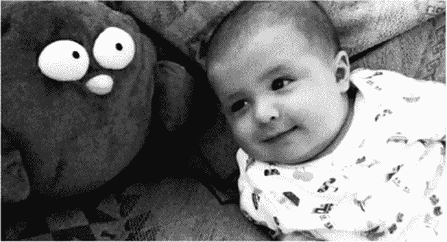
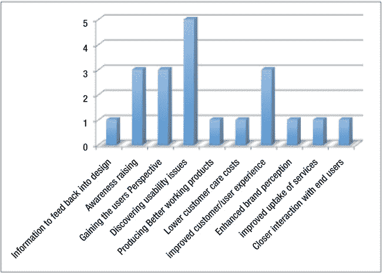
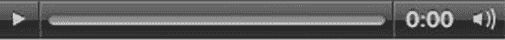

# 六、HTML5 中的图像、富媒体、音频和视频

在这一章中，你将看到如何使用 HTML5 来制作图像和其他富媒体。这一章将介绍一些使图形内容可访问的可靠方法，以及一些你可能不熟悉的新技术。我将介绍用于处理富媒体的其他元素，比如`<audio>`和`<video>`，并讨论如何使用这些新元素以一种易于理解的方式呈现音频和视频内容。

就 HTML5 的“新”特性而言，没有什么比新的`<canvas>`元素更引人注目了。`<canvas>`是一个 2D 绘图 API，可用于在浏览器中创建一些非常复杂、图形丰富的动画。然而，`<canvas>`内容确实有一些特殊的可访问性挑战。我稍后会讨论这些。

 **注**而`<canvas>`的优势在于将图形丰富的内容原生带入浏览器，无需第三方插件。Flash 内容不会消失，因为从可访问性的角度来看，它仍然有比`<canvas>.`更合适的用途

### 使图像可访问

网络主要是一种视觉媒介。虽然这是真的，但您已经看到，Web 也是一种令人惊讶的多样化媒体，许多用户，无论能力如何，都可以访问相同的内容并在网上有相似的体验。它在范围上是通用的，因为它支持多种访问模式，而不管能力如何。

太棒了。然而，有时你需要注意一些用户经历的限制，并通过正确应用标记和良好设计的原则尽你所能。

当试图使内容具有可访问性时，使图像具有可访问性通常是 web 开发人员首先要学习的事情之一。学习如何做是非常容易的，所以作为一种介绍性的可访问性技术，它的入门门槛相当低。然而，通常很容易做错或者误解你最初想要达到的目标。

#### 来认识一下无障碍网页设计的典型代表:alt 属性

`<image>`元素的`alt`属性(或`@alt`)是您最常用来提供图形内容的文本替代物。这采用以下一般形式:

``

所以就整体结构而言，它相当简单。您有``元素，后面是它的`source`属性和`@alt`。属性的顺序并不重要——如果您愿意，可以先有`@alt`,再有`src`。使用前面的方法将`@alt`明确地与图像相关联，并且它表示完整的*结构*。在所示的方法中添加替换文本也绝对不会影响图像的视觉呈现。

 **注意**``元素还有一个`title` ( `@title`)属性；然而，使用`@alt`属性通常是提供替代文本的更健壮、更可靠的方式。对于更长的描述，还有`@longdesc`属性。这些我以后再说。

#### 屏幕阅读器如何处理@alt 文本

当屏幕阅读器将焦点放在网页中的``元素上时，屏幕阅读器首先向用户宣布它遇到了一幅图像。它通常通过说出“图像”这个词来做到这一点如果图像有一个`@alt`值，它将宣布作者在其中包含的任何文本字符串。就这样。

 **注意** `@alt`在大多数图形和文本浏览器以及最常用的屏幕阅读技术中都得到了很好的支持。

如果没有一个`@alt`描述，屏幕阅读器将查看是否有一个`title`属性，并可能(我说可能是有原因的)宣布它。如果两者都不存在，屏幕阅读器将试图寻找它能找到的任何其他支持信息，通常是通过宣布`src`属性的内容，这可能给用户一些图像类型或图像目的的指示。

 **注意**当图像不可用或无法加载时，大多数浏览器会在图像应该出现的地方显示一个边框，同时还会显示替换文本。默认情况下，Lynx 等纯文本浏览器会读取替代文本。详见`[`en.wikipedia.org/wiki/Lynx_(web_browser)`](http://en.wikipedia.org/wiki/Lynx_(web_browser))`。

例如，假设一个图像是一个按钮，没有替代文本或`@title`信息。如果文件被命名为 button.png 或其他描述其功能的名字，如 logon.png 或 logout.png 的*，这可以帮助屏幕阅读器用户了解按钮的实际用途，即使缺少文本`@alt`。*

 **注意**一般情况下，我描述的情况在没有`@alt`或者`@title`的地方会触发所谓的*启发式评估*。一个*启发式*是经验法则或评估方法。试探法是各种事物的核心，从学习计算机科学时可能学到的基本逻辑，到更高级的算法设计。不要被这个术语所困扰，只要想想“一套规则”有时，当启发式评估被触发时，屏幕阅读器也会查看网页中周围的 HTML 内容。

另一方面，如果你的图片有一个我称之为可怕的 URL，这是一个内容管理系统(CMS)可能会使用的随机字符串( *12090_IMG.jpg* 或类似不透明的东西)，屏幕阅读器将无法理解它。这将给最终用户带来问题，因为当丢失的`@alt`触发屏幕阅读器试探法时，软件将无法理解内容。它将输出文件的名称，但是如果这是一个长的，随机的文本字符串，它是没有用的。

 **记住**一个好的默认行为是给你的图片起一个描述性的名字，即使你实际上是在应用替代文本描述。

#### @alt 缺点

因此，看起来似乎`@alt`属性非常健壮、可靠，而且都是好东西。有什么弊端吗？有一种观点认为，替代文本可能对“每个人”都有用，除了那些使用纯文本浏览器或有视觉障碍并使用屏幕阅读器的用户之外，其他用户也应该可以使用替代文本。虽然这听起来很有道理，也很包容，但我并不是很认同这个观点。当然，在某些情况下，替代文本描述有助于理解，但总的来说，我觉得就它所做的和它所服务的群体而言，它做得很好。这是一个漫长而微妙的讨论，我不需要在这里赘述。可以说，在 HTML5 工作组中，争论的焦点是“你不允许有视力的人访问`@alt`值，这是对他们的歧视。”对我来说，这种想法充其量是虚假的。一种能很好地满足 80%用户需求的标记语言要比一种不能很好地满足 100%用户需求的标记语言要好。

另一个潜在的问题是对文本大小的限制。从技术上来说，它大约是 100 个字符，但一般来说，很难得到一个关于“太长”到底有多长的明确答案。如果你从一开始就知道你的图像需要更长的描述，有其他方法(如`@longest`和 WAI-ARIA `aria-labeledby`)可以替代。

### 我应该怎么描述？

当开发人员试图为图像提供可选的文本描述时，面临的最大挑战之一就是到底要描述什么。这是一个很大的问题，不幸的是，这个问题通常没有实际意义。事实上，这个区域有点模糊。这可能不太让人放心，但你在这里。一些屏幕阅读器用户确实希望尽可能详细地描述每一件事情，而另一些用户只要能在任何给定的时间获得他们需要的信息就很高兴。更重要的是，当一个网站有一个特定的功能时，许多用户仅仅是为了能够完成他们设定的任务而感到高兴。他们不在乎图形是否被描述，只要他们没有丢失任何核心功能。

我在这里要做的是概述一些我多年来从做网站的用户测试和专家评估中学到的东西。这通常涉及与盲人屏幕阅读器用户以及其他辅助技术(AT)设备的用户一起工作。我将介绍当前关于 HTML5、图像和其他富媒体的可访问性最佳实践的想法。那我就让你自己拿主意了！

#### 描述内容:不要过度

我想传授给你的第一条智慧是“不要做得太过”有时候少真的就是多，而大多数时候，适可而止其实就是适可而止。最初，你可能觉得有必要描述，嗯，一切！这通常是非常不切实际和耗时的。学习保持你的文字描述的相关性和简洁是一门艺术，你需要花一些时间来掌握。有了经验，你会发现什么样的细节是不重要的，最好不要用文字描述图像。

##### 忽略它(第一部分)

如果你真的站在一个用户的立场上，你可能会发现有些情况下你真的不希望一张(或多张)图片被解释。事实上，为了获得最佳的用户体验，您可能希望图像完全隐藏或被忽略。所以在我继续讲下去之前，我应该回答一下我想我听到你问的问题:“我如何把一张图片留在外面？我如何不将它包含在屏幕阅读器输出的内容中？”你可以用几种不同的方法做到这一点，而且它们很容易掌握。

当网页加载时，文档中的所有 HTML 项目都被加载到 DOM 中。显然，这包括所有的图形和其他富媒体。如果你想让一个图形在视觉上呈现出来，但是你想让屏幕阅读器忽略它，最常用的方法之一就是给图像一个空值`@alt`。这采取以下形式:

``

 **注意**`@alt`的引号之间没有空格。

这对屏幕阅读器来说是一个标志，告诉它忽略这个图像。屏幕阅读器会表现得好像图像根本不存在一样，不会通知用户它的存在。

“我为什么要这么做？”你可能想知道。好吧，如果一个图像纯粹是表示性的，比如你用来设计一个按钮的内嵌图形，你会想把它从屏幕阅读器中隐藏起来，因为它对用户的体验没有任何帮助。当你仔细想想，有很多图像你真的根本不需要描述，因为它们没有增加任何价值。所以 null `@alt`是一个强大的朋友。明智地使用它，你会发现它真的有助于去除页面中不必要的混乱。

##### 忽略它(第二部分)

隐藏对屏幕阅读器用户没有信息价值的图像的另一种方法是使用级联样式表(CSS)。这一声明采取以下形式:

`p {background-image:url('some_bullet.png');}`

在这个例子中，您可以将元素名`p`替换为您想要应用图像的任何元素。`URL`部分指向您存储想要使用的图像的位置。默认情况下，该属性也是重复的，所以您可能想要设置一个`no-repeat`，如下所示:

`p {background-image:url('some_bullet.png');
background-repeat: no-repeat;
}`

如果您希望图像在 X 访问上垂直重复，您的代码将采用以下形式:

`body

{background-image:url('some_repeatinggraphic.png');
background-image: repeat-x;
}`

要在 Y 轴上水平重复图像，请使用:

`Body
{background-image:url('some_repeatinggraphic.png');
background-image: repeat-y;
}`

您可能会发现您想要使用一些内联 CSS 来呈现您的图像，因此您可能会使用一些`
`或内联``元素来充当图像的挂钩。

##### 忽略它(第三部分)

另一种对屏幕阅读器隐藏图像的方法是使用 WAI-ARIA 角色，`role="presentation"`。它采用如下所示的形式:

``

然而，我真的不建议这样做——部分是因为前两种方法更好地被当前和旧的用户代理支持，部分是因为使用`role="presentation"`在支持它的用户代理中有其他与可访问性相关的用途(大多数最新的屏幕阅读器和浏览器都是这样)。例如，如果您希望屏幕阅读器忽略父元素的语义，但不忽略子元素，这种技术就非常有用。例如，您可能需要使用一个表格来包含小部件和控件布局。使用`role=“presentation”`允许屏幕阅读器忽略用于包含小部件控件的表，但是它允许屏幕阅读器访问子语义(小部件的内容)。一个巧妙的诡计。

此外，请不要向我开枪，或者让长翅膀的猴子攻击我的家——用桌子来布置不是什么可及性禁忌。

### 不同种类的图像

我刚刚概述了一些对屏幕阅读器隐藏内容的有用技术。

那么如何写出好的替代文字呢？你从哪里开始？首先，有几种不同的图像需要考虑:

*   **视觉上丰富的图像:**一般来说，照片、素描、绘画都是视觉内容非常丰富的。例如，考虑一幅美丽的自然风景或一张全家福。很难真正捕捉到这些类型的图像或它们的精神。
*   **图形和图表:**这些图形和图表种类繁多，但可以包含非常详细的信息，以及说明各种数据之间的关系。
*   文本图像:这可以是包含用户不会错过的重要有用信息的图像，或者只是包含样式化的文本的图像。
*   **功能图像:**这是具有特定功能的图像，例如用于按钮的图形。
*   装饰性图像:没有实际功能的图像，只是作为纯粹的视觉点缀有用，比如一个漂亮的项目列表。
*   **图标:**用作*视觉线索*的图像，是链接的一部分。

正如您所看到的，替代描述的用例有许多种，这个列表甚至还没有穷尽！在我们继续之前，我们先来看看 HTML5 中的一些新元素，它们可以与`@alt`和其他描述图像的方法结合使用。

#### html 5 在描述图像方面有什么新功能？

描述或注释大量图表、照片和插图的两个新手是`<figure>`和`<figcaption>`。它们被用来创建一个*单个单元*，可以从网页的另一部分指向或引用。这就像在你的 CSS 中指向一个 ID。

图形充当某些图像、图表、插图或照片的容器，它采用以下基本形式:

`<figure>

</figure>`

好的，这就是不穿衣服的样子。要把它打扮的漂漂亮亮的，适合出门，还得加个`<figcaption>`来完成结构。这基本上是图的标题。

将`<figcaption>`添加到`<figure>`的基本结构如下所示:

`<figure>

<figcaption>Some useful description of the image</figcaption>
</figure>`

因此,`<figcaption>`仅仅是:`<figure>`内容的标题。

接下来是更详细的例子。我只想概述一下基本结构，并说明在 HTML5 中使用`<figure>`比使用`@alt`有一个有趣的优势，因为它代表了一个完整的结构化单元，可以在页面上引用。

#### 用咏叹调描述一个形象——描述者

使用`aria-describedby`属性是引用页面中元素的另一种方法，它提供了图像的适当描述。

这可能是一个非常有用的方法，因为页面中的现有文本经常可以完美地描述一幅图像。与其复制这些文本，不如以编程方式引用图像的 ID。这样你就在图像和文字描述之间建立了一个明确的联系。

例如，考虑下面的图像。第一张(图 6-1 )是我和我的岳父菲亚克拉在爱尔兰最高的山峰上的照片，该山峰位于克里郡的 Carrauntoohil。这张照片拍摄于 2011 年夏天。

***图 6-1。**乔希(右)和他的岳父菲亚克拉(左)，在凯里郡的卡劳恩图希尔山顶*

如果这张照片被嵌入到一个谈论我们攀登的 HTML5 博客中，在添加图片和描述之前，博客帖子的代码看起来会类似于清单 6-1 中所示。

***清单 6-1。**一篇 HTML5 博文*

`<!DOCTYPE HTML>
<html>
<head>
<meta Charset="UTF-8">
<head>
<title> my big climb this summer (2011)</title>
</head>
<body>
<article>
<section>
<h1>Climbing the three highest mountains in Ireland</h1>

During the summer of 2011, Fiachra, Dara and I climbed the three highest mountains in
Ireland. This was a stupendous day where the challenge of summiting the three peaks of
Carrauntoohil, Beenkeragh & Caher was too much to resist!

</section>
<section>
<h2> The Coomloughra Horseshoe</h2>

The three peaks are ringed within in a large horseshoe shaped valley and present a very
challenging climb even for experienced hill walkers. We also had fantastic views of the
MacGillycuddy Reeks from Beenkeragh's high, exposed summit. The weather was also very
beautiful and we totally lucked out as we couldn't have asked for a clearer day to see the
spectacular views. We walked over Beenkeragh Ridge with its yawning drops and navigated the
equally spectacular Caher Ridge, with the Black Valley far below, before descending from Caher
into Coomloughra Glen.

</section>
<section>
<h2>Remember to bring water</h2>

It was a very hot day and after 4 hours or so we ran out of water! Fortunately we came across some fresh mountain streams in the Coomloughra Glen and could top up our water bottles
[…]

</section>
</article>
</body>
</html>`

如果我想在第一段中包含图片，并且我想把这一段作为文本描述，我可以像清单 6-2 中所示的那样编码。

***清单 6-2。**在帖子中包含一张图片*

`<!DOCTYPE HTML>
<html>
<head>
<meta Charset="UTF-8">
<title> My big climb this summer (2011)</title>
</head>
<body>
<article>
<section>
<h1>Climbing the three highest mountains in Ireland</h1>

 ****During the
summer of 2011, Fiachra, Dara and I climbed the three highest mountains in Ireland. This was a
stupendous day where the challenge of summiting the three peaks of Carrauntoohil, Beenkeragh &
Caher was too much to resist!

</section>
<section>
<h2> The Coomloughra Horseshoe</h2>

The three peaks are ringed within in a large horseshoe shaped valley and present
a very challenging climb even for experienced hill walkers. We had fantastic views of the
MacGillycuddy Reeks from Beenkeragh's high, exposed summit. The weather was also very
beautiful and we totally lucked out as we couldn't have asked for a clearer day to see the
spectacular views. We walked over Beenkeragh Ridge with its yawning drops and navigated the
equally spectacular Caher Ridge, with the Black Valley far below, before descending from Caher
into Coomloughra Glen.

</section>
<section><h2>Remember to bring water</h2>

It was a very hot day and after 4 hours or so we ran out of water! Fortunately
we came across some fresh mountain streams in the Coomloughra Glen and could top up our water
bottles […]

</section>
</article>
</body>
</html>`

那么刚才显示的代码中发生了什么呢？我使用博客文章的内联文本来描述图像，通过它们的 id 指向 block 的内容。在本例中，我分别给了每个`
`元素一个 ID`text1`、`text2`和`text3`。对于支持`aria-describedby`的用户代理(如前一章所述，许多新的屏幕阅读器都支持，那些不支持的只会忽略它)，在图像和描述之间创建一个编程连接意味着一旦图像获得焦点，描述就会被公布。此外，有一些方法可以增强这种基本行为——例如，通过向图像添加一个`@alt`文本描述，并将其与`aria-describedby`代码相结合。这看起来有点像清单 6-3 中的代码。(我省略了博文代码的第一部分和最后一部分。)

***清单 6-3。**增强图像描述*

`<section>
<h1>Climbing the three highest mountains in Ireland</h1>

 ****During the summer of 2011, Fiachra, Dara and I climbed the three
highest mountains in Ireland. This was a stupendous day where the challenge of summiting the
three peaks of Carrauntoohil, Beenkeragh & Caher was too much to resist!

</section>
<section>
<h2> The Coomloughra Horseshoe</h2>

This three peaks are ringed within in a large horseshoe shaped valley and
present a very challenging climb even for experienced hill walkers. We had fantastic views of
the MacGillycuddy Reeks from Beenkeragh's high, exposed summit. The weather was also very
beautiful and we totally lucked out as we couldn't have asked for a clearer day to see the
spectacular views. We walked over Beenkeragh Ridge with its yawning drops and navigated the
equally spectacular Caher Ridge, with the Black Valley far below, before descending from Caher
into Coomloughra Glen.

</section>`

这种方法的有趣之处在于，它为不支持`aria-describedby`但能理解`@alt`内容的旧屏幕阅读器引入了向后兼容的元素。像这样处理您的标记通常是一个好主意，因为它涵盖了支持和不支持新特性的用户代理。

支持这两者的屏幕阅读器实际上将通过`@alt`和`aria-describedby`元素的内容获得丰富的文本对等物；然而，要知道`aria-describedby`技术目前只能用于*页内*描述。因此您不能引用不同网页上的描述。

 **注意**当一个屏幕阅读器用户厌倦了描述或者听够了描述，他可以离开被描述的条目，转到下一个，或者他可以使用他的屏幕阅读器的导航功能。所以用户不必听他不想听的东西——一旦用户移动到一个新的 HTML 元素，屏幕阅读器的输出就会结束。

### 我应该使用哪种方法？

一般来说，这个决定归结于使用的上下文和什么是最好的描述。机制可能会有所不同，因为您正在寻找各种方式来提供描述，但在您开始之前，有一些因素您需要仔细考虑。为了进一步说明您之前看到的示例或图像类型，我们将讨论以下情况(按照之前列出的项目顺序):

*   **视觉丰富的图像:**当照片、图画或绘画等图像具有大量视觉信息时，`@alt`或`<figcaption>`可以用作标签，简要描述图像或给出图像的概述。
*   **图形和图表:**当图像是富含信息数据的图形或图表时，`@alt`可以用作描述性标签，给出图形主旨的简要概述。图形和图表是其他方法如`aria-describedby`非常有用的完美场合。
*   **文本图像:**图形设计师可能使用了用户机器上没有的 groovy 字体(在网页设计中很常见，被称为*图像替换技术*)，而`@alt`被用作图像的替换。`@alt`应该清楚地说明样式文本是什么。
*   **功能图像:**图像可能有功能，所以你用`@alt`来描述它做什么，而不是它看起来像什么。
*   一个装饰性的图像:一个图像可能完全是装饰性的，不需要替代的描述，它需要被隐藏起来。
*   **图标:**一幅图像可能被用作视觉线索或图标，并且是链接的一部分。

以下是支持上述用例的一些示例。

#### 第一类:描述视觉上丰富的图像

图像通常包含大量视觉丰富的信息。很难用临床或精确的方式来描述它们。虽然你知道古老的格言“一张图胜过千言万语”，但反过来也是正确的吗？需要一千个字来描述画面吗？这可能有一定的道理。

尽管 WCAG 2.0 建议你为图片提供的文本应该是等价的或者应该替换图片，但实际上这通常是不可能的。至少不是在描述能真正做到画面公正的意义上。想象一下，试图为一幅像“蒙娜丽莎”这样的画提供文本描述。

你可以说，“这是一位带着淡淡微笑的优雅女士，”但你也可以说，“这是一位微微皱眉的优雅女士。”取决于你问的是谁，这两个问题都是正确的，而且都是描述性的。

所以，即使一幅图像非常丰富，你最好不要试图捕捉每一个细节，而是通过有趣的方式使用`@alt`或`<figcaption>`来捕捉图像的精神。例如，考虑一下图 6-2 中显示的照片，我认为这很有趣，因为拍摄对象可能是兄弟，除了其中一个是紫色的。

***图 6-2。**我的小男孩和他的猫头鹰伙伴*

这是我儿子 Ruairí和他的大(亮紫色)猫头鹰朋友 Minerva 的照片。如果我将`<figure>`和`<figcaption>`与`@alt`结合使用，下面的描述可能更适合我要说的内容:

`<figure>

<figcaption> Two friends together, Ruairi and Minerva</figcaption>
</figure>`

我在这里所做的是使用`@alt`作为一种提供更长描述的方式，而`<figcaption>`仅仅是图像的标题。它们可以用于相互支持，并提供图像的各种类型的信息描述。

我想说的是，有时很难写出一幅图像的有用的文字描述。如前所述，链接到图像的单独描述或使用`aria-describedby`指向文档本身的描述可能会更好。

好吧，所以前面的照片很简单(虽然很可爱！).让我们考虑一些更复杂的图像，以及如何使用 HTML5 提供文本描述。

想想下面几张我过去作为艺术家的照片。(我指的是“我曾经这样做过”意义上的前世，而不是“前世”意义上的——但我想这是另一天的讨论了！)

图 6-3 是我多年前画的一张黑白钢笔画，名为《创造》。

***图 6-3。**《创世纪》*

如果我把它放在一个在线图库中，并想用另一种文字描述来描述它，我能有效地做到吗？从技术上来说，我可以给它一个文字描述，但我如何传达其完整的视觉冲击或意义？

我可以试着做一些相对简单的事情，比如:

`<figure>

<figcaption>Pen and Ink Drawing called ‘Creation’ by Joshue O Connor</figcaption>
</figure>`

我的内容几乎达到了之前提到的 100 个字符的限制，而且——让我们面对它——描述并没有真正做到这一点。

我可以决定采用更详细的方法，使用`aria-describedby`方法，如下所示:

`<figure><figcaption>‘Creation by Joshue 0
Connor (1993)</figcaption></figure>`

然后在我的网页中，我可能会包含下面的段落，我可以将`id="creation"`分配给它。整个事情看起来就像清单 6-4 中的。

***清单 6-4。**使用咏叹调的图像描述——描述者*

`<!DOCTYPE HTML>
<html>
<head>
<meta Charset="UTF-8">
<title>Some Cosmic Artwork by Josh(2011)</title>
</head>
<body>
<article>
<section>
<h1>Sample of Pen and Ink Drawings</h1>

<figure>

<figcaption>‘Creation’ by Joshue O Connor (1993)</figcaption>
In a past life Josh was far more interested in playing guitars, painting, and in general
larking about than he was with computers.

</section>
<section>

 Here is some more background about his artwork for those interested […]

 This drawing illustrates the mystery of creation. It shows a large flaming
triangle that holds a bright radiating sun at its apex, and a stylised smiling moon sits at
its base in opposition. At the heart of the triangle there sits an exploding planet with the
ancient Vedic symbol of creation the AUM at its heart. The image sits on a background framed
of stars and small spaceships fly by randomly in the distance.

</figure>
</section>
</article>

</body>
</html>`

在 HTML 文档中找到的较长描述的例子稍微好一点。这种方法确实给了作者多一点呼吸的空间，也有希望还图像一个公道。是否是合适的描述，是否传达了图像同样的视觉丰富性？你是法官。可以说，图像功能越多，提供合适的替代文本就越容易，模糊性就越小。

最后，我的观点是，你通常不能用文字描述完全取代视觉媒介。但是，您可以使屏幕阅读器用户的用户体验更好。让体验变得更好也可以解读为“不那么可怕”。如果你发现你不知道如何描述某样东西，把图片分解成组成部分，或者找一个可能有帮助的完形视图或概述。如果都失败了，只要给图像一个空值`@alt`就不会影响用户体验。这是最后的手段，但在我看来，这比什么都不做并触发屏幕阅读器试探法要好。

在我们转向更多功能代码等价物的不那么模糊的水域之前，只是为了说明提供有意义的描述有多么困难，我在图 6-4 “创造的种子”中提供了我的另一幅画你会如何描述这个？另外，向那些知道一些吠陀本体论的人道歉——梵天应该有四个头。是的，我确实有很多空闲时间。

***图 6-4。**“创造的种子”*

这是一个简单的选择。

你可能想知道是否还能使用`@longdesc`来描述复杂的图像。在撰写本文时，`longdesc`属性(或`@longdesc`)已经过时，不再是 HTML5 规范的一部分。`@longdesc`属性是一种在需要时提供更长的图像文本描述的方式，它已经被更好的技术所取代，比如我之前概述的那些技术。

`@longdesc`的使用采取以下一般形式:

`
<imp src="some_complexgraphic.gif" alt="a complex image"
longdesc="complex_image_description.html" />
`

如您所见，`@longdesc`是一种链接到当前页面或另一个页面上的更长描述的机制。说浏览器和 AT 对它的支持很差可能有点过了，但支持肯定不是很好。它在学术界之外也很少使用。对于那些认为它有用的人来说，它是有用的——如果一个元素很好地服务于一个用例，即使它的应用不是完全通用的，我对保留或改进元素功能或在规范中保留一个元素没有问题。但那是我。

然而，它确实有一些优势，尽管 ARIA 很棒，HTML5 也在许多领域取得了进步，但目前都没有提供对`@longdesc`的全功能替代。`@longdesc`有一张王牌，它可以用来引用离页 URI，还可以提供结构化内容作为文本描述。不幸的是，它在浏览器中的实现和最终的用户体验往往还有许多不足之处。然而，这可能与其实现有关，而不是不需要一个更长的描述机制。这是 HTML 工作组中的一个热门话题，您可能会发现它正在重新浮出水面。

##### 类型 2:图形和图表

当图像是富含信息数据的图形或图表，难以用简单的`@alt`描述时，`@alt`也可以用作一种描述性标签。该标签应给出图表旨在描述的内容的简要概述。

 **记住**图形和图表是使用`aria-describedby`等方法非常有用的完美场合，尤其是在页面可能包含已经与图像链接的更详细的概述的情况下。

比如考虑图 6-5 。这是我在研究关于包容性设计的专业实践者使用的各种用户测试和评估方法的硕士论文时使用的图表。

***图 6-5。**测试和评估方法*

为了提供图表的文字描述，我将给出图表视觉传达内容的概述。大概是这样的:

``

考虑图 6-6 ，这个图表显示了用户测试的主要好处。有很多视觉信息要传达。在这种情况下，使用`aria-describedby`当然是更好的解决方案。

***图 6-6。**用户测试的好处*

您可能会发现，链接到网页正文中以更详细的方式概述调查结果的描述会更容易。这里我使用了`@alt`(作为一个短标签)和`aria-describedby`的组合来进行更长的描述:

``

然后在 HTML 文件的更深处，我可以有一个段落提供更丰富的描述，以及一些注释:

`
 From this research we can see that practitioners feel some of the main
benefit of user testing with people with disabilities is discovering usability issues with the
interface, navigation, structure, functionality and so on. User testing as an awareness
raising exercise for developers in order to first hand experience the diverse needs of people
with disabilities and therefore gaining a greater understanding of how things work from the
users perspective, is also an outcome of the research"
`

对于图 6-7 ，它着眼于用户测试的规模，更容易描述。

***图 6-7。**测试组规模*

``

这是一个简洁的文本描述，但它完美地捕捉了图表中的视觉信息。有时候少即是多！

##### 类型 3:文本图像

现在我们将处理本章前面提到的情况:图形设计师可能使用了用户机器上没有的 groovy 字体，而`@alt`被用作图像的替换文本。在这种情况下，`@alt`应该清楚地说明样式文本是什么。

例如，图 6-8 可以用作灯箱画廊或与吉他相关的图像集的图形标题，其中设计者希望使用特别风格化的字体。

***图 6-8。**一个图形标题*

为了确保图像是可访问的，您可以如下所示对其进行标记:

`<h1></h1>`

 **注意**像这样的大多数情况下，你只需在替换文本中镜像图像中的文本。下一个例子说明了为什么这种方法很重要。

图 6-9 是一个你可能在网站上看到的“特价”图片的例子。该图形旨在吸引眼球，并告知用户特价优惠。

***图 6-9。**图形中的文字*

您可以按如下方式标记图像:

``

如果没有替代文本，一个没有视力的人将不会知道商店正在出售他们的吉他，或者这只是一个限时优惠。也有一些情况下，一个标志可能包含一些文字或代表公司的身份。然后，您应该将公司名称作为替换文本添加到徽标图像中，而不是描述它的外观。假设图 6-10 链接到 HTML5 规范。

***图 6-10。**html 5 的 logo*

你可以这样说，而不是像“新的 HTML5 标志看起来像一个大的橙色盾牌，中间有一个大 5”那样给图像一个替代的描述:

``

这很好地引导我们进入下一种类型的图像，我在上一个例子中提到过:功能图像。

##### 类型 4:功能性图像

当一个图像有一个特定的功能时，你应该使用`@alt`来描述它是做什么的，而不是它看起来像什么。

想象一下，如果你在你最喜欢的吉他商场网站上看到了图 6-11 中的图片，并且访问它的唯一方式是通过图片本身的链接。

***图 6-11。**想赢得一把经典吉他吗？让它触手可及，每个人都有机会！*

要使其可访问，您可以将其标记如下:

``

 **注**我在一些网站上看到过这类图片，实际上进入比赛的唯一途径就是点击链接。因此，如果链接有某种目的，你可以描述它的目的，而不是它看起来像什么！没有什么比下面的例子更能说明这一点了。

***图 6-12** 。购买吉他的链接图*

图 6-12 展示了一个按钮，顾客将用它来购买吉他。因此，没有必要提供类似以下内容的描述

``

不要。你只要说它的功能是什么——字面意思，“买这把吉他。”

``

好了，这样好多了！所以坚持按下按钮。你甚至不需要包括像“点击这里”这样的文字，因为这是不必要的。屏幕阅读器将向用户宣布该图形是一个链接，用户将知道如何激活它。

##### 类型 5:纯粹的装饰性图像

图像可能完全是装饰性的，不需要替代描述。为了不触发屏幕阅读器试探法，它需要对 AT 隐藏，因为它不会给用户体验增加任何东西。

您可以通过添加空值`@alt`来实现这一点，空值的形式为`alt=""`(在“”之间没有空格)，如下例所示:

``

我在这一章中已经多次提到这一点，但我将再次强调:明智地使用 null `@alt`可以增加用户体验，因为它可以用来消除大量的网页混乱。当被问到时，甚至许多有视力的人都会同意，许多网站的图形设计功能很差，有多余的混乱，或者它几乎没有给他们提供他们真正想要的功能！图像通常就在那里，占据空间，在某些情况下，实际上还会碍事。

在可访问性社区中，关于哪些图像应该被描述，哪些不应该被描述的讨论没完没了。一个人的装饰图像是另一个人的艺术。这也取决于屏幕阅读器用户的偏好。有些人可能想要描述很多额外的东西；其他人(我认为是大多数人)很高兴去掉了很多杂乱的东西。

##### 类型 6:图标

图像可以用作视觉线索或图标，也可以作为链接的一部分。图像本身实际上不应该是活动链接，因此应该在图像上使用 null `@alt`,而可以使用真实的 URL。

在图 6-13 和它的同伴清单 6-5 中，内嵌图像被用作位于真实 URL 旁边的图标。

***图 6-13。**用作图标的内嵌图像*

***清单 6-5。**内嵌图标代码*

`<ul>
<li>
<a href="home.html">
Home</a>
</li>
<li>
<a href="contact_us.html">
Contact</a>
</li>
<li>
<a href="our_location.html">
Our Location</a>
</li>
</ul>`

当屏幕阅读器将焦点放在刚刚显示的任何一个列出的链接上时，图像被忽略，而`<a>`元素的内容被公布。

有时你会发现链接功能的重复，图标和真正的链接文本都是可点击的。尽量避免这样做，因为这对屏幕阅读器用户来说是一种痛苦。当他们浏览一个菜单时，他们会得到一个链接的副本。对于一个有视力的人来说，如果图标和旁边的 URL 是活动的可点击链接，用户可以很容易地选择其中之一。图标具有视觉上强化控件目的或以某种方式帮助理解的效果。这种视觉强化就是视觉。

#### 图像颜色对比

除了提供有意义和管理良好的描述，确保您的图像——尤其是文本图像——具有足够的颜色对比度也非常重要。有很好的工具可以帮助你做到这一点，比如 WAT-C 色彩对比分析仪。可以在`[www.paciellogroup.com/resources/contrast-analyser.html](http://www.paciellogroup.com/resources/contrast-analyser.html)`拿到。

### HTML5 和可访问的<视频>和<音频>

HTML5 最大的进步之一是能够在浏览器中播放音频和视频，而不需要任何第三方插件，如 Flash、QuickTime 等。HTML5 视频是一个非常热门的话题。这对作为设计师的你会有什么影响，对用户体验又意味着什么？

#### HTML5 <视频>，<音频>，还有你

作为一名设计师，新的 HTML5 `<video>`元素比我们以前做视频的方式有很多优势。不再有繁琐的代码和担心是否使用`<embed>`或`<object>`，我希望，作为一个设计师，有一个更有凝聚力的体验。话虽如此，在技术领域中,“进步”通常意味着你用一套全新的技术来替换曾经的技术。不幸的是，尽管 HTML5 `<video>`真的很棒，并提供了丰富和可访问的(如果做得好)用户体验，但它仍然很复杂。

首先，您仍然需要处理不同浏览器支持的各种编解码器。对于官方支持的 HTML5 编解码器还没有达成共识，所以您有几个选择，您必须进行一些功能检测和巧妙的编码，以确保您为正确的浏览器提供正确的内容。如果只有一两个浏览器就好了，但所有浏览器都在争夺位置，每个制造商都支持(或不支持)自己的各种首选格式，以努力实现他们渴望的全球主导地位。

 **注**整个“苹果不支持 Flash”的姿态是/是一场格式战。

#### HTML5 <视频>和你的用户

HTML5 视频有能力创造良好的无障碍播放器。这是个好消息。您可以使用本机控件或编写自己的脚本。我将很快向你展示如何构建你自己的无障碍播放器。

您还可以通过一些准备和跑腿工作，为您的电影创建自己的音频描述、说明和字幕。我们还将看看如何做到这一点。

#### 【Flash 怎么了？

Flash 其实没什么问题。从可访问性的角度来看，它有很多优点，包括丰富的 API 和在创作环境中从语义上轻松描述大多数对象的能力。更加数据库驱动的平台 Flex 能够创建一些优秀的、可访问的富互联网应用，供有视觉障碍的人、屏幕阅读器用户等使用。然而，许多开发人员就是不使他们的 Flash 内容具有可访问性。Flex 应用空间略有不同，许多 Flex 组件都有一定程度的开箱即用的可访问性。

该插件是第三方解决方案。它不是浏览器自带的，而且是专有的。然而，它看起来并没有消失。HTML5 并不是进入游戏领域的唯一技术；Adobe 已经有了通过虚幻引擎(UE3)开发 Flash 的计划。现在，您可以在 Flash 环境中玩丰富的 3D 游戏。因此，焦点肯定会从视频平台转移到丰富的沉浸式游戏平台。

#### Flash 中的可访问性问题

如果您使用的是较新的屏幕阅读器，只需开发人员稍加努力，许多 Flash(尤其是 Flex 内容)都是可以访问的。然而，从可访问性的角度来看，Flash 存在一些实际问题(这可能是因为它不是“浏览器固有的”技术)。最明显的问题是无法使用键盘轻松地切换到 Flash 视频内容，还有一个相当反常的问题是无法切换出来(即使您设法进入了)。具有讽刺意味的是，这在 Internet Explorer 中并不是一个问题，但它确实会影响大多数其他浏览器。解决方法很复杂，因为您必须使用脚本来阻止用户返回。

#### 打造无障碍播放器

在 HTML5 中构建一个可访问的`<audio>`或`<video>`播放器是一个大杂烩。构建它们的某些方面确实很容易，但其他方面可能需要很好的脚本知识和一些 CSS 知识。(所需的脚本水平可能会让一些人望而却步，但我建议坚持下去。)可惜在某些方面还是有点棘手。

然而，在许多方面，它并不像听起来那么令人生畏。你如何对待它，你想让它做什么，等等都是需要考虑的重要因素，它们将决定你需要投入多少努力才能得到一个可行的结果。

#### 首先:嵌入式内容有什么新特性？

当您想要在 HTML5 页面中嵌入视频时，可以添加`<video>`元素。“就这些吗？”我听到你哭泣。“是的，”回答是。

清单 6-6 中的简单代码调用了浏览器中的`<video>`元素。图 6-14 、 6-15 和 6-16 显示了结果。

***清单 6-6。**调用<视频>元素*

`<!DOCTYPE HTML>
<html>
<head>
<meta Charset="UTF-8">
<title>Sample native browser controls</title>
</head>
<body>
<video controls>
</video>
</body>
</html>` 

***图 6-14。**火狐原生视频控件*

***图 6-15。**戏曲原生视频控件*

***图 6-16。** Safari 本地视频控件*

`<video>`元素有一些属性可以通过 Media Elements API(即将推出)来访问，但仅此而已。

#### <视频>回退内容

您在`<video>`元素中包含的任何内容都被视为*后备内容*。这是将由不支持视频的用户代理看到的内容。你应该仔细考虑你在里面放了什么，这样至少是有用的，而不是粗鲁的(在“你的浏览器不支持这个”或类似的无用信息的意义上)。回退内容可以是一些文本和指向备用可访问版本的链接，甚至是指向不同文件格式的链接列表。给用户一个选择总是好的，但是不要给他们太多的信息。

 **注意**我们在这里讨论的回退内容原则上同样适用于`<audio>`元素内容。查看`[`camendesign.com/code/video_for_everybody`](http://camendesign.com/code/video_for_everybody)`了解如何使用 Flash 视频作为后备内容。

#### 媒体元素 API

因此，您希望在 HTML5 页面中包含一些视频——通过向页面添加`<video>`元素来实现。`<video>`元素的公共属性是`src, preload, autoplay, mediagroup, loop, muted,`、`controls, crossorigin,`和`poster`。所有这些属性都非常符合你的期望。具体情况如下:

*   **`src`属性:**`src`属性是视频或音频文件的来源。如今，利用`crossorigin content`属性，媒体可以在许多不同的服务器上广泛传播。此属性与不同服务器之间的资源共享有关，是减少分散内容的安全顾虑和问题的一种方式。
*   **`preload`属性:**`preload`属性有各种与之相关的关键字或状态。这些是`none, metadata`，和`auto`。`preload`属性决定了浏览器在页面加载时如何在后台加载(或不加载)源材料。
*   **`poster`属性:**`poster`属性对于在等待用户输入时显示合适的图像非常有用，这样用户在点击播放之前就不会看到空白屏幕。它实际上是一种未来的海报。
*   **`mediagroup`属性:**`mediagroup`属性用于将几个音频或视频元素或轨道分组在一起，这对于视频和音频的播放列表很有用。
*   **`controls`属性:**这是一个布尔。它告诉浏览器显示控制媒体所需的本机控件，如播放、停止等。如果没有此属性，您必须提供自己的脚本控件。
*   **`autoplay`、`loop`、`muted`属性:**他们完全按照罐头上说的去做。

 **注意**浏览器提供的控件通常不能开箱即用，除非你使用 Opera 浏览器。Opera 开箱即用，提供了出色的键盘可访问性，因此您可以播放、暂停和改变视频或音频的音量。不幸的是，按照大多数其他标准，Opera 不是一个非常屏幕友好的浏览器，但就 HTML5 `<video>`和`<audio>`的原生键盘访问而言，它应该低头。

#### 入门<视频>

开始使用`<video>`元素很容易，您可以很快在浏览器中看到一些结果，并使用我刚刚介绍的 Media Elements API 属性定义一些基本属性。最初的步骤可能类似于清单 6-7 中的。

***清单 6-7。**使用<视频>*

`<video width="700" height="500" **preload controls** **poster**="../img/mayer_cc_poster.jpg">
<source src="http://mirrors.creativecommons.org/movingimg/MayerandBettle_480p.webm"
type="video/webm" />
<source src="http://blip.tv/file/get/Commonscreative-MayerAndBettle980.ogv" type="video/ogg"
/>
<source src="http://blip.tv/file/get/Commonscreative-MayerAndBettle715.mov"
type="video/quicktime" />
// Fallback content here

<h1>Can't access this video content?</h1>
Please <a
href='http://creativecommons.org/videos/mayer-and-bettle'>visit the Creative Commons website
for a format that suits you</a>, or if you are happy with Flash content, <a
href="http://blip.tv/play/gpxS6Oo5g9ky" type="application/x-shockwave-flash">visit the Flash
version of the Mayer and Bettle creative Commons video</a>

</video>`

从清单 6-7 中的代码可以看出，您已经调用了三个 API 属性来在浏览器中执行一些魔法:

*   `preload`，预加载内容但不播放。
*   `controls`，要求浏览器显示原生浏览器控件。
*   `poster`，显示图像，直到视频播放完毕。这很有用，因为根据您的浏览器，您可能有一个空白或透明的空间，甚至可能看不清楚视频播放器控件。

我们还定义了视频的尺寸，并要求浏览器显示本地浏览器控件。

该示例有四种不同的视频源或视频类型，具体取决于访问内容时使用的浏览器。为每个浏览器提供正确的编解码器可能相当复杂，您需要手头上有一些视频转换工具，以便能够生成您需要的版本。这样做相对来说比较琐碎，但是可能比较耗时。你一个接一个地安排不同的视频格式和它们的源 URL 当浏览器点击它理解的内容时，它会预加载并播放它。如果浏览器不理解您提供的任何格式，这将触发嵌入在`<video>`和`</video>`元素之间的回退内容的显示。

##### 一些编码工具

以下是一些对编码音频/视频媒体有用的工具列表:

*   **Audacity:** 一个优秀的、免费的、开源的录音机。在`[www.audacity.sourceforge.net](http://www.audacity.sourceforge.net)`拿到。
*   **Firefogg:**Firefox 的一个视频和音频编码应用。在`[www.firefogg.org](http://www.firefogg.org)`拿到。
*   **FFmpeg2theora:** 一个 OggTheora 文件的转换器，可在`[`v2v.cc/~j/ffmpeg2theora/`](http://v2v.cc/~j/ffmpeg2theora/)`获得。
*   **手刹**:开源视频转码器。在`[www.handbrake.fr](http://www.handbrake.fr)`拿到。

##### 你是我喜欢的类型吗？

MIME 类型告诉浏览器 URL 指的是哪种媒体。将正确的 MIME 类型添加到`source`属性的末尾非常重要。(你可以在清单 6-7 中看到 MIME 类型。)有些浏览器对只播放附带的媒体相当严格，比如(Firefox 和 Opera)。

一些最常用的音频文件格式及其对应的 MIME 类型如下:

*   **MP3:** 音频/mpeg
*   **OGG：** 音频/视频/ogg
*   **MP4:** 音频/mp4 视频/mp4
*   **网络视频:**音频/网络视频/网络视频
*   **WAV:** 音频/wav
*   **AAC:** 音频/3gpp，音频/3gpp2，音频/mp4，音频/MP4A-LATM，音频/mpeg 4-通用

表 6-1 概述了主流浏览器支持的音频格式。

 **注意**当编解码器表示用于传送媒体的压缩/解压缩算法时，它也表示编解码器的容器。

表 6-2 涵盖了视频编解码器，以及每种编解码器支持哪些浏览器。

某些容器可以采用多种文件格式。(记住，编解码器既是算法，也是*包装器*，或者保存它的容器。)在`[`en.wikipedia.org/wiki/Comparison_of_container_formats`](http://en.wikipedia.org/wiki/Comparison_of_container_formats)`你可以很好地了解容器的概况以及它们之间的比较。

 **提示**为了让你的内容能够以最少的格式创建和解码数量到达最多的浏览器，你应该至少提供两种格式的音频，比如 MP4 和 Ogg，至少提供三种最常用的格式的视频:MP4、WebM 和 Ogg。

#### 让您的控制易于使用

 **注**我要特别感谢我的朋友盖兹·莱蒙，以及马克·博厄斯和西尔维亚·菲弗，感谢他们在我编写这一部分时给予的慷慨帮助、评论和建议。

在某些方面，你已经看到了容易的部分。接下来您将看到的是添加您自己的控件，并使它们既可以通过键盘访问，也可以被屏幕阅读器用户访问。我们还将看看如何使向前跳和向后跳的功能，以及控制静音的音频。不幸的是，开箱即用，目前没有一种方法可以轻松做到这一点，所以你必须编写脚本并创建自己的。

 **注意**最难的是脚本，但是如果你保持简单，你可以实现很多，并且不会在这个过程中失去理智。嗯，这可能不完全正确。此外，您可以只使用本机 HTML 输入控件，如按钮，然后添加脚本。这为您提供了更多的开箱即用的可访问性，但是您在样式选择上有点受限。对于手卷控件，您有更多的空间来随心所欲地设计它们的样式。

有很多方法可以用来开发控件，所以我们来看几个。显然，确保你的播放器是可访问的是非常重要的，以下所有内容都着眼于可访问性。在这里，我创建了自己的图形来表示控件，然后应用了必要的 JavaScript。您还可以使用 CSS 来创建按钮并设置其样式。无论哪种方式，JavaScript 都非常相似。

图 6-17 是我在 Photoshop 中创建的控件的屏幕截图，我将用它来控制我的视频。它们分别是播放、停止、静音和向前跳/向后跳。

***图 6-17。**视频播放器的一组手卷控件*

首先，我将每个控件包装在一个`
`元素中，然后适当地命名它。在每个`
`元素中，有一个`image`元素和一个合适的`@alt`文本值来描述控件。例如，以下是按钮控制:

`

`

在某些浏览器中，这些控件都可以通过键盘访问，当屏幕阅读器将焦点放在前面的控件上时，就会显示“播放按钮”。然而，您必须测试哪些有效，哪些无效。

 **注意**在第一个例子中，我使用了#来通过键盘使控件成为焦点。传统上，使用#是为了给 JavaScript 一个焦点，但是随着 DOM 脚本的发展和像 jQuery 这样的工具包的普及，它并不总是必要的。如果您确实使用这个方法，一定要在它后面添加`“return false();”`语句，因为这会阻止`“#”` URL 触发。

清单 6-8 显示了所有控件的代码。首先，您将处理播放、停止和静音按钮。

***清单 6-8。**实现视频控制*

`

`

使控件可聚焦并附加播放、停止和静音/取消静音等方法所需的 JavaScript 相当简单。我暂时忽略了向前和向后的控制；我们以后再看这些。研究清单 6-9 ，看看你是否能理解它。

***清单 6-9。**视频控制焦点的 JavaScript】*

`

</head>
<body>
<video id="access_video" width="500" height="300" preload="none" poster="../img/mayer_cc_poster.jpg">
<source src="http://mirrors.creativecommons.org/movingimg/MayerandBettle_480p.webm" type="video/webm" />
<source src="http://blip.tv/file/get/Commonscreative-MayerAndBettle980.ogv" type="video/ogg"
/>
<source src="http://blip.tv/file/get/Commonscreative-MayerAndBettle715.mov" type="video/quicktime" />
<h1>Oops cannot access this video content? Never fear!</h1>

Please <a href="http://creativecommons.org/videos/mayer-and-bettle">visit the Creative Commons website for a format that suits you</a>

</video>

</body>
</html>`

图 6-18 显示了你的第一个版本的无障碍播放器的屏幕截图。

***图 6-18** 。无障碍视频播放器*

好吧，不是很刺激，但是很管用。然而，你可以做一些事情来改善各方面的情况。

#### 可访问的 HTML5 视频播放器版本 2

上一个示例中的代码存在一些问题。首先，如果 JavaScript 关闭或不可用会发生什么；使用#是个好主意吗？好吧，在显式控件的情况下，这一点有点不切实际。这是因为即使你想创建一个不引人注目的控件，这样做回避了你可以指向什么作为替代的问题，因为控件的目的是播放一些视频。在前面的示例中，对回退内容有一些很好的规定。如果不支持 HTML5，用户可以将浏览器指向该网站并下载内容。

你可以做一些事情来提高球员的水平。首先，您可以用“#”删除空 URL，将它们改为`<divs>,`，使它们可以从键盘获得焦点，并添加一些 ARIA 角色属性。

 **注意**现在 JavaScript 保持不变。稍后您将看到为前进和后退功能以及其他一些控件添加脚本。

让我们来看看新代码:

`
**
**

`

这里的主要变化是增加了 ARIA `role=“button”`属性，它告诉屏幕阅读器和浏览器`
`的用途是什么。通过添加`tabindex=“0”`值，您还可以从键盘访问`
`。所以这是两方面的胜利！

这两个属性都应该应用于所有控件。我还添加了以下代码，以确保控件将在键盘上突出显示焦点:

`*[tabindex]:focus {
outline:none;
border:
solid yellow 2px;
}`

 **注意**关于使用 URL #作为关注控件的方式或者使用`
`和`tabindex="0"`的方式，你需要在尽可能多的不同浏览器中测试这两种方法。一些开发人员喜欢#方法，另一些开发人员喜欢带有`tabindex`的`
`，尽管后者现在得到了很好的支持。

这个例子的 JavaScript 代码(实际上同时使用了 a #和 tabindexed `
`)非常简单，但是当它最终工作起来的时候，一切看起来都很简单！

看看你是否能弄清楚清单 6-11 中发生了什么。

***清单 6-11。**添加播放、停止、静音、前进和后退功能的代码*

`window.onload=function(){

    var video = document.getElementById('access_video');
    var play = document.getElementById('play');
    var stop = document.getElementById('stop');
    var mute = document.getElementById('mute');
var forward = document.getElementById('forward');
var back = document.getElementById('back');

   // Script needed to attach the onclick events with the functional buttons.
   // **Remember** even though the event is called onclick it still works from the
   // keyboard.

    play.onclick = playVideo;
    stop.onclick = stopVideo;
    mute.onclick = muteVideo;
    forward.onclick = jumpForward;
    back.onclick = jumpBack;

    // Duplicate onkeydown events for keyboard a11y

    play.onkeydown = playVideo;
    stop.onkeydown = stopVideo;
    mute.onkeydown = muteVideo;
    forward.onkeydown = jumpForward;
    back.onkeydown = jumpBack;

    // New function for play

      function playVideo(objEvent) {
       if (objEvent.type == keydown')
       {
               var iKeyCode = objEvent.keyCode;
               if (iKeyCode != 13 && iKeyCode !=32) {
                       return true;
               }
       }
       video.play();
}

// New function for pause

        function stopVideo(objEvent) {
       if (objEvent.type == keydown')
       {
               var iKeyCode = objEvent.keyCode;
               if (iKeyCode != 13 && iKeyCode !=32) {
                       return true;
               }
       }
       video.pause();
}

    // This function allows the button to be used as a control to
    // toggle the audio on or off.

        function muteVideo(objEvent) {
       if (objEvent.type == keydown')
       {
               var iKeyCode = objEvent.keyCode;
               if (iKeyCode != 13 && iKeyCode !=32) {
                       return true;
               }
       }
      video.muted = !video.muted;
}

    // Jump forward, Jump Back

    forward.onclick = jumpForward;
    function jumpForward(objEvent) {
        if (objEvent.type == keydown')
       {
               var iKeyCode = objEvent.keyCode;
               if (iKeyCode != 13 && iKeyCode !=32) {
                       return true;
               }
       }
    video.currentTime = video.currentTime + 15;
    video.play();
    return false;
    }

    back.onclick = jumpBack;
    function jumpBack(objEvent) {
        if (objEvent.type == keydown')
       {
               var iKeyCode = objEvent.keyCode;
               if (iKeyCode != 13 && iKeyCode !=32) {
                       return true;
               }
       }
    video.currentTime = video.currentTime 15;
    video.play();
    return false;
    }

};

</script>`

控件本身的代码如清单 6-12 所示。

***清单 6-12。**使用 tabindex="0 "将功能附加到定制的控件上，以关注一个< div >，而不是使用#*

`

`

在`[`techrecord.net/html5/HTML5_video_player_no_captions_final.html`](http://techrecord.net/html5/HTML5_video_player_no_captions_final.html)`可以看到播放器的工作版本。

接下来，我们将看看如何给视频添加字幕。

 **注意**如果所有这些都太多，还有现成的视频播放器可以使用，比如用于视频的 jPlayer 和 jQuery UI。您可以分别在`[`jplayer.org`](http://jplayer.org)`和`[`github.com/azatoth/jquery-video`](https://github.com/azatoth/jquery-video)`访问它们。

### 带有<轨道>元素的音频描述和字幕

如果你想对你的视频文件做各种各样的音频描述或者标题，HTML5 有一个新的元素叫做`<track>`元素。表 6-3 概述了你可以用新元素做什么。

*表 6-3。媒体元素概述 ?? 1T5*

_________

1

要在您的视频内容中使用标题、副标题或章节信息，您可以通过`kind`属性添加它们。`src`属性指向文本存储的位置，`srclang`属性定义文本使用的语言，`label`属性给出标题。清单 6-13 详细说明了正确的用法。

***清单 6-13。**给<轨道>元素*添加字幕

`<video src="brave.webm">
 <track kind="subtitles src=brave.en.vtt" srclang="en" label="English">
 <track kind="captions src=brave.en.hoh.vtt" srclang="en"label="English for the Hard of
Hearing">
 <track kind="subtitles src=brave.fr.vtt" srclang="fr"lang="fr" label="Français">
 <track kind="subtitles src=brave.de.vtt"srclang="de" lang="de" label="Deutsch">
</video>2`

原则上，添加音频描述和/或字幕非常简单，对吗？好吧，如果你最喜欢的浏览器支持这种东西，那就可以了，但目前还不支持(在我写这篇文章的时候)，但这将会改变。为了实现这一点，我使用了开源的 JavaScript 库 Captionator，发现它工作得非常好。

__________

2 从`[`dev.w3.org/html5/spec-author-view/the-track-element.html`](http://dev.w3.org/html5/spec-author-view/the-track-element.html)`

 **注**你可以在`https://github.com/cgiffard/Captionator`下载 JavaScript 库，获取更多关于 Captionator 的信息。

将它添加到您的视频中就像将以下脚本添加到您的页面中一样简单:

`
`

然后通过添加以下内容来启用它:

`    captionator.captionify(document.getElementByID("video"));`

就这样。我可以继续使用 Text Wrangler 编写. vtt 文件来创建标题本身。那个。vtt 文件格式易于使用——只需打开您最喜欢的编辑器，并使用扩展名*保存您创建的文件。vtt* 。

#### 提示设置

有许多不同的提示设置供您使用。详见表 6-4 。

入门相当容易。图 6-19 显示了我的视频字幕文件。您可以定义标题或副标题出现的开始和结束时间，然后使用提示设置告诉浏览器大小、对齐方式等。请看下面我的截图。我用来给视频加字幕的 vtt 文件。并做实验。奇怪的是，这是一项引人注目的工作，相当耗时，但也很有趣。

***图 6-19。**样本 VTT 文件*

 **注意**要了解更多关于 VTT 的信息和一篇好文章，请看一下`[`www.iandevlin.com/blog/2011/05/html5/webvtt-and-video-subtitles`](http://www.iandevlin.com/blog/2011/05/html5/webvtt-and-video-subtitles)`上伊恩·德夫林的有用概述。

您可以在图 6-20 中看到带字幕视频的视频播放器截图，并在`[`techrecord.net/html5/HTML5_video_player_captions_final.html`](http://techrecord.net/html5/HTML5_video_player_captions_final.html)`上线试用。

***图 6-20。**无障碍播放器字幕视频截图*

 **注**欲了解更多关于具有良好可及性角度的 HTML5 视频的信息，请参见 Silvia Pfeiffer 的新书，*html 5 视频权威指南* (Apress，2010)。

#### 创建一个<音频>播放器

这只是一个简短的说明，说明创建一个音频播放器更容易一些，你所学到的关于制作<video>播放器的知识(比如创建你自己的控件等等)也适用于音频播放器。</video>

### <画布>无障碍

动态渲染动态位图图形的 2D 绘图 API 可以用来在浏览器中创建一些非常好的视觉动画(甚至更多),而不需要任何插件。有许多 groovy 测试案例和网站非常成功地全部或部分使用了`<canvas>`。然而，从可访问性的角度来看(为了让每个人的生活更容易)，除了漂亮的图片，不要使用`<canvas>`。在撰写本文时，它还不能被认为是可访问的。在万维网联盟(W3C)的幕后有大量的工作在进行，并努力使之成为现实。然而，在我看来，如果有另一种开发内容的方式更合适，你应该使用它。事实上，规范对此有如下建议:

> *"当有更合适的元素可用时，作者不应在文档中使用 canvas 元素。例如，使用 canvas 元素来呈现页面标题是不合适的:如果想要的标题呈现在图形上很强烈，就应该使用合适的元素(通常是 h1)来标记，然后使用 CSS 和支持技术(如 XBL)来设计样式*
> 
> 当作者使用 canvas 元素时，他们还必须提供内容，当呈现给用户时，传达与位图 canvas 基本相同的功能或目的。该内容可以作为 canvas 元素的内容放置。canvas 元素的内容(如果有)是元素的后备内容。4

使用`<canvas>`开发了各种本不该开发的东西。文本编辑器 Bespin 在我脑海中是一个看起来不错的工具，但实际上可能永远也不会被使用。

 **注**您可以在`[`benzilla.galbraiths.org/2009/02/17/bespin-and-canvas`](http://benzilla.galbraiths.org/2009/02/17/bespin-and-canvas)`查看 Bespin。在很多方面，它令人印象深刻，但我认为它使用了错误的工具作为基础。

顺便说一下，我认为`<canvas>`的其他一些非常聪明的用法(不考虑可访问性)是:

*   **SoundManager 2 / 360 播放器演示:**可在`[www.schillmania.com/projects/soundmanager2/demo/360-player/](http://www.schillmania.com/projects/soundmanager2/demo/360-player/)`获得。这太棒了，这些好心人也给你看看源代码。
*   **9 元素:**在`[`9elements.com/io/projects/html5/canvas/`](http://9elements.com/io/projects/html5/canvas/)`可用。它有很好的鼠标交互和很棒的音调交互！
*   一个字体生成器和一个可能的 sIFR 替代品。在`[`cufon.shoqolate.com/generate/`](http://cufon.shoqolate.com/generate/)`可用。Roger Johannes 在`[www.456bereastreet.com/archive/200905/cufon_and_screen_readers/](http://www.456bereastreet.com/archive/200905/cufon_and_screen_readers/)`撰写了关于 Cufón 和屏幕阅读器的文章。
*   有一个很好的列表，列出了使用`<canvas>`开发的游戏、小工具等等，可以从`[www.w3.org/html/wg/wiki/AddedElementCanvas](http://www.w3.org/html/wg/wiki/AddedElementCanvas)`获得。在这里你还可以找到很多关于`<canvas>`的讨论链接，以及当试图让这个绘图 API 更容易使用时所面临的挑战。

话虽如此，`<canvas>`仍处于起步阶段，从可访问性的角度来看，它面临着巨大的挑战。例如，它没有 DOM，那么屏幕阅读器如何生成文档的概览呢？如果你继续使用`<canvas>`来吸引眼球，你会没事的。HTML5 有许多很棒的工具来构建可访问的东西，并为许多具有不同能力的用户组提供丰富的用户体验。所以当你需要勺子的时候，用勺子。虽然有人会说，“没有勺子。”

__________

4

 **注意**如果你想要一个很好的参考来创建你自己的`<canvas>`视觉糖果，我推荐 Nihilogics HTML5 `<canvas>`备忘单，它可以在`[www.nihilogic.dk/labs/canvas_sheet/HTML5_Canvas_Cheat_Sheet.pdf](http://www.nihilogic.dk/labs/canvas_sheet/HTML5_Canvas_Cheat_Sheet.pdf)`获得。

### 结论

在这一章中，我们看了很多可以让 HTML5 富媒体更容易访问的新方法。有许多基于您过去如何使用 HTML 4 做事情的最佳实践，您仍然可以应用，但也有一些新的技巧，我希望本章已经让您喜欢上了。在下一章，我们将看看如何使用 HTML5 来访问数据表。