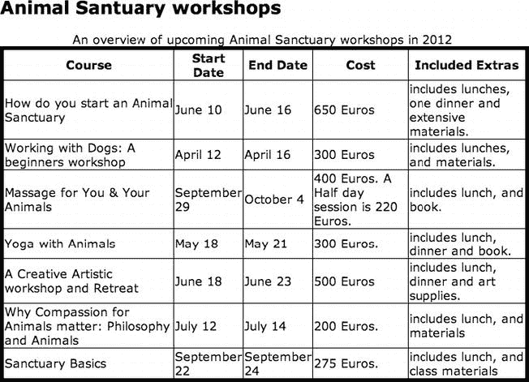
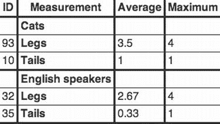

# 七、HTML5 和可访问的数据表

在这一章中，你将学到所有你需要知道的关于使用 HTML5 创建简单和更复杂的可访问数据表的知识。

数据表通常用作可视化呈现表格数据的方式。这些数据可以是作者感兴趣的任何内容。表格布局允许作者呈现信息，以便网站用户可以轻松地将任何给定单元格中的数据与各种类别或关系相关联，这些类别或关系通常在每一列或每一行的开头定义。

这通常是在我们许多人常见的布局中完成的，单个数据单元格与不同的列和行相关。网站的用户可以查看各个数据单元格，并快速浏览以查看它们涉及哪些列和行。然后，他们可以快速理解每个单元格中的数据的含义。

### 桌子的麻烦

对于一个有视力的人来说，弄清楚这些关系是简单明了的，而且往往发生得非常快。如果一个表格设计得很好，那么首先会使理解这些关系变得更容易，大多数视力正常的用户在理解它们时不会有问题。他们首先关注表数据是什么——换句话说，它与什么主题相关——然后确定表中包含的信息实际上意味着什么。

对于一个没有视力的人来说，成功地完成这两个步骤需要开发者做更多的工作。这有几个原因，但主要是因为当一个表格显示在浏览器中时，视力正常的用户通常会很快*得到*这些关系。一个没有视力的用户将以一种非常不同的方式访问表中的数据——以线性方式，一项接一项地访问。

在一个失明的人甚至开始调查或*询问*(我喜欢使用这个术语，因为它与数据表和可访问性相关)数据表之前，她首先需要一种方法来容易地理解表的用途。这归结为用户在问，“这张桌子是做什么用的？”，赶紧接着问“这是什么意思？”

#### 屏幕阅读器和数据表

创建一个视力正常的人能够容易理解的表是相当容易的(只要你试图表示的初始数据是简单明了的)。您为每一列创建一些标题，也许为它们添加粗体样式，然后添加行，也许为每一行的第一项添加粗体样式。很简单。如果这是一份纸质文件，那就好了。

然而，要使一个数据表在 HTML5 中可访问，你必须想办法以编程方式定义数据单元格和它们相应的列和行*之间的关系。这样做有助于像辅助技术(AT)这样的用户代理理解数据单元及其对应的列和行之间的关系，因此它使 AT 能够以用户可以理解的方式通知失明的用户。*

 *对于屏幕阅读器的用户来说，HTML5 语言有定义这些关系的方法，因此首先使数据表易于理解，其次便于导航，然后，如果表与用户的需求无关，则跳过它。

 **注**一个屏幕阅读器是一个*线性输出*设备。这意味着它一次向用户输出一部分信息。对于一个没有视力的用户来说，如果他对 HTML 内容有一个完形的看法，你需要使用适当的代码来帮助他。这通常是通过编写内容的文本概述并以编程方式将其与表格相关联来实现的，以便当表格获得焦点时会显示出来。在这一章的后面我会详细说明如何做到这一点。

#### 数据表的常见模式

您可能要创建的大多数数据表都很简单，并且在形式上遵循一条老路。我可以听到你愤怒地大叫，“你是说我不会创建复杂的、多列的不规则数据表吗？”是的，我是。您创建的表可能有更多或更少的列或行，但它们主要是一个基本的网格，在列和相应行的顶部有标题。

它们可能采用表 7-1 中所示的形式。

桌子可能是正方形或长方形的，虽然并不总是这样，但总的来说，你的桌子将采用表 7-1 所示的形式。因此，我们将研究的使表格可访问的技术将同样适用于刚刚显示的简单表格和具有大量列和行的表格。在这种情况下，大小并不重要。

你需要能够做两件事。首先，对于视力正常的视觉用户，您需要创建表格，以便他们可以看到表格顶部的信息(标题信息)，然后，通常是每行的第一列。然后，他们可以查看整个表，为每个数据单元格建立必要的关联。通过这样做，他们可以看到每个单元格中的数据与什么相关。

其次，为了让屏幕阅读器用户能够访问这些表，您需要使用 HTML5 将每个单元格中的数据与其对应的列标题和行相关联，以便屏幕阅读器本身可以向用户通知哪个标题与每个数据单元格相关。

使用 HTML5 正确标记数据单元格实现了两个实用功能。首先，它通知屏幕阅读器用户当每个单元格有焦点时它所涉及的列和行的组合；第二，它允许用户在浏览表格时了解自己在表格中的位置。

屏幕阅读器用户可以使用光标键轻松地在数据单元格之间导航。我在本章剩余部分展示的内容将帮助您通过简单的步骤使您的表真正可访问。

#### TMI？

在我们研究如何使您的数据表可访问之前，我建议您执行以下操作:

1.  首先，尽量使数据表尽可能简单。如果表很复杂和繁忙，代码也会很复杂。尽管创建复杂的可访问的表是可能的，但是如果您能够首先简化表的架构，这将会很有帮助。
2.  尽量不要跨越多个单元格/行。同样，一个更简单、外观更好的表通常更容易访问。
3.  最后，考虑下面这个问题:你要展示的信息能包含在你网站的正文中吗？换句话说，你真的需要一张桌子吗？

#### 如何创建可访问的表格

图 7-1 ，你将在本章的后面看到，显示了一个表格，它扩展了本书其他一些例子中出现的“动物避难所”主题。该表概述了即将在我们的动物保护区举行的研讨会。

好吧，首先。如前所述，一个有视力的人可以看着桌子，从一开始就知道它是什么。你怎么能为一个没有视力的人做这些？答案是，通过添加一个`<caption>`元素。

元素是给视力正常的用户和屏幕阅读器用户一种理解表格用途的方式。HTML5 规范将`<caption>`元素描述为提供表格的标题。这是一个不错的思考方式。添加`<caption>`元素很容易，添加到`<caption>`元素的任何文本字符串都是以编程方式将与表关联起来的*。一旦表格从屏幕上获得焦点，它将被通知给用户，而不需要更多的交互。这非常有用，是使数据表可访问的第一个重要步骤。它对视力正常的用户也有好处，因为它以可视化的方式呈现，并且可以使用 CSS 进行样式化。*

将`<caption>`元素添加到数据表采用以下形式:

`<section>
<h1>Animal Sanctuary workshops</h1>
<table>
<caption>An overview of upcoming animal sanctuary workshops in 2012</caption>

[…]
</table>`

使用表格的`<caption>`元素或标题有助于帮助屏幕阅读器理解表格是什么。如果你考虑一个有五个或六个(甚至更多)数据表的网页，以这种方式添加`<caption>`真的很有用。一个有视力的人可以快速浏览网页，并找出所有这些表格是什么。如前所述，屏幕阅读器用户可以通过选择各种 HTML 元素——如标题和链接——使用 AT 来浏览网页。他们可以使用页面上的任何`<table>`元素做同样的事情。例如，在 JAWS 中按下 T 键会导致 AT 将用户从第一个表跳到最后一个表(然后再跳回来)。如果每个表格上没有合适的`<caption>`，屏幕阅读器只是宣布“table”、“table”，并让用户知道表格有多少行、列等等，但它不能告诉用户表格是做什么用的。添加`<caption>`填补了空白。带有合适的`<caption>`的数据表宣布焦点上的内容。因此，如果我建议的包含六个表的页面上的所有表都有`<caption>`元素，屏幕阅读器用户可以很容易地找到她要找的东西——因为当每个表获得焦点时，`<caption>`元素的内容就会被公布。整洁！

 **提示**当表格比较复杂时，可以给表格元素添加一个汇总属性(`@summary`)。该属性旨在为屏幕阅读器用户提供更复杂数据表的概述，但不幸的是，它现在在 HTML5 中已经过时了。我仍然认为`@summary`非常有用，因为当屏幕阅读器用户关注一个表格时，它就会显示出来。我经常在我的项目中使用`@summary`来提供补充信息，如果我认为它可以帮助用户理解表格，或者总的来说，有更好的用户体验。这稍微超出了它的设计范围，但是根据我的经验，它工作得很好。对于许多简单的数据表来说，`@summary`并不是必需的，因为一个有用的`<caption>`就足够了。`@summary`对视力正常的用户是隐藏的，但会被屏幕阅读器发现。

我认为`@summary`应该被保留和使用，但是 HTML5 工作组决定让它过时。我和可访问性社区的其他朋友和同事一起，反复提出保留它的理由——但是没有用。如果你想知道 grizzly 的细节，你可以看看工作组在`[www.w3.org/html/wg/tracker/issues/32](http://www.w3.org/html/wg/tracker/issues/32)`的“问题跟踪器”中的日志，或者访问位于`[www.w3.org/html/wg/wiki/SummaryForTABLE](http://www.w3.org/html/wg/wiki/SummaryForTABLE)`的 W3C ESW 维基。

做这些事情包括通知屏幕阅读器用户表格是关于什么的。如何导航表格本身并理解哪个数据单元格与哪个列和行相关？

##### 在数据单元格、表格标题和行之间创建编程关联

有几种常见的方法来标记 HTML5 表，使它们可访问，并且更向后兼容旧的 AT(有许多用户！).第一种方法是使用标题/ID 组合来标识每个表格单元格的内容。第二种方法使用头/范围组合。

##### 可访问的表方法 1:使用标题/ID 组合

我们要看的第一种方法稍微费时一些，但我认为它更可靠。我们将在表格 HTML 的`header`和`ID`元素之间创建关联。这是一种将数据单元格的内容与其相应的标题相关联的方式。这样做将导致屏幕阅读器在向用户宣布单元格的内容之前宣布数据单元格在*的哪一列。*

要创建标题/ID 关联，首先要处理标题，然后处理表体。

从给每个标题一个唯一的 ID 开始；给标题一个与内容相同的 ID 是完全可以的。关于我的动物保护区即将举办的研讨会，我的标题标识如下:

*   Header #1 = "课程"
*   标题#2 = "开始"
*   标题#3 = "结束"
*   标题#4 = "成本"
*   Header #5 = "Extras "

在 HTML 代码中，标题如下所示:

`<th id="Course">Course</th>
<th id="Start">Start Date</th>
<th id="End">End Date</th>
<th id="Cost">Cost</th>`

Additional content included in 它可以是以下内容或类似内容:

`<th id="header1">Course</th>
<th id="header2">Start Date</th>
<th id="header3">End Date</th>
<th id="header4">Cost</th>
<th id="header5">Included Extras</th>`

如果您对任何命名约定感到满意，您当然可以使用它。关键是标题 id 是唯一的，因为它们用于创建与表数据的编程关联(正如您将看到的)。对我来说，他们有关系似乎更自然，但这并不重要。现在您已经有了合适的标题 id，接下来您可以将表体中每一行的单元格内容映射到一个合适的标题，如清单 7-1 所示。

***清单 7-1** 。映射单元格内容*

`<th id="Course">Course</th>
<th id="Start">Start Date</th>
<th id="End">End Date</th>
<th id="Cost">Cost</th>
<th id="Extras">Included Extras</th>
<tr>
<td headers="Course">How do you start an Animal Sanctuary</td>
<td headers="Start">June 10</td>
<td headers="End">June 16</td>
<td headers="Cost">650 Euros</td>
<td headers="Extras">includes lunches, one dinner and extensive materials.</td>
</tr>
<tr>
<td headers="Course">Working with Dogs: A beginners workshop</td>
<td headers="Start">April 12</td>
<td headers="End">April 16</td>
<td headers="Cost">300 Euros</td>
<td headers="Extras">includes lunches, and materials.</td>
</tr>

[…]`

###### 使用标题/ID 组合的最终可访问表

通过查看清单 7-1 中的例子，你能看出标题和数据单元内容之间的关联是如何建立的吗？

图 7-1 是决赛桌的屏幕截图。

***图 7-1** 。可访问数据表示例*

清单 7-2 显示了最终完全编码的样本(也有合适的`<caption>`元素)。

***清单 7-2** 。可访问表方法 1 的最终表代码*

`<section>
<h1>Animal Sanctuary workshops</h1>
<table>
<caption>An overview of upcoming Animal Sanctuary workshops in 2012</caption>
<th id="Course">Course</th>
<th id="Start">Start Date</th>
<th id="End">End Date</th>
<th id="Cost">Cost</th>
<th id="Extras">Included Extras</th>
<tr>
<td headers="Course">How do you start an Animal Sanctuary</td>
<td headers="Start">June 10</td>
<td headers="End">June 16</td>
<td headers="Cost">650 Euros</td>
<td headers="Extras">includes lunches, one dinner and extensive materials.</td>
</tr>
<tr>
<td headers="Course">Working with Dogs: A beginners workshop</td>
<td headers="Start">April 12</td>
<td headers="End">April 16</td>
<td headers="Cost">300 Euros</td>
<td headers="Extras">includes lunches, and materials.</td>
</tr>
<tr>
<td headers="Course">Massage for You & Your Animals</td>
<td headers="Start">September 29</td>
<td headers="End">October 4</td>
<td headers="Cost">400 Euros. A Half day session is 220 Euros.</td>
<td headers="Extras">includes lunch, and book.</td>
</tr>
<tr>
<td headers="Course">Yoga with Animals</td>
<td headers="Start">May 18</td>
<td headers="End">May 21</td>
<td headers="Cost">300 Euros</td>
<td headers="Extras">includes lunch, dinner and book.</td>
</tr>
<tr>
<td headers="Course">A Creative Artistic workshop and Retreat</td>
<td headers="Start">June 18</td>
<td headers="End">June 23</td>
<td headers="Cost">500 Euros</td>
<td headers="Extras">includes lunch, dinner and art supplies.</td>
</tr>
<tr>
<td headers="Course">Why Compassion for Animals matter: Philosophy and Animals</td>
<td headers="Start">July 12</td>
<td headers="End">July 14</td>
<td headers="Cost">200 Euros</td>
<td headers="Extras">includes lunch, and materials</td>
</tr>
<tr>
<td headers="Course">Sanctuary Basics</td>
<td headers="Start">September 22</td>
<td headers="End">September 24</td>
<td headers="Cost">275 Euros.</td>
<td headers="Extras">includes lunch, and class materials</td>
</tr>
</table>
</section>`

##### 可访问的表方法 2:使用头/范围组合

标记同一个表的另一种方法是将表头与`scope`属性(`@scope`)结合使用。HTML5 规范是这样描述使用标题/范围组合构建数据表的:

*   第一行中的标题都直接应用于其所在列中的行。
*   具有显式范围属性的标题适用于其行组中的所有单元格。
*   其余的标题只适用于它们右边的单元格。

这意味着您可以拥有不规则的表格，这些表格仍然被认为是简单的，但是它们可能具有不应该包含在特定行中的标题，或者它们可能具有包含几列的行。

规范给出了清单 7-3 中的例子。请注意，在这种情况下，具有显式范围属性的标题应用于其行组中的所有单元格，而不是第一列中的单元格。另请参见新的 HTML5 语法，即对于`<th>`、`<td>`或`<tr>`元素不使用结束元素，或者对于任何单元格值不使用*引号*。如果您愿意，您仍然可以用旧的方式编码。您还可以看到新的`<thead>`(表头)和`<tbody>`(表体)元素，它们几乎如其名称所表示的那样，允许您在表格中表示内容块。还有一个`<tfoot>`(表尾)元素，这里不做展示。

***清单 7-3** 。使用范围属性*

`<table>
 <thead>
  <tr> <th> ID <th> Measurement <th> Average <th> Maximum
 <tbody>
  <tr> <td> <th scope=rowgroup> Cats <td> <td>
  <tr> <td> 93 <th scope=row> Legs <td> 3.5 <td> 4
  <tr> <td> 10 <th scope=row> Tails <td> 1 <td> 1
 <tbody>
  <tr> <td> <th scope=rowgroup> English speakers <td> <td>
  <tr> <td> 32 <th scope=row> Legs <td> 2.67 <td> 4
  <tr> <td> 35 <th scope=row> Tails <td> 0.33 <td> 1
</table>`

清单 7-3 中的代码产生了图 7-2 中的表格，这稍微复杂一些。

***图 7-2** 。HTML5 规格数据表示例*

`th`元素可以指定一个`scope`内容属性。`scope`属性有以下五种状态(带有特定的关键字):

*   `row`关键字，它映射到行状态。行状态意味着标题单元格应用于同一行中的一些后续单元格。
*   `col`关键字，它映射到列状态。列状态意味着标题单元格应用于同一列中的一些后续单元格。
*   `rowgroup`关键字，它映射到行组状态。行组状态意味着标题单元格适用于行组中所有剩余的单元格。
*   `colgroup`关键字，它映射到列组状态。列组状态意味着标题单元格适用于列组中所有剩余的单元格。
*   自动状态。auto 状态使标题单元格应用于基于上下文选择的一组单元格。

图 7-3 来自 HTML5 规范。它直观地展示了算法是如何工作的。

***图 7-3** 。HTML5 范围算法的可视化 1*

从顶部直向下指的四个箭头代表表格标题——“ID”、“Measurement”等，并显示它们与其对应行的所有内容相关联。表格标题(`<th>`)的出现以及它与相关行中所有数据单元格的关联得到了大多数浏览器和的良好支持，甚至比更早的。这种基本的编程关联对表的可访问性有很大帮助。对于屏幕阅读器用户来说，它是如何工作的:当用户遇到具有适当标题的表格时，她使用光标键在数据单元格中导航，首先宣布表格标题是什么，然后宣布数据单元格的内容。

其他箭头显示了前面示例中应用的`@scope`元素如何与其行中剩余的单元格相关联，以及这些单元格如何应用于其右侧的单元格。

###### 使用标题/范围组合的示例

如果您将 header/scope 方法应用于我们的表，标记将类似于清单 7-4 中所示的内容。

__________

1

 **注意**在 HTML5 中，`td`元素上的 scope 属性已经过时。在 HTML 4 中，您曾经可以将它添加到一个`<td>`单元格中，但是如果您想要有效的 HTML，您就不能再这样做了。(我将在第十章“工具、提示和技巧:评估你的可访问 HTML5 项目”中讨论验证问题。)对于 HTML5 数据表，请在`th`元素上使用 scope 属性。

***清单 7-4** 。使用标题/范围方法*

`<section>
<h1>Animal Sanctuary workshops</h1>
<table>
<caption>An overview of upcoming Animal Sanctuary workshops in 2012</caption>
<th scope="col">Course</th>
<th scope="col">Start Date</th>
<th scope="col">End Date</th>
<th scope="col">Cost</th>
<th scope="col">Included Extras</th>
<tr>
<th scope="row">How do you start an Animal Sanctuary</th>
<td>June 10</td>
<td>June 16</td>
<td>650 Euros</td>
<td>includes lunches, one dinner and extensive materials.</td>
</tr>
<tr>
<th scope="row">Working with Dogs: A beginners workshop</th>
<td>April 12</td>
<td>April 16</td>
<td>300 Euros</td>
<td>includes lunches, and materials.</td>
</tr>
<tr>
<th scope="row">Massage for You & Your Animals</th>
<td>September 29</td>
<td>October 4</td>
<td>400 Euros. A Half day session is 220 Euros.</td>
<td>includes lunch, and book.</td>
</tr>
<tr>
<th scope="row">Yoga with Animals</th>
<td>May 18</td>
<td>May 21</td>
<td>300 Euros.</td>
<td>includes lunch, dinner and book.</td>
</tr>
<tr>
<th scope="row">A Creative Artistic workshop and Retreat</th>
<td>June 18</td>
<td>June 23</td>
<td>500 Euros</td>
<td>includes lunch, dinner and art supplies.</td>
</tr>
<tr>
<th scope="row">Why Compassion for Animals matter: Philosophy and Animals</th>
<td>July 12</td>
<td>July 14</td>
<td>200 Euros.</td>
<td>includes lunch, and materials</td>
</tr>
<tr>
<th scope="row">Sanctuary Basics</th>
<td>September 22</td>
<td>September 24</td>
<td>275 Euros.</td>
<th>includes lunch, and class materials</td>
</tr>
</table>
</section>`

“那么哪个最好呢？”我听到你哭泣。使用 headers/ `@scope`的第二种方法花费的时间更少，也更容易创作，正如你在清单 7-4 中看到的。对于屏幕阅读器的用户来说，这两个例子的最终结果几乎是一样的，只有一个例外。旧的屏幕阅读器不太支持`@scope`属性，所以我认为 header/ID 组合方法更健壮，向后兼容性更好。

##### 更复杂的表格

下面是上表的一个更高级版本的示例，使用 headers/ `@scope`方法以及更新的 HTML5 语法进行编码。其想法是显示介绍性和高级课程的信息，每个课程的名称被编码为标题，跨越几列。

从视觉上看，该表类似于图 7-4 中所示的表。

***图 7-4** 。使用 HTML5 语法和 headers/@scope 方法的更高级的表格*

使用 HTML5 语法构建它的代码如清单 7-5 所示。

***清单 7-5** 。使用 Headers/@scope 方法创建一个更高级的表*

`<section>
<h1>Animal Sanctuary workshops</h1>
<table>
<caption>An overview of upcoming Animal Sanctuary workshops in 2012</caption>
<thead>
<tr>
<th>Course Number
<th>Course
<th>Start Date
<th>End Date
<th>Cost
<th>Included Extras
<tbody>
<tr>
<td><th scope=row group>How do you start an Animal Sanctuary<td><td><td><td>
<tr>
<td>#001
<td>Introduction
<td>June 10
<td>June 16
<td>250 Euros
<td>includes lunches, and one dinner.
<tr>
<td>#002
<td>Advanced
<td>August 10
<td>August 16
<td>550 Euros
<td>includes lunches, one dinner and extensive materials.
<tbody>
<tr>
<td><th scope=rowgroup>Working with Dogs: A beginners workshop<td><td><td><td>
<tr>
<td>#003
<td>Introduction
<td>April 12
<td>April 16
<td>100 Euros
<td>includes lunches, and materials.
<tr>
<td>#004
<td>Advanced
<td>May 16
<td>May 20
<td>300 Euros
<td>includes lunches, and materials.
<tbody>
<tr>
<td><th scope=rowgroup>Massage for You & Your Animals<td><td><td><td>
<tbody>
<tr>
<td>#005
<td>Introduction
<td>September 29
<td>October 4
<td>200 Euros. A Half-day session is 110 Euros.
<td>includes lunch.
<tr>
<td>#006
<td>Advanced
<td>November 29
<td>December 4
<td>400 Euros. A Half-day session is 220 Euros.
<td>includes lunch.
<tbody>
<tr>
<td>
<th scope=rowgroup>Yoga with Animals<td><td><td><td>
<tr>
<td>#007
<td>Introduction
<td>May 18
<td>May 21
<td>100 Euros.
<td>includes lunch.
<tr>
<td>#008
<td>Advanced
<td>June 18
<td>June 21
<td>200 Euros.
<td>includes lunch, dinner and book.
<tbody>
<tr>
<td>
<th scope=rowgroup>A Creative Artistic workshop and Retreat<td><td><td><td>
<tr>
<td>#009
<td>Introduction
<td>June 18
<td>June 23
<td>250 Euros
<td>includes lunch.
<tr>
<td>#010
<td>Advanced
<td>June 18
<td>June 23
<td>500 Euros
<td>includes lunch, dinner and art supplies.
<tbody>
<tr>
<td>
<th scope=rowgroup>Why Compassion for Animals matter: Philosophy and Animals<td><td><td><td>
<tr>
<td>#011
<td>Introduction
<td>July 12
<td>July 14
<td>200 Euros.
<td>includes lunch.
<tr>
<td>#012
<td>Advanced
<td>August 12
<td>August 14
<td>400 Euros.
<td>includes lunch, and materials.
<tbody>
<tr>
<td>
<th scope=rowgroup>Sanctuary Basics<td><td><td><td>
<tr>
<td>#013
<td>Introduction
<td>September 22
<td>September 24
<td>275 Euros.
<td>includes lunch.
<tr>
<td>#014
<td>Advanced
<td>September 22
<td>September 24
<td>275 Euros.
<td>includes lunch, and class materials
</table>
</section>`

您还可以使用 Webaim 的 WAVE 工具栏(我们将在第十章中深入探讨)这样的工具来查看表格本身的标题，既可以查看数据表顶部的标题，也可以查看包含在数据表更深处的标题。图 7-5 显示了波形工具栏界面的概述。

***图 7-5** 。数据表*中第<个>元素的视图

更复杂的表格呢？最终，对于更复杂的表格——例如，单元格跨越多行，并且标题嵌套在表格的更深处——您可以应用的真正起作用的标记会受到一些限制(从可访问性的角度来看)。我强烈建议尽可能地简化你的数据表设计，并确保你使用更可靠的方法，比如标题/ID 组合。向表中添加一个`<caption>`元素是一个很大的帮助，尽管目前在 HTML5 中不赞成使用`@summary`,但添加一个元素仍然适用于许多 AT。如果那是一座太远的桥，你可以添加`aria-describedby`来提供更多的说明；然而，使用这种方法意味着指令需要是页面上的*描述。我会违反法律，仍然添加`@summary`来向盲人用户描述复杂的表格(它在视觉上是隐藏的)。话说回来，我觉得我只是对权威有意见。*

应该构建复杂的表吗？当然，你可以为跨越多列或多行的数据单元格设置标题，但是你真的需要确保在更复杂的表格中嵌入标题(见图 7-5 )并使用适当的 id 在这些标题和数据单元格之间创建编程关联。

尽管随着技术的进步，有更高级的 HTML 标记方法承诺更容易创作或只是“更好”，但在实践中，这里概述的简单方法是您应该坚持的。对于更复杂的表——使用@scope 是最理想的——记住它仍然没有得到很好的支持。因此，即使一个标记方法可能是“好的”(从纯编码的角度来看)，并且在语义上有意义，你仍然必须小心，并且测试，测试，测试。困难在于 at 供应商需要赶上作者正在做的事情和规范建议的事情。其实`@scope`里没什么新东西。它已经存在很多年了。

 **注意**关于新的 HTML5 表格语法，我必须承认最初我对它有着复杂的感情。然而，当我编写前面的例子时，我发现更简洁的语法首先更容易编写，然后当我检查代码时也很好。我喜欢它在网格中思考的方式。您可以在您选择的编辑器中布置代码，就像您可视化地布置数据表中的表格单元格一样。当然，您也可以用 HTML 4 做到这一点，但是新的语法要简单得多，并且使得可视化解析代码变得更加容易。虽然一开始不太情愿，但发现自己惊喜万分。

##### 使用范围和 AT 支持

虽然从技术上来说，scope 属性应该被今天的一些屏幕阅读器支持，但实际上它真的相当有限。另一方面，对头/ID 组合的支持(如前所述)非常好。AT 供应商可能声称支持`@scope`，但是当您使用它构建数据表时，您可能会注意到使用`@scope`的表和不使用`@scope`的表之间的差别非常小(如果有的话)。

随着时间的推移，出于几个原因，这种情况需要改变。首先，用 header/`@scope`创作可访问的数据表对开发人员来说耗时更少；第二，新的 HTML5 代码更加精简，这意味着更快的页面加载速度等等。此外，`@scope`的使用让您有可能标记更复杂的数据表。

 **注**几年前，HTML5 工作组采取的立场是数据表不需要标题，而`@scope`足以构建数据表。数据表的标题将从规范中删除。值得庆幸的是，这种情况没有发生，因为这一举动对于 AT 的老用户(有很多)来说是灾难性的。如果你对争论的细节感兴趣，可以查看 HTML5 工作组 ESW 维基: 2 

##### 描述 HTML5 表格的新方法

规范中提出了一些描述表格的新方法，为了完整起见，我在这里提供了一些例子。如果你愿意，你可以使用它们。然而，我对其中一些有异议，目前对新元素如`<figcaption>`和`
`的支持很差。随着时间的推移，这种情况将会改变。您需要进行一次调用，以决定是在它之前还是之后提供表的文本描述，然后在它们之间创建一些编程链接。这种模型的论点是，它有助于有认知障碍的人更好地理解表格，这肯定有一定的道理。然而，对于简单的表格来说，这通常是不必要的，更复杂的表格从`@summary`描述(不幸的是在 HTML5 中是无效的)或类似的描述中获益更多。

规范建议描述数据表的一些方法，可能简单，也可能更复杂，如下所示。

###### 方法 1:以散文的形式，围着桌子

清单 7-6 中的例子使用了表格上方的`
`元素作为后面的详细文本描述。这个想法是，描述将满足所有用户的需求，因为它是在浏览器中呈现的。

***清单 7-6** 。数据表的详细文本描述*

`<section>

In the next table the number of animals we have in care are given in the first column,
Number in Care, the animal type is in the second column, Animal Type, and the third column
shows the number that are available currently.

<table>
<caption>The number of animals in care that we have and that are available for immediate re-
housing.</caption>
<thead>
<tr>
<th id="number"> Total in Care
<th> Animal Type<th> Number available
<tbody>
<tr>
<td headers="number row1"> 12
<th id="row1"> Older Dog<td> 7
<tr>
<td headers="number row2"> 9
<th id="row2"> Aging Cat<td> 6
<tr>
<td headers="number row3"> 14 <th id="row3"> Young Puppy<td> 9
<tr>
<td headers="number row4"> 23
<th id="row4"> Kitten <td> 15
<tr>
<td headers="number row5"> 5
<th id="row5"> Pony<td> 4
<tr>
<td headers="number row6"> 3
<th id="row6"> Horse<td> 1
</table>
</section>`

__________

2

 **注意** 清单 7-6 有两个标题，因为标记用于引用表格顶部的标题和内嵌的标题。HTML5 规范允许以这种方式引用多个头。

虽然在表的正上方有一个详细的描述是一个好主意(如果需要，屏幕阅读器的用户将能够更容易地发现它，因为它非常接近表)，但它仍然有缺陷。这是因为在代码中没有显式的编程关联。正如您现在所知道的，屏幕阅读器用户可以使用他们的 AT 浏览 web 内容，所以显式关联非常有帮助，因为一旦表获得焦点，它就会被宣布。清单 7-6 中的会发生这种情况。

###### 方法 2:对数据表使用 aria-describedby

以前解决这个问题的方法是添加一个描述表格的`@summary`元素。它对视力正常的用户是隐藏的，但对屏幕阅读器用户非常有用。如何提供一个更明确的以编程方式关联的描述？您可以使用一个`@summary`，但是您会从验证器(可从`[`validator.w3.org`](http://validator.w3.org)`获得)得到一个错误。如果你能接受，那很好。另一种方法是使用`aria-describedby`指向页面上的描述。代码如清单 7-7 所示。

***清单 7-7** 。使用 aria-describedby 描述表格*

`<section>

In the next table the number of animals we have in care are given in the first
column, Number in Care, the animal type is in the second column, Animal Type, and the third
column shows the number that are available currently.

<table aria-describedby="desc">
<caption>The number of animals in care that we have and that are available for immediate re-
housing.</caption>
<thead>
<tr>
<th id="number"> Total in Care
<th> Animal Type<th> Number available
<tbody>
<tr>
<td headers="number row1"> 12
<th id="row1"> Older Dog<td> 7
<tr>
<td headers="number row2"> 9
<th id="row2"> Aging Cat<td> 6
<tr>
[…]`

对您的表进行这样的编码可以让屏幕阅读器指向页面上的描述。请注意，它不一定要在表格的正上方或正下方才能工作，只要描述在与表格相同的页面上的任何地方都可以工作。

###### 方法#3:在表格的

HTML5 规范建议您可以在`<caption>`元素中提供这些描述。这类似于清单 7-8 中的代码。

***清单 7-8** 。<中描述表格的标题>*

`<section>
<table>
<caption>Table outlining the number of animals we have in care are given in the first column,
Number in Care, the animal type is in the second column, Animal Type, and the third column
shows the number that are available currently.</caption>
<thead>
<tr>
<th id="number"> Total in Care
<th> Animal Type<th> Number available
<tbody>
<tr>
<td headers="number row1"> 12
<th id="row1"> Older Dog<td> 7
<tr>

[…]`

虽然清单 7-8 中的例子是有效的 HTML5，但我觉得它用太多的信息使`<caption>`超载，并且把任何标题的目的从一个简短的描述变成一个更长的描述。用更长的描述来呈现这样的信息可能会用`aria-describedby`更好地标记，或者用`@summary`更好。

###### 方法 4:在表格的标题中，在一个
元素中

HTML5 规范还推荐将表格的`<caption>`与新的`
`元素结合使用，以提供如清单 7-9 所示的描述。

***清单 7-9** 。使用<细节>元素描述表格*

`<section>
<table>
<caption>
<strong>The number of animals in care that we have and that are available for immediate re-
housing.</strong>

Help

the number of animals we have in care are given in the first column, Number in Care, the
animal type is in the second column, Animal Type, and the third column shows the number that
are available currently.

</caption>
<thead>
<tr>
<th id="number"> Total in Care
<th> Animal Type<th> Number available
<tbody>
<tr>
<td headers="number row1"> 12
<th id="row1"> Older Dog<td> 7
<tr>

[…]`

在清单 7-9 的例子中，注意两个新元素:`
`和`
`。

新的`
`元素表示一个 disclosure 小部件，用户可以从中获得额外的信息或控件。例如，您可以使用它来创建手风琴风格的显示/隐藏控件。请注意，它不适用于脚注。新版本的 Firefox、IE9 和 Safari 5 目前支持这个新元素。同样，默认情况下，这些描述在浏览器中是可见的，但是如果需要，可以使用 CSS 隐藏它们。

`
`元素是`
`元素的子元素，用于表示摘要或图例。它不同于 HTML5 早期版本中表格元素的`@summary`。

###### 方法#5:在同一张图中，在表的旁边

下一个方法，如清单 7-10 中的所示，将整个表格包装在一个`<figure>`元素中，并使用`<figcaption>`提供最初的简短描述，使用`
`元素提供更长的描述。

***清单 7-10** 。用<图符>描述表格*

`<figure>
<figcaption>The number of animals in care that we have and that are available for immediate
re-housing.</figcaption>

the number of animals we have in care are given in the first column, Number in Care, the
animal type is in the second column, Animal Type, and the third column shows the number that
are available currently.

<table>
<thead>
<tr>
<th id="number"> Total in Care
<th> Animal Type<th> Number available
<tbody>
<tr>
<td headers="number row1"> 12
<th id="row1"> Older Dog<td> 7
<tr>
[…]
</table>
</figure>`

这种方法目前的问题是，除了将整个`<table>`包装在一个`<figure>`中(at 目前不太支持这种方法)，在描述性文本和表格元素之间没有其他编程关联。因此，在对`<figure>`元素的支持得到改善之前，使用这种方法是不明智的。在我写这篇文章的时候，Firefox 对`<figure>`和`<figcaption>`还有一些支持。

### 结论

从前面的例子中可以看出，有很多方法可以使用 HTML5 来描述数据表，并使它们更易于访问。越久经考验和信任的方法通常是最好的，首字母缩写 KISS(保持简单，愚蠢)中的古老格言当然适用。在下一章中，我们将看看 HTML5 表单和一些新元素和表单控件，你可以用它们来使你的表单更具响应性、可用性和可访问性。*