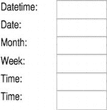
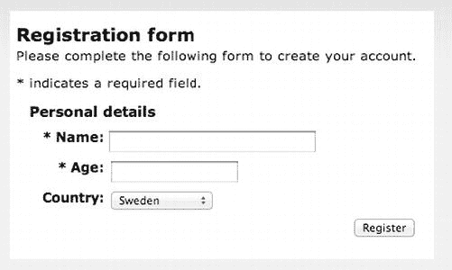

# 八、HTML5 和可访问表单

在本章中，你将学习在 HTML5 中创建可访问的表单。好消息是，以前使用 HTML 4 创建可访问表单时使用的许多技术在使用 HTML5 时仍然适用。您还将看到一些新元素，以及新的 HTML5 元素如何允许您在浏览器中进行更多的表单验证，而不需要复杂的脚本。

如果您不知道如何在 HTML4 中创建可访问的表单，不要担心——我将从头开始讲述这一切。

### 设计一个可访问的表单用户界面

您从上一章学到的关于创建可访问数据表的许多原则也适用于使用 HTML5 创建可访问表单。总的来说,“吻”这个咒语是适用的——不仅仅适用于可访问的形式！

表单确实受益于清晰、简单、简洁的布局。在任何时候，您都应该避免增加任何不必要的复杂性，并且在表单下，您需要在输入字段、复选框和其他元素及其相应的标签之间创建编程关联。这些实践是用 HTML5 创建可访问表单的核心。

当然，表单与数据表有很大的不同。表单是交互式的，而数据表不是。当涉及到使你的表单更易访问时，它们的交互特性确实增加了复杂性。特别是，表单的交互特性带来了如何进行表单验证的问题，以及当最终用户出错时应该怎么做。如何确保错误消息是可访问的？答案有两个部分:你必须首先让用户知道有错误，然后通知用户她需要做什么来纠正错误。稍后我会对此进行详细说明，但这些是可访问错误恢复的主要关注点。

#### 一些形式良好的做法

你已经在第三章中看到了一些简单的表单，以及一些使用脚本的表单验证技术。出于礼貌，使用一些大量使用 JavaScript 的技术来进行表单验证并不有趣。它通常是复杂和尴尬的。使用早期版本的 HTML 创建更容易理解的错误消息的技术并不差。

首先，我将介绍 HTML5 中一些新的输入类型和元素。您将看到这些新元素是如何被设计得更容易创作的，以及它们如何减少使用脚本进行复杂验证的需要。您还将看到可访问的错误消息，并学习一些实践，引导您创建更容易访问和使用的表单——同样，表单也更容易创作和使用。所以这是一个双赢的方法。

 **注意**你在 HTML5 中遇到的很多东西都是从 Web 超文本应用技术工作组(WHATWG)的 Web Forms 2.0 规范移植过来的。这个想法是 Web Forms 2.0 是 HTML 4 中表单特性的扩展。Web Forms 2.0 提供了新的输入字段、用于定义约束的属性、用于声明性重复表单部分的重复模型、新的 DOM 接口以及用于验证和依赖项跟踪的 DOM 事件。Web Forms 2.0 也是记录现有实践的一种尝试。如果你喜欢一些书呆子火车定位，把你的浏览器指向`[www.whatwg.org/specs/web-forms/current-work](http://www.whatwg.org/specs/web-forms/current-work)`。

#### 【HTML 4 和 HTML5 之间表单元素的差异

在 HTML5 中，有 13 个新元素和许多新属性。然而，HTML 4 中也有许多您可能很熟悉的现有元素，它们仍然有效。所以值得再看一遍。

在 HTML 4 中，有许多元素可以用来创建各种输入框、组合框等等。这些与 FORM 元素一起使用来指定:

*   表单的布局(由表单中使用的控件、它们的顺序和位置定义)。
*   处理已完成并提交的表单的页面或脚本(采用`action`属性的形式)。
*   将用户数据发送到服务器的方法(`method`属性，如`post`)。

在 HTML 4 中，`FORM`动作将采用以下通用形式:

`<FORM action="http://yoursite.com/contact" method="post"&gt;
...form details...
</FORM>`

这个基本语法在 HTML5 中保持不变。在表单本身中，可以(事实上，仍然可以)定义各种控件，以允许用户与表单进行交互，指定交互的性质，并阐明每个控件可能施加的相关要求。我们将在接下来的章节中回顾这些控件及其使用标准。

##### 输入元素

INPUT 元素用于用户输入数据，如文本字符串(姓名、地址等)或数字。在 HTML 4 中，INPUT 元素有各种属性，这些属性决定了表单控件的输入类型。有几种 HTML 4 输入元素类型，如下所示:

*   文本
*   密码
*   检验盒
*   收音机
*   使服从
*   重置
*   文件
*   隐藏的
*   图像
*   按钮

所有这些输入元素类型都会在浏览器中创建一个控件，并且浏览器会继承这些类型的某些行为。如果输入类型是“密码”，浏览器会显示一系列星号(****)，而不是真正的文本。稍后我们将研究新的 HTML5 输入类型。

输入类型的语法采用以下形式:

`<input type = "text">
<input type = "password">
<input type = "checkbox">`

HTML5 中新类型的语法遵循相同的结构。

##### SELECT、OPTGROUP 和 OPTION 元素

在 HTML 4 中，您可以找到 SELECT、OPTGROUP 和 OPTION 元素。

SELECT 元素在浏览器中创建一个菜单。菜单中的每个选项都由一个选项元素表示。如果需要将任何选项元素组合在一起，作者可以使用 OPTGROUP 元素对选项进行逻辑分组。如果用户有一个很长的选项列表，而你想把它们分成相关的部分，这是很有用的。

这采用了清单 8-1 中所示的形式。

***清单 8-1。**选择、选择组和选项元素*

`<select>
  <optgroup label="Electric Guitars">
    <option value="Fender">Fender</option>
    <option value="Gibson">Gibson</option>
<option value="Rickenbacker">Rickenbacker </option>
  </optgroup>
  <optgroup label="Acoustic Guitars">
<option value="Gretsch">Gretsch</option>
    <option value="Martin">Martin</option>
    <option value="Lowden">Lowden</option>
  </optgroup>
</select>`

##### 字段集和图例元素

HTML 4 中的`<fieldset>`和`<legend>`元素背后的想法是它们给你的表单更多的结构。< `fieldset>`元素用于按主题对表单控件进行分组，`<legend>`就像是`<legend>`元素的父元素`<fieldset>`的内容标题。有点拗口！如果你还记得，我们已经在第三章的中看到了这些元素的使用。

 **注意**前面所有的元素在 HTML5 中仍然有效。

##### <label>元素</label>

`<label>`对于创建可访问的表单控件非常重要。元素的作用是为一个控件创建一个特定的标签。这个标签允许你在`<label>`名称和控件本身之间创建一个*编程关联*。这允许辅助技术(AT)如屏幕阅读器理解`INPUT`元素的用途。为输入控件选择一个合适的标签是很重要的，因为一旦`INPUT`字段获得焦点，如果标签正确的话，屏幕阅读器就会显示出`<label>`的名字。

##### for/id 方法

HTML 4 中易于访问、标签良好的表单控件使用一种叫做`for/id`的方法。在这里，您用来标识输入元素的标签采用了`<label for="somename">`的形式，并且通过给`INPUT`的 id`<input id="somename">`赋予相同的值，它以编程方式与`INPUT`控件相关联。清单 8-2 详细介绍了这种方法。

***清单 8-2。**使用 for/id 组合使输入文本框可访问*

`<h1>Create new account</h1>
<form>  
<label for="**username**">E-mail address:</label>
<input id="**username**" type=email name=mail>

<label for="**password1**">Password:</label>
<input id="**password1**" type=password name=pass>

<input type="submit" value="Login">
</form>
</body>
</html>`

`name`属性也被设计用来指定`INPUT`元素的名称，并用于标识控件组。它也用于表单提交。它不是由 AT 宣布的。

因此，包含在`<label>[…]</label>`之间的文本会在相应的输入字段通过键盘获得焦点后立即由 at 宣布。当您希望确保屏幕阅读器用户能够访问您的表单中的一些信息时，您可以将它包含在表单的`<label>`中。

#### 表单控件的 HTML5 标签

HTML5 规范概述了另一种不使用前面的`for/id`方法来标记表单控件的方法。这种方式实际上并不新鲜，它实际上是将表单控件包装在一个`<label>.`中，它采用以下一般形式:

`<label>Text to label control<input type="text"></label>`

 **注意**如前所述，这个方法并不新，在 HTML 4 中就有了。在 HTML 4 中，通过使用各种标签的`for`属性指向控件，您还可以从技术上为一个表单控件分配几个标签元素。-但是，在 HTML5 中不能再这样做了。此外，AT 对这种方法的支持很差。

在 HTML5 中，规范建议您使用`for/id`方法或者在控件中包装标签。在下面的代码行中，我结合了这两种方法并将控件包装在一个标签中，同时还使用了`for/id`方法。这采用如下所示的形式:

`<label for="a11y_label"> Text to label control <input type="text" id="a11y_label"> <label>`

当我在 Mac 10.7 (Lion)上使用 VoiceOver 在 Safari 5.1 中测试它时，这很好。我还尝试在输入框之外运行更多的文本，这也是屏幕阅读器宣布的。例如:

`<label for="a11y_label"> Text to label control <input type="text" id="a11y_label"> some extra
useful info!</label>`

有趣的是，我的朋友、Paciello Group (TPG)的辅助功能专家 Steve Faulkner 进行了一些广泛的测试，发现这两种方法在带 VoiceOver 的 Safari 5 上都不太好，但我发现现在可以了(或似乎可以了)。因此，这可能是对这些结构的支持有所改善的迹象。

 **注意** Jared Smith 在 WebAIM 上发表了一篇非常有趣的文章，题为“语义自动化”VoiceOver 使用语义自动化来修复某些损坏的 web 内容。这可能意味着我发现的测试结果是高级*启发式评估*的产物，而不是 HTML5 标记的应用。我在这里提到的*不是 for/id 方法*(这是经过反复试验和测试的防弹方法)，而是 HTML5 规范中推荐的在标签中包装控件的方法。欲了解更多详细信息，请访问位于`[`webaim.org/blog/semantic-automation`](http://webaim.org/blog/semantic-automation)`的 WebAIM 博客。

尽管 HTML5 规范建议的这种通过将控件包装在标签中来识别控件的新方法(原文如此)不使用`for/id`方法的显式关联，但如上所述，我发现它在 VoiceOver 中工作正常(但请参见前面的警告)。然而，就使您的表单更加防弹和使用旧的遗留 AT 而言，我建议现在坚持使用`for/id`方法。不要认为这是一种限制。如你所见，标记很简单，并且`for/id`方法得到了很好的支持。您可以放心地使用它，因为您知道屏幕阅读器用户也可以轻松地使用您的表单。

此外，HTML5 具有与 HTML4 相同的单选按钮、复选框等。

#### 新的 HTML5 元素

下面是新的 HTML5 表单元素和属性的列表。

##### <datalist>元素和列表属性</datalist>

HTML5 扩展了 SELECT 和 OPTION 元素的功能，使您能够向用户提供建议的预定义选项。这可以通过使用新的`<datalist>`元素和`list`属性来实现。

您使用`@list`值指向< `datalist>`元素中的相同 ID。在清单 8-3 中，我添加了一个`title`属性，给屏幕阅读器用户一个如何使用控件的提示。

***清单 8-3。**使用<datalist>*

`<input type="text" list="suggested_DAW_options" title="Press down arrow to see selections">
<datalist id="suggested_DAW_options">    
<option value="Logic">
<option value="Ableton Live">    
<option value="Digital Performer">
<option value="Cubase">
<option value="Sonar">
<option value="Cockos Reaper">
</datalist>`

##### 

<output>元素</output>

这个新元素表示计算的结果。它与`for`属性一起使用。例如，您可以添加来自各种`form`元素的值。清单 8-4 受到了`W3Schools.com`网站上的一个例子的启发。

***清单 8-4。**利用<输出>*

`<form oninput="z.value=parseInt(x.value)+parseInt(y.value)">
Enter Value 1: <input type="number" name="x" value="0" />
Enter Value 2: <input type="number" name="y" value="0" />= <output name="z" for="x y">
</output>
</form>`

 **注意**在`[`html5doctor.com/the-output-element`](http://html5doctor.com/the-output-element)`有一些使用`<output>`元素的有趣例子。

##### <进度>和<计>要素

浏览器中的`<progress>`和`<meter>`元素显示方式相似。图 8-1 显示了 Firefox 9 的一个屏幕截图。图 8-2 显示了 Opera 11.6 中同样的进度条。

***图 8-1** 。火狐 9* 中的<进度>元素

***图 8-2** 。Opera 11.6* 中的<进度>元素

 **注意**前面两个例子都没有以开箱即用的方式显示`<progress>`数据，我还没有看到可访问的实现。我所看到的最接近的东西是汉斯·希伦(TPG)和克里斯·布劳希(美国在线)的出色工作的一部分，他们作为 Aegis 项目的一部分，正在开发 JQuery 支持的、可访问的、支持 WAI-ARIA 的小部件和控件。有关更多信息，请将浏览器指向`[`access.aol.com/aegis/#goto_progressbar`](http://access.aol.com/aegis/#goto_progressbar)`。

#### 新的 HTML5 输入类型

HTML5 真正酷的地方之一是新的表单控件——尤其是各种输入类型。这对作者来说非常有用，因为它们消除了一些验证的复杂性(这并不有趣)。正如你将看到的，这些控件有特定的行为和交互模型。在 HTML 的早期版本中，我们习惯了相当简单的输入类型，例如文本、密码或搜索。

 **注意**你可以用或者不用左双引号(")或者右双引号(")来写下面的类型。所以`<input type="tel">`和`<input type=tel>`都有效。我在这里把它们写成`<input type="tel">`，因为这是我的偏好。当用户代理遇到它不理解的类型时，它会默认将控件显示为通用的`text`类型输入。

在 HTML5 中，*类型*状态决定了控件是哪种输入。所有的新类型几乎都像他们在电视上说的那样。下面几节将介绍完整的类型列表。

##### 隐藏(类型=隐藏)

这采取以下形式:

`<input type="hidden">`

`hidden`类型表示终端用户看不到的一些值。

##### 电话(类型=电话)

这采取以下形式:

`<input type="tel">`

尽管这种类型显然是用来输入电话号码的，但并不需要特定的电话模式。这是因为世界上有各种有效类型的电话号码。

##### URL (type="url ")

这采取以下形式:

`<input type="url">`

该控件用于输入 URL。这种输入类型和下一种输入类型(电子邮件)都需要(并强制执行)预期的语法。这对于客户端验证非常有用。

##### 电子邮件(type="email ")

这采取以下形式:

`<input type="email">`

该控件用于输入电子邮件地址。如前所述，这种输入类型和前一种类型(对于 URL)都需要(并实现)预期的语法。

##### 密码(type="password ")

这采取以下形式:

`<input type="password">`

这是用来输入密码的。其形式如图图 8-3 所示，您应该很熟悉。

***图 8-3** 。密码输入类型*

你可能不熟悉的是当屏幕阅读器将焦点放在密码控件上时的行为。考虑以下用于生成控件的代码:

`<form>
<label for="pword"> Password:</label>
<input type="password" id="pword" name="pswrd">
</form>`

控件的`<label>`通知屏幕阅读器用户控件的用途。然后，当它接收到焦点并且屏幕阅读器用户开始输入一些字符时，输出是(取决于屏幕阅读器)一系列点击噪声，在每个按键之后发出声音。如果控件中出现一系列星号，则输出为“星号、星号、星号”等。换句话说，不公布正在输出的实际字符，从而维护了盲人用户的隐私。

##### 日期和时间控件

以下是向 HTML5 表单添加日期和时间控件的新输入类型。它们采取以下形式:

`<input type="datetime">
<input type="date">
<input type="month">
<input type="week">
<input type="time">
<input type="datetime-local">`

让我们把它们放在一起形成一个简单的形式，如清单 8-5 中的所示，并看看不同的浏览器如何呈现它们。

***清单 8-5。**使用日期和时间控件*

`<form>
<label for="type_datetime">Datetime:</label>
<input type="datetime" id="datetime">

<label for="type_date">Date:</label>
<input type="date" id="type_date">

<label for="type_month">Month:</label>
<input type="month" id="type_month">

<label for="type_week">Week:</label>
<input type="week" id="type_week">

<label for="type_time">Time:</label>
<input type="time">

<label for="type_datetime-local">Time:</label>
<input type="datetime-local" id="type_datetime-local">
</form>`

清单 8-6 显示了一些简单的级联样式表(CSS ),用于将它们组合在一起。

***清单 8-6。**日期/时间表单的 CSS*

`label          {
width: 3em;
display: block;
margin:5px;
}

input    {
width: 5.5em;
float: left;
display: block;
margin-top:-25px;
margin-left:90px;
padding:5px;
}`

最后，图 8-4 、图 8-5 和图 8-6 分别是 Safari 5.1、Firefox 9 和 Opera 11.6 中的表单截图。

***图 8-4** 。Safari 中新的日期和时间控制*

***图 8-5** 。火狐浏览器中新的日期和时间控件*

***图 8-6** 。Opera 中新的日期和时间控件*

请注意三种浏览器呈现控件的方式之间的差异。Safari 会在每个输入控制的右侧显示一个微调控制。Firefox 没有，Opera 为`<datetime>`输入以及`time`和`datetime-local`控件都提供了微调控件。

 **注意**微调控制用于通过选择适当的箭头来上下调整数值。在撰写本文时，它们无法通过 Safari 5.1 (Mac)中的键盘进行本机访问或聚焦。它们不会在 IE9 或 Firefox 8 (PC)中显示。尽管日历日期选择器确实可以在 Opera 中显示，但 Opera 并不是一个非常屏幕友好的浏览器。当你读到这篇文章的时候，Internet Explorer 10 已经发布了，它承诺提供更好的 HTML5 支持。它在实践中会这样做吗？时间会证明一切。

##### 数字(type=""number " ")

数字输入控件采用以下形式:

`<input type="number">`

这是一种新型的表示数字的控件。如果您使用以下代码构建它，并在一些不同的浏览器中查看它，您将看到浏览器默认呈现 HTML5 的方式的可变性:

`<form><label for="type_number">Enter a Number:</label>
<input type="number" id="type_number">
</form>`

图 8-7 、 8-8 和 8-9 展示了各种浏览器如何渲染这段代码。

***图 8-7** 。Safari 中的“数字”输入类型*

***图 8-8** 。Opera 中的“数字”输入类型*

***图 8-9** 。Firefox 中的“数字”输入类型*

##### 范围(type="range ")

输入类型是一个有趣的新控件。它允许用户使用滑块控件在表单中输入值。该代码采用以下形式:

`<form>
<label for="type_range">Use slider to enter a value:</label>
<input type="range" title="You use the left and right arrow keys to move the values up an down." id="type_range">
</form>`

`range`输入控件在支持它的浏览器中可视化显示，如图图 8-10 和图 8-11 所示。

***图 8-10** 。Safari 中的范围输入*

***图 8-11。**歌剧中输入的音域*

在撰写本文时，IE9 (PC)或 Firefox 9 (MAC/PC)都不支持 Range。不过，Chrome 确实支持它。有趣的是，在测试中，Chrome 浏览器不仅可以通过原生键盘访问控件，还可以反馈滑块的当前值。据我所知，目前没有其他浏览器能做到这一点。为了使滑块控件更容易访问，您可能需要提供一个脚本化的解决方案，以便 AT 能够宣布滑块的当前值，这样屏幕阅读器用户就可以知道他们在哪里。

 **注意**要获得一些可访问且不引人注目的 JavaScript 支持的 HTML5 范围型控件的好例子，请将浏览器指向`[www.frequency-decoder.com/demo/fd-slider](http://www.frequency-decoder.com/demo/fd-slider)`。你可以看到这些*聚合填充*通常不使用原生的*范围*，而是使用 CSS 来样式化控件，WAI-ARIA 来添加语义，JavaScript 来捕捉交互。

`number`和`range`输入类型都可以接受以下新的 HTML5 属性:`min`和`max`。这些属性允许您设置数值控件或范围控件可以接受的最小值和最大值。

它们采取以下形式:

`<input type="range" min="1" max="5">`

还有一个新的`step`属性，它允许您以细粒度的方式设置输入值向上或向下跳跃的数量。如果您希望用户输入向上或向下跳跃值 5，可以使用如下代码:

`<input type="number" step="5">`

##### 颜色(type="color ")

这种控制采取以下形式:

`<input type=”color”>`

这是一个颜色选择器类型输入。在我看来，这是一个奇怪的表单控件，因为我很难想到它的用途。在撰写本文时，只有 Opera 在浏览器中呈现了有趣的控件(如图 8-12 所示)。

***图 8-12** 。歌剧中的色彩输入*

HTML 4 中的其他控件对您来说应该很熟悉，比如复选框、单选按钮、文件上传控件、提交按钮、重置按钮和搜索输入。

#### 新的 HTML5 表单属性

以下部分列出了来自“HTML5 与 HTML4 的区别”文档的 HTML5 新增的属性。您可以在`[www.w3.org/TR/html5-diff](http://www.w3.org/TR/html5-diff)`找到该文档。

##### 自动对焦属性

可以在`input`控件(除了当`type`属性为`hidden`时)和`select`、`textarea`和`button`元素上指定新的`autofocus`属性(@autofocus)。它提供了一种在页面加载期间聚焦表单控件的声明性方法。

使用`@autofocus`属性通常采用以下形式:

`<input type="text" name="firstname" autofocus>`

创作和添加到您的项目中非常容易。`@autofocus`属性是 HTML5 中一个有趣的新属性，它有可能在创建可访问的错误恢复中很有用。这可以通过在表单被验证后使用它自动聚焦到第一个有错误消息的字段来实现。如果使用这种方法，重要的是要确保错误消息的任何内联描述也作为控件标签的一部分，或者如果页面的另一部分存在错误，使用`aria-described by`来指出错误。

仅仅使用`autofocus`属性将焦点放在一个字段上是不够的，即使它是发生错误的正确字段，并且没有清楚地解释错误是什么以及如何修复它。

##### 新输入元素属性

INPUT 元素有几个新属性来指定约束:`autocomplete, min, max, multiple, pattern`和`step`。其中一些属性在关于`range`输入类型的章节中讨论过。还有一个新的`list`属性可以和`datalist`元素一起使用。

##### 目录名属性

`input`和`textarea`元素有一个名为`dirname`的新属性，它使得用户设置的控件的方向性也被提交。

##### 新的 TEXTAREA 元素属性

元素还有两个新属性:`maxlength`和`wrap`。这些属性控制最大输入长度和提交的换行行为。

##### novalidate 属性

表单元素有一个`novalidate`属性，在任何情况下，当您不想执行任何验证而只想提交表单时，都会用到这个属性。

##### 新的输入和按钮元素属性

`input`和`button`元素有`formaction`、`formenctype`、`formmethod`、`formnovalidate`和`formtarget`作为新属性。如果存在，它们将覆盖表单元素上的`action`、`enctype`、`method`、`novalidate`和`target`属性。

##### 占位符属性

可以在`input`和`textarea`元素上指定一个新的`placeholder`属性。它表示旨在帮助用户输入数据的提示，如下所示:

`<input type=email placeholder="mr.pussels@bigcat.com">`

新的`@placeholder`规范了表单域中占位符文本的使用。对此我百感交集。传统上，占位符文本执行几项任务。首先，通过显示输入控件所需内容的样本，帮助视力正常的人理解输入控件的用途。它还被用来描述控件的目的(在 Web 的早期它并不支持),支持`input`类型的`title`属性，或者其他标记机制。

然而，这种情况已经有一段时间没有出现了，像这样添加占位符文本会产生一些问题——例如，如果禁用了脚本，输入控件的内容就不会被清除。在焦点上清除输入字段的内容当然是一种有用的技术，但是在较老的用户代理中，它回避了 JavaScript 关闭时会发生什么的问题。我告诉你会发生什么。用户输入的文本与占位符内容混合在一起。例如，如果在 HTML 的早期版本中，你有一个类似于刚才显示的电子邮件的输入类型，并且你输入了字符串“josh@animalsanctuary.com”，如果你没有使用脚本来清除该字段或者如果它是关闭的，你将得到一个类似于图 8-13 中的例子的字符串。

***图 8-13** 。与用户输入文本混合的占位符文本*

好消息是，当大多数老用户代理，如浏览器，遇到`placeholder`属性或任何他们不理解的新 HTML5 输入类型时，大多数只会默认显示一个输入框。例如，考虑清单 8-7 中的代码以及由此产生的屏幕截图(图 8-14 )。

***清单 8-7。**一个 HTML5 输入类型*

`<!DOCTYPE HTML>
<html>
<head>
<meta charset="UTF-8">
<title>HTML5 forms:Placeholder</title>
</head>
<body>
<h1> HTML5 Form placeholder</h1>
<form>
<label>Address: <input type="email" name="address" placeholder="mr.pussells@bigcat.com">
</label>
</form>
</body>
</html>`

浏览器中的渲染结果如图 8-14 所示。

***图 8-14** 。旧浏览器呈现为文本字段的 HTML5】*

 **注意**在支持`@placeholder`的新 HTML5 浏览器中，焦点上的内容被清除，根本不需要任何脚本。这使得创作更加容易。此外，旧用户代理的默认行为意味着您可以使用它，而不必太担心旧用户代理会出现问题。

但是，需要注意的一个问题是占位符文本的颜色对比度很差。这对低视力的计算机用户来说是个问题。例如，考虑 Safari 5.1 ( 图 8-15 )和 Opera 11.5 ( 图 8-16 )的屏幕截图。

***图 8-15** 。Safari 中占位符文本的颜色对比*

***图 8-16** 。Opera 中占位符文本的颜色对比*

你注意到色彩对比有多差了吗？色彩对比度差会使有视觉障碍的人很难看到屏幕上的内容。请记住，许多有视力障碍的人根本不使用。它们通过使用浏览器控件来调整文本大小，或者通过使用系统范围的高可见性选项等等来实现。所以在你的网页内容中有好的、强烈的颜色对比是很有帮助的。

在 HTML5 中，您可以对各种输入类型进行样式化，但是您必须针对特定的浏览器，并且提到您想要样式化的属性。

要设置输入框的样式以使占位符文本变暗，可以使用 CSS3 选择器，其形式如下:

`::-webkit-input-placeholder {
   color: #333333;
}

:-moz-placeholder {
   color: #333333;
}`

 **注意**Safari 和 Chrome 等 webkit 浏览器有特定于供应商的前缀，基于 Mozilla 或 Gecko 的浏览器也有前缀。在撰写本文时，许多浏览器制造商开始不再需要在一些 CSS3 声明中使用前缀。因此，不用编写特定于供应商的声明，很快您就可以声明类似“border-radius”的东西，浏览器就会正确地处理它。IE9 在这方面给人留下了深刻的印象，但是对于一些选择器来说需要“ms”前缀。

##### 新的表单属性

用于`input, output, select, textarea, button, label, object,`和`fieldset`元素的新的`form`属性允许控件与表单相关联。这个想法是，元素可以放在页面上的任何地方，而不仅仅是作为`form`元素的后代，并且仍然与表单相关联。该规范给出了以下示例:

`<label>Email:
 <input type=email **form=foo** name=email>
</label>
<form **id=foo**></form>`

然而，这个例子并没有真正说明这种新模式的潜力。现在表单控件可以从它的父控件中分离出来，放在<表单>[…]</表单>标记之外，如果作者需要这样做的话。

清单 8-8 中的例子应该让这一点更清楚。

***清单 8-8。**使用新的表单属性*

`

<form **id="contact_1"** action="post">
<label for="first_name"> First Name:</label>
<input type="text" id="first_name" name="fname">

<label for="second_name"> Last Name:</label>
<input type="text" id="second_name" name="lname">
<label for="mail">Your Email:</label>
<input type="email" id="mail" name="mail">
<input type="submit" id="submit" value="Contact Us!">
</form>

<textarea id="extra_info" title="Enter extra Info here and tab back to submit form" **form="contact_1"** placeholder="Something more to say?">
</textarea>

`

清单 8-9 提供了一点 CSS 来呈现表单，并给它一些基本的定位和样式。

***清单 8-9。**表单 CSS*

``

图 8-17 是从 Safari 浏览器获取的表单的屏幕截图。

***图 8-17** 。工作中的表单属性*

这种模式可能会变得更加流行，当然，引用传统`<form>`结构之外的元素的能力有可能创造出新的交互形式(原谅我的双关语)。在这种情况下，因为我可以向文本区域添加一个`title`属性，所以屏幕阅读器将能够向用户提供补充信息。在没有标签的情况下，当控件获得焦点时，输出表单控件上的`title`属性的内容。给表单控件一个标题而不是标签，是向最终用户提供可访问信息的一种可接受的方式，前提是控件的目的从其视觉呈现上也是显而易见的。在这种情况下，文本“还有什么要说的吗？”充当视觉提示。您可能会发现，在构建表单时，您可能不想标记其他控件。

如上所述，这个新的`form`属性可以添加到`input, output, select, textarea, button, label, object,`和`fieldset`元素中。一如既往，问题是在浏览器和 AT 中对它们的支持。随着这种新模式的普及，支持度无疑会提高。

 **注意**在表单控件上使用`title`属性或`(@title`不同于在图像上使用`@title`属性。虽然你不能确定屏幕阅读器是否会在图像或图形上获取`@title`的内容，但是当用于表单控件时，它要健壮得多。所以你可以放心使用。

##### 新的必需属性

新的`required`属性(或`@required`)适用于`input, select,`和`textarea`控件，并在表单验证和错误恢复中发挥重要作用。它表示用户必须填写一个值才能提交表单。对于一个`select`控件，第一个`option`元素必须是一个带有空值的占位符，如下面的代码片段所示:

`<label>Color: <select name=color **required**>
 <option **value=""**>Choose one
 <option>Red
 <option>Green
 <option>Blue
</select>
</label>`

新的屏幕阅读器对 HTML5 `@required`的支持非常好。旧的屏幕阅读器根本不会识别该属性。一种解决方法是结合使用 WAI-ARIA 属性`aria-required="true"`和 HTML5 `@required`。这个想法是，支持 WAI-ARIA 但不支持 HTML5 的旧屏幕阅读器将获取`aria-required="true"`属性，最终结果将是，它们将被通知它们已经聚焦于所需的控件。这方面的代码(基于规范中的上述示例)如下:

`<label>Color: <select name=color **required aria-required="true"**>
 <option **value=""**>Choose one
 <option>Red
 <option>Green
 <option>Blue
</select>
</label>`

这个例子有一些缺点。首先，一个既理解 HTML5 代码`required`又理解 WAI-ARIA 代码`aria-required=”true”`的屏幕阅读器将输出“Required”两次。这可能是一种痛苦，尤其是当有许多必填字段时。你可以争辩说这是一个防弹的方法，但是用户体验可能还有很多需要改进的地方。此外，使用这种方法，不理解 HTML5 代码或 WAI-ARIA 代码的屏幕阅读器怎么办？在这种情况下，他们将无法为最终用户做任何有用的事情。

不幸的是，作为一个作者，你没有办法发现一个人在使用什么样的 at。向后兼容旧技术的一个更可靠的方法是在控件的标签中包含单词“Required”。这采取以下形式:

`<label> Choose a color [Required] </label>`

它相当简单，对老用户代理和新用户代理都适用。这也是一种使表单可访问的更古老的方法，仍然有一些吸引力——有一些！但是，您可能不希望在控件的标签中出现“[Required]”，但这是您的决定。其优点是，它对视力正常的用户和使用新旧屏幕阅读器的用户都有效。

这一期特别适合强调一些 WAI-ARIA 代码格式和 HTML5 之间的相似之处。在这种情况下，这两者之间肯定存在一定程度的冗余。在这种情况下,`aria-required="true"`的优势(在很多 ARIA 1.0 的情况下也会如此)是在过去几年中，屏幕阅读器已经实现了支持，在撰写本文时，它略微领先于 HTML5。然而，我很确定，当 HTML5 支持增加时(就像现在一样)，这一切都会改变。最终，您决定如何创作应该基于测试和什么最适合您的需求。最后，尽管你可能不得不在某处妥协，但还是要采用任何可行的方法。

 **注意**当`type`属性被隐藏或者当一个图像或某种按钮类型如提交按钮被使用时，`@required`将不被使用。

##### 禁用的属性

`fieldset`元素现在允许`disabled`属性和`name`属性，前者在指定时禁用所有子控件，后者可用于脚本访问。

##### HTML5 表单验证

表单验证是从用户那里获得良好数据的底层机制的重要组成部分，也是确保当出现错误时，您可以准确地通知用户哪里出错了。所以验证也是错误恢复的第一阶段。

首先(如前所述)，您可以使用`required`属性和/或`aria-required="true"`(或者两者的组合)。

如果提交的表单没有填写必填字段，Opera 有一个有趣的`required`属性实现，如图 8-18 中的所示。

***图 8-18** 。Opera 11.6 必填字段*

Firefox 在这种情况下也有一个有趣的实现:默认情况下，它也用红色突出显示必填字段。你可以在图 8-19 中看到效果。

***图 8-19** 。火狐 9 必填字段*

在“在浏览器中”验证方面，Firefox 也有一个非常好的功能:“请填写这个字段”的消息是由屏幕阅读器宣布的——至少在我用 JAWS 12 和 Firefox 9 (PC)进行的测试中是这样。这太棒了。不仅发生错误的字段接收焦点，而且当焦点被带到字段时，标签也被再次读出。这是完全可以接受的，也是执行验证和错误恢复的一种容易实现的方式。Chrome 也会显示一条类似于上面提到的其他浏览器的错误信息，但它不能像 Firefox 9 那样开箱即用。

遗憾的是，IE9 不支持这些特性。

##### HTML5 表单中模式的使用

在 HTML5 表单中，您还可以检查用户输入是否与预期匹配——这样您就不会在数值字段中得到文本字符串，或者得到正确的电子邮件地址。您可以使用新的`pattern`属性来帮助验证。这个属性告诉浏览器在用户输入后寻找一个模式，所以这个模式可以是一个数字字符范围或一个特定的文本字符串。例如，英国邮政编码可以采用以下形式:

如果这看起来很复杂，不要担心。网上有很多资源，我是通过 Thinkvitamin.com 的网站找到这个的，叫做“html5pattern.com”，里面有很多。因此，如果您想在项目中包含这些类型的模式，请将您的浏览器指向那里。

#### 可访问的错误恢复

在创建可被尽可能多的受众使用的表单时，可访问的错误恢复是一项非常重要的技术。因此，在 HTML5 中使用的任何新方法都必须具有一定程度的向后兼容性，这一点很重要，因为并不是每个人都在使用最新的浏览器，或者，正如我多次指出的，最新的。因此，虽然新的 HTML5 语言非常强大，但用户代理支持的问题是一个经常出现的限制，您必须提供。

您应该了解可访问错误恢复的几个阶段:

1.  让用户知道有一个错误。
2.  让用户访问错误，并提供如何修复错误的说明。
3.  允许用户重新提交表单。

正如您在验证一节中看到的，一些浏览器确实支持新的 HTML5 属性，如`required`，并且可以为每个有错误的字段提供焦点(取决于代码中的源代码顺序)。当输入字段在支持的浏览器中用适当的`<label>,`正确标记时，对于屏幕阅读器用户来说，这通常是修复错误的足够信息。然而，在测试中，这仅适用于 Firefox 9 和 JAWS(从屏幕阅读器用户的角度来看)。然而，这是一个好迹象。如果支持这些 HTML5 方法来帮助验证，并在某种程度上帮助错误恢复，就有可能在不编写更复杂的错误恢复方法的情况下完成这两项工作。

然而，许多浏览器根本不支持这种方法。那么，如何以一种既适用于旧浏览器又适用于新浏览器的方式来支持可访问错误消息这一重要问题呢？

以下是一种可访问的错误恢复方法，适用于新旧浏览器。

 **注意**虽然我多年前在 WebAIM 网站上遇到过类似的方法，但这个实现来自 Peter Krantz 开发的“标准 Schmandards”网站。非常感谢彼得允许我在这里复制它。另外，Peter 还在数据可视化和系统互操作性方面做了很多其他有趣的工作。有关更多信息，请将浏览器指向`[www.peterkrantz.com](http://www.peterkrantz.com)`。

这是一个简单的方法，相当可靠。考虑图 8-20 中所示的形式。

***图 8-20** 。带有必填字段的登记表*

清单 8-10 显示了表单的 HTML 格式。

***清单 8-10。**登记表代码*

`
Please complete the following form to create your account. 

<form name="registrationform" id="registrationform" method="post" action="index.php">
<fieldset>
<legend>Personal details</legend>

<label for="name">* Name:</label>

<input name="name" type="text" id="name" maxlength="55" style="width:200px" title="Your name. Required information." />

<label for="age">* Age:</label>

<input name="age" type="text" id="age" maxlength="3" title="Your age. Required information."/>

<label for="country">Country:</label>

<select name="select" id="country" title="Your country of residence.">
<option value="1">Sweden</option>
<option value="2">United States</option>
<option value="3">Japan</option>
</select>

<input type="submit" style="float:right;" value="Register" name="registerbtn"/>

</fieldset>
</form>`

现在，如果提交了表格，并且两个字段都为空，则会显示图 8-21 中的错误信息。

***图 8-21** 。必填字段的错误消息*

产生该错误信息的代码如清单 8-11 中的所示。

***清单 8-11。**错误信息的代码*

`

  <h2 id="errorsummary">2 errors were found in your registration.</h2>
  
Please correct these errors and submit the form again:

  <ul>
    <li id="er_128">
    <a href="#name" onclick="setfocus('name')">
    The Name field can not be empty.
    Please enter your name.</a></li>
    <li id="er_215">
    <a href="#age" onclick="setfocus('age')">
    The Age field can not be empty.
    Please enter your age in years.</a></li>
  </ul>

`

一些 JavaScript 用于关注用户可以用来解决问题的相关字段:

`function setfocus(objectid) { if(document.getElementById(objectid))
{ document.getElementById(objectid).focus(); }
 }`

前面的代码可以通过键盘触发，所以完全可以访问。错误消息也非常清楚，并向用户概述了错误和可以采取的补救措施。相当整洁！

##### 使用 JQuery 进行表单验证

还有一个很好的 JQuery 表单验证插件，可以用来验证表单并提供可访问的错误消息。将你的浏览器指向 NOMENSA 博客，寻找一个关于如何做的优秀教程:`[www.nomensa.com/blog/2010/accessible-forms-using-the-jquery-validation-plug-in](http://www.nomensa.com/blog/2010/accessible-forms-using-the-jquery-validation-plug-in)`。

### 结论

在这一章中，我们看了一些旧的和新的 HTML 元素和属性，你可以用它们来构建可访问的表单。到目前为止，并不是所有的新元素都被支持，但是这将会改变。此外，您还看到了如何进行一些客户端验证，以及一些可访问的错误消息。在下一章，我们将着眼于可用性和以用户为中心的设计。