# 九、HTML5、可用性和以用户为中心的设计

虽然本书的大部分内容都集中在 HTML5 语言的技术方面，但是您还应该考虑其他方面，以确保您的项目可以被尽可能多的受众使用。本章涵盖了你会发现有用的领域，比如迭代开发方法、参与式设计、使用焦点小组和调查进行研究、专家评估以及人物角色的使用。

首先，如果*可访问性*主要是关于残疾人的，那么什么是*可用性*？

### 什么是可用性？

*可用性*是人机交互(HCI)的一个子集，它着眼于用户体验的质量，并试图理解如何改进它。可用性作为一门学科，试图确定用户完成一项任务有多成功，以及设备或界面使用起来有多令人满意。这可以针对你能想到的任何不同群体来确定，例如视力受损或失明的人和老年人，但也可以针对无残疾的用户来确定。

 **注***UX*，或者说*用户体验*的面积，这些天在扩大。这在很大程度上是由于消费者选择的力量，例如，如果潜在客户对你的服务不是百分之百满意，他们可以很容易地获得你的服务的替代品。

可用性有不同的定义，我们会看几个，因为它们有细微的差别，有各自的含义。可用性的一个流行定义如下:

> *“衡量用户完成一项任务的难易程度。在网页环境中，这关系到用户从给定的网站上找到所需信息的难易程度。1*

___________________

1

这个定义关注的是用户能够完成特定的任务，这显然非常重要。然而，这是全貌吗？

另一个有趣的定义是这样的:

> 系统学习或使用的容易程度。易用性或易学性的品质因数或定性判断。一些评估可用性的方法也可能将可用性表达为一个量化指标。”2

我喜欢这个，我在这里提到它是因为它讲述了用户学习这个系统有多容易。对我来说，用户界面设计的一个很好的经验法则是:如果你必须提供如何使用它的说明，它已经太复杂了！

理想情况下，你的网站和应用的用户应该直观地*得到它*。当然，这在许多领域是不可能的。举例来说，用户不只是学会如何驾驶飞机。事实上，有一些灾难降临到飞行员和外科医生身上的故事，例如(或者更明确地说，乘客和病人)因为 UI 的复杂性。没有人想在飞机坠落时，为了弄清楚仪表盘上闪烁的模糊错误信息是什么意思，而不得不去寻找和解读一本手册。

 **提示**如果你真的想了解这类科技恐怖故事，以及讨论对更多“人类”技术的更广泛需求，可以看看本·施奈德曼的书*莱昂纳多的笔记本电脑:人类需求和新的计算技术*。这表明*用户友好*远非空洞的概念。

第三个定义是最有趣的一个，因为它超越了干巴巴地看着用户需要做的任务，提到了用户在使用 web 界面时的满意度。

> 特定用户在特定环境中实现特定目标的有效性、效率和满意度。与‘易用性’同义。”3

这个最终的定义通过关注用户体验的质量，而不仅仅是采取一种机械的、基于任务的方法，将可用性理念带到了一个更高的层次。这就是用户测试非常有用的地方，因为它是评估用户体验质量的一种极好的方式。

_________________

2

3

 **注**稍后我会在用户测试上多说一些。用户测试是一个很好的工具，可以会见最终用户，并从他们那里获得对用户界面质量非常有用的反馈。没有什么比听到你的一个用户高兴地说“我发现使用那个网站真的很容易，我可以做我想做的事情”更能说明“成功”了。我会回来的。”此外，没有什么比用户沮丧地威胁要把显示器扔出窗外更能说明“失败”的了。用户测试是这种反馈的关键。

可用性之父之一的唐纳德·诺曼在他的网站上说了这样一句话，关于获得用户对系统可用性的反馈的最好方法:

> “我警告说，逻辑分析不是预测人们行为的好方法(焦点小组或调查也不是):观察是关键[……]对于产品和服务来说，我是美丽、快乐和乐趣以及行为和功能有效性的拥护者。”4

可用性就是看一个界面的可用性、直观性、用户友好性和简单易用性。作为一门学科，它还研究用户交互的心理学，或者说*认知人类工程学*。它试图理解用户如何感知他们通过观看用户界面或设备或与用户界面或设备交互而接收到的指令。

 **注**虽然易访问性和可用性是两个不同的领域，但是两者之间有着非常紧密的联系。以下技术经常在项目的准备阶段使用，如果足够小心地使用这些技术，这些需求收集和原型阶段可以帮助作者在项目的后期避免 UI 设计中非常严重的错误。

我也强烈推荐唐纳德·诺曼的书。特别是优秀的(既好玩又短小易读)*日常用品的设计*(封面上有其与众不同的茶壶)。他谈到了设计心理学，并为良好的交互设计制定了一些基本规则。例如，他提出的一些简单而深刻的观点被称为“评估的鸿沟”和“执行的鸿沟”我相信你在网上没有意识到这两个问题，意识到它们将帮助你设计更好的 HTML5 界面。

根据他的书，“当系统以一种容易获得、容易解释的形式提供关于其状态的信息，并且与人对系统的思考方式相匹配时，评估的鸿沟就小了。”这个鸿沟描述了这样的情况:一个网站没有以一种直观和容易理解的方式告诉你，或者它正在做什么或者它处于什么状态——或者它甚至没有给你任何反馈！

__________________

4

“执行鸿沟”概括了用户认为他们需要做的事情，比如订票或查找信息，和系统要求他们做的事情之间的差异。

我总是碰到他们俩！我经常花时间对着我的电脑大喊，“他们为什么用那种方式做这件事？没道理啊！显而易见，他们需要做的就是[在此插入 Josh 的更好设计]，”然后我试着冷静下来。看看你是否能在网上找到任何一个海湾，并且意识到当你设计一个 UI 的时候，你需要把你认为系统应该如何工作的想法转化成你的用户能理解的心智模型。当你的用户*很容易得到它*，那就是好的可用性和好的交互设计。

 **注意**当我们谈到好书的时候，你也应该读一下史蒂夫·克鲁格斯的*不要让我想起*和罗伯特·莱曼、艾兰·库伯和戴夫·克罗宁的*关于 Face 3:交互设计的要点*。

### 通用设计

通用设计是近年来包容性设计中最令人兴奋的发展之一。

通用设计可以定义如下:

> “产品和环境的设计应尽最大可能为所有人所用，而不需要改造或专门设计。”5

图 9-1 到图 9-7 展示了“通用设计的 7 个原则”，它们是由已故的北卡罗来纳州立大学的罗纳德·梅斯领导的一个由建筑师、产品设计师、工程师和环境设计研究人员组成的工作组于 1997 年开发的。 6 原则的目的是指导环境、产品和传播的设计。根据 NCSU 通用设计中心的说法，这些原则“可以用来评估现有的设计，指导设计过程，并教育设计师和消费者更有用的产品和环境的特征。”

_______________________

5

6

 **注意**你可能会看到这些原则和 WCAG 2.0 之间的一些相似之处，而且确实有。看看你能认出哪些！通用设计(UD)指南旨在跨越几个领域，从产品设计到信息和通信技术(ICT)和建筑环境。它们是有用的精神食粮，甚至对你的 HTML5 项目也是如此。

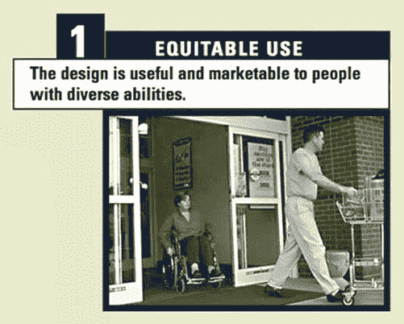

***图 9-1。**原则 1:合理使用*

以下是这一原则的指导方针:

*   1a .为所有用户提供相同的使用方式:尽可能使其相同，否则等同使用。
*   1b .避免隔离或侮辱任何用户。
*   1c。所有用户都应该能够平等地获得隐私、安全和保障。
*   1d。让设计吸引所有用户。

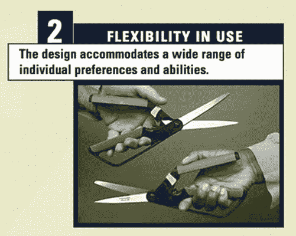

***图 9-2。**原则二:灵活使用*

以下是这一原则的指导方针:

*   2a .提供使用方法的选择。
*   2b。适应右手和左手的访问和使用。
*   2c。方便用户的准确度和精确度。
*   2d。提供对用户速度的适应性。

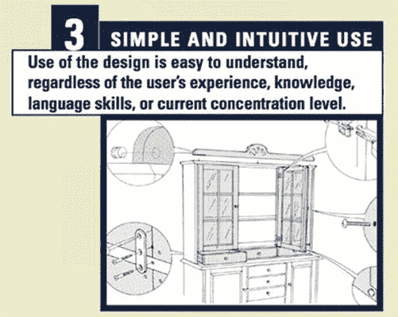

***图 9-3。**原则 3:使用简单直观*

以下是这一原则的指导方针:

*   3a .消除不必要的复杂性。
*   3b。与用户的期望和直觉保持一致。
*   3c。适应广泛的读写和语言技能。
*   3d。根据信息的重要性排列信息。
*   3e。在任务过程中和任务完成后提供有效的提示和反馈。

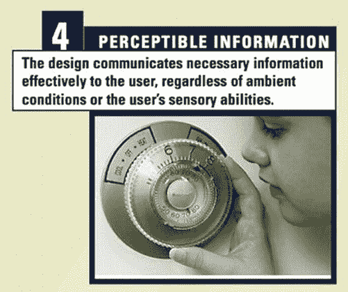

***图 9-4。**原则 4:感知信息*

以下是这一原则的指导方针:

*   4a .使用不同的模式(图像、语言、触觉)来重复呈现基本信息。
*   4b .在基本信息和周围环境之间提供足够的对比。
*   4c。最大限度地提高基本信息的可读性。
*   4d。以可描述的方式区分元素(即，使其易于给出指示或方向)。
*   4e。提供与感官受限者使用的各种技术或设备的兼容性。

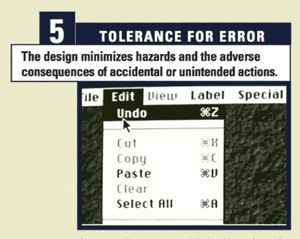

***图 9-5。**原则 5:对错误的容忍*

以下是这一原则的指导方针:

*   5a .安排元素以最小化危险和错误。可能的排列包括按最常用的元素或最易访问的元素排序；消除、隔离或屏蔽危险元素。
*   5b。提供危险和错误的警告。
*   5c。提供故障安全功能。
*   5d。在需要警惕的任务中阻止无意识的行动。

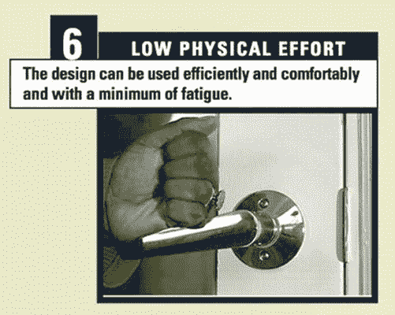

***图 9-6。**原则 6:低体力消耗*

以下是这一原则的指导方针:

*   6a .允许使用者保持中立体位。
*   6b。使用合理的操作力。
*   6c。尽量减少重复动作。
*   6d。尽量减少持续的体力劳动。

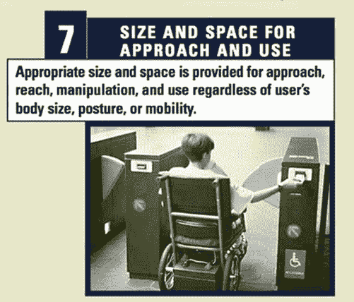

***图 9-7。**原则 7:接近和使用的尺寸和空间*

以下是这一原则的指导方针:

*   7a .为任何坐着或站着的用户提供对重要元素的清晰视线。
*   7b .让任何坐着或站着的用户都能舒适地触及所有部件。
*   7c .适应手和握把尺寸的变化。
*   7d。为使用辅助设备或个人协助提供足够的空间。

 **提示**html 5 规范确实声称支持“通用设计”你如何在你的项目中做到这一点？当你在构建一个 HTML5 界面的时候，当你已经完成了一个你满意的原型的时候，想想看。回到 UD 原则，看看你的网站是否遵守这些原则。这样做很有趣，也很有教育意义。

### 参与式设计

Jeffery Rubin(一位有影响力的可用性专家)将参与式设计概括为一种技术，其中设计团队本身可能有一个或多个最终用户。通过让设计者挖掘用户的知识、技能和情感反应，用户被放在了过程的中心。

在实践中，你可能并不总是有足够的资源(无论是财力还是时间)来做这件事，但是如果你足够幸运地在一家财力雄厚的公司工作，探索这个选项可能是值得的。然而，Rubin 警告说，用户可能会被这个过程“消耗”,因为紧密合作的团队可能会陷入某种泡沫——错误地认为一旦团队中的每个人都可以愉快地使用或理解系统，就可以进入黄金时代了！

### 焦点小组研究

焦点小组研究的目的是在开发过程的早期阶段评估项目的基本概念。它可以用来识别和确认用户的特征，也可以用来验证产品的预期效果。它通常涉及多个参与者。

要探索的概念可以以多种形式呈现给小组，例如纸笔绘图、故事板、PowerPoint 演示、3D 原型和模型等等。这个想法是为了确定这些概念对小组参与者的可接受程度，以及如何改进它们。

焦点小组当然是非常有用的，也是一种很有价值的方式来弄清楚用户想从项目中得到什么。这也是一种有效的方法，可以对 UI 组件进行快速原型测试，或者获得对 HTML5 设计的线框或其他方面的反馈。

### 调查

调查通常用于了解用户对现有产品或潜在产品的偏好。与焦点小组相比，调查在某些方面是一种更为肤浅的数据收集方式，但它尤其有助于了解更多人的观点。它们可以在任何时候使用，但通常是在产品开发周期的开始使用。

彻底的调查设计非常重要，必须在调查设计中进行大量的思考，以确保问题清晰明确，从而充分利用返回的数据。对你来说，做调查可能不太实际，但作为一种从最终用户那里获取信息的方法，这是值得一提的。如果你在大学校园或有内部网的大型组织中工作，调查是你可以在内部做的事情。

### 认知预排

认知演练是一种评估用户界面设计的常用技术，特别关注界面支持*探索性学习*的程度——即，在没有正式培训的情况下首次成功使用。这种评估可以由系统设计者在设计的早期阶段执行，例如，在用户测试可能之前。

早期版本的预演方法依赖于在纸质或电子表格上回答一系列详细的问题。这些可以采取“纸笔评估”的形式，这是一种了解用户对用户界面某些属性的偏好的有用方式，例如菜单或其他控件的组织和布局。

纸笔评估是你界面的字面意思，非常有用，因为设计者可以很快找到关键信息。它们也不贵，并且允许你在任何开发工作开始之前获得一些关于用户界面有多直观的真实反馈。这种技术可以根据需要经常使用，并且可以与原型软件(如 Serena Prototype Composer 或 Axure)结合使用，或者代替它们。

### 专家评估

*专家评估*指的是请一位与项目关系不大的可用性专家来评估其可用性。专家应用可用性原则来评估系统的质量和任何潜在的问题。这种类型的评估可以与系统的可访问性审计一起执行，以查看残疾人使用辅助技术(AT)的可用性。

### 专家可访问性审计

一个*可访问性审计*测试一个网站或应用是否存在技术上的可访问性问题，比如 WCAG 2.0。从一个独立的角度来看，这是一种非常有效的方式来判断系统的对错。它通常采用建议列表的形式，针对每个 WCAG 2.0 检查点列表。

然而，来自审计的反馈必须被积极地整合到项目中。只有当它作为*迭代*开发过程的一部分时，这种情况才会发生；如果建议是在最后加上的，那就没有效果。如果使用得当，可访问性审计是最有用的工具之一。然而，通常存在一种最低限度遵从的文化——一种“我们稍后会处理它，我们有审计”的态度，这使得实践变得空洞和无意义。

理想的途径是首先创建一个设计良好的网站，该网站结合了最佳实践，如果可能的话，使用用户的反馈——理想的做法是在项目的不同阶段，或*迭代*的开发过程中结合用户的反馈。当项目的一个阶段处于稳定状态时，它应该由第三方进行可访问性审计(这对客观性很重要)。在整合了测试结果之后，应该进行用户测试。

用户测试不只是锦上添花，它是成功或失败的严峻考验。

### 使用角色

在某些情况下，进行用户测试可能根本不可行。这就是使用人物角色有用的地方。一个*人物角色*是一个特定用户群的品质和属性的精华原型。这些属性是用户体验专家认为可能代表特定用户群(如盲人)的各种品质的模型。因此，他们在周围建立了一个角色。

人物角色使用旨在模拟这群用户使用网站的体验。如果各种人物角色是准确的，那么对他们体验的模拟也可能是准确的。人物角色可以用来证明应用设计的修改是合理的，基于人物角色的感知需求。

#### 构建人物角色

人物角色是从收集的关于目标群体的研究中创建的。这可以来自调查、采访等等。建立代表普通用户的人物角色是可能的。这些不同的组可以包括老年人、年轻人、盲人用户等等。好的人物角色来自从真实用户那里收集的真实反馈。

#### 使用人物角色有用吗？

尽管人物角色被广泛使用，但是很少有经验证据支持使用人物角色可以提高用户界面设计的质量。然而，在 Frontend(一家优秀的爱尔兰用户体验和界面设计公司)的 Frank Long 进行的一项非常有趣的实地研究中，调查了使用人物角色的有效性。这是一项为期五周的实验，参与者是都柏林国家艺术与设计学院的学生。结果表明，通过使用人物角色，产生了具有卓越可用性特征的设计。结果还表明，在设计过程的研究和概念化阶段，使用人物角色提供了一个显著的优势(支持以前没有根据的主张)。

该研究还调查了使用不同的展示方法来展示人物角色的效果，并得出结论，照片比插图效果更好，视觉故事板比纯文本版本更能有效地展示任务场景。

 **注**你可以在`[www.frontend.com/products-digital-devices/real-or-imaginary-the-effectiveness-of-using-personas-in-product-design.html](http://www.frontend.com/products-digital-devices/real-or-imaginary-the-effectiveness-of-using-personas-in-product-design.html)`阅读 Frank Long 的论文全文《真实还是想象:产品设计中使用人物角色的有效性》。

##### 衡量使用人物角色的有效性

龙的研究提供了客观的证据来支持库珀等人(他们的发明者)关于在产品设计过程中使用人物角色的关键主张。使用人物角色似乎加强了设计师对最终用户和用户的任务、目标和动机的关注。人物角色使最终用户的需求更加明确，因此可以引导设计团队的决策更加符合这些需求。这项研究还表明，使用人物角色可以改善团队之间的沟通，促进更有建设性的和以用户为中心的设计讨论。

然而，人物角色的使用并不总是得到赞许。查普曼和米尔汉姆的研究旨在批判性地评估人物角色的使用，他们对人物角色的使用是有效的这一说法表示了关注。他们认为人物角色实际上是有害的，会导致扭曲的和不正确的结论，因此他们是不可靠的。他们问，“这个角色代表了多少用户？”，“这个人物角色与一个群体相关吗？”“人物角色到底是不是一种有效的方法(以及如何验证这一点)？”7

这些都是合理的问题。龙还发现，使用人物角色的插图而不是照片似乎会降低有效性，并减少对插图人物角色的同理心。此外，故事板任务场景的使用比文本版本更有效，有助于更详细的设计解决方案。

Long 的结论是，在产品开发中使用人物角色为以用户为中心的设计提供了几个好处，比如增加了在产品规格阶段纳入以用户为中心的功能的可能性。他提供了一些客观的证据来证明使用人物角色确实有效。

### 实地研究

*现场研究*是一个术语，指的是在自然环境中测试产品或界面，这是最理想的。该设置可以是办公室、家庭或任何其他真实反映产品使用方式的环境。现场研究可能或不可能进行，当在产品周期的后期进行时，不应将其视为产品或界面重大问题的指标，而应将其视为一种改进的方法。

### 传统可用性测试

*传统的可用性测试*包括随机抽取公众样本或代表性用户样本进行测试，这些用户实际上会使用网络应用或网站。这种类型的测试试图评估用户体验的质量。测试的结果——例如用户是否能成功完成某个任务或一组任务，用户完成任务的易用性，以及测试期间的其他用户反馈和观察——都由测试主持人记录下来。这些记录下来的信息是有价值的，因为它让一个有经验的可用性分析人员能够详细了解在一个特定的用户界面设计中，什么对最终用户有用，什么没用。

尽管传统的可用性测试非常有用，但它通常只能捕获一小部分问题。它并不详尽，但是在测试过程中任何困难都会立即显现出来。一个有经验的可用性专家确切地了解设计或实现是如何导致这些问题的，以及如何解决这些问题。

### 残疾人用户测试

虽然对没有残疾的人进行用户测试通常会产生许多肯定可以改善用户体验的积极结果，但这些用户通常有更多的标准要求，可能不需要或不使用 at。

因此，让残疾人参与用户测试通常是详细了解界面、应用或网站对使用 AT 的人的可用性的最佳方式。也有许多轻度到中度残疾的人不使用 AT，而是依赖他们的操作系统、浏览器和良好的键盘可访问性的可访问性设置。通过仔细研究残疾用户的体验，可以深入了解您的设计选择和决策如何影响用户体验。

_______________

7C . N . Chapman 和 r . P . Milham(2006)人物的新装:反对流行方法的方法学和实践论证，人类因素和人类工程学学会第 50 届年会论文集，第 634-636 页。在线提供:`[`cnchapman.files.wordpress.com/2007/03/chapman-milham-personas-hfes2006-0139-0330.pdf`](http://cnchapman.files.wordpress.com/2007/03/chapman-milham-personas-hfes2006-0139-0330.pdf)`

如果你迭代地进行用户测试*——也就是说，让残疾人参与到项目的整个开发和设计周期中——你就能形成一个更加全面的用户体验图，并在早期做出有效的设计决策。*

 *#### 正式与非正式用户测试

正式的可用性分析和用户测试让人想起穿着白大褂的严肃科学家在单向玻璃观察屏幕后面做笔记的画面——而测试参与者通过对讲系统或反馈继电器传达命令和任务。当然，这些指令必须以不带任何情感暗示或人性外表的声音给出，以避免测试中的偏见。这些图像，虽然很明显是漫画式的，但却是许多人在听到“观察”、“测试”和“分析”这些词时所想到的。然而，这是一个相当过时的观点，与用户测试领域当前的趋势和习惯不一致。

正式的用户测试与*科学方法*密切相关。尽管这种方法在某些领域肯定是有效的，但这不是我们在这里所关心的。形式方法与统计分析和控制实验相关联。就对你的 HTML5 项目进行路测而言，我们在这里关心的是更真实的方法*非正式用户测试*。在这种情况下，测试通常必须快速完成，作为迭代开发周期的一部分(最好的情况下),最坏的情况下，作为项目结束时验证的附加部分。

更非正式的用户测试是有一个*测试脚本*和一系列事先概述的任务。测试主持人也可能有一种多年来建立起来的关系，在这种关系中，测试主持人和参与者一起做了许多许多测试。

#### 测量用户测试输出

用户测试有一定的输出。这些信息是多种多样的，可以是测试主持人积累的笔记、测试过程中收集的用于以后分析的视频片段、未参与测试的观察者的集体印象等等。一些输出更加有形，例如可以存档并在以后观看的视频。有些不太明显，但仍然非常有价值，比如用户测试可以给观察者留下持久的印象，当他们看到有人使用他们的网站时。

然而，这些不太有形的印象和主观体验可以产生非常真实的输出。如果项目经理看到用户对某个产品界面的实时负面反应，那么产品可能会被丢弃，软件迭代周期可能会被放弃，等等。反过来，当用户说，“是的，这个网站很棒”时，设计师的设计努力和对细节的关注就会开花结果。我可以很容易地找到我需要的信息。我喜欢页面的设计方式。”当被观察的人有残疾时，这种体验会更加深刻。

可用性专家不是通过观察普通的用户体验测试来获得有趣的信息的。用户测试分析真正有趣的方面发生在极端的情况下——包括正面的和负面的。在这里，积极和消极的经历都被放大并变得非常明显，所以通常不会有歧义。这种语言通常不那么中性，因此用户对特定用户界面或应用的印象和感受是毋庸置疑的。

#### 用户测试是如何工作的？

图 9-8 是一个用户测试设施的例子(我在 NCBI 包容性技术中心工作的那个)。该图显示了房间和设备的布局。

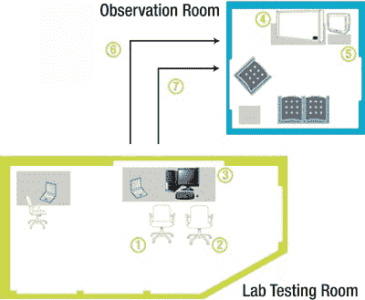

***图 9-8。**作者的实验室*

##### 用户环境

用户测试参与者(1)坐在受声音控制的测试室内的典型办公室环境中。测试主持人(2)与用户坐在一起，解释任务，做笔记，并严格观察用户的交互。使用带有辅助硬件和软件的标准 PC (3)进行测试。专用的用户测试记录软件，如 Morae，以及不显眼的摄像头和麦克风，捕捉和记录用户测试会话的每个方面，供以后分析。

##### 观察环境

观察者可以在观察室舒适的沙发上实时观看测试。来自用户监视器(6)的视频显示在平板电视(4)上，而来自摄像机和麦克风(7)的第二信号在电视监视器(5)上显示用户的手势、面部表情、身体语言和发声。

通过这些链接，观察者可以看到用户做的和说的一切，以及用户和主持人之间的交互。

##### 测试详情

典型的用户测试由八个独立的用户会话组成，每个会话持续一至一个半小时。测试的使用类型涵盖了广泛的残疾和辅助技术。它还允许我们将年轻和年长的用户与具有不同经验水平的人包括在内。这使得态度和方法的样本更具代表性。图 9-9 显示一名参与者在中心。

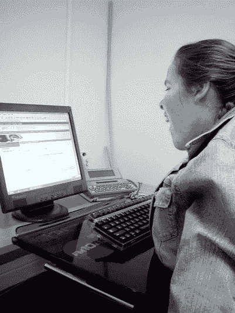

***图 9-9。**NCBI 包容性技术可用性实验室中心的用户测试参与者*

每个用户执行一组与客户事先商定的实际任务。

这些任务通常包括使用该产品的最常见的任务，以及最关键的任务和测试主持人可能预料会给用户带来问题的任何任务。测试是精心设计和运行的，以产生尽可能真实的用户行为。图 9-10 显示了一名辅导员和一名用户在测试实验室中。

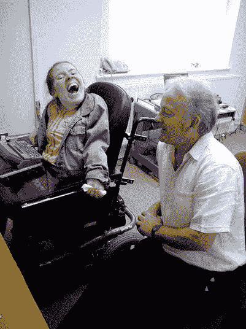

***图 9-10。**NCBI 包容性技术中心实验室的用户测试主持人和参与者*

##### 用户测试的基本要素

鲁宾为更多的非正式测试概述了基本方法和标准要素 8 :

*   开发问题陈述或测试目标，而不是假设。
*   使用有代表性的最终用户样本，这可能是随机选择的，也可能不是随机选择的。
*   使用工作环境的代表。
*   观察最终用户(有代表性的产品)。

____________________

可用性测试手册:如何计划、设计和实现有效的测试(威利技术交流图书馆)

*   由测试监督人(主持人)对参与者进行受控的询问和探查。
*   收集定量和定性的绩效和偏好指标。
*   对产品的设计提出改进建议。

前面的几点形成了用户测试核心方面的概要。当我进行一项测试时，我会先与客户交谈，并询问他或她希望我关注的网站核心区域是什么。请记住，您的客户将比您更熟悉这个系统(当然，除非是您构建的！).然后，我根据这些反馈和我自己对网站的测试起草了一个测试脚本，我事先做了这些来识别任何可能的问题区域。然后，我招募患有不同类型残疾的用户，如弱视、失明、行动受限或认知/感官残疾。我还试图混合测试参与者的年龄范围，因为这能给出更好的结果。

 **注意**尽管拥有尽可能多样化的团队很好，但也不要试图做得太多。拥有一个给出良好反馈的更小的团队并进行多次迭代测试是很好的。可用性等实际问题往往是一个大问题，后勤工作可能会很尴尬，因为人们承诺参加，然后退出等等。你只要跟着它走就行了！

当执行测试时，最初我非常清楚不要引导用户，并试图对整个事情非常科学。然而，我很快意识到这并不总是必要或明智的。我不得不面对这样一个事实，整个测试都是人为的和做作的——试图让它不是这样的，或者以某种科学的名义忽视现实情况，在我看来是相当浅薄和没有意义的。当你承认测试是人为的，你让自己和测试参与者都放松下来，你可能会发现你喜欢这个过程。在我看来，这是健康的，可以产生更好的数据。

“为什么？”你可能会问。首先，测试参与者在放松时可能更倾向于诚实。此外，他们会更倾向于冒险和尝试新事物，如果他们紧张，他们可能不会尝试。其中的原因很有趣，我花了很长时间才意识到:用户测试参与者通常希望取悦测试主持人，不希望被视为不能做某事。在对残疾人进行测试时更是如此——他们可能非常害羞，所以你需要意识到这一点，并清楚地解释说*他们*没有被测试。如果一个人不能执行某项任务，他们可能会觉得自己有问题，这个问题很可能是一个连史蒂夫·霍金都无法理解的可访问性和可用性问题！所以试着放松，甚至玩得开心。值得。如果你对同样的人做更多的测试，你会和他们建立融洽的关系，了解他们的互动模式。如果你放心，那将是对他们的一大帮助。

##### 观察用户测试

观察用户测试，如图 9-11 所示，是获得易访问性和可用性真正含义的第一手理解的最好方法之一。尤其是设计师和开发者，他们可以从观察用户所获得的洞察力中获得巨大的收益。

有些设施有专门的观察室，就像我们的一样。使用宽屏电视和小型视频监视器，客户可以通过远程链接观看和收听用户测试，而不会干扰用户的工作。

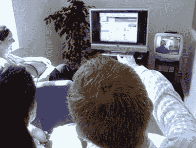

***图 9-11。**在 NCBI 包容性技术中心观察室观察用户测试*

用户会话的数字视频记录通常用于在测试后回顾会话，并说明关键问题。重点是建立对网站设计如何造成用户困难的理解，以及可以采取什么实际步骤来缓解这些问题。

#### 用户测试的目标和好处

用户测试将在几个方面帮助您的 HTML5 项目。其中一个主要目标是，它将帮助您识别您的站点用户可能存在的问题，并在您上线之前为您提供修复这些问题的机会。

需要记住的一些问题如下:

*   你的网站既容易学习又容易使用吗？
*   用起来满意吗？
*   网站会因为提供用户需要的功能而被用户重视吗？

以下是用户测试的一些好处:

*   用户测试你的项目并记录结果会给你以后的网站版本一个参考点。
*   如果从一开始就是一个高质量的项目，那么花费在支持/维护网站上的时间就会减少。因此，从长远来看，你从用户那里获得反馈的努力是值得的。
*   一个更好的网站会带来更多的销售或更多的使用，以及更少的投诉。
*   一个更好的网站会让你比你的竞争对手更有优势。

 **注意**有趣的是，在过去的几年里，随着互联网变得越来越普及，消费者获得了更多的选择，对可用性专家服务的需求有了很大的增长。当用户体验的质量决定了你的网站用户将会购买什么和他们将会使用什么服务时，可用性就有了用武之地。

#### 测试的局限性

尽管用户测试无疑是有用的，并且是以用户为中心的设计开发周期的重要部分，但是测试也有一些你应该知道的缺点:

*   **用户测试是人为的环境:**无论你如何分割，用户测试和观察人们使用产品或服务都是人为的。您所看到的只是真实用法的摹本，用户通常不会像在自己的环境中那样行事。观察事物的行为会改变它。
*   **用户测试结果可能并不能真正证明你的 HTML5 网站真的有效:**要做*统计显著性*测试，你必须做很多。我们掌握的大部分资源都不允许我们这样做。此外，最终用户可能经常会忽略您的站点中非常明显的错误(如果您构建了站点或者是一个有经验的测试服务商)，甚至是在较大的测试样本中。
*   **你的用户测试参与者通常并不真正代表你的目标受众:**即使你非常小心地选择合适的人，测试结果也可能从一开始就有偏差，因为你可能有太多更高级的用户或太多只有基本数字素养的用户。找到正确的平衡通常非常困难。同样，要做更能代表更广泛受众的测试，你需要招募比大多数开发人员实际做的更多的人。
*   用户测试总是最好的技术吗？这是一个重要的问题。例如，可用性评估形式的专家评估可能是您的项目的最佳方法。首先可能需要专业知识来使用系统，所以在这种情况下，用新手用户进行测试并不理想。

##### 数字素养

一个反复出现的问题是，一个人对他使用的 at 以及一般的网络和技术的流利程度。在测试过程的早期，如果你没有经验，你可能会看到用户有问题，并认为这是用户界面或网站设计的错误。但是是吗？你需要确定。这就是使用一个有经验的测试主持人的好处——特别是，使用一个深刻理解 AT 如何工作的人。周围没有很多，但如果你能找到他们，他们值得一起工作。这是因为在理解和分析您的测试结果时，这样的专家为您的项目带来的知识是非常宝贵的。你必须记住，你需要根据这些结果做出设计决策。

### 那么，对我来说，评估我的 HTML5 项目的最好方法是什么呢？

正如您从我们所介绍的内容中所看到的，有各种各样的用户评估方法可供使用。即使对于可用性专家来说，也很难真正了解最适合任何给定项目的用户评估方法——用户测试、焦点小组、原型或其他方法。以下是一些主要问题:

*   **评价者效应。**这是指不同的测试主持人或评估者对相同的数据集得出不同的结果。
*   在应用可用性评估技术时缺乏科学的严谨性。这大大削弱了在用户测试或其他可用性评估方法中收集的大量用户数据的可靠性。
*   普遍缺乏可用于比较评估方法的适当标准或指标。

简而言之，没有“放之四海而皆准”的方法，所以您必须根据您从测试中需要的东西和您拥有的资源来处理您的项目。随着时间的推移，它会变得更容易，随着经验的积累，你会学会忽略什么，注意什么。

#### 迭代设计流程

可用性圈子里也有很多关于*响应*或迭代设计过程的重要性。(你可能已经注意到这一章中提到了这一点。然而，在实践中，对于如何实现这一目标，人们往往很少达成一致。

 **注意**迭代设计过程的本质是在构建的每个阶段尽可能早地包含用户的参与。如果你将项目分成三个阶段——比如初始阶段、原型阶段和最终阶段，理想情况下，每个阶段的可用性测试结果都会反馈到每个连续的阶段。这导致网站的核心是来自用户的真实反馈。

### 可用性是新的经济学吗？

有一个老笑话，如果你问四个经济学家同一个问题，你会得到五个答案。在某种程度上，它在可用性领域是相似的。即使是最有经验的专业人士，看着同样的数据，也常常会对什么是关键问题做出截然不同的分析。经常有这样的情况，他们很少遇到类似的问题。

然而，这并不是说本章讨论的以用户为中心的设计过程没有用。是的，但这不是一门精确的科学。如果你想冒险开始使用这些方法，我强烈建议你去尝试。你会犯错误，但是相信你的直觉，从错误中学习。建立人性化的技术来帮助人们做他们想做的，或者实际上需要在线做的事情是非常值得和令人满意的。

注意我在这一章给出的许多建议都是基于我自己多年来做用户测试的经验，并且受到了像唐纳德·诺曼，特别是杰弗瑞·鲁宾等人的影响。我强烈推荐鲁宾的书*可用性测试手册:如何计划、设计和进行有效的测试*作为进一步的阅读。

### 结论

本章介绍了许多以用户为中心的设计过程和方法。你应该随意挑选适合你特殊需要和环境的东西。没有“一刀切”的方法。然而，我强烈建议您开始尝试尽可能地将它们合并到您的 HTML5 项目中。

对我来说，最具讽刺意味的事情之一是，作为一个多年来一直在对涉及残疾人的网站和应用进行用户测试的人，让开发人员会见和观察残疾人使用他们的系统这一简单的行为往往非常强大。开发者通常会有一个顿悟。意识到所有关于可访问性、可用性和各种指南的应用都不是空洞或深奥的练习。你我做出的好的和(事实上)坏的编码和设计决策会对人们的生活产生影响，这种影响可能是我们最初没有能力感知的。*