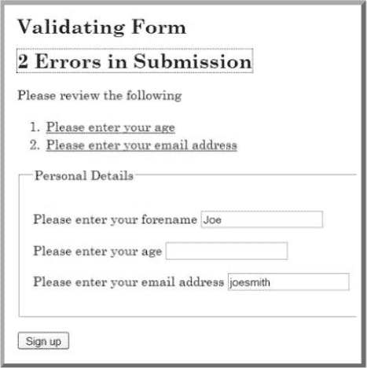

# 十一、附录 A：WCAG 2.0 客户端脚本技术

*   SCR1:允许用户延长默认时间限制
*   SCR2:使用冗余键盘和鼠标事件处理程序
*   SCR14:使用脚本使不重要的警报可选
*   SCR16:提供一个脚本，警告用户时间限制即将到期
*   SCR18:提供客户端验证和警报
*   SCR19:在 select 元素上使用 onchange 事件而不导致上下文的更改
*   SCR20:使用键盘和其他设备特定的功能
*   SCR21:使用文档对象模型(DOM)的函数向页面添加内容
*   SCR22:使用脚本控制闪烁，并在 5 秒或更短时间内停止闪烁
*   SCR24:使用渐进式增强应用户请求打开新窗口
*   SCR26:将动态内容插入到文档对象模型中，紧跟在其触发元素之后
*   SCR27:使用文档对象模型重新排序页面部分
*   SCR28:使用可展开和可折叠的菜单绕过内容块
*   SCR29:向静态 HTML 元素添加键盘可访问的操作
*   SCR30:使用脚本更改链接文本
*   SCR31:使用脚本更改具有焦点的元素的背景色或边框

__________

1 版权所有 2008-2011 W3C(麻省理工学院、ERCIM、Keio)，保留所有权利。W3C 责任、商标和文档使用规则适用。

*   SCR32:提供客户端验证并通过 DOM 添加错误文本
*   SCR33:使用脚本滚动内容，并提供暂停它的机制
*   SCR34:以随文本大小缩放的方式计算大小和位置
*   SCR35:通过使用锚和按钮的 onclick 事件使操作键盘可访问
*   SCR36:提供一种机制，允许用户在静态窗口或区域中显示移动、滚动或自动更新的文本
*   SCR37:以独立于设备的方式创建自定义对话框

### SCR1:允许用户延长默认时限

#### 描述

这种技术的目的是当脚本提供具有默认时间限制的功能时，通过提供一种延长时间的机制来允许用户延长默认时间限制。为了允许用户请求更长的时间限制，脚本可以提供一个表单(例如),允许用户输入更长的时间限制或指示需要更多的时间。如果用户被警告时间限制即将到期(参见“SCR16:提供一个警告用户时间限制即将到期的脚本”)，可以在警告对话框中使用该表单。用户可以将时间限制延长到默认时间限制的至少 10 倍，方法是在表单中输入一个值来指示需要多长时间，或者重复延长时间限制。

#### 例子

网页包含当前的股票市场统计数据，并设置为定期刷新。当在第一次刷新之前警告用户时，向用户提供延长刷新之间的时间段的选项。

在在线国际象棋游戏中，每个玩家都有完成每一步棋的时间限制。当玩家被警告该移动的时间快到了时，用户可以选择增加时间限制。

### SCR2:使用冗余的键盘和鼠标事件处理程序

#### 描述

这项技术的目的是演示如何使用与设备无关的事件来改变装饰图像，以响应鼠标或焦点事件。当鼠标移动到页面上某个元素的顶部或远离该元素时，使用`onmouseover`和`onmouseout`事件来更改装饰图像。此外，当元素获得和失去焦点时，使用`onfocus`和`onblur`事件来改变图像。

清单 A-1 中的示例在锚元素前有一个装饰图像。当用户将鼠标放在锚点标签上时，锚点前面的装饰图像会发生变化。当鼠标离开锚点时，图像会变回其原始版本。当用户将键盘焦点放在锚元素上时，也会出现同样的图像变化效果。当接收到焦点时，图像改变；当失去焦点时，图像会变回原样。这是通过将`onmouseover`、、`onmouseout`、`onfocus`和`onblur`事件处理程序附加到锚元素来实现的。事件处理程序是一个名为`updateImage()`的 JavaScript 函数，它改变图像的`src`属性。响应`onmouseover`、`onmouseout`、`onfocus`和`onblur`事件调用`updateImage()`。

每个图像都有一个唯一的 Id。这个惟一的 ID 和一个布尔值一起被传递给`updateImage()`，该布尔值指示要使用哪个图像:`updateImage(imgId, isOver);`。当鼠标在锚元素上或者它有焦点时，`true`的布尔值被传递。当鼠标离开锚元素或失去焦点时，会传递一个`false`值。`updateImage()`函数使用`image id`加载图像，然后根据布尔值更改`src`属性。注意，由于图像是用于装饰目的，所以它有一个空的`alt`属性。

 **注意**最好使用大小相似的图像，并在图像元素上指定高度和宽度属性。这将防止在更新图像时对页面布局进行任何更改。此示例使用大小相同的图像。

***列举 A-1。**交换图像*

`<!DOCTYPE HTML PUBLIC "-//W3C//DTD HTML 4.01 Transitional//EN" "http://www.w3.org/TR/html4/loose.dtd">
 <html lang="en">
 <head>
 <meta http-equiv="Content-Type" content="text/html; charset=ISO-8859-1">
 <title>Changing Image Source in a Device Independent Manner</title>
 
 </head>
 <body>
 
Mouse over or tab to the links below and see the image change.
` ` <a href="http://www.w3.org/wai" onmouseover="updateImage('wai', true);"
 onfocus="updateImage('wai', true);"
   onmouseout="updateImage('wai',false);" onblur="updateImage('wai',false);">
 
   W3C Web Accessibility Initiative</a> &
 <a href="http://www.w3.org/International/" onmouseover="updateImage('i18n', true);"
   onfocus="updateImage('i18n',true);" onmouseout="updateImage('i18n',false);"
   onblur="updateImage('i18n',false);">
   
   W3C Internationalization</a>
 </body>
 </html>`

#### 测试

##### 程序

1.  加载网页，并使用鼠标和键盘测试事件。
2.  检查加载网页时标准图像是否按预期显示。

##### 使用鼠标

1.  将鼠标移动到包含事件处理程序的元素上(在本例中，它是一个锚元素)。检查图像是否变为预期的图像。
2.  将鼠标从元素上移开。检查图像是否变回标准图像。

##### 使用键盘

1.  使用键盘将焦点设置到包含事件处理程序的元素。检查图像是否变为预期的图像。
2.  使用键盘将焦点从元素上移开(通常通过将焦点移动到另一个元素上)。检查图像是否变为标准图像。
3.  验证图像更改时页面上其他元素的布局不受影响。

#### 预期结果

前面检查的所有步骤都是正确的。

如果这是一项足以满足成功标准的技术，测试程序的失败并不一定意味着在其他方面没有满足成功标准，而只是说明这项技术没有成功实现，不能用于声称符合标准。

### SCR16:提供一个脚本，警告用户时间限制即将到期

#### 举例

一个股票市场报价页面使用一个脚本每五分钟刷新一次页面，以确保最新的统计数据仍然可用。在五分钟时间到期前 20 秒，会出现一个确认对话框，询问用户在页面刷新前是否需要更多时间。这允许用户知道即将到来的刷新，并在需要时避免刷新。清单 A-2 创建了所描述的行为。

***清单 A-2。**使用脚本刷新页面*

`<!DOCTYPE html PUBLIC "-//W3C//DTD HTML 4.01 Transitional//EN"
   "http://www.w3.org/TR/html4/loose.dtd">
<html lang="en">
<head>
<title>Stock Market Quotes</title>

</head>
<body>
<h1>Stock Market Quotes</h1>
...etc...` `</body>
</html>`

### SCR21:使用文档对象模型(DOM)的函数向页面添加内容

#### 描述

该技术的目标是演示如何使用文档对象模型(DOM)的函数向页面添加内容，而不是使用`document.write`或`object.innerHTML`。当使用正确的 MIME 类型(application/xhtml+xml)时，`document.write()`方法不支持 XHTML，并且`innerHTML`属性不是 DOM 规范的一部分，因此应该避免使用。

如果使用 DOM 函数添加内容，用户代理可以访问 DOM 来检索内容。`createElement()`函数可以用来在 DOM 中创建元素。`createTextNode()`用于创建与元素相关的文本。`appendChild()`、`removeChild()`、`insertBefore()`、`replaceChild()`功能用于添加和删除元素和节点。其他 DOM 函数用于为创建的元素分配属性。

 **注意**当向文档中添加将获得焦点的元素时，不要添加`tabindex`属性来显式设置 tab 键顺序，因为这在向文档中间添加可聚焦元素时会导致问题。通过不显式设置一个`tabindex`属性，让默认的 tab 键顺序被分配给新元素。

#### 举例

这个例子演示了使用客户端脚本来验证一个表单。如果发现错误，将显示相应的错误消息。该示例使用 DOM 函数添加错误通知，包括一个标题、一个解释错误发生的简短段落和一个有序列表中的错误列表。标题的内容被写成一个链接，这样就可以使用`focus`方法来引起用户对错误的注意。列表中的每一项都被编写为一个链接，当跟随该链接时，会将焦点错误地放在表单域上。

为了简单起见，这个例子只验证了两个文本字段，但是它可以很容易地扩展成一个通用的表单处理程序。客户端验证不应该是唯一的验证方式，应该与服务器端验证一起使用。客户端验证的好处是，您可以向用户提供即时反馈，使他们不必等待服务器返回错误，并且它有助于减少不必要的服务器流量。

下面是将事件处理程序添加到表单的脚本。如果启用了脚本，在表单提交给服务器之前，将调用`validateNumbers()`函数来执行客户端验证。如果没有启用脚本，表单将被立即提交到服务器，因此验证也应该在服务器上实现。

***清单 A-3。**向表单添加事件处理程序*

`window.onload = initialise;
function initialise()
{
  // Ensure we're working with a relatively standards compliant user agent
  if (!document.getElementById || !document.createElement || !document.createTextNode)
    return;

  // Add an event handler for the number form
  var objForm = document.getElementById('numberform');
  objForm.onsubmit= function(){return validateNumbers(this);};
}`

这是验证函数。注意使用`createElement()`、`createTextNode()`和`appendChild()` DOM 函数来创建错误消息元素。

***列举 A-4。**表单验证*

`function validateNumbers(objForm)
{
  // Test whether fields are valid
  var bFirst = isNumber(document.getElementById('num1').value);
  var bSecond = isNumber(document.getElementById('num2').value);
  // If not valid, display errors
  if (!bFirst || !bSecond)
  {
    var objExisting = document.getElementById('validationerrors');
    var objNew = document.createElement('div');
    var objTitle = document.createElement('h2');
    var objParagraph = document.createElement('p');
    var objList = document.createElement('ol');
    var objAnchor = document.createElement('a');
    var strID = 'firsterror';
    var strError;
    // The heading element will contain a link so that screen readers
    // can use it to place focus - the destination for the link is
    // the first error contained in a list
    objAnchor.appendChild(document.createTextNode('Errors in Submission'));
    objAnchor.setAttribute('href', '#firsterror');
    objTitle.appendChild(objAnchor);
    objParagraph.appendChild(document.createTextNode('Please review the following'));
    objNew.setAttribute('id', 'validationerrors');
    objNew.appendChild(objTitle);
    objNew.appendChild(objParagraph);
    // Add each error found to the list of errors
    if (!bFirst)
    {
      strError = 'Please provide a numeric value for the first number';
      objList.appendChild(addError(strError, '#num1', objForm, strID));
      strID = '';` `    }
    if (!bSecond)
    {
      strError = 'Please provide a numeric value for the second number';
      objList.appendChild(addError(strError, '#num2', objForm, strID));
      strID = '';
    }
    // Add the list to the error information
    objNew.appendChild(objList);
    // If there were existing errors, replace them with the new lot,
    // otherwise add the new errors to the start of the form
    if (objExisting)
      objExisting.parentNode.replaceChild(objNew, objExisting);
    else
    {
      var objPosition = objForm.firstChild;
      objForm.insertBefore(objNew, objPosition);
    }
    // Place focus on the anchor in the heading to alert
    // screen readers that the submission is in error
    objAnchor.focus();
    // Do not submit the form
    objForm.submitAllowed = false;
    return false;
  }
  return true;
}

// Function to validate a number
function isNumber(strValue)
{
  return (!isNaN(strValue) && strValue.replace(/^\s+|\s+$/, '') !== '');
}`

清单 A-5 详细说明了用于创建错误消息并将焦点设置到相关表单字段的助手函数。

***清单 A-5。**助手功能*

`// Function to create a list item containing a link describing the error
// that points to the appropriate form field
function addError(strError, strFragment, objForm, strID)
{
  var objAnchor = document.createElement('a');
  var objListItem = document.createElement('li');
  objAnchor.appendChild(document.createTextNode(strError));
  objAnchor.setAttribute('href', strFragment);
  objAnchor.onclick = function(event){return focusFormField(this, event, objForm);};
  objAnchor.onkeypress = function(event){return focusFormField(this, event, objForm);};
  // If strID has a value, this is the first error in the list
  if (strID.length > 0)
    objAnchor.setAttribute('id', strID);` `  objListItem.appendChild(objAnchor);
  return objListItem;
}

// Function to place focus to the form field in error
function focusFormField(objAnchor, objEvent, objForm)
{
  // Allow keyboard navigation over links
  if (objEvent && objEvent.type == 'keypress')
    if (objEvent.keyCode != 13 && objEvent.keyCode != 32)
      return true;
  // set focus to the form control
  var strFormField = objAnchor.href.match(/[^#]\w*$/);
  objForm[strFormField].focus();
  return false;
}`

清单 A-6 显示了示例表单的 HTML。

***清单 A-6。**样表*

`<!DOCTYPE HTML PUBLIC "-//W3C//DTD HTML 4.01//EN" "http://www.w3.org/TR/html4/strict.dtd">
<html>
<head>
        <title>ECMAScript Form Validation</title>
        <meta http-equiv="Content-Type" content="text/html; charset=utf-8">
        
</head>
<body>
<h1>Form Validation</h1>
<form id="numberform" method="post" action="form.php">
<fieldset>
<legend>Numeric Fields</legend>

<label for="num1">Enter first number</label>
<input type="text" size="20" name="num1" id="num1">

<label for="num2">Enter second number</label>
<input type="text" size="20" name="num2" id="num2">

</fieldset>

<input type="submit" name="submit" value="Submit Form">

</form>
</body>
</html>`

这个例子仅限于客户端脚本，应该用服务器端验证来备份。该示例仅限于在客户端脚本可用时创建错误消息。

表格的工作版本可在`[www.w3.org/TR/WCAG20-TECHS/working-examples/SCR21/ex1.html](http://www.w3.org/TR/WCAG20-TECHS/working-examples/SCR21/ex1.html)`找到。

### SCR24:根据用户请求使用渐进式增强打开新窗口

#### 描述

这种技术的目的是避免用户没有请求的新窗口的出现所引起的混乱。突然打开新窗口会使用户迷失方向，或者被一些用户完全错过。如果文档类型不允许使用`target`属性(它在 HTML 4.01 Strict 或 XHTML 1.0 Strict 中不存在)，或者如果开发人员不想使用它，可以用 ECMAScript 打开新窗口。下面的示例演示了如何用脚本打开新窗口:它向一个链接(`a`元素)添加一个事件处理程序，并警告用户内容将在一个新窗口中打开。

#### 举例

##### 利润

脚本包含在文档头中，链接有一个 ID，可以被脚本用作钩子，如中列出的 A-7 所示。

***清单 A-7** 。打开新窗口*

`
…
<a href="help.html" id="newwin">Show Help</a

// Use traditional event model whilst support for event registration
// amongst browsers is poor.
window.onload = addHandlers;

function addHandlers()
{
  var objAnchor = document.getElementById('newwin');

  if (objAnchor)
  {
    objAnchor.firstChild.data = objAnchor.firstChild.data + ' (opens in a new window)';
    objAnchor.onclick = function(event){return launchWindow(this, event);}
    // UAAG requires that user agents handle events in a device-independent manner
    // but only some browsers do this, so add keyboard event to be sure
    objAnchor.onkeypress = function(event){return launchWindow(this, event);}
  }
}` `function launchWindow(objAnchor, objEvent)
{
  var iKeyCode, bSuccess=false;

  // If the event is from a keyboard, we only want to open the
  // new window if the user requested the link (return or space)
  if (objEvent && objEvent.type == 'keypress')
  {
    if (objEvent.keyCode)
      iKeyCode = objEvent.keyCode;
    else if (objEvent.which)
      iKeyCode = objEvent.which;

    // If not carriage return or space, return true so that the user agent
    // continues to process the action
    if (iKeyCode != 13 && iKeyCode != 32)
      return true;
  }

  bSuccess = window.open(objAnchor.href);

  // If the window did not open, allow the browser to continue the default
  // action of opening in the same window
  if (!bSuccess)
    return true;

  // The window was opened, so stop the browser processing further
  return false;
}`

### SCR26:将动态内容插入到文档对象模型中，紧跟在其触发元素之后

#### 描述

这种技术的目的是将插入的用户界面元素放入文档对象模型中，通过用户代理的默认行为正确设置 tab 键顺序和屏幕阅读器的阅读顺序。这种技术可以用于任何隐藏和显示的用户界面元素，比如菜单和对话框。

屏幕阅读器中的阅读顺序基于 DOM 中 HTML 或 XHTML 元素的顺序，默认的 tab 键顺序也是如此。这种技术在 DOM 中插入新内容，紧跟在被激活以触发脚本的元素之后。触发元素必须是链接或按钮，脚本必须从其`onclick`事件中调用。这些元素本身是可聚焦的，它们的`onclick`事件与设备无关。焦点保持在激活的元素上，插入到它后面的新内容成为 tab 键顺序和屏幕阅读器阅读顺序中的下一个内容。

注意，这种技术适用于同步更新。对于异步更新(有时称为 AJAX)，需要一种额外的技术来通知辅助技术已经插入了异步内容。

#### 举例

本示例在单击链接时创建一个菜单，并将其插入到链接之后。链接的`onclick`事件用于调用 ShowHide 脚本，将新菜单的 ID 作为参数传入，如下面的代码片段所示:

`<a href="#" onclick="ShowHide('foo',this)">Toggle</a>`

ShowHide 脚本创建一个包含新菜单的`div`,并在其中插入一个链接。最后一行是剧本的核心。它找到触发脚本的元素的父元素，并将它创建的`div`作为新子元素添加到该元素中。这导致新的`div`出现在链接之后的 DOM 中。当用户按下 Tab 键时，焦点将转到菜单中第一个可聚焦的项目，也就是我们创建的链接。(参见清单 A-8 。)

***清单 A-8。**使用 ShowHide*

`function ShowHide(id,src)
{
        var el = document.getElementById(id);
        if (!el)
        {
                el = document.createElement("div");
                el.id = id;
                var link = document.createElement("a");
                link.href = "javascript:void(0)";
                link.appendChild(document.createTextNode("Content"));
                el.appendChild(link);
                src.parentElement.appendChild(el);
        }
        else
        {
                el.style.display = ('none' == el.style.display ? 'block' : 'none');
        }
}`

级联样式表用于使`div`和链接看起来像一个菜单。

#### 测试:程序

1.  查找页面中触发非弹出窗口对话框的所有区域。
2.  检查对话框是否由按钮或链接的 click 事件触发。
3.  使用允许您检查脚本生成的 DOM 的工具，检查对话框是否在 DOM 中的下一个位置。

#### 预期结果

#2 和#3 是正确的。

如果这对于成功标准来说是一项充分的技术，那么测试程序的失败并不一定意味着在其他方面没有满足成功标准，而仅仅意味着这项技术没有被成功地实现，不能用于声称符合性。

### SCR28:使用可展开和可折叠的菜单绕过内容块

#### 描述

这种技术允许用户跳过重复的材料，方法是将材料放在一个菜单中，该菜单可以在用户控制下展开或折叠。用户可以通过折叠菜单跳过重复的材料。用户调用用户界面控件来隐藏或移除菜单的元素。

 **注**类似的方法可以通过使用服务器端脚本和重新加载网页的修改版本来实现。

#### 例 1

网页顶部的导航链接都是使用 HTML、CSS 和 JavaScript 实现的菜单中的条目。当导航栏展开时，导航链接可供用户使用。当导航栏折叠时，链接不可用。清单 A-9 中的代码详细说明了这一功能。

***清单 A-9。**可扩展菜单*

`  

...

  <a href="#" onclick="toggle('navbar')">Toggle Navigation Bar</a>

  <ul id="navbar">
  <li><a href="http://target1.html">Link 1</a></li>
  <li><a href="http://target2.html">Link 2</a></li>
  <li><a href="http://target3.html">Link 3</a></li>
  <li><a href="http://target4.html">Link 4</a></li>
  </ul>`

此代码的一个工作示例可在`[www.w3.org/TR/WCAG20-TECHS/working-examples/SCR28/toggle-navbar.html](http://www.w3.org/TR/WCAG20-TECHS/working-examples/SCR28/toggle-navbar.html)`获得。

#### 例 2

一组网页的目录在每个网页的开头附近重复出现。目录开头的按钮允许用户在页面上删除或恢复目录。

***列举 A-10。**目录*

`   

  ...

  <button onclick="return toggle('toc');">Toggle Table of Contents</button>
  

    ...
  
`

这里可以找到这个代码的一个工作示例:`[www.w3.org/TR/WCAG20-TECHS/working-examples/SCR28/toggle-toc.html](http://www.w3.org/TR/WCAG20-TECHS/working-examples/SCR28/toggle-toc.html)`。

### SCR32:提供客户端验证并通过 DOM 添加错误文本

#### 描述

这种技术的目的是演示当表单域的客户端验证失败时错误消息的显示。锚元素用于在列表中显示错误消息，并被插入到要验证的字段上方。在错误消息中使用锚元素，以便将焦点放在错误消息上，引起用户的注意。锚元素的`href`包含一个页面内链接，该链接引用了发现错误的字段。

在已部署的应用中，如果关闭 JavaScript，客户端验证将不会发生。因此，只有在依赖脚本来实现一致性的情况下，或者在使用服务器端验证技术来捕捉任何错误并返回包含错误字段信息的页面时，这种技术才足够。

#### 举例

此示例验证必填字段以及需要特定格式的字段。当识别出一个错误时，脚本将一个错误消息列表插入到 DOM 中，并将焦点移到它们上面，如图图 A-1 所示。

***图 A-1。**可访问的验证样本表格*

#### HTML 和 JavaScript 代码

示例表单的 HTML 出现在清单 A-11 的中。

***清单 A-11。**用于客户端验证的 HTML】*

`<!DOCTYPE HTML PUBLIC "-//W3C//DTD HTML 4.01//EN" "http://www.w3.org/TR/html4/strict.dtd">
<html>
    <head>
        <title>Form Validation</title>
        <meta http-equiv="Content-Type" content="text/html; charset=utf-8"/>
        <link href="css/validate.css" rel="stylesheet" type="text/css"/>
        
<a href="dostuff.htm" onclick="return doStuff();">do stuff</a>`

此代码的一个工作示例可在`[www.w3.org/TR/WCAG20-TECHS/working-examples/SCR35/jslink.html](http://www.w3.org/TR/WCAG20-TECHS/working-examples/SCR35/jslink.html)`获得。

#### 例 2

清单 A-14 为没有脚本的用户创建一个运行脚本并返回表单帖子的按钮。当且仅当表单帖子提供与脚本相同的功能时，不依赖脚本的站点才可以使用这种方法。`onsubmit="return false;"`阻止表单提交。

***清单 A-14。**创建一个按钮来运行一个脚本，表单发布作为后备*

`
<form action="doStuff.aspx" onsubmit="return false;">
 <input type="submit" value="Do Stuff" onclick="doStuff();" />
</form>`

下面是这段代码的一个工作示例:`[www.w3.org/TR/WCAG20-TECHS/working-examples/SCR35/jsbutton.html](http://www.w3.org/TR/WCAG20-TECHS/working-examples/SCR35/jsbutton.html)`。

### SCR37:以独立于设备的方式创建定制的 aialogs

#### 描述

站点设计者通常希望创建不使用浏览器提供的弹出窗口的对话框。这通常是通过将对话框内容放在一个`div`中，并使用 CSS 中的 z 顺序和绝对定位将`div`放置在页面内容上方来实现的。

为了便于访问，这些对话框必须遵循一些简单的规则。

*   从链接或按钮的`onclick`事件触发启动对话框的脚本。
*   将对话框`div`放在文档对象模型(DOM)中触发它的元素之后。触发元素将保持焦点，在该元素之后插入对话框内容将使对话框中的内容成为屏幕阅读器阅读顺序和 tab 键顺序的下一个。在视觉上，对话框仍然可以完全定位在页面上的其他位置。这可以通过在 HTML 中创建对话框并用 CSS 隐藏它来实现，如下例所示，也可以通过用脚本将它直接插入到触发元素之后来实现。
*   确保对话框`div`中的 HTML 与其他内容一样满足相同的可访问性标准。
*   让启动链接切换对话框的打开和关闭，并在键盘焦点离开时关闭对话框，这也很好，但并不总是必要的。

#### 举例

这个例子的 HTML 包括一个触发元素——在这个例子中是一个按钮——和一个作为对话框框架的`div`。

触发元素是一个按钮，脚本从`onclick`事件触发。这将向操作系统发送适当的事件，以便辅助技术知道 DOM 中的变化。

在这个例子中，对话框中的提交和重置按钮只是隐藏了`div`。

***清单 A-15。**打开对话框的选项按钮*

`...
<button onclick="TogglePopup(event,true)"
        name="pop0001">Options</button>

  <h3>Edit Sort Information</h3>
  <form action="default.htm" onsubmit="this.parentNode.style.display='none'; return false;"
 onreset="this.parentNode.style.display='none'; return false;">
    <fieldset>
      <legend>Sort Order</legend>
      <input type="radio" name="order" id="order_alpha" /><label
#160;for="order_alpha">Alphabetical</label>
      <input type="radio" name="order" id="order_default" checked="true" /><label
 for="order_default">Default</label>
    </fieldset>

  <input type="submit" value="OK" />
  <input type="reset" value="Cancel" />

</form>

...`

`div`、`heading`和`form`元素用 CSS 样式化，看起来像一个对话框，如清单 A-16 中的所示。

***清单 A-16。**造型形式元素*

`...
a { color:blue; }
a.clickPopup img { border:none; width:0; }

div.popover { position:absolute; display:none; border:1px outset; background-color:beige;
 font-size:80%; background-color:#eeeeee; color:black; }
div.popover h3 { margin:0; padding:0.1em 0.5em; background-color:navy; color:white; }
#pop0001 { width:20em; }
#pop0001 form { margin:0; padding:0.5em; }
#pop0001 fieldset { margin-bottom:0.3em; padding-bottom:0.5em; }
#pop0001 input, #pop0001 label { vertical-align:middle; }
#pop0001 div.buttons { text-align:right; }
#pop0001 div.buttons input { width:6em; }
...`

该脚本切换弹出窗口`div`的显示，显示和隐藏。参见清单 A-17 。

***清单 A-17。**显示弹出窗口*

`...
function TogglePopup(evt,show)` `{
        HarmonizeEvent(evt);
        var src = evt.target;
        if ("click" == evt.type)
        {
                evt.returnValue = false;
        }
        var popID = src.getAttribute("name");
        if (popID)
        {
                var popup = document.getElementById(popID);
                if (popup)
                {
                        if (true == show)
                        {
                                popup.style.display = "block";
                        }
                        else if (false == show)
                        {
                                popup.style.display = "none";
                        }
                        else
                        {
                                popup.style.display = "block" == popup.style.display ?
 "none" : "block";
                        }
                        if ("block" == popup.style.display)
                        {
                                //window.alert(document.documentElement.scrollHeight);
                                popup.style.top = ((document.documentElement.offsetHeight –
 popup.offsetHeight) / 2 ) + 'px';
                                popup.style.left = ((document.documentElement.offsetWidth –
 popup.offsetWidth) / 2) + 'px';
                        }
                }
        }
}

function SubmitForm(elem)
{
        elem.parentNode.style.display='none';
        return false;
}

function ResetForm(elem)
{
        elem.parentNode.style.display='none';
        return false;
}
...`

这里有一个工作示例:`[www.w3.org/TR/WCAG20-TECHS/working-examples/SCR37/default.htm](http://www.w3.org/TR/WCAG20-TECHS/working-examples/SCR37/default.htm)`，它是一个打开对话框的选项按钮。

如前所述，这里提供了完整的技术列表:`[www.w3.org/TR/WCAG20-TECHS/client-side-script.html](http://www.w3.org/TR/WCAG20-TECHS/client-side-script.html)`。